# 第八章：GraphFrames - 使用 PySpark 进行图论

在本章中，我们将介绍如何使用 Apache Spark 的 GraphFrames。您将学习以下内容：

+   关于 Apache Spark 的图论和 GraphFrames 的快速入门

+   安装 GraphFrames

+   准备数据

+   构建图

+   针对图运行查询

+   理解图

+   使用 PageRank 确定机场排名

+   寻找最少的连接数

+   可视化您的图

# 介绍

图形使解决某些数据问题更加容易和直观。图的核心概念是边、节点（或顶点）及其属性。例如，以下是两个看似不相关的图。左边的图代表一个社交网络和朋友之间的关系（图的*边*），而右边的图代表餐厅推荐。请注意，我们的餐厅推荐的顶点不仅是餐厅本身，还包括美食类型（例如拉面）和位置（例如加拿大卑诗省温哥华）；这些是顶点的属性。将节点分配给几乎任何东西，并使用边来定义这些节点之间的关系的能力是图的最大优点，即它们的灵活性：

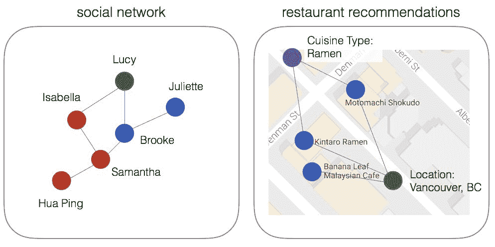

这种灵活性使我们能够在概念上将这两个看似不相关的图连接成一个共同的图。在这种情况下，我们可以将社交网络与餐厅推荐连接起来，其中朋友和餐厅之间的边（即连接）是通过他们的评分进行的：

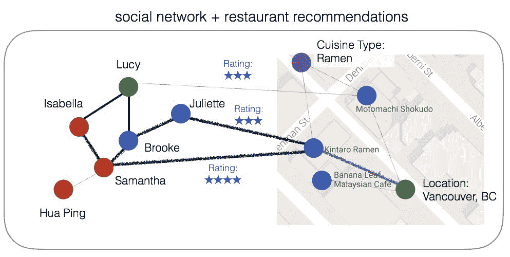

例如，如果 Isabella 想要在温哥华找到一家很棒的拉面餐厅（顶点：美食类型），然后遍历她朋友的评价（边：评分），她很可能会选择 Kintaro Ramen（顶点：餐厅），因为 Samantha（顶点：朋友）和 Juliette（顶点：朋友）都对这家餐厅给出了好评。

虽然图形直观且灵活，但图形的一个关键问题是其遍历和计算图形算法通常需要大量资源且速度缓慢。使用 Apache Spark 的 GraphFrames，您可以利用 Apache Spark DataFrames 的速度和性能来分布式遍历和计算图形。

# 安装 GraphFrames

GraphFrames 的核心是两个 Spark DataFrames：一个用于顶点，另一个用于边。GraphFrames 可以被认为是 Spark 的 GraphX 库的下一代，相对于后者有一些重大改进：

+   GraphFrames 利用了 DataFrame API 的性能优化和简单性。

+   通过使用 DataFrame API，GraphFrames 可以通过 Python、Java 和 Scala API 进行交互。相比之下，GraphX 只能通过 Scala 接口使用。

您可以在[`graphframes.github.io/`](https://graphframes.github.io/)的 GraphFrames 概述中找到 GraphFrames 的最新信息。

# 准备就绪

我们需要一个可用的 Spark 安装。这意味着您需要按照第一章中概述的步骤进行操作，即*安装和配置 Spark*。作为提醒，要启动本地 Spark 集群的 PySpark shell，您可以运行以下命令：

```py
./bin/pyspark --master local[n]
```

其中`n`是核心数。

# 如何做...

如果您正在从 Spark CLI（例如`spark-shell`、`pyspark`、`spark-sql`或`spark-submit`）运行作业，您可以使用`--packages`命令，该命令将为您提取、编译和执行必要的代码，以便您使用 GraphFrames 包。

例如，要在 Spark 2.1 和 Scala 2.11 与`spark-shell`一起使用最新的 GraphFrames 包（在撰写本书时为版本 0.5），命令是：

```py
$SPARK_HOME/bin/pyspark --packages graphframes:graphframes:0.5.0-spark2.3-s_2.11
```

然而，为了在 Spark 2.3 中使用 GraphFrames，您需要从源代码构建包。

查看此处概述的步骤：[`github.com/graphframes/graphframes/issues/267`](https://github.com/graphframes/graphframes/issues/267)。

如果您使用类似 Databricks 的服务，您将需要创建一个包含 GraphFrames 的库。有关更多信息，请参阅 Databricks 中如何创建库的信息，以及如何安装 GraphFrames Spark 包。

# 它是如何工作的...

您可以通过在 GraphFrames GitHub 存储库上构建来安装 GraphFrames 等包，但更简单的方法是使用可在[`spark-packages.org/package/graphframes/graphframes`](https://spark-packages.org/package/graphframes/graphframes)找到的 GraphFrames Spark 包。Spark Packages 是一个包含 Apache Spark 第三方包索引的存储库。通过使用 Spark 包，PySpark 将下载 GraphFrames Spark 包的最新版本，编译它，然后在您的 Spark 作业上下文中执行它。

当您使用以下命令包含 GraphFrames 包时，请注意`graphframes`控制台输出，表示该包正在从`spark-packages`存储库中拉取进行编译：

```py
$ ./bin/pyspark --master local --packages graphframes:graphframes:0.5.0-spark2.1-s_2.11
...
graphframes#graphframes added as a dependency
:: resolving dependencies :: org.apache.spark#spark-submit-parent;1.0
  confs: [default]
  found graphframes#graphframes;0.5.0-spark2.1-s_2.11 in spark-packages
  found com.typesafe.scala-logging#scala-logging-api_2.11;2.1.2 in central
  found com.typesafe.scala-logging#scala-logging-slf4j_2.11;2.1.2 in central
  found org.scala-lang#scala-reflect;2.11.0 in central
  found org.slf4j#slf4j-api;1.7.7 in central
downloading http://dl.bintray.com/spark-packages/maven/graphframes/graphframes/0.5.0-spark2.1-s_2.11/graphframes-0.5.0-spark2.1-s_2.11.jar ...
  [SUCCESSFUL ] graphframes#graphframes;0.5.0-spark2.1-s_2.11!graphframes.jar (600ms)
:: resolution report :: resolve 1503ms :: artifacts dl 608ms
  :: modules in use:
  com.typesafe.scala-logging#scala-logging-api_2.11;2.1.2 from central in [default]
  com.typesafe.scala-logging#scala-logging-slf4j_2.11;2.1.2 from central in [default]
  graphframes#graphframes;0.5.0-spark2.1-s_2.11 from spark-packages in [default]
  org.scala-lang#scala-reflect;2.11.0 from central in [default]
  org.slf4j#slf4j-api;1.7.7 from central in [default]
  ---------------------------------------------------------------------
  | | modules || artifacts |
  | conf | number| search|dwnlded|evicted|| number|dwnlded|
```

```py

  ---------------------------------------------------------------------
  | default | 5 | 1 | 1 | 0 || 5 | 1 |
  ---------------------------------------------------------------------
:: retrieving :: org.apache.spark#spark-submit-parent
  confs: [default]
  1 artifacts copied, 4 already retrieved (323kB/9ms)
```

# 准备数据

我们在烹饪书中将使用的示例场景是准点飞行表现数据（即，航班场景），它将使用两组数据：

+   航空公司准点表现和航班延误原因可在[`bit.ly/2ccJPPM`](http://bit.ly/2ccJPPM)找到。这些数据集包含有关航班计划和实际起飞和到达时间以及延误原因的信息。数据由美国航空公司报告，并由交通统计局航空公司信息办公室收集。

+   OpenFlights，机场和航空公司数据可在[`openflights.org/data.html`](http://openflights.org/data.html)找到。该数据集包含美国机场数据列表，包括 IATA 代码、机场名称和机场位置。

我们将创建两个数据框：一个用于机场，一个用于航班。`airports`数据框将构成我们的顶点，而`flights`数据框将表示我们的 GraphFrame 的所有边。

# 准备工作

如果您正在本地运行此程序，请将链接的文件复制到本地文件夹；为了这个示例，我们将称位置为`/data`：

+   航空公司准点表现和延误原因在[`bit.ly/2xs0XLH`](http://bit.ly/2xs0XLH)

+   OpenFlights-机场和航空公司数据在[`bit.ly/2J1CU7D`](http://bit.ly/2J1CU7D)

如果您使用 Databricks，数据已经加载到`/databricks-datasets`文件夹中；文件的位置可以在`/databricks-datasets/flights/airport-codes-na.txt`和`/databricks-datasets/flights/departuredelays.csv`中找到，分别用于机场和航班数据。

# 如何做...

为了准备我们的图数据，我们将首先清理数据，并仅包括存在于可用航班数据中的机场代码。也就是说，我们排除任何在`DepartureDelays.csv`数据集中不存在的机场。接下来的步骤执行以下操作：

1.  设置文件路径为您下载的文件

1.  通过读取 CSV 文件并推断架构，配置了标题，创建了`apts`和`deptDelays`数据框

1.  `iata`仅包含存在于`deptDelays`数据框中的机场代码（`IATA`列）。

1.  将`iata`和`apts`数据框连接起来，创建`apts_df`数据框

我们过滤数据以创建`airports` DataFrame 的原因是，当我们在下面的示例中创建我们的 GraphFrame 时，我们将只有图的边缘的顶点：

```py
# Set File Paths
delays_fp = "/data/departuredelays.csv"
apts_fp = "/data/airport-codes-na.txt"

# Obtain airports dataset
apts = spark.read.csv(apts_fp, header='true', inferSchema='true', sep='\t')
apts.createOrReplaceTempView("apts")

# Obtain departure Delays data
deptsDelays = spark.read.csv(delays_fp, header='true', inferSchema='true')
deptsDelays.createOrReplaceTempView("deptsDelays")
deptsDelays.cache()

# Available IATA codes from the departuredelays sample dataset
iata = spark.sql("""
    select distinct iata 
    from (
        select distinct origin as iata 
        from deptsDelays 

        union all 
        select distinct destination as iata 
        from deptsDelays
    ) as a
""")
iata.createOrReplaceTempView("iata")
```

```py

# Only include airports with atleast one trip from the departureDelays dataset
airports = sqlContext.sql("""
    select f.IATA
        , f.City
        , f.State
        , f.Country 
    from apts as f 
    join iata as t 
        on t.IATA = f.IATA
""")
airports.registerTempTable("airports")
airports.cache()
```

# 它是如何工作的...

用于此代码片段的两个关键概念是：

+   `spark.read.csv`：这个`SparkSession`方法返回一个`DataFrameReader`对象，它包含了从文件系统读取 CSV 文件的类和函数

+   `spark.sql`：这允许我们执行 Spark SQL 语句

有关更多信息，请参考 Spark DataFrames 的前几章，或者参考`pyspark.sql`模块的 PySpark 主文档，网址为[`spark.apache.org/docs/2.3.0/api/python/pyspark.sql.html`](http://spark.apache.org/docs/2.3.0/api/python/pyspark.sql.html)。

# 还有更多...

在将数据读入我们的 GraphFrame 之前，让我们再创建一个 DataFrame：

```py
import pyspark.sql.functions as f
import pyspark.sql.types as t

@f.udf
def toDate(weirdDate):
    year = '2014-'
    month = weirdDate[0:2] + '-'
    day = weirdDate[2:4] + ' '
    hour = weirdDate[4:6] + ':'
    minute = weirdDate[6:8] + ':00'
```

```py

    return year + month + day + hour + minute 

deptsDelays = deptsDelays.withColumn('normalDate', toDate(deptsDelays.date))
deptsDelays.createOrReplaceTempView("deptsDelays")

# Get key attributes of a flight
deptsDelays_GEO = spark.sql("""
    select cast(f.date as int) as tripid
        , cast(f.normalDate as timestamp) as `localdate`
        , cast(f.delay as int)
        , cast(f.distance as int)
        , f.origin as src
        , f.destination as dst
        , o.city as city_src
        , d.city as city_dst
        , o.state as state_src
        , d.state as state_dst 
    from deptsDelays as f 
    join airports as o 
        on o.iata = f.origin 
    join airports as d 
        on d.iata = f.destination
""") 

# Create Temp View
deptsDelays_GEO.createOrReplaceTempView("deptsDelays_GEO")

# Cache and Count
deptsDelays_GEO.cache()
deptsDelays_GEO.count()
deptsDelays_GEO DataFrame:
```

+   它创建了一个`tripid`列，允许我们唯一标识每次旅行。请注意，这有点像是一个黑客行为，因为我们已经将日期（数据集中每次旅行都有一个唯一日期）转换为 int 列。

+   `date`列实际上并不是传统意义上的日期，因为它的格式是`MMYYHHmm`。因此，我们首先应用`udf`将其转换为正确的格式（`toDate(...)`方法）。然后将其转换为实际的时间戳格式。

+   将`delay`和`distance`列重新转换为整数值，而不是字符串。

+   在接下来的几节中，我们将使用机场代码（`iata`列）作为我们的顶点。为了为我们的图创建边缘，我们需要指定源（起始机场）和目的地（目的机场）的 IATA 代码。`join`语句和将`f.origin`重命名为`src`以及将`f.destination`重命名为`dst`是为了准备创建 GraphFrame 以指定边缘（它们明确寻找`src`和`dst`列）。

# 构建图

在前面的章节中，您安装了 GraphFrames 并构建了图所需的 DataFrame；现在，您可以开始构建图本身了。

# 如何做...

这个示例的第一个组件涉及到导入必要的库，这种情况下是 PySpark SQL 函数（`pyspark.sql.functions`）和 GraphFrames（`graphframes`）。在上一个示例中，我们已经创建了`deptsDelays_geo` DataFrame 的一部分，创建了`src`和`dst`列。在 GraphFrames 中创建边缘时，它专门寻找`src`和`dst`列来创建边缘，就像`edges`一样。同样，GraphFrames 正在寻找`id`列来表示图的顶点（以及连接到`src`和`dst`列）。因此，在创建顶点`vertices`时，我们将`IATA`列重命名为`id`：

```py
from pyspark.sql.functions import *
from graphframes import *

# Create Vertices (airports) and Edges (flights)
vertices = airports.withColumnRenamed("IATA", "id").distinct()
edges = deptsDelays_geo.select("tripid", "delay", "src", "dst", "city_dst", "state_dst")

# Cache Vertices and Edges
edges.cache()
vertices.cache()

# This GraphFrame builds up on the vertices and edges based on our trips (flights)
graph = GraphFrame(vertices, edges)
```

请注意，`edges`和`vertices`是包含图的边缘和顶点的 DataFrame。您可以通过查看数据来检查这一点，如下面的屏幕截图所示（在这种情况下，我们在 Databricks 中使用`display`命令）。

例如，命令`display(vertices)`显示`vertices` DataFrame 的`id`（IATA 代码）、`City`、`State`和`Country`列：

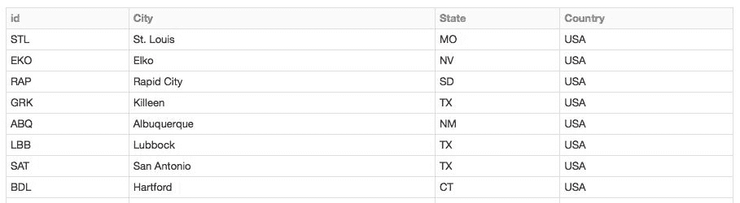

同时，命令`display(edges)`显示`edges` DataFrame 的`tripid`、`delay`、`src`、`dst`、`city_dst`和`state_dst`：

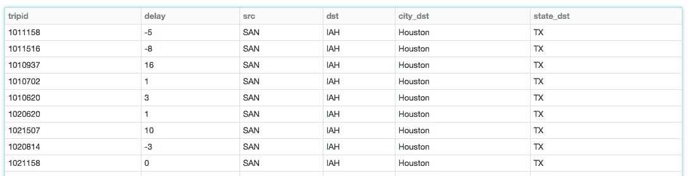

最后的语句`GraphFrame(vertices, edges)`执行将两个 DataFrame 合并到我们的 GraphFrame `graph`中的任务。

# 它是如何工作的...

如前一节所述，创建 GraphFrame 时，它专门寻找以下列：

+   `id`：这标识了顶点，并将连接到`src`和`dst`列。在我们的示例中，IATA 代码`LAX`（代表**洛杉矶机场**）是构成我们图的顶点之一。

+   `src`：我们图的边的源顶点；例如，从洛杉矶到纽约的航班的`src = LAX`。

+   `dst`: 我们图的边的目的地顶点；例如，从洛杉矶到纽约的航班的`dst = JFK`。

通过创建两个数据框（`vertices`和`edges`），其中属性遵循先前提到的命名约定，我们可以调用 GraphFrame 来创建我们的图，利用两个数据框的性能优化。

# 对图运行查询

现在您已经创建了图，可以开始对 GraphFrame 运行一些简单的查询。

# 准备工作

确保您已经从上一节的`vertices`和`edges`数据框中创建了`graph` GraphFrame。

# 如何操作...

让我们从一些简单的计数查询开始，以确定机场的数量（节点或顶点；记住吗？）和航班的数量（边），可以通过应用`count()`来确定。调用`count()`类似于数据框，只是您还需要包括您正在计数`vertices`还是`edges`：

```py
print "Airport count: %d" % graph.vertices.count()
print "Trips count: %d" % graph.edges.count()
```

这些查询的输出应该类似于以下输出，表示有 279 个顶点（即机场）和超过 130 万条边（即航班）：

```py
Output:
  Airports count: 279 
  Trips count: 1361141
```

与数据框类似，您也可以执行`filter`和`groupBy`子句，以更好地了解延误航班的数量。要了解准点或提前到达的航班数量，我们使用`delay <= 0`的过滤器；而延误航班则显示`delay > 0`：

```py
print "Early or on-time: %d" % graph.edges.filter("delay <= 0").count()
print "Delayed: %d" % graph.edges.filter("delay > 0").count()

# Output
Early or on-time: 780469
Delayed: 580672
```

进一步深入，您可以过滤出从旧金山出发的延误航班（`delay > 0`），并按目的地机场分组，按平均延误时间降序排序（`desc("avg(delay)")`）：

```py
display(
    graph
    .edges
    .filter("src = 'SFO' and delay > 0")
    .groupBy("src", "dst")
    .avg("delay")
    .sort(desc("avg(delay)"))
)
```

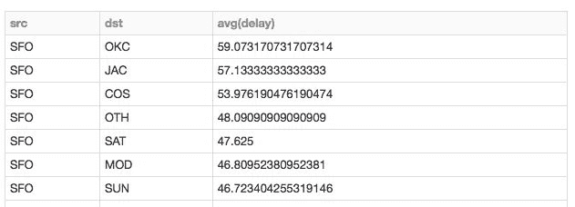

如果您正在使用 Databricks 笔记本，可以可视化 GraphFrame 查询。例如，我们可以使用以下查询确定从西雅图出发延误超过 100 分钟的航班的目的地州：

```py
# States with the longest cumulative delays (with individual delays > 100 minutes) 
# origin: Seattle
display(graph.edges.filter("src = 'SEA' and delay > 100"))
```

上述代码生成了以下地图。蓝色越深，航班延误越严重。从下图可以看出，大部分从西雅图出发的延误航班的目的地在加利福尼亚州内：

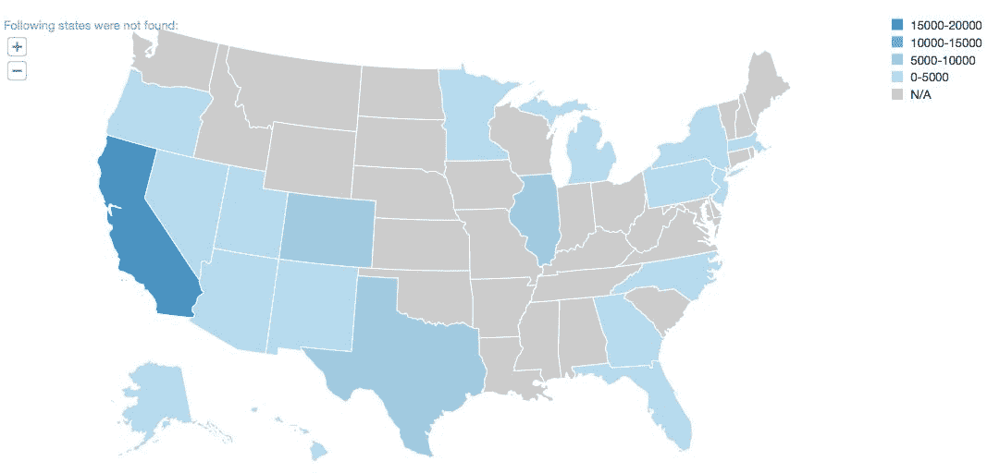

# 操作原理...

如前几节所述，GraphFrames 建立在两个数据框之上：一个用于顶点，一个用于边。这意味着 GraphFrames 利用了与数据框相同的性能优化（不像较旧的 GraphX）。同样重要的是，它们还继承了许多 Spark SQL 语法的组件。

# 理解图

为了更容易理解城市机场之间的复杂关系以及它们之间的航班，我们可以使用**motifs**的概念来查找由航班连接的机场的模式。结果是一个数据框，其中列名由 motif 键给出。

# 准备工作

为了更容易在 Motifs 的上下文中查看我们的数据，让我们首先创建一个名为`graphSmall`的`graph` GraphFrame 的较小版本：

```py
edgesSubset = deptsDelays_GEO.select("tripid", "delay", "src", "dst")
graphSmall = GraphFrame(vertices, edgesSubset)
```

# 如何操作...

要执行 Motif，执行以下命令：

```py
motifs = (
    graphSmall
    .find("(a)-[ab]->(b); (b)-[bc]->(c)")
    .filter("""
        (b.id = 'SFO') 
        and (ab.delay > 500 or bc.delay > 500) 
        and bc.tripid > ab.tripid 
        and bc.tripid < ab.tripid + 10000
    """)
)
display(motifs)
```

此查询的结果如下：

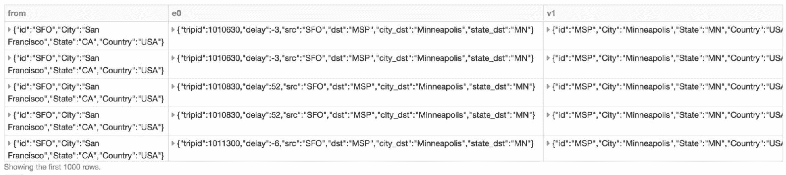

Motif 查询的输出

# 操作原理...

这个例子的查询有很多内容，让我们从查询本身开始。查询的第一部分是建立我们的 Motif，即建立我们要查找顶点`(a)`、`(b)`和`(c)`之间的关系。具体来说，我们关心的是两组顶点之间的边，即`(a)`和`(b)`之间的边，表示为`[ab]`，以及顶点`(b)`和`(c)`之间的边，表示为`[bc]`：

```py
graphSmall.find("(a)-[ab]->(b); (b)-[bc]->(c)")
```

例如，我们试图确定两个不同城市之间的所有航班，洛杉矶是中转城市（例如，西雅图 - 洛杉矶 -> 纽约，波特兰 - 洛杉矶 -> 亚特兰大，等等）：

+   `(b)`: 这代表了洛杉矶市

+   `(a)`: 这代表了起始城市，例如本例中的西雅图和波特兰

+   `[ab]`：这代表了航班，比如西雅图-洛杉矶和波特兰-洛杉矶在这个例子中

+   `(c)`：这代表了目的地城市，比如纽约和亚特兰大在这个例子中

+   `[bc]`：这代表了航班，比如洛杉矶->纽约和洛杉矶->亚特兰大在这个例子中

```py
b.id = 'SFO'). We're also specifying any trips (that is, graph edges) where the delay is greater than 500 minutes (ab.delay > 500 or bc.delay > 500). We have also specified that the second leg of the trip must occur after the first leg of the trip (bc.tripid > ab.tripid and bc.tripid < ab.tripid + 10000").
```

请注意，这个陈述是对航班的过度简化，因为它没有考虑哪些航班是有效的连接航班。还要记住，`tripid`是基于时间格式为`MMDDHHMM`转换为整数生成的：

```py
filter("(b.id = 'SFO') and (ab.delay > 500 or bc.delay > 500) and bc.tripid > ab.tripid and bc.tripid < ab.tripid + 10000")
```

前面小节中显示的输出表示了所有在旧金山中转并且航班延误超过 500 分钟的航班。进一步挖掘单个航班，让我们回顾第一行的输出，尽管我们已经对其进行了旋转以便更容易审查：

| **顶点** | **数值** |
| --- | --- |
| `[ab]` |

+   `tripid: 2021900`

+   `delay: 39`

+   `src: STL`

+   `dst: SFO`

|

| `(a)` |
| --- |

+   `id: STL`

+   `City: St. Louis`

+   `State: MO`

+   `Country: USA`

|

| `(b)` |
| --- |

+   `id: SFO`

+   `City: San Francisco`

+   `State: CA`

+   `Country: USA`

|

| `[bc]` |
| --- |

+   `tripid: 2030906`

+   `delay: 516`

+   `src: SFO`

+   `dst: PHL`

|

| `(c)` |
| --- |

+   `id: PHL`

+   `City: Philadelphia`

+   `State: PA`

+   `Country: USA`

|

如前所述，`[ab]`和`[bc]`是航班，而`[a]`、`[b]`和`[c]`是机场。在这个例子中，从圣路易斯（`STL`）到旧金山的航班延误了 39 分钟，但它潜在的连接航班到费城（`PHL`）延误了 516 分钟。当您深入研究结果时，您可以看到围绕旧金山作为主要中转站的起始和最终目的地城市之间的许多不同的潜在航班模式。随着您接管更大的枢纽城市，如亚特兰大、达拉斯和芝加哥，这个查询将变得更加复杂。

# 使用 PageRank 确定机场排名

PageRank 是由谷歌搜索引擎推广并由拉里·佩奇创建的算法。Ian Rogers 说（见[`www.cs.princeton.edu/~chazelle/courses/BIB/pagerank.htm`](http://www.cs.princeton.edu/~chazelle/courses/BIB/pagerank.htm)）：

“(...)PageRank 是所有其他网页对页面重要性的“投票”。对页面的链接算作支持的投票。如果没有链接，就没有支持（但这是对页面的投票而不是反对的弃权）。”

您可能会想象，这种方法不仅可以应用于排名网页，还可以应用于其他问题。在我们的情境中，我们可以用它来确定机场的排名。为了实现这一点，我们可以使用包括在这个出发延误数据集中的各种机场的航班数量和连接到各个机场的航班数量。

# 准备工作

确保您已经从前面的小节中创建了`graph` GraphFrame。

# 如何做...

执行以下代码片段，通过 PageRank 算法确定我们数据集中最重要的机场：

```py
# Determining Airport ranking of importance using `pageRank`
ranks = graph.pageRank(resetProbability=0.15, maxIter=5)
display(ranks.vertices.orderBy(ranks.vertices.pagerank.desc()).limit(20))
```

从以下图表的输出中可以看出，亚特兰大、达拉斯和芝加哥是最重要的三个城市（请注意，此数据集仅包含美国数据）：

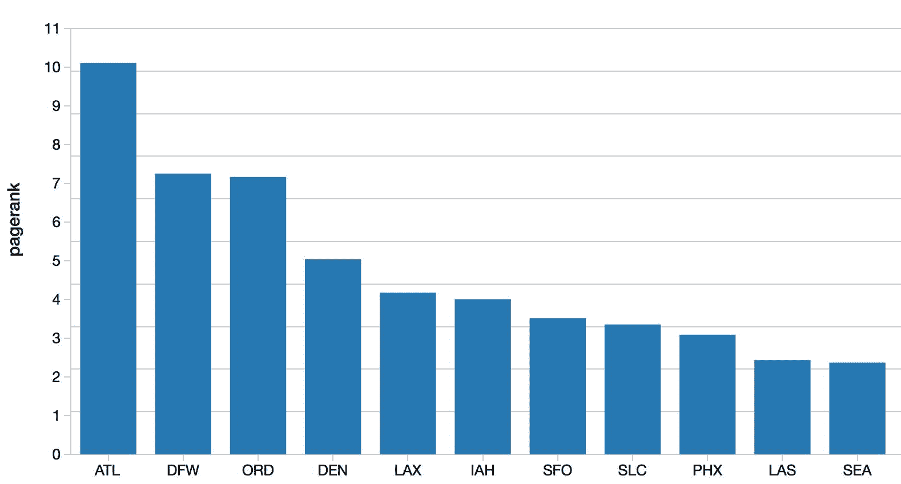

# 它是如何工作的...

在撰写本书时，GraphFrames 的当前版本是 v0.5，其中包含了 PageRank 的两种实现：

+   我们正在使用的版本利用了 GraphFrame 接口，并通过设置`maxIter`运行了固定次数的 PageRank。

+   另一个版本使用`org.apache.spark.graphx.Pregel`接口，并通过设置`tol`运行 PageRank 直到收敛。

有关更多信息，请参阅[`graphframes.github.io/api/scala/index.html#org.graphframes.lib.PageRank`](https://graphframes.github.io/api/scala/index.html#org.graphframes.lib.PageRank)上的 GraphFrames Scala 文档中的 PageRank。

如前所述，我们正在使用独立的 GraphFrame 版本的 PageRank，设置如下：

+   `resetProbability`：目前设置为默认值`0.15`，表示重置到随机顶点的概率。如果值太高，计算时间会更长，但如果值太低，计算可能会超出范围而无法收敛。

+   `maxIter`：对于此演示，我们将该值设置为`5`；数字越大，计算的精度越高。

# 寻找最少的连接

当您飞往许多城市时，一个经常出现的问题是确定两个城市之间的最短路径或最短旅行时间。从航空旅客的角度来看，目标是找到两个城市之间最短的航班组合。从航空公司的角度来看，确定如何尽可能高效地将乘客路由到各个城市，可以提高客户满意度并降低价格（燃料消耗、设备磨损、机组人员的便利等）。在 GraphFrames 和图算法的背景下，一个方法是使用**广度优先搜索**（**BFS**）算法来帮助我们找到这些机场之间的最短路径。

# 准备工作

确保您已经从前面的小节中创建了`graph` GraphFrame。

# 操作步骤...

让我们开始使用我们的 BFS 算法来确定`SFO`和`SEA`之间是否有直达航班：

```py
subsetOfPaths = graph.bfs(
   fromExpr = "id = 'SEA'",
   toExpr = "id = 'SFO'",
   maxPathLength = 1)

display(subsetOfPaths)
```

从输出中可以看出，西雅图（`SEA`）和旧金山（`SFO`）之间有许多直达航班：

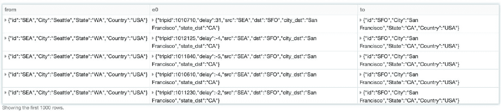

# 工作原理...

在调用 BFS 算法时，关键参数是`fromExpr`、`toExpr`和`maxPathLength`。由于我们的顶点包含了机场，为了了解从西雅图到旧金山的直达航班数量，我们将指定：

```py
fromExpr = "id = 'SEA'",
toExpr = "id = 'SFO'
```

`maxPathLength`是用来指定两个顶点之间的最大边数的参数。如果`maxPathLength = 1`，表示两个顶点之间只有一条边。也就是说，两个机场之间只有一次航班或者两个城市之间有一次直达航班。增加这个值意味着 BFS 将尝试找到两个城市之间的多个连接。例如，如果我们指定`maxPathLength = 2`，这意味着西雅图和旧金山之间有两条边或两次航班。这表示一个中转城市，例如，SEA - POR -> SFO，SEA - LAS -> SFO，SEA - DEN -> SFO 等。

# 还有更多...

如果您想要找到通常没有直达航班的两个城市之间的连接，该怎么办？例如，让我们找出旧金山和水牛城之间的可能航线：

```py
subsetOfPaths = graph.bfs(
   fromExpr = "id = 'SFO'",
   toExpr = "id = 'BUF'",
   maxPathLength = 1)

display(subsetOfPaths)

Output:
   OK
```

在这种情况下，`OK`表示旧金山和水牛城之间没有直达航班，因为我们无法检索到单个边缘（至少从这个数据集中）。但是，要找出是否有任何中转航班，只需更改`maxPathLength = 2`（表示一个中转城市）：

```py
subsetOfPaths = graph.bfs(
   fromExpr = "id = 'SFO'",
   toExpr = "id = 'BUF'",
   maxPathLength = 2)

display(subsetOfPaths)
```

如您所见，有许多带有一次中转的航班连接旧金山和水牛城：

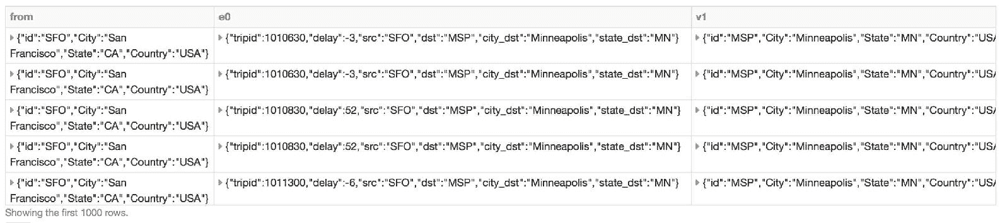

# 另请参阅

但是旧金山和水牛城之间最常见的中转城市是哪个？从前面的结果来看，似乎是明尼阿波利斯，但外表可能具有欺骗性。相反，运行以下查询：

```py
display(subsetOfPaths.groupBy("v1.id", "v1.City").count().orderBy(desc("count")).limit(10))
```

如下图所示，JFK 是这两个城市之间最常见的中转点：

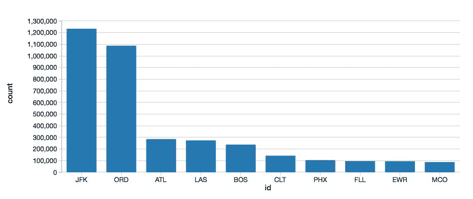

# 可视化图形

在前面的示例中，我们一直在使用 Databrick 笔记本的本地可视化功能来可视化我们的航班（例如，条形图、折线图、地图等）。但是我们还没有将我们的图形可视化为图形。在本节中，我们将利用 Mike Bostock 的 Airports D3.js 可视化工具（[`mbostock.github.io/d3/talk/20111116/airports.html`](https://mbostock.github.io/d3/talk/20111116/airports.html)）在我们的 Databricks 笔记本中进行可视化。

# 准备工作

确保您已经从前面的小节中创建了`graph` GraphFrame 和源`deptsDelays_GEO` DataFrame。

# 如何做...

我们将利用我们的 Python Databricks 笔记本，但我们将包括以下 Scala 单元。在这里的顶层，代码的流程如下：

```py
%scala
package d3a

import org.apache.spark.sql._
import com.databricks.backend.daemon.driver.EnhancedRDDFunctions.displayHTML

case class Edge(src: String, dest: String, count: Long)
case class Node(name: String)
case class Link(source: Int, target: Int, value: Long)
case class Graph(nodes: Seq[Node], links: Seq[Link])

object graphs {
val sqlContext = SQLContext.getOrCreate(org.apache.spark.SparkContext.getOrCreate())
import sqlContext.implicits._

def force(clicks: Dataset[Edge], height: Int = 100, width: Int = 960): Unit = {
  val data = clicks.collect()
  val nodes = (data.map(_.src) ++ data.map(_.dest)).map(_.replaceAll("_", " ")).toSet.toSeq.map(Node)
  val links = data.map { t =>
    Link(nodes.indexWhere(_.name == t.src.replaceAll("_", " ")), nodes.indexWhere(_.name == t.dest.replaceAll("_", " ")), t.count / 20 + 1)
  }
  showGraph(height, width, Seq(Graph(nodes, links)).toDF().toJSON.first())
}

/**
 * Displays a force directed graph using d3
 * input: {"nodes": [{"name": "..."}], "links": [{"source": 1, "target": 2, "value": 0}]}
 */
def showGraph(height: Int, width: Int, graph: String): Unit = {

displayHTML(s"""<!DOCTYPE html>
<html>
  <head>
    <link type="text/css" rel="stylesheet" href="https://mbostock.github.io/d3/talk/20111116/style.css"/>
    <style type="text/css">
      #states path {
        fill: #ccc;
        stroke: #fff;
      }

      path.arc {
        pointer-events: none;
        fill: none;
        stroke: #000;
        display: none;
      }

      path.cell {
        fill: none;
        pointer-events: all;
      }

      circle {
        fill: steelblue;
        fill-opacity: .8;
        stroke: #fff;
      }

      #cells.voronoi path.cell {
        stroke: brown;
      }

      #cells g:hover path.arc {
        display: inherit;
      }
    </style>
  </head>
  <body>
    <script src="img/d3.js"></script>
    <script src="img/d3.csv.js"></script>
    <script src="img/d3.geo.js"></script>
    <script src="img/d3.geom.js"></script>
    <script>
      var graph = $graph;
      var w = $width;
      var h = $height;

      var linksByOrigin = {};
      var countByAirport = {};
      var locationByAirport = {};
      var positions = [];

      var projection = d3.geo.azimuthal()
          .mode("equidistant")
          .origin([-98, 38])
          .scale(1400)
          .translate([640, 360]);

      var path = d3.geo.path()
          .projection(projection);

      var svg = d3.select("body")
          .insert("svg:svg", "h2")
          .attr("width", w)
          .attr("height", h);

      var states = svg.append("svg:g")
          .attr("id", "states");

      var circles = svg.append("svg:g")
          .attr("id", "circles");

      var cells = svg.append("svg:g")
          .attr("id", "cells");

      var arc = d3.geo.greatArc()
          .source(function(d) { return locationByAirport[d.source]; })
          .target(function(d) { return locationByAirport[d.target]; });

      d3.select("input[type=checkbox]").on("change", function() {
        cells.classed("voronoi", this.checked);
      });

      // Draw US map.
      d3.json("https://mbostock.github.io/d3/talk/20111116/us-states.json", function(collection) {
        states.selectAll("path")
          .data(collection.features)
          .enter().append("svg:path")
          .attr("d", path);
      });

      // Parse links
      graph.links.forEach(function(link) {
        var origin = graph.nodes[link.source].name;
        var destination = graph.nodes[link.target].name;

        var links = linksByOrigin[origin] || (linksByOrigin[origin] = []);
        links.push({ source: origin, target: destination });

        countByAirport[origin] = (countByAirport[origin] || 0) + 1;
        countByAirport[destination] = (countByAirport[destination] || 0) + 1;
      });

      d3.csv("https://mbostock.github.io/d3/talk/20111116/airports.csv", function(data) {

      // Build list of airports.
      var airports = graph.nodes.map(function(node) {
        return data.find(function(airport) {
          if (airport.iata === node.name) {
            var location = [+airport.longitude, +airport.latitude];
            locationByAirport[airport.iata] = location;
            positions.push(projection(location));

            return true;
          } else {
            return false;
          }
        });
      });

      // Compute the Voronoi diagram of airports' projected positions.
      var polygons = d3.geom.voronoi(positions);

      var g = cells.selectAll("g")
        .data(airports)
        .enter().append("svg:g");

      g.append("svg:path")
        .attr("class", "cell")
        .attr("d", function(d, i) { return "M" + polygons[i].join("L") + "Z"; })
        .on("mouseover", function(d, i) { d3.select("h2 span").text(d.name); });

      g.selectAll("path.arc")
        .data(function(d) { return linksByOrigin[d.iata] || []; })
        .enter().append("svg:path")
        .attr("class", "arc")
        .attr("d", function(d) { return path(arc(d)); });

      circles.selectAll("circle")
        .data(airports)
        .enter().append("svg:circle")
        .attr("cx", function(d, i) { return positions[i][0]; })
        .attr("cy", function(d, i) { return positions[i][1]; })
        .attr("r", function(d, i) { return Math.sqrt(countByAirport[d.iata]); })
        .sort(function(a, b) { return countByAirport[b.iata] - countByAirport[a.iata]; });
      });
    </script>
  </body>
</html>""")
  }

  def help() = {
displayHTML("""
<p>
Produces a force-directed graph given a collection of edges of the following form:</br>
<tt><font color="#a71d5d">case class</font> <font color="#795da3">Edge</font>(<font color="#ed6a43">src</font>: <font color="#a71d5d">String</font>, <font color="#ed6a43">dest</font>: <font color="#a71d5d">String</font>, <font color="#ed6a43">count</font>: <font color="#a71d5d">Long</font>)</tt>
</p>
<p>Usage:<br/>
<tt>%scala</tt></br>
<tt><font color="#a71d5d">import</font> <font color="#ed6a43">d3._</font></tt><br/>
<tt><font color="#795da3">graphs.force</font>(</br>
  <font color="#ed6a43">height</font> = <font color="#795da3">500</font>,<br/>
  <font color="#ed6a43">width</font> = <font color="#795da3">500</font>,<br/>
  <font color="#ed6a43">clicks</font>: <font color="#795da3">Dataset</font>[<font color="#795da3">Edge</font>])</tt>
</p>""")
  }
}
```

在下一个单元格中，您将调用以下 Scala 单元：

```py
%scala
// On-time and Early Arrivals
import d3a._
graphs.force(
 height = 800,
 width = 1200,
 clicks = sql("""select src, dst as dest, count(1) as count from deptsDelays_GEO where delay <= 0 group by src, dst""").as[Edge])
```

这导致以下可视化效果：

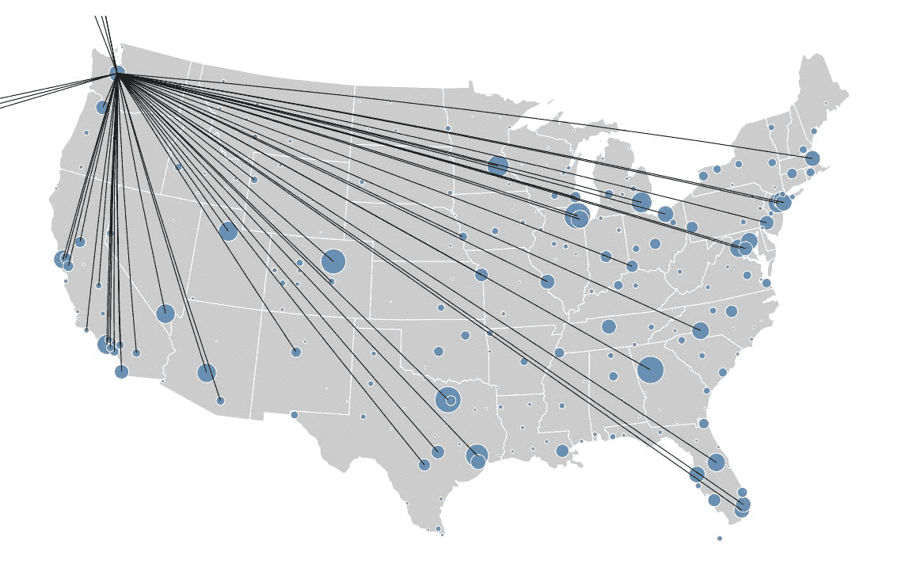

# 它是如何工作的...

```py
package d3a, which specifies the JavaScript calls that define our airport visualization. As you dive into the code, you'll notice that this is a force-directed graph (def force) visualization that shows a graph (show graph) that builds up the map of the US and location of the airports (blue bubbles).
```

`force`函数有以下定义：

```py
def force(clicks: Dataset[Edge], height: Int = 100, width: Int = 960): Unit = {
  ...
  showGraph(height, width, Seq(Graph(nodes, links)).toDF().toJSON.first())
}
```

回想一下，我们在下一个单元格中使用以下代码片段调用这个函数：

```py
%scala
// On-time and Early Arrivals
import d3a._
graphs.force(
  height = 800,
  width = 1200,
  clicks = sql("""select src, dst as dest, count(1) as count from deptsDelays_GEO where delay <= 0 group by src, dst""").as[Edge])
```

高度和宽度是显而易见的，但关键的呼叫是我们使用 Spark SQL 查询来定义边缘（即源和目的地 IATA 代码）对`deptsDelays_GEO` DataFrame。由于 IATA 代码已经在`showGraph`的调用中定义，我们已经有了可视化的顶点。请注意，由于我们已经创建了 DataFrame `deptsDelays_GEO`，即使它是使用 PySpark 创建的，它也可以在同一个 Databricks 笔记本中被 Scala 访问。
