# 第二章：可视化与样式化数据

从不同来源收集和组织数据只是故事的一半。下一步是在地图上展示它，准确揭示主题内容和特征。为此，GIS 中使用了各种视觉设计技术，或基于其属性对图层进行样式设计。QGIS 具有极其广泛和灵活的地图可视化和数据样式化能力。

在本章中，我们将讨论以下主题和技能：

+   在单个工作文档（项目）中组织数据的良好实践

+   数据的视觉表示，揭示其主题和空间特征

+   图层标签，这是为了增强数据的可读性

+   对样式进行控制

+   用于提供空间背景和背景数据的底图

本章的主要成果将是一个项目，该项目是根据基本的地图可视化要求设计的。

# 从空间数据库加载图层

在本章中，我们将使用我们之前创建的数据库。如您所记，这是一个 SpatiaLite 文件数据库。为了使用它，我们首先必须建立连接，然后加载数据。在 QGIS 中，始终有几种不同的方法来完成此操作：

+   从菜单中转到**图层** | **添加图层** | **添加 SpatiaLite 图层**

+   点击 ，**添加 SpatiaLite 图层**按钮，在**图层管理**工具栏中

+   使用 *Ctrl* + *Shift* + *L* 键盘快捷键

在打开的窗口中，按照以下步骤定义你想要连接的数据库：

1.  如果你已如前一章所述创建数据库，你可能会注意到它已经连接。如果没有，则点击**新建**按钮并导航到你要工作的`.sqlite`文件。

1.  在选择数据库文件后，点击**连接**按钮以查看可用图层的列表。您将看到图层的名称和几何类型。

1.  选择必要的图层（或多个图层，这可以通过按住 *Ctrl* 键来完成）并点击**添加**按钮。

    ### 注意

    **设置过滤器**按钮在添加数据时提供了更多灵活性，因为它提供了访问**查询构建器**窗口的权限，在那里你可以创建一个条件表达式来定义子数据集，如图所示。例如，如果你想从`运动设施`数据集中选择一个多功能运动场（MPPA），你可以执行以下操作：

    +   在**查询构建器**窗口的左侧，选择一个名为`primary_sp`的必要字段（双击其名称将其添加到**提供者特定过滤器表达式**文本框中的表达式）

    +   输入或点击操作按钮（在我们的例子中是等号）

    +   通过点击**全部**按钮加载字段值，然后双击`MPPA`值将其添加到表达式

    +   在**提供者特定的过滤表达式**文本框中，您将看到以下行："`primary_sp` = 'MPPA'"

    测试查询。如果它返回有意义的结果，请点击**确定**。返回主窗口后，您将在**geom**列旁边看到条件。点击**添加**按钮以加载图层。

    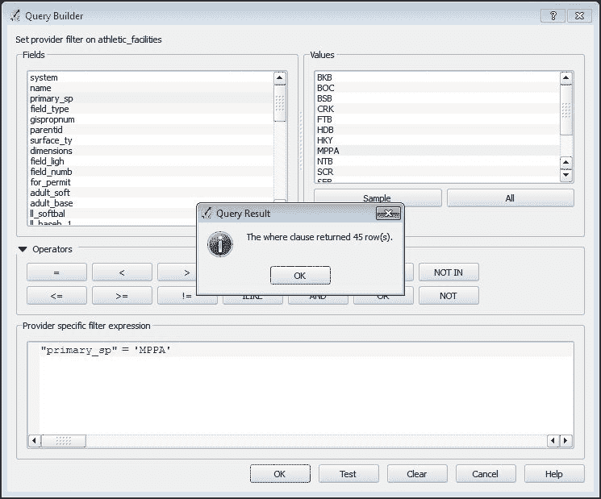

从**浏览器**面板加载图层甚至更简单。要查看可用的图层，依次展开**SpatiaLite**和相关数据库项。现在您只需将图层拖放到地图画布上即可。

# 分组和重新排序图层

默认情况下，图层按字母顺序加载（如果从浏览器面板添加，则相反）。每个新图层都放在上一个图层之上，并覆盖它。默认情况下，所有图层都开启，使用简单的统一符号样式，并随机分配颜色。可以通过简单地拖放它们上下移动图例来更改图层的顺序。此外，强烈建议按逻辑分组和排列图层，因为它简化了导航和理解数据。

要管理和重新排列图层以及保持它们的可见性，请使用**图层**面板中的**图层**工具栏，如以下截图所示，其中包含随后描述的按钮（从左到右按出现顺序）：

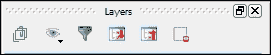

+   **添加组**：这创建一个空的图层组。

+   **管理图层可见性**：这允许我们快速显示和隐藏图层，并使用预定义的图层组合——所谓的预设来定制它们的可见性。

+   **按地图内容过滤图层图例**：如果过滤功能处于激活状态，图层图例仅显示地图画布内实际可见的项目。所有其他符号都将从图例中隐藏。

+   **全部展开**/**全部折叠**：按钮用于展开或折叠图层、符号图例和图层组（如果有）。

+   **删除图层/组**：这删除所选的图例条目。

创建图层组有两种方式：

+   点击，**添加组**按钮，从**图层**工具栏。新组将出现在图层列表的底部。输入一个合适的名称，然后将图层拖放到组中。

+   按住**Ctrl**键选择多个图层，并使用**组选中的**右键快捷菜单来将它们放置在单个组中。

通过选择组并应用**添加组**功能，可以开发出具有子组的分层结构。图层图例中的任何项目，无论是单个图层还是组，都可以使用**重命名**右键快捷键进行重命名。重命名不会影响数据集本身，但允许我们在项目中为其应用一个适当且具有意义的名称。现在尝试自己将图层安排成几个有意义的组，并适当地命名它们。

# 开发自己的样式

在 QGIS 中，样式是一种地图可视化方式，它考虑了图层的个别和主题特征。它包括符号学的基本特征，如颜色和填充的存在、轮廓参数、标记的使用、基于比例的渲染、图层透明度、与其他图层的交互以及标签。

一个精心挑选的样式可以极大地简化数据感知和可读性，因此学习如何使用样式来以最佳方式表示你的数据是非常重要的。在本节中，我们将分别讨论矢量图层和栅格图层，因为它们的样式化有一些独特的特点。

## 为矢量图层开发样式

**样式** 菜单来自 **图层属性** 对话框，它为你提供了所有必要的工具来表示和样式化你的数据。要打开它，请双击 **图层** 面板中的图层名称，或使用 **属性** 右键菜单的快捷方式，然后选择 **样式** 部分。你将看到类似以下内容：

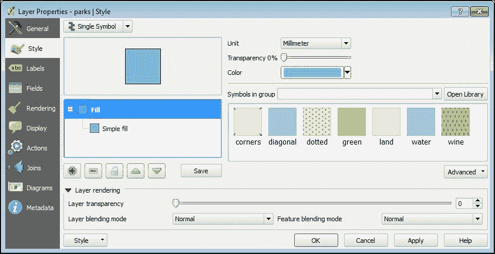

你首先应该注意到的就是位于左上角的小型 **渲染器** 下拉列表。它包含以下项目：

+   **单个符号**：这是最简单的类型，使用相同的符号绘制所有图层要素。

+   **分类**：这定义了数据驱动的分类，并允许我们单独表示它们。

+   **渐变**：这根据定量属性定义分类，允许我们逐步排序要素。

+   **基于规则的**：这是最灵活和高级的渲染器类型。它允许用户使用多个标准定义自己的分类，并单独样式化。

+   **点位移**：当你处理包含重叠点且坐标相似或彼此过于接近的点图层时，这种渲染器非常有用。它仅适用于单个点图层，并将自动移动标记的位置，以便所有重叠的标记都可见。

+   **反转多边形**：这些用于样式化多边形外部的区域，并且仅适用于多边形图层。

+   **热力图**：这表示一个根据点密度具有连续表面的点图层，仅适用于点图层。

根据所选的渲染器类型，**样式** 菜单部分会改变其视图，如果你错误地选择了不合适类型（例如，为线图层选择热图渲染器），你将收到相应的消息。

选择渲染器类型后，您可以使用**符号选择器**对话框开始调整符号，其可访问性取决于所选的渲染器类型。例如，对于**单个符号**和**反转多边形**渲染器，此对话框直接从**样式**部分可用。对于**分类**和**分级**渲染器，它可以从**符号更改**按钮访问，其外观如下：。

**基于规则的**、**点位移**和**热力图**渲染器在符号选择和调整方面有自己的规范，这些规范将在以下章节中介绍。然而，无论选择哪种渲染器类型（除**热力图**渲染器外），您始终可以访问**符号选择器**对话框，其外观类似于以下截图，并包含几个部分：

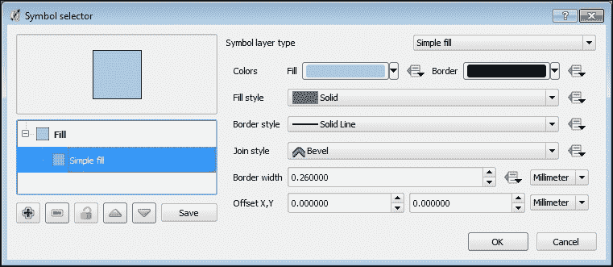

在窗口的左上角，您可以看到符号预览。在预览下方是符号层。默认情况下，只使用一个层，但您可以使用**添加符号层**按钮（）添加更多层，或使用**删除符号层**按钮（）删除不必要的层，该按钮仅在有两个或更多层可用时才激活。使用**锁定层颜色**按钮（），层的颜色将被锁定以防止更改，这可以防止分类或分级渲染器修改颜色。可以使用**向上移动**（）和**向下移动**（）按钮重新排序图层，并且如果您对结果满意，可以在符号库中使用**保存符号**按钮。

在对话框窗口的右侧，有可用的选项用于所选的符号层。其中，**符号层类型**是最重要的。可用类型的列表取决于图层几何形状。对于多边形图层，您可以从以下列表中选择：

+   **质心填充**：多边形通过在多边形质心处的标记来表示，而不是渲染多边形的整个区域。如果您有很多小多边形，并且最好通过点来可视化而不是通过在放大后才可见的小多边形，这种方法非常有用。

+   **渐变填充**：使用预定义的渐变或创建自定义渐变来填充多边形。

+   **线图案填充**：可以将线图案组合起来创建各种网状效果。当您想要使用相同的填充颜色但想通过网状效果突出显示对象之间的某些差异时，这些效果非常有用。

+   **点图案填充**：规则分布的点（或其他符号）可以填充多边形并创建图案。

+   **栅格图像填充**：任何栅格图像都可以用来创建背景填充纹理或图案。

+   **SVG 填充**：可缩放矢量图形`.svg`文件（或标记）可以用来创建填充纹理或图案。

+   **形状爆发填充**：这根据多边形边缘的距离为多边形内部着色，并创建惊人的边界缓冲效果。

+   **简单填充**：这是默认类型，其特征是填充颜色、图案和边框。

+   **轮廓：标记线条**：使用标记符号作为轮廓。

+   **轮廓：简单线条**：只绘制多边形的轮廓，并定义其属性，如线条颜色、宽度和样式。

对于点层，您可以选择由**椭圆**、字母或符号（**字体标记**）、各种标记（**简单标记**）、图标（**SVG 标记**）或属性字段值（**矢量字段标记**）表示的不同标记类型。

对于线层，有**简单**和**标记线条**类型可用。在前一种情况下，线条按常规渲染，在后一种情况下，使用定期重复的标记符号。**标记线条**可以用来显示线条的方向（例如道路上的移动、河流的流向等），使用箭头标记符号。

现在我们已经涵盖了基础知识，我们将密切探讨通过我们数据库中一些层的示例来展示不同的渲染风格。

### 使用单符号渲染器对层进行样式设计

在本例中，我们将使用`Brooklyn borough boundaries`层来在地图上勾勒出感兴趣的区域。如图下所示，我们使用两个符号层，两者都定义为**轮廓：简单线条**，但具有不同的**笔样式**图案。下面放置一个较浅的**实线**，并用较深的**虚线**笔样式覆盖它。选择对比颜色使我们能够实现类似边框的条纹效果。

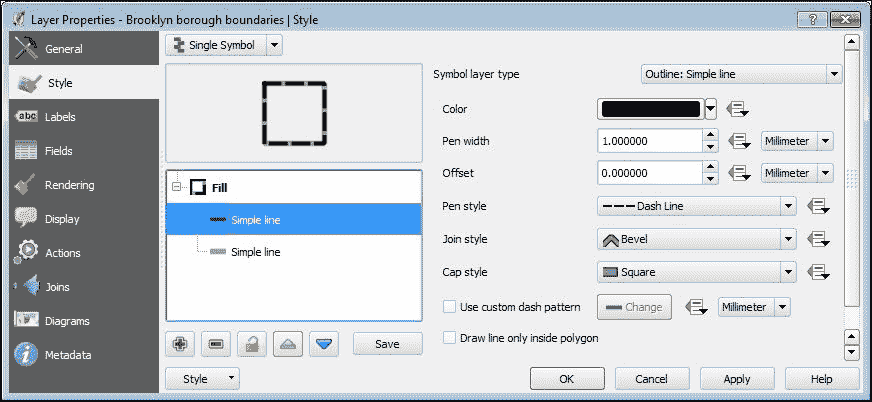

### 使用分类渲染器对层进行样式设计

让我们设计`public schools`层以反映学校类型：

1.  在将渲染器类型设置为**分类**后，选择要在**列**下渲染的分类列。该列来自包含所有层属性字段的下拉列表。由于我们希望学校类型以分类形式显示，请选择`sch_type`字段以对层进行分类：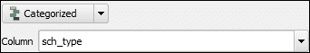

1.  点击**符号更改**按钮以调整层符号。在**符号选择器**窗口中，将**符号层类型**设置为**SVG 标记**，并导航到名为`svg`的训练数据集目录。选择`school.svg`文件，并将符号的**大小**值调整为`3`毫米。点击**确定**按钮返回主窗口：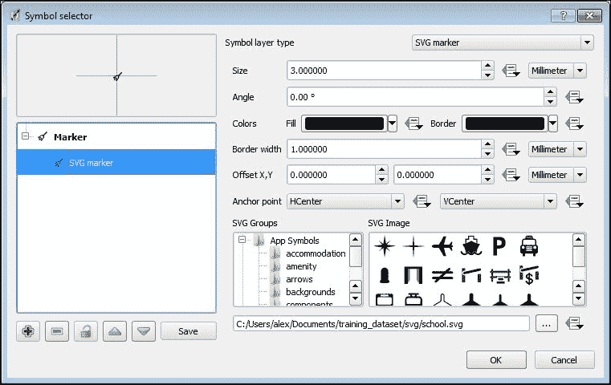

1.  点击**分类**按钮。带有**符号**、**值**和**图例**列的窗口将自动填充来自属性字段中的类别及其描述。**值**和**图例**之间的区别在于，值代表唯一的属性，而图例提供它们的描述性特征。例如，当值是一些代码而图例应该解释其含义时，这种区别更为明显。此外，值在图层图例中是不可见的，但它们的描述是可见的。您可以通过双击相关列中的项目来添加或删除类别，或手动编辑其元素的文本（**值**或**图例**）。现在，只需点击**确定**按钮退出**样式**对话框，查看初步结果。

1.  您会看到地图画布上的符号过于密集且重叠，这使得地图显得杂乱。为了提高可读性，我们应该将符号的外观与缩放范围相关联，并且有两种基本方法可以实现这一点：

    +   从**属性**窗口的**常规**选项卡中激活**缩放相关可见性**，在那里您应该输入**最小（排除）**和**最大（包含）**缩放值。例如，如果您定义的值，如以下截图所示，则图层将在 1:49,999（因为`50000`的最小值被排除）及更大的缩放范围内可见。这种方法不会影响符号的大小。它只调节缩放范围，在地图画布放大和缩小时的外观：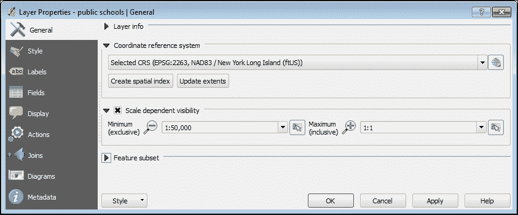

    +   另一种方法，我们实际上会使用，更为复杂，因为它使符号大小依赖于缩放。要应用它，打开**属性**窗口中的**样式**对话框，并点击，**符号更改**按钮，以打开**符号选择器**对话框，如图所示。激活必要的符号层，将其**大小**单位更改为**地图单位**，并输入`30`。这意味着符号大小将被设置为 30 英尺，并根据缩放在放大或缩小地图画布时改变。点击**确定**按钮返回主窗口。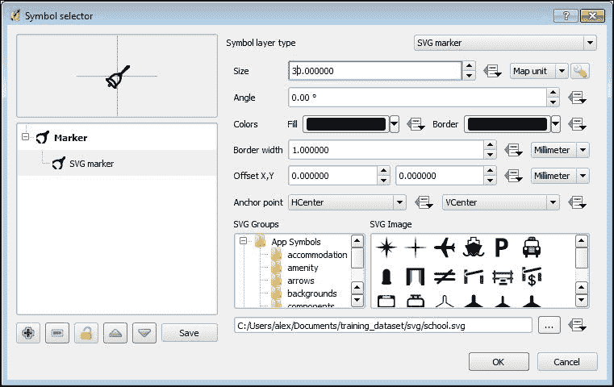

        ### 提示

        在此情况下，可以通过**调整缩放范围**按钮（）定义缩放范围，该按钮会打开一个对话框以定义最小和最大缩放值。

1.  默认情况下，所有类别都根据所选的 SVG 文件分配了相同的**符号**标记，但你可以通过双击并调整**符号选择器**对话框中的必要属性（即**填充**和**边框**）来修改它。此外，右键单击任何项目都会弹出一个上下文菜单，包含**复制**、**粘贴**、**更改颜色**、**更改透明度**、**更改输出单位**和**更改大小**快捷方式，以简化一些常见操作。

此截图显示了如果你选择**分类**渲染器并按之前所述调整设置，屏幕可能看起来像什么：

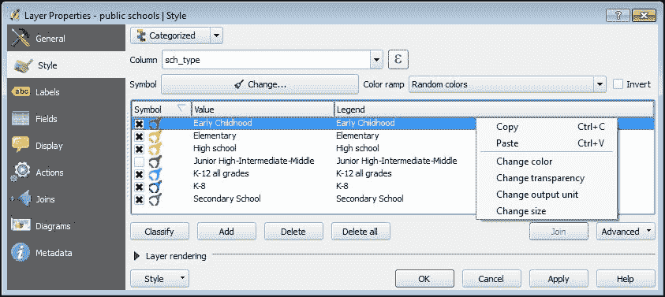

点击**确定**按钮后，图层的样式属性将被应用，你可以在地图画布中探索图层的可见性。在地图单位相关符号大小的情形下，当你缩小地图时可能看不到标记，但它们将在更大比例尺上出现，并相应地改变大小。请注意，**图层**面板上图层的图例中的符号行为类似，即在较大比例尺上变大，在较小比例尺上缩小。这有助于你了解图层在此比例尺上是否可见，如果可见，则有助于你看到其标记的外观。

### 使用渐变渲染器设置图层样式

当你想根据某些定量属性对要素进行分级时，**渐变**渲染器类型非常有用。在我们的示例数据集中，我们有`zipcodes`图层，其中包含`population`字段中的人口数据。我们将使用这个图层和字段来根据居住人数对 ZIP 代码边界进行排序，并演示渐变渲染的工作原理。

### 小贴士

而不是选择属性字段，你可以点击它旁边的**表达式对话框**按钮。如果你需要使用不在属性表中的某些值，但可以从字段值中导出，这将很有用。例如，你可以使用`area/ 43560`表达式将平方英尺面积转换为英亩。

1.  将渲染器类型设置为**渐变**，并在**列**部分选择`population`字段。

1.  定义你希望显示的类别数量（通常建议五到七个类别，否则可能难以在视觉上区分它们），并选择一个**颜色渐变**。

    ### 小贴士

    你可以使用预定义的标准颜色渐变或从高级选项中选择。要使用它们，从下拉列表底部选择**新颜色渐变**。在**颜色渐变类型**窗口中，你将获得以下选项：

    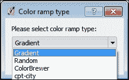

    +   **渐变**：这提供了创建和修改自定义渐变的选项。

    +   **随机**：这根据各种可自定义的选项创建随机颜色渐变，例如**色调**、**饱和度**、**亮度**和**类别**。

    +   **ColorBrewer**：使用为地图设计的预定义调色板，以实现最佳清晰度。这包括针对不同类型数据（顺序、发散和定性）的几个颜色方案。

    +   **cpt-city**：这提供了数十种颜色渐变，用于制图、技术插图和设计。

1.  然后，选择一个合适的毕业模式，如下所示：

    +   **等间隔**：根据设置的类别数将值范围划分为相等的范围类别（例如，从 0 到 100 的值被划分为每个 20 单位的五个类别）。

    +   **等量分位数**：所有数据将被分成设定的类别数，范围将被选择，使得每个类别包含相同数量的项目。

    +   **自然断点（Jenks）**：这种方法根据值的相似性分组。因此，类别内的值具有最小方差，但跨类别的特征值差异显著。

    +   **标准差**：类别根据值的标准差进行划分，这显示了数据与其平均值的不同程度。

    +   **优雅的断点**：这为给定的值范围创建*n+1*个类别（即，如果设置 5 个类别，则结果将是 6），类似于**等间隔**，但断点被选择，以便值是漂亮的整数（例如，如果使用整数，则为 10 的倍数）。

在您点击**分类**按钮后，**符号**、**值**和**图例**列将被填充。双击任何一项以修改它。右键单击将打开上下文菜单。在决定哪种方式最适合揭示您数据的特点之前，强烈建议您尝试各种类别和分类模式。

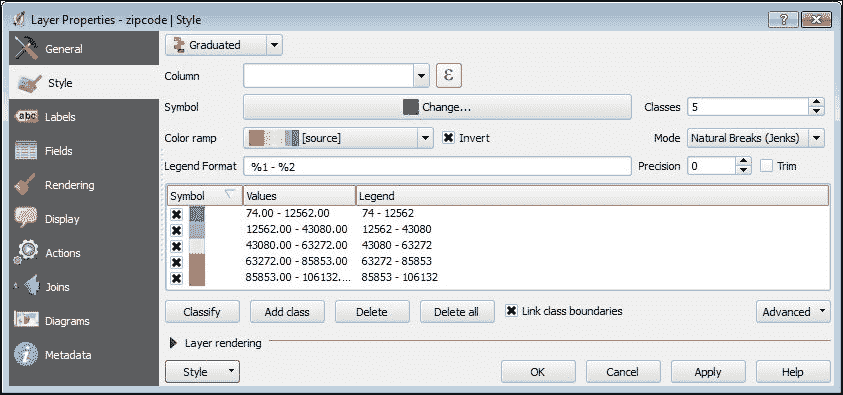

### 使用基于规则的渲染器样式化图层

**基于规则的渲染器**是最灵活的渲染器，因为它允许您将数据分成您自己的复杂类别，并分别对其进行样式化。我们将通过具有许多可用于可视化的属性的`bike routes`图层示例来探索基于规则的渲染功能。例如，有两个字段特别适合在地图上可视化。第一个是`allclasses`，它包含基于纽约市自行车总体规划分类的路由类型分类（针对现有自行车设施）。类型如下：

+   **I**：绿道/多用途路径。

+   **II**：街道上标有条纹的自行车道。

+   **III**：街道上标有标志的自行车路线。

+   **0**：计划中，但尚未作为自行车路线存在。

+   **L**：链接。目前没有设施，但建议该元素作为自行车网络部分之间的连接。

+   **S**：楼梯和人行天桥。

第二个字段是`lanecount`，它显示车道数。需要使用规则将这些属性组合成单独的类别，这些类别显示路线类型和车道数。按照以下步骤为图层开发基于规则的符号：

1.  导航到**属性** | **样式**，并从下拉列表中选择**基于规则的渲染器**类型。要创建规则，请单击**添加规则**按钮。将打开**规则属性**对话框窗口。

1.  在窗口中，单击**过滤器**行旁边的**...**按钮。将打开**表达式字符串构建器**窗口。此窗口由三个部分组成：

    +   左侧部分是**表达式**，其上方有一行运算符按钮。您可以直接手动输入表达式，或双击字段名称、值和函数来组合它。

    +   窗口的中心部分是**函数**。要展开任何项目，请单击其旁边的**+**符号，并双击将其添加到表达式中。我们主要对包含所有可用属性字段名称的**字段**和**值**项目感兴趣。当您突出显示其中任何一个并单击**加载值**按钮（**全部唯一**或**10 个样本**）时，将返回值列表。同样，您可以在表达式中手动输入值或通过双击将其添加。

    +   如果您迷路了，请查看窗口的右侧部分。它包含对**函数**中突出显示的项目的内容帮助。

    在我们的表达式中，我们希望显示属于**I**类别的绿道和多用途路径。此表达式的`"allclasses" = 'I'`如下截图所示：

    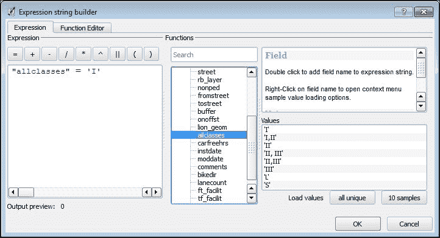

1.  点击**确定**按钮后，您将再次进入**规则属性**窗口。首先，测试表达式的一致性。您将收到消息**过滤器返回了'一些数字'个要素**。如果要素数量为`0`，则表示没有要素满足规则。否则，您将得到一个正数，表示类中的要素数量。

1.  然后向类中添加**标签**和，如果需要，**描述**。如果**比例范围**切换按钮被激活，您可以定义最大-最小比例范围以在地图上可视化该类。类符号在窗口的**符号**部分开发，如下所示：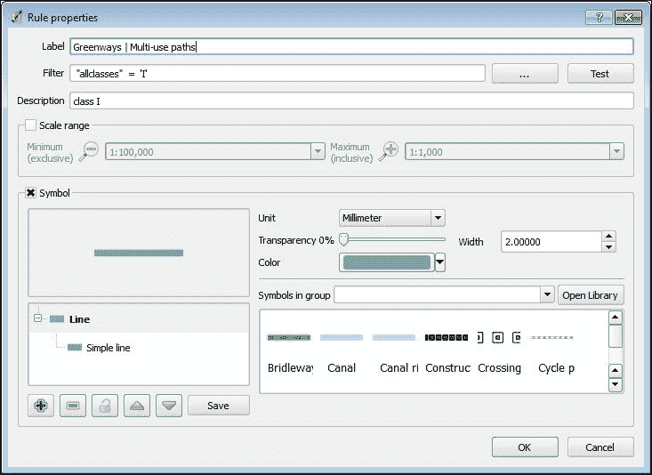

    点击**确定**按钮后，您将返回到主**样式**窗口，在这里可以通过**添加规则**、**编辑** **规则** 或**删除规则** 按钮来管理规则。继续添加此图层中其他可用类的类别。

使用**细化当前规则**按钮，你可以进一步根据比例、类别或范围开发多级层次结构。例如，我们可以将`allclasses`作为主要分类属性，然后根据车道数量将其划分为子类别：

1.  选择类别，导航到**细化当前规则** | **向规则添加类别**，并从**列**下拉列表中选择**lanecount**字段。点击**分类**按钮：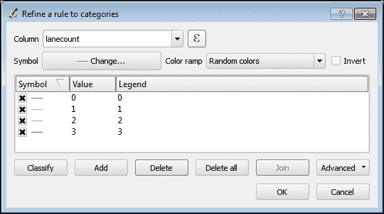

    类似地，向其他规则添加子类别。

1.  现在，我们应该检查我们的规则以删除空类别。通过按住*Ctrl*键选择所有可用的类别，然后点击**计数要素**按钮。空类别将通过**0**计数被识别。点击**移除规则**按钮  以将其排除在图例之外。

1.  因此，你的基于规则的样式可能看起来像这样：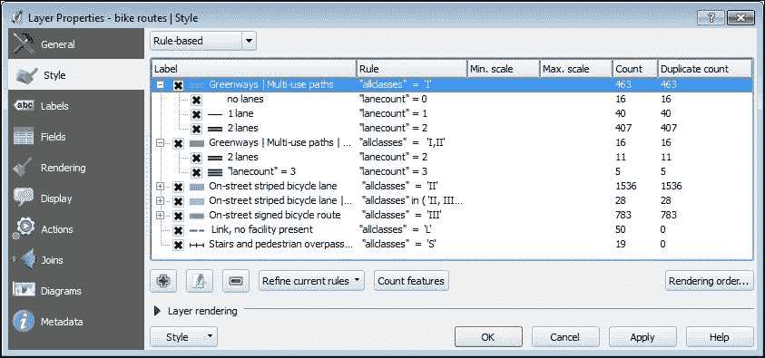

1.  你可以通过点击**渲染顺序**按钮并调整符号级别来大大提高多级符号的可视化。在打开的**符号级别**对话框中，你可以定义符号层渲染的顺序。单元格中的数字决定了层将在哪个渲染过程中绘制。其理念是某些符号级别应该具有较低的渲染顺序，而其他符号级别应该具有较高的渲染顺序。低级别将被高级别覆盖，使用户能够创建平滑的结合并保留符号层次结构。按照以下截图设置渲染顺序并探索结果：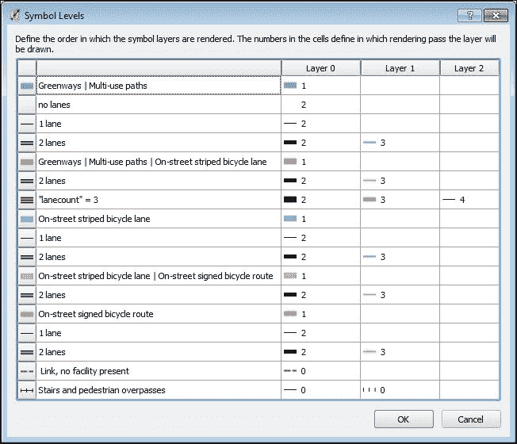

### 使用点位移渲染器设置图层样式

一些点图层（例如，来自训练数据集的`wifi public`图层）包含具有相同或相似坐标的点，由于它们重叠，在地图上无法区分。在这种情况下，**点位移**渲染器非常有用，因为它在想象中的圆圈内定位重叠点。它将点移动到很小的距离，这样它们都能被看到。请注意，渲染器不会影响数据集中实际点的位置，但会从视觉上改变放置以满足制图要求。要使用此类渲染，图层应是一个单点要素类型。

要将**点位移**渲染器应用于`wifi public`图层，请按照以下步骤操作：

1.  选择点将围绕其位移的**中心符号**标记。通过点击符号按钮，您将获得访问传统的**符号选择器**对话框。在窗口中，将**符号图层类型**设置为**SVG 标记**，导航到名为`svg`的训练数据集目录，并选择`Wi-Fi-Logo.svg`文件。将其大小设置为`20`，并选择**地图单位**作为尺寸测量单位。点击**确定**按钮后，您将返回主窗口。

1.  前往**渲染器** | **单个符号**以设置点本身。点击下方的**渲染设置**按钮后，您将进入**符号选择器**对话框。再次，将符号图层类型设置为**SVG 标记**，导航到名为`svg`的训练数据集目录，并选择`wi-fi.svg`文件。将其大小设置为`30`，并选择**地图单位**作为尺寸测量单位。点击**确定**后，您将返回主窗口。

1.  **渲染圆圈**部分定义了出现在地图上以分组具有相似坐标的点并围绕共同中心进行分组的圆圈属性。以下属性包括：

    +   **圆圈笔宽**：这定义了边界圆的轮廓宽度

    +   **圆圈颜色**：这定义了边界圆的轮廓颜色

    +   **圆半径修改**：此值越大，圆圈就越大

    +   **点距离容差**：此值越大，围绕共同中心需要捕捉的点就越多

    目前，我们接受默认值并应用设置。在下面的屏幕截图中，您可以看到在多个坐标相似且需要围绕一个共同中心进行分组的情况下，结果可能看起来像什么：

    

**标签**部分包含一些主要的标签设置，例如，**标签属性**、**字体**、**颜色**等。我们暂时省略这部分，因为标签设置将在本章的**添加标签**部分进行介绍。

### 使用反转多边形渲染器设置图层样式

**反转多边形**渲染器在多边形边界外进行样式设置，并允许我们实现显著的制图效果。其常见用途之一是在地图上显示具有“渐变模糊”效果的水体。为此，使用鼠标右键的上下文快捷方式**复制**`NY borough boundaries`图层，右键点击**重命名**它为`water area`，打开**样式**属性对话框，并选择**反转多边形**渲染器。

现在，创建一个由两层组成的复杂符号：

1.  第一个**符号图层类型**设置为**轮廓：简单线**。

1.  第二个是**形状爆发填充**。

    +   在**渐变颜色**部分，我们选择从蓝色到白色的**双色**渐变。

    +   在**阴影样式**中，激活**阴影到设定距离**：。此值越大，阴影效果就越大。

    +   最后，将**模糊强度**滑块调整到`10`的值以使模糊更柔和。点击**确定**按钮并享受结果！

    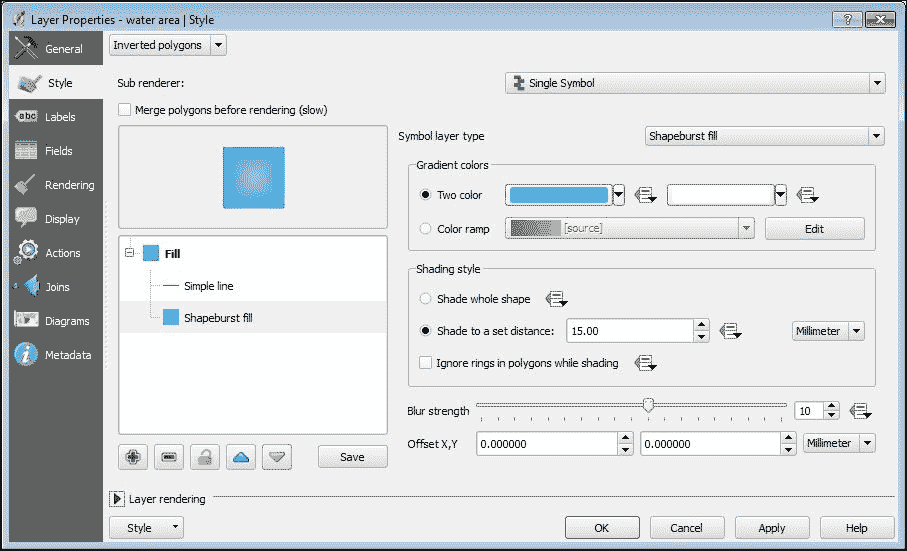

### 使用热力图渲染器样式化图层

**热力图**是一种相对较新的渲染类型。它在 QGIS 2.8 版本中引入。它将点表示为连续密度表面，并允许我们应用酷炫的样式效果。请注意，为了能够应用此类型的渲染器，图层和地图画布应处于相同的坐标参考系中。

我们将渲染器应用于包含超过 15000 个点的`trees`图层。由于它们的密度很高，因此单独在地图上显示这些点很困难：

1.  从下拉列表中选择**热力图**渲染类型后，选择名为**绿色**的预定义颜色渐变。如果您对颜色渐变不满意，可以点击它旁边的**编辑**按钮进行修改，或者从列表末尾选择**新建颜色渐变**来创建自己的颜色渐变，如果需要的话，最后还可以**反转**颜色渐变。

1.  **半径**字段决定了密度估计的搜索区域。它基本上表示点之间必须有多近才能影响热力图。半径越大，表面越平滑；半径越小，热力图中的细节越精细。您可以使用不同的单位定义点的半径：**像素**、**毫米**或**地图单位**。请记住，地图单位是依赖于比例的。像素和毫米不受比例影响，但会反映缩放效果。

1.  **最大值**通常自动设置，并负责每个面积单位内点的最大密度，但您可以调整它以满足您的需求。

1.  此外，如果您希望图层除了密度之外还反映一些重要信息，您可以使用**按数值字段加权重**。例如，如果我们有相关数据，我们可以按学生人数衡量学校，或按每月访客数衡量咖啡馆。

1.  **渲染质量**滑块用于调整表面的平滑度。您选择的质量越高，渲染过程越慢，而较粗糙的表面渲染得更快。

### 图层渲染

无论您选择哪种渲染类型，在**样式**对话框窗口的底部都始终有相同的**图层渲染**选项。第一个是一个通用的**图层透明度**百分比滑块。您可以移动它来调整图层透明度。**图层混合模式**为与底层（或多个底层）交互的图层提供一些特殊的图形效果。默认情况下，设置为**正常**模式，这意味着底层被隐藏在覆盖层下面，颜色没有混合。这表示为`(a, b) = a`，其中`a`是顶层，`b`是底层。

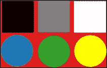

正常混合模式应用于重叠层的示例

您可以从以下表格中描述的四个组中选择 12 种不同的混合模式：

| 混合模式 | 公式和描述 | 效果示例 |
| --- | --- | --- |
| **亮化模式——这一组混合模式使黑色消失，保留白色，并使中间调变亮。** |
| Lighten | *max (a, b)*选择来自两层的 RGB 组件的最大值。 | 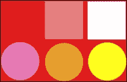 |
| Screen | *1-(1-a)×(1-b)*首先，反转两层中的 RGB 组件。然后它们相乘，最终结果再次反转。 | 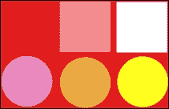 |
| Dodge | *b÷(1-a)*底层被反转顶层除以。 | 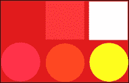 |
| Addition | *a+b*这总结了两个图层上的组件。 | 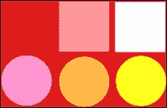 |
| **暗化模式：此组与上一个相反，意味着它保留黑色，使白色消失，并使中间调变暗。** |
| Darken | *min (a, b)*选择来自两层的 RGB 组件的最小值。 | 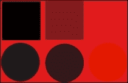 |
| Multiply | *a × b*图层相乘。 | 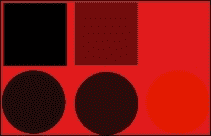 |
| Burn | *1 - (1-b)÷a*底层被反转并除以顶层，然后结果再次反转。 | 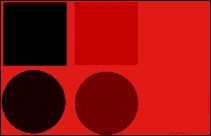 |
| **对比模式：这些模式丢弃中间调，并将顶层中的暗部和亮部像素分别应用于底层像素以变暗或变亮。** |
| Overlay | 根据不同像素结合两种混合模式。对于较亮的像素，应用半强度的 Screen 模式，而对于较暗的像素，则应用 Multiply 模式。结果，灰色中间调变得不可见。计算基于底层，这意味着顶层像素被底层亮化或暗化。 | 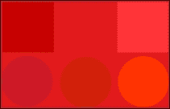 |
| 软光 | 这与上一个相同，但使用 Dodge 和 Burn 模式分别用于亮化和暗化，而不是 Screen 和 Multiply 模式。 | 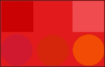 |
| Hard light | 这与 Overlay 类似，但顶层和底层被交换。 | 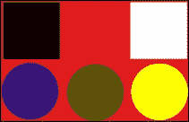 |
| **反转和消除模式：应用简单的算术操作来反转颜色并抑制黑色** |
| 差值 | *b-a*这从顶层减去底层的像素值，仅保留正值；也就是说，与黑色（0）混合没有变化，而与白色（1）混合则反转颜色。 |  |
| Subtract | *b-a*这与差值模式类似，但用黑色替换负值。 | 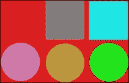 |

**要素混合模式**将对图层内重叠的要素应用相同的效果。我们建议您尝试不同的模式，以了解它们如何与不同的数据类型和样式选项一起工作。熟悉它们可以让您创建看起来专业的地图，具有惊人的制图设计效果。

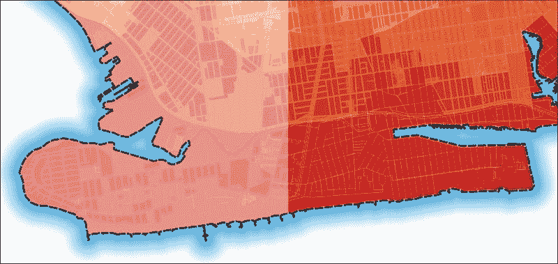

上述截图是飓风疏散区域图层与底层主要住宅分区图层通过简单的 50%透明度（左侧）结合的示例，与右侧不使用任何透明度的**乘法混合模式**相比。

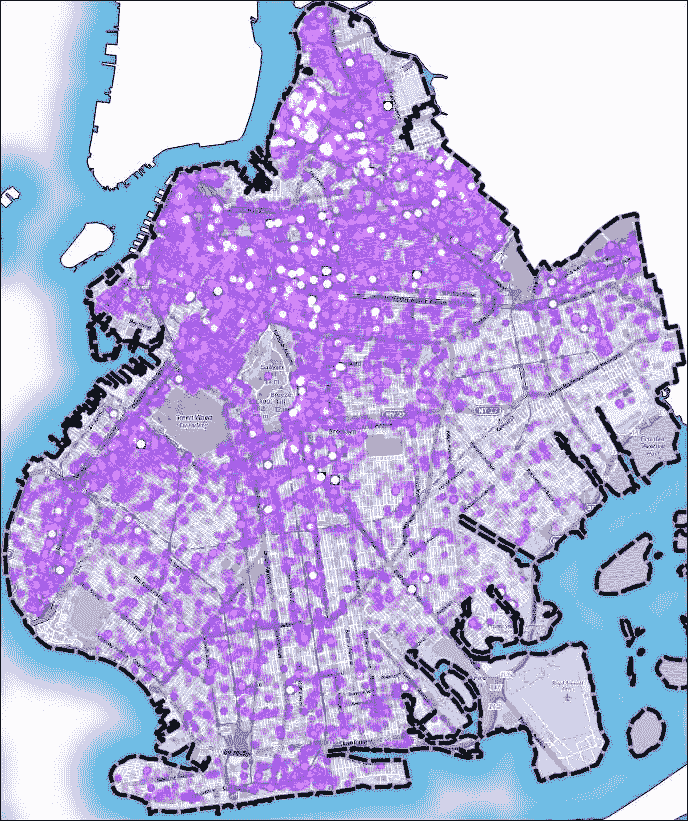

在上述截图中，`噪声点图层`具有简单的标记填充不透明度设置为 20%；**图层混合模式**是**硬光**，**要素混合模式**是** dodge**。

## 开发栅格图层样式

我们的数据库包含三个栅格图层：`2010 年土地覆盖`、`海拔高度，英尺`和`阴影图`。所有这些都是遥感派生数据，对于表示土地利用和地形特征非常有用。我们将为它们开发样式，以将 DEM 表示为连续图层，并将其与阴影图结合以获得一些半 3D 的制图效果。`2010 年土地覆盖`图层将用于展示如何处理离散类别集。

首先，让我们为包含几个土地覆盖类别的`2010 年土地覆盖`图层进行样式设计。这些类别由元数据中描述的整数值编码，如下所示：

+   `1`: `树冠`

+   `2`: `草地/灌木`

+   `3`: `裸地`

+   `4`: `水域`

+   `5`: `建筑物`

+   `6`: `道路`

+   `7`: `其他铺砌表面`

让我们通过以下步骤来开发样式：

1.  从**属性**对话框窗口打开**样式**选项卡（在图例中双击图层，或选择右键上下文快捷方式的**属性**）。

1.  将**渲染类型**设置为**单波段伪彩色**。由于我们的栅格只有一个波段，它将自动加载为**波段 1（灰色）**在**波段**下拉列表中。

1.  由于我们处理的是离散的土地覆盖类别，我们转到**颜色插值** | **离散**。

1.  现在我们需要将我们的类别添加到图例窗口中。使用**手动添加值**按钮，，来添加类别。

1.  默认情况下，所有类别都分配了**值**为`0`，相同的**颜色**，以及**自定义颜色图条目**而不是**标签**。您可以通过双击相应的项来更改它们。完成操作后，您的**样式**部分将类似于以下截图所示：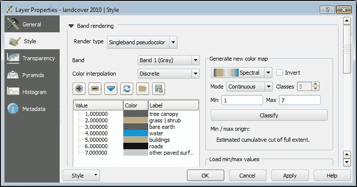

1.  对于`海拔高度，英尺`图层，在**样式**部分，选择**渲染类型**为**单波段伪彩色**。

1.  波段将自动设置，在 DEM 中值变化平滑的情况下，保持默认的**线性**选项（在**颜色插值**下）不变。

1.  现在，我们需要为图层的主题内容选择一个合适的颜色坡道。预定义的坡道下拉列表不会显示所有可用的多样性。要获取这些，请选择**新颜色坡道**。从**颜色坡道类型**窗口下拉列表中选择`cpt-city`。您将看到所有可用的预定义颜色坡道，按几个主题组排序。

1.  点击**地形**组，选择**高程**坡道（或您喜欢的任何其他坡道），然后点击**确定**按钮。

1.  我们将被要求为新颜色坡道输入一个名称。由于我们对现有的坡道满意，所以点击**确定**。然后，我们将返回到主**样式**窗口。

1.  导航到**模式** | **连续**，点击**分类**按钮后，QGIS 将创建类别。这些类别将被创建的**最小/最大**值范围在**加载最小/最大值**部分定义，如下面的截图所示：

    +   **累积计数切割**：默认情况下，这设置为数据范围的 2-98%，有助于切割非常低或非常高的数据异常值。选择这种类型的数据范围设置，初始图像对比度更高，更好地反映了数据值之间的差异。

    +   **最小/最大值**：考虑整个数据范围，但生成的地图可能看起来比较单调。

    +   **平均值 ± 标准差 ×**：在给定标准差（或偏差）内的值定义了数据范围。

    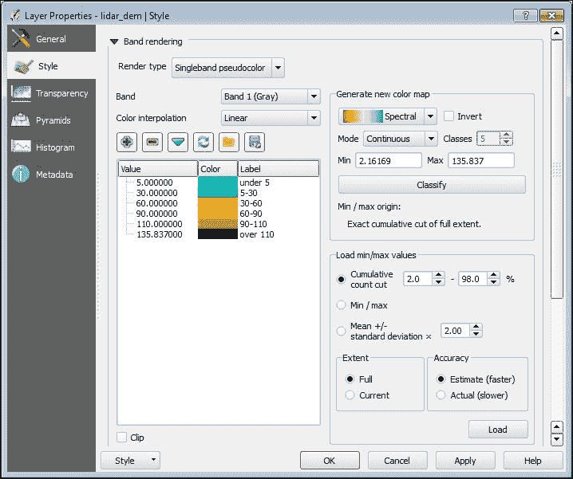

要根据指定的数据范围模式加载值，请在**精度**部分选项中选择**实际（较慢）**，然后点击**加载**按钮。根据数据集的不同，可能需要一些时间，当您看到颜色坡道下方和**模式**旁边的**最小**和**最大**值更新后，点击**分类**按钮。在左侧的窗口中，您将看到在定义的数据范围内自动设置的类别及其范围。这取决于选择的颜色坡道。重要的是要理解每个值代表类别的最大限制，而最高值不是数据集的真实最大值，而是累积最大计数。您可以通过双击它们并输入整数值来调整值，并通过输入范围而不是单个值来澄清图例。查看前面的截图以了解这些说明。

最后，让我们为`hillshade`栅格图层着色，以揭示地形细节和粗糙度。在开始之前，请确保图层位于`height a.s.l., ft`之上，如果不是，请将其拖动并正确放置。阴影模拟阳光照射地形的方式。将其与 DEM 结合是地图可视化中实现半 3D 效果和突出地形细节的非常流行的方法。传统上，半透明阴影叠加在地形图层之上以实现这一点。因此，最终的地面可视化失去了颜色对比度，变得暗淡。为了克服这一点，我们首先将**全局透明度**滑块移动到**图层属性**下的**透明度**部分的 50%，然后在**样式**部分，从**混合模式**下拉列表中选择**乘法**。如果您不确定确切发生了什么，请尝试使用**应用**应用**正常混合模式**，然后返回**乘法**。以下截图显示了差异：

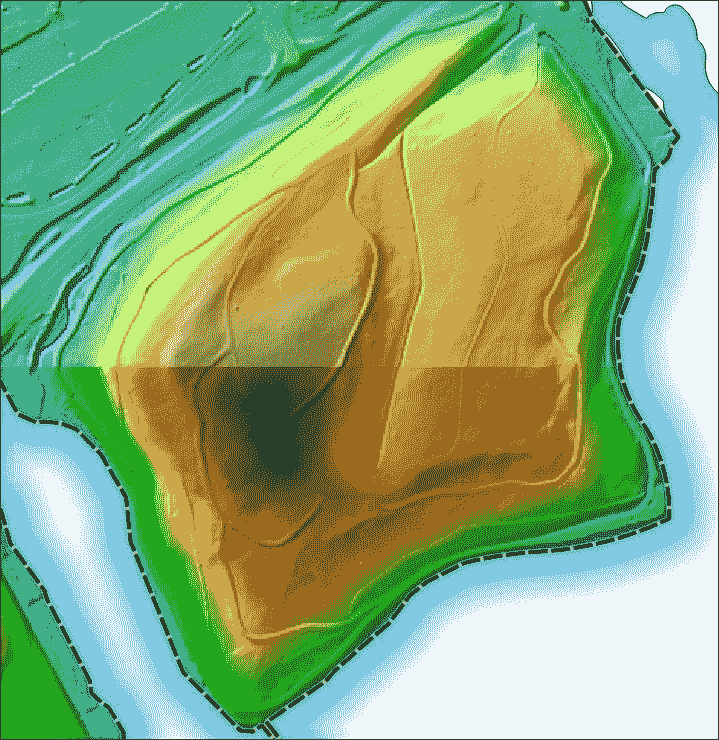

上一张截图显示了使用简单 50%透明度（上方）和 50%透明度的乘法图层混合模式（下方）结合阴影和 DEM 图层。

# 添加标签

标签是地图可视化的重要部分。它显著提高了数据的可读性和理解性。请注意，标签仅适用于矢量图层，因为它们包含要在地图上显示的地标和属性（通常是名称）。您可以从“**图层属性**”对话框或通过转到**图层** | **标签**菜单访问**标签**部分。此外，还有一个**标签**工具栏，您可以通过右键单击工具栏面板的上下文菜单来打开或关闭它，以便快速访问标签选项。

如果您想快速为图层添加标签，只需打开**使用以下选项标记此图层**选项，从旁边的下拉列表中选择用于标签的属性字段，然后单击**确定**。标签将立即添加到图层。虽然这对于个人和临时使用来说效果很好，但还有许多更多标签属性的可用的标签选项：

+   **文本**：这定义了文本样式的主体属性，如**字体**、**大小**、**颜色**、**字体样式**等

+   **格式化**：这用于组织和格式化标签为多行

+   **缓冲**：文本缓冲定义了缓冲晕环的属性，如大小、颜色、透明度等

+   **背景**：它们包含标签的背景选项，如形状、大小、背景颜色等

+   **阴影**：这些是标签和背景的阴影选项

+   **位置**：这些是用于排列标签并避免重叠的高级位置选项

+   **渲染**：这些是用于快速和清晰渲染标签和特征的选项

现在，我们将通过一些使用高级标签选项的图层标签示例。

## 标注点层

在这个例子中，我们将使用站名和线路 ID 对`subway stations`点层进行标注。这意味着在一个标签中，我们需要结合来自不同字段的信息，为此，我们将使用`"name" || '\n' || "line"`表达式。

### 注意

表达式让你可以更高级地控制标签选项，因为有了它们，你可以结合多个字段、文本和函数以达到最佳效果。构成表达式的规则非常简单：`字段名`用双引号书写，`文本字符串`用单引号。要将它们合并成一个单独的表达式，我们使用`||`连接符号，并且使用`\n`来开始新的一行。

1.  从**字体**下拉列表中，选择例如**OpenSans**（或另一个所需的字体）并将它的**大小**值最大化到 9 点。

1.  在**格式化**部分，我们只设置**对齐**为**居中**。

1.  在**缓冲**部分，激活**绘制文本缓冲**。将**缓冲大小**设置为`1`毫米，并将**笔连接样式**设置为**圆角**。

1.  不要忘记选择缓冲的颜色。此外，如果你想达到更时尚的效果，可以调整**透明度**滑块和**混合**模式。我们不会使用任何背景选项，所以在这个例子中，这一部分被省略，我们将直接进入**阴影**。

1.  激活**绘制投影阴影**切换按钮。从**绘制于**下拉列表中，选择**最低标签组件**。

    ### 小贴士

    如果你想在不离开对话框窗口的情况下查看结果，请不时点击**应用**按钮。

1.  在**偏移**部分，你可以定义投影角度。该值可以手动输入或在旁边的旋转开关中用鼠标箭头调整。

1.  注意，阴影轮廓取决于标签旋转角度。如果你想忽略它，应激活**使用全局阴影**切换按钮。

1.  最大化**模糊半径**值可以使阴影变柔和，并且你可以使用**透明度**、**颜色**和**混合**模式来达到更复杂的效果。

1.  通过最小化或最大化**缩放**值，可以使阴影更加微妙或明显。

1.  在**位置**部分，激活**从点偏移**模式，你将看到放置象限。点击最低中央象限按钮以将标签居中放置在符号标记下方。如果标签复杂，如我们的案例，它可能会部分重叠符号。为了避免重叠，使用**X,Y 偏移**，这是标签水平位移和垂直位移的值。输入一个小的正**Y**值（例如，`3.0`）以将标签稍微向下移动。

1.  最后，在**渲染**部分，激活**基于缩放的可见性**并在分母中输入`10000`以设置最大可能的缩放比例。这意味着我们的标签仅在 1:1 到 1:10000 的缩放范围内可见。如果您想防止 QGIS 隐藏重叠的标签，请激活**显示此图层的所有标签（包括碰撞标签）**。一些标签可能会旋转以获得更好的放置，甚至地图画布也可以旋转。然后，您可以使用**显示倒置标签**来决定是否允许倒置标签旋转。

如果图层包含大量特征，可以使用数字来**限制要标记的特征数量**。您还可以使用**阻止标签覆盖特征**。结果，您的地图看起来会更整洁。根据您选择的标记选项，您的标记图层可能看起来类似于以下截图：

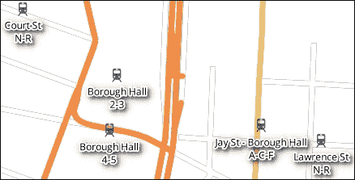

## 标记线层

标记线层的流程与之前描述的类似，但在**放置**部分，您可以找到一些特定于线条的选项。最重要的选项如下：

+   **平行**: 标签沿着与标记线条主要方向平行的方向进行调整。这种放置方式适合传达线条曲率，但可能会错过一些小细节。

+   **弯曲**: 标签将被弯曲以反映原始线条的曲率。这对于标记具有复杂几何形状的对象，如河流和路径，是最好的选择。

+   **水平**: 不论线条方向如何，标签总是水平放置。

标签可以分别放置在线的上方、上方或下方。在线放置的情况下，线条将被标签部分覆盖。如果您同时选择多个选项，QGIS 将定义最佳位置，甚至当激活**线条方向依赖位置**时，还会考虑线条方向。**距离**选项定义标签将放置在离线条多远的位置（仅对**上方/在线**位置有效）。弯曲字符之间的最大角度定义您可以弯曲标签多远。在**渲染**部分，主要针对线条的选项位于**要素选项**中。例如，您可以使用**合并连接的线条以避免重复标签**，这对于处理道路网络非常有用。使用**抑制小于以下大小的标记要素**，您可以设置在标记过程中忽略小特征的值。

## 标记多边形图层

在本节中，我们将向`zipocodes`图层添加标签：

1.  激活标记并选择`zipcode`字段以添加标签。

1.  在文本部分，将**字体**设置为**Harlow Solid Italic**（或您喜欢的任何其他字体）并在**大小**下输入`10`。标签非常简单，因此我们不会使用任何格式化，而是使用**背景**而不是缓冲区。

1.  激活**绘制背景**切换按钮。

1.  在**形状**下拉列表中，有几种选项可用于定义背景的形状。您可以从简单的几何形状（矩形、正方形、椭圆等）或更复杂的 SVG 形状中选择。选择**SVG**，导航到训练`dataset/svg`文件夹，并选择`plate.svg`。将其类型设置为**缓冲区**并将**大小**调整为`1`毫米。此外，如果 SVG 参数可修改，您可以选择**填充**、**边框颜色**和**边框宽度**。

在**放置**部分，您将看到一些特定于多边形的选项，如下所示：

+   **从质心偏移**：标签将被放置在选定的象限中心的多边形内，如果有任何偏移，则指定偏移量。您还可以指定确切使用哪个质心，可见或整个。如果您选择可见的多边形质心，那么在缩放和平移地图时，标签的可见性和放置将动态改变。如果您选择整个多边形质心，则标签将是静态的。此外，如果您激活**强制点在多边形内**，则标签将倾向于仅保持在多边形内。

+   **围绕质心**：标签将被放置在多边形中心，距离指定。

+   **使用周长**：标签将被放置在边界线上（提供**上方/ 在上方/ 在下方**放置选项，并且可以组合它们以允许 QGIS 定义最佳位置）。如果您想考虑线条方向，请激活**线方向依赖位置**。**距离**值定义了标签将放置在离线条多远的位置，而**重复**值则改变重复频率。这种类型的标注对于边界来说非常有用。

+   **水平（慢速）**：所有标签都将水平放置，并且会随着缩放和平移动态改变位置以保持在多边形内。由于 QGIS 不断定义最佳位置，因此对于大数据集，这种类型的标注可能会较慢。

+   **自由（慢速）**：QGIS 将在当前地图视图中定义标签的最佳位置（包括旋转）。

尝试不同的选项以更好地理解标签放置。**渲染**部分与线图层相同，因此您可以避免标注一些小特征或限制它们的数量。

## 高级标注

在任何标注选项旁边，您都可以看到**数据定义覆盖**按钮。它提供了对标注参数的高级控制。您可以使用表达式或使用专门创建的属性字段来执行此操作，该字段使用自定义参数覆盖定义的设置。数据定义属性在您想区分具有不同属性的对象的标签（例如，具有不同人口的城市和城镇）或应用自己的放置位置时非常有用。

让我们根据人口数量创建三种类型的`zipcode`标签。较小的标签将用于人口少于 40000 的地区，中等大小的标签将用于 40000-80000 的人口，最大的标签将用于人口超过 80000 的地区。

这意味着我们需要根据`population`字段值调整字体的大小。从**数据定义覆盖**上下文菜单中选择**编辑…**，如下所示：

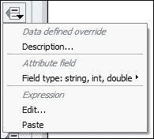

在**表达式字符串构建器**中，输入以下截图所示的表达式。在这个表达式中，我们使用人口作为字体大小值定义的条件：

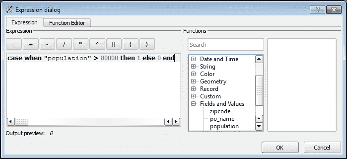

但如果我们不仅想要改变大小，还想在具有最大值的标签下划线，那么我们选择数据覆盖上下文菜单中的**下划线**按钮的**编辑**，并输入以下表达式：`case when "population" > 80000 then 1 else 0 end`。

### 小贴士

如果您对参数定义中确切要输入哪些值以及如何组合它们以获得有意义的结果感到困惑，请从**数据定义覆盖**中选择**描述**项。将显示一个窗口，其中包含对预期输入的简要说明。例如，从以下截图，显示了颜色输入的解释，我们可以得出结论，如果我们想根据人口数量更改标签颜色，我们可以使用`case when "population" > 80000 then '255,0,0,0' else '25,81,119,0' end`：

# 管理样式

如您从上一节中看到的，开发样式是一个耗时的工作。但好消息是，一旦开发出来，样式就不会丢失。它们可以被保存，应用到其他图层，并从外部源导入和导出。

主要样式管理选项可通过**属性**下的**样式**部分底部行的**样式**按钮获得，如图所示。菜单分为由水平线分隔的几个部分。第一个部分负责加载和保存样式。第二和第三部分用于管理图层的多个样式，底部是切换不同样式的按钮（默认情况下为非活动状态，灰色，当只有一个样式可用时）。

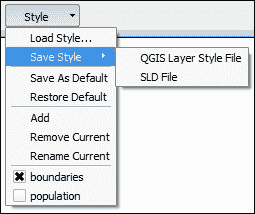

### 小贴士

您可以通过在图层的**样式**上下文快捷方式上右键单击来访问一些这些选项。例如，您可以从一个图层复制并粘贴样式到另一个图层，添加新样式或重命名现有样式。此外，这对于在多个图层样式之间快速切换也非常方便。

当您完成样式的润色后，保存它是明智的。从**保存样式**菜单的**样式**按钮有三个主要选项来完成此操作：

+   **QGIS 图层样式文件**：样式保存为`.qml`文件，这是存储样式的 QGIS 原生格式。

+   **SLD 文件**：样式导出为样式层描述符（`.sld`）文件。此文件类型将原始符号转换为单符号或基于规则的类型。这意味着分类、渐变、热图和其他类型的符号可能无法正确支持。基于渲染器的符号可能无法正确支持。如果你计划在外部应用程序（如 GeoServer）中处理它，保存符号在 `.sld` 文件中可能很方便。

+   **保存在数据库中**：我们使用此选项将所有数据和样式存储和分发在单个 SpatiaLite 数据库中。当加载样式时，提供有意义的名称和详尽的描述非常重要。这非常方便，因为如果你想让其他人正确地使用你的数据和样式，他们只需连接到数据库，加载空间层和样式，并应用它们。

保存样式后，你可以使用**从文件加载**（**样式** | **加载样式** | **从文件**）或**从数据库加载**来选择并应用样式。

### 注意

QGIS 社区在开发资源方面非常活跃，并乐于分享，因此，你不必花费大量时间开发自己的样式，可以直接应用由不同用户提供的现成样式。我们建议你查看以下内容：

+   Charley Glynn 的 OSM 形状文件 QGIS 样式表，可在[`github.com/charleyglynn/OSM-Shapefile-QGIS-stylesheets`](https://github.com/charleyglynn/OSM-Shapefile-QGIS-stylesheets)找到

+   3liz 为 QGIS 中的 OpenStreetMap 数据提供的样式，请访问[`github.com/3liz/osm-in-qgis`](https://github.com/3liz/osm-in-qgis)

+   Anita Graser 为 SpatiaLite 数据库提供的样式，请访问[`github.com/anitagraser/QGIS-resources/tree/master/qgis2/osm_spatialite`](https://github.com/anitagraser/QGIS-resources/tree/master/qgis2/osm_spatialite)

+   Ross McDonald 为 QGIS 中的 OSM 形状文件提供的灰度样式，请访问[`github.com/mixedbredie/OSM-Shapefile-QGIS-stylesheets/tree/master/QML%20files/greyscale`](https://github.com/mixedbredie/OSM-Shapefile-QGIS-stylesheets/tree/master/QML%20files/greyscale)

你可以从那里下载可用的 `.qml` 文件并将其应用到你的层上，但重要的是你的层属性必须与已用样式中的属性相同。否则，你可以将这些样式作为基本模板，并手动调整字段名称和值。

## 为同一层使用多个样式

你也可以通过层上下文**样式**的右键快捷方式快速访问一些样式属性，如下所示：

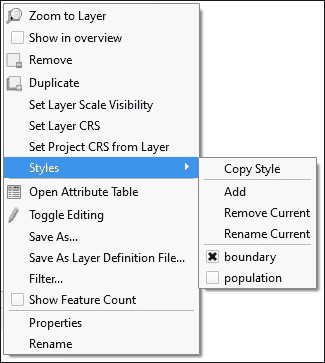

例如，你可以轻松地将一个样式从一个层复制并粘贴到另一个层。此外，你可以为单个层应用多个样式，并在必要时在它们之间切换。要向层添加更多样式，请按照以下步骤操作：

1.  点击**样式**下的**添加层**的右键快捷方式。

1.  在**新样式**窗口中，输入新样式的名称，然后点击**确定**，如图所示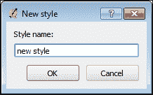

1.  图层的外观将不会改变，因为它目前依赖于最后应用的风格。打开图层的**属性**对话框，并按如下方式调整新样式：

    +   您可以在**样式**部分以常见的方式开发新的样式，如在前面的*开发您自己的样式*部分所述。

    +   此外，您还可以通过访问**样式** | **加载样式**来上传一个已准备好的样式。

1.  在完成样式设置后，点击**确定**按钮。您将看到两种样式都可用，无论是从**样式**按钮菜单还是从**样式**右键快捷菜单。

1.  您可以开发尽可能多的样式，并使用它们名称旁边的切换按钮在样式之间切换。此外，您还可以使用**添加**、**移除当前**和**重命名当前**快捷键来管理多个样式。

# 添加基础地图

基础地图是现成的背景地图，提供除您数据之外的环境和空间信息。它们可以是卫星图像、来自各种来源的通用地图，甚至是自行准备的定制地图。在本节中，我们将探讨最流行的背景地图类型以及如何将它们加载到 QGIS 中与您的数据结合使用。

## OpenLayers 插件

这是最受欢迎的 QGIS 插件之一，因为它允许简单地添加来自众多流行地图提供商（OpenStreetMap、Google Maps、Bing Maps 等）的基础地图。按照第一章中描述的步骤安装插件，*处理您的数据*，并确保安装后它是激活的。

加载基础地图很简单；转到**网络** | **OpenLayers**，选择提供商，然后点击您想要添加的地图。地图将被加载到地图画布中，并出现在**图层**面板中。默认情况下，图层被添加到第一个图层组，但您可以拖放它们到您想要的位置。您可以通过其名称旁边的切换按钮显示或隐藏图层，并使用**移除**右键快捷菜单从项目中删除图层。

您可以通过激活菜单中的**OpenLayers 概览**面板来获得对图层和导航的扩展控制。面板将出现在**图层**面板的左下角。

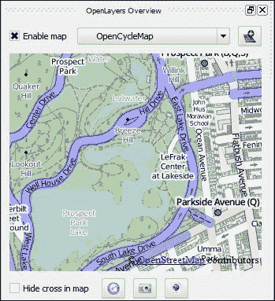

激活**启用地图**切换按钮，并从下拉列表中选择一个用于概述的地图。您可以在概述窗口和地图画布窗口中使用两个不同的地图进行比较。如果您想将地图加载到画布中，请点击下拉列表旁边的**添加地图**按钮。为了简化导航，主地图窗口中有一个红色十字，它标记了概述范围的中心。您可以通过点击相应的切换按钮来隐藏它。此外，概述地图可以保存为`.jpeg`图像，或者可以将矩形范围复制到剪贴板作为 KML。

**OpenLayers**插件非常实用，因为它提供了大量的地图和简洁性，但在使用它时，您应该注意一些限制。首先，此插件旨在提供基础地图，在用它执行其他任务之前，强烈建议您研究提供商的许可条款。其次，请注意，从插件列表中添加任何图层都会自动将原始地图投影更改为**EPSG: 3857 WGS 84 /伪墨卡托**。

这是因为插件获取的是原始以 EPSG: 3857 提供的 EPSG: 3857 数据，而不是重新投影，它抑制了地图投影并自动重新投影用户的数据。最后但同样重要的是，使用 OpenLayers 插件时，您不能依赖于比例尺和地图测量。这是因为它使用的 EPSG: 3857 WGS 84 /伪墨卡托投影是为了将整个地球以适合在 Web 地图上显示的方式拟合，而不是最小化对象扭曲（形状、面积、距离等）。在这个投影中进行的所有测量都是在球体上进行的，并且很可能会比预期的要大得多。简而言之，这种投影适合视觉探索但不适合测量。为了克服这些限制，您可以使用其他方法。

### 添加 WMS/WMTS 图层

**Web 地图服务** / **Web 地图瓦片服务**（**WMS**/**WMTS**）是一种流行的用于空间信息传输的 Web 协议。要将 WMS/WMTS 基本图层添加到您的地图中，请执行以下步骤：

1.  从网络服务加载数据，请转到**图层** | **添加图层** | **添加 WMS/WMTS**，使用**管理图层**工具栏中的相应按钮，或者使用*Ctrl* + *Shift* + *W*键盘快捷键。

1.  在**从 WM(T)S 服务器添加图层**窗口中，点击**新建**按钮以配置新的连接参数。

1.  在**创建新的 WMS 连接**中，输入连接详细信息。输入连接的**名称**和**URL**以及任何认证参数。填写这些详细信息后，点击**确定**。新创建的连接将显示在**图层**选项卡下的下拉列表中。

1.  点击**连接**按钮以获取有关可用图层的信息，选择您想要使用的图层，点击**添加**，然后点击**关闭**以离开窗口。

在使用 WMS 层的情况下，数据将自动重新投影。此外，您将能够访问层的**属性**对话框和样式参数，如透明度、混合和颜色模式等可修改的参数。当然，这些图层可用于创建高分辨率打印地图。

## 添加 TMS 图层

**瓦片地图服务**（**TMS**）是通过互联网以地理参考图像（瓦片）的形式提供空间数据的另一种方式。要将 TMS 数据加载到 QGIS 中，按照第一章中描述的步骤安装并激活**TileMapScale**插件，即*处理您的数据*。安装后，该插件在**插件**下的**TileMapScale**菜单中可用。插件面板由两个标签页组成。在第一个标签页**工具**中，您可以看到一个包含可用 TMS 数据集的下拉列表。使用**激活缩放级别**切换按钮，缩放将自动设置为适合瓦片的缩放级别。在**选项**标签页下，如果您想将瓦层调整到地图投影，可以激活**使用'即时'转换**。设置**最小/最大缩放级别**并点击**DPI**按钮以直接设置分辨率。

### 注意

该插件将数据集描述存储在`UserName\ .qgis2\ python\ plugins\ TileMapScaleLevels\ datasets`文件夹中，以`.xml`文件的形式。这些文件使用 GDAL TMS 最小驱动程序格式来描述数据源参数。您可以在[`www.gdal.org/frmt_wms.html`](http://www.gdal.org/frmt_wms.html)了解更多相关信息。通过使用原始插件安装提供的示例以及研究文档，您可以为您自己的数据提供者创建`.xml`文件。

除了这个插件，您还可以使用**瓦片层**和**QuickMapServices**插件来处理 TMS。

# 摘要

现在您已经了解了组织并样式化您数据所需的所有必要信息。您还能够添加信息标签，保存您的样式以供将来使用和分享，并使用来自各种来源的基础地图提供一些空间背景上下文。

下一步是准备您的地图以供打印。
