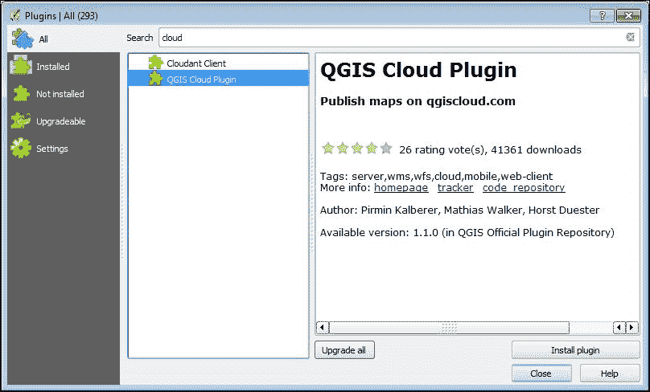
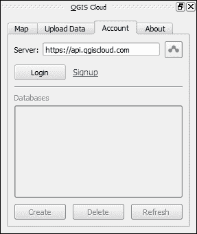
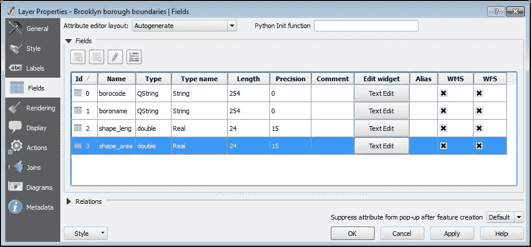
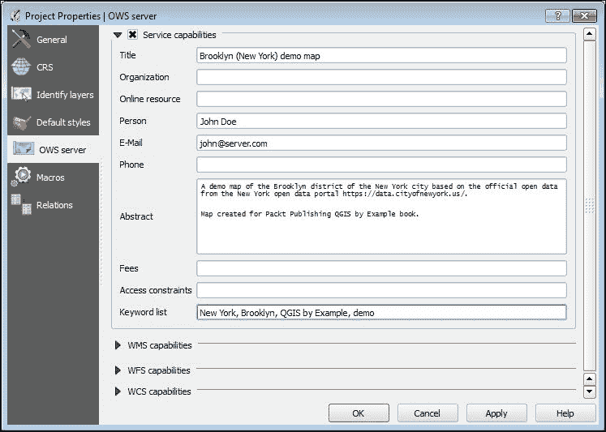
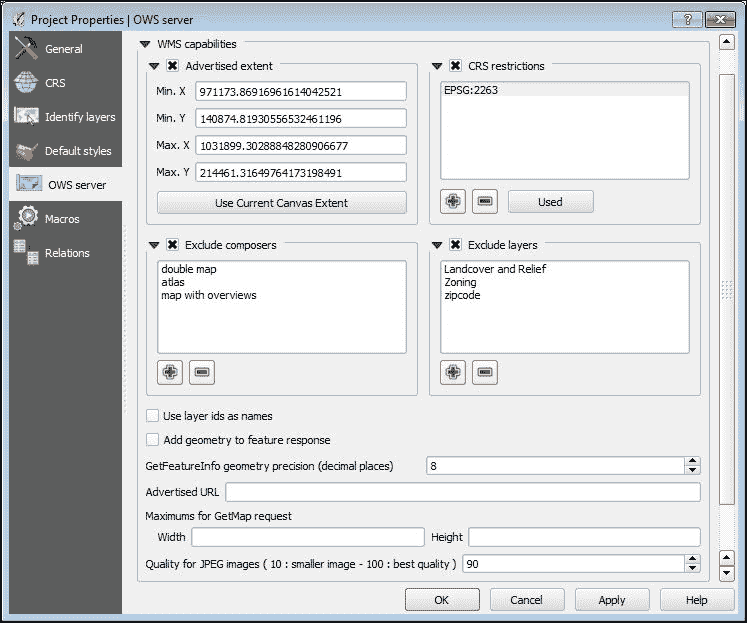
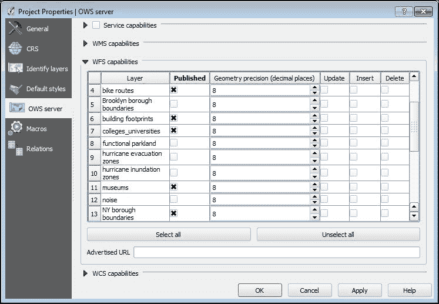
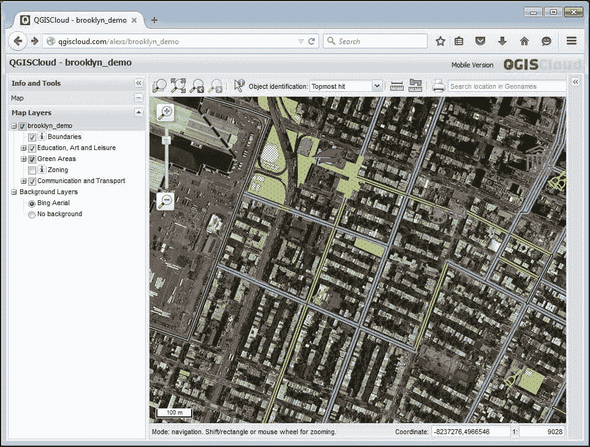
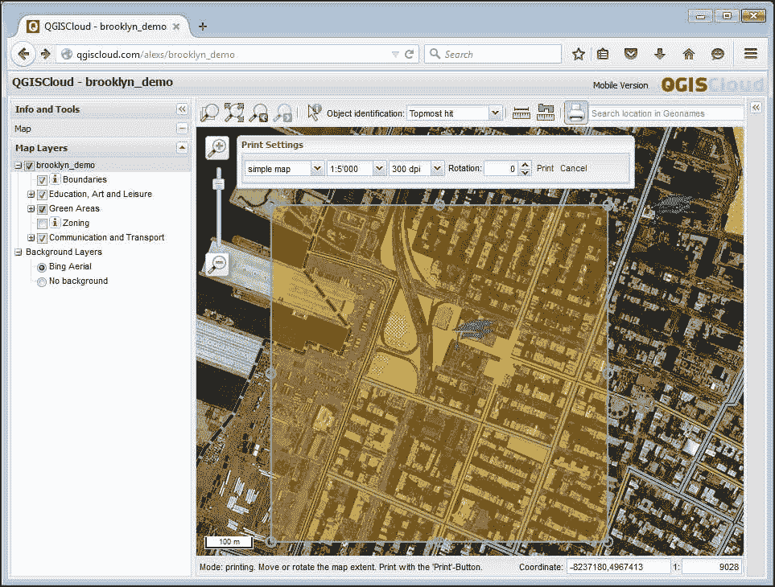
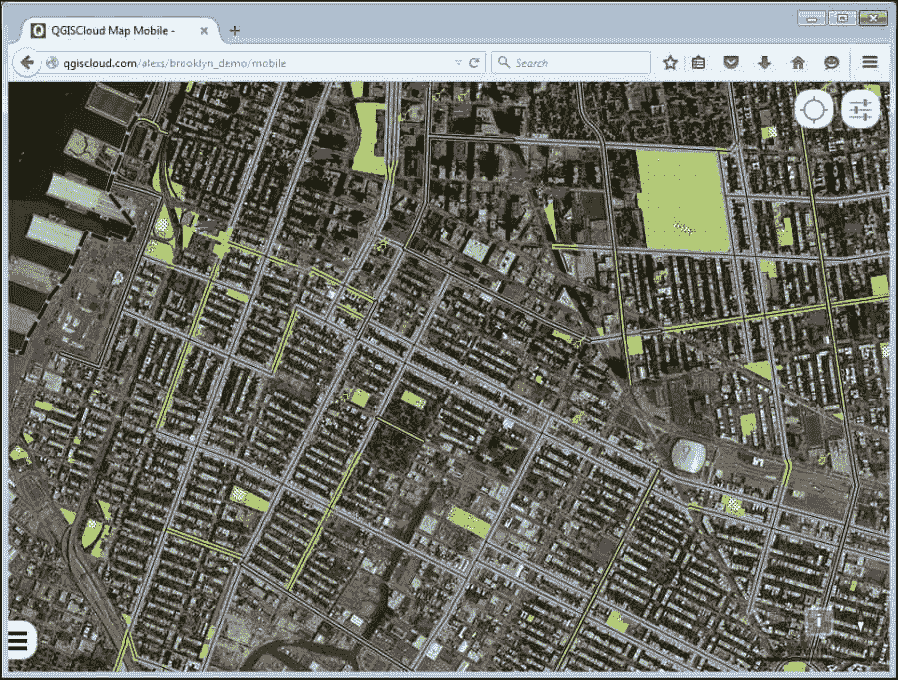

# 第四章。在线发布地图

在本章中，我们将介绍 QGIS Cloud 服务，这是一个强大的地图托管平台，您将学习如何通过在互联网上发布地图与他人共享您的地图。我们将涵盖所有必要的步骤，例如创建 QGIS Cloud 账户、准备地图以供发布、填写元数据、限制信息访问以及发布地图。此外，您还将学习如何从网络浏览器、QGIS 和其他桌面 GIS 中使用已发布的地图。

在本章中，我们将讨论以下主题：

+   注册 QGIS Cloud 服务

+   QGIS Cloud 插件

+   创建数据库

+   发布地图

+   在 QGIS 和浏览器中查看您的地图

+   删除未使用的地图

# 注册 QGIS Cloud 服务

QGIS Cloud 是由 Sourcepole AG 开发和维护的云托管服务。使用此服务，我们可以轻松发布地图、与他人共享地图，甚至修改数据——这一切都不需要任何特殊知识，例如服务器设置和管理。

QGIS Cloud 是使用开源技术构建的。为了存储矢量数据，它使用 PostgreSQL/PostGIS 数据库、由 QGIS 服务器渲染的地图以及基于 QGIS Web 客户端的网络查看器。因此，它与桌面 QGIS 集成得非常好。存储在云上的图层可以用 QGIS 加载和编辑。发布的地图将与在 QGIS 中创建的本地地图具有相同的外观和感觉。

首先，我们需要创建一个账户。这可以通过以下简单步骤完成：

1.  打开您的浏览器并访问 [`qgiscloud.com`](https://qgiscloud.com)。

1.  点击主页上的 **注册** 按钮。

1.  填写并提交注册表格。您需要提供一个有效的电子邮件地址和密码。

1.  在提交表格后，您将收到一封确认电子邮件，其中包含确认说明。通过访问电子邮件中提供的链接来确认您的账户。

就这些了！现在您拥有了一个带有免费计划的 QGIS Cloud 账户。此计划允许您发布无限数量的公共地图，创建五个 PostGIS 数据库，并上传高达 50 MB 的数据。

### 注意

如果您需要更多空间来存储数据，想要限制对您地图的访问，或者需要一些其他特殊功能，请考虑切换到可用的付费计划之一。这些计划及其提供的选项列在 [`qgiscloud.com/en/pages/plans`](https://qgiscloud.com/en/pages/plans)。

如果 QGIS Cloud 插件已经安装，您也可以直接从 QGIS Cloud 插件打开注册页面。只需激活插件，然后在 **账户** 或 **服务** 选项卡下点击 **注册** 链接。相应的页面将在您的网络浏览器中打开。

# QGIS Cloud 插件

**QGIS Cloud 插件** 为您提供了使用 QGIS Cloud 托管发布数据和地图的用户友好界面。由于它是一个第三方插件，我们首先需要安装它。

如果您有代理服务器，则需要先进行配置。**插件管理器**使用与 QGIS 相同的代理设置，因此您只需转到**设置** | **选项**，在**网络**标签页中设置代理即可：

1.  启动 QGIS，通过转到**插件** | **管理并安装插件**来打开**插件管理器**。等待 QGIS 从存储库接收插件列表。

1.  切换到**全部**标签页，并在**搜索**字段中开始键入`cloud`以过滤插件列表，如图所示：

1.  然后，选择插件并点击**安装插件**按钮。下载可能需要一些时间，请耐心等待。下载完成后，您将看到一个消息栏，显示下载确认，现在您可以关闭**插件管理器**。有关安装插件的更多信息，请参阅第一章中*通过插件扩展功能*部分，*处理您的数据*。

安装后，QGIS Cloud 插件将在**插件**菜单中可用。QGIS Cloud 插件还在**插件**工具栏中放置了一个按钮，并创建了一个**QGIS Cloud**浮动面板。默认情况下，此面板停靠在 QGIS 主窗口的左侧。

让我们看看插件界面：

插件面板有四个标签页：

+   **服务**：此标签页用于发布地图和更新已发布的地图。最初，此标签页包含插件及其服务的简短描述，以及到托管网站和注册页面的链接。发布地图后，您将在这里找到指向刚刚发布的地图（包括桌面和移动查看器）的链接以及带有您地图的 WMS 服务 URL。

+   **上传数据**：这允许您将本地数据上传到 QGIS Cloud 数据库并发布地图。在这里，我们可以选择要使用的数据库，在发布前调整表名，并将我们的本地数据上传到 QGIS Cloud。

+   **账户**：此标签页用于身份验证和账户管理。使用此标签页，如果您还没有账户，可以注册 QGIS Cloud。此外，我们还可以在这里创建和删除数据库（如果需要）。

+   **关于**：在这里，您可以找到有关插件作者、QGIS Cloud 支持联系人和插件版本的信息。在出现问题时，这些信息将非常有用。

现在，切换到**QGIS Cloud**面板的**账户**标签页，点击**登录**，并使用您的用户名和密码登录。这可能需要一些时间，因为插件需要与 QGIS Cloud 服务器交互。登录成功后，会弹出一个消息栏，您将在插件面板中看到您当前的计划信息、已用/可用磁盘空间（如果您已有数据库），以及现有数据库列表（如果有）。

# 创建数据库

QGIS Cloud 将所有您的地理数据存储在 PostgreSQL/PostGIS 数据库中，因此在上传任何图层和发布地图之前，您至少需要为您的数据创建一个数据库。

要创建一个新的数据库，请执行以下步骤：

1.  启动 QGIS 并激活 QGIS Cloud 插件，如果尚未激活。

1.  切换到 **QGIS Cloud** 面板中的 **账户** 选项卡，并使用您的用户名和密码登录。

1.  点击 **账户** 选项卡底部的 **创建数据库** 按钮，等待操作完成。

数据库创建是一个耗时的操作，所以请耐心等待。完成后，您将在可用数据库列表中看到一个随机命名的新的数据库。此外，插件已将此数据库注册到 QGIS 中，因此它可以像任何其他 PostGIS 数据库一样使用，例如，在 QGIS 中从中加载和编辑图层。

### 注意

如果你位于防火墙后面并且/或者创建数据库时遇到问题，请通过电子邮件联系 QGIS Cloud 支持：`<support@qgiscloud.com>`。

如果意外地通过插件从 QGIS 中删除了此 PostGIS 连接，可以手动恢复。只需使用插件登录到 QGIS Cloud，并将光标悬停在数据库名称上。在工具提示中，您将找到创建连接所需的所有信息（主机、端口号、数据库用户名和密码）。我们还可以使用这些信息通过其他 PostgreSQL 客户端连接到数据库，例如 psql 或 pgAdmin。

不幸的是，你不能将数据库重命名为有意义的名称，所以请在一个地方保留一个列表，记录每个数据库中存储的数据信息，以备将来参考。此外，你可以使用 DB 管理员检查数据库的内容。

为了方便起见，我们建议您将每个地图/项目保存在单独的数据库中。这样做会引入一些磁盘使用开销，因为每个空数据库的大小约为 11 MB，但这种方法也大大简化了事情。例如，您可以轻松删除未使用的地图，而不会丢失存储在同一数据库中的另一个地图中使用的数据。当然，您也可以将许多图层保存在单个数据库中并在不同的地图中使用它们，但这在您决定删除某些地图或图层时会导致一些复杂性。

记住，你创建的数据库数量不能超过你的计划允许的数量；使用磁盘存储也是如此。如果你需要更多空间或数据库，请升级到另一个计划。

# 发布地图

现在，当创建一个新的数据库时，我们可以在互联网上发布在 第二章 中设计的地图，*可视化和样式化数据*。

让我们先看看我们的项目；它包含栅格和矢量图层。还有几个作曲家。在发布数据和地图之前，我们需要决定哪些信息应该发布，以及我们想要隐藏什么。

默认情况下，所有矢量图层都会发布，其所有属性都可用于 WMS 和 WFS 服务。项目中的所有可用作曲者也会被发布。

如果你需要保留图层（或图层组）的一些属性不发布，那么就需要调整相应图层（或图层组）的属性。

### 注意

在本章的 *WMS 设置* 部分中，你将学习如何排除整个图层和作曲者不进行发布。

要这样做，从 QGIS 图层树中选择一个图层，右键单击以打开上下文菜单，然后选择 **属性**。在 **图层属性** 对话框中，转到 **字段** 选项卡，如下面的截图所示：

在这里，我们看到一个包含所有图层属性以及它们附加信息的表格（数据类型、字段长度、精度等）。最后两列，**WMS** 和 **WFS**，控制当图层作为 WMS 和/或 WFS 图层发布时属性的可见性。如果你不想发布某些属性，只需取消选中相应的复选框。然后，点击 **OK** 按钮保存更改并关闭对话框。请注意，同一个属性可以通过 WMS 发布，但通过 WFS 则不可用，反之亦然。检查所有矢量图层，查看它们的属性，并在必要时隐藏它们。

现在是时候考虑光栅图层了。不幸的是，QGIS Cloud 目前只允许你上传本地矢量图层；本地光栅图层支持尚不可用。但不要气馁！你可以使用 WMS 服务和底图来代替。

如果我们的光栅图层也作为 WMS 服务可用，我们可以安全地将本地文件替换为 WMS 图层，并且我们的地图将发布而不会丢失任何数据。已添加的 WMS 图层也将被发布。

但如果只有光栅数据作为本地文件可用，而你又真的需要一个底图怎么办呢？幸运的是，QGIS 允许你添加底图；你只需要安装 **OpenLayers 插件**。一旦安装了此插件，请转到 **Web** | **OpenLayers 插件**，并从可用列表中添加所需的底图。可以添加多个底图，例如 OpenStreetMap 和 Bing，这样在发布项目后，用户将能够在它们之间切换。

注意，可以在同一张地图中同时拥有这两种类型的图层——WMS 和底图。然而，请记住，WMS 图层将覆盖底图，并可能完全覆盖它。如果你想在 WMS 图层下看到底图，发布前别忘了设置 WMS 图层的透明度。

我们地图中只有一个光栅图层——数字高程模型，它已从本地文件加载，因此无法发布。让我们添加一些其他光栅数据，这些数据将可以从发布的地图中获取。

由于我们的地图包含一个 DEM 图层，因此找到合适的替代品将很好。幸运的是，USGS 通过 WMS 提供对一些地图的访问，包括阴影地形。当然，此图层不如我们的 DEM 详细，但对于在线地图来说，这已经足够了。首先，我们需要通过以下步骤创建一个新的 WMS 连接：

1.  在**图层**工具栏中单击**添加 WMS/WMTS 图层**按钮，或转到**图层** | **添加图层** | **添加 WMS/WMTS 图层**。在**从 WM(T)S 服务器添加图层**对话框中，单击**新建**以创建新的连接。将**名称**输入为`USGS Relief (base)`，将[`basemap.nationalmap.gov/arcgis/services/USGSShadedReliefOnly/MapServer/WMSServer?request=GetCapabilities&service=WMS`](http://basemap.nationalmap.gov/arcgis/services/USGSShadedReliefOnly/MapServer/WMSServer?request=GetCapabilities&service=WMS)作为**URL**，然后单击**确定**。从组合框中选择新添加的连接，然后单击**连接**按钮。

1.  从图层树中选择第一个节点，称为**USGS 阴影地形...**。

1.  在**坐标参考系统**组中，单击**更改**，找到并选择**WGS 84 /伪墨卡托（EPSG:3857）**，然后单击**确定**。

1.  单击**添加**并关闭 WMS 对话框。

1.  最后，将添加的图层移至所有矢量图层之下，使其位于 QGIS 图层树的底部。

    ### 注意

    注意，此阴影地形图层包含 1:18000 或更小比例尺的数据。如果您想在更详细的尺度上显示地形，则必须添加另一个使用另一个 WMS URL 的图层：[`services.nationalmap.gov/arcgis/services/USGSShadedReliefLarge/MapServer/WMSServer?request=GetCapabilities&service=WMS`](http://services.nationalmap.gov/arcgis/services/USGSShadedReliefLarge/MapServer/WMSServer?request=GetCapabilities&service=WMS)。

您可能已经注意到，我们在**EPSG:3857**中添加了图层，而所有矢量图层都在 EPSG:2263 中。因此，我们现在启用了“即时”重投影，项目坐标参考系统是 EPSG:3857。这是因为我们还将添加一个背景 Bing 地图，该地图仅在 EPSG:3857 中可用。如果您不需要背景地图，最好使用与您的矢量数据坐标参考系统匹配的 CRS 或知名 CRS，例如**WGS 84**和**WGS 84 /伪墨卡托**。

现在，我们将添加带有 Bing 航空图像的背景地图。

### 注意

注意，使用某些背景地图可能会违反这些地图的服务条款。在添加任何背景地图之前，请检查您是否允许使用该服务与您的在线地图，并重新分发包含该服务数据的地图。

要这样做，请执行以下步骤：

1.  安装并激活**OpenLayers 插件**（有关更多详细信息，请参阅第一章中的*通过插件扩展功能*部分，*处理您的数据*），*处理您的数据*）。

1.  转到**Web** | **OpenLayers 插件** | **Bing Maps** | **Bing Aerial**。

1.  将新添加的图层移动到 QGIS 图层树的底部，这样它就会位于所有其他图层之下。

如果需要，您可以添加更多 WMS 图层和/或背景地图，但不要在没有必要的情况下通过额外的图层超载您的地图。同时选择默认可见的栅格，并关闭其他栅格图层以加快地图加载速度。在实施所有更改后保存项目。

现在我们已准备好发布数据，我们的下一步是项目准备。当然，您可以原样发布地图，但花些时间使您的地图更易于用户使用且看起来更专业，尤其是如果您计划与他人分享它。

## **一般设置**

首先，我们填写一些元数据，这将帮助用户找到我们的地图，并提供一些关于它的信息。为此，通过按*Ctrl* + *Shift* + *P*打开**项目属性**对话框，或者转到**项目** | **项目属性...**并切换到**OWS 服务器**选项卡。此选项卡允许我们配置 QGIS 服务器将如何处理我们的项目。这里有许多不同的设置；目前，我们将查看**服务能力**组：

这里，我们需要填写以下元数据：

+   **标题**：这是地图的标题。我们选择`布鲁克林（纽约）演示地图`。

+   **组织**：在这里，我们指定地图的作者或所有者。请在这里输入您的名字。

+   **在线资源**：在这里，我们指定用于访问我们地图的 URL。目前，我们可以将其留空，因为地图尚未发布，这就是我们不知道其 URL 的原因。但如果您好奇，以下是 QGIS Cloud 中用于 URL 生成的约定：`http://qgiscloud.com/<user_name>/<map_name>/wms`。在这里，`<user_name>`是您的 QGIS Cloud 登录名，`<map_name>`是已发布项目的文件名，不带扩展名。所以，假设您的登录名是 alex，项目在数据上传后将被保存为`brooklyn_demo.qgs`。那么，URL 将是`http://qgiscloud.com/alex/brooklyn_demo/wms`。

+   **人员**：这是负责已发布地图的人员的姓名。它主要用于支持联系。在我们的情况下，这与**组织**字段中指定的人员相同。

+   **电子邮件**和**电话**：这是负责人的联系详情。我们可以将其留空或只填写一个字段，以便用户在有任何问题或问题时能够联系地图的创作者。

+   **摘要**：这是我们地图和所使用数据的简要描述。这是重要信息，因为它帮助用户了解地图的目的和覆盖范围。此类信息还可以由元数据目录用于索引和搜索地图的目的。以下是我们的描述；您可以直接使用它，或者根据您的喜好进行修改：

    基于纽约市布鲁克林区的官方开放数据门户[`data.cityofnewyork.us/`](https://data.cityofnewyork.us/)的纽约市布鲁克林区演示地图。

    为 Packt Publishing 的*QGIS 实例*书籍创建的地图。

+   **费用**: 这显示了关于费用的信息。如果地图不使用费用，则可以忽略。

+   **访问限制**: 这描述了使用此地图的约束和法律要求。例如，可以是“仅限内部使用”或某些版权声明。对于公共地图，此字段通常为空。

+   **关键词列表**: 这是一个描述地图的关键词或短语列表。这些信息有助于搜索和索引。对于我们的地图，我们使用这些关键词；请随意调整以适应您的口味：

    `纽约，布鲁克林，QGIS 实例，演示。`

填写元数据不仅是地图，还包括其中的每个图层，这是一个好习惯，这样当用户查找可用的 WMS 或 WFS 图层时，他们将看到图层的描述，并容易理解某个图层是否适合他们。任何人都会同意，与具有标题和摘要的 WMS 服务器一起工作比与没有此类信息的服务器更舒适。

要编辑图层的元数据，从 QGIS 图层树中选择它，右键单击以打开上下文菜单，并选择**属性**。在**图层属性**对话框中，转到**元数据**选项卡。需要填写的重要元数据包括**标题**、**摘要**和**关键词列表**。编辑元数据后，单击**确定**以关闭对话框并保存项目。

## WMS 设置

现在看看**WMS 功能**组，它允许您调整从我们的地图创建的 WMS 服务，如图中所示：

默认情况下，整个地图将被发布。如果您只想通过 WMS 发布地图的一部分，请勾选**广告范围**框，并通过输入其最小和最大坐标来定义允许的范围。单击**使用当前画布范围**按钮以将可用范围限制为当前地图范围。

QGIS Server，由 QGIS Cloud 使用，实现了 WMS 标准的特殊扩展：**GetPrint**请求。这允许您使用项目中的可用作曲家之一创建打印地图。默认情况下，所有可用的作曲家都将发布并广告用于打印。如果您根本不需要此功能或想隐藏一些作曲家供用户使用，请激活**排除作曲家**组，并使用**+**按钮将需要排除的作曲家添加到此列表。

同样，如果您不想发布所有图层，可以隐藏一些图层。为此，激活**排除图层**组，并使用**+**按钮添加要排除的图层。

### 注意

当然，我们可以简单地删除图层，用不同的名称保存项目，然后发布这个新项目。但在这个情况下，我们将失去一个主要优势——使用同一项目进行离线和在线地图的能力。

想象一下，在发布地图后，您需要更改图层的符号。在两个不同项目的情况下，您需要保持它们同步。拥有一个单一的项目并通过更改设置隐藏图层要简单得多。

下一个重要的设置是**CRS 限制**。默认情况下，每个图层都可以在任何 QGIS 支持的**坐标参考系统**（**CRS**）中加载。因此，服务能力文档变得非常大，尤其是在地图包含许多图层时。这反过来又导致基于网络的查看器和桌面客户端加载地图变慢，因为它们必须下载和解析更多的数据。

在实际应用中，通常只需要很少一部分坐标参考系统。因此，我们可以安全地限制可用的 CRS 列表，而不会带来任何缺点，并且还能加快我们地图的加载速度。为此，激活**CRS 限制**并添加所有必要的 CRS。**使用**按钮允许我们只需单击一下就将当前项目的 CRS 添加到列表中。

如果您想在识别时启用特征高亮显示，别忘了勾选**添加几何形状到特征响应**复选框。您还可以通过调整**GetFeatureInfo 几何精度（小数位数）**字段中的值来限制坐标精度。

最后，您可以通过在**GetMap 请求的最大值**中定义宽度和高度以及调整**JPEG 图像质量**来限制由 GetMap 请求返回的图像大小。

## WFS 设置

如果您想使数据不仅作为栅格数据可用，还作为矢量数据可用，您需要配置**WFS 功能**，如下面的截图所示：

您需要做的就是通过在**已发布**列中勾选相应的复选框来选择应通过 WFS 可用的图层。如果图层需要可编辑，您需要通过在相应的列中激活复选框来指定支持的操作：

+   **更新**：用户可以使用此功能在具有此功能的图层中编辑现有特征（包括几何形状和属性）

+   **插入**：用户可以使用此功能向图层添加新特征

+   **删除**：此功能允许用户从图层中删除现有特征

    ### 注意

    记住，使用 QGIS Cloud 的免费计划时，您的地图将公开可用，任何人都可以编辑您的图层。如果您需要限制访问，请考虑切换到其他计划或不要通过 WFS 启用编辑功能。

    作为地图所有者，您可以通过连接到相应的 QGIS Cloud 数据库来始终通过 QGIS 编辑已发布的矢量图层。

当您对所有设置满意时，点击**应用**按钮保存您的更改，然后关闭**项目属性**对话框。

现在，我们可以发布我们的地图。如果尚未激活，请激活 QGIS Cloud 插件。切换到**QGIS Cloud**面板中的**账户**选项卡，并使用您的用户名和密码登录。首先，我们需要创建一个数据库，所有图层都将保存在该数据库中。数据库创建在本章的*创建数据库*部分有详细说明；如有必要，请返回该部分。我们将假设一个全新的空数据库已经存在。

切换到**上传数据**选项卡。从**数据库**下拉菜单中选择之前创建的数据库。在此下拉菜单下方的表格中，您将看到所有由 QGIS Cloud 支持的、可以上传的图层。如果没有图层，请点击**刷新图层**。如有必要，您可以通过编辑**表名**列中的文本来调整用于存储图层数据的数据库表名称。

### 注意

注意，尽管所有其他列也可以编辑，但您不应编辑它们。

还要验证表中列出的所有图层都分配了正确的 CRS。QGIS Cloud 仅支持 EPSG 数据库中可用的 CRS，因此如果某些图层有用户定义的 CRS，在发布之前必须重新投影它们。

如果勾选了**替换项目中的本地图层**，插件将通过用上传的图层替换所有本地矢量图层来更新项目。因此，您的项目将包含来自 QGIS Cloud 数据库的图层，您可以从 QGIS 中轻松编辑它们。这些图层的所有更改将立即在发布的地图中可见。

要开始数据上传，点击**上传数据**按钮。上传所需时间取决于数据大小和您的互联网连接速度。完成上传后，系统会提示您保存更新后的项目。我们建议您使用不同的名称保存已发布的项目，以便您将拥有未更改本地数据的原始项目。

### 小贴士

QGIS Cloud 使用项目文件名作为地图名称，因此请仔细选择项目文件名；使用有意义的名称会更好。

数据上传成功后，将显示一个新的**发布地图**按钮。点击它以发布您的地图。这就完成了！现在您的地图可在互联网上访问。切换到**服务**选项卡以获取标准查看器、移动查看器、WMS 服务（同一链接可用于 WFS）和 Web 界面管理面板的 URL。

如果需要，我们可以轻松地更新已发布的地图；例如，我们可以更改图层符号，或隐藏或显示一些属性或作曲家，等等。为此，只需打开包含基于云图层的项目，进行必要的更改，然后按照以下步骤发布地图：

1.  如果尚未激活，请激活 QGIS Cloud 插件。

1.  切换到**QGIS Cloud**面板中的**账户**选项卡，并使用您的用户名和密码登录。

1.  现在切换到**服务**选项卡，然后点击**发布地图**按钮以发布更新后的地图。

没有必要再次上传数据，因为所有数据都已在前一次上传，并且我们的项目现在包含来自 QGIS Cloud 数据库的图层，而不是本地文件。

# 在 QGIS 和浏览器中查看您的地图

已发布的地图可以在 QGIS 和浏览器中查看。根据您的需求，使用其中一个可能更好。如果您只需要查看地图和一些基本的 GIS 功能，例如地图导航、要素识别和打印，基于网页的查看器是一个不错的选择。此外，基于网页的查看器也是与他人共享您地图的绝佳方式。

## 在浏览器中处理地图

QGIS Cloud 提供了两个网页查看器：一个用于移动设备（智能手机或平板电脑），另一个用于桌面。这两个查看器都提供了相同的基本功能，例如地图导航和更改图层可见性。让我们更详细地了解一下它们。

标准桌面查看器基于 QGIS Web 客户端，它看起来像是一个在浏览器中运行的简单 GIS 应用程序，如下面的截图所示：

左侧有一个图层树，您可以在其中更改图层的可见性，如果有的话，还可以启用或禁用背景地图。在右侧，我们可以找到**属性数据**面板（默认情况下隐藏），它用于显示有关已识别要素的信息。其余的空间由地图视图本身占据。

在前面的截图中，您可以看到一个带有导航按钮的工具栏、识别工具、测量长度和/或面积的工具体，以及**打印地图**按钮。导航、识别和测量工具的工作方式与 QGIS 中的相应工具类似。

标准查看器最有趣的功能是地图打印。如果发布的项目包含作曲家，它们可以用于制作打印地图。要创建此类地图，使用导航工具将视图缩放到感兴趣的区域，然后点击**打印地图**按钮。将出现一个**打印设置**对话框，并在地图上显示一个选择矩形，如下所示：

通过移动和调整矩形的大小来定义您想要打印的区域边界。然后使用浮动的**打印设置**面板选择所需的地图布局、比例尺和分辨率。如果需要，定义地图旋转。当所有设置完成后，点击**打印**按钮以生成包含您地图的 PDF 文件。生成的地图将在新的浏览器窗口中打开，并可以保存到磁盘以供进一步使用。

如同其名，移动查看器针对使用移动设备（如平板电脑或智能手机）进行了优化。

所有的可用屏幕区域都用于显示地图。触摸屏上的按钮大且易于使用。要访问图层树，请按左下角的按钮。右上角的按钮允许您启用位置跟踪并设置一些其他选项，例如地图旋转、比例尺显示等。使用移动查看器，您无法访问打印地图功能。尽管如此，您仍然可以使用地图进行导航。查看器将跟踪您的位置并在位置改变时更新地图。如果需要，您还可以激活地图旋转，以便地图可以旋转以使其北方指向实际北方。

## 在 QGIS 中处理地图

如果您只需要对数据进行只读访问，基于 Web 的查看器就很好。当使用 QGIS 查看已发布的地图时，您将获得更多功能和灵活性。

### 注意

您可以使用发布的地图，不仅限于 QGIS，还可以使用任何 WMS 或 WFS 客户端。

默认情况下，每个发布的地图都可通过**Web 地图服务**（**WMS**）协议访问。因此，您可以使用它作为另一个地图的背景图层，或者借助 OpenLayers 和 Leaflet 等库将其嵌入网页中。

要将发布地图中的图层作为 WMS 图层添加到 QGIS 中，请执行以下步骤：

1.  使用**管理图层**工具栏上的相应按钮或从**图层**菜单（**图层** | **添加图层** | **添加 WM(T)S 服务器图层...**）打开**从 WM(T)S 服务器添加图层(s)**对话框。添加一个**新**连接。

1.  输入连接名称（最好使用有意义的名称）和地图的 URL。

1.  从列表中选择创建的连接并点击**连接**。将出现可用发布的图层列表。如果地图图层已填写元数据，您将看到它们的标题和描述。

1.  选择必要的图层并将它们添加到您的项目中。

注意，您只能添加由本地数据创建的图层。背景地图和用于发布地图的 WMS 图层不可用。如果您需要背景地图和/或 WMS 图层，请使用相应的插件或 QGIS 核心功能添加它们。

此外，如果作者允许，地图可以通过**Web 要素服务**（**WFS**）访问，甚至可以通过**Web 要素服务事务**（**WFS-T**）协议进行修改。要使用 QGIS 通过 WFS**-**T 访问地图，请执行以下步骤：

1.  使用**管理图层**工具栏中的相应按钮或从**图层**菜单（**图层** | **添加图层** | **添加 WFS 图层...**）打开**从服务器添加 WFS 图层**对话框。

1.  添加一个**新**连接。

1.  输入连接名称（最好使用有意义的名称）和地图的 URL。

1.  从列表中选择创建的连接并点击**连接**。将出现可用发布的图层列表。

1.  选择必要的图层并将它们添加到您的项目中。

如果选定的图层具有更新、删除和插入功能，你可以使用 QGIS 编辑它们，就像编辑任何其他图层一样。所有更改将立即在发布的地图中可见。

# 删除未使用的地图

随着时间的推移，由于各种原因，一些地图变得不再必要。如果你不需要某些地图和数据，你会很高兴地知道，你可以删除它们，从而为新项目释放一些磁盘空间。

有几种删除未使用数据的方法：使用 QGIS Cloud 插件、从 QGIS Cloud 网络界面以及使用 DB Manager 或任何其他 PostgreSQL/PostGIS 客户端。它们工作方式不同，互为补充。

## 使用 DB Manager 删除图层

正如我们之前提到的，QGIS Cloud 使用 PostgreSQL/PostGIS 来存储空间数据。因此，我们可以轻松地使用 **DB Manager** 或任何其他 PostgreSQL 客户端（例如，pgAdmin）连接到数据库并删除未使用的表。

假设已经创建了 QGIS Cloud 数据库的连接，以下是使用 **DB Manager** 插件删除图层的必要步骤：

1.  启动 **DB Manager** 插件。由于这是一个核心插件，默认情况下已激活，你可以通过转到 **数据库** | **DB Manager** 来找到它。如果 **数据库** 菜单不存在，请确保已启用 **DB Manager** 插件。有关使用 QGIS 插件的信息，请参阅 第一章 的 *通过插件扩展功能* 部分，*处理你的数据*。

1.  在数据库树中展开 **PostGIS** 项，找到你的数据库。

1.  展开公共模式，找到你想要删除的表。

1.  选择表，然后右键单击以打开上下文菜单。选择 **删除** 以从数据库中删除此表。

注意，你还需要在删除表后删除或更新相应的地图。有关此信息的更多信息，请参阅本章后面的 *从网络界面删除地图* 部分。

## 从 QGIS Cloud 插件中删除数据库

QGIS Cloud 插件不仅允许你创建数据库并发布数据和地图，还可以删除未使用的数据库。要删除现有数据库，只需按照以下步骤操作：

1.  启动 QGIS 并激活 QGIS Cloud 插件，如果尚未激活。

1.  切换到 **QGIS Cloud** 面板中的 **账户** 选项卡，并使用你的用户名和密码登录。

1.  在 **数据库** 列表中找到你想要删除的数据库并选择它。单击 **删除数据库** 按钮，等待操作完成。

    ### 注意

    请注意！目前，QGIS Cloud 插件允许你删除整个数据库，因此你将丢失存储在已删除数据库中的所有其他地图数据。请确保你有备份，或者查看本章前面的部分以了解如何删除单独的图层。

注意，插件会删除整个数据库，包括其中的所有数据。使用此已删除数据库创建的地图仍将列在您的账户中，但它们将是空的。要删除这些地图，我们需要使用下一节中描述的 QGIS Cloud Web 界面。

## 删除 Web 界面中的地图

使用 Web 界面，我们只能删除未使用的地图。与它们相关的所有数据都将保留。因此，这是一个补充方法，应该与已描述的方法一起使用。

要删除未使用的地图，请按照以下步骤操作：

1.  打开浏览器并访问 QGIS Cloud 网站[`qgiscloud.com`](https://qgiscloud.com)。

1.  使用您的用户名和密码登录您的账户。

1.  点击顶部菜单中的**地图**链接。

1.  定位要删除的地图，然后点击**销毁**。在确认对话框中确认您的操作。

记住，您只删除了地图。用于此地图的数据仍然在数据库中可用（前提是您没有首先删除数据库）。因此，如果您不需要这些数据，则需要删除数据库，除非它被其他地图使用。如果您使用相同的数据库来存储不同地图的数据，您可以使用如*使用 DB Manager 删除图层*部分所述的任何 PostgreSQL 客户端删除单独的图层。

# 摘要

在本章中，我们介绍了如何使用 QGIS Cloud 托管从 QGIS 在线发布我们的地图。我们看到了如何为发布准备项目，包括指定项目元数据、限制对某些图层和编者访问、隐藏图层属性以及定义允许的操作。此外，您还学习了如何从不同的程序访问已发布的地图以及如何管理您的 QGIS Cloud 账户。

在下一章中，您将开始熟悉 QGIS 的分析功能。您将了解的第一种分析类型是密度分析。
