# 第八章：使用 Processing 模型自动化分析

在本章中，您将学习如何使用 QGIS 处理框架中的图形模型器来创建模型并自动化复杂分析任务。我们将涵盖从创建模型到与其他用户共享模型的必要步骤。

在本章中，我们将讨论以下主题：

+   QGIS 处理框架

+   图形模型器

+   添加输入

+   实施工作流程

+   填写模型元数据和保存

+   编辑模型

+   共享模型

# QGIS 处理框架

QGIS 处理框架（以前称为 SEXTANTE）是一个 QGIS 核心插件，它实现了一个强大的分析和地理处理环境，并为各种原生 QGIS 算法和第三方分析软件（如 GRASS、SAGA、Orfeo ToolBox 等）提供了一个用户友好的界面。

### 小贴士

如需了解更多关于 QGIS 处理框架的信息，请参阅 QGIS 用户指南：[`docs.qgis.org/testing/en/docs/user_manual/processing/intro.html`](http://docs.qgis.org/testing/en/docs/user_manual/processing/intro.html)。

Processing 用户界面由四个主要组件组成。每个组件都允许您以不同的方式运行算法。决定使用哪个组件取决于任务和分析类型。由于 Processing 插件默认激活，我们可以从 Processing 菜单访问所有其组件和功能，除了批处理界面：

+   工具箱：这是主要的 Processing 图形用户界面元素。它提供了对所有可用算法（按提供者或目的分组）的访问，并允许我们在单次传递和批处理模式下运行它们。Processing 工具箱有两种模式：简化（默认）和高级。在简化模式下，所有算法都放置在预定义的组中，并具有用户友好的名称，旨在帮助新手用户找到必要的工具。在高级模式下，算法按*提供者*分组。每个提供者代表某个分析包或程序，例如 GRASS、Orfeo ToolBox 等。此外，在高级模式下，我们还可以访问更多算法，因为一些特殊提供者仅在此模式下可用。在接下来的章节中，我们将假设工具箱是在高级模式下使用的。

    要激活高级模式，只需从 Processing 工具箱底部的组合框中选择**高级**界面。

+   **历史管理器**：此功能存储有关所有执行算法及其参数的信息，以便在必要时可以轻松地重现过去的行为。此外，所有错误、警告和信息消息都显示在此处。

+   **批处理界面**：此界面用于在多个数据集上运行单个算法。此界面仅从 Processing 工具箱中访问，并在 Processing 菜单中不可用。

+   **图形模型器**：这是通过将现有算法组合成一个单一的工作流程来创建新算法的工具。它允许我们轻松自动化涉及多个步骤的复杂分析。

在下一节中，我们将了解如何使用 Processing 图形模型器创建自己的模型以自动化分析任务。

# 图形模型器

正如我们在前面的章节中已经看到的，即使是简单的分析也可能需要多个步骤。在实际应用中，存在更多更复杂的任务，它们涉及并组合不同的分析过程。手动运行这些任务是一个耗时的过程，可能需要数小时才能完成。当你需要多次运行此分析，使用不同的输入数据或使用相同数据但不同设置时，事情变得更加糟糕和复杂。

这就是 QGIS 处理框架提供帮助的地方。它允许我们自动化重复的任务并创建涉及不同类型数据处理的新复杂算法。借助 Processing 工具箱中的图形模型器，我们可以轻松通过组合现有算法来创建自己的算法。创建的模型可以像任何其他 Processing 算法一样执行，甚至可以作为更复杂模型的一部分使用。

打开图形模型器有两种常见方式：

+   从菜单中，转到**Processing** | **图形模型器...**。

+   使用 Processing 工具箱。确保 Processing 工具箱使用**高级**模式。转到**模型**组并展开它。在**工具**子组中，找到**创建新模型**项并双击它。

以下任何一种方法都可以打开**Processing 模型器**窗口，如图下所示：

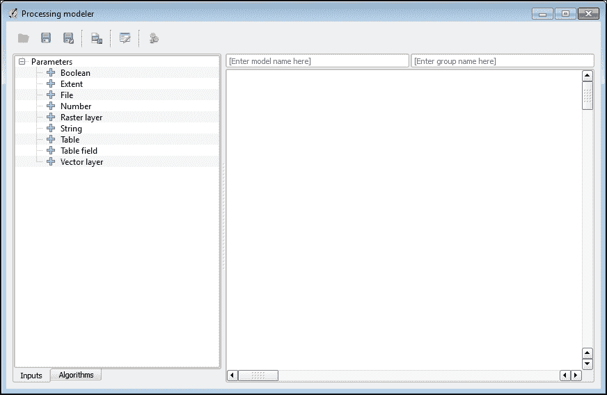

**Processing 模型器**窗口可以分为以下主要区域：

+   **工具栏**：它提供了一些有用的操作，例如打开现有模型、保存和导出模型、帮助编辑器等。

+   **输入和算法树**：这些位于窗口的左侧，包含两个标签页：一个包含可用的输入，另一个包含可用的算法。值得注意的是，**算法**标签页支持与工具箱相同的算法显示模式：简化和高级。然而，请注意，此标签页中没有切换按钮来更改显示模式。如果您需要更改它，您应该在打开模型器之前在工具箱中完成。

+   **工作区**：用于显示模型结构。在这里，我们将放置我们的构建块并将它们相互连接。

模型的创建可以分为两个步骤：

1.  定义输入：这意味着我们需要指定哪些数据对于分析是必要的。我们在这里定义的所有输入项都将作为算法参数在以后表示，用户将能够根据他们的需求设置它们。

1.  定义工作流程：在此步骤中，我们建立输入项和算法之间的链接。换句话说，我们确定模型中的每个算法将如何使用其他算法的输入和输出。

让我们创建一个模型，使用分箱技术从点矢量层生成密度图，这在第五章的*使用六边形网格映射密度*部分中已有描述，*使用密度分析回答问题*。为了使这个例子更有用，我们将创建一个模型，不仅生成六边形密度网格，还生成方形密度网格。这样做是为了让您以后可以比较结果并选择您更喜欢的一个。

# 添加输入

模型创建的第一步是定义模型所需的输入。为此，我们应该遍历我们想要自动化的所有算法，并找出哪些输入项是必要的。必须记住，某些算法可能不需要单独的输入。它们将仅使用在先前步骤中获得的结果，或者换句话说，其他算法的输出。此外，某些输入可能并不重要，可以在模型中硬编码。

**处理模型器**支持以下类型的输入，这些输入可以在模型器窗口左侧的**输入**选项卡中找到：

+   数字：这用于整数和浮点值。添加时，必须指定允许的最小值和最大值以及默认值。

+   字符串：这是一个字符串字面量。只有一个额外的设置，即默认值。

+   布尔值：这是一个布尔值，通常用作复选框。必须指定默认状态：选中或未选中。

+   范围：这表示地理范围。

+   矢量层：这用于矢量层。如果需要，可以将支持的几何类型限制为可用类型之一，并使此输入可选。

+   栅格层：这表示 GDAL 支持的格式中的栅格层。它是可选的。

+   表格：这用于无几何表格，例如 DBF 文件。它是可选的。

+   表字段：这表示层属性表或无几何表的字段。必须指定从该字段中获取字段的父层。

+   文件：这用于表示文件和目录。

要添加输入，双击其名称。将打开一个**参数定义**对话框。其内容取决于输入类型，但所有输入类型都共有**参数名称**字段，其中必须指定至少输入的名称。当模型执行时，此文本将用作相应字段的标题。所有其他字段对于不同的输入都是不同的。

### 小贴士

添加输入或算法时，您也可以从输入/算法树拖放至模型器工作区。

一旦指定了所有设置，点击**确定**按钮。将在模型器工作区中添加一个新的输入块。

让我们从为我们的模型添加输入开始。第一个输入很明显；它是一个矢量层，用于创建密度图。双击**处理模型器**窗口中的**输入**选项卡中的**矢量层**项以打开**参数定义**对话框，其外观如下：

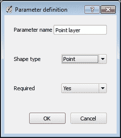

在**参数名称**中输入一个名称，例如，`点层`。因为我们不希望在以后看到所有可用的层作为输入，并且通过一个长长的列表搜索所需的层，我们可以通过在**形状类型**组合框中选择**点**几何类型来限制支持的几何类型。最后，因为这个输入是必需的，所以我们把**必需**字段保留为**是**。点击**确定**按钮将输入添加到模型器工作区。

为了能够根据我们的需求使我们的最终密度图更详细或更一般，我们需要一种调整单元格大小的方法。因此，双击**输入**选项卡中的**数字**项以添加另一个输入。

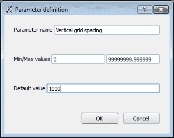

将“垂直网格间距”作为**参数名称**，如前一张截图所示。我们可以保留所有其他字段不变，但最好还是指定它们。这样做是为了防止用户输入错误。我们应该现在记住这样一个事实：不同的层可能具有不同的坐标参考系统（CRS）。因此，我们可能会有不同的距离单位。所以，我们的数值输入应该允许用户输入适合地理 CRS（度）和投影 CRS（米、英尺等）的值。这就是为什么我们使用`0`作为最小值，`99999999.999999`作为最大值。这些值允许我们在广泛的范围内更改单元格大小，而不考虑使用的 CRS。输入任何合理的值作为**默认值**，完成后点击**确定**。

由于水平和垂直方向上的单元格大小可能不同，我们需要使用之前看到的相同设置创建另一个名为“水平网格间距”的数值参数。

### 小贴士

如果您在水平和垂直方向上始终需要相同的间距，最好只使用一个输入参数，因为单个参数可以在同一算法中多次用作输入，甚至在不同算法中使用。稍后，我们可以调整我们的模型，使其只使用一个数值参数来定义网格间距。

如您从第五章的“使用六边形网格映射密度”部分中可能记得，在[使用密度分析回答问题](https://wiki.example.org/answering_questions_with_density_analysis)时，使用“创建网格”算法时，需要指定所需的网格范围，并且我们从输入层获取这个范围。

现在，为了设计我们的模型，我们有两种选择：

1.  定义网格范围的输入。这将使我们的模型变得更加复杂，因为每次我们使用模型时，我们需要指定网格范围，而不是只指定层。但这个选项也带来了更多的灵活性，因为通过为网格范围设置单独的输入，我们将能够生成不仅适用于整个层，而且适用于其中指定区域的密度图。

1.  从输入层获取范围。在这种情况下，我们的模型对用户来说将更加简单，因为他们只需要定义层和网格单元大小。但另一方面，密度图将生成整个层。

由于最常见的用例是整个层的密度图，我们选择了第二个选项。网格范围应自动从输入点层计算得出。

因此，我们几乎已经定义了我们模型所需的所有必要输入：输入层，以及代表水平和垂直方向网格单元大小的两个数字。只有一个输入尚未定义——网格范围。你将在下一节中学习如何从输入层中提取它，因为这与工作流程定义密切相关。

# 实现工作流程

当所有输入项都已就绪时，我们可以开始实现工作流程。所有可用的算法都可以在模型器窗口左侧的**算法**选项卡中找到。

工作流程实现与手动执行所有分析步骤非常相似：我们逐个添加算法，选择正确的输入，并在必要时定义输出。虽然模型器允许我们以任何随机顺序添加参数和算法，但最好按照它们应该执行的顺序添加算法，以避免混淆。让我们开始吧！

如您所记得，我们没有为网格范围添加单独的输入，您可能想知道我们将如何从点层中提取它，以与模型器输入兼容的格式。答案是简单的：我们将使用特殊的工具，这些工具被称为仅模型器工具。这些是什么？嗯，所有仅在**处理模型器**中可用的算法在工具箱中不可用。基本上，这些是可以在不同模型中真正有用的辅助工具，例如简单的计算器或值转换器。您可以在**算法**选项卡（因为它们也是算法）中的仅模型器工具组中找到这些工具。

目前，我们需要一个**矢量层范围**工具，它以矢量层作为输入，并返回其范围作为输出。

### 注意

除了范围之外，此工具还返回四个数值：最小和最大*x*坐标，以及最小和最大*y*坐标。您可以使用这些值作为不同算法的输入。

此输出值然后可以用于任何需要范围作为输入的算法。在过滤器字段中输入其名称以找到**矢量层边界**算法，然后双击它以打开如图所示的算法定义对话框。

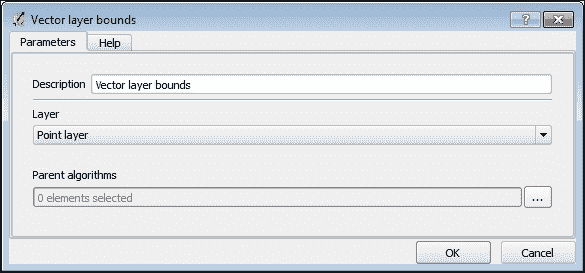

对话框非常简单。我们将在稍后讨论定义对话框。现在，我们只需在**层**组合框中选择之前添加的**点层**输入，然后点击**确定**按钮关闭对话框并将算法添加到模型器工作区。现在所有准备工作都已完成，我们准备实施主要工作流程。

我们分析的第一步是网格生成，因此切换到**算法**选项卡，在过滤器字段中输入其名称以找到`创建网格`算法，然后双击它以打开算法定义对话框。


如您所见，算法定义对话框的内容几乎与从工具箱中打开的算法对话框相同。主要区别如下：

+   没有用于报告算法执行进度和其他信息的**日志**选项卡。由于算法目前没有执行，因此此选项卡不需要。

+   有一个新的**描述**字段。它用于在模型中定义算法名称。默认情况下，此名称与原始算法名称相同。当模型包含几个代表相同算法但使用不同输入的算法块时，此功能非常有用。在这种情况下，只需为此算法分配不同的描述，你就不会在其中迷失方向。你将能够轻松识别它们的输出。

+   在定义对话框的底部有一个新的**父算法**参数，当算法从处理工具箱中执行时，该参数不存在。正如其名称所暗示的，此参数允许我们为所选算法定义父算法，换句话说，设置算法的执行顺序。父算法将按指定顺序执行，并在其子算法之前执行。

    默认情况下，当当前算法使用另一个算法的输出作为其输入时，后者自动成为当前算法的父算法，并在这两个算法之间创建一个链接。但有时，一个算法即使没有使用其任何输出，也可能依赖于另一个算法。以下是一个这样的情况的典型例子：在针对数据库层执行查询之前，必须创建数据库和层。

+   选择输入和输出的方法有所不同。所有值都可以从已添加到模型算法的算法生成的已可用模型输入和输出列表中选择。也可以在相应的字段中手动输入诸如数字、字符串、布尔值和表字段之类的值。请注意，如果你的模型是从工具箱中执行或作为另一个模型的一部分使用，则无法在设计时更改手动输入的值。因此，除非有紧急需要，否则不要硬编码值。

现在，继续为我们的模型定义`创建网格`算法。由于我们将使用相同的算法生成两个网格——六边形和正方形——我们需要区分算法块。因此，将**描述**字段改为`创建六边形网格`。我们通过从组合框中选择`六边形（多边形）`来硬编码**网格类型**参数，这是我们需要的。

在**网格范围**组合框中，选择`从算法'矢量图层边界'获取'范围'`。这是我们的输入图层范围，因此生成的六边形网格将覆盖它。

### 注意

在`从算法'矢量图层边界'获取'范围'`文本中，`'范围'`是算法的输出名称，`'矢量图层边界'`是从相应定义对话框的**描述**字段中获取的算法描述。因此，你可以轻松地检测出哪个输出来自哪个算法。

对于水平和垂直网格间距，从相应的组合框中选择之前定义的输入值。你可能注意到，除了我们定义的输入值之外，还有一些由**矢量图层边界**算法产生的附加值。忽略它们。

不要在**输出**字段中输入任何文本，因为这个算法生成的六边形网格是一个中间的、临时的输出，而不是最终结果。临时输出将被生成并存储在临时目录中，但在模型执行后永远不会添加到 QGIS 主画布上。如果你想要查看这些中间结果，有必要通过为它们输入描述来将它们转换为模型输出。

当所有参数都已分配值后，点击**确定**按钮将算法添加到模型器的工作区域。你会看到算法块现在已连接到其输入。点击**In**或**Out**标签附近的小**+**号将展开输入和/或输出的列表，以便你可以验证连接的正确性。第二次点击将它们折叠回原状。

添加另一个**创建网格**算法。将它的**描述**字段改为`创建正方形网格`，选择`矩形（多边形）`作为**网格类型**，并将所有其他参数设置为与我们之前创建六边形网格时相同。完成后，点击**确定**按钮。现在，模型器的工作区域中有两个算法块，它们使用相同的输入，如图所示：

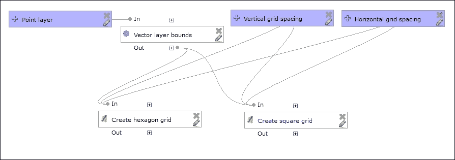

我们接下来应该添加的算法是**在多边形中计数点**。在模型器窗口的**算法**选项卡中通过在过滤器字段中输入其名称来找到它，并双击它以打开算法定义对话框：

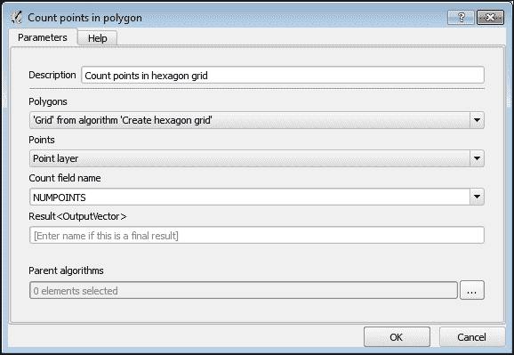

在这里，我们也编辑**描述**字段，以便能够区分不同网格的处理结果，例如，`Count points in hexagon grid`。如果你查看**多边形**和**点**组合框中可用的选项，你会看到它们都有一个相同的选项集：`点层`，`'Output' from algorithm 'Create hexagon grid'`，和`'Output' from algorithm 'Create square grid'`。第一个是我们之前定义的输入，第二个和第三个是由已添加的**创建网格**算法产生的结果。正如你所看到的，我们可以很容易地识别算法产生的结果，这要归功于它们不同的描述。

仔细的读者可能会问，“为什么我们在组合框中看到这两个项目？毕竟，它们有不同的几何类型，我们应该只看到具有匹配几何类型的输入项目。” 好吧，这是处理过程中的一个当前限制——模型器不执行任何准确的输入检查。它总是显示所有可用的输入及其对应类型（矢量、栅格或无几何表），尽管有定义的限制。

因此，在**多边形**组合框中，我们需要选择由**创建网格**算法生成的六边形网格（`'Output' from algorithm 'Create hexagon grid'`），并在**点**组合框中选择之前定义的`点层`输入。保持**计数字段名称**字段不变。此参数将在下一步中使用，并且可以安全地保持硬编码。

我们再次保持**结果**字段为空，因为在此阶段产生的密度图是一个临时、中间结果。它可能包含空单元格，应该被删除。最后，按下**确定**按钮以完成算法定义并将其添加到模型器工作区。

添加另一个**在多边形中计数点**算法以创建一个正方形密度图。将其描述设置为`Count points in square grid`，并将**多边形**输入选择为`'Output' from algorithm 'Create square grid'`的输出。所有其他参数应与上一个算法相同。同时，保持**结果**字段为空。

现在，我们可以添加最后一个算法来完成我们的简单模型——**按属性提取**。使用此算法，我们将从不含任何有用信息的单元格中清理我们的密度图。换句话说，我们将删除空单元格。

在模型器窗口的**算法**选项卡中通过在过滤器字段中输入其名称来找到**按属性提取**算法，并双击它以打开算法定义对话框：

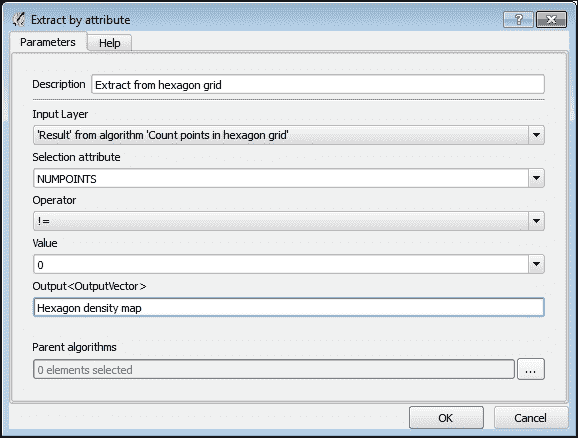

与之前一样，我们编辑**描述**字段以区分相同的算法块及其输出。对于描述，我们选择`从六边形网格提取`。在**输入层**组合框中，我们应该选择**计数多边形中的点**算法的输出——`'Result' from algorithm 'Count points in hexagon grid'`。由于我们在上一步硬编码了字段名称，我们在**选择属性**字段中输入相同的名称。从**运算符**组合框中选择`!=`（不等于），并在**值**字段中输入`0`。

由于此算法将生成我们希望以后使用的输出，因此有必要在**输出**字段中输入结果描述，例如，`六边形密度图`。点击**确定**按钮以完成算法定义并将其添加到模型器工作区。除了算法块外，这次还将添加一个输出块。

最后，添加另一个**按属性提取**算法以生成最终的方形密度图。别忘了调整算法描述，设置正确的输入，并指定输出名称。

目前，模型元素以略微随机的顺序放置，难以识别它们之间的链接。为了提高可读性并以更结构化的方式组织模型，我们可以拖动工作区内的所有块。它们之间的链接将被保留。如有必要，您也可以使用鼠标滚轮进行缩放。以下可能是最终模型的外观：

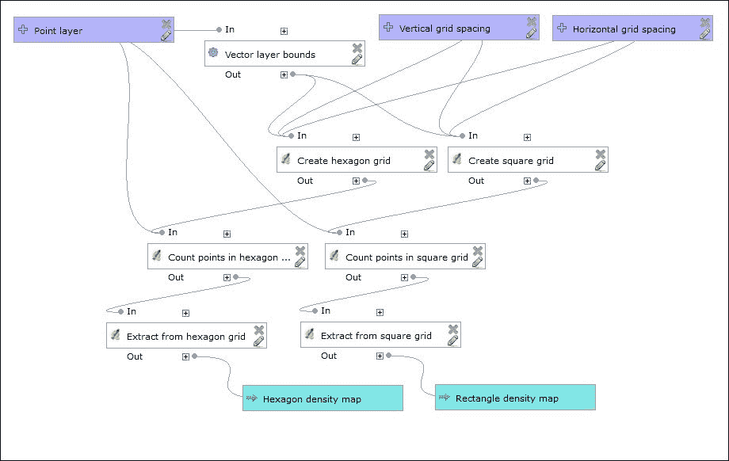

那就结束了！我们刚刚创建了我们第一个模型，如果您在 QGIS 中加载了图层，您可以通过点击工具栏上的**运行模型**按钮来尝试它。

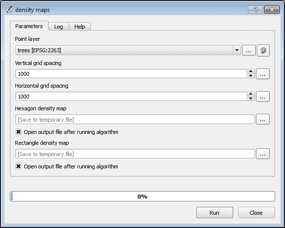

如您所见，模型执行对话框的外观和感觉与其他所有处理算法相同。可以从已提供的层中选择输入向量层，也可以从磁盘加载。数值可以通过旋转框选择，可以附带计算器，并保持我们设置的限制。

但现在不要关闭模型器！为了完全使用我们的模型，我们需要先从工具箱中以批处理方式运行它，并在其他模型中重用它，我们首先需要保存和记录它。这就是我们将在下一节中要做的。

# 填充模型元数据和保存

创建模型后，是否需要在磁盘上保存它，以便处理能够加载它并在工具箱中注册。

默认情况下，模型以 JSON 格式保存，扩展名为`.model`，位于 QGIS 用户文件夹中处理目录的子目录内。在 Windows 上，这通常是`C:\Users\login\.qgis2`（这里的`login`是您的 Windows 用户名），在 Linux 上则是`~/.qgis2`。如有必要，您始终可以使用**处理设置**对话框更改文件夹的位置。

当处理启动时，它会查找此目录中具有`.model`扩展名的文件并加载它们。加载的模型会出现在工具箱中的**模型**组中。此外，它们在模型器中与其他处理算法一样可用。

### 注意

有时，如果你正在加载第三方模型，可能会遇到错误。这主要是因为某些模型中使用的算法不可用。例如，某个算法提供者在处理设置中被禁用，或者模型需要额外的脚本/模型，而这些在处理中不可用。在这种情况下，仔细阅读错误消息并检查处理的日志，以了解哪些算法缺失。激活或安装它们，然后再次尝试加载有问题的模型。

在保存模型之前，有必要定义其名称和它将被放置的组。这些信息应输入在模型器工作区域上方的字段中。我们选择`密度`图作为模型名称，`分箱`作为组名称。如果你不喜欢这些名称，可以自由选择自己的名称。

当模型名称和组被定义后，点击工具栏中的**保存**按钮并输入模型的名称。当模型保存时，你会看到一个确认消息。

我们现在可以关闭模型器窗口，但不要急！记录你的模型是一个好习惯，即描述输入、执行的操作和最终结果。此类信息将极其有用，其他用户可能希望在自己的任务中重用该模型。此外，此元数据将有助于你回忆该模型是用于什么目的。

要开始编辑模型元数据，点击模型器对话框工具栏中的**编辑模型帮助**按钮。将打开一个**帮助编辑器**对话框，如下所示：

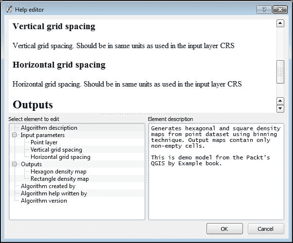

此对话框分为三个区域。在顶部是预览区域。在这里，当前的帮助内容被显示出来，以便你可以实时看到最终结果的外观。在左下角是元素树，其中列出了所有帮助部分，包括算法描述以及参数、输入和其他信息。在右下角是编辑区域。在这里，我们将输入对应元素的描述。

要编辑元素的描述，在元素列表中选择它，并在**元素描述**字段中输入文本。要保存更改，只需在元素树中选择另一个元素。

遍历元素树中的所有项目并输入它们的描述。例如，作为**算法描述**，你可以使用以下文本：

```py
Generates hexagonal and square density maps from point dataset using binning technique. Output maps contain only non-empty cells.
This is demo model from Packt's QGIS by Example book.
```

描述所有其他字段。尽量简短，同时尽可能提供有用的信息。不要解释明显的事情——最好专注于重要细节。例如，在网格间距输入的描述中，值得提到的是，网格间距应定义为与层使用的相同距离单位。完成操作后，单击**确定**按钮关闭**帮助编辑器**对话框。

当您在工具栏中单击**保存**按钮时，模型元数据将自动保存在与模型本身相同的文件中。

# 编辑模型

您也可以在模型器中加载任何现有的模型进行编辑。您可以通过以下方式完成此操作，例如调整一些硬编码的参数，重新定义工作流程，或者只是了解其工作原理。加载现有模型有两种方式：

1.  通过在搜索字段中输入模型名称，在工具箱中找到模型。右键单击模型以打开上下文菜单，并选择**编辑模型**。

1.  从**处理**菜单中打开处理模型器，从工具栏中单击**打开模型**按钮，并导航到模型文件。

要编辑任何输入或算法，请单击相应块右下角的小铅笔图标。您还可以通过右键单击打开的上下文菜单选择**编辑**。任何这些操作都会打开一个定义对话框，您可以在其中执行必要的更改，例如更新值或限制或重新连接元素。点击**确定**按钮后，对话框将关闭，如果需要，模型块之间的链接将更新。

要删除不必要的项目（输入或算法），请单击相应块右上角的小叉按钮，或从项目上下文菜单中选择**删除**。请注意，只有当没有其他元素依赖于它时，才能删除算法或输入。换句话说，输入不应被任何算法使用，算法输出不应在其他算法中用作输入。如果您尝试删除依赖于其他元素的块，您将看到警告消息，并且操作将被取消。

现在，让我们编辑我们的模型。在几乎所有用例中，网格单元在水平和垂直方向上都应该具有相同的尺寸。只保留模型中的一个数值参数是非常好的。这简化了模型，并使用户的生活更加简单，因为他们执行模型时需要输入的数据更少。

首先，我们需要编辑一个数值输入，并将其名称更改为与输入含义相匹配。单击**垂直网格间距**块右下角的小铅笔图标，将**参数**名称更改为`网格间距`，然后单击**确定**按钮以保存您的编辑。

### 注意

或者，您可以编辑**水平网格间距**输入。这种替换是完全安全的。

现在，打开**创建网格**算法的定义对话框，并在两个字段中：**水平间距**和**垂直间距**中选择`Grid spacing`输入。完成后，点击**确定**按钮保存您的编辑并关闭对话框。你会看到块之间的连接现在已更改——一个数值输入（其名称取决于你之前编辑的输入）没有连接到任何算法。要删除此输入，点击右上角的交叉。更新后的模型可能看起来像这样：

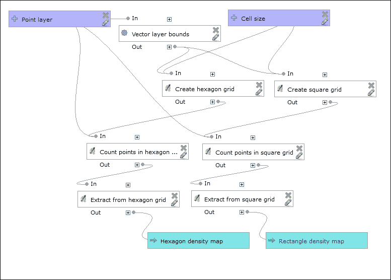

如果你想，可以将更新后的模型保存为一个新的模型。为此，只需输入一个不同的模型名称，如果需要，还可以输入一个组名称。然后，点击**另存为...**按钮，并为新的模型文件输入一个名称。

还可以在不删除相应块的情况下停用模型的一些部分——一个特定的算法甚至整个分支。当你不希望得到模型产生的所有输出或需要调试/测试其一小部分时，这个功能非常有用。

要停用算法，右键单击它，并在上下文菜单中选择**停用**。相应的算法块将被灰色显示，并且所有依赖于它的算法块也将自动停用。停用的算法在模型执行期间将被跳过，不会生成任何输出。这有一个优点——模型的执行时间会减少。请记住，算法的状态（激活/停用）正在模型文件中保存，在保存模型之前，请确保你没有遗漏任何内容。

要激活一个算法，右键单击它，并在上下文菜单中选择**激活**。请注意，这种激活只影响所选算法。所有依赖于它的算法都将保持未激活状态，你必须逐个激活它们。

例如，假设你不需要生成正方形密度图。当然，我们可以通过删除不必要的块并使用**另存为...**功能从现有模型创建一个新的模型。当你经常需要只生成六边形密度图时，创建新模型是有意义的。但如果是一次性需求，最好简单地停用模型中的**创建正方形网格**块，这样所有依赖的块也会被停用。因此，你可以执行模型，只生成六边形密度图，然后再次激活已停用的块。

# 分享模型

如果你创建了可能帮助其他用户的实用模型，那么与社区分享它们会很好，这样其他人就不需要重新发明轮子了。

由于保存的 Processing 模型是一个 JSON 格式的单个文件，因此与他人分享它的最简单方法是将其发送给感兴趣的人，或者将模型文件上传到任何文件共享或托管网站，并为每个人提供此文件的链接。

这是一种稍微复杂一些，但同时也非常方便和用户友好的方法：在处理模型和脚本社区存储库中发布您的模型。此存储库于 2014 年春季创建，为 QGIS 用户之间共享处理脚本和模型提供了一个集中的方式。

要将您的模型放入此存储库，您需要将 GitHub 存储库 ([`github.com/qgis/QGIS-Processing`](https://github.com/qgis/QGIS-Processing)) 分叉，在您的分叉中提交您的模型，并发出一个拉取请求。

### 小贴士

要了解更多关于 Git 的信息，可以使用 Packt 的书籍之一，例如 *Git：面向所有人的版本控制*，并参考 GitHub 文档，链接为 [`help.github.com/`](https://help.github.com/).

另一个选项是将模型发送到 qgis-developer 邮件列表，或者直接发送给 Processing 的开发者之一，并请他们将其放入存储库。

要从此存储库获取模型，请使用位于处理工具箱中 **模型** 项下的 **工具** 子组中的 **从在线脚本集合获取模型** 工具。

# 摘要

在本章中，您学习了如何使用 QGIS 处理框架中的图形模型器从多个算法创建地理处理模型。模型器允许我们将需要多个步骤的复杂分析组合成一个单一、易于使用的算法，从而实现自动化分析和提高生产力。

我们还涵盖了其他一些重要主题，包括记录模型并与其他用户共享。
