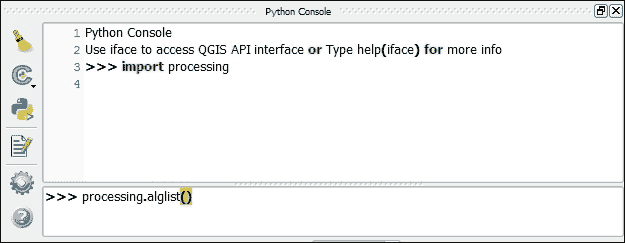
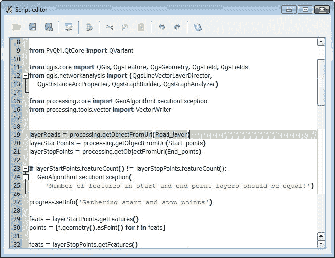
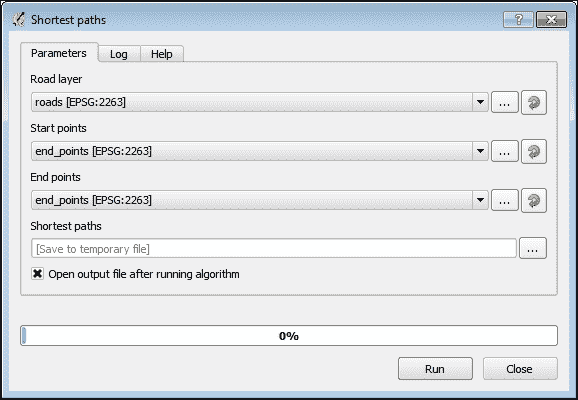
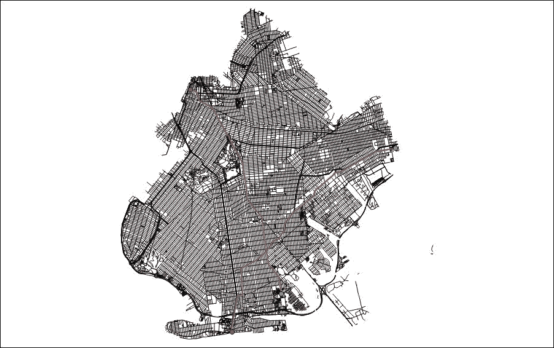
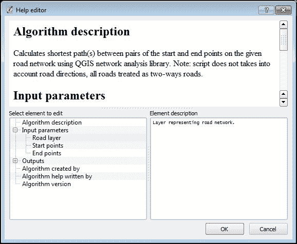

# 第九章. 使用 Processing 脚本自动化分析

在上一章中，我们介绍了 Processing 图形模型器，并学习了如何使用它来自动化复杂的地处理分析。但这并不是自动化您工作的唯一方式。QGIS 的 Processing 框架还允许您使用 Python 编写自己的脚本，并在以后像使用任何其他算法一样使用它们。这就是本章将要讨论的内容。

在本章中，我们将讨论以下主题：

+   Processing 中的 Python 脚本

+   定义输入和输出

+   实现算法

+   编写帮助并保存

+   分享脚本

# Processing 中的 Python 脚本

你已经学会了如何使用 QGIS 处理框架中的图形模型器创建模型和自动化分析任务。尽管 Processing 模型器用户友好且易于使用，但它有一些限制：

+   在模型中，您只能使用 Processing 中已经可用的算法。此外，一些在 Processing 工具箱中可用的算法在模型器中不可用。

+   不支持条件语句和循环。

因此，如果您需要实现更复杂和高级的功能，您将需要另一个工具。幸运的是，模型器并不是自动化分析的唯一方式。Processing 还允许我们通过开发 Python 脚本来结合其自身的能力与 Python 编程语言的力量。然后，这些脚本可以像 Processing 工具箱或模型器中的任何其他算法一样使用，或者作为批处理过程执行。

在我们开始实现脚本之前，了解如何从 QGIS Python 控制台使用 Processing 算法是必要的，因为这种知识对于在脚本中成功使用现有的 Processing 算法是必需的。

现在，通过点击**插件**工具栏上的按钮打开 Python 控制台。或者，您可以使用*Ctrl* + *Alt* + *P*键盘快捷键或通过转到**插件** | **Python 控制台**来打开它。QGIS 窗口底部将出现一个新的浮动窗口，如下面的截图所示：



Python 控制台由两个主要区域组成。在顶部是输出区域，其中将打印执行命令及其输出。在其下方是输入区域，您应在此处输入要执行的代码。在这里，代码是逐行输入的。Python 控制台的左侧还有一个工具栏。

### 小贴士

如果你想了解更多关于 Python 控制台的信息，请点击其工具栏上的**帮助**按钮并阅读内置文档。

要从 Python 控制台开始使用 Processing，我们应该使用以下命令导入它：

```py
import processing

```

这行代码将加载所有 Processing 函数并使它们对我们可用。

## 列出可用算法

你可能希望从你的脚本中运行现有的 Processing 算法，而不是自己重新实现其功能。为此，需要获取该算法的名称，这并不是你在工具箱中看到的名字，而是一个特殊名称——所谓的命令行名称。

### 注意

Processing 中的每个算法都有两个名称：一个用于工具箱和模型器中的人可读且用户友好的名称，以及另一个内部命令行名称，其中不包含任何歧义字符，例如空格、分号等。它还包含有关算法提供者的信息。命令行名称是唯一的。

要列出所有可用的 Processing 算法及其命令行名称，请运行以下 Python 控制台命令：

```py
processing.alglist()
```

你将得到一个非常长的输出，可能看起来像这样（已截断）：

```py
Calculator------------------------------------------->modelertools:calculator
Raster layer bounds---------------------------------->modelertools:rasterlayerbounds
Vector layer bounds---------------------------------->modelertools:vectorlayerbounds
Add autoincremental field---------------------------->qgis:addautoincrementalfield
Add field to attributes table------------------------>qgis:addfieldtoattributestable
Advanced Python field calculator--------------------->qgis:advancedpythonfieldcalculator
Bar plot--------------------------------------------->qgis:barplot
Basic statistics for numeric fields------------------>qgis:basicstatisticsfornumericfields
Basic statistics for text fields--------------------->qgis:basicstatisticsfortextfields
Clip------------------------------------------------->qgis:clip

```

在左侧，你可以看到在工具箱中也使用的人可读算法名称，而在右侧是相应的命令行名称。

由于算法的数量——即使在默认的 QGIS 安装中——也非常大，可能很难找到所需算法的命令行名称。幸运的是，可以通过 `alglist()` 命令减少输出。只需向其中传递一个字符串参数，表示应存在于算法名称中的子串。例如，要仅显示名称中包含`count`一词的算法，请执行以下代码：

```py
processing.alglist('count')

```

结果将更短，并且更容易找到你正在寻找的算法：

```py
Count points in polygon------------------------------>qgis:countpointsinpolygon
Count points in polygon(weighted)-------------------->qgis:countpointsinpolygonweighted
Count unique points in polygon----------------------->qgis:countuniquepointsinpolygon
v.qcount - Indices for quadrant counts of sites lists.--->grass:v.qcount

```

现在我们知道了如何获取所需算法的命令行名称。但为了运行该算法，我们还需要了解一些更多信息。

## 获取算法信息

要执行一个算法，我们不仅需要其名称，还需要其语法。这包括有关算法输入和输出的列表，以及它们应该按何种顺序传递给算法的信息。所有这些信息都可以通过 `processing.alghelp()` 命令获得。此命令仅接受一个参数——命令行算法名称，并返回一个包含算法输入和输出的列表，以及它们的类型。

以往章节中使用的 `Create grid` 算法为例。它的命令行名称是 `qgis:creategrid`（你可以通过前述部分的信息轻松检查这一点），因此要获取其语法信息，我们应该在 QGIS Python 控制台中执行下一个命令：

```py
processing.alghelp('qgis:creategrid')

```

这是此命令的输出：

```py
ALGORITHM: Create grid
 TYPE <ParameterSelection>
 EXTENT <ParameterExtent>
 HSPACING <ParameterNumber>
 VSPACING <ParameterNumber>
 OUTPUT <OutputVector>

TYPE(Grid type)
 0 - Rectangle (line)
 1 - Rectangle (polygon)
 2 - Diamond (polygon)
 3 - Hexagon (polygon)

```

从这个输出中，我们可以看到人类可读的算法名称是`Create` `grid`，它接受四个输入字段：`TYPE`（从预定义值列表中选择）、`EXTENT`（范围）、`HSPACING`和`VSPACING`（这两个都是数字）。该算法已生成一个矢量输出。然而，最有趣的部分是在参数和输出列表下方；它是`TYPE`选择参数的可用值列表。左侧的数字是可以传递给算法的值，右侧可以看到每个值的可读描述。例如，如果您想创建一个菱形单元格的网格，那么必须将值`2`传递给`TYPE`参数。

现在我们来看一下不同的参数类型应该如何传递给算法：

+   **栅格或矢量图层和表格** (`ParameterVector`, `ParameterRaster`, 和 `ParameterTable`): 如果该图层已在 QGIS 中加载，则可以指定相应图层或表格的名称。您还可以使用图层文件的路径。最后，可以传递相应 QGIS 类的实例，例如，`QgsVectorLayer`。如果这是一个可选输入并且您不想使用它，只需使用`None`值。

+   **从预定义值中选择** (`ParameterSelection`): 应该用对应值的数值索引表示。值与索引之间的映射作为`processing.alghelp()`函数输出的部分显示，如前所述。还有一个单独的命令用于列出此类匹配项——`processing.algoptions()`函数。此命令仅接受一个参数——算法的命令行名称——其输出是所有具有选择类型的算法参数的选项索引与值的匹配。

+   **多个输入** (`ParameterMultipleInput`): 应该用分号（`;`）分隔的字符串传递。每个值可以是图层名称或文件的路径。

+   **表格字段** (`ParameterTableField`): 这只是一个包含字段名称的字符串。请注意，这个值是区分大小写的。

+   **用户定义的表格** (`ParameterFixedTable`): 这被定义为用逗号分隔的值列表，并用双引号括起来。此外，还可以传递一个包含值的二维列表或数组；例如，一个小型的 2 x 2 表格可以作为一个二维 Python 列表传递，如下所示：`[[0, 1], [2, 3]]`。请注意，值应从最顶部的行开始，从左到右排列。

+   **坐标参考系统** (`ParameterCrs`): 使用相应 CRS 的 EPSG 代码。

+   **范围** (`ParameterExtent`): 这表示为包含`xmin`、`xmax`、`ymin`和`ymax`值的字符串，这些值由逗号（`,`）分隔。

+   **数值** (`ParameterNumber`)、**布尔** (`ParameterBoolean`) 和 **字符串** (`ParameterString`) **参数**：这些由相应的原生 Python 数据类型表示：`int`、`float`、`boolean`、`str` 或 `unicode`。此外，此类参数可能有默认值。要使用它们，在相应参数的位置指定 `None`。

对于输出数据，规则要简单得多。如果你想将图层、表格、文件或 HTML 输出保存到特定位置，只需传递文件路径。在栅格和矢量输出的情况下，文件的扩展名将决定输出格式。如果给定的扩展名不受算法支持，输出将保存为默认格式（这取决于算法），并将相应的扩展名添加到指定的文件路径中。要写入临时文件，传递 `None` 值。

当从 Python 控制台运行算法时，你不需要为数值和字符串输出定义任何变量。这些将自动计算并返回，无需你采取任何行动。有关访问此类输出的更多信息，请参阅本章的 *执行算法和加载结果* 部分。

现在你已经了解了算法语法以及如何向其传递参数，我们可以从 QGIS Python 控制台执行算法。

## 执行算法和加载结果

要从 QGIS Python 控制台执行算法，我们需要使用 `processing.runalg()` 方法。通常，该方法以以下方式调用：

```py
results = processing.runalg(algorithm_name, param1, param2, …, paramN, output1, output2, …, outputM)

```

在这里，`algorithm_name` 是命令行算法名称，`param1...paramN` 是算法参数，而 `output1...outputM` 是算法输出。参数和输出应该按照 `alghelp()` 方法显示的顺序传递，考虑到上一节中定义输入和输出的信息。

### 注意

如我们之前提到的，对于数值、字符串或布尔输出，你不需要指定任何变量。

如果算法报告其执行进度，在执行过程中，主 QGIS 窗口将显示一个带有进度指示器的消息栏。

与从工具箱中执行算法不同，`runalg()` 方法不会将任何结果加载到 QGIS 中。你可以使用 QGIS API 或以下方式使用 Processing 提供的辅助方法手动加载它们。

算法成功执行后，`runalg()` 方法返回一个字典，其中输出名称（如 `alghelp()` 方法所示）是键，它们的值是生成文件的路径或包含计算值。

要加载生成的栅格或矢量图层，将对应文件的路径传递给 `load()` 方法。例如，如果算法执行的结果保存在 `res` 变量中，输出名称为 `OUTPUT`，那么要将此图层加载到 QGIS 中，请执行以下代码：

```py
processing.load(res['OUTPUT'])
```

然后，该图层将被加载到 QGIS 中。

要访问结果字典中的数字或字符串输出，只需使用相应的键名。

让我们从布鲁克林树木地籍（这是我们数据集中的`trees`层）加载数据，并尝试理解下一个小型示例是如何工作以及它做了什么。请在 QGIS Python 控制台中逐个运行这些命令。如果需要，可以使用`processing`辅助方法，例如`alglist()`和`alghelp()`，并按照之前所述通过打印或加载到 QGIS 中来检查结果：

```py
(1) import processing
(2) resGrid = processing.runalg('qgis:creategrid', 3, '972921.0000478327274323,1023822.9999672472476959,147696.9999549686908722,208209.0000113248825073', 1000, 1000, None)
(3) resCount = processing.runalg('qgis:countpointsinpolygon', resGrid['OUTPUT'], 'trees', 'NUMPOINTS', None)
(4) finalMap = processing.runalg('qgis:extractbyattribute', resCount['OUTPUT'], 'NUMPOINTS', 1, '0', None)
(5) processing.load(finalMap['OUTPUT'])

```

如果您仔细阅读了前面的章节，您应该理解这些命令是用来从点层生成六边形密度图的。在第一行，我们导入`processing`模块及其所有算法。在第二行，执行`Create grid`算法，并使用`trees`层的范围和`1000`的单元格大小创建一个六边形网格（值为`3`的参数表示六边形网格类型）。结果保存在一个临时文件中，因为我们传递了`None`值作为最后一个参数。在行`3`，执行`Count points in polygon`算法。作为一个多边形层，它使用`Create grid`算法的输出（`resGrid['OUTPUT']`），作为点层，使用 QGIS 中已经打开的树木层。同样，结果也保存在临时文件中。然后，在行`4`，调用`Extract by attribute`算法来保存非空单元格（值为`1`的参数对应于不等于运算符，`!=`）。最后，使用最后一行，将最终结果加载到 QGIS 中。

现在，您已经知道了如何获取有关 Processing 算法的所有必要信息，并且可以从 QGIS Python 控制台使用它们，我们可以深入到 Processing 脚本开发中。

# 定义输入和输出

正如我们之前所说的，尽管有模型，您可以使用 Python 编程语言创建自己的 Processing 脚本。基本上，Processing 脚本就是 Python 代码加上 Processing 所需的一些附加元数据。

每个 Processing 脚本都以一个特殊的元数据块开始。Processing 需要这些信息来注册脚本作为算法，并从工具箱、模型器等中使用它。每个元数据条目都放在新的一行上，以双 Python 注释符号（`##`）开始，并具有以下结构：

```py
element_name = element_type [optional_parameters]

```

元数据项可以分为三组：描述脚本的项目、描述脚本输入的项目和描述脚本输出的项目。

描述脚本的只有三个项目：

+   `group`：这用于定义脚本将在工具箱中的**Scripts**组内的子组名称。例如，如果您在脚本标题中放入以下行`##Density maps=group`，它将被放置在**Density maps**子组下。如果省略此项目，脚本将放置在**User**下的**Scripts**子组中。

+   `name`：这定义了脚本名称。默认情况下，脚本名称是通过删除扩展名并将下划线替换为空格从脚本文件名生成的。如果您不想使用长描述性文件名来为您的脚本命名，但仍然想在 Processing 工具箱中拥有好名字，请使用`name`元数据项。其语法与`group`项相同，例如，`##Hexagonal_density_map=name`。

+   `nomodeler`：这是一个标志项。带有此类元数据的脚本只能从工具箱中使用，它们在模型器中不可用。其用法如下：`##nomodeler`。

用于描述脚本输入的元数据项的数量要大得多。脚本支持几乎在 Processing 中可用的所有输入。有必要指出，项目名称也将是变量名，并且可以在脚本代码中使用。用户在执行脚本时输入或选择的值将被分配给相应的变量。

此外，项目名称将被用作算法执行对话框中相应小部件的标题。为了改善外观，下划线将被替换为空格。因此，如果您在脚本中有一个名为`My_cool_parameter`的项目，那么其小部件的标题将是**My** **cool** **parameter**。要访问此参数的值，我们需要使用`My_cool_parameter`变量。

让我们看看可用的输入参数：

+   `raster`：这描述了输入栅格图层。这里是一个用法示例：`##Raster_layer=raster`。

+   `vector`：这描述了输入矢量图层。请注意，如果您的脚本接受任何几何类型的矢量图层（点、线或多边形），则应使用此项目。如果您想限制支持的几何类型，请使用以下项目之一。其用法示例为：`##Vector_layer=vector`。

+   `vector point`：这描述了输入点矢量图层。此项目仅接受具有点几何的图层。请注意，这种限制仅适用于已加载到 QGIS 中的图层。如果用户想指定磁盘上的文件，则选择具有正确几何类型的图层是他们的责任。其用法如下：`##Vector_layer=vector point`。

+   `vector line`：这描述了输入线矢量图层。此项目仅接受具有线几何的矢量。同样，请注意，这种限制仅适用于已加载到 QGIS 中的图层。如果用户想指定磁盘上的文件，则选择具有正确几何类型的图层是他们的责任。其用法如下：`##Vector_layer=vector line`。

+   `vector polygon`: 这描述了输入的多边形矢量层。此项目仅接受具有多边形几何形状的矢量。再次提醒，这种限制仅适用于已在 QGIS 中加载的层。如果用户想指定来自磁盘的文件，则选择具有正确几何类型的层是他们的责任。一个用法示例如下：`##Vector_layer=vector polygon`。

+   `table`: 这用于定义一个无几何信息的输入表。其用法如下：`##Table_to_join=table`。

+   `multiple raster`: 这用于定义由多个栅格层组成的复合输入。一个用法示例如下：`##Layers_to_mosaic=multiple raster`。

+   `multiple vector`: 这用于定义由多个矢量层组成的复合输入。请注意，此输入允许我们选择任何矢量层，无论其几何类型如何。其用法如下：`##Layers_to_merge=multiple vector`。

+   `selection`: 这描述了从预定义值列表中的选择。项目类型之后指定的值由分号分隔。一个用法示例如下：`##Method=selection Nearest neighbor;Average;Cubic`。

+   `boolean`: 这定义了一个布尔（也常称为逻辑）输入。必须指定一个默认值。其用法如下：`##Smooth_results=boolean False`。

+   `extent`: 这定义了输入范围。其用法如下：`##Grid_extent=extent`。

+   `file`: 这用于定义一个输入文件（在文本或其他 Processing 无法识别为栅格、矢量或表的任何格式中）。一个用法示例如下：`##Index_data=file`。

+   `folder`: 这描述了输入目录。其用法如下：`##Input_directory=directory`。

+   `number`: 这定义了一个数值（整数或浮点数）输入。必须指定一个默认值。如果默认值没有小数分隔符，则该参数将仅接受整数值。目前，在脚本中无法为这类参数定义最小和最大限制。一个用法示例如下：`##Width=number 1000.0`。

+   `field`: 这描述了矢量层或无几何信息表中的属性字段。必须指定表示父层或表的对应输入的名称。例如，如果矢量层被定义为 `##Input_layer=vector`，那么这个层的字段将被定义为 `##Classification_field=field Input_layer`。

+   `string`: 这用于定义一个字符串输入。必须指定一个默认值。其用法如下：`##Field_name=string NUMPOINTS`。

+   `longstring`: 这定义了一个多行字符串输入。必须指定一个默认值。其用法的一个例子如下：`##Options=longstring my cool options`。

+   `crs`: 这描述了坐标参考系统。默认情况下，使用 EPSG:4326。如果您想指定另一个默认 CRS，请指定其`EPSG`代码。其用法如下：`##Assign_CRS=crs EPSG:3857`。

输入图层和表始终作为包含对应文件路径的字符串传递给脚本。要从这样的字符串创建 QGIS 对象（`QgsVectorLayer`或`QgsRasterLayer`），我们需要使用`processing.getObjectFromUri()`函数。多个栅格或矢量输入也作为包含由分号分隔的各个文件路径的字符串传递。

这里列出了所有可用的输出：

+   `输出栅格`: 这代表由脚本生成的栅格图层。其用法如下：`##NDVI 栅格输出=输出栅格`。

+   `输出矢量`: 这代表由脚本生成的矢量图层。其用法示例如下：`##矢量网格输出=输出矢量`。

+   `输出表格`: 这代表由脚本生成的无几何表格。这可以是 CVS 或 DBF 表格。其用法如下：`##最近点输出=输出表格`。

+   `输出 HTML`: 这描述了 HTML 格式的输出。这种输出主要用于可能包含或不包含图形的不同文本报告。其用法示例如下：`##统计输出=输出 HTML`。

+   `输出文件`: 这用于格式不同于 HTML 以及 QGIS 支持的所有其他格式的文件。例如，这些可以是纯文本文件、LiDAR 数据等。其用法如下：`##点连接输出=输出文件`。

+   `输出目录`: 这描述了输出目录。它主要用于生成许多文件的算法，例如，当按属性值分割矢量图层时。其用法示例如下：`##分割文件输出=输出目录`。

    ### 注意

    注意，目前，处理工具无法从这样的输出目录中加载文件，即使这些文件是支持的格式。您需要手动从输出目录打开每个文件。

+   `输出数值`: 这代表由算法生成的数值。此值不会保存到任何地方，只能用作另一个算法的输入。例如，可以编写脚本以计算矢量网格的最佳单元格大小，然后此类算法的数值输出可以用作创建网格算法的输入。其用法示例如下：`##最大值输出=输出数值`。

+   `输出字符串`: 这与前面描述的输出数值类似。它代表由算法生成的字符串字面量。其用法如下：`##选择条件输出=输出字符串`。

数值和字符串输出也称为隐藏输出（因为它们在 QGIS 和处理的输出对话框中不显示），并且不会自动初始化为值。您应手动分配相应的值给它们。

所有其他输出都将始终是一个字符串值，包含对应输出文件或目录的路径。如果用户未指定任何文件名，则输出将保存到自动创建的临时文件中，该文件的名称将用作输出值。

值得注意的是，在成功执行算法后，Processing 将自动加载所有支持的格式中的输出文件。因此，您不需要在脚本中添加任何 `processing.load()` 函数调用。

# 实现算法

现在，当我们知道如何定义输入和输出时，我们就准备好为 Processing 开发 Python 脚本了。

创建脚本有两种方法：

+   使用您喜欢的文本编辑器或集成开发环境（IDE）

+   使用 Processing 的内置代码编辑器

使用哪种方法是一个口味和习惯的问题。在这本书中，我们将使用内置脚本编辑器。您可以从 Processing 工具箱中打开它。定位并展开 **脚本** 组，展开 **工具** 子组，然后双击 **创建新脚本** 项。或者，您可以在过滤器字段中开始键入 `创建新脚本`。工具箱的内容将被过滤，您可以轻松找到相应的项。



**脚本编辑器**看起来像前面截图所示的普通文本编辑器。顶部有一个工具栏，其余所有区域都由编辑器本身占用。

现在，我们将通过开发一个用于在道路网络上找到两点之间最短路径的脚本，来了解如何创建 Processing Python 脚本。这种分析在许多应用领域都非常常见，例如基础设施规划、旅行/出行规划等。

QGIS 拥有一个简单的内置网络分析库，允许我们使用 **Dijkstra 算法**在两点之间找到最短路径，并且还可以执行一些其他有趣的事情，例如构建可达区域（也称为服务区域）以及将点匹配到最近的线。

首先，我们需要确定脚本的输入和输出。作为输入，我们需要一个道路图层、一个起点和一个终点。由于 Processing 不支持点作为输入，最简单的解决方案是传递两个矢量，一个用于起点，另一个用于终点。这种解决方案还允许我们定义多个起点和终点，并找到每对起点和终点之间的最短路径。至于输出，我们的脚本显然只有一个输出——一个包含计算出的最短路径（或路径）的矢量图层。

因此，脚本头将看起来像这样。如果您仔细阅读了前面的章节，应该没有问题理解它：

```py
1 ##Network analysis=group
2 ##Shortest paths=name
3 ##Road_layer=vector line
4 ##Start_points=vector point
5 ##End_points=vector point
6 ##Shortest_paths=output vector

```

在前两行中，我们定义了脚本将放置的组以及脚本名称。然后，我们定义了输入和输出。请注意，我们使用精确的定义来指定输入矢量图层，这样当用户在输入组合框中运行脚本时，他们只会看到与参数定义匹配的几何类型的图层。例如，在道路图层组合框中，只会列出线矢量图层。

在脚本头之后，脚本主体开始。它包含实现所需算法的 Python 代码。脚本主体可以分为两部分：导入部分和代码本身。

仅使用 Python 的基本命令，只能实现非常简单的脚本。任何更复杂或更简单的算法都需要额外的类或库，例如来自 Python 标准库、QGIS 和 Processing 库，甚至是一些第三方包。要在您的代码中使用这些库，您需要导入它们。

通常，这是基于迭代进行的：您编写代码，当需要新的类或库时，添加相应的导入语句。通常，所有导入语句都放置在源文件的非常开始处。为了简化，在我们的示例脚本中，我们将从开始提供所有必要的导入。相应的代码将如下所示：

```py
(1) from PyQt4.QtCore import QVariant
(2)
(3) from qgis.core import QGis, QgsFeature, QgsGeometry, QgsField, QgsFields
(4) from qgis.networkanalysis import (QgsLineVectorLayerDirector,
(5)    QgsDistanceArcProperter, QgsGraphBuilder, QgsGraphAnalyzer)
(6)
(7) from processing.core import GeoAlgorithmExecutionException
(8) from processing.tools.vector import VectorWriter
```

如您所见，所有导入都被分为三个逻辑块，它们之间用空行隔开。在第一行，我们从`PyQt4`库的`QtCore`包中导入`QVariant`类。这个类包含了通用变体数据类型的定义，它将被用来声明矢量层的属性。

在第二个块中，我们导入了来自 QGIS 核心库（块的第一个行）和 QGIS 网络分析库（块的第二个行）的各种非 GUI 类。我们需要这些 QGIS 核心类来构建表示最短路径的输出矢量特征。此外，来自 QGIS 网络分析库的类为我们提供了执行网络分析所需的一切。

最后，在最后一个块中，我们从 QGIS 处理框架的不同模块中导入了一些类。`GeoAlgorithmExecutionException`类将被用来从我们的脚本中引发异常，而`VectorWriter`是一个辅助类，它允许我们轻松地将输出矢量数据写入任何 QGIS 支持的格式。

现在我们可以实现算法本身。如您在前面章节中学到的，所有我们的输入——道路层以及起点和终点的层——都是以对应文件路径的形式传递的，因此有必要从它们中创建层对象以供进一步使用。这可以通过以下代码完成：

```py
(1) layerRoads = processing.getObjectFromUri(Road_layer)
(2) layerStartPoints = processing.getObjectFromUri(Start_points)
(3) layerStopPoints = processing.getObjectFromUri(End_points)
```

我们使用处理包中的`getObjectFromUri()`函数。它接受文件路径或任何其他 URI，并从中返回一个有效的层（根据 URI 是栅格或矢量）。请注意，我们在`getObjectFromUri()`函数调用中将脚本头中定义的输入名称作为参数指定。正如我们在“定义输入和输出”部分中提到的，代表输入值具有与相应输入相同的名称。

由于我们为起始点和结束点使用单独的层，因此有必要验证这两个层具有相同数量的特征，因为如果点的数量不同，将无法创建起始点-结束点对；一些点将没有配对。以下是此类检查的代码：

```py
(1) if layerStartPoints.featureCount() != layerStopPoints.featureCount():
(2)    GeoAlgorithmExecutionException(
(3)       'Number of features in start and end point layers should be equal!')
```

我们使用`featureCount()`方法来获取具有起始点和结束点的层的特征数量，并进行比较。如果数字不相等，将引发异常并终止算法执行。

### 小贴士

在需要由于任何错误而终止脚本执行时，始终抛出`GeoAlgorithmExecutionException`。在这种情况下，用户将看到一个带有错误消息的标准对话框，并且错误将被记录在日志中。

通常，算法需要一些时间才能完成，因此通知用户执行进度并提供有关已完成步骤的信息是良好的实践，这样用户就会知道程序没有冻结。为此，Processing 中的每个算法都提供了一个特殊的`progress`对象。借助它，您可以轻松地向用户显示不同类型的消息（信息、调试、顺序文本等），以及使用进度条显示执行进度。

我们的脚本也不例外。在分析过程中应执行几个可能需要较长时间的任务。首先是收集所有起始点和结束点的坐标，这些坐标将在后续的路线图生成步骤中使用。相应的代码如下：

```py
(1) progress.setInfo('Gathering start and stop points')
(2)
(3) feats = layerStartPoints.getFeatures()
(4) points = [f.geometry().asPoint() for f in feats]
(5)
(6) feats = layerStopPoints.getFeatures()
(7) tmp = [f.geometry().asPoint() for f in feats]
(8) points.extend(tmp)
```

在第一行，我们使用`progress.setInfo()`命令向用户显示一条信息消息。

### 注意

除了显示普通文本（`setText()`）、调试信息（`setDebugInfo()`）、控制台输出（`setConsoleInfo()`）和其他消息类型外，还有专门的命令。

此消息将在算法对话框的**日志**选项卡中显示。

然后，我们对具有起始点的层的特征使用迭代器，提取每个特征的几何形状，将其转换为`QgsPoint`实例，并将其存储在`points`列表中。

使用相同的方法，我们创建另一个名为`tmp`的列表，其中包含包含我们的终点的层的资料。在最后一行，我们将这两个列表合并为一个，因此我们的`points`列表将包含起点和终点。我们需要将所有点放入一个单独的列表中，因为稍后所有点都必须与我们的道路网络相关联。此操作是在创建图的同时一次性对所有点进行的。由于两个层中的点数相等，我们可以很容易地使用非常简单的数学方法访问起点和终点的配对。假设每个层中的点数为*N*，并且知道 Python 中列表索引从*0*开始，我们可以这样说，起点将具有从*0*到*N-1*的索引，而终点的索引将从*N*到*2N-1*。因此，如果我们知道一个起点的索引，很容易通过将任何输入层中的点总数加到起点的索引上来得到相应的终点的索引。

由于我们的脚本将生成一个输出矢量层，因此有必要准备一个特殊对象来保存其中的要素。幸运的是，Processing 有`VectorWriter`类，它为我们提供了一个方便的方式来以任何 OGR 支持的格式或 QGIS 内存层保存矢量数据，而无需编写很多代码。以下是创建此类写入对象的代码：

```py
(1) fields = QgsFields()
(2) fields.append(QgsField('id', QVariant.Int, '', 10))
(3) fields.append(QgsField('startPoint', QVariant.String, '', 254))
(4) fields.append(QgsField('endPoint', QVariant.String, '', 254))
(5) fields.append(QgsField('length', QVariant.Double, '', 20, 7))
(6)
(7) writer = VectorWriter(Shortest_paths, None, fields.toList(),
(8)                   QGis.WKBLineString, layerRoads.crs())
```

在这里的前五行代码中，我们创建了一个`QgsFields`容器的实例，其中将保存我们的属性定义，并对其进行填充。我们的示例脚本输出层将具有四个属性：

+   `id`：这是路径的整数数字标识符

+   `startPoint`：这些是路径起点的坐标，以(*x*, *y*)格式表示

+   `endPoint`：这些是路径终点的坐标，以(*x*, *y*)格式表示

+   `length`：这是路径的总长度

在最后一行，创建了一个`VectorWriter`类的实例。我们将用户定义的输出文件路径、我们之前创建的属性列表、几何类型和坐标参考系统传递给构造函数。请注意，作为输出文件路径，我们指定了在脚本标题中用来描述输出的相同变量。此外，坐标参考系统是从输入的道路层中获取的，因此我们的输出将使用相同的 CRS。

目前所需的大部分准备工作都已完成，现在我们可以使用 QGIS 网络分析库从我们的道路层创建一个图。这一步是必要的，因为网络分析是使用图而不是矢量层进行的。在创建图之前，必须实例化所有所需的类并调整设置。以下代码行展示了如何进行此操作：

```py
(1) director = QgsLineVectorLayerDirector(layerRoads, -1, '', '', '', 3)
(2) properter = QgsDistanceArcProperter()
(3) director.addProperter(properter)
(4) builder = QgsGraphBuilder(layerRoads.crs())
```

首先，我们实例化所谓的导演，这是一个基类，它调整图创建过程中的某些设置。导演接受以下解释的参数：

+   构建图表的线向量层。

+   存储道路方向的属性字段索引。由于我们不考虑道路方向，我们将传递`-1`。

+   表示单行道路直接方向的属性值。直接方向意味着你只能从道路的起点移动到终点。在我们的例子中，我们不会使用方向信息，因此我们传递一个空字符串。

+   表示单行道路反向方向的属性值。当道路有反向方向时，你只能从道路的终点移动到起点。在我们的例子中，我们不会使用方向信息，因此我们传递一个空字符串。

+   表示双向或双向道路的属性值。双向道路是最常见的道路。它们允许我们在两个方向上移动：从起点到终点，以及从终点到起点。在我们的例子中，我们不使用方向信息，因此我们在这里传递一个空字符串。

+   默认的道路方向。此参数定义了如何处理第一个参数指定的字段中无方向信息的道路。它可以取以下值之一：`1`表示直接方向，`2`表示反向方向，`3`表示双向道路。为了简化，我们将所有道路视为双向道路，因此我们将使用值`3`。

两个点之间的最短路径可以使用不同的标准（在 QGIS 网络分析库中，这些称为属性）或甚至它们的组合——长度、旅行时间、旅行成本等来计算。目前网络分析库中只有一个内置标准——`QgsDistanceArcProperter`——它考虑道路长度。当然，我们可以添加我们自己的标准，但为了简化我们的演示脚本，我们将使用内置标准。属性在第二行实例化，并在第三行添加到已创建的导演中。

在第四行，我们创建所谓的构建器——一个使用导演指定的设置生成图表的类。我们传递给构建器的唯一参数是我们想要使用的坐标参考系统。通常，这和输入道路层的 CRS 相同。

现在所有设置都已完成，我们可以创建图表，该图表将用于寻找最短路径，如下所示：

```py
(1) progress.setInfo('Generating road graph...')
(2) tiedPoints = director.makeGraph(builder, points)
(3) graph = builder.graph()
(4) del points
```

由于图生成是一个耗时操作，尤其是在密集的道路网络和大量起点和终点的情况下，我们在生成图表本身之前会向用户显示一条信息消息。

这段代码中最重要的一行是第二行，其中调用了`makeGraph()`方法。参数是`builder`，它包含图形生成过程的全部设置，以及`points`，这是一个起点和终点的列表。由于点可能不在道路上精确定位，因此有必要将它们匹配到最近的道路链接。这发生在创建图的同时，`makeGraph()`方法返回一个所谓的绑定点的列表，换句话说，就是放置在最近道路段上的点。

在第三行，我们从构建器获取图对象本身，并存储它以供进一步使用。由于现在我们不需要原始点（所有进一步的工作都将使用绑定点），我们在最后一行删除它们以释放内存。

### 注意

关于 QGIS 网络分析库的更多信息可以在*PyQGIS 开发者手册*中找到，链接为[`docs.qgis.org/testing/en/docs/pyqgis_developer_cookbook/network_analysis.html`](http://docs.qgis.org/testing/en/docs/pyqgis_developer_cookbook/network_analysis.html)。

既然我们已经有了我们的道路图和与最近的道路链接匹配的点，我们可以开始为每个起点-终点对查找最短路径。但首先，我们需要执行一些辅助操作，如下所示：

```py
(1) count = layerStartPoints.featureCount()
(2) total = 100.0 / float(count)
(3)
(4) ft = QgsFeature()
(5) ft.setFields(fields)
```

前两行用于为进度报告准备值。进度条显示从`0`到`100`的百分比，我们需要处理`count`对点（等于任何输入点层中的特征数量）。然后，单个步骤值将等于`100`除以对数。

在最后两行，我们只为我们的输出路线准备一个向量特征实例，并将其分配给之前定义的属性。

最短路径的查找是在循环中完成的，如下所示：

```py
( 1) progress.setInfo('Finding shortest paths...')
( 2) for i in xrange(count):
( 3)    nStart = tiedPoints[i]
( 4)    nStop = tiedPoints[count + i]
( 5)    idxStart = graph.findVertex(nStart)
( 6)    idxStop = graph.findVertex(nStop)
( 7)
( 8)    tree, cost = QgsGraphAnalyzer.dijkstra(graph, idxStart, 0)
( 9)
(10)    if tree[idxStop] == -1:
(11)        progress.setInfo('No path found from point ({:.6f}, {:.6f}) '
(12)           'to point ({:.6f}, {:.6f})'.format(
(13)              nStart.x(), nStart.y(), nStop.x(), nStop.y()))
(14)    else:
(15)        nodes = []
(16)        curPos = idxStop
(17)        while curPos != idxStart:
(18)           nodes.append(graph.vertex(
(19)              graph.arc(tree[curPos]).inVertex()).point())
(20)           curPos = graph.arc(tree[curPos]).outVertex()
(21)
(22)        nodes.append(nStart)
(23)        nodes.reverse()
(24)
(25)        ft.setGeometry(QgsGeometry.fromPolyline(nodes))
(26)        ft['id'] = i
(27)        ft['startPoint'] = '({:.6f}, {:.6f})'.format(nStart.x(), nStart.y())
(28)        ft['endPoint'] = '({:.6f}, {:.6f})'.format(nStop.x(), nStop.y())
(29)        ft['length'] = ft.geometry().length()
(30)        writer.addFeature(ft)
(31)
(32)        progress.setPercentage(int(i * total))
```

在第一行，我们通知用户下一个算法步骤。在第`3`行和第`4`行，我们从绑定点的列表中获取下一个起点和终点的对。在接下来的两行中，我们获取这些点在道路图上的索引。

在第`8`行，实际路线计算发生。`dijkstra()`方法返回一个树，其中包含从具有`idxStart`索引的点（这是当前点对中的起点）到所有其他图节点的最短路径。

从第`10`行到第`23`行，我们遍历最短路径树，收集从终点到起点的所有形成路径的点。

之后，从第`25`行到第`30`行，我们从收集到的点创建一个线几何形状，将其分配给特征，并设置其属性。然后，将特征传递给写入对象并存储在输出层中。

最后，在第`32`行，我们更新进度条以通知用户算法的执行状态。

当所有点对都处理完毕后，我们需要进行清理并删除未使用的对象，例如道路图和输出写入器：

```py
(1) del graph
(2) del writer
```

就这样！现在您可以保存脚本并通过在**脚本** **编辑器**工具栏上点击**运行**算法按钮来测试它。算法对话框将看起来如下面的截图所示：



您可以从数据集中加载`roads`、`start_points`和`end_points`层，并使用这些数据运行算法。或者，您可以使用自己的带有道路网络的层，为起点和终点创建两个点层，用特征填充它们，并执行脚本。以下是一些可能的结果示例：



必须提到的是，虽然 QGIS 网络分析库提供了所有必要的网络分析工具，并且可以很容易地由用户扩展，但它也有一些限制，并且不适合处理非常大的密集道路网络。在这种情况下，最好使用更强大的工具，如 pgRouting。

# 写作帮助和保存

就像模型一样，记录您的脚本是一个好的做法。脚本的文档包含其描述以及所有输入和输出的信息。这有助于用户理解脚本的目的。

要为脚本创建帮助文件，请在内置的 Processing 脚本编辑器中打开它，并在编辑器工具栏上点击**编辑** **脚本** **帮助**按钮。一个**帮助**编辑器对话框，类似于我们在第八章的*填充模型元数据和保存*部分中看到的，*使用处理模型自动化分析*，将打开。



此对话框分为三个区域。在顶部是预览区域。在这里显示当前的帮助内容，以便您可以在实时模式下看到最终结果的外观。在左下角是元素树，其中列出了所有帮助部分，包括算法描述、参数、输入和其他信息。在右下角是编辑区域。在这里，我们将输入相应元素的描述。

要编辑元素的描述，请在元素列表中选择它，并在**元素** **描述**字段中输入一些文本。要保存更改，只需在元素树中选择另一个元素。

遍历元素树中的所有项目并输入描述。例如，对于**算法**描述，您可以使用以下文本：

```py
Calculates shortest path(s) between pairs of the start and end points on the given road network using QGIS network analysis library. Note: script does not takes into account road directions, all roads treated as two-ways roads.
```

您可以自己描述所有其他字段。尽量简短，同时尽可能提供尽可能多的有用信息。不要解释明显的事情；最好专注于重要细节。例如，在起点和终点层的描述中，值得提到的是它们中的特征数量应该相等。完成之后，点击**确定**按钮关闭**帮助编辑器**对话框。

要保存脚本帮助，请点击 **脚本编辑器** 工具栏上的 **保存** 按钮。脚本将被保存，其帮助将与之并排写入，脚本文件使用与脚本相同的名称，并添加 `.help` 后缀。

# 分享脚本

如果你创建了一个可能帮助其他用户的实用脚本，那么与社区分享它将是一个好主意，这样其他人就不需要重新发明轮子。

分享 Processing Python 脚本最明显且最简单的方法就是将其发送给感兴趣的人，或者上传到任何文件共享或托管网站，并使该文件的链接对每个人可用。有必要记住，与模型不同，脚本帮助存储在单独的文件中，而不是在脚本本身中。因此，在上传或发送时，你不应该忘记包括脚本帮助文件。

一种稍微复杂但同时也非常方便且用户友好的方法是，将你的脚本发布到 Processing 模型和脚本社区仓库。这个仓库是在 2014 年春季创建的，为 QGIS 用户之间共享 Processing 脚本和模型提供了一个集中的方式。

要将你的脚本放入仓库，你需要 fork *GitHub* 仓库 ([`github.com/qgis/QGIS-Processing`](https://github.com/qgis/QGIS-Processing))，在你的 fork 中的脚本目录中提交你的脚本及其帮助文件，并发出一个 pull request。

### 小贴士

要了解更多关于 Git 的信息，请使用 Packt Publishing 的书籍之一，例如，Ravishankar Somasundaram 的 *Git: Version Control for Everyone*，并参考 GitHub 文档 [`help.github.com/`](https://help.github.com/)。

另一个选项是将模型发送到 Qgis-developer 邮件列表，或者直接发送给 Processing 的开发者之一，并请他们将其放入仓库中。

要从该仓库获取脚本，请使用 **从在线脚本集合获取脚本** 工具，该工具位于 **Processing** 工具箱下的 **脚本** 项下的 **工具** 子组中。

# 摘要

在本章中，你学习了如何为 QGIS 处理框架开发自己的 Python 脚本，并利用它们自动化分析。Python 脚本是 Processing 模型的替代品，比模型提供了更多的灵活性。你学习了如何获取有关可用 Processing 算法的信息，以及如何从 Python 控制台调用它们。然后，你了解了 Processing 脚本的主要部分：包含元信息的头部和脚本主体。最后，我们开发了一个简单的脚本，用于计算给定道路网络中两点之间的最短路径。

在下一章中，你将了解另一种扩展 QGIS 功能的方法——通过开发你自己的 Python 插件。
