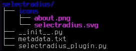
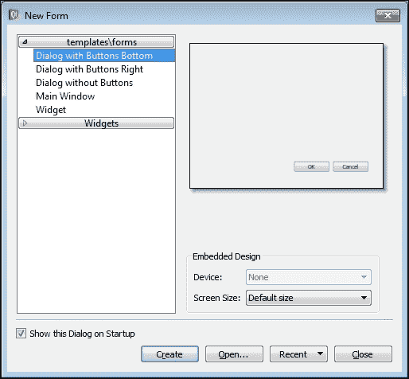
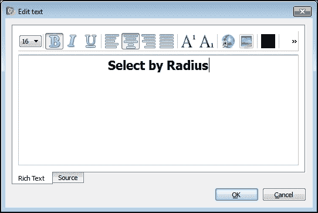
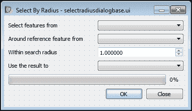
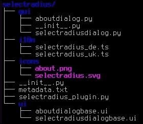

# 第十章. 开发 Python 插件 – 以半径选择

虽然“处理”中的模型和脚本非常适合自动化不同的分析任务，但有时你可能想以另一种方式扩展 QGIS 的功能——通过开发一个插件。

在本章中，我们将讨论以下主题：

+   QGIS 插件

+   创建插件骨架

+   设计插件的 GUI

+   在插件中使用设计器 UI 文件

+   实现特征选择

+   添加翻译

+   准备插件以发布

# QGIS 插件

从一开始，QGIS 就是以可扩展和模块化的架构开发的。最初，它只允许我们通过 C++插件来扩展其功能。但是，从版本 0.9 开始，当添加了对 Python 的支持后，用户和开发者能够使用 Python 编程语言创建插件。

每个 QGIS Python 插件都是一个 Python 模块和附加文件捆绑成的单个 Python 包。这些包应该放置在 QGIS 家目录下的一个特殊目录下的单独子目录中。通常，这是`~/.qgis2/python/plugins`，其中`~`是用户家目录（配置文件）目录。在 Windows 中，它是`C:\Users\your_profile`，而在类 UNIX 系统中，它是`/home/your_profile`。

最小工作插件应该包含这个目录下的两个文件：

+   `__init__.py`：这是包初始化文件和插件的入口点。它应该包含`classFactory()`方法。

+   `metadata.txt`：这个文件包含由**插件管理器**和插件网站使用的插件元数据。这些元数据包括插件名称、版本、描述和其他信息。

然而，真正的插件通常在其目录中包含许多其他文件：额外的源文件、GUI 表单、相应的逻辑源、图标和其他资源等。当然，所有这些文件都可以放置在插件的根目录下，但为了保持源树整洁且易于维护，文件通常组织在子目录中。例如，Qt Designer 表单放置在`ui/`子目录中，相应的逻辑源放置在`gui/`子目录下，图标和其他资源放置在`resources/`子目录中等。 

要使用 Python 开发 QGIS 插件，你需要以下这些软件：

+   **QGIS**：这是用于测试和调试你的插件。最好使用与插件开发相同的 QGIS 版本。如果你想开发一个在多个 QGIS 版本上工作的插件，例如所有`2.x`系列，尽可能使用较旧的版本，因为最新版本可能对 API 有一些小的添加。

+   **文本编辑器或 Python IDE**：在这里，你将编写你的代码。最好使用比标准记事本或其他任何纯文本编辑器更高级的工具。语法高亮、自动缩进和自动完成将使你的工作更加轻松和舒适。

+   **Qt Designer**：用于设计用户界面。对于 Windows，可以使用`OSGeo4W`安装程序进行安装。相应的包称为**qt4-devel**。如果您是 Linux 用户，请使用您的包管理器查找并安装 Qt 开发工具。

此外，为了使调试更容易，我们建议您安装**插件重载器**插件。插件重载器极其有用，因为它允许您在单击一次后重新加载更改代码的插件，而无需重新启动 QGIS。

在本章中，我们将开发一个插件，用于选择位于指定矢量层中、围绕另一个层中已由用户选择的参考特征（已选择的特征）给定距离内的特征。

开发 QGIS Python 插件有两种方式：

1.  在**插件构建器**插件的帮助下创建一个插件模板。然后，完善此模板并添加必要的功能。

1.  通过创建所有必需的文件和代码手动开发插件。

第一种方法（使用插件构建器）是最常用的，许多作者推荐它作为新手最容易的方式。然而，有必要记住，虽然插件构建器是一个伟大且用户友好的工具，但它也隐藏了一些细节，强迫您使用特定的目录结构，并对您的插件如何工作做出了一些假设。此外，由该插件生成的模板将包含许多额外的文件，而在所有情况下这些文件并非都是必需的，例如帮助文件模板、单元测试数据、shell 脚本等。当然，所有这些文件都可以根据您的需要进行删除或调整，但您需要具备良好的知识以避免删除必要的文件。

在本章中，我们将通过逐步添加所需的文件和目录来手动创建插件。这使我们能够完全控制插件的结构和外观，并使我们更好地理解事物。

# 创建插件的骨架

让我们从开发我们的插件开始。在您的磁盘上的某个位置创建一个插件目录。由于我们的插件将在给定半径内选择特征，我们将其称为`按半径选择`，并使用`selectradius`作为插件目录的名称。

现在，打开您喜欢的文本编辑器并创建一个包含以下内容的文件：

```py
[general]
name=Select by Radius
description=Select features in the given radius around another one
about=Selects features of the specified vector layer which are located within the given radius around reference pre-selected features of the any other layer
category=Vector
version=0.1.0
qgisMinimumVersion=2.8

author=enter_your_name_here
email=your@email

icon=icons/selectradius.svg

tags=vector,select,selection

homepage=
tracker=
repository=

experimental=True
deprecated=False
```

将其保存为插件目录中的`metadata.txt`。这是我们的插件元数据文件。如您所见，它具有非常简单的结构，类似于`INI` Windows 文件。只有一个名为`general`的部分，其中包含所有元数据项，以`key=value`格式表示。用于逻辑分组的元数据项之间的空字符串可以安全地删除。只要所有必要的项都存在且格式正确，元数据项的顺序并不重要。

所有元数据项可以分为两组：必需的和可选的。以下元数据项是必需的，并且应始终在`metadata.txt`文件中呈现：

+   **name**: 这是插件的名称。通常，它包含一个可读的名称。允许使用空格和其他字符，如 "`-`"。

+   **description**: 这是插件的简短描述。通常，它是一句简短的句子。更详细的信息应放在可选的 "about" 项中。

+   **version**: 这是插件的版本，使用点分隔表示法，例如，`1.0.1`（如果使用语义版本控制）。在此处避免添加如 "version" 这样的单词。

+   **qgisMinimumVersion**: 这定义了当前插件版本支持的最早 QGIS 版本。值应使用点分隔表示法；例如，如果插件与 QGIS 版本 2.0 以上兼容，则此项应将 `2.0` 作为值。

+   **author**: 这是插件作者的姓名。将您的姓名作为值输入。

+   **email**: 这是插件作者的电子邮件。在此处提供您的有效电子邮件地址。请注意，此电子邮件地址不会在任何地方发布，并且仅在插件存储库管理员需要联系作者时使用。

所有其他元数据项都是可选的，可以是空的。以下是可选元数据项的完整列表：

+   **about**: 这包含有关插件的更详细信息。它补充了 "description" 元数据项中的信息。

+   **category**: 这是辅助元数据项。它帮助用户在安装后了解在哪个菜单中查找您的插件。支持的值有 `Raster`、`Vector`、`Database` 和 `Web`。例如，如果插件必须放置在 **Vector** 菜单下，则此元数据应具有 `Vector` 值。如果没有设置，则使用默认的 `Plugins` 值。请注意，此元数据仅用作参考。您需要自己编写代码以在正确的菜单中创建插件操作。

+   **qgisMaximumVersion**: 这定义了当前插件版本支持的最后一个 QGIS 版本。其值应使用点分隔表示法。通常，这不用。默认情况下，它等于 `qgisMinimumVersion` 的主要数字加 0.99。例如，如果 `qgisMinimumVersion` 是 `2.0` 且未显式设置 `qgisMaximumVersion`，则它将是 `2.99`。此元数据仅在罕见情况下使用，即插件支持 QGIS 版本的有限子集或仅支持一个 QGIS 版本。

+   **icon**: 如果有，这是插件图标的文件名或路径。路径应相对于基本插件目录。如果没有设置，则使用默认图标。

+   **tags**: 这是一个用逗号分隔的标签列表，用于描述插件。尝试使用插件网站 [`plugins.qgis.org/`](http://plugins.qgis.org/) 上可用的现有标签。

+   **changelog**: 这是当前插件版本中的更改列表。这是一个多行项。

+   **homepage**: 如果有，这是插件主页的链接。如果您计划在 QGIS 官方插件存储库中发布您的插件，我们建议填写此元数据。

+   **tracker**：这是 `bugtracker` 插件的链接（如果有）。如果您计划在 QGIS 官方插件仓库中发布您的插件，我们建议填写此元数据。

+   **repository**：这是插件源代码仓库的链接（如果有）。如果您计划在 QGIS 官方插件仓库中发布您的插件，我们建议也填写此元数据。

+   **experimental**：这是一个布尔标志，用于标记插件为实验性。实验性插件可能不稳定且部分功能不完整，因此除非设置了相应的选项，否则它们不会在 **插件管理器** 中显示。

+   **deprecated**：这是一个布尔标志，用于标记插件为已弃用。已弃用的插件不受作者支持，可能无法正常工作或可能工作不正确，因此除非设置了相应的选项，否则它们不会在插件管理器中显示。

如您所见，在我们的 `metadata.txt` 文件中，我们不仅包含了强制性的项目，还有一些可选项目，以向插件用户提供更多信息。请注意，我们的演示插件具有空的 `homepage`、`tracker` 和 `repository` 元数据项。在实际插件中，尤其是如果它将被发布，这些项应包含指向相应页面的有效链接，以便插件用户可以提交错误报告和补丁，并轻松找到相关文档。

此外，如果您查看 `icon` 元数据项，您会看到它包含到图像文件的相对路径。因此，在我们的插件目录中，有必要创建 `icons` 子目录并将 `selectradius.svg` 图标文件放入其中。图标可以是 Qt 库支持的任何光栅格式，但我们建议您使用 PNG 格式用于光栅图标，使用 SVG 格式用于矢量图标。图标的大小至少应为 24 x 24 像素。

下一步是创建一个插件（和 Python 包）初始化文件，`__init__.py`。此文件应包含一个 `classFactory()` 函数。当插件在 QGIS 中加载时，将调用此函数。函数体非常简短且简单：

```py
(1) def classFactory(iface):
(2)    from selectradius.selectradius_plugin import SelectRadiusPlugin
(3)    return SelectRadiusPlugin(iface)
```

`classFactory()` 函数接受一个名为 `iface` 的单个参数——一个 `QgsInterface` 类的实例，它提供了对正在运行的 QGIS 复制的 GUI 的访问。它返回 `SelectRadiusPlugin` 对象，这是一个插件实例。`SelectRadiusPlugin` 类的代码，从 `selectradius_plugin.py` 文件导入，位于插件的根目录中。

现在，让我们实现主插件类。在插件根目录下创建一个名为 `selectradius_plugin.py` 的新文件，并将以下代码添加到其中：

```py
( 1) import os
( 2)
( 3) from PyQt4.QtCore import (
( 4)    QLocale, QSettings, QFileInfo, QCoreApplication, QTranslator)
( 5) from PyQt4.QtGui import (QMessageBox, QAction, QIcon)
( 6)
( 7) from qgis.core import QGis
( 8)
( 9) pluginPath = os.path.dirname(__file__)
(10)
(11)
(12) class SelectRadiusPlugin:
(13)    def __init__(self, iface):
(14)        self.iface = iface
(15)
(16)        overrideLocale = QSettings().value('locale/overrideFlag', False, bool)
(17)        if not overrideLocale:
(18)          locale = QLocale.system().name()[:2]
(19)        else:
(20)          locale = QSettings().value('locale/userLocale', '')
(21)
(22)        qmPath = '{}/i18n/selectradius_{}.qm'.format(pluginPath, locale)
(23)
(24)        if QFileInfo(qmPath).exists():
(25)          self.translator = QTranslator()
(26)          self.translator.load(qmPath)
(27)          QCoreApplication.installTranslator(self.translator)
(28)
(29)    def initGui(self):
(30)        self.actionRun = QAction(
(31)            self.tr('Select by Radius'), self.iface.mainWindow())
(32)        self.actionRun.setIcon(
(33)            QIcon(os.path.join(pluginPath, 'icons', 'selectradius.svg')))
(34)        self.actionRun.setWhatsThis(
(35)           self.tr('Select features within given radius'))
(36)        self.actionRun.setObjectName('SelectRadiusRun')
(37)
(38)        self.actionAbout = QAction(self.tr('About'), self.iface.mainWindow())
(39)        self.actionAbout.setIcon(
(40)            QIcon(os.path.join(pluginPath, 'icons', 'about.png')))
(41)        self.actionAbout.setWhatsThis(self.tr('About Select by Radius'))
(42)        self.actionAbout.setObjectName('SelectRadiusAbout')
(43)
(44)        self.iface.addPluginToVectorMenu(
(45)            self.tr('Select by Radius'), self.actionRun)
(46)        self.iface.addPluginToVectorMenu(
(47)            self.tr('Select by Radius'), self.actionAbout)
(48)        self.iface.addVectorToolBarIcon(self.actionRun)
(49)
(50)        self.actionRun.triggered.connect(self.run)
(51)        self.actionAbout.triggered.connect(self.about)
(52)
(53)    def unload(self):
(54)        self.iface.removePluginVectorMenu(
(55)            self.tr('Select by Radius'), self.actionRun)
(56)        self.iface.removePluginVectorMenu(
(57)            self.tr('Select by Radius'), self.actionAbout)
(58)        self.iface.removeVectorToolBarIcon(self.actionRun)
(59)
(60)    def run(self):
(61)        pass
(62)
(63)    def about(self):
(64)        pass
(65)
(66)    def tr(self, text):
(67)        return QCoreApplication.translate('SelectRadius', text)
```

在此代码的前七行中，我们从 Python 标准库、`PyQt4` 包和 `qgis.core` 库中导入所有必要的 Python 包。通常，这些导入语句在开发过程中基于迭代添加和编辑。换句话说，您编写代码，当需要新的类或库时，您添加相应的导入语句。按照规则，所有导入语句都放置在源文件的非常开始处。为了简化，在我们的示例插件中，我们将提供所有必要的导入。

在第 9 行，我们确定插件的路径，该路径将用于稍后构建图标的全路径。

在第 12 行，定义了一个基插件类。其中实现了几个方法。`__init__()` 方法，也称为构造函数，用于插件实例的基本初始化。在第 14 行，我们存储了对 QGIS 接口的引用——作为 **iface** 参数传递——以便在后续使用中可以访问和使用它。从第 16 行到第 27 行，激活了国际化支持。我们检查 QGIS 使用的区域设置，并尝试从插件树中的 `i18n` 子目录加载相应的翻译文件。如果没有找到翻译，则插件将以默认区域设置加载。

### 小贴士

我们建议您始终将英语作为插件的主要语言。请使用它来设置 GUI 小部件上的所有消息和标题。由于英语是最常见和广泛使用的语言，因此几乎所有的用户都可以使用该插件，即使没有翻译。如果需要，可以通过本地化机制轻松添加对任何其他语言的支持。

在插件基类中应该实现的下一种重要且强制性的方法是 `initGui()`。当插件被 QGIS 激活并加载时，会调用此方法。在这里，我们添加所需的 GUI 元素，例如菜单项、工具栏按钮，甚至停靠小部件。我们初始化插件所需的所有必要临时文件夹和其他东西。在我们的演示插件中，此方法从第 29 行开始。

从第 30 行到第 36 行，我们创建一个所谓的动作，该动作将启动插件对话框。动作是特殊对象，代表一个命令，并提供了一种统一的方式从不同的地方运行该命令，例如菜单和工具栏。首先，我们创建一个 `QAction` 实例，并将 `Select byRadius` 标签分配给它（第 30 行和第 31 行）。请注意，标签文本被包含在 `self.tr()` 方法调用中。此方法在提供的代码片段的最后两行实现，并使文本字符串可翻译。

然后，在第`32`行和第`33`行，我们为我们操作构造了一个图标。使用`os.path.join()`调用，我们创建了一个指向图标文件的完整路径，该图标文件位于插件树`icons`子目录中。这是我们在`metadata.txt`文件中指定的相同图标。当然，您可以使用另一个图标——只需将其放入插件树中的`icons`子目录即可。接下来，在第`34`行和第`35`行，我们为我们的操作设置了工具提示文本。请注意，我们在这里再次使用`self.tr()`，因此此文本也可以本地化。最后，在第`36`行，我们设置了操作的`objectName`属性。这个属性是 QGIS 自定义框架所必需的。

从第`38`行到`42`行，我们使用与前面相同的方法创建了另一个操作。此操作将用于显示包含有关我们插件信息的**关于**对话框。此操作的图标名为`about.png`，它位于插件树的`icons`子目录中。

然后，从第`44`行到`45`行以及第`46`行到`47`行，我们将我们的操作添加到**按半径选择**子菜单中，该子菜单将在 QGIS 的**矢量**菜单中创建。在第`48`行，我们将打开主插件对话框的按钮放入**矢量**工具栏中。

在此方法中的最后两行（`50`和`51`）用于将操作连接到处理程序，这些处理程序将在用户按下按钮或选择菜单项时执行。目前，这两个处理程序——`run()`和`about()`——都是空的，我们将在稍后向它们添加代码。

应该存在于插件基类中的第二个强制方法是`unload()`。当插件被停用并从 QGIS 中移除时，将执行此方法。在这里，我们应该移除插件的所有 GUI 元素（按钮、菜单项、小部件等）并执行任何其他所需的清理操作，例如删除临时文件。在我们的演示插件中，此方法在第`53`行定义。

由于我们的插件足够简单，我们只需从`initGui()`方法（第`54`行到`57`行）中移除添加的菜单项，以及工具栏按钮（第`58`行）。

在第`60`行到`64`行，我们为我们的操作定义了处理程序。目前，它们没有任何作用。

最后一个方法，`tr()`，正如我们之前提到的，是用于国际化支持所必需的。它接受英文文本并返回其翻译等效文本，这取决于当前的区域设置和翻译文件的存在。

### 注意

我们在这里自己实现`tr()`方法，因为主插件类是一个纯 Python 类。几乎所有的 Qt GUI 类都有内置的国际化支持，并且此方法已经存在于它们的代码中。因此，从它们继承的所有类也将具有`tr()`方法，您很快就会看到。

现在，我们的插件目录结构应该看起来像这样：



这样的插件骨架可以用作各种插件的开发起点。

到目前为止，我们的插件应该可以被 QGIS 加载。您可以轻松地检查这一点——只需将插件目录复制到 QGIS 插件目录，`~/.qgis2/python/plugins`。启动 QGIS，通过转到**插件** | **管理并安装插件…**来打开**插件管理器**。您应该在**已安装**选项卡中看到**按半径选择**插件。激活后，插件将被加载，**矢量**工具栏上会放置一个新按钮，**矢量**菜单中会出现一个包含两个条目的新条目。但在这个阶段，这些条目没有任何作用。我们需要实现它们的功能。

# 设计插件的 GUI

我们插件将有两个对话框：一个是主插件对话框，它将用于接受用户输入；第二个是所谓的“关于”对话框，其中包含有关插件的一些信息。

QGIS 所构建的 Qt 框架提供了一个用于设计对话框和其他 UI 元素（如停靠小部件）的特殊程序。它被称为**Qt Designer**。Qt Designer 是一个用户友好且易于使用的可视化表单设计器。借助它的帮助，您可以通过使用鼠标在表单上放置 GUI 小部件来创建对话框，而无需编写代码。然后，将表单定义以 XML 格式保存到`.ui`文件中，该文件由插件或应用程序用于构建用户界面。

为了保持插件结构的整洁，我们将把所有的`.ui`文件放在一个单独的子目录中，例如，在插件源树中命名为`ui`。

## 设计“关于”对话框

启动 Qt Designer。在**新建表单**欢迎对话框中，选择名为**底部按钮对话框**的模板，如下所示：



如果在 Designer 启动时没有打开此对话框，请转到**文件** | **新建...**或使用*Ctrl* + *N*键盘快捷键。将创建一个新的空 Qt 表单，底部有两个按钮。

首先，我们将创建“关于”对话框。我们希望在对话框中显示以下信息：插件名称、图标、版本号以及简短描述，可能包含对插件主页和/或错误跟踪器的链接。

在**属性编辑器**面板（通常位于设计器窗口的右上角），找到`windowTitle`属性并将其更改为有意义的名称，例如，`关于按半径选择`。返回到表单并选择按钮框。现在它应该带有蓝色的方块标记。返回到**属性编辑器**，找到`standardButtons`属性并清除除**关闭**按钮之外的所有变体的复选框。因此，现在我们的按钮框只有一个按钮。

现在，在**小部件框**面板（通常位于设计器窗口的左侧），找到**标签**小部件，它位于**显示小部件**组中，并将其拖放到表单中。保持新添加的小部件选中状态，转到**属性编辑器**并将`objectName`属性设置为`lblLogo`。这个小部件将用于显示插件图标。

### 小贴士

小部件的`objectName`属性将在我们的代码中用于访问相应的部件。因此，请尝试为所有计划从代码中访问的小部件分配有意义的对象名称。

类似地，向表单中添加另一个**标签**小部件，并将其放置在之前添加的小部件的右侧。然而，这次不要更改其`objectName`属性。相反，找到`text`属性，并按编辑字段右侧标有**…**的按钮。将打开一个简单的文本编辑器，如下所示：



输入插件名称，然后将字体大小更改为更大的值，例如，`16`。使字体加粗并将文本居中对齐。通过单击**确定**按钮关闭编辑器。还要修改`alignment`属性以启用水平居中对齐。

在表单中添加一个第三标签，该标签将用于显示插件版本，并将其`objectName`属性更改为`lblVersion`。修改`alignment`属性以启用水平居中对齐。将此标签移动到插件名称标签下方。最后，将**TextBrowser**小部件添加到表单中，并将其放置在所有标签下方。

Qt 使用基于布局的方法来管理小部件，因此无论使用何种主题和字体，您的表单都将始终看起来一致。为了在我们的表单中启用布局，我们只需选择表单并单击工具栏上的**在网格中布局**按钮，或从**表单**菜单中选择此选项。

### 注意

关于 Qt 布局系统的更多信息可以在 Qt 文档中找到，请参阅[`doc.qt.io/qt-4.8/layout.html`](http://doc.qt.io/qt-4.8/layout.html)。如果你想要创建看起来不错的对话框，这是一篇必读的信息。

现在您的表单应该看起来像以下截图所示：


如果某些小部件放置不正确，请尝试移动它们并调整它们的大小。当你对对话框的外观和感觉满意时，将其保存为`aboutdialogbase.ui`，位于插件根目录下的`ui`子目录中。

## 设计主插件对话框

关闭已保存的**关于**对话框，并使用相同的**带按钮底部的对话框**模板创建一个新的空表单作为主插件对话框。将对话框的`windowTitle`属性更改为`按半径选择`，并通过更改其`standardButtons`属性调整按钮框，使其包含两个按钮：**确定**和**关闭**。

我们需要指定一个目标层，从该层中我们将选择特征。在**小部件框**面板的**显示小部件**部分添加一个**标签**小部件，并将其`text`属性更改为`从中选择特征`。现在需要提供一个用户可以选择要使用的层的控件。**组合框**是一个不错的选择，但还有一个更好的解决方案。从版本 2.4 开始，QGIS 为 Qt Designer 提供了一套自定义小部件。在这些小部件中，有一个特殊的选择框，称为**QgsMapLayerComboBox**。它被设计用来显示来自 QGIS 层注册表的层列表。这个控件，以及所有其他与 QGIS 相关的自定义小部件，可以在**小部件框**面板的**QGIS 自定义小部件**部分找到。

### 注意

在这里有必要提到，QGIS 自定义小部件部分可能不在您的系统中可用。如果您找不到它，请确保您已安装所有 QGIS 相关包（例如，名为`libqgis-customwidgets`的 Debian 包）。

或者，您可以使用序数组合框代替**QgsMapLayerCombobox**，但在这种情况下，您将需要自己实现代码来填充它以及通过名称检索层的代码。

将一个**QgsMapLayerComboBox**组合框拖放到表单上，将其放置在之前添加的标签的右侧，并更改其`objectName`属性为`cmbTargetLayer`。默认情况下，**QgsMapLayerCombobox**将显示栅格层、具有多边形几何类型的矢量层和插件层。这不适合我们，因为我们只需要矢量层。要更改此行为，找到`filters`属性，并清除除**PointLayer**、**LineLayer**和**PolygonLayer**之外的所有变体的复选框（这也会自动激活**HasGeometry**选项）。现在，这个组合框将只显示之前指定的几何类型的矢量层。栅格层、插件层和没有几何的矢量层将不会显示在其中。

此外，我们还需要指定另一个层——参考层。因此，在表单中添加另一个**标签**小部件，并将其`text`属性更改为`从参考特征周围选择`。在这个标签附近，放置第二个**QgsMapLayerComboBox**组合框，并将其`objectName`属性更改为`cmbReferenceLayer`。对其应用与之前添加的**QgsMapLayerCombobox**组合框相同的过滤器。

我们还需要另一个输入值，即搜索半径。因此，在表单中添加另一个**标签**小部件，位于已添加的小部件下方。将其`text`属性设置为`在搜索半径内`。在这个标签的右侧，放置一个**双精度微调框**（可在**输入小部件**部分找到），并将其`objectName`属性更改为`spnRadius`。同时调整其`minimum`、`maximum`和`value`属性到合理的值。

为了使插件更加有用和灵活，我们为用户提供了一种选择来使用所选功能的方式：创建一个新的选择，或者修改现有的选择。表示可用选择的更合理方式是组合框。从**显示小部件**部分添加另一个标签到表单中，并将其`text`属性更改为`Use the result to`。在这个标签的右侧放置**组合框**（可在**输入小部件**部分找到）。将新添加的组合框的`objectName`属性更改为`cmbSelectionMode`。

将**进度条**（可在**工具箱**面板的**显示小部件**部分找到）放在最后一个标签和组合框下面，并将它的`value`属性更改为`zero`。

选择对话框，通过点击**设计师**工具栏中的**在网格中布局**按钮将其应用网格布局。现在您的表单应该看起来像这个截图所示：



如果某些小部件位置不正确，尝试移动它们并调整它们的大小。一旦您对对话框的外观和感觉满意，将其保存在插件根目录下的`ui`子目录中，命名为`selectradiusdialogbase.ui`。

如您所见，使用 Qt Designer 设计用户界面并没有什么复杂之处。这里最重要的是理解不同类型的布局是如何工作以及如何符合相应项目的**人机界面指南**（**HIG**）的建议。QGIS HIG 可以在 QGIS 源代码中的`CODING`文档中找到。您可以在[`github.com/qgis/QGIS/blob/master/CODING#L1429`](https://github.com/qgis/QGIS/blob/master/CODING#L1429)在线查看。

# 在插件中使用设计师 UI 文件

使用 Qt Designer 设计 GUI 是这个过程的第一部分。现在我们需要使用之前创建的`.ui`文件来构建我们的对话框并实现处理用户操作所需的逻辑，例如点击按钮、从列表中选择项目等。

## 将关于对话框添加到插件中

我们将从关于对话框开始，因为它很简单。为了保持插件目录结构的整洁，我们将所有与插件 GUI 相关的源代码存储在插件目录内的`gui`子目录中。

打开您的文本编辑器，创建一个包含以下内容的新的文件：

```py
( 1) import os
( 2) import ConfigParser
( 3)
( 4) from PyQt4 import uic
( 5) from PyQt4.QtCore import QUrl
( 6) from PyQt4.QtGui import QTextDocument, QDialogButtonBox, QPixmap
( 7)
( 8) pluginPath = os.path.split(os.path.dirname(__file__))[0]
( 9) WIDGET, BASE = uic.loadUiType(
(10)    os.path.join(pluginPath, 'ui', 'aboutdialogbase.ui'))
(11)
(12)
(13) class AboutDialog(BASE, WIDGET):
(14)    def __init__(self, parent=None):
(15)        super(AboutDialog, self).__init__(parent)
(16)        self.setupUi(self)
(17)
(18)        cfg = ConfigParser.SafeConfigParser()
(19)        cfg.read(os.path.join(pluginPath, 'metadata.txt'))
(20)        version = cfg.get('general', 'version')
(21)
(22)        self.lblLogo.setPixmap(
(23)            QPixmap(os.path.join(pluginPath, 'icons', 'selectradius.svg')))
(24)        self.lblVersion.setText(self.tr('Version: %s') % version)
(25)
(26)        doc = QTextDocument()
(27)        doc.setHtml(self.getAboutText())
(28)        self.textBrowser.setDocument(doc)
(29)        self.textBrowser.setOpenExternalLinks(True)
(30)
(31)    def getAboutText(self):
(32)        return self.tr(
(33)            '<p>Select features of the specified vector layer within given '
(34)            'radius around pre-selected reference features from the another '
(35)            'vector layer.</p>'
(36)            '<p>Developed as demo plugin for the "QGIS By Example" book by '
(37)            '<a href="https://www.packtpub.com/">Packt Publishing</a>.</p>')
```

将此文件保存在`gui`子目录下，命名为`aboutdialog.py`。

在文件的开始部分，从第`1`行到第`6`行，我们导入了我们稍后将要使用的所有包和类。在这里，我们使用了 Python 标准库（`os`和`ConfigParser`包）以及各种`PyQt`类（第`4`行到第`6`行）。

在第`8`行，我们确定插件路径，因为我们需要它来构建对话框`.ui`文件和插件图标的完整路径。

最有趣的部分是第`9`行和第`10`行，实际上这是一条命令由于长度原因被拆分成了两行。在这里，我们使用 Qt Designer 加载我们之前创建的`.ui`文件。`uic.loadUiType()`命令返回两个值：我们的自定义对话框（存储为`WIDGET`变量）及其基类（存储为`BASE`变量）。使用`uic`可以让我们避免编译 UI 文件，并使插件打包更加简单。

在第`13`行，开始实现`AboutDialog`类，它将代表我们的关于对话框。注意，在类定义中，我们使用了从`uic.loadUiType()`调用中获得的`BASE`和`WIDGET`变量。

`__init__()`方法，也称为构造函数，执行基本的类初始化。在第`15`行和第`16`行，我们设置了对话框 GUI。在这些行之后，我们可以使用`self.widgetName`访问所有对话框小部件，其中`widgetName`是对应小部件`objectName`属性的值。这就是为什么为所有将在代码中使用的小部件指定有意义的唯一对象名称很重要的原因。

从第`18`行到第`20`行，我们使用 Python 标准库中的**ConfigParser**模块从`metadata.txt`文件中读取插件版本。当然，我们可以手动输入版本号，但在这种情况下，每次插件版本更改时，我们都需要编辑两个文件（`metadata.txt`和`aboutdialog.py`），而不是一个。

然后，在第`22`行和第`23`行，从图标文件的路径构建插件图标，并将其加载到相应的小部件对话框中。在第`24`行，插件版本在`lblVersion`标签小部件中显示。

最后，在第`26`行到第`29`行，我们实例化了`QTextDocument`对象，该对象将用于显示关于文本，并将其分配给**QTextBrowser**小部件。第`29`行允许用户通过点击来打开链接。

关于对话框的文本是通过第`31`行到第`37`行中实现的`getAboutText()`方法生成的。实现很简单——我们只是返回一个包含插件简短描述的字符串，格式为 HTML。这里唯一重要的是使用`self.tr()`方法，它允许我们显示翻译后的关于文本。

### 小贴士

想了解更多关于 Qt 类、它们的目的和功能的信息，请查看 Qt 文档，网址为[`doc.qt.io/qt-4.8/index.html`](http://doc.qt.io/qt-4.8/index.html)。

你可能会问为什么我们没有实现任何处理对话框执行和关闭的方法。嗯，因为这个对话框非常简单，我们不需要执行任何特殊操作。我们可以使用默认的处理程序，这些处理程序是在基`QDialog`类中实现的。这意味着对话框将以模态方式打开，点击**关闭**按钮将关闭它。

那就是全部了！现在我们需要将这个对话框添加到插件主类中。首先，在`gui`子目录中创建一个空的`__init__.py`文件，这样 Python 就会将其识别为包目录。

现在，打开 `selectradius_plugin.py` 文件。在文件开头的导入部分，添加以下代码行：

```py
from selectradius.gui.aboutdialog import AboutDialog
```

这行代码使 `AboutDialog` 类可以从主插件类中访问。现在，找到 `about()` 方法并按如下方式修改：

```py
(1)    def about(self):
(2)        d = AboutDialog()
(3)        d.exec_()
```

这里没有什么特别之处。首先，我们实例化 `AboutDialog` 并执行它。保存您的编辑。如果您愿意，您可以在 QGIS 插件目录中更新插件文件，或者将整个插件目录复制到这里。使用 **Plugin Reloader** 重新加载插件，并确保现在当您从 **Select by Radius** 菜单中选择 **About** 项时，会显示一个 **About** 对话框。

## 添加主插件对话框

现在，让我们实现主插件对话框。创建一个新文件，并将其保存在插件目录的 `gui` 子目录中，命名为 `selectradiusdialog.py`。由于这个对话框比较复杂，我们将代码分成小块，并将逐一检查它们。

正如您应该已经知道的，我们首先导入所有必要的类：

```py
(1) import os
(2)
(3) from PyQt4 import uic
(4) from PyQt4.QtCore import QSettings
(5) from PyQt4.QtGui import QDialogButtonBox, QDialog
(6)
(7) from qgis.core import QgsGeometry, QgsFeatureRequest, QgsSpatialIndex
(8) from qgis.gui import QgsMessageBar
```

除了 Python 标准库和 PyQt 类之外，我们还从 `qgis.core` 和 `qgis.gui` 库中导入几个类。

然后，就像 `AboutDialog` 的情况一样，我们确定插件路径并从 Qt Designer 文件中加载对话框 GUI：

```py
(1) pluginPath = os.path.split(os.path.dirname(__file__))[0]
(2) WIDGET, BASE = uic.loadUiType(
(3)    os.path.join(pluginPath, 'ui', 'selectradiusdialogbase.ui'))
```

准备工作已完成。现在我们可以定义主对话框类：

```py
( 1) class SelectRadiusDialog(BASE, WIDGET):
( 2)    def __init__(self, iface, parent=None):
( 3)        super(SelectRadiusDialog, self).__init__(parent)
( 4)        self.setupUi(self)
( 5)
( 6)        self.iface = iface
( 7)
( 8)        self.btnOk = self.buttonBox.button(QDialogButtonBox.Ok)
( 9)        self.btnClose = self.buttonBox.button(QDialogButtonBox.Close)
(10)
(11)        self.cmbSelectionMode.clear()
(12)        self.cmbSelectionMode.addItem(self.tr('Create new selection'))
(13)        self.cmbSelectionMode.addItem(self.tr('Add to current selection'))
(14)        self.cmbSelectionMode.addItem(self.tr('Remove from current selection'))
(15)
(16)        self.loadSettings()
```

首先，我们初始化对话框 GUI（行 `3` 到 `4`）。在行 `6`，我们存储对 QGIS 接口的引用，以便以后使用。

在行 `8` 和 `9`，我们获取对话框按钮框中单独按钮的引用，因为我们稍后需要将它们作为独立的小部件访问。从行 `11` 到 `14`，`cmbSelectionMode` 组合框被填充了可用的选择模式。为了保持项目文本可翻译，我们将它包装在 `self.tr()` 调用中。值得注意的是，组合框项有零基编号，因此第一个项将具有索引 0，第二个项将具有索引 1，依此类推。从代码中填充组合框使我们能够轻松检查项目顺序并确定它们的索引。项目索引将稍后用于确定用户选择。

最后，在行 `16`，我们从之前的运行中恢复插件的设置。

我们的插件足够简单，所以我们只想在设置中保存和恢复几个值。每次用户打开插件对话框时，我们希望恢复之前输入的搜索半径值和从 **Use the result to** 组合框中使用的最后一种选择模式：

```py
( 1)    def loadSettings(self):
( 2)        settings = QSettings('PacktPub', 'SelectRadius')
( 3)
( 4)        self.spnRadius.setValue(settings.value('radius', 1, float))
( 5)        self.cmbSelectionMode.setCurrentIndex(
( 6)            settings.value('selectionMode', 0, int))
( 7)
( 8)    def saveSettings(self):
( 9)        settings = QSettings('PacktPub', 'SelectRadius')
(10)
(11)        settings.setValue('radius', self.spnRadius.value())
(12)        settings.setValue(
(13)            'selectionMode', self.cmbSelectionMode.currentIndex())
```

当我们想要恢复插件的设置时，会调用 `loadSettings()` 方法。在插件的第一次运行中，我们没有保存的设置，所以将选择默认值。`saveSettings()` 方法用于将当前值从小部件保存到插件设置中。

由于我们希望在用户通过点击**关闭**按钮关闭主插件对话框时保存设置，并且需要在用户点击**确定**按钮时启动数据采集过程，因此有必要替换这些信号的默认处理程序。相应的代码如下：

```py
( 1)    def reject(self):
( 2)        self.saveSettings()
( 3)        QDialog.reject(self)
( 4)
( 5)    def accept(self):
( 6)        self.saveSettings()
( 7)
( 8)        targetLayer = self.cmbTargetLayer.currentLayer()
( 9)        if targetLayer is None:
(10)            self.showMessage(
(11)              self.tr('Target layer is not set. '
(12)                    'Please specify layer and try again,'),
(13)              QgsMessageBar.WARNING)
(14)            return
(15)
(16)        referenceLayer = self.cmbReferenceLayer.currentLayer()
(17)        if referenceLayer is None:
(18)            self.showMessage(
(19)              self.tr('Reference layer is not set. '
(20)                    'Please specify layer and try again.'),
(21)              QgsMessageBar.WARNING)
(22)            return
(23)
(24)        referenceFeatures = referenceLayer.selectedFeatures()
(25)        if len(referenceFeatures) == 0:
(26)            self.showMessage(
(27)              self.tr('There are no reference features selected in the '
(28)                    'reference layer. Select at least one feature and '
(29)                    'try again.'),
(30)              QgsMessageBar.WARNING)
(31)            return
```

当用户点击**关闭**按钮时，会调用第`1`行的`reject()`方法。此方法最初在基类`QDialog`中实现，并在我们的子类中重新实现。我们在这里做的唯一事情是保存当前的插件设置（第`2`行）。之后，我们简单地调用基类的`reject()`方法（第`3`行）来关闭我们的对话框。

定义在第`5`行的`accept()`方法在用户点击**确定**按钮时被调用。此方法最初在基类`QDialog`中实现，并在我们的子类中重新实现。当用户点击**确定**按钮时，插件应检查是否指定了所有必需的参数，从目标层中找到所有符合定义要求的功能，并最终更新目标层中的选择。

首先，在第`6`行，我们保存当前的插件设置。然后，我们检查用户是否选择了所有必要的输入。在第`8`行，我们使用`QgsMapLayerCombobox`的`currentLayer()`方法来获取当前选定的目标层。如果选择了图层，此方法返回相应的`QgsMapLayer`实例，否则返回`None`。

### 小贴士

关于 QGIS API 的文档可以在[`qgis.org/api/`](http://qgis.org/api/)找到。另外，别忘了查看*PyQGIS 开发者手册*，其中包含不同主题的详细解释和许多有用的示例。您可以在[`docs.qgis.org/testing/en/docs/pyqgis_developer_cookbook/index.html`](http://docs.qgis.org/testing/en/docs/pyqgis_developer_cookbook/index.html)在线阅读最新的*PyQGIS 开发者手册*。

### 注意

注意，由于 API 的变化，最新版本的 PyQGIS 开发者手册中的某些示例可能无法与较旧的 QGIS 版本兼容。

如果没有选择目标层（这在第`9`行进行检查），我们将使用`showMessage()`方法（第`10`至`13`行）显示警告消息，并返回主插件对话框（第`14`行）。换句话说，我们不尝试执行任何进一步的操作，因为我们有不完整或无效的输入。用户应指定正确的输入，然后重试。

使用相同的方法，我们检查是否选择了有效的参考层（第`16`至`22`行）。

在第`24`行，我们从参考层中获取预选的参考特征列表。如果参考层中没有选择参考特征，此列表的长度将为零。我们需要捕获这种情况，因为没有参考特征，我们无法继续。这就是第`25`至`31`行发生的事情；如果在参考层中没有选择参考特征，我们将显示相应的消息并返回主插件对话框。

目前为止，我们为`accept()`方法编写的代码就是这些。

你可能已经注意到了在前面代码中广泛使用的`showMessage()`方法。以下是它的实现：

```py
(1)    def showMessage(self, message, level=QgsMessageBar.INFO):
(2)        self.iface.messageBar().pushMessage(
(3)            message, level, self.iface.messageTimeout())
```

这只是一个包装器，它使用与全局 QGIS 设置中定义的相同超时显示给定文本和重要性级别的消息栏。默认情况下，将使用`INFO`级别，但如果需要，我们可以指定任何其他支持的水平。

如你所见，到目前为止，我们只实现了主插件对话框的基本功能。

现在，我们需要将主对话框添加到插件基类中。为此，打开`selectradius_plugin.py`文件，如果尚未打开。在文件开头的导入部分，添加以下代码行：

```py
from selectradius.gui.selectradiusdialog import SelectRadiusDialog
```

这行代码使得`SelectRadiusDialog`类可以从主插件类中访问。现在，找到`run()`方法，并按如下方式修改它：

```py
(1)    def run(self):
(2)        dlg = SelectRadiusDialog(self.iface)
(3)        dlg.exec_()
```

再次，这里没有什么特别之处。首先，我们实例化`SelectRadiusDialog`，然后以模态对话框的形式打开它，就像我们之前为关于对话框所做的那样。

保存你的编辑。如果你想，你可以更新 QGIS 插件目录中的插件文件，或者将整个插件目录复制到这里。使用**插件重载器**重新加载插件，并确保现在当你从**按半径选择**菜单中选择**按半径选择**项时，会显示主插件对话框。

# 实现特征选择

现在，当对话框创建并连接到我们的插件时，我们可以开始实现主要功能——即使用用户定义的要求进行特征选择。

打开位于插件源树`gui`子目录中的`selectradiusdialog.py`文件。在`accept()`方法的末尾添加以下代码：

```py
( 1)        self.btnOk.setEnabled(False)
( 2)        self.btnClose.setEnabled(False)
( 3)
( 4)        request = QgsFeatureRequest()
( 5)        request.setFlags(
( 6)           request.flags() ^ QgsFeatureRequest.SubsetOfAttributes)
( 7)
( 8)        index = QgsSpatialIndex(targetLayer.getFeatures(request))
( 9)
(10)        selection = []
(11)        for f in referenceFeatures:
(12)            geom = QgsGeometry(f.geometry())
(13)            bufferedGeometry = geom.buffer(self.spnRadius.value(), 5)
(14)
(15)            intersectedIds = index.intersects(bufferedGeometry.boundingBox())
(16)
(17)           self.progressBar.setRange(0, len(intersectedIds))
(18)
(19)           for i in intersectedIds:
(20)              ft = targetLayer.getFeatures(request.setFilterFid(i)).next()
(21)              geom = ft.geometry()
(22)              if geom.within(bufferedGeometry):
(23)                  selection.append(i)
(24)
(25)              self.progressBar.setValue(self.progressBar.value() + 1)
(26)
(27)        if self.cmbSelectionMode.currentIndex() == 1:
(28)            selection = list(
(29)              set(targetLayer.selectedFeaturesIds()).union(selection))
(30)        elif self.cmbSelectionMode.currentIndex() == 2:
(31)            selection = list(
(32)              set(targetLayer.selectedFeaturesIds()).difference(selection))
(33)        targetLayer.setSelectedFeatures(selection)
(34)
(35)        self.progressBar.reset()
(36)        self.btnOk.setEnabled(True)
(37)        self.btnClose.setEnabled(True)
(38)        self.showMessage(self.tr('Completed.'), QgsMessageBar.SUCCESS)
```

到目前为止，我们已经确保所有必要的输入字段都已正确定义（参见上一节），现在我们可以安全地进行特征选择。

首先，有必要阻止**确定**和**关闭**按钮，以防止意外点击，这可能会中断运行中的进程。我们在第`1`行和第`2`行这样做。

我们插件需要从矢量图层请求功能。正如你所知，每个功能都有几何形状和属性，并且默认情况下，当我们从图层查询一个功能时，几何形状和属性都会被返回。对于我们来说，我们只需要功能几何形状，所以最好不要查询属性。这将加快功能检索的过程，尤其是在图层有一个大的属性表或者通过慢速网络连接访问时。

因此，在第`4`行，我们实例化`QgsFeatureRequest`对象，该对象用于自定义特征检索的过程。从第`5`行到第`6`行，我们通过重置其`SubsetOfAttributes`标志来改变其默认行为（获取几何形状和属性），以便只获取特征几何形状。

然后，我们在目标层上构建空间索引（第`8`行）。空间索引允许我们对层执行快速查询，并仅获取与某些区域相交或位于给定坐标附近的特征。空间索引还可以通过限制我们应该测试的空间运算符的特征数量来减少处理时间。

现在，我们已经准备好在目标层中搜索位于参考特征给定半径范围内的特征。但首先，我们需要创建一个列表，我们将在此列表中存储此类特征的标识符。这是在第`10`行完成的。

在第`11`行，我们开始遍历参考特征（我们已经在`referenceFeatures`列表中有了它们；详见前文部分以获取详细信息）。对于每个参考特征，我们获取其几何形状（第`12`行），并使用给定的半径在其周围创建缓冲区（第`13`行）。作为缓冲距离，我们使用用户定义的搜索半径，该半径通过`spnRadius`微调框设置。`buffer()`调用中的第二个参数是用于逼近曲线的段数。更大的值将导致更平滑的曲线和更准确的结果，但也会略微增加处理时间。如果你想要更改此值，请随意。

然后，在第`15`行，借助空间索引，我们确定目标层中哪些特征可能位于缓冲几何形状内，该几何形状代表当前参考特征。`intersects()`方法返回所有与给定几何形状边界框相交的特征的标识符。在我们的情况下，这是当前参考几何形状。

在第`17`行，我们更新进度条的范围。它将被用来提供关于过程执行的视觉反馈。

由于空间索引执行与边界框的交集测试，我们现在应该精确地测试每个匹配的特征。这是从第`19`行到第`25`行完成的。让我们更仔细地看看。在第`19`行，一个循环开始遍历匹配特征索引。在循环中，我们通过其标识符获取一个特征（第`20`行）。请注意，我们再次使用之前创建的`request`来仅获取特征几何形状。然后，提取特征几何形状（第`21`行），并检查此几何形状是否完全位于缓冲的参考几何形状内（第`22`行）。如果满足此条件，特征标识符将被添加到列表中（第`23`行）。

### 注意

如果你想要使用其他标准（例如，选择与参考几何相交的特征）来选择特征，请将`within()`运算符替换为所需的运算符。可以在`QgsGeometry`类的 API 文档中找到可用运算符的列表，链接为[`qgis.org/api/classQgsGeometry.html`](http://qgis.org/api/classQgsGeometry.html)。

最后，在第`25`行，我们更新进度条以通知用户进度。

当所有参考特征都处理完毕，并且匹配特征的标识符存储在`selection`列表中后，我们可以根据请求的选择模式在目标层中选择特征（第`27`至`33`行）。首先，我们使用第`27`行和第`30`行的条件来确定我们需要使用哪种选择模式。由于选择模式是依次添加到相应的组合框中的（一个接一个），第一个添加的项目（**创建新选择**）将具有索引`0`，第二个项目（**添加到当前选择**）将具有索引`1`，依此类推。因此，如果`cmbSelectionMode`组合框当前选中项的索引等于`1`，则用户将被要求添加特征到当前选择。这意味着组合框索引与项目添加的顺序相匹配。

当选择模式确定后，我们通过添加或删除已选特征的索引来修改所选特征的列表（第`28`至`29`行和第`31`至`32`行）。最后，在第`33`行，我们在目标层中选择特征。

我们几乎完成了；现在需要执行一些最终操作。在第`35`行，我们重置进度条，使其回滚并显示任何进度。然后，我们启用**确定**和**关闭**按钮，以便用户可以更改参数并再次运行该过程，或者关闭插件对话框。在第`38`行，我们通知用户操作已完成。

如果你已正确完成所有编辑，你的插件现在应该完全功能正常，并准备好进行测试。只需通过复制工作目录的内容更新 QGIS 插件目录中的插件文件，使用**插件重载器**重新加载插件，并对其进行测试。如果有任何错误，请再次检查你的代码或查看本书附带的全套插件代码。

# 添加翻译

如果你遵循了我们的建议，并使用英语为插件 GUI 中的所有标题以及代码中的所有字符串，那么几乎所有的用户都将能够使用你的插件。此外，由于我们已经通过将它们包含在`self.tr()`调用中来使所有字符串可翻译，因此将我们的插件翻译成另一种语言非常容易。

要做到这一点，我们需要准备一个所谓的**项目文件**。这是一个结构非常简单的纯文本文件。创建一个新文件，并将其保存为`selectradius.pro`在插件根目录下。然后，向其中添加以下内容：

```py
( 1) SOURCES = __init__.py \
( 2)          selectradius_plugin.py \
( 3)          gui/selectradiusdialog.py \
( 4)          gui/aboutdialog.py \
( 5)
( 6) FORMS = ui/selectradiusdialogbase.ui \
( 7)        ui/aboutdialogbase.ui
( 8)
( 9) TRANSLATIONS = i18n/selectradius_uk.ts \
(10)              i18n/selectradius_de.ts
```

如你所见，有一个列表列出了所有子目录中的插件源文件（第`1`至`4`行），以及所有 Qt Designer UI 文件的列表（第`6`至`7`行）。最后，在第`9`至`10`行，有一个将要生成的翻译文件列表（在这个例子中，我们有乌克兰语和德语）。

从前面的代码中，你可以看到我们将保留翻译在`i18n`子目录中，因此如果它还不存在，请创建它。

现在打开命令行窗口（在 Windows 的情况下是 OSGeo shell），使用`cd`命令切换到插件目录，并运行以下命令：

```py
pylupdate4 -verbose selectradius.pro

```

这将生成项目文件中指定的每种语言的所需 `.ts` 文件。这些文件包含插件源代码和 UI 表单中的所有可翻译字符串。使用 Qt Linguist，`.ts` 文件被翻译并“发布”。在这里，“发布”的意思是将 `.ts` 文件转换为二进制的 `.qm` 文件，该文件可以被 Qt 翻译系统使用。

必须指出，在更改字符串或添加新文件（源或 UI）之后，必须更新项目文件并重新生成翻译。不用担心已经翻译的字符串；它们将被保留，你只需要翻译新或修改的字符串。

# 准备插件以发布

一旦插件准备就绪并且经过充分测试，你可能希望通过将其上传到官方 QGIS Python 插件仓库 [`plugins.qgis.org/`](https://plugins.qgis.org/) 与社区分享。

首先，有必要检查插件是否符合以下要求：

+   其中没有恶意代码

+   没有架构相关的二进制文件

+   它包含正确的 `metadata.txt` 文件，其中包含所有必需的项目

我们在这里列出了最重要的要求。其他建议可以在插件仓库页面和 *PyQGIS 开发者手册* 的 *发布你的插件* 章节中找到。

下一步是准备插件包。QGIS 插件以 ZIP 归档的形式分发，每个归档只包含一个插件。由于插件被提取到 QGIS 插件目录中，我们必须确保插件在包内有自己的文件夹。

此外，将仅包含插件绝对需要的文件包含在插件包中是一种良好的做法，并省略任何生成的或辅助文件。由于我们动态加载 UI 文件和图标，我们拥有的唯一辅助文件是项目文件和 `.ts` 文件（`.qm` 文件也应包含，因为它们被 Qt 翻译系统使用）。因此，我们的插件包内容将如下所示：



当插件包创建完成后，只需使用你的 OSGeo ID 登录 QGIS 插件网站。在顶部菜单中，选择 **插件**。然后，在页面左侧，点击 **分享插件** 按钮，上传你的插件包。

### 小贴士

如果你需要创建一个 OSGeo ID，请访问 OSGeo 门户 [`www.osgeo.org/osgeo_userid`](http://www.osgeo.org/osgeo_userid)。

就这些了！现在你的插件对所有 QGIS 用户都可用。别忘了创建一个带有关于你的插件文档的 bug 跟踪器和主页，以便用户可以发送有关错误和功能请求的报告。

# 摘要

在本章中，你学习了如何使用 Python 编程语言开发 QGIS 插件。Python 插件使我们能够通过添加新工具或实现新的分析或地理处理算法来扩展 QGIS 的功能。你熟悉了插件架构及其主要组件。然后我们创建了插件骨架，它可以被许多插件使用。你学习了如何使用 Qt Designer 创建对话框并在插件中使用它们。最后，我们开发了一个简单的插件，用于选择位于任何其他图层参考预选特征给定半径内的指定矢量图层中的要素。
