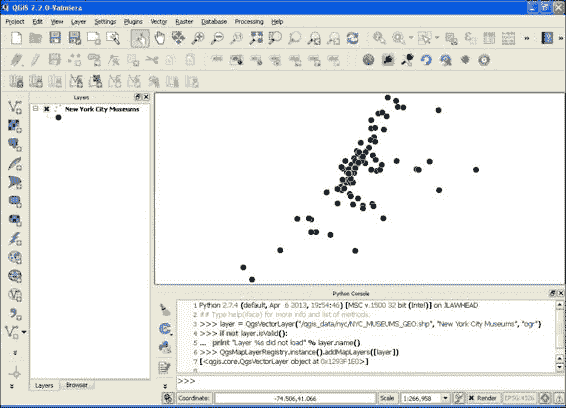
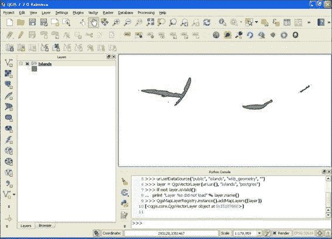
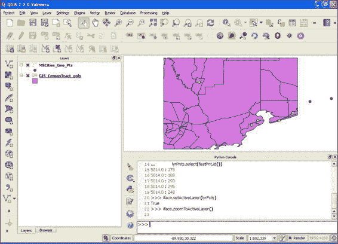
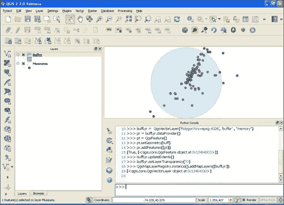
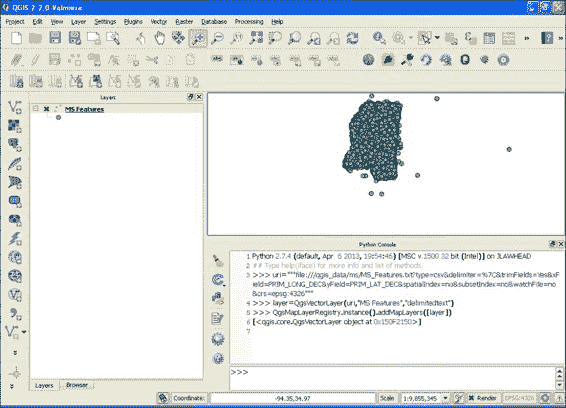

# 第二章：查询矢量数据

在本章中，我们将涵盖以下食谱：

+   从文件加载矢量图层

+   从地理数据库中加载矢量图层

+   检查矢量图层要素

+   检查矢量图层属性

+   通过几何形状过滤图层

+   通过属性过滤图层

+   缓冲要素

+   测量两点之间的距离

+   沿着线测量距离

+   计算多边形的面积

+   创建空间索引

+   计算线的方位角

# 简介

本章演示了如何在 QGIS 中通过 Python 处理矢量数据。我们首先将加载不同来源的矢量数据。接下来，我们将检查数据的内容。然后，我们将在本章的剩余部分对矢量数据进行空间和数据库操作。

# 从文件样本中加载矢量图层

本食谱描述了 QGIS 中最常用的数据类型，即文件。在大多数情况下，您将通过加载 shapefile 来开始一个 QGIS 项目。

## 准备工作

为了便于跟随本书中的示例，建议你在根目录或用户目录中创建一个名为 `qgis_data` 的目录，这提供了一个简短的路径名。这种设置将有助于防止因特定系统上路径相关问题的出现而导致的任何令人沮丧的错误。在本食谱和其他食谱中，我们将使用纽约市博物馆的点要素图层，您可以从[`geospatialpython.googlecode.com/svn/NYC_MUSEUMS_GEO.zip`](https://geospatialpython.googlecode.com/svn/NYC_MUSEUMS_GEO.zip)下载。

解压此文件，并将 shapfile 的内容放置在 `qgis_data` 目录中名为 `nyc` 的目录内。

## 如何操作...

现在，我们将逐步说明加载 shapefile 并将其添加到地图中的步骤，如下所示：

1.  启动 QGIS。

1.  从 **插件** 菜单中选择 **Python 控制台**。

1.  在 Python 控制台中创建图层：

    ```py
    layer = QgsVectorLayer("/qgis_data/nyc/NYC_MUSEUMS_GEO.shp", "New York City Museums", "ogr")

    ```

1.  接下来，确保图层已按预期创建：

    ```py
    if not layer.isValid():
     print "Layer %s did not load" % layer.name()

    ```

1.  最后，将图层添加到图层注册表中：

    ```py
    QgsMapLayerRegistry.instance().addMapLayers([layer])

    ```

确认你的 QGIS 地图看起来与以下图像相似：



## 它是如何工作的...

`QgsVectorLayer` 对象需要文件的位置、QGIS 中图层的名称以及提供正确解析器和为文件格式管理功能的提供者。大多数矢量图层都由 `ogr` 提供者覆盖，它试图从文件名扩展名中猜测格式，以便使用适当的驱动程序。此提供者可用的格式列在[`www.gdal.org/ogr_formats.html`](http://www.gdal.org/ogr_formats.html)。

一旦我们创建了 `QgsVector` 对象，我们使用 `layer.isValid()` 方法进行快速检查，以查看文件是否正确加载。我们不会在每一个菜谱中使用此方法以保持代码简短，但此方法通常非常重要。它通常是唯一表明出错的指示。如果您在文件名中输入了拼写错误，或者您尝试连接到在线数据源但没有网络连接，您将看不到任何错误。您的第一个指示将是代码中更远处的另一个方法失败，这将使追踪根本原因更加困难。

在最后一行，我们将矢量图层添加到 `QgsMapLayerRegistry` 中，使其在地图上可用。注册表跟踪项目中的所有图层。QGIS 以这种方式工作的原因是为了您可以在将图层暴露给地图上的用户之前，加载多个图层，对它们进行样式设置，过滤它们，并执行其他操作。

# 从空间数据库加载矢量图层

PostGIS 地理数据库基于开源的 Postgres 数据库。地理数据库提供了强大的地理空间数据管理和操作功能。PyQGIS 完全支持 PostGIS 作为数据源。在这个菜谱中，我们将从一个 PostGIS 数据库中添加一个图层。

## 准备工作

安装和配置 PostGIS 超出了本书的范围，因此我们将使用来自优秀服务 [www.QGISCloud.com](http://www.QGISCloud.com) 的示例地理空间数据库接口。 [www.QGISCloud.com](http://www.QGISCloud.com) 有自己的 Python 插件，称为 **QGIS Cloud**。您可以免费注册并按照网站说明在线创建自己的地理数据库，或者您可以使用菜谱中使用的示例。

## 如何做...

执行以下步骤将 PostGIS 图层加载到 QGIS 地图中：

1.  首先，创建一个新的 `DataSourceURI` 实例：

    ```py
    uri = QgsDataSourceURI()

    ```

1.  然后，创建数据库连接字符串：

    ```py
    uri.setConnection("spacialdb.com", "9999", "lzmjzm_hwpqlf", "lzmjzm_hwpqlf", "0e9fcc39")

    ```

1.  现在，描述数据源：

    ```py
    uri.setDataSource("public", "islands", "wkb_geometry", "")

    ```

1.  然后，创建图层：

    ```py
    layer = QgsVectorLayer(uri.uri(), "Islands", "postgres")

    ```

1.  为了确保安全，请确保一切正常工作：

    ```py
    if not layer.isValid():
     print "Layer %s did not load" % layer.name()

    ```

1.  最后，如果一切正常，将图层添加到地图中：

    ```py
    QgsMapLayerRegistry.instance().addMapLayers([layer])

    ```

您可以在地图中看到 `islands` 图层，如下面的截图所示：



## 它是如何工作的...

PyQGIS 在 API 中提供了一个对象，用于在 `QgsDataSourceURI()` 中创建 PostGIS 数据源。代码第二行的 `connection` 字符串参数是数据库服务器、端口、数据库名、用户和密码。在示例中，数据库、用户名和密码是随机生成的唯一名称。数据源参数是模式名称、表名称、几何列以及可选的 SQL `WHERE` 子句，根据需要子集图层。

# 检查矢量图层特征

一旦加载了矢量图层，您可能想调查数据。在这个菜谱中，我们将从一个 shapefile 中加载矢量点图层，并查看第一个点的 *x* 和 *y* 值。

## 准备工作

我们将使用本章中*从文件加载矢量图层*配方中的相同的纽约市博物馆图层。你可以从[`geospatialpython.googlecode.com/svn/NYC_MUSEUMS_GEO.zip`](https://geospatialpython.googlecode.com/svn/NYC_MUSEUMS_GEO.zip)下载该图层。

解压该文件，并将 shapefile 的内容放置在你的根目录或主目录下的`qgis_data`目录中的`nyc`目录内。

## 如何操作...

在本配方中，我们将加载图层，获取特征，获取第一个特征，获取其几何形状，并查看第一个点的值：

1.  首先，加载图层：

    ```py
    layer = QgsVectorLayer("/qgis_data/nyc/NYC_MUSEUMS_GEO.shp", "New York City Museums", "ogr")

    ```

1.  接下来，获取图层特征的迭代器：

    ```py
    features = layer.getFeatures()

    ```

1.  现在，从迭代器中获取第一个特征：

    ```py
    f = features.next()

    ```

1.  然后，获取特征的几何形状：

    ```py
    g = f.geometry()

    ```

1.  最后，获取点的值：

    ```py
    g.asPoint()

    ```

1.  确认 Python 控制台输出类似于以下 QgsPoint 对象：

    ```py
    (-74.0138,40.7038)

    ```

## 工作原理...

当你使用之前演示的方法访问图层的特征或几何形状时，PyQGIS 返回一个 Python 迭代器。迭代器数据结构允许 Python 在不需要将整个数据集保留在内存中的情况下，高效地处理非常大的数据集。

# 检查矢量图层属性

一个真正的 GIS 图层包含空间几何和数据库属性。在本配方中，我们将使用 PyQGIS 访问矢量点图层的属性。我们将使用来自 shapefile 的基于文件的图层，但一旦图层在 QGIS 中加载，每个矢量图层的工作方式都是相同的。

## 准备工作

再次强调，我们将使用本章中*从文件加载矢量图层*配方中的相同的纽约市博物馆图层。你可以从[`geospatialpython.googlecode.com/svn/NYC_MUSEUMS_GEO.zip`](https://geospatialpython.googlecode.com/svn/NYC_MUSEUMS_GEO.zip)下载该图层。

解压该文件，并将 shapefile 的内容放置在你的根目录或主目录下的`qgis_data`目录中的`nyc`目录内。

## 如何操作...

在以下步骤中，我们将加载图层，访问`features`迭代器，获取第一个特征，然后以 Python 列表的形式查看属性：

1.  首先，将 shapefile 作为矢量图层加载：

    ```py
    layer = QgsVectorLayer("/qgis_data/nyc/NYC_MUSEUMS_GEO.shp", "New York City Museums", "ogr")

    ```

1.  接下来，获取特征迭代器：

    ```py
    features = layer.getFeatures()

    ```

1.  现在，从迭代器中获取第一个特征：

    ```py
    f = features.next()

    ```

1.  最后，以 Python 列表的形式检查属性：

    ```py
    f.attributes()

    ```

1.  确认 Python 控制台的输出类似于以下列表：

    ```py
    [u'Alexander Hamilton U.S. Custom House', u'(212) 514-3700', u'http://www.oldnycustomhouse.gov/', u'1 Bowling Grn', NULL, u'New York', 10004.0, -74.013756, 40.703817]

    ```

## 工作原理...

检查属性与访问图层几何形状的点值是一致的。请注意，所有字符串属性值都作为 unicode 字符串返回，这是所有 QGIS 字符串的情况。Unicode 允许 QGIS 除了英语以外的其他语言的国际化（即翻译）。

## 更多...

属性值如果没有了解这些值代表的意义，那么它们就没有太多意义。你还需要了解字段。你可以通过访问`fields`迭代器并调用每个字段的`name()`方法来获取字段列表。这个操作可以通过 Python 列表推导式轻松完成：

```py
[c.name() for c in f.fields().toList()]

```

此示例返回以下结果：

```py
[u'NAME', u'TEL', u'URL', u'ADRESS1', u'ADDRESS2', u'CITY', u'ZIP', u'XCOORD', u'YCOORD']

```

# 通过几何形状过滤图层

在本配方中，我们将执行空间操作，根据重叠的多边形图层中的点选择点图层的一个子集。我们将在这两种情况下都使用 shapefiles，其中一个是点图层，另一个是多边形。这种子集是 GIS 操作中最常见的一种。

## 准备工作

我们需要两个新的 shapefiles，这些 shapefiles 在之前的配方中尚未使用。你可以从 [`geospatialpython.googlecode.com/files/MSCities_Geo_Pts.zip`](https://geospatialpython.googlecode.com/files/MSCities_Geo_Pts.zip) 下载点图层。

类似地，你可以从 [`geospatialpython.googlecode.com/files/GIS_CensusTract.zip`](https://geospatialpython.googlecode.com/files/GIS_CensusTract.zip) 下载几何图层。

解压这些 shapefiles 并将它们放置在你根目录或主目录下的 `qgis_data` 目录中的 `ms` 目录内。

## 如何操作...

在本配方中，我们将执行几个步骤来选择点图层中位于多边形图层内的要素，如下所示：

1.  首先，加载点图层：

    ```py
    lyrPts = QgsVectorLayer("/qgis_data/ms/MSCities_Geo_Pts.shp", "MSCities_Geo_Pts", "ogr")

    ```

1.  接下来，加载多边形图层：

    ```py
    lyrPoly = QgsVectorLayer("/qgis_data/ms/GIS_CensusTract_poly.shp", "GIS_CensusTract_poly", "ogr")

    ```

1.  使用列表将图层添加到地图中：

    ```py
    QgsMapLayerRegistry.instance().addMapLayers([lyrPts,lyrPoly])

    ```

1.  访问多边形图层的要素：

    ```py
    ftsPoly = lyrPoly.getFeatures()

    ```

1.  现在，迭代多边形的要素：

    ```py
    for feat in ftsPoly:

    ```

1.  获取每个要素的几何形状：

    ```py
     geomPoly = feat.geometry() 

    ```

1.  访问点要素并通过多边形的边界框过滤点要素：

    ```py
     featsPnt = lyrPts.getFeatures(QgsFeatureRequest().setFilterRect(geomPoly.boundingBox()))

    ```

1.  迭代每个点并检查它是否位于多边形本身内：

    ```py
     for featPnt in featsPnt:
     if featPnt.geometry().within(geomPoly):

    ```

1.  如果多边形包含该点，打印点的 ID 并选择该点：

    ```py
     print featPnt.id()
     lyrPts.select(featPnt.id())

    ```

1.  现在，将多边形图层设置为活动地图图层：

    ```py
    iface.setActiveLayer(lyrPoly)

    ```

1.  将视图缩放到多边形图层的最大范围：

    ```py
    iface.zoomToActiveLayer()

    ```

确认你的地图看起来与以下图像相似：



## 工作原理...

虽然 QGIS 提供了多种空间选择工具，但 PyQGIS 没有专门用于这些类型功能的 API。然而，由于底层 `ogr/GEOS` 库的存在，API 中有足够的方法，你可以轻松地为两层创建自己的空间过滤器。第 7 步并非完全必要，但使用多边形的边界框来限制我们检查的点特征数量可以提高一些效率。涉及矩形的计算比详细的点在多边形内查询要快得多。因此，我们快速减少需要迭代的点数量，以便进行更昂贵的空间操作。

# 通过属性过滤图层

除了前一个配方中概述的空间查询之外，我们还可以通过属性对图层进行子集划分。这种查询类似于更传统的数据库查询，实际上使用了 SQL 语句。在本配方中，我们将通过一个属性过滤基于点 shapefile 的图层。

## 准备工作

我们将使用本章中之前配方中使用的相同的纽约市博物馆层。您可以从[`geospatialpython.googlecode.com/svn/NYC_MUSEUMS_GEO.zip`](https://geospatialpython.googlecode.com/svn/NYC_MUSEUMS_GEO.zip)下载该层。

解压该文件，并将 shapefile 的内容放置在您的根目录或主目录中的`qgis_data`目录下的`nyc`目录中。

## 如何操作...

在此配方中，我们将通过属性过滤层，选择过滤后的要素，并缩放到它们，如下所示：

1.  首先，我们加载点层：

    ```py
    lyrPts = QgsVectorLayer("/qgis_data/nyc/NYC_MUSEUMS_GEO.shp", "Museums", "ogr")

    ```

1.  接下来，我们将层添加到地图中以便可视化点：

    ```py
    QgsMapLayerRegistry.instance().addMapLayers([lyrPts])

    ```

1.  现在，我们过滤点层以匹配特定邮编的属性点：

    ```py
    selection = lyrPts.getFeatures(QgsFeatureRequest().setFilterExpression(u'"ZIP" = 10002'))

    ```

1.  然后，我们使用列表推导来创建一个特征 ID 列表，该列表被馈送到特征选择方法：

    ```py
    lyrPts.setSelectedFeatures([s.id() for s in selection])

    ```

1.  最后，我们将缩放到选择区域：

    ```py
    iface.mapCanvas().zoomToSelected()

    ```

验证点层有三个选定的要素，以黄色显示。

## 它是如何工作的...

此配方利用 QGIS 过滤表达式，在第 3 步中突出显示。这些过滤表达式是 SQL 的一个子集。`QgsFeatureRequest`将查询表达式作为可选参数处理，以返回仅包含您想要的要素的迭代器。这些查询还允许一些基本的几何操作。此配方还介绍了`mapCanvas().zoomToSelected()`方法，这是一种方便地将地图范围设置为感兴趣要素的方法。

# 缓冲要素的中间过程

缓冲一个要素会在要素周围创建一个多边形，作为选择几何或简单的可视化。在此配方中，我们将缓冲点要素中的点，并将返回的多边形几何添加到地图上。

## 准备工作

再次，我们将使用相同的纽约市博物馆层。您可以从[`geospatialpython.googlecode.com/svn/NYC_MUSEUMS_GEO.zip`](https://geospatialpython.googlecode.com/svn/NYC_MUSEUMS_GEO.zip)下载该层。

解压该文件，并将 shapefile 的内容放置在您的根目录或主目录中的`qgis_data`目录下的`nyc`目录中。

## 如何操作...

此配方涉及空间操作和多个可视化。为此，执行以下步骤：

1.  首先，加载层：

    ```py
    lyr = QgsVectorLayer("/qgis_data/nyc/NYC_MUSEUMS_GEO.shp", "Museums", "ogr")

    ```

1.  接下来，在地图上可视化层：

    ```py
    QgsMapLayerRegistry.instance().addMapLayers([lyr])

    ```

1.  访问层的要素：

    ```py
    fts = lyr.getFeatures()

    ```

1.  获取第一个要素：

    ```py
    ft = fts.next()

    ```

1.  选择此要素：

    ```py
    lyr.setSelectedFeatures([ft.id()])

    ```

1.  创建缓冲区：

    ```py
    buff = ft.geometry().buffer(.2,8)

    ```

1.  为缓冲的几何设置内存层：

    ```py
    buffLyr =  QgsVectorLayer('Polygon?crs=EPSG:4326', 'Buffer' , 'memory')

    ```

1.  访问层的提供者：

    ```py
    pr = buffLyr.dataProvider()

    ```

1.  创建一个新要素：

    ```py
    b = QgsFeature()

    ```

1.  使用缓冲几何设置要素的几何：

    ```py
    b.setGeometry(buff)

    ```

1.  将要素添加到数据提供者：

    ```py
    pr.addFeatures([b])

    ```

1.  更新缓冲层的范围：

    ```py
    buffLyr.updateExtents()

    ```

1.  设置缓冲层的透明度，以便您可以看到其他要素：

    ```py
    buffLyr.setLayerTransparency(70)

    ```

1.  将缓冲层添加到地图：

    ```py
    QgsMapLayerRegistry.instance().addMapLayers([buffLyr])

    ```

验证您的地图看起来与这张截图相似：



## 它是如何工作的...

本菜谱的有趣部分从第 6 步开始，该步创建缓冲几何体。`buffer()`方法的参数是缓冲区的地图单位距离，然后是用于近似曲线的直线段数。您指定的段数越多，缓冲区就越像圆形。然而，更多的段数意味着更大的几何复杂性，因此渲染速度和几何计算速度都会变慢。本菜谱的另一个有趣特性是第 13 步，其中我们将图层的透明度设置为 70%。我们还介绍了创建新图层的方法，这是在内存中完成的。后面的章节将更深入地介绍创建数据。

# 测量两点之间的距离

在`QgsDistanceArea`对象中，PyQGIS 具有出色的测量距离功能。我们将使用此对象进行多个菜谱，从测量两点之间的距离开始。

## 准备工作

如果您还没有本章之前菜谱中使用的纽约市博物馆图层，请从[`geospatialpython.googlecode.com/svn/NYC_MUSEUMS_GEO.zip`](https://geospatialpython.googlecode.com/svn/NYC_MUSEUMS_GEO.zip)下载图层。

解压该文件，并将 shapefile 的内容放置在您的根目录或主目录下的`qgis_data`目录中的名为`nyc`的目录内。

## 如何操作...

在以下步骤中，我们将提取图层点顺序中的第一个和最后一个点并测量它们之间的距离：

1.  首先，导入包含 QGIS 内容的库：

    ```py
    from qgis.core import QGis

    ```

1.  然后，加载图层：

    ```py
    lyr = QgsVectorLayer("/qgis_data/nyc/NYC_MUSEUMS_GEO.shp", "Museums", "ogr")

    ```

1.  访问功能：

    ```py
    fts = lyr.getFeatures()

    ```

1.  获取第一个特征：

    ```py
    first = fts.next()

    ```

1.  为最后一个特征设置占位符：

    ```py
    last = fts.next()

    ```

1.  遍历特征直到获取最后一个：

    ```py
    for f in fts:
     last = f

    ```

1.  创建测量对象：

    ```py
    d = QgsDistanceArea()

    ```

1.  测量距离：

    ```py
    m = d.measureLine(first.geometry().asPoint(), last.geometry().asPoint())

    ```

1.  将测量值从十进制度数转换为米：

    ```py
    d.convertMeasurement(m, 2, 0, False)

    ```

1.  确保您的 Python 控制台输出类似于以下元组：

    ```py
    (4401.1622240174165, 0)

    ```

## 它是如何工作的...

`QgsDistanceArea`对象接受不同类型的几何体作为输入。在这种情况下，我们使用两个点。该图层的地图单位是十进制度数，对于距离测量来说没有意义。因此，我们使用`QgsDistanceArea.convertMeasurement()`方法将输出转换为米。该方法参数包括测量输出、输入单位（十进制度数）、输出单位（米）以及一个布尔值，表示此转换是面积计算还是线性测量。

返回的元组是测量值和单位。值 0 告诉我们输出是在米。

# 沿线样测量距离

在本菜谱中，我们将测量具有多个顶点的线上的距离。

## 准备工作

对于本菜谱，我们将使用具有两个特征的线状 shapefile。您可以从[`geospatialpython.googlecode.com/svn/paths.zip`](https://geospatialpython.googlecode.com/svn/paths.zip)下载 shapefile 作为`.ZIP`文件。

将 shapefile 解压到根目录或主目录下的 `qgis_data/shapes` 目录中。

## 如何操作...

此菜谱的步骤相当直接。我们将从第一行要素中提取几何形状，并将其传递给测量对象，如下所示：

1.  首先，我们必须加载 QGIS 常量库：

    ```py
    from qgis.core import QGis

    ```

1.  加载线图层：

    ```py
    lyr = QgsVectorLayer("/qgis_data/shapes/paths.shp", "Route", "ogr")

    ```

1.  获取要素：

    ```py
    fts = lyr.getFeatures()

    ```

1.  获取第一个要素：

    ```py
    route = fts.next()

    ```

1.  创建测量对象实例：

    ```py
    d = QgsDistanceArea()

    ```

1.  然后，我们必须配置 QgsDistanceArea 对象以使用椭圆模式进行米级的精确测量：

    ```py
    d.setEllipsoidalMode(True)

    ```

1.  将行的几何形状传递给 `measureLine` 方法：

    ```py
    m = d.measureLine(route.geometry().asPolyline())

    ```

1.  将测量输出转换为英里：

    ```py
    d.convertMeasurement(m, QGis.Meters, QGis.NauticalMiles, False)

    ```

确保你的输出看起来类似于以下内容：

```py
(2314126.583384674, 7)

```

## 作用原理...

QgsDistanceArea 对象可以根据你调用的方法执行任何类型的测量。当你将测量值从米（用 0 表示）转换为英里（用数字 7 表示）时，你将得到一个包含测量值和单位标识符的元组。QGIS API 文档显示了所有单位常量的值

([`qgis.org/api/classQGis.html`](http://qgis.org/api/classQGis.html)).

# 计算多边形的面积

此菜谱仅测量多边形的面积。

## 准备工作

对于此菜谱，我们将使用单个要素的多边形 shapefile，您可以从 [`geospatialpython.googlecode.com/files/Mississippi.zip`](https://geospatialpython.googlecode.com/files/Mississippi.zip) 下载

解压 shapefile 并将其放入根目录或主目录下的 **qgis_data/ms** 目录中。

## 如何操作...

执行以下步骤以测量大多边形的面积：

1.  首先，导入 QGIS 常量库，如下所示：

    ```py
    from qgis.core import QGis

    ```

1.  加载图层：

    ```py
    lyr = QgsVectorLayer("/qgis_data/ms/mississippi.shp", "Mississippi", "ogr")

    ```

1.  访问图层的要素：

    ```py
    fts = lyr.getFeatures()

    ```

1.  获取边界要素：

    ```py
    boundary = fts.next()

    ```

1.  创建测量对象实例：

    ```py
    d = QgsDistanceArea()

    ```

1.  将多边形列表传递给 `measureArea()` 方法：

    ```py
    m = d.measurePolygon(boundary.geometry().asPolygon()[0])

    ```

1.  将测量值从十进制度数转换为英里：

    ```py
    d.convertMeasurement(m, QGis.Degrees, QGis.NauticalMiles, True) 

    ```

1.  确保你的输出看起来类似于以下内容：

    ```py
    (42955.47889640281, 7)

    ```

## 作用原理...

PyQIS 没有提供 `measureArea()` 方法，但在 `QgsDistanceArea` 对象中有一个 `measurePolygon()` 方法。该方法接受一个点列表。在这种情况下，当我们从十进制度数转换为英里时，我们还在 `convertMeasurement()` 方法中指定 `True`，这样 QGIS 就知道这是一个面积计算。请注意，当我们获取边界几何形状作为多边形时，我们使用索引 0，这表明存在多个多边形。多边形几何形状可以具有内环，这些内环被指定为额外的多边形。最外层的环，在这种情况下是唯一的环，是第一个多边形。

# 创建空间索引

到目前为止，本书中的食谱使用了每个操作层的原始几何形状。在本食谱中，我们将采取不同的方法，在运行操作之前为图层创建空间索引。空间索引通过创建额外的、更简单的几何形状来优化图层，这些几何形状可以用来缩小复杂几何形状中的可能性范围。

## 准备工作

如果你还没有在本书前面的食谱中使用的纽约市博物馆图层，请从[`geospatialpython.googlecode.com/svn/NYC_MUSEUMS_GEO.zip`](https://geospatialpython.googlecode.com/svn/NYC_MUSEUMS_GEO.zip)下载图层。

解压缩该文件，并将形状文件的内容放置在根目录或主目录中的`qgis_data`目录下的`nyc`目录中。

## 如何操作...

在本食谱中，我们将为点图层创建空间索引，然后我们将使用它来执行空间查询，如下所示：

1.  加载图层：

    ```py
    lyr = QgsVectorLayer("/qgis_data/nyc/NYC_MUSEUMS_GEO.shp", "Museums", "ogr")

    ```

1.  获取特征：

    ```py
    fts = lyr.getFeatures()

    ```

1.  获取集合中的第一个特征：

    ```py
    first = fts.next()

    ```

1.  现在，创建空间索引：

    ```py
    index = QgsSpatialIndex()

    ```

1.  开始加载特征：

    ```py
    index.insertFeature(first)

    ```

1.  插入剩余的特征：

    ```py
    for f in fts:
     index.insertFeature(f)

    ```

1.  现在，选择距离第一个点最近的 3 个点的 ID。我们使用数字`4`，因为起始点包含在输出中：

    ```py
    hood = index.nearestNeighbor(first.geometry().asPoint(), 4)

    ```

## 工作原理...

索引可以加快空间操作的速度。但是，你必须逐个添加每个特征。此外，请注意，`nearestNeighbor()`方法将起始点的 ID 作为输出的一部分返回。因此，如果你想获取`4`个点，你必须指定`5`。

# 计算线的方位角

有时，你需要知道线的罗盘方位角来创建专门的符号或将其用作空间计算中的输入。尽管其名称只提到距离和面积，但多功能的`QgsDistanceArea`对象也包括这个功能。在本食谱中，我们将计算线的端点的方位角。然而，这个食谱可以适用于任何两个点。

## 准备工作

我们将使用之前食谱中使用的线形状文件。您可以从[`geospatialpython.googlecode.com/svn/paths.zip`](https://geospatialpython.googlecode.com/svn/paths.zip)下载形状文件作为`.ZIP`文件。

将形状文件解压缩到根目录或主目录中的`qgis_data/shapes`目录下。

## 如何操作...

要执行的操作步骤与获取所需的两个点并将它们通过方位角函数运行一样简单，从弧度转换为度数，然后转换为正罗盘方位角：

1.  首先，导入 Python 数学模块：

    ```py
    import math

    ```

1.  接下来，加载图层：

    ```py
    lyr = QgsVectorLayer("/qgis_data/shapes/paths.shp", "Route", "ogr")

    ```

1.  现在，获取特征：

    ```py
    fts = lyr.getFeatures()

    ```

1.  然后，获取第一条线特征：

    ```py
    route = fts.next()

    ```

1.  创建测量对象：

    ```py
    d = QgsDistanceArea()

    ```

1.  你必须将椭球模式设置为`True`，以便在计算方位角之前投影数据：

    ```py
    d.setEllipsoidalMode(True)

    ```

1.  获取所有点作为列表：

    ```py
    points = route.geometry().asPolyline()

    ```

1.  获取第一个点：

    ```py
    first = points[0]

    ```

1.  获取最后一个点：

    ```py
    last = points[-1]

    ```

1.  以弧度计算方位角：

    ```py
    r = d.bearing(first, last)

    ```

1.  现在，将弧度转换为度数：

    ```py
    b = math.degrees(r)

    ```

1.  确保方位角为正值：

    ```py
    if b < 0: b += 360

    ```

1.  查看输出：

    ```py
    print b

    ```

确认方位角接近以下数字：

```py
320.3356091875395

```

## 它是如何工作的...

磁方位角计算默认输出为弧度。然而，Python 的 `math` 模块使得转换变得轻而易举。如果度数的转换结果为负数，大多数情况下我们都会想将这个数加到 360 上，以得到罗盘方位角，就像我们在这里做的那样。

# 从电子表格加载数据

电子表格是收集和存储简单地理数据最常用的方法之一。QGIS 可以处理称为 CSV 或逗号分隔值文件的文本文件。任何电子表格都可以使用电子表格程序转换为 CSV。只要 CSV 数据有一个表示 *x* 值的列，一个表示 *y* 值的列，以及其他包含第一行字段名的数据列，QGIS 就可以导入它。许多组织以 CSV 的形式分发地理信息，所以迟早您会发现自己正在导入 CSV。此外，PyQGIS 允许您以编程方式完成此操作。请注意，只要一致，CSV 可以由任何字符分隔。此外，CSV 文件的文件扩展名并不重要，只要您为 QGIS 指定文件类型即可。

## 准备工作

我们将使用一个包含点特征的样本 CSV 文件，这些特征代表一个区域内感兴趣点的位置。您可以从 [`geospatialpython.googlecode.com/svn/MS_Features.txt`](https://geospatialpython.googlecode.com/svn/MS_Features.txt) 下载此样本。

将其保存到您的根目录或主目录下的 `qgis_data/ms` 目录中。

## 如何操作...

我们将构建一个用于将 CSV 作为矢量图层加载的 `URI` 字符串。描述 CSV 结构的所有参数都包含在以下 URI 中：

1.  首先，我们构建包含文件名的基本 `URI` 字符串：

    ```py
    uri="""file:///qgis_data/ms/MS_Features.txt?"""

    ```

1.  接下来，我们告诉 QGIS 该文件是 CSV 文件：

    ```py
    uri += """type=csv&"""

    ```

1.  现在，我们指定我们的分隔符，它是一个管道（**"|"**），作为一个 URL 编码值：

    ```py
    uri += """delimiter=%7C&"""

    ```

1.  接下来，我们告诉 QGIS 去除字段两端的任何空格：

    ```py
    uri += """trimFields=Yes&"""

    ```

1.  现在，最重要的部分，我们指定 x 字段：

    ```py
    uri += """xField=PRIM_LONG_DEC&"""

    ```

1.  然后，我们指定 y 字段：

    ```py
    uri += """yField=PRIM_LAT_DEC&"""

    ```

1.  我们拒绝空间索引选项：

    ```py
    uri += """spatialIndex=no&"""

    ```

1.  我们拒绝子集选项：

    ```py
    uri += """subsetIndex=no&"""

    ```

1.  我们告诉 QGIS 不要监视文件变化：

    ```py
    uri += """watchFile=no&"""

    ```

1.  最后，我们使用图层的坐标参考系统（CRS）完成 `uri`：

    ```py
    uri += """crs=epsg:4326"""

    ```

1.  我们使用 `delimitedtext` 数据提供者加载图层：

    ```py
    layer=QgsVectorLayer(uri,"MS Features","delimitedtext")

    ```

1.  最后，我们将它添加到地图上：

    ```py
    QgsMapLayerRegistry.instance().addMapLayers([layer])

    ```

确认您的地图看起来与以下截图中的地图相似：



## 它是如何工作的...

URI 非常详细，但这是必要的，以便 QGIS 获取足够的信息来正确加载图层。在这个简单的例子中，我们使用了字符串，但使用 `QUrl` 对象更安全，因为它为您处理编码。`QUrl` 类的文档在 `Qt` 文档中，网址为 [`qt-project.org/doc/qt-4.8/qurl.html`](http://qt-project.org/doc/qt-4.8/qurl.html)。

注意，在 URI 中，我们告诉 QGIS 类型是 **CSV**，但当我们加载图层时，类型是 **delimitedtext**。只要所有列都平衡，QGIS 会忽略空字段。

## 还有更多...

如果你在加载图层时遇到困难，可以使用**QGIS 添加分隔文本图层…**对话框，在**图层**菜单下找出正确的参数。一旦图层加载成功，你可以查看其元数据以了解 QGIS 构建的用于加载它的 URI。你也可以通过使用`layer.source()`方法程序化地从已加载的分隔文本图层中获取正确的参数。当然，这两种方法都适用于任何类型的图层，而不仅仅是分隔文本图层。然而，与其他图层类型不同，你无法在 QGIS 中编辑分隔文本图层。
