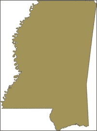
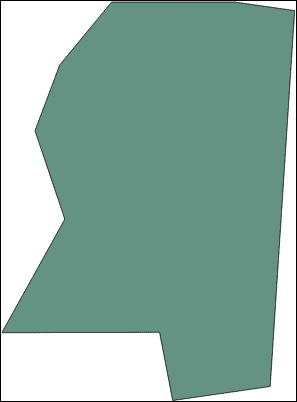
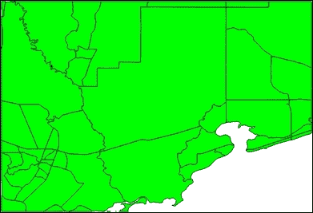
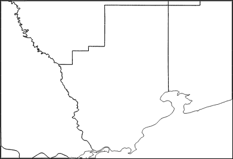
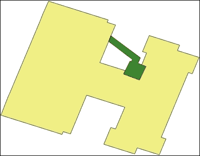
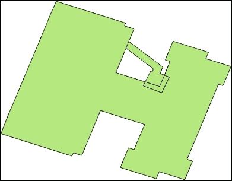
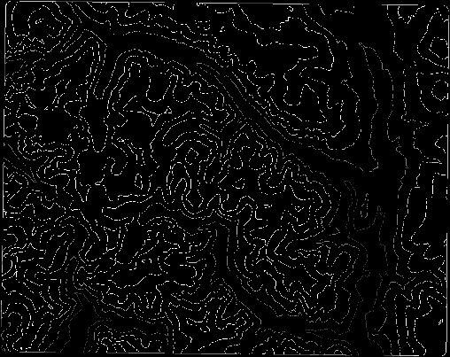

# 第三章。编辑向量数据

在本章中，我们将介绍以下配方：

+   在内存中创建向量层

+   向向量层添加点要素

+   向向量层添加线要素

+   向向量层添加多边形要素

+   向向量层添加一组属性

+   向向量层添加字段

+   将 shapefile 属性表连接到 CSV 文件

+   移动向量层几何形状

+   修改向量层属性

+   删除向量层几何形状

+   删除向量层字段

+   删除向量层属性

+   重投影向量层

+   将 shapefile 转换为 Keyhole 标记语言 (KML)

+   合并 shapefile

+   分割 shapefile

+   通用化向量层

+   溶解向量形状

+   在向量形状上执行联合操作

+   向量层栅格化

# 简介

本章详细介绍了如何使用 Python API 编辑 QGIS 向量数据。`QgsVectorLayer` 对象包含了添加、编辑和删除要素的基本功能。所有其他地理空间操作都可以通过 **处理工具箱** 或甚至通过自定义脚本来访问。

# 在内存中创建向量层

有时，你需要创建一个临时数据集以快速输出，或者在更复杂的操作中作为中间步骤，而不需要实际将文件写入磁盘。PyQGIS 使用 **内存层** 允许你创建一个完整的向量数据集，包括几何形状、字段和属性，虚拟地。一旦创建了内存层，你就可以像处理从磁盘加载的向量层一样处理它。

## 准备工作

此配方完全在 PyQGIS 控制台中运行，因此不需要准备或外部资源。

## 如何做到...

我们将创建一个名为 `Layer 1` 的 `Point` 向量层，包含一些字段，然后验证它：

1.  启动 QGIS。

1.  从 **插件** 菜单中选择 **Python 控制台**。

1.  在 Python 控制台中创建一个 `QgsVectorLayer`，包括字段，并将其指定为内存数据提供者：

    ```py
    vectorLyr =  QgsVectorLayer('Point?crs=epsg:4326&field=city:string(25)&field=population:nt', 'Layer 1' , "memory")

    ```

1.  现在，验证层并确保控制台返回 `True`：

    ```py
    vectorLyr.isValid()

    ```

## 它是如何工作的...

`QgsVectorLayer` 需要三个参数。最后一个参数指定类型，在这种情况下是 `memory`。第二个参数指定图层名称。通常，第一个参数是磁盘上文件的路径，用于创建图层。在内存层的情况下，第一个参数成为图层的构建字符串。该格式使用遵循 `key = value` 约定的查询参数。我们首先指定坐标参考系统，然后指定我们想要的字段。在这种情况下，我们指定第一个字段，一个用于城市名称的字符串字段，然后是一个用于人口的整数字段。

## 更多内容...

你可以很容易地看到如何用字符串描述图层属性表结构可能会变得难以管理。你还可以使用 Python-有序字典动态构建字符串，如下面的步骤所示。

1.  首先，你需要导入 `OrderedDict` 容器，它记得键插入的顺序：

    ```py
    from collections import OrderedDict

    ```

1.  然后，构建一个包含属性名称和类型的有序字典：

    ```py
    fields = OrderedDict([('city','str(25)'),('population','int')])

    ```

1.  接下来，通过连接一个 Python 列表推导式的输出构建一个字符串，该列表推导式遍历有序字典：

    ```py
    path = '&'.join(['field={}:{}'.format(k,v) for k,v in fields.items()])

    ```

1.  最后，使用此字符串定义图层：

    ```py
    vectorLyr =  QgsVectorLayer('Point?crs=epsg:4326&' + path, 'Layer 1' , "memory")

    ```

# 向矢量图层添加点要素

此食谱执行了从 shapefile 实例化的矢量图层可能的最简单编辑。我们将向现有的点图层添加一个点。

## 准备工作

对于这个食谱，请从[`geospatialpython.googlecode.com/svn/NYC_MUSEUMS_GEO.zip`](https://geospatialpython.googlecode.com/svn/NYC_MUSEUMS_GEO.zip)下载压缩的 shapefile。

将`.shp`、`.shx`和`.dbf`文件提取到`/qgis_data/nyc`目录。

## 如何操作...

我们将从 shapefile 加载矢量图层，创建一个新的点几何对象，创建一个新的要素，设置几何形状，并将其添加到图层的数据提供者。最后，我们将更新图层的范围，以确保图层的边界框包含新的点：

1.  启动 QGIS。

1.  从**插件**菜单中选择**Python 控制台**。

1.  首先，加载图层：

    ```py
    vectorLyr =  QgsVectorLayer('/qgis_data/nyc/NYC_MUSEUMS_GEO.shp', 'Museums' , "ogr")

    ```

1.  现在，将访问图层的数据提供者：

    ```py
    vpr = vectorLyr.dataProvider()

    ```

1.  接下来，使用`QgsGeometry`对象创建一个新的点：

    ```py
    pnt = QgsGeometry.fromPoint(QgsPoint(-74.80,40.549))

    ```

1.  现在，将创建一个新的`QgsFeature`对象来存放几何形状：

    ```py
    f = QgsFeature()

    ```

1.  接下来，使用我们的点设置要素的几何形状：

    ```py
    f.setGeometry(pnt)

    ```

1.  然后，将要素放入图层要素列表中：

    ```py
    vpr.addFeatures([f])

    ```

1.  最后，更新图层的范围以完成添加：

    ```py
    vectorLyr.updateExtents()

    ```

## 它是如何工作的...

PyQGIS 将图层内的点抽象为四个级别。最低级别是`QgsPoint`对象，它包含的不仅仅是点的坐标。此对象被添加到一个抽象的`QgsGeometry`对象中。此对象成为`QgsFeature`对象的几何部分，该对象还具有存储和管理属性的能力。所有要素都由`QgsDataProvider`对象管理。数据提供者管理图层的地理空间方面，以将其与样式和其他与呈现相关的部分分开。QGIS 在 Python 中还有另一种编辑方法，称为**编辑缓冲区**。当你使用编辑缓冲区时，可以显示更改，但除非你提交它们，否则这些更改不是永久的。这种编辑方法最常见的使用场景是在 GUI 应用程序中，用户可能会选择通过取消编辑会话来回滚更改。"PyQGIS 开发者食谱"中有一个使用和编辑缓冲区的 Python 示例，可在[`docs.qgis.org/2.6/en/docs/pyqgis_developer_cookbook/vector.html`](http://docs.qgis.org/2.6/en/docs/pyqgis_developer_cookbook/vector.html)找到。

# 向矢量图层添加线要素

在 QGIS 中向矢量图层添加一行与添加单个点相同，但在这里你只需向`QgsGeometry`对象添加更多点。

## 准备工作

对于这个配方，您需要下载一个包含两个线特征的压缩线形状文件，您可以从[`geospatialpython.googlecode.com/svn/paths.zip`](https://geospatialpython.googlecode.com/svn/paths.zip)下载。

将 ZIP 文件解压到您`/qgis_data`目录中名为`paths`的目录中。

## 如何操作...

在这个配方中，我们将从形状文件中加载线图层，构建点列表，创建一个新的几何对象，并将点作为线添加。我们还将创建一个新的特征，设置几何形状，并将其添加到图层的数据提供者。最后，我们将更新图层的范围，以确保图层的边界框包含新的特征：

1.  启动 QGIS。

1.  从**插件**菜单中选择**Python 控制台**。

1.  首先，加载线图层并确保它是有效的：

    ```py
    vectorLyr =  QgsVectorLayer('/qgis_data/paths/paths.shp', 'Paths' , "ogr")
    vectorLyr.isValid()

    ```

1.  接下来，访问层的提供者：

    ```py
    vpr = vectorLyr.dataProvider()

    ```

1.  现在，构建我们新线的点列表：

    ```py
    points = []
    points.append(QgsPoint(430841,5589485))
    points.append(QgsPoint(432438,5575114))
    points.append(QgsPoint(447252,5567663))

    ```

1.  然后，从线创建一个几何对象：

    ```py
    line = QgsGeometry.fromPolyline(points)

    ```

1.  创建一个特征并将其几何设置为线：

    ```py
    f = QgsFeature()
    f.setGeometry(line)

    ```

1.  最后，将特征添加到图层数据提供者并更新范围：

    ```py
    vpr.addFeatures([f])
    vectorLyr.updateExtents()

    ```

## 它是如何工作的...

与 QGIS 中的所有几何形状一样，我们使用构建点、几何、特征和数据提供者的四步流程来添加线。有趣的是，`QgsGeometry`对象接受 Python 列表作为点的集合，而不是像`QgsPoint`对象那样创建正式的对象。

# 向矢量层添加多边形特征

在这个配方中，我们将向图层添加一个多边形。多边形是最复杂的几何形状之一。然而，在 QGIS 中，API 与线非常相似。

## 准备工作

对于这个配方，我们将使用一个简单的多边形形状文件，您可以从[`geospatialpython.googlecode.com/files/polygon.zip`](https://geospatialpython.googlecode.com/files/polygon.zip)下载为 ZIP 文件。

将此形状文件解压到您`/qgis_data`目录中名为`polygon`的文件夹中。

## 如何操作...

此配方将遵循标准的 PyQGIS 流程，加载图层、构建特征并将其添加到图层的数据提供者，如下所示：

1.  启动 QGIS。

1.  从**插件**菜单中选择**Python 控制台**。

1.  首先，加载图层并验证它：

    ```py
    vectorLyr =  QgsVectorLayer('/qgis_data/polygon/polygon.shp', 'Polygon' , "ogr")
    vectorLyr.isValid()

    ```

1.  接下来，访问层的提供者：

    ```py
    vpr = vectorLyr.dataProvider()

    ```

1.  现在，为多边形构建一个点列表：

    ```py
    points = []
    points.append(QgsPoint(-123.26,49.06))
    points.append(QgsPoint(-127.19,43.07))
    points.append(QgsPoint(-120.70,35.21))
    points.append(QgsPoint(-115.89,40.02))
    points.append(QgsPoint(-113.04,48.47))
    points.append(QgsPoint(-123.26,49.06))

    ```

1.  接下来，创建一个几何对象并将点作为多边形导入。我们将在另一个列表中嵌套我们的点列表，因为多边形可以有内环，这些内环将包含添加到该列表的附加点列表：

    ```py
    poly = QgsGeometry.fromPolygon([points])

    ```

1.  接下来，构建特征对象并添加点：

    ```py
    f = QgsFeature()
    f.setGeometry(poly)

    ```

1.  最后，将特征添加到图层的数据提供者并更新范围：

    ```py
    vpr.addFeatures([f])

    ```

## 它是如何工作的...

添加多边形与添加线非常相似，有一个关键的区别是一个常见的陷阱。最后一个点必须与第一个点相同，以便闭合多边形。如果您不重复第一个点，您不会收到任何错误，但多边形将不会在 QGIS 中显示，这可能会很难调试。

# 向矢量层添加一组属性

每个 QGIS 特征有两个部分，几何形状和属性。在这个菜谱中，我们将为现有数据集的图层添加一个属性。

## 准备工作

我们将使用纽约市博物馆数据的点 shapefile，你可以从[`geospatialpython.googlecode.com/svn/NYC_MUSEUMS_GEO.zip`](https://geospatialpython.googlecode.com/svn/NYC_MUSEUMS_GEO.zip)下载 ZIP 文件。

将此 shapefile 提取到`/qgis_data/nyc`目录。

## 如何做...

一个特征必须有几何形状，但不需要属性。因此，我们将创建一个新特征，添加一些属性，然后将所有内容添加到图层中，如下所示：

1.  启动 QGIS。

1.  从**插件**菜单中选择**Python 控制台**。

1.  首先，加载图层并验证它：

    ```py
    vectorLyr =  QgsVectorLayer('/qgis_data/nyc/NYC_MUSEUMS_GEO.shp', 'Museums' , "ogr")
    vectorLyr.isValid()

    ```

1.  接下来，访问图层的数据提供者，以便我们可以获取字段列表：

    ```py
    vpr = vectorLyr.dataProvider()

    ```

1.  现在，创建一个点几何形状，在这个例子中是一个新的博物馆：

    ```py
    pnt = QgsGeometry.fromPoint(QgsPoint(-74.13401,40.62148))

    ```

1.  接下来，获取我们将需要创建新特征的图层的`fields`对象：

    ```py
    fields = vpr.fields()

    ```

1.  然后，创建一个新特征并初始化属性：

    ```py
    f = QgsFeature(fields)

    ```

1.  现在，设置我们新博物馆特征的几何形状：

    ```py
    f.setGeometry(pnt)

    ```

1.  现在，我们能够添加一个新属性。添加属性类似于更新 Python 字典，如下所示：

    ```py
    f['NAME'] = 'Python Museum'

    ```

1.  最后，我们将特征添加到图层并更新范围：

    ```py
    vpr.addFeatures([f])
    vectorLyr.updateExtents()

    ```

## 它是如何工作的...

PyQGIS 属性定义为有序的`array`。引用字段的语法类似于 Python 字典的语法。我们使用图层的数据提供者对象来执行实际的编辑。当我们使用这种方法时，在图层对象级别不会触发任何信号。如果我们只是尝试在文件系统上编辑数据，那是可以的，但如果图层将被添加到地图画布以显示或用户交互，那么你应该使用`QgsVectorLayer`对象中的编辑缓冲区。这个编辑缓冲区允许你提交或回滚更改，并跟踪更改时的图层状态。

# 向矢量图层添加字段

这个菜谱演示了如何向图层添加新字段。每个字段代表数据集中新列的一个新属性。当你添加一个新属性时，所有特征都将该字段的索引设置为`NULL`。

## 准备工作

我们将使用其他菜谱中使用的纽约市博物馆的 shapefile，你可以从[`geospatialpython.googlecode.com/svn/NYC_MUSEUMS_GEO.zip`](https://geospatialpython.googlecode.com/svn/NYC_MUSEUMS_GEO.zip)下载 ZIP 文件。

将此 shapefile 提取到`/qgis_data/nyc`。

## 如何做...

图层的所有数据管理都通过图层的数据提供者来处理，字段也不例外。我们将加载图层，访问数据提供者，定义新字段，并最终完成更改，如下所示：

1.  启动 QGIS。

1.  从**插件**菜单中选择**Python 控制台**。

1.  首先，你必须导入`Qt`库的数据类型，PyQGIS 使用这些数据类型来指定图层字段的类型：

    ```py
    from PyQt4.QtCore import QVariant

    ```

1.  接下来，加载并验证图层：

    ```py
    vectorLyr =  QgsVectorLayer('/qgis_data/nyc/NYC_MUSEUMS_GEO.shp', 'Museums' , "ogr")
    vectorLyr.isValid()

    ```

1.  然后，访问图层数据提供者：

    ```py
    vpr = vectorLyr.dataProvider()

    ```

1.  现在，添加一个`QgsField`对象的 Python 列表，它定义了字段名称和类型。在这种情况下，我们将添加一个名为`Admission`的字段，类型为`Double`：

    ```py
    vpr.addAttributes([QgsField("Admission", QVariant.Double)])

    ```

1.  最后，更新字段以完成更改：

    ```py
    vectorLyr.updateFields()

    ```

## 它是如何工作的...

QGIS 中`fields`和`attributes`使用的命名约定有些不一致，如果您使用过其他 GIS 软件包，可能会感到困惑。在 QGIS 中，一列是一个具有名称和类型的`field`。`attribute table`为每个`field`列和每个`feature`行保存一个值。然而，在`QgsVectorDataProvider`对象中，您使用`addAttributes()`方法添加一个新的`field`列。在其他 GIS 软件中，您可能会看到`field`和`attribute`的使用颠倒。

# 将 shapefile 属性表连接到 CSV 文件

将属性表与其他数据库表连接允许您使用空间数据集来引用没有几何形状的数据集，使用数据表之间的公共键。这种用例的一个非常常见的例子是将人口普查属性向量的数据集与更详细的人口普查属性数据集连接起来。在这里，我们将演示如何将美国人口普查跟踪文件与包含更深入信息的详细 CSV 文件连接起来。

## 准备工作

对于这个配方，您需要一个包含适当人口普查数据的`tract` shapefile 和一个 CSV 文件。您可以从[`geospatialpython.googlecode.com/svn/census.zip`](https://geospatialpython.googlecode.com/svn/census.zip)下载示例数据集。

将这些数据提取到名为`/qgis_data/census`的目录中。

## 如何操作...

连接操作相当复杂。我们将执行此操作，并将具有连接属性的图层保存为新的 shapefile。然后我们将加载新的图层，并将字段计数与原始图层进行比较，以确保连接发生。我们将使用术语`目标图层`和`连接图层`。`目标图层`将是 shapefile，而`连接图层`将是一个 CSV 文件，其中包含我们想要添加到 shapefile 的一些额外字段。为此，请执行以下步骤：

1.  启动 QGIS。

1.  从**插件**菜单中选择**Python 控制台**。

1.  首先，加载县的人口普查跟踪图层并验证它：

    ```py
    vectorLyr =  QgsVectorLayer('/qgis_data/census/hancock_tracts.shp', 'Hancock' , "ogr")
    vectorLyr.isValid()

    ```

1.  现在，将 CSV 文件作为图层加载并验证它：

    ```py
    infoLyr = QgsVectorLayer('/qgis_data/census/ACS_12_5YR_S1901_with_ann.csv', 'Census' , "ogr")
    infoLyr.isValid()

    ```

1.  完成此操作后，您必须将两个图层添加到地图注册表中，以便两个图层可以交互进行连接。但是，将可见性设置为`False`，以便图层不在地图上显示：

    ```py
    QgsMapLayerRegistry.instance().addMapLayers([vectorLyr,infoLyr], False)

    ```

1.  接下来，您必须创建一个特殊的连接对象：

    ```py
    info = QgsVectorJoinInfo()

    ```

1.  连接对象需要 CSV 文件的图层 ID：

    ```py
    info.joinLayerId = infoLyr.id()

    ```

1.  接下来，指定 CSV 文件中的关键字段，其值与 shapefile 中的值相对应：

    ```py
    info.joinFieldName = "GEOid2"

    ```

1.  然后，指定 shapefile 中的对应字段：

    ```py
    info.targetFieldName = "GEOID"

    ```

1.  将`memoryCache`属性设置为`True`以加快对连接数据的访问：

    ```py
    info.memoryCache = True

    ```

1.  现在将连接添加到图层：

    ```py
    vectorLyr.addJoin(info)

    ```

1.  接下来，将连接的 shapefile 写入磁盘上的新文件：

    ```py
    QgsVectorFileWriter.writeAsVectorFormat(vectorLyr, "/qgis_data/census/joined.shp", "CP120", None, "ESRI Shapefile")

    ```

1.  现在，将新的 shapefile 重新加载为图层以进行验证：

    ```py
    joinedLyr =  QgsVectorLayer('/qgis_data/census/joined.shp', 'Joined' , "ogr")

    ```

1.  验证原始图层中的字段数是`12`：

    ```py
    vectorLyr.dataProvider().fields().count()

    ```

1.  最后，验证新图层从连接中具有`142`个字段数：

    ```py
    joinedLyr.dataProvider().fields().count()

    ```

## 它是如何工作的...

这个菜谱触及了 PyQGIS API 的边缘，迫使你使用一些变通方法。大多数数据操作菜谱可以通过编程方式执行，而无需将数据写入磁盘或加载图层到地图上，但连接操作不同。因为`QgsVectorJoinInfo`对象需要 CSV 图层的图层 ID，我们必须将两个图层都添加到地图图层注册表中。幸运的是，如果我们只是尝试编写数据操作脚本，我们可以不使它们可见。`连接`操作被设计为查询数据集的临时操作。奇怪的是，PyQGIS 允许你创建`连接`，但你不能查询它。这种限制是如果你想要处理连接数据，你必须将其写入新的 shapefile 并重新加载的原因。幸运的是，PyQGIS 允许你这样做。

## 更多内容...

你可以在处理工具箱脚本中找到一个绕过 PyQGIS 限制的替代方法，该脚本在 Python 中手动匹配连接数据，在[`github.com/rldhont/Quantum-GIS/blob/master/python/plugins/processing/algs/qgis/JoinAttributes.py`](https://github.com/rldhont/Quantum-GIS/blob/master/python/plugins/processing/algs/qgis/JoinAttributes.py)。

# 移动矢量图层几何形状

有时，你需要更改特征的位置。你可以通过删除和重新添加特征来完成此操作，但 PyQGIS 提供了一个简单的方法来更改几何形状。

## 准备工作

你需要纽约市博物馆的 shapefile，你可以从[`geospatialpython.googlecode.com/svn/NYC_MUSEUMS_GEO.zip`](https://geospatialpython.googlecode.com/svn/NYC_MUSEUMS_GEO.zip)下载 ZIP 文件。

将此 shapefile 提取到`/qgis_data/nyc.`。

## 如何操作...

我们将加载 shapefile 作为矢量图层，验证它，定义我们想要更改的特征 ID，创建新的几何形状，并在图层中更改特征。为此，执行以下步骤：

1.  启动 QGIS。

1.  从**插件**菜单中选择**Python 控制台**。

1.  首先，加载图层并验证它：

    ```py
    vectorLyr =  QgsVectorLayer('/qgis_data/nyc/NYC_MUSEUMS_GEO.shp', 'Museums' , "ogr")
    vectorLyr.isValid()

    ```

1.  接下来，定义我们想要更改的特征 ID：

    ```py
    feat_id = 22

    ```

1.  现在，创建新的点几何形状，它将成为新的位置：

    ```py
    geom = QgsGeometry.fromPoint(QgsPoint(-74.20378,40.89642))

    ```

1.  最后，更改几何形状并用我们的新几何形状替换它，指定特征 ID：

    ```py
    vectorLyr.dataProvider().changeGeometryValues({feat_id : geom})

    ```

## 它是如何工作的...

`changeGeometryValues()`方法使得编辑变得轻而易举。如果我们不得不删除并重新添加特征，我们就必须经历读取属性、保留它们，然后使用新特征重新添加它们的麻烦。你必须当然知道你想要更改的特征 ID。你如何确定这个 ID 取决于你的应用程序。通常，你会查询属性以找到特定的值，或者你可以执行某种空间操作。

# 更改矢量图层特征的属性

在特征中更改属性的过程简单明了，并且得到了 PyQGIS API 的良好支持。在这个菜谱中，我们将更改单个属性，但您可以一次性更改特征的多个属性。

## 准备工作

您需要使用其他菜谱中使用的纽约市博物馆的 shapefile，您可以从[`geospatialpython.googlecode.com/svn/NYC_MUSEUMS_GEO.zip`](https://geospatialpython.googlecode.com/svn/NYC_MUSEUMS_GEO.zip)下载 ZIP 文件。

将此 shapefile 提取到`/qgis_data/nyc`。

## 如何操作...

我们将加载 shapefile 作为矢量图层，验证它，定义我们想要更改的字段的特征 ID，获取我们将更改的字段名称的索引，定义新的属性值作为属性索引和值，并在图层中更改特征。为此，我们需要执行以下步骤：

1.  启动 QGIS。

1.  从**插件**菜单中选择**Python 控制台**。

1.  首先，加载图层并验证它：

    ```py
    vectorLyr =  QgsVectorLayer('/qgis_data/nyc/NYC_MUSEUMS_GEO.shp', 'Museums' , "ogr")
    vectorLyr.isValid()

    ```

1.  接下来，定义您想要更改的特征 ID：

    ```py
    fid1 = 22
    fid2 = 23

    ```

1.  然后，获取您想要更改的字段的索引，即电话号码和城市名称：

    ```py
    tel = vectorLyr.fieldNameIndex("TEL")
    city = vectorLyr.fieldNameIndex("CITY")

    ```

1.  现在，创建属性索引和新值的 Python 字典，在这个例子中是一个虚构的电话号码：

    ```py
    attr1 = {tel:"(555) 555-1111", city:"NYC"}
    attr2 = {tel:"(555) 555-2222", city:"NYC"}

    ```

1.  最后，使用图层的数据提供者更新字段：

    ```py
    vectorLyr.dataProvider().changeAttributeValues({fid1:attr1, fid2:attr2})

    ```

## 它是如何工作的...

修改属性与在特征内修改几何形状非常相似。在这个例子中，我们明确命名了特征 ID，但在实际程序中，您会收集这些 ID 作为其他过程输出的部分，例如空间选择。这种类型空间选择的例子可以在第二章的*通过几何形状过滤图层*菜谱中找到，在*查询矢量数据*部分。

# 删除矢量图层特征

在这个菜谱中，我们将完全从图层中删除一个特征，包括几何形状和属性。

## 准备工作

您需要使用其他菜谱中使用的纽约市博物馆的 shapefile，您可以从[`geospatialpython.googlecode.com/svn/NYC_MUSEUMS_GEO.zip`](https://geospatialpython.googlecode.com/svn/NYC_MUSEUMS_GEO.zip)下载 ZIP 文件。

将此 shapefile 提取到`/qgis_data/nyc`。

## 如何操作...

我们需要做的只是加载图层，然后通过 ID 删除所需的特征，使用图层的数据提供者：

1.  启动 QGIS。

1.  从**插件**菜单中选择**Python 控制台**。

1.  首先，加载并验证图层：

    ```py
    vectorLyr =  QgsVectorLayer('/qgis_data/nyc/NYC_MUSEUMS_GEO.shp', 'Museums' , "ogr")
    vectorLyr.isValid()

    ```

1.  接下来，指定一个包含特征 ID 的 Python 列表。在这种情况下，我们有两个：

    ```py
    vectorLyr.dataProvider().deleteFeatures([ 22, 95 ])

    ```

## 它是如何工作的...

此操作无法更简单或设计得更好。我们可以以多种方式编程地将特征 ID 填充到 Python 列表中。例如，我们可以使用这个菜谱中的第二章的*通过属性过滤图层*。然后，我们只需将此列表传递给图层的数据提供者，任务就完成了。

# 删除矢量图层属性

在这个菜谱中，我们将删除一个矢量层的整个属性以及所有特征字段。

## 准备工作

你将需要纽约市博物馆在其它菜谱中使用的形状文件，你可以将其作为 ZIP 文件从 [`geospatialpython.googlecode.com/svn/NYC_MUSEUMS_GEO.zip`](https://geospatialpython.googlecode.com/svn/NYC_MUSEUMS_GEO.zip) 下载。

将此形状文件解压到 `/qgis_data/nyc`。

## 如何操作...

这个操作很简单。我们将加载和验证图层，使用图层的数据提供者通过索引删除属性，最后，我们将更新所有字段以删除孤立值。为此，我们需要执行以下步骤：

1.  启动 QGIS。

1.  从 **插件** 菜单中选择 **Python 控制台**。

1.  首先，加载和验证图层：

    ```py
    vectorLyr =  QgsVectorLayer('/qgis_data/nyc/NYC_MUSEUMS_GEO.shp', 'Museums' , "ogr")
    vectorLyr.isValid()

    ```

1.  然后，删除第一个属性：

    ```py
    vectorLyr.dataProvider().deleteAttributes([1]) 

    ```

1.  最后，更新字段：

    ```py
    vectorLyr.updateFields()

    ```

## 工作原理...

由于我们正在更改图层数据的实际结构，我们必须调用图层的 `updateFields()` 方法来删除不再具有属性的字段值。

# 重新投影矢量层

我们将使用 QGIS 的处理工具箱来将一个图层重新投影到不同的坐标系。

## 准备工作

对于这个菜谱，我们需要密西西比州城市在密西西比州横墨卡托投影（EPSG 3814）中的形状文件，你可以将其作为 ZIP 文件从 [`geospatialpython.googlecode.com/files/MSCities_MSTM.zip`](https://geospatialpython.googlecode.com/files/MSCities_MSTM.zip) 下载。

将压缩的形状文件解压到名为 `/qgis_data/ms` 的目录中。

## 如何操作...

要重新投影图层，我们将简单地调用 `qgis:reprojectlayer` 处理算法，指定输入形状文件、新投影和输出文件名。为此，请执行以下步骤：

1.  启动 QGIS。

1.  从 **插件** 菜单中选择 **Python 控制台**。

1.  首先，你需要导入处理模块：

    ```py
    import processing

    ```

1.  接下来，运行重新投影算法，如下所示：

    ```py
    processing.runalg("qgis:reprojectlayer", "/qgis_data/ms/MSCities_MSTM.shp", "epsg:4326", "/qgis_data/ms/MSCities_MSTM_4326.shp")

    ```

## 工作原理...

源数据最初在 EPSG 3814 中，但我们希望将其投影到 WGS 84 地理坐标系，这通常用于处理全球数据集，并且通常是 GPS 设备的默认坐标参考系统。目标 EPSG 代码是 4326。处理地图投影可能相当复杂。这个 QGIS 教程有一些更多示例，并解释了更多关于地图投影的信息，请参阅 [`manual.linfiniti.com/en/vector_analysis/reproject_transform.html`](http://manual.linfiniti.com/en/vector_analysis/reproject_transform.html)。

# 将形状文件转换为 KML

在这个菜谱中，我们将把一个图层转换为 KML。KML 是 **开放地理空间联盟** (**OGC**) 标准，并且由 QGIS 所使用的底层 OGR 库支持。

## 准备工作

对于这个菜谱，下载以下压缩形状文件并将其解压到名为 `/qgis_data/hancock` 的目录中：

[`geospatialpython.googlecode.com/files/hancock.zip`](https://geospatialpython.googlecode.com/files/hancock.zip)

## 如何操作...

要将 shapefile 转换为 KML XML 格式，我们将加载图层，然后使用`QgsVectorFileWriter`对象将其保存为 KML：

1.  启动 QGIS。

1.  从**插件**菜单中选择**Python 控制台**。

1.  首先加载图层并验证它：

    ```py
    vectorLyr =  QgsVectorLayer('/qgis_data/hancock/hancock.shp', 'Hancock' , "ogr")
    vectorLyr.isValid()

    ```

1.  然后，建立目标坐标参考系统。KML 始终应在 EPS:4326：

    ```py
    dest_crs = QgsCoordinateReferenceSystem(4326)

    ```

1.  接下来，使用文件写入器将其保存为 KML 文件，指定文件类型为 KML：

    ```py
    QgsVectorFileWriter.writeAsVectorFormat(vectorLyr, "/qgis_data/hancock/hancock.kml", "utf-8", dest_crs, "KML")

    ```

## 它是如何工作的...

你将在你的 shapefile 旁边的目录中结束，得到一个 KML 文件。KML 支持样式信息。QGIS 使用一些默认的样式信息，你可以通过手动使用文本编辑器或使用 Python 的 ElementTree 等 XML 库编程方式来更改它们。KML 是你可以使用此方法导出的许多标准矢量格式之一。

# 合并 shapefile

将具有匹配投影和属性结构的 shapefile 合并是一个非常常见的操作。在 QGIS 中，合并矢量数据集的最佳方式是使用 Windows 和 OSX 上包含的另一个 GIS 系统**SAGA**。在其他平台上，你必须单独安装 SAGA 并在处理工具箱配置中激活它。在 PyQGIS 中，你可以通过处理工具箱访问 SAGA 函数。**SAGA**是另一个与 QGIS 类似的开源 GIS。然而，这两个包都有优点和缺点。通过处理工具箱使用 SAGA，你可以拥有两个系统的最佳之处。

## 准备工作

在这个菜谱中，我们将合并相邻区域的几个建筑足迹 shapefile 到一个单独的 shapefile 中。你可以从[`geospatialpython.googlecode.com/files/tiled_footprints.zip`](https://geospatialpython.googlecode.com/files/tiled_footprints.zip)下载示例数据集。

将压缩的 shapefile 解压到名为`/qgis_data/tiled_footprints`的目录中。

## 如何做...

我们将在数据目录中定位所有`.shp`文件，并将它们交给`saga:mergeshapeslayers`对象以进行合并。

1.  启动 QGIS。

1.  从**插件**菜单中选择**Python 控制台**。

1.  导入 Python 的`glob`模块以进行通配符文件匹配：

    ```py
    import glob

    ```

1.  接下来，导入合并算法的处理模块：

    ```py
    import processing

    ```

1.  现在，指定我们的数据目录的路径：

    ```py
    pth = "/qgis_data/tiled_footprints/"

    ```

1.  定位所有`.shp`文件：

    ```py
    files = glob.glob(pth + "*.shp")

    ```

1.  然后，指定合并的 shapefile 的输出名称：

    ```py
    out = pth + "merged.shp"

    ```

1.  最后，运行将合并的 shapefile 加载到地图上的算法：

    ```py
    processing.runandload("saga:mergeshapeslayers",files.pop(0),";".join(files),out)

    ```

## 它是如何工作的...

该算法接受一个基础文件，然后是一个分号分隔的附加文件列表，最后接受输出文件名。`glob`模块创建一个文件列表。为了获取基础文件，我们使用列表的`pop()`方法获取第一个文件名。然后，我们使用 Python 字符串的`join()`方法来创建所需的分隔列表。

## 还有更多...

QGIS 通过`processing`模块提供自己的合并方法，称为`qgis:mergevectorlayers`，但它有限，因为它只能合并两个文件。SAGA 方法允许合并任意数量的文件。

# 分割 shapefile

有时，您需要分割 shapefile，以便将较大的数据集分解成更易于管理的尺寸，或者隔离特定的感兴趣区域。Processing 工具箱中有一个脚本可以按属性分割 shapefile。尽管它作为编写处理脚本的示例提供，但它非常有用。

## 准备工作

我们将按县分割人口普查区 shapefile。您可以从[`geospatialpython.googlecode.com/files/GIS_CensusTract.zip`](https://geospatialpython.googlecode.com/files/GIS_CensusTract.zip)下载示例压缩 shapefile。

1.  将压缩的 shapefile 提取到名为`/qgis_data/census`的目录中。

1.  您还需要以下脚本用于 Processing 工具箱：

    ```py
    https://geospatialpython.googlecode.com/svn/Split_vector_layer_by_attribute.py

    ```

1.  接下来，使用以下步骤将脚本添加到 Processing 工具箱中：

1.  将脚本下载到您的`/qgis_data/`目录中。

1.  在 QGIS **Processing 工具箱**中，打开**脚本**树菜单，然后转到**工具**子菜单。

1.  然后，双击**从文件添加脚本**命令。

1.  在**文件**对话框中，导航到脚本。选择**脚本**并点击**打开**按钮。

现在舞台已经搭建好。执行下一节中的步骤以分割 shapefile。

## 如何操作...

此菜谱与运行算法并指定文件名和数据属性一样简单。执行以下步骤：

1.  启动 QGIS。

1.  从**插件**菜单，选择**Python 控制台**。

1.  导入`processing`模块：

    ```py
    import processing

    ```

1.  将数据目录定义为变量以缩短处理命令：

    ```py
    pth = "/qgis_data/census/"

    ```

1.  最后，运行算法：

    ```py
    processing.runalg("script:splitvectorlayerbyattribute",pth + "GIS_CensusTract_poly.shp","COUNTY_8",pth + "split")

    ```

## 它是如何工作的...

算法将按顺序将分割的文件存放在数据目录中。

# 泛化矢量层

泛化几何形状，也称为简化，通过从矢量层中删除点来减少存储在磁盘上的数据所需的空间、在网络中移动它所需的带宽以及使用它进行分析或显示在 QGIS 中所需的处理能力。在许多情况下，层的几何形状包含冗余点以及可以删除而不改变层空间属性的直线，除了拓扑约束之外。

## 准备工作

对于此菜谱，我们将使用密西西比州的边界文件，您可以从[`geospatialpython.googlecode.com/files/Mississippi.zip`](https://geospatialpython.googlecode.com/files/Mississippi.zip)下载。

将压缩的 shapefile 提取到名为`/qgis_data/ms`的目录中。

## 如何操作...

在 QGIS 中，泛化是固有的，但我们将通过 Processing 工具箱使用`qgis:simplifygeometries`算法在 PyQGIS 中访问它，如下所示：

1.  启动 QGIS。

1.  从**插件**菜单，选择**Python 控制台**。

1.  导入`processing`模块：

    ```py
    import processing

    ```

1.  现在，运行`processing`算法，指定算法名称、输入数据、容差值、点之间的间距——这定义了在删除一个点之前两个点在地图单位中的接近程度——以及输出数据集的名称：

    ```py
    processing.runandload("qgis:simplifygeometries","/qgis_data/ms/mississippi.shp",0.3,"/qgis_data/ms/generalize.shp")

    ```

## 它是如何工作的...

`simplifygeometries`命令的简单性使得操作看起来很简单。然而，简化本身相当复杂。相同的设置很少能在多个数据集中产生理想的结果。

在以下可视化中，可以看到这个菜谱中的 shapefile 最初非常复杂，有数百个点：



简化版本只有`10`个点，如下图所示：



# 溶解矢量形状

溶解形状可以有两种不同的形式。您可以通过整个数据集的外部边界合并一组相邻的形状，或者您也可以通过具有相同属性值的相邻形状进行分组。

## 准备工作

从[`geospatialpython.googlecode.com/files/GIS_CensusTract.zip`](https://geospatialpython.googlecode.com/files/GIS_CensusTract.zip)下载 GIS 人口普查区 shapefile，其中包含几个县的人口普查区。

将其提取到`/qgis_data`目录下的一个名为`census`的目录中。

## 如何操作...

我们将使用处理工具箱来完成这个菜谱，并特别使用一个本地 QGIS 算法`dissolve`，如下所示：

1.  启动 QGIS。

1.  从**插件**菜单中选择**Python 控制台**。

1.  导入`processing`模块：

    ```py
    import processing

    ```

1.  接下来，运行`dissolve`算法，指定输入数据——`False`表示我们不想将所有形状溶解为一个，而是使用属性——我们想要使用的属性，以及输出文件名：

    ```py
    processing.runandload("qgis:dissolve","/qgis_data/census/GIS_CensusTract_poly.shp",False,"COUNTY_8","/qgis_data/census/dissovle.shp")

    ```

## 如何工作...

通过仅将语句中的布尔值更改为`True`，我们可以将所有相邻的形状溶解为一个。还重要的是要注意，QGIS 将每个组中遇到的第一个形状的字段分配给最终形状。在大多数情况下，这将使属性几乎无用。这项操作主要是空间任务。

你可以看到，在原始层中，每个县边界都有若干个人口普查区，如下图所示：



一旦形状被溶解，你将只剩下县边界，如下图所示：



# 对矢量形状执行并操作

并联将两个重叠的形状合并为一个。这个任务可以通过处理工具箱轻松完成。在这个菜谱中，我们将合并覆盖建筑的轮廓与主建筑的足迹。

## 准备工作

您可以从[`geospatialpython.googlecode.com/svn/union.zip`](https://geospatialpython.googlecode.com/svn/union.zip)下载建筑文件，并将其提取到名为`/qgis_data/union`的目录中。

## 如何操作...

我们需要做的只是运行`qgis:union`算法，如下所示：

1.  启动 QGIS。

1.  从**插件**菜单中选择**Python 控制台**。

1.  导入`processing`模块：

    ```py
    import processing

    ```

1.  现在，通过指定两个输入形状和一个输出文件来运行算法：

    ```py
    processing.runandload("qgis:union","/qgis_data/union/building.shp","/qgis_data/union/walkway.shp","/qgis_data/union/union.shp")

    ```

## 如何工作...

如您从命令的结构中可以看出，此工具一次只能合并两个形状。它找到两个形状相交的地方，然后移除重叠部分，在交点处将它们连接起来。

在原始数据中，形状文件最初是两个不同的形状，如图所示：



一旦合并完成，形状现在是一个形状文件，重叠部分是一个单独的特征，如图所示：



# 栅格化矢量层

有时，栅格数据集是显示复杂矢量数据（在地图中仅作为背景）的最有效方式。在这些情况下，你可以栅格化矢量层将其转换为图像。

## 准备工作

我们将演示如何使用以下等高线形状文件栅格化矢量层，您可以从[`geospatialpython.googlecode.com/svn/contour.zip`](https://geospatialpython.googlecode.com/svn/contour.zip)下载该文件。

将其提取到您的`/qgis_data/rasters`目录中。

## 如何操作...

我们将运行`gdalogr:rasterize`算法将此矢量数据转换为栅格，如下所示：

1.  启动 QGIS。

1.  从**插件**菜单中选择**Python 控制台**。

1.  导入`processing`模块：

    ```py
    import processing

    ```

1.  运行算法，指定输入数据、需要绘制栅格值的属性、`0`以指定输出像素维度而不是地图维度、宽度和高度，以及最终的输出栅格名称：

    ```py
    processing.runalg("gdalogr:rasterize","/qgis_data/rasters/contour.shp","ELEV",0,1000,1000,"/qgis_data/rasters/contour.tif")

    ```

## 它是如何工作的...

如果您想以地图单位指定输出维度，请使用`1`代替`0`。请注意，一旦您将其转换为栅格，该层的符号就会变得固定。栅格也不再是动态可缩放的。

以下图像显示了高程等高线形状文件的栅格化输出：


