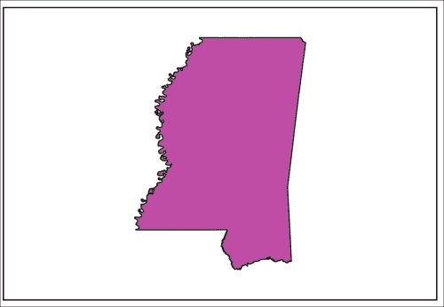
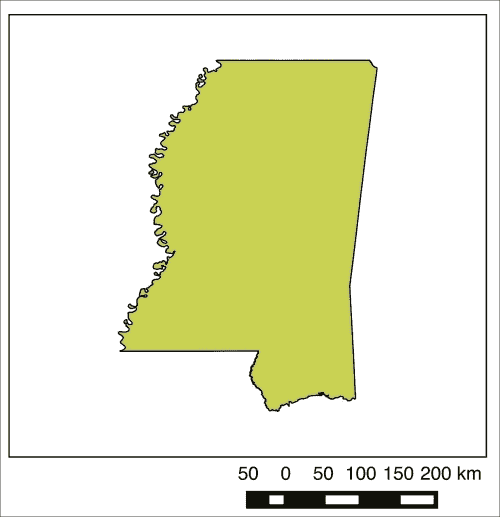
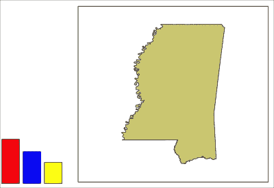
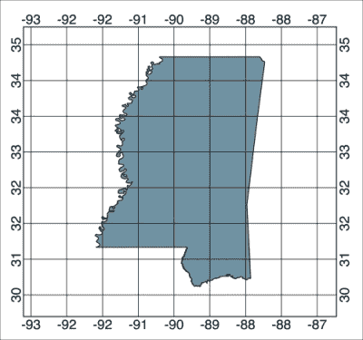

# 第六章。创建静态地图

在本章中，我们将介绍以下食谱：

+   创建最简单的地图渲染器

+   使用地图编者

+   为打印地图添加标签

+   为地图添加比例尺

+   为地图添加指向北方的箭头

+   为地图添加徽标

+   为地图添加图例

+   为地图添加自定义形状

+   为地图添加网格

+   为地图添加表格

+   将地图保存为 PNG 图像

+   为地图图像添加世界文件

+   将地图保存到项目中

+   从项目中加载地图

# 简介

在本章中，我们将使用 PyQGIS、Qt 图像对象和 QGIS 地图编者创建地图布局，这些布局可以导出为文档或图像。QGIS 地图编者旨在创建具有装饰性和参考元素的静态地图布局，用于打印或包含在其他文档中。

# 创建最简单的地图渲染器

为了将动态 GIS 地图转换为静态地图图像或文档，您必须创建一个渲染器来**冻结**地图视图并创建其图形版本。在本食谱中，我们将渲染地图到 JPEG 图像并保存它。

## 准备工作

您需要下载以下压缩的 shapefile 并将其解压缩到您的`qgis_data`目录下的`hancock`子目录中：

[`geospatialpython.googlecode.com/svn/hancock.zip`](https://geospatialpython.googlecode.com/svn/hancock.zip)

您还需要在 QGIS 的**插件**菜单下打开**Python 控制台**。您可以在控制台中运行这些代码行。

## 如何做到这一点...

在本食谱中，我们将加载我们的 shapefile，将其添加到地图中，创建一个空白图像，设置地图视图，渲染地图图像，并将其保存。为此，我们需要执行以下步骤：

1.  首先，我们需要导入用于图像处理的底层`Qt`库：

    ```py
    from PyQt4.QtGui import *
    from PyQt4.QtCore import *

    ```

1.  接下来，我们将加载图层并将其添加到地图中：

    ```py
    lyr = QgsVectorLayer("/qgis_data/hancock/hancock.shp", "Hancock", "ogr")
    reg = QgsMapLayerRegistry.instance()
    reg.addMapLayer(lyr)

    ```

1.  现在，我们创建一个空白图像以接受地图图像：

    ```py
    i = QImage(QSize(600,600), QImage.Format_ARGB32_Premultiplied)
    c = QColor("white")
    i.fill(c.rgb())
    p = QPainter()
    p.begin(i)

    ```

1.  然后，我们访问地图渲染器：

    ```py
    r = QgsMapRenderer()

    ```

1.  现在，我们获取地图图层的 ID：

    ```py
    lyrs = reg.mapLayers().keys()

    ```

1.  然后，我们使用地图中新初始化的渲染器图层：

    ```py
    r.setLayerSet(lyrs)

    ```

1.  现在，我们获取地图的全范围作为矩形：

    ```py
    rect = QgsRectangle(r.fullExtent())

    ```

1.  然后，我们为渲染器设置一个比例。较小的数字会产生较大的地图比例，而较大的数字会产生较小的地图比例。我们可以更改地图比例以在地图图像周围创建缓冲区：

    ```py
    rect.scale(1.1)

    ```

1.  接下来，我们将渲染器的范围设置为矩形：

    ```py
    r.setExtent(rect)

    ```

1.  现在我们设置图像的输出大小和分辨率。分辨率会自动计算：

    ```py
    r.setOutputSize(i.size(), i.logicalDpiX())

    ```

1.  现在，我们可以渲染地图并最终确定图像：

    ```py
    r.render(p)
    p.end()

    ```

1.  最后，我们保存地图图像：

    ```py
    i.save("/qgis_data/map.jpg","jpg")

    ```

1.  确认您在`qgis_data`目录中有一个地图图像，类似于在 QGIS 中显示的地图。

## 它是如何工作的...

QGIS 使用底层的 Qt GUI 库来创建常见的图像类型。我们没有使用任何 QGIS 编者对象来渲染图像；然而，这种渲染技术用于保存使用 QGIS 编者创建的地图。

## 还有更多...

`QImage`对象还支持其他图像格式。要将地图图像保存为 PNG，将*如何操作…*部分中的最后一步替换为以下代码：

```py
i.save("/qgis_data/map.png","png")

```

# 使用地图组合器

QGIS 地图组合器允许您将地图与非空间元素结合，这些元素有助于增强我们对地图的理解。在这个配方中，我们将创建一个基本的地图组合。组合需要您定义物理纸张大小和输出格式。即使像这样的简单组合示例也有超过 20 行的配置选项。

## 准备工作

您需要下载以下压缩的 shapefile 并将其提取到您的`qgis_data`目录下的`hancock`子目录中：

[`geospatialpython.googlecode.com/svn/hancock.zip`](https://geospatialpython.googlecode.com/svn/hancock.zip)

您还需要在 QGIS 的**插件**菜单下打开**Python 控制台**。您可以在控制台中运行此配方，或者将其包装在**脚本运行器**插件的脚本中，使用插件提供的模板。

## 如何操作...

在这个配方中，主要步骤是将 shapefile 加载到地图中，构建地图组合，并将其渲染为图像，具体如下所述：

1.  首先，我们需要导入用于图像处理的`Qt`库：

    ```py
    from PyQt4.QtGui import *
    from PyQt4.QtCore import *

    ```

1.  接下来，我们加载图层并将其添加到地图中：

    ```py
    lyr = QgsVectorLayer("/qgis_data/hancock/hancock.shp", "Hancock", "ogr")
    reg = QgsMapLayerRegistry.instance()
    reg.addMapLayer(lyr)

    ```

1.  现在，我们创建一个空白图像以接受地图图像：

    ```py
    i = QImage(QSize(600,600), QImage.Format_ARGB32_Premultiplied)
    c = QColor("white")
    i.fill(c.rgb())
    p = QPainter()
    p.begin(i)

    ```

1.  接下来，我们获取地图图层的 ID：

    ```py
    lyrs = reg.mapLayers().keys()

    ```

1.  然后，我们访问地图渲染器：

    ```py
    mr = iface.mapCanvas().mapRenderer()

    ```

1.  然后，我们使用地图中新初始化的渲染器图层：

    ```py
    mr.setLayerSet(lyrs)

    ```

1.  现在，我们获取地图的完整范围作为矩形：

    ```py
    rect = QgsRectangle(lyr.extent())

    ```

1.  然后，我们为渲染器设置比例尺。较小的数字会产生较大的地图比例尺，而较大的数字会产生较小的地图比例尺，以便在地图周围添加图像缓冲区：

    ```py
    rect.scale(1.2)

    ```

1.  现在，我们将地图渲染器的范围设置为整个地图的范围：

    ```py
    mr.setExtent(rect)

    ```

1.  接下来，我们通过创建一个新的组合并分配地图渲染器来开始使用 QGIS 组合器：

    ```py
    c = QgsComposition(mr)

    ```

1.  然后，我们设置组合样式。我们将将其定义为`Print`，这将允许我们创建 PDF 文档和图像。另一种选择是将它定义为 postscript，这通常用于直接输出到打印机设备：

    ```py
    c.setPlotStyle(QgsComposition.Print)

    ```

1.  现在，我们定义我们的纸张大小，以毫米为单位指定。在这种情况下，我们将使用相当于 8.5 x 11 英寸纸张大小的纸张，即美国信函大小：

    ```py
    c.setPaperSize(215.9, 279.4)

    ```

1.  接下来，我们将计算地图的尺寸，使其占据大约一半的页面并居中：

    ```py
    w, h = c.paperWidth() * .50, c.paperHeight() * .50
    x = (c.paperWidth() - w) / 2
    y = ((c.paperHeight() - h)) / 2 

    ```

1.  然后，我们创建地图组合器对象并设置其范围：

    ```py
    composerMap = QgsComposerMap(c,x,y,w,h)
    composerMap.setNewExtent(rect)

    ```

1.  接下来，我们在地图的边缘周围添加一个框架并将其添加到页面上：

    ```py
    composerMap.setFrameEnabled(True)
    c.addItem(composerMap)

    ```

1.  现在，我们确保组合的分辨率已设置。分辨率定义了输出包含多少细节。较低的分辨率包含较少的细节并创建较小的文件。较高的分辨率提供更多的图像细节但创建较大的文件：

    ```py
    dpi = c.printResolution()
    c.setPrintResolution(dpi)

    ```

1.  我们现在将每英寸点数分辨率转换为每毫米点数：

    ```py
     mm_in_inch = 25.4
    dpmm = dpi / mm_in_inch
    width = int(dpmm * c.paperWidth())
    height = int(dpmm * c.paperHeight())

    ```

1.  接下来，我们初始化图像：

    ```py
    image = QImage(QSize(width, height), QImage.Format_ARGB32)
    image.setDotsPerMeterX(dpmm * 1000)
    image.setDotsPerMeterY(dpmm * 1000)
    image.fill(0)

    ```

1.  现在，我们渲染组合：

    ```py
    imagePainter = QPainter(image)
    sourceArea = QRectF(0, 0, c.paperWidth(), c.paperHeight())
    targetArea = QRectF(0, 0, width, height)
    c.render(imagePainter, targetArea, sourceArea)
    imagePainter.end()

    ```

1.  最后，我们将组合保存为 JPEG 图像：

    ```py
    image.save("/Users/joellawhead/qgis_data/map.jpg", "jpg")

    ```

确认输出图像类似于以下示例图像：



## 它是如何工作的...

地图组成非常强大，但它们也可能相当复杂。您正在管理代表虚拟纸张的组成。在这个组成中，您放置对象，例如地图。然后，您还必须管理将组成作为图像的渲染。所有这些项都是独立可配置的，这有时可能导致项目的大小或可见性出现意外结果。

## 还有更多...

在 QGIS 即将推出的版本中，地图组成类可能被重命名为`print layout`类。您可以在[`github.com/qgis/QGIS-Enhancement-Proposals/pull/9`](https://github.com/qgis/QGIS-Enhancement-Proposals/pull/9)找到更多关于这个提议更改的信息。

# 为打印添加标签

`QgsComposition`对象允许您在组成中的任何位置放置任意文本。在这个菜谱中，我们将演示如何向地图组成中添加标签。

## 准备工作

您需要下载以下压缩的 shapefile 并将其解压到您的`qgis_data`目录下的`hancock`子目录中：

[`geospatialpython.googlecode.com/svn/hancock.zip`](https://geospatialpython.googlecode.com/svn/hancock.zip)

除了 shapefile 之外，您还需要`MapComposer`类。这个类以可重用的方式封装了模板化组成代码，以便更容易添加其他元素。您可以从[`geospatialpython.googlecode.com/svn/MapComposer.py`](https://geospatialpython.googlecode.com/svn/MapComposer.py)下载它。

此文件必须可以通过确保它在 Python 路径目录中从 QGIS Python 控制台访问。将文件放置在您家目录中的`.qgis2/python`目录内。

## 如何操作...

要向组成中添加标签，我们首先构建地图组成，创建一个标签，然后将组成保存为图像。为此，我们需要执行以下步骤：

1.  首先，我们需要导入 Qt GUI 库和`MapComposer`类：

    ```py
    from PyQt4.QtGui import *
    from PyQt4.QtCore import *
    import MapComposer

    ```

1.  接下来，我们创建一个带有 shapefile 的层，设置 shapefile 的路径以匹配您的系统：

    ```py
    lyr = QgsVectorLayer("/Users/joellawhead/qgis_data/hancock/hancock.shp", "Hancock", "ogr")

    ```

1.  现在，我们将这一层添加到地图中：

    ```py
    reg = QgsMapLayerRegistry.instance()
    reg.addMapLayer(lyr)

    ```

1.  接下来，我们访问地图渲染器：

    ```py
    mr = iface.mapCanvas().mapRenderer()

    ```

1.  然后，我们创建一个`MapComposer`对象，传入地图层注册表和地图渲染器：

    ```py
    qc = MapComposer.MapComposer(qmlr=reg, qmr=mr)

    ```

1.  现在，我们创建一个新的标签对象：

    ```py
    qc.label = QgsComposerLabel(qc.c)

    ```

1.  我们可以将标签文本设置为任何字符串：

    ```py
    qc.label.setText("Hancock County")

    ```

1.  我们可以自动设置标签容器的尺寸以适应我们使用的字符串：

    ```py
    qc.label.adjustSizeToText()

    ```

1.  现在，我们在标签框周围添加一个框架：

    ```py
    qc.label.setFrameEnabled(True)

    ```

1.  然后，我们在页面上设置标签的位置，它位于地图的左上角：

    ```py
    qc.label.setItemPosition(qc.x,qc.y-10)

    ```

1.  接下来，由于已经配置好了，我们现在将标签添加到地图组成中：

    ```py
    qc.c.addItem(qc.label)

    ```

1.  最后，我们保存组成图像：

    ```py
    qc.output("/Users/joellawhead/qgis_data/map.jpg", "jpg")

    ```

1.  确认您的输出图像在地图左上角有一个文本标签在框架内。

## 它是如何工作的...

在此情况下，我们基于默认设置创建了一个非常简单的标签。然而，标签可以被自定义以更改字体、大小、颜色和样式，以用于打印质量的组合。此外，请注意，用于在组合中放置项目的 *x*、*y* 值从页面的左上角开始。当您将项目向下移动页面时，*y* 值会增加。

# 向地图添加比例尺条

比例尺条是地图组合中最重要的元素之一，因为它定义了地图的比例，以确定地图上的地面距离。QGIS 组合器允许您创建多种不同类型的比例尺条，从简单的文本比例尺比到图形的、双测量系统的双比例尺条。在本配方中，我们将创建一个以公里为单位的比例尺条。

## 准备工作

您需要下载以下压缩的 shapefile 并将其提取到您的 `qgis_data` 目录下的 `ms` 子目录中：

[`geospatialpython.googlecode.com/svn/mississippi.zip`](https://geospatialpython.googlecode.com/svn/mississippi.zip)

除了 shapefile 之外，您还需要 `MapComposer` 类。这个类以可重用的方式封装了组合器代码的样板，以便更容易地添加其他元素。您可以从 [`geospatialpython.googlecode.com/svn/MapComposer.py`](https://geospatialpython.googlecode.com/svn/MapComposer.py) 下载它。

此文件必须可以从 QGIS Python 控制台中访问；确保它位于 Python 路径目录中。将文件放置在您主目录中的 `.qgis2/python` 目录下。

为了正确显示比例尺条，您必须确保 QGIS 设置为自动在飞行中重新投影数据。在 QGIS 中，转到 **设置** 菜单并选择 **选项**。在 **选项** 对话框中，选择 **CRS** 面板。在 **新项目默认 CRS** 部分中，勾选 **默认启用 '在飞行中' 重投影** 单选按钮。单击 **确定** 按钮以确认设置。

## 如何操作...

首先，我们将生成地图，然后生成组合，最后创建比例尺条并将其放置在地图的右下角。为此，我们需要执行以下步骤：

1.  首先，我们需要导入我们将需要的库：

    ```py
    from PyQt4.QtCore import *
    from PyQt4.QtGui import *
    from qgis.core import *
    from qgis.gui import *
    import MapComposer

    ```

1.  然后，我们将使用 shapefile 构建地图渲染器：

    ```py
    lyr = QgsVectorLayer("/Users/joellawhead/qgis_data/ms/mmississippi.shp", "Mississippi", "ogr")
    reg = QgsMapLayerRegistry.instance()
    reg.addMapLayer(lyr)
    mr = iface.mapCanvas().mapRenderer()

    ```

1.  接下来，我们将使用图层注册和地图渲染器创建 `MapComposer` 对象：

    ```py
    qc = MapComposer.MapComposer(qmlr=reg, qmr=mr)

    ```

1.  现在，我们将初始化比例尺条对象：

    ```py
    qc.scalebar = QgsComposerScaleBar(qc.c)

    ```

1.  然后，我们定义比例尺条的类型。默认是文本比例尺，但我们将创建一个更传统的框形比例尺条：

    ```py
    qc.scalebar.setStyle('Single Box')

    ```

1.  接下来，我们将比例尺条应用到地图上，并将比例尺条图形设置为默认大小：

    ```py
    qc.scalebar.setComposerMap(qc.composerMap)
    qc.scalebar.applyDefaultSize()

    ```

1.  我们使用比例尺条大小、地图大小和地图位置来计算比例尺条在地图右下角所需的位置：

    ```py
    sbw = qc.scalebar.rect().width()
    sbh = qc.scalebar.rect().height()
    mcw = qc.composerMap.rect().width()
    mch = qc.composerMap.rect().height()
    sbx = qc.x + (mcw - sbw)
    sby = qc.y + mch

    ```

1.  然后，我们设置比例尺条的计算位置并将其添加到组合中：

    ```py
    qc.scalebar.setItemPosition(sbx, sby)
    qc.c.addItem(qc.scalebar)

    ```

1.  最后，我们将组合保存为图像：

    ```py
    qc.output("/Users/joellawhead/qgis_data/map.jpg", "jpg")

    ```

## 它是如何工作的...

如果地图投影设置正确，比例尺条将显示为公里，这就是为什么在 QGIS 设置中启用自动重投影很重要的原因。比例尺条在组合中的位置并不重要，只要将其应用于`composerMap`对象即可。

# 添加地图北向针

北向针是另一种常见的制图元素，甚至在古代地图中也能找到，它显示了地图相对于真北、网格北或磁北的方位。有时，这些符号可能相当复杂。然而，QGIS 提供了一个基本的线箭头元素，我们将与地图标签结合使用来制作基本的北向针。

## 准备工作

您需要下载以下压缩的 shapefile 并将其提取到您的`qgis_data`目录中，到名为`ms`的子目录中：

[`geospatialpython.googlecode.com/svn/Mississippi.zip`](https://geospatialpython.googlecode.com/svn/Mississippi.zip)

除了 shapefile 之外，您还需要`MapComposer`类来简化添加此单个元素所需的代码。如果您之前没有在配方中使用过它，您可以从[`geospatialpython.googlecode.com/svn/MapComposer.py`](https://geospatialpython.googlecode.com/svn/MapComposer.py)下载。

此文件必须可以从 QGIS Python 控制台访问；为此，您需要确保它位于 Python 路径目录中。将文件放置在您家目录中的`.qgis2/python`目录内。

## 如何操作...

在本配方中，我们将创建一个地图组合，在地图右侧绘制一个箭头，然后在箭头下方放置一个带有大写字母`N`的标签。为此，我们需要执行以下步骤：

1.  首先，我们导入`Qt`和`MapComposer`Python 库：

    ```py
    from PyQt4.QtCore import *
    from PyQt4.QtGui import *
    from qgis.core import *
    from qgis.gui import *
    import MapComposer

    ```

1.  接下来，我们创建地图组合对象：

    ```py
    lyr = QgsVectorLayer("/qgis_data/ms/mississippi.shp", "Mississippi", "ogr")
    reg = QgsMapLayerRegistry.instance()
    reg.addMapLayer(lyr)
    mr = iface.mapCanvas().mapRenderer() 
    qc = MapComposer.MapComposer(qmlr=reg, qmr=mr)

    ```

1.  现在，我们计算箭头在地图右侧的位置，设置其位置，然后将其添加到组合中：

    ```py
    mcw = qc.composerMap.rect().width()
    mch = qc.composerMap.rect().height()
    ax =  qc.x + mcw + 10
    ay =  (qc.y + mch) - 10
    afy = ay - 20
    qc.arrow = QgsComposerArrow(QPointF(ax, ay), QPointF(ax,afy), qc.c)
    qc.c.addItem(qc.arrow)

    ```

1.  然后，我们创建一个大写字母`N`标签并将其添加到箭头下方：

    ```py
    f = QFont()
    f.setBold(True)
    f.setFamily("Times New Roman")
    f.setPointSize(30)
    qc.labelNorth = QgsComposerLabel(qc.c)
    qc.labelNorth.setText("N")
    qc.labelNorth.setFont(f)
    qc.labelNorth.adjustSizeToText()
    qc.labelNorth.setFrameEnabled(False)
    qc.labelNorth.setItemPosition(ax - 5, ay) 
    qc.c.addItem(qc.labelNorth)

    ```

1.  最后，我们将组合保存为图像：

    ```py
    qc.output("/qgis_data/map.jpg", "jpg") 

    ```

确认您的输出图像与以下类似：



## 工作原理...

QGIS 组合器没有专门的北向针或罗盘玫瑰对象。然而，正如前文所示，构建一个相当简单。箭头只是一个图形。箭头的方向由创建`QgsComposerArrow`对象时列出的起点和终点位置控制。

## 更多内容...

您可以将此示例扩展为使箭头指向多个罗盘方向。您还可以将更复杂的罗盘玫瑰图像添加到组合中。我们将在下一个配方中演示如何添加图像。请注意，箭头元素也可以用来指向带有相关标签的地图上的项目。

# 添加地图徽标

自定义地图的一个重要部分是向组合中添加您的标志或其他图形。在本菜谱中，我们将向地图添加一个简单的标志。

## 准备工作

您需要下载以下 zip 格式的 shapefile，并将其解压到您的`qgis_data`目录下的名为`ms`的子目录中：

[`geospatialpython.googlecode.com/svn/Mississippi.zip`](https://geospatialpython.googlecode.com/svn/Mississippi.zip)

您还需要一个标志图像，您可以从[`geospatialpython.googlecode.com/svn/trunk/logo.png`](https://geospatialpython.googlecode.com/svn/trunk/logo.png)下载。

将图像放置在您的`qgis_data/rasters`目录中。

如果您在先前的菜谱中还没有这样做，请从[`geospatialpython.googlecode.com/svn/MapComposer.py`](https://geospatialpython.googlecode.com/svn/MapComposer.py)下载`MapComposer`库，以简化地图组合的创建。

将文件放置在您家目录中的`.qgis2/python`目录内。

## 如何操作...

在本菜谱中，我们将创建地图组合，添加标志图像，并将地图保存为图像。为此，我们需要执行以下步骤：

1.  首先，我们需要导入 Qt GUI、核心 QGIS、QGIS GUI 和 MapComposer 库：

    ```py
    from PyQt4.QtCore import *
    from PyQt4.QtGui import *
    from qgis.core import *
    from qgis.gui import *
    import MapComposer

    ```

1.  接下来，我们将使用 shapefile 构建基本的地图组合：

    ```py
    lyr = QgsVectorLayer("/qgis_data/ms/mississippi.shp", "Mississippi", "ogr")
    reg = QgsMapLayerRegistry.instance()
    reg.addMapLayer(lyr)
    mr = iface.mapCanvas().mapRenderer()
    qc = MapComposer.MapComposer(qmlr=reg, qmr=mr)

    ```

1.  现在，我们初始化图片对象：

    ```py
    qc.logo = QgsComposerPicture(qc.c)

    ```

1.  然后，我们将图片的路径设置为我们的图像文件：

    ```py
    qc.logo.setPictureFile("/qgis_data/rasters/logo.png")

    ```

1.  我们必须设置框或场景矩形的大小，使其足够大，可以包含标志。否则，图片将出现裁剪：

    ```py
    qc.logo.setSceneRect(QRectF(0,0,50,70))

    ```

1.  接下来，我们将计算标志相对于地图图像的位置。我们将标志放置在地图的右上角：

    ```py
    lx = qc.x + 50
    ly = qc.y – 120

    ```

1.  现在，我们设置标志的位置并将其添加到地图组合中：

    ```py
     mcw = qc.composerMap.rect().width()
     mch = qc.composerMap.rect().height()
     lx =  qc.x
    ly =  qc.y - 20

    ```

1.  最后，我们将组合保存为图像：

    ```py
    qc.output("/qgis_data/map.jpg", "jpg")

    ```

## 工作原理...

此菜谱非常直接，因为`QgsComposerPicture`是一个非常简单的对象。您可以使用 JPG、PNG 或 SVG 图像。此技术还可以用于添加自定义的北方箭头或其他制图元素。

# 向地图添加图例

地图图例解码了用于主题 GIS 地图的符号，供读者解读。图例与 QGIS 紧密集成，在本菜谱中，我们将地图的默认图例添加到打印组合中。

## 准备工作

从[`geospatialpython.googlecode.com/svn/Mississippi.zip`](https://geospatialpython.googlecode.com/svn/Mississippi.zip)下载此地图的 shapefile，并将其解压到您的`qgis_data`目录下的名为`ms`的子目录中。

与本章中先前的菜谱一样，我们将使用[`geospatialpython.googlecode.com/svn/MapComposer.py`](https://geospatialpython.googlecode.com/svn/MapComposer.py)中的`MapComposer`库来简化地图组合的创建。

将文件放置在您家目录中的`.qgis2/python`目录内。

## 如何操作...

这个菜谱就像创建地图、添加自动生成的图例并将输出保存到图像一样简单。为此，我们需要执行以下步骤：

1.  首先，我们需要加载 Qt 和 QGIS GUI 库，然后是 MapComposer 库：

    ```py
    from PyQt4.QtCore import *
    from PyQt4.QtGui import *
    from qgis.core import *
    from qgis.gui import *
    import MapComposer

    ```

1.  接下来，我们将加载形状文件作为图层，并使用`MapComposer`库创建地图组合，传递地图图层注册表和地图渲染器：

    ```py
    lyr = QgsVectorLayer("/qgis_data/ms/mississippi.shp", "Mississippi", "ogr")
    reg = QgsMapLayerRegistry.instance()
    reg.addMapLayer(lyr)
    mr = iface.mapCanvas().mapRenderer()
    qc = MapComposer.MapComposer(qmlr=reg, qmr=mr)

    ```

1.  现在，我们初始化图例对象：

    ```py
    qc.legend = QgsComposerLegend(qc.c)

    ```

1.  我们现在告诉图例我们想要使用哪个图层集：

    ```py
    qc.legend.model().setLayerSet(qc.qmr.layerSet())

    ```

1.  然后，我们将图例的位置设置为地图的左侧，并将其添加到组合中：

    ```py
    qc.legend.setItemPosition(5, qc.y)
    qc.c.addItem(qc.legend)

    ```

1.  最后，我们将组合输出到地图上：

    ```py
    qc.output("/qgis_data/map.jpg", "jpg")

    ```

## 它是如何工作的...

添加图例相当简单。QGIS 将在加载图层时自动生成样式，或者由用户手动设置。当然，您也可以保存图层样式，这些样式与图层一起加载，并由图例使用。然而，如果您在后台生成组合，例如在独立应用程序中，那么图例的每个方面都可以通过 PyQGIS API 进行自定义。

# 向地图添加自定义形状

QGIS 作曲器有一个用于绘制和样式化非空间形状的对象，包括矩形、椭圆和三角形。在这个菜谱中，我们将添加一些填充不同颜色的矩形，这将成为使用形状的一个简单条形图的例子。

## 准备工作

从[`geospatialpython.googlecode.com/svn/Mississippi.zip`](https://geospatialpython.googlecode.com/svn/Mississippi.zip)下载此地图的压缩形状文件，并将其解压到您的`qgis_data`目录下的`ms`子目录中。

我们还将使用来自[`geospatialpython.googlecode.com/svn/MapComposer.py`](https://geospatialpython.googlecode.com/svn/MapComposer.py)的`MapComposer`库来简化地图组合的创建。

将文件放置在您家目录中的`.qgis2/python`目录下。

## 如何做到这一点...

首先，我们将使用形状文件创建一个简单的地图组合。然后，我们将定义矩形的样式属性。接下来，我们将绘制矩形，应用符号，并渲染组合。为此，我们需要执行以下步骤：

1.  首先，我们必须导入 PyQGIS 和 Qt GUI 库以及 MapComposer 库，如下所示：

    ```py
    from PyQt4.QtCore import *
    from PyQt4.QtGui import *
    from qgis.core import *
    from qgis.gui import *
    import MapComposer

    ```

1.  接下来，我们使用形状文件创建地图组合：

    ```py
    lyr = QgsVectorLayer("/qgis_data/ms/mississippi.shp", "Mississippi", "ogr")
    reg = QgsMapLayerRegistry.instance()
    reg.addMapLayer(lyr)
    mr = iface.mapCanvas().mapRenderer()
    qc = MapComposer.MapComposer(qmlr=reg, qmr=mr)

    ```

1.  现在，我们通过构建具有颜色属性的 Python 字典来创建三个基本的填充符号，并用这些字典初始化符号：

    ```py
    red = {'color':'255,0,0,255','color_border':'0,0,0,255'}
    redsym = QgsFillSymbolV2.createSimple(red)
    blue = {'color':'0,0,255,255','color_border':'0,0,0,255'}
    bluesym = QgsFillSymbolV2.createSimple(blue)
    yellow = {'color':'255,255,0,255','color_border':'0,0,0,255'}
    yellowsym = QgsFillSymbolV2.createSimple(yellow)

    ```

1.  然后，我们计算第一个形状相对于地图的 y 位置：

    ```py
    mch = qc.composerMap.rect().height()
    sy = qc.y + mch

    ```

1.  我们创建第一个形状并将其设置为类型 1，这是一个矩形：

    ```py
    qc.shape1 = QgsComposerShape(10,sy-25,10,25,qc.c)
    qc.shape1.setShapeType(1)

    ```

1.  接下来，我们告诉形状使用一个符号，设置一个符号为我们三个填充符号中的一个，并将形状添加到组合中：

    ```py
    qc.shape1.setUseSymbolV2(True)
    qc.shape1.setShapeStyleSymbol(redsym)
    qc.c.addItem(qc.shape1)

    ```

1.  我们用另外两种形状重复这个过程，改变它们的位置、大小和符号，使它们看起来不同：

    ```py
    qc.shape2 = QgsComposerShape(22,sy-18,10,18,qc.c)
    qc.shape2.setShapeType(1)
    qc.shape2.setUseSymbolV2(True)
    qc.shape2.setShapeStyleSymbol(bluesym)
    qc.c.addItem(qc.shape2)
    qc.shape3 = QgsComposerShape(34,sy-12,10,12,qc.c)
    qc.shape3.setShapeType(1)
    qc.shape3.setUseSymbolV2(True)
    qc.shape3.setShapeStyleSymbol(yellowsym)
    qc.c.addItem(qc.shape3)

    ```

1.  最后，我们将组合输出为图像：

    ```py
    qc.output("/qgis_data/map.jpg", "jpg")

    ```

确认您的输出图像与以下类似：



## 它是如何工作的...

这种简单的图形输出几乎有 40 行代码。虽然这些形状可能有一些有限的用途来处理，但在大多数情况下，更简单的方法是直接导入图像。然而，这为更丰富的图形 API 提供了一个良好的基础，因为 QGIS 持续发展。

## 还有更多...

如果您在 QGIS 版本低于 2.6 的 Python 插件中使用填充符号，您必须确保符号在全局范围内定义，否则 QGIS 会因为一个错误而崩溃。在全局范围内包含变量的最简单方法是立即在导入语句之后定义它们。这也影响了在 Script Runner 插件中运行的脚本。这个错误在 2.6 版及以后的版本中已修复。

# 向地图添加网格

一个带注释的参考网格对于用于定位特征的地图产品很有用。这个配方教你如何在地图上添加参考线以及地图边缘的注释。

## 准备工作

您需要从这个地图中获取一个 shapefile，来自[`geospatialpython.googlecode.com/svn/Mississippi.zip`](https://geospatialpython.googlecode.com/svn/Mississippi.zip)，并且您需要将其提取到您的`qgis_data`目录下的一个名为`ms`的子目录中。

与本章中之前的配方一样，我们将使用来自[`geospatialpython.googlecode.com/svn/MapComposer.py`](https://geospatialpython.googlecode.com/svn/MapComposer.py)的`MapComposer`库来简化地图组合的创建。

将文件放在您家目录中的`.qgis2/python`目录中。

## 如何做到这一点...

在这个配方中，一般的步骤是创建地图组合，建立整体网格参数，定义网格线位置，然后样式网格和注释。为此，我们需要执行以下步骤：

1.  首先，我们需要导入所有 GUI 库和 MapComposer 库：

    ```py
    from PyQt4.QtCore import *
    from PyQt4.QtGui import *
    from qgis.core import *
    from qgis.gui import *
    import MapComposer

    ```

1.  接下来，我们使用 shapefile 创建地图组合：

    ```py
    lyr = QgsVectorLayer("/qgis_data/ms/mmississippi.shp", "Mississippi", "ogr")
    reg = QgsMapLayerRegistry.instance()
    reg.addMapLayer(lyr)
    mr = iface.mapCanvas().mapRenderer()
    qc = MapComposer.MapComposer(qmlr=reg, qmr=mr)

    ```

1.  现在，我们将创建一些变量来缩短一些异常长的方法和对象名称：

    ```py
    setGridAnnoPos = qc.composerMap.setGridAnnotationPosition
    setGridAnnoDir = qc.composerMap.setGridAnnotationDirection
    qcm = QgsComposerMap

    ```

1.  然后，我们启用网格，设置行间距，并使用实线作为网格：

    ```py
    qc.composerMap.setGridEnabled(True)
    qc.composerMap.setGridIntervalX(.75)
    qc.composerMap.setGridIntervalY(.75)
    qc.composerMap.setGridStyle(qcm.Solid)

    ```

1.  接下来，我们启用坐标的注释数字，并将整数的小数精度设置为 0：

    ```py
    qc.composerMap.setShowGridAnnotation(True)
    qc.composerMap.setGridAnnotationPrecision(0)

    ```

1.  现在，我们围绕地图组合框架移动，并使用上一步中较短的变量名定义每一组网格线的位置和方向：

    ```py
    setGridAnnoPos(qcm.OutsideMapFrame, qcm.Top)
    setGridAnnoDir(qcm.Horizontal, qcm.Top)
    setGridAnnoPos(qcm.OutsideMapFrame, qcm.Bottom)
    setGridAnnoDir(qcm.Horizontal, qcm.Bottom)
    setGridAnnoPos(qcm.OutsideMapFrame, qcm.Left)
    setGridAnnoDir(qcm.Vertical, qcm.Left)
    setGridAnnoPos(qcm.OutsideMapFrame, qcm.Right)
    setGridAnnoDir(qcm.Vertical, qcm.Right)

    ```

1.  最后，在将整个地图添加到整体组合之前，我们为网格线和注释设置了一些额外的样式：

    ```py
    qc.composerMap.setAnnotationFrameDistance(1)
    qc.composerMap.setGridPenWidth(.2)
    qc.composerMap.setGridPenColor(QColor(0, 0, 0))
    qc.composerMap.setAnnotationFontColor(QColor(0, 0, 0))
    qc.c.addComposerMap(qc.composerMap)

    ```

1.  我们将组合输出到图像中：

    ```py
    qc.output("/qgis_data/map.jpg", "jpg")

    ```

确认您的输出图像与以下类似：



## 它是如何工作的...

这个菜谱有多个步骤，因为网格是可定制的。操作顺序也很重要。请注意，我们直到最后才将地图添加到编排中。通常，您会做出看似微小的更改，网格可能无法渲染。因此，请仔细修改此菜谱。

# 将表格添加到地图中

QGIS 编排器提供了一个对象，可以将表格添加到编排中，表示矢量层的属性或您创建的任意文本表格。在本菜谱中，我们将使用地图层形状文件的属性将表格添加到编排中。

## 准备工作

从 [`geospatialpython.googlecode.com/svn/Mississippi.zip`](https://geospatialpython.googlecode.com/svn/Mississippi.zip) 下载此地图的形状文件，并将其提取到您的 `qgis_data` 目录下的 `ms` 子目录中。

与本章中之前的菜谱一样，我们将使用 [`geospatialpython.googlecode.com/svn/MapComposer.py`](https://geospatialpython.googlecode.com/svn/MapComposer.py) 中的 `MapComposer` 库来简化地图编排的创建。

将文件放置在您家目录中的 `.qgis2/python` 目录下。

## 如何操作...

以下步骤将创建地图编排，添加表格，并将编排输出为图像：

1.  首先，我们导入我们的 GUI 库和 MapComposer 库：

    ```py
    from PyQt4.QtCore import *
    from PyQt4.QtGui import *
    from qgisfromqgis.core import *
    from qgisfromqgis.gui import *
    import MapComposer

    ```

1.  接下来，我们创建地图编排：

    ```py
    lyr = QgsVectorLayer("/qgis_data/ms/mississippi.shp", "Mississippi", "ogr")
    reg = QgsMapLayerRegistry.instance()
    reg.addMapLayer(lyr)
    mr = iface.mapCanvas().mapRenderer()
    qc = MapComposer.MapComposer(qmlr=reg, qmr=mr)

    ```

1.  现在，我们可以初始化表格对象：

    ```py
    qc.table = QgsComposerAttributeTable(qc.c)

    ```

1.  然后，我们引用相关的地图：

    ```py
    qc.table.setComposerMap(qc.composerMap)

    ```

1.  接下来，我们可以指定要显示在表格中的属性所在的层：

    ```py
    qc.table.setVectorLayer(lyr)

    ```

1.  现在，我们可以将表格放置在地图下方并将其添加到编排中：

    ```py
    mch = qc.composerMap.rect().height() 
    qc.table.setItemPosition(qc.x, qc.y + mch + 20)
    qc.c.addItem(qc.table)

    ```

1.  最后，我们将编排输出为图像：

    ```py
    qc.output("/qgis_data/map.jpg", "jpg")

    ```

## 它是如何工作的...

表格对象非常直观。使用矢量层的属性是自动的。如果您想显示自定义信息，也可以逐个单元格构建表格。

# 将世界文件添加到地图图像中

将地图导出为图像会移除其所有空间信息。然而，您可以创建一个名为 **world file** 的外部文本文件，它为栅格图像提供地理参考信息，因此它可以由包括 QGIS 在内的 GIS 软件用作栅格层。在本菜谱中，我们将导出地图编排为图像，并创建与其相关的 world file。

## 准备工作

您需要从 [`geospatialpython.googlecode.com/svn/Mississippi.zip`](https://geospatialpython.googlecode.com/svn/Mississippi.zip) 下载压缩的形状文件，并将其提取到您的 `qgis_data` 目录下的 `ms` 子目录中。

除了形状文件外，您还需要 `MapComposer` 类来简化添加此单个元素所需的代码。如果您之前没有在菜谱中使用它，您可以从 [`geospatialpython.googlecode.com/svn/MapComposer.py`](https://geospatialpython.googlecode.com/svn/MapComposer.py) 下载它。

此文件必须可以从 QGIS Python 控制台访问；为此，您需要确保它位于 python 路径目录中。将文件放置在您家目录中的 `.qgis2/python` 目录内。

## 如何操作...

首先，我们将创建地图组合，然后将其保存为图像，最后生成世界文件。为此，我们需要执行以下步骤：

1.  首先，我们需要导入 GUI 和 MapComposer 库：

    ```py
    from PyQt4.QtCore import *
    from PyQt4.QtGui import *
    from qgisfromqgis.core import *
    from qgisfromqgis.gui import *
    import MapComposer

    ```

1.  接下来，我们将使用 MapComposer 库创建地图的组合：

    ```py
    lyr = QgsVectorLayer("/qgis_data/ms/mississippi.shp", "Mississippi", "ogr")
    reg = QgsMapLayerRegistry.instance()
    reg.addMapLayer(lyr)
    mr = iface.mapCanvas().mapRenderer()
    qc = MapComposer.MapComposer(qmlr=reg, qmr=mr)

    ```

1.  现在，我们将定义输出文件的名称：

    ```py
    output =  "/qgis_data/map"

    ```

1.  然后，我们可以将组合导出为图像：

    ```py
    qc.output(output + ".jpg", "jpg")

    ```

1.  现在，我们将创建一个包含世界文件信息的对象：

    ```py
    qc.c.setWorldFileMap(qc.composerMap)
    qc.c.setGenerateWorldFile(True)
    wf = qc.c.computeWorldFileParameters()

    ```

1.  最后，我们将打开一个文本文件并写入文本文件的每一行：

    ```py
    with open(output + ".jgw", "w") as f:
     f.write("%s\n" % wf[0])
     f.write("%s\n" % wf[1])
     f.write("%s\n" % wf[3])
     f.write("%s\n" % wf[4])
     f.write("%s\n" % wf[2])
     f.write("%s\n" % wf[5])

    ```

## 它是如何工作的...

世界文件包含每像素的地面距离和地图图像的左上角坐标。QGIS 组合器会自动根据引用的地图生成这些信息。世界文件的名称必须与图像相同，扩展名使用图像文件扩展名的第一个和最后一个字母加上字母 `w`。例如，`.TIFF` 图像文件将有一个扩展名为 `.TFW` 的世界文件。您可以在 [`en.wikipedia.org/wiki/World_file`](http://en.wikipedia.org/wiki/World_file) 上了解更多关于每行中世界文件变量含义的信息。

# 将地图保存到项目中

自动保存项目可以用于自动保存功能或作为从动态更新的数据自动生成项目的流程的一部分。在这个配方中，我们将保存一个 QGIS 项目到 `.qgs` 项目文件。

## 准备工作

您需要下载以下压缩的 shapefile 并将其解压到您的 `qgis_data` 目录下的 `ms` 子目录中：

[`geospatialpython.googlecode.com/svn/Mississippi.zip`](https://geospatialpython.googlecode.com/svn/Mississippi.zip)

## 如何操作...

我们将通过加载 shapefile 层创建一个简单的 QGIS 项目，然后访问项目对象，并将地图项目保存到文件中，如下所示：

1.  首先，我们需要在 QGIS Python 控制台中安装 Qt 核心库：

    ```py
    from PyQt4.QtCore import *

    ```

1.  接下来，我们加载 shapefile 并将其添加到地图中：

    ```py
    lyr = QgsVectorLayer("/Users/joellawhead/qgis_data/ms/mississippi.shp", "Mississippi", "ogr")
    reg = QgsMapLayerRegistry.instance()
    reg.addMapLayer(lyr)

    ```

1.  然后，我们创建一个 `file` 对象来保存我们的项目：

    ```py
    f = QFileInfo("/Users/joellawhead/qgis_data/myProject.qgs")

    ```

1.  现在，我们可以访问 QGIS 项目对象实例：

    ```py
    p = QgsProject.instance()

    ```

1.  最后，我们可以通过将其写入文件对象来保存项目：

    ```py
    p.write(f)

    ```

## 它是如何工作的...

QGIS 简单地创建了一个包含所有项目设置和 GIS 地图设置的 XML 文档。您可以手动读取甚至修改 XML 输出。

# 从项目中加载地图

这个配方演示了如何从 `.qgs` XML 文件中加载项目。加载项目将在 QGIS 中设置之前保存的项目的地图和项目设置。

## 准备工作

您需要完成之前的配方，*将地图保存到项目中*，以便您在 `qgis_data` 文件夹中有一个名为 `myProject.qgs` 的项目。

## 如何操作...

对于这个菜谱，你需要设置一个文件对象，设置资源路径，然后读取引用项目文件的文件对象。为此，你需要执行以下步骤：

1.  首先，我们导入核心 `Qt` 库用于文件对象：

    ```py
    from PyQt4.QtCore import *

    ```

1.  接下来，我们使用项目文件的路径初始化文件对象：

    ```py
    f = QFileInfo("/Users/joellawhead/qgis_data/myProject.qgs")

    ```

1.  现在，我们访问项目对象：

    ```py
    p = QgsProject.instance()

    ```

1.  然后，我们为 QGIS 设置资源路径以便找到数据和其它文件，以防项目是以相对路径而不是绝对路径保存的：

    ```py
    p.readPath("/Users/joellawhead/qgis_data/")

    ```

1.  最后，我们告诉项目对象读取项目文件以加载地图：

    ```py
    p.read(f)

    ```

## 它是如何工作的...

QGIS 有一个设置，可以将对数据和其它文件的引用保存为相对路径，这些路径相对于项目文件，或者绝对路径，这些路径包含完整路径。如果保存的路径是绝对路径，PyQGIS 将无法定位数据源。将读取路径设置为项目文件的完整系统路径确保 QGIS 可以找到项目文件中所有引用的文件，如果它们是以相对路径保存的。
