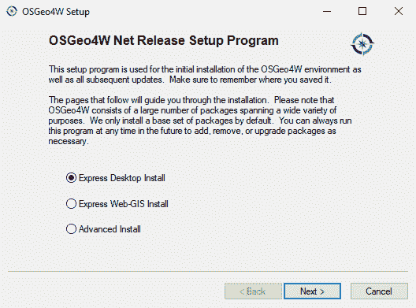
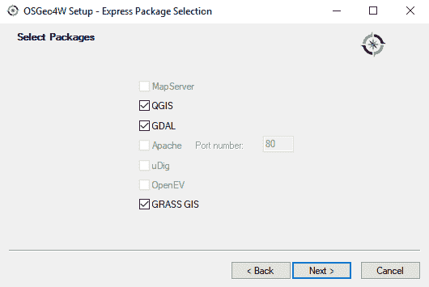
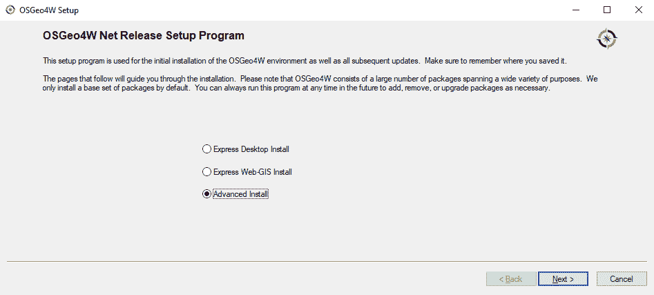
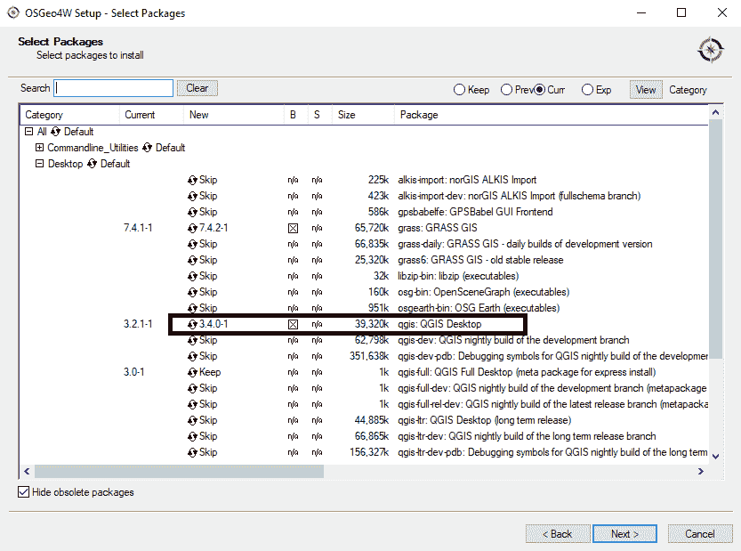
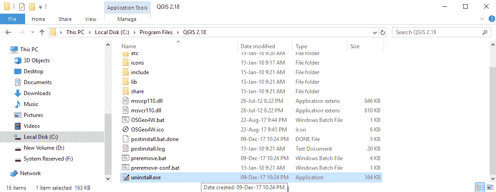
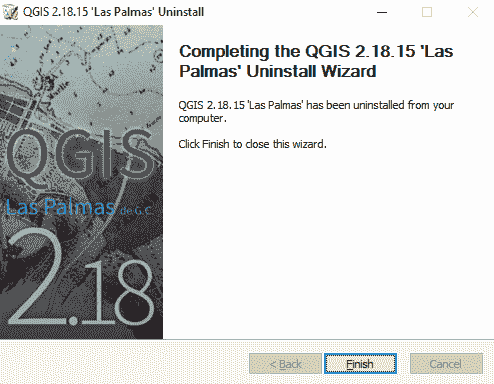
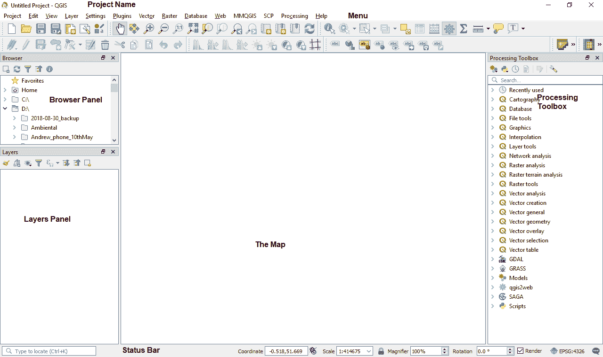
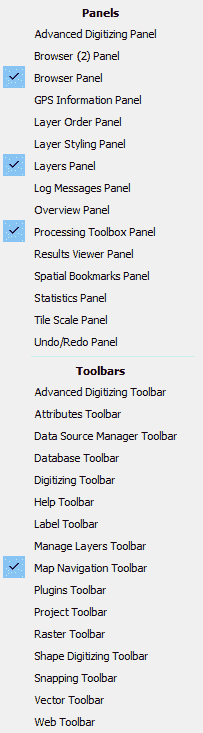

# 第一章：开始使用 QGIS 3

QGIS 是免费和开源的软件。它是一个**地理信息系统**（GIS）。QGIS 使用户能够创建、操作和可视化空间数据。空间数据是与位置或地点相关的数据，通常以矢量（点、线或多边形）或栅格（位图）数据的形式定义。QGIS 项目始于 2002 年，作为一种从**PostGIS**（也是一种开源软件，它为 PostgreSQL 添加了地理支持）启用数据库导入和查看数据的方式。可以说，QGIS 现在是领先的开放源代码 GIS 软件包。

QGIS 3 是 QGIS 系列中的一个重大更新。如果你熟悉 QGIS 项目，你可以检查这个网站上的视觉变更日志中的更改：[`www.qgis.org/en/site/forusers/visualchangelogs.html`](https://www.qgis.org/en/site/forusers/visualchangelogs.htm)。处理框架被重写，并显著提高了性能。现在，QGIS 3 为用户提供了对 Python 3 的访问。这意味着许多使 QGIS 如此强大的插件都已更新，以兼容新的 API。在撰写本文时，QGIS 3 已经发布近一年。QGIS 3.4 于 2018 年 10 月发布。它计划在 2019 年初成为 QGIS 3 系列的第一个**长期支持版本**（LTR）。

本书是 QGIS 的快速入门指南；它以 LTR 3.4 版本为基础。建议你在阅读本书时使用这个版本。本书的编写方式使得你可以将获得的基础知识应用到未来的版本中。然而，QGIS 是一个积极开发的软件，可能会发生变化。

本入门章节涵盖以下主题：

+   安装 QGIS

+   工具栏和 GUI

# 安装 QGIS

QGIS 可以在大多数操作系统上运行。甚至可以在树莓派上安装它！这是 QGIS 成功的原因之一：它支持多个平台。QGIS 项目提供了现成的软件包，以及从源代码构建的说明，可在[`download.qgis.org`](http://download.qgis.org)找到。在本快速入门指南中，我们将介绍如何在两个系统上安装 QGIS：Windows 和 Ubuntu。

# 在 Windows 上安装

在 Windows 操作系统上安装 QGIS 有两种方式。直接从 [`download.qgis.org`](http://download.qgis.org) 下载 `.exe` 文件，或者通过 **OSGeo4W** 安装程序下载。OSGeo4W 是一个小程序，它不仅允许您下载和安装 QGIS，还可以安装其他 OSGeo 工具。我们建议您使用此安装程序安装 QGIS。您可以从 [`osgeo4w.osgeo.org`](http://osgeo4w.osgeo.org) 下载 32 位或 64 位的 OSGeo4W 安装程序，或者直接从 [`download.osgeo.org/osgeo4w/osgeo4w-setup-x86.exe`](http://download.osgeo.org/osgeo4w/osgeo4w-setup-x86.exe) 或 [`download.osgeo.org/osgeo4w/osgeo4w-setup-x86_64.exe`](http://download.osgeo.org/osgeo4w/osgeo4w-setup-x86_64.exe) 下载。下载与您的操作系统匹配的版本并保存。将来，无论何时您想更改或更新系统，只需再次运行它即可。

# OSGeo4W 安装程序

在本节中，我们将使用 OSGeo4W 作为安装程序，查看高级安装程序和快速安装程序选项（这将安装最新版本）。

# 最新版本

下载与您的系统匹配的安装程序后，双击 `.exe` 文件，并按以下步骤完成安装屏幕。最简单的方法是选择快速桌面安装。这可能不会安装 QGIS 3.4。如果您想这样做，请参阅以下子节“高级安装程序”。快速安装选项在下面的屏幕截图中显示：



OSGeo4W 安装设置

选择 QGIS、GDAL 和 GRASS GIS 旁边的复选框。GDAL 用于读取和写入地理空间数据，GRASS GIS 是可以与 QGIS 结合使用的开源 GIS 软件。这在上面的屏幕截图中显示：



OSGeo4W 安装设置，选择安装选项

点击“下一步”，下载过程将开始。每个组件下载和安装时都会显示进度。安装这些组件将为您提供许多工具来执行地理空间分析。经过一段时间后，您应该在程序菜单中看到 OSGeo4W，以及安装的软件子集，包括 QGIS。

您可以安装多个版本的 QGIS。有时，这可能是必要的，因为插件可能无法与某些软件版本兼容。如果您想选择一个版本怎么办？OSGeo4W 允许您通过高级安装程序来做到这一点。

# 高级安装程序

运行 OSGeo4W .exe 文件，并选择旁边的“高级安装”单选按钮：



OSGeo4W 安装设置（选择高级安装）

按步骤完成安装向导。当您到达“选择软件包”时，选择您所需的版本。在下面的屏幕截图中，我选择了 3.4：



OSGeo4W 安装设置（选择要安装的软件包）

如果需要，你可以选择其他包。一旦选择了软件，点击下一步，安装将开始。

# 通过 OSGeo4W 更新

你可以使用 OSGeo4W 安装程序安装新的更新。它将卸载旧版本。你可能在系统中安装了旧版本（可能是使用独立安装程序安装的）。要卸载，找到旧版本的安装目录并运行 `uninstall.exe` 文件。这在上面的截图中有展示：



Windows 资源管理器

逐步通过卸载向导，一旦卸载，你应该会收到类似的消息（取决于你的版本）：



卸载 QGIS 2.18

点击完成以退出。

你的系统上可能运行着多个 QGIS 版本。

# 在 Ubuntu 上安装

在 Ubuntu 上，QGIS 项目提供了 LTR（长期支持）、**最新发布**（LR）和开发版本（DEV）的包。对于本书，我们建议安装 LTR 版本。LTR 版本是软件当前最稳定的版本。

为了避免因不兼容的包而可能发生的冲突，请确保你只添加其中一个包源选项。你必须添加到源列表中的具体行取决于你的操作系统版本。以下版本是 Debian stretch 的最新发布版：

```py
deb     https://qgis.org/debian stretch main
deb-src https://qgis.org/debian stretch main 
```

选择存储库后，我们将把 `qgis.org` 存储库的公钥添加到我们的 `apt` 密钥环中。这将避免在从非默认存储库安装时可能收到的警告。在终端中运行以下命令：

```py
wget -O - https://qgis.org/downloads/qgis-2017.gpg.key | gpg --import
gpg --fingerprint CAEB3DC3BDF7FB45
gpg --export --armor CAEB3DC3BDF7FB45 | sudo apt-key add -
```

如果需要，你可能需要根据你的系统进行调整。要获取支持的 Ubuntu 版本列表的最新更新，请查看 [`www.qgis.org/en/site/forusers/alldownloads.html#debian-ubuntu`](http://www.qgis.org/en/site/forusers/alldownloads.html#debian-ubuntu)。到本书印刷时，关键信息可能已经改变。请参阅 [`www.qgis.org/en/site/forusers/alldownloads.htm`](http://www.qgis.org/en/site/forusers/alldownloads.html) 获取最新更新。

最后，要安装 QGIS，运行以下命令。第一个命令将检索系统中包的任何更新；第二个命令将安装 QGIS、Python 库和 GRASS 插件：

```py
sudo apt-get update
sudo apt-get install qgis python-qgis qgis-plugin-grass
```

本书是基于 Windows 操作系统上的 QGIS 安装编写的。操作系统之间可能会有细微的视觉变化，尤其是截图。

# 使用 QGIS

从安装位置打开 QGIS。如果你在 Windows 上遵循了 OSGeo4W 安装，你应该能在开始菜单下的 `OSGeo4W Shell` 文件夹中找到它。加载时，QGIS 将显示类似于以下截图的界面，我已经对其进行了标注：



QGIS 3 的概述标注

最大的区域留给了地图。

# 工具栏和面板概述

在本节中，我们将查看 QGIS 中的面板和工具栏以及如何打开和关闭它们。

# 面板

所有面板都是可停靠的；这意味着您可以根据需要移动它们。在地图的左侧是图层和浏览器面板，右侧是处理工具箱。浏览器面板允许您在计算机上的文件夹中查找数据。从浏览器面板，您可以拖动数据到地图上。图层面板显示数据及其绘制顺序。在图层面板上右键单击图层会打开一个上下文菜单，让您与该图层交互。我们将在整本书中与图层面板一起工作。在 QGIS 项目的底部，我们可以看到状态栏。状态栏对于快速查找您正在使用的投影或地图的比例非常有用。最后，在 QGIS 的顶部是窗口标题（尚未命名的项目）、菜单选项和工具栏。

# 工具栏

工具栏是找到工具的地方！您可以根据工作需要自定义工具栏。这些设置可以通过设置 | 界面自定义找到。在上一张屏幕截图中，工具栏停靠在菜单下方。许多工具也可以通过菜单找到。将鼠标光标悬停在工具上以了解更多信息。您还可以使用插件在 QGIS 中构建自己的工具。

# 自定义

如果您在上一张截图的菜单标注附近右键单击，您可以访问面板和工具栏。如果您意外关闭了面板或工具栏，那么这里是将其重新打开的地方。您也可以通过查看菜单找到这些选项：



自定义面板和工具栏

在下一节中，我们将简要介绍一些主要工具栏。

# 主要工具栏

地图导航工具栏如图所示：


地图导航工具栏

这些工具都是关于在地图上移动的。平移（手形图标）、缩放（放大镜）、创建新的画布视图（从右数第四个图标），以及书签位置（从右数第三个和第二个图标）都是这个工具栏的一部分。这些工具应该与任何基于地图的应用程序相似。您还可以使用鼠标滚轮来放大和缩小地图。

属性工具栏主要涉及与数据交互。它显示在以下屏幕截图中：


属性工具栏

这些工具允许您识别矢量层的属性或栅格层的值（蓝色 i）。选择和取消选择要素（从左数第三个、第四个和第五个图标），然后打开属性表（表格图标）、字段计算器（算盘图标）、测量工具（尺子图标）和文本注释按钮（条上的最后一个图标）。这些工具非常常用，并将成为您在 QGIS 中与 GIS 数据标准交互的一部分。

项目工具栏是关于在 QGIS 中保存和创建新项目的地方。项目是包含所有文件链接、它们的顺序、它们的样式、任何打印布局——基本上是关于你的项目的所有内容。以下截图展示了它：


项目工具栏

这些工具允许你创建一个新项目（纸张图标）、打开一个项目（文件夹图标）、保存项目以及另存为（磁盘图标）、创建和管理打印布局（两个图标），最后使用样式管理器。我们将在第五章创建地图中更详细地查看打印布局。

如果你从菜单栏点击“项目”，你会看到相同的图标出现。这通常适用于所有菜单和相应的工具栏。有时保持常用工具栏（如编辑工具栏）打开，并将不常用的一些工具栏隐藏起来以节省屏幕空间，可能会更容易一些。

随着我们在这本书中的进展，我们将更详细地查看其他工具栏。

# 摘要

在本章中，我们介绍了 QGIS 3。我们探讨了在 Windows 和 Ubuntu 上安装的选项。最后，我们快速浏览了 QGIS 界面及其功能命名法。

在下一章中，我们将探讨如何在 QGIS 中加载数据并与它交互。我们将描述 GIS 是什么以及如何保存项目。
