# 第三章：创建数据

在本章中，我们将创建 GIS 数据。我们将主要使用 GeoPackage。这是 QGIS 3.4 中存储 GIS 数据的默认格式。与 Shapefile 的许多扩展名相比，GeoPackage 可以在一个文件中包含数百个图层，这使得共享和管理更加简单。

我们将探讨创建点、线和多边形的几何形状。我们将向属性表中添加属性，并使用字段计算器计算多边形的面积。我们将简要讨论使用临时图层和将我们的数据导出为 Shapefile 的方法。最后，我们将探讨如何将栅格数据导入到 GeoPackage 中。

在本章中，您将学习以下主题：

+   创建 GeoPackage

+   创建矢量数据：

    +   编辑几何形状

    +   创建属性

+   临时图层和保存为 Shapefile

+   在 GeoPackage 中处理栅格数据

# 创建数据

如我们在第一章“QGIS 3 入门”和第二章“加载数据”中提到的，QGIS 3.4 的默认导出 GIS 格式是 GeoPackage。我们进行的任何矢量数据操作都可以应用于 Shapefile——在本章末尾，我们将展示如何将 GeoPackage 中的任何矢量层导出为 Shapefile（您也可以导出为其他多种格式；见[`www.gdal.org/ogr_formats.html`](https://www.gdal.org/ogr_formats.html)）。

打开我们在[第二章](https://cdp.packtpub.com/qgis_quick_start_guide/wp-admin/post.php?post=26&action=edit#post_25)“加载数据”中创建的 QGIS 项目。如果您跳过了前面的章节，请从与本书相关的 GeoPackage 中加载以下图层（可在以下链接找到）：[`github.com/PacktPublishing/QGIS-Quick-Start Guide/blob/master/Alaska_GeoPackage.zip`](https://github.com/PacktPublishing/QGIS-Quick-Start Guide/blob/master/Alaska_GeoPackage.zip)

+   `Airports`

+   `majrivers`

+   `trees`

还需从`QGIS_sample_data`加载`SR_50M_alasja_nad.tif`（从[`qgis.org/downloads/data/qgis_sample_data.zip`](https://qgis.org/downloads/data/qgis_sample_data.zip)下载）。将此项目保存为`Chapter3.qgz`。

# 创建 GeoPackage

在本章中，我们将创建一些数据。这些数据将采用与 QGIS 示例数据相同的地点和投影。我们将专注于绘制阿拉斯加海岸外的岛屿**火岛**。首先，让我们创建一个名为`Fire_Island`的 GeoPackage。

要创建新的 GeoPackage 图层（GeoPackage 内的图层），我们首先需要创建一个新的 GeoPackage。从图层菜单中选择创建图层 | 新 GeoPackage 图层，如下截图所示：

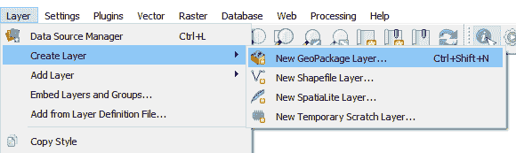

创建 GeoPackage 图层

在出现的对话框中，填写参数，如下截图所示：

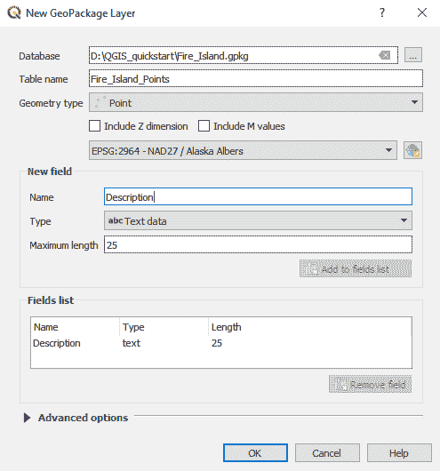

GeoPackage 参考对话框

我们将在 GeoPackage 中创建一个名为`Fire_Island_Points`的层，其几何类型为点，坐标参考系统为 EPSG 2964。创建一个名为`Description`的新字段，并将其类型设置为文本数据，最大长度为`25`。点击“添加到字段列表”将其添加到字段中。我们总是可以稍后添加额外的字段。点击“确定”。当你点击“确定”时，将创建一个新的 GeoPackage，并将`Fire_Island_Points`层添加进去。你应该在图层面板中看到一个名为`Fire_Island_Points`的新层。如果你右键点击这个层并选择“打开属性表”，将出现与该层关联的表。它将是空的，并将有一个 fid 字段（默认分配）和刚刚创建的描述字段。这如图下所示：

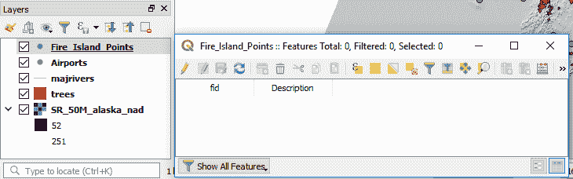

图层和属性表

我们现在已创建了一个 GeoPackage 以及其中包含的点层。我们现在需要创建一些数据。在我们这样做之前，我们需要定位火岛，以便有一个可以基于我们的数据建立的基础！幸运的是，QGIS 使这变得非常简单，因为它允许你将`OpenStreetMap`添加到你的项目中。

在浏览器面板中，找到`XYZ Tiles`并展开它。内部应该有`OpenStreetMap`。点击并拖动它到地图上。它将作为新层出现在图层面板中。调整图层面板中图层的顺序，以匹配以下截图所示：

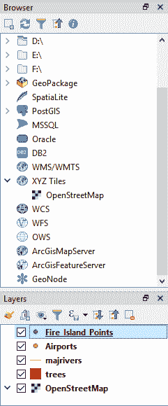

浏览器面板和图层面板

导航地图以找到安克雷奇，你应该能看到火岛。它位于安克雷奇西海岸外。在此阶段，关闭除`Fire_Island_Points`层和`OpenStreetMap`层之外的所有其他层。

你的项目现在应该看起来像以下截图：

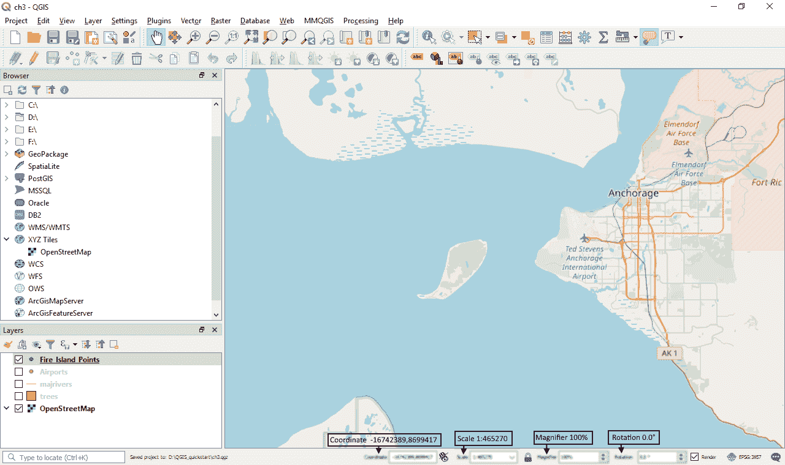

QGIS 3.4 中显示的 OpenStreetMap 概述

在下一节中，我们将使用数字化工具栏创建一些数据。

# 数字化数据

在本节中，我们将在我们刚刚创建的 GeoPackage 中创建点、线和多边形数据。

# 创建点

将地图放大到火岛，以便机场出现。我们现在将创建一个点来表示这个机场。确保数字化工具栏可见。你可以通过选择“视图”|“工具栏”|“数字化工具栏”来打开它。数字化工具栏如图下所示：

数字化工具栏

确保在图层面板中选择了`Fire_Island_Points`层，并点击“切换编辑”按钮（黄色铅笔）以开始编辑会话。数字化工具现在在工具栏中处于活动状态，如图下所示：

已激活切换编辑功能的数字化工具

点击“添加点要素”按钮（三个绿色圆点）。鼠标光标将变为十字准星。在`OpenStreetMap`数据中点击机场位置。将打开一个要素属性对话框。在这里，接受自动生成 fid（这将为要素分配一个唯一的标识符），并在描述中输入`Fire_Island_Airport`。如下截图所示：

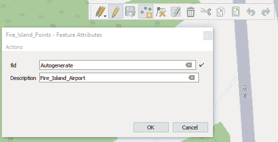

Fire_Island_Points 要素属性

将创建一个新的点。在数字化工具栏上，点击保存（蓝色磁盘）。打开属性表。您将看到这个新添加的点。在编辑模式下，让我们添加一个新字段。在打开属性表的情况下，点击“新建字段”（Ctrl+W），如下截图所示：

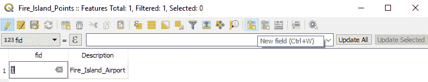

属性表

这将打开一个名为“添加字段”的对话框。创建一个名为`Type`的新字段，并将其长度设置为`25`（因为不期望输入的任何字符串超过`25`个字符）。如下截图所示：

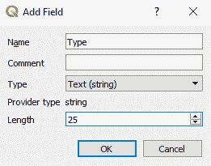

添加字段

点击“确定”，新创建的字段将作为属性表中的空值出现。点击空值并将其更改为“机场”。在属性表中，点击保存按钮然后点击切换编辑按钮（黄色铅笔）以停止编辑。我们现在已经在 GeoPackage 中创建了一个点图层，添加了属性，并创建了一个新字段。让我们利用这些知识来创建一个道路图层（线）和一个岛屿轮廓图层（多边形）。

# 创建线数据

从图层菜单中选择图层 | 创建图层 | 新 GeoPackage 图层，就像我们之前做的那样。填写对话框以匹配以下截图：

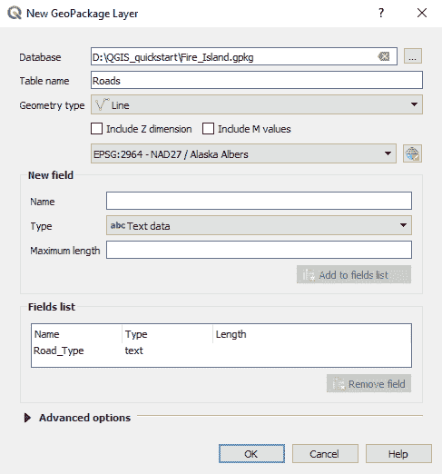

创建道路图层

点击“确定”。系统会提示您是否要覆盖、添加新图层或取消。在这种情况下，请点击“添加新图层”，如下截图所示：

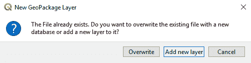

新 GeoPackage 图层消息框

在图层面板中会出现一个`Roads`图层。确保它被选中，然后从数字化工具栏中点击“切换编辑”。点击“添加线要素”。这次，在岛屿上找到一个现有的道路并数字化它。您通过左键点击鼠标并移动到新位置然后再次左键点击来完成数字化——软件会将这两个点击连接起来，称为**节点或顶点**。在编辑过程中，您可以点击缩放和平移工具来缩放并使过程更容易。不用担心过于精确，这是一个学习练习。完成时，右键点击以完成线条。将`Road_Type`字段设置为黑色沥青并点击保存。

让我们再创建一条道路。这将是我们的`Roads`图层中的另一个特性。为了保持拓扑，我们需要确保道路线条相接触。这是通过捕捉来实现的。在 QGIS 中，我们可以捕捉到顶点、线段或交叉点。通过点击视图 | 工具栏 | 捕捉工具栏来打开捕捉工具栏。在编辑会话中，捕捉工具栏看起来如下面的截图所示：

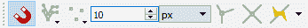

捕捉工具栏

在这个例子中，捕捉容差已被更改为 10 像素，但你可以根据你的缩放级别进行相应的调整。这并不一定是一个通用的解决方案，你需要调整这个参数以满足你的需求。将捕捉环境设置为顶点和线段，以确保你有机会捕捉到相邻的道路，如下面的截图所示：

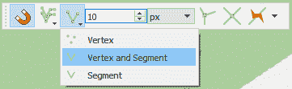

捕捉选项

你需要在一个十字线数字化光标内看到一个粉红色的方块。你可能需要放大。它看起来如下面的截图所示：

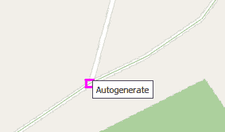

在点上捕捉

创建一个新的道路并使用捕捉来确保线条是拓扑正确的——也就是说，没有间隙。当你完成数字化后，右键点击并在`Road_Type`字段中添加沥青，然后点击保存。点击切换编辑以完成数字化。如果你愿意，可以继续数字化更多道路。

# 创建多边形

最后，在这个矢量编辑部分，我们将看看如何编辑多边形。我们所学到的所有关于线和点的技术都适用于此。再次，在你的 GeoPackage 中创建一个新的图层，这次命名为`Island_Outline`。我们不会创建任何字段，所以接受以下截图所示的默认设置：

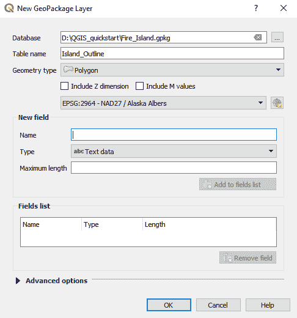

创建多边形图层

在图层面板中选择新的图层，点击切换编辑并数字化岛屿。不用担心过于详细。结果将是一个数字化的岛屿。在 QGIS 中，新的多边形图层将类似于以下截图：

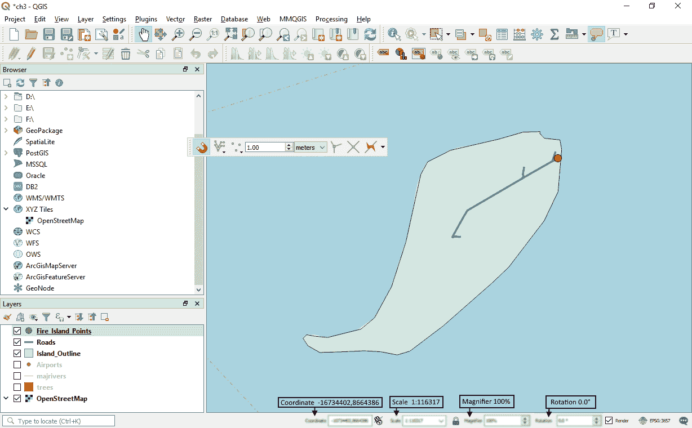

QGIS 内编辑概述

现在，让我们创建一个名为`area`的字段并填充其实际面积。为此，我们将使用属性工具栏中的字段计算器工具。选择`Island_Outline`后，点击字段计算器按钮（算盘图标）。输入以下值：创建一个名为`area`的新字段，将其设置为整数，并在表达式框中输入`$area`。如下面的截图所示：

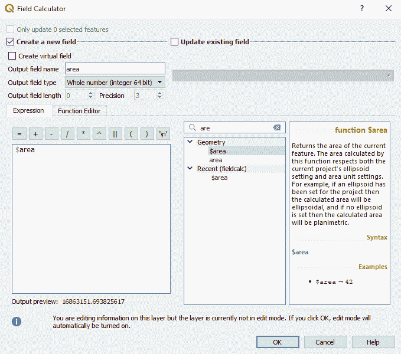

字段计算器

点击“确定”。这将开启“切换编辑”功能，创建一个名为`area`的新字段，并用面积值填充它。如果你有多个要素，所有面积都将被计算。或者，你可以使用选择工具选择你想要计算面积的特征。字段计算工具是一个灵活且非常强大的工具。计算出的面积将在属性表中显示。在计算面积时，请记住所有单位都将使用投影的单位进行计算。如果你想检查面积，可以使用第二章中提到的“加载数据”部分展示的测量工具来验证这个测量值。取消编辑会话并保存项目。

# 临时图层

临时图层是临时矢量图层，在打开 QGIS 项目时保持存在，但在关闭时丢失——它们存储在内存中。当你想要快速在地图上绘制一些特征时，临时图层非常有用。好处是，你不需要考虑临时数据的文件格式和位置。如果你发现你需要保留这个图层，它可以被导出为永久文件——我们将在下一节中探讨这一点。

要创建一个临时图层，选择“图层 | 创建图层 | 新建临时临时图层”。选择“多边形/曲线多边形”作为几何类型，如下面的截图所示：

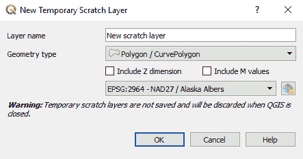

创建临时图层

使用我们已强调的技术在`Fire_Island`上的一个水体周围进行数字化。你的项目将看起来像下面的截图：

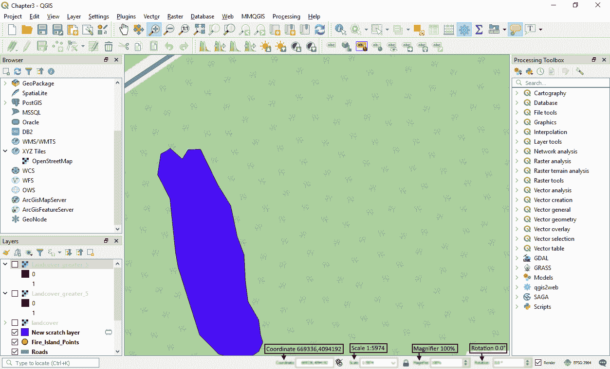

数字化水体的概述

保存你的编辑并取消编辑。临时图层可以帮助你进行数据管理——无需再创建多个`test.shp`文件，也不必再知道它们是什么。

# 将数据保存为 Shapefile

我们可能希望将这个临时图层保存为 Shapefile。实际上，我们可以使用相同的方法将我们的任何数据保存为 Shapefile。在图层上右键单击并选择“导出 | 保存要素为...”。在“格式”旁边的下拉菜单中选择 ESRI Shapefile，如下面的截图所示：

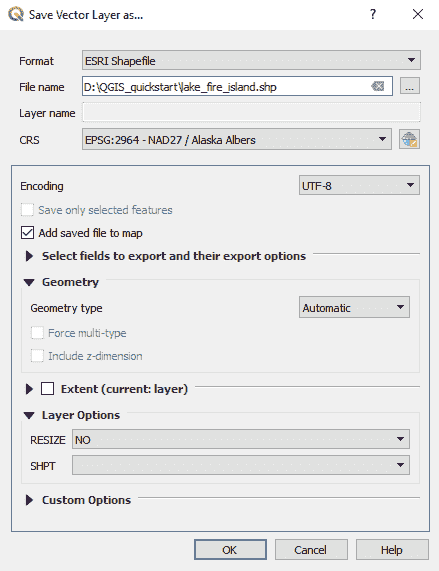

保存到 Shapefile

接受默认设置，将创建一个新的 Shapefile。

# 光栅数据

对于主要的光栅数据，你将通过处理工具如插值或点数据的网格化来创建。有时，我们可能想要将矢量图层栅格化。这可以通过使用“光栅 | 转换 | 栅格化”命令来完成。

让我们将`SR_50M_alasak_nad.tif`光栅加载到我们刚刚创建的 GeoPackage 中。你只需将图层从浏览器面板拖到 GeoPackage 中。一旦加载，它将显示一个消息框，如下面的截图所示：

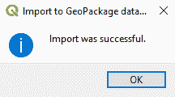

将光栅图层导入 GeoPackage

`Fire_Island.gpkg` GeoPackage 现在将看起来像下面的截图：

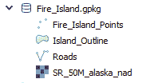

GeoPackage 的内容

向 GeoPackage 添加数据如此简单。将这个图层拖入地图中，以检查它是否确实存在。

# 创建栅格数据集

我们将对`landcover`数据进行查询以创建一个新的图层，然后将其移动到`Fire_Island`GeoPackage 中。将 QGIS 样本数据中的`landcover`栅格从`raster`文件夹加载到图层面板中。

接下来，从主菜单中选择“栅格”|“栅格计算器”。填写栅格计算器，如图下截图所示：

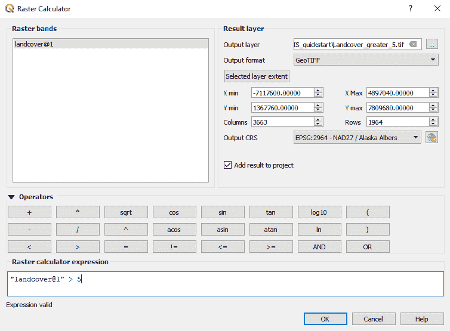

栅格计算器

将新的栅格保存为 GeoTIFF 文件并点击确定。这将创建一个掩膜——任何`landcover`值大于五的都将被分配一个值为一，而小于五的将被分配一个值为零。在下一章中，我们将展示如何以更有意义的方式显示这些数据，设置透明度和更改颜色渐变。

最后，将这个新创建的图层拖入`Fire_Island`GeoPackage 中。

# 摘要

我们已经探讨了创建矢量和栅格数据。在 QGIS 中使用默认的 GeoPackage 格式是一种强大而简单的方式来管理我们的 GIS 数据。在本章中，我们为点、线和多边形构建了几何形状，并分配了属性。我们创建了临时图层、Shapefiles 和栅格。

在下一章中，我们将查看这些属性数据来样式化我们的数据。我们将使用栅格中的值来利用不同的颜色渐变。下一章是我们创建地图道路上的一个垫脚石，我们将在第五章“创建地图”中完成这一任务。
