# 第六章：空间处理

在本章中，我们将使用 QGIS 进行空间分析。我们将使用之前数据章节中使用的 GeoPackage 中的数据。首先，我们将查看处理工具箱，然后继续介绍一些单个工具，并对我们的数据进行空间查询。

本章将涵盖以下主题：

+   处理工具箱

+   空间查询

+   数据分析

+   基于栅格的分析

# 处理工具箱

从处理菜单中选择工具箱。处理工具箱如下所示：

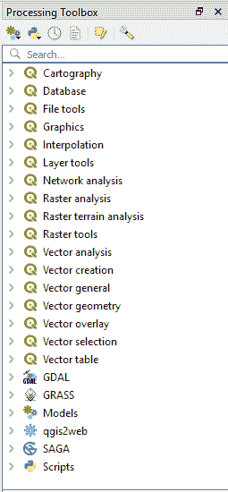

处理工具箱

在处理工具箱的顶部，有一个工具栏。在这个工具栏中，第一个按钮用于调用模型构建器，第二个按钮打开 Python 脚本工具，这两个工具我们将在后面介绍。接下来四个按钮按顺序显示历史记录、结果查看器、原地编辑要素（此按钮显示允许原地修改几何形状的算法的工具），以及处理设置。在此工具栏下方是搜索功能；使用此功能，您可以快速找到处理工具并运行它们。

在本章中，我们将使用这些工具来分析和处理我们的数据。我们将使用处理工具箱中的某些工具来回答一些空间或 GIS 类型的问题。

创建一个新的空 QGIS 项目。从 GeoPackage 中加载以下图层：

+   `regions`

+   `pipelines`

# 哪些区域与管道相交？

我们可以通过空间查询来回答这个问题。在 QGIS 中，这个工具称为“按位置选择”；在处理工具箱中搜索这个术语，然后双击工具打开对话框。我们想使用这个工具来选择与`pipelines`相交的所有`regions`图层要素。输入将如下所示：

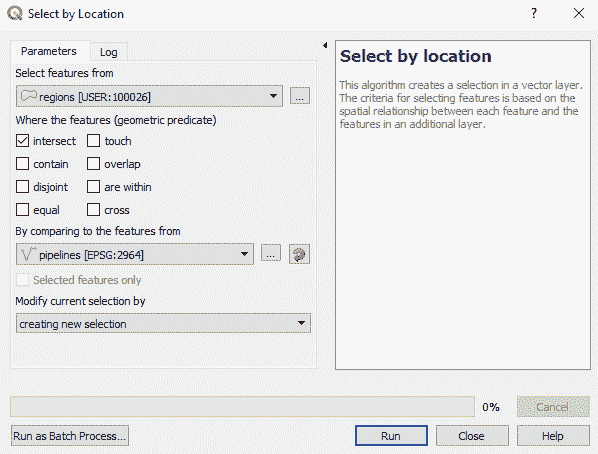

按位置选择工具

QGIS 中的输出将如下所示：

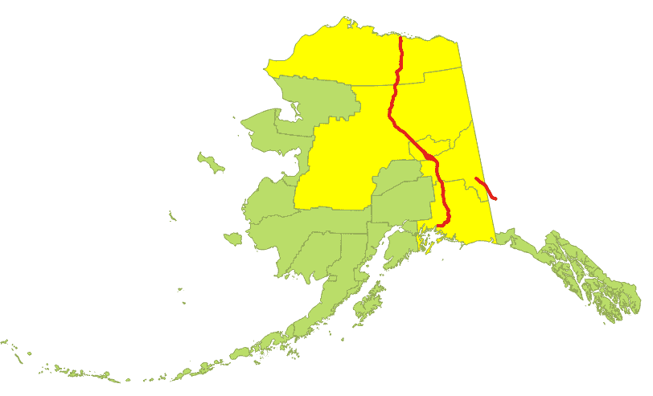

高亮显示的选定区域

通过右键单击图层并选择打开属性表来打开属性表。您将在表中看到选定的区域。可以扩展此查询并在`regions`图层中创建一个字段，以记录管道是否与区域相交。为此，我们可以使用字段计算器。

让我们添加一个名为`Pipeline`的字段，如果管道穿过该区域，则分配值为 1，如果不穿过，则分配值为 0。在属性表中，单击打开字段计算器按钮（图标是一个算盘）。按照以下方式填写字段计算器。确保选中旁边的“仅更新 5 个选定的要素”复选框：

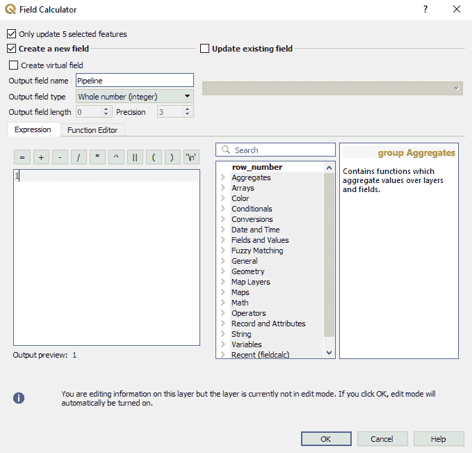

字段计算器

点击确定，然后打开属性表；您将看到一个名为`Pipeline`的新字段。如下所示：

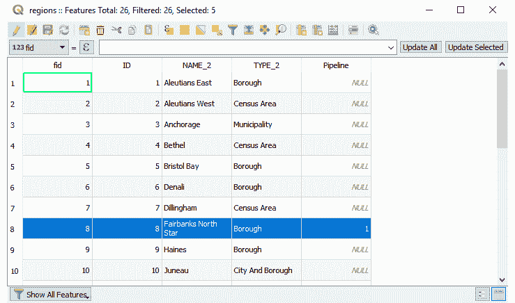

带有选定要素的属性表

现在我们需要将所有其他字段的所有值都设置为 0。反转选择（按钮看起来像灰色三角形下方的黄色三角形）。从下拉菜单中选择“管道”字段并将值设置为 0。点击“更新所选”。要更改的值在上面的屏幕截图中显示：

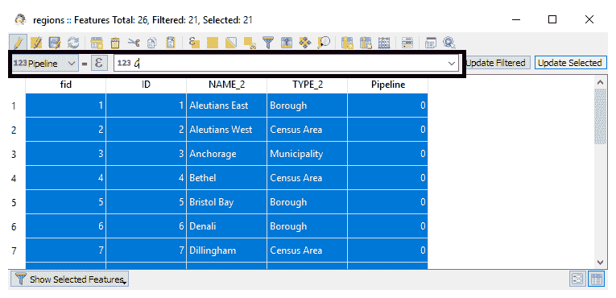

在字段计算器中更新现有字段

点击“确定”。现在，“管道”字段要么为零（未受影响）或一个（受影响）。清除选择并取消编辑。我们可以使用第四章中“样式化数据”的样式技巧，根据新创建的“管道”字段来表示区域层。

# 管道附近 15,000 英尺内的建筑和定居点有哪些？

要回答这个问题，我们需要对管道执行缓冲操作，然后选择位于此缓冲区内的 popp 图层中的点。这是一个常见的 GIS 查询，这里展示的方法应该适用于你可能对数据有任何类似查询的情况。将 popp 图层加载到地图中。

在处理工具箱中搜索“缓冲”。双击打开工具。选择`pipelines`图层并将缓冲距离设置为`15000`英尺。勾选旁边的“溶解结果”复选框；这将合并任何相邻或重叠的要素成为一个要素。对于输出，选择我们与这本书一起提供的包含此`alaska`图层的 GeoPackage。缓冲对话框应该如下所示：

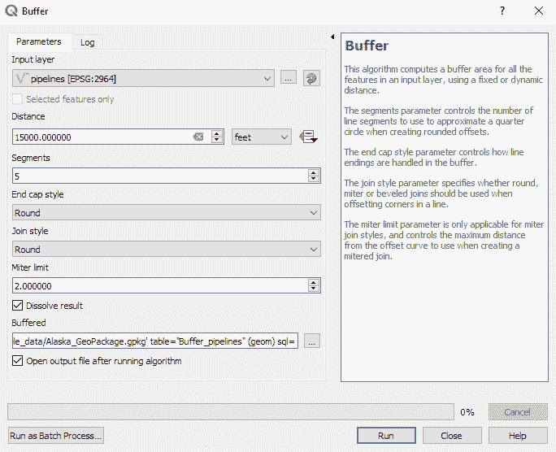

缓冲工具

点击“运行”。当工具完成后，点击“关闭”。在地图上，我们现在应该有一个管道的缓冲区。使用之前的选择位置工具，但这次选择位于新创建的缓冲区内的 popp 图层中的点。对话框应该类似于下面的屏幕截图：

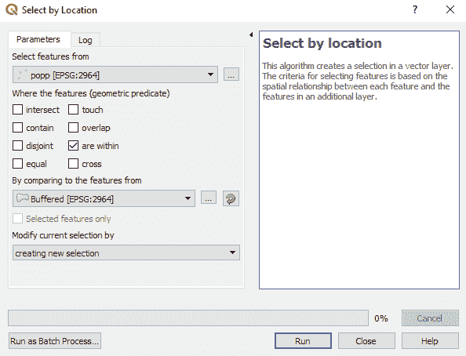

选择位置工具

点击运行后，关闭工具并检查地图。此查询导致选择了 49 个要素。要将这些要素写入新图层，在图层面板中右键单击弹出图层，选择“导出”|“将所选要素另存为”。将所选要素保存到名为`Popp_in_pipeline_corridor`的新 GeoPackage 图层中。这在上面的屏幕截图中显示：

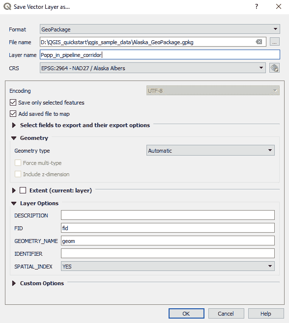

保存图层

点击“确定”，在图层面板中关闭除这个图层和区域之外的所有图层。你的地图应该看起来像下面的截图：

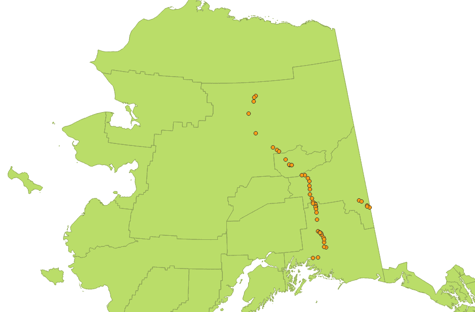

管道 15,000 英尺范围内的所有 popp 点

与第一个问题类似，这个查询在 GIS 中很常见。你可能会处理的是管道走廊内的地址点，而不是新商店周围的定居点和建筑，你可能会联系他们告知他们新的优惠。

# 在缓冲管道内部，土地覆盖类型的分布是什么？

这是一个我们需要结合栅格和矢量数据来提供答案的问题。我们可能想知道管道是否穿过保护区以及该区域有多少受到影响。

将`landcover.img`数据集加载到图层面板中。为了回答这个问题，我们将使用一个名为区域直方图的工具。在工具箱中搜索它。将栅格图层设置为`landcover`图层，将包含区域的矢量图层设置为缓冲管道，并选择使用单词`Terrain_`作为区域的前缀。将更改保存到 GeoPackage 中。这如图下截图所示：

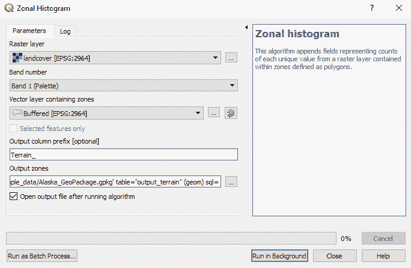

区域直方图工具

点击“在后台运行”，完成后关闭。将在图层面板中添加一个具有一个要素的新图层。右键单击此图层并打开属性表。由于我们在创建时溶解了缓冲区，因此表中只有一个要素。生成的表看起来如下截图所示：

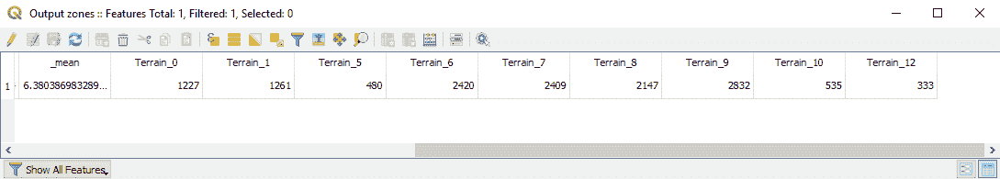

区域统计工具生成的属性表

我们可以看到带有`Terrain_x`字段的字段，其中`x`对应于`landcover`栅格中的值。管道受影响最严重的地形是`Terrain_9`。

在第七章 *扩展 QGIS 3* 中，我们将探讨如何将问题 2 和 3 中的工具组合成一个模型来自动化这些过程。这将使我们只需运行一个工具。

现在我们将转向使用栅格数据进行的地形建模。

# 栅格分析

创建一个新的 QGIS 项目并将`landcover.img`文件加载到地图中。我们将使用这个图层来演示 QGIS 中许多栅格处理工具中的几个。加载后，我们有了从 0 到 13 的范围的覆盖层类别。值零似乎对应于水。在这个例子中，我们将所有等于零的值设置为无数据。在 GIS 中，当我们有不想使用或显示的数据时，我们会将栅格数据设置为无数据。

要将`Landcover`数据集中的 0 值更改为无数据，请选择“栅格”|“转换”|“翻译”（转换格式），如图下截图所示：

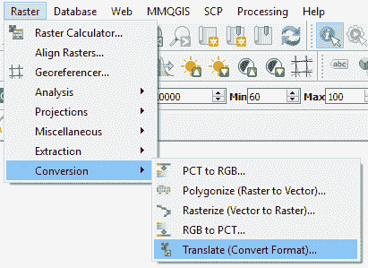

调用翻译工具

翻译工具非常有帮助，可以将栅格数据转换为不同的数据类型和格式。它基于 GDAL 翻译工具构建；您可以通过`gdal_translate`了解选项，请参阅[`www.gdal.org/gdal_translate.html`](https://www.gdal.org/gdal_translate.html)。在 QGIS 中打开翻译工具后，选择`landcover`图层作为输入图层，并将输出波段分配特定无数据值设置为`0`。将输出框标记为`Converted as Landcover_Null.tif`保存。这如图下截图所示：

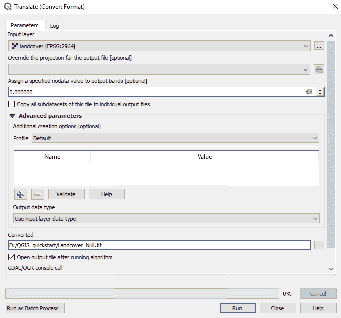

使用翻译工具设置无数据值

生成的栅格将看起来像这样：

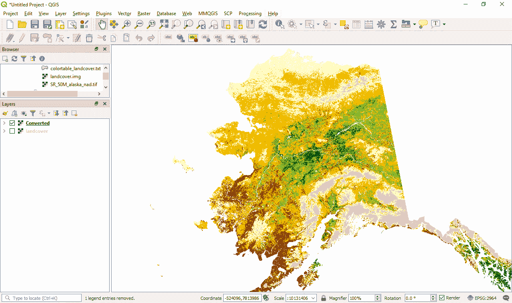

将值为 `0` 设置为无数据的土地覆盖

使用这个新创建的图层，我们将根据栅格计算器中的条件语句重新分类这个栅格数据集。我们将设置所有值大于或等于五的地面为零，其余部分为一。打开栅格计算器，并在栅格计算器表达式窗口中输入以下内容：`"Converted@1" >= 5`，并保存为 `Landcover_Null_reclassified.tif`，如图所示：

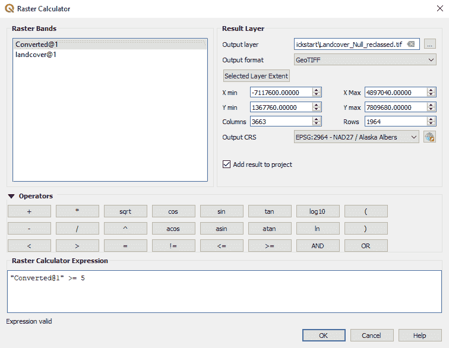

栅格计算器中的条件语句

结果的二值栅格将看起来像以下截图：

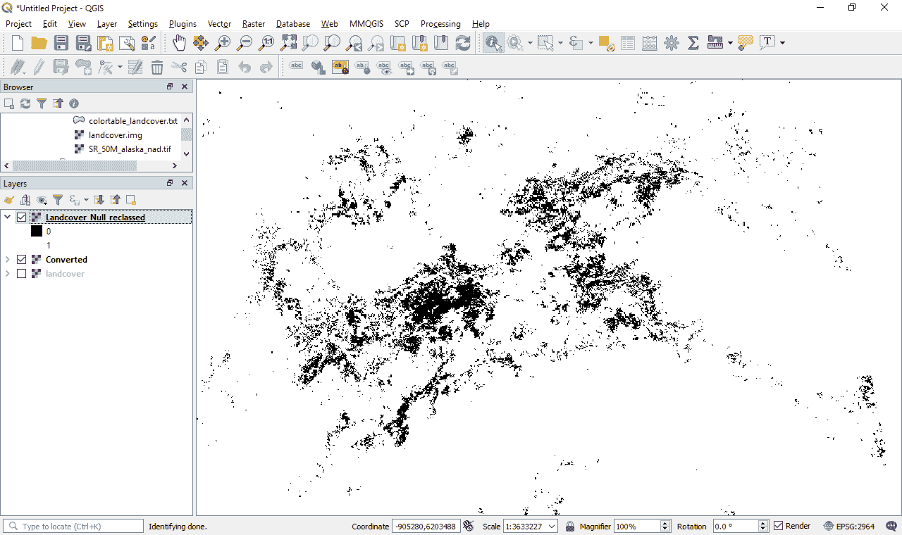

从栅格计算器生成的条件栅格

你可能没有预料到这个结果，因为值为 `0` 的部分是黑色的，而 `1` 的部分显示为白色。我们可以改变这一点；要做到这一点，我们需要将 `1` 的渲染方式改为着色，其余部分为透明（或白色）。右键单击 `Landcover_Null_reclassed` 图层并选择属性。将渲染类型设置为调色板/唯一值，点击分类并调整 `1` 的值为红色，`0` 的值为透明，如图所示：

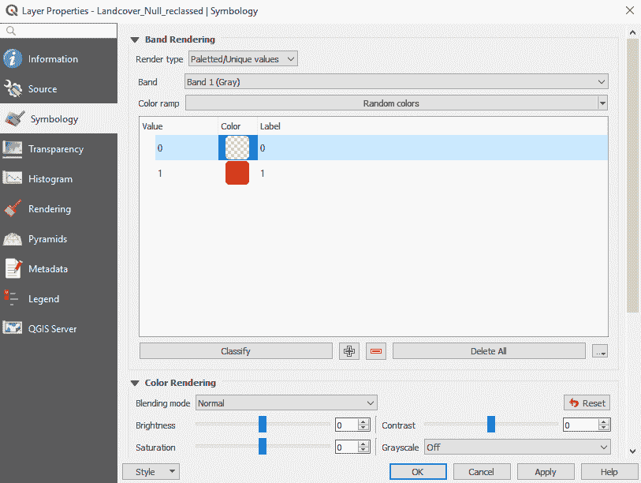

改变栅格的渲染方式

在下一节中，我们将探讨将此栅格转换为矢量数据集的过程。

# 转换为矢量

重新分类栅格对于许多可视化和处理工作流程非常有用，同时也适用于将数据转换为矢量。从栅格菜单中选择转换 | 多边形化（栅格到矢量），这将打开栅格到矢量工具。将矢量化图层保存为名为 `vectorised_terrains.gpkg` 的新 GeoPackage 图层，如图所示：

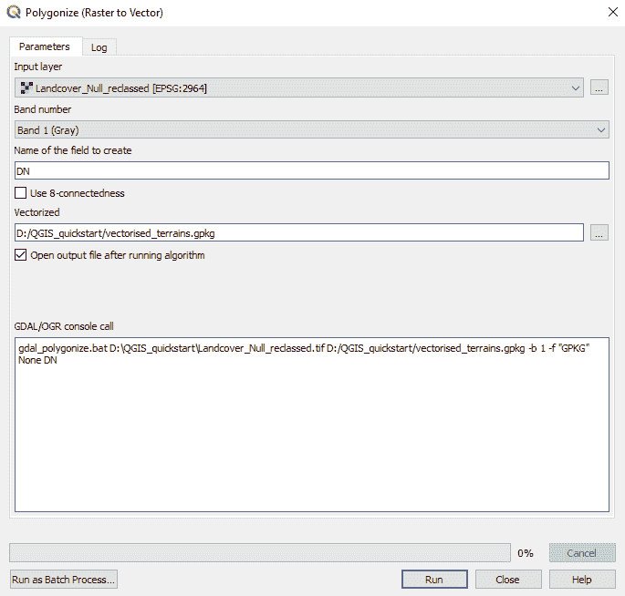

多边形化工具

由于栅格相当复杂，这个过程可能需要一些时间。完成后，你将拥有一个看起来类似于以下截图的矢量图层：

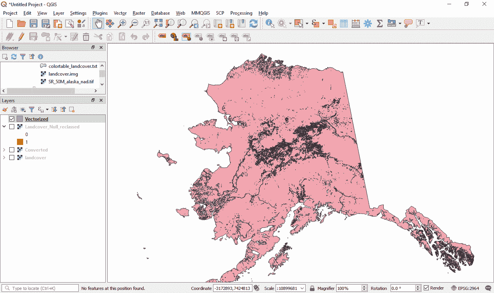

从条件栅格创建的结果矢量图层

新创建的矢量数据集将具有 `DN` 字段等于 `1` 或 `0` 的特征。在这种情况下，我们对任何等于 `0` 的 `DN` 值不感兴趣。打开图层的属性表，并使用选择特征选择 `DN` 字段中等于 `0` 的值。使用表达式（点击属性表从左数第十个按钮）。点击选择特征然后关闭，如图所示：

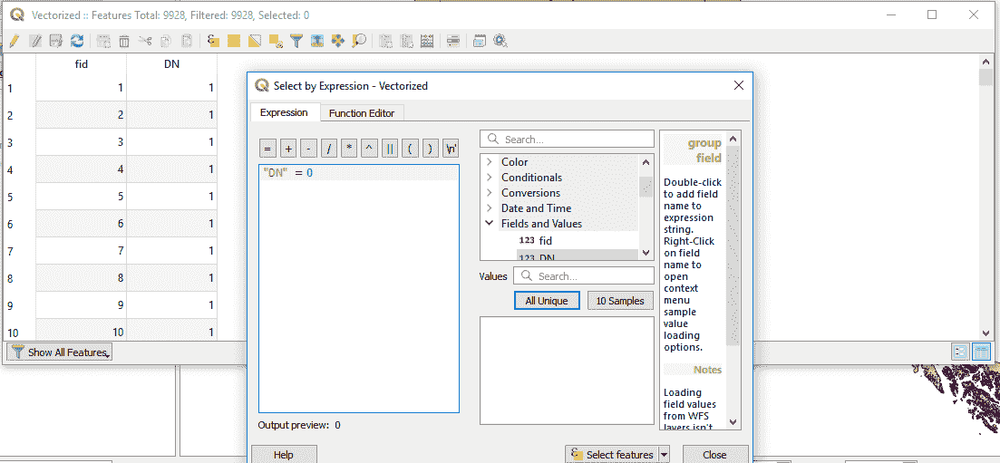

编辑矢量化图层

在属性表中点击切换编辑模式按钮（左边的第一个按钮），然后点击红色垃圾桶删除选定的值。点击切换编辑模式关闭编辑并保存更改。现在最终数据应该看起来类似于以下截图：

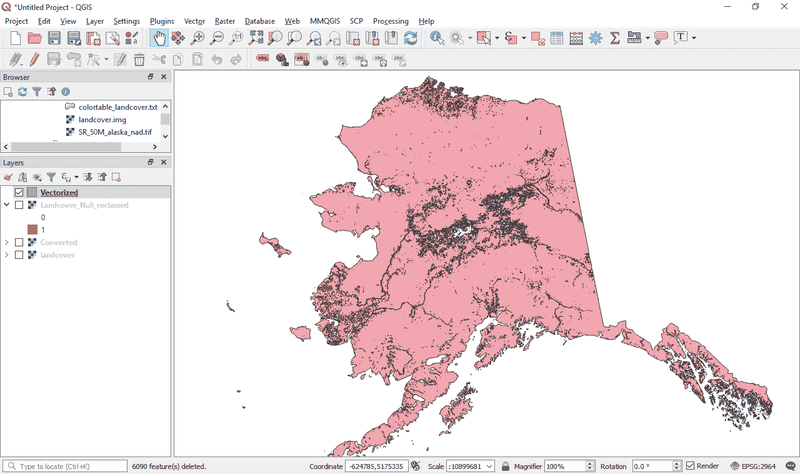

最终向量化地形层

QGIS 处理工具箱中有许多栅格分析工具我们可以使用。例如，如果您可以访问数字高程模型（DEM），您就可以创建坡度图和其他类型的地形分析；在处理工具箱中搜索“栅格地形分析”。

# 摘要

在本章中，我们已经在 QGIS 的 Processing 工具箱中试水。我们针对我们的数据提出了问题。我们使用 QGIS 中的简单 GIS 流程和工具来从数据中得出答案。GIS 的力量在于其数据。我们还探讨了基于向量和栅格的查询。

在下一章中，我们将通过使用模型构建器将常见的处理工具串联起来来扩展这一功能，然后再查看插件和 Python 控制台。
