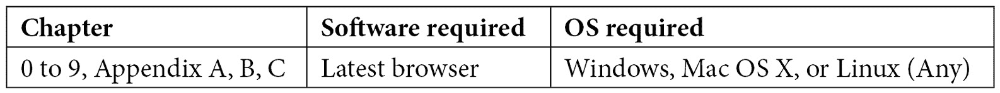

# 前言

“学习就是发现你已经知道的东西。做就是证明你知道。教学就是提醒其他人他们也和你一样知道。你们都是学习者、实践者、教师。”

——理查德·巴赫


图 0.1 – 学习量子计算和量子化学 [作者]

本书旨在揭示量子化学和计算的秘密，讨论基于当前限制的量子技术未来，展示当前量子理论实现的实用性和不足，并分享我们对这个主题的热爱。

本书不是传统意义上的量子化学或量子计算展示，而是通过量子力学公设的说明，特别是通过 Python 代码和开源量子化学软件包的展示，解释这两个主题如何交织在一起。

量子化学在工业中有许多应用，从药物设计到能源创造，再到近年来量子计算的发展。有了足够的量子化学和量子力学公设的知识，我们可以克服人类面临的一些主要障碍，并产生积极的影响。我们希望你能学到足够的细节，成为未来新和有生产力的解决方案的一部分。

# 我们的目标读者

欢迎所有类型的读者。然而，从中受益最大的是那些在学习的早期阶段对化学和计算机科学感兴趣的人；高中生和早期大学生，或者想要获取与计算相关的量子化学背景的专业人士，无论是从算法还是硬件的角度来看。我们还总结了与解决化学问题相关的有用数学和微积分。这些主题将吸引对量子计算化学和计算职业感兴趣的来自各个行业垂直领域的读者。

你将站在激动人心的前沿，有机会扩展你的想法并开始进行你的模拟实验。

# 量子化学的快速应用路径

我们选择以这种方式撰写这本书，以便为好奇的读者揭示量子概念的基础。本书通过描述量子力学的五个公设，介绍了量子化学概念的基础，包括这些概念如何与量子信息理论相关联，以及使用 Python、SimPy [Simpy]、QuTiP [QuTiP]、开源量子化学软件包 PySCF [PySCF]、ASE [ASE_0]、PyQMC [PyQMC]、Psi4 [Psi4_0]和 Qiskit [Qiskit]代码的原子和分子系统的基本编程示例。具备 Python 的入门级理解就足以阅读代码，并且只需要一个浏览器就可以访问 Google Colaboratory 并运行我们提供的云中的配套 Jupyter 笔记本。每一章都包含与历史名言相关的量子概念的艺术渲染。

在 1990 年代、2000 年代和 2010 年代，计算化学软件包的开发取得了惊人的进步，最近还有 Qiskit Nature [Qiskit_Nature] [Qiskit_Nat_0]。我们概述并介绍了以现代方式讨论的基本量子化学概念，并将这些概念与量子信息理论和计算联系起来。我们使用 Python、PySCF 和 Qiskit Nature 进行说明。

# 量子化学

量子力学的根本原理和五个公设直接影响到材料研究和计算化学，用于寻找新药和催化剂，使化学物质从一种形式转换为另一种形式的转换过程更加高效和清洁。量子化学对于设计利用原子和/或离子的特性的未来量子计算机也是必不可少的。然而，量子化学仍然是一个难以捉摸的话题，似乎需要很多年才能掌握。

我们认为，传统上对这一主题的长期成就与对该主题感知的复杂性以及为了提高传统计算的可访问性和可用性而做出的历史近似直接相关。有了近似，并且科学界广泛接受这是唯一的前进方式，一些基本概念常常被忽视、误解并被从依赖这些想法的学科中排除。我们认为这是一个分享我们对量子化学的热爱，以充分发挥其潜力，使这一主题更加友好和易于接近的机会。

我们将分享足够详细的解释，以便您理解历史上确立的限制。例如，我们提出了适用于所有基本粒子的泡利不相容原理的通用公式，这也适用于复合粒子，而许多教科书对此解释不足。

量子故事还有更多内容，但作为一本面向好奇者的第一本书，内容太多。因此，我们计划写下一本书，扩展那些尚未在科学界广泛应用的尖端量子思想。

# 如何导航本书

我们建议您按照章节的顺序阅读，并逐步掌握本书后面将有用到的概念、方法和工具。

+   *第一章**，介绍量子概念*，介绍了量子化学和量子计算的历史，并介绍了自然的基本构建块：粒子与物质、光与能量，以及量子数。

+   *第二章**，量子力学的公设*，为量子物理学的非专业人士提供了理解本书内容所需的量子力学和量子信息理论的概念、定义和符号。

+   *第三章**，量子电路计算模型*，介绍了量子电路计算模型和 Qiskit Nature，这是一个开源框架，提供了计算分子基态能量、激发态和偶极矩的工具。

+   *第四章**，分子哈密顿量*，介绍了分子哈密顿量，建模分子的电子结构和费米子到量子比特的映射。

+   *第五章**，变分量子本征求解器（VQE）算法*，展示了求解分子基态的过程，重点关注氢分子，并使用 Qiskit Nature 的变分量子本征求解器（VQE）算法进行说明。

+   *第六章**，超越 Born-Oppenheimer*，展示了尚未普及的超越 Born-Oppenheimer 方法。

+   *第七章**，结论*，是下一本书的开篇。

+   *第八章**，参考文献*，提供了每个章节末尾给出的所有参考文献的汇总列表。

+   *第九章**，术语表*，提供了一种方便的查找术语的方法。

+   *附录 A*，*准备数学概念*，通过 Python 代码示例介绍了概念。

+   *附录 B*，*在云中使用 Jupyter 笔记本*，解释了如何使用云上的免费环境来运行我们提供的配套 Jupyter 笔记本。

+   *附录 C*，*商标*，列出了本书中使用的产品所有商标。

# 要充分利用本书

以下软件和硬件列表可以帮助您访问 Google Colaboratory（Colab），这是一个完全在云上运行的免费 Jupyter Notebook 环境，提供在线共享的 Jupyter 笔记本实例，无需下载或安装任何软件：



# 下载示例代码文件

您可以从 GitHub 下载本书的示例代码文件[`github.com/PacktPublishing/Quantum-Chemistry-and-Computing-for-the-Curious`](https://github.com/PacktPublishing/Quantum-Chemistry-and-Computing-for-the-Curious)。如果代码有更新，它将在 GitHub 仓库中更新。

要下载配套笔记本的完整版本，您可以扫描以下二维码或访问提供的链接进行下载。


`account.packtpub.com/getfile/9781803243900/code`

我们还有来自我们丰富的图书和视频目录的其他代码包，可在[`github.com/PacktPublishing/`](https://github.com/PacktPublishing/)找到。查看它们！

# 使用的约定

本书使用了多种文本约定。

`文本中的代码`：表示文本中的代码单词、数据库表名、文件夹名、文件名、文件扩展名、路径名、虚拟 URL、用户输入和 Twitter 昵称。以下是一个示例：“量子电路中没有循环，但我们可以有一个经典循环来附加一个量子子电路。在 Qiskit 中，我们使用`QuantumRegister`类创建量子比特寄存器，使用`QuantumCircuit`类创建量子电路。”

代码块设置如下：

```py
q = QuantumRegister(2)
qc = QuantumCircuit(q)
qc.h(q[0])
qc.cx(q[0], q[1])
qc.draw(output='mpl')
```

任何命令行输入或输出都应如下编写：

```py
Mo: 1s² 2s² 2p⁶ 3s² 3p⁶ 4s² 3d¹⁰ 4p⁶ 5s² 4d⁴
```

# 联系我们

我们始终欢迎读者的反馈。

**一般反馈**：如果您对本书的任何方面有任何疑问，请通过电子邮件发送至 customercare@packtpub.com，并在邮件主题中提及书名。

**勘误**：尽管我们已经尽最大努力确保内容的准确性，但错误仍然可能发生。如果您在这本书中发现了错误，我们将非常感激您能向我们报告。请访问 [www.packtpub.com/support/errata](http://www.packtpub.com/support/errata) 并填写表格。

**盗版**：如果您在互联网上发现我们作品的任何非法副本，我们将非常感激您能提供位置地址或网站名称。请通过电子邮件发送至 copyright@packt.com 并附上材料的链接。

**如果您有兴趣成为作者**：如果您在某个领域有专业知识，并且您有兴趣撰写或为本书做出贡献，请访问 [authors.packtpub.com](http://authors.packtpub.com)。

# 参考文献

[ASE_0] 原子模拟环境 (ASE)，[`wiki.fysik.dtu.dk/ase/index.html`](https://wiki.fysik.dtu.dk/ase/index.html)

[NumPy] NumPy：初学者的绝对基础，[`numpy.org/doc/stable/user/absolute_beginners.html`](https://numpy.org/doc/stable/user/absolute_beginners.html)

[Psi4_0] Psi4 手册主索引，[`psicode.org/psi4manual/master/index.html`](https://psicode.org/psi4manual/master/index.html)

[PyQMC] PyQMC，一个实现实空间量子蒙特卡罗技术的 Python 模块，[`github.com/WagnerGroup/pyqmc`](https://github.com/WagnerGroup/pyqmc)

[PySCF] 基于 Python 的化学模拟框架 (PySCF)，[`pyscf.org/`](https://pyscf.org/)

[Qiskit] Qiskit，[`qiskit.org/`](https://qiskit.org/)

[Qiskit_Nat_0] Qiskit_Nature, [`github.com/Qiskit/qiskit-nature/blob/main/README.md`](https://github.com/Qiskit/qiskit-nature/blob/main/README.md)

[Qiskit_Nature] 介绍 Qiskit Nature，Qiskit，Medium，2021 年 4 月 6 日，[`medium.com/qiskit/introducing-qiskit-nature-cb9e588bb004`](https://medium.com/qiskit/introducing-qiskit-nature-cb9e588bb004)

[QuTiP] QuTiP，在 Bloch 球上绘图，[`qutip.org/docs/latest/guide/guide-bloch.html`](https://qutip.org/docs/latest/guide/guide-bloch.html)

[SimPy] SimPy 是 Python 的离散事件模拟，[`simpy.readthedocs.io/en/latest`](https://simpy.readthedocs.io/en/latest)

# 分享您的想法

一旦您阅读了《好奇者的量子化学与计算》，我们非常期待听到您的想法！请[点击此处直接访问亚马逊评论页面](https://packt.link/r/1-803-24390-2%)并分享您的反馈。

您的评论对我们和科技社区都非常重要，并将帮助我们确保我们提供高质量的内容。
