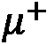

# 第一章：介绍量子概念

“在街头玩耍的孩子们中，有些人可以解决我物理学中最顶尖的一些问题，因为他们拥有我早已失去的感觉感知模式。”

– 罗伯特·J·奥本海默


图 1.1 – 女孩看着原子图像 [改编自 Getty 授权的图像]

预测尚未通过实验测量的物质、材料和物质的行为是一个令人兴奋的前景。现代计算工具使您能够在免费资源上开展虚拟实验。如果您希望得到与自然运作方式相匹配的结果，理解化学运作的现代模型是至关重要的。

经典物理学在预测带有牛顿万有引力定律的球的轨迹或太阳周围的行星轨迹方面表现良好。然而，通过量子物理学可以找到对自然（尤其是化学）的更准确描述，量子物理学包含了量子力学公设，这是量子化学和量子计算的基础。为了获得对化学预测的更深入理解，需要设计量子化学算法以实现高精度。仅仅编程近似方法并在量子计算机上运行以实现比在经典计算机上实现的相同方法更高的精度是不够的。

量子物理学的公设不被认为是自然法则，也无法通过数学或实验来证明；相反，它们只是对粒子和物质行为的指导方针。尽管这些公设的制定花费了几十年，而它们被更广泛的科学界理解则花费了一个世纪，但它们仍然是预测物质和粒子性质的有力工具，是量子化学和计算的基础。

本章并不是对整个量子物理历史的全面介绍；然而，我们将提及一些关键人物，并介绍我们认为在 20 世纪最具影响力的主题。我们讨论了粒子的基本概念和物质的组成，光的物理性质及其行为，以及能量及其与物质的关系。我们将这些概念扩展到与某些类型的化学应用和性质相关的量子数，这些性质可以专门用于量子计算的发展和预测物质状态。

在本章中，我们将涵盖以下主题：

+   *第 1.1 节，理解量子化学和力学的历史*

+   *第 1.2 节，粒子和物质*

+   *第 1.3 节，量子数和物质的量子化*

+   *第 1.4 节，光和能量*

+   *第 1.5 节，量子计算简史*

+   *第 1.6 节，复杂度理论洞察*

# 技术要求

本章的配套 Jupyter 笔记本可以从 GitHub 下载，网址为 [`github.com/PacktPublishing/Quantum-Chemistry-and-Computing-for-the-Curious`](https://github.com/PacktPublishing/Quantum-Chemistry-and-Computing-for-the-Curious)，已在 Google Colab 环境中测试，该环境免费且完全在云端运行，以及 IBM Quantum Lab 环境中。请参阅*附录 B** – 利用云端的 Jupyter 笔记本*，获取更多信息。

# 1.1. 理解量子化学和力学的历史

了解 20 世纪早期量子化学的发展对于理解量子力学的公设是如何被发现的是非常重要的。它还将帮助你掌握使我们能够实现科学里程碑的主要近似。我们将提及本书后续章节中将讨论和描述的概念，所以如果你不理解这些想法或含义，请不要担心。我们只是想简单地使用量子概念的术语，为本书后面部分介绍的量子力学的五个公设提供一些背景。


图 1.2 – 罗伯特·J·奥本海默 – 爱德华·韦斯科特（美国政府摄影师），公有领域，via Wikimedia Commons

量子力学在科学界引起颠覆性讨论已有超过一个世纪。量子力学最著名的争议是它在二战期间催生了原子弹。罗伯特·J·奥本海默（*图 1.2*），被认为是原子弹之父，也是至今为止最广泛使用且最有影响力的近似方法之一：1926 年的**玻恩-奥本海默（BO）近似**的发明者 [Intro_BOA_1] [Intro_BOA_2]。这将在*第六章**，超越玻恩-奥本海默*中详细介绍。BO 近似假设原子核的运动与电子的运动是解耦的，并导致了至今为止大多数计算技术和软件包的形成，包括量子计算中使用的**量子比特**的基本设计。

到奥本海默与他的学术导师马克斯·玻恩一起发表关于 BO 近似的博士论文时，许多科学家已经为**量子化学**做出了贡献。*量子力学*一词首次出现在玻恩 1924 年的论文*关于量子力学* [Born] 中。量子力学在 1925 年至 1926 年间形成，其他主要贡献来自以下人士：

1.  马克斯·普朗克，因普朗克常数和普朗克关系（*第 1.4 节，光和能量*）

1.  路易·德布罗意，因德布罗意波长（*第 1.3 节，量子数和物质的量子化*）

1.  魏纳·海森堡，因海森堡不确定性原理（*第 1.4 节，光和能量*）

1.  艾尔温·薛定谔因薛定谔方程(*第 1.4 节，光和能量*)。

1.  保罗·狄拉克因狄拉克方程，一个适用于费米子系统的相对论波动方程，以及狄拉克符号，也称为括号符号(*第 1.3 节，量子数和物质的量子化*)。

1.  沃尔夫冈·泡利因泡利不相容原理(*第 1.3 节，量子数和物质的量子化*)。

这些科学家参加了第 5 届索尔维量子力学会议(*图 1.3*)，以及其他未讨论的非常具有影响力的科学家。这张图片捕捉了第一代对 20 世纪产生巨大影响的量子科学家。


图 1.3 – 1927 年索尔维量子力学会议。图像属于公共领域

由于**泡利不相容原理**(**PEP**)，BO 近似是一个必要的发展，该原理于 1925 年提出。泡利描述了 PEP 对电子的描述，它表明两个相同**原子**的电子不可能同时具有以下四个量子数的相同值：，**主量子数**；，**角动量量子数**；，**磁量子数**；和，**自旋量子数**。他的工作已进一步扩展到玻色子粒子。PEP 导致一种特定的计算复杂性，从而引发了 BO 近似的必要性；有关更多详细信息，请参阅*第 1.6 节，复杂性理论洞察*。我们将在*第 1.3 节，量子数和物质的量子化*中详细介绍量子量，并描述不同粒子类型的 PEP。

上述思想领袖群体的快速发展得益于其前辈们的重要基础工作以及他们与氢原子相关的发现——周期表中所有元素中最简单的元素：

+   约翰·巴尔末于 1885 年发现了巴尔末发射线系列[巴尔末系列]。

+   约翰内斯·里德堡于 1888 年推广了巴尔末方程，适用于氢的所有跃迁[化学光谱]。

+   理查德·利曼从 1906 年到 1914 年发现了氢原子紫外光谱线的利曼系列[利曼系列]。

+   弗里德里希·帕申于 1908 年在红外波段发现了帕申光谱线[化学光谱]。

氢原子的结构将在*第 1.4 节，光和能量*中讨论，并在*第五章*“变分量子本征值求解器（VQE）算法”中进行计算概述。

约翰内斯·里德伯格的工作导致了光谱学中使用的根本常数的定义。1908 年，里德伯格与沃尔特·里茨并肩工作，开发了关于频率和元素光谱线之间关系的 Rydberg-Ritz 组合原理[Rydberg-Ritz]。原子的 Rydberg 状态用于量子计算，这在*第三章**量子计算电路模型*中进行了讨论。

在 Rydberg-Ritz 组合原理发展一年后，Ritz 开发了一种解决**特征值**问题的方法[Rayleigh–Ritz]，这种方法在今天的计算化学领域得到广泛应用，被称为**Rayleigh-Ritz 变分定理**。这种方法是*第五章**变分量子本征求解器(VQE)算法*中详细讨论的**变分量子本征求解器(VQE)**的灵感来源。

与约翰·威廉·斯特拉特，第三代雷利男爵约翰·威廉·斯特拉特对 Rayleigh-Ritz 变分方法的机械测试相结合，尽管这种方法是由 Ritz 编写和公式的，但因其与光的 Rayleigh 散射而闻名，这种方法被称为 Rayleigh-Ritz 方法。简而言之，它允许对特征值问题的解进行近似。他的工作导致了将叠加原理应用于近似**总波函数**的方法；这种数学展开是量子力学中描述的**第二章***量子力学的公理*之一。

在对氢原子有了更好的理解之后，1913 年，尼尔斯·玻尔试图用关于量化和量子理论的基本概念更详细地描述原子的结构[Bohr_1] [Bohr_2]。他因玻尔模型而获得了 1922 年的诺贝尔奖。在他的论文中，许多文章验证、预测和评估了小原子（Z < 7）的非常准确的 Rydberg 状态以及小分子的转动-振动（rovibrational）状态。玻尔的原子模型描述了从第二、第一和第三原子电子层开始的电子能级跃迁，即巴耳末系、莱曼系和帕邢系，以及之前发现的相应的氢发射光谱。

在 20 世纪 30 年代，林纳斯·鲍林和埃德加·布莱特·威尔逊小爵士普及了量子力学，正如它目前应用于化学一样[鲍林]。鲍林最终在 1954 年获得了诺贝尔化学奖，后来在 1964 年，他因在量子力学方面的政治活动而获得了诺贝尔和平奖。

自从这些重大贡献以来，量子力学公理的发展至今一直保持大致相同。

多亏了经典计算机的发展和巧妙的计算方法，已经产生了许多计算化学软件包，以进一步加深我们对化学的理解。除了 **瑞利-里茨变分定理** 之外，还有一些显著的方法，例如 **量子蒙特卡罗** (**QMC**) [QMC]、**哈特里-福克** (**HF**) 方法、**耦合簇** (**CC**) 和 **密度泛函理论 (DFT**) 等。在这本书中，我们将使用 Python 和开源量子化学软件包，如 PySCF、ASE、PyQMC、Psi4 和 Qiskit，在后续章节中展示一些这些方法。

在 20 世纪末，理查德·费曼（Richard Feynman）指出，量子概念可以用于量子计算 [Preskill_40y]。物理学家乔纳森·道林（Jonathan Dowling）和杰拉尔德·米尔本（Gerard Milburn）于 2002 年写道，我们已经进入了一个第二次量子革命，积极地在量子信息、量子传感、量子通信和模拟量子模拟中应用量子力学 [Dowling]。我们将在 *第 1.5 节，量子计算简史* 中总结量子计算的历史。这次第二次量子革命被视为一种利用物质和量子力学的公理来克服计算复杂性的方法。

问题变成了：在量子计算机中实施近似方法的目的何在？量子计算机是否应该帮助我们超越上述方法？我们打算在这本书中回答这些问题，特别是在 *第六章*“超越玻恩-奥本海默”中。

# 1.2\. 粒子和物质

通常，粒子和物质具有三个独特的、不会改变的性质：质量、电荷和磁自旋。对于某些粒子，这些性质可能为零；否则，这些性质是实数，可以通过实验测量。质量只能为正，而电荷可以是正的或负的。

在以下小节中，我们将回顾基本粒子和复合粒子，包括费米子和玻色子。理解这些类型的粒子对于理解量子化学和量子计算的可能应用是基本的。

## 基本粒子

基本粒子要么是费米子，要么是玻色子 [Part_1]。术语“费米子”是由狄拉克提出的，他受到了物理学家恩里科·费米（Enrico Fermi）的启发。基本玻色子粒子是标准模型 [Std_model] 的一部分，并不一定参与量子化学，而是基本物理学的一部分。

电子 () 是与量子化学相关的主要基本费米子粒子。电子的质量为 9.1093837015 x 10-31 千克(kg) [电子质量] 和负一的电荷(-1)。电子的大小约为 10-15 厘米(cm)。在大多数计算方法模拟中，我们改变参考质量，使电子的质量等于 1，从而使计算更简单。还有μ子()和τ子()粒子，它们具有负一的电荷(-1)，但比电子重得多。相关的反粒子，正电子()、反μ子()和反τ子()，与它们的对应粒子质量相同，但电荷相反（+1）。标准的计算模型只能处理电子。最近的高级科学程序能够处理电子与μ子和τ子以及反粒子的替代。

物质结构的当前观点在*图 1.4*中展示，使用氢原子作为最简单的例子。我们在图像中描绘了夸克，但想了解更多关于这方面的知识，请访问 CERN [CERN_quark]。请注意，我们在**原子核**周围包含了一个模糊的电子云，并试图摆脱电子遵循明确轨迹的旧模型。

![图 1.4 – 氢原子的尺度结构 [作者]](img/B18268_Figure_1.4.jpg)

图 1.4 – 氢原子的尺度结构 [作者]

## 复合粒子

对量子化学和计算贡献最大的复合粒子是原子核、原子和分子，它们可以是费米子或玻色子。费米子和玻色子粒子遵循 PEP，这在*第 1.3 节，量子数和物质的量子化*中有更详细的讨论。

### 原子核

原子核的构成单元是**核子**。核子是**质子**和**中子**。原子核包含一个或多个质子和零个或多个中子，它们通过强核力结合在一起。质子和中子的大小约为~10-13 厘米(cm)，而原子核的大小从~10-13 厘米到约~10-12 厘米。

质子带有一个正一的电荷(+1)，其大小与电子相等，质量是电子的 1,836.15267343 倍 [质子-电子质量比]。

中子不带电，其质量是电子的 1,838.68366173 倍 [中子-电子质量比]。中子的质量略大于质子。

核子中的质子数量决定了周期表中元素的类型（*图 1.6*）。氢原子是唯一一个在其核中不含有中子的元素。元素的同位素是通过改变核内中子的数量来确定的。氢的同位素是氘和氚。同位素在量子化学中扮演着重要角色，因为它们的量子性质可以变化。这在计算化学中是一个重要方面，因为核效应在使用 BO 近似（在*第六章**，超越玻恩-奥本海默*）时会产生影响）。

### 原子

原子定义了大量物质的化学性质。原子是原子核和围绕核外运动的电子的组合。由于电子的数量等于质子的数量，原子没有整体电荷。原子的尺寸大约是 ~10^-8 cm。离子是带有净电荷的原子，这种电荷是通过失去或获得一个或多个电子获得的，无论是正电荷还是负电荷。原子同位素也可以失去或获得电子，并被视为离子。如果一个原子获得了电子，它将带有负电荷；相反，当它失去电子时，它将带正电荷。离子的尺寸可以变化。正离子被称为阳离子，负离子被称为阴离子。原子、同位素和离子是量子化学和计算的核心主题。

### 分子

分子是保持物质化学性质的最小单位。分子由两个或更多原子和/或原子的同位素组成。它们被认为是保持物质化学性质的最小构建块，这种性质在物质的多个分子中保持不变。分子也可以是离子，因为它们也可以失去和获得电子。分子是物质的最基本单位之一。

# 1.3. 量子数和物质的量子化

量子化是这样一个概念：物质、粒子以及其他物理量，如电荷、能量和磁自旋，只能具有某些可数的值。这些特定的可数值可以是离散的或连续的变量。离散值定义为在*有限*时间内可数的。连续值定义为在*无限*时间内可数的。一个量子系统是否是离散的还是连续的取决于物理系统或可观察的量。

我们将讨论与量子化学最相关的粒子：质子、中子、电子和氢原子。中子和质子构成了原子的核，并由强核力结合在一起，它们在核内没有可测量的角动量量子数。相反，自由质子和中子如果不在核内结合，则可以运动并具有角动量量子数。在核内，所有的质子和中子都会与它们的给定磁量子数耦合（或相加），使得核具有一个总磁量子数。这同样适用于自旋动量（这些粒子的自旋量子数，每个都是 1/2）。一般来说，我们考虑核的整体磁和自旋动量量子数，而不是核中个别质子和中子的量子数。

## 原子中的电子

以下五个量子数对应于原子中的电子：

+   主量子数，，描述了电子在原子壳层中的能量水平或位置，并从 1 开始编号，直到包含该原子最外层电子的壳层。技术上，可以取从 1 到无穷大的值，因此它是一个连续的量子数。然而，当电子被激发到更高的值，并从原子中分离出来时，它就被认为是自由电子，也就是离子。这个过程称为电离，此时被认为是离散的。

+   角动量量子数，，也称为轨道量子数或方位量子数，描述了电子子壳层，并通过以下关系给出轨道角动量的量级：。在化学和光谱学中，被称为轨道，是轨道，是轨道，是轨道。技术上，在轨道之外还有更多的轨道，即、等，它们的能量水平更高。

+   磁量子数，，描述了电子在其子壳层中的能量水平以及电子轨道的方向。它可以取从开始的整数值。

+   自旋量子数，，对于每种粒子类型都不同，并且没有经典的对立物来描述它是什么。自旋量子数描述了某种粒子类型的固有自旋动量；对于电子来说，它等于 1/2。

+   **自旋投影量子数**，，给出了自旋动量  沿指定轴的投影，在给定的空间方向上可以是“自旋向上”（+½）或“自旋向下”（-½）。在量子计算中，这个方向被定义为 -轴。

## 波函数和泡利不相容原理

波函数是一种数学工具，用于描述粒子和物质的态、运动以及物理性质。这个概念是量子力学的第一原理。我们将在*第二章*“量子力学的原理”中详细讨论这一点。波函数的变量是之前描述的量子数，以及位置和时间。泡利不相容原理确保了给定系统的完整波函数是完整的，并且对于费米子、玻色子和复合粒子是不同的。

### 费米子

在 1925 年，沃尔夫冈·泡利提出，在单个原子中，没有两个电子可以拥有完全相同的量子数集，, , , 和 。这一原理通过指出只有电子波函数的反对称排列对是允许的得到了补充 [Kaplan] [Dirac_2]。反对称指的是在将排列算符应用于波函数时，波函数会得到一个负号（-）。

### 玻色子

相同玻色子系统的唯一可能状态是总波函数为对称的状态 [Kaplan]。对称指的是在将排列算符应用于波函数时，波函数会得到一个正号（+）。

### 复合粒子

对于所有基本粒子的泡利不相容原理（PEP）的以下一般公式也适用于复合粒子 [Kaplan]：*具有自旋*  *的相同粒子系统的唯一可能状态是总波函数对于整数值*  *(玻色-爱因斯坦统计)是对称的，而对于半整数值*  *(费米-狄拉克统计)是反对称的。*

### 狄拉克符号

狄拉克符号也称为括号符号。量子系统的状态，或波函数，由一个括号()表示，它是一个坐标和/或变量的列向量。括号()表示一个线性函数，它将每个列向量映射到一个复共轭的行向量。行向量()对列向量()的作用写为。在*第二章*“量子力学的公设”中，我们将展示狄拉克符号如何与上述量子数相关联。狄拉克符号将在*第三章*“量子计算电路模型”中进一步解释和说明。

# 1.4. 光和能量

光和能量是物质行为的基本要素。在本节中，我们将概述光和能量如何与质量、动量、速度、波长和频率相关联。我们还将介绍氢原子的电子跃迁。

## 普朗克常数及其关系

1900 年，德国物理学家马克斯·普朗克通过假设辐射能量仅存在于与频率成比例的离散量子中，解释了黑体辐射的光谱能量分布。普朗克关系表明，光子能量()与其频率()成正比，与波长()成反比：。是普朗克常数，6.62607015×10^-34 焦耳·赫兹^-1 (J·Hz^-1)，其中赫兹被定义为秒的倒数(Hz = s^-1)，是光速，等于每秒 299,792,458 米(ms^-1)。

## 德布罗意波长

德布罗意波长公式将粒子的质量()、动量()和速度()与波长()联系起来：，这是粒子表现出波动行为的尺度。

## 海森堡不确定性原理

不确定性原理与测量物理量的相关精度有关。我们使用标准差()，或一组给定测量的平均方差来定义测量物理量的精度。不确定性原理断言了对从初始条件预测粒子某些物理量对的准确性的下限。你越准确地知道一个量，你对另一个量的了解就越少。

例如，动量 () 和位置 () 是一组遵循不确定性的物理量，如果你确切地知道一个粒子的位置，你对它的动量的了解就越少。相反，你对它的动量了解得越多，你对它确切位置的了解就越少。

位置的标准差 () 和动量的标准差 () 通过以下不等式相关联，，其中  是约化普朗克常数。

## 原子和分子的能级

原子中不同电子能级之间的跃迁，或分子中不同振动或旋转能级之间的跃迁，是通过光子的吸收、发射和/或受激发射过程发生的。只有当光子的能量与初始和最终状态之间能量的确切差值相匹配时，才会发生跃迁。在原子中，与电子相关的能量是其轨道的能量。当原子被电离时，接近的能量状态称为瑞德伯状态。原子或分子轨道描述了在原子或分子中找到电子的概率。在最简单的原子中，当氢原子吸收光子时，电子会跃迁到更高的能级，例如从  到 。相反，当电子跃迁到较低的能级时，会发射光子，例如从  到  [Byjus]。

## 氢光谱

氢光谱已被划分为光谱线 [Chem_spectr]。

+   兰姆系对应于激发态  到  的跃迁。

+   巴耳末系对应于激发态  到  的跃迁。

+   帕邢系对应于激发态  到  的跃迁。

+   布拉特系对应于激发态  到  的跃迁。

+   普丰系对应于激发态  到  的跃迁。


图 1.5 – 氢的发射光谱

## 瑞德伯常数和公式

瑞德伯公式，也称为瑞德伯-里茨重组原理，计算元素光谱线的波长倒数 () [Chem_spectr]。


其中是里德伯常数，是**原子序数**，是较低能级的轨道主量子数，是较高能级的轨道主量子数。重原子的里德伯常数为 10,973,731.568160(21)米−1 (m−1) [Rydberg_R]。

## 电子排布

在 20 世纪 20 年代初，尼尔斯·玻尔和沃尔夫冈·泡利提出了构造原理（德语：Aufbauprinzip，*建立原理*），该原理指出，电子在填充较高能级的亚壳层之前，先填充最低能级的亚壳层。构造原理基于马德隆规则，该规则指出，电子按照增加的顺序填充轨道，当两个轨道具有相同的值时，它们按照增加的顺序填充。用于书写电子排布的符号从能量级开始，接着是**原子轨道**字母，最后是上标，表示轨道中电子的数量。例如，磷（P）的表示法是 1*s*² 2*s*² 2*p*⁶ 3*s*² 3*p*³。

### 使用马德隆规则计算原子元素的电子排布

以下 Python 程序使用马德隆规则计算了直到镭（N=104）的所有元素的电子排布。它源自 Christian Hill 在其网站“使用 Python 学习科学编程”上发布的程序，问题 P2.5.12 [Hill]。

#### 设置原子符号列表

以下数组包含一个原子符号列表：

```py
atom_list = ['H', 'He', 'Li', 'Be', 'B', 'C', 'N', 'O', 'F', 'Ne', 'Na','Mg', 'Al', 'Si', 'P', 'S', 'Cl', 'Ar', 'K', 'Ca', 'Sc', 'Ti', 'V', 'Cr', 'Mn','Fe', 'Co', 'Ni', 'Cu', 'Zn', 'Ga', 'Ge', 'As', 'Se', 'Br', 'Kr', 'Rb', 'Sr','Y', 'Zr', 'Nb', 'Mo', 'Tc', 'Ru', 'Rh', 'Pd', 'Ag', 'Cd', 'In', 'Sn', 'Sb','Te', 'I', 'Xe', 'Cs', 'Ba', 'La', 'Ce', 'Pr', 'Nd', 'Pm', 'Sm', 'Eu', 'Gd','Tb', 'Dy', 'Ho', 'Er', 'Tm', 'Yb', 'Lu', 'Hf', 'Ta', 'W', 'Re', 'Os', 'Ir','Pt', 'Au', 'Hg', 'Tl', 'Pb', 'Bi', 'Po', 'At', 'Rn', 'Fr', 'Ra', 'Ac', 'Th','Pa', 'U', 'Np', 'Pu', 'Am', 'Cm', 'Bk', 'Cf', 'Es', 'Fm', 'Md', 'No','Lr','Rf']
```

#### 设置原子轨道字母列表

以下代码块初始化了在*第 1.3 节，量子数和物质的量子化*中介绍的轨道列表：

```py
l_orbital = ['s', 'p', 'd', 'f', 'g']
```

#### 按照对应轨道填充顺序设置元组列表

以下代码块初始化`nl_pairs`为用于计算所有原子元素电子排布的元组列表。

```py
nl_pairs = []
for n in range(1,8):
    for l in range(n):
        nl_pairs.append((n+l, n, l))
nl_pairs.sort()
print(nl_pairs[:9])
print(nl_pairs[9:18])
print(nl_pairs[18:len(nl_pairs)])
```

这里是结果：


图 1.6 – 按照对应轨道填充顺序的元组列表

#### 使用 1s 轨道初始化包含电子的轨道列表

以下代码块初始化这些变量：

+   `nl_index`：`nl_pairs`列表中子壳层的索引。

+   `n_elec`：当前子壳层中电子的数量。

+   `config`：电子排布，一个数组数组。在这些数组中的每一个，第一个是一个字符串连接的能量级和原子轨道字母，第二个是显示在上标中的轨道中电子的数量。

+   `el_config`：电子排布字典。

```py
nl_idx, n_elec = 0, 0
n, l = 1, 0
config = [['1s', 0]]
el_config = {}
```

`superscript`函数返回 0 到 9 的上标整数：

```py
def superscript(n):
    return "".join(["⁰123⁴⁵⁶⁷⁸⁹"[ord(c)-ord('0')] for c in str(n)]) 
```

此代码计算所有原子元素的电子排布：

```py
for element in atom_list:
    n_elec += 1
    if n_elec > 2*(2*l+1):
        # This subshell is full: start a new subshell
        nl_idx += 1
        _, n, l = nl_pairs[nl_idx]
        config.append(['{}{}'.format(n, l_orbital[l]), 1])
        n_elec = 1
    else:
        # Add an electron to the current subshell
        config[-1][1] += 1
    # Building configuration string from a list of orbitals and n_elec
    el_config[element] = ' '.join(['{:2s}{:1s}'.format(e[0], 
                            superscript(e[1])) for e in config])
```

此代码打印出前五个原子元素的电子排布：

```py
for element in atom_list[:5]:
  print('{:2s}: {}'.format(element, el_config[element]))
```

这里是结果：

```py
H: 1s¹
He: 1s²
Li: 1s² 2s¹
Be: 1s² 2s²
B: 1s² 2s² 2p¹
```

图 1.7 – 前五个原子元素的电子排布

此代码打印出元素钼（Mo）的电子排布：

```py
element = 'Mo'
print('{:2s}: {}'.format(element, el_config[element]))
```

这里是结果：

```py
Mo: 1s² 2s² 2p⁶ 3s² 3p⁶ 4s² 3d¹⁰ 4p⁶ 5s² 4d⁴
```

图 1.8 – 元素钼的电子排布

## 薛定谔方程

薛定谔方程可以用来描述量子力学系统的动力学（演化）或静态（定态）状态。对于动力学，薛定谔方程为：，其中是虚数单位()，是时间的导数，是哈密顿算子（一个考虑该系统总能量（动能和势能之和）的可观测量），而是量子系统的状态向量（或波函数），作为时间的函数()。时间无关的薛定谔方程可以写成如下，即静态：，其中是能量本征值，而是量子系统的状态向量，不是时间的函数。

## 氢原子中电子波函数的概率密度图

原子或分子的电子排布是根据*第 1.3 节，量子数和物质的量子化*中描述的量子数来描述的，可以用概率云来表示。*图 1.9*显示了氢原子中电子在不同能级（主量子数高达 4）的波函数的概率密度图。我们将在*第二章**，量子力学的公设*中更详细地描述为什么这些图像看起来是这样的。


图 1.9 – 氢原子密度图。每个图表示(，，)。版权：[PoorLeno]。图像属于公有领域

轨道近似是可视化具有两个或更多电子的化学物种电子轨道的方法 [Orb_Approx]。

现在我们已经了解了量子化学的所有关键概念，你拥有了理解这与量子计算相关的基础。

# 1.5. 量子计算简史

第一次革命是在 20 世纪初提出公理。在第一次革命之后，1936 年，艾伦·图灵创建了一个自动机的理论模型，现在被称为图灵机，这为计算机科学奠定了理论基础。1980 年，保罗·贝尼奥夫发表了一篇论文，描述了图灵机的量子力学模型 [Benioff]。有了这个和量子化学的进步，量子计算机的基础已经奠定。

量子计算第一次在更广泛的科学社区中被讨论是在 1981 年 5 月，理查德·费曼在麻省理工学院（MIT）举办的名为“计算物理”的会议上发表了主题演讲。这次主题演讲讨论了利用量子物理来构建量子计算机 [Preskill_40y]。在 2021 年 5 月，会议周年之际，IBM 组织了一场名为 QC40：计算物理会议 40 周年纪念活动 [QC40]，庆祝第二次量子革命。

在第一次会议几十年前，1964 年，约翰·斯图尔特·贝尔发表了一篇论文《关于爱因斯坦-波多尔斯基-罗森悖论》。他证明了量子力学中没有局部隐变量 [Bell_1]，这是一个重要的进展，为量子信息理论铺平了道路，并在量子计算和量子通信中得到了应用。这是利用量子优势的基础。

建立在量子计算这些想法的基础上，1985 年，大卫·德奇发表了一篇论文，为量子计算理论奠定了基础。他提出了丘奇-图灵-德奇原理，即通用计算设备可以模拟每一个物理过程。他还与理查德·约萨在 1992 年发表了德奇-约萨算法，这是第一个比任何可能的确定性经典算法指数级更快的量子算法的例子 [Deutsch-Jozsa]。

彼得·肖尔在 1994 年创建了一个多项式时间量子计算机算法，用于整数分解，现在被称为肖尔算法 [Shor]，在 1994 年。1996 年，伊曼纽尔·克尼尔和雷蒙德·拉法拉梅开发了一般量子纠错理论 [Knill]。2000 年，大卫·P·迪文森佐讨论了物理实现量子计算的五个要求以及与量子通信相关的两个更多要求 [DiVincenzo]。2001 年，IBM 研究人员发表了一项关于肖尔算法的实验实现 [Vandersypen]。

在 2014 年，由主要作者 Alberto Peruzzo 等人发表在《自然通讯》杂志上的一篇文章介绍了混合变分量子本征求解器（VQE）算法，用于寻找分子的基态能量（最低能量）的估计值 [VQE_1]。请记住，变分方法在*第 1.1 节，理解量子化学和力学的历史*中提到过。IBM 量子团队在 2017 年使用 VQE 算法模拟了氢化锂分子的基态能量 [VQE_2]。VQE 算法在多个平台上可用；例如，Qiskit，它允许在多种量子处理器和模拟器上进行实验，本书中就使用了它。到目前为止，在本书出版时，还没有任何声明称 VQE 算法在基于第一原理（从头计算）的计算化学中优于经典超级计算机。

2019 年 10 月 23 日，谷歌 AI 量子硬件的首席科学家 John Martinis 和量子计算理论的首席科学家 Sergio Boixo 在《自然》杂志上发表了一篇名为*使用可编程超导处理器实现量子霸权* [Arute] 的文章，其中提出了一个有争议的主张和建议。量子霸权是一个实验证明，表明量子计算设备可以执行特定计算，而经典计算机在合理的时间内无法完成。

在当前的噪声中等规模量子（NISQ）时代，越来越多的学术界和工业界参与者，拥有庞大的资金项目，参与所谓的展示量子优势的竞赛，无论是计算速度的提升、能源成本的降低，还是两者兼而有之。当前的量子处理器存在一些限制，如量子比特数量太少和电路深度有限。目标是获得容错设备，可能需要利用对量子化学的深入理解。

# 1.6. 复杂性理论见解

复杂性理论有两个重要的方面：一是关于 PEP 和 BO 近似的用法，我们将在*第二章**，量子力学的公设*中专门讨论；二是计算的复杂性。本节描述了与量子系统相关的计算的复杂性。

在 1981 年麻省理工学院计算物理会议上的主题演讲中 [MIT_QC_1981]，理查德·费曼提出了问题：“*经典计算机能否精确地模拟经典系统或量子系统？*”他还指出，模拟一个大物理系统所需的计算机元素数量应该只与物理系统的大小成比例。费曼指出，计算一个大量子系统中每个粒子在每个点上的概率需要与  成比例的内存，即随着  的增加而指数增长。他的下一个问题是，经典系统能否以概率方式模拟量子系统。利用贝尔定理，该定理排除了局部隐变量 [Bell_1] [Bell_2]，费曼表明答案再次是否定的。

费曼提出，量子系统可以模拟其他量子系统，并挑战计算机科学家找出不同种类的量子力学系统，这些系统可以相互模拟——即等价——就像在经典计算机的情况下所做的那样 [Preskill_40y]。计算复杂性理论，作为理论计算机科学的一个领域，试图根据其资源使用、空间和时间来对计算问题进行分类。

在这个理论中，可以在多项式（P）时间内解决的问题属于 P 类，可以在多项式时间内验证答案的问题属于非确定性多项式（NP）类 [PvsNP]，而对于没有找到有效解算法且容易验证解正确性的问题属于 NP-完全类。例如，我们不知道如何有效地将一个数分解为其质因数，而检查质数的乘积是否为解则很容易。

P = NP 的问题列在七个千年大奖难题之中 [Clay]。可以在多项式时间内解决的问题属于 BQP 类。

在 2008 年的文章《量子计算机的极限》 [Aaronson_1] [Aaronson_2] 中，斯科特·阿伦森指出，一个常见的错误是声称，原则上，量子计算机可以通过同时处理所有可能的答案来解决 NP-完全问题。我们将在*第四章**，分子哈密顿量*中解释，量子计算机可以同时处理在叠加态中准备好的量子寄存器的所有可能状态。困难在于设计算法，使用量子干涉和纠缠，使得量子计算机只给出正确的答案。斯科特·阿伦森还管理着一个所有复杂性类的列表，复杂性动物园 [Comp_Zoo]。斯蒂芬·乔丹管理着一个量子算法动物园 [Qa_Zoo]。

复杂性理论中的一个新发现确立了梯度下降算法为什么不能快速解决某些类型的问题的原因[Fearnley] [Daskalakis]。训练变分量子算法是一个 NP 难题[Bittel]。这些结果影响了所有变分量子算法，如 VQE，因为它们依赖于经典优化器来优化量子电路参数集。

# 摘要

使用量子力学的公设来理解量子化学和计算将帮助下一代科学家预测尚未通过实验测量的物质行为。这对人类来说是一个令人兴奋的前景，我们希望历史视角能为当前行业的状态提供一个参考点，揭示新的进步机会。量子化学、量子计算的使用以及两者结合使用之间存在一种循环思维过程。

# 问题

请使用相应的 Google Colab 笔记本来测试你对本章所介绍概念的理解。

1.  与量子化学相关的主要基本费米子粒子是什么？

1.  的值对应于？

1.  电子的自旋量子数的值是多少？

1.  费米子遵循 PEP（泡利不相容原理），这意味着波函数的配对粒子排列必须是反对称的。反对称的符号是什么？

1.  波长为 486.1 纳米的光子的能量是多少？

在国际单位制（SI）中：

6.62607015×10-34 J x Hz-1 是普朗克常数

 299,792,458 (ms-1)是光速

提示：查看氢原子可见光谱中的蓝色线。你还需要将米转换为纳米。

1.  前一个问题中，486.1 纳米的波长对应于哪个氢原子系列？莱默尔、巴耳末还是帕邢？

1.  关于里德伯公式，对应于 486.1 纳米这个过渡的主量子数 *n*2 是多少？

1.  提供氢元素的完整电子排布。

请输入不带上标的完整电子排布。

1.  提供氮元素的完整电子排布。

## 答案

1.  电子

1.  1

1.  ½

1.  -

1.  4.086496311764922e-19

1.  巴耳末

1.  4

1.  1s1

1.  1s2 2s2 2p3

# 参考文献

[Aaronson_1] Scott Aaronson, The Limits of Quantum Computers, Scientific American, March 2008, [`www.scientificamerican.com/article/the-limits-of-quantum-computers/`](https://www.scientificamerican.com/article/the-limits-of-quantum-computers/)

[Aaronson_2] Scott Aaronson, The Limits of Quantum Computers (DRAFT), [`www.scottaaronson.com/writings/limitsqc-draft.pdf`](https://www.scottaaronson.com/writings/limitsqc-draft.pdf)

[Arute] 阿鲁特，F.，阿亚，K.，巴布什，R. 等，使用可编程超导处理器实现量子霸权，自然 574，505–510 (2019)，[`doi.org/10.1038/s41586-019-1666-5`](https://doi.org/10.1038/s41586-019-1666-5)

[Balmer_series] 巴耳末系列，维基百科，[`en.wikipedia.org/wiki/Balmer_series`](https://en.wikipedia.org/wiki/Balmer_series)

[Bell_1] 贝尔，J. S.，关于爱因斯坦-波多尔斯基-罗森佯谬，物理物理物理 1，195：195–200，1964，[`doi.org/10.1103/PhysicsPhysiqueFizika.1.195`](https://doi.org/10.1103/PhysicsPhysiqueFizika.1.195)

[Bell_2] "*第二章*：关于爱因斯坦-波多尔斯基-罗森佯谬"。量子力学中的可说与不可说：量子哲学论文集（1987 年版，阿兰·阿斯佩特序言），重印于 JS Bell (2004)，剑桥大学出版社。第 14–21 页。ISBN 978-0521523387

[Benioff] 本尼奥夫，P.，计算机作为物理系统：用图灵机表示的计算机的微观量子力学哈密顿量模型，[`doi.org/10.1007/BF01011339`](https://doi.org/10.1007/BF01011339)

[Bittel] Lennart Bittel 和 Martin Kliesch，训练变分量子算法是 NP-hard — 即使对于对数数量级的量子比特和自由费米子系统，DOI：10.1103/PhysRevLett.127.120502，2021 年 1 月 18 日，[`doi.org/10.1103/PhysRevLett.127.120502`](https://doi.org/10.1103/PhysRevLett.127.120502)

[Bohr_1] N. 玻尔，I.，关于原子和分子的结构，哲学杂志，26，1-25 (七月 1913)，DOI：10.1080/14786441308634955

[Bohr_2] 玻尔壳层模型，大英百科全书，[`www.britannica.com/science/atom/Bohrs-shell-model#ref496660`](https://www.britannica.com/science/atom/Bohrs-shell-model#ref496660)

[Born_1] 布朗，M.，乔丹，P. 关于量子力学，物理杂志 34，858–888 (1925)，[`doi.org/10.1007/BF01328531`](https://doi.org/10.1007/BF01328531)

[Byjus] BYJU'S，氢光谱，波长，图表，氢发射光谱，[`byjus.com/chemistry/hydrogen-spectrum/#`](https://byjus.com/chemistry/hydrogen-spectrum/#)

[CERN_quark] CERN 探索原子世界之旅，[`www.youtube.com/watch?v=7WhRJV_bAiE`](https://www.youtube.com/watch?v=7WhRJV_bAiE)

[Chem-periodic] 化学自由教材，5.17：电子排布和周期表，[`chem.libretexts.org/Bookshelves/General_Chemistry/Book%3A_ChemPRIME_(Moore_et_al.)/05%3A_The_Electronic_Structure_of_Atoms/5.17%3A_Electron_Configurations_and_the_Periodic_Table`](https://chem.libretexts.org/Bookshelves/General_Chemistry/Book%3A_ChemPRIME_(Moore_et_al.)/05%3A_The_Electronic_Structure_of_Atoms/5.17%3A_Electron_Configurations_and_the_Periodic_Table)

[Chem_spectr] 化学自由教材，7.3：氢原子的光谱，[`chem.libretexts.org/Courses/Solano_Community_College/Chem_160/Chapter_07%3A_Atomic_Structure_and_Periodicity/7.03_The_Atomic_Spectrum_of_Hydrogen`](https://chem.libretexts.org/Courses/Solano_Community_College/Chem_160/Chapter_07%3A_Atomic_Structure_and_Periodicity/7.03_The_Atomic_Spectrum_of_Hydrogen)

[Clay] 千禧年问题，[`www.claymath.org/millennium-problems`](https://www.claymath.org/millennium-problems)

[Comp_Zoo] 复杂性动物园，[`complexityzoo.net/Complexity_Zoo`](https://complexityzoo.net/Complexity_Zoo)

[Daskalatis] 科斯蒂斯·达斯卡拉斯，平衡计算与深度学习的基础，科斯蒂斯·达斯卡拉斯在数据科学基础系列，2021 年 2 月 18 日，[`www.youtube.com/watch?v=pDangP47ftE`](https://www.youtube.com/watch?v=pDangP47ftE)

[Deutsch-Jozsa] 大卫·德罗斯和理查德·约萨，通过量子计算快速解决问题，伦敦皇家学会 A 类会议论文，439：553-558，[`doi.org/10.1098/rspa.1992.0167`](https://doi.org/10.1098/rspa.1992.0167)

[DiVincenzo] 大卫·P·迪维琴佐，量子计算的物理实现，10.1002/1521-3978(200009)48:9/11<771::AID-PROP771>3.0.CO;2-E，[`arxiv.org/abs/quant-ph/0002077`](https://arxiv.org/abs/quant-ph/0002077)

[Dirac_2] P.A.M.狄拉克，量子动力学的物理解释，Proc. R. Soc. Lond. A 1927，113，621–641，[`doi.org/10.1098/rspa.1927.0012`](https://doi.org/10.1098/rspa.1927.0012)

[Dowling] 乔纳森·P·道灵和杰拉尔德·J·米尔伯恩，量子技术：第二次量子革命，皇家学会，2003 年 6 月 20 日，[`doi.org/10.1098/rsta.2003.1227`](https://doi.org/10.1098/rsta.2003.1227)

[E_mass] 基本物理常数，电子质量，NIST，`https://physics.nist.gov/cgi-bin/cuu/Value?me|search_for=electron+mass`

[Fearnley] 约翰·费尔尼利（利物浦大学），保罗·W·戈德堡（牛津大学），亚历山德罗斯·霍伦德（牛津大学），以及拉胡尔·萨瓦尼（利物浦大学），梯度下降的复杂性：CLS = PPAD ∩ PLS，STOC 2021：第 53 届 ACM SIGACT 理论计算年度研讨会论文集，2021 年 6 月，第 46-59 页，[`doi.org/10.1145/3406325.3451052`](https://doi.org/10.1145/3406325.3451052)

[Getty] 女孩仰望，[`media.gettyimages.com/photos/you-learn-something-new-every-day-picture-id523149221?k=20&m=523149221&s=612x612&w=0&h=7ZFg6ETuKlqr1nzi98IBNz-uYXccQwiuNKEk0hGKKIU=`](https://media.gettyimages.com/photos/you-learn-something-new-every-day-picture-id523149221?k=20&m=523149221&s=612x612&w=0&h=7ZFg6ETuKlqr1nzi98IBNz-uYXccQwiuNKEk0hGKKIU=)

[Hill] 使用 Python 学习科学编程，*第二章*：核心 Python 语言 I，问题，P2.5，电子排布，[`scipython.com/book/chapter-2-the-core-python-language-i/questions/problems/p25/electronic-configurations/`](https://scipython.com/book/chapter-2-the-core-python-language-i/questions/problems/p25/electronic-configurations/)

[Intro_BOA_1] M. Born，J.R. Oppenheimer，关于分子量子理论，[`www.theochem.ru.nl/files/dbase/born-oppenheimer-translated-s-m-blinder.pdf`](https://www.theochem.ru.nl/files/dbase/born-oppenheimer-translated-s-m-blinder.pdf)

[Intro_BOA_2] M. Born 和 R. J. Oppenheimer，分子量子理论，物理年鉴，20，457-484（1927 年 8 月），[`doi.org/10.1002/andp.19273892002`](https://doi.org/10.1002/andp.19273892002)

[Kaplan] Ilya G. Kaplan，泡利不相容原理的现代状态及其理论基础的难题，对称性 2021，13(1)，21，[`doi.org/10.3390/sym13010021`](https://doi.org/10.3390/sym13010021)

[Knill] Emanuel Knill，Raymond Laflamme，量子纠错码理论，[`arxiv.org/abs/quant-ph/9604034`](https://arxiv.org/abs/quant-ph/9604034)

[Lyman_series] 兰姆系，来自维基百科，[`en.wikipedia.org/wiki/Lyman_series`](https://en.wikipedia.org/wiki/Lyman_series)

[MIT_QC_1981] MIT Endicott House，计算物理会议，图片“计算物理会议，MIT Endicott House 1981 年 5 月 6-8 日”，2018 年 3 月 21 日，[`mitendicotthouse.org/physics-computation-conference/`](https://mitendicotthouse.org/physics-computation-conference/)

[Neutron-electron-mass-ratio] 中子-电子质量比，NIST，[`physics.nist.gov/cgi-bin/cuu/Value?mnsme`](https://physics.nist.gov/cgi-bin/cuu/Value?mnsme)

[Orb_Approx] 轨道近似定义，[`www.chemicool.com/definition/orbital-approximation.html`](https://www.chemicool.com/definition/orbital-approximation.html)

[Part_1] 粒子列表，维基百科，[`en.wikipedia.org/wiki/List_of_particles`](https://en.wikipedia.org/wiki/List_of_particles)

[Pauling] L. Pauling 和 E. B. Wilson，量子力学导论及其在化学中的应用，多佛（1935 年）

[PoorLeno] 文件：氢密度图.png，来自维基百科，[`en.wikipedia.org/wiki/File:Hydrogen_Density_Plots.png`](https://en.wikipedia.org/wiki/File:Hydrogen_Density_Plots.png)

[Preskill_40y] 约翰·普雷斯科尔，40 年后的量子计算，[`arxiv.org/abs/2106.10522`](https://arxiv.org/abs/2106.10522)

[PvsNP] P 和 NP，www.cs.uky.edu。从原始版本存档于 2016-09-19，[`web.archive.org/web/20160919023326/http://www.cs.uky.edu/~lewis/cs-heuristic/text/class/p-np.html`](https://web.archive.org/web/20160919023326/http://www.cs.uky.edu/~lewis/cs-heuristic/text/class/p-np.html)

[QC40] (直播) QC40：计算物理会议 40 周年，[`www.youtube.com/watch?v=GR6ANm6Z0yk`](https://www.youtube.com/watch?v=GR6ANm6Z0yk)

[QMC] Google 量子 AI，使用量子计算机进行无偏费米子量子蒙特卡罗模拟，量子夏季研讨会 2021，7 月 30 日，[`www.youtube.com/watch?v=pTHtyKuByvw`](https://www.youtube.com/watch?v=pTHtyKuByvw)

[Qa_Zoo] Stephen Jordan，代数和数论算法，[`quantumalgorithmzoo.org/`](https://quantumalgorithmzoo.org/)

[Rayleigh_Ritz] Rayleigh-Ritz 方法，维基百科，[`en.wikipedia.org/wiki/Rayleigh%E2%80%93Ritz_method`](https://en.wikipedia.org/wiki/Rayleigh%E2%80%93Ritz_method)

[Rydberg_R] Rydberg 常数，维基百科，[`en.wikipedia.org/wiki/Rydberg_constant`](https://en.wikipedia.org/wiki/Rydberg_constant)

[Rydberg_Ritz] Rydberg-Ritz 结合原理，维基百科，[`en.wikipedia.org/wiki/Rydberg%E2%80%93Ritz_combination_principle`](https://en.wikipedia.org/wiki/Rydberg%E2%80%93Ritz_combination_principle)

[Shor] 彼得·肖尔，Shor 算法的由来，直击源头，2021 年 7 月 2 日，[`www.youtube.com/watch?v=6qD9XElTpCE`](https://www.youtube.com/watch?v=6qD9XElTpCE)

[VQE_1] Peruzzo, A., McClean, J., Shadbolt, P. 等人，在光子量子处理器上的变分本征值求解器，Nat Commun 5, 4213 (2014)，[`doi.org/10.1038/ncomms5213`](https://doi.org/10.1038/ncomms5213)

[VQE_2] Qiskit Nature，基态求解器，[`qiskit.org/documentation/nature/tutorials/03_ground_state_solvers.html`](https://qiskit.org/documentation/nature/tutorials/03_ground_state_solvers.html)

[Vandersypen] Vandersypen, L., Steffen, M., Breyta, G. 等人，利用核磁共振实现 Shor 的量子分解算法，自然 414, 883–887 (2001)，[`doi.org/10.1038/414883a`](https://doi.org/10.1038/414883a)
