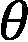
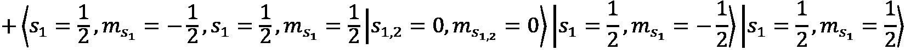
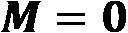
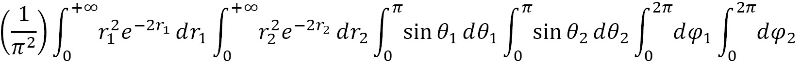
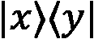
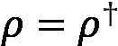
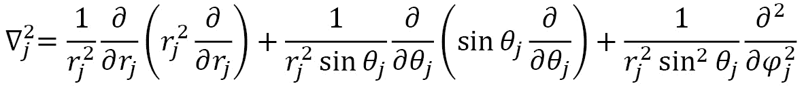
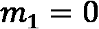

# 第二章：量子力学的公设

"他思维的力量生动而强大，他超越天际的火焰城墙，在思想和心灵中穿越了无边的宇宙。"

– 提图斯·卢克莱修·卡鲁斯


图 2.1 – 提图斯·卢克莱修·卡鲁斯凝视着银河系 [作者] 从公共领域的提图斯·卢克莱修图像和银河系图像 [NASA] 构建而成

在他的六卷诗《自然论》的前两卷中，罗马诗人兼哲学家提图斯·卢克莱修·卡鲁斯讨论了生活和爱情，并解释了伊壁鸠鲁物理学的基本原则，这是基督之前希腊理解世界的一种方式 [Lucr_1]。他提出了物质既是主动的又是不可确定的观点 [Lucr_2]，至少可以说这是一种非常“量子”的思维方式。

通过一个阳光中的尘埃粒子的类比，卢克莱修描述了现在所知的布朗运动 [Lucr_3]。他谈论了物质，并使用诸如大部分是空的空间等概念来描述它。这些想法要经过 2000 多年才被广泛采用，并纳入量子力学的公设。我们在*第一章*中回顾了 19 世纪末和 20 世纪初的里程碑，这些里程碑导致了量子力学公设的形成，*介绍量子概念*。

量子力学的五个公设并不被认为是自然法则，既不能从数学上也不能从实验上证明其真实性。相反，公设只是对粒子和物质行为的指导方针。尽管公设的形成花费了几十年，而更广泛的科学界利用它花费了一个世纪，但公设仍然是预测物质和粒子性质的有力工具，是量子化学和计算的基础。

在本章中，我们将涵盖以下主题：

+   *第二章 2.1 节，公设 1 – 波函数*

+   *第二章 2.2 节，公设 2 – 概率振幅*

+   *第二章 2.3 节，公设 3 – 可测量的量和算子*

+   *第二章 2.4 节，公设 4 – 时间无关的定态*

+   *第二章 2.5 节，公设 5 – 时间演化动力学，薛定谔方程*

在本章中，我们主要关注命题 1，即波函数的重要性，因为我们认为这个命题对有用的创新有强大的影响。传统上，命题 1 在概念上难以理解，在数学和艺术上表示都是一个科学挑战。我们已经采取了积极的措施来克服这一艺术上的挑战，如图*图 1.4*和*图 2.2*所示。其他四个命题支持命题 1。在本章中，我们不会像对命题 1 那样详细地介绍这些命题；然而，将在后续章节中利用它们。对于不熟悉线性代数或狄拉克符号的读者，请参阅*附录 A* *– 准备数学概念*。


图 2.2 – 氢原子波函数的艺术图像 [作者]

# 技术要求

本章的配套 Jupyter 笔记本可以从 GitHub 下载，网址为[`github.com/PacktPublishing/Quantum-Chemistry-and-Computing-for-the-Curious`](https://github.com/PacktPublishing/Quantum-Chemistry-and-Computing-for-the-Curious)，已在 Google Colab 环境中测试，该环境免费且完全在云端运行，以及 IBM Quantum Lab 环境中。请参阅*附录 B* *– 在云端利用 Jupyter 笔记本*，获取更多信息。配套的 Jupyter 笔记本会自动安装以下列表中的库：

+   **数值 Python**（**NumPy**）[NumPy]，一个在科学和工程几乎每个领域都使用的开源 Python 库

+   **SymPy**，[SymPy]，一个用于符号数学的 Python 库

+   **Qiskit** [Qiskit]，一个用于在脉冲、电路和应用模块级别与量子计算机工作的开源 SDK

+   安装 Qiskit 可视化支持以启用其可视化功能和使用 Jupyter 笔记本

使用以下命令安装 NumPy：

```py
pip install numpy
```

使用以下命令安装 SymPy：

```py
pip install sympy
```

使用以下命令安装 Qiskit：

```py
pip install qiskit
```

使用以下命令安装 Qiskit 可视化支持：

```py
pip install 'qiskit[visualization]'
```

使用以下命令导入数学库：

```py
import cmath
import math
```

# 2.1. 命题 1 – 波函数

总波函数描述系统的物理行为，用大写希腊字母 Psi 表示：。它包含量子系统的所有信息，并将复数()作为参数。一般来说，是系统中所有粒子()的函数，其中粒子的总数为。此外，包括每个粒子的空间位置()、每个粒子的自旋方向坐标()和时间：


其中和是单个粒子坐标的向量：


单粒子系统的总波函数是空间、自旋和时间函数的乘积：


如果一个多粒子系统的波函数不能分解为单个粒子函数的乘积，那么我们将量子系统视为**纠缠**的。如果波函数可以分解为单个粒子函数的乘积，那么它不是纠缠的，称为可分离态。我们将在*第三章**，量子计算电路模型*中重新审视纠缠的概念。

波函数的空间部分可以通过以下方程从笛卡尔坐标系转换为球坐标系，其中是径向距离，由距离公式，是极角，从 0 到（），是方位角，从 0 到（）：

+   

+   

+   


图 2.3 – 球坐标系[公有领域]

为了准确表示量子系统，需要适当考虑波函数的某些特性：

+   **单值**，意味着对于给定的输入变量只有一个可能的输出

+   **正定**，意味着波函数的复共轭转置，用符号表示，乘以波函数本身严格大于零：

+   **平方可积**，意味着当在整个空间上积分时，正定乘积小于无穷大（: ，其中）

+   **归一化**，意味着粒子必须存在于一个体积和某个时间点，即它必须存在于所有空间和时间中的某个地方：，其中

+   **完备**，意味着表示该量子系统所需的所有统计上重要的数据都可用，使得性质的计算收敛到极限，即一个单一值

对于量子化学应用，我们将使用 Python 代码展示如何包含空间和自旋函数：

+   *第 2.1.1 节，球谐函数*，与量子数  以及空间变量  或  相关

+   *第 2.1.2 节，使用克莱布施-戈丹（CG）系数进行动量叠加*，用于耦合多个粒子，可以应用于轨道 () 和自旋量子数 ()

+   *第 2.1.3 节，泡利不相容原理的一般公式*，它确保了多粒子系统的适当对称性要求：要么是完全费米子，要么是完全玻色子，或者两者的组合

从机器学习的角度来看，还有其他参数波函数可能依赖于。这些参数被称为超参数，用于优化波函数，以获得对感兴趣状态的最为精确的描述。

## 2.1.1\. 球谐函数

球谐函数  用于描述单电子系统，并依赖于角动量 () 和磁量子数 ()，以及空间坐标：


并且是一组定义在球面上的特殊函数，称为径向波函数 :


由于氢原子是最简单的原子，仅由一个电子围绕一个质子组成，在本节中，我们将展示这些函数的形状。氢原子的某些球谐函数在 *图 2.4* 中显示：


图 2.4 – 氢原子空间波函数，量子数为  和 

回想以下内容：

+   主量子数 () 是一个连续的量子变量，其范围从 1 到无穷大，在实际上，由于电离，它成为一个离散变量。

+   角动量量子数 () 包含在由以下确定的离散集合中：.

+   磁量子数 () 包含在由角动量量子数 () 确定的离散集合中：

球谐函数，，可以分解为三个函数的乘积：

,

其中  是仅依赖于量子数  的常数， 是极函数，也称为关联勒让德多项式函数，如果角动量（）为正或负，它可能是一个复杂函数，而 是复指数方位函数。为了说明球谐函数，我们使用以下代码，它计算它们 [SciPy_sph]，然后将它们转换为以下实函数 [Sph_Real]：

![公式 _02_069.jpg]

最后，使用 Python 的 Matplotlib 模块以三维形式显示这些实函数。现在让我们在 Python 中实现这一点。

### 导入 NumPy、SciPy 和 Matplotlib Python 模块

以下 Python 语句导入了所需的 NumPy、SciPy 和 Matplotlib 模块：

```py
import numpy as np
import matplotlib.pyplot as plt
import matplotlib.gridspec as gridspec
from scipy.special import sph_harm
```

### 设置极角（theta  ）和方位角（phi ）的网格

我们定义了一个名为`setup_grid()`的函数，它使用以下 Python 函数创建极坐标网格及其相应的笛卡尔坐标：

+   `numpy.linspace`: 在指定区间内返回均匀分布的数字

+   `numpy.meshgrid`: 从坐标向量返回坐标矩阵

`setup_grid()`函数有一个输入参数`num`，它是一个正整数，表示极坐标的不同值的数量。

它返回以下内容：

+   `theta`, `phi`: 形状为 `num x num` 的二维 NumPy 数组

+   `xyz`: 形状为 `(3,num,num)` 的三维 NumPy 数组

```py
def setup_grid(num=100):
  theta = np.linspace(0, np.pi, num)
  phi = np.linspace(0, 2*np.pi, num)
  # Create a 2D meshgrid from two 1D arrays of theta, phi coordinates
  theta, phi = np.meshgrid(theta, phi)
  # Compute cartesian coordinates with radius r = 1
  xyz = np.array([np.sin(theta) * np.sin(phi),
                np.sin(theta) * np.cos(phi),
                np.cos(theta)])
  return (theta, phi, xyz)
```

让我们检查`setup_grid()`返回的 NumPy 数组的形状：

```py
(theta, phi, xyz) = setup_grid()
print("Shape of meshgrid arrays, theta: {}, phi: {}, xyz: {}".format(theta.shape, phi.shape, xyz.shape))
```

这是输出：

```py
Shape of meshgrid arrays, theta: (100, 100), phi: (100, 100), xyz: (3, 100, 100)
```

### 根据球谐函数（Y）的实部符号着色球谐函数的实函数绘制表面

我们定义了一个名为`colour_plot()`的函数，该函数根据球谐函数  的实部的符号着色其实函数绘制表面。它有以下输入参数：

+   `ax`: 一个三维 Matplotlib 图形

+   `Y`: 球谐函数

+   `Yx`,`Yy`,`Yz`: 球谐函数绘制表面的笛卡尔坐标

+   `cmap`: 通过`matplotlib.cm.get_cmap`函数可访问的内置颜色映射，例如，autumn、cool、spring 和 winter：

```py
def colour_plot(ax, Y, Yx, Yy, Yz, cmap):
  # Colour the plotted surface according to the sign of Y.real
  # https://matplotlib.org/stable/gallery/mplot3d/surface3d.html?highlight=surface%20plots
  # https://matplotlib.org/stable/tutorials/colors/colormaps.html
  cmap = plt.cm.ScalarMappable(cmap=plt.get_cmap(cmap))
  cmap.set_clim(-0.5, 0.5)
  ax.plot_surface(Yx, Yy, Yz,
                  facecolors=cmap.to_rgba(Y.real),
                  rstride=2, cstride=2)
  return
```

### 定义一个函数，用于绘制一组 x、y、z 轴并设置图形的标题

我们定义了一个名为`draw_axes()`的函数，用于绘制 Matplotlib 图形的轴并设置标题。它有三个输入参数：

1.  `ax`: 一个三维 Matplotlib 图形

1.  `ax_lim`: 控制绘制表面大小的正实数

1.  `title`: 将显示为输出图形标题的字符字符串：

```py
def draw_axes(ax, ax_lim, title):
  ax.plot([-ax_lim, ax_lim], [0,0], [0,0], c='0.5', lw=1, zorder=10)
  ax.plot([0,0], [-ax_lim, ax_lim], [0,0], c='0.5', lw=1, zorder=10)
  ax.plot([0,0], [0,0], [-ax_lim, ax_lim], c='0.5', lw=1, zorder=10)
  # Set the limits, set the title and then turn off the axes frame
  ax.set_title(title)
  ax.set_xlim(-ax_lim, ax_lim)
  ax.set_ylim(-ax_lim, ax_lim)
  ax.set_zlim(-ax_lim, ax_lim)
  ax.axis('off')
  return
```

### 定义一个函数，用于计算球谐函数（Y）的实部形式

在这段代码中请谨慎操作，因为 SciPy 将 theta () 定义为方位角，phi () 定义为极角 [SciPy_sph]，这与用于绘图的常规定义相反。

`comb_Y()` 函数接受以下输入参数：

+   `l`: 角动量量子数

+   `m`: 磁量子数 

+   `theta`, `phi`: 形状为 `num x num` 的二维 NumPy 数组

它返回之前展示的球谐函数  的实部形式：

```py
def comb_Y(l, m, theta, phi):
  Y = sph_harm(abs(m), l, phi, theta)
  if m < 0:
    Y = np.sqrt(2) * (-1)**m * Y.imag
  elif m > 0:
    Y = np.sqrt(2) * (-1)**m * Y.real
  return Y
```

### 定义一个函数以显示角动量量子数和磁量子数一系列值的空间波函数

以下函数展示了  在范围  内的空间波函数，其中  是一个参数， 在范围  内，如下面的代码所示，展示了氢原子在状态  中的情况：

```py
def plot_orbitals(k, cmap = 'autumn'):
  for l in range(0, k+1):
    for m in range(-l, l+1):
      fig = plt.figure(figsize=plt.figaspect(1.))
      (theta, phi, xyz) = setup_grid()
      ax = fig.add_subplot(projection='3d')
      Y = comb_Y(l, m, theta, phi)
      title = r'$l={{{}}}, m={{{}}}$'.format(l, m)
      Yx, Yy, Yz = np.abs(Y) * xyz
      colour_plot(ax, Y, Yx, Yy, Yz, cmap)
      draw_axes(ax, 0.5, title)
      fig_name = 'Hydrogen_l'+str(l)+'_m'+str(m)
      plt.savefig(fig_name)
      plt.show()
  return
```

### 氢原子的空间波函数

在状态  和  以及范围  内，氢原子单个电子的空间波函数通过之前定义的 `plot_orbitals` Python 函数进行计算和展示：

```py
plot_orbitals(2)
```

结果在 *图 2.4* 中展示。

### 需要考虑的问题

当我们有一个以上的电子，即更重的元素时，球谐函数会发生什么？这些函数是如何操作或变化的？例如，当有三个非零角动量的电子，如氮原子的情况时，会发生什么？

为了实现这种复杂性和多样性，我们需要使用 **Clebsch-Gordon (CG) 系数** 来添加或耦合角动量，如 *第 2.1.2 节，使用 CG 系数添加动量* 中所述。

## 2.1.2. 使用 CG 系数添加动量

两个动量 ( 和 ) 以及相关的投影 ( 和 ) 的加和或耦合由两个初始状态波函数  和  在可能或允许的量子数上的求和来描述：


到一个选择的最终状态波函数 。是的，如果我们遵循矢量加法规则，我们可以随意选择最终状态。CG 系数是耦合总角动量在非耦合张量积基中的展开系数：


我们使用通用的  和  来表示一个公式，其中角动量 ( 和 ) 以及/或自旋 ( 和 ) 动量可以耦合在一起。我们可以仅耦合角动量，或仅耦合自旋动量，或两者同时耦合。加法是通过知道量子数的允许值来实现的。

### 使用 Python SymPy 的 CG 系数

Python SymPy 库 [SymPy_CG] 使用 CG 类实现了以下公式。

类  有以下参数：

+   ：状态 1 的角动量投影

+   ：状态 2 的角动量投影

+   ：耦合系统的总角动量

### 导入 SymPy CG 系数模块

以下语句导入了 SymPy CG 系数模块：

```py
import sympy
from sympy import S
from sympy.physics.quantum.cg import CG, cg_simp
```

### 定义 CG 系数并评估其值

我们可以在自旋配对状态下以两种不同的方式耦合两个电子（费米子）：对称或反对称。我们将沿  方向的自旋向上表示为 ，沿  方向的自旋向下表示为 。

我们还可以将自旋状态与角动量状态耦合。当耦合角动量 () 与自旋 () 时，我们改变符号为 。我们接下来将通过这三个例子来展示。

#### 费米子自旋配对到对称状态 ()

对称自旋配对状态的耦合为 ，并由以下方程描述：

=


使用以下代码，我们获得前面方程的 CG 系数：

```py
CG(S(1)/2, S(1)/2, S(1)/2, -S(1)/2, 1, 0).doit()
CG(S(1)/2, -S(1)/2, S(1)/2, S(1)/2, 1, 0).doit()
```

这里是结果：


图 2.5 – 定义 CG 系数并评估其值

将 CG 系数以及自旋向上和自旋向下的函数代入，我们得到以下结果：


#### 费米子自旋配对到反对称状态 ()

反对称自旋配对状态的耦合，，由以下方程描述：

=




使用以下代码，我们获得前面方程的 CG 系数：

```py
CG(S(1)/2, S(1)/2, S(1)/2, -S(1)/2, 0, 0).doit()
CG(S(1)/2, -S(1)/2, S(1)/2, S(1)/2, 0, 0).doit()
```

这里是结果：


图 2.6 – 定义 CG 系数并评估其值

将 CG 系数以及自旋向上和自旋向下的函数代入，我们得到以下结果：


#### 耦合自旋和角动量 ()

让我们将角动量与  和  结合起来，形成一个费米子自旋态  和 ，以选择最终的态 ：


该方程的 CG 系数使用以下代码计算：

```py
CG(1, 0, S(1)/2, S(1)/2, S(1)/2, S(1)/2).doit()
CG(1, 1, S(1)/2, -S(1)/2, S(1)/2, S(1)/2).doit()
CG(1, -1, S(1)/2, S(1)/2, S(1)/2, S(1)/2).doit()
```

这里是结果：


图 2.7 – 定义 CG 系数并评估其值

将前面代码的结果代入公式，我们得到以下结果：


现在，我们将其简化并代入上旋和下旋函数：


在最后一步，我们为以下内容插入了球谐函数：

+   

+   

在这样做的时候，我们得到了以下结果：


然后，我们可以省略因子 ，因为它是一个全局因子，因此最终态如下：


有些人可能认出这个函数是一个不包含时间依赖性的量子比特波函数。实际上，对于量子比特的状态，我们将上箭头 () 改为基态 ket 0 ()，以表示零的磁投影 ()，同样地，对于下箭头 () 改为基态 ket 1 ()，以表示零的磁投影 ()。这样，我们得到以下结果：


我们在 *第三章**，量子电路计算模型* 中更详细地讨论了这个主题。

### 氮原子三个 p 电子的不同状态的空間波函数

现在我们想展示氮原子三个  电子的波函数 [Sharkey_0]。我们选择这个系统是因为我们通过将其耦合总动量表示为每个电子未耦合张量积基中的耦合来耦合超过两个非零动量矢量。这意味着我们假设波函数不是纠缠的。我们必须两次（递归地）应用角动量加法公式，以便我们有与最终选择态的所有耦合组合。氮原子三个  电子的空間波函数的不同形状在此展示：


图 2.8 – 氮原子三个  电子的不同状态的空間波函数

我们将讨论 ， 的最终态的例子。

#### 氮原子基态的 3  电子在 ，

电子是费米子，因此它们不能占据相同的量子数集合。因为我们处理的是三个  电子，所以每个电子的轨道角动量 (!) 如下：

 和 .

这与  的最终动量状态耦合。每个电子允许的磁矩集合 (!) 如下：

 和 ，

最终耦合的磁矩投影状态是：


要完成这种三个动量的耦合，我们必须两次应用角动量加法公式（递归），以便我们拥有与最终状态耦合的所有组合，。

每个电子处于相同的壳层或主量子数 (!) 水平；然而，每个电子处于不同的亚壳层 (!)，并且具有向上或向下的自旋。对于这个例子，自旋状态无关紧要，我们选择不包括它。由于这些电子处于不同的亚壳层，这意味着它们不能有相同的量子数组合 (! 和 )：


图 2.9 – ， 的电子配置

#### 设置六个配置元组的字典

每个元组包含 ，其中  是电子 1 与 2 的第一次耦合， 是电子 1 和 2 与 3 的第二次耦合：

```py
T00 = {0: (1,-1, 1,0,  1,-1, 1,1,  0,0), 
       1: (1,-1, 1,1,  1,0,  1,0,  0,0),
       2: (1,0,  1,-1, 1,-1, 1,1,  0,0),
       3: (1,0,  1,1,  1,1,  1,-1, 0,0),
       4: (1,1,  1,-1, 1,0,  1,0,  0,0),
       5: (1,1,  1,0,  1,1,  1,-1, 0,0)}
```

#### 定义一个计算 CG 系数乘积的函数

`comp_CG()` 函数有以下输入参数：

+   ：配置元组的字典

+   ：字典中数组的索引

+   ：默认为 None，设置为 `True` 以显示计算

它返回与条目  相关的 CG 系数乘积：

+   

```py
def comp_CG(T, k, display = None):
  CGk = CG(*T[k][0:6]) * CG(*T[k][4:10])
  if display:
    print('CG(', *T[k][0:6], ') = ', CG(*T[k][0:6]).doit())
    print('CG(', *T[k][4:10], ') = ', CG(*T[k][4:10]).doit())
    print("CG{} =".format(k), 'CG(', *T[k][0:6], ') * CG(', *T[k][4:10], ') = ', CGk.doit())
  return CGk
```

例如，对于  和 ，将显示选项设置为 `True` 时，使用以下：

```py
CG0 = comp_CG(T00, 0, display=True)
```

我们得到以下详细输出：


图 2.10 – T00 字典中第一个条目 comp_CG 的输出

#### 计算和打印 CG 系数

以下 Python 代码为 `T00` 字典中的每个条目调用 `comp_CG()` 函数，并打印 CG 系数计算的结果：

```py
for k in range(0, len(T00)):
  s = 'CG' + str(k) +' = comp_CG(T00, ' + str(k) + ')'
  exec(s)
s00 = ["CG0: {}, CG1: {}, CG2: {}, CG3: {}, CG4: {}, CG5: {}".
     format(CG0.doit(), CG1.doit(), CG2.doit(), CG3.doit(), CG4.doit(), CG5.doit())]
print(s00)
```

这是结果：


图 2.11 – 计算氮原子基态具有三个电子(, , )的 CG 系数

#### 定义一组空间波函数

由于同一轨道上的电子相互排斥，我们定义一组空间波函数，在第二和第三个电子的波函数中分别添加相位  和 ：

```py
def Y_phase(theta, phi):
  Y10a = comb_Y(1, 0, theta, phi)
  Y11a = comb_Y(1, 1, theta, phi)
  Y1m1a = comb_Y(1, -1, theta, phi)
  Y10b = comb_Y(1, 0, theta, phi+1*np.pi/3)
  Y11b = comb_Y(1, 1, theta, phi+1*np.pi/3)
  Y1m1b = comb_Y(1, -1, theta, phi+1*np.pi/3)
  Y10c = comb_Y(1, 0, theta, phi+2*np.pi/3)
  Y11c = comb_Y(1, 1, theta, phi+2*np.pi/3)
  Y1m1c = comb_Y(1, -1, theta, phi+2*np.pi/3)
  return(Y10a, Y11a, Y1m1a, Y10b, Y11b, Y1m1b, Y10c, Y11c, Y1m1c)
```

#### 计算具有三个电子(, , )的氮原子的波函数

我们将波函数计算为之前定义的波函数乘积之和：

```py
def compute_00_Y(ax_lim, cmap, title,  fig_name):
  fig = plt.figure(figsize=plt.figaspect(1.))
  (theta, phi, xyz) = setup_grid()
  ax = fig.add_subplot(projection='3d')
  (Y10a, Y11a, Y1m1a, Y10b, Y11b, Y1m1b, Y10c, Y11c, Y1m1c) = Y_phase(theta, phi)
  Y_00 = float(CG0.doit()) * Y1m1a * Y10b * Y11c
  Y_01 = float(CG1.doit()) * Y1m1a * Y11b * Y10c
  Y_02 = float(CG2.doit()) * Y10a * Y1m1b * Y11c
  Y_03 = float(CG3.doit()) * Y10a * Y11b * Y1m1c
  Y_04 = float(CG4.doit()) * Y11a * Y1m1b * Y10c
  Y_05 = float(CG5.doit()) * Y11a * Y10b * Y1m1c
  Y = Y_00 + Y_01 + Y_02 + Y_03 + Y_04 + Y_05
  Yx, Yy, Yz = np.abs(Y) * xyz
  colour_plot(ax, Y, Yx, Yy, Yz, cmap)
  draw_axes(ax, ax_lim, title)
  plt.savefig(fig_name)
  plt.show()
  return
```

#### 展示氮原子基态具有三个电子(, , )的波函数

现在我们展示氮原子基态具有三个电子的球谐函数的图形表示：

```py
title = '$Nitrogen\ with\ 3p\ electrons\ (L=0,\ M=0)$'
fig_name ='Nitrogen_3p_L0_M0.png'
compute_00_Y(0.01, 'autumn', title, fig_name)
```

这里是结果：


图 2.12 – 氮原子基态具有三个电子()的空间波函数

(, )

## 2.1.3\. 泡利不相容原理的通用公式

记住，费米子是具有半整数值自旋()的粒子，而玻色子是具有整数值自旋()的粒子。泡利不相容原理的通用公式指出，量子系统的总波函数  必须对所有相同粒子的集合具有某些对称性，即电子和相同核子，玻色子和费米子，在配对粒子排列操作[Bubin]下。

+   对于费米子，总波函数必须相对于相同配对粒子的交换是反对称的()：


这意味着波函数的空间部分是反对称的，而自旋部分是对称的，或者反之亦然。

+   对于玻色子，总波函数必须相对于配对粒子的交换是对称的()：


这意味着空间波函数和自旋函数要么都是对称的，要么都是反对称的。

+   对于同时包含相同费米子和相同玻色子的复合系统，上述操作必须同时成立。

通常，对于一个给定的量子系统，对称化算子和反对称化算子的组合被称为投影算子 。然后，包括泡利不相容原理在内的总波函数()被写成：


对于给定的量子系统，满足 PEP 的投影算子是通过反对称化算子和对称化算子  的乘积得到的，并且严格按此顺序，不是 。在计算中犯这个错误会导致错误的操作。

投影算子  可以表示为线性组合：


其中指数  表示一组可能排列中粒子的特定顺序， 是与特定顺序相关的排列，一个相关的展开系数，以及  是相同粒子的总数。这个方程依赖于排列的阶乘 () 关系，使得这是一个非确定性多项式时间难题（NP-hard）的计算。请注意，您不能进行加减运算，您只能合并同类项。随着系统中相同粒子数量的增加，复杂性呈指数增长，这使得这是一个 NP-hard 计算。

确定投影操作应用于给定量子系统时使用的对称化算子  和反对称化算子 的过程如下：

+   识别所有相同粒子的集合 ，即电子和核子，以及费米子和玻色子。请勿将这个  与主量子数  混淆，因为我们使用的是相同的符号。

+   为正整数构建一个划分函数。记住我们只有正粒子的计数，没有负计数。正整数的划分是一个正整数序列 ，使得  和 ，其中  是该集合的最后一个可能的整数。

+   然后使用划分来构建杨图。杨图（图）是一系列按行排列的连接方框，这些方框左对齐，并且排列得使得每一行的方框数量等于或低于其上方行的方框数量。

系统中具有  个相同玻色子的完全对称不可约表示是一个垂直的杨图，包含  个方框。系统中具有  个相同费米子和总自旋  的完全反对称不可约表示是一个水平的杨图，包含  个方框。我们计算对称量子数 () 如下：


分配函数  描述了如何构建 Young 框架。在第一  行中有两个盒子，而在剩余  行中有一个盒子，我们可以这样表示：


请注意，上标不是指数。盒子中数字填充的惯例是从左到右递增，然后从上到下递增。以下是一些如何组合 Young 框架的例子：

+   当有两个总自旋  的相同玻色子粒子 () 时，对称量子数是 ，分配函数是 ，相应的 Young 框架如下：


图 2.13 – 分配函数  的 Young 框架

这个 Young 框架对应于完全对称的操作。

+   当有两个总自旋  的相同玻色子粒子时，对称量子数是 ，分配函数是 ，相应的 Young 框架与之前的 Young 框架相同。

+   当有两个总自旋  的相同费米子粒子时，对称量子数是 ，分配函数是 ，相应的 Young 框架与之前的 Young 框架相同。我们在 *第 2.2.2 节，氢负离子的概率幅*  中使用这个状态。

+   当有两个总自旋  的相同费米子粒子时，对称量子数是 ，分配函数是 ，相应的 Young 框架如下：


图 2.14 – 分配函数  的 Young 框架

这个 Young 框架对应于完全反对称的操作。

+   当有三个相同费米子粒子 ()，总自旋 ，即两个成对的电子和一个孤电子时，对称量子数是 ，分配函数是 ，相应的 Young 框架如下：


图 2.15 – 分配函数  的 Young 框架

这个 Young 框架对应于对称和反对称操作的组合。

+   当有三个相同的费米子粒子 ()，总自旋 ，即三个未配对电子时，对称量子数是 ，配分函数是 ，相应的 Young 框架如下：


图 2.16 – 配分函数  的 Young 框架

+   对于锂氢 (LiH) 中的四个电子，具有自旋配对 ()，对称量子数 ，划分是 ，我们有以下 Young 框架：


图 2.17 – 配分函数  的 Young 框架

在这个例子中，由于核是其唯一类型的粒子，我们不包括它在集合编号中。

我们可以将 Young 框架推广到费米子、玻色子和复合系统，如图 *图 2.18* 所示。


图 2.18 – 量子数、玻色子和复合系统的 Young 框架 [作者]

`frame()` 函数根据输入的划分创建一个 Young 框架：

+   `mu`: 这个划分表示为一个字典，其键是划分整数，值是该整数的多重性。例如， 表示为 `{2: 1, 1:0}`。

它返回以下 Young 框架：

+   `f`: 一个字典，其键是从 0 开始的行索引，值是对应行的整数列表。例如， 表示 Young 框架 *图 2.15*，其中第一行包含 1,2，第二行包含 3：

```py
def frame(mu):
  a = 0
  b = 0
  f = {}
  for k, v in mu.items():
    for c in range(v):
      f[a] = list(range(b+1, b+k+1))
      a += 1
      b += k
  return f
```

让我们用  运行 `frame()` 函数：

```py
print("F_21_10 =", frame({2: 1, 1:0}))
```

这里是结果：


让我们用  运行 `frame()` 函数：

```py
print("F_21_11 =", frame{2: 1, 1:1}))
```

这里是结果：


现在我们准备定义反对称化 () 和对称化 () 操作，用于系统中受我们确定的 Young 框架约束的多个粒子。Young 框架行的反对称化算子 () 是：


其中  对于奇排列是正的，对于偶排列是负的。奇排列有一个反对称排列矩阵。偶排列有一个对称排列矩阵。我们还定义了一个对称化算子 () 用于 Young 框架的列：


回想一下，投影算子是乘积：。

对于 LiH 中四个电子的例子，具有自旋配对 ()，我们从 *图 2.17* 推导出以下算子：


其中  : 是粒子  和  的排列，而  是恒等算子。

投影算子是通过分配律和排列乘法的规则计算的：


有了这个，我们将继续到 *第 2.2 节，假设 2 – 概率振幅*，在那里我们将通过一个例子重新审视 PEP。

# 2.2. 假设 2 – 概率振幅

考虑粒子在位置空间中的运动，其中  是位置矢量。在特定位置和给定时间点找到粒子的概率密度是位置的一个函数：。在一个正交基中，两个波函数的内积衡量它们的重叠。如果两个波函数的内积为零，则它们是正交的。为了找到在测量时状态  将被发现在状态  中的概率，我们必须计算状态  和  之间内积的模平方，。

多粒子系统的空间波函数为 ，其中  是总粒子数，它被解释为在特定时间点的概率振幅函数，通过以下积分来解释所有粒子在系统  中的体积元素 ：


请注意，我们已从笛卡尔坐标系转换为球坐标系。在这个设置中，我们可以在波函数  中包含通过 CG 系数耦合在一起的正交球谐函数，这些系数我们在上一节中讨论过。

我们还需要包括径向波函数。我们在 *第 2.2.1 节，计算径向波函数* 中描述了如何确定径向波函数，然后通过 *第 2.2.2 节，氢负离子的概率振幅*  的例子来计算特定量子化学系统的概率振幅。

## 2.2.1. 计算径向波函数

类氢系统的径向波函数由以下公式给出：


其中  是通过以下方式计算的：


其中  是等于国际科学理事会数据委员会（CODATA）在 SI 单位中的值的玻尔半径，系数  由以下递归关系定义：


对于该序列在  处终止。我们使用以下 Python 代码初始化 ：

```py
a0 = 5.29177210903e-11
```

`comp_ak()` 函数具有以下输入参数：

+   `n`: 整数，主量子数

+   `l`: 角动量量子数，取值范围为  到 

+   `a0`: 玻尔半径，定义为 ，其中  是精细结构常数， 是光速， 是电子的静止质量

+   `ak`: 由前面的递归关系定义的系数

它返回一个字典，其键是整数 ，值是对应的系数 ：

```py
def comp_ak(n):
  n = max(n,1)
  # Create a dictionary with integer keys, starting with a0
  dict = {0: a0}
  for l in range (n-1):
    for k in range(n-l-1):
      ak = dict.get(k)
      #display("l: {}, k: {}, ak: {}".format(l, k, ak))
      dict[k+1] = ak*(k+l+1-n)/((k+1)*(k+2*l+2))
  return dict
```

让我们获取前十个系数：

```py
d = comp_ak(10)
for k, v in d.items():
  print("{}, {}".format(k,v))
```

这里是结果：


图 2.19 – 出现在径向波函数中的系数

导入 SymPy 函数：

```py
from sympy.physics.hydrogen import R_nl
from sympy.abc import r, Z
```

The `sympy.physics.hydrogen.Rnl(n,l,r,Z=1)` 函数返回氢的径向波函数  [SymPy_Rnl]。它具有以下输入参数：

+   `n`: 整数，主量子数

+   `l`: 角动量量子数，取值范围为 0 到 n−1

+   `r`: 径向坐标

+   `Z`: 原子序数（或核电荷：氢为 1，氦为 2，依此类推）

让我们首先用  来试一下：

```py
R_nl(1, 0, r, Z)
```

这里是结果：


接下来使用 ：

```py
R_nl(2, 0, r, Z)
```

这里是结果：


最后，使用 ：

```py
R_nl(2, 1, r, Z)
```

这里是结果：


## 2.2.2. 氢负离子的概率幅 

让我们计算在时间  时氢负离子（也称为氢化物）的概率幅，它有一个质子和两个电子在自旋配对基态。这个例子仅用于说明目的，并不打算进行严格的计算。

我们将两个电子标记为粒子 1 和 2，并选择电子角动量分别为  的状态，并与最终或总动量状态  相耦合，其中  是角动量与自旋动量之间的耦合。为了简化，我们假设这个系统没有纠缠。

我们将使用 PEP 操作 () 表示的波函数为：


其中，空间函数是对称的，而自旋函数是反对称的：


其中，CG 系数  等于：


回想一下，我们在 *第 2.1.2 节，费米子自旋配对到对称状态(*)* 中推导了反对称自旋态 ，因此我们不会重新进行这个计算；我们将简单地重用这个结果：


接下来，我们说明对称空间状态  的角动量空间函数的耦合：


其中 CG 系数  等于：


现在我们将这个因子代入波函数中：


接下来，我们将使用以下球谐函数：


以及每个电子的径向波函数，对于质子的核电荷为 ，如 *第 2.2.1 节，计算径向波函数* 中所述：


氢化物的基态波函数为：


概率振幅是通过确定波函数的平方来计算的：


由于自旋函数是归一化的，因此自旋的积分等于 1，导致：


接下来，我们包括 PEP，其中我们计算 。回想一下，我们推导了两个反演自旋态中的费米子的 ，如 *图 2.13* 所示，结果是一个  的因子：




 和  的积分等于 ，以下 SymPy 代码展示了这一点：

```py
from sympy import symbols, integrate, exp, oo
x = symbols('x')
integrate(x**2 *exp(-2*x),(x,0,oo))
```

这里是结果：


 和  的积分等于 ，以下 SymPy 代码展示了这一点：

```py
from sympy import symbols, sin, pi
x = symbols('x')
integrate(sin(x),(x,0,pi))
```

这里是结果：


对  和  的积分等于 ，以下 SymPy 代码展示了这一点：

```py
integrate(1,(x,0,2*pi))
```

这里是结果：


将所有结果合并，概率振幅等于 1：


现在我们可以继续讨论其他公理。这些公理的例子将在本书的以下章节中阐述。因此，我们没有在本章中包含这些公理的代码。我们将在 *第 3.1.9 节，泡利矩阵* 中重新讨论这个主题的期望值。

# 2.3. 公理 3 – 可测量的量和算符

一个量子系统的物理可观测量由一个线性厄米算符表示，这意味着测量结果总是实数，而不是复数。测量的实数值是该算符描述的厄米算符的特征值。**特征值**是由操作产生的常数因子。

对于一个可观察量的谱，如果它是离散的，那么可能的结果是量子化的。我们通过计算在状态  中可观察量  的期望值来确定可测量的量，如下所示：


它是测量状态  所有可能结果的和，这些结果按其概率加权。此外，量子力学系统的状态可以用称为希尔伯特空间的给定距离的内积来表示。希尔伯特空间的一个定义在 *附录 A* *– 准备数学概念* 中给出。这个状态空间的定义意味着量子力学的 **叠加** 原理，即所有实数或复数基函数  的线性组合：


其中  是求和的指标， 是为了获得波函数的收敛性和完备性所需的基础函数的总数，而  是线性展开系数，可以是实数或复数。将叠加原理代入期望值的定义中，我们得到以下方程：


其中我们还包括了 PEP。我们将在后续章节中使用叠加原理。在本节中，我们介绍常见的算子并计算给定系统的期望值：

+   *第 2.3.1 节，厄米算子*

+   *第 2.3.2 节，幺正算子*

+   *第 2.3.3 节，密度矩阵和混合量子态*

+   *第 2.3.4 节，位置算子与位置操作* 

+   *第 2.3.5 节，动量算子与动量操作*

+   *第 2.3.6 节，动能算子与动能操作* 

+   *第 2.3.7 节，势能算子与势能操作* 

+   *第 2.3.8 节，总能量算子与总能量操作* 

可测量的量子量是从经典对应物导出的。

## 2.3.1\. 厄米算子

某些向量  或矩阵  的复共轭转置通常在量子力学中记为  和 。符号  被称为 dagger。 被称为  的伴随算子或厄米共轭。

一个线性算子  如果是其自身的伴随算子：，则称为厄米算子或自伴算子。

谱定理表明，如果  是厄米算子，那么它必须有一组正交归一的特征向量：


其中  有实特征值 ，而  是特征向量的数量，也是希尔伯特空间的维度。厄米算子具有关于特征值集合  和相应的特征向量  的唯一谱表示：


我们将在 *第 2.3.3 节，密度矩阵和混合量子态* 中重新探讨这个主题。

### 将矩阵表示为外积之和

一个基态  和一个正态态  的外积是一个秩为 1 的算子 ，其规则如下：


一个基态  和一个正态态  的外积是一个简单的矩阵乘法：


任何矩阵都可以用外积来表示。例如，对于一个 2x2 矩阵：

 

 


我们将在 *第三章**，量子计算电路模型*，*第 3.1.6 节，泡利矩阵* 中使用这些矩阵。

## 2.3.2. 单位算子

一个线性算子  如果其伴随算子存在并且满足 ，其中  是单位矩阵，根据定义，它乘以任何向量都不会改变该向量，则称为单位算子。

单位算子保持内积：


因此，单位算子也保持了通常称为量子态长度的范数：


对于任何单位矩阵 ，任何特征向量  和  以及它们的特征值  和 ， 和 ，特征值  和  具有形式 ，如果  则特征向量  和  是正交的：。

有用的一点是，由于对于任何 ，：


我们将在 *第三章**，量子计算电路模型* 中重新探讨这个问题。

## 2.3.3. 密度矩阵和混合量子态

任何量子态，无论是 **混合** 还是 **纯**，都可以用一个 **密度矩阵** () 来描述，这是一个归一化的正厄米算子，其中 。根据谱定理，存在一个正交基，在 *第 2.3.1 节，厄米算子* 中定义，使得密度是所有特征值的和 ()：


其中的范围从 1 到，是正数或零的特征值()，特征值的和是密度矩阵的迹操作()，且等于 1：


例如，当密度为，且时，密度的迹为：


这里是一些纯量子态密度矩阵的例子：


由个纯量子态组成的混合量子态的密度矩阵，每个态以经典概率发生，定义为：


其中每个都是正数或零，且它们的和等于一：


我们在*图 2.20*中总结了纯态和混合态之间的区别。

![img/B18268_table_02.20.jpg]

图 2.20 – 纯态和混合量子态的密度矩阵

## 2.3.4. 位置操作

粒子![公式 02_503.png]的位置可观测量在笛卡尔坐标系的所有方向上具有以下算符：


在球坐标系中，操作变为：


我们可以用以下方程计算给定粒子在选定方向上的位置期望值：


例如，使用与*第 2.2.2 节，氢负离子的概率幅*中展示的相同系统，电子 1 的位置期望值由以下公式确定：


请注意，对的积分是一个三次函数，而不是二次函数，对的积分有一个额外的，而对的积分有一个，与*第 2.2.2 节，氢负离子的概率幅*中的例子所见不同。在这个计算中，对的积分等于 0，这意味着整个积分是：


这意味着电子 1 最有可能出现在原子核（或坐标系的起点）。对于，和操作也是如此。

## 2.3.5. 动量操作

粒子的动量算符分量沿着维度是（同样，对于和维度也是如此）并在笛卡尔坐标系中定义为以下：


我们也可以用球坐标导数[ucsd]来表示这些算符：


我们可以用以下方程计算给定粒子的动量期望值：

 
其中我们使用作为一个通用的维度。

例如，使用与*第 2.2.2 节，氢负离子的概率振幅*相同的系统，电子 1 的动量算符的导数是：


其中导数是：


因此，电子 1 的动量的期望值是：


由于对的积分，它变为 0，如下面的 SymPy 代码所示：

```py
from sympy import symbols, sin, cos
x = symbols('x')
integrate(cos(x)*sin(x),(x,0,pi))
```

这里是结果：


这个结果直观，因为我们处于一个系统，该系统没有动量。

## 2.3.6. 动能运算

在笛卡尔坐标系中，单个粒子在给定方向的动能算符是：


通常，在笛卡尔坐标系中，动能由以下公式确定：


在球坐标中为：



我们可以用以下方程计算所有粒子的动能期望值：


使用与*第 2.2.2 节，氢负离子的概率振幅*相同的系统，电子 1 动能的二阶导数运算是：


电子 1 的动能期望值随后通过以下方式计算：


其中电子质量被设为等于 1（）。电子 2 的动能通过相同的积分确定，等于：


氢化物中电子的总动能是两个动能项的和：


将设为标准尺度，我们得到：


## 2.3.7. 势能操作

势能，也称为库仑能，与粒子  和  的电荷相关，并取决于两者之间的距离 ，其中 。它与距离的倒数成正比，并作为系统中所有粒子对的和来计算：


我们可以使用以下方程计算所有粒子的势能期望值：


使用与第 2.2.2 节中相同的系统，*氢负离子的概率幅* ，计算两个电子之间的势能（库仑）的期望值是：


现在我们使用狄拉克δ函数  来近似  的逆：


我们使用以下代码块来计算这个积分：

```py
from sympy import symbols, integrate, exp, DiracDelta, oo
x, y = symbols('x y')
integrate(x**2 * exp(-2*x) * integrate(y**2 * exp(-2*y)*DiracDelta(x - y),(y,0,oo)),(x,0,oo))
```

结果是：


因此，电子排斥的期望值是：


电子 1 和核（粒子 3）之间计算的势能（库仑）的期望值是：


现在我们使用狄拉克δ函数  来近似  的逆：


我们使用以下代码块来计算这个积分：

```py
from sympy import symbols, integrate, exp, DiracDelta, oo
x, y = symbols('x y')
integrate(x**2 * exp(-2*x) * integrate(DiracDelta(x - y),(y,0,oo)),(x,0,oo))
```

这里是结果：


因此，电子-核吸引的期望值是：


总势能是：


## 2.3.8. 总能量操作

总能量算符  是动能和势能操作的加和：


其中  是总能量。能量的期望值随后是：


使用与第 2.2.2 节中相同的系统，*氢负离子的概率幅* ，总能量的期望值是：


注意，氢化物的期望值主要由势能决定，这使得系统非常活泼。

# 2.4. 命题 4 – 时间独立定态

一个量子态是时间独立的定态，如果其所有可观测量都不依赖于时间。这些状态在量子化学中非常重要。电子的原子轨道和分子中的电子分子轨道都是时间独立的定态。

静态薛定谔方程可以写成以下形式，即静态：，其中是能量本征值，是量子系统的状态向量，不是时间的函数。

这个假设意味着波函数必须是所有表示能量的测量和相应操作的固有函数。固有函数是在操作符作用下或进行测量时保持不变的函数。

我们在 *第四章* *分子哈密顿量* 中更多地使用这个概念。

# 2.5. 命题 5 – 时间演化动力学

量子系统的动力学演化由薛定谔方程描述：


我们将在 *第五章* *变分量子本征值求解器 (VQE) 算法* 中展示这个例子。

# 问题

请通过相应的 Google Colab 笔记本测试你对本章中提出的概念的理解。

1.  总波函数依赖于哪些量子数？

1.  如果我们将 、 和 、 与 、 相耦合，CG 系数是多少？

1.  在应用反对称操作后，总波函数会发生什么变化？

1.  对于一个纯费米子态，Young 帧是水平的还是垂直的？

1.   方向的位置算符是什么？

1.  势能和动能的总和是多少？

# 答案

1.   和 

1.  

1.  它乘以 

1.  垂直

1.  

1.  总能量

# 参考文献

[Bubin] Bubin, S., Cafiero, M., & Adamowicz, L., 非 Born-Oppenheimer 变分计算原子和分子与显式相关高斯基函数，化学物理进展，131，377-475，[`doi.org/10.1002/0471739464.ch6`](https://doi.org/10.1002/0471739464.ch6)

[Cmap] Matplotlib 中的颜色图选择，[`matplotlib.org/stable/tutorials/colors/colormaps.html`](https://matplotlib.org/stable/tutorials/colors/colormaps.html)

[Lucr_1] Lucretius on the Nature of Things，由牧师约翰·塞尔比·沃森（Rev. John Selby Watson，M.A.）直译成英文散文，伦敦 1870 年，[`www.google.fr/books/edition/Lucretius_On_the_Nature_of_Things/59HTAAAAMAAJ?hl=en&gbpv=1&printsec=frontcover`](https://www.google.fr/books/edition/Lucretius_On_the_Nature_of_Things/59HTAAAAMAAJ?hl=en&gbpv=1&printsec=frontcover)

[Lucr_2] Thomas Nail, Lucretius: Our Contemporary, 15 Feb 2019, [`www.youtube.com/watch?v=VMrTk1A2GX8`](https://www.youtube.com/watch?v=VMrTk1A2GX8)

[Lucr_3] David Goodhew，卢克莱修讲座，生命、爱情、死亡和原子物理学，[`www.youtube.com/watch?v=mJZZd3f_-oE`](https://www.youtube.com/watch?v=mJZZd3f_-oE)

[NumPy] NumPy: 初学者绝对基础，[`numpy.org/doc/stable/user/absolute_beginners.html`](https://numpy.org/doc/stable/user/absolute_beginners.html)

[Phys5250] 角动量的加法，科罗拉多大学，PHYS5250，[`physicscourses.colorado.edu/phys5250/phys5250_fa19/lecture/lec32-addition-angular-momentum/`](https://physicscourses.colorado.edu/phys5250/phys5250_fa19/lecture/lec32-addition-angular-momentum/)

[SciPy_sph] SciPy，API 参考，计算球谐函数，scipy.special.sph_harm，[`docs.scipy.org/doc/scipy/reference/generated/scipy.special.sph_harm.html`](https://docs.scipy.org/doc/scipy/reference/generated/scipy.special.sph_harm.html)

[Sharkey_0] Keeper L. Sharkey 和 Ludwik Adamowicz，使用显式相关高斯基函数进行非相对论量子力学有限核质量变分计算氮原子在 L = 0, M = 0 状态的算法，J. Chem. Phys. 140, 174112 (2014)，[`doi.org/10.1063/1.4873916`](https://doi.org/10.1063/1.4873916)

[SymPy_CG] SymPy，克莱布施-戈尔丹系数，[`docs.sympy.org/latest/modules/physics/quantum/cg.html`](https://docs.sympy.org/latest/modules/physics/quantum/cg.html)

[SymPy_Rnl] 氢原子波函数，[`docs.sympy.org/latest/modules/physics/hydrogen.html`](https://docs.sympy.org/latest/modules/physics/hydrogen.html)

[SymPy] SymPy，Python 符号数学库，[`www.sympy.org/en/index.html`](https://www.sympy.org/en/index.html)

[Sph_Real] 维基百科，球谐函数，实形式，[`en.wikipedia.org/wiki/Spherical_harmonics#Real_forms`](https://en.wikipedia.org/wiki/Spherical_harmonics#Real_forms)

[Ucsd] 加利福尼亚大学圣地亚哥分校，球坐标系和角动量算符，[`quantummechanics.ucsd.edu/ph130a/130_notes/node216.html`](https://quantummechanics.ucsd.edu/ph130a/130_notes/node216.html)

[Wiki_1] 量子力学的数学表述，维基百科，[`en.wikipedia.org/wiki/Mathematical_formulation_of_quantum_mechanics`](https://en.wikipedia.org/wiki/Mathematical_formulation_of_quantum_mechanics)
