# 第三章：量子计算模型

“当我们扩展到一百万[量子比特]时，我认为我们在纠错、控制和可能量子物理方面有一些基本问题可能会出现，”他说，并补充说即使这些问题也是“可解决的”。

– 阿维林·克瑞什纳，IBM 董事长兼首席执行官

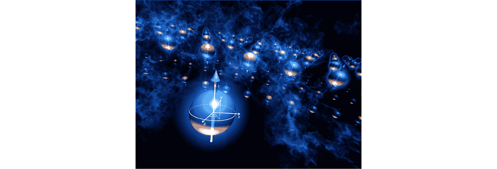

图 3.1 – 量子计算机的扩展 [作者]

经典计算和量子计算之间存在根本性的差异；经典计算是确定性的，由 1 和 0 组成，而量子计算是概率性的，并且有一个转折点。量子计算机使用概率振幅进行工作，这是量子力学的一个公设（见*第 2.2 节，公设 2 – 概率振幅*）。量子计算的概率振幅的行为与经典概率不同，因为这些值可以相互抵消，这被称为**破坏性干涉**。

破坏性干涉可以用降噪耳机来举例说明。具体来说，这是当两个或更多波相遇时，完全消除波的情况。换句话说，相遇的波相位相反且振幅相等。**建设性干涉**是指两个或更多波相遇，振幅以正方式相加。这两个特性对于以最高概率使计算机输出所需结果至关重要。

因此，干涉是量子计算核心所在，我们还使用了在*第 2.1 节，公设 1 – 波函数*中引入的波函数的概念，它被用来定义**量子比特**：信息量子。在量子计算行业中，**状态矢量**通常用作波函数的术语。

这两种计算方法之间的另一个区别是，在量子计算中，当我们添加一个额外的信息单位时，计算空间的大小翻倍。从理论上讲，这允许我们以指数级加速。

量子计算还使用叠加性质直到测量时刻来实现并行性。回想一下我们在*第 2.3 节，公设 3 – 可测量的量和算子*中讨论的叠加。量子算法需要重复乘以多次以获得测量的概率分布。

量子计算机的扩展为模拟化学系统铺平了道路，这可以使研究人员能够以比在实验室进行物理实验快得多的速度进行虚拟实验和发现新的分子。在构建可扩展量子计算机的同时，研究将费米子状态和算子最优映射到量子比特状态和量子门是利用近期量子计算机潜力的关键。

我们给出了一种此类映射的关键组件的示例，即一种以概率方式创建排列对称或排列非对称状态的量子电路。

在本章中，我们将涵盖以下主题：

+   *第 3.1 节，量子比特、纠缠、玻色球、泡利矩阵*

+   *第 3.2 节，量子门*

+   *第 3.3 节，计算驱动的干涉*

+   *第 3.4 节，准备对称或非对称排列状态*

# 技术要求

可以从 GitHub（[`github.com/PacktPublishing/Quantum-Chemistry-and-Computing-for-the-Curious`](https://github.com/PacktPublishing/Quantum-Chemistry-and-Computing-for-the-Curious)）下载本章的配套 Jupyter 笔记本，该笔记本已在 Google Colab 环境中测试过，这是一个免费的环境，完全运行在云端，并在 IBM Quantum Lab 环境中。请参阅 *附录 B* *– 在云端利用 Jupyter 笔记本* 获取更多信息。配套的 Jupyter 笔记本会自动安装以下列表中的库：

+   **数值 Python**（**NumPy**）[NumPy]，一个开源的 Python 库，在科学和工程领域的几乎所有领域都得到应用

+   Qiskit [Qiskit]，一个开源的 SDK，用于在脉冲、电路和应用模块级别与量子计算机交互

+   Qiskit 可视化支持，用于启用可视化和 Jupyter 笔记本

+   **Python 量子工具箱**（**QuTiP**）[QuTiP]，它被设计成一个通用的框架，用于解决量子力学问题，如由低能级量子系统和谐振子组成的系统

我们建议使用以下在线图形工具：

+   IBM Quantum Composer，这是一个图形量子编程工具，允许你拖放操作来构建量子电路并在真实的量子硬件或模拟器上运行它们 [IBM_comp1] [IBM_comp2]

+   理解玻色球，一个基于网络的程序，它显示玻色球并显示门的作用作为旋转 [Grok]

## 安装 NumPy、Qiskit、QuTiP 并导入各种模块

使用以下命令安装 NumPy：

```py
pip install numpy
```

使用以下命令安装 Qiskit：

```py
pip install qiskit
```

使用以下命令安装 Qiskit 可视化支持：

```py
pip install 'qiskit[visualization]'
```

使用以下命令安装 QuTiP：

```py
pip install qutip
```

使用以下命令导入 NumPy：

```py
import numpy as np
```

导入所需的函数和类方法。`array_to_latex function()` 返回一个具有 1 或 2 维的复数数组的 LaTeX 表示形式：

```py
from qiskit.visualization import array_to_latex, plot_bloch_vector, plot_bloch_multivector, plot_state_qsphere, plot_state_city
from qiskit import QuantumRegister, ClassicalRegister, QuantumCircuit, transpile
from qiskit import execute, Aer
import qiskit.quantum_info as qi
from qiskit.extensions import Initialize
from qiskit.providers.aer import extensions  # import aer snapshot instructions
```

使用以下命令导入数学库：

```py
import cmath
import math
```

使用以下命令导入 QuTiP：

```py
import qutip
```

# 3.1\. 量子比特、纠缠、玻色球、泡利矩阵

本节中介绍的概念是量子力学五条公设的特定应用，这些公设已在 *第二章**，量子力学的公设* 中介绍。

在本节中，我们将详细描述以下内容：

+   *第 3.1.1 节，量子比特*

+   *第 3.1.2 节，量子比特的张量排序*

+   *第 3.1.3 节，量子纠缠*

+   *第 3.1.4 节，玻色球*

+   *第 3.1.5 节，显示与状态向量对应的玻色矢量*

+   *第 3.1.6 节，泡利矩阵*

## 3.1.1\. 量子比特

在本节中，我们描述了量子计算当前的设置以及量子比特的定义。量子比特是表示二维希尔伯特空间中二能级量子系统的信息单位，它存在于二维希尔伯特空间中 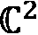。量子空间的基向量表示为 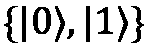，被称为计算基态：

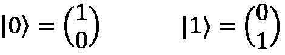

一个一般的单量子比特状态由计算基的叠加描述：


其中  和 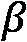 是线性展开系数，它们满足：

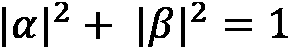

尽管量子比特在算法过程中处于量子叠加态，但当它在计算基下被测量时，它将被发现处于状态 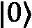 或状态 ，而不是叠加态。这些测量结果发生的概率分别为 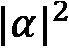 和 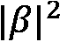。如果系统中存在 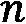 个量子比特，状态由一个向量在 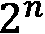 维希尔伯特空间 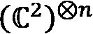 中描述，该希尔伯特空间是通过将各个量子比特的希尔伯特空间进行张量积得到的。对于 10 个量子比特，状态由一个在 1,024 维希尔伯特空间中的向量描述。

## 3.1.2\. 量子比特的张量排序

物理学界通常将  个量子比特的张量积按照 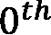 个量子比特位于张量积最左侧的顺序排列：

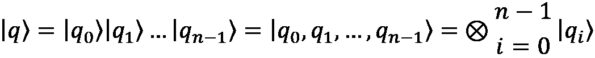

其中 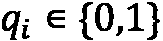。然而，Qiskit 使用一种排序方式，其中 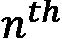 个量子比特排在顺序的第一位，而  个量子比特排在最后：

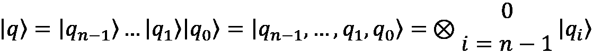

换句话说，如果量子比特 0 处于状态 ，量子比特 1 处于状态 ，量子比特 2 处于状态 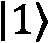，许多物理学教材会表示为 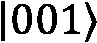，而 Qiskit 会表示为 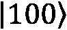。这种差异影响了多量子比特操作作为矩阵的表示方式，因此请留意，我们在书中使用 Qiskit。

## 3.1.3\. 量子纠缠

当一个量子系统的量子状态不能作为其组成部分状态的张量积来分解时，该量子系统是纠缠的。状态可以分为单粒子状态的乘积或 **纠缠**：

+   乘积状态可以分解为较少量子比特的张量积，例如：

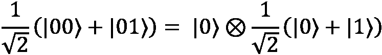

+   纠缠态不能分解为状态的张量积。例如，贝尔态 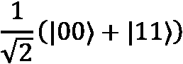 是纠缠的，只能测量为状态 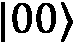 或状态 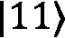，每个状态的测量概率为 1/2。

## 3.1.4\. 毕奥-萨伐尔球

Bloch 球描述了空间中的量子比特，是 *第 2.1 节，公设 1 – 波函数* 中提出的坐标系统（*图 3.2*）的特例。量子比特的 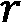 向量，或其长度，总是等于 1，因此 Bloch 球的坐标为：

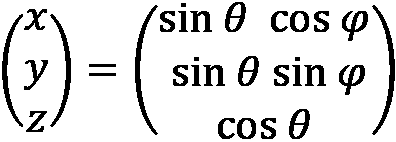

让我们关注 *第 3.1.1 节，量子比特* 中提出的单个量子比特的通用归一化纯态：

+   当 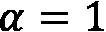 和 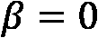 时，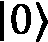 状态在 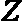 方向上是“向上”的。

+   当 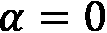 和 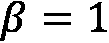 时， 状态在  方向上是“向下”的。


图 3.2 – Bloch 球 [作者]

我们在 *第 2.1.2 节，使用克莱布施-戈尔丹系数求动量之和，例如：耦合自旋和角动量（**）* 中推导了量子比特的广义公式：


然而，由量子计算行业建立并作为惯例，我们对在 Bloch 球上定义的量子比特的角度 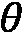 和  进行了变量替换，以下适用：

+   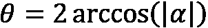 在 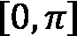 中，它变为 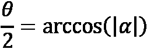 在 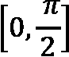 中（请注意，正数的反余弦是一个第一象限角度）

+   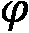 是 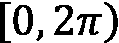 中的相对相位，忽略了全局相位 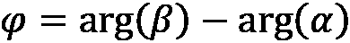

这种变量替换导致量子比特在 Bloch 球上的状态向量（或波函数）的以下形式：

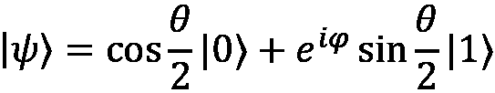

其中，我们将自旋向上和自旋向下的函数分别替换为状态向量 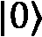 和 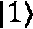。从化学的角度来看，请注意，量子比特状态 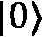 表示自旋向上的角动量量子数 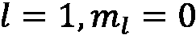，因此没有在 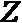 轴上的角动量投影。此外，量子比特状态 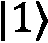 表示自旋向下的角动量量子数 ，并且在该 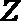 轴上有角动量投影。当我们介绍 *第 3.1.6 节，泡利矩阵* 中的泡利矩阵时，这一点很重要，因为我们将看到当应用操作时化学信息是如何被修改的。

在布洛赫球上，角度是希尔伯特空间中的两倍。例如， 和 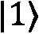 在希尔伯特空间中是正交的，在布洛赫球上的角度是 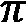。此外，我们想指出， 决定了测量  和  状态的概率，如下所示：

+    使得 

+    使得 

我们展示了布洛赫球上不同方向上的布洛赫向量，我们称之为极点态，如图 3.3 所示的表格所示：


图 3.3 – 计算基中的极点态及其在布洛赫球上的表示

## 3.1.5\. 显示与状态向量对应的布洛赫向量

在以下代码中，`check` 函数对一个给定的复向量  进行合理性检查，以确保它是一个状态向量：

```py
_EPS = 1e-10 # Global variable used to chop small numbers to zero
def check(s):
  num_qubits = math.log2(len(s))
  # Check if param is a power of 2
  if num_qubits == 0 or not num_qubits.is_integer():
      raise Exception("Input complex vector length is not a positive power of 2.")
  num_qubits = int(num_qubits)
  if num_qubits > 1:
      raise Exception("Only one complex vector is allowed as input.")
  # Check if probabilities (amplitudes squared) sum to 1
  if not math.isclose(sum(np.absolute(s) ** 2), 1.0, abs_tol=_EPS):
      raise Exception("Norm of complex vector does not equal one.")
  return
```

接下来，`ToBloch()` 函数计算给定状态向量（复向量）的布洛赫向量，并以 LaTeX 格式显示角度和在布洛赫球上的向量。它有两个输入参数：

+   `s`：一个状态向量，一个复向量 。

+   `show`：设置为 `True` 以显示角度和布洛赫球上的向量。

它有三个输出参数：

+   `theta`： 在  中是布洛赫球上的角度。

+   `phi`： 在  中是相对相位，忽略全局相位。

+   `r`：这是布洛赫球上的向量。

```py
def ToBloch(s, show=True):
  check(s)
  phi = cmath.phase(s[1]) - cmath.phase(s[0])
  theta = 2*math.acos(abs(s[0]))
  r1 = math.sin(theta)*math.cos(phi)
  r2 = math.sin(theta)*math.sin(phi)
  r3 = math.cos(theta)
  r = (r1,r2,r3)
  if show:
    display(array_to_latex(s, prefix="\\text{s} = ", precision = 2))
    display(array_to_latex([theta, phi], prefix="\\text{theta, phi} = ", precision = 2))
    display(array_to_latex(r, prefix="\\text{r} = ", precision = 2))
    b = qutip.Bloch()
    b.add_vectors(r)
    display(b.render())
  return theta, phi, r
```

以下代码显示了与状态向量  对应的布洛赫向量：

```py
s = [1/math.sqrt(2),complex(0.5, 0.5)]
(theta, phi, r) = ToBloch(s)
```

这里是使用 `QuTiP Bloch()` 函数显示布洛赫球的结果：


图 3.4 – 在布洛赫球上显示向量

最后，`ToS` 函数计算布洛赫向量的状态向量。它有三个输入参数：

+   `theta`： 在  中是布洛赫球上的角度。

+   `phi`： 在  中是相对相位，忽略全局相位。

+   `show`：设置为 `True` 以显示输入角度和状态向量。

它有一个输出参数：

+   `s`：一个状态向量，一个复向量 

```py
def ToS(theta, phi, show=True):
  s = [math.cos(theta/2), complex(math.cos(phi) * math.sin(theta/2), math.sin(phi) * math.sin(theta/2))]
  if show:
    display(array_to_latex([theta, phi], prefix="\\text{theta, phi} = ", precision = 2))
    display(array_to_latex(s, prefix="\\text{s} = ", precision = 1))
  return s
```

在这里，我们计算具有  和  的布洛赫向量的复振幅：

```py
s = ToS(np.pi/2, np.pi/4)
```

这里是结果：


## 3.1.6\. 泡利矩阵

有三个泡利矩阵， ，，和 ：

，，

这些矩阵都是厄米矩阵和幺正矩阵，使得每个矩阵的平方等于  单位矩阵：


每个泡利矩阵都等于其逆矩阵：


我们在 *图 3.5* 中总结了泡利矩阵以及产生相关特征向量的量子比特操作：


图 3.5 – 泡利矩阵及其相关特征向量

在 *图 3.6* 中，我们在最左侧显示  量子比特状态，该状态在 -轴上没有角动量投影，如 Bloch 球体下的暗圈所示。在中间，我们显示  量子比特状态，该状态在 -轴上有角动量投影，如 Bloch 球体下的浅灰色圆圈所示。回想一下，我们在 *3.1.4 节，Bloch 球体* 中讨论了  和  量子比特状态的角动量投影。在最右侧，我们指示对  量子比特状态进行的  操作，该操作通过  修改了角动量投影。


图 3.6 – 在基态  和  上对泡利 Z 操作的说明，使用 Grok the Bloch 球体

 操作对角动量投影没有影响，而  操作通过  修改了角动量投影。

### 在符号基  中的测量

让我们在符号基  中测量一个状态，该基也被称为根据泡利矩阵  进行的测量。为了进行这种测量，我们将基从符号基  转换为标准基 ，其中：


这允许我们重新写出状态：


测量的可能结果及其对应概率和新状态列在 *图 3.7* 中：


图 3.7 – 在符号基  中的测量

根据泡利  操作测量状态  的期望值是：


这意味着我们需要通过取复共轭转置来计算符号基中的正交归一矢量：


我们还需要将泡利操作从标准基转换为符号基：


回想一下，一个基矢量乘以一个共轭基矢量，正如之前所见（ 和 ），是一个外积，它产生一个矩阵，而一个共轭基矢量乘以一个基矢量是一个标量。因此，我们得到期望值的计算如下：


请记住，在一般情况下， 和  是复数，虚部可能为零。期望值是所有可能结果（1 和-1）的测量值的总和，这些结果是对一个在符号基下测量的状态  的概率加权。

### 将矩阵分解为泡利矩阵张量积的加权之和

可以证明任何矩阵都可以分解为单位矩阵和泡利矩阵  的张量积的加权之和，其中  的权重为  和  个量子比特：


对于厄米矩阵，所有权重  都是实数。

我们为任何 2x2 矩阵， 提供一个证明：


由于 ，因此 ，我们有：


从将 2x2 矩阵分解为外积之和开始：


我们可以进一步写出：


# 3.2. 量子门

量子门是作用于一个、两个或三个量子比特的幺正算子 ()。当作用于量子态时，范数得到保持。量子门对量子态的作用对应于表示该门的矩阵与表示量子态的向量的乘积：。

在本节中，用张量积表示  个量子比特，第一个量子比特位于张量积的最左侧： 其中 。请注意，除非特别指定，我们不会使用 Qiskit 量子比特的张量排序。

在本节中，我们涵盖了以下内容：

+   *第 3.2.1 节，单量子比特量子门*

+   *第 3.2.2 节，双量子比特量子门*

+   *第 3.2.3 节，三量子比特量子门*

+   *第 3.2.4 节，串行连接门和并行量子门*

+   *第 3.2.5 节，贝尔态的生成*

+   *第 3.2.6 节，并行哈达玛门*

## 3.2.1. 单量子比特量子门

单量子比特门  有一个  的幺正矩阵形式：。

在本节中，我们详细描述以下内容：

+    门

+   哈达玛 () 门

+   广义单量子比特量子门

我们总结了常用量子门并提供了一些有用关系。

###  门

一个  门将  映射到  和  映射到 。它是经典计算机中 NOT 门的量子等价物，有时被称为位翻转。对于经典计算，NOT 门将 0 变为 1，将 1 变为 0。 门相当于在布洛赫球的 X 轴上旋转π弧度。


### 霍尔丹 () 门

Hadamard 门将基态  映射到 ，也写作 ，以及  映射到 ，也写作 。它表示在  和  轴中间（45 角度）的轴上旋转π。对状态  或状态  的测量将具有 0 或 1 的等概率，从而产生状态的叠加。


将应用于寄存器中 0 比特 () 的 Hadamard 门写成如下形式是方便的： 其中 。请注意，Hadamard 门 () 与哈密顿算子 () 具有类似的符号；区别在于帽子 () 符号。

### 通用单量子比特量子门

所有单量子比特门都可以从以下矩阵  中获得，该矩阵通过适当选择参数  ，其中  ，  ，  [Qiskit_Op] 描述了所有单位矩阵，直到全局相因子。


门  具有如下矩阵形式：


门  具有如下矩阵形式：


### 单量子比特量子门总结及有用关系

*图 3.8* 展示了单量子比特量子门的主要列表：


图 3.8 – 单量子比特量子门

旋转算子门 、 和  分别在布洛赫球的 、 和  轴上执行旋转：


我们想指出，![公式 _03_321.png] 门可以通过使用 Hadamard 门和![公式 _03_322.png]门的组合来获得：![公式 _03_323.png]。反之亦然：![公式 _03_324.png]。这意味着在测量之前应用![公式 _03_326.png]门时，我们可以将状态投影到 Bloch 球的![公式 _03_315.png]-轴上。同样，当首先应用![公式 _03_328.png]门，然后应用![公式 _03_326.png]门时，可以投影到![公式 _03_316.png]-轴上。这样，我们可以执行量子比特全息术（即通过![公式 _03_330.png]，![公式 _03_316.png]，和![公式 _03_332.png]测量来重建 Bloch 矢量）。这些门操作总结在 *图 3.9* 中：


图 3.9 – 关系 ![公式 _03_333.png], ![公式 _03_334.png]

## 3.2.2. 二量子比特量子门

一个二量子比特门 ![公式 _03_335.png] 是一个 ![公式 _03_336.png] 单位矩阵 ![公式 _03_337.png]，作用于两个量子比特。

我们在 *图 3.10* 中总结了常用的二量子比特量子门。


图 3.10 – 二量子比特量子门

## 3.2.3. 三量子比特量子门

一个三量子比特门 U 是一个 ![公式 _03_364.png] 单位矩阵 ![公式 _03_365.png]，作用于三个量子比特。我们总结了常用的三量子比特量子门在 *图 3.11* 中：


图 3.11 – 三量子比特量子门

## 3.2.4. 串联连接的量子门和并行量子门

量子门上的操作是从左到右依次应用的，并且没有循环。串联的两个门 ![公式 _03_335.png] 和 ![公式 _03_384.png] 等价于两个门的矩阵乘积，如图 *图 3.12* 所示：


图 3.12 – 串联量子门

并联的两个门 ![公式 _03_391.png] 和 ![公式 _03_392.png] 等价于两个门的张量积 ![公式 _03_393.png]，如图 *图 3.13* 所示：


图 3.13 – 并行量子门

## 3.2.5. 生成贝尔态

贝尔态是最大纠缠的纯量子态，共有四个：

![公式 _03_409.jpg] ![公式 _03_410.jpg] ![公式 _03_411.jpg] ![公式 _03_412.jpg]

量子电路是一系列有序的指令、量子门、测量和重置，应用于量子比特寄存器，并且可能基于实时经典计算进行条件化。现在，几个量子硬件平台支持动态量子电路，这允许在电路中测量结果的同时进行并发经典处理 [Corcoles] [IBM_mid]。在*第 3.4 节，准备对称或反对称态*中，我们展示了一个经典程序，该程序旨在通过后选择控制量子比特测量的结果来获得所需的量子态。量子电路中没有循环，但我们可以有一个经典循环，它附加一个量子子电路。在 Qiskit 中，我们使用`QuantumRegister`类来创建量子比特寄存器，使用`QuantumCircuit`类来创建量子电路。

让我们使用 Qiskit 构建一个创建第一个贝尔态 ![img/Formula_03_413.png] 的量子电路：

```py
q = QuantumRegister(2)
qc = QuantumCircuit(q)
qc.h(q[0])
qc.cx(q[0], q[1])
qc.draw(output='mpl')
```

*图 3.14* 展示了结果：


图 3.14 – 创建贝尔态的 Qiskit 量子电路

我们使用`quantum_info`模块中的`Statevector.from_instruction()`类方法来获取最终状态向量 ![img/Formula_03_414.png]：

```py
s = qi.Statevector.from_instruction(qc)
s.draw('latex', prefix='|s \\rangle = ')
```

*图 3.15* 展示了结果：


图 3.15 – 最终状态向量 – 贝尔态

最终状态向量只能在状态 ![img/Formula_03_415.png] 或 ![img/Formula_03_416.png] 中测量，每个状态的概率为 1/2。

我们使用`DensityMatrix.from_instruction()`类方法来获取最终状态向量的密度矩阵表示：

```py
rho = qi.DensityMatrix.from_instruction(qc)
rho.draw('latex', prefix='\\rho = ')
```

*图 3.16* 展示了结果：


图 3.16 – 密度矩阵 – 贝尔态

我们可以使用状态的城市景观图来可视化密度矩阵：

```py
from qiskit.visualization import plot_state_city
plot_state_city(rho.data, title='Density Matrix')
```

*图 3.17* 展示了结果：


图 3.17 – 城市景观图 – 贝尔态

## 3.2.6\. 并行 Hadamard 门

可以证明，将并行 Hadamard 门应用于初始化为零状态的量子比特寄存器，将其置于所有可能状态的均匀叠加中。让我们通过应用一个、两个和三个 Hadamard 门来实验其效果。在本节中，我们将构建以下内容：

+   一个 Hadamard 门

+   两个并行的 Hadamard 门

+   三个并行的 Hadamard 门

`create_parallel_H()` 函数创建一个包含 n 个并行 Hadamard 门的量子电路：

```py
def create_parallel_H(n):
    q = QuantumRegister(n, 'q')
    qc = QuantumCircuit(q)
    for k in range(n):
        qc.h(k)
    return qc
```

`run_parallel_H()` 函数创建并执行一个包含 n 个并行 Hadamard 门的量子电路，并显示最终状态向量的图：

```py
def run_parallel_H(n):
  qc = create_parallel_H(n)
  s = qi.Statevector.from_instruction(qc)
  display(s.draw('latex'))
  display(qc.draw(output='mpl'))
  return
```

让我们创建一个只有一个 Hadamard 门的量子电路：

```py
run_parallel_H(1)
```

*图 3.18* 展示了结果：


图 3.18 – 一个 Hadamard 门

接下来，我们构建一个包含两个并行 Hadamard 门的量子电路：

```py
run_parallel_H(2)
```

*图 3.19* 展示了结果：


图 3.19 – 两个并行的 Hadamard 门

最后，让我们构建一个包含三个并行 Hadamard 门的电路：

```py
run_parallel_H(3)
```

*图 3.20* 展示了结果：


图 3.20 – 三个并行 Hadamard 门

# 3.3. 计算驱动的干涉

在本节中，我们介绍了*第 3.3.1 节，量子计算过程*中通用量子计算的过程。然后我们在*第 3.3.2 节，模拟左旋和右旋对映异构体状态量子叠加的干涉测量*中给出了一个受化学实验启发的模拟示例。在化学中，互为镜像的分子或离子被称为对映异构体或光学异构体。如果这些镜像不可叠加，它们被称为手性分子[ChemChiral]，并且它们在旋转平面偏振光的能力上有所不同[Wonders]。研究人员提出了一种实验，以制备对映异构体的左旋和右旋状态的量子叠加，并执行基于手性依赖力的干涉测量[Stickler]。

## 3.3.1. 量子计算过程

量子计算使用干涉以及叠加和纠缠等量子物理现象。典型的量子计算包括以下步骤：

1.  准备所有可能基态的均匀叠加。将一个初始化为零态的量子比特寄存器置于所有可能基态的均匀叠加状态，只需应用并行 Hadamard 门，正如我们之前所展示的那样。

1.  协调量子干涉和纠缠。一个量子算法应该被设计成，在计算结束时，只有那些感兴趣的量子状态的相对幅度和相位将保留。

1.  多次重复测量。为了获得可能的测量结果的分布，测量需要重复数百或数千次。这是量子计算与经典计算之间的关键区别。

## 3.3.2. 模拟左旋和右旋对映异构体状态量子叠加的干涉测量

让我们使用 Qiskit 设计一个受对映异构体干涉仪启发的量子电路。我们用两个量子比特表示一个单一的对映异构体。我们在传播方向量子比特中将水平传播编码为状态，将垂直传播编码为状态。我们用 Pauli矩阵模拟镜子，用矩阵模拟分束器()：


按照惯例，反射被分配一个的相移。从先前的单位矩阵中，我们创建了一个名为 BS 的分束器门，其 Qiskit 代码如下：

```py
from qiskit.extensions import UnitaryGate
i = complex(0.0, 1.0)
BS = 1/np.sqrt(2) * np.array([[1,i],[i,1]])
BS = UnitaryGate(BS,'Beam Splitter')
```

我们在以下方面对手性量子比特进行编码：

+   左旋态作为态

+   右旋态作为态

+   通过应用 Hadamard 门获得的左右手态叠加 

我们模拟了一个偏振分束器 ()：


该矩阵 PBS [Rioux] 传输左手态并反射右手态。与分束器不同，反射时没有相位变化。从前面的单位矩阵中，我们创建了一个名为 PBS 的偏振分束器门，以下是用 Qiskit 代码实现的：

```py
PBS = np.array([[1,0,0,0],[0,0,0,1],[0,0,1,0],[0,1,0,0]])
PBS = UnitaryGate(PBS,'PBS')
```

我们定义了一个`show()`函数，它使用 LaTeX 显示量子电路的绘制和状态向量的状态，如下所示：

```py
def show(qc):
  display(qc.draw(output='mpl'))
  s = qi.Statevector.from_instruction(qc)
  display(array_to_latex(s, prefix="\\text{state vector} = ", precision = 2))
  return
```

我们使用以下 Qiskit 代码模拟偏振分束器对一个水平移动且处于右手状态的异构体的作用：

```py
q = QuantumRegister(2, 'q') # register of 2 qubits
# q[0] handedness qubit,|0⟩ left-handed,|1⟩ right-handed
# q[1] direction of propagation qubit,|0⟩ horizontal,|1⟩ vertical
qc = QuantumCircuit(q)
qc.x([0]) # Right-handed
show(qc)
qc.append(PBS, q)
show(qc)
```

*图 3.21* 展示了结果：


图 3.21 – 右手态异构体与偏振分束器相互作用的模拟

水平移动且处于右手状态的异构体，由  表示，使用 Qiskit 的量子比特张量排序，其传播方向上的垂直方向已被偏振分束器反射，由  表示。

我们使用以下 Qiskit 代码模拟偏振分束器对一个水平移动且处于左右手态叠加的异构体的作用：

```py
q = QuantumRegister(2, 'q') # register of 2 qubits
# q[0] handedness qubit,|0⟩ left-handed, |1⟩ right-handed
# q[1] direction of propagation qubit, |0⟩ horizontal, |1⟩ vertical
qc = QuantumCircuit(q)
qc.h(q[0]) # Put enantiomer in a superposition of left- and right-handed states
show(qc)
qc.append(PBS, q)
show(qc)
```

*图 3.22* 展示了结果：


图 3.22 – 左右手态异构体与偏振分束器相互作用的模拟

水平移动且处于左右手态叠加的异构体，由  表示，使用 Qiskit 的量子比特张量排序，被偏振分束器置于贝尔态 ，即左右手态水平移动和右手态垂直移动的叠加，从而实现干涉测量。

现在我们继续准备排列对称和反对称态。

# 3.4.1 准备一个对称或反对称的态

给定两个量子比特  和  ，我们希望构建一个在量子比特  和  的排列下保持不变的对称态，或者一个在量子比特  和  的排列下乘以  的反对称态。在本节中，我们展示了如何使用 Qiskit 准备和模拟的量子电路以概率方式准备此类状态：

+   *3.4.1 节，创建随机状态*

+   *3.4.2 节，创建量子电路和初始化量子比特*

+   *3.4.3 节，使用受控交换门交换两个量子比特的电路*

+   *3.4.4 节，后选择控制量子比特直到获得所需状态*

+   *第 3.4.5 节，最终对称化和反对称化状态的示例*

## 3.4.1. 创建随机状态

我们定义了一个名为`init_random()`的函数，它创建随机 1 量子比特状态`s1`和`s2`，我们将使用这些状态进行后续的随机状态实验：

```py
def init_random():
  # Create random 1-qubit state s1
  s1 = qi.random_statevector(2)
  display(array_to_latex(s1, prefix="\\text{State 1} =", precision=2))
  # Create random 1-qubit state s2
  s2 = qi.random_statevector(2)
  display(array_to_latex(s2, prefix="\\text{State 2} =", precision =2))

  return s1, s2
```

## 3.4.2. 创建量子电路和初始化量子比特

我们定义了`setup_qc()`函数，它设置初始化指令以从输入的状态向量`s1`和`s2`创建量子比特和，以及一个带有控制量子比特初始化在状态、量子比特和和一个用于测量的经典寄存器`c`的量子电路`qc`：

```py
def setup_qc(s1, s2, draw=False):
  init_q1 = Initialize(s1)
  init_q1.label = "init_q1"
  init_q2 = Initialize(s2)
  init_q2.label = "init_q2"
  q = QuantumRegister(3, 'q') # register of 3 qubits
  c = ClassicalRegister(1, name="c") # and 1 classical register
  qc = QuantumCircuit(q,c)
  qc.append(init_q1, [1])
  qc.append(init_q2, [2])
  qc.barrier()
  if draw:
    display(qc.draw(output='mpl'))
  return qc, q, c
```

## 3.4.3. 创建一个使用受控交换门交换两个量子比特的电路

我们定义了`swapper()`函数，它创建一个量子电路如下[Spheres]：

+   对控制量子比特应用 Hadamard 门，将其置于状态

+   应用一个受控交换门，将两个量子比特和置于交换和不交换的叠加态

+   再次对控制量子比特应用 Hadamard 门

这里是其实施方法：

```py
def swapper(draw=False):
  q = QuantumRegister(3, 'q') # register of 3 qubits
  qc = QuantumCircuit(q, name='Swapper')
  qc.h(q[0])
  qc.cswap(q[0], q[1], q[2])
  qc.h(q[0])
  if draw:
    print("Swapper circuit")
    display(qc.draw(output='mpl'))
  return qc
```

让我们使用单元算符模拟器获取对应于交换量子电路的单元矩阵：

```py
q = QuantumRegister(3, 'q') # register of 3 qubits
qc = QuantumCircuit(q)
qc.append(swapper(draw=True), qargs=q)
# Selecting the unitary_simulator
backend = Aer.get_backend('unitary_simulator')
# Executing the job and getting the result as an object
job = execute(qc, backend)
result = job.result()
# Getting the unitary matrix from the result object
U = result.get_unitary(qc, decimals=2)
array_to_latex(U, prefix="\\text{swapper unitary} = ", precision = 2)
```

*图 3.23*显示了结果：


图 3.23 – 交换电路的单元矩阵

### 计算交换单元算符的作用

与两个量子比特和相关的初始状态向量可以写成以下形式：


交换单元算符对初始状态向量作用如下，使用张量积的 Qiskit 排序：


### 当控制量子比特在状态下被测量时，计算最终状态

如果控制量子比特在状态下被测量，则通过丢弃所有不贡献于此结果的振幅、、和，然后重新归一化来计算最终状态：


回想一下，、、 和  是我们在 *3.2.5 节，贝尔态的生成* 中引入的贝尔态。 和  的振幅  在最终状态中的归一化因子下保持不变。对称化的贝尔态  保持不变。 和  的振幅  在贝尔态  中混合，该态是对称化的。

### 当控制量子比特  测量在状态  时计算最终状态

如果控制量子比特  测量在状态  中，则通过丢弃所有不贡献于此结果振幅 、、 和 ，然后重新归一化来计算最终状态：


最终状态中唯一的非零振幅是位于  和  子空间中的振幅，这些振幅在贝尔态  中混合，该态是反对称化的。

这些对称性和反对称性的特性是高效实现 **变分量子本征求解器** (**VQE**) 算法 [Gard] 的关键，我们将在 *第六章**，变分量子本征求解器算法* 中介绍。

## 3.4.4. 选择控制量子比特，直到获得所需状态

我们定义了 `post_select()` 函数，该函数执行一个循环，执行交换电路并测量控制量子比特  的状态，直到获得所需的对称化或反对称化状态，或者达到最大迭代次数：

+   添加由 `swapper()` 函数创建的电路。

+   测量控制量子比特 。如果我们得到 0，那么量子比特  和  处于对称化状态，如果我们得到 1，那么量子比特  和  处于反对称化状态。

然后，`post_select()` 调用 `proc_result()` 函数来处理结果。

`post_select()` 函数有以下输入参数：

+   `simulator`，默认为 `statevector_simulator`，模拟完美的量子比特。

+   `symm:` 设置为 `True` 以获得对称化状态，设置为 `False` 以获得反对称化状态。

+   `shots` 是射击次数，默认设置为 `1`。

+   `max_iter` 是最大迭代次数，默认设置为 `20`。

+   `swap_test` 设置为 `True` 以执行交换测试，以确定最终状态是否为置换对称或置换反对称，默认设置为 `False`。

这里是代码：

```py
def post_select(qc, q, c, symm=True, simulator='statevector_simulator', shots=1, max_iter=20, swap_test=False):
  backend = Aer.get_backend(simulator)
  s = qi.Statevector.from_instruction(qc)
  display(array_to_latex(s, prefix="\\text{Initial state} = ", precision = 2))
  done = False
  iter = 0
  while not done and iter < max_iter:
    qc.append(swapper(draw=(iter==0)), qargs=q)
    qc.measure(q[0], c[0]) # Measure control qubit q[0]
    qc.save_statevector(label=str(iter)) # Save the current simulator state vector
    job = execute(qc, backend, shots=shots) # Execute the Simulator
    result = job.result()
    counts = result.get_counts(qc)
    for k, v in counts.items():
      if symm and k == '0' and v > shots/2:
        done = True
      elif not symm and k == '1' and v > shots/2:
        done = True
    if not done:
      qc.reset(q[0])
      iter += 1
  success = proc_result(result, iter, counts, max_iter=max_iter, symm=symm, simulator=simulator, swap_test=swap_test)
  return result, success
```

`proc_result()` 函数处理结果，显示保存的状态向量，并调用 `factor()` 函数。如果输入参数 `swap_test` 设置为 `True`，则调用 `swap_check()` 函数，该函数测试最终状态是否为置换对称或置换反对称。

它返回 `Success`，一个布尔值；如果已获得所需状态，则为 `True`，否则为 `False`：

```py
def proc_result(result, iter, counts, max_iter=20, symm=True, simulator='statevector_simulator', swap_test=False):
  if symm:
    print("Preparing a permutation symmetric state")
  else:
    print("Preparing a permutation antisymmetric state")
  print("simulator:", simulator)
  print("counts: ", counts)
  if iter >= max_iter:
    print("Post selection unsuccessful iteration {}".format(iter))
    success = False
  else:
    print("Post selection successful iteration {}".format(iter))
    success = True
    s = result.data()[str(iter)]
    factor(s, symm) # Call factor()
    if swap_test:
      swap_check(qc, q, iter, symm, s, simulator=simulator)
    print(" ") # Display Density matrix of the final state
    display(array_to_latex(qi.DensityMatrix(s), prefix="\\text{Density matrix of the final state: }", precision = 2))
    display(plot_state_city(s, title='Cityscape plot of the final state')) # Display Cityscape plot of the final state
  return success
```

`sym_test()` 函数确定状态向量的两个振幅是否相等或相反，以及它们模平方之和是否等于 1：

```py
def sym_test(s, symm, i0, i1):
  if symm:
    b = np.isclose(np.abs(s[i0]-s[i1]), 0, rtol=_EPS) and np.isclose(np.abs(s[i0]**2 + s[i1]**2), 1, rtol=1e-4)
  else:
    b = np.isclose(np.abs(s[i0]+s[i1]), 0, rtol=_EPS) and np.isclose(np.abs(s[i0]**2 + s[i1]**2), 1, rtol=1e-4)
  return b
```

`factor()` 函数尝试将最终状态分解为控制量子比特  和置换对称贝尔态  或 ，或者置换反对称贝尔态  或  的张量积，这些状态在 *第 3.2.5 节，贝尔态的创建* 中介绍：

```py
def factor(s, symm):
  b0 = np.allclose(s, [1, 0, 0, 0, 0, 0, 0, 0], rtol=_EPS)
  b1 = np.allclose(s, [0, 0, 0, 0, 0, 0, 1, 0], rtol=_EPS)
  b2 = sym_test(s, symm, 2, 4)
  b3 = sym_test(s, symm, 3, 5)
  b4 = sym_test(s, symm, 0, 6)
  b5 = sym_test(s, symm, 1, 7)
  df = {b0: "|00", b1: "|11", b2: "|\\Psi_+", b3: "|\\Psi_-", b4: "|\\Phi_+", b5: "|\\Phi_-"}
  found = False
  for k, v in df.items():
    if not found and symm and k:
      display(array_to_latex([s], prefix = "\\text{Symmetrized state: }" + v + "\\rangle, \\text{  Final state: }" + v + " \\rangle |0 \\rangle =", precision = 2))
      found = True
    elif not found and not symm and k:
      display(array_to_latex([s], prefix = "\\text{Antisymmetrized state: }" + v + "\\rangle, \\text{  Final state: }" + v + " \\rangle |1 \\rangle =", precision = 2))
      found = True
  if not found:
    display(array_to_latex(s, prefix="\\text{Final state} = ", precision = 2))
  return
```

`swap_check()` 函数测试最终状态是否为置换对称或置换反对称。它调用 `swap()` 函数，然后比较交换前后的状态：

```py
def swap_check(qc, q, iter, symm, s, simulator='statevector_simulator'):
  s21 = swap(qc, q, iter, simulator=simulator)
  if symm:
    if np.allclose(s-s21, 0, rtol=_EPS):
      print("Swap test confirms that final state is permutation symmetric")
  else:
    if np.allclose(s+s21, 0, rtol=_EPS):
      print("Swap test confirms that final state is permutation asymmetric")
  return
```

`swap()` 函数执行量子比特  和  的交换，测量控制量子比特，并返回用于比较的最终状态向量：

```py
def swap(qc, q, iter, simulator='statevector_simulator'):
  backend = Aer.get_backend(simulator)
  qc.swap(q[1], q[2])
  qc.measure(q[0], c[0]) # Measure control qubit q[0]
  qc.save_statevector(label=str(iter+1)) # Save the current simulator state vector
  job = execute(qc, backend, shots=1) # Execute the Simulator
  result = job.result()
  s21 = result.data()[str(iter+1)]
  return s21
```

## 3.4.5. 最终对称化和反对称化状态的例子

我们现在实现五个实验，创建：

+   从状态  得到的对称化状态

+   从状态  得到的反对称化状态

+   从随机状态初始化的量子比特得到的对称化状态

+   从随机状态初始化的量子比特得到的反对称化状态

+   从贝尔态  得到的对称化状态

### 从状态  创建对称化状态的实验

我们在状态  和  中创建两个状态向量，将它们作为输入传递给 `setup_qc()` 函数，然后调用 `post_select()` 函数，将 `symm` 设置为 `True`：

```py
s1 = qi.Statevector([0, 1])
s2 = qi.Statevector([1, 0])
qc, q, c = setup_qc(s1, s2)
result, success = post_select(qc, q, c, symm=True)
```

我们已经获得了对称化状态  ，如图 *图 3.24* 所示：


图 3.24 – 从状态  获得的对称化状态

我们在 *图 3.25* 中使用最终状态的市景图显示密度矩阵：


图 3.25 – 从状态  获得的对称化状态的市景图

我们使用量子电路类的 `draw()` 方法显示量子电路：

```py
qc.draw(output='mpl', plot_barriers=False)
```

经过一次迭代后，量子电路看起来像 *图 3.26*：


图 3.26 – 经过一次迭代后的量子电路

### 从状态创建反对称态的实验

我们在状态和中创建两个状态向量，将它们作为输入传递给`setup_qc()`函数，然后调用`post_select()`函数，将`symm`设置为`False`：

```py
s1 = qi.Statevector([0, 1])
s2 = qi.Statevector([1, 0])
qc, q, c = setup_qc(s1, s2)
result, success = post_select(qc, q, c, symm=False)
```

我们已经获得了反对称态，如图 3.27 所示：


图 3.27 – 从状态获得的反对称态

我们在*图 3.28*中展示了最终状态的城市景观图来展示密度矩阵：


图 3.28 – 从状态获得的反对称态的城市景观图

### 从随机状态初始化的量子比特创建对称态的实验

我们使用`init_random()`创建两个在随机状态下的状态向量，将它们作为输入传递给`setup_qc()`函数，然后调用`post_select()`函数，将`symm`设置为`True`，将`swap_test`设置为`True`以确认最终状态确实是排列对称的。根据*第 3.4.3 节*的计算，我们期望最终状态有四个非零振幅：*构建一个使用受控交换门交换两个量子比特的电路，当控制量子比特*在状态*下测量时计算最终状态*：

```py
s1, s2 = init_random()
qc, q, c = setup_qc(s1, s2)
result, success = post_select(qc, q, c, symm=True, swap_test=True)
```

在*图 3.29*中，我们展示了最终状态具有四个非零振幅的结果，正如预期的那样，交换测试已确认最终状态是排列对称的：


图 3.29 – 从随机状态初始化的量子比特获得的对称态

在*图 3.30*中展示的最终状态的城市景观图中，我们看到状态在测量最终状态后具有最大的概率出现：


图 3.30 – 从随机状态初始化的量子比特获得的对称态的城市景观图

### 从随机状态初始化的量子比特创建反对称态的实验

我们使用`init_random()`创建两个在随机状态下的状态向量，将它们作为输入传递给`setup_qc()`函数，然后调用`post_select()`函数，将`symm`设置为`False`：

```py
s1, s2 = init_random()
qc, q, c = setup_qc(s1, s2)
result, success = post_select(qc, q, c, symm=False)
```

我们已经获得了反对称态，如图 3.31 所示：


图 3.31 – 从随机状态初始化的量子比特获得的反对称态

我们在*图 3.32*中展示了最终状态的城市景观图来展示密度矩阵：


图 3.32 – 从随机状态初始化的量子比特获得的反对称态的城市景观图

### 从贝尔态创建对称态的实验

我们定义了一个名为 `setup1_qc()` 的函数，该函数设置一个量子电路，将量子比特  和  置于贝尔态 ，如下所示：

```py
def setup1_qc(draw=False):
  q = QuantumRegister(3, 'q') # register of 3 qubits
  c = ClassicalRegister(1, name="c") # and 1 classical register
  qc = QuantumCircuit(q,c)
  qc.h(q[1])
  qc.cx(q[1], q[2])
  qc.barrier()
  if draw:
    display(qc.draw(output='mpl'))
  return qc, q, c
```

我们执行以下代码，该代码调用 `setup1_qc()` 创建贝尔态 ，然后调用 `post_select()` 函数，将 `symm` 设置为 `True`：

```py
qc, q, c = setup1_qc()
result, success = post_select(qc, q, c, symm=True)
```

如预期在 *第 3.4.3 节，创建一个使用受控交换门交换两个量子比特的电路* 中，紧随其后的交换电路对量子比特  在状态 0 的测量，不会改变对称化的贝尔态 ，如图 *图 3.33* 所示：


图 3.33 – 从贝尔态  获得的对称化状态

我们在 *图 3.34* 中展示了最终状态的城市景观图来表示密度矩阵：


图 3.34 – 从贝尔态  获得的最终状态的城市景观图

# 参考文献

[ChemChiral] 5.1 手性分子，Chemistry LibreTexts，2015 年 7 月 5 日，[`chem.libretexts.org/Bookshelves/Organic_Chemistry/Map%3A_Organic_Chemistry_(Vollhardt_and_Schore)/05._Stereoisomers/5.1%3A_Chiral__Molecules`](https://chem.libretexts.org/Bookshelves/Organic_Chemistry/Map%3A_Organic_Chemistry_(Vollhardt_and_Schore)/05._Stereoisomers/5.1%3A_Chiral__Molecules)

[Corcoles] A. D. Córcoles，Maika Takita，Ken Inoue，Scott Lekuch，Zlatko K. Minev，Jerry M. Chow，和 Jay M. Gambetta，在超导量子比特量子算法中利用动态量子电路，物理评论快报 127，100501，2021 年 8 月 31 日，[`journals.aps.org/prl/abstract/10.1103/PhysRevLett.127.100501`](https://journals.aps.org/prl/abstract/10.1103/PhysRevLett.127.100501)

[Crockett] Christopher Crockett，手性分子的叠加，2021 年 9 月 14 日，物理 14，s108，[`physics.aps.org/articles/v14/s108`](https://physics.aps.org/articles/v14/s108)

[Gard] Gard, B.T., Zhu, L., Barron, G.S. 等人，高效保持对称性的变分量子本征求解算法状态制备电路，npj 量子信息 6, 10 (2020)，[`doi.org/10.1038/s41534-019-0240-1`](https://doi.org/10.1038/s41534-019-0240-1)

[Grok] 理解布洛赫球，[`javafxpert.github.io/grok-bloch/`](https://javafxpert.github.io/grok-bloch/)

[IBM_CEO] IBM 首席执行官：本十年量子计算将“像火箭一样”起飞，Fast Company，2021 年 9 月 28 日，[`www.fastcompany.com/90680174/ibm-ceo-quantum-computing-will-take-off-like-a-rocket-ship-this-decade`](https://www.fastcompany.com/90680174/ibm-ceo-quantum-computing-will-take-off-like-a-rocket-ship-this-decade)

[IBM_comp1] 欢迎来到 IBM 量子作曲家，[`quantum-computing.ibm.com/composer/docs/iqx/`](https://quantum-computing.ibm.com/composer/docs/iqx/)

[IBM_comp2] IBM 量子作曲家，[`quantum-computing.ibm.com/composer/files/new`](https://quantum-computing.ibm.com/composer/files/new)

[IBM_mid] 中断电路测量教程，IBM 量子系统，[`quantum-computing.ibm.com/lab/docs/iql/manage/systems/midcircuit-measurement/`](https://quantum-computing.ibm.com/lab/docs/iql/manage/systems/midcircuit-measurement/)

[NumPy] NumPy：初学者的绝对基础，[`numpy.org/doc/stable/user/absolute_beginners.html`](https://numpy.org/doc/stable/user/absolute_beginners.html)

[Qiskit] Qiskit，[`qiskit.org/`](https://qiskit.org/)

[QuTiP] QuTiP，在布洛赫球上绘图，[`qutip.org/docs/latest/guide/guide-bloch.html`](https://qutip.org/docs/latest/guide/guide-bloch.html)

[Rioux] 使用张量代数分析马赫-曾德尔偏振干涉仪，[`faculty.csbsju.edu/frioux/photon/MZ-Polarization.pdf`](https://faculty.csbsju.edu/frioux/photon/MZ-Polarization.pdf)

[Spheres] 如何在实际量子计算机上准备一个置换对称的多量子比特态，[`spheres.readthedocs.io/en/stable/notebooks/9_Symmetrized_Qubits.html`](https://spheres.readthedocs.io/en/stable/notebooks/9_Symmetrized_Qubits.html)

[Stickler] B. A. Stickler 等人，来自手性分子物质波干涉的对映异构体叠加，物理评论 X 11，031056 (2021)，[`journals.aps.org/prx/abstract/10.1103/PhysRevX.11.031056`](https://journals.aps.org/prx/abstract/10.1103/PhysRevX.11.031056)

[奇迹] 光学异构体、对映异构体和手性分子，化学奇迹，[`www.youtube.com/watch?v=8TIZdWR4gIU`](https://www.youtube.com/watch?v=8TIZdWR4gIU)
