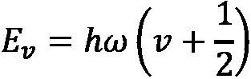

# 第六章：超越 Born-Oppenheimer

“第一条原则是，你绝不能欺骗自己——而你是最容易欺骗的人。”

– 理查德·费曼

“科学进步是以勇气而非智力为单位的。”

– 保罗·狄拉克


图 6.1 – 凯珀·夏基博士想象的双原子分子的分子振动 [作者]

计算分子结构和振动光谱是现代计算化学的两个基本目标，这些目标在许多领域都有应用，从天体化学到生物化学和气候变化缓解。当原子数和/或相同粒子的数量线性增加时，计算复杂性呈指数增长。当旋转和振动自由度之间存在显著耦合，以及在接近解离和电离极限的高能量状态时，还会出现额外的复杂性 [Sawaya]。

能够实现下一代精度的计算方法将超越本书中现有的标准近似。本章重点介绍非 Born-Oppenheimer（非 BO）计算如何包括做出更好预测所需的效果，即对高于基态振动的化学状态的预测 [Adamowicz_1][Adamowicz_2]。其他超越 BO 类型的途径正在被追求以克服 BO 近似的局限性，但它们并非完全非 BO，例如预 BO [Schiffer_1] [Schiffer_2][Mátyus][D4.1 VA Beta]。

作为利用振动状态优势的一个例子，我们提到了麻省理工学院电子研究实验室的一组物理学家，他们展示了一种新的费米子对量子寄存器，其中信息存储在处于两个振动状态叠加的原子对的振动运动中 [Hartke]。每个原子对的共同和相对运动由交换对称性保护，从而实现长寿命和鲁棒的动量相干性。他们说 *“因此，费米子反对称性和强相互作用，是经典计算多费米子行为的核心挑战，可能为保护和处理量子信息提供决定性的解决方案。”* 他们的成就为构建多费米子行为的可编程量子模拟器和使用费米子对的数字计算铺平了道路。

在本章中，我们将涵盖以下主题：

+   *第 6.1 节，非 Born-Oppenheimer 分子哈密顿量*

+   *第 6.2 节，振动频率分析计算*

+   *第 6.3 节，氢分子正位-反位异构化振动光谱*

# 技术要求

本章的配套 Jupyter 笔记本可以从 GitHub 下载，网址为[`github.com/PacktPublishing/Quantum-Chemistry-and-Computing-for-the-Curious`](https://github.com/PacktPublishing/Quantum-Chemistry-and-Computing-for-the-Curious)，该笔记本已在 Google Colab 环境中测试，这是一个免费且完全在云端运行的环境，以及 IBM Quantum Lab 环境中。请参阅*附录 B* *– 在云端利用 Jupyter 笔记本*，获取更多信息。配套的 Jupyter 笔记本会自动安装以下列表中的库：

+   NumPy [NumPy]，一个开源的 Python 库，几乎被用于科学和工程的每一个领域

+   SciPy [SciPy]，一个免费和开源的 Python 库，用于科学计算和技术计算

配套的 Jupyter 笔记本不包括安装 Psi4 免费和开源的高吞吐量量子化学软件[Psi4_0]，我们使用它来执行二氧化碳（CO2）分子的振动频率分析的计算。对于有兴趣安装此软件包的读者，请参阅“Get Started with Psi4” [Psi4_1] 文档和文章参考文献 [Psi4_3]。

## 安装 NumPy、SimPy 和 math 模块

使用以下命令安装 NumPy：

```py
pip install numpy
```

使用以下命令安装 SciPy：

```py
pip install scipy
```

使用以下命令导入 NumPy：

```py
import numpy as np
```

使用以下命令导入 Matplotlib，这是一个用于在 Python 中创建静态、动画和交互式可视化的综合性库：

```py
import matplotlib.pyplot as plt
```

使用以下命令导入 SciPy 的特殊厄米多项式：

```py
from scipy.special import hermite
```

使用以下命令导入 math `factorial`函数：

```py
from math import factorial
```

# 6.1. 非 Born-Oppenheimer 分子哈密顿量

回想*第 4.1 节，Born-Oppenheimer 近似*，实验室坐标系中哈密顿量的表达式：


在原子单位中，电子的质量和约化普朗克常数()被设置为 1。LAB 哈密顿量包括所有粒子的动能之和以及所有粒子之间的势能，其定义如下：

+   和是相对于电子和核的位置坐标的二阶导数算子，即和类似地对于电子。

+   ，，和是电子和、电子和核、以及核和之间的欧几里得距离。

LAB 哈密顿量的算子列表已在*图 4.3*中展示。

在 LAB 哈密顿算符中，分子系统的能量是连续的，而不是离散的。**质心**（**COM**）运动不会对系统的内部状态能量产生影响，可以将其分解出来。内部状态是量子化的，对平移不变。这些状态不受自由空间中的平移和旋转运动的影响。核仍然可以通过振动和内部旋转在 COM 周围移动。

在 BO 近似中，我们假设核的运动与电子的运动是解耦的，也就是说，核方程（旋转和振动）与电子方程的乘积：


其中是核坐标，是电子坐标，是自旋坐标，而电子波函数（）则依赖于核坐标（）。

在非 BO 方法中，总波函数在旋转和振动以及电子能级方面仍然是可分离的；然而，所有能级都依赖于电子和核的变量，空间和自旋。


在 BO 近似中，仅求解具有固定核位置的电子方程，可以通过迭代来考虑核的振动和内部旋转。对于每一次迭代，原子的核在空间中是固定的，不移动，这可以被视为违反了在*第 1.4 节，光和能量*中引入的海森堡不确定性原理。你越确切地知道一个粒子的位置，你对它的动量的了解就越少。一般来说，内部坐标系可以放置在分子中最重的原子或质心处。这种近似有一定的局限性，我们将在振动光谱能量中具体讨论。

本章中提出的非 BO 方法利用**显式相关高斯基函数**（**ECGs**）[Adamowicz_4]的有效性和预测能力来描述原子和分子现象[Sharkey]。这种方法可以用来模拟少量粒子，即三个核或不超过七个电子，以及确定原子的电离能、里德伯态以及旋转和振动激发态的精确值到任意水平[Sharkey]。此外，这种方法非常适合有效的并行化。

## 内部哈密顿算符

我们考虑一个由  个粒子组成的通用非相对论原子系统，即  个电子和一个原子核。从实验室框架哈密顿量到内部哈密顿量的转换涉及严格地将 COM 运动与实验室框架分开。我们定义一个内部笛卡尔坐标系（CCF），其中所有粒子都平等对待，所有粒子都可以在没有任何约束的情况下自由地漫游空间。从实验室 CCF 到内部 CCF 的坐标变换在 *图 6.2* 中表示。


图 6.2 – 内部 CCF 和实验室 CCF

得到的内部哈密顿量用于计算系统的束缚态：


为了清晰起见，我们在 *图 6.3* 中列出内部哈密顿量的项。


图 6.3 – 分子内部哈密顿量算符的项

现在我们介绍全粒子显式相关方法。

## 显式相关所有粒子的高斯函数

在非 BO 方法中使用的 ECGs 如 *图 6.4* 所示。


图 6.4 – ECGs

非 BO 方法使用在 *第五章* “变分量子本征值求解器（VQE）算法”中引入的变分原理，并特别包括一个能量最小化过程。

## 能量最小化

为了获得 LAB 哈密顿量  的本征值，我们使用基于 Rayleigh 商最小化的 Rayleigh-Ritz 变分方案：


其中  和  分别是哈密顿量和重叠  矩阵。 和  是包含在 ECGs 基础集内的非线性参数的函数。我们用  表示这些参数的集合，用  表示波函数相对于基函数的线性展开系数的向量。

我们推导并实现了相对于高斯非线性参数的能量的解析梯度的推导和实现，从 secular equation  开始：


将此方程乘以  从左侧，我们得到著名的 Hellmann-Feynman 定理：


为了得到这个表达式，我们利用了 secular equation，并假设波函数是归一化的，即 。 的表达式涉及  和 ，它们依赖于哈密顿量的第一导数和相对于高斯非线性参数的重叠积分。

该方法采用显式相关联的全粒子高斯函数来展开系统的波函数。高斯函数的非线性参数通过采用相对于这些参数的解析能量梯度来确定的方法进行变分优化。

# 6.2. 振动频率分析计算

在 BO 近似中，分子的总能量是电子能、振动能和转动能的总和：


分子振动可以像通过弹簧连接的粒子的运动一样建模，代表通过可变长度的化学键连接的原子。在谐振子近似中，拉伸弹簧所需的力与拉伸成正比（胡克定律）。当振动能量高时，谐振子近似不再有效，正常模式的概念也不再适用。我们现在考虑双原子分子的简单情况。

## 建模双原子分子的振动-转动能级

双原子分子的转动能量由一系列离散值表示：


其中：

+    是角动量量子数。

+    是平衡距离。

+    是简化普朗克常数。

+    是两个原子的约化质量，。

对于一个非旋转的双原子分子，转动量子数  为零。势能  可以通过围绕平衡位置  的位移  的二次函数来近似，这对应于两个核之间的平衡距离 ：


其中  是恢复力常数（胡克定律）。对于这样的抛物线势，振动的分子是一个量子谐振子。能级是整数振动量子数  的简单函数：



其中  依赖于常数  和两个原子的约化质量 。

量子谐振子的归一化波函数为：


阶数为  的 Hermite 多项式由生成方程定义：


Hermite 多项式使用以下递归关系进行计算：


前三个 Hermite 多项式为：


我们定义 `N(v)` 函数，它计算归一化因子：


```py
def N(v):
  return 1./np.sqrt(np.sqrt(np.pi)*2**v*factorial(v))
```

我们定义了一个名为`Psi(v, x)`的函数，它使用特殊的`hermite()` SciPy 函数，并计算出一个与之前定义的量子简谐振子归一化波函数具有相同形式的函数：

```py
def Psi(v, x):
  return N(v)*hermite(v)(x)*np.exp(-0.5*x**2)
```

现在我们定义一个名为`plot(n)`的函数，该函数以抛物线（黑色）和空间概率 （彩色）的形式绘制势能，这是针对归一化量子简谐振子波函数的整数振动量子数  到 。以下是代码：

```py
def plot(n):
  fig, ax = plt.subplots(figsize=(n,n))
  # Range of x
  xmax = np.sqrt(2*n+1)
  x = np.linspace(-xmax, xmax, 1000)
  for v in range(n):

    # plot potential energy function 0.5*x**2
    ax.plot(x,0.5*x**2,color='black')

    # plot spatial probabilities psi squared for each energy level
    ax.plot(x,Psi(v,x)**2 + v + 0.5)

    # add lines and labels
    ax.axhline(v + 0.5, color='gray', linestyle='-') 
    ax.text(xmax, 1.2*(v+0.5), f”v={v}”)

  ax.set_xlabel('x')
  ax.set_ylabel('$|\psi_v(x)|²$')
```

现在我们调用`plot(5)`函数。*图 6.5*显示了结果：


图 6.5 – 对于  到  的归一化量子简谐振子波函数的势能（黑色抛物线）和空间概率（彩色）

对于围绕平衡位置的位移较大值，实际势能更接近于非简谐振子，其形式如下：


其中  是非简谐常数。随着振动量子数  的增加，能级之间的间隔减小。

在核间距离  处的旋转能量可以用以下幂级数展开近似 [Demtröder]：


其中  是与将两个原子结合在一起的恢复力相关的常数。

这个表达式可以用旋转频率 [Demtröder] 表示：


其中  是旋转常数，而  和  是离心常数：


我们定义了一个名为`Frot()`的 Python 函数，该函数使用参考文献 [Campargue] 中获得的表达式计算氢分子的旋转能级：

```py
def Frot(J, Be, De, He, show=False):
  F = Be*J*(J+1) + De*J**2*(J+1)**2 - He*J*3*(J+1)**3*10e-5
  if show:
    print(“{} {:.2f}”.format(J, F))
  return F
```

我们设置了一个名为`rov`的字典，其中振动量子数  作为键，以下值：

+   Komasa 等人于 2011 年计算的基态  能量 [Komasa]

+   2011 年由 Campargue 计算的振动能级  到  的罗维振动参数 [Campargue]

以下是代码：

```py
#      v   E(v,J=0)    Ee          Be         De        He      rms
rov = {0: (36118.0696, 0.0,        59.33289, 0.045498, 4.277, 3.4), 
       1: (31956.9034, 4161.1693,  56.37318, -0.043961, 4.168, 3.2),
       2: (28031.0670, 8087.0058,  53.47892, -0.042523, 4.070, 3.2),
       3: (24335.6787, 11782.3940, 50.62885, -0.041175, 3.963, 3.2),
       4: (20867.7039, 15250.3688, 47.79997, -0.039927, 3.846, 3.2),
       5: (17626.1400, 18491.9328, 44.96596, -0.038795, 3.717, 3.2),
       6: (14612.2901, 21505.7826, 42.09566, -0.037808, 3.571, 3.1),
       7: (11830.1543, 24287.9184, 39.15105, -0.037004, 3.399, 3.1),
       8: (9286.9790,  26831.0937, 36.08416, -0.036451, 3.187, 3.1),
       9: (6994.0292,  29124.0436, 32.83233, -0.036251, 2.902, 3.2)}
```

我们计算了氢分子在基态旋转态  和第一激发态  的振动能级，以及每个振动量子数  之间的能级差。以下是代码：

```py
print(“v  E(v,J=0)    E(v,J=1)    BO Diff.”)
for v in range(10):
    E0 = rov[v][0] - Frot(0, rov[v][2], rov[v][3], rov[v][4])
    E1 = rov[v][0] - Frot(1, rov[v][2], rov[v][3], rov[v][4])
    print(“{}  {:.4f}  {:.4f}  {:.4f}”.format(v, E0, E1, E0 - E1))
```

*图 6.6*中的结果与 Komasa 等人的结果 [Komasa] 一致：


图 6.6 – 氢分子的振动能级 ， 和 

## 计算分子的所有振动-转动能级

我们概述了在经典计算机上通常用于计算分子所有振动-转动能级的方法 [Gaussian_1] [Neese]。

### 优化分子的几何结构

用于振动分析的分子几何结构必须首先进行优化，以确保原子处于平衡状态且没有动量，也就是说，原子相对于核笛卡尔坐标  的能量的所有一阶导数都为零：


### 计算力常数 Hessian 矩阵

计算一个力常数 Hessian 矩阵，它包含能量  对笛卡尔坐标  的原子 ![img/Formula_06_124.png] ，![img/Formula_06_125.png] ，![img/Formula_06_126.png] 的位移的二次偏导数，例如：

，，![img/Formula_06_129.png]

力常数 Hessian 矩阵是一个  行  列的矩阵。当这些导数的解析表达式不可用时，通过梯度的有限差分来计算二次导数。

### 转换为质量加权的笛卡尔坐标

然后应用以下笛卡尔坐标变换：

，，![img/Formula_06_134.png]

通过将力常数 Hessian 矩阵中与原子  和  相关的每个元素除以  。

### 对质量加权的 Hessian 矩阵进行对角化

然后将质量加权的 Hessian 矩阵对角化，得到一组  特征向量和  特征值。振动频率随后从特征值中导出，这些特征值是使用给出谐振子频率的方程计算得到的：


其中  是以 s-1 为单位的频率， 是约化质量， 是力常数。频率  以 cm-1 为单位，通过以下关系获得  ，其中  是光速， cm s-1：


我们现在通过使用 Psi4 [Psi4_0]，一个开源量子化学软件包，对 CO2 分子进行振动频率分析来展示这种方法。对安装此软件包感兴趣的读者，请参阅“开始使用 Psi4” [Psi4_1] 文档。

首先，我们在 Python 笔记本中导入 Psi4：

```py
import psi4
```

我们将 Psi4 计算的输出重定向到文件：

```py
psi4.core.set_output_file('psi_CO2_output.txt', False)
```

我们指定计算所需的内存量：

```py
psi4.set_memory('500 MB')
```

然后我们定义 CO2 分子的几何结构[Psi4_2]：

```py
co2 = psi4.geometry(“””
symmetry c1
0 1
C 1.6830180 -0.4403696 3.1117942
O 0.5425545 -0.2216001 2.9779653
O 2.8186228 -0.6587208 3.2810031
units angstrom
“””)
```

我们优化分子的几何结构：

```py
psi4.set_options({'reference': 'rhf'})
psi4.optimize('scf/cc-pvdz', molecule=co2)
```

这里是结果，CO2 分子基态电子的能量：

```py
Optimizer: Optimization complete!
-187.65250930298149
```

我们现在进行振动频率分析：

```py
scf_e, scf_wfn = psi4.frequency('scf/cc-pvdz', molecule=co2, return_wfn=True)
```

我们使用以下代码打印频率：

```py
for i in range(4):
    print(scf_wfn.frequencies().get(0,i))
```

这里是结果，cm-1 中的谐振动频率列表：

761.4181081677268

761.4181227549785

1513.1081106509557

2579.8280005025586

这些结果与分子科学软件研究所在其构建 CO2 分子课程中提出的结果非常一致[MolSSI]。ChemTube3D 提供了碳 dioxide 振动的交互式 3D 动画，这些振动[ChemTube3D]。

*图 6.7*展示了使用 Psi4 进行的振动频率分析的一部分。


图 6.7 – 使用 Psi4 对 CO2 分子进行的振动频率分析（摘录）

现在我们展示了使用 BO 和非 BO 方法计算的氢分子正反异构化振动光谱，并与实验数据进行了比较。

# 6.3. 氢分子正反异构化的振动光谱

*图 6.8*展示了比较氢分子正反异构化振动光谱相关波数能级间距的表格，表格由 A 到 C 列描述：

+   是使用 10,000 个基函数的非 BO 方法产生的波数能量[Sharkey]。

+   是 BO 方法产生的波数能量[Komasa]。

+   是波数中的实验数据[Dabrowski]。

对于每个振动能级以及以百分比形式呈现的差异[Sharkey_1]，描述由 D 到 G：

+   

+   

+   

+   

这里是表格[Sharkey_1]：


图 6.8 – 比较非 BO 与 BO 计算与实验的表格[Sharkey_1]

非 BO 方法在预测所有状态，包括激发态，方面高度准确，如图*图 6.9*所示，该图展示了 A 列和 B 列作为振动量子数的函数。在能级预测中，它始终较低，除了激发态，这一异常归因于实验数据的准确性问题。在最高束缚态([Sharkey_1])中，BO 预测有 5%的分解。


图 6.9 – 比较非 BO 与 BO 计算与实验的图表[Sharkey_1]

*图 6.10*展示了 G 列，即 BO 和非 BO 计算之间的差异作为振动量子数的函数的图表。


图 6.10 – 显示 BO/非 BO 与振动量子数之间百分差异的图表  [Sharkey_1]

# 摘要

在本章中，我们回顾了非 BO 分子哈密顿量，并概述了一种将非常准确的非 BO 计算（使用显式相关高斯函数）扩展到双原子分子被激发到第一转动能级以及振动激发到任意能级的状态的方法。我们展示了使用 Psi4 对二氧化碳分子进行的振动频率分析计算。我们展示了使用非 BO 方法 [Sharkey]，BO 方法 [Komasa] 计算的氢分子正位-反位异构化振动光谱，并与实验数据进行了比较。非 BO 方法在预测所有状态，包括氢分子的激发态方面都非常准确。BO 和非 BO 方法使用的波函数的缩放具有阶乘依赖性，被认为是一个 NP-hard 问题。

# 问题

1.  真或假：确定分子结构和振动光谱的计算复杂度随着原子数的增加呈指数增长。

1.  ECG 这个缩写代表什么？

1.  真或假：在谐振子近似中，扩展弹簧所需的力与伸长成正比。

1.  真或假：当振动能量高时，谐振子近似不再有效。

1.  真或假：用于振动分析的分子几何形状必须首先进行优化，以便原子处于平衡状态且没有动量。

# 答案

1.  真

1.  显式相关高斯函数

1.  真

1.  真

1.  真

# 参考文献

[Adamowicz_1] Sergiy Bubin, Michele Pavanello, Wei-Cheng Tung, Keeper L. Sharkey, 和 Ludwik Adamowicz, Born–Oppenheimer and Non-Born–Oppenheimer, Atomic and Molecular Calculations with Explicitly Correlated Gaussians, Chem. Rev. 2013, 113, 1, 36–79, October 1, 2012, [`doi.org/10.1021/cr200419d`](https://doi.org/10.1021/cr200419d)

[Adamowicz_2] Sergiy Bubin 和 Ludwik Adamowicz, Computer program ATOM-MOL-nonBO for performing calculations of ground and excited states of atoms and molecules without assuming the Born–Oppenheimer approximation using all-particle complex explicitly correlated Gaussian functions, J. Chem. Phys. 152, 204102 (2020), [`doi.org/10.1063/1.5144268`](https://doi.org/10.1063/1.5144268)

[Adamowicz_4] Jim Mitroy, Sergiy Bubin, Wataru Horiuchi, Yasuyuki Suzuki, Ludwik Adamowicz, Wojciech Cencek, Krzysztof Szalewicz, Jacek Komasa, D. Blume, 和 Kálmán Varga, Rev. Mod. Phys. 85, 693 – Published 6 May 2013, Theory and application of explicitly correlated Gaussians, [`journals.aps.org/rmp/abstract/10.1103/RevModPhys.85.693`](https://journals.aps.org/rmp/abstract/10.1103/RevModPhys.85.693)

[Campargue] Alain Campargue, Samir Kassi, Krzysztof Pachucki and Jacek Komasa, The absorption spectrum of H2: CRDS measurements of the (2-0) band, review of the literature data and accurate ab initio line list up to 35000 cm-1, Physical Chemistry Chemical Physics, 13 Sep 2011, Table 5\. Rovibrational parameters of the V=0-13 vibrational levels of H2 obtained from the fit of the J=0-7 energy levels calculated in Ref. [36], [`www.fuw.edu.pl/~krp/papers/camparge.pdf`](https://www.fuw.edu.pl/~krp/papers/camparge.pdf)

[ChemTube3D] Vibrations of Carbon Dioxide, [`www.chemtube3d.com/vibrationsco2`](https://www.chemtube3d.com/vibrationsco2)

[D4.1 VA Beta] Arseny Kovyrshin, AstraZeneca AB R&D, Giorgio Silvi, HQS Quantum Simulations GmbH, D4.1: VA Beta and BBO Beta, NExt ApplicationS of Quantum Computing, 23 Nov 2021, [`www.neasqc.eu/wp-content/uploads/2022/01/NEASQC_D4.1_VA-Beta-and-BBO-Beta-R1.0.pdf`](https://www.neasqc.eu/wp-content/uploads/2022/01/NEASQC_D4.1_VA-Beta-and-BBO-Beta-R1.0.pdf) , [`github.com/NEASQC/Variationals_algorithms`](https://github.com/NEASQC/Variationals_algorithms)

[Dabrowski] Dabrowski, The Lyman and Werner Bands of H2, Can. J. Phys. 62, 1639 (1984) Table 5\. Observed energy levels of the X¹ Sigma_g^+ of H_2, [`doi.org/10.1139/p84-210`](https://doi.org/10.1139/p84-210%20)

[Demtröder] Atoms, Molecules and Photons, Wolfgang Demtröder, Second Edition, Springer, 9.5\. Rotation and Vibration of Diatomic Molecules, Springer, ISBN-13: 978-3642102974

[Gaussian_1] Joseph W. Ochterski, Gaussian, Vibrational Analysis in Gaussian, [`gaussian.com/vib/`](https://gaussian.com/vib/)

[Hartke] Hartke, T., Oreg, B., Jia, N. et al. Quantum register of fermion pairs. Nature 601, 537–541 (2022). [`doi.org/10.1038/s41586-021-04205-8`](https://doi.org/10.1038/s41586-021-04205-8)

[Komasa] Komasa et al., Quantum Electrodynamics Effects in Rovibrational Spectra of Molecular Hydrogen J. Chem. Theory Comput. 2011, 7, 10, 3105–3115, Table 1\. Theoretically Predicted Dissociation Energies {in cm^(-1)} of All 302 Bound States of H_2\. [`doi.org/10.1021/ct200438t`](https://doi.org/10.1021/ct200438t)

[Maytus] Edit Mátyus, Edit Mátyus (2019) Pre-Born–Oppenheimer molecular structure theory, Molecular Physics, 117:5, 590-609, DOI: 10.1080/00268976.2018.1530461, [`doi.org/10.1080/00268976.2018.1530461`](https://doi.org/10.1080/00268976.2018.1530461)

[MolSSI] Basis set convergence of molecular properties: Geometry and Vibrational Frequency, Molecular Sciences Software Institute (MolSSI), [`education.molssi.org/qm-tools/04-vib-freq/index.html`](http://education.molssi.org/qm-tools/04-vib-freq/index.html)

[Neese] Vibrational Spectroscopy, Frank Neese from the Max Planck Institute for Chemical Energy Conversion, 2014 summer school, [`www.youtube.com/watch?v=iJjg2L1F8I4`](https://www.youtube.com/watch?v=iJjg2L1F8I4)

[Psi4_0] Psi4 手册主索引，[`psicode.org/psi4manual/master/index.html`](https://psicode.org/psi4manual/master/index.html)

[Psi4_1] 开始使用 PSI4，[`psicode.org/installs/v15/`](https://psicode.org/installs/v15/)

[Psi4_2] C4H5N (吡咯)与 CO2 结合能的 MP2/def2-TZVPP 测试案例，[`github.com/psi4/psi4/blob/master/samples/mp2-def2/input.dat`](https://github.com/psi4/psi4/blob/master/samples/mp2-def2/input.dat)

[Psi4_3] Smith DGA, Burns LA, Simmonett AC, Parrish RM, Schieber MC, Galvelis R, Kraus P, Kruse H, Di Remigio R, Alenaizan A, James AM, Lehtola S, Misiewicz JP, Scheurer M, Shaw RA, Schriber JB, Xie Y, Glick ZL, Sirianni DA, O'Brien JS, Waldrop JM, Kumar A, Hohenstein EG, Pritchard BP, Brooks BR, Schaefer HF 3rd, Sokolov AY, Patkowski K, DePrince AE 3rd, Bozkaya U, King RA, Evangelista FA, Turney JM, Crawford TD, Sherrill CD. Psi4 1.4: 开源软件用于高通量量子化学。化学物理杂志。2020 年 5 月 14 日；152(18):184108。doi: 10.1063/5.0006002。PMID: 32414239；PMCID: PMC7228781。[`www.ncbi.nlm.nih.gov/pmc/articles/PMC7228781/pdf/JCPSA6-000152-184108_1.pdf`](https://www.ncbi.nlm.nih.gov/pmc/articles/PMC7228781/pdf/JCPSA6-000152-184108_1.pdf)

[Sawaya] Nicolas P. D. Sawaya, Francesco Paesani, Daniel P. Tabor，振动光谱的近中和长期量子算法方法，2021 年 2 月 1 日，arXiv:2009.05066 [quant-ph]，[`arxiv.org/abs/2009.05066`](https://arxiv.org/abs/2009.05066)

[Schiffer_1] Fabijan Pavošević, Tanner Culpitt, 和 Sharon Hammes-Schiffer，多组分量子化学：通过核-电子轨道方法整合电子和核量子效应，化学评论。2020 年，120，9，4222–4253，[`doi.org/10.1021/acs.chemrev.9b00798`](https://doi.org/10.1021/acs.chemrev.9b00798)

[Schiffer_2] Kurt R. Brorsen, Andrew Sirjoosingh, Michael V. Pak, 和 Sharon Hammes-Schiffer，显式相关核电子轨道的 Hartree-Fock 方法：限制基集和开壳系统，化学物理杂志。142, 214108 (2015)，[`doi.org/10.1063/1.4921304`](https://doi.org/10.1063/1.4921304)

[SciPy_0] SciPy，[`scipy.org/`](https://scipy.org/)

[Sharkey] K. Sharkey 等人。使用显式相关全粒子高斯函数的直接变分计算双原子第一激发转动能级的非 Born-Oppenheimer 方法，物理评论 A，88, 032513 (2013，表 I. H_2 的(v,0)和(v,1)态的总能量（单位： hartrees)）。[`journals.aps.org/pra/abstract/10.1103/PhysRevA.88.032513`](https://journals.aps.org/pra/abstract/10.1103/PhysRevA.88.032513)

[Sharkey_1] K. Sharkey，分子氢海报，QLEAN™，[`qlean.world/molecular-hydrogen-poster`](https://qlean.world/molecular-hydrogen-poster)

[Veis] Libor Veis, Jakub Višňák, Hiroaki Nishizawa, Hiromi Nakai, Jiří Pittner, 在量子计算机上超越 Born-Oppenheimer 近似的量子化学：模拟相位估计研究，国际量子化学杂志，2016 年 6 月 22 日，[`doi.org/10.1002/qua.25176`](https://doi.org/10.1002/qua.25176)
