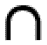

# 第八章：参考文献

[ASE_0] 原子模拟环境 (ASE), [`wiki.fysik.dtu.dk/ase/index.html`](https://wiki.fysik.dtu.dk/ase/index.html)

[ASE_1] ASE，原子对象，[`wiki.fysik.dtu.dk/ase/ase/atoms.html`](https://wiki.fysik.dtu.dk/ase/ase/atoms.html)

[ASE_2] ASE 可视化，[`wiki.fysik.dtu.dk/ase/ase/visualize/visualize.html#module-ase.visualize`](https://wiki.fysik.dtu.dk/ase/ase/visualize/visualize.html#module-ase.visualize)

[Aaronson_1] 斯科特·阿伦森，量子计算机的极限，科学美国人，2008 年 3 月，[`www.scientificamerican.com/article/the-limits-of-quantum-computers/`](https://www.scientificamerican.com/article/the-limits-of-quantum-computers/)

[Aaronson_2] 斯科特·阿伦森，量子计算机的极限（草案），[`www.scottaaronson.com/writings/limitsqc-draft.pdf`](https://www.scottaaronson.com/writings/limitsqc-draft.pdf)

[Adamowicz_1] 谢尔盖·布宾，米歇尔·帕瓦内洛，魏成忠，凯普·L·沙基，和卢德维克·亚当诺维奇，基于显式相关高斯函数的 Born-Oppenheimer 和非 Born-Oppenheimer 原子和分子计算，化学评论，2013 年，第 113 卷，第 1 期，第 36-79 页，2012 年 10 月 1 日，[`doi.org/10.1021/cr200419d`](https://doi.org/10.1021/cr200419d)

[Adamowicz_2] 谢尔盖·布宾和卢德维克·亚当诺维奇，计算机程序 ATOM-MOL-nonBO，用于在不假设 Born-Oppenheimer 近似的情况下，使用所有粒子的复显式相关高斯函数进行原子和分子的基态和激发态计算，化学物理杂志第 152 卷，第 204102 号（2020 年），[`doi.org/10.1063/1.5144268`](https://doi.org/10.1063/1.5144268)

[Adamowicz_3] Tung WC，Pavanello M，Adamowicz L.，LiH 分子的非常精确的势能曲线。表 I.在 R = 3.015 bohr 时，LiH 分子基态的 BO 能量的收敛性比较，化学物理杂志，2011 年 2 月 14 日；第 134 卷，第 6 期：064117。doi：10.1063/1.3554211，[`doi.org/10.1063/1.3554211`](https://doi.org/10.1063/1.3554211)

[Adamowicz_4] 吉姆·米特罗伊，谢尔盖·布宾，森仓和朗，铃木康行，亚当·阿多维奇，沃伊切赫·森切克，克日什托夫·萨莱维奇，雅切克·科马萨，D. 布卢梅，和卡尔曼·瓦加，现代物理评论第 85 卷，第 693 页 - 2013 年 5 月 6 日出版，显式相关高斯函数的理论与应用，[`journals.aps.org/rmp/abstract/10.1103/RevModPhys.85.693`](https://journals.aps.org/rmp/abstract/10.1103/RevModPhys.85.693)

[Africa21] IBM 量子挑战非洲 2021，[`github.com/qiskit-community/ibm-quantum-challenge-africa-2021`](https://github.com/qiskit-community/ibm-quantum-challenge-africa-2021)

[Arute] 阿鲁特，F.，阿亚，K.，巴布斯，R.等，使用可编程超导处理器实现量子霸权，自然第 574 卷，第 505-510 页（2019 年），[`doi.org/10.1038/s41586-019-1666-5`](https://doi.org/10.1038/s41586-019-1666-5)

[Auffeves] Alexia Auffèves，优化量子计算器的能耗：一个跨学科挑战，物理反思第 69 期（2021）16-20 页，2021 年 7 月 12 日，[`doi.org/10.1051/refdp/202169016`](https://doi.org/10.1051/refdp/202169016)

[Babbush] Ryan Babbush，2021 年 2 月 24 日，化学首次量子化量子模拟的承诺，Google AI Quantum，化学容错未来的首次量子化！，[`www.youtube.com/watch?v=iugrIX616yg`](https://www.youtube.com/watch?v=iugrIX616yg)

[Balmer_series] 巴耳末系列，维基百科，[`en.wikipedia.org/wiki/Balmer_series`](https://en.wikipedia.org/wiki/Balmer_series)

[Bell_1] Bell, J. S.，关于爱因斯坦-波多尔斯基-罗森佯谬，物理物理物理，第 1 卷，195: 195–200，1964 年，[`doi.org/10.1103/PhysicsPhysiqueFizika.1.195`](https://doi.org/10.1103/PhysicsPhysiqueFizika.1.195)

[Bell_2] "*第二章*: 关于爱因斯坦-波多尔斯基-罗森佯谬"。量子力学中的可说与不可说：量子哲学论文集（1987 年版，Alain Aspect 作序），重印于 JS Bell (2004)，剑桥大学出版社。第 14-21 页。ISBN 978-0521523387

[Benioff] Benioff, P.，计算机作为物理系统：计算机作为图灵机的微观量子力学哈密顿量模型，[`doi.org/10.1007/BF01011339`](https://doi.org/10.1007/BF01011339)

[Bittel] Lennart Bittel 和 Martin Kliesch, 训练变分量子算法是 NP 难的——即使是对于对数数量的量子比特和自由费米子系统，DOI:10.1103/PhysRevLett.127.120502，2021 年 1 月 18 日，[`doi.org/10.1103/PhysRevLett.127.120502`](https://doi.org/10.1103/PhysRevLett.127.120502)

[Bohr_1] N. 玻尔，I.，关于原子和分子的构成，哲学杂志，第 26 卷，1-25 页（1913 年 7 月），DOI: 10.1080/14786441308634955

[Bohr_2] 玻尔的壳层模型，大英百科全书，[`www.britannica.com/science/atom/Bohrs-shell-model#ref496660`](https://www.britannica.com/science/atom/Bohrs-shell-model#ref496660)

[Born_1] Born, M.，Jordan, P.，关于量子力学，物理杂志，第 34 卷，858–888 页（1925 年），[`doi.org/10.1007/BF01328531`](https://doi.org/10.1007/BF01328531)

[Bravyi] Sergey Bravyi，Jay M. Gambetta，Antonio Mezzacapo，Kristan Temme，减少量子比特以模拟费米子哈密顿量，arXiv:1701.08213v1，2017 年 1 月 27 日，[`arxiv.org/pdf/1701.08213.pdf`](https://arxiv.org/pdf/1701.08213.pdf)

[Bubin] Bubin, S.，Cafiero, M.，& Adamowicz, L.，使用显式相关高斯基函数的原子和分子非 Born-Oppenheimer 变分计算，化学物理进展，第 131 卷，377-475 页，[`doi.org/10.1002/0471739464.ch6`](https://doi.org/10.1002/0471739464.ch6)

[Burg] Vera von Burg，Guang Hao Low，Thomas Häner，Damian S. Steiger，Markus Reiher，Martin Roetteler，Matthias Troyer，量子计算增强的计算催化，2021 年 3 月 3 日，10.1103/PhysRevResearch.3.033055，[`arxiv.org/abs/2007.14460`](https://arxiv.org/abs/2007.14460)

[Bushmanov] Sergey Bushmanov，如何在 Python 中使用 Matplotlib 和一组数据绘制直方图？，Stack Overflow，[`stackoverflow.com/questions/33203645/how-to-plot-a-histogram-using-matplotlib-in-python-with-a-list-of-data`](https://stackoverflow.com/questions/33203645/how-to-plot-a-histogram-using-matplotlib-in-python-with-a-list-of-data)

[Byjus] BYJU'S，氢光谱，波长，图，氢发射光谱，[`byjus.com/chemistry/hydrogen-spectrum/#`](https://byjus.com/chemistry/hydrogen-spectrum/#)

[CERN_ 夸克] CERN，原子世界之旅，[`www.youtube.com/watch?v=7WhRJV_bAiE`](https://www.youtube.com/watch?v=7WhRJV_bAiE)

[Campargue] Alain Campargue，Samir Kassi，Krzysztof Pachucki 和 Jacek Komasa，H2 的吸收光谱：CRDS 测量(2-0)带，文献数据综述和精确的从头计算线表至 35000 cm-1，表 5。从参考文献[36]中计算的 J=0-7 能级拟合得到的 H2 V=0-13 振动能级的转振动参数，Physical Chemistry Chemical Physics，2011 年 9 月 13 日，[`www.fuw.edu.pl/~krp/papers/camparge.pdf`](https://www.fuw.edu.pl/~krp/papers/camparge.pdf)

[Cao] Yudong Cao，Jonathan Romero，Jonathan P. Olson，Matthias Degroote，Peter D. Johnson，Mária Kieferová，Ian D. Kivlichan，Tim Menke，Borja Peropadre，Nicolas P. D. Sawaya，Sukin Sim，Libor Veis，Alán Aspuru-Guzik，量子化学在量子计算时代，Chem. Rev. 2019，119，19，10856–10915，2019 年 8 月 30 日，[`doi.org/10.1021/acs.chemrev.8b00803`](https://doi.org/10.1021/acs.chemrev.8b00803)

[Chem-periodic] Chemistry LibreTexts，5.17：电子排布和周期表，[`chem.libretexts.org/Bookshelves/General_Chemistry/Book%3A_ChemPRIME_(Moore_et_al.)/05%3A_The_Electronic_Structure_of_Atoms/5.17%3A_Electron_Configurations_and_the_Periodic_Table`](https://chem.libretexts.org/Bookshelves/General_Chemistry/Book%3A_ChemPRIME_(Moore_et_al.)/05%3A_The_Electronic_Structure_of_Atoms/5.17%3A_Electron_Configurations_and_the_Periodic_Table)

[ChemChiral] 5.1 手性分子，Chemistry LibreTexts，2015 年 7 月 5 日，[`chem.libretexts.org/Bookshelves/Organic_Chemistry/Map%3A_Organic_Chemistry_(Vollhardt_and_Schore)/05._Stereoisomers/5.1%3A_Chiral__Molecules`](https://chem.libretexts.org/Bookshelves/Organic_Chemistry/Map%3A_Organic_Chemistry_(Vollhardt_and_Schore)/05._Stereoisomers/5.1%3A_Chiral__Molecules)

[ChemTube3D] 二氧化碳的振动，[`www.chemtube3d.com/vibrationsco2`](https://www.chemtube3d.com/vibrationsco2)

[Chem_spectr] 化学自由教材，7.3：氢原子的原子光谱，[`chem.libretexts.org/Courses/Solano_Community_College/Chem_160/Chapter_07%3A_Atomic_Structure_and_Periodicity/7.03_The_Atomic_Spectrum_of_Hydrogen`](https://chem.libretexts.org/Courses/Solano_Community_College/Chem_160/Chapter_07%3A_Atomic_Structure_and_Periodicity/7.03_The_Atomic_Spectrum_of_Hydrogen)

[Chen] Sija Chen, 量子蒙特卡洛方法，Maplesoft，[`fr.maplesoft.com/Applications/Detail.aspx?id=154748`](https://fr.maplesoft.com/Applications/Detail.aspx?id=154748)

[Chiew] Mitchell Chiew 和 Sergii Strelchuk, 最佳费米子-量子比特映射，arXiv:2110.12792v1 [quant-ph]，2021 年 10 月 25 日，[`arxiv.org/pdf/2110.12792.pdf`](https://arxiv.org/pdf/2110.12792.pdf)

[Clay] 千禧年问题，[`www.claymath.org/millennium-problems`](https://www.claymath.org/millennium-problems)

[Cmap] 在 Matplotlib 中选择色图，[`matplotlib.org/stable/tutorials/colors/colormaps.html`](https://matplotlib.org/stable/tutorials/colors/colormaps.html)

[Comp_Zoo] 复杂性动物园，[`complexityzoo.net/Complexity_Zoo`](https://complexityzoo.net/Complexity_Zoo)

[Corcoles] A. D. Córcoles, Maika Takita, Ken Inoue, Scott Lekuch, Zlatko K. Minev, Jerry M. Chow, and Jay M. Gambetta, 利用超导量子比特在量子算法中动态量子电路，物理评论快报 127, 100501, 2021 年 8 月 31 日，[`journals.aps.org/prl/abstract/10.1103/PhysRevLett.127.100501`](https://journals.aps.org/prl/abstract/10.1103/PhysRevLett.127.100501)

[Crockett] Christopher Crockett, 手性分子的叠加，2021 年 9 月 14 日，物理 14，s108，[`physics.aps.org/articles/v14/s108`](https://physics.aps.org/articles/v14/s108)

[D4.1 VA Beta] Arseny Kovyrshin, AstraZeneca AB R&D, Giorgio Silvi, HQS Quantum Simulations GmbH, D4.1: VA Beta 和 BBO Beta，量子计算的 NExt 应用，2021 年 11 月 23 日，[`www.neasqc.eu/wp-content/uploads/2022/01/NEASQC_D4.1_VA-Beta-and-BBO-Beta-R1.0.pdf`](https://www.neasqc.eu/wp-content/uploads/2022/01/NEASQC_D4.1_VA-Beta-and-BBO-Beta-R1.0.pdf) ，https://github.com/NEASQC/Variationals_algorithms

[Dabrowski] Dabrowski, H2 的莱曼和沃纳带，表 5. H2 的 X¹ Sigma_g^+ 的观测能级，加拿大物理学报 62，1639 (1984)，[`doi.org/10.1139/p84-210`](https://doi.org/10.1139/p84-210)

[Dagrada] Mario Dagrada, 改进的量子蒙特卡洛模拟：从开放到扩展系统，材料科学 [cond-mat.mtrl-sci]。皮埃尔和玛丽居里大学 - 巴黎六大学；圣马丁国立大学，2016\. 英语。 ⟨NNT : 2016PA066349⟩。 ⟨tel-01478313⟩，[`tel.archives-ouvertes.fr/tel-01478313/document`](https://tel.archives-ouvertes.fr/tel-01478313/document)

[Daskalatis] 科斯蒂斯·达斯卡拉基斯，平衡计算与深度学习的基础，科斯蒂斯·达斯卡拉基斯在数据科学基础系列，2021 年 2 月 18 日，[`www.youtube.com/watch?v=pDangP47ftE`](https://www.youtube.com/watch?v=pDangP47ftE)

[De Keijzer] de Keijzer, R. J. P. T.，Colussi, V. E.，Škorić, B.，& Kokkelmans, S. J. J. M. F. (2021)，针对量子化学应用的变分量子本征求解器的优化，arXiv，2021，[2102.01781]，[`arxiv.org/abs/2102.01781`](https://arxiv.org/abs/2102.01781)

[Demtröder] 原子、分子和光子，第 9.5 节：双原子分子的旋转和振动，沃尔夫冈·德默特罗德，第二版，斯普林格出版社，斯普林格出版社，ISBN-13：978-3642102974

[Deutsch-Jozsa] 大卫·德施和理查德·约萨，通过量子计算快速解决问题的方法，伦敦皇家学会 A 类会刊，439：553-558，[`doi.org/10.1098/rspa.1992.0167`](https://doi.org/10.1098/rspa.1992.0167)

[DiVincenzo] 大卫·P·迪维岑佐，量子计算的物理实现，10.1002/1521-3978(200009)48:9/11<771::AID-PROP771>3.0.CO;2-E，[`arxiv.org/abs/quant-ph/0002077`](https://arxiv.org/abs/quant-ph/0002077)

[Dirac_2] 狄拉克，P.A.M.，量子动力学的物理解释，皇家学会会刊 A，1927，113，621-641，[`doi.org/10.1098/rspa.1927.0012`](https://doi.org/10.1098/rspa.1927.0012)

[Dowling] 乔纳森·P·道林和杰拉尔德·J·米尔伯恩，量子技术：第二次量子革命，皇家学会，2003 年 6 月 20 日，[`doi.org/10.1098/rsta.2003.1227`](https://doi.org/10.1098/rsta.2003.1227)

[E_mass] 基本物理常数，电子质量，NIST，`https://physics.nist.gov/cgi-bin/cuu/Value?me|search_for=electron+mass`

[Ebomwonyi] Ebomwonyi, Osarodion, 使用 CASINO 代码对氢分子基态能量的量子蒙特卡罗计算，2013，表 3.1：不同研究者对氢分子基态能量的比较分析，[`www.semanticscholar.org/paper/A-Quantum-Monte-Carlo-Calculation-of-the-Ground-for-Ebomwonyi/5316eb86f39cf4fa0a8fd06d136aac4db1105ad4`](https://www.semanticscholar.org/paper/A-Quantum-Monte-Carlo-Calculation-of-the-Ground-for-Ebomwonyi/5316eb86f39cf4fa0a8fd06d136aac4db1105ad4)

[Fearnley] 约翰·费恩利（利物浦大学），保罗·W·戈德堡（牛津大学），亚历山德罗斯·霍伦德（牛津大学），以及拉胡尔·萨瓦尼（利物浦大学），梯度下降的复杂性：CLS = PPAD  PLS，STOC 2021：第 53 届 ACM SIGACT 理论计算年会的论文集，2021 年 6 月，第 46-59 页，[`doi.org/10.1145/3406325.3451052`](https://doi.org/10.1145/3406325.3451052)

[Freeman] Freedman-Diaconis 规则，维基百科，[`en.wikipedia.org/wiki/Freedman%E2%80%93Diaconis_rule`](https://en.wikipedia.org/wiki/Freedman%E2%80%93Diaconis_rule)

[Gard] Gard, B.T.，Zhu, L.，Barron, G.S.等，用于变分量子本征求解算法的高效对称性保持态制备电路，npj 量子信息 6，10（2020），[`doi.org/10.1038/s41534-019-0240-1`](https://doi.org/10.1038/s41534-019-0240-1)

[Gaussian_1] Joseph W. Ochterski，Gaussian 中的振动分析，[`gaussian.com/vib/`](https://gaussian.com/vib/)

[Getty] 女孩仰望，[`media.gettyimages.com/photos/you-learn-something-new-every-day-picture-id523149221?k=20&m=523149221&s=612x612&w=0&h=7ZFg6ETuKlqr1nzi98IBNz-uYXccQwiuNKEk0hGKKIU=`](https://media.gettyimages.com/photos/you-learn-something-new-every-day-picture-id523149221?k=20&m=523149221&s=612x612&w=0&h=7ZFg6ETuKlqr1nzi98IBNz-uYXccQwiuNKEk0hGKKIU=)

[Gorelov] Vitaly Gorelov，极端条件下氢原子的电子结构计算量子蒙特卡罗方法：变分蒙特卡罗（VMC）应用，1.4.1 变分蒙特卡罗（VMC），[`tel.archives-ouvertes.fr/tel-03045954/document`](https://tel.archives-ouvertes.fr/tel-03045954/document)

[Grok] 理解布洛赫球，[`javafxpert.github.io/grok-bloch/`](https://javafxpert.github.io/grok-bloch/)

[H5py] 快速入门指南，[`docs.h5py.org/en/stable/quick.html`](https://docs.h5py.org/en/stable/quick.html)

[Hartke] Hartke, T.，Oreg, B.，Jia, N.等，费米子对的量子寄存器，Nature 601，537–541（2022），[`doi.org/10.1038/s41586-021-04205-8`](https://doi.org/10.1038/s41586-021-04205-8)

[Hill] 使用 Python 学习科学编程，*第二章*：核心 Python 语言 I，问题，P2.5，电子排布，[`scipython.com/book/chapter-2-the-core-python-language-i/questions/problems/p25/electronic-configurations/`](https://scipython.com/book/chapter-2-the-core-python-language-i/questions/problems/p25/electronic-configurations/)

[IBM_CEO] IBM 首席执行官：本世纪量子计算将“像火箭一样”起飞，Fast Company，2021 年 9 月 28 日，[`www.fastcompany.com/90680174/ibm-ceo-quantum-computing-will-take-off-like-a-rocket-ship-this-decade`](https://www.fastcompany.com/90680174/ibm-ceo-quantum-computing-will-take-off-like-a-rocket-ship-this-decade)

[IBM_comp1] 欢迎使用 IBM 量子作曲家，[`quantum-computing.ibm.com/composer/docs/iqx/`](https://quantum-computing.ibm.com/composer/docs/iqx/)

[IBM_comp2] IBM 量子作曲家，[`quantum-computing.ibm.com/composer/files/new`](https://quantum-computing.ibm.com/composer/files/new)

[IBM_mid] 中断电路测量教程，IBM 量子系统，[`quantum-computing.ibm.com/lab/docs/iql/manage/systems/midcircuit-measurement/`](https://quantum-computing.ibm.com/lab/docs/iql/manage/systems/midcircuit-measurement/)

[Intro_BOA_1] M. Born，J.R. Oppenheimer，关于分子的量子理论，[`www.theochem.ru.nl/files/dbase/born-oppenheimer-translated-s-m-blinder.pdf`](https://www.theochem.ru.nl/files/dbase/born-oppenheimer-translated-s-m-blinder.pdf)

[Intro_BOA_2] M. Born 和 R. J. Oppenheimer, 关于分子的量子理论，物理年鉴，20，457-484（1927 年 8 月），[`doi.org/10.1002/andp.19273892002`](https://doi.org/10.1002/andp.19273892002)

[Kaplan] 伊利亚·G. 卡普兰，泡利不相容原理的现代状态及其理论基础问题，对称性 2021，13(1)，21，[`doi.org/10.3390/sym13010021`](https://doi.org/10.3390/sym13010021)

[Knill] 艾曼纽尔·克尼尔，雷蒙德·拉法拉梅，量子纠错码理论，[`arxiv.org/abs/quant-ph/9604034`](https://arxiv.org/abs/quant-ph/9604034)

[Komasa] Komasa 等人，分子氢的转振动光谱中的量子电动力学效应，化学理论计算杂志，2011，7，10，3105–3115，表 1。理论上预测的所有 302 个束缚态的 H_2 解离能{以 cm^(-1)为单位}，[`doi.org/10.1021/ct200438t`](https://doi.org/10.1021/ct200438t)，[`www.fuw.edu.pl/~krp/papers/H2D2v18.pdf`](https://www.fuw.edu.pl/~krp/papers/H2D2v18.pdf)

[Lolur] Lolur，Phalgun，Magnus Rahm，Marcus Skogh，Laura García-Álvarez 和 Göran Wendin，通过在高性能计算机上模拟原生物分子的基态能量来基准测试变分量子本征求解器，arXiv:2010.13578v2 [quant-ph]，2021 年 1 月 5 日，[`arxiv.org/pdf/2010.13578.pdf`](https://arxiv.org/pdf/2010.13578.pdf)

[Lucr_1] 卢克莱修关于事物的本质，由约翰·塞尔比·沃森牧师，文学硕士，伦敦 1870 年直译成英文散文，[`www.google.fr/books/edition/Lucretius_On_the_Nature_of_Things/59HTAAAAMAAJ?hl=en&gbpv=1&printsec=frontcover`](https://www.google.fr/books/edition/Lucretius_On_the_Nature_of_Things/59HTAAAAMAAJ?hl=en&gbpv=1&printsec=frontcover)

[Lucr_2] 托马斯·奈尔，卢克莱修：我们的当代人，2019 年 2 月 15 日，[`www.youtube.com/watch?v=VMrTk1A2GX8`](https://www.youtube.com/watch?v=VMrTk1A2GX8)

[Lucr_3] 大卫·古德休，卢克莱修讲座，生活、爱情、死亡和原子物理学，[`www.youtube.com/watch?v=mJZZd3f_-oE`](https://www.youtube.com/watch?v=mJZZd3f_-oE)

[Lyman_series] 莱曼系，来自维基百科，[`en.wikipedia.org/wiki/Lyman_series`](https://en.wikipedia.org/wiki/Lyman_series)

[MIT_QC_1981] MIT Endicott House，计算物理会议，图片“计算物理会议，Endicott House MIT 1981 年 5 月 6-8 日”，2018 年 3 月 21 日，[`mitendicotthouse.org/physics-computation-conference/`](https://mitendicotthouse.org/physics-computation-conference/)

[Maytus] Edit Mátyus，Edit Mátyus（2019）Pre-Born-Oppenheimer 分子结构理论，分子物理学，117:5，590-609，DOI：10.1080/00268976.2018.1530461，[`doi.org/10.1080/00268976.2018.1530461`](https://doi.org/10.1080/00268976.2018.1530461)

[Mezzacapo] Antonio Mezzacapo，《量子计算机上的化学模拟》，第一部分，2020 年 Qiskit 全球夏季学校，IBM 量子，Qiskit，量子计算和量子硬件简介，[`qiskit.org/learn/intro-qc-qh/`](https://qiskit.org/learn/intro-qc-qh/)，讲义第八部分，[`github.com/qiskit-community/intro-to-quantum-computing-and-quantum-hardware/blob/master/lectures/introqcqh-lecture-notes-8.pdf?raw=true`](https://github.com/qiskit-community/intro-to-quantum-computing-and-quantum-hardware/blob/master/lectures/introqcqh-lecture-notes-8.pdf?raw=true)

[Micr_Algebra] 线性代数，QuantumKatas/tutorials/LinearAlgebra/，[`github.com/microsoft/QuantumKatas/tree/main/tutorials/LinearAlgebra`](https://github.com/microsoft/QuantumKatas/tree/main/tutorials/LinearAlgebra)

[Micr_Complex] 复数运算，QuantumKatas/tutorials/ComplexArithmetic/，[`github.com/microsoft/QuantumKatas/tree/main/tutorials/ComplexArithmetic`](https://github.com/microsoft/QuantumKatas/tree/main/tutorials/ComplexArithmetic)

[MolSSI] 分子性质基集收敛性：几何和振动频率，分子科学软件研究所（MolSSI），[`education.molssi.org/qm-tools/04-vib-freq/index.html`](http://education.molssi.org/qm-tools/04-vib-freq/index.html)

[内塞] 振动光谱学，来自马克斯·普朗克化学能转换研究所的弗兰克·内塞，2014 年夏季学校，[`www.youtube.com/watch?v=iJjg2L1F8I4`](https://www.youtube.com/watch?v=iJjg2L1F8I4)

[NumPy] NumPy：初学者的绝对基础，[`numpy.org/doc/stable/user/absolute_beginners.html`](https://numpy.org/doc/stable/user/absolute_beginners.html)

[中子-电子质量比] 中子-电子质量比，NIST，[`physics.nist.gov/cgi-bin/cuu/Value?mnsme`](https://physics.nist.gov/cgi-bin/cuu/Value?mnsme)

[Orb_Approx] 轨道近似定义，[`www.chemicool.com/definition/orbital-approximation.html`](https://www.chemicool.com/definition/orbital-approximation.html)

[Panagiotis] Panagiotis Kl. Barkoutsos，Jerome F. Gonthier，Igor Sokolov，Nikolaj Moll，Gian Salis，Andreas Fuhrer，Marc Ganzhorn，Daniel J. Egger，Matthias Troyer，Antonio Mezzacapo，Stefan Filipp，Ivano Tavernelli，《电子结构计算的量子算法：粒子-空穴哈密顿量和优化波函数展开》，物理评论 A 98，022322 – 发布于 2018 年 8 月 20 日，DOI：10.1103/PhysRevA.98.022322，[`link.aps.org/doi/10.1103/PhysRevA.98.022322`](https://link.aps.org/doi/10.1103/PhysRevA.98.022322)

[Part_1] 粒子列表，维基百科，[`en.wikipedia.org/wiki/List_of_particles`](https://en.wikipedia.org/wiki/List_of_particles)

[保罗林] L. 保罗林和 E. B. 威尔逊，《量子力学导论及其在化学中的应用》，多佛出版社（1935 年）

[Pease] 克里斯托弗·皮斯，蒙特卡洛方法概述，数据科学向导，[`towardsdatascience.com/an-overview-of-monte-carlo-methods-675384eb1694`](https://towardsdatascience.com/an-overview-of-monte-carlo-methods-675384eb1694)

[Phys5250] 角动量加法，科罗拉多大学，PHYS5250，[`physicscourses.colorado.edu/phys5250/phys5250_fa19/lecture/lec32-addition-angular-momentum/`](https://physicscourses.colorado.edu/phys5250/phys5250_fa19/lecture/lec32-addition-angular-momentum/)

[PoorLeno] 文件：Hydrogen Density Plots.png，来自维基百科，[`en.wikipedia.org/wiki/File:Hydrogen_Density_Plots.png`](https://en.wikipedia.org/wiki/File:Hydrogen_Density_Plots.png)

[Preskill_40y] 约翰·普雷斯基尔，40 年后的量子计算，[`arxiv.org/abs/2106.10522`](https://arxiv.org/abs/2106.10522)

[Psi4_0] Psi4 手册主索引，[`psicode.org/psi4manual/master/index.html`](https://psicode.org/psi4manual/master/index.html)

[Psi4_1] 从 PSI4 入门，[`psicode.org/installs/v15/`](https://psicode.org/installs/v15/)

[Psi4_2] 使用 MP2/def2-TZVPP 对 C4H5N（吡咯）与 CO2 的结合能进行测试的用例，[`github.com/psi4/psi4/blob/master/samples/mp2-def2/input.dat`](https://github.com/psi4/psi4/blob/master/samples/mp2-def2/input.dat)

[Psi4_3] Smith DGA，Burns LA，Simmonett AC，Parrish RM，Schieber MC，Galvelis R，Kraus P，Kruse H，Di Remigio R，Alenaizan A，James AM，Lehtola S，Misiewicz JP，Scheurer M，Shaw RA，Schriber JB，Xie Y，Glick ZL，Sirianni DA，O'Brien JS，Waldrop JM，Kumar A，Hohenstein EG，Pritchard BP，Brooks BR，Schaefer HF 3rd，Sokolov AY，Patkowski K，DePrince AE 3rd，Bozkaya U，King RA，Evangelista FA，Turney JM，Crawford TD，Sherrill CD，Psi4 1.4：用于高通量量子化学的开源软件，J Chem Phys. 2020 年 5 月 14 日；152(18)：184108。doi：10.1063/5.0006002。PMID：32414239；PMCID：PMC7228781，[`www.ncbi.nlm.nih.gov/pmc/articles/PMC7228781/pdf/JCPSA6-000152-184108_1.pdf`](https://www.ncbi.nlm.nih.gov/pmc/articles/PMC7228781/pdf/JCPSA6-000152-184108_1.pdf)

[PvsNP] P 和 NP，[www.cs.uky.edu](http://www.cs.uky.edu). 从原始版本存档于 2016-09-19，[`web.archive.org/web/20160919023326/`](https://web.archive.org/web/20160919023326/)

[PyQMC] PyQMC，一个实现实空间量子蒙特卡洛技术的 Python 模块，[`github.com/WagnerGroup/pyqmc`](https://github.com/WagnerGroup/pyqmc)

[PySCF] 基于 Python 的化学模拟框架（PySCF），[`pyscf.org/`](https://pyscf.org/)

[Q Daily] 量子技术 | 我们可持续的未来，量子日报，2021 年 7 月 29 日，[`www.youtube.com/watch?v=iB2_ibvEcsE`](https://www.youtube.com/watch?v=iB2_ibvEcsE)

[QC40] (直播) QC40：计算物理会议 40 周年，[`www.youtube.com/watch?v=GR6ANm6Z0yk`](https://www.youtube.com/watch?v=GR6ANm6Z0yk)

[QMC] Google 量子 AI，使用量子计算机进行无偏费米子量子蒙特卡洛，量子夏季研讨会 2021，2021 年 7 月 30 日，[`www.youtube.com/watch?v=pTHtyKuByvw`](https://www.youtube.com/watch?v=pTHtyKuByvw)

[Qa_Zoo] 史蒂芬·乔丹，代数和数论算法，[`quantumalgorithmzoo.org/`](https://quantumalgorithmzoo.org/)

[Qiskit] Qiskit, [`qiskit.org/`](https://qiskit.org/)

[Qiskit_2021_Lab4] 朱利安·加孔，实验 4：量子电路训练简介，Qiskit 夏季学校 2021，[`learn.qiskit.org/summer-school/2021/lab4-introduction-training-quantum-circuits`](https://learn.qiskit.org/summer-school/2021/lab4-introduction-training-quantum-circuits)

[Qiskit_Alg] 线性代数，Qiskit，[`qiskit.org/textbook/ch-appendix/linear_algebra.html`](https://qiskit.org/textbook/ch-appendix/linear_algebra.html)

[Qiskit_Nat_0] Qiskit_Nature, [`github.com/Qiskit/qiskit-nature/blob/main/README.md`](https://github.com/Qiskit/qiskit-nature/blob/main/README.md)

[Qiskit_Nat_1] Qiskit Nature 与金融演示会，Max Rossmannek 与 朱利安·加孔，2021 年 10 月 15 日，[`www.youtube.com/watch?v=UtMVoGXlz04`](https://www.youtube.com/watch?v=UtMVoGXlz04)

[Qiskit_Nat_2] FermionicOp，[`qiskit.org/documentation/nature/stubs/qiskit_nature.operators.second_quantization.FermionicOp.html`](https://qiskit.org/documentation/nature/stubs/qiskit_nature.operators.second_quantization.FermionicOp.html)

[Qiskit_Nat_3] ElectronicStructureProblem.second_q_ops，[`qiskit.org/documentation/nature/stubs/qiskit_nature.problems.second_quantization.ElectronicStructureProblem.second_q_ops.html`](https://qiskit.org/documentation/nature/stubs/qiskit_nature.problems.second_quantization.ElectronicStructureProblem.second_q_ops.html)

[Qiskit_Nat_4] QubitConverter，[`qiskit.org/documentation/nature/stubs/qiskit_nature.converters.second_quantization.QubitConverter.html`](https://qiskit.org/documentation/nature/stubs/qiskit_nature.converters.second_quantization.QubitConverter.html)

[Qiskit_Nat_5] Qiskit Nature 教程，电子结构，[`qiskit.org/documentation/nature/tutorials/01_electronic_structure.html`](https://qiskit.org/documentation/nature/tutorials/01_electronic_structure.html)

[Qiskit_Nat_6] Qiskit Nature 教程，采样势能面，[`qiskit.org/documentation/nature/_modules/qiskit_nature/algorithms/pes_samplers/bopes_sampler.html`](https://qiskit.org/documentation/nature/_modules/qiskit_nature/algorithms/pes_samplers/bopes_sampler.html)

[Qiskit_Nat_T] 第二量子化算子（qiskit_nature.operators.second_quantization）> FermionicOp > FermionicOp.set_truncation，[`qiskit.org/documentation/nature/stubs/qiskit_nature.operators.second_quantization.FermionicOp.set_truncation.html`](https://qiskit.org/documentation/nature/stubs/qiskit_nature.operators.second_quantization.FermionicOp.set_truncation.html)

[Qiskit_Nature] 介绍 Qiskit Nature，Qiskit，Medium，2021 年 4 月 6 日，[`medium.com/qiskit/introducing-qiskit-nature-cb9e588bb004`](https://medium.com/qiskit/introducing-qiskit-nature-cb9e588bb004)

[QuTiP] QuTiP，在 Bloch 球上的绘图，[`qutip.org/docs/latest/guide/guide-bloch.html`](https://qutip.org/docs/latest/guide/guide-bloch.html)

[Quantum_AI] 量子 AI 可持续性研讨会，Q4Climate，演讲者：Karl Thibault 博士，Michał Stęchły 先生，2021 年 9 月 1 日，[`quantum.ieee.org/conferences/quantum-ai`](https://quantum.ieee.org/conferences/quantum-ai)

[Rayleigh_Ritz] Rayleigh-Ritz 方法，维基百科，[`en.wikipedia.org/wiki/Rayleigh%E2%80%93Ritz_method`](https://en.wikipedia.org/wiki/Rayleigh%E2%80%93Ritz_method)

[Ribeiro] Sofia Leitão, Diogo Cruz, João Seixas, Yasser Omar, José Emilio Ribeiro, J.E.F.T. Ribeiro, 费米子系统的量子模拟，CERN，[`indico.cern.ch/event/772852/contributions/3505906/attachments/1905096/3146117/Quantum_Simulation_of_Fermion_Systems.pdf`](https://indico.cern.ch/event/772852/contributions/3505906/attachments/1905096/3146117/Quantum_Simulation_of_Fermion_Systems.pdf)

[Rioux] 使用张量代数分析的马赫-曾德尔偏振干涉仪，[`faculty.csbsju.edu/frioux/photon/MZ-Polarization.pdf`](https://faculty.csbsju.edu/frioux/photon/MZ-Polarization.pdf%20%20)

[Rydberg_R] Rydberg 常数，来自维基百科，[`en.wikipedia.org/wiki/Rydberg_constant`](https://en.wikipedia.org/wiki/Rydberg_constant)

[Rydberg_Ritz] Rydberg-Ritz 组合原理，维基百科，[`en.wikipedia.org/wiki/Rydberg%E2%80%93Ritz_combination_principle`](https://en.wikipedia.org/wiki/Rydberg%E2%80%93Ritz_combination_principle)

[Sawaya] Nicolas P. D. Sawaya, Francesco Paesani, Daniel P. Tabor, 近期和长期振动光谱量子算法方法，2021 年 2 月 1 日，arXiv:2009.05066 [quant-ph]，[`arxiv.org/abs/2009.05066`](https://arxiv.org/abs/2009.05066)

[Schiffer_1] Fabijan Pavošević, Tanner Culpitt, 和 Sharon Hammes-Schiffer，多组分量子化学：通过核-电子轨道方法整合电子和核量子效应，Chem. Rev. 2020, 120, 9, 4222–4253，[`doi.org/10.1021/acs.chemrev.9b00798`](https://doi.org/10.1021/acs.chemrev.9b00798)

[Schiffer_2] Kurt R. Brorsen, Andrew Sirjoosingh, Michael V. Pak, 和 Sharon Hammes-Schiffer，显式相关核-电子轨道 Hartree-Fock 方法：限制基集和开壳系统，J. Chem. Phys. 142, 214108 (2015)，[`doi.org/10.1063/1.4921304`](https://doi.org/10.1063/1.4921304)

[SciPy] 统计函数（scipy.stats），[`docs.scipy.org/doc/scipy/getting_started.html`](https://docs.scipy.org/doc/scipy/getting_started.html)

[SciPy_0] SciPy，[`scipy.org/`](https://scipy.org/)

[SciPy_sph] SciPy，API 参考，计算球谐函数，scipy.special.sph_harm，[`docs.scipy.org/doc/scipy/reference/generated/scipy.special.sph_harm.html`](https://docs.scipy.org/doc/scipy/reference/generated/scipy.special.sph_harm.html)

[Seeley] Jacob T. Seeley，Martin J. Richard，Peter J. Love，用于电子结构量子计算的 Bravyi-Kitaev 变换，2012 年 8 月 29 日，arXiv:1208.5986 [quant-ph]，[`arxiv.org/abs/1208.5986v1`](https://arxiv.org/abs/1208.5986v1)

[Sharkey] K. Sharkey 等人，使用显式相关全粒子高斯函数直接变分计算双原子第一激发转动能级的非 Born-Oppenheimer 方法，表 I。H_2 的(v,0)和(v,1)态的总能量（单位：hartrees），Physical Review A，88，032513 (2013)，[`journals.aps.org/pra/abstract/10.1103/PhysRevA.88.032513`](https://journals.aps.org/pra/abstract/10.1103/PhysRevA.88.032513)

[Sharkey_0] Keeper L. Sharkey 和 Ludwik Adamowicz，使用全电子显式相关高斯基函数进行非相对论量子力学有限核质量变分计算氮原子在 L = 0，M = 0 态的算法，J. Chem. Phys. 140，174112 (2014)，[`doi.org/10.1063/1.4873916`](https://doi.org/10.1063/1.4873916)

[Sharkey_1] K. Sharkey，分子氢海报，QLEAN™，[`qlean.world/molecular-hydrogen-poster`](https://qlean.world/molecular-hydrogen-poster)

[Shor] Peter Shor，Shor 算法的故事，直击源头，2021 年 7 月 2 日，[`www.youtube.com/watch?v=6qD9XElTpCE`](https://www.youtube.com/watch?v=6qD9XElTpCE)

[Skylaris] C.-K. Skylaris，CHEM6085：密度泛函理论，第 8 讲，高斯基组，[`www.southampton.ac.uk/assets/centresresearch/documents/compchem/DFT_L8.pdf`](https://www.southampton.ac.uk/assets/centresresearch/documents/compchem/DFT_L8.pdf)

[Skylaris_1] C.-K. Skylaris，CHEM3023：自旋、原子和分子，第 8 讲，实验可观测量/未成对电子，[`www.southampton.ac.uk/assets/centresresearch/documents/compchem/chem3023_L8.pdf`](https://www.southampton.ac.uk/assets/centresresearch/documents/compchem/chem3023_L8.pdf)

[Sph_Real] 维基百科，球谐函数，实形式，[`en.wikipedia.org/wiki/Spherical_harmonics#Real_forms`](https://en.wikipedia.org/wiki/Spherical_harmonics#Real_forms)

[Spheres] 如何在实际量子计算机上制备排列对称的多量子比特态，[`spheres.readthedocs.io/en/stable/notebooks/9_Symmetrized_Qubits.html`](https://spheres.readthedocs.io/en/stable/notebooks/9_Symmetrized_Qubits.html)

[Stephens] Matthew Stephens，Metropolis Hastings 算法，[`stephens999.github.io/fiveMinuteStats/MH_intro.html`](https://stephens999.github.io/fiveMinuteStats/MH_intro.html)

[斯ティ克勒] B. A. Stickler 等人，手性分子物质波干涉产生的对映异构体叠加，Phys. Rev. X 11，031056（2021），[`journals.aps.org/prx/abstract/10.1103/PhysRevX.11.031056`](https://journals.aps.org/prx/abstract/10.1103/PhysRevX.11.031056)

[苏] Yuan Su, Dominic W. Berry, Nathan Wiebe, Nicholas Rubin, 和 Ryan Babbush，基于第一量子化的容错量子化学模拟，2021 年 10 月 11 日，PRX Quantum 2，040332，DOI：10.1103/PRXQuantum.2.040332，[`doi.org/10.1103/PRXQuantum.2.040332`](https://doi.org/10.1103/PRXQuantum.2.040332)

[SymPy] SymPy，Python 符号数学库，[`www.sympy.org/en/index.html`](https://www.sympy.org/en/index.html)

[SymPy_CG] SymPy，Clebsch-Gordan 系数，[`docs.sympy.org/latest/modules/physics/quantum/cg.html`](https://docs.sympy.org/latest/modules/physics/quantum/cg.html)

[SymPy_Rnl] 氢波函数，[`docs.sympy.org/latest/modules/physics/hydrogen.html`](https://docs.sympy.org/latest/modules/physics/hydrogen.html)

[塔米尔] Abraham Tamir，化学工程中马尔可夫链的应用，Elsevier，1998 年，9780080527390，0080527396，[`www.google.fr/books/edition/Applications_of_Markov_Chains_in_Chemica/X0ivOmHYPoYC`](https://www.google.fr/books/edition/Applications_of_Markov_Chains_in_Chemica/X0ivOmHYPoYC)

[蒂博] Casey Berger, Agustin Di Paolo, Tracey Forrest, Stuart Hadfield, Nicolas Sawaya, Michał Stęchły, Karl Thibault，气候变化中的量子技术：初步评估，IV. 量子计算机的能源效率，Karl Thibault，arXiv:2107.05362 [quant-ph]，2021 年 6 月 23 日，[`arxiv.org/abs/2107.05362`](https://arxiv.org/abs/2107.05362)

[图卢兹] Julien Toulouse，量子化学导论，2021 年 1 月 20 日，[`www.lct.jussieu.fr/pagesperso/toulouse/enseignement/introduction_qc.pdf`](https://www.lct.jussieu.fr/pagesperso/toulouse/enseignement/introduction_qc.pdf)

[图卢兹 _1] Julien Toulouse, 量子化学中的量子蒙特卡罗波函数及其优化，CEA Saclay，SPhN Orme des Merisiers，2015 年 4 月，[`www.lct.jussieu.fr/pagesperso/toulouse/presentations/presentation_saclay_15.pdf`](https://www.lct.jussieu.fr/pagesperso/toulouse/presentations/presentation_saclay_15.pdf)

[特兰特] Andrew Tranter, Peter J. Love, Florian Mintert, Peter V. Coveney，Bravyi-Kitaev 变换和 Jordan-Wigner 变换在量子化学量子模拟中的比较，2018 年 12 月 5 日，J. Chem. Theory Comput. 2018，14，11，5617–5630，[`doi.org/10.1021/acs.jctc.8b00450`](https://doi.org/10.1021/acs.jctc.8b00450)

[托伊勒] Matthias Troyer：在化学模拟中实现实用量子优势，QuCQC 2021，[`www.youtube.com/watch?v=2MsfbPlKgyI`](https://www.youtube.com/watch?v=2MsfbPlKgyI)

[Ucsd] 加州大学圣地亚哥分校，球坐标系和角动量算符，[`quantummechanics.ucsd.edu/ph130a/130_notes/node216.html`](https://quantummechanics.ucsd.edu/ph130a/130_notes/node216.html)

[VQE_1] Peruzzo，A.，McClean，J.，Shadbolt，P.等，光子量子处理器上的变分本征值求解器，自然通讯 5，4213（2014 年），[`doi.org/10.1038/ncomms5213`](https://doi.org/10.1038/ncomms5213)

[VQE_2] Qiskit Nature，基态求解器，[`qiskit.org/documentation/nature/tutorials/03_ground_state_solvers.html`](https://qiskit.org/documentation/nature/tutorials/03_ground_state_solvers.html)

[VQE_3] 用于小分子和量子磁体的硬件高效变分量子本征值求解器，自然杂志 549，242–246（2017 年），[`doi.org/10.1038/nature23879`](https://doi.org/10.1038/nature23879)

[VQE_4] 在状态向量模拟器上运行 VQE，[`qiskit.org/textbook/ch-applications/vqe-molecules.html#Running-VQE-on-a-Statevector-Simulator`](https://qiskit.org/textbook/ch-applications/vqe-molecules.html#Running-VQE-on-a-Statevector-Simulator)

[Vandersypen] Vandersypen，L.，Steffen，M.，Breyta，G.等，使用核磁共振实现 Shor 的量子分解算法，自然 414，883–887（2001 年），[`doi.org/10.1038/414883a`](https://doi.org/10.1038/414883a)

[Veis] Libor Veis，Jakub Višňák，Hiroaki Nishizawa，Hiromi Nakai，Jiří Pittner，量子计算机上超越玻恩-奥本海默近似下的量子化学：模拟相位估计研究，国际量子化学杂志，2016 年 6 月 22 日，[`doi.org/10.1002/qua.25176`](https://doi.org/10.1002/qua.25176)

[Wiki-Comb] 所有 k 的 k 组合数，维基百科，[`en.wikipedia.org/wiki/Combination#Number_of_k-combinations_for_all_k`](https://en.wikipedia.org/wiki/Combination#Number_of_k-combinations_for_all_k)

[Wiki-GAU] 高斯轨道，维基百科，[`en.wikipedia.org/wiki/Gaussian_orbital`](https://en.wikipedia.org/wiki/Gaussian_orbital)

[Wiki-STO] 斯莱特型轨道，维基百科，[`en.wikipedia.org/wiki/Slater-type_orbital`](https://en.wikipedia.org/wiki/Slater-type_orbital)

[Wiki_1] 量子力学的数学表述，维基百科，[`en.wikipedia.org/wiki/Mathematical_formulation_of_quantum_mechanics`](https://en.wikipedia.org/wiki/Mathematical_formulation_of_quantum_mechanics)

[Wonders] 光学异构体，对映异构体和手性分子，化学奇迹，[`www.youtube.com/watch?v=8TIZdWR4gIU`](https://www.youtube.com/watch?v=8TIZdWR4gIU)

[Yepez] Jeffrey Yepez，讲义：矩阵和梯形算符形式的量子门，2013 年 1 月 15 日，[`www.phys.hawaii.edu/~yepez/Spring2013/lectures/Lecture2_Quantum_Gates_Notes.pdf`](https://www.phys.hawaii.edu/~yepez/Spring2013/lectures/Lecture2_Quantum_Gates_Notes.pdf)
