# 第九章：术语表

按照惯例，星号表示在 *附录 A* 中有相应的条目 – 准备数学概念。

### 角动量量子数 *

也称为轨道量子数或方位量子数，用  表示，它描述了电子亚层，并给出了轨道角动量的幅度。

### 反对易子 *

两个算符 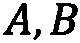 的运算，定义为：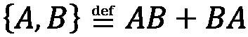。

### 反对易性 *

可以定义一组作用于局部电子模式的费米子湮灭算符和创建算符，它们满足反对易关系。

### 原子

构成化学元素的基本粒子。它由一个由电子围绕的原子核组成，电子以轨道排列，以概率描述其位置。原子没有整体电荷。

### 原子序数

一个数字，通过指定原子中的质子/电子数量来识别原子。

### 原子或分子轨道

一个数学函数，描述了在原子或分子中，在特定时间、特定空间点找到电子的概率。

### 原子模拟环境 (ASE)

一套工具和 Python 模块，用于设置、操作、运行、可视化和分析原子模拟。

### 基组

一组函数，通过线性组合来创建分子轨道。

### 波恩-奥本海默 (BO) 近似

这是这样的假设，即分子中原子核和电子的波函数可以分别处理，这样电子运动和核运动可以分开。

### 拉布里-基塔耶夫 (BK) 变换

一种将费米子系统的占据态映射到量子比特的变换方法。这种变换将 n 个相互作用的费米子的哈密顿量映射到 n 个量子比特的 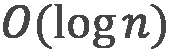 本地哈密顿量。

### 质心 (COM)

质量分布的平均位置，这是许多体系统中元素质量的加权平均值。

### 克莱布施-戈登 (CG) 系数

在未耦合的张量积基中，耦合总角动量和/或自旋动量的展开系数。

### 对易子 *

两个算符 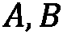 的运算，定义为：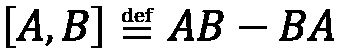。对于任何算符  和 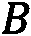，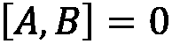 当且仅当  和 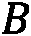 对易。可以证明，如果一个量子系统有两个同时物理可观测的量，那么代表它们的厄米算符必须对易。

### 完成

对于一个函数，其中包含了表示该量子系统所需的所有统计上重要的数据，使得性质的计算收敛到极限，即一个单一值。

### 构造性干涉

当两个或多个波相加，使得产生的波振幅等于各个振幅之和时。

### **耦合簇**（CC）

一种理论，它使用指数簇算子构建多电子波函数，该算子是所有单激发算子的和，所有双激发算子的和，等等。

### **密度泛函理论**（DFT）

一种基于量子力学第一原理（从头计算）的模拟方法，在空间上依赖于描述原子系统、原子、分子和晶体电子结构性质的密度泛函。

### **密度矩阵**

基于概率、平均值和测量结果来描述量子系统的状态。

### **破坏性干涉**

当两个波的最大值相差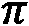弧度时，产生的波振幅较小，甚至可能为零振幅，这种现象称为**破坏性干涉**。

### **狄拉克符号**

**狄拉克符号**也称为**括号符号**。量子系统的状态，或波函数，由一个**括号**表示，它是一个坐标和/或变量的列向量。**括号**表示一个线性函数，它将每个列向量映射到一个复共轭的行向量。行向量对列向量的作用。

### **特征值**

当对向量应用线性变换的结果是向量乘以一个标量时，则该向量称为**特征向量**，而该标量称为与该线性变换相关的**特征值**。

### **电子**

一个具有负电荷的稳定亚原子粒子，是所有原子的组成部分，是固体中电的主要载体。

### **电子结构分子哈密顿算子**

分子的哈密顿算子代表所有粒子的总能量，包括电子和核子，由所有粒子的动能之和以及所有粒子之间的势能之和组成。

### **纠缠**

如果多粒子系统的波函数不能分解为单个粒子函数的乘积，那么量子系统就被认为是**纠缠**的。

### **交换算子**

这是一个操作符，它交换粒子的非物理标签。它作用于 Fock 空间中的状态，并确定相同粒子是玻色子还是费米子。

### **期望值**

这是测量一个状态的所有可能结果的和，这些结果根据它们的概率加权。

### **显式相关高斯**（ECG）

这是所有粒子对之间距离的平方，以指数形式表示。

### **显式相关高斯基函数**（ECGs）

集合中有多于一个的 ECG。

### **费米子**、**费米子**、**电子湮灭算子**

一种数学运算，允许我们表示准粒子的激发或跃迁。激发需要初始状态比最终状态具有更低的能量水平。

### **费米子**、**费米子**、**电子创建算子**

一种数学运算，允许我们表示准粒子的去激发（退激发）或跃迁。去激发需要初始状态比最终状态具有更高的能量水平。

### 费米子、费米子、电子激发算子 *

一种数学运算，它将电子从占据的自旋轨道激发到未占据的轨道。

### 佛克空间

在量子力学中用于从单个粒子的希尔伯特空间创建变量或未知数量的相同粒子的量子态空间的代数结构。

### 高斯型轨道（GTOs）

在原子轨道线性组合（LCAO）方法中用作原子轨道的函数，用于表示分子中的电子轨道及其依赖的各种属性。

### 梯度下降

一种通过在给定点（该点处函数的梯度方向为最速下降方向）迭代地移动到函数梯度的相反方向来寻找函数局部最小值的优化算法。这可以比作一个球在景观中滚动。如果我们给球一个方向（通常是向下）的推动，球最终会落在最小值处。

### 哈密顿算子

与量子系统总能量相关的算子，它是势能算子和动能算子的和。

### 哈特里（Ha）

在分子轨道计算中常用的原子能量单位，定义为 ，其中  是里德伯常数，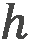 是普朗克常数， 是光速。

### 哈特里-福克方法

一种技术，用作近似方法，用于确定处于定态的量子多体系统的波函数和能量。

### 赫米特算子

一个等于其转置共轭的线性算子，即自伴的，并且具有与可观测量相对应的实特征值。

### 约尔丹-维格纳变换

约尔丹-维格纳变换广泛用于模拟与电子数量相同的量子比特的电子系统。它在每个量子比特中存储每个自旋轨道的占据情况，并将费米子创建和湮灭算子映射到泡利算子的张量积。

### 原子轨道线性组合（LCAO）

原子轨道的叠加。

### 磁量子数

描述电子在其子壳层中的能量水平以及电子轨道的取向，并表示为 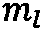。它可以取从 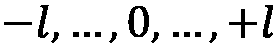 到的整数值，其中  是角动量量子数。

### 马尔可夫链蒙特卡洛（MCMC）

一种通过模拟具有目标概率分布的马尔可夫链的方法来从目标概率分布中产生样本的方法，其平稳分布是目标概率分布。

### 马尔可夫链理论（MCT）

一种近似方法，用于描述一个（非）量子系统，该系统可以占据各种状态，并且一旦确定了初始状态和状态之间的概率跃迁，其（时间）演化就定义了。

### 平均场理论 (MFT)

一种通过一个平均场与一个有效相互作用来减少系统多体相互作用的近似方法。

### Metropolis-Hastings (MH)

一种用于从概率中产生样本的马尔可夫链蒙特卡洛 (MCMC) 方法。

### 混合量子态

一个纯量子态的统计系综。

### 分子哈密顿量

表示分子粒子的总能量算符，包括所有粒子的动能之和以及所有粒子之间的势能之和。

### 分子轨道 (MO) 理论

一种通过应用密度泛函理论 (DFT) 或 Hartree-Fock 方法，将分子中电子的波函数（分子轨道）近似为原子轨道的线性组合（LCAO）的方法。

### 蒙特卡洛方法

任何用于解决问题的随机方法。

### 中子

一个电量为零、质量是电子的 1,838.68366173 倍的中子。中子比质子略重。

### 可归一化

一个满足其平方模积分有限的薛定谔方程的波函数，这意味着当在整个空间上积分时，正定乘积应小于无穷大。

### 核子

原子核的构成单元，即质子和中子。

### 核子（复数 nuclei）

每个原子的核心包含一个或多个质子和零个或多个中子，它们通过强核力结合在一起。

### 数值 Python (NumPy)

一个开源的 Python 库，几乎被用于科学和工程的每个领域。

### 占据数

在 Fock 空间的基中，如果自旋轨道状态未被电子占据，则与该自旋轨道状态相关的占据数为 0；如果被电子占据，则为 1。

### 占据数算符 *

一种作用于局部电子模式并满足反对易关系的算符。

### 占据数表示

第二量子化表示的同义词。

### 占据自旋轨道

被电子占据的自旋轨道。

### 奇偶变换

与 Jordan-Wigner 变换相反，奇偶算符是低权重，而占据算符成为高权重。

### 泡利不相容原理 (PEP) *

1925 年，泡利描述了电子的 PEP，该原理指出，同一原子的两个电子不可能同时具有以下四个量子数的相同值：主量子数、角动量量子数、磁量子数和自旋量子数。

随着各种类型的基本粒子的发现，电子的 PEP 已被推广到所有基本粒子和复合系统。对于费米子，总波函数必须对相同粒子对的交换具有反对称性。对于玻色子，总波函数必须对粒子对的交换具有对称性。对于同时包含相同费米子和相同玻色子的复合系统，上述操作必须同时成立。

### 泡利矩阵

一组三个  复合矩阵，它们是厄米矩阵、酉矩阵，并代表轨道和自旋角动量磁相互作用。

### 聚合酶链式反应（PCR）

一种放大技术，通过一系列相同的化学反应复制复杂的蛋白质。

### 势能面（PES）

系统的势能，通常是一个分子，描述了两个原子之间的键长和键角等参数的函数。

### 正定

这适用于矩阵、矢量和波函数，使得复共轭转置（†）乘以其自身，严格大于零。

### 主量子数

描述原子壳层中的能量水平或电子的位置，并从一数到包含该原子最外层电子的壳层，其范围从一到无穷大，因此它是一个连续的量子数。然而，当电子被激发到更高的值并从原子中解离出来时，它被认为是自由电子加上一个离子。这个过程称为电离，能量水平被认为是离散的。

### 氢离子

一种稳定的亚原子粒子，是原子核的组成部分，带有与电子等大的正电荷，其质量比电子高三个数量级。

### 模拟势

一种有效势，取代了完整的原子全电子势，消除了核心状态，并通过拟波函数描述价电子。

### 纯量子态

状态向量或波函数的同义词。

### 基于 Python 的化学模拟框架（PySCF）

由 Python 驱动的开源电子结构模块集合。

### 量子化学

一门旨在从量子力学的公设出发理解化学系统的化学分支。

### 量子力学

一种基本物理理论，从数学上描述了物质、能量以及光在亚原子粒子、原子和分子尺度上的相互作用的行为。

### 量子蒙特卡洛（QMC）

将蒙特卡洛方法应用于量子系统。

### 量子相位估计（QPE）*

一种测量量子态相位的算法。

### 量子工具箱在 Python 中（QuTiP）

解决量子力学问题的一般框架，例如由低能级量子系统和谐振子组成的系统。

### Qiskit

用于在脉冲、电路和应用模块级别与量子计算机一起工作的开源软件开发工具包（SDK）。

### 量子自然 SPSA（QN-SPSA）

一种基于 SPSA 并通过近似目标电路的保真度 Hessian 来采样自然梯度的梯度下降方法，用于优化系统。

### 量子比特

通过耦合角动量和自旋动量来表示的状态矢量，代表计算信息的一个量子位。

### 量子比特哈密顿量

表示为厄米矩阵的厄米算符。

### Rayleigh-Ritz 变分定理

系统哈密顿量的期望值总是与所求解的特征值相关的最低能量的上界。

### 限制 HF（RHF）方法

用于闭壳层分子的 HF 方法。自旋轨道可以是 alpha（自旋向上）或 beta（自旋向下），所有轨道都由 alpha 和 beta 自旋轨道双占。

### 限制开壳（ROHF）方法

用于开壳层分子的 HF 方法，其中每个自旋的电子数不相等。ROHF 尽可能使用双占分子轨道，对于未配对电子使用单占轨道。

### 第二量子化表示

在 Fock 态基中表示量子多体状态的表示。

### 顺序最小二乘规划（SLSQP）

由迪特·克劳特最初定义的顺序二次规划优化算法。

### 同时扰动随机近似（SPSA）

使用随机梯度近似并仅在每一步进行两次目标函数测量的梯度下降方法，用于优化系统。

### SymPy

一个用于符号数学的 Python 库。

### 单值

对于给定的输入变量，只有一个可能输出的函数。

### 斯莱特行列式波函数

当两个电子交换时，通过改变符号来满足 PEP 反对称标准的波函数表达式。

### 斯莱特型轨道（STOs）

用于通过原子轨道的线性组合（LCAO）来制定原子轨道和分子轨道的函数。

### 自旋投影量子数

给出沿指定轴的自旋动量 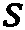 在给定空间方向上的投影，可以是自旋向上（+½）或自旋向下（-½），在量子计算中定义为 -轴。

### 自旋量子数

描述某种粒子类型的固有自旋动量；它因粒子类型而异，没有经典类似物来描述它。对于电子，它等于 1/2。

### 方积可积

对于域中所有可能值的积分，其绝对值的平方是有限的实值或复值函数。

### 状态矢量

用于表示量子态波函数的矢量。

### 超叠加

所有实数或复数基函数的线性组合。

### 总波函数*

描述系统的物理行为。它包含量子系统的所有信息，包括作为参数的复数。一般来说，它是系统中所有粒子的函数，包括空间位置、每个粒子的自旋方向坐标和时间

### 特罗特化

一种量子模拟截断方法，广泛用于在量子计算机上模拟非交换哈密顿量。

### 单体和双体单位耦合簇（UCCSD）

一种单位耦合簇理论，它使用指数簇算子构建多电子波函数，该算子是所有单激发算子的和以及所有双激发算子的和。

### 无限制的高斯场（UHF）方法

用于开放壳分子的高斯场方法（HF），其中每个自旋的电子数不相等。UHF 轨道可以是α或β自旋，但α和β轨道可能具有不同的空间分量。

### 变分蒙特卡洛（VMC）

一种实现变分方法的量子蒙特卡洛方法。

### 变分量子算法（VQA）

一种算法，它使用参数化量子线路来准备一个作为试探解（一个试探解法）的试探量子状态，并使用经典计算机优化该量子线路相对于目标函数的参数。

### 变分量子本征值求解器（VQE）

2014 年引入的一种算法，它使用基于量子硬件定义。它是目前科学界正在探索的几个变分量子算法（VQAs）中的第一个。在一个循环中，经典计算机优化量子线路的参数，使其相对于目标函数（如寻找分子的基态，即能量最低的状态）进行优化。参数化量子线路准备一个试探量子状态作为试探解（一个试探解法）。通过反复测量量子线路输出的量子位，我们得到与试探状态相关的能量可观察量的期望值。
