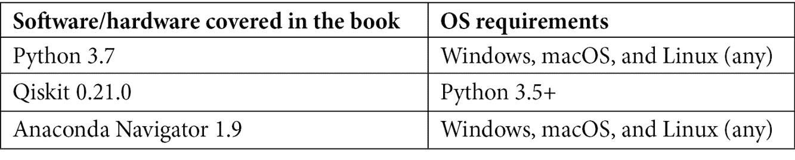

# 前言

**IBM Quantum Experience®** 与 **Qiskit®** 一起构成了一个流行且易于使用的量子计算平台。它们让您能够访问和编程实际的 IBM 量子计算机硬件，但您也可以在本地和基于云的模拟器上运行您的代码。

本书旨在教授您如何在 Python® 环境中实现量子编程，首先从基础水平开始，然后过渡到更高级的示例。本地可安装的 **量子信息科学工具包**（**Qiskit**）软件建立在 Python 之上，代表了今天学习量子计算最易于访问的工具。

在本书的所有食谱中，我们将逐步介绍 Qiskit 类和方法，从最基本的概念开始，例如安装和升级 Qiskit，检查您正在运行的版本，等等。然后，我们将继续了解创建和运行量子程序所需的构建块，以及如何将 Qiskit 组件集成到您自己的混合量子/经典程序中，以利用 Python 强大的编程功能。

我们将探索、比较和对比 **有噪声的中规模量子计算机**（**NISQ**）和通用容错量子计算机，使用模拟器和实际硬件进行，仔细研究模拟噪声后端以及如何在实际硬件上减轻噪声和错误，实现单比特量子纠错中的 Shor 代码方法。

最后，我们将探讨量子算法，看看它们与经典算法有何不同。我们将更深入地研究编码 Grover 算法，然后使用 Qiskit Aqua 运行 Grover 和 Shor 算法的版本，以展示您如何直接在 Qiskit 代码中重用已构建的算法。我们以 Qiskit、IBM 的量子信息科学工具包及其组成部分（Terra、Aer、Ignis 和 Aqua）的全面巡视为此。

我们还将使用在线 IBM Quantum Experience® 拖放式量子计算用户界面。本书中我们所做的一切，以及更多，都可以在 IBM Quantum Experience® 的云平台上进行编码。

每一章都包含代码示例，以解释每个食谱中教授的原则。

# 本书面向对象

本书面向开发者、数据科学家、研究人员和希望了解如何使用 Qiskit® 和 IBM Quantum Experience® 来实现量子解决方案的量子计算爱好者。对量子计算和 Python 编程语言的基本知识有益。

# 本书涵盖内容

这本烹饪书采用问题-解决方案-探索的方法，通过 IBM Quantum Experience®、Qiskit® 和 Python 的帮助，理解编程量子计算机的细微差别。

*第一章*, *准备您的环境*，将指导您如何在本地工作站上安装 Qiskit®作为 Python 3.5 扩展。您还将注册 IBM Quantum Experience®，获取您的 API 密钥，并获取示例代码。

*第二章*, *使用 Python 进行量子计算和量子比特*，展示了如何使用 Python 编写简单的脚本，以介绍比特和量子比特的概念以及量子门的工作原理，而无需使用 Qiskit®或 IBM Quantum Experience®。

*第三章*, *IBM Quantum Experience® – 量子拖放*，探讨了 IBM Quantum Experience®，这是 IBM Quantum 的在线、基于云的拖放工具，用于编程量子计算机。在这里，您将编写一个简单的程序，并学习如何在 Qiskit®和 IBM Quantum Experience®之间进行切换。

*第四章*, *从 Terra 开始起步*，探索了一组基本的量子程序或电路，以检查概率计算、叠加、纠缠等基本概念。我们还将在我们实际的物理 IBM 量子计算机上运行我们的第一个程序。

*第五章*, *使用 Qiskit®游览 IBM Quantum®硬件*，探讨了 IBM Quantum®后端，并探索了影响您量子程序结果的各种物理方面。

*第六章*, *理解 Qiskit®门库*，概述了 Qiskit®提供的开箱即用的量子门，以了解它们对您的量子比特做了什么。我们还将查看构成所有其他量子门的基础通用量子门，并从单量子比特门扩展到双、三量子比特以及更多量子比特门，这些是更高级量子电路所需的。

*第七章*, *使用 Aer 模拟量子计算机*，帮助您在您可以使用本地或云端的模拟器集合上运行您的电路。您甚至可以将您的模拟器设置为模仿 IBM Quantum®后端的行为，以便在您的本地机器上以实际条件测试您的电路。

*第八章*, *使用 Ignis 清理您的量子行为*，解释了如何通过理解我们的量子比特的行为来清理测量结果，并探讨了如何通过使用噪声缓解电路（如 Shor 码）来纠正噪声。

*第九章*, *Grover 搜索算法*，构建了 Grover 搜索算法，这是一种经典搜索算法的平方加速。我们将使用独特的量子工具，量子相位回弹。我们将构建几个不同版本的算法，以便在模拟器和 IBM Quantum®后端上运行。

*第十章*，*通过 Aqua 了解算法*，使用了两个最著名的量子算法的预制的 Qiskit Aqua 版本：Grover 搜索算法和 Shor 分解算法。我们还快速浏览了 Qiskit Aqua 算法库。

# 为了充分利用本书

如果您对基本量子计算概念有所了解，这将有所帮助；我们不会在证明或更深入的细节上花费太多时间。Python 编程技能也有帮助，尤其是在我们开始构建稍微复杂一些的混合量子/经典程序时。对线性代数（包括向量和矩阵乘法）的基本理解将肯定有助于您理解量子门的工作原理，但我们让 Python 和 NumPy 做艰苦的工作。

Qiskit® 支持 Python 3.6 或更高版本。本书中的代码示例是在 Anaconda 1.9.12 (Python 3.7.0) 上测试的，使用了其捆绑的 Spyder 编辑器以及 Qiskit® 0.21.0，并在 IBM Quantum Experience® Code lab 网上环境进行了测试。我们建议读者使用相同的配置。



**如果您使用的是本书的电子版，我们建议您亲自输入代码或通过 GitHub 仓库（下一节中提供链接）访问代码。这样做将帮助您避免与代码复制粘贴相关的任何潜在错误。**

## 下载示例代码文件

您可以从 GitHub 下载本书的示例代码文件：[`github.com/PacktPublishing/Quantum-Computing-in-Practice-with-Qiskit-and-IBM-Quantum-Experience`](https://github.com/PacktPublishing/Quantum-Computing-in-Practice-with-Qiskit-and-IBM-Quantum-Experience)。如果代码有更新，它将在现有的 GitHub 仓库中更新。

我们还有其他来自我们丰富的图书和视频目录的代码包，可在 [`github.com/PacktPublishing/`](https://github.com/PacktPublishing/) 获取。查看它们！

# 下载彩色图像

我们还提供了一份包含本书中使用的截图/图表的彩色图像的 PDF 文件。您可以从这里下载：[`static.packt-cdn.com/downloads/9781838828448_ColorImages.pdf`](https://static.packt-cdn.com/downloads/9781838828448_ColorImages.pdf)。

# 使用的约定

本书使用了多种文本约定。

`文本中的代码`：表示文本中的代码单词、数据库表名、文件夹名、文件名、文件扩展名、路径名、虚拟 URL、用户输入和 Twitter 账号。以下是一个示例：“`log_length(oracle_input,oracle_method)` 函数接受作为输入的或然输入（日志或二进制）和或然方法（逻辑表达式或位串），并返回 Grover 电路需要包含的理想迭代次数。”

代码块应如下设置：

```py
def log_length(oracle_input,oracle_method):
    from math import sqrt, pow, pi, log
    if oracle_method=="log":
        filtered = [c.lower() for c in oracle_input if             c.isalpha()]
        result = len(filtered)
```

任何命令行输入或输出都应如下编写：

```py
$ conda create -n environment_name python=3
```

**粗体**：表示新术语、重要单词或屏幕上看到的单词。例如，菜单或对话框中的单词在文本中显示如下。以下是一个示例：“点击作业结果框将打开**结果**页面，并显示您刚刚运行的作业的最终结果。”

小贴士或重要注意事项

显示如下。

# 章节列表

在这本书中，您将找到几个频繁出现的标题（*准备工作*、*如何操作……*、*工作原理……*、*还有更多……*和*参考内容*）。

为了清楚地说明如何完成食谱，请按照以下方式使用这些部分：

## 准备工作

本节将向您介绍在食谱中可以期待的内容，并描述如何设置任何软件或任何为食谱所需的初步设置。

## 如何操作……

本节包含遵循食谱所需的步骤。

## 工作原理……

本节通常包含对上一节发生情况的详细解释。

## 还有更多……

本节包含有关食谱的附加信息，以便您对食谱有更深入的了解。

## 参考内容

本节提供了对其他有用信息的链接，这些信息对食谱很有帮助。

# 联系我们

我们始终欢迎读者的反馈。

**一般反馈**：如果您对本书的任何方面有疑问，请在邮件主题中提及书名，并通过 customercare@packtpub.com 给我们发送邮件。

**勘误表**：尽管我们已经尽最大努力确保内容的准确性，但错误仍然可能发生。如果您在这本书中发现了错误，如果您能向我们报告，我们将不胜感激。请访问[www.packtpub.com/support/errata](http://www.packtpub.com/support/errata)，选择您的书籍，点击勘误提交表单链接，并输入详细信息。

**盗版**：如果您在互联网上以任何形式发现我们作品的非法副本，如果您能向我们提供位置地址或网站名称，我们将不胜感激。请通过 copyright@packtpub.com 与我们联系，并提供材料的链接。

**如果您有兴趣成为作者**：如果您在某个主题上具有专业知识，并且您有兴趣撰写或为书籍做出贡献，请访问[authors.packtpub.com](http://authors.packtpub.com)。

# 评论

请留下评论。一旦您阅读并使用过这本书，为什么不在您购买它的网站上留下评论呢？潜在读者可以查看并使用您的客观意见来做出购买决定，我们 Packt 可以了解您对我们产品的看法，我们的作者也可以看到他们对书籍的反馈。谢谢！

有关 Packt 的更多信息，请访问[packt.com](http://packt.com)。
