# 第三章：*第三章*：IBM Quantum Experience® – 量子拖放

在 2016 年初的云中发生了一件相当令人惊奇的事情；一种新型计算机向世界敞开了它的怀抱——一个可编程的量子计算机。

在本章中，我们将简要介绍 IBM Quantum Experience®的早期历史、如何到达那里以及如何开设用户账户。我们将查看用于编程 IBM 量子计算机（电路作曲家）的拖放用户界面。

此外，我们还将快速浏览一下如何通过使用底层的 OpenQASM 编码在 IBM Quantum Experience®和 Qiskit®之间来回移动。

本章我们将涵盖以下内容：

+   介绍 IBM Quantum Experience®

+   使用电路作曲家构建量子分数

+   投掷量子硬币

+   在世界之间穿梭

我们在这里不会停留太久；只需足够的时间来触及表面，展示我们将在*第四章*“从地面开始使用 Terra”中使用的量子电路，并感受一下可用的各种门。

# 技术要求

本章中我们将讨论的量子程序可以在这里找到：[`github.com/PacktPublishing/Quantum-Computing-in-Practice-with-Qiskit-and-IBM-Quantum-Experience/tree/master/Chapter03`](https://github.com/PacktPublishing/Quantum-Computing-in-Practice-with-Qiskit-and-IBM-Quantum-Experience/tree/master/Chapter03)。

如果您还没有，请为自己获取一个 IBM Quantum Experience®账户。有关信息，请参阅*第一章*“准备您的环境”中的*创建您的 IBM Quantum Experience®账户*。

# 介绍 IBM Quantum Experience®

**IBM Quantum Experience®**是一个开放平台，供人们开始他们的量子计算之旅。在这里，您可以免费访问一系列 IBM 量子计算机，从单个量子位到 15 个量子位（截至写作时），以及一个在 IBM POWER9™硬件上运行的 32 量子位模拟器。这将在您的指尖提供大量力量。

IBM Quantum Experience®于 2016 年 5 月开放，这是世界上首次宣布公众现在可以访问云中的实际量子计算硬件。从那时起，其他几家公司也宣布了类似的计划，并开放了云量子计算，最初是在*模拟器*上。在这一群人中，值得注意的是谷歌、微软、Rigetti、Qutech 等。截至本书编写时，IBM 通过其 IBM Quantum Experience®免费提供硬件和软件量子计算，我们将专注于该平台。

从您的网络浏览器中，访问以下 URL，并使用您的 IBM Quantum Experience®账户登录：[`quantum-computing.ibm.com/`](https://quantum-computing.ibm.com/)。

您现在位于 IBM Quantum Experience®的主着陆页，从这里您可以访问所有量子体验工具。

从这里，您将看到以下内容：

+   在右侧面板中，我们有可供你使用的后端。点击每个后端都会弹出一个数据页面，显示访问状态、提供商访问、芯片结构、错误率数据、量子比特数量、基门列表等。

+   在中心区域，你找到你的工作台。这里有最近创建的电路列表、当前正在运行的实验以及你之前的实验结果；当你第一次进入这里时，它将非常空。从这个区域，你还可以管理你的用户资料、配置通知、获取你的 API 密钥等。

+   在左侧，我们有主要工具和帮助资源。这些将在下一节的*如何做…*中更详细地描述。

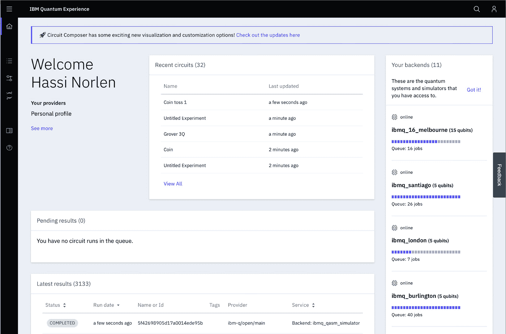

](img/Figure_3.1_B14436.jpg)

图 3.1 – IBM 量子体验®首页

现在我们已经成功登录并环顾四周，让我们来看看我们可用的量子计算编程工具。从右侧的主菜单中，你可以访问以下页面：

+   **结果**

+   **电路作曲家**

+   **量子实验室**

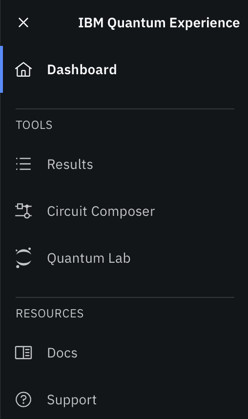

图 3.2 – IBM 量子体验®编程工具

现在我们来逐一查看这些页面。

## 结果

IBM 量子体验®的**结果**部分只是你挂起的作业和之前运行的量子计算程序的长列表。你可以通过执行时间、服务（后端）等变量进行搜索、排序和筛选：

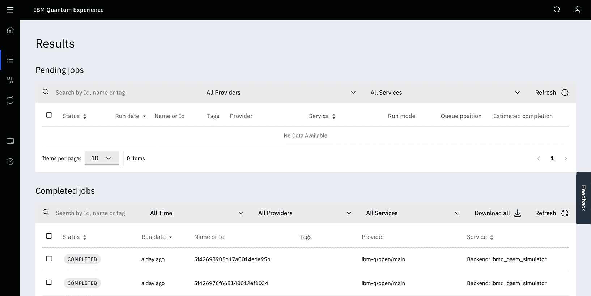

图 3.3 – 结果页面

IBM 量子体验®的**结果**面板不仅包括从**电路作曲家**运行的作业，还包括你使用具有相同 ID 的本地 Qiskit®在 IBM Quantum®后端运行的所有作业。

每个作业不仅包括你的作业结果，还包括其他数据，例如作业在处理每个阶段的停留时间、运行时间、作业状态、**转换后的**电路图以及电路的 OpenQASM 代码。

## 电路作曲家

电路作曲家是处理你的量子分数（即 IBM 量子体验®所说的使用电路作曲家工具构建的量子程序）的主要工具。我们将在本章的食谱中详细介绍它，但在这里我会为你快速概述其组件：


图 3.4 – 电路作曲家文件页面

就像**结果**面板有一个作业列表一样，**电路作曲家文件**面板有一个你的**电路**列表。从这里，你可以打开和运行你使用电路作曲家创建的所有电路。

你还可以点击**新建电路**从头开始，这将在未命名的电路上打开电路作曲家：


图 3.5 – 电路作曲家中的空白电路

无 Qiskit®重叠

与 **结果** 窗格不同，Circuit Composer 窗格不包含您从本地 Qiskit® 环境运行的任何电路。这里只有您在 IBM Quantum Experience® 中创建的量子分数。如果您想在这里看到您的 Qiskit® 电路，必须将它们作为 OpenQASM 代码导入。请参阅本章末尾的 *在两个世界之间移动* 食谱。

一旦您打开或创建了一个电路，一系列新的工具将打开以帮助您构建您的量子分数。这些将在下一食谱 *使用 Circuit Composer 构建 quantum scores* 中介绍。

## 量子实验室

第三个工具包是由 Qiskit® 团队整理的 Jupyter Notebook 教程集合。您可以从 **Qiskit tutorials** 磁贴访问它们。您也可以从该面板创建您的 Jupyter Notebooks，它们将像之前窗口中的电路一样显示在此窗口中：

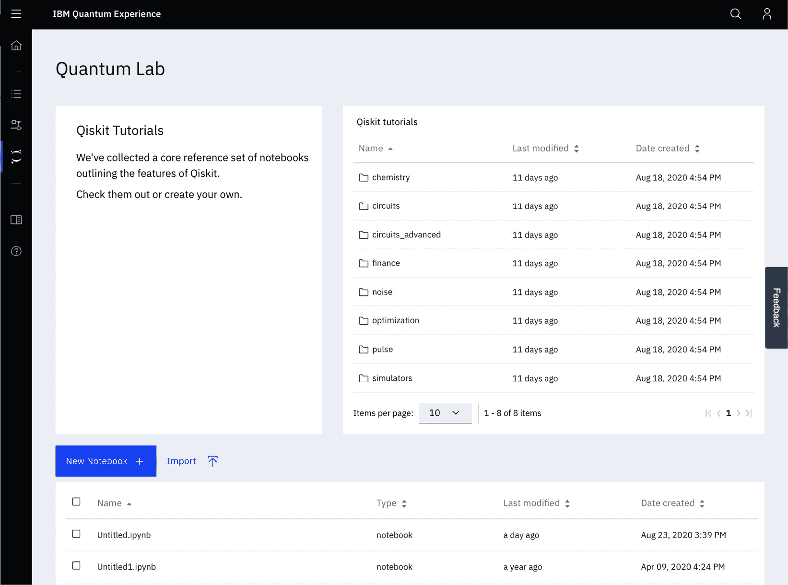

图 3.6 – 量子实验室

在笔记本中运行 Python 程序

您还可以使用 Jupyter Notebook 环境运行本书中包含的量子计算 Python 示例脚本。查看 *第一章* 中的 *下载代码示例* 食谱，*准备您的环境*，以快速回顾。

除了您将用于编写量子程序的工具外，IBM Quantum Experience® 还包括一些扩展的帮助，形式为两个额外的页面：

+   **文档**：此页面包含了一系列入门教程，Circuit Composer、算法等更广泛的说明。这是在您完成本书的学习后探索 IBM Quantum Experience® 的一个好起点。

+   `ibm-q-experience`) 和 Qiskit® (`qiskit`)。这些社交环境充满活力且反应迅速，您可以以互动的方式提出问题、分享想法等。知识渊博的成员和版主不会长时间不回答问题！

# 使用 Circuit Composer 构建 quantum scores

本食谱将指导您完成在 IBM Quantum Experience® 中创建量子分数的基本步骤，以了解作曲家的工作方式，如何构建和修改分数，以及最后如何使用 **Inspect** 功能逐步分析分数。

拖放编程

本章中的食谱将在 IBM Quantum Experience® 网络环境中运行，使用拖放界面，以直观的方式很好地可视化您正在做的事情。

## 如何操作...

让我们构建自己的一个小型量子分数：

1.  从您的网络浏览器（Chrome 似乎效果最好），访问以下 URL，然后使用您的 IBM Quantum Experience® 账户登录：[`quantum-computing.ibm.com/`](https://quantum-computing.ibm.com/)。

1.  在左侧面板中，选择 **Circuit Composer**。

    这将打开作曲家到一个空白 **未命名电路**。

1.  可选：设置要操作的量子比特数量。

    在默认设置中，你会看到三行，就像乐谱一样（因此得名量子代码）。每一行代表一个量子比特，基本代码是为 5 量子比特机器设计的。如你将在*第五章*中看到的“使用 Qiskit® 遍历 IBM Quantum® 硬件”，“比较后端”食谱，这目前是免费 IBM 量子机器最常用的设置。

    对于这个例子，我们只想使用 1 个量子比特以保持清晰。如果我们使用所有五个，显示的结果也将包括我们不会使用的四个的结果，这可能会造成混淆。

    因此，在你刚刚打开的**未命名电路**选项卡中，将鼠标悬停在量子比特标签（**q0**）上。标签会变成一个垃圾桶图标。使用这个图标移除量子比特，直到只剩下一个为止。你的量子代码现在只有一行。

    在这一行前面是标签，**q0**，这是你的量子比特的名称：

    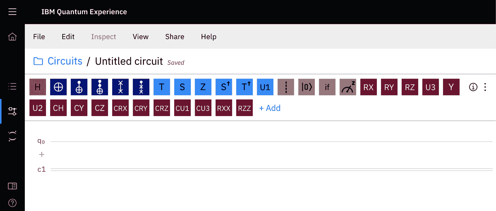

    图 3.7 – 空的 1 量子比特量子代码

1.  将  门添加到代码中。

1.  现在将  门拖到你的代码的**q0**行。

    小贴士

    如你将在*第四章*中进一步看到，“从 Terra 的基础开始”，在 Qiskit® 中，NOT 门用 **X** 表示。

    你现在添加了一个 X，或者 NOT 门，它将量子比特从其初始设置值 0 翻转到 1：

    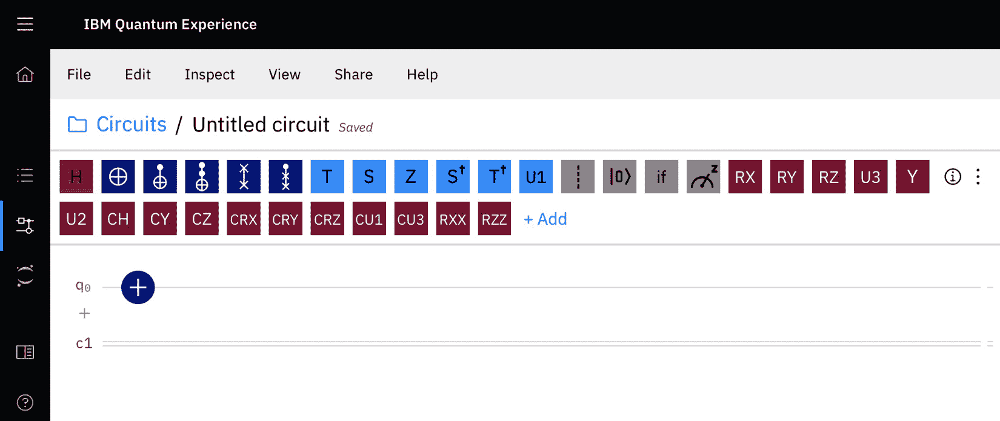

    图 3.8 – 添加了 NOT 门

    操作术语表

    要获取有关可用指令的更多信息，请点击电路作曲家右上角的（**i**）图标，并选择**操作术语表**以打开对所有指令（门、测量等）的详尽指南。

1.  现在，添加一个测量指令来完成你的电路。

    如果你想运行你的代码并获得结果，则需要测量指令。它测量**q0**量子比特的状态，并将结果（0 或 1）写入经典寄存器（**c1**），这样你就可以看到实验的结果。

    在多量子比特电路中，没有必要显示所有经典寄存器作为线条。相反，它们由一个带有代表其数量的经典寄存器标签的线条表示；例如，**c5**代表五个经典寄存器：

    

    图 3.9 – 添加了测量指令

1.  你现在可以运行你的电路了。

    可选地，通过首先选择**未命名电路**并为实验起一个好名字来保存电路。

    点击**在 ibmq_qasm_simulator 上运行**按钮。

1.  查看结果。

    要查看作业结果，请点击位于**运行**按钮正下方的**作业**图标。作业的结果将显示：

    

    图 3.10 – 作业结果框

    点击作业结果框会打开**结果**页面，并显示你刚刚运行的作业的最终结果。在这种情况下，我们得到了一个**1**的结果，**100%**确定：

    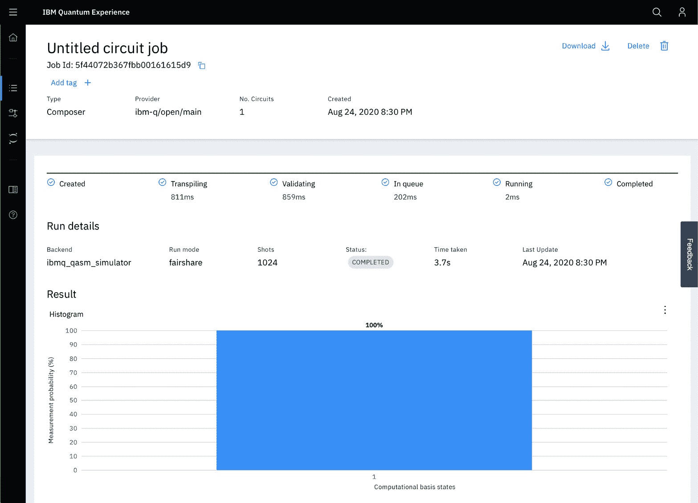

    图 3.11 – 作业结果：1，100% 确定性

1.  现在，让我们来玩一会儿。

    随意将一些量子指令拖到你的分数中，上下调整量子比特的数量。你现在正在构建复杂的量子电路，但并不一定是工作量子程序或算法。这就像在你经典计算机上随机焊接门，或者随机往锅里加食材做饭。你可能会得到某种结果，但可能没有什么有用的或可食用的。但这是很有趣的！

    这里有一个例子——看看你是否能重新创建它，然后检查它看看它做了什么（如果有）：


图 3.12 – 随机拖放电路

只需看看那个电路的复杂结果。我想知道它是什么？此外，注意页面底部的两个图形框：**测量概率**和**Q-球体**。我之前一直忽略了它们，但现在让我们来看看它们是什么。

## 更多内容

分数就像音乐乐谱一样从左到右，按时间顺序读取。这意味着乐谱左侧的门先于右侧的门执行。你可以通过使用作曲家的**检查**功能来检查你的电路应该如何表现：

1.  在 IBM Quantum Experience® 中，打开你刚刚创建的电路，该电路包含一个量子比特、一个 NOT 门和一个测量指令。

1.  从顶部菜单中选择**检查**。

    在打开的**检查器**窗口中，你现在可以通过点击**>**来逐步查看你的分数，以了解代表你的量子比特的状态向量是如何随着你应用门而变化的。你还会看到所谓的 Q-球体，它是电路可能结果的图形表示。我们第一次在*第二章*中遇到了状态向量，*使用 Python 进行量子计算和量子比特*。更多关于 Q-球体的信息可以在*第六章*中找到，*理解 Qiskit® 门库*。

    在我们的情况下，只有一个 X 门，因为我们把量子比特设置为从 0 开始，我们预计状态向量将从  开始，然后在我们应用第一个 X 门时变成 ：


图 3.13 – 将 X 门的作用可视化为我们量子比特的状态向量以及 Q-球体

Q-sphere 指示我们将只得到一个结果，并且这个结果将是 。如果你将 **Statevector** 显示切换到 **Measurement Probabilities** 选项，你可以验证我的说法，即电路确实应该每次都产生 100%的结果：

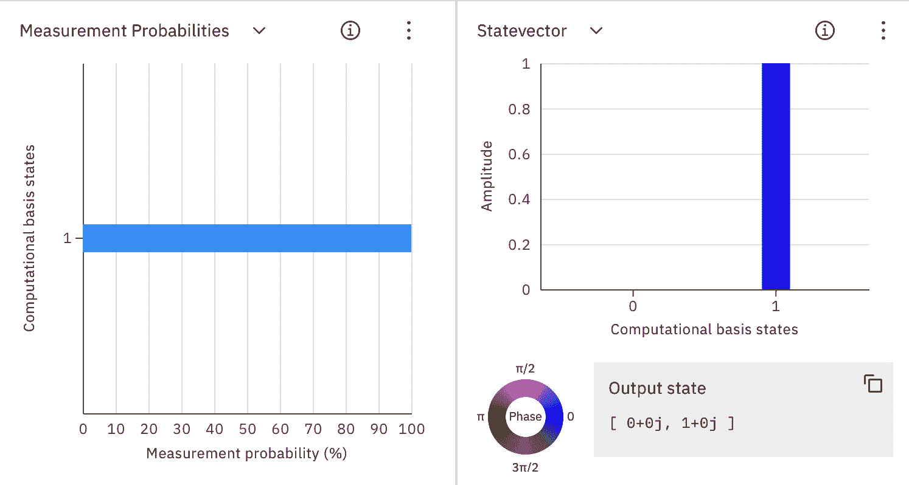

图 3.14 – 以 100%的确定性得到结果 1

**Inspect** 工具允许你在任何门处测试你的电路。在实际量子计算机上运行时，这是不可能的，因为测试量子位就等同于测量它，然后量子位会失去其量子特性，表现得像经典比特。这里所做的是使用状态向量模拟器快速运行到那个点的电路。

如果你想在检查中包含初始  状态，那么在你的电路的第一个门之前添加一个障碍指令。障碍不会操作量子位，但会让 **Inspect** 工具记录量子位的初始状态：

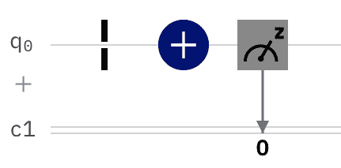

图 3.15 – 在第一个门之前添加障碍门

在接下来的章节中，我们将创建一个 **Inspect** 功能的变体，在我们运行电路之前查看它们。更多信息，请参阅 *第四章* 中的 *Visualizing circuits and results* 菜单，*从 Terra 的基础开始*。

# 抛量子硬币

我使用的例子之一可能是你可以构建的最简单有用的量子程序：模拟抛硬币。

我们将在 *第四章* 的 *从 Terra 的基础开始* 中更详细地介绍量子抛硬币，但我会在这里使用那个程序作为例子。它非常小，而且理解起来并不复杂。

如我们简要讨论过的 *第二章* ，*使用 Python 进行量子计算和量子比特*，与经典计算机相比，量子计算机为你提供概率性或随机计算。在这种情况下，我们将我们的量子比特设置为一种叠加态，当我们测量量子比特时，它会产生得到 0 或 1、或正面或反面的概率。

## 如何做到这一点...

构建量子电路并运行它。这是我们将在本书的 Qiskit® 部分稍后回过头来讨论的电路：

1.  登录到 IBM Quantum Experience® [`quantum-computing.ibm.com/composer`](https://quantum-computing.ibm.com/composer)。

1.  在 IBM Quantum Experience® 中，从左侧面板选择 **Circuit Composer**。

1.  创建一个新的电路。

1.  找到你需要的大门。

    在这个菜谱中，我们将只使用两个量子指令，其中一个我们在**第二章**，*使用 Python 的量子计算和量子比特*中的*Hadamard 门*菜谱中简要讨论过。记住，H 门将输入量子比特创建一个叠加态。

    我们还将使用测量指令来测量量子比特并将结果写入分数底部的经典比特行。

1.  通过从作曲家的**门**部分拖动 H 门到第一个量子比特行来构建电路。然后，将**测量**指令拖到同一行，放在 H 门右边。你的量子分数现在完成了。你的电路应该看起来像这样：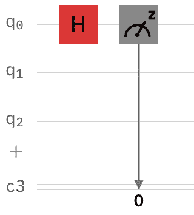

    图 3.16 – 简单的抛硬币电路

    但为什么我有这么多我没有使用的量子比特？

    作曲家默认设置的量子比特数量是**3**。只要你在同一个量子比特上放置**测量**指令，你就可以将你的 H 门放在任何你想要的量子比特上。

    没有什么阻止你在每个量子比特上放置一个 H 门，然后跟一个**测量**门。你那时正在构建一组五个同时抛硬币。

    你也可以通过点击位于最低量子比特直接下方的**+**图标，或者将鼠标悬停在量子比特上并点击出现的垃圾桶图标来更改量子比特的数量。

1.  通过首先点击**未命名电路**并给实验起一个好名字，然后保存电路来保存电路。现在你的电路已经准备好运行了。

1.  点击**在 ibmq_qasm_simulator 上运行**按钮。

1.  查看结果。

    要查看作业的结果，请点击位于**运行**按钮正下方的**作业**图标。等待作业显示**完成**结果，然后点击作业结果框以打开**结果**页面。你的 1,024 次相同电路运行产生了两个可能结果 0 和 1 的统计 50/50 分布，正如我们在**第二章**，*使用 Python 的量子计算和量子比特*中的*快速介绍量子门*菜谱中预期的那样。结果看起来可能如下：

    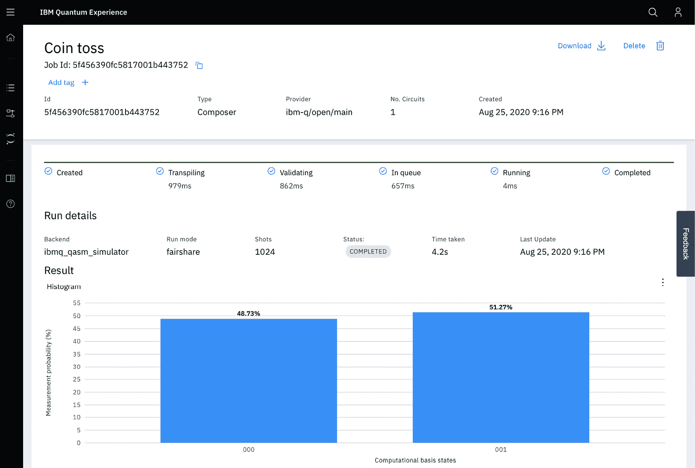

    图 3.17 – 我们量子抛硬币的 50/50 结果，一半正面和一半反面

    在这里，输出得到 0 或 1 的概率大致相等，就像一个物理硬币，正面和反面的概率大致相等。

1.  在真实的量子计算机上运行你的分数。

    但实际上，在模拟器上运行你的分数可能有些令人失望。这并不是你开始量子计算之路的原因。但不用担心，我们可以做得更好。

    我们将再次运行分数，但选择非模拟后端。对于这个简单的量子分数，如果后端真的没有调好，1 量子比特抛硬币的结果将是相同的。然而，对于更复杂的量子程序，模拟器和真实量子计算机的结果可能会有所不同。

1.  点击**运行设置**按钮，然后选择除**ibmq_qasm_simulator**之外的其他**后端**。

    要了解每个后端可能需要等待的时间，您可以访问主**IBM Quantum Experience**仪表板，查看后端的各个队列。

1.  等待结果。

    要查看作业结果，请点击位于**运行**按钮正下方的**作业**图标。等待作业显示**完成**结果，然后点击作业结果框以打开**结果**页面。

    排队

    默认情况下，您的量子分数将在模拟一个通用 32 量子比特量子计算机的在线 IBM Quantum®模拟器上运行。模拟器是测试和调整您的量子分数以确保它们按预期运行的好方法。在模拟器上运行通常非常快。然而，在真实的量子计算机上运行可能需要更长的时间，因为您将与其他用户共享这些计算机。

1.  结果可能看起来像以下这样：

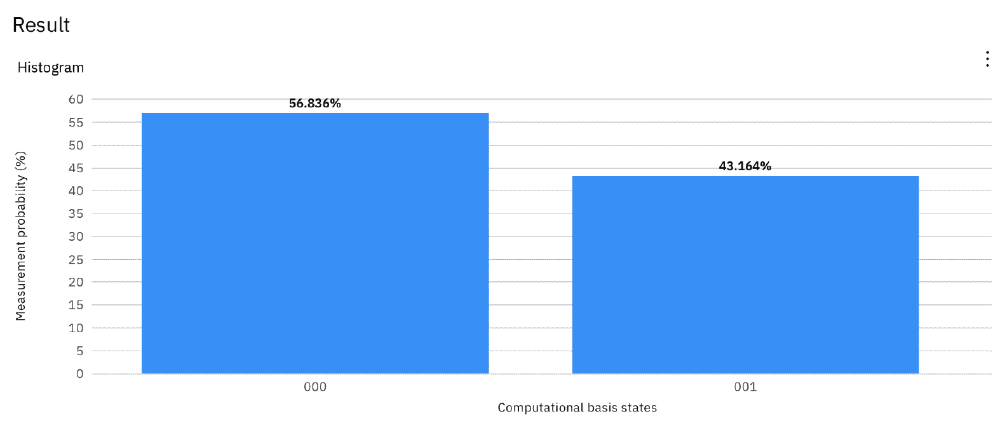

图 3.18 – 在真实量子计算机上的量子抛硬币结果

注意结果看起来与您在模拟器上得到的结果相当相似。这通常情况下是成立的，除非您运行分数的物理量子计算机量子比特不平衡，并且偏向于某一结果而不是另一个。记住，实际的量子比特是物理实体，而不是完美的数学抽象。在*第五章*，“使用 Qiskit®游览 IBM Quantum®硬件”，我们将探讨其他事项，例如单个量子比特的行为，以及当在它们上运行电路时可以期待什么。

## 还有更多

非模拟后端只能固有地运行一组基门，所有其他门都是基于这些基门构建的。当您运行量子程序时，它会被软件解释，相当复杂的高级门架构会被转换为`u1`、`u2`、`u3`、`id`和`cx`。结果是，您在 Qiskit®上编写的所有量子程序都可以仅使用这些门来表示。

您可以从 IBM Quantum Experience®网页控制台的**您的后端**部分看到量子后端使用的基门，通过点击您感兴趣的后端：

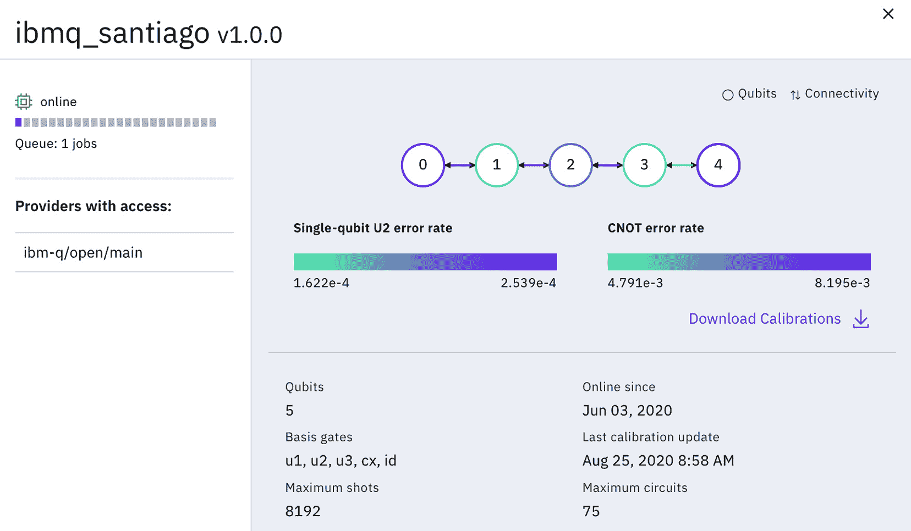

](img/Figure_3.19_B14436.jpg)

图 3.19 – ibmq_santiago 后端基门为 u1、u2、u3、cx 和 id

这为什么重要呢？嗯，将门（在您的分数中）转换为可以在后端运行的基门的过程称为 **转换**，并在运行程序之前完成。转换器将您的输入分数转换为基门，然后这些基门在后端运行。

现在，结果是您所使用的常规门并不总是可以直接转换为单个基门。有时转换器必须做一些工作，通过用其他门的簇替换您的门来重构您的电路。

例如，这里是在 IBM 的 5 量子比特机器上运行的简单量子抛硬币的原始和转换版本：

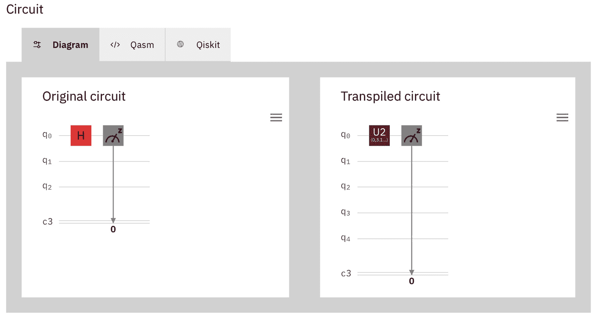

图 3.20 – 原始和转换后的量子抛硬币

如您所见，变化不大。**H** 门现在是一个 **U2** 门，输入为 0 和 ，我们的简化 3 量子比特分数被后端实际五个量子比特所取代。但电路的深度保持不变 – 两个门长。

对于更复杂的电路，事情变得更加复杂，主要是因为其中包含其他门。在下面的例子中，它来自 *第九章*，*Grover 搜索算法*，除了 X 和 H 门之外，还有更复杂的门，例如具有两个输入和一个输出的 **受控-受控非**（**CCX**）门。原始分数的深度为 22 门：


图 3.21 – 三量子比特的原始 Grover 搜索算法

因为量子计算机后端不能直接使用 X、H 和 CCX 门，所以这些门必须转换为 U 和 CX 门。转换后的分数深度为 49 门：

_B14436-01.jpg)

图 3.22 – 转换后的三量子比特 Grover 搜索算法

障碍的重要性

如果您仔细观察原始的 Grover 电路，您会注意到在某些位置，您会看到两个相同类型的门紧挨着。记得从 *第二章*，*使用 Python 的量子计算和量子比特*，量子门是可逆的，并且两个连续的相同门可能会简单地相互抵消。如果我们让转换器工作，它就会移除重复的门以简化电路。这通常不是最好的解决方案，因为这些门可能是需要保持完整的大结构的一部分。

这就是障碍组件和分数中的垂直灰色栏发挥作用的地方。一个**障碍**告诉编译器不要跨过它；如果两个相同的门由一个障碍隔开，编译器不会删除它们，而是将每个门转换为正确的门类型。看看 Grover 分数的编译器版本，你就会明白我的意思。

# 在世界之间移动

现在你已经看到了如何在电路作曲家中创建你的量子分数，以及如何在模拟器和真实的 IBM 量子计算机上运行它们。但本书的其余部分将关于如何在 Qiskit®中使用你的程序进行工作。那么我们就此告别 IBM Quantum Experience®吗？

还不快呢。IBM Quantum Experience®是一个很好的环境，用于学习如何构建量子分数，你不必调试 Python 代码或担心你的环境是否更新（IBM 为你处理这些），实际上，将你在 IBM Quantum Experience®中创建的内容移动到 Qiskit®非常简单。

你有两个选项：

+   **Qiskit®**：使用 Qiskit®代码导出，你的量子分数被转换为可以直接粘贴到 Python 解释器中并运行的 Python 代码。这是从 IBM Quantum Experience®到 Qiskit®的单程之旅。

+   使用 Qiskit®中的`QuantumCircuit.from_qasm_str()`方法导入该代码。要反向操作，使用`<circuit>.qasm()`从 Qiskit®导出你的电路，然后将其粘贴到**代码编辑器**中以进行反向操作。

## 准备工作

该食谱的 Python 文件可以从这里下载：[`github.com/PacktPublishing/Quantum-Computing-in-Practice-with-Qiskit-and-IBM-Quantum-Experience/tree/master/Chapter03`](https://github.com/PacktPublishing/Quantum-Computing-in-Practice-with-Qiskit-and-IBM-Quantum-Experience/tree/master/Chapter03)。

## 如何做到这一点...

让我们先从导入你的抛硬币实验的 QASM 代码开始：

1.  从你的网络浏览器中，访问以下 URL，然后使用你的 IBM Quantum Experience®账户登录：[`quantum-computing.ibm.com/`](https://quantum-computing.ibm.com/)。

1.  选择**电路作曲家**，在导航栏中点击**电路**。

1.  在**电路作曲家**文件页面上，点击你的**抛硬币**电路。

1.  在**电路作曲家**窗口中，在左侧面板中选择**<\>代码**编辑器。

1.  要将你的量子分数导出为 Qiskit®代码，在下拉菜单中选择`print(circuit)`行并运行代码。这将产生类似以下输出的结果：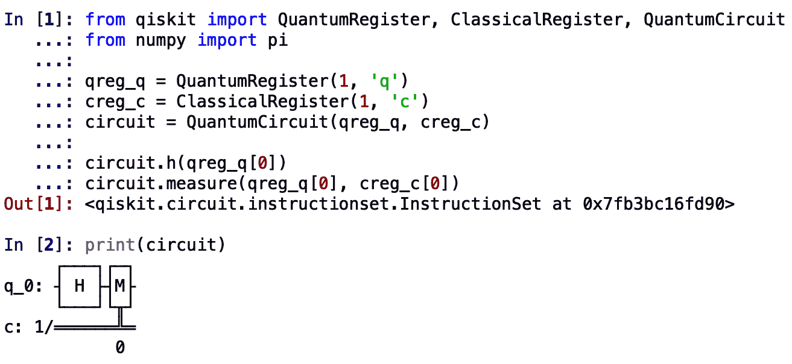

    图 3.23 – 导出的抛硬币 Python 代码及其输出

1.  要将你的量子分数导出为 QASM 代码，在下拉菜单中选择`.qasm`文件，然后将其导入到 Qiskit®中。

1.  现在，转到你的 Qiskit®环境，并运行`ch3_r1_import_qasm.py`文件。如果你忘记了如何到达那里，请查看*第一章*，*准备你的环境*中的*打开配方文件*配方。

1.  对于这个简单的食谱，我们只需要 `QuantumCircuit` 方法，所以我们将添加它：

    ```py
    from qiskit import QuantumCircuit
    ```

1.  首先，我们从 IBM Quantum Experience® 导入 QASM 字符串，无论是作为粘贴的字符串还是作为保存的文件：

    ```py
    qasm_string=input("Paste in a QASM string from IBM     Quantum Experience (or enter the full path and file     name of a .qasm file to import):\n")
    if qasm_string[-5:] == ".qasm":
        circ=QuantumCircuit.from_qasm_file(qasm_string)
    else:
        circ=QuantumCircuit.from_qasm_str(qasm_string)
    ```

1.  如果你将 QASM 代码粘贴到提示符中，你最终会得到以下示例类似的内容。如果你输入文件名，文件将被导入，结果大致相同：

    ```py
    Ch 3: Moving between worlds 1
    -----------------------------
    ```

1.  从 IBM Qx 粘贴一个 QASM 字符串（或输入完整路径和文件名以导入 `.qasm` 文件）：

    ```py
    OPENQASM 2.0;
    include "qelib1.inc";
    qreg q[1];
    creg c[1];
    h q[0];
    measure q[0] -> c[0];
    ```

1.  按 *Enter* 键，电路将被导入到 Qiskit®，现在可以用于量子计算。最后的 print(circuit) 应该显示以下内容：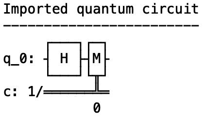

    图 3.24 – 导入的抛硬币量子电路

1.  你现在已经将你的 QASM 代码导入到 Qiskit® 并创建了一个名为 `circ` 的量子电路对象。

现在让我们尝试从 Qiskit® 创建和导出 OpenQASM 代码：

但我还没有学会如何用 Qiskit® 编码

到目前为止，你还没有在 Qiskit® 中创建任何量子电路。不用担心，我们将使用 `random_circuit()` 方法创建随机电路，你可以导出并导入到 IBM Quantum Experience® 中查看。

1.  在你的 Qiskit® 环境中，打开 `ch3_r2_export_qasm.py` 文件。

1.  导入的随机电路方法如下：

    ```py
    from qiskit.circuit.random.utils import random_circuit
    ```

1.  首先，我们创建并打印一个随机量子电路：

    ```py
    circ=random_circuit(2,2,measure=True)
    ```

    在这个例子中，随机电路的深度设置为 `2`，这意味着我们将创建一个最多包含两个门的电路。量子比特的数量也设置为 `2`，结果显而易见。你可以调整这些数字来查看会出现什么。

    电路可能看起来像这样：

    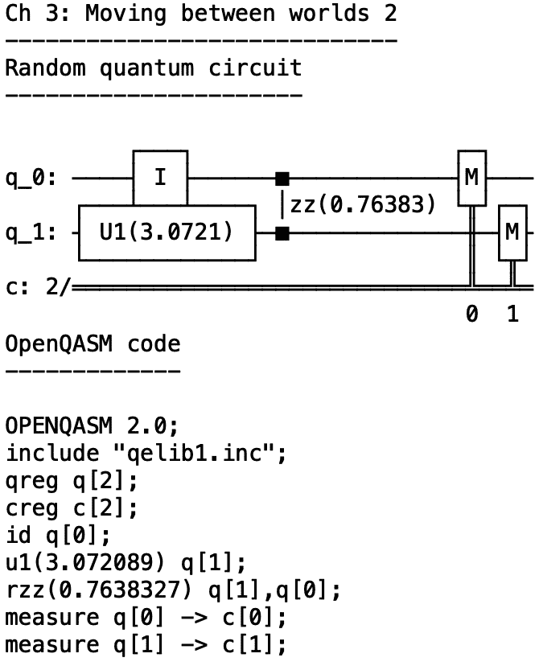

    图 3.25 – 随机创建的电路

1.  接下来，我们将电路导出为 QASM 代码：

    ```py
    circ.qasm(formatted=True, filename="Circuit.qasm")
    ```

    QASM 代码被显示，并且也被保存到你的本地环境中，文件名由你指定：

    ```py
    OPENQASM 2.0;
    include "qelib1.inc";
    qreg q[2];
    creg c[2];
    id q[0];
    u1(3.072089) q[1];
    rzz(0.7638327) q[1],q[0];measure q[0] -> c[0];
    measure q[1] -> c[1];
    ```

1.  回到 IBM Quantum Experience®，你现在可以进入你刚刚创建的 `Circuit.qasm` 文件中的电路编辑器。

1.  观察你的电路立即出现在电路作曲家：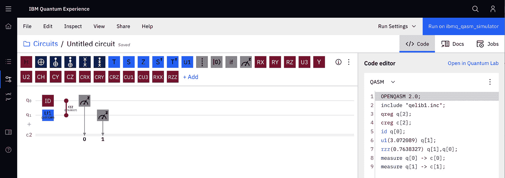

    图 3.26 – 导入的随机生成电路

1.  你现在可以运行电路，将新门拖放到电路中，或者只是移动或调整现有门以查看你的更改如何使电路表现不同。别忘了使用 **Inspect** 功能、**测量概率** 和 **Q-sphere** 显示来逐步查看你的电路并了解其工作原理。

## 它是如何工作的...

当你使用 `circ=QuantumCircuit.from_qasm_file()` 方法导入你的量子分数时，你分配给它的 `circ` 对象现在是一个 `QuantumCircuit()` 对象，这与你在后续章节中创建量子电路的方式非常相似。

使用 Qiskit®，你可以显示电路，向电路中添加门，等等。

在本章中，我们将不会对电路进行任何复杂的操作，但在此处做一个书签，以便你在开始创建自己的电路时回到*第四章*，从“地面开始”使用 Terra。

## 更多内容

当你阅读这本书时，你将主要在你的 Python Qiskit®环境中运行实验。如果你想，你可以将你在 IBM Quantum Experience®环境中构建的电路拉过来，在这里也运行它们。也许你更喜欢图形拖放环境，并且可以实时编辑你的分数？

在接下来的 Qiskit® Python 示例中，我们将创建名为`qc`、`circ`、`circuit`等命名的`QuantumCircuit`对象。你可以将这些导出为 QASM，然后使用`circ.qasm(formatted=True, filename="Circuit.qasm")`命令将它们导入到 IBM Quantum Experience®。

如果你想，你可以使用`print(circ)`或`circ.draw()`函数来打印电路，然后在作曲家手动重新创建它。

### 我们从使用 IBM Quantum Experience®构建量子分数的示例代码

如果你记得，我们在本章第二个菜谱中展示了一个相当复杂但随机的电路。以下是该电路的 QASM 代码。你可以导入它并查看是否得到相同的结果：

```py
OPENQASM 2.0;
include "qelib1.inc";
qreg q[5];
creg c[5];
h q[0];
y q[1];
y q[2];
ch q[3],q[4];
ccx q[2],q[0],q[1];
u3(2.1128893,1.9882648,5.5897911) q[3];
tdg q[4];
cu1(3.0287577) q[1],q[4];
cu3(5.1184948,2.0719417,1.8609727) q[3],q[0];
s q[4];
z q[0];
ry(3.6419028) q[1];
rz(0.402055) q[2];
cu3(1.5290482,3.844241,4.4343541) q[2],q[3];
ccx q[4],q[0],q[2];
ch q[1],q[3];
measure q[0] -> c[0];
measure q[1] -> c[1];
measure q[2] -> c[2];
measure q[3] -> c[3];
measure q[4] -> c[4];
```

## 参考资料还有

关于 OpenQASM 的更多信息，请参阅以下出版物：

+   *开放量子汇编语言*，Andrew W. Cross，Lev S. Bishop，John A. Smolin，Jay M. Gambetta，[`arxiv.org/abs/1707.03429`](https://arxiv.org/abs/1707.03429)。

+   *OpenQASM* GitHub 项目：[`github.com/Qiskit/openqasm`](https://github.com/Qiskit/openqasm)。
