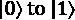
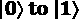
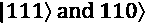
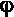

# 第八章：*第八章*: 使用 Ignis 清理你的量子行为

我们已经探索了在理想化的 Qiskit Aer 模拟器上运行我们的量子程序，并且在实际的 IBM Quantum 机器上亲自动手。我们明白真实的量子位是有噪声的，我们无法期望量子计算机能够解决任何具有重大实际意义的现实世界问题（至少目前还不能）。通往这一未来应用的途径在于对抗和减轻噪声和错误，而 Qiskit Ignis 就在这条道路上。

Qiskit® 包含了许多自动化功能，例如根据连接性和性能优化分配的量子位；但这种自动化在一定程度上受到量子芯片物理布局的限制，这决定了量子位如何相互通信。通过研究量子位性能并指定你想要与你的量子程序一起使用的实际物理量子位，你可以优化你的电路以实现最佳纠缠和去相干，仅举几个例子。

在本章中，我们将探讨在相同后端的不同量子位集上运行你的程序可能会如何导致你得到不同的结果。我们还将使用 Qiskit Ignis 方法对我们的简单算法在模拟和现有硬件上进行读出校正。

最后，我们将探讨使用 Shor 码进行量子纠错，看看你如何可以通过使用多个物理量子位进行量子纠错来创建一个单独的逻辑量子位。

在本章中，我们将介绍以下内容：

+   探索你的量子位以了解 T1、T2、错误和门

+   比较芯片上的量子位

+   估算你有多少时间可以用于门操作

+   使用读出校正来纠正预期结果

+   使用量子纠错来减轻意外情况

## 技术要求

本章中我们将讨论的量子程序可以在这里找到：[`github.com/PacktPublishing/Quantum-Computing-in-Practice-with-Qiskit-and-IBM-Quantum-Experience/tree/master/Chapter08`](https://github.com/PacktPublishing/Quantum-Computing-in-Practice-with-Qiskit-and-IBM-Quantum-Experience/tree/master/Chapter08).

# 探索你的量子位以了解 T1、T2、错误和门

让我们从一些快速概述开始，这些概述了当你将完美工作且经过模拟器验证的量子程序发送到实际的物理量子计算机时可能会出错的事情。正如我们所见，当我们离开完美的模拟量子位并开始使用在量子力学上工作的物理量子位时，我们也必须应对现实世界的另一个物理特性：噪声。

在量子计算机中，噪声在各个后端之间、后端上的量子位之间、不同类型的门之间以及每个量子位的读出之间都存在差异。构建和编程量子计算机确实是一项复杂的任务。

## 准备工作

用于此配方的文件可以从这里下载：[`github.com/PacktPublishing/Quantum-Computing-in-Practice-with-Qiskit-and-IBM-Quantum-Experience/blob/master/Chapter08/ch8_r1_gates_data.py`](https://github.com/PacktPublishing/Quantum-Computing-in-Practice-with-Qiskit-and-IBM-Quantum-Experience/blob/master/Chapter08/ch8_r1_gates_data.py)。

这个配方基于我们在*第五章*，*使用 Qiskit®工具游览 IBM Quantum®硬件*中完成的工作，但这次我们特别关注那些暗示事物可能出错多种方式的量子比特属性。

我们将使用`backend.properties()` Qiskit®方法提取以下针对量子比特的属性：

+   `t1()`: 给定量子比特的 T1 或弛豫时间

+   `t2()`: 给定量子比特的 T2 或去相位时间

+   `readout_error()`: 测量过程中误读量子比特的风险

+   `gate_length()`: 门的持续时间，以秒为单位

+   `gate_error()`: 门的错误估计

### 示例代码

1.  首先，我们导入所需的类并加载我们的账户：

    ```py
    from qiskit import IBMQ
    print("Getting providers...")
    if not IBMQ.active_account():
        IBMQ.load_account()
    provider = IBMQ.get_provider()
    ```

1.  我们在这里使用`select_backend()`来加载和显示可用的后端数据，然后提示选择一个：

    ```py
    def select_backend():
        # Get all available and operational backends.
        print("Getting backends...")
        available_backends = provider.backends(filters=lambda         b: not b.configuration().simulator and         b.configuration().n_qubits > 0 and         b.status().operational)
        # Fish out criteria to compare
        print("{0:20} {1:<10}".format("Name","#Qubits"))
        print("{0:20} {1:<10}".format("----","-------"))        
        for n in range(0, len(available_backends)):
            backend = provider.get_backend(str(            available_backends[n]))
            print("{0:20} {1:<10}".format(        backend.name(),backend.configuration().n_qubits))
        select_backend=input("Select a backend ('exit' to         end): ")
        if select_backend!="exit":
            backend = provider.get_backend(select_backend)
        else:
            backend=select_backend
        return(backend)F
    ```

1.  `display_information(backend)`函数检索后端信息，如量子比特数量和量子比特耦合图，然后使用这些信息遍历后端量子比特以检索 T1、T2、读出错误和门信息。该函数包含两部分。

    首先，我们收集量子比特信息：

    ```py
    def display_information(backend):
        basis_gates=backend.configuration().basis_gates
        n_qubits=backend.configuration().n_qubits
        if n_qubits>1:
            coupling_map=backend.configuration().coupling_map
        else:
            coupling_map=[]
        micro=10**6
    ```

    然后，我们打印出基本量子比特信息和每个门的具体量子比特信息：

    ```py
        for qubit in range(n_qubits):
            print("\nQubit:",qubit)
            print("T1:",int(backend.properties().            t1(qubit)*micro),"\u03BCs")
            print("T2:",int(backend.properties().            t2(qubit)*micro),"\u03BCs")
            print("Readout error:",round(backend.            properties().readout_error(qubit)*100,2),"%")
            for bg in basis_gates:
                if bg!="cx":
                    if backend.properties().                   gate_length(bg,[qubit])!=0:
                        print(bg,round(                        backend.properties().gate_                        length(bg,[0])*micro,2),"\                        u03BCs", "Err:",round(backend.                        properties().gate_error(bg,                        [qubit])*100,2),"%") 
                    else:    
                        print(bg,round(                       backend.properties().gate_                       length(bg,[0])*micro,2),"\                       u03BCs", "Err:",round(backend.                       properties().gate_                       error(bg,[qubit])*100,2),"%")
            if n_qubits>0:
                for cm in coupling_map:
                    if qubit in cm:
                        print("cx",cm,round(                       backend.properties().gate_                       length("cx",cm)*micro,2),"\                       u03BCs", "Err:",round(backend.                       properties().gate_                       error("cx",cm)*100,2),"%")
    ```

1.  主函数调用`select_backend()`和`display_information(backend)`函数，以帮助您查看所选后端的所有量子比特信息：

    ```py
    def main():
        backend=select_backend()
        display_information(backend)
    if __name__ == '__main__':
        main()
    ```

## 如何操作...

要探索特定后端的量子比特属性，请按照以下步骤操作：

1.  在您的 Python 环境中运行`ch8_r1_gates_data.py`。

    脚本加载 Qiskit®并获取并显示可用的后端列表，如下所示：

    

    图 8.1 – 选择一个后端进行调研

1.  当提示时，输入您想要查看的 IBM Quantum®后端的名称：

    我们现在为所选后端提取`backend.properties()`，并从这些属性中筛选并显示以下参数：量子比特读出错误、T1 和 T2 去相位时间、门长度以及后端所有基门的错误。

    

图 8.2 – ibmq_vigo 5 量子比特后端的数据

## 它是如何工作的...

这是一大批数据，但它只代表可以收集的特定后端数据中的一小部分。为了复习，请参阅*第五章*，*使用 Qiskit®工具游览 IBM Quantum®硬件*中的*使用 Qiskit®探索所选后端*配方。

我们将要讨论的第一部分数据是 **T1** 和 **T2** 时间以及 **读取错误**：


图 8.3 – qubit 0 的数据

这组数据首先代表了当你在后端运行量子代码时，可能得不到预期结果的一些物理原因：

+   **T1**，或**弛豫** **时间**：T1 值，如图 8.3 中所示，以  形式展示，是量子位从“激发”状态  自发弛豫到基态  所需时间的统计值。本质上，T1 是对你在量子位上执行高质量操作可利用时间的估计。

+   **T2**，或**去相位** **时间**：与 T1 类似，T2 值，如图 8.3 中以 *ms* 形式展示，是量子位相位信息丢失的度量。相位变化的一个例子是当状态  自发变为 。同样，如果你的电路运行时间开始接近 T2 时间，你的读取数据质量将受到影响。

现在我们来看一下我们收集到的其他数据：


图 8.4 – qubit 0 的数据

`readout_error`、`gate_length` 和 `gate_error` 代表了你可以运行在每个量子位上的门的质量。

+   `readout_error`：读取错误率，如图 8.4 中以百分比形式展示，是你在读取量子位时得到错误值的概率。例如，处于状态  的量子位将被读取为 ，反之亦然。这实际上与任何其他量子位操作无关，只是最终读取坍缩量子位的错误率。我们可以对每个量子位得到一个统计图像，并减轻这些读取错误。我们将在“使用读取校正修正预期”菜谱中这样做。

+   `gate_length`：门长度，如图 8.4 中以 ** 形式展示，代表调整与门相对应的量子位所需的时间。如果你查看返回的数据，你会看到 U3 门的长度的量级可能是一个微秒的二十分之一左右，而 T1/T2 时间可能比这长得多。然而，这并不意味着你可以在那个时间段内添加数百或数千个这样的门并期望结果会很好。这就是门错误出现的地方。

+   `gate_error`：门错误，如图 8.4 中所示，以百分比形式显示，是门执行预期结果准确性的统计值。正如你所见，错误范围从 0.05%到几个百分点。对于只有几个门的短路，我们可以多次运行电路并统计推导出正确的值，即使门错误出现。对于数百或数千个门的较长电路，即使是这些小的门错误也开始产生影响。在*第九章*的*Grover 搜索算法*中，你将构建包含数百个门的量子电路。

记住从*第五章*的*什么是 IBM Quantum®机器？*配方中，*使用 Qiskit®游览 IBM Quantum®硬件*，门不是像经典计算中构成门的晶体管束这样的物理事物。相反，量子门逻辑由一系列发送到并相互作用于低温冷却的量子位的微波脉冲组成。因此，门的质量取决于很多因素：构成物理量子位的**约瑟夫森结**和共振电路的物理特性，载波波和门编码波包的准确性，微波共振器，液氦冷却器，等等。

## 还有更多

你也可以从 IBM 量子体验®获取后端量子位数据。

让我们来看一看：

1.  在[`quantum-computing.ibm.com`](https://quantum-computing.ibm.com)登录 IBM 量子体验®。

1.  在**欢迎**页面上，右侧你会看到一个可用的后端列表：

    图 8.5 – IBM 量子体验®首页

1.  点击你感兴趣的后端，例如，`ibmq_vigo`，以查看芯片布局和附加信息：

    图 8.6 – ibmq_vigo 后端的详细信息

1.  点击**下载校准**以获取包含量子位信息的 CSV 文件。下载的校准数据如下截图所示：


图 8.7 – 从 IBM 量子体验®下载的校准数据

你现在可以将数据带入你喜欢的电子表格软件进行进一步处理，如需。

# 比较芯片上的量子位

在之前的配方中，我们查看了一些你可以从 IBM Quantum®硬件中获取的信息片段，说明了今天 NISQ 机器的性质。在这个配方中，我们将展示一个所选 IBM 后端不同量子位的真实比较。

我们将在三个不同的设置上运行相同的贝尔态量子程序：理想量子计算机(`qasm_simulator`)，最佳量子比特对，以及 5 量子比特、最不繁忙的 IBM Quantum®机器上最差的量子比特对。

我们将打印并绘制最终结果，以比较理想结果（ 和  在 50%）与实际结果（ 的概率混合）来展示今天的量子计算机仍有很长的路要走。

## 准备工作

下面的食谱中所需文件可从以下链接下载：[`github.com/PacktPublishing/Quantum-Computing-in-Practice-with-Qiskit-and-IBM-Quantum-Experience/blob/master/Chapter08/ch8_r2_compare_qubits.py`](https://github.com/PacktPublishing/Quantum-Computing-in-Practice-with-Qiskit-and-IBM-Quantum-Experience/blob/master/Chapter08/ch8_r2_compare_qubits.py)

### 示例代码

1.  首先，我们导入所需的类和方法，并加载我们的账户。在这个食谱中，我们结合了书中早期的一些重要概念，例如模拟器和噪声模型：

    ```py
    from qiskit import IBMQ, Aer, QuantumCircuit, ClassicalRegister, QuantumRegister, execute
    from qiskit.tools.monitor import job_monitor
    from qiskit.visualization import plot_histogram, plot_error_map
    from IPython.core.display import display
    print("Getting provider...")
    if not IBMQ.active_account():
        IBMQ.load_account()
    provider = IBMQ.get_provider()
    ```

1.  `select_backend()` 函数允许您选择一个可用的后端。您还可以让系统选择最不繁忙的一个：

    ```py
    def select_backend():
        # Get all available and operational backends.
        available_backends = provider.backends(filters=lambda         b: not b.configuration().simulator and         b.configuration().n_qubits > 1 and         b.status().operational)
        # Fish out criteria to compare
        print("{0:20} {1:<10} {2:<10}".        format("Name","#Qubits","Pending jobs"))
        print("{0:20} {1:<10} {2:<10}".format("----",        "-------","------------"))        
        for n in range(0, len(available_backends)):
            backend = provider.get_backend(str(            available_backends[n]))
            print("{0:20} {1:<10}".format(backend.            name(),backend.configuration().            n_qubits),backend.status().pending_jobs)
        select_backend=input("Select a backend ('LB' for         least busy): ")
        if select_backend not in ["LB","lb"]:
            backend = provider.get_backend(str(            select_backend))
        else:
            from qiskit.providers.ibmq import least_busy
            backend = least_busy(provider.backends(            filters=lambda b: not b.configuration().            simulator and b.configuration().n_qubits > 1             and b.status().operational))
        print("Selected backend:",backend.status().       backend_name)
        return(backend)
    ```

1.  提取最佳和最差 CX 门性能信息，然后循环遍历 CX 门耦合，以找到最佳和最差性能的连接，然后将此信息作为 `cx_best_worst` 列表返回以供后续使用。现在我们可以查看我们存储的最佳和最差性能的 CX 门信息。为了验证我们收集到的信息是否正确，我们可以显示后端的错误图，并检查 CX 连接器是否确实代表了最佳和最差：

    ```py
    def get_gate_info(backend):
        # Pull out the gates information.
        gates=backend.properties().gates
        #Cycle through the CX gate couplings to find the best     # and worst 
        cx_best_worst = [[[0,0],1],[[0,0],0]]
        for n in range (0, len(gates)):
            if gates[n].gate ==  "cx":
                print(gates[n].name, ":", gates[n].                parameters[0].name,"=",                 gates[n].parameters[0].value)
                if cx_best_worst[0][1]>gates[n].                parameters[0].value:
                    cx_best_worst[0][1]=gates[n].                    parameters[0].value
                    cx_best_worst[0][0]=gates[n].qubits
                if cx_best_worst[1][1]<gates[n].                parameters[0].value:
                    cx_best_worst[1][1]=gates[n].                    parameters[0].value
                    cx_best_worst[1][0]=gates[n].qubits
        print("Best cx gate:", cx_best_worst[0][0], ",",         round(cx_best_worst[0][1]*100,3),"%")
        print("Worst cx gate:", cx_best_worst[1][0], ",",         round(cx_best_worst[1][1]*100,3),"%")
        return(cx_best_worst)
    ```

1.  创建两个针对所选后端尺寸的量子电路。收集到量子位信息后，我们可以创建一个量子程序，该程序指定最佳和最差量子位对的 CX 门。这就是我们使用之前提取的量子位变量。首先，我们构建两个电路（`qc_best` 和 `qc_worst`），它们具有根据所选后端正确的量子位数量。该信息是通过 `backend.configuration().n_qubits` 方法收集的。我们使用之前创建的 `cx_best_worst` 列表将 H 和 CX 门放置在正确的量子位上，然后打印电路：

    ```py
    def create_circuits(backend, cx_best_worst):
        print("Building circuits...")
        q1 = QuantumRegister(backend.configuration().        n_qubits)
        c1 = ClassicalRegister(backend.configuration().        n_qubits)
        qc_best = QuantumCircuit(q1, c1)
        qc_worst = QuantumCircuit(q1, c1)

        #Best circuit
        qc_best.h(q1[cx_best_worst[0][0][0]])
        qc_best.cx(q1[cx_best_worst[0][0][0]], q1[cx_best_        worst[0][0][1]])
        qc_best.measure(q1[cx_best_worst[0][0][0]], c1[0])
        qc_best.measure(q1[cx_best_worst[0][0][1]], c1[1])
        print("Best CX:")
        display(qc_best.draw('mpl'))

        #Worst circuit
        qc_worst.h(q1[cx_best_worst[1][0][0]])
        qc_worst.cx(q1[cx_best_worst[1][0][0]], q1[cx_best_        worst[1][0][1]])
        qc_worst.measure(q1[cx_best_worst[1][0][0]], c1[0])
        qc_worst.measure(q1[cx_best_worst[1][0][1]], c1[1])

        print("Worst CX:")
        display(qc_worst.draw('mpl'))

        return(qc_best,qc_worst)
    ```

1.  在后端运行最佳和最差电路。所有部件组装完毕后，我们现在可以运行最佳电路，然后是最差电路。当然，我们还想在完美的 `qasm_simulator` 上使用与实际后端运行时相同数量的量子位进行基准测试。在本地模拟器上创建并运行一个基准电路。打印最佳、最差和基线量子位对的成果，并在图表中绘制结果。我们还可以使用 Qiskit® 直方图功能以图表形式清晰地显示结果。

1.  我们首先显示最佳和最差 CX 对电路，并在所选后端上运行这些电路：

    ```py
    def compare_cx(backend,qc_best,qc_worst):
        print("Comparing CX pairs...")
        print("Best CX 2:")
        display(qc_best.draw('mpl'))
        job_best = execute(qc_best, backend, shots=8192)
        job_monitor(job_best)
        print("Worst CX 2:")
        display(qc_worst.draw('mpl'))
        job_worst = execute(qc_worst, backend, shots=8192)
        job_monitor(job_worst)
    ```

1.  然后我们构建一个通用的 CX 电路（贝尔电路），并在本地的 `qasm_simulator` 上运行以获得基线结果：

    ```py
        q = QuantumRegister(backend.configuration().n_qubits)
        c = ClassicalRegister(backend.configuration().        n_qubits)
        qc = QuantumCircuit(q, c)
        qc.h(q[0])
        qc.cx(q[0], q[1])
        qc.measure(q[0], c[0])
        qc.measure(q[1], c[1])
        backend_sim = Aer.get_backend('qasm_simulator')
        job_sim = execute(qc, backend_sim)
    ```

1.  最后，我们收集最佳、最差和基线作业结果。然后我们打印它们，并在图表中一起显示以进行比较：

    ```py
        best_result = job_best.result()
        counts_best  = best_result.get_counts(qc_best)
        print("Best qubit pair:")
        print(counts_best)
        worst_result = job_worst.result()
        counts_worst  = worst_result.get_counts(qc_worst)
        print("Worst qubit pair:")
        print(counts_worst)
        sim_result = job_sim.result()
        counts_sim  = sim_result.get_counts(qc)
        print("Simulated baseline:")
        print(counts_sim)
        display(plot_histogram([counts_best, counts_worst,                            counts_sim],                            title = "Best and worst qubit                            pair for: " + backend.name(),                            legend = ["Best qubit                            pair","Worst qubit                            pair","Simulated baseline"],
                               sort = 'desc',
                               figsize = (15,12),
                               color = ['green',                            'red','blue'],
                               bar_labels = True))
    ```

1.  最后，`main`函数将所有这些整合在一起：

    ```py
    def main():
        backend=select_backend()
        cx_best_worst=get_gate_info(backend)
        qc_best, qc_worst=create_circuits(backend,         cx_best_worst)
        compare_cx(backend,qc_best,qc_worst)

    if __name__ == '__main__':
        main()
    ```

## 如何完成...

IBM Quantum®后端是实际的物理半导体电路，每个后端的行为略有不同。此外，量子比特通过物理连接连接起来，以便能够以你在量子程序中指定的方式直接纠缠它们。这种类型的量子比特通信只能按照我们在*第五章*中查看的耦合图直接进行，该图在*“使用 Qiskit®游览 IBM Quantum®硬件”*菜谱中进行了可视化。

在这个菜谱中，我们从所选后端提取 2 量子比特通信的错误率。然后我们选择最佳和最差的量子比特对，并在每一对上运行相同的量子程序，以查看程序结果如何不同。

让我们看看它是如何完成的：

1.  在你的 Python 环境中运行`ch8_r3_time.py`。该脚本加载 Qiskit®并获取并显示可用的后端列表：

    图 8.8 – 首先，我们选择一个后端进行测试，例如 ibmq_santiago

    输入你想要测试的后端名称，或者输入`LB`让系统为你选择最不繁忙的系统。

1.  最佳和最差 CX 门性能信息以列表和错误图的形式显示：

    图 8.9 – ibmq_santiago 量子比特组合的各种 CX 门错误

    为了验证我们收集到的信息是否正确，我们显示了后端错误图。

    查看图 8.10 中的 CNOT 错误率图例，并验证我们选择的 CX 连接器确实是最佳[1,2]和最差[3,4]：

    ![Figure 8.10 – 显示 ibmq_santiago 最佳[1,2]和最差[3,4] CX 连接器的错误图](img/Figure_8.10_B14436.jpg)

    图 8.10 – 显示 ibmq_santiago 最佳[1,2]和最差[3,4] CX 连接器的错误图

1.  为所选后端创建了两个量子电路，并显示出来。这些电路代表了后端最佳和最差的 CX 连接。

    下一个图中显示了后端最佳 Bell 电路：

    

    ```py
    ...
    trans_qc_best = transpile(qc_best, backend)
    print("Transpiled qc_best circuit:")
    display(trans_qc_best.draw())
    ...
    ```

    前述代码的结果可能如下所示：

    

    图 8.13 – 最佳性能 CX 门的重构 Bell 态电路

    如你所见，当我们遵循量子比特耦合图时，我们的重构 CX 电路与原始电路完全一样。

1.  我们现在在后端上运行最佳和最差电路，同时在一个基准执行 Aer 模拟器上的相同电路：

    图 8.14 – 最佳、最差和基准 CX 门对的结果

1.  最后，我们将结果绘制成图表进行比较：


图 8.15 – 5 量子比特 ibmq_santiago 后端的基准、最佳和最差结果

你现在有了直观的视图，以及数值证据，表明芯片上的量子比特和门在性能上有所不同。

看看这里的结果。我们预计模拟的基线（蓝色条形）只在预期的 50/50 分布下返回完美的结果  和 。注意模拟器没有蓝色  和  结果。

在实际机器上，结果会受到量子比特错误的影响，如红色（最差）和绿色（最佳）条形所示，IBM 后端对所有组合  返回有噪声的结果，最佳量子比特对略低于最差对。

## 更多内容...

请记住，你看到的结果不仅基于 CNOT 耦合错误，还基于量子比特错误以及你的量子比特的读写错误。要完全理解这类运行的结果，你需要考虑错误缓解。

## 参见

+   *Qiskit 后端规格说明，适用于 OpenQASM 和 OpenPulse 实验:* [`arxiv.org/pdf/1809.03452.pdf`](https://arxiv.org/pdf/1809.03452.pdf)。

# 估算你可以用的时间进行门操作的数量

除了我们在前两个菜谱中探讨的门错误之外，你的菜谱的最终结果还取决于我们在运行的量子比特的另一个物理方面：T1 和 T2 时间。我们首先在 *探索你的量子比特以了解 T1、T2 和错误* 菜谱中讨论了这些：

+   **T1**，或**弛豫时间**：T1 值是量子比特从“激发”状态  到基态  自发弛豫所需时间的统计值。本质上，T1 是你可用于对量子比特执行高质量操作的微秒级上限。

+   **T2**，或**去相位时间**：与 T1 类似，T2 值是量子比特相位信息丢失的统计度量。相位变化的一个例子是当状态  自发变为 。再次强调，如果你的电路运行时间开始接近 T2 时间，你的读出数据质量将受到影响。

使用这些数据，我们可以粗略估计我们的程序大小可能如何影响最终结果。我们不仅要考虑单个门的错误率，还要理解 T1/T2 时间如何限制可以实际运行的门数量。在我们程序返回垃圾之前，我们能塞入多少门？让我们看看。

## 准备工作

下面的食谱中所需的文件可以从这里下载：[`github.com/PacktPublishing/Quantum-Computing-in-Practice-with-Qiskit-and-IBM-Quantum-Experience/blob/master/Chapter08/ch8_r3_time.py`](https://github.com/PacktPublishing/Quantum-Computing-in-Practice-with-Qiskit-and-IBM-Quantum-Experience/blob/master/Chapter08/ch8_r3_time.py)。

### 示例代码

1.  首先，我们导入所需的类并加载我们的账户。在这个食谱中，我们结合了书中早期的一些重要概念，例如模拟器和噪声模型：

    ```py
    from qiskit import Aer, IBMQ, QuantumCircuit, execute
    from qiskit.providers.aer.noise import NoiseModel
    from qiskit.tools.visualization import plot_histogram
    from qiskit.tools.monitor import job_monitor
    from IPython.core.display import display
    print("Getting providers...")
    if not IBMQ.active_account():
        IBMQ.load_account()
    provider = IBMQ.get_provider()
    ```

1.  `select_backend()` 函数允许您选择一个可用的后端：

    ```py
    def select_backend():
        # Get all available and operational backends.
        print("Getting backends...")
        available_backends = provider.backends(filters=lambda         b: not b.configuration().simulator and         b.configuration().n_qubits > 0 and         b.status().operational)
        # Fish out criteria to compare
        print("{0:20} {1:<10} {2:<10}".        format("Name","#Qubits","Pending jobs"))
        print("{0:20} {1:<10} {2:<10}".format("----",       "-------","------------"))
        for n in range(0, len(available_backends)):
            backend = provider.get_backend(str(            available_backends[n]))
            print("{0:20} {1:<10}".format(backend.            name(),backend.configuration().            n_qubits),backend.status().pending_jobs)
        select_backend=input("Select a backend:\n")
        backend = provider.get_backend(select_backend)
        return(backend)
    ```

1.  当传递一个 IBM Quantum® 后端名称时，`display_information(backend,n_id,ttype)` 函数会提取该后端量子位 0 的 T1、T2、读出错误和 `id` 门长度：

    ```py
    def display_information(backend,n_id,ttype):
        micro=10**6
        qubit=0
        T1=int(backend.properties().t1(qubit)*micro)
        T2=int(backend.properties().t2(qubit)*micro)
        id_len=backend.properties().        gate_length("id",[0])*micro
        if ttype=="T1":
            T=T1
        else:
            T=T2
        print("\nBackend data:")
        print("\nBackend online since:",backend.        configuration().online_date.strftime('%Y-%m-%d'))
        print("Qubit:",qubit)
        print("T1:",T1,"\u03BCs")
        print("T2:",T2,"\u03BCs")
        print("Readout error:",round(backend.properties().        readout_error(qubit)*100,2),"%")
        print("Qubit",qubit,"Id length:",round(id_len,3),        "\u03BCs") 
        print(ttype,"-id =", round(T-n_id*id_len,2),        "\u03BCs",int((100*n_id*id_len)/T),"%")
        return(T)
    ```

1.  `build_circuit(ttype,n_id)` 函数接受一个数字并构建一个包含该数量 Id 门的基电路。电路以一个 X 门开始，将量子位置于  或激发态。电路的目的是等待一段时间然后测量量子位，而 Id 门非常适合这项工作；它不执行任何量子位操作，但仍然需要一定的时间来执行。如果我们等待足够长的时间，量子位将自发地松弛到基态，或 。这将根据量子位的 T1 值需要更多或更少的门。

    根据 `ttype` 参数的值，我们将构建以下之一：

    `T1`：设置一个简单的电路，将量子位置于状态 ，然后添加多个 Id 门以使时间流逝，并最终在不同电路长度下测量结果。

    `T2`：同样，设置一个简单的电路，将量子位置于状态 ，然后处于叠加态  并具有相 。然后添加多个 Id 门以使时间流逝，最后应用另一个 H 门并测量。如果量子位仍然处于  状态，它现在将测量为 ，但如果它自发地改变了相位，接近 ，它将以一定的概率读取为 ：

    ```py
    def build_circuit(ttype,n_id):
        qc = QuantumCircuit(1,1)
        qc.x(0)
        if ttype in ["T2","t2"]:
            qc.h(0)
        for n in range(int(n_id)):
            qc.id(0)
            qc.barrier(0)
        if ttype in ["T2","t2"]:
            qc.h(0)
        qc.measure(0,0)
        return(qc)
    ```

1.  如果我们在模拟器上运行电路，我们使用 `build_noisemodel(backend)` 函数为所选后端构建一个噪声模型。然后我们在 `execute_circuit()` 中使用该噪声模型来模拟在真实后端上运行电路：

    ```py
    def build_noise_model(backend):
        print("Building noise model...")
        # Construct the noise model from backend
        noise_model = NoiseModel.from_backend(backend)
        return(noise_model)
    ```

1.  使用 `execute_circuit(backend, circuit,noise_model, n_id)` 函数，我们通过使用在 `build_noisemodel()` 中创建的噪声模型，在所选后端的模拟版本上运行电路：

    ```py
    def execute_circuit(backend, circuit,noise_model, n_id):
        # Basis gates for the noise model
        basis_gates = noise_model.basis_gates
        # Coupling map
        coupling_map = backend.configuration().coupling_map 
        # Execute noisy simulation on QASM simulator and get     # counts
        noisy_counts = execute(circuit,         Aer.get_backend('qasm_simulator'),         noise_model=noise_model, coupling_map=coupling_        map, basis_gates=basis_gates).result().get_        counts(circuit)
        return(noisy_counts)
    ```

1.  `main` 函数可以被分解成一系列过程，从输入和信息部分开始：

    ```py
    def main():
        # Set the time type
        ttype="T1"
        # Select the backend to simulate or run on
        backend=select_backend()
        back_sim=input("Enter Q to run on the selected         backend, S to run on the simulated backend:\n")
        if back_sim in ["Q","q"]:
            sim=False
        else:
            sim=True
            noise_model=build_noise_model(backend)
        n_id=int(input("Number of id gates:\n"))
        t=display_information(backend,n_id,ttype)
        qc=build_circuit(ttype,n_id)  
        # Print sample circuit
        print("\nSample 5-Id gate",ttype,"circuit:")
        display(build_circuit(ttype,5).draw('mpl'))
    ```

    在处理完所有输入、噪声模型和初始电路创建后，我们现在可以在纯模拟器上运行电路，然后在所选后端上运行，无论是模拟的还是 IBM Quantum®。我们将我们的结果存储在 `entry` 字典中，将执行电路的长度存储在 `legend` 数组中，然后使用它们来展示结果：

    ```py
        job = execute(qc, backend=Aer.get_backend(       'qasm_simulator'), shots=8192)
        results = job.result()
        sim_counts = results.get_counts()
        print("\nRunning:")
        print("Results for simulator:",sim_counts)
        # Run the circuit
        entry={'sim':sim_counts}
        legend=['sim']
        length=n_id
        while length!=0:
            qc=build_circuit(ttype,length)
            if sim:
                noisy_counts=execute_circuit(backend,qc,                noise_model,length)
            else:
                job = execute(qc, backend=backend,                shots=8192)
                job_monitor(job)
                results = job.result()
                noisy_counts = results.get_counts()
            print("Results for",length,"Id gates:",            noisy_counts)
            entry.update({str(length):noisy_counts})
            legend.append(str(length))
            length=int(length/4)
    ```

1.  最后，我们将结果字典中的结果合并到 `results_array` 数组中，与 `legend` 数组的长度匹配，然后在组合图表中显示所有结果：

    ```py
        results_array=[]
        for i in legend:
            results_array.append(entry[i])
        # Display the final results
        title="ID-circuits on "+str(backend)+" with         "+ttype+"= "+str(t)+" \u03BCs"
        if sim:
            title+=" (Simulated)"
        title+=" \nOnline since: "+str(backend.        configuration().online_date.strftime('%Y-%m-%d'))
        display(plot_histogram(results_array, legend=legend,         title=title))
    ```

## 如何操作...

要探索一个量子位如何从激发态 ![img/Formula_06_023.png] 衰减到基态 ![img/Formula_06_0221.png]，请按照以下步骤操作：

1.  在你的 Python 环境中运行 `ch8_r3_time.py`。

    脚本加载 Qiskit® 并获取并显示可用的后端列表。输入你想要测试的后端名称，然后输入 `S` 以在噪声模拟的后端版本上运行。最后，输入你想要包含在你的电路中的 Id 级数门数量，例如，`1024`：

    

    图 8.16 – 选择后端，是否在真实后端运行，并输入 Id 级数门

1.  显示所选后端第一个量子位的各种数据。我们特别关注 T1 值和 Id 级数门长度。从这些数据中，我们可以估计电路运行所需的时间以及 T1 时间将消耗的百分比。我们并不特别关注门错误；Id 级数门不进行任何量子位操作，实际上只是一个延迟门：

    图 8.17 – 后端数据

1.  我们还显示了一个包含五个 Id 级数门的有代表性电路。你的实际电路将大得多，但具有相同的架构；一长串屏障和 Id 级数门：

    图 8.18 – 样例 Id 电路

1.  电路现在运行，首先在 Qiskit Aer 内置的 `qasm_simulator` 上运行以获得干净的结果，然后是在模拟或真实后端上。它从一个具有所选 Id 级数门数量的电路开始，然后依次运行更短的电路，直到达到只有一个 Id 级数门的电路：

    图 8.19 – 模拟的 ibmq_valencia 后端上的原始 T1 结果

1.  最后，它收集并显示所有运行的图表结果：

图 8.20 – 在模拟的 ibmq_valencia 后端上的 T1 结果

好吧，那么这些结果意味着什么呢？让我们看看...

如你所见，随着门数的增加，得到结果  的概率越来越低。在 1,024 个门时，我们下降到大约 70%，这几乎接近噪声。尝试将门数加倍到 2,048，看看曲线是否接近 50%左右。所以，你需要达到什么水平才能从你的电路中获得好的结果？再次查看 *图 8.20* – 这次，查看 1 个 Id 门电路的末端。得到结果  的概率在 93-95%之间徘徊，这里的不确定性部分来自读出错误，在我们的案例中约为 3.5%。这暗示了在事情开始出错之前，最大电路长度约为 64 个 Id 门。

还要记住，这个测量只考虑了 T1 弛豫时间，并且实际上只测量了在各个电路长度下量子比特的性能，只使用了 Id 门，这些门实际上对构建实际的量子电路并不真正有用。

对于实际且有用的电路，我们还需要考虑其他因素，例如门错误、架构重编译等。这意味着你不能仅仅从这次实验中推断出你认为质量上可接受的电路数量，并将其设置为后端的门限制。回顾一下 *第七章* 中的 *Comparing the Qiskit Aer simulator with an IBM quantum computer* 菜单，*使用 Aer 模拟量子计算机*，以了解门错误在长电路中可能产生的影响的初步示例。

## 更多内容

在第一次运行之后，你可以测试一些其他场景，如接下来将要讨论的。

### 比较后端

尝试在不同的后端上运行相同的电路，以查看结果如何不同。IBM Quantum® 正在努力工作——开发更好的量子比特和控制电路，你可以看到较新的后端通常具有更长的 T1/T2 时间，并且量子比特的性能更好。你可以通过查看 *图 8.21* 中的 **online since** 日期来估计后端有多旧。

例如，以下是 `ibmqx2` 后端上 1,024 个 Id 门电路的结果，该后端于 2017 年 1 月上线。将这些结果与我们刚刚获得的 `ibmq_valencia` 结果进行比较。该后端自 2019 年 7 月上线：


图 8.21 – 在较旧的、T1 较短的 ibmqx2 后端上的结果

通过比较 *图 8.20* (`ibmq_valencia`) 中的数据与 *图 8.21* (`ibmqx2`) 中的数据，你可以看到对于较新的 `ibmq_valencia` 后端，T1 时间是旧后端的两倍以上，并且在经过 1,024 个 Id 门之后得到正确结果的可能性要高得多（70% 对比 46%）。

### 在 IBM Quantum® 后端上运行

现在，通过再次运行示例脚本 `ch8_r3_time.py` 并在提示时输入 `Q`，来在实际后端上测试运行相同的测试。

选择合适的后端

由于我们将运行大约半打单独的任务，整个运行时间可能会根据在后台运行任务的用户数量而有所不同。在您选择要运行的后端之前，请检查后端的**待处理任务**数量。

在实际后端运行时，作业监视器会提供有关您在队列中的位置的信息。对于`ibmq_valencia`后端，这可能会给出以下结果：


图 8.22 – ibmq_valencia 后端的原始 T1 结果

并排绘制，您可以得到一个直观的比较：


图 8.23 – ibmq_valencia 后端的 T1 结果

看看量子比特如何随着 Id 门数量的增加从中放松，因此*等待*时间变长。注意实际的后端结果与模拟结果非常吻合。

### 测试 T2 退相

您也可以通过在示例代码中将类型参数从`"T1"`更改为`"T2"`来测试 T2 值——即您的量子比特退相的情况：

```py
# Main 
def main():
    # Set the time type
    ttype="T2"
```

在这种情况下，样本电路有何不同？由于 T2 时间测量退相，我们必须首先设置我们的量子比特以实际具有相位信息。我们以 X 门开始我们的电路，将量子比特置于状态。然后我们添加一个 H 门，将量子比特带到状态，这与状态相同，只是相位移了弧度：

状态，并带有相位的图中](img/Figure_8.24_B14436.jpg)

图 8.24 – T2 电路包括 H 门，将我们的量子比特置于状态，并带有相位的图中

然后，我们让时间流逝，给量子比特一点时间从初始相位中退相，然后再添加另一个 H 门，将我们带回到计算基，以便我们可以测量量子比特：


图 8.25 – ibmqx2 后端的 T2 结果

通过查看*图 8.25*和*图 8.21*，你现在可以对你的量子比特的 T1 和 T2 影响有一个完整的了解。尝试运行带有更多 Id 门的任务，看看行为如何变化。

## 参见

要详细了解 T1 和 T2 以及如何测量它们，请参阅 Robert Loredo 所著的《用 Python 和 IBM Quantum Experience 学习量子计算》，第十一章，*使用 Ignis 减轻量子错误*，Packt 出版社，2020 年。

# 使用读出校正来校正预期的

现在我们已经了解了一些关于当我们使用我们的量子比特进行量子计算时可能会出现的问题，我们能做些什么来解决这个问题吗？这里本质上有两种方法，至少对于我们现在可用的那些小型的量子后端来说。

首先，我们可以确保我们运行的量子程序在量子比特因退相干而丢失之前有完成的机会，这就是我们之前探索的 T1 和 T2 时间。这意味着我们使程序变得简短。

其次，我们可以仔细查看各种读出错误，看看我们是否可以减轻这些错误。如果你还记得在 *第七章*，*使用 Aer 模拟量子计算机*，我们可以在 `qasm_simulator` 中引入实际的底层量子比特数据，并让它表现得像一个 NISQ 后端。我们可以反过来操作，分析后端的测量错误，并使用这些数据创建一个缓解图来对抗错误的测量。

## 准备工作

这个菜谱的示例代码可以在以下位置找到：[`github.com/PacktPublishing/Quantum-Computing-in-Practice-with-Qiskit-and-IBM-Quantum-Experience/blob/master/Chapter08/ch8_r4_ignis.py`](https://github.com/PacktPublishing/Quantum-Computing-in-Practice-with-Qiskit-and-IBM-Quantum-Experience/blob/master/Chapter08/ch8_r4_ignis.py).

### 示例代码

为了处理读出校正的创建和运行，我们在 `ch8_r4_ignis.py` 脚本中构建了多个函数：

1.  首先，我们导入所需的类和方法。你可以通过运行以下代码来导入 Qiskit® 和加载账户：

    ```py
    from qiskit import Aer, IBMQ, QuantumRegister, execute
    from qiskit import QuantumCircuit
    from qiskit.tools.visualization import plot_histogram
    from qiskit.tools.monitor import job_monitor
    from IPython.core.display import display
    print("Getting providers...")
    if not IBMQ.active_account():
        IBMQ.load_account()
    provider = IBMQ.get_provider()
    ```

1.  使用 `select_backend()`，我们加载并显示可用的后端数据，然后提示选择一个：

    ```py
    def select_backend():
        # Get all available and operational backends.
        available_backends = provider.backends(filters=lambda         b: not b.configuration().simulator and         b.configuration().n_qubits > 1 and         b.status().operational)
        # Fish out criteria to compare
        print("{0:20} {1:<10} {2:<10}".        format("Name","#Qubits","Pending jobs"))
        print("{0:20} {1:<10} {2:<10}".format("----",        "-------","------------"))        
        for n in range(0, len(available_backends)):
            backend = provider.get_backend(str(            available_backends[n]))
            print("{0:20} {1:<10}".format(backend.            name(),backend.configuration().            n_qubits),backend.status().pending_jobs)
        select_backend=input("Select a backend ('exit' to         end): ")
        if select_backend!="exit":
            backend = provider.get_backend(select_backend)
        else:
            backend=select_backend
        return(backend)
    ```

1.  使用 `create_circuit()`，我们创建了一个基本的 GHZ 状态电路，对于这个电路，我们知道预期的结果 – :

    ```py
    def create_circuit():
         #Create the circuit
        circuit = QuantumCircuit(3)
        circuit.h(0)
        circuit.cx(0,1)
        circuit.cx(0,2) 
        circuit.measure_all()
        print("Our circuit:")
        display(circuit.draw('mpl'))
        return(circuit)
    ```

1.  `simulator_results(circuit)` 在本地 Qiskit Aer 模拟器上运行提供的电路：

    ```py
    def simulator_results(circuit):
        # Run the circuit on the local simulator
        job = execute(circuit, backend=Aer.get_backend(        'qasm_simulator'), shots=8192)
        job_monitor(job)
        results = job.result()
        sim_counts = results.get_counts()
        print("Simulator results:\n",sim_counts)
        return(sim_counts)
    ```

1.  `noisy_results(circuit,backend)` 在提供的后端上运行提供的电路：

    ```py
    def noisy_results(circuit,backend):
        # Select backend and run the circuit
        job = execute(circuit, backend=backend, shots=8192)
        job_monitor(job)
        results = job.result()
        noisy_counts = results.get_counts()
        print(backend,"results:\n",noisy_counts)
        return(noisy_counts,results)
    ```

1.  这个 `mitigated_results(backend,circuit,results)` 函数是我们构建的主要函数，用于根据后端测量错误数据在提供的结果上运行错误缓解：

    ```py
    def mitigated_results(circuit,backend,results):
        # Import the required methods
        from qiskit.providers.aer.noise import NoiseModel
        from qiskit.ignis.mitigation.measurement import         (complete_meas_cal,CompleteMeasFitter)
        # Get noise model for backend
        noise_model = NoiseModel.from_backend(backend)
        # Create the measurement fitter
        qr = QuantumRegister(circuit.num_qubits)
        meas_calibs, state_labels = complete_meas_cal(qr=qr,         circlabel='mcal')
        job = execute(meas_calibs, backend=Aer.get_        backend('qasm_simulator'), shots=8192,         noise_model=noise_model)
        cal_results = job.result()
        meas_fitter = CompleteMeasFitter(cal_results,         state_labels, circlabel='mcal')
        # Plot the calibration matrix
        print("Calibration matrix")
        meas_fitter.plot_calibration()
        # Get the filter object
        meas_filter = meas_fitter.filter
        # Results with mitigation
        mitigated_results = meas_filter.apply(results)
        mitigated_counts = mitigated_results.get_counts(0)
        print("Mitigated",backend,"results:\n",        mitigated_counts)
        return(mitigated_counts)
    ```

1.  最后，`main()` 函数有助于封装函数流程和最终数据展示：

    ```py
    def main():
       backend=select_backend()
       circ=create_circuit()
       sim_counts=simulator_results(circ)
       noisy_counts,results=noisy_results(circ,backend)
       # Analyze and error correct the measurements
       mitigated_counts=mitigated_results(circ,backend,        results)
       # Show all results as a comparison
       print("Final results:")
       display(plot_histogram([sim_counts, noisy_counts,         mitigated_counts], legend=['sim','noisy',         'mitigated']))
    ```

## 如何操作…

1.  在你的本地 Qiskit® 环境中，运行 `ch8_r4_ignis.py` 示例，然后选择一个可用的后端进行测试：

    Figure 8.26 – 选择一个可用的后端

1.  我们现在将构建我们将要测试的 GHZ 状态电路。我们知道预期的结果是 ，我们可以使用这些信息来验证我们的电路在所选后端上的运行情况，以及我们纠错的能力：

    Figure 8.27 – 我们将要测试的 GHZ 状态电路

1.  现在脚本将在本地模拟器和选定的后端上运行电路：

    Figure 8.28 – 本地 qasm_simulator 和 ibmqx2 后端的结果

1.  现在我们已经得到了在后端运行电路的结果，我们可以从后端拉取实际的量子比特和门数据，并构建一个噪声模型。

    该模型包括后端量子比特的测量行为统计：

    

    图 8.29 – 包含预期结果和统计测量误差的校准矩阵

    在*图 8.29*中，你可以看到对角线上的预期结果，以及从对角线远离的灰色阴影表示的统计测量误差。阴影越深，得到该结果的可能性越高。

    我们可以使用这些数据在本地模拟器上重新运行电路，将测量校准数据作为输入。然后，我们可以将原始结果通过测量滤波器运行，得到以下缓解结果：

    

    图 8.30 – ibmq_16_melbourne 的缓解结果

1.  最后，我们可以绘制模拟器结果、原始后端结果和缓解结果以进行比较：


图 8.31 – 模拟器、后端和缓解后端的比较结果

从最终的图表中，你可以看到对于 GHZ 态电路的预期结果，大约有 50/50 的机会，并不是我们在后端得到的结果。在预期结果之间有许多噪声条。通过错误缓解，我们缩小了这些条，并将结果更接近预期。

# 使用量子错误纠正缓解意外情况

如前一个示例中所示，了解你的测量行为是很有好处的，以便在统计上能够纠正错误的读数。但最终，一个测量只是一个测量，对一个量子比特的测量将导致 0 或 1。如果你测量的量子比特状态最终是而不是预期的，即使你统计上纠正了测量错误，你的量子比特也有 100%的错误。

有很多因素可能会干扰我们的量子比特，从门错误到简单的物理因素，这些因素会导致量子比特去相干和去相位（记住 T1 和 T2 时间）。在经典计算世界中，我们可以定期检查我们的比特，并应用错误纠正编码来确保它们的行为。数字错误纠正是数字通信能够工作以及你可以播放数字媒体（如 CD、DVD 和蓝光光盘）并真正听到或看到你所期望的原因之一。

执行经典错误纠正的一种方法是将你想要传输的一个比特复制成三个比特，并在最后比较这个比特与其复制品。如果它们不同，那么至少有一个比特已经*出错*。简单来说，你可以然后进行多数投票并翻转有问题的比特，从而恢复原始状态。

对于量子比特来说，事情并不那么简单。首先，你不能像经典比特那样复制量子比特。相反，我们必须利用**叠加**和**纠缠**。

我们在*第二章*的“比较比特和量子比特”菜谱中详细讨论了叠加，在*第四章*的“抛硬币的量子作弊？——介绍贝尔态”菜谱中讨论了纠缠，这些菜谱都来自《使用 Python 的量子计算与量子比特入门》。请随时回顾以巩固知识。

让我们使用这些工具进一步探索... 继续阅读！

## 准备工作

这个菜谱的示例代码可以在以下链接找到：[`github.com/PacktPublishing/Quantum-Computing-in-Practice-with-Qiskit-and-IBM-Quantum-Experience/blob/master/Chapter08/ch8_r5_shor.py`](https://github.com/PacktPublishing/Quantum-Computing-in-Practice-with-Qiskit-and-IBM-Quantum-Experience/blob/master/Chapter08/ch8_r5_shor.py)。

### 示例代码

为了处理 Shor 编码算法的创建和运行，我们将在`ch8_r5_shor.py`脚本中构建一系列函数：

1.  首先，我们导入所需的函数并设置后端：

    ```py
    from qiskit import QuantumCircuit, execute, Aer
    from qiskit.visualization import plot_bloch_multivector, plot_state_qsphere
    # Supporting methods
    from math import pi
    from random import random
    from IPython.core.display import display
    # Set the Aer simulator backend
    backend = Aer.get_backend('qasm_simulator')
    ```

1.  `get_psi(qc)`函数是一个老朋友，我们正在重新使用它来返回电路的状态向量，以显示 Bloch 球和 Q 球：

    ```py
    def get_psi(qc):
        global psi
        backend = Aer.get_backend('statevector_simulator') 
        result = execute(qc, backend).result()
        psi = result.get_statevector(qc)
        return(psi)
    ```

1.  我们不是期待第一个量子比特的错误自然发生，而是使用`add_error(error, circuit, ry_error, rz_error)`函数来创建四种不同类型的错误——**比特翻转**、**比特翻转 + 相位翻转**、**Theta + phi 偏移**和**随机**：

    ```py
    def add_error(error, circuit,ry_error, rz_error):
        circuit.barrier([x for x in range(circuit.num_        qubits)])
        if error=="1": #Bit flip error
            circuit.x(0)
        elif error=="2": #Bit flip plus phase flip error
            circuit.x(0)
            circuit.z(0)
        else: #Theta plus phi shift and Random
            circuit.ry(ry_error,0)
            circuit.rz(rz_error,0)
        circuit.barrier([x for x in range(circuit.num_        qubits)])
        return(circuit)
    ```

1.  `not_corrected(error, ry_error, rz_error)`函数创建一个简单的 1 量子比特电路，并引入我们在主过程中选择出的错误，然后以 Bloch 球和 Q 球的形式显示结果。我们还运行了 Qiskit Aer 的`qasm_simulator`电路，以查看我们受污染的量子比特的结果：

    ```py
    def not_corrected(error, ry_error, rz_error):
        # Non-corrected code
        qco = QuantumCircuit(1,1)
        print("\nOriginal qubit, in state ")
        display(plot_bloch_multivector(get_psi(qco)))
        display(plot_state_qsphere(get_psi(qco)))
        # Add error
        add_error(error,qco, ry_error, rz_error)
        print("\nQubit with error...")
        display(plot_bloch_multivector(get_psi(qco)))
        display(plot_state_qsphere(get_psi(qco)))
        qco.measure(0,0)
        display(qco.draw('mpl'))
        job = execute(qco, backend, shots=1000)        
        counts = job.result().get_counts()
        print("\nResult of qubit error:")
        print("-----------------------")
        print(counts)
    ```

1.  现在是时候添加 Peter Shor 开发的量子纠正代码了。我们正在构建与之前相同的电路，但使用了 8 个`add_error()`函数。这模拟了量子比特在现实世界中的扰动：

    ```py
        add_error(error,qc, ry_error, rz_error)
        print("Qubit with error... LSB can be in  and in         , with various phase.")
        display(plot_state_qsphere(get_psi(qc)))
        display(qc.draw('mpl'))
    ```

    **比特翻转纠正的结束**：在引入错误后，我们现在开始再次收集我们的量子比特，从完成比特翻转纠正并调整每个相位偏移量子比特（如果需要）开始：

    ```py
        qc.cx(0,1)
        qc.cx(3,4)
        qc.cx(6,7)
        qc.cx(0,2)
        qc.cx(3,5)
        qc.cx(6,8)
        qc.ccx(1,2,0)
        qc.ccx(4,5,3)
        qc.ccx(8,7,6)
    ```

    **相位翻转纠正的结束**：类似于比特翻转的结束，我们现在关闭相位翻转纠正，对第一个量子比特应用任何必要的纠正：

    ```py
        qc.h(0)
        qc.h(3)
        qc.h(6)
        qc.cx(0,3)
        qc.cx(0,6)
        qc.ccx(6,3,0)
    ```

    **测量并打印**：我们现在可以测量量子比特并打印结果：

    ```py
        qc.barrier([x for x in range(qc.num_qubits)])
        qc.measure(0,0)
        print("Error corrected qubit... LSB in         with phase 0.")
        display(plot_state_qsphere(get_psi(qc)))
        display(qc.draw('mpl'))
        job = execute(qc, backend, shots=1000)        
        counts = job.result().get_counts()
        print("\nResult of qubit error after         Shor code correction:")
        print("----------------------------------------------        ----")
        print(counts)
    ```

1.  程序提示输入数字选择要引入的错误，然后运行`not_corrected()`和`shor_corrected()`函数：

    ```py
     def main():
        error="1"
        ry_error=0
        rz_error=0
        while error!="0":
            error=input("Select an error:\n1\. Bit flip\n2\.             Bit flip plus phase flip\n3\. Theta plus phi             shift\n4\. Random\n")
            if error=="3":
                ry_error=float(input("Enter theta:\n"))
                rz_error=float(input("Enter phi:\n"))
            if error=="4":
                ry_error=pi*random()
                rz_error=2*pi*random()
            not_corrected(error, ry_error, rz_error)
            input("Press enter for error correction...")
            shor_corrected(error, ry_error, rz_error)
    ```

我们在这里构建的代码现在可以运行，模拟任何相位的量子错误校正和量子比特的位扰动。

## 如何做到这一点…

让我们尝试 Shor 码：

1.  在你的 Python 环境中运行`ch8_r5_shor.py`。

1.  当提示时，输入位翻转的错误类型：`1`。

1.  无错误的量子比特显示：

    图 8.32 – 无错误的量子比特，处于状态 

1.  然后，添加所选错误，并显示结果。量子比特现在翻转到了：

    图 8.33 – 选择位翻转错误的量子比特，将量子比特从 

1.  现在，按 *Enter* 键创建一个新的电路并显示未受干扰的量子比特及其 8 个辅助量子比特。Q-sphere 显示了此新未受干扰电路的可能结果，所有 9 个量子比特在：

    图 8.34 – 未受干扰的量子比特与 8 个辅助量子比特

1.  我们现在开始创建 Shor 码并添加模拟错误。Q-sphere 现在显示了一些可能的结果，因为量子比特 0、3 和 6 现在是叠加态，为这些量子比特及其纠缠对应物提供了一个概率结果。注意，量子比特 0 现在可以表现为：

    图 8.35 – 添加了位翻转错误的量子比特，将量子比特从 

1.  最后，我们完成 Shor 码，显示电路的预期结果，然后在 Aer 的`qasm_simulator`上运行它：

 再次](img/Figure_8.36_B14436.jpg)

图 8.36 – 错误校正后的量子比特结果，回到  再次

看看 Q-sphere 和结果计数。状态向量已安全地将我们的量子比特放回再次；注意表示第一个量子比特的最不显著位现在是。结果还表明我们的量子比特被安全地错误校正，有 100%的概率为 0。

## 它是如何工作的…

这里是对量子比特错误校正工作原理的简要说明。我们首先通过将我们的量子比特与两个其他辅助量子比特纠缠来创建所谓的**伴随子**。纠缠的量子比特现在作为一个整体生活，彼此之间无法区分，只有一个例外：对量子比特的错误不是纠缠的，而是每个量子比特独有的。

在使用我们的量子位进行任何操作之前，我们首先将其与其他 2 个量子位解开纠缠；现在它又是一个独立的量子位了。现在是我们使用**校验位**来纠正任何错误的时候了。

要做到这一点，我们设置了一个从我们的两个校验量子位到我们感兴趣的量子位的 Toffoli（**CCX**）门。如果校验量子位与我们的原始量子位不同，也就是说，我们的量子位已经被干扰，CCX 门会将量子位翻转回正确状态。

那就是全部了。简单，对吧？好吧，让我们更仔细地看看。

我们可以使用两种方法，针对两种不同的量子位错误：

+   **位翻转校正**：纠正翻转的量子位，从和相反方向

+   **相位翻转**：纠正翻转的相位，从和相反方向

### 位翻转校正

在位校正方法中，我们设置了一个 GHZ 态纠缠电路，使用第一个量子位作为 CXX 门（或在这种情况下两个 CX 门）的控制位，其中两个额外的辅助量子位仅用作错误校正校验位，并在最终测量中不被使用：

1.  如果第一个量子位是，我们现在有以下状态：

    

    如果它是，我们现在有 – 没有什么新东西。

1.  在设置初始量子位及其辅助位之后，我们让世界作用于第一个量子位，可能会引入位翻转错误，例如，将发送到。

    在接下来的图中，这通过两个 CX 门之间的两个障碍物来表示。

1.  我们 3 个量子位现在可能处于以下两种状态：

    

1.  然后我们运行第二个 GHZ 纠缠来解开第一个量子位，最终得到以下状态：

    ，由于第一个量子位现在是，并且如果第一个量子位是。

1.  在这一点上，我们通过添加一个 Toffoli 门，将两个校验量子位作为控制器，第一个量子位作为受控量子位，添加了一个极其巧妙的编码。会发生什么？

    变成，变成，就像魔法一样，我们的第一个量子位回到了其原始状态：


图 8.37 – 位翻转量子校正电路

### 相位翻转校正

但是，量子位与经典位还有一个关键的区别：除了 0 和 1 之外，量子位还可以有一个相位值，因此也可以有相位错误。我们能否为这个错误进行纠错？事实证明，我们可以，基本上使用相同的方法，再加上另一个巧妙的转折：

1.  就像之前一样，我们开始时有 3 个量子位和我们的 GHZ 态：

    

1.  下一步是将我们的测量基态转换为一个可以处理相位信息的状态，通过在每个量子比特上添加一个 Hadamard 门。我们现在有以下两种状态：

    

1.  再次，我们让自然作用于第一个量子比特，可能最终得到一个相位偏移的第一个量子比特，如下所示：

    

    在接下来的图中，错误发生在 H 门之间的两个屏障之间。

1.  就像在位翻转示例中一样，我们现在再次应用 Hadamard 门和创建 GHZ 的 CXX 门，现在得到以下结果：

    

    

1.  最后，Toffoli（CCX）门将量子比特三重组转换为以下：

    

    再次，我们的第一个量子比特回到了其原始状态和![img/Formula_008_086.png]：


Figure 8.38 – 相位翻转量子校正电路

### Shor 码

那都是很好的；我们可以处理位翻转错误以及相位翻转错误。但如果两种类型的错误都发生怎么办？毕竟，量子比特是物理实体，谁又能真正知道它们会如何表现呢？结果证明，我们也可以做到这一点。以 Shor 算法闻名（见*第十章*，*通过 Aqua 了解算法）的 Peter Shor 发明了 Shor 码，这是一种使用总共 9 个量子比特的相位翻转和位翻转方法的组合。第一个量子比特是我们想要进行量子纠错的目标量子比特，接下来的八个量子比特是辅助量子比特，仅用于执行纠错魔法：


Figure 8.39 – Shor 码电路

这里有一个简要的描述，但请务必查看*Figure 8.39*：

1.  使用量子比特 0、3 和 6 设置相位翻转电路的前半部分。

1.  为量子比特 0、3 和 6 设置三个位翻转电路的前半部分。

1.  为自然和错误发生给量子比特 0 留出一些空间。在下面三重 CX 门集之间的两个屏障之间。

1.  为量子比特 0、3 和 6 设置三个位翻转电路的后半部分，有效地纠正这些 3 个量子比特上的任何位翻转。

1.  为量子比特 0、3 和 6 设置相位翻转电路的后半部分，纠正这三个量子比特的任何相位偏移。

1.  测量量子比特 0。

现在数学变得有些复杂，9 个量子比特的 Ket 表示看起来像这样，例如：|011000101。更不用说 9 量子比特电路的单位矩阵看起来像什么了。

## 更多内容

我们运行的第一个示例，一个简单的位翻转错误，并没有真正利用 Shor 码的全部功能。尝试其他选项来模拟可能发生的任何类型的错误，从简单到非常复杂。

以下选项可用：

+   **Bit flip**: 这种错误将比特翻转过来，从 。

+   **Bit flip plus phase flip**: 比特翻转和相位翻转的组合。

+   **Theta plus phi shift**: 通过输入 theta  和 phi  角度来创建自己的错误，使你的状态向量指向 Bloch 球上的任意一点。如果你需要提醒这两个角度代表什么，请快速查看 *第二章* 中的 *Visualizing a qubit in Python* 菜谱，*Python 量子计算与量子比特*。

+   **Random**: 随机错误。

## 参见

+   *Quantum Error Correction for Beginners*，Simon J. Devitt, William J. Munro, 和 Kae Nemoto，2013 年 6 月 24 日，[`arxiv.org/pdf/0905.2794.pdf`](https://arxiv.org/pdf/0905.2794.pdf)

+   *Quantum Computation and Quantum Information*，作者 Isaac L. Chuang 和 Michael A. Nielsen，剑桥大学出版社，2010 年，第 10.2 节 Shor 代码
