# 第十章：*第十章*：通过 Aqua 了解算法

因此，我们终于来到了这部分，我们将稍微放慢自己编写电路的速度，转而看看 Qiskit®中最有趣的部分——Qiskit Aqua。

在我们上一章构建各种 Grover 实现时，我们看到了这个看似简单的算法在用 Qiskit Terra 实现时如何变成一个难以驾驭的编码怪物。如果你正在构建一个混合经典/量子程序（你只是想使用 Grover 搜索功能），如果你能直接导入并运行 Qiskit®的实现，或者其他量子算法，而不必从头编写代码，那将会简单得多。

因此，伴随着一阵欢呼和鼓声，我们现在初步了解一下几个 Qiskit Aqua 算法（Grover 和 Shor），你可以直接使用它们。

本章我们将涵盖以下菜谱：

+   将 Grover 算法作为 Aqua 函数运行

+   将 Shor 算法作为 Aqua 函数运行

+   探索更多 Aqua 算法

当我们完成这里的工作后，你将了解到如何将 Qiskit Aqua 算法集成到自己的代码中，并将知道在哪里找到更多算法进行测试，以及如何开始探索算法实际上是如何在 Qiskit®代码中使用 Python 构建的。

# 技术要求

本章中我们讨论的量子程序可以在这里找到：[`github.com/PacktPublishing/Quantum-Computing-in-Practice-with-Qiskit-and-IBM-Quantum-Experience/tree/master/Chapter10`](https://github.com/PacktPublishing/Quantum-Computing-in-Practice-with-Qiskit-and-IBM-Quantum-Experience/tree/master/Chapter10).

# 将 Grover 算法作为 Aqua 函数运行

在*第九章*的结尾，我们承诺将有一个更简单的方法将 Grover 搜索算法包含到你的量子电路中。在这个菜谱中，我们将达到相同的结果，但无需从头开始构建电路；Qiskit Aqua 将设置预言机，构建 Grover 电路，并为我们运行它。

就像导入和调用 Python 类和方法来处理各种事情一样，例如使用`from math import pi`来获取  的数值表示，你还可以使用 Qiskit®组件。为什么还要重新发明轮子，构建自己的 Grover 搜索算法实现，当它已经包含在 Qiskit®中时？

## 准备工作

本菜谱的示例代码可以在这里找到：[`github.com/PacktPublishing/Quantum-Computing-in-Practice-with-Qiskit-and-IBM-Quantum-Experience/blob/master/Chapter10/ch10_r1_grover_aqua.py`](https://github.com/PacktPublishing/Quantum-Computing-in-Practice-with-Qiskit-and-IBM-Quantum-Experience/blob/master/Chapter10/ch10_r1_grover_aqua.py).

在我们深入之前，让我们看看 Grover Aqua 算法接受以定义预言机的两种输入形式：

+   `LogicalExpressionOracle` 输入类型

+   `TruthTableOracle` 输入类型

### 逻辑字符串

在*第九章*“*Grover 搜索算法*”中，我们使用了针对 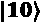 的逻辑表达式查询器示例，该查询器在 *The two-bit Grover* 菜谱中使用，其中最低有效位（LSB）位于逻辑的左侧：

```py
'~A & B'
```

这实际上翻译成：非 A 和 B，然后可以翻译成我们的 Dirac 矢量表示法，即第一个量子比特（A）= 0 和第二个量子比特（B）=1，或 。

### 位字符串

当您使用真值表查询器输入时，您创建一个表示查询器预期输出的位字符串。对于  的示例，位字符串如下：

```py
'0010' 
```

我们在*第二章*“*使用 Python 进行量子计算和量子比特的快速入门*”的菜谱中简要介绍了这种表示法。如果您需要复习，请查看该内容。

## 如何操作...

为了处理 Grover 算法的创建和运行，我们在 `ch10_r1_grover_aqua.py` 脚本中创建了四个函数。在我们继续测试之前，让我们先看看这些函数：

### 示例代码

1.  首先，我们导入所需的类和方法，并设置一些全局变量：

    ```py
    from qiskit import Aer, IBMQ
    from qiskit.aqua.algorithms import Grover
    from qiskit.aqua.components.oracles import LogicalExpressionOracle, TruthTableOracle
    from qiskit.tools.visualization import plot_histogram
    from IPython.core.display import display
    global oracle_method, oracle_type
    ```

1.  `log_length(oracle_input,oracle_method)` 函数接受查询器输入（逻辑或二进制）和查询器方法（逻辑表达式或位字符串）作为输入，并返回 Grover 电路需要包含的理想迭代次数。如果查询器输入是逻辑字符串，我们首先通过计算字符串中的字母数量来计算量子比特的数量，不包括波浪号 (~)、和号 (&) 和空格：

    ```py
    def log_length(oracle_input,oracle_method):
        from math import sqrt, pow, pi, log
        if oracle_method=="log":
            filtered = [c.lower() for c in oracle_input if             c.isalpha()]
            result = len(filtered)
            num_iterations=int(pi/4*(sqrt(pow(2,result))))
        else:
            num_iterations = int(pi/4*(sqrt(pow(2,
                log(len(oracle_input),2)))))
        print("Iterations: ", num_iterations)
        return num_iterations
    ```

1.  `create_oracle(oracle_method)` 函数接受查询器方法作为输入，并提示输入查询器逻辑表达式或位字符串。从输入中，它调用 `log_length(oracle_input,oracle_method)` 函数，该函数根据 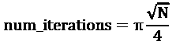 公式计算所需的迭代次数。

    在 Python 中，它看起来是这样的：

    ```py
    def create_oracle(oracle_method):
        oracle_text={"log":"~A & ~B & C","bit":"00001000"}
        # set the input
        global num_iterations    
        print("Enter the oracle input string, such         as:"+oracle_text[oracle_method]+"\nor enter 'def'        for a default string.")
        oracle_input=input('\nOracle input:\n ')
        if oracle_input=="def":
            oracle_type=oracle_text[oracle_method]
        else:
            oracle_type = oracle_input
        num_iterations=log_length(oracle_type, oracle_method)
        return(oracle_type)
    ```

1.  `create_grover(oracle_type)` 函数接受 `oracle_type` 字符串作为输入，例如，`~A&B`，并使用 `Grover(LogicalExpressionOracle (oracle_type),num_iterations=num_iterations)` 函数创建具有适当迭代次数的算法。

    在 Python 中，它将如下所示：

    ```py
    def create_grover(oracle_type, oracle_method):
        # Build the circuit
        if oracle_method=="log":
            algorithm = Grover(LogicalExpressionOracle(
                oracle_type),num_iterations=num_iterations)
            oracle_circuit = Grover(LogicalExpressionOracle(
                oracle_type)).construct_circuit()
        else:
            algorithm = Grover(TruthTableOracle(
                oracle_type),num_iterations=num_iterations)
            oracle_circuit = Grover(TruthTableOracle(
                oracle_type)).construct_circuit()
        display(oracle_circuit.draw(output="mpl"))
        display(algorithm)
        return(algorithm)
    ```

1.  `run_grover(algorithm,oracle_type)` 函数接受我们刚刚创建的算法作为输入，首先在本地 Aer 模拟器上运行，然后在最不繁忙的具有五个量子比特的 IBM Quantum®后端上运行。

    这是我们如何在 Python 中构建它的方法：

    ```py
    def run_grover(algorithm,oracle_type,oracle_method):
        # Run the algorithm on a simulator, printing the most     # frequently occurring result
        backend = Aer.get_backend('qasm_simulator')
        result = algorithm.run(backend)
        print("Oracle method:",oracle_method)
        print("Oracle for:", oracle_type)
        print("Aer Result:",result['top_measurement'])
        display(plot_histogram(result['measurement']))
        # Run the algorithm on an IBM Q backend, printing the     # most frequently occurring result
        print("Getting provider...")
        if not IBMQ.active_account():
            IBMQ.load_account()
        provider = IBMQ.get_provider()
        from qiskit.providers.ibmq import least_busy
        filtered_backend = least_busy(provider.backends(        n_qubits=5,, operational=True, simulator=False))
        result = algorithm.run(filtered_backend)
        print("Oracle method:",oracle_method)
        print("Oracle for:", oracle_type)
        print("IBMQ "+filtered_backend.name()+        " Result:",,result['top_measurement'])
        display(plot_histogram(result['measurement']))
        print(result)
    ```

1.  `main()` 函数提示输入查询器方法，然后创建查询器并运行 Grover 算法：

    ```py
    def main():
        oracle_method="log"
        while oracle_method!=0:
            print("Ch 11: Grover search with Aqua")
            print("------------------------------")    
            # set the oracle method: "Log" for logical         # expression or "Bit" for bit string. 
            oracle_method = input("Select oracle method (log             or bit):\n")
            type=create_oracle(oracle_method)
            algorithm=create_grover(type, oracle_method)        run_grover(algorithm,type, oracle_method)
    ```

### 运行代码

要创建和运行一个使用逻辑表达式作为输入的 Aqua 生成的 Grover 电路，请按照以下步骤操作：

1.  在您的 Python 环境中，运行 `ch10_r1_grover_aqua.py`。

1.  当提示时，通过输入 `log` 选择逻辑表达式查询器方法。

    你可以自由地通过输入 `bit` 来测试使用比特串输入相同的逻辑门。

1.  现在输入一个与上一个例子类似的逻辑表达式：

    ```py
    ~A & B
    ```

    如果你读出逻辑表达式，你会得到 `NOT A AND B`，这对应于 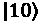。记住，A 是最低有效位，在 Qiskit® 中对应于密钥表示法中的最右边数字。

    对于比特串逻辑门，输入将是 `0010`。

1.  逻辑门输入和最佳迭代次数会显示出来，同时还有 Aqua 创建的逻辑门电路： 创建的 Aqua 逻辑门电路](img/Figure_10.1_B14436.jpg)

    图 10.1 – 为  创建的 Aqua 逻辑门电路

1.  现在逻辑门运行在本地 Aer 模拟器上，结果如下所示： 逻辑门的结果

    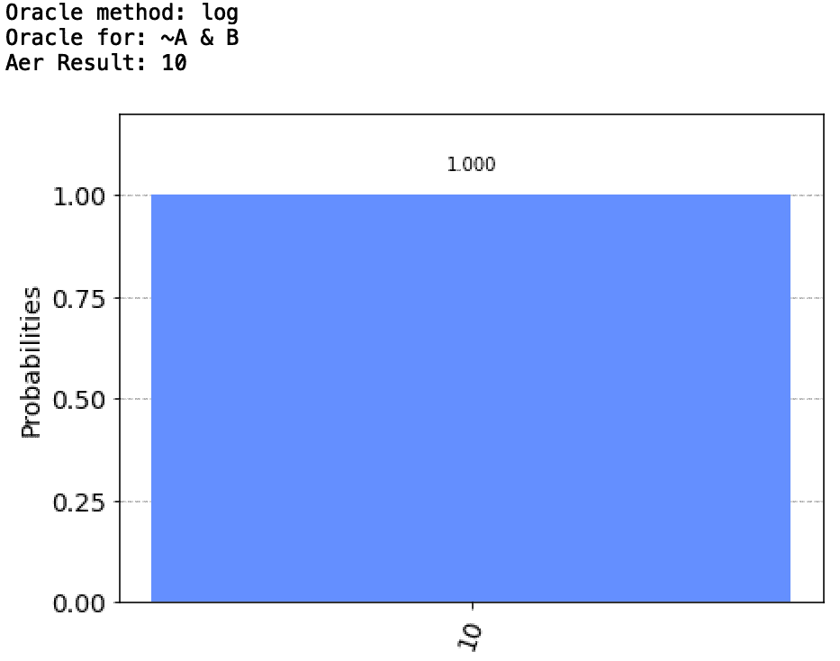

    图 10.2 – 在你的本地 Aer 模拟器上运行  逻辑门的结果

1.  逻辑门现在运行在最不繁忙的 IBM Quantum® 后端，结果如下所示：

 逻辑门的结果

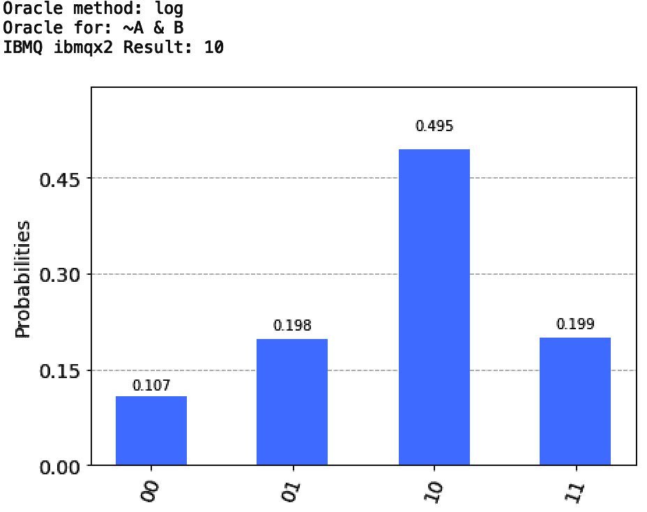

图 10.3 – 在 IBM Quantum® 后端运行 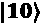 逻辑门的结果

## 它是如何工作的...

如果你查看 `ch10_r1_grover_aqua.py` 程序，你会找到大约 100 行代码。其中大部分不是运行 Grover 算法所必需的。假设你从某处获得了逻辑表达式或比特串逻辑门输入，你只需四行代码就可以运行它：

```py
In [1]: from qiskit import Aer
In [2]: from qiskit.aqua.algorithms import Grover
In [3]: from qiskit.aqua.components.oracles import LogicalExpressionOracle
In [4]: Grover(LogicalExpressionOracle("~A&B")).run(backend)["top_measurement"]
Out[5]: '10'
```

前三行代码导入所需的类。这第四行代码创建并运行了 Grover 电路，以逻辑表达式逻辑门作为输入 – 在这种情况下，`~A&B`，来表示 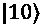，并提取出逻辑门编码的顶部测量结果，即获胜者。

## 更多内容...

再次，就像使用 Terra 构建的电路一样，当你从两个量子位增加到三个量子位时，事情就会发生。让我们看看。要查看最终编译后的电路（在 IBM Quantum® 后端运行）的外观，你可以登录到 IBM Quantum Experience® 来查看你运行的全详细结果：

1.  前往以下 URL，然后使用你的 IBM Quantum Experience® 账户登录：[`quantum-computing.ibm.com/`](https://quantum-computing.ibm.com/)。

1.  在 **欢迎** 面板中，向下滚动到 **最新结果**。

1.  定位你刚刚运行的工作，并点击它： 逻辑门的工作结果

    

    图 10.4 – 在 IBM Quantum Experience® 中 IBM Quantum® 后端运行  逻辑门的工作结果

1.  比较电路。

    通过查看这里的作业，你可以比较你在 *第九章* 的 *Building Grover's search algorithm* 菜单中运行的电路大小，以及你的新 Aqua 创建的电路：

     的 2 量子比特 Aqua Grover 与你的 Terra 构建的 2 量子比特 Grover]

    ](img/Figure_10.5_B14436.jpg)

    Figure 10.5 – 对于  的 2 量子比特 Aqua Grover 与你的 Terra 构建的 2 量子比特  Grover

    对于双量子比特电路，其大小与你在 Terra 构建的电路中看到的大小相对应。从差异中你可以看到，Aqua 构建的电路使用一个**辅助**量子比特来处理相移机制。这使得电路稍微大一些，Qiskit Aqua Grover 的深度为 15，而 Qiskit Terra Grover 的深度为 9。大小也从 15 增长到 24。

1.  现在，运行一个 3 量子比特的 Qiskit Aqua 创建的 Grover 并查看结果。

    再次运行 `ch10_r1_grover_aqua.py` 程序，选择日志预言机类型，并使用以下逻辑字符串为 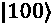 编码：`~A & ~B & C`。

    Qiskit Aer 运行的 Grover 的结果应该看起来像以下这样：

![Figure 10.6 – Aer 对 Aqua 创建的 Grover 的结果]

](img/Figure_10.6_B14436.jpg)

Figure 10.6 – Aer 对 Aqua 创建的 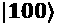 Grover 的结果

在 IBM Quantum® 后端上运行的 Grover 的结果应该看起来像这样：

![Figure 10.7 – IBM Quantum® 对 Aqua 创建的 Grover 的结果]

](img/Figure_10.7_B14436.jpg)

Figure 10.7 – IBM Quantum® 对 Aqua 创建的  Grover 的结果

看看这些结果。它们看起来不像我们在 *第九章* 的 *Grover's Search Algorithm* 中的 *The three-qubit Grover* 菜单中得到的 3 量子比特结果，而更像我们在 *Adding more qubits to the Grover search* 菜单中看到的杂乱的 4+ 量子比特结果。正如我们在那个菜谱中讨论的，我们已经明显超出了 NISQ 机器的电路深度，从实验中得到的噪声比信号多。

那么，这算是有趣的吗？我们看到了 Qiskit Aqua 如何编码我们在 *第九章* 的 *Grover's Search Algorithm* 中花费了大量时间构建的相同算法。但 Qiskit Aqua 包含了更多内容。

我们只是触及了表面。如果你花了一些时间回顾量子信息的历史，你可能已经挑选出了一些喜欢的算法；其中之一很可能是 Grover 算法，但最著名的一个可能是 Shor 算法，这就是下一个要讨论的内容。继续阅读！

# 将 Shor 算法作为 Aqua 函数运行

量子计算算法中的另一位真正的光辉人物是彼得·肖尔（Peter Shor）的算法，该算法可以追溯到 1984 年，其中他证明了在足够强大的量子计算机的帮助下，你可以对非常大的整数进行质因数分解。这不仅从学术角度来看很重要，而且例如，将非常大的（数千位）数字分解为其构成质数是今天用于确保在线交易（从银行和社交媒体到你车中的计算机）的 RSA 加密的核心。

当这些足够大的量子计算机进入舞台时，理论上可以在几分钟内破解那些需要数周、数月、数年甚至更长时间才能破解的加密密钥。

为了调整我们的期望，在今天的 NISQ 机器上运行肖尔算法更多的是一种学术兴趣。正如你将注意到的，肖尔电路即使在相对较小的分解练习中也会变得相当大，正如你在前面的章节中看到的，随着电路的增长，错误也会增加。

通过 IBM Quantum Experience®，你可以访问到 15 个量子比特大小的量子计算机和 32 个模拟器。正如你将看到的，量子比特的数量限制了我们可以分解的数字的大小。

最后要考虑的一个问题是模拟的规模。使用量子计算机的巨大理论优势是它们有可能在某些问题上有指数级的加速。另一方面，随着每个额外量子比特的增加，模拟量子计算机会变得指数级困难。

当我们运行用于更大数字的肖尔算法时，这里所说的“更大”是指一旦我们超过 63 并向上，你的本地模拟器将开始抱怨，是时候切换到 IBM Quantum®提供的模拟器了。

查看以下表格，以获取一些建议的测试数字：

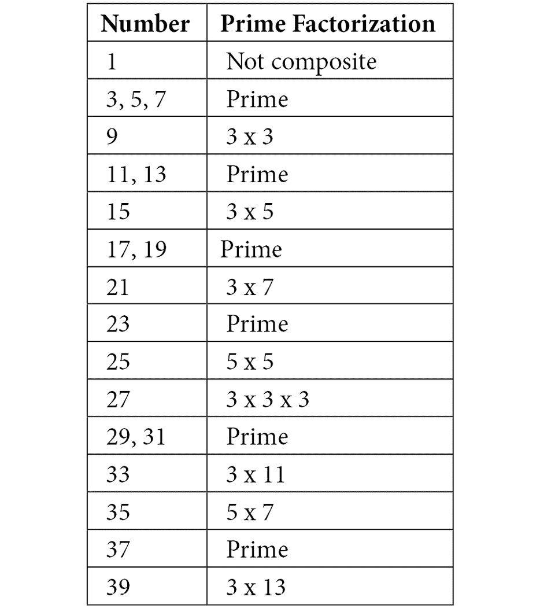

表 10.1 – 小于 40 的数的质因数分解

小贴士

要了解更多关于分解的乐趣，请参阅[`www.mymathtables.com/numbers/one-hundred-factor-and-prime-factor-table.html`](https://www.mymathtables.com/numbers/one-hundred-factor-and-prime-factor-table.html)和[`www.mathsisfun.com/prime-factorization.html`](https://www.mathsisfun.com/prime-factorization.html)。

Qiskit Aqua 肖尔算法接受大于 1 的奇数作为输入，因此表格只列出了这些数字。列出的作为质数的数字本身不能被分解，但其余的都可以测试。测试其中的一些。 

## 准备工作

该菜谱的示例代码可以在以下链接找到：[`github.com/PacktPublishing/Quantum-Computing-in-Practice-with-Qiskit-and-IBM-Quantum-Experience/blob/master/Chapter10/ch10_r2_shor_aqua.py`](https://github.com/PacktPublishing/Quantum-Computing-in-Practice-with-Qiskit-and-IBM-Quantum-Experience/blob/master/Chapter10/ch10_r2_shor_aqua.py)。

## 如何做到这一点…

为了处理 Grover 算法的创建和运行，我们将在 `ch10_r2_shor_aqua.py` 脚本中构建三个函数。首先，让我们检查代码，然后运行它。

### 样本代码

1.  首先，我们导入所需的类和方法：

    ```py
    from qiskit import Aer, IBMQ
    from qiskit.aqua.algorithms import Shor
    import time
    ```

1.  `display_shor(N)` 函数接收一个整数作为输入，并使用 `Shor()` 方法构建和显示短路以及电路数据：

    ```py
    def display_shor(N):
        print("Building Shor circuit...")
        shor_circuit = Shor(N=N).construct_circuit()
        print(shor_circuit)
        print("Circuit data\n\nDepth: ",shor_circuit.        depth(),"\nWidth: ",shor_circuit.width(),"\nSize:        ",shor_circuit.size())
    ```

1.  `run_shor(N)` 函数接收一个整数作为输入，创建 Shor 电路，并在本地模拟器上运行它。函数随后显示运行结果：

    ```py
    def run_shor(N):
        if N<=64: #Arbitrarily set upper limit for local               #simulator    
            print("Getting local simulator backend...")
            backend = Aer.get_backend('qasm_simulator')
        else:
            print("Getting provider...")
            if not IBMQ.active_account():
                IBMQ.load_account()
            provider = IBMQ.get_provider()
            print("Getting IBM Q simulator backend...")
            backend = provider.get_backend(
                'ibmq_qasm_simulator')
        print("Running Shor's algorithm for",str(N),"on",        backend,"...")
        results=Shor(N=N).run(backend)
        print("\nResults:")
        if results['factors']==[]:
            print("No prime factors: ",str(N),"=",str(N))
        elif isinstance(results['factors'][0],int):
            print("Prime factors: ",str(N),"=",
                results['factors'][0],"^ 2")
        else:
            print("Prime factors: ",str(N),"=",
                results['factors'][0][0],"*",
                results['factors'][0][1])
    ```

1.  `main()` 函数处理提示并验证一个大于 1 的奇数输入，然后运行前面的函数。使用开始和结束时间来测量构建电路和运行它所需的时间：

    ```py
    def main():
        number=1
        print("\nCh 11: Shor's algorithm with Aqua")     
        print("---------------------------------")   
        while number!=0:
            number=int(input("\nEnter an odd number N >1 (0
                to exit):\n"))
            if number>1 and number % 2>0:
                type=input("Enter R to run the Shor
                    algorithm, D to display the circuit.\n")
                start_time=time.time()
                if type.upper()=="D":
                    display_shor(number)
                elif type.upper()=="R":
                    run_shor(number)
                elif type.upper() in ["RD","DR"]:
                    display_shor(number)
                    run_shor(number)
                end_time=time.time()
                print("Elapsed time: ","%.2f" % (
                    end_time-start_time), "s")
            else:
                print("The number must be odd 
                    and larger than 1.")
    ```

### 运行代码

1.  在你的环境中运行 `ch10_r2_shor_aqua.py`。

1.  当提示时，输入 N，一个大于 1 的奇数。

    这是我们要进行素数因子分解的数字。首先，尝试以下三个数字：**5**、**9**、**15**

1.  算法返回三种结果之一：

    **没有素数因子**：如果你输入的数字是一个不能分解的素数，例如：

    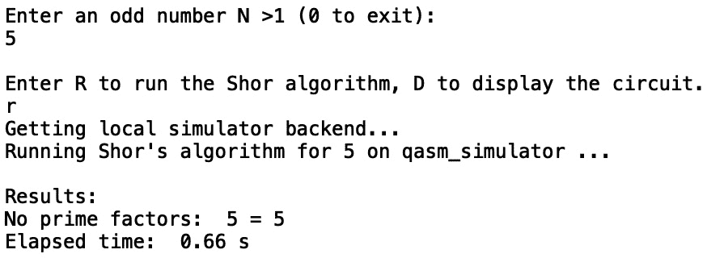

    图 10.8 – 使用 5 作为输入的 Shor 算法的结果

    **平方因子分解**：如果数字可以表示为素数乘以自身的因子分解：

    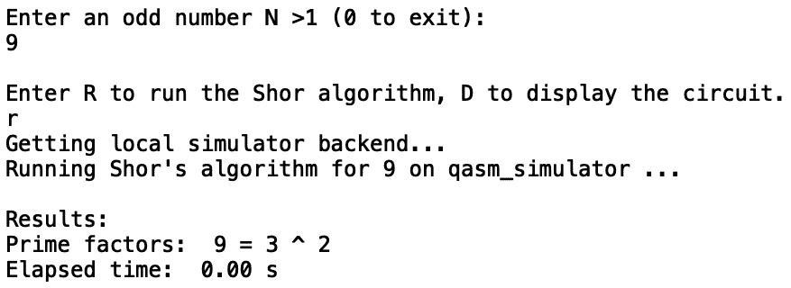

    图 10.9 – 使用 9 作为输入的 Shor 算法的结果

    **两个素数因子分解**：如果数字可以表示为两个不同素数的因子分解。这是我们想要的结果：

    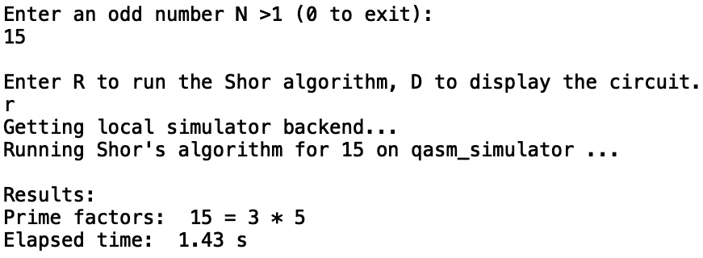

    图 10.10 – 使用 15 作为输入的 Shor 算法的结果

1.  现在尝试使用更大的数字运行算法，并观察构建和执行电路所需的时间如何增加。

    你会注意到，随着数字的增大，你的本地模拟器越来越难以跟上。在我的工作站（Apple iMac，16 GB RAM）上，当数字超过 63 时，我就没有足够的内存来构建电路了。`run_shor(N)` 函数代码内置了一个断点，在 64 时切换到 IBM Quantum® 模拟器后端。

    如果你想测试本地机器的性能，可以随意移动本地/IBM Quantum® 断点。记住，IBM Quantum® 模拟器后端运行在 IBM POWER9™ 服务器上，拥有相当大的计算能力！

## 更多内容…

就像我们在 *将 Grover 算法作为 Aqua 函数运行* 菜单中讨论的那样，你只需几行代码就可以运行 Shor 函数：

```py
In [1]: from qiskit import Aer
In [2]: from qiskit.aqua.algorithms import Shor
In [3]: backend = Aer.get_backend('qasm_simulator')
In [4]: results=Shor(N=15).run(backend)
In [5]: results['factors']
```

在这个例子中，我们为数字 `15` 运行 Shor 算法。运行此代码示例应产生以下输出：

```py
Out[5] [[3, 5]]
```

我们到目前为止所做的工作只是运行了 Shor 算法，使用一个输入参数`N`——你想要分解的整数。默认情况下，如果你运行`Shor()`而没有输入，它将默认为 15，这是可以分解的最小的非平凡整数。请从前面的表中验证这一点。

Shor 函数可以选择性地接受另一个输入参数`a`，它是一个小于`N`的互质数，并且最大公约数为 1：

```py
In [4]: results=Shor(N=15, a=2).run(backend)
```

默认情况下，`a`被设置为`2`，对于我们在这里玩的小型整数，这可能不会有太大影响，但请随意实验。

## 参考信息

+   Scott Aaronson 在他的博客上有一篇关于 Shor 算法的精彩文章：*Shor. I'll do it*，链接为[`www.scottaaronson.com/blog/?p=208`](https://www.scottaaronson.com/blog/?p=208)。

+   要了解 Shor 算法在 Python 和 Qiskit®上的详细概述，请参阅 Dr Christine Corbett Moran 所著的《Mastering Quantum Computing with IBM QX》的第十二章，标题为“Shor 算法”。

+   直接从 Qiskit®教科书中，以下是 Shor 算法在 Python 和 Qiskit®中的分解：[`qiskit.org/textbook/ch-algorithms/shor.html`](https://qiskit.org/textbook/ch-algorithms/shor.html)。

# 探索更多 Aqua 算法

我们现在已经到达了本书的结尾，也是我们共同探索 Qiskit®之旅的结束。在我们的旅途中，我们查看了一些基本的量子编程，并探索了 IBM Quantum®后端——实际的量子计算机！我们在这些计算机上运行了我们的程序，并得到了量子结果。

我们开始深入研究量子计算的核心，即算法。然而，这本书并不是关于算法的；我们只是用一些非常基本的概念来探讨量子算法与它们的经典对应物之间的差异，以及编写它们可能的感觉。

在讨论了如何编写算法以及与经典算法相比有时反直觉的求解方法之后，我们还研究了 Qiskit Aqua 中包含的预制算法：Grover 算法和 Shor 算法。我喜欢将 Qiskit®的这一部分视为量子计算的应用商店。

当你遇到可能需要量子计算解决方案的问题，但你并不一定想自己编写算法时，你会去这里。就像大多数人不会自己编写程序来获取天气预报一样；他们只是使用现成的天气应用程序。

## 准备工作

Qiskit Aqua 不仅包含 Grover 算法和 Shor 算法，IBM Quantum®团队以及全球的合作伙伴们正在通过实现和纯算法来填充它，这些算法针对的是近期有潜力的领域，同时也为量子计算机在强度和能力增强后更远的实现做准备。

首先，Qiskit Aqua 组件包括一个`qiskit.aqua.algorithms`包。

其中包括我们测试过的 Grover 和 Shor 算法，但还有其他特定的算法，如 QSVM（量子支持向量机）、VQE（变分量子本征值求解器算法）等。探索这个库，了解如何在今天可用的后端上探索各种算法，以及如何为未来通用的量子计算机扩展它们：

+   `qiskit.chemistry`) 允许你使用你喜欢的建模工具在分子上进行能量计算实验。

+   `qiskit.finance`) 包含一系列以伊辛哈密顿量形式结构化的函数，应用于金融模型。

+   `qiskit.ml`) 包含样本集。你可以使用这些 Aqua 分类器和 SVM 算法。

+   `qiskit.optimization)`。此模块包含具有特定算法、应用、问题等几个子模块。

## 如何做到这一点...

我们不会深入探讨这些特定的 Qiskit Aqua 模块，但为了开始探索算法，你可以遵循这个路径示例：

1.  导入你感兴趣的包，例如，如果你想探索化学，这个：

    ```py
    import qiskit
    from qiskit.chemistry import *
    ```

1.  然后查看内置文档。

    Qiskit® 提供了卓越的 Python 帮助，你可以从这里开始你的探索；例如：

    ```py
    help(qiskit.chemistry)
    ```

1.  探索 Qiskit® 的一般资源，以进一步探索你感兴趣的研究领域。

    例如，这里 Qiskit® 的教程：[`qiskit.org/documentation/tutorials/chemistry/index.html`](https://qiskit.org/documentation/tutorials/chemistry/index.html)。

    例如，在 *使用 Qiskit 学习量子计算* 教科书中：[`qiskit.org/textbook/ch-applications/vqe-molecules.html`](https://qiskit.org/textbook/ch-applications/vqe-molecules.html)。

1.  最后，进行实验！

    学习各种算法，并将它们整合到你自己混合经典/量子 Python 代码中，以满足你的需求，就像我们在本书的各个食谱中做的那样。

我们还有许多尚未触及的 Qiskit® 功能，例如在你的电路中混合布尔逻辑，直接用 **OpenPulse** 编程量子比特，更高级的错误模拟等等。所有这些功能，以及更多，都可供你探索。如果你不想独自探索，四处看看，看看你能否在你所在的地区找到一些量子计算聚会或研讨会。

Qiskit Slack 频道 [qiskit.slack.com](http://qiskit.slack.com) 是你量子社交探索的一个绝佳起点。从 IBM Quantum Experience® 的支持页面注册：[`quantum-computing.ibm.com/support`](https://quantum-computing.ibm.com/support)。

## 更多

Qiskit Aqua 算法并非凭空出现；有人编写了它们，并将它们添加到集合中。Qiskit® 是开源的，由不断增长的开放源代码贡献者群体构建。你呢？

即使你并没有计划成为 Qiskit®的贡献者，也请继续探索源代码。如果你在本地安装了 Qiskit®，源代码就在你的指尖。如果你使用建议的 Anaconda 安装，你的 Qiskit®源可能位于类似以下的位置（以下为 macOS 示例）：

```py
/Users/<your_user_name>/opt/anaconda3/envs/<your_environment>/lib/python3.7/site-packages/qiskit/
```

在构建了我们整本书中使用的特性和功能的函数和类中四处看看。谁知道呢，也许你能想出一个更好的方式来展示量子比特状态，或者提出一个全新的算法，然后将其贡献回 Qiskit®。

关于如何为 Qiskit®做出贡献的信息，请在此处查看：[`qiskit.org/documentation/contributing_to_qiskit.html`](https://qiskit.org/documentation/contributing_to_qiskit.html)。

## 参考信息

今天的算法开发在很大程度上仍然是理论性的，因为我们可以在目前有限的 NISQ 机器和量子模拟器上成功运行它们，但我们无法访问拥有数百或数千个量子比特的后端。记住，模拟器的大小会随着量子比特数量的指数增长；在这些电路大小上运行模拟器极具挑战性。

在未来并非不可预见的时刻，这可能会发生变化，至少如果 IBM Quantum®能够如愿以偿的话。2020 年 9 月初，IBM Quantum 的 Jay Gambetta 在年度 IBM Quantum Summit 上展示了 IBM 的路线图。这是一个大胆的计划，预计到 2023 年底将达到 1,121 个物理量子比特。有了这么多物理量子比特，将能够真正开始探索错误纠正量子比特，正如在*第八章*中“通过 Exploring your qubits to understand T1, T2, errors, and gates”食谱所描述的，*用 Ignis 清理你的量子行为*。所以请密切关注这个领域。

这是路线图文档：*IBM 的量子技术扩展路线图*，2020 年 9 月 15 日，Jay Gambetta：[`www.ibm.com/blogs/research/2020/09/ibm-quantum-roadmap/`](https://www.ibm.com/blogs/research/2020/09/ibm-quantum-roadmap/)。

## 感谢！

因此，亲爱的读者，你已经跟随我走到了这里，或者至少你已经翻到了最后一章的最后一页，看看故事是如何结束的...剧透警告：这是一个悬念！

量子计算仍然处于初级阶段，你在本书中参与构建的食谱，虽然为你进一步探索指明了方向，但不足以让你自信地确立作为量子计算程序员的职业生涯；这需要时间和努力。

就像一门 C 编程基础课程可能会引导你走上通过构建下一个社交媒体现象来致富的道路一样，你现在所接触到的这种基础尝试也可能带来同样的效果。现在你已经拥有了这些，那就大胆地跳进去吧，成为 Qiskit 倡导者，咨询你的大学或学院提供的相关课程和项目，规划你作为量子计算开发人员或研究人员的职业道路，或者为什么不就在你的车库里开始下一个大型的量子初创公司呢？

玩得开心！
