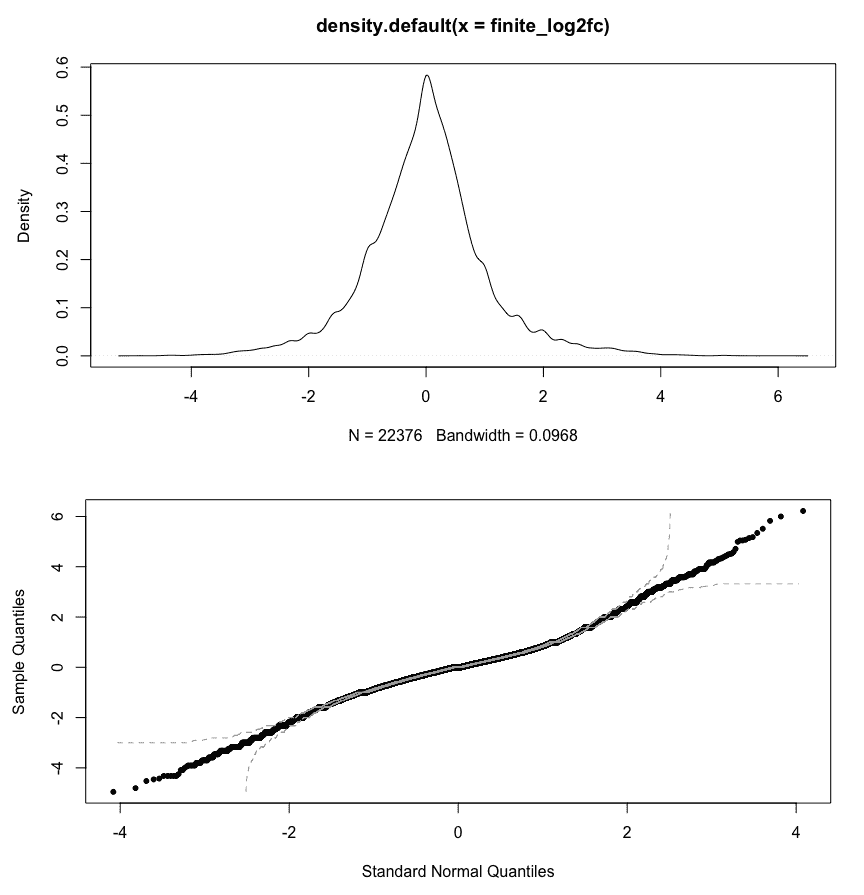
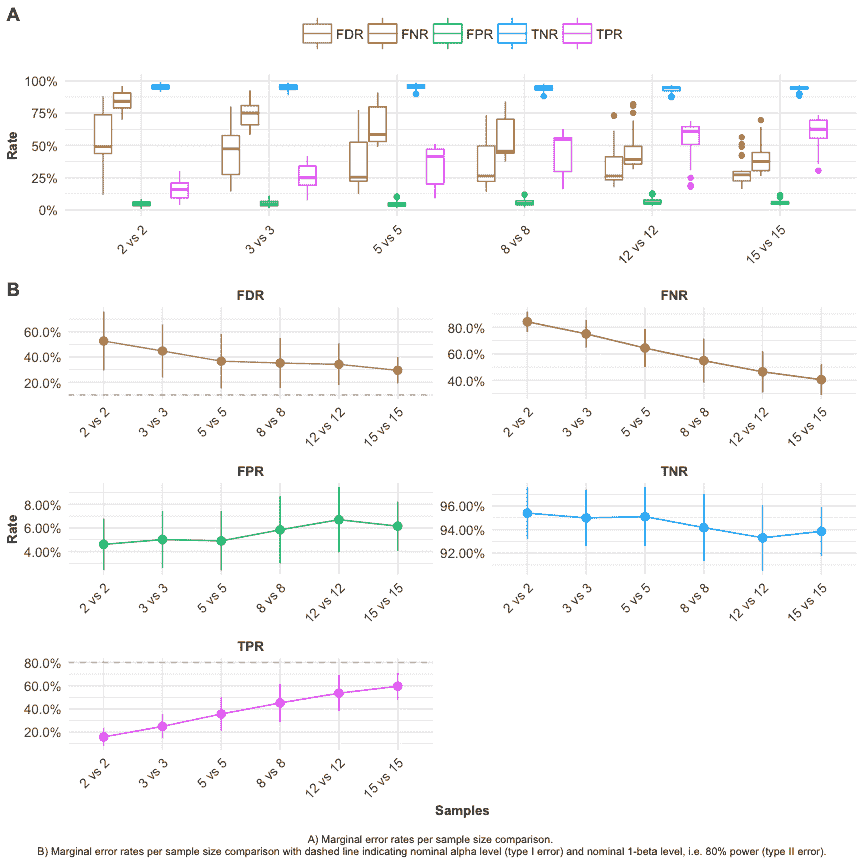
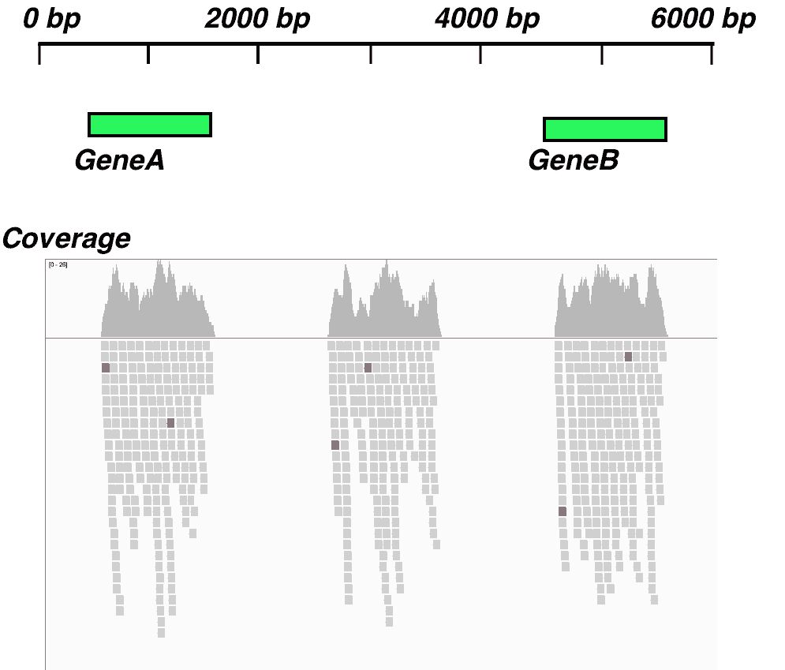
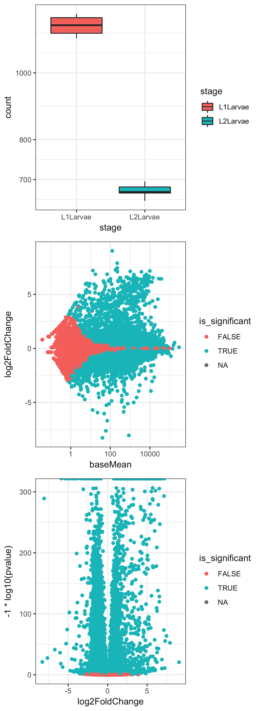

# 第一章：执行定量 RNAseq

RNAseq 技术彻底改变了转录本丰度的研究，带来了高灵敏度检测和高通量分析。使用 RNAseq 数据的生物信息学分析管道通常从读取质量控制步骤开始，接着是将序列比对到参考基因组或将序列读取组装成更长的转录本*de novo*。之后，通过读取计数和统计模型来估算转录本丰度，并评估样本间的差异表达。自然，整个管道的各个步骤都有多种技术可供选择。质量控制和读取比对步骤通常会在 R 之外进行，因此在 R 中的分析将从转录本或基因注释文件（如 GFF 和 BED 文件）和比对后的读取文件（如 BAM 文件）开始。

R 中的分析工具功能强大且灵活。它们中的许多是 Bioconductor 套件的一部分，因此它们可以很好地集成在一起。研究人员希望通过 RNAseq 回答的核心问题通常是：*哪些转录本有差异表达*？在本章中，我们将探讨一些标准情况下的分析方法，假设我们已经知道感兴趣基因的基因组位置，并且在需要找到未注释转录本的情况下进行分析。我们还将探讨其他重要的分析方法，帮助回答问题*多少重复实验足够*？以及*哪个等位基因表达更多*？

在本章中，我们将涵盖以下分析方法：

+   使用 edgeR 估算差异表达

+   使用 DESeq2 估算差异表达

+   使用 powsimR 进行功效分析

+   使用 GRanges 对象查找未注释的转录区域

+   使用 bumphunter 查找初始显示高表达的区域

+   差异峰值分析

+   使用 SVA 估算批次效应

+   使用 AllelicImbalance 查找等位基因特异性表达

+   绘制和展示 RNAseq 数据

# 技术要求

你需要的示例数据可以从本书的 GitHub 仓库获取：[`github.com/PacktPublishing/R-Bioinformatics_Cookbook`](https://github.com/PacktPublishing/R-Bioinformatics_Cookbook)[.](https://github.com/danmaclean/R_Bioinformatics_Cookbook)如果你希望按照书中的代码示例使用数据，那么你需要确保这些数据在你工作目录的子目录中。

这里是你需要的 R 包。大多数可以通过`install.packages()`安装*；*其他一些则稍微复杂一些：

+   `Bioconductor`

    +   `AllelicImbalance`

    +   `bumphunter`

    +   `csaw`

    +   `DESeq`

    +   `edgeR`

    +   `IRanges`

    +   `Rsamtools`

    +   `rtracklayer`

    +   `sva`

    +   `SummarizedExperiment`

    +   `VariantAnnotation`

+   `dplyr`

+   `extRemes`

+   `forcats`

+   `magrittr`

+   `powsimR`

+   `readr`

`Bioconductor`非常庞大，并拥有自己的安装管理器。你可以通过以下代码安装它：

```py
if (!requireNamespace("BiocManager"))
    install.packages("BiocManager")
BiocManager::install()
```

更多信息可访问[`www.bioconductor.org/install/`](https://www.bioconductor.org/install/)。

通常，在 R 中，用户会加载一个库并直接按名称使用其中的函数。这在交互式会话中很有用，但当加载了许多包时，它可能会导致混淆。为了澄清我在某个时刻使用的是哪个包和函数，我偶尔会使用`packageName::functionName()`这种约定。

有时，在一个代码片段的中间，我会暂停代码执行，以便你能看到一些中间输出或一个对象的结构，这是理解时很重要的内容。每当这种情况发生时，你会看到一个代码块，其中每一行都以`##`（双井号）开头。请看以下命令：

`letters[1:5]`

这将给我们以下输出：

`## a b c d e`

请注意，输出行前缀是`##`。

# 使用 edgeR 估计差异表达

edgeR 是一个广泛使用且功能强大的包，它实现了负二项模型，适用于稀疏计数数据（例如 RNAseq 数据），并且是一般线性模型框架中描述和理解计数关系以及多组实验的精确检验的强大工具。它使用了一种加权风格的标准化方法，称为 TMM，这是样本与对照之间对数比值的加权平均值，在去除具有高计数和异常对数比值的基因之后。TMM 值应该接近 1，但它可以作为一个修正因子，应用到整体文库大小的调整中。

在这个食谱中，我们将查看一些从准备注释区域的读取计数到识别基因组中差异表达特征的选项。通常，有一个上游步骤要求我们将高通量序列读取对齐到参考序列，并生成描述这些对齐的文件，例如`.bam`文件。准备好这些文件后，我们将启动 R 并开始分析。为了集中精力处理差异表达分析部分，我们将使用一个已经准备好的数据集，其中所有数据都已准备就绪。第八章，*与数据库和远程数据源的工作*，展示了如果你想了解如何做这一步，可以从原始数据开始到达这一阶段的方法。

由于有许多不同的工具和方法来获取这些读取的对齐信息，我们将从两种常见的输入对象类型开始这个过程。我们将使用一个计数表，就像我们从文本文件加载时会用到的那样，并且我们将使用一个`ExpressionSet`（`eset`）对象，这是 Bioconductor 中常用的对象类型。

我们准备好的数据集将是来自 NHGRI DNA 元素百科全书项目的`modencodefly`数据集，研究的模式生物是*果蝇*（*Drosophila melanogaster*）。你可以在[www.modencode.org](http://www.modencode.org/)上阅读关于这个项目的更多信息。该数据集包含 147 个*D. melanogaster*的不同样本，果蝇的基因组约为 110 Mbp，注释了大约 15,000 个基因特征。

# 准备就绪

数据提供了计数矩阵和 ExpressionSet 对象，你可以查看本书末尾的*附录*，了解更多关于这些对象类型的信息。数据存储在本书的代码和数据仓库中，网址是 [`github.com/PacktPublishing/R_Bioinformatics_Cookbook`](https://github.com/PacktPublishing/R_Bioinformatics_Cookbook)，位于 `datasets/ch1/modencodefly_eset.RData`、`datasets/ch1/modencodefly_count_table.txt` 和 `datasets/ch1/modencodelfy_phenodata.txt`。我们还将使用 `edgeR`（来自 Bioconductor）、`readr` 和 `magrittr` 库。

# 如何操作...

我们将展示使用 edgeR 估计差异表达的两种方法。

# 从计数表中使用 edgeR

对于从计数表（例如文本文件）使用 edgeR 估计差异表达，我们将使用以下步骤：

1.  加载计数数据：

```py
count_dataframe <- readr::read_tsv(file.path(getwd(), "datasets", "ch1", "modencodefly_count_table.txt" ))
genes <- count_dataframe[['gene']]
count_dataframe[['gene']] <- NULL
count_matrix <- as.matrix(count_dataframe)
rownames(count_matrix) <- genes
pheno_data <- readr::read_table2(file.path(getwd(), "datasets", "ch1", "modencodefly_phenodata.txt"))
```

1.  指定感兴趣的实验：

```py
experiments_of_interest <- c("L1Larvae", "L2Larvae")
columns_of_interest <- which( pheno_data[['stage']] %in% experiments_of_interest ) 
```

1.  构建分组因子：

```py
library(magrittr)
grouping <- pheno_data[['stage']][columns_of_interest] %>% 
forcats::as_factor()
```

1.  构建计数数据的子集：

```py
counts_of_interest <-  count_matrix[,columns_of_interest]
```

1.  创建 DGE 对象：

```py
library(edgeR)
count_dge <- edgeR::DGEList(counts = counts_of_interest, group = grouping)
```

1.  执行差异表达分析：

```py
design <- model.matrix(~ grouping)
eset_dge <- edgeR::estimateDisp(eset_dge, design)
fit <- edgeR::glmQLFit(eset_dge, design)
result <- edgeR::glmQLFTest(fit, coef=2)
topTags(result)
```

# 从 ExpressionSet 对象中使用 edgeR

使用 `eset` 对象通过 edgeR 进行估计可以按照以下步骤完成：

1.  加载 `eset` 数据：

```py
load(file.path(getwd(), "datasets/ch1/modencodefly_eset.RData"))
```

1.  指定感兴趣的实验：

```py
experiments_of_interest <- c("L1Larvae", "L2Larvae")
columns_of_interest <- which( phenoData(modencodefly.eset)[['stage']] %in% experiments_of_interest )
```

1.  构建分组因子：

```py
grouping <- droplevels(phenoData(modencodefly.eset)[['stage']][columns_of_interest] )
```

1.  构建计数数据的子集：

```py
counts_of_interest <- exprs(modencodefly.eset)[, columns_of_interest]
```

1.  创建 DGE 对象：

```py
eset_dge <- edgeR::DGEList(
 counts = counts_of_interest,
 group = grouping 
 )
```

1.  执行差异表达分析：

```py
design <- model.matrix(~ grouping)
eset_dge <- edgeR::estimateDisp(eset_dge, design)

fit <- edgeR::glmQLFit(eset_dge, design)
result <- edgeR::glmQLFTest(fit, coef=2)
topTags(result)
```

# 如何工作...

我们展示了两种使用 edgeR 估计差异表达的方法。在本教程的前半部分，我们从文本文件中的数据开始，使用了 edgeR。

# 从计数表中使用 edgeR

在*步骤 1*中，我们使用 `read_tsv()` 函数（来自 `readr` 包）将制表符分隔的计数文本文件加载到一个名为 `count_dataframe` 的数据框中。然后，从中提取 `'gene'` 列到一个新变量 `genes`，并通过将其赋值为 `NULL` 从 `count_dataframe` 中删除。这一切的目的是为了便于使用基础的 `as.matrix()` 函数将其转换为 `count_matrix` 矩阵，并将基因信息作为 `rownames` 添加回来。最后，我们使用 `readr read_table2()` 函数从文件中加载所需的表型数据。

*步骤 2* 主要是确定在 `count_matrix` 中我们想要使用的列。我们定义了一个变量 `experiments_of_interest`，它包含了我们想要的列名，然后使用 `%in%` 运算符和 `which()` 函数创建一个与列数匹配的二进制向量。如果例如 `columns_of_interest` 向量的第三列为 `TRUE`，则表示该名称在 `experiments_of_interest` 变量中。

*步骤 3* 从加载 `magrittr` 包开始，以获取 `%>%` 操作符，这将允许管道传输。接着，我们使用 R 索引和二进制 `columns_of_interest` 因子来选择我们想要的列名，并将其传递给 `forcats as_factor()` 函数，得到一个因子对象作为我们的分组变量。样本分组信息本质上是一个因子，告诉我们哪些样本是同一样本的重复，这对于实验设计的描述非常重要。我们需要创建一个分组向量，其中每个索引都对应于计数表中的一列。因此，在下面的示例中，数据中的前三列将是同一样本的重复，计数表中的第二组三列将是另一组重复，以此类推。我们可以在分组向量中使用任何符号来表示组。分组向量越复杂，实验设计就可以越复杂。在这里的示例中，我们将使用一个简单的测试/对照设计：

```py
numeric_groups <- c(1,1,1,2,2,2)
letter_groups <- c("A","A","A", "B","B","B")
```

像这样的简单向量就足够了，但你也可以使用一个因子对象。因子是 R 的分类数据类型，它作为一个整数向量实现，并且有相关联的名称标签，称为水平。当显示因子时，使用的是名称标签，而不是整数。因子对象有某种“记忆”，即使只使用了某些水平，所有可能使用的水平都会被保留，这样在例如将水平作为类别使用时，空的水平仍然可以显示出来。

在 *步骤 4* 中，我们使用索引提取我们实际想要分析的数据列。

到了 *步骤 5*，我们的准备工作完成，可以构建我们需要进行差异分析的 `DGEList` 对象。首先，我们加载 `edgeR` 库，并对 `counts_of_interest` 和我们的分组对象使用 `DGEList()` 函数。

在 *步骤 6* 中，通过 `DGEList`，我们可以进行 `edgeR` 过程。首先，我们使用基础的 `model.matrix()` 函数创建实验设计描述符设计对象。模型设计是必要的，它告诉函数如何比较样本；这是 R 中常见的操作，因此有一个基础函数。我们使用我们创建的 `grouping` 变量。我们必须使用 `estimateDisp()` 函数估算每个基因的离散度，然后可以在测试中使用这个变异性度量。最后，拟合一个广义线性模型，并使用两次 `glmQLFTest()` 应用准似然 F 检验，第一次使用离散度估算，`eset_dge`，第二次使用结果的 `fit` 对象。

我们可以使用 `topTags()` 函数查看差异表达基因的详细信息。我们得到以下输出：

```py
 ## Coefficient: groupingL2Larvae
 ## logFC logCPM F PValue FDR
 ## FBgn0027527 6.318665 11.14876 42854.72 1.132951e-41 1.684584e-37
 ## [ reached 'max' / getOption("max.print") -- omitted 9 rows ]
```

列中显示了基因名、基因的 `logFC` 值、F 值、P 值和 **假阳性率** (**FDR**)。通常，我们想要从中做出统计结论的列是 FDR。

# 使用 `edgeR` 从 ExpressionSet 对象中

在*步骤 1*中，我们将使用从准备好的`eset`对象中的`edgeR`。我们首先使用基础 R 函数加载该对象，因为它是以标准的 Rdata 格式文件存储的。

在*步骤 2*中，我们准备感兴趣实验的向量。与*步骤 2*中类似，唯一不同的是，我们不需要查看从文件创建的`pheno_data`对象；相反，我们可以使用`eset`函数`phenoData()`直接从`eset`对象中提取表型数据（请注意，这是`eset`与计数矩阵之间的主要区别之一——请参阅本书的*附录*以获取更多信息）。

在*步骤 3*中，我们创建分组因子。与之前一样，这可以通过使用`phenoData()`提取函数完成，但由于它返回的是一个因子，我们需要使用`droplevels()`函数删除未被选中的级别（有关因子对象的简要讨论，请参见前述方法中*估计差异表达*部分的*步骤 3*）。

在*步骤 4*中，我们将提取我们感兴趣的列的数据到标准的矩阵对象中。同样，我们有一个专用函数`exprs()`，用于从`eset`中提取表达值，并且我们可以使用`column_names`进行列索引来对子集进行操作。

在*步骤 5*中，我们使用`DGEList()`构造函数构建`edgeR`的数据结构，在*步骤 6*中，执行分析。这个步骤与第一种方法的*步骤 6*完全相同。

# 使用 DESeq2 估计差异表达

`DESeq2`包是用于计数数据差异分析的方法，因此它非常适合 RNAseq（以及其他计数类型数据，如`ChIPSeq`）。它使用离散度估计和相对表达变化来加强估计和建模，重点提高结果表中的基因排序。`DESeq2`与`edgeR`的不同之处在于，它使用几何风格的标准化方法，其中每条通道的缩放因子是通过基因计数与其几何均值比率的比值的中位数来计算的，而`edgeR`使用加权的标准化因子。两种标准化策略并不互相排斥，并且它们对数据有不同的假设。像任何`RNAseq`或大规模实验一样，永远没有“现成的”最佳答案。你将需要测试这些方法，甚至其他方法，并仔细检查控制基因和交叉验证实验的结果，以查看哪种方法表现最佳。性能将很大程度上取决于具体的数据集，因此我们在这里学习的灵活方法将为你如何自行测试不同的解决方案提供一个良好的思路。

我们将在本食谱中讨论的过程与之前*食谱 1*中的`edgeR`过程有些相似。我们可以将 ExpressionSets 和计数表作为输入提供给`DESeq2`，当我们准备好这些数据时，我们将有一组不同的函数来将数据转换为`DESeqDataSet`，而不是像`edgeR`那样使用`DGEList`。

# 准备工作

如同*食谱 1*中所示，数据以计数矩阵和`ExpressionSet`对象的形式提供，你可以在本书的*附录*部分找到有关这些对象类型的更多信息。数据位于本书的代码和数据仓库：[`github.com/PacktPublishing/R_Bioinformatics_Cookbook`](https://github.com/PacktPublishing/R_Bioinformatics_Cookbook)，路径为`datasets/ch1/modencodefly_eset.RData`，`datasets/ch1/modencodefly_count_table.txt`，以及`datasets/ch1/modencodelfy_phenodata.txt`。再次提醒，我们将使用`readr`和`magrittr`，以及 Bioconductor 中的`SummarizedExperiement`和 DESeq2。

# 如何操作……

使用 DESeq2 估计差异表达可以通过两种方式进行，如下所示。

# 从计数矩阵中使用 DESeq2

从计数表（例如，文本文件）中使用 DESeq2 估计差异表达，我们将使用以下步骤：

1.  加载计数数据：

```py
count_dataframe <- readr::read_tsv(file.path(getwd(), "datasets", "ch1", "modencodefly_count_table.txt" ))
genes <- count_dataframe[['gene']]
count_dataframe[['gene']] <- NULL
count_matrix <- as.matrix(count_dataframe)
rownames(count_matrix) <- genes
pheno_data <- readr::read_table2(file.path(getwd(), "datasets", "ch1", "modencodefly_phenodata.txt"))
```

1.  指定感兴趣的实验：

```py
experiments_of_interest <- c("L1Larvae", "L2Larvae")
columns_of_interest <- which( pheno_data[['stage']] %in% experiments_of_interest ) 
```

1.  形成分组因子：

```py
library(magrittr)
grouping <- pheno_data[['stage']][columns_of_interest] %>% 
 forcats::as_factor()
```

1.  形成计数数据的子集：

```py
counts_of_interest <- count_matrix[,columns_of_interest]
```

1.  构建 DESeq 对象：

```py
library("DESeq2")
dds <- DESeqDataSetFromMatrix(countData = counts_of_interest,
 colData = grouping,
 design = ~ stage)
```

1.  执行分析：

```py
dds <- DESeq(dds)
```

1.  提取结果：

```py
res <- results(dds, contrast=c("stage","L2Larvae","L1Larvae"))
```

# 从 ExpressionSet 对象中使用 DESeq2

要从 ExpressionSet 对象中使用 DESeq2 估计差异表达，我们将使用以下步骤：

1.  加载`eset`数据并转换为`DESeqDataSet()`：

```py
library(SummarizedExperiment)
load(file.path(getwd(), "datasets/ch1/modencodefly_eset.RData"))
summ_exp <- makeSummarizedExperimentFromExpressionSet(modencodefly.eset)
ddsSE <- DESeqDataSet(summ_exp, design= ~ stage)
```

1.  执行分析并提取结果：

```py
ddsSE <- DESeq(ddsSE)
resSE <- results(ddsSE, contrast=c("stage","L2Larvae","L1Larvae"))
```

# 它是如何工作的……

在本食谱的第一部分，我们使用 DESeq1 从文本文件中的数据开始；正如你会注意到的，*步骤 1*到*步骤 4*与前一部分完全相同。

# 从计数矩阵中使用 DESeq2

在*步骤 1*中，我们使用`readr`包中的`read_tsv()`函数加载带有制表符分隔的计数文本文件到名为`count_dataframe`的数据框中。然后，我们从中提取`'gene'`列到一个新变量`genes`，并通过赋值`NULL`将其从`count_dataframe`中删除。这些操作的目的是为了方便我们使用基础的`as.matrix()`函数将其转换为`count_matrix`矩阵，并将基因信息作为`rownames`重新添加进去。最后，我们使用`readr`的`read_table2()`函数从文件中加载所需的表型数据。

*步骤 2*的任务是确定我们想要在`count_matrix`中使用哪些列。我们定义一个变量`experiments_of_interest`，保存我们需要的列名，然后使用`%in%`操作符和`which()`函数创建一个与列数匹配的二进制向量。如果比如`columns_of_interest`向量的第三列为`'TRUE'`，这表示该列名存在于`experiments_of_interest`变量中。

*第 3 步* 从加载 `magrittr` 包开始，以获取 `%>%` 操作符，这将允许管道操作。然后我们使用 R 索引与二进制 `columns_of_interest` 因子选择我们需要的列名，并将其传递给 `forcats` 包中的 `as_factor()` 函数，以获得分组变量的因子对象。样本分组信息基本上是一个因子，告诉我们哪些样本是相同事物的重复，这对于实验设计描述非常重要。你可以在 *步骤 3* 中的 *食谱 1* 中看到对这些分组/因子对象的扩展描述。

在 *第 4 步* 中，我们使用索引提取我们实际需要分析的数据列。

到了 *第 5 步*，我们进入了实际的分析部分。首先，我们将计数矩阵转换为 `DESeqDataSet` 对象；这可以通过转换函数 `DESeqDataSetFromMatrix()` 来完成，传入计数、分组和设计。设计采用 R 公式的形式，因此使用了 `~ stage` 注解。

在 *第 6 步* 中，我们使用 `DESeq()` 函数对 `dds DESeqDataSet` 对象进行实际分析，在 *第 7 步* 中，使用 `results()` 函数将结果存储到 `res` 变量中。输出有以下六列：

```py
baseMean log2FoldChange lfcSE stat pvalue padj
```

这显示了基因的平均计数、样本之间的 `log2` fold change、`log2` fold change 的标准误差、Wald 统计量，以及原始和调整后的 P 值。`padj` 列表示调整后的 P 值，通常用于得出显著性的结论。

# 使用来自 ExpressionSet 对象的 DESeq2

*第 1 步* 和 *第 2 步* 显示了如何从 `eset` 对象开始进行相同的操作。只需两步，因为 DESeq2 在处理 Bioconductor 对象时比 edgeR 更加高效。在 *第 8 步* 中，我们使用 `load()` 函数加载 `eset` 数据。然后我们使用来自 `SummarizedExperiment` Bioconductor 包的 `makeSummarizedExperimentFromExpressionSet()` 函数，将 `eset` 转换为 `SummarizedExperiment`，这可以直接用于 *第 9 步* 中的 `DESeq()` 函数。此步骤与 *第 6 步* 和 *第 7 步* 完全相同。

# 使用 powsimR 进行功效分析

任何实验的一个重要前提是评估实验设计的功效，以优化统计敏感性。从本质上讲，功效分析可以告诉我们，在给定实验变异性下，为确定特定效应大小所需的样本重复次数。

我们将使用 `powsimR` 包，它不属于 Bioconductor，用来进行两种类型的功效分析。这两种分析都使用一个小的真实数据集，但首先，我们将用两种处理方法——测试组和对照组——进行分析，然后，只用一个处理组进行分析。在每个分析中，我们将估计需要多少个重复实验才能发现基因表达的特定差异——如果这些差异存在的话。`powsimR` 采用基于仿真的方法，实际生成多个数据集并评估每个数据集中的检测功效，最终形成一个功效分布。因此，第一步是为这些仿真估计一些参数——为此，我们需要一些样本数据或初步数据。之后，我们可以运行仿真并评估功效。

# 准备工作

这个配方的数据集将是来自 *Arabidopsis* 的一个测试或对照 RNAseq 实验，每组有三个重复。这些数据可以在本书的数据仓库中的 `datasets/ch1/arabidopsis.RDS` 中找到，作为一个预处理过的计数矩阵。在本节中，我们将使用一个来自 *Arabidopsis thaliana* 的简单测试或对照实验的计数数据集。该矩阵有六列（三个 `mock` 处理组和三个 `hrcc` 处理组），共 26,222 行，每行代表一个基因特征。我们需要 `dplyr`、`extRemes` 和 `powsimR` 包来运行这段代码。

我们感兴趣的包 `powsimR` 不在 CRAN 上，它作为源代码托管在 GitHub 上，网址为 [`github.com/bvieth/powsimR`](https://github.com/bvieth/powsimR)。你需要使用 `devtools` 来安装它，以下代码可以完成安装：

```py
install.packages("devtools")
devtools::install_github("bvieth/powsimR")

```

如果你这样做，仍然有可能会安装失败。它有很多依赖项，你可能需要手动安装这些依赖；在该包的 GitHub 仓库上有更多信息，建议你查看最新的内容。写这篇文档时，你需要做以下两个步骤。首先，创建这里描述的 `ipak` 函数，然后使用 `ipak` 函数运行三个不同的包安装步骤：

```py
ipak <- function(pkg, repository = c("CRAN", "Bioconductor", "github")) {
    new.pkg <- pkg[!(pkg %in% installed.packages()[, "Package"])]
    # new.pkg <- pkg
    if (length(new.pkg)) {
        if (repository == "CRAN") {
            install.packages(new.pkg, dependencies = TRUE)
        }
        if (repository == "Bioconductor") {
            if (strsplit(version[["version.string"]], " ")[[1]][3] > "3.5.0") {
                if (!requireNamespace("BiocManager")) {
                  install.packages("BiocManager")
                }
                BiocManager::install(new.pkg, dependencies = TRUE, ask = FALSE)
            }
            if (strsplit(version[["version.string"]], " ")[[1]][3] < "3.5.0") {
                source("https://bioconductor.org/biocLite.R")
                biocLite(new.pkg, dependencies = TRUE, ask = FALSE)
            }
        }
        if (repository == "github") {
            devtools::install_github(new.pkg, build_vignettes = FALSE, force = FALSE, 
                dependencies = TRUE)
        }
    }
}

# CRAN PACKAGES
cranpackages <- c("broom", "cobs", "cowplot", "data.table", "devtools", "doParallel", 
    "dplyr", "drc", "DrImpute", "fastICA", "fitdistrplus", "foreach", "gamlss.dist", 
    "ggExtra", "ggplot2", "ggthemes", "grDevices", "glmnet", "grid", "gtools", 
    "Hmisc", "kernlab", "MASS", "MBESS", "matrixStats", "mclust", "methods", 
    "minpack.lm", "moments", "msir", "NBPSeq", "nonnest2", "parallel", "penalized", 
    "plyr", "pscl", "reshape2", "Rmagic", "rsvd", "Rtsne", "scales", "Seurat", 
    "snow", "stats", "tibble", "tidyr", "VGAM", "ZIM")

ipak(cranpackages, repository = "CRAN")

# BIOCONDUCTOR
biocpackages <- c("AnnotationDbi", "bayNorm", "baySeq", "Biobase", "BiocGenerics", 
    "BiocParallel", "DEDS", "DESeq2", "EBSeq", "edgeR", "IHW", "iCOBRA", "limma", 
    "Linnorm", "MAST", "monocle", "NOISeq", "qvalue", "ROTS", "RUVSeq", "S4Vectors", 
    "scater", "scDD", "scde", "scone", "scran", "SCnorm", "SingleCellExperiment", 
    "SummarizedExperiment", "zinbwave")
ipak(biocpackages, repository = "Bioconductor")

# GITHUB
githubpackages <- c("nghiavtr/BPSC", "cz-ye/DECENT", "mohuangx/SAVER", "statOmics/zingeR")
ipak(githubpackages, repository = "github")
```

完成这些步骤后，你应该能够用以下代码安装我们需要的包：

```py
devtools::install_github("bvieth/powsimR", build_vignettes = TRUE, dependencies = FALSE)
library("powsimR")
```

目前，为了使其正常工作，你还需要手动加载 `dplyr`。

# 如何做...

我们将通过以下步骤进行功效分析：

1.  估计仿真参数值：

```py
arab_data <- readRDS(file.path(getwd(), "datasets", "ch1", "arabidopsis.RDS" ))
means_mock <- rowMeans(arab_data[, c("mock1", "mock2", "mock3")])
means_hrcc <- rowMeans(arab_data[, c("hrcc1", "hrcc2", "hrcc3")])
log2fc <- log2(means_hrcc / means_mock)
prop_de <- sum(abs(log2fc) > 2) / length(log2fc) 
```

1.  检查 `log2` 变动比率的分布：

```py
finite_log2fc <-log2fc[is.finite(log2fc)]
plot(density(finite_log2fc))
extRemes::qqnorm(finite_log2fc )
```

1.  设置仿真运行的参数值：

```py
library(powsimR)
 library(dplyr)

 params <- estimateParam(
 countData = arab_data,
 Distribution = "NB",
 RNAseq = "bulk",
 normalization = "TMM" # edgeR method, can be others
 )

 de_opts <- DESetup(ngenes=1000,
 nsims=25,
 p.DE = prop_de,
 pLFC= finite_log2fc,
 sim.seed = 58673
 )

 sim_opts <- SimSetup(
 desetup = de_opts,
 params = params
 )

 num_replicates <- c(2, 3, 5, 8, 12,15)
```

1.  运行仿真：

```py
 simDE <- simulateDE(n1 = num_replicates,
 n2 = num_replicates,
 sim.settings = sim_opts,
 DEmethod = "edgeR-LRT",
 normalization = "TMM",
 verbose = FALSE)
```

1.  运行仿真评估：

```py
 evalDE <- evaluateDE(simRes = simDE,
 alpha.type = 'adjusted',
 MTC = 'BH',
 alpha.nominal = 0.1,
 stratify.by = 'mean',
 filter.by = 'none',
 strata.filtered = 1,
 target.by = 'lfc',
 delta = 0)
```

1.  绘制评估图：

```py
 plotEvalDE(evalRes = evalDE,
 rate='marginal',
 quick=FALSE, annot=TRUE)
```

# 它是如何工作的...

`powsimR` 中的功效分析要求我们做一些预分析，以便估算一些重要参数。为了执行基于仿真的功效分析，我们需要估计处理组之间的 log fold change 分布以及差异表达特征的比例。

在*步骤 1*中，我们将获得每个特征在两种处理条件下的平均计数。加载表达数据后，我们使用`readRDS()`函数，然后在某些列上使用`rowMeans()`函数，获得`mock`和`hrcc1`两种处理下每个基因的平均表达计数。接着，我们可以获得这些值的 log2 比率（只需将这两个向量相除，并在最后一行使用标准算术运算符计算出那些 log2 折叠变化大于 2 的值）。检查最终的`prop_de`变量时，会得到以下输出：

```py
prop_de
## [1] 0.2001754
```

因此，大约 0.2 的特征在计数上变化了 log2 两倍。

*步骤 2* 查看基因表达比率的分布。我们首先从`log2fc`变量中移除非有限值。我们必须这样做，因为在计算比率时，会在 R 中生成`Inf`值；这种情况发生在分母（对照样本）的均值为零时。我们可以通过使用来自`is.finite()`函数的二进制向量对向量进行索引来移除这些值。移除`Inf`值后，我们可以进行绘图。首先，我们使用`density()`函数做一个正态密度图，展示比率的分布。然后，我们使用`extRemes`包中的`qqnorm()`函数，该函数将数据与来自理想正态分布、均值相同的采样数据进行对比。强烈的线性相关性表示原始数据符合正态分布。我们可以在以下截图中看到输出：



它们看起来呈对数正态分布，因此我们可以假设它们符合对数正态分布。

这里最长的步骤，*步骤 3*，实际上只有四行代码。我们基本上是在为模拟设置参数，这需要我们指定很多值。第一组`params`是通过`estimateParam()`函数创建的，需要提供数据源（`countData`）、要使用的分布（我们设置`Distribution = "NB"`，选择负二项分布）；RNAseq 实验的类型——我们的实验是批量 RNAseq 实验（`RNAseq = "bulk"`），以及归一化策略——我们使用 edgeR 风格的 TMM（`normalization = "TMM"`）。第二组`desetup`是通过`DESetup()`函数创建的；在这里，我们选择与模拟差异表达基因数量相关的参数。我们设置总共模拟 1,000 个基因（`ngenes`）和 25 次模拟运行（`nsims`）。我们将差异表达的比例设置为*步骤 1*中估算的值，存储在`prop_de`中。我们使用`finite_log2fc`的向量作为`pLFC`参数的输入。设置`sim.seed`不是必须的，但它可以确保不同运行之间的可重复性。第三行使用`SimSetup()`函数将`params`和`desetup`合并为一个单一对象`sim_opts`。最后，我们创建一个`num_replicates`向量，指定要模拟的生物学重复数（RNA 样本数）。

*步骤 4*相对简单：我们使用前几步创建的`sim_opts`参数运行差异表达仿真，选择`"edgeR-LRT"`作为差异表达方法，选择`"TMM"`作为标准化方法。仿真数据存储在`simDE`变量中。

在*步骤 5*中，我们创建了一个仿真评估——它分析并提取了各种统计数据。我们将`simDE`仿真数据传递给`evaluateDE()`函数，并附带与分组、过滤和显著性相关的值。

最后，在*步骤 6*中，我们可以绘制来自*步骤 5*的`evalDE`对象，并查看仿真结果。我们得到以下图表，其中可以看到不同重复次数下的不同功效。请注意，*x*轴表示使用的重复 RNA 样本数量，指标包括 FDR、**假阴性/假阳性率 (FNR/FPR)**，以及**真阴性/真阳性率 (TNR/TPR)**：



# 还有更多...

当我们只有一个样本（或者可能只有一个重复）时，我们很难估算 log2 倍数变化分布以及差异表达基因的数量。我们可以使用回调函数代替估算来生成所需的数字。该函数的主体只需返回一个指定分布中的数字，具体分布由你决定。在这里，我们将构建一个返回均值为 0，标准差为 2 的正态分布数字的函数。这反映了我们认为 log 倍数变化分布是正态分布，且具有这些参数。构建完函数后，它将在`DESetup()`函数中替代 log2 倍数变化的向量。至于差异表达基因的比例，我们只需要猜测或从我们已知的实验系统中获取估算值：

```py
log2fc_func <- function(x){ rnorm(x, 0, 2)} 
prop_de = 0.1
de_opts <- DESetup(ngenes=1000,
 nsims=25,
 p.DE = prop_de,
 pLFC= log2fc_func,
 sim.seed = 58673
 )
```

# 寻找未注释的转录区域

一个常见的挑战是找到并计算对齐在注释区域之外的读取值。在 RNAseq 实验中，这些读取值可能代表未注释的基因和新型转录本。实际上，我们有一些已知的基因，并且可以看到它们被转录，因为它们有对齐的读取覆盖，但其他转录区域并未包含在任何注释中，我们希望知道这些读取代表的对齐位置。在这个配方中，我们将探讨一种看似简单的技术来寻找这些区域。

# 准备就绪

我们的数据集将是一个合成数据集，包含一个小的 6,000 bp 基因组区域和两个具有读取值的基因特征，以及一个未注释的区域，具有对齐的读取值，如下图所示：



我们将需要 Bioconductor 的`csaw`、`IRanges`、`SummarizedExperiment`和`rtracklayer`库，以及其他一些来自 Bioconductor 基本包的函数。数据位于本书的数据仓库中的`datasets/ch1/windows.bam`和`datasets/ch1/genes.gff`。

# 如何操作...

使用`powsimR`进行功效分析可以按照以下步骤进行：

1.  设置加载函数：

```py
get_annotated_regions_from_gff <- function(file_name) { 
    gff <- rtracklayer::import.gff(file_name) 
    as(gff, "GRanges") 
}
```

1.  获取整个基因组的窗口计数：

```py
whole_genome <- csaw::windowCounts( 
    file.path(getwd(), "datasets", "ch1", "windows.bam"),
    bin = TRUE,
    filter = 0,
    width = 500,
    param = csaw::readParam(
        minq = 20,
        dedup = TRUE,
        pe = "both"
    )
)
colnames(whole_genome) <- c("small_data")

annotated_regions <- get_annotated_regions_from_gff(file.path(getwd(), "datasets", "ch1", "genes.gff"))
```

1.  查找注释与窗口之间的重叠，并对子集进行操作：

```py
library(IRanges)
library(SummarizedExperiment)
windows_in_genes <-IRanges::overlapsAny( SummarizedExperiment::rowRanges(whole_genome), annotated_regions ) 
```

1.  将窗口子集分为注释区域和非注释区域：

```py
annotated_window_counts <- whole_genome[windows_in_genes,] 
non_annotated_window_counts <- whole_genome[ ! windows_in_genes,] 
```

1.  将数据提取到计数矩阵中：

```py
assay(non_annotated_window_counts)
```

# 它是如何工作的...

在*步骤 1*中，我们创建一个函数，加载 GFF 文件中的基因区域信息（请参见本书的*附录*以了解 GFF 的描述），并使用`rtracklayer`包将其转换为 Bioconductor 的`GRanges`对象。此方法有效，因为`GRanges`对象可以像普通的 R 矩阵或数据框一样进行子集选择。它们在这方面表现得像一个“矩阵”，尽管`GRanges`比矩阵复杂得多，但它的行为却非常相似。这使得一些操作和提取变得非常简单。我们在本食谱中广泛使用`GRanges`以及相关的类`RangedSummarizedExperiment`。

在*步骤 2*中，我们使用`csaw windowCounts()`函数在 500 bp 的窗口中获取整个基因组的计数。`width`参数定义了窗口大小，`param`参数决定了什么是通过的读数；在这里，我们将最小读数质量（`minq`）设置为 PHRED 评分 20，去除 PCR 重复（`dedup = TRUE`），并要求每个读数的两个配对都对齐（`pe="both"`）。返回的`whole_genome`对象是`RangedSummarizedExperiment`。我们将`whole_genome`中单一数据列的名称设置为`small_data`。最后，我们使用自定义函数`get_annotated_regions_from_gff()`，根据 GFF 文件中的基因信息创建`GRanges`对象`annotated_regions`。

在*步骤 3*中，我们使用`IRanges overlapsAny()`函数检查窗口位置是否与基因区域有重叠。此函数需要`GRanges`对象，因此我们使用`SummarizedExperiment`的`rowRanges()`函数从`whole_genome`变量中提取，并将该对象与现有的`GRanges`对象的`annotated_regions`一起传递给`overlapsAny()`。此函数返回一个二进制向量，我们可以用它来进行子集选择。

在*步骤 4*中，我们只需使用二进制向量`windows_in_genes`来对子集`whole_genome`对象，从而提取注释窗口（存入`annotated_window_counts`）作为`GRanges`对象。然后，我们可以使用相同的代码，通过逻辑反转二进制向量（使用`!`操作符）来获取非注释窗口，从而得到`non_annotated_window_counts`。

最后，在*步骤 5*中，我们可以使用`assay()`函数从`GRanges`对象中提取实际计数。

# 还有更多...

我们可能需要从 GFF 以外的其他文件格式获取注释区域。`rtracklayer`支持多种格式——这里是处理 BED 文件的函数：

```py
get_annotated_regions_from_bed <- function(file_name){ 
    bed <- rtracklayer::import.bed(file_name) 
    as(bed, "GRanges") 
}
```

# 使用 bumphunter 方法发现高表达区域的初步步骤

查找所有来自同一、可能未注释的基因组特征的读数比对区域是一项常见任务。这里的目标是将读数比对区域分组，以便标记出具有显著覆盖度的区域，并随后对样本之间的表达水平差异进行比较。

# 准备工作...

我们将使用相同的`windows`数据集，其中有一个实验包含三个峰值，并将其传入我们在*食谱 4*中使用的函数——这样我们就知道我们要查找三个突起。数据存储在本书的数据仓库中的`datasets/ch1/windows.bam`文件下。我们需要`Rsamtools`和`bumphunter`库。

# 如何进行操作...

1.  加载数据并获取每位置的覆盖度：

```py
library(Rsamtools) 
library(bumphunter) 
pileup_df <- Rsamtools::pileup(file.path(getwd(), "datasets", "ch1", "windows.bam"))
```

1.  查找初步簇：

```py
clusters <- bumphunter::clusterMaker(pileup_df$seqnames, pileup_df$pos, maxGap = 100) 
```

1.  查找具有最小阈值的突起：

```py
bumphunter::regionFinder(pileup_df$count, pileup_df$seqnames, pileup_df$pos, clusters, cutoff=1)
```

# 它是如何工作的...

在*步骤 1*中，我们使用 Rsamtools 的`pileup()`函数并使用默认设置，获取每碱基的覆盖度数据框。每一行代表参考中的单个核苷酸，计数列给出该点的覆盖深度。结果存储在`pileup_df`数据框中。

在*步骤 2*中，我们使用`bumphunter`的`clusterMaker()`函数在`pileup_df`上进行操作，简单地将距离较近的读数分组到一起形成簇。我们传入序列名称、位置和最大距离参数（`maxGap`）。该函数返回一个与数据框长度相等的簇编号向量，指示每一行在数据框中的簇归属。如果我们用`table`进行统计，就能看到每个簇中包含的行数（簇大小）：

```py
table(clusters)
## clusters
##    1    2    3 
## 1486 1552 1520
```

在*步骤 3*中，我们改进了方法；我们使用`regionFinder()`，它应用了一个读深度阈值，以确保簇的最低读深度。我们传入与*步骤 2*类似的数据，添加簇归属向量 clusters 以及最小读数阈值——在这个非常小的数据集中，我们设置为 1。*步骤 3*的结果是被聚集在一起的区域，并以有用的表格形式呈现：

```py
##    chr start  end     value  area cluster indexStart indexEnd    L
## 3 Chr1  4503 5500 10.401974 15811       3       3039     4558 1520
## 1 Chr1   502 1500  9.985868 14839       1          1     1486 1486
## 2 Chr1  2501 3500  8.657216 13436       2       1487     3038 1552
```

在这些区域预测中，我们可以清楚地看到这三个位于数据中的区域，读数大致会有几个核苷酸的偏差。

# 还有更多...

如果你有多个实验需要分析，可以尝试`bumphunter()`函数。它会在矩阵中的多个数据列上操作，并进行线性建模，以评估来自重复样本的位点和存在的不确定性；它的操作方式与`regionFinder()`非常相似。

# 差异峰值分析

当你发现未注释的转录本时，可能想要看看它们在不同实验之间是否有差异表达。我们已经了解了如何使用**edgeR**和**DESeq**来进行这一分析，但一个问题是如何将一个如`RangedSummarizedExperiment`的对象（它由数据和描述峰值区域的`GRanges`对象组成）转换为内部的**DESeq**对象。在这个食谱中，我们将探讨如何将这些对象中的数据汇总并将其转换为正确的格式。

# 准备工作

对于这个食谱，你需要本书仓库中的`datasets/ch1/arabidopsis_rse.RDS`文件，这里面包含了*拟南芥* RNAseq 的`RangedSummarizedExperiment`版本。我们还将继续使用之前使用过的**DESeq**和`SummarizedExperiment` Bioconductor 包。

# 如何做...

1.  加载数据并设置一个创建区域标签的函数：

```py
library(SummarizedExperiment) 
arab_rse <- readRDS(file.path(getwd(), "datasets", "ch1", "arabidopsis_rse.RDS") ) 

 make_tag <- function(grange_obj){
     paste0( 
        grange_obj@seqnames, 
        ":", 
        grange_obj@ranges@start, 
        "-", 
        (grange_obj@ranges@start + grange_obj@ranges@width) 
    ) 
}
```

1.  提取数据并注释行：

```py
counts <- assay(arab_rse)

if ( ! is.null(names(rowRanges(arab_rse))) ){
  rownames(counts) <- names(rowRanges(arab_rse))
} else {
  rownames(counts) <- make_tag(rowRanges(arab_rse))
}
```

# 它是如何工作的...

*步骤 1*开始时加载我们预先准备好的`RangedSummarized`实验数据；请注意，`GRanges`对象中的`names`槽没有填充。接下来，我们创建一个自定义函数`make_tag()`，它通过拼接`seqnames`、`starts`和通过传递的`GRanges`对象计算出的结束位置（`start` + `width`）来工作。请注意`@`符号语法：这是因为`GRange`是一个 S4 对象，槽是通过`@`而不是熟悉的`$`来访问的。

在*步骤 2*中，代码通过`assay()`函数从`RangedSummarizedExperiment`中提取实际数据。返回的矩阵没有行名，这样不太有用，因此我们使用`if`语句来检查`names`槽——如果它可用，我们将其作为行名；如果不可用，我们使用`GRanges`对象中的位置信息，在我们创建的`make_tag()`函数中生成行名标签。这样就会得到以下输出——一个计数矩阵，其中位置标签作为行名，可以在本章的*食谱 1*和*食谱 2*中描述的 DESeq 和 edgeR 中使用：

```py
head(counts)
##                  mock1 mock2 mock3 hrcc1 hrcc2 hrcc3
## Chr1:3631-5900      35    77    40    46    64    60
## Chr1:5928-8738      43    45    32    43    39    49
## Chr1:11649-13715    16    24    26    27    35    20
## Chr1:23146-31228    72    43    64    66    25    90
## Chr1:31170-33154    49    78    90    67    45    60
## Chr1:33379-37872     0    15     2     0    21     8
```

# 使用 SVA 估计批次效应

高通量数据，如 RNAseq，常常受到实验设计中未明确建模的技术误差的影响，这些误差可能会混淆差异表达的检测。来自不同日期、不同地点或不同机器上运行的样本的计数差异就是一个常见的技术误差示例，这种误差通常存在，我们应该尽量在实验设计中进行建模。解决这个问题的一种方法是将*代理变量*纳入我们的实验设计中，解释批次效应，并在建模和差异表达分析阶段考虑它。我们将使用**SVA**包来实现这一点。

# 准备工作

我们需要 Bioconductor 中的 SVA 包和我们的*拟南芥*计数数据，位于`datasets/ch1/arabidopsis.RDS`。

# 如何做...

使用 SVA 估计批次效应，请执行以下步骤：

1.  加载库和数据：

```py
library(sva)
arab <- readRDS(file.path(getwd(), "datasets", "ch1", "arabidopsis.RDS"))
```

1.  在某些实验中过滤掉计数过少的行：

```py
keep <- apply(arab, 1, function(x) { length(x[x>3])>=2 } )
arab_filtered <- arab[keep,]
```

1.  创建初步设计：

```py
groups <- as.factor(rep(c("mock", "hrcc"), each=3))
```

1.  设置测试模型和空模型并运行 SVA：

```py
test_model <- model.matrix(~groups)
null_model <- test_model[,1]
svar <- svaseq(arab_filtered, test_model, null_model, n.sv=1)
```

1.  提取代理变量以用于后续的设计：

```py
design <- cbind(test_model, svar$sv)
```

# 它是如何工作的...

在*步骤 1*中，脚本首先加载*拟南芥* RNAseq 数据的计数矩阵，你会记得这是一个简单的实验，包含三次`mock`处理和三次`hrcc`处理的重复。

在*步骤 2*中，我们创建了一个包含我们希望保留的行索引的向量，这通过测试每一行是否至少有两列计数大于 3 来完成——这是通过使用`apply()`和匿名函数在计数矩阵的行上进行操作实现的。

在*步骤 3*中，我们创建了一个`groups`因子，描述了实验样本的类型。

*步骤 4*是实际操作的部分；我们在`model.matrix()`中使用`groups`因子来创建我们想要使用的模型设计。我们还需要一个空模型，在此实验设计中，它等同于第一列，因此我们从`test_model`设计对象中提取它。然后，我们可以使用关键的`svaseq()`函数来估计需要添加到设计中的代理变量。我们将`test_model`和`null_model`结合，并使用`n.sv`来选择使用的代理变量数量，对于像这样的简单设计，通常设置为 1。

最后一步，*步骤 5*，是将代理变量添加到设计模型中，我们通过将`test_model`和`svar`中的`sv`列（`svsar$sv`）结合在一起完成此操作。最终的设计对象可以像其他任何设计对象一样用于**edgeR**和**DESeq2**等包，且这些方法将使用代理变量来处理批次效应。

# 使用 AllelicImbalance 寻找等位基因特异性表达

等位基因特异性表达是指在转录本的不同等位基因变异之间存在差异丰度的情况。RNAseq 有助于为具有转录变异的基因提供等位基因特异性表达的定量估计——即转录本中可能导致不同蛋白质的变异。在本教程中，我们将探讨一种方法，用于确定转录本的哪些变异可能在不同样本中表现出偏向性表达。这些读取数据将来自不同的`.bam`文件，且变异必须已经被识别。这意味着你已经完成了读取比对和变异调用步骤，并且拥有每个样本的`.bam`和`.vcf`文件。我们将在此教程中使用`AllelicImbalance`和`VariantAnnotation`包。

# 准备工作

你需要从 Bioconductor 中安装`AllelicImbalance`和`VariantAnnotation`。`AllelicImbalance`包提供了一个小但信息丰富的数据集，包含人类基因组 hg19 版本上 17 号染色体的三个 SNP。文件已被提取到本书的数据仓库中的`datasets/ch1/allele_expression`目录下。

# 如何操作...

1.  加载库并设置导入文件夹：

```py
library(AllelicImbalance)
library(VariantAnnotation)

region_of_interest <- GRanges(seqnames = c("17"), ranges = IRanges(79478301, 79478361)) 
bam_folder <- file.path(getwd(), "datasets", "ch1", "allele_expression") 
```

1.  加载目标区域的读取数据和变异信息：

```py
reads <- impBamGAL(bam_folder, region_of_interest, verbose = FALSE)

vcf_file <-file.path( getwd(), "datasets", "ch1", "allele_expression","ERP000101.vcf" )
variant_positions <- granges(VariantAnnotation::readVcf(vcf_file), "hg19" )

allele_counts <- getAlleleCounts(reads, variant_positions, verbose=FALSE)
```

1.  构建 ASEset 对象：

```py
ase.vcf <- ASEsetFromCountList(rowRanges = variant_positions, allele_counts)

reference_sequence <- file.path(getwd(), "datasets", "ch1", "allele_expression", "hg19.chr17.subset.fa")

ref(ase.vcf) <- refAllele(ase.vcf,fasta=reference_sequence)
alt(ase.vcf) <- inferAltAllele(ase.vcf)
```

1.  对所有变异进行测试：

```py
binom.test(ase.vcf, n="*")
```

# 它是如何工作的...

在*步骤 1*中，脚本首先创建了一个熟悉的`GRanges`对象，描述了我们感兴趣的区域以及包含`.bam`文件的文件夹。

在*步骤 2*中，`impBamGAL()`函数加载了目标区域的读取数据。变异信息被加载到`variant_positions`中——另一个`GRanges`对象，读取数据和变异用于使用`getAlleleCounts()`生成等位基因计数。*

完成这一部分后，在*第三步*，我们可以构建**ASESet**对象`ase.vcf`（一个继承自`RangedSummarizedExperiment`的类），使用构造函数`ASEsetFromCountList()`；然后我们使用设置函数`ref()`和`alt()`，应用参考和替代碱基身份。

最后，在*第四步*，我们可以应用测试。`binom.test()`对每个位置每个样本（`.bam`文件）进行二项分布检验，测试参考和替代等位基因的计数是否有偏差。*n*参数告诉测试考虑哪个链——在这个例子中，我们没有设置每条链的信息，因此使用`"*"`来忽略链特性。

这将给出以下输出：

```py
##               chr17_79478287 chr17_79478331 chr17_79478334
## ERR009113.bam          0.500   1.000000e+00   1.000000e+00
## ERR009115.bam         0.125   6.103516e-05   3.051758e-05
```

# 还有更多...

如果需要，前面的分析可以扩展为每条链和每种表型的测试。脚本需要进行修改，以在`ASESet`对象构造步骤中引入链信息。通常，这需要 RNAseq 实验和对齐步骤在考虑链特性的前提下执行，并且生物信息学流程需按此配置。可以在构造步骤中使用`colData`参数和一个表型或样本类型的向量来添加表型信息，这些信息对应`ASESet`对象中的列。

# 绘制和展示 RNAseq 数据

绘制 RNAseq 数据*总览*或单个基因或特征的图表是质量控制和理解的重要步骤。在这个步骤中，我们将看到如何绘制样本中基因计数图、如何创建一个 MA 图（它绘制计数与倍数变化，并帮助我们发现与表达相关的样本偏差），以及如何创建一个火山图（它绘制显著性与倍数变化，并帮助我们轻松发现最有意义的变化）。

# 准备工作

在这个步骤中，我们将使用`DESeq2`包、`ggplot2`包、`magrittr`和`dplyr`。我们将使用为`modencodefly`数据创建的`DESeqDataSet`对象，*第 2 步配方*中保存的版本位于本书数据仓库中的`datasets/ch1/modencode_dds.RDS`文件中。

# 如何做到这一点...

1.  加载库并创建 RNAseq 结果的数据框：

```py
library(DESeq2)
library(magrittr)
library(ggplot2)

dds <- readRDS("~/Desktop/r_book/datasets/ch1/modencode_dds.RDS")
```

1.  创建一个单一基因的箱线图，基于"`stage`"进行条件化：

```py
plotCounts(dds, gene="FBgn0000014", intgroup = "stage", returnData = TRUE) %>%
  ggplot() + aes(stage, count) + geom_boxplot(aes(fill=stage)) + scale_y_log10() + theme_bw()
```

1.  创建一个基于显著性条件的 MA 图：

```py
result_df <- results(dds, contrast=c("stage","L2Larvae","L1Larvae"), tidy= TRUE) %>%
  dplyr::mutate(is_significant=padj<0.05)

ggplot(result_df) + aes(baseMean, log2FoldChange) + geom_point(aes(colour=is_significant)) + scale_x_log10() + theme_bw()
```

1.  创建一个基于显著性条件的火山图：

```py
ggplot(result_df) + aes(log2FoldChange, -1 * log10(pvalue))  + geom_point(aes(colour=is_significant)) + theme_bw()
```

# 它是如何工作的...

*第一步*是简要加载我们需要的数据集和库。

在*第二步*，我们利用了**DESeq2**中`plotCounts()`和`results()`函数中的一些有用参数。`plotCounts()`中的`returnData`标志将可选地返回给定条件下某个基因的计数信息的整洁数据框，因此我们可以将数据传递给`ggplot()`来制作单个基因的箱线图。**magrittr**的`%>%`操作符允许我们将`plotCounts()`的返回值直接传递给`ggplot()`的第一个位置参数，而无需先保存到中间变量中。

在*步骤 3*中，我们使用 DESeq2 中的`results()`函数来获取`results`数据框，并将其传递给**dplyr**的`mutate()`函数，以添加一个名为`is_significant`的新列，如果`padj`列的值小于 0.05，则该列值为`TRUE`。然后，我们在`ggplot()`命令中使用返回的`result_df`数据框，绘制`baseMean`（计数）与 log2 折叠变化之间的散点图，点的颜色由`is_significant`变量决定，实际上是根据 P 值是否小于 0.05 来着色。

在*步骤 4*中，我们使用相同的`result_df`数据框，绘制 log2 折叠变化与`'pvalue'`的负 log10 值的关系，得到一个`'火山图'`，展示 P 值与差异表达水平之间的关系：



前面三个图是这三个`ggplot``()命令的合成结果输出。
