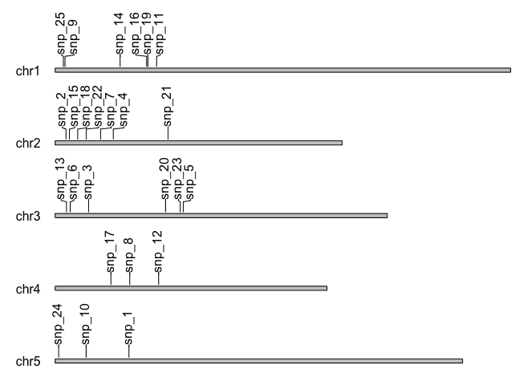
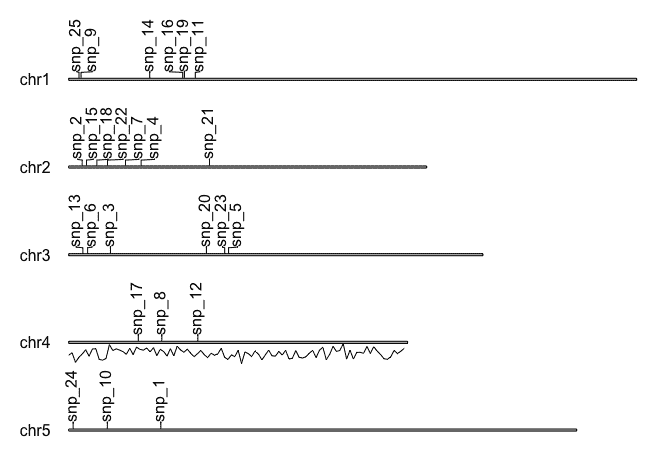
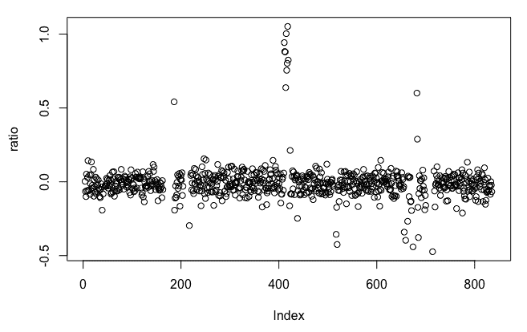

# 第二章：使用 HTS 数据查找遗传变异

**高通量测序**（**HTS**）使得在短时间内发现遗传变异并进行全基因组基因分型和单倍型分析成为可能。这项技术所释放的数据洪流为生物信息学家和计算机科学家提供了一些独特的机会，创造了很多创新的新数据存储和分析流程。变异调用的基本流程从 HTS 读取的质量控制开始，然后是将这些读取比对到参考基因组。这些步骤通常会在 R 分析之前进行，并通常会生成一个包含读取比对的 BAM 文件或包含变异位置的 VCF 文件（有关这些文件格式的简要讨论，请参见本书的附录），我们将在 R 代码中对其进行处理。

由于变异调用和分析是生物信息学中的基本技术，Bioconductor 配备了构建软件和进行分析所需的工具。研究人员想要问的关键问题可能从 *我的基因组上遗传变异的位置在哪里？* 到 *有多少个变异？* 再到 *如何对它们进行分类？* 我们将查看一些解决这些问题的方案，并且还将探讨一些重要的通用技术，这些技术使我们能够在基因组上可视化变异和标记，并评估变异与基因型的关联。我们还将了解遗传变异的其他定义，并探索如何评估单个位点的拷贝数。

本章将涵盖以下方案：

+   使用 VariantTools 查找序列数据中的 SNP 和 indel

+   预测长参考序列中的开放阅读框

+   使用 karyoploteR 在遗传图谱上绘制特征

+   寻找替代转录本同种型

+   使用 VariantAnnotation 选择和分类变异

+   提取感兴趣基因组区域的信息

+   查找表型和基因型与 GWAS 的关联

+   估计感兴趣位点的拷贝数

# 技术要求

以下是你将需要的 R 包。一些可以通过 `install.packages()` 安装。列在 `Bioconductor` 下的包需要通过专用安装器安装。相关说明请参见此处。如果你需要进行其他操作，包的安装将在使用这些包的方案中进行描述：

+   `Bioconductor`：以下是这些包：

    +   `Biostrings`

    +   `GenomicRanges`

    +   `gmapR`

    +   `karyoploteR`

    +   `rtracklayer`

    +   `systemPipeR`

    +   `SummarizedExperiment`

    +   `VariantAnnotation`

    +   `VariantTools`

+   `rrBLUP`

Bioconductor 非常庞大，并且拥有自己的安装管理器。你可以通过以下代码安装这些包（更多信息请参考 [`www.bioconductor.org/install/`](https://www.bioconductor.org/install/)）：

```py
if (!requireNamespace("BiocManager"))
    install.packages("BiocManager")
BiocManager::install()
```

通常，在 R 中，用户会加载一个库并直接通过名称使用其中的函数。这在交互式会话中非常方便，但当加载多个包时，可能会导致混淆。为了明确当前使用的是哪个包和函数，我有时会使用`packageName::functionName()`的约定。

有时，在一个过程的中途，我会暂停代码，以便你可以看到一些中间输出或理解某个对象的结构。每当发生这种情况时，你会看到一个代码块，每行的开头都会有双井号（`##`）符号，如下所示：

```py
letters[1:5]
## a b c d e
```

本章所有代码和数据都可以在本书的 GitHub 仓库找到：[`github.com/danmaclean/R_Bioinformatics_Cookbook`](https://github.com/danmaclean/R_Bioinformatics_Cookbook)。

# 使用 VariantTools 从序列数据中找到 SNP 和插入缺失变异（indels）

一个关键的生物信息学任务是处理高通量序列读取的比对结果，通常存储在 BAM 文件中，并计算变异位置列表。当然，这个过程可以通过许多外部命令行程序和工具来完成，通常会生成一个 VCF 格式的变异文件，但 Bioconductor 中有一些非常强大的包能够完成整个流程，并且以快速高效的方式，通过利用 BiocParallel 的并行计算功能——这一功能旨在加速处理 Bioconductor 对象中的大规模数据集——实现这一目标。使用 Bioconductor 工具可以让我们将所有处理步骤都保持在 R 环境中，在这一部分中，我们将使用纯粹的 R 代码和一些 Bioconductor 包，逐步完成一个从读取数据到变异基因列表的完整流程。

# 准备工作

在本节中，我们将使用一组合成的读取数据，覆盖人类基因组 17 号染色体前 83KB 左右的区域。这些读取数据是使用`samtools`中的`wgsim`工具生成的——一个外部命令行程序。它们包含 64 个由`wgsim`引入的 SNP，这些 SNP 可以在`datasets/ch2/snp_positions.txt`中的样本数据中看到。你会看到，随着程序的进展，默认参数会找到比实际更多的 SNP——你需要仔细调节参数，以精细调整 SNP 发现过程。

# 如何操作...

使用`VariantTools`从序列数据中找到 SNP 和插入缺失变异（indels）可以通过以下步骤完成：

1.  导入所需的库：

```py
library(GenomicRanges)
library(gmapR)
library(rtracklayer)
library(VariantAnnotation)
library(VariantTools)
```

1.  然后，加载数据集：

```py
bam_folder <- file.path(getwd(), "datasets", "ch2")
bam_folder_contents <- list.files(file.path(getwd(), "datasets", "ch2" ) )
bam <- file.path( bam_folder, "hg17_snps.bam")
fasta_file <- file.path(bam_folder,"chr17.83k.fa")
```

1.  设置基因组对象和参数对象：

```py
fa <- rtracklayer::FastaFile(fasta_file)

genome <- gmapR::GmapGenome(fa, create=TRUE)

qual_params <- TallyVariantsParam(
                   genome = genome,
                   minimum_mapq = 20)

var_params <- VariantCallingFilters(read.count = 19,
                                    p.lower = 0.01
                                    )
```

1.  调用变异：

```py
called_variants <- callVariants(bam, qual_params, 
                                calling.filters = var_params
                                )

head(called_variants)
```

1.  现在，我们进入注释阶段并加载来自`.gff`或`.bed`文件的特征位置信息：

```py
get_annotated_regions_from_gff <- function(file_name) {
  gff <- rtracklayer::import.gff(file_name) 
  as(gff, "GRanges")
}

get_annotated_regions_from_bed <- function(file_name){
  bed <- rtracklayer::import.bed(file_name)
  as(bed, "GRanges")
}

genes <- get_annotated_regions_from_gff(file.path( bam_folder, "chr17.83k.gff3"))
```

1.  现在我们计算哪些变异与哪些基因重叠：

```py
overlaps <- GenomicRanges::findOverlaps(called_variants, genes) 
overlaps
```

1.  最后，我们通过重叠列表来筛选基因。

```py
genes[subjectHits(overlaps)]
```

# 它是如何工作的...

这是一个复杂且涉及多个步骤的管道。加载库后，前四行设置了我们需要的来自数据集目录的文件。请注意，我们需要一个`.bam` 文件和一个 `fasta` 文件。接下来，我们使用 `gmapR::GmapGenome()` 函数与 `fasta` 对象一起创建一个 `GmapGenome` 对象——这个对象描述了基因组以供后续的变异调用函数使用。接下来的两个函数，`TallyVariantParams()` 和 `VariantCallingFilters()`，对于正确调用和筛选候选 SNP 至关重要。这些函数是你可以设置定义 SNP 或 indel 参数的地方。这里的选项故意设置得很少。正如从输出中看到的，虽然我们创建了 64 个 SNP，但只有 6 个被成功调用。

一旦参数定义完毕，我们使用 `callVariants()` 函数，将我们设置的所有信息作为输入，获得一个变异的 `vranges` 对象。

这将产生以下输出：

```py
 VRanges object with 6 ranges and 17 metadata columns:
##           seqnames    ranges strand         ref              alt
##              <Rle> <IRanges>  <Rle> <character> <characterOrRle>
##   [1] NC_000017.10        64      *           G                T
##   [2] NC_000017.10        69      *           G                T
##   [3] NC_000017.10        70      *           G                T
##   [4] NC_000017.10        73      *           T                A
##   [5] NC_000017.10        77      *           T                A
##   [6] NC_000017.10        78      *           G                T
```

然后，我们可以设置 `GFF` 文件注释的 `GRanges` 对象（我还提供了一个从 `BED` 文件获取注释的函数）。

这将产生以下输出：

```py
## Hits object with 12684 hits and 0 metadata columns:
##           queryHits subjectHits
##           <integer>   <integer>
##       [1]     35176           1
##       [2]     35176           2
##       [3]     35176           3
##       [4]     35177           1
```

最后的步骤是使用 `XRanges` 对象强大的重叠和子集功能。我们使用 `GenomicRanges::findOverlaps()` 查找实际的重叠——返回的 `overlaps` 对象实际上包含了每个输入对象中重叠对象的索引。

这将产生以下输出：

```py
## GRanges object with 12684 ranges and 20 metadata columns:
##               seqnames      ranges strand |   source       type     score
##                  <Rle>   <IRanges>  <Rle> | <factor>   <factor> <numeric>
##       [1] NC_000017.10 64099-76866      - |   havana ncRNA_gene      <NA>
##       [2] NC_000017.10 64099-76866      - |   havana    lnc_RNA      <NA>
##       [3] NC_000017.10 64099-65736      - |   havana       exon      <NA>
```

因此，我们可以使用 `subjectHits(overlaps)` 直接筛选出包含 SNP 的基因，并获得一个非常简洁的列表。

# 还有更多内容...

当我们对筛选条件和我们调用的变异集感到满意时，可以使用以下代码保存变异的 VCF 文件：

```py
VariantAnnotation::sampleNames(called_variants) <- "sample_name"
vcf <- VariantAnnotation::asVCF(called_variants)
VariantAnnotation::writeVcf(vcf, "hg17.vcf")
```

# 另见

虽然我们的方案使步骤和代码清晰易懂，但我们需要更改的实际参数和数值不能像这样直接描述，因为这些值将极大依赖于数据集。`VariantTools` 文档包含了如何正确设置参数的详细讨论：[`bioconductor.org/packages/release/bioc/vignettes/VariantTools/inst/doc/VariantTools.pdf`](http://bioconductor.org/packages/release/bioc/vignettes/VariantTools/inst/doc/VariantTools.pdf)。

# 在长参考序列中预测开放阅读框

先前未测序基因组的草图组装可以是一个丰富的生物学知识来源，但当基因组学资源如基因注释不可用时，继续进行可能会变得棘手。在这里，我们将看看一个第一阶段的流程，用来寻找潜在的基因和基因组位点，完全是*de novo*的，且没有超出序列的信息。我们将使用一组非常简单的规则来寻找开放阅读框——这些序列从起始密码子开始，并以终止密码子结束。实现这一点的工具被封装在`Bioconductor`包中的一个函数`systemPipeR`内。我们最终会得到另一个`GRanges`对象，可以将其整合到下游的处理流程中，帮助我们交叉引用其他数据，例如 RNAseq，正如我们在第一章《执行定量 RNAseq》中的*查找未注释的转录区*食谱中看到的那样。最后一步，我们将看看如何使用基因组模拟来评估哪些开放阅读框实际上可能是有效的，而不是仅仅偶然出现的。

# 做好准备

在这个食谱中，我们只需要输入`Arabidopsis` 叶绿体基因组的短 DNA 序列；它位于`datasets/ch2/arabidopsis_chloroplast.fa`<q>.</q>我们还需要`Bioconductor`包中的`Biostrings`和`systemPipeR`。

# 如何操作...

在长参考序列中预测开放阅读框可以通过以下步骤完成：

1.  加载库并输入基因组：

```py
library(Biostrings)
library(systemPipeR)

dna_object <- readDNAStringSet(file.path(getwd(), "datasets","ch2", "arabidopsis_chloroplast.fa"))
```

1.  预测**ORFs**（**开放阅读框**）：

```py
predicted_orfs <- predORF(dna_object, n = 'all', type = 'gr', mode='ORF', strand = 'both', longest_disjoint = TRUE) 
predicted_orfs
```

1.  计算参考基因组的特性：

```py
bases <- c("A", "C", "T", "G")
raw_seq_string <- strsplit(as.character(dna_object), "")

seq_length <- width(dna_object[1])
counts <- lapply(bases, function(x) {sum(grepl(x, raw_seq_string))}  )
probs <- unlist(lapply(counts, function(base_count){signif(base_count / seq_length, 2) }))
```

1.  创建一个函数，找到模拟基因组中最长的 ORF：

```py
get_longest_orf_in_random_genome <- function(x,
  length = 1000, 
  probs = c(0.25, 0.25, 0.25, 0.25), 
  bases = c("A","C","T","G")){

  random_genome <- paste0(sample(bases, size = length, replace = TRUE, prob = probs), collapse = "")
  random_dna_object <- DNAStringSet(random_genome)
  names(random_dna_object) <- c("random_dna_string")
  orfs <- predORF(random_dna_object, n = 1, type = 'gr', mode='ORF', strand = 'both', longest_disjoint = TRUE)
  return(max(width(orfs)))
}
```

1.  在 10 个模拟基因组上运行该函数：

```py
random_lengths <- unlist(lapply(1:10, get_longest_orf_in_random_genome, length = seq_length, probs = probs, bases = bases))
```

1.  获取最长随机 ORF 的长度：

```py
longest_random_orf <- max(random_lengths)
```

1.  只保留预测的长度大于最长随机 ORF 的 ORF：

```py
keep <- width(predicted_orfs) > longest_random_orf
orfs_to_keep <- predicted_orfs[keep]
orfs_to_keep
```

# 它是如何工作的...

这个食谱的第一部分是我们实际预测 ORF 的地方。首先，我们使用`Biostrings`包中的`readDNAStringSet()`函数将 DNA 序列加载为`DNAStringSet`对象。`systemPipeR`包中的`predORF()`函数使用这个对象作为输入，并根据设置的选项实际预测开放阅读框。在这里，我们返回两个链上的所有 ORF。

这将产生以下输出：

```py
## GRanges object with 2501 ranges and 2 metadata columns:
##           seqnames        ranges strand | subject_id inframe2end
##              <Rle>     <IRanges>  <Rle> |  <integer>   <numeric>
##      1 chloroplast   86762-93358      + |          1           2
##   1162 chloroplast     2056-2532      - |          1           3
##      2 chloroplast   72371-73897      + |          2           2
##   1163 chloroplast   77901-78362      - |          2           1
##      3 chloroplast   54937-56397      + |          3           3
```

我们返回一个`GRanges`对象，其中描述了 2,501 个开放阅读框。这个数字太多了，所以我们需要过滤掉其中一些；特别是，我们可以找出哪些 ORF 是由序列中的偶然事件引起的。为此，我们需要做一点模拟，这也正是接下来代码部分要做的事情。

为了估计随机 ORF 的最大长度，我们将创建一系列长度与输入序列相等且具有相同碱基比例的随机基因组，并观察可以预测的最长 ORF 是什么。我们进行几次迭代，并大致了解由偶然事件引起的最长 ORF 的长度。这个长度将作为一个阈值，用于拒绝真实序列中预测的 ORF。

实现这一目标需要一些设置和自定义函数。首先，我们定义将作为简单字符向量使用的碱基。然后，我们通过分割`dna_object`的`as.character`版本来获取原始 DNA 序列的字符向量。我们利用这些信息计算输入序列中每个碱基的比例，首先计算每个碱基的数量（得到`counts`），然后将其除以序列的长度，得到`probs`。在这两个步骤中，我们使用`lapply()`遍历`bases`向量和`counts`列表，应用匿名函数来计算这些变量的结果列表。`unlist()`用于将最终列表简化为一个简单的向量。

一旦我们完成设置，就可以构建我们的`get_longest_orf_in_random_genome()`模拟函数。该函数通过从`bases`中的选择中按给定的`probs`概率采样字符生成一个随机基因组。该向量通过`paste0()`合并为一个字符串，然后转换为`DNAStringSet`对象，以供`predORF()`函数使用。这一次，我们只请求最长的 ORF，使用*n* = *1*并返回其长度。

这将产生以下输出：

```py
## GRanges object with 10 ranges and 2 metadata columns:
##         seqnames        ranges strand | subject_id inframe2end
##            <Rle>     <IRanges>  <Rle> |  <integer>   <numeric>
##    1 chloroplast   86762-93358      + |          1           2
##    2 chloroplast   72371-73897      + |          2           2
##    3 chloroplast   54937-56397      + |          3           3
##    4 chloroplast   57147-58541      + |          4           1
```

现在，我们可以运行这个函数，我们使用`lapply()`运行 10 次，并使用我们之前计算的`length`、`probs`和`bases`信息。`unlist()`将结果转换为一个简单的向量，我们使用`max()`提取 10 次运行中的最长一个。我们可以通过子集化原始的`predicted_orfs GRanges`对象，保留那些比随机生成的 ORFs 更长的 ORF。

# 还有更多...

一旦你获得了一组你满意的 ORF，你可能希望将它们保存到文件中。你可以使用`BSgenome`包中的`getSeq()`函数，通过传递原始序列对象——`dna_object`——以及`orfs_to_keep`中的范围来完成。然后，使用`names()`为结果命名，最后，你可以使用`writeXStringSet()`函数将它们保存到文件中：

```py
extracted_orfs <- BSgenome::getSeq(dna_object, orfs_to_keep) 
names(extracted_orfs) <- paste0("orf_", 1:length(orfs_to_keep))
writeXStringSet(extracted_orfs, "saved_orfs.fa")
```

# 使用 karyoploteR 绘制遗传图谱上的特征

我们能做的最有价值且富有洞察力的事情之一就是**可视化数据**。我们常常希望在染色体或遗传图谱上看到某些感兴趣的特征与其他特征的关系。这些图有时称为染色体图，有时称为示意图，在本节中，我们将看到如何使用`karyoploteR`包创建这些图。该包将熟悉的`GRanges`对象作为输入，并根据配置生成详细的图表。我们将快速浏览几种不同的图表样式，以及一些配置选项，以解决图表中的问题，比如标签溢出或重叠。

# 准备工作

对于这个配方，你需要安装`karyoploteR`，但我们将使用的所有数据将在配方本身中生成。

# 如何进行操作...

使用`karyoploteR`绘制遗传图谱上的特征，可以通过以下步骤完成：

1.  首先，我们加载库：

```py
library(karyoploteR)
library(GenomicRanges)
```

1.  然后，设置基因组对象，这将作为我们核型图的基础：

```py
genome_df <- data.frame( 
    chr = paste0("chr", 1:5), 
    start = rep(1, 5), 
    end = c(34964571, 22037565, 25499034, 20862711, 31270811) 
    ) 
genome_gr <- makeGRangesFromDataFrame(genome_df)
```

1.  设置我们将绘制为标记的 SNP 位置：

```py
snp_pos <- sample(1:1e7, 25)
snps <- data.frame(
  chr = paste0("chr", sample(1:5,25, replace=TRUE)),
  start = snp_pos,
  end = snp_pos
)
snps_gr <- makeGRangesFromDataFrame(snps)
```

1.  为标记创建一些标签：

```py
snp_labels <- paste0("snp_", 1:25)
```

1.  设置绘图边距：

```py
plot.params <- getDefaultPlotParams(plot.type=1)
plot.params$data1outmargin <- 600
```

1.  创建基础图表并添加轨道：

```py
kp <- plotKaryotype(genome=genome_gr, plot.type = 1, plot.params = plot.params)
kpPlotMarkers(kp, snps_gr, labels = snp_labels)
```

# 它是如何工作的...

代码首先加载我们需要的库，然后我们构建一个`data.frame`，描述我们要绘制的基因组，并相应地设置名称和长度。然后，使用`makeGRangesFromDataFrame()`转换函数将`data.frame`转换为`genome_gr`——一个`GRanges`对象。接着，我们使用`sample()`函数生成一个包含 25 个随机 SNP 的`data.frame`，并选择一个位置和染色体。同样，这些数据也被转换为`GRanges`。现在我们可以设置我们的绘图。首先，我们通过`getDefaultPlotParams()`从包内部获取默认的绘图参数对象。我们可以修改此对象，以便对绘图的默认设置进行更改。

注意，我们选择了`plot.type = 1`——这是一个简单的绘图，具有直接位于每个染色体区域上方的数据轨道。我们需要调整数据轨道的边距高度，以防止标记标签溢出到顶部——这可以通过`plot.params$data1outmargin <- 600`来完成。最后，我们可以绘制我们的图表；我们通过调用`plotKaryotype()`并传入`genome_gr`对象、`plot.type`以及在修改后的`plot.params`对象中的参数来创建基本的绘图对象`kp`。

这将产生以下输出：



我们的标记是使用`kpPlotMarkers()`函数绘制的，传入新的`kp`绘图对象、`snps_gr`数据和 SNP 标签。

# 还有更多...

我们可以通过`karyoploteR`将多种类型的数字数据添加到数据轨道中。以下示例演示了如何将一些数字数据绘制成简单的线条。第一步是准备我们的数据。在这里，我们创建了一个包含 100 个随机数的`data.frame`，这些随机数映射到染色体 4 的 100 个窗口，并且像之前一样，我们创建了一个`GRanges`对象。这次，我们将在染色体的上方和下方分别添加一个数据轨道——一个用于 SNP 标记，另一个用于新数据（注意，这里的`plot.type = 2`）。接下来，我们需要设置绘图的参数——特别是边距，以防标签和数据重叠；但是之后，绘图的调用与之前相同，这次加入了`kpLines()`的调用。这里的关键参数是`y`，它描述了数据在每个绘图点的`y`值（请注意，这来自我们的`numeric_data`对象中的单列数据）。现在我们得到了一个包含数字数据轨道的绘图，沿着染色体 4 进行显示。以下是此示例所需执行的步骤：

1.  创建一些数字数据：

```py
numeric_data <- data.frame(
 y = rnorm(100,mean = 1,sd = 0.5 ),
 chr = rep("chr4", 100),
 start = seq(1,20862711, 20862711/100),
 end = seq(1,20862711, 20862711/100)
)
numeric_data_gr <- makeGRangesFromDataFrame(numeric_data)
```

1.  设置绘图边距：

```py
plot.params <- getDefaultPlotParams(plot.type=2)
plot.params$data1outmargin <- 800
plot.params$data2outmargin <- 800
plot.params$topmargin <- 800
```

1.  创建一个绘图并添加轨道：

```py
kp <- plotKaryotype(genome=genome_gr, plot.type = 2, plot.params = plot.params)
kpPlotMarkers(kp, snps_gr, labels = snp_labels)
kpLines(kp, numeric_data_gr, y = numeric_data$y, data.panel=2)
```

这将产生以下输出：



# 参见：

这里有许多未涵盖的轨道类型和绘图布局。请尝试查看 karyoploteR 手册，以获取完整列表：[`bioconductor.org/packages/release/bioc/vignettes/karyoploteR/inst/doc/karyoploteR.html`](http://bioconductor.org/packages/release/bioc/vignettes/karyoploteR/inst/doc/karyoploteR.html)。

`karyoploteR`的一个特点是它仅绘制水平的染色体图。对于垂直图，Bioconductor 中还有`chromPlot`包。

# 使用 VariantAnnotation 选择和分类变异

在我们调用变异的管道中，我们通常希望进行后续分析步骤，这些步骤需要根据单个变异的特征（例如，备选等位基因的覆盖深度）进一步进行过滤或分类。这最好从 VCF 文件中进行，常见的做法是保存一个包含所有变异的 VCF 文件，之后再进行过滤。在这一部分中，我们将讨论如何获取输入 VCF 并进行过滤，以保留那些备选等位基因在样本中为主要等位基因的变异。

# 准备工作

我们需要一个`tabix`索引的 VCF 文件；我提供了一个在`datasets/ch2/sample.vcf.gz`文件中。我们还需要 Bioconductor 包`VariantAnnotation`。

# 如何操作...

使用`VariantAnnotation`选择和分类变异可以通过以下步骤完成：

1.  创建一个预过滤函数：

```py
is_not_microsat <- function(x){ !grepl("microsat", x, fixed = TRUE)}
```

1.  将预过滤函数加载到`FilterRules`对象中：

```py
prefilters <- FilterRules(list(microsat = is_not_microsat) )
```

1.  创建一个过滤函数，以保留那些参考等位基因出现在少于一半读取中的变异：

```py
major_alt <- function(x){
 af <- info(x)$AF 
 result <- unlist(lapply(af, function(x){x[1] < 0.5}))
 return(result)
}
```

1.  将过滤函数加载到一个`FilterRules`对象中：

```py
filters <- FilterRules(list(alt_is_major = major_alt))
```

1.  加载输入的 VCF 文件并应用过滤：

```py
vcf_file <- file.path(getwd(), "datasets", "ch2", "sample.vcf.gz")
filterVcf(vcf_file, "hg17", "filtered.vcf", prefilters = prefilters, filters = filters)
```

# 它是如何工作的...

在这个非常简短的脚本中，实际上有大量的内容。总体思路是我们需要定义两组过滤规则——`prefilter`和`filter`。这通过定义函数来实现，函数接受解析后的 VCF 记录并返回`TRUE`，如果该记录通过了过滤。预过滤通常是基于未解析的 VCF 记录行的文本过滤——即记录的原始文本。我们的第一行代码定义了一个`is_not_microsat()`函数，该函数接收一个字符串，并使用`grepl()`函数判断该行是否包含单词`microsat`，如果不包含，则返回`TRUE`。预过滤函数被打包到我们称之为`prefilters`的`FilterRules`对象中。

过滤器更为复杂。这些过滤器作用于解析后的 VCF 记录（作为**VCF**类对象）。我们的`major_alt()`函数使用`info()`**VCF**访问器函数提取 VCF 记录中的`info`数据。它返回一个数据框，其中每一列都是`info`部分的一个独立部分。我们提取`AF`列，它返回一个列表，其中每个 VCF 都有一个元素。为了遍历这些元素，我们使用`lapply()`函数应用一个匿名函数，如果参考等位基因的比例低于 0.5（即替代等位基因是主要等位基因），则返回`TRUE`。然后我们使用`unlist()`将结果转换为向量。`major_alt()`函数然后被打包到一个名为`filters`的`FilterRules`对象中。

最后，完成所有设置后，我们可以加载输入 VCF 文件并使用`filterVCF()`函数进行过滤。此函数需要`FilterRules`对象和输出的过滤后的 VCF 文件名。我们使用`filtered.vcf`作为要写入的文件。

# 另请参见

在过滤函数中，我们可以利用其他访问器函数来获取 VCF 记录的不同部分。有`geno()`和`fixed()`函数，它们将返回描述这些 VCF 记录部分的数据结构。你可以像使用`info()`一样使用它们来创建过滤器。

# 提取感兴趣的基因组区域信息

很多时候，你可能需要更详细地查看落在特定基因组区域内的数据，无论是基因中的 SNP 和变异，还是特定基因座中的基因。这个极其常见的任务可以通过功能强大的`GRanges`和`SummarizedExperiment`对象来很好地处理，尽管这些对象的设置可能有些繁琐，但它们具有非常灵活的子集操作，付出的努力是值得的。我们将探讨几种设置这些对象的方法以及几种操作它们以获取有趣信息的方法。

# 准备工作

在这个示例中，我们需要`GenomicRanges`、`SummarizedExperiment`和`rtracklayer` Bioconductor 包。我们还需要两个输入数据文件：`Arabidopsis`染色体 4 的 GFF 文件，位于`datasets/ch2/arabidopsis_chr4.gff`文件中，以及同一染色体的基因仅特征的较小文本版本，位于`datasets/ch2/arabidopsis_chr4.txt`。

# 如何实现……

提取感兴趣的基因组区域信息可以通过以下步骤完成：

1.  加载包并定义一些从常见文件创建`GRanges`的函数：

```py
library(GenomicRanges)
library(rtracklayer)
library(SummarizedExperiment)

get_granges_from_gff <- function(file_name) {
  gff <- rtracklayer::import.gff(file_name)
  as(gff, "GRanges")
}

get_granges_from_bed <- function(file_name){
  bed <- rtracklayer::import.bed(file_name)
  as(bed, "GRanges")
}

get_granges_from_text <- function(file_name){
  df <- readr::read_tsv(file_name, col_names = TRUE ) 
  GenomicRanges::makeGRangesFromDataFrame(df, keep.extra.columns = TRUE)
}

```

1.  实际上使用这些函数创建一些`GRanges`对象：

```py
gr_from_gff <- get_annotated_regions_from_gff(file.path(getwd(), "datasets", "ch2", "arabidopsis_chr4.gff"))
gr_from_txt <- get_granges_from_text(file.path(getwd(), "datasets", "ch2", "arabidopsis_chr4.txt"))
```

1.  通过对属性进行筛选来提取区域；在此案例中——`seqnames`和`metadata`列：

```py
genes_on_chr4 <- gr_from_gff[ gr_from_gff$type == "gene" & seqnames(gr_from_gff) %in% c("Chr4") ]  
```

1.  手动创建一个感兴趣的区域：

```py
region_of_interest_gr <- GRanges(
    seqnames = c("Chr4"), 
    IRanges(c(10000), width= c(1000))
)

```

1.  使用感兴趣的区域对子集进行筛选：

```py
overlap_hits <- findOverlaps(region_of_interest_gr, gr_from_gff)
features_in_region <- gr_from_gff[subjectHits(overlap_hits) ]
features_in_region
```

# 它是如何工作的……

这里的第一步是创建一个`GRanges`对象，该对象描述了你感兴趣的基因组特征。我们创建的三个函数分别加载来自不同文件类型的信息，即`.gff`、`.bed`和一个制表符分隔的`.txt`文件，并返回所需的`GRanges`对象。在*第 2 步*中，我们利用 GFF 和文本函数创建了两个`GRanges`对象：`gr_from_gff`和`gr_from_txt`。这些对象随后用于子集操作。首先，在*第 3 步*中，我们对特征属性进行了子集操作。代码在 4 号染色体上找到了基因类型的特征。请注意，在`Chr4`中寻找基因和特征的语法区别。`GRanges`对象中的基本列—即`seqnames`、`width`和`start`—都有访问器函数来返回向量。

因此，我们在条件的第二部分使用了它。所有其他列—在`GRanges`术语中称为元数据—可以使用标准的`$`语法访问，因此我们在条件的第一部分使用了它。

在*第 4 步*中，我们在自定义的最小`GRanges`对象中创建了一个特定的区域。这个对象只包含一个区域，但可以通过在手动指定的向量中添加更多的`seqnames`、`start`和`width`来添加更多区域。最后，在*第 5 步*中，我们使用`findOverlaps()`函数获取在`gr_from_gff`对象中与手动创建的`region_of_interest`重叠的特征的索引，并使用这些索引来子集较大的`gr_from_gff`对象。

这将产生以下输出：

```py
## GRanges object with 1 range and 10 metadata columns:
##       seqnames     ranges strand |   source     type     score     phase
##          <Rle>  <IRanges>  <Rle> | <factor> <factor> <numeric> <integer>
##   [1]     Chr4 2895-10455      - |   TAIR10     gene      <NA>      <NA>
##                ID        Name                Note          Parent
##       <character> <character>     <CharacterList> <CharacterList>
##   [1]   AT4G00020   AT4G00020 protein_coding_gene            <NA>
##             Index Derives_from
##       <character>  <character>
##   [1]        <NA>         <NA>
##   -------
##   seqinfo: 1 sequence from an unspecified genome; no seqlengths
```

请注意，我们需要使用`subjectHits()`访问器来提取 subject hits 列。

# 还有更多...

通过利用`GRanges`，也可以以相同的方式提取数据框或矩阵的子集，`GRanges`是其他对象的一部分。在以下示例中，我们创建了一个随机数据矩阵，并用它构建了一个`SummarizedExperiment`对象，该对象使用`GRanges`对象来描述其行：

```py
set.seed(4321)
experiment_counts <- matrix( runif(4308 * 6, 1, 100), 4308)
sample_names <- c(rep("ctrl",3), rep("test",3) )
se <- SummarizedExperiment::SummarizedExperiment(rowRanges = gr_from_txt, assays = list(experiment_counts), colData = sample_names)
```

然后，我们可以像之前一样进行子集操作，并返回数据的子集以及范围的子集。`assay()`函数返回实际的数据矩阵：

```py
overlap_hits <- findOverlaps(region_of_interest_gr, se)
data_in_region <- se[subjectHits(overlap_hits) ]
assay(data_in_region)
```

这将给出结果输出：

```py
##          [,1]     [,2]     [,3]     [,4]     [,5]     [,6]
## [1,] 69.45349 90.44524 88.33501 60.87932 86.24007 45.64919
```

# 通过 GWAS 寻找表型和基因型关联

使用高通量测序技术在许多样本中找到数千种基因变异的强大应用之一是**全基因组关联研究**（**GWAS**）——基因型和表型的关系。GWAS 是一项基因组分析，研究不同个体或遗传群体中的遗传变异，查看是否某个特定变异与某一性状相关。进行这种研究的方法有很多，但都依赖于收集特定样本中的变异数据，并在某种方式下与表型进行交叉参考。在本例中，我们将研究 2006 年 Yu *et al* 提出的复杂混合线性模型（*Nature Genetics*，38:203-208）。描述统一混合线性模型的工作原理超出了本例的范围，但它是一个适用于样本量大且具有广泛等位基因多样性的数据的模型，且可用于植物和动物数据。

# 准备工作

在本例中，我们将构建运行分析所需的数据结构，这些数据结构来自输入的 VCF 文件。我们将使用 `GWAS()` 函数，该函数位于 `rrBLUP` 包中。我们的样本数据文件包含三个 SNP——出于教学目的，这有助于我们的编程任务，但对于 GWAS 研究来说，数量显然过于微小。虽然代码可以运行，但结果在生物学上没有实际意义。

我们需要 `rrBLUP`，它不是 Bioconductor 的一部分，因此需要通过 `install.packages()` 安装，同时还需要 `VariantAnnotation` 和 `datasets/ch2/small_sample.vcf` 文件。

# 如何实现...

通过 GWAS 查找表型和基因型关联可以通过以下步骤完成：

1.  加载库并获取 VCF 文件：

```py
library(VariantAnnotation)
library(rrBLUP)
set.seed(1234)
vcf_file <- file.path(getwd(), "datasets", "ch2", "small_sample.vcf")
vcf <- readVcf(vcf_file, "hg19")
```

1.  提取基因型、样本和标记位置信息：

```py
gts <- geno(vcf)$GT

samples <- samples(header(vcf))
markers <- rownames(gts)
chrom <- as.character(seqnames(rowRanges(vcf)))
pos <- as.numeric(start(rowRanges(vcf)))
```

1.  创建一个自定义函数，将 VCF 基因型转换为 GWAS 函数使用的约定：

```py
convert <- function(v){
  v <- gsub("0/0", 1, v)
  v <- gsub("0/1", 0, v)
  v <- gsub("1/0", 0, v)
  v <- gsub("1/1",-1, v)
  return(v)
}
```

1.  调用函数并将结果转换为数值矩阵：

```py
gt_char<- apply(gts, convert, MARGIN = 2)

genotype_matrix <- matrix(as.numeric(gt_char), nrow(gt_char) )
colnames(genotype_matrix)<- samples
```

1.  构建描述变异的数据框：

```py
variant_info <- data.frame(marker = markers,
                           chrom = chrom,
                           pos = pos)
```

1.  构建一个合并的变异/基因型数据框：

```py
genotypes <-  cbind(variant_info, as.data.frame(genotype_matrix))
genotypes
```

1.  构建一个 `phenotype` 数据框：

```py
phenotypes <- data.frame(
  line = samples,
  score = rnorm(length(samples))
                         )

phenotypes
```

1.  运行 `GWAS`：

```py
GWAS(phenotypes, genotypes,plot=FALSE)
```

# 它是如何工作的...

本例中的大部分代码都是设置代码。在加载库并使用 `set.seed()` 固定随机数生成器以确保结果可重复之后，第一步是加载有用变异的 VCF 文件，第二步是提取一些有用的信息：我们获取一个基因型矩阵，使用 `geno(vcf)$GT` 调用，它返回一个矩阵，其中每一行是一个变异，每一列是一个样本，基因型记录在交点处。然后，我们使用一些访问器函数提取样本和标记名称，以及每个变异的参考序列（`chrom`）和位置（`pos`）。在*步骤 3* 中，我们定义一个转换函数（`convert()`），将 VCF 风格的杂合和纯合标注映射到 `GWAS()` 使用的格式。简而言之，在 VCF 中，`"0/0"` 表示 *AA*（纯合），在 `GWAS()` 中编码为 1，`"0/1"` 和 `"1/0"` 表示杂合 *Aa* 或 0，而 `"1/1"` 表示纯合 `aa` 或 -1。

在*步骤 4*中，我们将`convert()`应用于`gts`矩阵。烦人的是，返回值是一个字符矩阵，必须转换为数值型并重新包装成矩阵，这就是*步骤 4*中最后几行的目的。

在*步骤 5*中，我们构建一个数据框，描述我们之前创建的样本、标记和序列信息中的变异信息，而在*步骤 6*中，我们实际上将变异信息与基因型编码结合起来。

这将产生以下输出：

```py
##           marker chrom     pos NA00001 NA00002 NA00003
## 1      rs6054257    20   14370       1       0      -1
## 2   20:17330_T/A    20   17330       1       0       1
## 3 20:1230237_T/G    20 1230237       1       1       0
```

请注意，列的顺序很重要。`GWAS()`函数期望我们按照这里指定的顺序提供这些信息。

在*步骤 7*中，我们构建了表型信息。第一列必须命名为`line`，并包含与基因型矩阵列相同顺序的样本名称。其余列可以是表型分数，并具有固定效应。

这将产生类似以下的输出（如果你在脚本顶部省略了`set.seed()`调用，由于随机化过程和示例数据中的小样本量，你的实际数字可能会有所不同）：

```py
##      line     score
## 1 NA00001 -1.2070657
## 2 NA00002 0.2774292
## 3 NA00003 1.0844412
```

最后，在*步骤 8*中，我们运行`GWAS()`函数。

这将产生以下输出（同样，你的数字可能会有所不同）：

```py
## [1] "GWAS for trait: score"
## [1] "Variance components estimated. Testing markers."

##           marker chrom     pos      score
## 1      rs6054257    20   14370 0.3010543
## 2   20:17330_T/A    20   17330 0.3010057
## 3 20:1230237_T/G    20 1230237 0.1655498
```

默认情况下，函数尝试生成一个图形。由于数据点太少，无法生成图形，因此我们在此通过`plot = FALSE`关闭该功能。

# 估计一个感兴趣位点的拷贝数

通常，我们会关心一个序列在样本中的出现频率——也就是估计在你的特定样本中，某个位点是否发生了重复，或其拷贝数是否增加。该位点可以是 Kbp 尺度上的基因，也可以是 Mbp 尺度上的较大 DNA 片段。我们在这个食谱中的方法是，在比对后的 HTS 读取覆盖度基础上估算背景覆盖度，然后检查我们感兴趣区域的覆盖度。我们感兴趣区域的覆盖度与背景水平的比率将为我们提供该区域的拷贝数估计。这个食谱是第一步。我们使用的背景模型非常简单——仅计算一个全局均值，但稍后我们将讨论一些替代方法。此外，这个食谱不涉及倍性——即细胞中整个基因组的拷贝数。通过类似的数据（尤其是 SNP 的主要/次要等位基因频率）可以估算倍性，但这是一个非常复杂的流程。请查看*另请参阅*部分，了解关于用于该长期分析的包的建议。

# 准备工作

对于这个食谱，我们需要`csaw` Bioconductor 包和样本`hg17`人类基因组`.bam`文件，文件位于`datasets/ch2/hg17_snps.bam`。

# 如何实现...

估计一个感兴趣位点的拷贝数可以通过以下步骤完成：

1.  加载库并获取基因组窗口中的计数：

```py
library(csaw)
whole_genome <- csaw::windowCounts( 
    file.path(getwd(), "datasets", "ch2", "hg17_snps.bam"), 
    bin = TRUE, 
    filter = 0, 
    width = 100, 
    param = csaw::readParam( minq = 20, dedup = TRUE, pe = "both" ) 
) 
colnames(whole_genome) <- c("h17") 
```

1.  从`SummarizedExperiment`中提取数据：

```py
counts <- assay(whole_genome)[,1] 
```

1.  计算一个低计数阈值，并将计数较低的窗口设置为`NA`：

```py
min_count <- quantile(counts, 0.1)[[1]]
counts[counts < min_count] <- NA
```

1.  在中间的一组窗口中翻倍计数——这些将作为我们的高拷贝数区域：

```py
n <- length(counts)
doubled_windows <- 10

left_pad <- floor( (n/2) - doubled_windows )
right_pad <- n - left_pad -doubled_windows
multiplier <- c(rep(1, left_pad ), rep(2,doubled_windows), rep(1, right_pad) )
counts <- counts * multiplier
```

1.  计算每个窗口的平均覆盖度以及该窗口与平均覆盖度的比值，并通过绘图检查该比值向量：

```py
 mean_cov <- mean(counts, na.rm=TRUE) 
 ratio <- matrix(log2(counts / mean_cov), ncol = 1)
 plot(ratio)
```

1.  使用新数据和旧数据的行数据构建`SummarizedExperiment`：

```py
se <- SummarizedExperiment(assays=list(ratio), rowRanges= rowRanges(whole_genome), colData = c("CoverageRatio"))
```

1.  创建感兴趣区域并提取其中的覆盖数据：

```py
region_of_interest <- GRanges(
  seqnames = c("NC_000017.10"),
  IRanges(c(40700), width = c(1500) )
)

overlap_hits <- findOverlaps(region_of_interest, se)
data_in_region <- se[subjectHits(overlap_hits)]
assay(data_in_region)
```

# 它是如何工作的...

在*步骤 1*中，本配方以熟悉的方式开始，使用`csaw`包在我们的人类第 17 号染色体小段上获取 100 bp 窗口的读取计数。读取过滤选项在`param`参数中设置。在*步骤 2*中，我们提取数据的第一列（也是唯一一列），使用`assay()`函数和子集提取来获得一个简单的计数向量。接下来，在*步骤 3*中，我们使用`quantile()`函数从`counts`向量中获取低于 10^(百分位)的`min_count`值。需要使用双括号子集提取，以便从`quantile()`函数返回的命名向量中获得单一数字。`min_count`值将作为切断点。`counts`向量中低于该值的所有值都将被设置为`NA`，以便从分析中移除——这充当了一个低覆盖阈值，并且可以根据需要在您自己修改的配方中调整使用的百分位数。

在*步骤 4*中，我们添加了一些覆盖度翻倍的区域——以便我们能检测到它们。我们选择了一些窗口，在其中翻倍计数，然后创建一个与计数长度相等的`multiplier`向量，其中**1**表示我们不希望更改计数，**2**表示我们希望将其翻倍。然后我们应用乘法。*步骤 4*可能会在您的分析中省略，因为它是一个合成数据生成步骤。

在*步骤 5*中，我们实际计算背景覆盖度。我们这里的函数是一个简单的全局平均，保存在`mean_cov`中——但您可以使用许多其他函数。有关此的讨论，请参见*另见*部分。我们还计算每个窗口计数与全局`mean_cov`的比值的`log2()`，并将其保存在一个名为`ratio`的单列矩阵对象中——因为我们需要将结果保存为矩阵形式，才能用于最终的`SummarizedExperiment`对象。我们快速使用`plot()`来检查`ratio`，并可以清晰地看到数据中间窗口计数翻倍的情况。

这将产生以下输出：



在*步骤 6*中，我们构建一个新的`SummarizedExperiment`对象`se`，用于保存窗口范围和新的比值数据。我们从`window_counts`中提取`GRanges`和`colData`对象，并添加我们新的`ratio`矩阵。现在我们可以开始对其进行子集提取，查看感兴趣区域的覆盖情况。

在*第 7 步*中，我们构造了一个手动的`GRanges`对象，表示我们感兴趣的任意区域，称为`region_of_interest`，并使用它通过`findOverlaps()`找到`se`对象中重叠的窗口。然后我们使用结果中的`overlap_hits`向量对子集`se`对象，并通过`assay()`函数查看该兴趣区域的计数。

这将产生以下输出：

```py
##              [,1]
##  [1,]  0.01725283
##  [2,]  0.03128239
##  [3,] -0.05748994
##  [4,]  0.05893873
##  [5,]  0.94251006
##  [6,]  0.88186246
##  [7,]  0.87927929
##  [8,]  0.63780103
##  [9,]  1.00308550
## [10,]  0.75515798
## [11,]  0.80228189
## [12,]  1.05207419
## [13,]  0.82393626
## [14,]          NA
## [15,]          NA
## [16,] -0.16269298
```

在输出中，我们可以看到该区域相对于背景大约有一个 log2 比例为 1（二倍）的覆盖度，我们可以将其解读为拷贝数为 2。

# 另见

该配方中的背景水平计算非常简单——这对于学习配方是很好的，但在你自己真实数据中可能很快就不够用了。你可以采用许多选项来修改计算背景水平的方式，以适应你自己的数据。查看`zoo`包中的`rollmeans()`和`rollmedians()`函数——这些函数可以在任意步长的滚动窗口中给出均值和中位数，能为你提供一个移动窗口的背景平均值，可能会更加合适。

与拷贝数相关的分析之一是从 SNP 等位基因频率估计倍性。你可以查看`vcfR`包中的`freq_peaks()`函数，作为从`BAM`文件中的变异信息估计倍性的起点。
