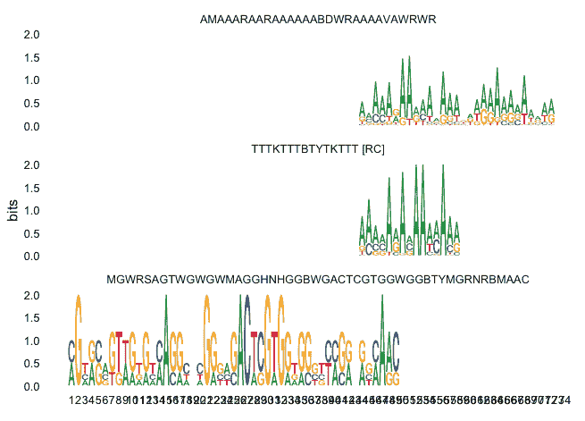
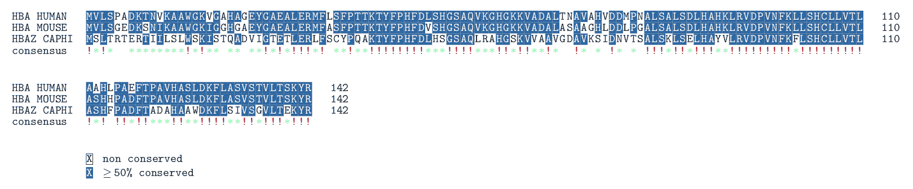
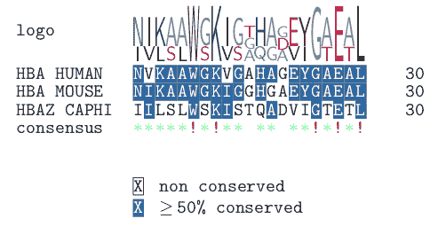
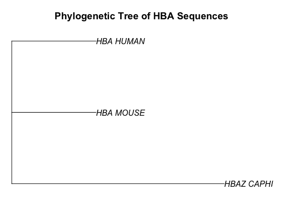
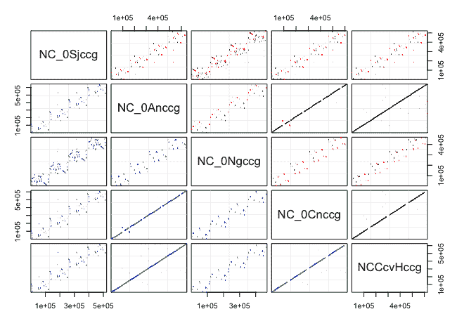
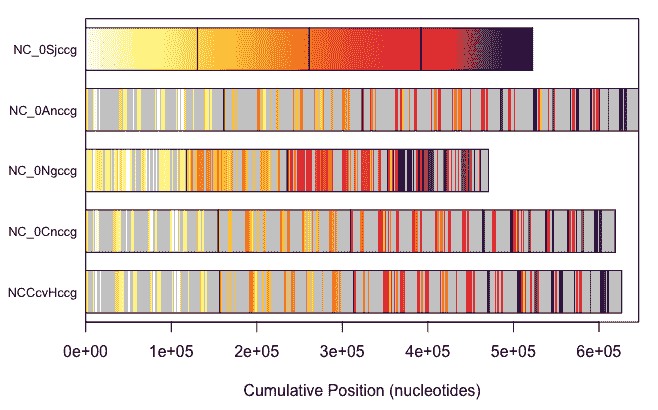
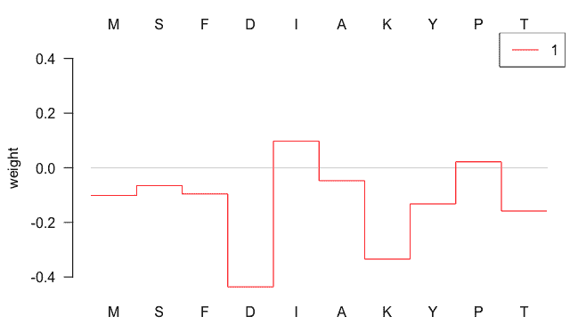
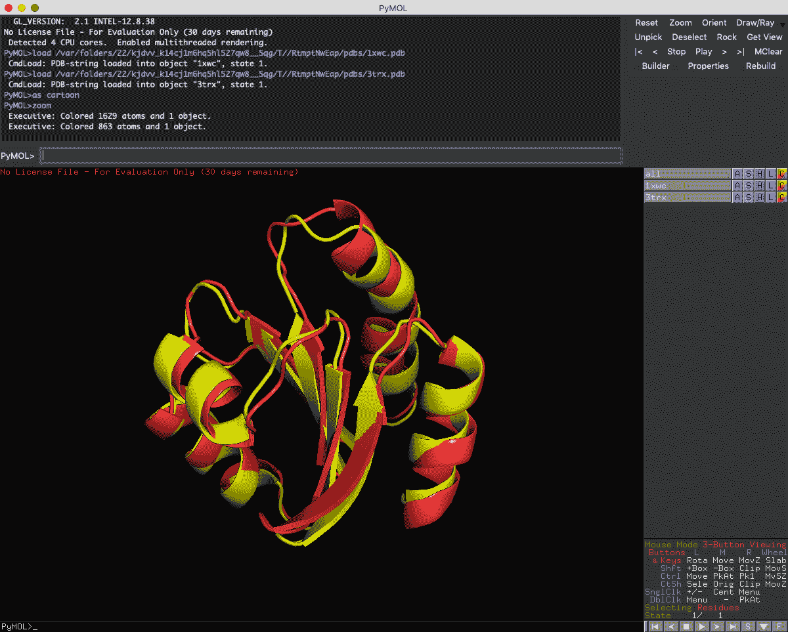

# 第三章：搜索基因和蛋白质的结构域与模体

基因、蛋白质和整个基因组的序列包含了它们功能的线索。重复的子序列或相互之间高度相似的序列，可能是进化保守性或功能相关性的线索。因此，针对模体和结构域的序列分析是生物信息学的核心技术。Bioconductor 包含了许多有用的包，用于分析基因、蛋白质和基因组。在本章中，你将学习如何使用 Bioconductor 分析序列中具有功能意义的特征，例如从广泛使用的数据库中提取的 de novo DNA 模体和已知结构域。你将学习一些基于核函数的机器学习包，用于发现蛋白质序列特征。你还将学习一些大规模比对技术，用于处理非常多或非常长的序列。你将使用 Bioconductor 和其他统计学习包。

本章将涉及以下配方：

+   使用 universalmotif 查找 DNA 模体

+   使用 PFAM 和 bio3d 查找蛋白质结构域

+   查找 InterPro 结构域

+   执行基因或蛋白质的多重比对

+   使用 DECIPHER 对基因组长度序列进行比对

+   用于蛋白质新特征检测的机器学习

+   使用 bio3d 进行蛋白质的 3D 结构比对

# 技术要求

你需要的样本数据可以从本书的 GitHub 仓库获取：[`github.com/danmaclean/R_Bioinformatics_Cookbook`](https://github.com/danmaclean/R_Bioinformatics_Cookbook)[.]（https://github.com/danmaclean/R_Bioinformatics_Cookbook）如果你想直接使用书中的代码示例，则需要确保这些数据位于你工作目录的子目录中。

以下是你将需要的 R 包。大多数包可以通过 `install.packages()` 安装；其他包则稍微复杂一些：

+   `ape`

+   `Bioconductor`：

    +   `Biostrings`

    +   `biomaRt`

    +   `DECIPHER`

    +   `EnsDb.Rnorvegicus.v79`

    +   `kebabs`

    +   `msa`

    +   `org.At.tair.db`

    +   `org.Eck12.db`

    +   `org.Hs.eg.db`

    +   `PFAM.db`

    +   `universalmotif`

+   `bio3d`

+   `dplyr`

+   `e1071`

+   seqinr

Bioconductor 是一个庞大的工具集，具有自己的安装管理器。你可以使用以下代码进行安装：

```py
if (!requireNamespace("BiocManager"))
    install.packages("BiocManager")
BiocManager::install()
```

更多信息请访问 [`www.bioconductor.org/install/`](https://www.bioconductor.org/install/)。

通常，在 R 中，用户会加载一个库并直接按名称使用函数。这在交互式会话中非常方便，但当加载了许多包时，可能会引起混淆。为了澄清我在某一时刻使用的是哪个包和函数，我会偶尔使用 `packageName::functionName()` 的约定。

有时，在一个过程的中途，我会中断代码，方便你查看一些中间输出或是需要理解的对象结构。每当发生这种情况时，你会看到一个代码块，其中每行前面都有 `##` 双井号符号。请参考以下命令：

```py
letters[1:5]
```

这将给我们如下的输出——请注意，输出行以`##`为前缀：

```py
## a b c d e
```

本章中我们要使用的一些软件包依赖于必须单独安装的第三方软件。在 Windows、Linux 或 macOS 上安装和管理生物信息学软件的一种极好的方式是使用 conda 包管理器，并结合 bioconda 包频道。你可以通过一些简单的命令安装大量软件。要安装这两者，首先阅读[`bioconda.github.io/`](https://bioconda.github.io/)上的当前安装说明。

# 使用 universalmotif 查找 DNA motifs

在处理 DNA 序列时，一个非常常见的任务是查找 motif 实例——即在较长序列中定义的短序列。这些可能代表蛋白质- DNA 结合位点，例如基因启动子中的转录因子结合位点或增强区域。在此分析中有两种起点：要么你有一个 motif 数据库，想用它来扫描目标 DNA 序列并提取出现的 motif，要么你只有感兴趣的序列，想要查找其中是否有任何重复的 motif。在本食谱中，我们将讨论如何执行这两项操作。我们将在这两种情况下都使用`universalmotif`包。

# 准备工作

本食谱中，我们需要`datasets/ch3/simple_motif.txt`和`datasets/ch3/promoters.fa`文件，一个描述简单 motif 的简单矩阵，格式为**位置特异性权重矩阵**（**PSWM**）（简要描述请参见*附录*），以及一组来自转录起始位点上游的序列。

本食谱还需要在你的系统中有一个有效的`MEME`副本。`MEME`是一个用于在序列集中过度表现的统计序列 motif 的程序。当用于启动子或基因上游区域时，这些 motif 可能代表转录因子结合位点。`MEME`的网页地址为[`alternate.meme-suite.org/`](http://alternate.meme-suite.org/)，如果你已经安装了 conda，可以通过`conda install -c bioconda meme`来安装。`MEME`包无法在 Windows 系统上使用。如果你希望在 Windows 上运行它，可以考虑在 Cygwin（Linux 模拟层）下运行它：[`www.cygwin.com/`](https://www.cygwin.com/)。你可能还需要在 Cygwin 下安装新的 R 版本。

# 如何操作...

使用`universalmotif`查找 DNA motifs 可以按照以下步骤进行：

1.  首先，加载所需的库和感兴趣的 motif：

```py
library(universalmotif)
library(Biostrings)

motif <- read_matrix(file.path(getwd(), "datasets", "ch3","simple_motif.txt"))
```

1.  然后，加载要用该 motif 扫描的序列：

```py
sequences <- readDNAStringSet(file.path(getwd(), "datasets", "ch3", "promoters.fa"))
```

1.  执行序列扫描：

```py
motif_hits <- scan_sequences(motif, sequences = sequences)
motif_hits
```

请注意，`motif_hits`包含关于 motif 在每个目标序列中位置的信息。

1.  计算该结构是否在序列中富集：

```py
motif_info <- enrich_motifs(motif, sequences, shuffle.k = 3, verbose = 0, progress = FALSE, RC = TRUE)
motif_info
```

请注意，motif 信息包含关于在一组序列中统计富集的信息。

1.  运行`MEME`以查找新型 motif：

```py
meme_path = "/Users/macleand/miniconda2/bin/meme"
meme_run <- run_meme(sequences, bin = meme_path, output = "meme_out", overwrite.dir = TRUE)
motifs <- read_meme("meme_out/meme.txt")
view_motifs(motifs)
```

# 工作原理...

这段代码真是太棒了！仅用几行代码，我们就完成了整个分析。我们首先加载了一个基序的矩阵描述和一些我们希望找到启动子的序列——这发生在步骤 1 和 2 中，结果我们得到了一个`universalmotif`对象和一个`DNAStringSet`对象。接下来的真正工作发生在步骤 3 和 4 中。`scan_sequences()`函数会搜索每个序列并报告找到基序的位置——查看`motif_hits`对象，看看它们在哪里。

这将产生以下输出：

```py
##               motif  sequence start stop  score max.score score.pct 
## 1   YTTTYTTTTTYTTTY AT4G28150    73   87  7.531  22.45824  33.53335 
## 2   YTTTYTTTTTYTTTY AT4G28150    75   89 10.949  22.45824  48.75270
```

在判断一个基序是否显著时，`universalmotifs`包中的`enrich_motifs()`函数会在第 4 步为我们完成这项工作，结果会产生以下输出：

```py
##             motif total.seq.hits num.seqs.hit num.seqs.total
## 1 YTTTYTTTTTYTTTY            916           50             50
##   total.bkg.hits num.bkg.hit num.bkg.total   Pval.hits   Qval.hits
## 1            265          48            50 4.75389e-85 4.75389e-85
##     Eval.hits
## 1 9.50778e-85
```

它会搜索序列，寻找可能出现基序的地方，并对其进行计数，执行 Fisher 精确检验，比较我们的序列集中的基序频率与自动生成的背景集中的基序频率。最终的`motif_info`输出包含一个*p*值报告。为了找到新的基序，我们在第 5 步运行外部软件**MEME**。`run_meme()`函数需要知道**MEME**包在你系统中的位置，因此我们需要在`meme_path`变量中定义该路径。

请注意，系统中`meme_path`的值与此处提到的值会有所不同——这是我系统中的一个示例。

我们将这些信息传递给函数，并提供包含序列的`DNAStringSet`对象。该函数还需要一个输出目录，用于写入`MEME`的结果，因为它不会返回任何有用的信息给 R。`run_meme()`函数会在后台执行`MEME`，一旦运行完成，我们可以通过`read_meme()`函数和文件名从`meme.txt`文件中加载结果。它会返回一个`universalmotif`对象。最后，在这里，我们通过`view_motifs()`函数快速查看`motifs`对象：



这会给我们一个非常直观的基序可视化。

# 还有更多内容...

从现有的数据库（如 JASPAR 和 TRANSFAC）中加载基序非常简单，使用`universalmotif`时，只需对`read_matrix()`函数做直接替换。查看以下函数，它们可以从不同格式中加载基序：`read_cisbp()`、`read_homer()`、`read_jaspar()`、`read_matrix()`、`read_meme()`、`read_motifs()` 和 `read_uniprobe()`。

# 使用 PFAM 和 bio3d 查找蛋白质结构域

发现蛋白质序列的功能是一个关键任务。我们可以通过多种方式来完成这项任务，包括使用 BLAST 等工具对已知蛋白质数据库进行全序列相似性搜索。如果我们希望获得更具信息量和更精细的资料，可以选择在序列中查找个体功能域。`Pfam`等数据库和`hmmer`等工具使得这一过程成为可能。`Pfam`将蛋白质结构域编码为配置文件隐马尔可夫模型，而`hmmer`则使用这些模型扫描序列并报告任何可能存在的结构域。通常，基因组注释项目会为我们完成这些搜索，这意味着要在我们的序列中找到`Pfam`结构域，关键就在于搜索数据库。Bioconductor 在这些特定数据库的数据包装方面做得非常出色，通常是以**`.db`**为后缀的包。在本配方中，我们将展示如何判断一个包是否包含 Pfam 结构域信息，如何为特定基因提取这些信息，以及如果没有现成的信息时，如何自行运行 Pfam 搜索。

# 正在准备中

对于这个示例，我们需要一些 Bioconductor 的`Annotationdbi`数据库包—具体来说，`org.Hs.eg.db`、`org.EcK12.eg.db`和`org.At.tair.db`。

你还需要`bio3d`包，当前版本—在写这篇文档时—只有在使用开发版时，`bio3d`才会连接到 Pfam 服务器。你可以通过`devtools`包从 BitBucket 安装该版本：

```py
install.packages("devtools")
library(devtools)
install_bitbucket("Grantlab/bio3d", subdir = "ver_devel/bio3d/")
```

# 如何操作...

使用`PFAM.db`和`bio3d`查找蛋白质结构域，可以通过以下步骤完成：

1.  加载数据库包并检查数据库中的键类型：

```py
library(org.Hs.eg.db)
keytypes(org.Hs.eg.db)
```

注意这个输出中的`ENSEMBL`键—我们可以用它来查询数据库。

1.  使用`keys()`函数获取键的向量：

```py
k <- head(keys(org.Hs.eg.db, keytype = "ENSEMBL"), n = 3 )
```

1.  查询数据库：

```py
result <- select(org.Hs.eg.db, keys = k, keytype="ENSEMBL", columns = c("PFAM"))
result
```

1.  加载`PFAM`数据库以提取描述信息：

```py
library(PFAM.db)
descriptions <- PFAMDE
```

1.  从`PFAM`数据库中获取所有键：

```py
all_ids <- mappedkeys(descriptions)
```

1.  获取`PFAM` ID 的所有描述：

```py
id_description_mapping <- as.data.frame(descriptions[all_ids])
```

1.  将描述信息与`PFAM`关联：

```py
dplyr::left_join(result, id_description_mapping, by = c("PFAM" = "ac") )
```

# 工作原理...

这种方法的关键在于找出我们使用的数据库是否确实包含 PFAM 域信息。这就是我们在步骤 1 中做的—我们使用`keytypes()`函数列出可用的搜索键。PFAM 出现在结果中。一旦我们确认可以使用此数据库来获取我们需要的信息，就可以遵循一个相当标准的流程：

1.  获取查询用的键列表—比如基因名。这里我们直接从数据库中提取它们，但它们也可以来自其他地方。这将产生以下输出：

```py
##  [1] "ACCNUM"       "ALIAS"        "ENSEMBL"      "ENSEMBLPROT" 
##  [5] "ENSEMBLTRANS" "ENTREZID"     "ENZYME"       "EVIDENCE"    
##  [9] "EVIDENCEALL"  "GENENAME"     "GO"           "GOALL"       
## [13] "IPI"          "MAP"          "OMIM"         "ONTOLOGY"    
## [17] "ONTOLOGYALL"  "PATH"         "PFAM"         "PMID"        
## [21] "PROSITE"      "REFSEQ"       "SYMBOL"       "UCSCKG"     
## [25] "UNIGENE"      "UNIPROT"
```

1.  使用`select()`函数查询数据库，该函数根据提供的键拉取数据。`columns`参数告诉它要拉取哪些数据。这里的表达式将获取我们感兴趣基因的 PFAM ID。

1.  制作所有 PFAM ID 和描述的列表。我们加载 `PFAM.db` 包，并使用它提供的 `PFAMDE` 对象来获取 ID 和描述之间的映射。这将产生以下输出。请注意，因为我们从外部数据库中提取数据，数据库的更改可能会在这里反映出来：

```py
##           ENSEMBL    PFAM
## 1 ENSG00000121410 PF13895
## 2 ENSG00000175899 PF01835
## 3 ENSG00000175899 PF07678
## 4 ENSG00000175899 PF10569
## 5 ENSG00000175899 PF07703
## 6 ENSG00000175899 PF07677
## 7 ENSG00000175899 PF00207
## 8 ENSG00000256069    <NA>
```

1.  然后，我们可以使用 `mappedkeys()` 函数获取实际的描述信息对象。

1.  接下来，提取和转换 `all_ids` 对象的描述为数据框。

1.  最后，我们将 PFAM 域的描述与之前获得的 PFAM ID 进行连接，使用具有共同数据的列——`PFAM` 和 `ac`。这将产生以下输出：

```py
##           ENSEMBL    PFAM                                       de
## 1 ENSG00000121410 PF13895                    Immunoglobulin domain
## 2 ENSG00000175899 PF01835                               MG2 domain
## 3 ENSG00000175899 PF07678               A-macroglobulin TED domain
## 4 ENSG00000175899 PF10569                                     <NA>
## 5 ENSG00000175899 PF07703 Alpha-2-macroglobulin bait region domain
## 6 ENSG00000175899 PF07677  A-macroglobulin receptor binding domain
## 7 ENSG00000175899 PF00207             Alpha-2-macroglobulin family
## 8 ENSG00000256069    <NA>                                     <NA>
```

# 还有更多...

我提到食谱的关键部分——特别是第 6 步的连接——是确保数据库包含正确的键，特别是 PFAM，以便继续进行。根据生物体和数据库的不同，PFAM 注释可能不存在。以下是如何检查你感兴趣的数据库中是否存在它，使用了两个示例数据库 `org.At.tair.db` 和 `org.Eck12.eg.db`，一个拟南芥数据库：

```py
library(org.At.tair.db)
columns(org.At.tair.db)
```

还需要一个 E.coli 数据库：

```py
library(org.EcK12.eg.db)
columns(org.EcK12.eg.db)
```

只需使用 `columns()` 函数报告数据库中的数据列。如果 PFAM 出现，你可以按照以下步骤进行。如果未出现，则可以作为替代方案，在服务器上运行 PFAM 并自行进行注释。以下代码使用 `bio3d` 函数 `hmmer()` 在 EBI 服务器上对输入的蛋白质序列进行 PFAM 搜索。返回的对象在 `hit.tbl` 槽中包含 PFAM 输出的数据帧：

```py
sequence <- read.fasta(file.path(getwd(), "datasets", "ch3", "ecoli_hsp.fa") )
# run pfamseq on protein
result <- hmmer(sequence, type="hmmscan", db="pfam")
result$hit.tbl
```

这将产生以下输出：

```py
##   name        acc bias dcl desc  evalue flags hindex ndom nincluded
## 1 GrpE PF01025.19  3.3 272 GrpE 1.4e-46     3   8846    1         1
##   nregions nreported    pvalue score taxid     pdb.id bitscore mlog.evalue
## 1        1         1 -115.4076 158.2     0 PF01025.19    158.2    105.5824
```

# 查找 InterPro 域

InterPro 是由多个蛋白质数据库提供的预测模型或签名的数据库。InterPro 聚合来自多个来源的信息，以减少注释的冗余性并帮助解释性。在这个示例中，我们将扩展我们用于 PFAM 域的方法，查看感兴趣序列上的 InterPro 域的注释。我们将从 Ensembl 核心数据库开始。

# 准备工作

我们需要 `ensembldb`、`Ensdb.Rnorvegicus.v79` 和 `biomaRt` 这几个 Bioconductor 包。

# 如何操作...

可以通过以下步骤找到 InterPro 蛋白质域：

1.  加载库并仔细检查我们的数据库包是否携带所需的蛋白质数据：

```py
library(ensembldb)
library(EnsDb.Rnorvegicus.v79)
hasProteinData(EnsDb.Rnorvegicus.v79)
```

1.  构建要查询的基因列表——请注意，这里我需要的 `keytype` 是 `GENEID`：

```py
e <- EnsDb.Rnorvegicus.v79
k <- head(keys(e, keytype = "GENEID"), n = 3 )
```

1.  使用 `select()` 函数提取相关数据：

```py
select(e, keys = GeneIdFilter(k),
       columns = c("TXBIOTYPE", "UNIPROTID", "PROTEINID","INTERPROACCESSION"))
```

# 工作原理...

代码是通过相关包在特定的 Rattus norvegicus Ensembl 数据库中进行数据库查找。该过程与 PFAM 域搜索类似：

1.  我们使用 `EnsemblDB` 包特定的 `hasProteinData()` 函数来检查数据库是否包含我们需要的信息。如果输出是 `TRUE`，则很好：

```py
## [1] TRUE
```

1.  我们再次构建感兴趣的基因列表——这里我从数据库中提取列表，但这些 ID 可以来自任何地方。

1.  最后，我们用感兴趣的基因作为关键字搜索数据库。 请注意，我们需要`GeneIdFilter()`函数包装器和`columns`参数来选择要返回的数据。 这将导致一个包含以下信息的数据框架：

```py
##         TXBIOTYPE UNIPROTID          PROTEINID INTERPROACCESSION  GENEID
## 1  protein_coding    Q32KJ7 ENSRNOP00000052495         IPR017850  ENSRNOG00000000001
## 2  protein_coding    Q32KJ7 ENSRNOP00000052495         IPR000917  ENSRNOG00000000001
## 3  protein_coding    C9E895 ENSRNOP00000000008         IPR015424  ENSRNOG00000000007
```

# 这里还有更多内容……

我们在这个配方中使用的方法非常适合 Ensembl 核心数据库，但还有其他非 Ensembl 核心数据库，我们可能想要搜索； 对此，有 biomaRt。 biomaRt 允许我们定义到我们可能知道的其他数据库的连接。 许多这些数据库公开了我们可以用来查询它们的 API。 为此，加载`biomaRt`库并使用`useMart()`函数来定义与适当主机和数据集的连接。 然后，使用连接和列以及基因 ID 使用`getBM()`函数进行查询。 如果您的查询是`interpro`，则会返回 InterPro 的搜索结果。 以下示例在`plants.ensembl.org`上为两个*拟南芥*基因进行搜索：

```py
library(biomaRt)
biomart_athal <- useMart(biomart = "plants_mart", host = "plants.ensembl.org", dataset = "athaliana_eg_gene")
getBM( c("tair_locus", "interpro"), filters=c("tair_locus"), values = c("AT5G40950", "AT2G40510"), mart = biomart_athal)
```

这将返回以下输出：

```py
##   tair_locus  interpro
## 1  AT2G40510 IPR000892
## 2  AT2G40510 IPR038551
## 3  AT5G40950 IPR001684
## 4  AT5G40950 IPR018261
```

# 另请参阅……

如果您在确定 marts 和 columns 的名称时遇到问题，请尝试来自**bioMart**的`listMarts()`和`listDatasets()`函数，它们将提供当前可用 marts 和它们包含的数据列表。

# 执行基因或蛋白质的多重比对

在构建系统发育树之前或作为确定保守和分散区域的结束任务中，对序列进行对齐是生物信息学分析的重要组成部分，并且在 R 和 Bioconductor 中使用**ape**和**DECIPHER**包广泛涵盖了从序列到对齐的极为简单的程序。 在这个配方中，我们将看看如何实现这一过程。

请注意，不同的序列长度有不同的技术。 在这个第一个配方中，我们将看看如何对齐一些 Kbp 长度的序列，例如代表基因和蛋白质的序列。

# 准备就绪

此配方需要`msa`包。 这是一个相当庞大的包，包括外部软件：Clustal、Clustal Omega 和 Muscle。 还需要`ape`和`seqinR`包。 作为测试数据集，我们将使用存储在书籍数据和代码存储库中的一些血红蛋白蛋白质序列，路径为`datasets/ch3/hglobin.fa`。 您的系统中还需要 PDFLatex。 您可以在此处找到安装信息：[`www.latex-project.org/get/`](https://www.latex-project.org/get/)。

# 如何做到这一点……

可以通过以下步骤执行基因或蛋白质的多重比对：

1.  加载库和序列：

```py
library(msa)
seqs <- readAAStringSet(file.path(getwd(), "datasets", "ch3", "hglobin.fa"))
seqs
```

1.  执行多序列比对：

```py
alignment <- msa(seqs, method = "ClustalOmega")
alignment
```

这将返回一个如下所示的对齐对象：

```py
## ClustalOmega 1.2.0 
## 
## Call:
##    msa(seqs, method = "ClustalOmega")
## 
## MsaAAMultipleAlignment with 3 rows and 142 columns
##     aln                                               names
## [1] MVLSPADKTNVKAAWGKVGAHAG...PAVHASLDKFLASVSTVLTSKYR HBA_HUMAN
## [2] MVLSGEDKSNIKAAWGKIGGHGA...PAVHASLDKFLASVSTVLTSKYR HBA_MOUSE
## [3] MSLTRTERTIILSLWSKISTQAD...ADAHAAWDKFLSIVSGVLTEKYR HBAZ_CAPHI
## Con MVLS??DKTNIKAAWGKIG?HA?...PAVHASLDKFLASVSTVLTSKYR Consensus
```

1.  使用以下代码查看结果：

```py
msaPrettyPrint(alignment, output="pdf", showNames="left",
showLogo="none", askForOverwrite=FALSE, verbose=FALSE, file="whole_align.pdf")
```

1.  使用以下代码查看放大区域：

```py
msaPrettyPrint(alignment, c(10,30), output="pdf", showNames="left",
file = "zoomed_align.pdf", showLogo="top", askForOverwrite=FALSE, verbose=FALSE)
```

# 如何运行它……

这里的配方简单而明了——使用`msa`执行 MSA 非常简单。 在步骤 1 中，我们使用常见的`readAAStringSet()`函数加载包和序列，以给出`seqs`——一个`AAStringSet`对象，我们可以检查并获取以下输出：

```py
## A AAStringSet instance of length 3
##     width seq                                          names               
## [1]   142 MVLSPADKTNVKAAWGKVGAH...HASLDKFLASVSTVLTSKYR HBA_HUMAN
## [2]   142 MVLSGEDKSNIKAAWGKIGGH...HASLDKFLASVSTVLTSKYR HBA_MOUSE
## [3]   142 MSLTRTERTIILSLWSKISTQ...HAAWDKFLSIVSGVLTEKYR HBAZ_CAPHI
```

接下来，在*步骤 2*中，将`msa()`函数传入`seqs`对象和对齐方法的名称。这里我们使用`ClustalOmega`（你可以选择`ClustalOmega`、`ClustalW`或`Muscle`）。`method`参数指定了用于实际对齐的外部程序的名称。对齐器运行后，你将获得一个`MsaMultipleAlignment`对象——这是一个容器，包含了对齐后的序列，格式如下：

```py
## ClustalOmega 1.2.0 
## 
## Call:
##    msa(seqs, method = "ClustalOmega")
## 
## MsaAAMultipleAlignment with 3 rows and 142 columns
##     aln                                               names
## [1] MVLSPADKTNVKAAWGKVGAHAG...PAVHASLDKFLASVSTVLTSKYR HBA_HUMAN
## [2] MVLSGEDKSNIKAAWGKIGGHGA...PAVHASLDKFLASVSTVLTSKYR HBA_MOUSE
## [3] MSLTRTERTIILSLWSKISTQAD...ADAHAAWDKFLSIVSGVLTEKYR HBAZ_CAPHI
## Con MVLS??DKTNIKAAWGKIG?HA?...PAVHASLDKFLASVSTVLTSKYR Consensus
```

在步骤 3 中，我们使用`msaPrettyPrint()`函数将对齐的可视化结果写入 PDF 文件。该函数有多个参数，用于描述对齐图的布局。可视化结果必须写入文件，不能像普通的绘图对象那样发送到交互式会话的绘图窗口中。图片存放的文件由`file`参数指定。生成的图片如下：



在步骤 4 中，我们使用第二个位置参数，通过`c(10,30)`向量将视图限制在 10 到 30 之间。我们得到以下图片：



不幸的是，由于图片制作过程在后台使用了 Latex，因此我们无法将图片强制转换为比 PDF 更有用的格式，或像其他绘图对象一样进行渲染。

# 还有更多...

在这个阶段，树形可视化的序列相似性常常非常有用。我们可以使用`ape`和`seqinr`包生成这种可视化。我们可以将对齐对象转换为描述序列距离的`seqinr distance`对象，并从中使用`ape`创建一个简单的邻接树，然后进行绘制：

```py
library(ape)
library(seqinr)
alignment_seqinr <- msaConvert(alignment, type="seqinr::alignment")
distances <- seqinr::dist.alignment(alignment_seqinr, "identity")
tree <- ape::nj(distances)
plot(tree, main="Phylogenetic Tree of HBA Sequences")
```

这将产生以下输出：



# 使用 DECIPHER 对齐基因组长度序列

对齐比基因和蛋白质更长的序列，例如来自组装项目的 contigs、染色体或整个基因组，是一个棘手的任务，并且需要不同于短序列的技术。序列越长，越难对齐。长序列的对齐尤其在计算时间上非常耗费，因为对于短序列有效的算法，随着序列长度的增加，其计算时间呈指数级增长。执行长序列的对齐通常从寻找短的锚对齐开始，然后从那里进行扩展。我们通常会得到同源块——在不同基因组对齐之间匹配较好的区域。

在这个教程中，我们将介绍`DECIPHER`包用于基因组长度的对齐。我们将使用一些叶绿体基因组——约 150 Kbp 长的小型细胞器基因组，这些基因组在进化上相对保守，作为我们的目标序列。

# 准备就绪

确保你已经安装了`DECIPHER`包。我们将使用`datasets/ch3/plastid_genomes.fa`文件作为示例。

# 如何进行...

使用`DECIPHER`对齐基因组长度序列可以按照以下步骤进行：

1.  加载库和基因组序列：

```py
library(DECIPHER)
long_seqs <- readDNAStringSet(file.path(getwd(), "datasets", "ch3", "plastid_genomes.fa"))
long_seqs
```

1.  在本地数据库中准备序列：

```py
Seqs2DB(long_seqs, "XStringSet", "long_db", names(long_seqs))
```

1.  查找 `synteny` 区块：

```py
synteny <- FindSynteny("long_db")
pairs(synteny)
```

这将创建一个同源区块的点图。

1.  绘制 `syntenic` 区块：

```py
plot(synteny)
```

1.  现在，进行实际的比对：

```py
alignment <- AlignSynteny(synteny, "long_db")
```

1.  然后逐一保存配对比对结果：

```py
blocks <- unlist(alignment[[1]])
writeXStringSet(blocks, "genome_blocks_out.fa")
```

# 它是如何工作的...

DECIPHER 包非常强大，因此在进行实际分析之前，需要进行一些设置。在步骤 1 中，我们加载库并将序列加载到 `long_seqs`，一个 **DNAStringSet** 对象中；但在步骤 2 中，我们为后续步骤构建了一个额外的磁盘 SQLite 数据库。这是通过 `Seqs2DB()` 函数完成的，该函数接受 `long_seqs`（输入类型为 **XStringSet**，**DNAStringSet** 的父类）、数据库的名称（`long_db`）以及一个序列名称的向量，我们通过 `names()` 函数提取该向量。一旦数据库构建完成，我们就可以在以下工作流中使用它：

1.  使用 `FindSynteny()` 函数在数据库中查找同源区块。此操作将产生以下输出：

```py
## A DNAStringSet instance of length 5
##      width seq                                         names               
## [1] 130584 GGCATAAGCTATCTTCCCAA...GATTCAAACATAAAAGTCCT NC_018523.1 Sacch...
## [2] 161592 ATGGGCGAACGACGGGAATT...AGAAAAAAAAATAGGAGTAA NC_022431.1 Ascle...
## [3] 117672 ATGAGTACAACTCGAAAGTC...GATTTCATCCACAAACGAAC NC_022259.1 Nanno...
## [4] 154731 TTATCCATTTGTAGATGGAA...TATACACTAAGACAAAAGTC NC_022417.1 Cocos...
## [5] 156618 GGGCGAACGACGGGAATTGA...TTTTGTAGCGAATCCGTTAT NC_022459.1 Camel...
```

1.  使用同源区块作为种子，并通过 `AlignSynteny()` 函数执行实际的比对。

这些操作在步骤 3 和 5 中完成。`FindSynteny()` 需要数据库的名称；`AlignSynteny()` 需要 `synteny` 对象和数据库名称。

最后，我们可以输出结果。带有 `synteny` 对象的 `pairs()` 函数将创建一个同源区块的点图：



使用带有 `synteny` 对象的 `plot()` 函数，可以创建一个有用的热图，显示同源区块相对于第一个基因组的位置。跨基因组的相同颜色区域表示同源序列区域：



最后一步，步骤 6，是稍微复杂的保存过程。`alignment` 对象是一个 R 列表，每个成员表示一个比对——它本身也是一个列表。通过提取并对每个返回的元素使用 `unlist()`，你将得到一个可以用 `writeXStringSet()` 保存为典型 FASTA 比对的对象（`blocks`）。记住，你需要分别为 `blocks` 对象的每个成员执行此操作。

# 用于蛋白质中新特征检测的机器学习

有时，我们会有一个来自某些分析或实验的蛋白质序列列表，这些序列在某种程度上是生物学相关的——例如，它们可能都与同一个靶标结合——我们将希望确定这些蛋白质中负责该功能的部分。正如我们在前面配方中所做的，域和基序的寻找可以有所帮助，但前提是我们之前见过这些域，或者该序列特别保守，或者在统计学上被过度表示。另一种方法是尝试使用机器学习，在这种方法中，我们构建一个可以准确分类我们感兴趣的蛋白质的模型，然后利用该模型的特性来告诉我们哪些部分的蛋白质导致了这个分类。在这个配方中，我们将采用这种方法；具体来说，我们将训练一个**支持向量机**（**SVM**）。

# 准备工作

对于这个配方，我们需要`kebabs`和`Biostrings`、`e1071`以及`readr`库，并且两个输入数据文件。机器学习在有大量训练样本时效果最佳，但它们运行需要时间，因此我们有一个相对较小的输入，即 170 个*大肠杆菌*蛋白质，根据`STRING`数据库（[`string-db.org/`](https://string-db.org/)）的数据显示，这些蛋白质与*pfo*蛋白有实验性互作证据。这些是正向训练样本。我们还需要负向训练样本——这又是 170 个与*pfo*蛋白没有互作证据的*大肠杆菌*蛋白，它们是随机选择的。所有蛋白质序列都存储在`datasets/ch3/ecoli_proteins.fa`文件中。与该文件一起，还有一个文本文件记录了每个蛋白质的类别。`datasets/ch3/ecoli_protein_classes.txt`是一个单列文本文件，描述了每个蛋白质的类别——“1”表示正向*pfo*互作，“-1”表示负向*pfo*互作。类别文件中的行索引与序列文件中的蛋白质索引相匹配。

# 如何实现...

蛋白质的新特征检测的机器学习可以通过以下步骤完成：

1.  加载库和输入文件：

```py
library(kebabs)
library(Biostrings) 
seqs <- readAAStringSet(file.path(getwd(), "datasets", "ch3", "ecoli_proteins.fa")) 
classes <- readr::read_csv(file.path(getwd(), "datasets", "ch3", "ecoli_protein_classes.txt"), col_names = TRUE)
classes <- classes$class
```

1.  将数据划分为训练集和测试集：

```py
num_seqs <- length(seqs) 
training_proportion <- 0.75 
training_set_indices <- sample(1:num_seqs, training_proportion * num_seqs) 
test_set_indices <- c(1:num_seqs)[-training_set_indices]
```

1.  使用训练集构建模型：

```py
kernel <- gappyPairKernel(k=1, m=3) 
model <- kbsvm(x=seqs[training_set_indices], y=classes[training_set_indices], kernel=kernel, pkg="e1071", svm="C-svc", cost=15)
```

1.  使用模型预测测试集的类别：

```py
predictions <- predict(model, seqs[test_set_indices]) 
evaluatePrediction(predictions, classes[test_set_indices], allLabels=c(1,-1) )
```

这将给出以下输出：

```py
##     1 -1
## 1  36 23
## -1 10 19
## 
## Accuracy:              62.500% (55 of 88)
## Balanced accuracy:     61.749% (36 of 46 and 19 of 42)
## Matthews CC:            0.250
## 
## Sensitivity:           78.261% (36 of 46)
## Specificity:           45.238% (19 of 42)
## Precision:             61.017% (36 of 59)
```

1.  检查序列的预测图谱：

```py
seq_to_test <- seqs[[1]][1:10]
seq_to_test
```

这将给出以下输出：

```py
## 10-letter "AAString" instance ## seq: MSFDIAKYPT
```

1.  然后，使用以下代码绘制`prediction_profile`：

```py
prediction_profile <-getPredictionProfile(seq_to_test, kernel, featureWeights(model), modelOffset(model) ) plot(prediction_profile)
```

# 它是如何工作的...

这里的第一步很简单：我们加载我们感兴趣的序列以及它们所属的类别。因为我们将`ecoli_protein_classes.txt`文件加载到一个**数据框**中，当我们需要一个简单的向量时，我们使用`$`子集操作符从数据框中提取`classes`列。这样做会返回我们需要的那个单列向量对象。之后，工作流程很简单：

1.  决定数据中有多少用于训练，多少用于测试：在第 1 步中，我们选择将数据的 75%作为训练集，在创建`training_proportion`变量时进行设置。它与`num_seqs`一起用于`sample()`函数，以随机选择序列的索引并将其放入训练集。`training_set_indices`变量包含我们稍后将用来子集化数据的整数。最初，我们通过使用方括号`[]`和否定运算符`-`，创建一个互补的索引列表`test_set_indices`。基本上，这种构造方法是创建一个包含所有**不**在`training_set_indices`中的索引的向量的惯用方式。

1.  构建和训练支持向量机模型：在第 2 步中，我们构建了分类模型。首先，我们选择一个内核，将输入数据映射到一个支持向量机可以学习的矩阵空间。在这里，它来自`gappyPairKernel()`函数——请注意，内核类型有很多种；这个内核非常适合序列数据。我们将`kernel`传递给`kbsvm()`函数，并将`training_set_indices`子集的序列作为`x`参数传入，`training_set_indices`子集的类别作为`y`参数传入。此函数中的其他参数决定了模型的具体类型、包和训练参数。这些选项非常多，而且它们对最终模型的效果有很大的影响。了解并进行科学实验，找到最适合你数据的设置是非常值得的。最终模型保存在`model`变量中。

1.  在未见数据上测试模型：现在我们有了一个模型，我们可以用它来预测未见蛋白质的类别。这个阶段将告诉我们模型的效果如何。在第 3 步中，我们使用`predict()`函数与模型以及我们没有用来训练的序列（即`test_set_indices`中的序列）进行预测，并返回一个预测对象。通过将预测结果传递给`evaluatePrediction()`函数，并结合类别向量中的实际类别和所有可能类别标签的向量（使用`allLabels`参数），我们可以得到模型的准确率和其他指标的摘要。这里模型的准确率是 62%，这还算可以；比随机猜测要好。但我们数据集相对较小，且模型没有经过优化；如果做更多的工作，模型的表现可能会更好。请注意，如果你运行这段代码，可能会得到不同的结果。由于训练集序列的选择是随机的，模型的表现可能会略微变好或变差，取决于输入数据的具体内容。

1.  估计序列的预测特征：为了实际找到在分类中重要的区域，可能也涉及蛋白质的功能，我们使用`getPredictionProfile()`函数来分析一个序列。在第四步中，我们用列表和双括号索引提取第一个序列的小片段（10 个氨基酸），并用单括号索引获取范围；例如，`seqs[[1]][1:10]`。我们这样做是为了在最后一步中的可视化更清晰。你也可以直接使用完整的序列。`getPredictionProfile()`函数需要`kernel`和`model`对象才能正常工作。它将输出以下结果：

```py
##     1 -1
## 1  36 23
## -1 10 19
## 
## Accuracy:              62.500% (55 of 88)
## Balanced accuracy:     61.749% (36 of 46 and 19 of 42)
## Matthews CC:            0.250
## 
## Sensitivity:           78.261% (36 of 46)
## Specificity:           45.238% (19 of 42)
## Precision:             61.017% (36 of 59)
```

1.  最后，我们可以`plot()`预测特征：该特征展示了每个氨基酸对整体决策的贡献，并增加了学习结果的可解释性。在这里，第四个残基**D**对该蛋白质的决策贡献非常大。通过在多个序列中检查这种贡献模式，可以阐明影响决策的模式。值得注意的是，你可能会看到与以下示例略有不同的图像——这是由于算法中的随机过程——这是你应纳入分析的一部分：确保任何显著差异不是由于运行代码时的随机选择造成的。在这个例子中，最强的贡献依然应来自于"D"：



# 使用 bio3d 进行 3D 结构蛋白质比对

两个分子模型之间的三维结构比对可以揭示两种蛋白质共有或独特的结构特性。这些结构特性可能暗示着进化或功能上的共性。在本教程中，我们将展示如何在三维空间中对两个蛋白质序列进行比对，并在 3D 渲染软件中查看它们。

# 准备工作

对于本节内容，我们至少需要两个外部软件——PyMOL 和 MUSCLE——一个是 3D 结构渲染程序，另一个是序列比对工具。

可以通过 conda 安装 MUSCLE，命令如下：

```py
conda install -c bioconda muscle 
```

MUSCLE 的一个版本已经与`msa`包一起安装，并且 bio3d 可以引用这个安装版本。我们将在本教程中使用**msa**版本。

PyMOL 对于可视化至关重要，可以通过 conda 安装，命令如下：

```py
conda install -c schrodinger pymol
```

要查找该软件的安装路径，可以使用`which pymol`命令。

除此之外，你还需要两个包含人类和果蝇硫氧还蛋白结构的文件来进行操作：`datasets/ch3/1xwc.pdb`和`datasets/ch3/3trx.pdb`。

# 如何操作...

使用 bio3d 进行 3D 结构蛋白质比对的步骤如下：

1.  加载库和 PDB 结构文件：

```py
library(bio3d)
a <- read.pdb(file.path(getwd(), "datasets", "ch3" ,"1xwc.pdb"))
b <- read.pdb(file.path(getwd(), "datasets", "ch3", "3trx.pdb"))
```

1.  然后，进行结构比对：

```py
pdbs <- pdbaln(list("1xwc"=a,"3trx"=b), fit=TRUE, exefile="msa")
```

1.  在 PyMOL 中启动并渲染比对：

```py
pymol_path = "/Users/macleand/miniconda2/bin/pymol"
pymol(pdbs, exefile = pymol_path, type = "launch", as="cartoon")
```

# 它是如何工作的...

和往常一样，第一步是加载库，然后加载输入数据。这里在第 1 步，我们使用 `read.pdb()` 函数加载两个独立的 PDB 文件。在第 2 步，我们使用 `pdbaln()` 函数进行对齐。所有我们想要对齐的 PDB 对象首先被放入一个适当命名的 **list** 对象中。`fit` 参数设置为 `TRUE`，以便基于所有对齐的序列执行结构叠加（执行的是基于序列的叠加）。

`exefile` 参数告诉 `pdbaln()` 在哪里执行基于序列的对齐部分，如这里所示；`"msa"` 的值使用 **msa** 包中的对齐工具，但你也可以使用一个指向替代可执行文件的路径，或者将 `exefile` 替换为你有效的电子邮件地址，使用 `web.args="your.email@something.org"` 这种形式在 EBI 上通过网络进行对齐。

一旦我们有了一个 `pdbs` 中的对齐对象，就可以在 PyMOL 中可视化它。我们在 `pymol_path` 变量中设置 PyMOL 的路径，并将其与类型 `"launch"` 一起传递给 `pymol()` 函数，这将创建一个交互式的 PyMOL 会话。或者，省略 `type` 参数将生成一个 PyMOL 脚本，稍后可以使用。PyMol 应该会显示接下来的图片。截图显示了两种对齐蛋白质的渲染效果：人类版本为红色，果蝇版本为黄色。



# 还有更多...

`pdbaln()` 函数对于长度相似的结构效果很好。对于那些 PDB 长度不相等的结构，你可以尝试 `struct.aln()` 函数。
