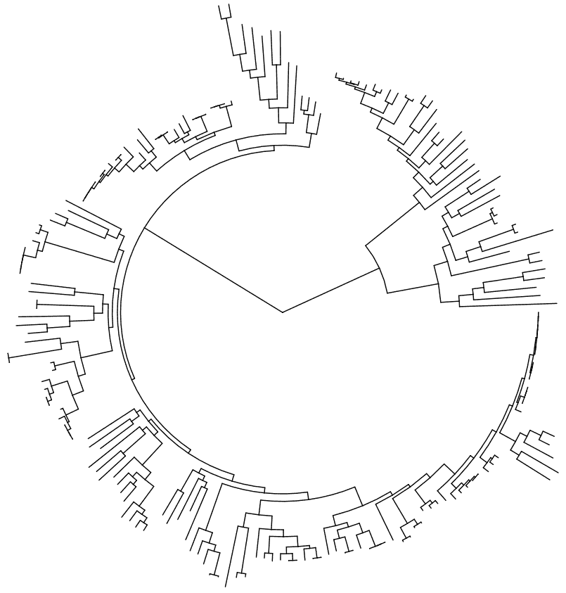

# 第四章：系统发育分析与可视化

比较序列以推断进化关系是生物信息学中的一项基本技术。这项技术在 R 中也有着悠久的历史。除了 Bioconductor 之外，还有许多用于进化分析的包。在本章的食谱中，我们将详细研究如何处理来自不同来源的树形格式。重点将放在如何操作树形结构，聚焦于特定部分，并使用基于新的`ggplot`的树形可视化包进行可视化，这对于查看和注释大型树形结构特别有用。

本章将涵盖以下食谱：

+   使用 ape 和 treeio 读取和写入各种树形格式

+   使用 ggtree 快速可视化多基因树

+   使用 treespace 量化树之间的距离

+   使用 ape 提取和处理子树

+   为对齐可视化创建点图

+   使用 phangorn 从比对中重建树形

# 技术要求

你需要的示例数据可以从本书的 GitHub 仓库获得，链接是[`github.com/danmaclean/R_Bioinformatics_Cookbook`](https://github.com/danmaclean/R_Bioinformatics_Cookbook)。如果你想按照代码示例直接使用这些数据，请确保这些数据位于你工作目录的一个子目录中。

这里是你需要的 R 包。大多数包可以通过`install.packages()`进行安装；其他的则稍微复杂一些：

+   `ape`

+   `adegraphics`

+   `Bioconductor:`

    +   `Biostrings`

    +   `ggtree`

    +   `treeio`

    +   `msa`

+   `devtools`

+   `dotplot`

+   `ggplot2`

+   `phangorn`

+   `treespace`

`Bioconductor` 非常庞大，并且有自己的安装管理器。你可以使用以下代码进行安装：

```py
if (!requireNamespace("BiocManager"))
    install.packages("BiocManager")
BiocManager::install()
```

更多信息请参见[`www.bioconductor.org/install/`](https://www.bioconductor.org/install/)。

通常，在 R 中，用户会加载一个库并直接按名称使用其中的函数。这在交互式会话中非常方便，但当加载了许多包时，可能会造成混淆。为了明确在某个时刻我正在使用哪个包和函数，我会偶尔使用`packageName::functionName()`的约定。

有时，在食谱的中途，我会中断代码，这样你就能看到一些中间输出或一个重要的对象结构，帮助理解。每当这种情况发生时，你会看到一个代码块，每行都以`##`（双哈希）符号开头。请看以下命令：

`letters[1:5]`

这将给我们带来以下输出：

`## a b c d e`

注意，输出行的前面会有`##`作为前缀。

# 使用 ape 和 treeio 读取和写入各种树形格式

系统发育分析是生物学和生物信息学的基石。相关程序种类繁多且复杂，计算耗时，数据集通常庞大。许多程序是独立运行的，且拥有专有的输入和输出格式。这形成了一个复杂的生态系统，我们在处理系统发育数据时必须应对，意味着通常最简单的策略是使用多种工具组合来加载、转换并保存分析结果，以便能够在不同的软件包中使用它们。在这个操作中，我们将探讨如何在 R 中处理系统发育树数据。迄今为止，R 对各种树格式的支持较为有限，但一些核心包具有足够标准化的对象，工作流可以集中在少数几种类型上，且转换为这些类型的过程已经简化。我们将使用`ape`和`treeio`包来导入和导出树数据。

# 准备工作

对于本节内容，我们需要从本书数据仓库中的`datasets/ch4/`文件夹获取树和系统发育信息，特别是`mammal_tree.nwk`和`mammal_tree.nexus`文件，它们分别是哺乳动物系统发育树的 Newick 格式和 Nexus 格式（你可以在本书的附录中查看这些文件格式的简要描述）。我们还需要`beast_mcc.tree`，这是 BEAST 运行的树文件，和`RAxML_bipartitionsBranchLabels.H3`，它是 RAxML 的输出文件。这两个文件来自`treeio`包提供的大量数据。我们还需要 Bioconductor 包`treeio`和`ape`包。

# 操作步骤...

使用`ape`和`treeio`读取和写入树格式的步骤如下：

1.  加载`ape`库并加载树数据：

```py
library(ape)
newick <-ape::read.tree(file.path(getwd(), "datasets", "ch4", "mammal_tree.nwk"))
nexus <-ape::read.nexus(file.path(getwd(), "datasets", "ch4", "mammal_tree.nexus"))
```

1.  加载`treeio`库并加载 BEAST/RAxML 输出：

```py
library(treeio)
beast <- read.beast(file.path(getwd(), "datasets", "ch4", "beast_mcc.tree"))
raxml <- read.raxml(file.path(getwd(), "datasets", "ch4", "RAxML_bipartitionsBranchLabels.H3"))
```

1.  检查不同函数返回的对象类型：

```py
class(newick)
class(nexus)

class(beast)
class(raxml)
```

1.  将`tidytree`转换为`phylo`，反之亦然：

```py
beast_phylo <- treeio::as.phylo(beast)
newick_tidytree <- treeio::as.treedata(newick)
```

1.  使用以下代码编写输出文件：

```py
treeio::write.beast(newick_tidytree,file = "mammal_tree.beast")
ape::write.nexus(beast_phylo, file = "beast_mcc.nexus")
```

# 工作原理...

在*步骤 1*中，我们使用了`ape`包中非常简单的加载函数——我们使用`read.tree()`和`read.nexus()`函数，它们能够读取通用格式的树。在*步骤 2*中，我们使用`treeio`包的特定格式函数来加载 BEAST 和 RaXML 的输出。*步骤 3*只是确认这些函数返回的对象类型；注意，`ape`返回`phylo`对象，而`treeio`返回`treedata`对象。通过`treeio`中的`as.phylo()`和`as.treedata()`，我们可以相互转换这两种对象类型。在*步骤 4*中，通过这种转换，我们可以将多种格式的输入导入到 R 中进行后续分析。最后，在*步骤 5*中，我们将文件写出。

# 参见

我们在*步骤 2*中使用的加载函数只是其中的几个。请参阅`treeio`包的说明文档，了解完整的函数列表。

# 使用 ggtree 快速可视化多个基因的树

一旦你计算出了树，首先要做的就是查看它。虽然许多程序都能做到这一点，但 R 具有一种极其强大、灵活且快速的系统，形式为`ggtree`包。在这个配方中，我们将学习如何将数据导入`ggtree`，并仅用几条命令重新布局、突出显示和注释树图。

# 准备就绪

你需要`ggplot2`、`ggtree`和`ape`包。此外，还需要从本书的仓库中的`datasets/ch4`文件夹中获取`itol.nwk`文件，它是来自*Interactive Tree of Life*在线工具的公共数据集的 Newick 格式树，包含 191 个物种。

# 如何实现...

使用`ggtree`快速可视化多基因的树，可以按照以下步骤执行：

1.  加载库并获取 Newick 树的`phylo`对象：

```py
library(ggplot2)
library(ggtree)
itol <-ape::read.tree(file.path(getwd(), "datasets", "ch4", "itol.nwk")) 
```

1.  制作基础的树形图：

```py
ggtree(itol)
```

1.  制作圆形图：

```py
ggtree(itol, layout = "circular")
```

1.  旋转并反转树：

```py
ggtree(itol) + coord_flip() + scale_x_reverse()
```

1.  向树的末端添加标签：

```py
ggtree(itol) + geom_tiplab( color = "blue", size = 2)
```

1.  制作颜色条来注释特定的谱系：

```py
ggtree(itol, layout = "circular") + geom_strip(13,14, color="red", barsize = 1)
```

1.  制作颜色块来突出显示特定的谱系：

```py
ggtree(itol, layout = "unrooted") + geom_hilight_encircle(node = 11, fill = "steelblue")
```

# 它是如何工作的...

这段代码能够非常快速地实现很多功能。它通过类似于`ggplot`的层语法来实现这一点。以下是每个步骤的作用及其输出：

1.  从文件加载一棵树。这里的树有 191 个叶子节点，所以非常大。恰好它是 Newick 格式的，因此我们使用`ape`的`read.tree()`函数。请注意，在后续步骤中，我们不需要为`ggtree`创建`treedata`对象；从`read.tree()`返回的`phylo`对象完全可以传递给`ggtree()`。

1.  使用`ggtree()`创建一棵基本的树。这是一个封装了较长`ggplot`样式语法的函数，具体来说是`ggplot(itol) + aes(x,y) + geom_tree() + theme_tree()`。因此，可以将所有常见的`ggplot`函数作为额外层叠加到图表中。此步骤中的代码将生成以下图：


1.  更改图表的布局。将布局参数设置为圆形将得到一个圆形的树。通过此参数，还可以选择其他多种树形：



1.  我们可以使用标准的`ggplot`函数`coord_flip()`和`scale_x_reverse()`将树的左右方向改为上下方向，图表将呈现如下效果：


1.  我们可以使用`geom_tiplab()`在树的末端添加名称。`size`参数设置文本的大小。以下代码将生成如下输出：


1.  通过添加`geom_strip()`层，我们可以用一块颜色条注释树中的谱系。第一个参数（在本例中为`13`）是树中的起始节点，第二个参数是树中颜色条的结束节点。`barsize`参数设置颜色块的宽度。结果如下所示：


1.  我们可以使用`geom_hilight_encircle()`几何图形在无根树中突出显示某些分支。我们需要为`node`参数选择一个值，这告诉`ggtree()`哪个节点是颜色的中心。这里的代码输出以下结果：


# 还有更多...

*步骤 6*和*步骤 7*依赖于我们知道要操作树中的哪些节点。因为节点是通过数字而非名称来标识的，这并不总是显而易见的。如果我们使用`MRCA()`（**最近共同祖先**）函数，就可以找到我们想要的节点编号。只需传递一个节点名称的向量，它就会返回代表 MRCA 的节点 ID：

```py
MRCA(itol, tip=c("Photorhabdus_luminescens", "Blochmannia_floridanus"))
```

这将输出以下结果：

```py
## 206
```

# 使用 treespace 量化树之间的差异

比较树以区分或将它们分组，可以帮助研究人员观察进化模式。通过跨物种或菌株跟踪单一基因的多棵树，可以揭示该基因在不同物种中变化的差异。这些方法的核心是树之间距离的度量。在这个食谱中，我们将计算一个这样的度量，找到 15 个不同物种中 20 棵不同基因树的成对差异——因此，每棵树中有 15 个相同名称的树枝。树之间的这种相似性通常是进行比较和获取距离所必需的，只有满足这些条件，我们才能进行这样的分析。

# 准备就绪

对于这个食谱，我们将使用`treespace`包来计算距离和聚类。我们将使用`ape`和`adegraphics`来加载附加功能和可视化函数。这里的输入数据将是`datasets/ch4/gene_trees`中的所有 20 个文件，每个文件都是一个 Newick 格式的树，代表 15 个物种中每个物种的单个基因。

# 如何进行...

使用`treespace`量化树之间的差异可以通过以下步骤执行：

1.  加载库：

```py
library(ape)
library(adegraphics)
library(treespace)
```

1.  将所有树文件加载到一个`multiPhylo`对象中：

```py
treefiles <- list.files(file.path(getwd(), "datasets", "ch4", "gene_trees"), full.names = TRUE) 
tree_list <- lapply(treefiles, read.tree) 
class(tree_list) <- "multiPhylo"
```

1.  计算 Kendall-Colijn 距离：

```py
comparisons <- treespace(tree_list, nf = 3)
```

1.  绘制成对距离：

```py
adegraphics::table.image(comparisons$D, nclass=25)
```

1.  绘制**主成分分析**（**PCA**）和聚类：

```py
plotGroves(comparisons$pco, lab.show=TRUE, lab.cex=1.5) 
groves <- findGroves(comparisons, nclust = 4) 
plotGroves(groves)
```

# 它是如何工作的...

这里简短而强大的代码非常有效——在少数几条命令中就能提供大量的分析。

在*步骤 1*中，首先加载我们需要的库。

在*步骤 2*中，加载必要的库后，我们创建一个字符向量`treefiles`，它保存我们希望使用的 20 棵树的路径。我们使用的`list.files()`函数接受一个文件系统路径作为参数，并返回该路径下找到的文件名。由于`treefiles`是一个向量，我们可以将其作为`lapply()`的第一个参数。

如果你不熟悉，`lapply()`是一个迭代函数，它返回一个 R 列表（因此是`lapply()`）。简单来说，`lapply()`会将第二个参数中指定的函数应用于第一个参数中的列表。当前元素作为目标函数的第一个参数传递。因此，在*第 2 步*中，我们在`treefiles`中列出的每个文件上运行**ape**的`read.tree()`函数，返回一个`phylo`树对象的列表。最后一步是确保`tree_list`对象具有类`multiPhylo`，这样我们就满足了后续函数的要求。值得一提的是，`multiPhylo`对象本身就是一个类似列表的对象，因此我们只需要通过`class()`函数将`multiPhylo`字符串添加到类属性中即可。

在*第 3 步*中，来自同名包的`treespace()`函数做了大量的分析。首先，它对输入中的所有树进行成对比较，然后使用 PCA 进行聚类。结果以列表对象返回，成员*D*包含树的成对距离，`pco`包含 PCA。默认的距离度量，Kendall-Colijn 距离，特别适用于我们这里的有根基因树，尽管该度量可以更改。`nf`参数仅告诉我们保留多少个主成分。由于我们的目标是绘图，我们不需要超过三个主成分。

在*第 4 步*中，我们使用`adegraphics`中的`table.image()`函数绘制`comparisons$D`中的距离矩阵—这是一个方便的热图风格函数。`nclass`参数告诉我们要使用多少个颜色层级。我们得到的图如下所示：


在*第 5 步*中，`plotGroves()`函数直接绘制`treespace`对象，因此我们可以看到 PCA 的绘图：


我们可以使用`findGroves()`函数将树分组为由`nclust`参数给定的组数，并重新绘制以查看结果：


# 还有更多...

如果你有很多树，并且图表看起来拥挤，你可以使用以下代码创建一个可以缩放和平移的交互式图：

```py
plotGrovesD3(comparisons$pco, treeNames=paste0("species_", 1:10) )
```

# 使用 ape 提取和操作子树

在这个简短的教程中，我们将看看操作树是多么简单；具体来说，如何将子树提取为一个新对象，以及如何将树组合成其他树。

# 准备工作

我们需要一棵示例树；`datasets/ch4`文件夹中的`mammal_tree.nwk`文件就可以。我们需要的所有函数都可以在`ape`包中找到。

# 如何操作...

使用`ape`提取和操作子树可以通过以下步骤执行：

1.  加载`ape`库，然后加载树：

```py
library(ape)
newick <-read.tree(file.path(getwd(), "datasets", "ch4", "mammal_tree.nwk"))
```

1.  获取所有子树的列表：

```py
l <- subtrees(newick)
plot(newick)
plot(l[[4]], sub = "Node 4")
```

1.  提取特定的子树：

```py
small_tree <- extract.clade(newick, 9)
```

1.  合并两棵树：

```py
new_tree <- bind.tree(newick, small_tree, 3)
plot(new_tree)
```

# 它是如何工作的...

本食谱中的函数非常简单，但非常有用。

*第一步*是一个常见的树加载步骤。我们需要一个 phylo 对象的树来进行后续操作。

*第二步*使用`subtrees()`函数，它提取所有非平凡的（超过一个节点的）子树，并将它们放入一个列表中。列表中的成员根据原始树中的节点编号进行编号，每个列表中的对象都是一个`phylo`对象，像父树一样。我们可以使用`plot()`函数查看原始树和节点 4 的子树，并生成以下图示：


在*第三步*中，我们使用`extract.clade()`函数获取一个特定的子树。该函数的第一个参数是树，第二个参数是将被提取的节点。实际上，所有该节点下游的节点都会被提取，返回一个新的`phylo`对象。

最后的示例展示了如何使用`bind.tree()`函数将两个`phylo`对象结合起来。第一个参数是主树，它将接收第二个参数中的树。在这里，我们将把`small_tree`接到 Newick 树上。第三个参数是主树中要加入第二棵树的节点。同样，返回的是一个新的`phylo`对象。当我们绘制新的树时，可以看到相对于原始树的重复部分：


# 还有更多...

上述函数的一个小问题是它们要求我们知道要操作的节点编号。一种简单的访问方式是使用交互式的`subtreeplot()`命令。`subtreeplot(newick)`代码会生成一个交互式的树图，如这里的例子。通过点击树中的特定节点，我们可以让查看器渲染该子树并打印节点 ID。然后我们可以在函数中使用这个节点 ID：


# 创建对齐可视化的点图

对齐序列对的点图可能是最古老的对齐可视化方法。在这些图中，两个序列的位置分别绘制在*x*轴和*y*轴上，对于该坐标系中的每个坐标点，如果该点处的字母（核苷酸或氨基酸）相对应，就会画出一个点。由于该图能够展示出两个序列中不一定在同一区域匹配的区域，这是一种视觉上快速发现插入、删除以及结构重排的好方法。在这个例子中，我们将展示如何使用`dotplot`包和一些代码，快速构建一个点图，并获取文件中所有序列对的点图网格。

# 准备工作

我们将需要`datasets/ch4/bhlh.fa`文件，其中包含豌豆、大豆和莲花的三种**基本螺旋-环-螺旋**（**bHLH**）转录因子序列。我们还需要`dotplot`包，它不在 CRAN 或 Bioconductor 上，因此你需要使用`devtools`包从 GitHub 安装它。以下代码应该可行：

```py
library(devtools)
install_github("evolvedmicrobe/dotplot", build_vignettes = FALSE)
```

# 如何实现...

创建用于对齐可视化的点图可以通过以下步骤完成：

1.  加载库和序列：

```py
library(Biostrings)
library(ggplot2)
library(dotplot)
seqs <- readAAStringSet(file.path(getwd(), "datasets", "ch4", "bhlh.fa"))
```

1.  创建一个基本的点图：

```py
dotPlotg(as.character(seqs[[1]]), as.character(seqs[[2]] ))
```

1.  更改点图并应用 `ggplot2` 主题和标签：

```py
dotPlotg(as.character(seqs[[1]]), as.character(seqs[[2]] ), wsize=7, wstep=5, nmatch=4) + 
theme_bw() + 
labs(x=names(seqs)[1], y=names(seqs)[2] )
```

1.  创建一个函数，从提供的序列和序列索引中生成点图：

```py
make_dot_plot <- function(i=1, j=1, seqs = NULL){
 seqi <- as.character(seqs[[i]])
 seqj <- as.character(seqs[[j]])
 namei <- names(seqs)[i]
 namej <- names(seqs)[j]
 return( dotPlotg(seqi, seqj ) + theme_bw() + labs(x=namei, y=namej) )
}
```

1.  设置数据结构以运行函数：

```py
combinations <- expand.grid(1:length(seqs),1:length(seqs))
plots <- vector("list", nrow(combinations) )
```

1.  对所有可能的序列对组合运行该函数：

```py
for (r in 1:nrow(combinations)){
 i <- combinations[r,]$Var1[[1]]
 j <- combinations[r,]$Var2[[1]]
 plots[[r]] <- make_dot_plot(i,j, seqs)
}
```

1.  绘制点图网格：

```py
cowplot::plot_grid(plotlist = plots)
```

# 它是如何工作的...

本食谱的第一部分非常熟悉。我们加载库，并使用 `Biostrings` 加载我们的蛋白质序列。请注意，`seqs` 变量中的序列是 `XStringSet` 类的一个实例。

在 *步骤 2* 中，我们可以使用 `dotplotg()` 函数创建一个基本的点图。参数是我们希望绘制的序列。注意，我们不能直接传递 `XStringSet` 对象；我们需要传递字符向量，因此我们使用 `as.character()` 函数将序列转换为该格式。运行此代码会生成以下点图：


在 *步骤 3* 中，我们通过首先改变匹配的考虑方式来详细说明基本点图。通过 `wsize=7` 选项，我们表示一次查看七个残基（而不是默认的一个），`wstep=5` 选项告诉绘图程序每次跳过五个残基（而不是默认的一个），`nmatch=4` 选项告诉绘图程序当四个残基相同时，标记该窗口为匹配。然后，我们通过添加 `ggplot2` 主题并以通常的 `ggplot` 方式进行自定义，最后使用标签函数添加轴名称。由此，我们得到了与第一个不同的点图：


自定义函数 `make_dot_plot()`，在 *步骤 4* 中定义，接收两个数字变量 `i` 和 `j` 以及 `seqs` 参数中的 `XStringSet` 对象。然后，它将 `seqs` 对象中的第 i 个和第 j 个序列转换为字符，并将其存储在 `seqi` 和 `seqj` 变量中。同时，它提取这些序列的名称并分别存储在 `namei` 和 `namej` 中。最后，它创建并返回一个使用这些变量生成的点图。

要使用该函数，我们需要两个条件：要绘制的序列组合和一个用于存储结果的列表。在 *步骤 4* 中，使用 `expand.grid()` 函数创建所有可能的序列组合的数据框，并将其存储在 `combinations` 变量中。使用 `vector()` 函数创建的 `plots` 变量包含一个 `list` 对象，该对象有足够的槽位来存储结果的点图。

*步骤 6* 是一个循环，遍历组合数据框中的每一行，提取我们希望处理的序列编号，并将其存储在 `i` 和 `j` 变量中。然后，调用 `make_dot_plot()` 函数，传入 `i`、`j` 和 `seqs`，并将其结果存储在我们创建的 `plots` 列表中。

最后，在*步骤 7*中，我们使用`cowplot`库的`plot_grid()`函数，结合我们的图形列表，生成所有可能组合的主图，如下所示：


# 使用 phangorn 从对齐中重建树

到目前为止，在本章节中，我们假设树已经可用并准备好使用。当然，构建系统树有很多方法，在本食谱中，我们将看看一些可用的不同方法。

# 准备工作

在本章节中，我们将使用`datasets/ch4/`文件、酵母 ABC 转运蛋白序列的`abc.fa`文件、`Bioconductor Biostrings`包以及来自 CRAN 的`msa`和`phangorn`包。

# 操作步骤...

使用`phangorn`构建树可以通过以下步骤执行：

1.  加载库和序列，并进行对齐：

```py
library(Biostrings)
library(msa)
library(phangorn)

seqs <- readAAStringSet(file.path(getwd(), "datasets", "ch4", "abc.fa"))
aln <- msa::msa(seqs, method=c("ClustalOmega"))
```

1.  将对齐转换为`phyDat`对象：

```py
aln <- as.phyDat(aln, type = "AA")
```

1.  从距离矩阵生成 UPGMA 和邻接法树：

```py
dist_mat <- dist.ml(aln)

upgma_tree <- upgma(dist_mat)
plot(upgma_tree, main="UPGMA")

nj_tree <- NJ(dist_mat)
plot(nj_tree,"unrooted", main="NJ")
```

1.  计算自助法并绘制：

```py
bootstraps <- bootstrap.phyDat(aln,FUN=function(x) { NJ(dist.ml(x)) } , bs=100)
plotBS(nj_tree, bootstraps, p = 10)
```

# 它是如何工作的...

第一步执行加载和氨基酸序列对齐，就像我们在之前的食谱中使用`msa`包时看到的那样，返回一个`MsaAAMultipleAlignment`对象。

第二步使用`as.phyDat()`函数将对齐转换为可以由`phangorn`函数使用的`phyDat`对象。

在*步骤 3*中，我们实际上生成树。树是由距离矩阵构建的，我们可以使用`dist.ml()`和我们的对齐来计算距离矩阵（这是一个最大似然距离度量；如果需要，也可以使用其他函数）。然后将`dist_mat`传递给`upgma()`和`NJ()`函数，分别生成 UPGMA 和邻接法树。这些函数返回标准的`phylo`对象，可以在许多其他函数中使用。这里，我们直接绘制：


在最后一步，我们使用`bootstraps.phyDat()`函数来计算树中各个分支的自助法支持。第一个参数是`phyDat`对象`aln`，而第二个参数`FUN`需要一个函数来计算树。这里，我们使用一个匿名函数，包装了我们最初用于生成`nj_tree`的`NJ()`方法。`bs`参数告诉函数计算多少次自助法。最后，我们可以使用`plotBS()`函数将结果图绘制到树上。
