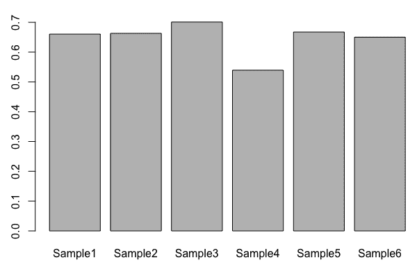

# 第五章：宏基因组学

高通量测序技术已经大大推动了宏基因组学的发展，从一个专注于研究单一序列变异的领域（例如 16S **核糖体 RNA** (**rRNA**) 序列）发展到研究样本中可能存在的多个物种的整个基因组。识别物种或分类单元及其在样本中的丰度是一项计算挑战，要求生物信息学家处理序列准备、分类分配、分类比较以及定量分析。为此，许多专业实验室已经开发出相关的包，这些包创造了特定于宏基因组学中序列处理的新工具和新可视化。

在本章中，我们将查看一些在 R 中进行宏基因组学复杂分析的配方：

+   使用`phyloseq`加载层级分类数据

+   使用`metacoder`进行计数稀疏化以纠正样本差异

+   使用`dada2`从原始读取中读取扩增子数据

+   使用`metacoder`中的热图树可视化分类丰度

+   使用`vegan`计算样本多样性

+   将序列文件拆分为操作性分类单元

# 技术要求

你需要的示例数据可以从本书的 GitHub 库获取：[`github.com/PacktPublishing/R-Bioinformatics-Cookbook`](https://github.com/PacktPublishing/R-Bioinformatics-Cookbook)[.](https://github.com/danmaclean/R_Bioinformatics_Cookbook) 如果你想按原样使用代码示例，你需要确保这些数据位于你的工作目录的子目录中。

下面是你需要的 R 包。大多数包可以通过`install.packages()`安装*；*其他一些包安装起来稍微复杂一些：

+   `ape`

+   `Bioconductor`

    +   `dada2`

    +   `phyloseq`

+   `corrplot`

+   `cowplot`

+   `dplyr`

+   `kmer`

+   `magrittr`

+   `metacoder`

+   `RColorBrewer`

+   `vegan`

Bioconductor 非常庞大，并且拥有自己的安装管理器。你可以通过以下代码安装它：

```py
if (!requireNamespace("BiocManager"))
    install.packages("BiocManager")
BiocManager::install()
```

进一步的信息可以通过以下链接获取：[`www.bioconductor.org/install/`](https://www.bioconductor.org/install/)。

通常，在 R 中，用户会加载一个库并直接按名称使用函数。这在交互式会话中非常方便，但在加载多个包时可能会造成混乱。为了明确我在某一时刻使用的是哪个包和函数，我偶尔会使用`packageName::functionName()`的约定。

有时候，在一个配方的中间，我会中断代码，方便你查看一些中间输出或对象结构，这对于理解非常重要。每当这种情况发生时，你会看到一个代码块，其中每一行都以`##`（双井号）符号开头。请看下面的命令：

`letters[1:5]`

这将给我们以下输出：

`## a b c d e`

注意，输出行前面有`##`的前缀。

# 使用 phyloseq 加载层级分类数据

元基因组学管道通常从大型测序数据集开始，这些数据集会在强大且功能齐全的程序中处理，如 QIIME 和`mothur`。在这些情况下，我们希望将这些工具的结果整理成报告或进一步进行特定分析。在这个步骤中，我们将展示如何将 QIIME 和`mothur`的输出导入 R 中。

# 准备工作

对于这个简短的步骤，我们需要从`Bioconductor`安装`phyloseq`包，并从本书数据仓库的`datasets/ch5`文件夹中获取文件。

# 如何操作…

使用`phyloseq`加载层次分类数据可以通过以下步骤完成：

1.  加载库：

```py
library(phyloseq)
```

1.  导入 QIIME 的`.biom`文件：

```py
biom_file <- file.path(getwd(), "datasets", "ch5", "rich_sparse_otu_table.biom")
qiime <- import_biom(biom_file)
```

1.  访问`phyloseq`对象的不同部分：

```py
tax_table(qiime)
## Taxonomy Table:     [5 taxa by 7 taxonomic ranks]:
##          Rank1         Rank2               Rank3                   
## GG_OTU_1 "k__Bacteria" "p__Proteobacteria" "c__Gammaproteobacteria"
## GG_OTU_2 "k__Bacteria" "p__Cyanobacteria"  "c__Nostocophycideae"

otu_table(qiime)
## OTU Table:          [5 taxa and 6 samples]
##                      taxa are rows
##          Sample1 Sample2 Sample3 Sample4 Sample5 Sample6
## GG_OTU_1       0       0       1       0       0       0
## GG_OTU_2       5       1       0       2       3       1

sample_data(qiime)
##         BarcodeSequence  LinkerPrimerSequence BODY_SITE Description
## Sample1    CGCTTATCGAGA CATGCTGCCTCCCGTAGGAGT       gut   human gut
```

1.  导入`mothur`数据文件：

```py
mothur <- import_mothur(
  mothur_list_file = file.path(getwd(), "datasets", "ch5", "esophagus.fn.list"),
  mothur_group_file = file.path(getwd(), "datasets", "ch5", "esophagus.good.groups"),
  mothur_tree_file = file.path(getwd(), "datasets", "ch5", "esophagus.tree")
)
```

1.  访问`phyloseq`对象中的`otu`对象：

```py
otu_table(mothur)
## OTU Table:          [591 taxa and 3 samples]
##                      taxa are rows
##          B C  D
## 9_6_14   2 0  0
## 9_6_25   1 0  0
```

# 它是如何工作的…

在这个简单的步骤中，我们创建对象并使用访问器函数。

在*第 1 步*中，我们按惯例加载`phyloseq`库。

然后，在*第 2 步*中，我们定义一个文件，并将其作为`import_biom()`函数的第一个参数。该函数可以读取来自 QIIME 的现代`biom`格式输出，支持未压缩的 JSON 和压缩的 HDF5 格式。类型会自动检测。我们将得到一个完全填充的`phyloseq`对象。

在*第 3 步*中，我们使用访问器函数获取对象的子部分，使用`tax_table()`获取分类数据，使用`otu_table()`获取 OTU，使用`sample_data()`获取样本数据；这些都可以作为类似矩阵的对象在后续处理中轻松使用。

在*第 4 步*中，我们改变方向，使用`mothur`的输出数据。我们至少需要一个列表文件和一个分组文件，这些文件路径通过`mothur_list_file`和`mothur_group_file`参数指定。这里，我们还通过`mothur_tree_file`参数指定一个 Newick 格式的树。

同样，我们可以使用`phyloseq`的访问器函数`otu_table()`来获取 OTU。对于最小的`mothur`数据，我们在此指定不能获取样本数据或分类学表。

# 还有更多…

如果你有来自旧版 QIIME 的专有格式数据，可以使用`import_qiime()`函数。若你附加了树对象，也有一个访问器函数——`phy_tree()`。

# 另请参见

QIIME 和`mothur`程序的官网和 wiki 页面非常出色地展示了如何在 R 中处理它们管道输出的数据，尤其是`mothur`。如果你想要一些数据分析的思路，可以试试它们。

# 使用 metacoder 稀释计数并校正样本差异。

在宏基因组学中，一个常见的问题是询问某个样本中存在哪些物种，以及两个或多个样本之间的差异。由于样本可能由不同数量的观察值组成——在宏基因组学中，这意味着生成的不同数量的读取——因此样本的分类丰富度会随着测序深度的增加而增加。为了公平地评估样本中不同类群的多样性，宏基因组学家通常会对计数进行稀释，以确保样本的测序深度相同。本质上，这意味着将样本深度减少到最小的样本深度。在这个步骤中，我们将对来自 `biom` 文件的 OTU 计数进行稀释。

# 准备工作

对于这个步骤，你将需要 `metacoder` 包和 `datasets/ch5/rich_high_count_otu.biom`，这是一个包含六个样本（标记为 `Sample1`–`Sample6`）和五个 OTU 的示例 `biom` 文件。当然，这是一个非常小的文件，只用于学习代码的工作原理。真实的宏基因组数据集要大得多。

# 如何操作...

使用 `metacoder` 对计数进行稀释并修正样本差异可以通过以下步骤完成：

1.  加载库和文件：

```py
library(metacoder)
biom_file <- file.path(getwd(), "datasets", "ch5", "rich_high_count_otu.biom")
taxdata <- parse_qiime_biom(biom_file)
```

1.  创建样本中计数的直方图：

```py
sample_ids <- paste0("Sample", 1:6)
hist_data <- colSums(taxdata$data$otu_table[, sample_ids])
hist(hist_data, prob= TRUE, breaks=3)
lines(density(hist_data, adjust = 2), col="red")
```

1.  调用稀释函数并过滤掉可能生成的低 OTU：

```py
taxdata$data$rarefied_otus <- rarefy_obs(taxdata, "otu_table", other_cols = TRUE)
low_otu_index <- rowSums(taxdata$data$rarefied_otus[, sample_ids]) <=20
taxdata <- filter_obs(taxdata, "rarefied_otus", ! low_otu_index)
taxdata$data$rarefied_otus
```

# 工作原理...

这里的总体模式是加载文件，检查样本 OTU 计数的分布，并应用稀释法。

第一步是加载库并导入示例文件。我们通过准备 `rich_high_count_otu.biom` 文件来完成此操作，并将其传递给 `parse_qiime()` 函数。这个 `metacoder` 函数只是读取生物群落文件并返回一个 `taxmap` 对象（另一种用于保存分类数据的对象），我们可以在 `metacoder` 函数中使用它。

接下来，我们希望检查样本 OTU 计数的分布，这可以通过准备一个直方图来完成。我们使用 `paste()` 函数创建一个包含样本名称的字符向量，并用它来通过命名索引提取 `otu_table` 中的计数列。这些列的子集被传递给 `colSums()` 函数，后者会获取 `hist_data` 向量中每个样本的总计数。现在，我们可以使用 `hist()` 创建这些计数的直方图，并通过 `lines()` 和 `density()` 函数在 `hist_data` 上添加密度曲线。请注意，结果图（在以下直方图中）看起来较为稀疏，因为示例文件中的样本数量较少。这里的最低计数为我们提供了最低测序样本的概念。如果存在明显较低的样本，最好先去除这些列：


现在，我们可以进行稀释分析。我们在 `taxdata` 上使用 `rarefy_obs()` 函数；第二个参数（值为 `"otu_table"`）是 `taxdata` 对象中包含 OTU 计数的槽位名称。由于稀释会减少计数，因此我们现在需要去除在所有样本中已经减少过多的计数。因此，我们使用 `rowSums()` 函数，并通过样本名称索引 `taxdata$data$rarefied_otus` 对象，得到一个逻辑向量，表示哪些 OTU 的总计数低于 20。最后，我们在 `taxdata` 上使用 `filter_obs()` 函数；第二个参数（值为 `"rarefied_otus"`）是 `taxdata` 对象中包含稀释 OTU 计数的槽位名称。`!` 字符用于反转低计数 OTU 的逻辑向量，因为 `filter_obs()` 会保留通过的行，而我们希望移除这些行。最终输出的是一个稀释后的 OTU 计数集。

请注意，在以下输出中，OTU 行 3 已通过低计数被移除：

```py
## # A tibble: 4 x 8
##   taxon_id otu_id   Sample1 Sample2 Sample3 Sample4 Sample5 Sample6
##   <chr>    <chr>      <dbl>   <dbl>   <dbl>   <dbl>   <dbl>   <dbl>
## 1 ax       GG_OTU_1      24    1004     847    1979    1070    1170
## 2 ay       GG_OTU_2     872       0     704     500    1013     689
## 3 ba       GG_OTU_4     875    1144    1211     217       0    1180
## 4 ax       GG_OTU_5    1270     893     276     338     953       0
```

# 还有更多……

我们可以通过稀释曲线估算一个有用的计数水平。通过这些曲线，计数会在不同的样本大小下随机抽取，并计算 OTU 中的物种数。当物种数量停止增加时，我们就知道我们已经有足够的读取数据，并且不会从处理额外的计数中获得更多价值。`rarecurve()` 函数在 `vegan` 包中可以帮助我们完成这一任务。我们提供一个 OTU 表（请注意，该函数需要样本按行排列，因此我们必须使用 `t()` 函数旋转我们的 `taxdata` OTU 表）。然后，我们为 `sample` 参数传入最小样本大小。我们使用 `colSums()` 和 `min()` 函数来获取该最小样本 OTU 计数。输出结果如下图所示：


在这里，我们可以清楚地看到，超过 20,000 的样本并没有增加物种的丰富度。

# 使用 dada2 从原始读取数据中读取扩增子数据

作为元基因组学中的一项长期技术，特别是对于有兴趣进行细菌微生物组研究的人，使用 16S 或 18S rRNA 基因的克隆拷贝（扩增子）测序来创建物种谱图。这些方法可以利用低通量测序以及目标序列的知识来对每个克隆序列进行分类，从而简化了将分类单元分配到读取序列的复杂任务。在这个方案中，我们将使用 `dada2` 包从原始 `fastq` 序列读取中运行扩增子分析。我们将执行质量控制和 OTU 分配步骤，并使用一种有趣的机器学习方法来对序列进行分类。

# 准备工作

对于这个食谱，我们需要 Bioconductor 的`dada2`包和 CRAN 的`cowplot`包。我们将使用来自短读档案实验*SRR9040914*的某些宏基因组序列数据，其中检测了一个旅游中心潮汐海湖水中的物种组成，因为游客向湖里投掷硬币并许愿。我们将使用二十个`fastq`文件，每个文件包含 2500 条数据，每个文件经过压缩，且可以在本书的仓库`datasets/ch5/fq`中找到。这是 Illumina 读取的一个小子集。我们还需要`datasets/ch5/rdp_train_set_14.fa`文件，它是由`dada`团队维护的 16S 序列训练集之一。更多训练集请参见[`benjjneb.github.io/dada2/training.html`](http://benjjneb.github.io/dada2/training.html)*。*

# 如何进行...

使用`dada2`从原始读取数据中读取扩增子数据，可以按照以下步骤进行：

1.  加载库并为每个`fastq`文件准备绘图：

```py
library(dada2)
library(cowplot)

fq_dir <- file.path(getwd(), "datasets", "ch5", "fq")
read_files <- list.files(fq_dir, full.names = TRUE,  pattern = "fq.gz")

quality_plots <- lapply(read_files, plotQualityProfile)
plot_grid(plotlist = quality_plots)
```

1.  对文件进行质量修剪和去重复：

```py
for (fq in read_files ){
  out_fq <- paste0(fq, ".trimmed.filtered")
  fastqFilter(fq, out_fq, trimLeft=10, truncLen=250,
                      maxN=0, maxEE=2, truncQ=2,
                      compress=TRUE)
}

trimmed_files <-  list.files(fq_dir, full.names = TRUE, pattern = "trimmed.filtered")
derep_reads <- derepFastq(trimmed_files)
```

1.  从样本子集估算`dada2`模型：

```py
trimmed_files <-  list.files(fq_dir, full.names = TRUE, pattern = "trimmed.filtered")
derep_reads <- derepFastq(trimmed_files)

dd_model <- dada(derep_reads[1:5], err=NULL, selfConsist=TRUE)
```

1.  使用*第 3 步*中估算的参数推测样本的序列组成：

```py
dada_all <- dada(derep_reads, err=dd_model[[1]]$err_out, pool=TRUE)
```

1.  给序列分配分类：

```py
sequence_tb <-makeSequenceTable( dada_all )
taxonomy_tb <- assignTaxonomy(sequence_tb, refFasta = file.path(getwd(), "datasets", "ch5", "rdp_train_set_14.fa")) 
taxonomy_tb[1, 1:6]
```

# 它是如何工作的...

我们首先通过将包含`fastq`目录的`fq_dir`变量传递给`list.files()`函数，创建一个所有`fastq`文件路径的向量。然后，我们使用循环函数`lapply()`，遍历每个`fastq`文件路径，并依次运行`dada`函数`plotQualityProfile()`。每个结果绘图对象都会保存到列表对象`quality_plots`中。当将绘图列表传递给`plotlist`参数时，`cowplot`函数`plot_grid()`将把这些绘图以网格形式显示出来。

我们得到下图所示的绘图。请注意，`fastq`质量分数在前 10 个核苷酸左右较差，且在大约 260 个核苷酸后出现问题。这些将是下一步的修剪点：


为了进行修剪，我们对 `read_files` 中的 `fastq` 文件运行一个循环。在每次循环迭代中，我们通过将文本 `"trimmed.filtered"` 附加到文件名上来创建一个输出的 `fastq` 文件名 `out_fq`（因为我们将修剪后的读取结果保存到新文件中，而不是内存中），然后运行 `fastqFilter()` 修剪函数，传递输入文件名 `fq`、输出文件名 `out_fq` 和修剪参数。循环结束后，我们将得到一个包含修剪过的读取文件的文件夹。通过再次使用 `list.files()` 函数加载这些文件的名称，这次只匹配文件名中带有 `"trimmed.filtered"` 模式的文件。所有这些文件都被加载到内存中，并使用 `derepFaistq()` 函数进行去重。接着，我们通过对部分文件使用 `dada()` 函数，计算组成推断步骤的参数。我们通过索引 `derep_reads` 对象，传递前五组去重后的文件。通过将 `err` 设置为 `NULL` 和 `selfConsist` 设置为 `TRUE`，我们强制 `dada()` 从数据中估算参数，并将结果保存在 `dd_model` 变量中。

接下来，我们对所有数据运行 `dada()` 函数，将 `err` 参数设置为先前估算并存储在 `dd_model` 中的值。此步骤计算整个数据集的最终序列组成。

最后，我们可以使用 `dada()` 函数的结果创建序列表，并利用该表通过 `assignTaxonomy()` 查找 OTU。此函数使用朴素贝叶斯分类器将序列分配到分类群中，基于提供的 `rdp_train_set_14.fa` 文件中的训练集分类。该函数的输出是每个序列的分类。结果表格 `taxonomy_tb` 中的一行如下所示：

```py
## Kingdom Phylum 
## "Bacteria" "Cyanobacteria/Chloroplast" 
## Class Order 
## "Chloroplast" "Chloroplast" 
## Family Genus 
## "Bacillariophyta" NA
```

# 另见

本配方中使用的函数 `fastqFilter()` 和 `derepFastQ()` 也有用于配对读取的变体。

# 使用 `metacoder` 可视化分类丰度的热树

无论我们如何估算分类丰度，通常都需要创建一种可视化方法，以便在单一图形中总结数据的广泛趋势。一个表达力强且易于解读的可视化方式是热树。这些是对感兴趣的分类群的系统发育树的呈现，其中数据被映射到图形的视觉元素上。例如，一个分类群被观察到的次数可能通过改变树枝的颜色或粗细来表示。不同的数据集可以通过比较每个数据集的树形图来轻松发现差异。在本配方中，我们将构建一棵热树并进行自定义。

# 准备工作

我们需要输入 `.biom` 文件 `datasets/ch5/rich_high_count_otu.biom` 和 `metacoder`、`RColorBrewer` 包。

# 如何实现...

使用 `metacoder` 可视化分类丰度的热树可以通过以下步骤完成：

1.  加载库和输入文件：

```py
library(metacoder)
library(RColorBrewer)
biom_file <- file.path(getwd(), "datasets", "ch5", "rich_high_count_otu.biom")
taxdata <- parse_qiime_biom(biom_file)
```

1.  将自定义选项传递给树绘制函数：

```py
heat_tree(taxdata, 
    node_label = taxon_names, 
    node_size = n_obs, 
    node_color = n_supertaxa, 
    layout = "gem", 
    title = "sample heat tree", 
    node_color_axis_label = "Number of Supertaxa", 
    node_size_axis_label = "Number of OTUs", 
    node_color_range = RColorBrewer::brewer.pal(5, "Greens")
)
```

# 工作原理...

首先，我们加载库并使用`parse_qiime_biom()`函数从`biom`文件获取一个`metacoder taxmap`对象。

然后我们使用`heat_tree()`函数来渲染树。只需要传递`taxdata taxmap`对象——这将生成默认的树——其他的参数则是用来定制树的。`node_label`指定在`taxdata`对象中用于节点标签的列；在这里，我们使用`taxon_names`，特别注意这里没有加引号，因为该函数使用非标准评估方式，类似于你在`tidyverse`和`ggplot`函数中可能已经熟悉的方式。`node_size`根据给定的列控制节点大小。在这里，`n_obs`和`node_color`提供了影响节点颜色变化的参数（注意，这不是颜色的集合——而是应该被相同/不同颜色标记的内容）。接下来，`layout`参数告诉函数如何在渲染中展开树的分支。在接下来的三个参数标题中，`node_color_axis`和`node_size_axis_label`仅仅是图形的标签。最后，`node_color_range`获取一个颜色标识符向量，用来绘制图形。这里，我们使用`RColorBrewer`包的函数`brewer.pal()`，它返回这样的内容。它的第一个参数是要返回的颜色数量，第二个参数是要选择的调色板名称。设置好所有这些后，我们从我们的输入小文件中得到如下图：


# 使用 vegan 计算样本多样性

在生态学和宏基因组学研究中，一个常见的任务是估算样本内或样本之间的物种（或分类学）多样性，以查看哪些样本多样性较高或较低。有多种度量方法可以衡量样本内外的多样性，包括辛普森指数和布雷指数。在这个示例中，我们将查看能够从常见的 OTU 表格中返回多样性度量的函数。

# 准备工作

我们需要样本的`.biom`输入文件，`datasets/ch5/rich_high_count_otu.biom`，以及`vegan`包。

# 如何实现……

使用`vegan`计算样本多样性可以通过以下步骤完成：

1.  加载库并从样本文件准备 OTU 表格：

```py
library(vegan)
biom_file <- file.path(getwd(), "datasets", "ch5", "rich_high_count_otu.biom")
taxdata <- metacoder::parse_qiime_biom(biom_file)
otu_table <- taxdata$data$otu_table[, paste0("Sample", 1:6)]
```

1.  计算α多样性：

```py
alpha_diversity <- diversity(otu_table, MARGIN=2, index="simpson")
barplot(alpha_diversity)
```

1.  计算β多样性：

```py
between_sample <- vegdist(t(otu_table), index = "bray")

between_sample_m <- as.matrix(between_sample, ncol = 6)
corrplot::corrplot(between_sample_m, method="circle", type = "upper", diag = FALSE )
```

# 它是如何工作的……

第一步非常简单。在这里，我们使用`metacoder parse_qiime_biom()`函数加载我们的`biom`文件，然后对生成的`taxdata$data$otu_table`插槽进行子集化，提取一个简单的 OTU 表格到`otu_table`中。

现在我们可以调用`vegan`包中的`diversity()`函数。`index`参数设置为`"simpson"`，所以函数将使用辛普森指数来计算样本内的多样性。`MARGIN`参数告诉函数样本是按行还是按列排列：1 表示按行，2 表示按列。`diversity()`函数返回一个命名的向量，便于使用`barplot()`函数进行可视化，生成如下图：



现在我们可以使用`vegdist()`函数运行样本间的多样性度量；同样，`index`参数设置要使用的指数，这里我们选择 Bray 指数。`vegdist()`期望样本数据是按行排列的，所以我们使用`t()`函数来旋转`otu_table`。生成的对象存储在`between_sample`中——它是一个成对相关性表格，我们可以在`corrplot`中可视化它。为了做到这一点，我们需要通过`as.matrix()`将其转换为矩阵；`ncol`参数应与样本的数量匹配，以便为每个样本生成一列。返回的矩阵`between_sample_m`可以传递给`corrplot()`函数进行渲染。通过将`method`设置为`circle`，`type`设置为`upper`，并将`diag`设置为`false`，我们可以得到一个只显示矩阵上三角部分的图，而没有自我与自我的比较，从而减少图中的冗余。

输出结果如下：


# 另见...

本示例中的相关性图明确显示了几个样本的相关性，但在非常大的实验中可能变得不易处理。在此阶段，您可能需要考虑 PCA 或其他某种多维尺度方法。

# 将序列文件拆分为 OTU

对于经过清理和修剪的测序数据，最常见的任务之一是将序列划分为 OTU。在这方面有很多方法；在本示例中，我们将探讨一种将序列拆分为指定长度的子序列并对其执行某种层次聚类的方式，以创建组。

# 准备工作

这里的关键包是`kmer`包，我们将使用`datasets/ch5/fq`文件夹中的一个示例`fastq`序列文件。我们还将使用`dplyr`和`magrittr`包以提高便利性。

# 如何做...

将序列文件拆分为 OTU 可以通过以下步骤完成：

1.  加载数据并计算 OTU：

```py
library(kmer)
library(magrittr)
library(ape)
seqs <- ape::read.fastq(file.path(getwd(), "datasets", "ch5","fq", "SRR9040914ab.fq.gz")
otu_vec <- otu(seqs, k = 6, threshold = 0.99 )

```

1.  计算每个 OTU 簇的频率：

```py
data.frame(
    seqid = names(otu_vec), 
    cluster = otu_vec, 
    row.names = NULL) %>% 
dplyr::group_by(cluster) %>% 
dplyr::summarize(count = dplyr::n() )
```

# 它是如何工作的...

加载库后，我们使用`ape`包中的`read.fastq()`函数获取表示序列的`DNAbin`对象。`kmer`包中的关键函数`otu()`可以直接使用`DNAbin seqs`对象创建长度为`k`的 k-mer，并对其执行层次聚类。`threshold`参数设置 OTU 的身份阈值。该函数返回一个命名向量，其中名称为序列 ID，每个值为该序列所属簇的 ID。

然后我们可以使用`otu_vec`通过`data.frame`构建一个中间数据框，使用`names`属性设置一个`seqid`列，并将聚类成员信息放入一个名为`cluster`的列中。通过将`row.names`设置为`NULL`，我们去掉行名称。接着，我们使用`magrittr`管道符号`%>%`，通过`dplyr::group()`按聚类对数据框进行分组，并通过`dplyr::summarize()`创建一个汇总数据框。通过将计数设置为`dplyr::n()`函数的结果，我们可以得到每个聚类在命名向量中出现的次数——即每个聚类中分配到的读取次数。
