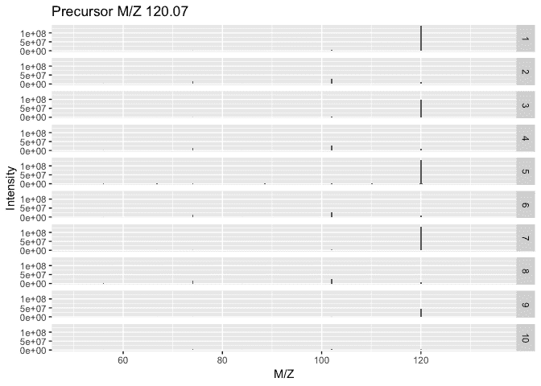
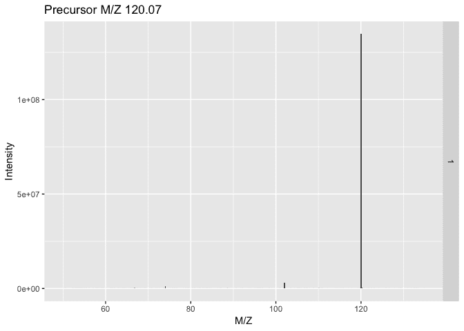
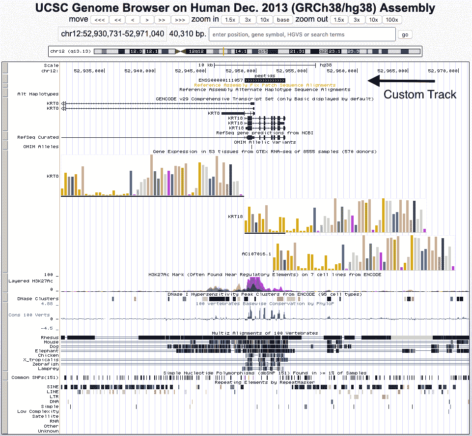
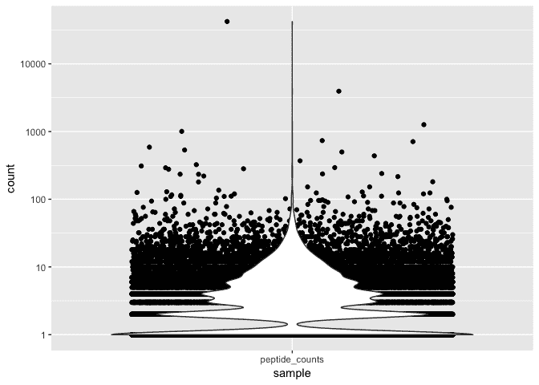
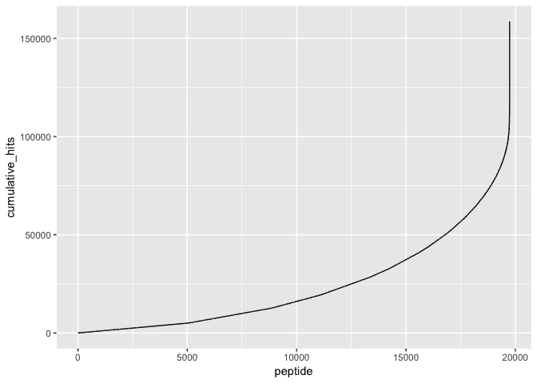
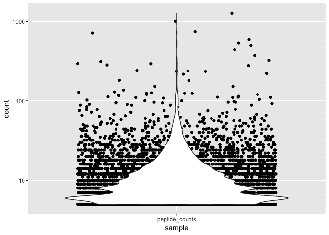
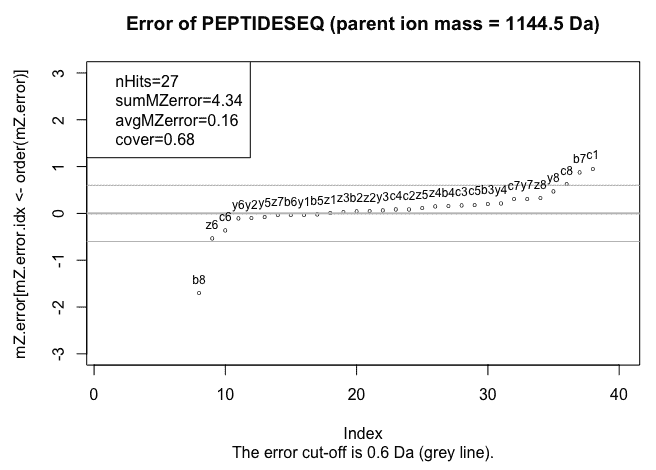

# 第六章：从光谱到注释的蛋白质组学

**质谱**（**MS**）数据通常包含必须经过生物信息学处理的光谱，以识别候选肽。这些肽包括分配，计数可以使用各种技术和包进行分析。用于蛋白质组学的各种图形用户界面驱动工具意味着出现了多种文件格式，最初可能很难处理。这些配方将探索如何利用`RforProteomics`项目中的优秀解析器和格式转换工具来分析和验证光谱，甚至向你展示如何在基因组浏览器中查看你的肽以及基因模型等其他基因组信息。

本章将涵盖以下配方：

+   以视觉方式表示原始 MS 数据

+   在基因组浏览器中查看蛋白质组学数据

+   可视化肽命中次数的分布以寻找阈值

+   转换 MS 格式以在工具之间传输数据

+   使用 protViz 将光谱与肽匹配进行验证

+   应用质量控制滤波器到光谱

+   识别与肽匹配的基因组位置

# 技术要求

你将需要的样本数据可以从本书的 GitHub 仓库中获取，地址是[`github.com/danmaclean/R_Bioinformatics_Cookbook`](https://github.com/danmaclean/R_Bioinformatics_Cookbook)[.] 如果你想按原样使用代码示例，那么你需要确保该数据位于工作目录的子目录中。

以下是你将需要的 R 包。通常，你可以通过`install.packages("package_name")`来安装这些包。列在`Bioconductor`下的包需要通过专用的安装程序进行安装，如此处所述。如果你需要做其他事情，安装方法将在这些包所使用的配方中描述：

+   `Bioconductor`

    +   `EnsDb.Hsapiens.v86`

    +   `MSnID`

    +   `MSnbase`

    +   `mzR`

    +   `proteoQC`

    +   `rtracklayer`

+   `data.table`

+   `dplyr`

+   `ggplot2`

+   `protViz`

`Bioconductor`非常庞大，并且拥有自己的安装管理器。你可以通过以下代码安装该管理器：

```py
if (!requireNamespace("BiocManager"))
   install.packages("BiocManager")
```

然后，你可以使用此代码安装软件包：

```py
BiocManager::install("package_name")
```

更多信息可以在[`www.bioconductor.org/install/`](https://www.bioconductor.org/install/)找到。

在 R 中，用户通常会加载一个库并直接通过名称使用其中的函数。这在交互式会话中非常方便，但在加载多个包时可能会造成困惑。为了明确在某一时刻我正在使用哪个包和函数，我偶尔会使用`packageName::functionName()`这种惯例。

有时，在配方中间，我会中断代码，以便你查看一些中间输出或对你理解非常重要的对象结构。每当发生这种情况时，你会看到一个代码块，其中每行以##（即双哈希符号）开头。考虑以下命令：

`letters[1:5]`

这将产生以下输出：

`## a b c d e`

请注意，输出行以`##`为前缀。

# 以可视化方式表示原始质谱数据

蛋白质组学分析的原始数据就是由质谱仪生成的光谱。每种类型的质谱仪都有不同的本地文件格式来编码光谱。检查和分析光谱从加载文件并将其强制转换为通用的对象类型开始。在这个示例中，我们将学习如何加载不同类型的文件，查看元数据，并绘制光谱本身。

# 准备就绪

对于这个示例，我们需要使用`Bioconductor`包、`mzR`包以及本书数据仓库中的一些文件，这些文件位于`datasets/ch6`文件夹中。我们将使用三个不同的文件，它们的选择并不是基于文件中的数据，而是因为它们分别代表了最常见的三种质谱文件类型：`mzXML`、`mzdata`和`mzML`。这些示例文件都来自`mzdata`包。由于它们是提取出来的，你不需要安装该包，但如果你需要更多的示例文件，这个包是一个不错的选择。

# 如何做到...

原始质谱数据可以通过以下步骤以可视化方式表示：

1.  加载库：

```py
library(mzR)
library(MSnbase)
```

1.  将文件加载到对象中：

```py
mzxml_file <- file.path(getwd(), "datasets", "ch6", "threonine_i2_e35_pH_tree.mzXML")
ms1 <- openMSfile(mzxml_file)

mzdata_file <- file.path(getwd(), "datasets", "ch6", "HAM004_641fE_14-11-07--Exp1.extracted.mzdata")
ms2 <- openMSfile(mzdata_file)

mzml_file <-  file.path(getwd(), "datasets", "ch6", "MM8.mzML")
ms3 <- openMSfile(mzml_file)
```

1.  查看可用的元数据：

```py
runInfo(ms3)

## $scanCount
## [1] 198
## 
## $lowMz
## [1] 95.51765
## 
## $highMz
## [1] 1005.043
## 
## $dStartTime
## [1] 0.486
## 
## $dEndTime
## [1] 66.7818
## 
## $msLevels
## [1] 1
## 
## $startTimeStamp
## [1] "2008-09-01T09:48:37.296+01:00"

sampleInfo(ms1)

## [1] ""
```

1.  绘制光谱：

```py
msn_exp <- MSnbase::readMSData(mzxml_file)
MSnbase::plot(msn_exp, full = TRUE)
MSnbase::plot(msn_exp[5], full = TRUE)
```

# 它是如何工作的...

在*步骤 1*中，我们加载了所需的库。主要的库是`mzR`。

在*步骤 2*中，我们使用系统无关的`file.path()`函数定义了我们将要加载的文件路径，该函数返回一个包含文件名的字符向量。然后，我们使用该文件名通过`mzR`中的`openMSfile()`函数来创建一个代表相应文件中数据的`mzR`对象。请注意，我们本质上运行了相同的代码三次，只是每次更改文件和输入文件类型。`openMSfile()`函数会自动检测文件的格式。

在*步骤 3*中，我们使用`mzR`包的访问器函数`runInfo()`和`sampleInfo()`来提取输入文件中的一些元数据。请注意，`sampleInfo()`与`ms1`一起使用时没有返回任何内容——这是因为该特定文件中没有包含这些数据。可以返回的元数据取决于文件和文件类型。

在*步骤 4*中，我们使用`MSnbase`包的`readMSData()`函数加载文件。该函数在后台使用`mzR`，因此可以执行相同的操作，但它返回一个修改后的`MSnbase`类对象。这意味着一些通用的绘图函数将会生效。接着，我们使用`plot()`函数创建文件中所有光谱的图像：



然后，通过使用索引，我们创建了仅包含文件中第五个光谱的图像：



# 在基因组浏览器中查看蛋白质组学数据

一旦我们获取了质谱数据，并使用如 Xtandem、MSGF+或 Mascot 等搜索引擎软件识别了光谱描述的肽段和蛋白质，我们可能希望在其基因组上下文中查看这些数据，并与其他重要数据一起展示。在本食谱中，我们将展示如何从搜索文件中提取肽段和 Uniprot ID，找到这些 Uniprot ID 映射的基因，并创建一个显示这些基因的基因组浏览器轨道。可以将这些发送到 UCSC 人类基因组浏览器，互动网页将会自动在本地浏览器中加载。

# 准备工作：

对于这个食谱，您需要安装 Bioconductor 包`MSnID`、`EnsDB.Hsapiens.v86`和`rtracklayer`，以及本书仓库中`datasets/ch6`文件夹下的`HeLa_180123_m43_r2_CAM.mzid.gz`文件。为了使这个食谱生效，您还需要连接到互联网，并拥有一个能够运行 UCSC 基因组浏览器的现代浏览器，网址是[`genome.ucsc.edu`](https://genome.ucsc.edu)。

# 如何操作...

通过以下步骤可以在基因组浏览器中查看蛋白质组学数据：

1.  加载库：

```py
library(MSnID)
library(EnsDb.Hsapiens.v86)
library(rtracklayer)
```

1.  创建并填充搜索文件对象：

```py
msnid <- MSnID() 
msnid <- read_mzIDs(msnid, file.path(getwd(), "datasets", "ch6", "HeLa_180123_m43_r2_CAM.mzid.gz")) 
```

1.  提取包含有用命中的行和包含有用信息的列：

```py
real_hits <- msnid@psms[! msnid@psms$isDecoy, ]
required_info <- real_hits[, c("spectrumID", "pepSeq", "accession", "start", "end")]
```

1.  从`accession`列提取 Uniprot ID：

```py
uniprot_ids <- unlist(lapply(strsplit(required_info$accession, "\\|"), function(x){x[2]}) )
uniprot_ids <- uniprot_ids[!is.na(uniprot_ids)]
```

1.  创建数据库连接并获取与我们的 Uniprot ID 匹配的基因：

```py
edb <- EnsDb.Hsapiens.v86
genes_for_prots <- genes(edb, 
    filter = UniprotFilter(uniprot_ids), 
    columns = c("gene_name", "gene_seq_start", "gene_seq_end", "seq_name"))
```

1.  设置基因组浏览器轨道：

```py
track <- GRangesForUCSCGenome("hg38", 
    paste0("chr",seqnames(genes_for_prots)), 
    ranges(genes_for_prots), 
    strand(genes_for_prots), 
    genes_for_prots$gene_name, 
    genes_for_prots$uniprot_id )
```

1.  设置浏览器会话并查看：

```py
session <- browserSession("UCSC")
track(session, "my_peptides") <- track

first_peptide <- track[1] 
view <- browserView(session, first_peptide * -5, pack = "my_peptides") 
```

# 工作原理...

*步骤 1*是我们的标准库加载步骤。

*步骤 2*是数据加载步骤。这一步有点特殊。我们不仅仅调用一个文件读取函数，而是首先创建并清空`MSnID`对象，并将数据加载到其中。我们使用`MSnID()`函数创建`msnid`，然后将其传递给`read_mzid()`函数，实际上将数据加载到其中。

*步骤 3*关注于从`msnid`对象中提取我们关心的信息。我们需要的是匹配实际命中的行，而不是诱饵行，因此我们直接访问`msnid@psms`槽，该槽包含有用数据，并筛选出`isDecoy`值为`FALSE`的行。这将给我们一个对象，我们将其保存在`real_hits`变量中。接下来，我们使用`real_hits`从原始对象中的许多列中选择一些有用的列。

*步骤 4* 帮助我们提取嵌入在 accession 列字段中的 Uniprot ID。需要注意的是，这些值来自于搜索引擎数据库中使用的名称。自然地，这一步会根据数据库的精确格式有所不同，但一般的模式适用。我们有一组嵌套得相当密集的函数，其解析过程如下：内层的匿名函数`function(x){x[2]}`返回它所传入的任何向量的第二个元素。我们使用`lapply()`将这个函数应用于从 `strsplit()` 函数返回的 accession 列中的每个元素。最后，由于`lapply()`返回的是列表，我们使用`unlist()`将其展开成我们所需的向量。有时，这会生成 NAs，因为某些 Uniprot ID 可能不存在，所以我们通过子集和 `is.na()` 将其从向量中删除。

在 *步骤 5* 中，我们连接到 Ensembl 数据库包，并使用 `genes()` 函数获取与我们的 Uniprot ID 匹配的 Ensembl 基因。Uniprot ID 的向量被传递到 `UniprotFilter()` 函数中，并且通过 `columns` 参数，我们选择从数据库中返回的数据。这为我们提供了一个 `GRanges` 对象，包含了构建浏览器轨道所需的所有信息。

在 *步骤 6* 中，我们使用辅助函数`GRangesForUCSCGenome()`，并传入我们希望查看的基因组版本——`hg38`，然后是基本的染色体名称、坐标和链信息，这是创建 `GRanges` 对象所需的数据。我们可以使用 `seqnames()`、`ranges()` 和 `strand()` 访问函数，从我们之前创建的 `genes_for_prots` 对象中提取这些信息。UCSC 中的序列名称以 `chr` 为前缀，因此我们使用 `paste` 将其添加到我们的序列名称数据中。我们还为基因名称和基因 ID 创建了列，以便在最终的视图中保留这些信息。我们将结果保存在 `track` 变量中。

最后，在 *步骤 7* 中，我们可以渲染我们创建的轨道。首先，我们创建一个表示 UCSC 会话的会话对象，并分别使用 `session()` 和 `track()` 函数将轨道添加到其中。我们通过将第一个肽传递给 `view()` 函数来选择关注的肽，`view()` 函数会实际打开一个新的网页浏览器窗口，显示请求的数据。`view()` 的第二个参数指定缩放级别，通过将参数公式化为 `first_peptide * -5`，我们可以获得一个可以容纳五个请求特征的缩放视图。

在写作时，这个配方生成了如下视图。请注意，最顶部的轨道是我们的 `my_peptides` 轨道：



# 还有更多内容……

你可能注意到，这个示例实际上绘制的是整个基因，而不是我们最初开始时的肽段命中数据。绘制基因是最简单的情况，但要绘制肽段只需要稍作修改。在*步骤 5*中，我们创建了一个对象`genes_for_prots`，它给出了基因的起始和结束位置。早期的`msnid@psms`对象包含这些基因内肽段的起始和结束位置，这些位置是从命中开始处索引的，因此通过将两个数据合并在一起，就可以创建一个代表肽段而非基因的对象。

对于那些没有使用 UCSC 浏览器中的生物体的用户，仍然可以生成命中的 GFF 文件，并上传到其他基因组浏览器——许多浏览器都提供这种功能。只需在*步骤 5*结束时停止该示例，并使用`rtracklayer::export()`函数创建一个 GFF 文件。

# 可视化肽段命中数分布以找到阈值

每个质谱实验都需要了解哪些肽段命中数代表噪声或异常特征，例如在蛋白质组中出现过度表达的肽段。在这个示例中，我们将使用`tidyverse`工具，如`dplyr`和`ggplot`，结合一些巧妙的可视化技巧，创建图形，帮助你了解质谱实验中肽段命中的分布和限制。

# 准备工作

对于这个示例，你将需要`MSnId`、`data.table`、`dplyr`和`ggplot`包。我们将使用来自本书仓库`datasets/ch6`文件夹中的`mzid`文件`HeLa_180123_m43_r2_CAM.mzid.gz`。

# 如何实现...

可视化肽段命中数分布以找到阈值，可以使用以下步骤完成：

1.  加载库和数据：

```py
library(MSnID)
library(data.table)
library(dplyr)
library(ggplot2)
msnid <- MSnID() 
msnid <- read_mzIDs(msnid, file.path(getwd(), "datasets", "ch6", "HeLa_180123_m43_r2_CAM.mzid.gz")) 
peptide_info <- as(msnid, "data.table")
```

1.  过滤掉虚假数据行，并统计每个肽段出现的次数：

```py
per_peptide_counts <- peptide_info %>% 
 filter(isDecoy == FALSE) %>%
 group_by(pepSeq) %>%
 summarise(count = n() ) %>% 
 mutate(sample = rep("peptide_counts", length(counts) ) )
```

1.  创建一个小提琴图和抖动图，显示命中计数：

```py
per_peptide_counts %>% 
 ggplot() + aes( sample, count) + geom_jitter() + geom_violin() + scale_y_log10()
```

1.  创建一个肽段命中数的累计图，并按命中数排序：

```py
per_peptide_counts %>%
 arrange(count) %>%
 mutate(cumulative_hits = cumsum(count), peptide = 1:length(count)) %>%
 ggplot() + aes(peptide, cumulative_hits) + geom_line()
```

1.  过滤掉非常低和非常高的肽段命中数，然后重新绘制它们：

```py
filtered_per_peptide_counts <- per_peptide_counts %>%
  filter(count >= 5, count <= 2500) 

filtered_per_peptide_counts %>% 
 ggplot() + aes( sample, count) + geom_jitter() + geom_violin() + scale_y_log10()
```

# 它是如何工作的...

在*步骤 1*中，我们进行了一些库加载，并添加了数据加载步骤。如前所述，使用`MSnID`时，情况有些不同。我们不是直接调用文件读取函数，而是首先创建并清空`MSnID`对象，然后将数据加载到其中。我们通过`MSnID()`函数创建`msnid`，然后将其传递给`read_mzid()`函数，以实际将数据放入其中。接下来，我们使用`as()`函数将`msnid`转换为`data.table`对象——一个像数据框的对象，专门为大数据集优化。

在*步骤* *2*中，我们使用`tidyverse`包中的`dplyr`和`ggplot`准备图形。`tidyverse`包相互协作得非常好，因为它们专注于处理数据框。通常的工作方式是使用管道操作符`%>%`将数据从一个函数传递到另一个函数，而无需保存中间对象。按照惯例，上游函数的结果作为下游函数的第一个参数传递，因此我们不需要显式指定它。这就形成了我们所见的结构。我们将`peptide_info`对象通过`%>%`操作符传递给`dplyr filter()`函数，后者执行工作并将结果传递给`group_by()`函数，依此类推。每个函数执行完后将数据传递给下一个函数。因此，在这个管道中，我们使用`filter()`保留所有不是诱饵的行，然后使用`group_by(pepSeq)`将长`data.table`根据`pepSeq`行的值分组为子表——实际上就是按肽序列获取一个表格。接下来的步骤使用`summarise()`，它生成一个包含`count`列的汇总表，`count`列的内容是`n()`函数的结果，`n()`函数统计表格中的行数，得出的表格每行代表一个肽，告诉我们这个肽在表中出现的次数。如果不清楚这些对象是如何逐步构建起来的，逐个函数地调试代码是个好主意。最后，我们使用`mutate()`添加一个名为`sample`的新列到表中，这列的长度与当前表相同，并填充为`peptide_counts`，然后将其添加到表中。该表被保存在名为`per_peptide_counts`的变量中。

在*步骤 3*中，我们将`per_peptide_counts`数据传递给`ggplot()`函数，该函数会设置一个`ggplot`对象。这些是内置层，因此我们使用`+`操作符通过`aes()`函数添加一个美学层。这个层通常包含要绘制在 x 轴和 y 轴上的变量——在这里，它们是`sample`和`count`。然后，我们再次使用`+`来添加一个`geom`——一个定义图形外观的层。首先，我们添加`geom_jitter()`，它绘制数据点，并在 x 轴和 y 轴上添加一些随机噪声，使点略微分散开。接着，我们添加另一个 geom，`geom_violin()`，它生成一个小提琴密度图。最后，我们添加一个尺度层，将尺度转换为以 10 为底的对数尺度。最终的图形如下所示：



在*第 4 步*中，我们通过将`per_peptide_counts`数据传递给`arrange()`函数，创建了一个累计命中图表。该函数按照指定的变量（在此案例中为计数）对数据框进行升序排序。结果被传递给`mutate()`，以添加一个新列`cumulative_hits`，它的值是`cumsum()`函数对计数列的计算结果。我们还添加了一个名为`peptide`的列，它获取表格的行号，同时也提供了一个方便的变量，使我们可以在图表中按顺序排列肽段。我们可以通过将排序后的数据直接传递给`ggplot()`并添加`aes()`函数来生成图表，使得`peptide`显示在 x 轴，`cumulative_hits`显示在 y 轴。然后，通过添加`geom_line()`，生成的图表如下所示：



从两个图表中，我们可以看到数据点的分布，并评估我们希望应用的阈值。

在*第 5 步*中，我们再次使用`filter()`函数，保留计数值大于 5 且小于 2500 的行，并将这些新数据放入我们在*第 3 步*中创建的同一绘图配方中。这将生成如下图表，显示了阈值外的点被移除：



# 转换 MS 格式以在工具之间移动数据

在生物信息学中，我们花费大量时间在不同文件格式之间转换，这是不可避免的事实。在这个简短的配方中，我们将介绍一些 R 语言中的方便方法，帮助我们在 MS 数据格式之间进行转换。

# 准备工作

对于这个配方，我们需要使用`mzR`包和来自本书仓库`datasets/ch6`文件夹中的`threonine_i2_e35_pH_tree.mzXML`文件。某些依赖项依赖于封装的 Java 代码，因此你需要为你的系统安装**Java 运行时环境**（**JRE**）；有关安装说明，请参考[`docs.oracle.com/goldengate/1212/gg-winux/GDRAD/java.htm`](https://docs.oracle.com/goldengate/1212/gg-winux/GDRAD/java.htm)。请在安装 R 包之前安装 JRE。

# 如何操作...

使用以下步骤可以在工具之间转换 MS 格式：

1.  加载库并导入源数据文件：

```py
library(mzR)
mzxml_file <- file.path(getwd(), "datasets", "ch6", "threonine_i2_e35_pH_tree.mzXML")
mzdata <- openMSfile(mzxml_file)
```

1.  提取标题和峰数据：

```py
header_info <- header(mzdata)
peak_data_list <- spectra(mzdata)
```

1.  将数据写入新格式的文件：

```py
writeMSData(peak_data_list, 
 file.path(getwd(), "datasets", "ch6", "out.mz"), 
 header = header_info, 
 outformat = "mzml", 
 rtime_seconds = TRUE 
)
```

# 它是如何工作的...

第一步是一个简单的数据加载步骤，我们在之前的配方中见过。我们使用`openMSfile()`函数，它会自动检测输入文件类型。

*第 2 步*是关键步骤；为了创建输出，我们需要制作一个标题对象和一个峰值列表。因此，我们使用`header()`和`spectra()`访问器函数从我们的`mzdata`对象中提取它们。输出函数将需要一个列表，因此如果文件中只有一个光谱，使用`list()`函数将`spectra()`函数包装起来。

最后的步骤是写入文件；在这里，第一个参数是峰值列表，第二个参数是要创建的文件名称，第三个参数是你选择的输出格式—可以选择`mzml`、`mzxml`和`mzdata`。最后一个参数表示保留时间是否以秒为单位编码；选择`FALSE`会将输出设置为以分钟为单位。

# 使用 protViz 进行光谱与肽段的匹配验证

尽管大多数光谱/肽段匹配是在高通量搜索引擎中完成的，但有时你可能希望检查竞争的模糊匹配的质量，或者与一个完全任意的感兴趣序列进行比较。运行整个搜索引擎管道可能是过于复杂的操作，因此在本教程中，我们将介绍一种便捷的方法，用于将单个光谱与单个肽段序列匹配，并生成理论离子大小与光谱中存在的离子之间的吻合图。

# 准备工作

对于本教程，我们只需要`protViz`包、`mzR`包以及本书仓库中`datasets/ch6`文件夹下的`MM8.mzml`文件。

# 如何实现...

使用`protViz`将光谱与肽段匹配可以通过以下步骤完成：

1.  加载库和 MS 数据：

```py
library(mzR)
library(protViz)
mzml_file <- file.path(getwd(), "datasets", "ch6", "MM8.mzML")
ms <- openMSfile(mzml_file)
```

1.  从光谱中提取峰值和保留时间：

```py
p <- peaks(ms,2)
spec <- list(mZ = p[,1], intensity = p[,2])
```

1.  创建理论与观测离子质量的图表：

```py
m <- psm("PEPTIDESEQ", spec, plot=TRUE)
```

# 它是如何工作的...

在*步骤 1*中，我们加载所需的库，并使用`mzR`函数`openMSFile()`来创建代表质谱数据的对象。

在*步骤 2*中，我们使用`peaks()`函数，该函数会将保留时间和峰值强度提取为矩阵对象。注意，第一列包含保留时间，而第二列包含强度。`peaks()`的第二个参数是我们需要的光谱的索引，因此我们正在获取该文件中的第二个光谱。如果省略此参数，则会返回所有光谱的列表。接下来的步骤中，我们需要将保留时间和强度数据封装在一个列表中，我们使用`list()`函数完成此操作，列表的成员命名为`mZ`和`intensity`。

最后，我们可以使用`psm()`函数生成图表。该函数的第一个参数是一个序列（这里是一个无意义的序列，保证匹配不佳），第二个参数是我们之前创建的光谱数据列表。通过将图表参数设置为`TRUE`，我们可以得到如下结果图表：



在图表中，每个点表示预测离子质量与光谱中最接近的观测质量之间的差异。我们可以看到，离子 b8、b7 和 c1 的质量偏差约为 1 Da，或者与任何预测质量相比更为分散，表明该肽段序列与光谱的拟合效果较差。

# 对光谱应用质量控制过滤器

原始蛋白质组学数据的质量控制是确保管道和分析能够给出可信和有用结果的关键步骤。需要大量的指标和数据图表来评估特定实验是否成功，这意味着在我们开始从数据中提取任何新知识之前，必须进行大量的分析。在这个配方中，我们将查看一个集成的管道，该管道执行一系列相关且有用的质量控制步骤，并将结果呈现为一个单一的、易于阅读的报告。

# 准备工作

在这个配方中，我们将研究大肠杆菌细胞膜的蛋白质组学实验。由于该文件太大，无法在本书的代码库中托管，因此我们将通过代码直接下载它。因此，在进行此实验时，您需要保持在线。我们还需要目标有机体的肽段文件，即`Escherichia_coli.pep.all.fa`文件，可以在本书代码库的`datasets/ch6`文件夹中找到。我们的主要功能将来自`proteoQC`库。

# 如何操作...

可以使用以下步骤将质量控制过滤器应用于光谱：

1.  加载库并下载源数据：

```py
library(proteoQC) 
online_file <- "ftp://ftp.pride.ebi.ac.uk/pride/data/archive/2017/11/PXD006247/CS_130530_ORBI_EMCP2156_b2469_narQ_DDM_AmH_X_5.mzXML"

mzxml_file <- file.path(getwd(), "datasets", "ch6", "PXD006247_mz.xml.gz" )

download.file(online_file, mzxml_file, "internal")
```

1.  创建设计文件：

```py
design_df <- data.frame(
 file = c(mzxml_file),
 sample = c(1),
 bioRep = c(1),
 techRep = c(1),
 fraction = c(1)
 )
design_file <- file.path(getwd(), "datasets", "ch6", "design_file.txt")
write.table(design_df, file = design_file, quote = FALSE, row.names = FALSE)
```

1.  设置质量控制管道并运行以下命令：

```py
qc <- msQCpipe(
 spectralist = design_file,
 fasta = file.path(getwd(), "datasets", "ch6", "Escherichia_coli.pep.all.fa"),
 outdir = file.path(getwd(), "qc_result"),
 enzyme = 1, varmod = 2, fixmod =1,
 tol = 10, itol = 0.6, cpu = 2,
 mode = "identification"
)
```

# 它是如何工作的...

在*步骤 1*中加载库后，我们设置要从[`www.proteomexchange.org/`](http://www.proteomexchange.org/)获取的文件的 URL；我们只需要获取`PXD006247`这个文件，并将 URL 保存在`online_file`变量中。我们还创建了一个指向本地文件系统中不存在的文件`PXD006247_mz.xml.gzX`的`mzmxl_file`变量——这将是下载文件保存的名称。`download.file()`函数实际上执行下载；第一个参数是在线源，第二个参数是文件下载到本地机器的存放位置。最后一个参数`internal`是下载方法。我们选择的设置应该使用一个系统无关的下载器，可以在任何地方使用，但如果你喜欢，也可以将其更改为其他更快或更符合系统的设置。文档将解释这些选项。

在*步骤 2*中，我们创建一个设计文件，描述实验。在我们的小示例中，我们只有一个文件，但你可以在此处指定更多文件。在第一部分，我们创建一个数据框，包含**文件**、**样本**、**生物重复**、**技术重复**和**分级**列。我们只有一个文件，所以表格只有一行。它看起来是这样的：

| **文件** | **样本** | **生物重复** | **技术重复** | **分级** |
| --- | --- | --- | --- | --- |
| `PXD006247_mz.xml.gz` | 1 | 1 | 1 | 1 |

如果你的实验更为复杂，那么每个文件会有更多的行来描述样本和生物重复（bioRep）。接下来，我们使用`write.table()`和适当的选项将这个文件保存到磁盘，以便在下一步中使用。需要注意的是，虽然为了演示目的，我们是通过编程方式创建了这个文件，但如果我们通过电子表格程序或文本编辑器手动创建它，这个文件同样有效。

最后，我们在*第 3 步*中设置并运行 QC 流程。主要函数`msQCpipe()`是核心部分，需要一些选项设置。`spectralist`选项需要指向我们创建的设计文件路径，以便知道打开哪些文件以及如何处理它们。`fasta`选项需要目标生物体蛋白质序列的`fasta`格式文件。这使得 QC 流程能够使用`rtandem`包中的`XTandem`进行谱肽识别。`outdir`参数指定了一个新文件夹的路径，用于保存将要创建的众多报告文件。在这里，我们的文件夹将被命名为`qc_result`，并且它将是当前工作目录的一个子目录。`enzyme`、`varmod`和`fixmod`参数分别描述了用于消化的酶（1 = 胰蛋白酶）、可能存在的可变修饰以及所有残基上将存在的固定修饰。`tol`和`itol`参数指定了肽质量值的容差和误差窗口。`cpu`参数指定了源机器上要使用的计算核心数，而`mode`参数指定了运行的类型。

当 QC 流程完成后，我们会在`qc_result`文件夹中得到一系列报告。`qc_report.html`文件包含了可以浏览的 QC 结果。多个描述结果的页面应该能够让你了解实验的成功程度。

# 还有更多…

要找到合适的`enzyme`、`varmod`和`fixmod`变量值，你可以使用`showMods()`和`showEnzymes()`函数查看列表及其关键数字。

# 确定与肽匹配的基因组位点

找到基因组中肽匹配的确切位置可能是一个具有挑战性的任务，尤其是当基因组没有出现在原始搜索文件中时。在这个方法中，我们将结合使用经典的命令行 BLAST 方法，在翻译后的基因组序列中寻找短的、几乎精确的肽匹配，并通过针对 BLAST 命中的`GRanges`对象，将其与各种 R 基因组学管道相结合。

# 准备就绪

对于这个食谱，我们将使用`MSnID`、`dplyr`、`withR`、`GenomicRanges`和`Biostrings`包，以及来自大肠杆菌谱图的搜索引擎输出文件，该文件可以在本书的`datasets/ch6`文件夹中的`PXD006247.mzXML.mzid`文件中找到。你还需要本地安装 BLAST+版本。可以通过 conda 包管理器使用`conda install -c bioconda blast`命令安装。你还需要知道 BLAST+中的 tblastn 程序安装的位置。可以在 macOS 和 Linux 系统上使用终端命令`which tblastn`找到，Windows 系统亦然。

# 如何做...

可以使用以下步骤来识别与肽段匹配的基因组位点：

1.  加载库和数据：

```py
library(MSnID)
library(dplyr)
library(Biostrings)

msnid <- MSnID() # create object
msnid <- read_mzIDs(msnid, file.path(getwd(), "datasets", "ch6", "PXD006247.mzXML.mzid")) 

peptide_info <- as(msnid, "data.table") %>%
 filter(isDecoy == FALSE) %>%
 select(spectrumID, pepSeq, ) %>%
 mutate(fasta_id = paste0( spectrumID, ":", 1:length(spectrumID)) )
```

1.  提取肽段序列并将其保存为 fasta 文件：

```py
string_set <- AAStringSet(peptide_info$pepSeq )
names(string_set) <- peptide_info$fasta_id
writeXStringSet(string_set[1], file.path(getwd(), "datasets", "ch6", "peptides.fa"))
```

1.  准备 BLAST 运行的文件名：

```py
input_seqs <- file.path(getwd(), "datasets", "ch6", "peptides.fa")
genome_seqs <- file.path(getwd(), "datasets", "ch6", "ecoli_genome.fasta")
output_blast <- file.path(getwd(), "datasets", "ch6", "out.blast")
```

1.  准备`BLAST`命令：

```py
command <- paste0(
 "tblastn", 
 " -query ", input_seqs ,
 " -subject ", genome_seqs, 
 " -out ", output_blast,
 " -word_size 2 -evalue 20000 -seg no -matrix PAM30 -comp_based_stats F -outfmt 6 -max_hsps 1"
 )
```

1.  将 BLAST 作为后台进程运行：

```py
library(withr)
with_path("/Users/macleand/miniconda2/bin", system(command, wait = TRUE) )
```

1.  将 BLAST 转换为`GFF`和`GRanges`：

```py
results <- read.table(output_blast)

blast_to_gff <- function(blst_res){
 blst_res %>% 
 mutate(
 seqid = V2,
 source = rep("tblastn", length(V1)),
 type = rep(".", length(V1)),
 start = V9,
 end = V10,
 score = V3,
 strand = rep(".", length(V1)),
 phase = rep(".", length(V1)),
 attributes = paste("Name=",V1)
 ) %>%
 select( - starts_with("V") )
}

gff_df <- blast_to_gff(results)

library(GenomicRanges)
granges<-makeGRangesFromDataFrame(gff_df)
```

# 它是如何工作的...

*步骤 1*加载库，并使用`MSnID`包将数据加载到一个对象中，然后使用`dplyr`管道进行处理，正如本章中*食谱 3*的*步骤 2*所描述的。如果你不熟悉这种语法，可以查看那里进行深入解释。简而言之，虽然管道移除了假设行，但它仅保留`spectrumID`和`pepSeq`列，并添加了一个名为`fasta_id`的新列，该列将谱图 ID 粘贴为唯一编号。结果数据框被保存到`peptide_info`变量中。

*步骤 2*使用`peptide_info$pepSeq`列和`peptide_info$fasta_id`列的名称，通过`names()`函数创建一个`Biostrings`对象。然后，使用`writeXStringSet()`函数将结果`BioStrings`字符串集对象以 fasta 格式写入名为`peptides.fa`的文件。请注意，`string_set`末尾的索引`[1]`；这是一个小技巧，确保只写入第一个肽段。我们之所以这样做，*仅仅是*因为这是一个演示，且我们希望代码在短时间内完成。对于真实分析，你可以完全去掉索引，写入所有的序列。

在*步骤 3*中，我们只是设置了 BLAST 运行的输入和输出文件名。请注意，我们映射到的参考基因组`ecoli_genome.fasta`将位于本书的`datasets/ch6`文件夹中的仓库内。

在*步骤 4*中，我们指定了`BLAST`命令，这里的代码只是简单地将变量和文本粘贴在一起，形成一个长字符串并保存到命令中。值得详细查看的是，第一行指定了要运行的 BLAST+程序；这里是`tblastn`，它使用蛋白质输入和翻译后的核苷酸数据库。接下来的三行指定了输入的肽序列、用于 BLAST 的参考基因组，以及保存结果的输出文件。最后的长行指定了 BLAST+选项，以允许进行短小且几乎精确的匹配。设置了这些特定选项后，BLAST 运行可能需要一些时间，因此在开发过程中建议只运行一个序列。

在*步骤 5*中，指定了`BLAST`命令后，我们可以执行实际的 BLAST。我们这里的主要函数是基本的 R 函数`system()`，它将在后台运行系统命令。然而，为了帮助这个函数在不同系统之间移植，我们使用了`withR`库中的`with_path()`函数，它暂时将一个特定文件夹添加到系统的 PATH 中——这个 PATH 是包含程序的文件夹列表。这个步骤是必要的，因为有时 R 和 RStudio 不会识别非标准的安装位置，比如 conda 包管理器使用的那些位置。因此，这里第一个参数是`tblastn`文件夹的路径。注意，`/Users/macleand/miniconda2/bin`是我机器上的路径；你需要使用类似`which tblastn`的命令在终端或命令行中获取你机器上的路径，并进行替换。添加路径后，`with_path()`将运行其第二个参数，我们的`system()`函数，进而运行 BLAST。实际运行 BLAST 程序会花费一些时间。

一旦命令完成，在*步骤 6*中，我们首先通过`read.table()`函数将 BLAST 生成的输出文件加载到结果变量中。然后，我们创建一个自定义函数，将结果的行转换为 GFF 兼容的表格。`blast_to_gff()`函数使用`dplyr mutate()`函数添加相关列，然后使用`select()`函数与`-`选项选择不以字母 V 开头的列，因为所有原始列的名称都是以 V 开头的。现在我们可以使用`GenomicRanges`函数`makeGRangesFromDataFrame()`，将我们的 GFF 风格数据框转换为`GRanges`对象。这是最后一步，我们现在拥有一个匹配肽的基因组位置对象，可以在 R 的所有标准基因组学管道中使用，并且可以在本书中的基因组学配方中使用。
