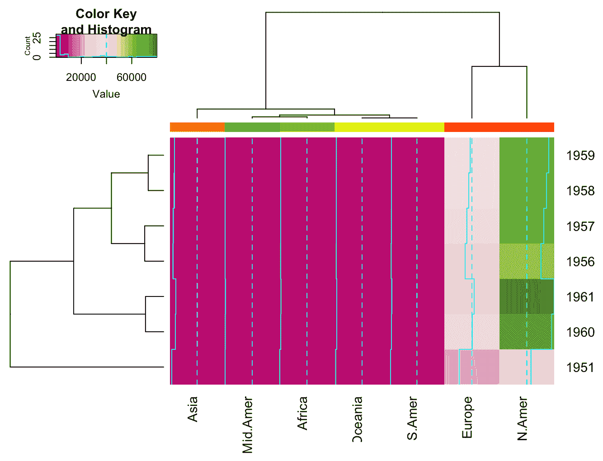
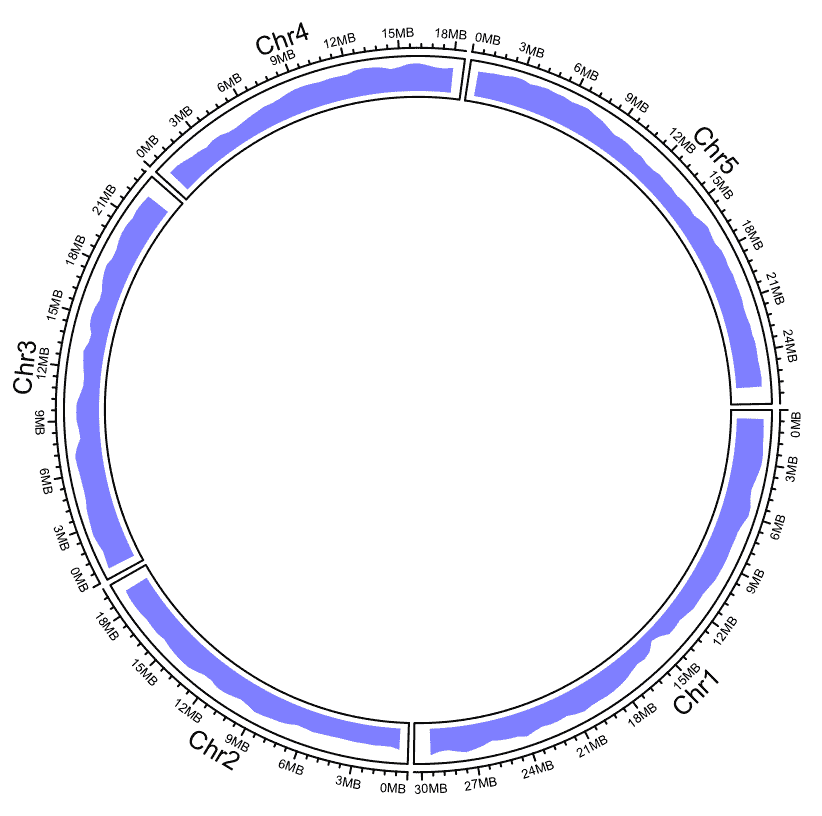

# 第七章：生成出版物和 Web-ready 可视化图形

设计和制作出版质量的可视化图形是生物信息学家的核心任务之一，也是他们在数据处理过程中最具成就感的部分。R 提供了许多优秀的图形制作包，超越了强大的基础图形系统和`ggplot2`。在本章的配方中，我们将探讨如何为许多不同类型的数据制作图表，这些数据通常不是典型的条形图/散点图类型。我们还将讨论网络、交互式图形、3D 图形和圆形基因组图。

本章将介绍以下配方：

+   使用 ridgeplots 可视化多个分布

+   为双变量数据创建色图

+   将关系数据表示为网络

+   使用 plotly 创建交互式 Web 图形

+   使用 plotly 构建三维图形

+   构建多组学数据的圆形基因组图

# 技术要求

本章所需的示例数据可以在本书的 GitHub 仓库中找到：[`github.com/danmaclean/R_Bioinformatics_Cookbook`](https://github.com/danmaclean/R_Bioinformatics_Cookbook)[.](https://github.com/danmaclean/R_Bioinformatics_Cookbook) 如果你想按照书中的代码示例运行，你需要确保数据位于工作目录的子目录中。

以下是你需要的 R 包。你可以使用`install.packages("package_name")`来安装它们。列在`Bioconductor`下的包需要使用专用的安装器进行安装，安装步骤也在本节中描述。如果你需要做其他操作，安装步骤将在包使用的配方中描述：

+   `circlize`

+   `dplyr`

+   `ggplot2`

+   `ggridges`

+   `gplots`

+   `plotly`

+   `RColorBrewer`

+   `readr`

+   `magrittr`

+   `tidyr`

+   `viridis`

`Bioconductor`非常庞大，且有自己的安装管理器。你可以使用以下代码安装该管理器：

```py
if (!requireNamespace("BiocManager"))
    install.packages("BiocManager")
```

然后，你可以使用以下代码安装这些包：

```py
BiocManager::install("package_name")
```

更多信息可以在[`www.bioconductor.org/install/`](https://www.bioconductor.org/install/)中找到。

通常，在 R 中，用户会加载一个库并直接通过名称使用其中的函数。这在交互式会话中非常有效，但当加载多个包时，可能会导致混淆。为了明确在某一时刻我使用的是哪个包和函数，我会偶尔使用`packageName::functionName()`的约定。

有时，在配方的中间，我会打断代码流程，让你看到一些中间输出或对理解非常重要的对象结构。每当发生这种情况，你会看到一个代码块，其中每行以##双哈希符号开头。请考虑以下命令：

`letters[1:5]`

这将产生以下输出：

`## a b c d e`

请注意，输出行以`##`为前缀。

# 使用 ridgeplots 可视化多个分布

可视化某些测量数量的分布是生物信息学中的一项常见任务，R 的基础功能通过`hist()`和`density()`函数以及通用的`plot()`方法，能很好地处理这种任务，后者可以创建对象的图形。`ggplot`图形系统以一种整洁的方式绘制多个密度图，每个因子水平对应一个图形，从而生成一个紧凑且非常易读的图形——即所谓的山脊图。在这个示例中，我们将看看如何创建一个山脊图。

# 准备工作

在这个示例中，我们将使用`ggplot`和`ggridges`包。数据集方面，我们将使用`datasets`包中的一个数据集，该包通常是 R 的预安装包之一。我们将使用`airquality`数据集。你可以直接在 R 控制台中输入`airquality`来查看它。

# 如何实现...

使用山脊图可视化多个分布可以通过以下步骤完成：

1.  加载库：

```py
library(ggplot2)
library(ggridges)
```

1.  构建一个`ggplot`描述：

```py
ggplot(airquality) + aes(Temp, Month, group = Month) + geom_density_ridges()
```

1.  显式将`Month`转换为因子：

```py
ggplot(airquality) + aes(Temp, as.factor(Month) ) + geom_density_ridges()
```

1.  给山脊上色：

```py
ggplot(airquality) + aes(Temp, Month, group = Month,  fill = ..x..) + 
  geom_density_ridges_gradient() + 
  scale_fill_viridis(option = "C", name = "Temp")
```

1.  重塑数据框并添加面板：

```py
library(tidyr)
airquality %>%
  gather(key = "Measurement", value = "value", Ozone, Solar.R, Wind, Temp ) %>%
  ggplot() + aes(value, Month, group = Month) + 
  geom_density_ridges_gradient() +
  facet_wrap( ~ Measurement, scales = "free")
```

# 工作原理...

在*步骤 1*中加载所需的库后，*步骤 2*中我们使用`ggridges`包的`geom_ridges()`函数创建了一个标准的`ggplot`描述。如果你以前没见过`ggplot`图，它们非常简单。一个`ggplot`图有三个层次，至少需要通过三个函数构建——`ggplot()`函数始终是第一个，它允许我们指定数据集。接下来，使用`+`运算符添加的函数是`aes()`函数或美学函数，我们可以将其视为我们希望在图表中看到的内容。第一个参数表示*X*轴上的元素，而第二个参数表示*Y*轴上的元素。`group = Month`参数是特定于山脊图的，它告诉绘图函数如何对数据点进行分组。由于`Month`数据是数字型，而不是因子型，因此这里需要此参数。最后，我们添加`geom_density_ridges()`来创建正确类型的图。

在*步骤 3*中，我们遵循了与*步骤 2*类似的程序，但这次，我们作为替代方法使用了`as.factor(Month)`，它在处理和渲染分组之前显式地将`Month`数据转换为因子类型。因此，`Month`的步骤变得不再必要。这些步骤生成的图形如下，*步骤 2*在左，*步骤 3*在右：


在*第 4 步*中，我们为山脊添加了颜色。基本上，`ggplot` 构建过程没有变化，只是在 `aes()` 函数中增加了 `fill = ..x..`，它告诉绘图填充 *x* 轴方向的颜色。然后我们使用了一个稍微不同的 `geom` 函数，`geom_density_ridges_gradient()`，它能够为山脊着色。在最后一层，我们使用 `scale_fill_viridis()`，选择了来自 viridis 颜色库的颜色尺度（该库在顶部加载）。`"C"` 选项指定了特定的颜色尺度，而 `name` 用来指定尺度的名称。结果图像如下所示：


最后，在*第 5 步*中，我们通过进一步的维度对数据进行了拆分，并在相同样式的图中添加了包含同一数据集不同方面的面板。为了实现这一点，`airquality` 数据需要进行一些预处理。我们加载了 `tidyr` 包，并使用 `gather()` 函数将命名列的值（具体是 Ozone、Solar.R、Wind 和 Temp）合并到一个名为 value 的列中，并添加一个名为 Measurement 的新列，记录原始列中观察值的来源。然后，我们将结果传递到 `ggplot()`。构建过程几乎与之前相同（请注意，我们的 *x* 轴现在是 value，而不是 Temp，因为温度数据已经存储在重塑后的数据框中），最后添加了 `facet_wrap()` 函数，它使用公式符号选择数据的子集并显示在各个面板中。选项 scales 为 `"free"`，允许每个结果面板有独立的坐标轴刻度。结果如下所示：


# 为双变量数据创建颜色映射

颜色映射，也称为热图，是二维矩阵的绘图，其中数值在特定尺度上转换为颜色。我们可以通过多种方式在 R 中绘制这些图表；大多数图形包都提供了这类功能。在本教程中，我们将使用基础包的 `heatmap()` 函数来可视化一些矩阵。

# 准备工作

我们只需要 `ggplot` 包和内置的 `WorldPhones` 数据集。

# 操作步骤...

为双变量数据创建颜色映射可以通过以下步骤完成：

1.  创建基本的热图：

```py
heatmap(WorldPhones)
```

1.  移除树状图：

```py
heatmap(WorldPhones, Rowv = NA, Colv = NA)
```

1.  为分组添加颜色尺度：

```py
cc <- rainbow(ncol(WorldPhones), start = 0, end = .3)

heatmap(WorldPhones, ColSideColors = cc)
```

1.  更改调色板：

```py
library(RColorBrewer)
heatmap(WorldPhones, ColSideColors = cc, 
        col = colorRampPalette(brewer.pal(8, "PiYG"))(25))
```

1.  重新缩放数据：

```py
heatmap(WorldPhones, ColSideColors = cc, scale = "column")
```

# 它是如何工作的...

在*第 1 步*中，我们将基础的 `heatmap()` 函数应用于一个矩阵，返回一个如下所示的图：


在*第 2 步*中，我们使用了 `Rowv` 和 `Colv` 参数来去除树状图。请注意，在结果图中，列的顺序与矩阵中的顺序一致。通过使用树状图，我们可以重新排列列和行。没有树状图的图表如下所示：


在*第 3 步*中，我们使用`rainbow()`函数创建了一个调色板对象，该函数返回绘图所需的颜色。`rainbow()`的第一个参数是颜色的数量。这里，我们使用`ncol(WorldPhones)`来为数据集的每一列获取一种颜色。`start`和`end`参数指定了彩虹中颜色选择的起始和结束位置。然后，我们可以在`ColSideColors`参数中使用**CC**调色板对象，以获取列的颜色键。我们可以使用更多相似的列来获得更多相似的颜色，具体如下：


在*第 4 步*中，我们为`col`参数提供了一个调色板对象，以更改热图的整体调色板。我们使用了`colorRampPalette()`函数，从一小部分特定颜色列表中生成顺序调色板。这个函数会插值生成完整的调色板。我们将`RColorBrewer`包中的`brewer.pal()`函数作为参数传给`colorRampPalette()`，该函数根据提供的选项返回**粉色-黄色-绿色**（**PiYG**）调色板中的八种颜色。生成的热图颜色如下所示：


最后，在*第 5 步*中，我们在可视化步骤中对数据进行了数值转换。我们使用`heatmap()`的`scale`选项来规范化图表中的数据。请注意，设置为**column**时按列进行规范化，而设置为`row`时按行进行规范化。默认的基础包`scale()`函数用于此操作。图表中的数字重新缩放是颜色变化的原因，而不是直接从调色板中选择的结果。图表如下所示：


# 另见

`heatmap()`函数随后有了其他包，这些包遵循类似的语法，但扩展了其功能。尝试使用`gplots`包中的`heatmap.2()`和`heatmap.3()`。以下直方图展示了`heatmap.2()`的绘图效果。它与`heatmap()`非常相似，但默认添加了颜色键和直方图：



# 表示关系数据为网络

网络，或图形，是表示实体之间关系的强大数据表示方式，对于许多生物学研究至关重要。网络分析可以揭示生态学研究中的社区结构，揭示蛋白质-蛋白质相互作用中的潜在药物靶点，并帮助我们理解复杂代谢反应中的相互作用。表示网络的基础数据结构可能是复杂的。幸运的是，R 有一些非常强大的包，特别是`igraph`和`ggraph`，我们可以使用它们来访问网络信息并进行绘图。在本教程中，我们将探索一些生成适当大小网络图的方式。

# 准备工作

在这个示例中，我们需要`ggraph`和`igraph`包及其依赖项，包括`magrittr`、`readr`和`dplyr`。我们还需要来自本书代码库中`datasets/ch7`文件夹的`bio-DM-LC.edges`文件。这个文件包含来自 WormNet 的一些基因功能关联数据。网络包含大约 1,100 条边和 650 个节点。你可以在这里阅读更多关于数据的信息：[`networkrepository.com/bio-DM-LC.php`](http://networkrepository.com/bio-DM-LC.php)。

# 如何操作...

将关系数据表示为网络可以通过以下步骤完成：

1.  加载包并准备数据框：

```py
library(ggraph)
library(magrittr)

df <- readr::read_delim(file.path(getwd(), "datasets", "ch7", "bio-DM-LC.edges"), 
                        delim = " ", 
                        col_names = c("nodeA", "nodeB", "weight")) %>% 
      dplyr::mutate(edge_type = c("A","B"), length(weight), replace = TRUE))
```

1.  创建一个`igraph`对象并在基础图形中使用它：

```py
graph <- igraph::graph_from_data_frame(df)

ggraph(graph, layout = "kk") + 
  geom_edge_link() + 
  geom_node_point() + 
  theme_void()
```

1.  根据边的值或类型给边着色：

```py
ggraph(graph, layout = "fr") + 
  geom_edge_link(aes(colour = edge_type)) + 
  geom_node_point() + 
  theme_void()
```

1.  添加节点属性并相应地为节点着色：

```py
igraph::V(graph)$category <- sample(c("Nucleus", "Mitochondrion", "Cytoplasm"), length(igraph::V(graph)), replace = TRUE )
igraph::V(graph)$degree <- igraph::degree(graph)

ggraph(graph, layout = "fr") + 
  geom_edge_link(aes(colour = edge_type)) + 
  geom_node_point(aes(size = degree, colour = category)) + 
  theme_void()

```

# 它是如何工作的...

在*第 1 步*中，我们加载了所需的库，并从边列表文件中准备了数据框。输入文件基本上是一个边列表。每一行描述了一个连接，第一列是目标节点之一，第二列是另一个目标节点。第三列包含一个值，表示这两个节点之间交互的强度，我们可以将其视为边的权重。字段由空格分隔，文件没有列名标题。因此，我们适当地设置了`delim`和`col_names`参数的值。然后，我们将数据框传递给`dplyr::mutate()`函数，添加一个名为`edge_type`的额外列。在该列中，我们使用`sample()`函数随机为每一行分配`"A"`或`"B"`。最终的对象保存在`df`变量中。

在*第 2 步*中，我们使用`igraph::graph_from_data_frame()`函数从`df`创建了`igraph`对象，并将其保存在`graph`变量中。我们将`igraph`图形对象作为第一个对象传递给`ggraph()`函数，后者与`ggplot()`类似。它接收`graph`对象和一个布局参数。（在这里，我们使用`"kk"`，但具体使用哪个布局将高度依赖于数据本身。）然后，我们使用`+`运算符添加层。首先，我们添加了`geom_edge_link()`层，它绘制了边，然后是`geom_node_point()`，它绘制了节点，最后，我们添加了`theme_void()`，它去除了背景的灰色面板和白色线条，为网络留下了一个清晰的背景。初始图形如下所示：


在*第 3 步*中，我们添加了一些基于数据的自定义设置。我们首先将布局算法更改为`"fr"`，这种算法提供了更美观且更分散的视图。然后，我们在`geom_edge_link()`中使用`aes()`函数将边的颜色映射到`edge_type`值。剩下的层像之前一样添加。通过这样做，我们得到了以下图形：


在 *第 4 步* 中，我们为节点设置了一些属性。这比看起来要简单。`igraph` 中的 `V()` 函数返回一个简单的节点 ID 向量（在 igraph 行话中，节点被称为顶点），因此我们计算该向量的长度，并用它生成一个包含 `Nucleus`、`Mitochondrion` 和 `Cytoplasm` 值的随机向量。然后我们可以通过使用带有 `$` 索引的 `V()` 函数将这些新值分配给节点。我们可以创建任何我们喜欢的属性，因此 `igraph::V(graph)$category` 创建了一个名为 **category** 的新属性。我们可以使用标准的 `*<-*` 赋值运算符将新值直接分配给该属性。接下来的步骤类似；`igraph::V(graph)$degree` 创建了一个名为 **degree** 的属性。在我们的案例中，我们将 `igraph::degree()` 函数的结果分配给它。Degree 是图论中的术语，表示与一个节点相连的边的数量。现在我们拥有了新的属性，可以根据这些属性对图形进行上色。`ggraph()` 构建过程与之前相同，但在 `geom_node_point()` 层中，我们使用 `aes()` 将颜色映射到我们新的 category 属性，并将大小映射到我们新的 degree 属性。最终的图形如下所示：


# 还有更多内容...

蜂窝图是绘制网络的好方法，尤其是在你有三种节点类型或某种方向性结构时。你可以使用我们已经拥有的相同类型的数据创建一个蜂窝图，如下所示：

```py
ggraph(graph, 'hive', axis = 'category') +
  geom_edge_hive(aes(colour = edge_type, alpha = ..index..)) + 
  geom_axis_hive(aes(colour = category)) + 
  theme_void()
```

在这里，我们设置布局类型为 `hive`，并指定用于制作轴的属性为 `category`。在 `geom_edge_hive()` 中的边描述与之前差不多，`alpha` 参数为 `..index..`，它根据边的绘制顺序为边缘添加透明度元素。`geom` 节点被替换为 `geom_axis_hive()`，我们在其中使用 `aes()` 将颜色映射到 category 属性。生成的图形如下所示：


# 使用 plotly 创建交互式网页图形

通过图形用户界面交互式地探索数据集是一种有益且启发性的方式，能够分析和审视数据。动态地在图形中添加和删除数据、放大或缩小特定部分，或让图形随着时间变化（依赖于底层数据）可以让我们看到一些在静态图形中看不见的趋势和特征。在这个实例中，我们将使用 `plotly` 库在 R 中创建交互式图形，从一个基本图形开始，逐步构建一个更复杂的图形。

# 准备工作

在这个实例中，我们将使用内置的 Orange 数据集，它描述了橙树树干围长随时间的变化。该数据集是 `datasets` 包的一部分（通常已经预装），因此你应该能够立即访问它。

# 如何操作...

使用 `plotly` 创建交互式网页图形可以通过以下步骤完成：

1.  加载库并创建一个基本图形：

```py
library(plotly)
plot_ly(data = Orange, x = ~age, y = ~circumference)
```

1.  映射标记的颜色和大小以及悬停文本到数据：

```py
plot_ly(data = Orange, x = ~age, y = ~ circumference,
        color = ~Tree, size = ~age,
        text = ~paste("Tree ID: ", Tree, "<br>Age: ", age, "Circ: ", circumference)
        )
```

1.  添加第二个系列/迹线：

```py
trace_1 <- rnorm(35, mean = 120, sd = 10)
new_data <- data.frame(Orange, trace_1)

plot_ly(data = new_data, x = ~age, y = ~ circumference,
        color = ~Tree, size = ~age,
        text = ~paste("Tree ID: ", Tree, "<br>Age: ", age, "Circ: ", circumference)

)  %>% add_trace(y = ~trace_1, mode = 'lines' ) %>%
  add_trace(y = ~circumference, mode = 'markers' )
```

1.  添加一个下拉菜单，以便您可以选择图表类型：

```py
plot_ly(data = Orange, x = ~age, y = ~ circumference,
        color = ~Tree, size = ~age,
        text = ~paste("Tree ID: ", Tree, "<br>Age: ", age, "Circ: ", circumference)

)  %>%
  add_trace(y = ~circumference, mode = 'marker' ) %>%
  layout(
    title = "Plot with switchable trace",
      updatemenus = list(
        list(
          type = "dropdown",
            y = 0.8,
            buttons = list(
              list(method = "restyle",
                   args = list("mode", "markers"),
                   label = "Marker"
              ),
              list(method = "restyle",
                   args = list("mode", "lines"),
                   label = "Lines"
                   )

            )
          )
      )
  )
```

# 它是如何工作的...

在*第 1 步*加载库后，我们使用核心的`plot_ly()`函数创建了可能最简单的图。我们向`plot_ly()`传递了数据框的名称，以及作为公式的*x*和*y*轴的列，因此使用了`~`符号。在这一点上，我们还没有明确指定迹线类型，即`plotly`称其为系列或数据轨道，所以它猜测并创建了一个散点图，如下图所示：


注意图表顶部的菜单图标以及当鼠标悬停在数据点上时显示的悬停文本。这些图形在交互式 R 会话中可以很好地进行交互，但更适合于 HTML-based 文档，例如编译的 R markdown。

在*第 2 步*中，我们将图中的特征映射到数据的各个方面。我们将大小和颜色设置为与树木 ID 和年龄列相对应的公式，再次使用`~`语法。我们还为每个数据点设置了悬停文本，并使用`paste()`函数编译了确切的格式。请注意，悬停文本是基于 HTML 的，我们可以使用诸如`<br>`这样的标签来按照选择的方式格式化悬停效果。我们的图现在改进为如下所示：


在*第 3 步*中，我们的主要变化是明确指定了迹线数据。为了突出显示迹线可以携带超出原始数据框之外的数据，我们使用`rnorm()`创建了一个名为`trace_1`的新数据向量，其中包含 35 个均值为 120，标准差为 1 的随机数。我们与在*第 2 步*创建图表的方式相同，但这次我们使用了`magrittr`管道将图形对象发送到`add_trace()`函数。在这里，我们将新的`trace_1`对象作为我们的`y`值传递，并将`mode`设置为`"lines"`以获得折线图。再次，我们将其传递到另一个`add_trace()`函数（我们可以通过多个迹线系列构建一个图），但这次使用原始数据框列周长，并将`mode`设置为`"markers"`。生成的图表看起来像这样：


在*第 4 步*中，我们将菜单引入了我们的图表。我们实现的菜单将允许我们在不同的追踪类型之间切换——从线条到标记，再到线条。此步骤以相同的基本`plot_ly()`调用开始，然后这次只传入一个追踪。接下来，我们传入了`layout`函数，该函数接受一个图表标题作为`title`参数，并为`updatemenus`参数提供一个复杂的选项列表。你必须将一个包含三个成员的列表传递给`updatemenus`——`type`、`y`和`buttons`。`type`设置菜单类型——在这种情况下，我们想要一个下拉菜单；`y`设置菜单在*y*轴上的位置，值范围为 0 到 1，而`buttons`需要另一个列表，其中每个子列表描述一个菜单选项。每个子列表都有`members`方法，以及`args`和`labels`。`setting`方法用于`"restyle"`，意味着图表将在选择菜单时更新。`args`成员需要另一个列表，指定当前菜单选项的`"mode"`和`"type"`。最后，`label`指定此菜单选项在菜单中显示的文本。当我们在下拉菜单中选择**Marker**时，图表如下所示，渲染在左侧：


# 使用 plotly 构建三维图表

我们在生物信息学中生成的大多数图表都是静态的，并且局限于二维平面，但现代网络技术使我们能够与三维对象进行互动并动态渲染。`plotly`库提供了渲染不同类型 3D 图表的工具，在这个教程中，我们将展示如何构建一个 3D 表面图和一个带有*x*、*y*、*z*轴的散点图。

# 准备就绪

在这个教程中，我们将再次使用`plotly`库，并且使用内置的`longley`经济数据集。

# 如何做...

使用`plotly`构建三维图表可以通过以下步骤完成：

1.  设置数据对象：

```py
library(plotly)

d <- data.frame(
  x <- seq(1,10, by = 0.5),
  y <- seq(1,10, by = 0.5)
)

z <- matrix(rnorm(length(d$x) * length(d$y) ), nrow = length(d$x), ncol = length(d$y))
```

1.  创建基本的表面图：

```py
plot_ly(d, x = ~x , y = ~y, z = ~z) %>% 
  add_surface()
```

1.  添加一个响应式等高线图层：

```py
plot_ly(d, x = ~x , y = ~y, z = ~z) %>% 
  add_surface(
    contours = list(
    z = list(
      show=TRUE,
      usecolormap=TRUE,
      highlightcolor="#ff0000",
      project=list(z=TRUE)
      )
    )
  )
```

# 它是如何工作的...

在*第 1 步*中，我们首先构建一个适合图表类型的数据集。对于表面三维图，我们需要一个包含*x*和*y*坐标的数据框，我们直接使用`data.frame()`函数创建，并将其保存在一个名为`d`的变量中。数据框`d`包含了 x 和 y 列之间从 0 到 10 的 20 个值（每列 10 个值）。你可以将这个数据框视为指定三维场的宽度和长度，而不是实际的数据值。数据值是通过与数据框指定的维度相对应的矩阵对象获得的。我们使用`matrix()`函数创建了一个适当维度的矩阵，矩阵中的值是通过`rnorm()`函数生成的随机正态值。一旦我们有了这两个结构，就可以像之前为二维图表做的那样，使用它们在`plot_ly()`函数中指定`d`、`x`和`y`，并添加新的*z*轴来获取我们的矩阵。结果被传递给`add_surface()`函数，将数据渲染为三维表面。该图表的效果类似如下：


请注意，点击并拖动图表区域，你可以调整相机视角。

在*第 2 步*中，我们通过在三维表面下方（或上方）添加一个反应式等高线图来进一步完善图表。我们在`add_surface()`函数中使用了 contours 选项。它接受一个选项列表。第一个`z`指定如何处理等高线。它还接受一个包含多个成员的列表，用于控制等高线图的外观，最重要的选项是`highlightcolor`，它指定了在等高线图上绘制的颜色，用于显示鼠标悬停的当前三维图层。渲染后的图像类似于以下效果：


在*第 3 步*中，我们改变了方向，绘制了一个三维散点图。这更加直接。我们将 Longley 数据传递给`plot_ly()`函数，并指定了维度和数据列进行映射。我们还添加了一个标记选项，将颜色映射到 GNP 列。最后，我们将基本图对象传递给`add_markers()`函数，得到最终图表，效果如下所示：


# 构建多组学数据的圆形基因组图

对多条数据序列的整体基因组分析通常以圆形方式呈现，采用同心圆，每个圆显示不同种类的数据，每个数据在圆中的表示方式不同。这些图表被称为 Circos 图，具有极大的表现力，可以在紧凑的形式中显示大量的密集信息。在本教程中，我们将学习如何在 R 中构建这样的图表，使用常见的基因组数据文件。

# 准备工作

为了制作 Circos 图，我们将使用`circlize`包以及本书仓库中`datasets/ch7/`文件夹下的四个以`arabidopsis`为前缀的文件。

# 如何操作...

构建多组学数据的圆形基因组图可以通过以下步骤完成：

1.  加载库并读取染色体长度信息：

```py
library(circlize)
df <- readr::read_tsv(file.path( getwd(), "datasets", "ch7", "arabidopsis.gff"), col_names = FALSE) %>% 
  dplyr::select(X1, X4, X5)
```

1.  初始化图表和染色体轨迹，然后添加链接：

```py
circos.genomicInitialize(df)
circos.link("Chr4", c(9000000, 1200000), 
            "Chr5", c(12000000,15000000),
            col = "red")
```

1.  从文件加载链接信息并绘制：

```py
circos.clear()

source_links <- read.delim(file.path(getwd(), "datasets", "ch7", "arabidopsis_out_links.bed"), header = FALSE) 
target_links <- read.delim(file.path(getwd(), "datasets", "ch7", "arabidopsis_in_links.bed"), header = FALSE)

circos.genomicInitialize(df)
circos.genomicLink(source_links, target_links, col = "blue")
```

1.  加载基因位置并添加密度轨迹：

```py
circos.clear()

gene_positions <- read.delim(file.path(getwd(), "datasets", "ch7", "arabidopsis_genes.bed"), header = FALSE)
circos.genomicInitialize(df)
circos.genomicDensity(gene_positions, window.size = 1e6, col = "#0000FF80", track.height = 0.1)
```

1.  加载热图数据。然后，添加一个热图轨迹：

```py
circos.clear()

heatmap_data <- read.delim(file.path(getwd(), "datasets", "ch7", "arabidopsis_quant_data.bed"), header = FALSE)

col_fun = colorRamp2(c(10, 12, 15), c("green", "black", "red"))
circos.genomicInitialize(df)
circos.genomicHeatmap(heatmap_data, col = col_fun, side = "inside", border = "white")
```

1.  合并这些轨迹：

```py
circos.clear()

circos.genomicInitialize(df)
circos.genomicHeatmap(heatmap_data, col = col_fun, side = "inside", border = "white")
circos.genomicDensity(gene_positions, window.size = 1e6, col = "#0000FF80", track.height = 0.1)
circos.genomicLink(source_links, target_links, col = "blue")
```

# 它是如何工作的...

在*步骤 1*中，我们开始通过读取`arabidopsis.gff`文件来构建图表，该文件描述了我们希望在图表中使用的染色体长度。我们只需要名称、开始和结束列，因此我们将数据传递给`dplyr::select()`函数，保留适当的列，即`X1`、`X4`和`X5`。由于`.gff`文件没有列标题，`read_tsv()`函数会给出列名 X1 ... Xn。我们将结果保存在`df`对象中。

在*步骤 2*中，我们开始构建图表。我们使用`circos.genomicInitialize()`函数和`df`来创建图表的骨架和坐标系统，然后手动添加了一个单独的链接。`circos.link()`函数允许我们使用染色体名称和 c(start, end)格式创建单个来源和目标，从而将链接着色为请求的颜色。当前图表如下所示：


在*步骤 3*的开始，我们使用了`circos.clear()`来完全重置图表。重置仅在本教程中需要，因为我们想逐步构建内容；在你自己的编码中，你可能可以忽略它。下一步是加载一个基因组区域文件，代表一些链接的来源，以及一个独立的基因组区域文件，代表一些链接的目标。这两个文件应该是 BED 格式，并且源文件中的第 N 行必须与目标文件中的第 N 行对应。然后，我们使用`circos.genomicInitialize()`重新初始化图表，并使用`circos.genomicLink()`在一个命令中添加多个链接，传入源链接数据和目标数据的对象，然后将它们全部着色为蓝色。图表如下所示：


在*步骤 4*中，在清除图表后，我们从`arabidopsis_genes.bed`文件中读取另一个基因位置的 BED 文件。我们希望将这些信息添加为一个密度轨迹，计算用户指定长度的窗口中功能的数量，并将其绘制为密度曲线。为此，我们使用`circos.genomicDensity()`函数，传入`gene_positions`数据框，选择一个 1 百万的窗口大小，一种颜色（注意颜色使用八位十六进制格式，允许我们为颜色添加透明度），以及`track.height`，它指定了图表中此轨迹所占的比例。轨迹如下所示：



在*第 5 步*中，我们添加了一个更复杂的轨迹——一个热图，可以表示许多列的定量数据。这里的文件格式是扩展的 BED 格式，包含染色体名称、起始位置和结束位置，以及后续列中的数据。在我们的示例文件`arabidopsis_quant_data.bed`中有三个额外的数据列。我们通过`read.delim()`将 BED 文件加载到`heatmap_data`中。接下来，我们创建了一个颜色函数，并将其保存为`col_fun`，用于绘制热图。`colorRamp2()`函数接受数据的最小值、中值和最大值的向量作为其参数，然后使用第二个参数中指定的颜色。因此，使用`10`、`12`和`15`以及`绿色`、`红色`和`黑色`，我们分别将 10 绘制为绿色，12 绘制为黑色，15 绘制为红色。介于这些值之间的颜色会由`colorRamp2()`自动计算。为了绘制热图，我们使用了`circos.genomicHeatmap()`函数，并将`col_fun`传递给`col`参数。`side`参数指定是否在圆内或圆外绘制，而`border`参数指定热图元素之间线条的颜色。绘图效果如下：


最后，在*第 6 步*中，我们将所有内容结合在一起。通过清除并重新初始化绘图，我们通过按从外到内的顺序调用相关函数来指定轨迹的顺序：


最终的图形，如前面所见，先是`circos.genomicHeatmap()`，然后是`circos.genomicDensity()`，最后是`circos.genomicLink()`，以得到圆形基因组图。
