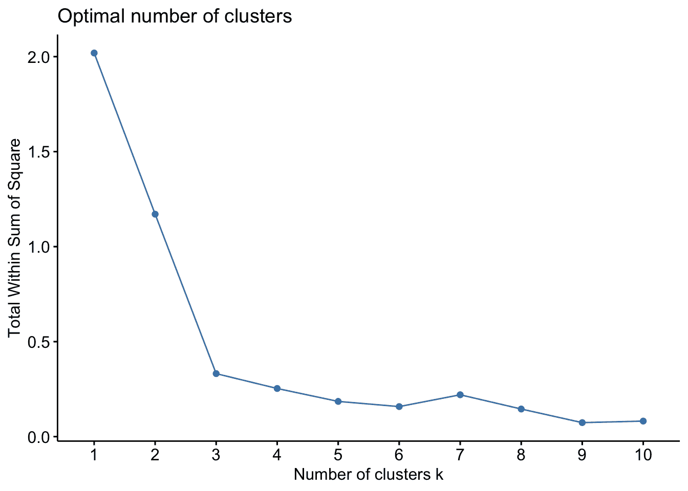

# 第九章：有用的统计和机器学习方法

在生物信息学中，对不同大小和组成的数据集进行统计分析是常见的任务。R 无疑是一个功能强大的统计语言，拥有丰富的选项来处理各种任务。在本章中，我们将重点关注一些有用但不常讨论的方法，尽管这些方法本身并不构成完整的分析，但它们可以成为你经常进行的分析的有力补充。我们将查看模拟数据集的食谱，以及用于类别预测和降维的机器学习方法。

本章将涵盖以下食谱：

+   校正 p 值以考虑多重假设

+   生成一个模拟数据集来表示背景

+   在数据中学习分组并使用 kNN 进行分类

+   使用随机森林预测类别

+   使用 SVM 预测类别

+   在没有先验信息的情况下对数据进行分组学习

+   使用随机森林识别数据中最重要的变量

+   使用 PCA 识别数据中最重要的变量

# 技术要求

你需要的示例数据可以从本书的 GitHub 仓库获取，网址是[`github.com/PacktPublishing/R-Bioinformatics-Cookbook`](https://github.com/PacktPublishing/R-Bioinformatics-Cookbook)。如果你想按原样使用代码示例，那么你需要确保这些数据位于你工作目录的子目录中。

这里是你需要的 R 包。通常，你可以使用`install.packages("package_name")`来安装这些包。列在`Bioconductor`下的包需要使用专门的安装器安装。如果需要进一步的操作，安装过程将在使用这些包的食谱中进行描述：

+   `Bioconductor`

    +   `Biobase`

+   `caret`

+   `class`

+   `dplyr`

+   `e1071`

+   `factoextra`

+   `fakeR`

+   `magrittR`

+   `randomForest`

+   `RColorBrewer`

`Bioconductor`非常庞大，并且有自己的安装管理器。你可以使用以下代码安装该管理器：

```py
if (!requireNamespace("BiocManager"))
    install.packages("BiocManager")
```

然后，你可以使用以下代码安装这些包：

```py
BiocManager::install("package_name") 
```

更多信息可以在[`www.bioconductor.org/install/`](https://www.bioconductor.org/install/)找到。

通常，在 R 中，用户会加载一个库并通过名称直接使用函数。这在交互式会话中非常方便，但当加载了多个包时，可能会引起混淆。为了明确我在使用哪个包和函数，我会偶尔使用`packageName::functionName()`这种约定。

有时，在执行食谱的过程中，我会暂停代码，以便你能看到一些中间输出或对象的结构，这对理解非常重要。每当发生这种情况时，你会看到一个代码块，每行以`##`（双井号）符号开头。请考虑以下命令：

`letters[1:5]`

这将给我们以下输出：

`## a b c d e`

请注意，输出行的前缀是`##`。

# 校正 p 值以考虑多重假设

在生物信息学，特别是在基因组学项目中，我们常常在分析中执行数千次统计检验。但这可能会导致我们结果中的显著误差。考虑一个基因表达实验，每个处理的测量数很少（通常只有三次），但基因数量有成千上万。一个执行统计检验的用户，在*p <= 0.05*的情况下，会错误地拒绝零假设 5%的时间。对进行多个假设检验的校正可以帮助我们减少此类分析中的错误率。我们将查看一种简单的校正方法。

# 准备开始

所有需要的函数都是 R 的基础函数，我们将通过代码创建自己的数据。

# 如何实现...

校正 p 值以考虑多个假设的步骤如下：

1.  运行 10,000 次 t 检验：

```py
set.seed(1)
random_number_t_test <- function(n){
  x <- rnorm(10)
  y <- rnorm(10)
  return(t.test(x,y)$p.value)
}

p_values <- sapply(1:10000, random_number_t_test )
```

1.  评估 p*-*值数量，`<= 0.05`：

```py
sum(p_values <= 0.05)
```

1.  调整 p 值：

```py
adj_p_values <- p.adjust(p_values, method = "holm")
```

1.  重新评估`<= 0.05`的 p 值数量：

```py
sum(adj_p_values <= 0.05)
```

# 它是如何工作的...

*步骤 1*中的第一行代码简单地固定了随机数生成器，以便我们能够在不同计算机之间获得一致的结果；除了为了对比本书中的结果，你不需要这部分代码。接下来是创建一个自定义函数，生成两组（*x*和*y*）10 个随机数，然后执行 t 检验并返回 p 值。由于这些只是来自相同分布的随机数，因此没有实际差异。最后一行使用` sapply()`函数运行我们自定义的函数并创建一个包含 10,000 个 p 值的向量。

在*步骤 2*中，我们仅仅统计 p 值小于 0.05 的数量。我们得到如下结果：

```py
## [1] 506
```

这表示我们有 506 个错误判定为显著的结果。

在*步骤 3*中，我们使用`p.adjust()`函数应用一种校正方法。`argument`方法可以是几种可用方法之一。实践中，最好尝试`holm`或`BH`（Benjamini Hochberg），因为这些方法提供了准确的假阳性率。一种广泛使用但效果不太好的方法是`Bonferroni`；大多数情况下应避免使用它。

在*步骤 4*中，我们重新评估小于 0.05 的 p 值数量。这次，结果正如我们预期的那样：

```py
## [1] 0
```

# 生成一个代表背景的模拟数据集

构建模拟数据集以作为合理的对照，进行与预期背景分布的适当比较，并拥有一个合适的背景人群来抽取样本，这是许多研究的重要方面。在本配方中，我们将探讨从头开始或通过混合现有数据框来生成这些数据的各种方式。

# 准备开始

我们将使用`fakeR`包和内置的`iris`数据集。

# 如何实现...

生成一个代表背景的模拟数据集可以按照以下步骤进行：

1.  创建一个具有与给定数据集相同特征的随机数据集：

```py
library(fakeR)
fake_iris <- simulate_dataset(iris)
```

1.  创建一个均值和标准差与给定向量相同的正态分布随机数向量：

```py
sample_mean <- mean(iris$Sepal.Length)
sample_sd <- sd(iris$Sepal.Length)
random_sepal_lengths <- rnorm(iris$Sepal.Length, mean = sample_mean, sd = sample_sd)
hist( random_sepal_lengths)
```

1.  在一个范围内创建一个均匀分布的随机整数向量：

```py
low_num <- 1
high_num <- 6
hist(runif(1500, low_num, high_num))
```

1.  创建一个二项分布成功次数的向量：

```py
number_of_coins <- 1
p_heads <- 0.5
hist(rbinom(1500, number_of_coins, p_heads ))
number_of_coins <- 5
hist(rbinom(1500, number_of_coins, p_heads ))
```

1.  从列表中随机选择元素，且每个元素的选择概率不同：

```py
random_from_list <- sample(c("Low", "Medium", "High"), 100, replace = TRUE, prob = c(0.2, 0.6, 0.2))
table(random_from_list)
```

# 它是如何工作的……

*步骤* *1* 使用了`fakeR`包中的`simulate_dataset()`函数，生成一个新的数据集，该数据集与源数据集（`iris`）具有相同数量的值、相同的列名、相同数量的因子水平和水平名称，以及相同数量的行。值是随机化的，但数据框架是完全相同的。注意，使用`str()`函数报告`iris`和新的`fake_iris`对象的结构是完全相同的：

```py
str(iris)
## 'data.frame':    150 obs. of  5 variables:
##  $ Sepal.Length: num  5.1 4.9 4.7 4.6 5 5.4 4.6 5 4.4 4.9 ...
##  $ Sepal.Width : num  3.5 3 3.2 3.1 3.6 3.9 3.4 3.4 2.9 3.1 ...
##  $ Petal.Length: num  1.4 1.4 1.3 1.5 1.4 1.7 1.4 1.5 1.4 1.5 ...
##  $ Petal.Width : num  0.2 0.2 0.2 0.2 0.2 0.4 0.3 0.2 0.2 0.1 ...
##  $ Species     : Factor w/ 3 levels "setosa","versicolor",..: 1 1 1 1 1 1 1 1 1 1 ...

str(fake_iris)
## 'data.frame':    150 obs. of  5 variables:
##  $ Sepal.Length: num  5.26 6.69 5.63 5.21 5.28 6.45 6.8 5.71 6.01 6.44 ...
##  $ Sepal.Width : num  2.84 2.78 2.83 2.44 2.19 3.87 3.14 2.58 2.78 3.25 ...
##  $ Petal.Length: num  4.03 4.84 2.64 2.83 5.37 3.63 5.54 4.74 4.63 4.29 ...
##  $ Petal.Width : num  1.63 1.33 0.7 0.61 2.03 1.17 2.05 1.6 1.57 1.32 ...
##  $ Species     : Factor w/ 3 levels "setosa","versicolor",..: 3 2 2 3 1 2 1 3 3 1 ...
```

在*步骤 2*中，我们的目标是生成一个随机数向量，它的均值和标准差与`iris`数据集中`Sepal.Length`列的均值和标准差相同。为此，我们首先使用`mean()`和`sd()`函数计算这些数值。然后，我们将这些值作为参数传递给`rnorm()`函数的`mean`和`sd`参数。通过运行`hist()`绘制生成的`random_sepal_lengths`向量，我们可以确认其分布和参数。

在*步骤 3*中，我们希望创建一个数值（浮动点）向量，这些数值能够以相等的概率出现——这类似于反复掷骰子：每个选项的可能性是一样的。事实上，在这个步骤中，我们将范围的低值（`low_num`）设置为 1，将高值（`high_num`）设置为 6，以模拟这个过程。我们通过`runif()`函数生成 1,500 个符合这些低值和高值的随机数，并通过再次使用`hist()`绘制结果，我们可以看到每个区间内的频率相对均匀，从而确认这些数值的均匀性。

在*步骤 4*中，我们希望模拟一个掷硬币式的概率实验——所谓的二项成功概率分布。我们首先必须决定每次实验的试验次数——在掷硬币实验中，这指的是我们掷的硬币数量。在这里，我们将`number_of_coins`变量设置为 1。我们还必须决定成功的概率。同样，模拟掷硬币实验时，我们将`p_heads`变量设置为 0.5。为了进行模拟，我们将这些值传递给`rbinom()`函数，请求进行 1,500 次独立的实验重复。`hist()`函数显示，0 次成功（掷出反面）和 1 次成功（掷出正面）的频率在所有 1,500 次重复中大致相等。接下来，我们通过改变`number_of_coins`变量的值，将试验次数改为 5，模拟每次重复实验时使用五枚硬币。我们再次使用`rbinom()`函数并通过`hist()`绘制结果，这时我们可以观察到，两个和三个成功（正面）是每次五枚硬币实验中最常见的结果。

最后，在*步骤 5*中，我们通过`sample()`函数来选择向量中的项目。`sample`的第一个参数是要从中采样的向量——这里是整数 1 到 10。第二个参数是要选择的项目数量——这里我们选择 10 个。请注意，默认情况下，`sample()`会进行不放回抽样，因此每个项目不会被选择两次，尽管向量中的每个项目每次都有相等的被选中概率。`sample()`的第二种用法将`replacement`参数设置为`TRUE`，意味着可以重复选择项目。此用法还设置了`prob`参数——一个包含选择初始向量中每个值的概率的向量。运行此采样并将结果传递给`table()`函数确认我们获得的选择符合预期的近似概率。

# 数据中的学习分组与 kNN 分类

**k-最近邻（kNN）**算法是一种监督学习算法，它会根据给定的数据点，尝试根据其与一组已知类别的训练样本的相似性对其进行分类。在这个食谱中，我们将学习如何使用数据集，将其划分为测试集和训练集，并根据训练集构建的模型预测测试集的类别。这种方法广泛应用于生物信息学，并且在聚类分析中非常有价值，尤其是当我们有一些已知的目标类别示例时。

# 准备工作

对于这个食谱，我们需要几个新的包：`caret`、`class`、`dplyr`和`magrittr`。作为数据集，我们将使用内置的`iris`数据集。

# 如何进行...

使用以下步骤可以在数据中进行学习分组并进行 kNN 分类：

1.  标准化数据并删除非数值列：

```py
set.seed(123)
scaled_iris <- iris %>% mutate_if( is.numeric, .funs = scale)
labels <- scaled_iris$Species
scaled_iris$Species <- NULL
```

1.  提取训练集和测试集：

```py
train_rows <- sample(nrow(scaled_iris), 0.8 * nrow(scaled_iris), replace = FALSE)
train_set <- scaled_iris[train_rows, ]
test_set <- scaled_iris[-train_rows, ]
train_labels <- labels[train_rows]
test_set_labels <- labels[-train_rows]
```

1.  构建模型并对测试集进行预测：

```py
test_set_predictions <- knn(train = train_set, test = test_set, cl = train_labels, k = 10)
```

1.  比较预测结果与实际类别：

```py
caret::confusionMatrix(test_set_predictions,  test_set_labels)
```

# 它是如何工作的...

在*步骤 1*中，我们首先使用`set.seed()`确保随机数的可复现性，然后使用`dplyr mutate_if()`函数对数据集的每一列进行标准化。`mutate_if()`的第一个参数是要测试的条件；`.funs`参数是如果条件为真则应用的函数。在这里，我们对`iris`数据框的一列应用`scale()`函数，如果该列是数值型，则返回我们称之为`scaled_iris`的数据框。列间的标准化在 kNN 中非常重要，因为实际值的大小可能会有很大影响，所以我们需要确保它们在各列之间的尺度相似。接下来，我们从数据中复制`Species`列，因为它包含类标签，并通过将列赋值为`NULL`将其从数据框中删除——接下来的步骤中，数据框应仅包含数值数据。

在*步骤 2*中，我们决定哪些行应该包含在训练集和测试集中。我们使用`sample()`函数从 1 到`iris`行数的向量中选择；我们无替代地选择 80%的行号，因此`train_rows`是一个整数向量，表示`scaled_iris`中的行，我们将在训练集中使用它。在这一步的其余部分，我们使用子集和负子集来准备我们需要的`scaled_iris`子集。

在*步骤 3*中，我们应用 kNN 算法，通过`knn()`函数构建模型，并在一次操作中对测试集进行分类。`train`参数表示我们为训练预留的数据部分，`test`参数表示我们为测试预留的数据部分，`cl`（类别）参数表示训练集的标签。`k`参数是用于分类每个未知测试点的邻居数。该函数返回一个包含测试数据中每行预测类别的向量，我们将其保存在`test_set_predictions`中。

在*步骤 4*中，我们使用`caret`包的`confusionMatrix()`函数评估预测结果。该函数接受预测类别和真实类别，并生成一组统计数据，包括以下表格，其中行表示`Real`标签，列表示`Predicted`标签。该模型错误地将一个`versicolor`行预测为`virginica`，但其余所有预测都正确：

```py
##             Reference
## Prediction   setosa versicolor virginica
##   setosa          8          0         0
##   versicolor      0          9         1
##   virginica       0          0        12
```

# 使用随机森林进行类别预测

随机森林是另一种监督学习算法，它使用决策树的集合来进行多次类别预测，最终预测最常出现的类别作为模型的最终预测。随机森林通常是有用的，因为它可以同时处理分类和数值数据，并且可以应用于分类和回归任务。在本章的*使用随机森林识别数据中最重要的变量*配方中，我们将再次使用它来预测数据中最重要的变量。在这个配方中，我们将使用随机森林来预测数据的类别。

# 做好准备

对于这个配方，我们需要`caret`和`randomForest`包以及内置的`iris`数据集。

# 如何执行此操作...

使用随机森林进行类别预测可以通过以下步骤完成：

1.  从`iris`数据集中准备训练集：

```py
library(randomForest)

train_rows <- sample(nrow(iris), 0.8 * nrow(iris), replace = FALSE)
train_set <- iris[train_rows, ]
test_set <- iris[-train_rows, ]
```

1.  在训练数据上构建模型：

```py
model <- randomForest(Species ~ . , data = train_set, mtry = 2)
```

1.  使用模型对测试数据进行预测：

```py
test_set_predictions <- predict(model, test_set, type = "class")
caret::confusionMatrix(test_set_predictions,  test_set$Species)
```

# 它是如何工作的...

*步骤 1*的整个过程是准备训练集和测试集。我们使用`sample()`函数从 1 到`iris`行数的向量中选择；我们无替代地选择 80%的行号，因此`train_rows`是一个整数向量，表示`iris`中的行，我们将在训练集中使用它。在这一步的其余部分，我们使用子集和负子集来准备我们需要的`iris`子集。

在*步骤 2* 中，我们直接进行模型构建和预测。`randomForest()`函数以其第一个参数为 R 公式，命名要预测的列（即`Species`，响应变量），并且是训练数据的数据框列——在这里，我们使用所有列，表示为一个`.`字符。`data`参数是源数据框的名称，`mtry`参数是一个可调参数，告诉算法使用多少分裂。这个最佳值通常是列数的平方根，但优化它可能会有帮助。生成的模型保存在一个名为`model`的变量中，可以打印进行检查。

在*步骤 3* 中，我们使用`predict()`函数与`model`、`test_set`数据和设置为`class`的`type`参数来预测测试集的类别。然后，我们使用`caret::confusionMatrix()`来评估它们，得到以下结果：

```py
##             Reference
## Prediction   setosa versicolor virginica
##   setosa         13          0         0
##   versicolor      0          8         0
##   virginica       0          0        9
## 
```

结果表明测试集完美分类。

# 还有更多内容

可以使用非常相似的方法进行回归（预测数值）预测。看看以下建立回归模型和进行评估的代码的相似性。在这里，我们基于其他列预测萼片长度。模型构建后，我们像以前一样运行预测；注意我们如何删除`type`参数（因为实际上回归是默认的）。最后，我们通过计算**均方误差**（**MSE**）来评估，在其中我们平方预测值和萼片长度的实际值之间的差异，然后取均值：

```py
model <- randomForest(Sepal.Length ~ . , data = train_set, mtry = 2)
test_set_predictions <- predict(model, test_set)

mean( (test_set$Sepal.Length - test_set_predictions )² ) 
```

# 使用 SVM 预测类别

**支持向量机**（**SVM**）算法是一种分类器，通过在数据的多个维度中找到类之间的最大距离——有效地是类之间最大的间隙——并使用该间隙的中点作为分类的边界。在这个配方中，我们将使用 SVM 来执行监督类别预测，并通过图形化地说明边界。

# 准备就绪

我们将继续使用内置的`iris`数据集和`e1071`包。

# 如何做...

使用 SVM 预测类别可以通过以下步骤完成：

1.  构建训练集和测试集：

```py
library(e1071)
train_rows <- sample(nrow(iris), 0.8 * nrow(iris), replace = FALSE)

train_set <- iris[train_rows, ]
test_set <- iris[-train_rows, ]
```

1.  构建模型：

```py
model <- svm(Species~., data=train_set, type="C-classification", kernel="radial", gamma=0.25)
```

1.  绘制模型边界：

```py
cols_to_hold <- c("Sepal.Length", "Sepal.Width")
held_constant <- lapply(cols_to_hold, function(x){mean(train_set[[x]])})
names(held_constant) <- cols_to_hold

plot(model, train_set, Petal.Width ~ Petal.Length, slice = held_constant)
```

1.  在测试集上进行预测：

```py
test_set_predictions <- predict(model, test_set, type = "class")
caret::confusionMatrix(test_set_predictions,  test_set$Species)
```

# 工作原理...

在*步骤 1* 中，我们有可能熟悉的训练集和测试集生成步骤，我们在前面的配方中讨论过。简而言之，在这里，我们创建一个行号向量作为训练集，并使用子集和负子集来提取新的子数据集。

在*第 2 步*中，我们使用`svm()`函数创建模型。第一个参数是一个 R 公式，指定了要用作类别的列（响应变量`Species`），在`~`后，我们使用`.`字符表示所有其他列将作为构建模型的数据。我们将`data`参数设置为`train_set`数据框，并为`kernel`和`gamma`类型选择合适的值。`type`可以是基于分类或回归的；`kernel`是为不同数据和问题设计的多种函数之一；而`gamma`是核函数的一个参数。你可能希望查看函数文档以获取详细信息，这些值也可以通过经验进行优化。

在*第 3 步*中，我们创建了一些对象，用来在二维空间中呈现四维边界。首先，我们选择不需要绘制的列（这些列将保持不变），然后使用`lapply()`函数遍历这些列名的字符向量，应用一个函数计算命名列的均值。我们将列名添加到`cols_to_hold`变量中的结果列表中。接着，我们使用通用的`plot()`函数，传入模型、训练数据、绘图的两个维度（通过公式`Petal.Width ~ Petal.Length`指定），以及一个`slice`参数，从`held_constant`列表中提取其他列的均值。

结果如下所示，显示了每个类别的边界颜色：


在*第 4 步*中，我们使用`predict()`对测试集进行预测，并通过`caret::confusionMatrix()`生成混淆矩阵以查看准确性。

# 在没有先验信息的情况下学习数据中的分组

在生物信息学中，通常需要在没有预先知道分组信息或数量的情况下将事物分类。这一过程通常被称为聚类，是一种无监督的机器学习方法。这种方法常见于基因组学实验，特别是在 RNA 测序及相关表达技术中。在本教程中，我们将从一个包含约 150 个样本的大型基因表达数据集开始，学习如何估算样本的分组数量，并应用一种基于**主成分分析**（**PCA**）降维的方法进行聚类，接着使用 k 均值聚类。

# 准备工作

对于本教程，我们需要`factoextra`和`biobase`库（后者来自`Bioconductor`），以及本书仓库中的`datasets/ch1`文件夹中的`modencodefly_eset.RData`文件。

# 如何操作……

在没有先验信息的情况下，了解数据中的分组可以通过以下步骤完成：

1.  加载数据并运行 PCA：

```py
library(factoextra)
library(Biobase)

load(file.path(getwd(), "datasets", "ch1", "modencodefly_eset.RData") ) 
expr_pca <- prcomp(exprs(modencodefly.eset), scale=TRUE, center=TRUE ) fviz_screeplot(expr_pca)
```

1.  提取主成分并估算最佳聚类：

```py
main_components <- expr_pca$rotation[, 1:3]
fviz_nbclust(main_components, kmeans, method = "wss")
```

1.  执行 k 均值聚类并进行可视化：

```py
kmean_clus <- kmeans(main_components, 5, nstart=25, iter.max=1000)

fviz_cluster(kmean_clus, data = main_components,
             palette = RColorBrewer::brewer.pal(5, "Set2"),
             ggtheme = theme_minimal(),
             main = "k-Means Sample Clustering"
             )
```

# 它是如何工作的……

在*步骤 1*中，我们使用`load()`函数将`modencodefly.eset`对象导入内存；这是一个基因表达数据集。然后，我们使用`Biobase`函数`exprs()`提取表达测量值，并将其传递给`prcomp()`函数，后者执行 PCA 并返回一个 PCA 对象，我们将其存储在`expr_pca`变量中。

然后我们使用`factoextra`函数`fviz_screeplot()`绘制 PCA 图，并看到以下图示：


这显示了每个主成分所捕获的数据变异度。前三个成分捕获了超过 70%的变异度。因此，我们可以使用这三个成分，而不是整个 150 列的数据集，从而大大简化过程并加速分析。

在*步骤 2*中，我们通过对子集化`expr_pca`对象的旋转槽提取主要成分，提取前三列——这些列对应于前三个成分。我们将它们保存在一个名为`main_components`的变量中，并使用`fviz_nbclust()`函数对`main_components`和`kmeans`函数进行处理，生成以下图示：



在这个函数中，数据被划分为越来越多的聚类，同时计算`wss` (**组内平方和**)，这是衡量聚类内变异性的一个指标。图示表明，**组内平方和**在约 5 个聚类之前大幅下降，之后没有明显改善，表明数据大约包含 5 个聚类。

在*步骤 3*中，我们使用`kmeans()`函数执行 k-means 聚类，将`main_components`作为第一个参数的数据，将`5`作为聚类数的第二个参数。`nstart`和`iter.max`参数的值对于大多数算法运行来说是合理的选择。最后，我们将`kmeans_clust`对象传递给`fviz_cluster()`函数，并设置一些显示选项，生成以下图示：


# 还有更多

我们已经对这个数据集的样本或列进行了 k-means 聚类。如果你希望对基因或行做同样的操作，可以从*步骤 2*中的未旋转数据的*x*槽中提取主要成分：

```py
main_components <- expr_pca$x[, 1:3]
```

如果你希望获取每个样本的实际聚类 ID，可以在`kmeans_clus`对象的`cluster`槽中找到：

```py
kmean_clus$cluster[1:5]

## SRX007811 SRX008180 SRX008227 SRX008238 SRX008258 
##         2         2         2         2         2
```

# 使用随机森林识别数据中最重要的变量

在本章中，我们已经看到过随机森林算法的应用，在*使用随机森林预测类别*的示例中，我们用它进行类别预测和回归。这里，我们将用它来做不同的事情——尝试找出数据集中哪些变量对训练模型的分类或回归准确度贡献最大。这只需要对已有代码做一个简单的修改，并使用一个或两个新函数。

# 准备开始

我们将需要`randomForest`包和内置的`iris`数据集。

# 如何操作...

使用随机森林识别数据中最重要的变量可以通过以下步骤完成：

1.  准备训练数据和测试数据：

```py
library(randomForest)

train_rows <- sample(nrow(iris), 0.8 * nrow(iris), replace = FALSE)
train_set <- iris[train_rows, ]
test_set <- iris[-train_rows, ]
```

1.  训练模型并创建`importance`图：

```py
model <- randomForest(Species ~ . , data = train_set, mtry = 2, importance = TRUE)
varImpPlot(model)
```

# 它是如何工作的...

在*步骤 1*中，我们进行类似于之前几个配方中的数据集拆分。使用`sample()`函数，我们创建了一个包含原始`iris`数据 80%行号的列表，然后，使用子集和负子集提取这些行。

在*步骤 2*中，我们使用`randomForest()`函数训练模型。这里的第一个参数是一个公式；我们指定`Species`是我们希望预测的值，基于所有其他变量，这些变量由`.`描述。`data`是我们的`train_set`对象。此配方的关键是确保将`importance`变量设置为`TRUE`，这意味着模型将测试哪些变量在从模型构建中省略时，会导致准确度的最大下降。一旦模型构建并测试完毕，我们可以使用`varImpPlot()`函数可视化每个变量的重要性。这样，我们得到以下图表：


我们可以看到，当省略`Petal.Width`和`Petal.Length`变量时，会导致模型准确度的最大下降，因此，根据这一标准，它们是最重要的。

# 使用 PCA 识别数据中最重要的变量

我们已经在*无先验信息的数据分组学习*配方中看到过 PCA 的应用，它是一种降维技术——一种在保留重要信息的同时减少数据集大小的方法。正如你所想，这意味着我们可以了解哪些原始变量对降维后的表示贡献最大，因此可以确定哪些是最重要的。我们将在本配方中看到这一点。

# 准备就绪

对于此配方，我们将使用`factoextra`包和内置的`iris`数据集。

# 如何操作...

使用 PCA 识别数据中最重要的变量可以通过以下步骤完成：

1.  执行 PCA：

```py
library(factoextra)
pca_result <- prcomp(iris[,-5], scale=TRUE, center=TRUE )
```

1.  创建变量图：

```py
fviz_pca_var(pca_result, col.var="cos2")
```

# 它是如何工作的...

这个简短的配方在*步骤 1*开始时简单构建了从`prcomp()`函数获得的`pca_result`。我们将`iris`数据作为第一个参数（不包括第五个分类列），并对数据进行缩放和中心化——这可以避免不同量纲的测量差异占用不当的权重。

构建好`pca_result`后，我们可以使用`fviz_pca_var()`函数绘制变量，得到以下图表：


在其中，我们可以看到箭头表示每个变量。箭头从中心移动的角度表示变量的一个特征；箭头之间的距离越近，变量越相似——因此，`Petal.Length`和`Petal.Width`是高度相关的变量。箭头的颜色表示一个复杂的量（称为`cos2`），它代表变量贡献的质量。变量的贡献越高，`cos2`就越高。在这里，我们可以看到`Sepal.Width`和`Petal.Length`对主成分分析（PCA）的贡献较大。`Petal.Width`由于过于相似，无法被考虑。这与*通过随机森林识别数据中最重要的变量*的结果不同，因为这两种技术提出的问题不同。
