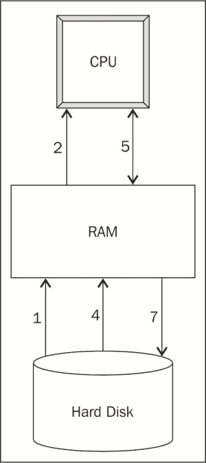
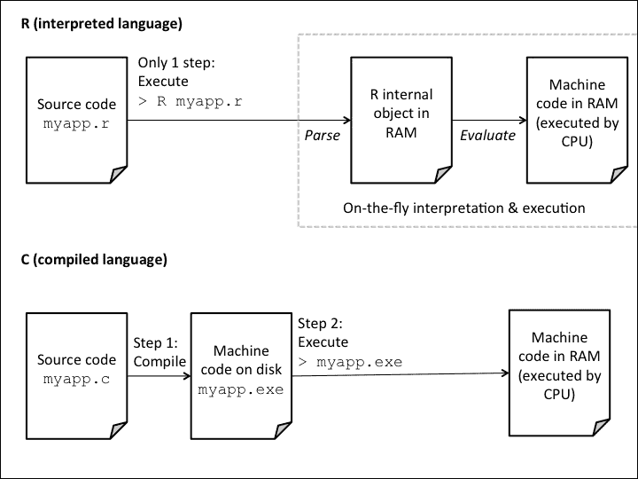
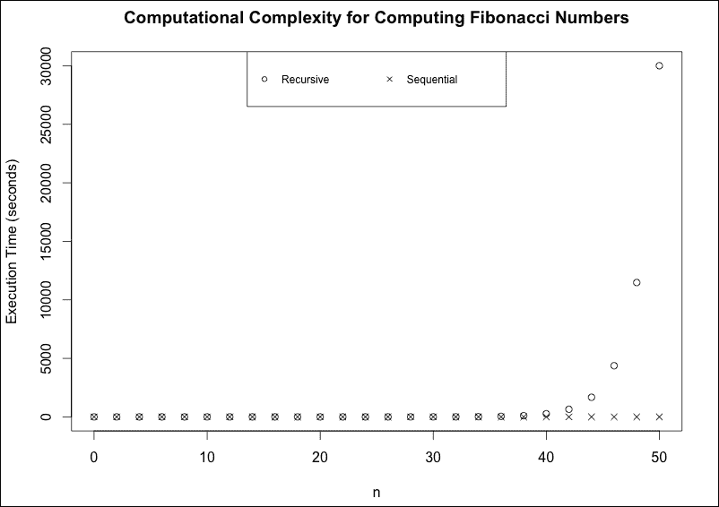

# 第一章. 理解 R 的性能——为什么 R 程序有时运行缓慢？

R 是一个用于统计分析与数据处理的优秀工具。当它在 1993 年首次开发时，它被设计为一个用于教授数据分析课程的工具。由于其使用简便，在接下来的 20 年里，它越来越受欢迎，不仅在学术界，也在政府和企业界。R 还是一个开源工具，因此其用户可以免费使用它，并向 R 公共仓库（称为 **CRAN Comprehensive R Archive Network**）贡献新的统计包。在撰写本书时，随着 CRAN 库的丰富，拥有超过 6,000 个经过良好文档记录且可立即使用的包，R 的吸引力进一步增加。在这 20 年里，组织和个人创造、传输、存储和分析的数据量也呈指数级增长。需要处理和分析不断增长的数据量的 R 程序员有时会发现，在如此重的负载下，R 的性能受到影响。为什么 R 有时表现不佳，我们如何克服其性能限制？本书探讨了 R 性能背后的因素，并提供了各种技术来提高 R 程序的性能，例如优化内存使用、并行计算或甚至利用外部数据处理系统的计算能力。

在我们找到 R 性能问题的解决方案之前，我们需要了解是什么使得 R 在某些情况下表现不佳。本章通过揭开 R 的设计面纱，了解其设计如何限制 R 程序的性能，从而开启了我们对高性能 R 编程的探索。

我们将考察任何计算任务面临的主要限制——CPU、RAM 和磁盘 **输入/输出**（**I/O**）——然后看看这些限制在 R 程序中具体是如何体现的。到本章结束时，你将对你的 R 程序可能遇到的瓶颈有所了解。

本章涵盖了以下主题：

+   计算性能的三个限制因素——CPU、RAM 和磁盘 I/O

+   R 是即时解释的

+   R 是单线程的

+   R 需要将所有数据加载到内存中

+   算法设计影响时间和空间复杂度

# 计算性能的三个限制因素——CPU、RAM 和磁盘 I/O

首先，让我们看看 R 程序在计算机中的执行方式。这是一个非常简化的实际发生情况的版本，但它足以让我们了解 R 的性能限制。以下图展示了执行一个 R 程序所需的步骤。



执行 R 程序的步骤

以这个简单的 R 程序为例，它从 CSV 文件中加载数据，计算列总和，并将结果写入另一个 CSV 文件：

```py
data <- read.csv("mydata.csv")
totals <- colSums(data)
write.csv(totals, "totals.csv")
```

我们使用编号来理解前面的图：

1.  当我们加载和运行一个 R 程序时，R 代码首先被加载到 RAM 中。

1.  然后，R 解释器将 R 代码翻译成机器码，并将机器码加载到 CPU 中。

1.  CPU 执行程序。

1.  程序将从硬盘将待处理的数据加载到 RAM 中（例如示例中的 `read.csv()`）。

1.  数据被分小块加载到 CPU 中进行处理。

1.  CPU 逐块处理数据，并与 RAM 交换数据块，直到所有数据都被处理（在示例中，CPU 执行 `colSums()` 函数的指令来计算数据集的列总和）。

1.  有时，处理过的数据会被存储回硬盘上（例如示例中的 `write.csv()`）。

从这个计算过程的描述中，我们可以看到几个可能发生性能瓶颈的地方：

+   CPU 的速度和性能决定了计算指令，如示例中的 `colSums()`，的执行速度。这包括将 R 代码解释成机器码以及实际执行机器码来处理数据。

+   计算机上可用的 RAM 大小限制了任何给定时间可以处理的数据量。在这个例子中，如果 `mydata.csv` 文件包含的数据量超过了 RAM 的容量，`read.csv()` 的调用将会失败。

+   数据从硬盘读取或写入的速度（例如示例中的 `read.csv()` 和 `write.csv()`），即硬盘输入/输出（I/O）的速度，影响数据加载到内存和存储回硬盘的速度。

有时，你可能会一次遇到这些限制因素中的一个。例如，当数据集足够小，可以快速从磁盘读取并完全存储在 RAM 中，但对其进行的计算很复杂时，那么只会遇到 CPU 限制。在其他时候，你可能会发现它们以各种组合同时出现。例如，当数据集非常大时，从磁盘加载它需要很长时间，在任何给定时间只能将一小部分加载到内存中，并且对它的任何计算都需要很长时间。在两种情况下，这些都是性能问题的症状。为了诊断问题并找到解决方案，我们需要查看幕后可能引起这些限制发生的情况。

现在我们来看看 R 的设计和工作方式，以及它的性能意味着什么。

# R 是即时解释的

在计算机科学术语中，R 被称为一种解释型语言。这意味着每次你执行一个 R 程序时，R 解释器都会即时解释并执行 R 代码。以下图示说明了当你运行任何 R 代码时会发生什么：



解释型语言与编译型语言

R 首先将你的源代码解析成 R 内部对象表示，其中包括 R 代码中的所有语句和表达式。然后 R 评估这个内部 R 对象以执行代码。

这就是为什么 R 是一种如此动态和交互式的编程语言。你可以将 R 语句输入到 R 控制台中并立即得到结果，因为 R 解释器会立即解析和评估代码。这种方法的不利之处在于，R 代码运行相对较慢，因为每次运行它时都需要重新解释，即使它没有改变。

与 C 或 Fortran 这样的**编译型语言**相比，当你使用编译型语言时，你需要在执行之前将源代码编译成机器代码。这使得编译型语言交互性较差，因为编译步骤可能需要几分钟，即使是对于大型程序，即使你只是对代码进行了微小的更改。另一方面，一旦代码被编译，它会在 CPU 上非常快速地运行，因为它已经是计算机的本地语言。

由于 R 是一种解释型语言，每次你运行一个 R 程序时，CPU 都忙于做两件事：解释你的代码和执行其中的指令。因此，CPU 的速度可以限制 R 程序的性能。我们将在第三章到第五章中学习如何克服 CPU 的限制。

# R 是单线程的。

R 在 CPU 上的限制还有另一个方面，即默认情况下，它只在 CPU 的一个线程上运行。无论你在具有 64 个 CPU 核心的强大服务器上安装 R，R 都只会使用其中一个。例如，求一个数值向量的和是一个可以在 CPU 上非常容易并行运行的运算。如果有四个 CPU 核心可用，每个核心可以处理大约四分之一的数据。每个核心计算它所分配的数据块的小计，然后四个小计相加以找到整个数据集的总和。然而，在 R 中，`sum()` 函数是串行运行的，在一个 CPU 核心上处理整个数据集。实际上，许多大数据操作与这里的求和示例具有相似的性质，相同的任务在许多数据子集上独立运行。在这种情况下，顺序执行操作将是今天大多数并行计算架构的浪费。在第八章《通过并行计算提高性能》中，我们将学习如何在 R 中编写并行程序以克服这一限制。

# R 需要将所有数据加载到内存中。

在 R 中处理的所有数据都必须完全加载到 RAM 中。这意味着一旦数据被加载，CPU 就可以对其进行处理，这对于性能来说是非常好的。另一方面，这也意味着你可以处理的数据的最大大小取决于系统上可用的空闲 RAM 量。记住，不是你电脑上的所有 RAM 都可以供 R 使用。操作系统、后台进程以及任何在 CPU 上运行的其他应用程序也会竞争使用 RAM。R 可用的 RAM 可能只是系统上安装的总 RAM 的一部分。

此外，R 还需要足够的 RAM 来存储其计算结果。根据你执行的计算类型，你可能需要的可用 RAM 是数据大小的两倍甚至更多。

R 的 32 位版本也受其可访问的 RAM 量所限制。根据操作系统不同，即使实际上有更多的 RAM 可用，它们可能也仅限于 2 GB 到 4 GB 的 RAM。此外，由于内存地址限制，R 的 32 位版本中的数据结构最多只能包含 *2³¹-1 = 2,147,483,647* 个元素。因为这些限制，你应该尽可能使用 R 的 64 位版本。

### 注意

在 R 3.0 版本之前的所有版本中，即使是 64 位版本，向量和其它数据结构都面临这个 2,147,483,647 个元素的限制。如果你的数据超过了这个大小，你需要使用 R 3.0 或其后续版本的 64 位版本。

当我们尝试加载一个比可用 RAM 大的数据集时会发生什么？有时，数据加载成功，但一旦可用 RAM 被用尽，操作系统开始将 RAM 中的数据交换到硬盘上的交换文件中。这不是 R 的特性；这取决于操作系统。当这种情况发生时，R 认为所有数据都已加载到 RAM 中，而实际上操作系统正在后台努力在 RAM 和硬盘上的交换文件之间交换数据。在这种情况下，我们除了内存瓶颈之外，还遇到了磁盘 I/O 瓶颈。由于磁盘 I/O 非常慢（硬盘的速度通常以毫秒计算，而 RAM 的速度以纳秒计算），这可能导致 R 看起来像是冻结了或者变得无响应。在我们讨论的三个性能限制中，磁盘 I/O 通常对 R 的性能影响最大。

第六章, *减少 RAM 使用的简单技巧* 和 第七章, *在有限 RAM 下处理大型数据集* 将讨论如何优化内存使用以及如何处理无法装入内存的大型数据集。

# 算法设计影响时间和空间复杂度

我们还没有讨论的一个性能因素是你的代码。你运行的计算类型和算法可以对性能产生巨大影响。计算机科学家用复杂度来描述程序的性能特征。特别是，我们关注两种类型的复杂度：

+   **时间复杂度**：这指的是运行 R 程序所需的计算时间与处理的数据大小之间的关系

+   **空间复杂度**：这指的是运行 R 程序所需的内存与处理的数据大小之间的关系

让我们看看时间复杂性的一个例子。假设我们需要编写一个函数来计算第*n*个斐波那契数，即序列 0, 1, 1, 2, 3, 5, 8, 13, …中的数，其中每个数是前两个数的和。一个简单的方法是编写一个递归函数，如下所示：

```py
fibonacci_rec <- function(n) {
    if (n <= 1) {
        return(n)
    }
    return(fibonacci_rec(n - 1) + fibonacci_rec(n - 2))
}
```

由于第*n*个斐波那契数是第*(n-1)*个和第*(n-2)*个斐波那契数的和，这个函数只是调用自身来计算前两个数，然后将它们相加。让我们看看使用`microbenchmark()`函数计算第 25 个斐波那契数需要多长时间，这个函数可以从 CRAN 下载和安装（我们将在第二章中更详细地了解如何使用这个函数，*测量代码的性能*）：

```py
microbenchmark(fibonacci_rec(25), unit = "ms")
## Unit: milliseconds
##               expr      min    lq     mean   median       uq
##  fibonacci_rec(25) 170.1014 179.8 191.4213 183.5275 197.5833
##       max neval
##  253.1433   100
```

中位时间是 184 毫秒。由于递归的工作方式，存在大量的不必要的重复。例如，为了计算第 25 个斐波那契数，我们需要计算序列中的第 23 个和第 24 个数。但是，计算第 24 个数也涉及到计算第 23 个数，所以第 23 个数被计算了两次。而第 22 个数是计算第 23 个和第 24 个数所必需的，以此类推。

我们可以通过只计算每个数字一次来减少这种重复。以下代码展示了斐波那契函数的另一种实现方式，它正是这样做的。它按顺序从最小到最大计算斐波那契数，并在数值向量`fib`中记住已计算的数字。因此，每个斐波那契数只计算一次：

```py
fibonacci_seq <- function(n) {
    if (n <= 1) {
        return(n)
    }
    # (n+1)th element of this vector is the nth Fibonacci number
    fib <- rep.int(NA_real_, n + 1)
    fib[1] <- 0
    fib[2] <- 1
    for (i in 2:n) {
        fib[i + 1] <- fib[i] + fib[i - 1]
    }
    return(fib[n + 1])
}
```

### 提示

**下载示例代码**

你可以从你购买的所有 Packt 书籍的账户中下载示例代码文件。[`www.packtpub.com`](http://www.packtpub.com)。如果你在其他地方购买了这本书，你可以访问[`www.packtpub.com/support`](http://www.packtpub.com/support)并注册，以便将文件直接通过电子邮件发送给你。

通过基准测试这个顺序函数，我们发现它运行的中位时间是 0.04 毫秒，比递归版本减少了 99.98%！

```py
microbenchmark(fibonacci_seq(25), unit = "ms")
## Unit: milliseconds
##               expr     min       lq      mean    median      uq
##  fibonacci_seq(25) 0.03171 0.036133 0.0446416 0.0405555 0.04459
##                        max neval
##                   0.114714   100
```

为了演示时间复杂度的概念，我们对*n*从 0 到 50 的不同值进行了基准测试。中位执行时间如下所示：



斐波那契函数递归版本与顺序版本的执行时间对比

随着我们增加*n*的值，斐波那契函数递归版本的执行时间呈指数增长。它大约与*1.6^n*成比例——每次*n*增加 1，它大约乘以 1.6 倍。执行时间增长如此之快，以至于在计算第 50 个斐波那契数之后，计算时间过长。另一方面，尽管从图表上看不出，但顺序版本的执行时间呈线性增长——每次*n*的增加会使执行时间增加 1.3 微秒。由于顺序版本的计算复杂度远低于递归版本，随着*n*的增加，它的性能将表现得更好。作为一个例子，当*n=50*时，顺序版本仅用了几分之一毫秒就完成了计算，而递归版本则用了超过八个小时！

虽然我们在这里不会这样做，但可以进行类似的练习来比较不同算法的空间复杂度。给定一定量的计算资源，您选择的算法和代码的设计可以对您的 R 程序实现所需性能水平的能力产生重大影响。

# 摘要

在本章中，我们了解了 R 程序有时会遇到计算性能面临的三个约束——CPU、RAM 和磁盘 I/O。我们探讨了 R 的设计，并学习了其解释性和单线程特性如何导致其运行缓慢，以及当数据太大而无法适应 RAM 时，它如何遇到内存和磁盘 I/O 限制。最后，我们通过比较两个具有非常不同性能特性的斐波那契函数实现来了解 R 代码的设计在确定性能方面的重要作用。

这些性能问题并非不可克服。本书的其余部分将向您展示不同的方法来克服或绕过这些问题，并释放 R 的潜在能力。
