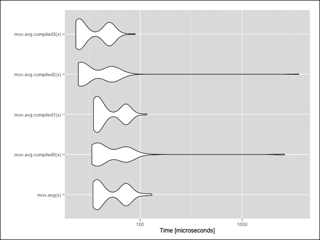

# 第四章：使用编译型代码以获得更高的速度

到目前为止，我们已经探讨了如何优化 R 代码的计算性能。如果在优化代码之后，它仍然运行得太慢怎么办？在本章中，我们将探讨如何通过使用编译型代码来克服由 R 代码即时解释引起的性能限制。许多 CRAN 包使用编译型代码以提供最佳性能，因此利用编译型代码的一个简单方法就是使用这些包。然而，有时需要执行一个特定的任务，而这个任务没有现成的包。了解如何为 R 编写编译型代码，以便使 R 程序运行得更快是有用的。

我们将首先了解如何在执行之前编译 R 代码，然后我们将探讨如何将 C/C++等编译型语言集成到 R 中，以便我们可以以本地 CPU 速度运行 R 程序。

本章涵盖了以下主题：

+   在执行之前编译 R 代码

+   在 R 中使用编译型语言

# 在执行之前编译 R 代码

在第一章中，*理解 R 的性能 – 为什么 R 程序有时运行得慢？* 我们看到了 R 作为一个解释型语言，每次运行 R 程序时都必须解析和评估代码。这需要大量的 CPU 时间，并减慢了 R 程序的执行速度。R 提供了`compiler`包来在一定程度上减少这个问题。该包中的函数允许我们在执行代码之前预先编译 R 代码，并在执行代码时为 R 节省一步或两步。让我们看看这是如何工作的。

## 编译函数

让我们定义一个`mov.avg()`函数，该函数用于计算数值序列的移动平均：

```py
# Compute the n-period moving average of x
mov.avg <- function(x, n=20) {
    total <- numeric(length(x) - n + 1)
    for (i in 1:n) {
        total <- total + x[i:(length(x) - n + i)]
    }
  total / n
}
```

给定一个数值向量`x`和周期`n`，我们首先计算`x`中`n`个元素的窗口总和。例如，如果`x`是`[1, 2, 1, 3, 5]`且`n`是`2`，那么我们计算`total`为`[1+2, 2+1, 1+3, 3+5] = [3, 3, 4, 8]`。我们通过在`x`上循环`n`次，选择`x`的元素移动窗口，并将这些元素加到`total`上来实现这一点。最后，我们通过将`total`除以`n`来计算移动平均。

为了编译函数，我们将使用`compiler`包中的`cmpfun()`函数。`compiler`包提供的编译函数在四个不同的优化级别上操作，编号为 0 到 3；数字越高，编译型代码对性能的优化程度就越高。

让我们编译不同级别的`mov.avg()`函数，以查看执行时间的差异。在这里，我们通过将`optimize`参数传递给`cmpfun()`函数，创建了四个在不同优化级别编译的`mov.avg()`函数副本：

```py
library(compiler)
mov.avg.compiled0 <- cmpfun(mov.avg, options=list(optimize=0))
mov.avg.compiled1 <- cmpfun(mov.avg, options=list(optimize=1))
mov.avg.compiled2 <- cmpfun(mov.avg, options=list(optimize=2))
mov.avg.compiled3 <- cmpfun(mov.avg, options=list(optimize=3))
```

接下来，我们将通过计算包含`100`个元素的数值向量的 20 期移动平均，来基准测试原始的`mov.avg()`函数和四个编译版本的性能：

```py
library(microbenchmark)
x <- runif(100)
bench <- microbenchmark(mov.avg(x),
                        mov.avg.compiled0(x),
                        mov.avg.compiled1(x),
                        mov.avg.compiled2(x),
                        mov.avg.compiled3(x))
bench
## Unit: microseconds
##                  expr    min      lq  median      uq      max
##            mov.avg(x) 34.257 37.6865 41.3630 72.3015  131.101
##  mov.avg.compiled0(x) 33.500 36.9065 41.9995 72.8770 2605.917
##  mov.avg.compiled1(x) 34.643 36.8615 41.0650 71.8480  117.632
##  mov.avg.compiled2(x) 24.050 25.9040 28.3060 51.8685 3693.741
##  mov.avg.compiled3(x) 23.399 24.6540 27.7670 49.6385   89.595
##  neval
##    100
##    100
##    100
##    100
##    100
```

从中位执行时间来看，原始函数需要 41.4 μs。优化级别 0 和 1 的编译函数耗时大致相同，分别为 42.0 μs 和 41.1 μs。然而，优化级别 2 和 3 的表现良好，分别为 28.3 μs 和 27.8 μs。它们分别将执行时间减少了 32% 和 33%。

最小下四分位数和最大上四分位数的统计量显示与 `mov.avg.compiled2()` 和 `mov.avg.compiled3()` 执行时间少于 `mov.avg()`、`mov.avg.compiled0()` 和 `mov.avg.compiled1()` 相似。

### 注意

我们不应该依赖于最大统计量，因为它可能是不稳定的，每次运行 `microbenchmark()` 时都会产生广泛的价值范围。这是由于 R 的垃圾回收时的异常值，或者当函数的执行因与其他进程竞争 CPU 时间而减慢时。

下面的图表以直观的视觉形式显示了基准测试结果的分布。

### 小贴士

使用 `autoplot()` 函数生成基准测试结果的直观可视化。为此需要 `ggplot2` 包：

```py
library(ggplot2)
autoplot(bench)
```



移动平均函数的微基准测试结果的自动绘图

当 R 代码编译时的性能提升取决于代码中包含的 R 表达式的类型。在我们的例子中，我们实现了适度的性能提升，因为 `mov.avg()` 函数中的 `for` 循环和算术运算可以被优化。然而，编译主要调用已经为性能优化过的其他函数（如 `sum()`）的代码不会导致显著的性能提升。

### 小贴士

`compiler` 包提供了不同的函数来编译不同类型的 R 代码：

+   `cmpfun()` 编译 R 函数。

+   `compile()` 编译 R 表达式。

+   `cmpfile()` 编译存储在文件中的 R 表达式。

## R 代码的即时（JIT）编译

R 也支持**即时**（**JIT**）**编译**。当启用 JIT 编译时，R 将自动编译任何执行而未显式调用 `compile` 函数之一的代码。这是方便的，因为任何现有的 R 代码都可以享受代码编译的性能提升，而无需任何修改。

要激活 JIT 编译，请使用 `compiler` 包中的 `enableJIT()` 函数：

```py
library(compiler)
enableJIT(level=3)
```

`level` 参数告诉 R 在执行前编译多少代码。`level` 的有效值包括：

+   `0`：它禁用 JIT。

+   `1`：它在首次使用之前编译函数。

+   `2`：此外，它还在函数被复制之前编译函数。这对于像 lattice 这样的存储函数在列表中的包很有用。

+   `3`：它在执行之前编译循环。

让我们用即时编译（JIT）来基准测试（未编译的）`mov.avg()` 函数：

```py
microbenchmark(mov.avg(x))
## Unit: microseconds
##        expr    min     lq median     uq      max neval
##  mov.avg(x) 23.164 24.009 24.519 25.128 6097.067   100
```

JIT 编译将 `mov.avg()` 的中位执行时间从 41.4 μs 降低到 24.5 μs——提高了 41%！

### 小贴士

通过在启动 R 之前在操作系统中设置`R_ENABLE_JIT`环境变量，也可以启用 JIT 编译。`R_ENABLE_JIT`的值应设置为`level`参数的值。

# 在 R 中使用编译型语言

代码编译可以在计算性能上提供一定的提升，但这些提升是有限的，因为编译后的代码仍然需要以动态方式由 R 进行评估。例如，我们在第三章中解释了*简化 R 运行速度的方法*，说明了 R 作为一种**动态类型**的语言，在应用任何操作之前需要检查对象类型。在`mov.avg()`的情况下，每次 R 遇到`+`运算符时，都需要检查`x`是否为数值向量，因为它可能在`for`循环的每次迭代中都被修改。相比之下，一种**静态类型**的语言在编译时执行这些检查，从而实现更快的运行时性能。

由于 R 的动态特性以及许多其他原因，R 的动态特性对计算性能构成了障碍。突破这些障碍的唯一方法是转向 C 等编译型语言，并在 R 中使用它们。本节假设您对 C/C++等编译型语言有一些基本了解，包括指针和数组。

## 先决条件

为了编译本章中的示例，需要一套开发工具，包括 C/C++ 编译器。

Windows 用户应从[`cran.r-project.org/bin/windows/Rtools/`](http://cran.r-project.org/bin/windows/Rtools/)下载并安装`Rtools`。请选择与您的 R 版本相对应的`Rtools`版本。在安装向导中，务必选择**包作者安装**和**编辑系统 PATH**选项。

在 Mac OS X 上，下载并安装 *Xcode 命令行工具*。如果您使用的是 Mac OS X 10.9 Mavericks 或更高版本，只需在终端中运行`xcode-select –install`即可。对于更早版本的 Mac OS X，请在 [`developer.apple.com/`](http://developer.apple.com/) 创建一个开发者账户。然后登录，转到 [`developer.apple.com/downloads/index.action`](https://developer.apple.com/downloads/index.action) 并搜索适用于您操作系统版本的 Xcode 命令行工具。

大多数 Linux 发行版都提供了一种简单的方法来安装标准开发工具；请查阅您发行版的文档以获取说明。如果您使用的是 Debian 或 Ubuntu，只需安装`r-base-dev`即可获得您需要的所有工具。

## 内联包含编译代码

`inline` CRAN 包允许我们在 R 中嵌入 C、C++、Objective-C、Objective-C++ 和 Fortran 代码。这对于使用少量编译代码加速小的 R 函数非常有用。

下面是一个使用`inline`包在 C 中实现`mov.avg()`的示例：

```py
library(inline)
mov.avg.inline <- cfunction(
    sig=signature(x="numeric", n="integer"),
    body="
        /* Coerce arguments to the correct types needed.
           x needs to be a numeric vector (type REALSXP), and n
           needs to be an integer vector (type INTSXP). */
        SEXP x2 = PROTECT(coerceVector(x, REALSXP));
        SEXP n2 = PROTECT(coerceVector(n, INTSXP));

        /* Create accessors to the actual data being pointed to by
           the two SEXP's. */
        double *x_p = REAL(x2);
        int n_val = asInteger(n2);

        // Vector lengths
        int x_len = length(x2);
        int res_len = x_len - n_val + 1;

        /* Create and initialize a numeric vector (type REALSXP)
           of length res_len, using allocVector().
           Since memory is allocated, use PROTECT to protect the
           object from R's garbage collection. */
        SEXP res = PROTECT(allocVector(REALSXP, res_len));
        double *res_p = REAL(res);
        for (int i = 0; i < res_len; i++) {
            res_p[i] = 0;
        }

        // Compute window sum
        for (int j = 0; j < n_val; j++) {
            for (int k = 0; k < res_len; k++) {
                res_p[k] += x_p[j + k];
            }
        }

        // Compute moving average
        for (int l = 0; l < res_len; l++) {
            res_p[l] /= n_val;
        }

        // Unprotect allocated memory and return results
        UNPROTECT(3);
        return res;
    ',
    language="C"
    )
```

我们加载 `inline` 包，并使用 `cfunction()` 定义 `mov.avg.inline()`。`cfunction()` 接受许多参数（更多细节请查阅文档），但这里我们只需要三个：

+   `sig=signature(x="numeric", n="integer")`: 这定义了函数的签名。在这种情况下，它将看起来像 `mov.avg.inline(x, n)`，其中 `x` 具有数值类，而 `n` 具有整数字类。

+   `body`: `body` 参数包含函数主体的代码，使用你选择的编程语言。

+   `language="C"`: 这指定了代码主体中的编程语言。有效的值有 `C,` `C++`, `Fortran`, `F95`, `ObjectiveC`, 和 `ObjectiveC++`。

函数的第一步是通过调用 `coerceVector()` 确保提供给函数的参数是正确的类型。这个函数返回一个 `SEXP`（s 表达式）指针，这是在 C 和 C++ 中表示所有 R 对象的方式。这些指针指向存储数据的 `SEXPREC`（s 表达式）记录结构，并包含一些头部信息。代码的前两行定义了两个新的 `SEXP` 变量 `x2` 和 `n2`，它们存储了通过强制转换函数参数创建的新 R 对象的指针。

因为 `coerceVector()` 在内存中创建新的数据结构来存储指定类型的数据，所以我们用宏函数 `PROTECT()` 包裹对 `coerceVector()` 的调用，以保护新创建的数据结构免受 R 的垃圾回收机制的影响。这是必要的，因为 R 不会知道在 C 中何时变量不再需要，并且可能会过于积极地为仍然需要的对象释放内存。每次为新的 R 对象分配内存时都需要调用 `PROTECT()`。

现在 `x2` 和 `n2` 包含了 R 对象的 `SEXP` 指针，这些对象代表了强制转换后的参数。因为 `x2` 和 `n2` 指向 `SEXPREC` 结构，所以我们仍然无法直接访问存储数据的 C 数组。有几种方法可以获取对数据的访问权限。在 `double *x_p = REAL(x2);` 中，`REAL()` 宏返回一个指向双精度浮点数组第一个元素的 `double*` 指针。`int n_val = asInteger(n2);` 声明通过调用 `asInteger()` 便利函数以不同的方式返回由 `n2` 指向的数组中的第一个整数值。注意这里的区别；`x_p` 是指向双精度数组的指针，而 `n_val` 是包含参数实际值的整数。根据哪种方式更方便，可以使用这两种方式访问 R 数据。

接下来，我们计算将要存储结果的数值向量的长度 `res_len`，并使用 `allocVector()` 创建该向量。同样，这也被 `PROTECT()` 包裹起来，因为正在为新的对象分配内存。这个表达式的结果是指向新 R 数值向量的 `SEXP`。`REAL(res)` 提供了对之前提到的底层 C 双精度浮点数组的访问。

下一个嵌套的`for`循环对`n_val`周期内的窗口和进行计算。然后，通过将结果数组中的每个元素除以`n_val`来计算移动平均。

在返回结果之前，需要进行一些清理工作。`UNPROTECT(3)`告诉 R，为 C 中分配内存的三个对象不再需要垃圾收集保护。`UNPROTECT()`的参数必须与函数中`PROTECT()`调用的次数相匹配。在这种情况下，垃圾收集器可能会释放`x2`和`n2`的内存。然而，`res`对象被返回到 R，其中适用正常的垃圾收集机制。

让我们通过调用原始的`mov.avg()`函数和`mov.avg.inline()`，并确保值匹配来进行一个简单的测试，以确保我们的代码工作正常：

```py
x <- runif(100)
all(mov.avg(x, 20) == mov.avg.inline(x, 20))
## [1] TRUE
```

C 代码将比原始未编译的 R 函数快多少？这如下所示：

```py
microbenchmark(mov.avg(x, 20), mov.avg.inline(x, 20))
## Unit: microseconds
##                  expr    min     lq  median      uq     max
##        mov.avg(x, 20) 32.909 34.113 34.8240 35.6975 130.155
## mov.avg.inline(x, 20)  1.347  1.423  1.5535  1.7015  14.169
## neval
##   100
##   100
```

C 代码的平均执行时间仅为 1.55 μs，而 R 代码为 34.8 μs——执行时间减少了 96！即使是 C 代码的最大执行时间（14.2 μs）也小于 R 代码的最小执行时间（32.9 μs）的一半。这些微秒的节省可能看起来不多，但当我们需要处理更大的数据集或计算较大周期的移动平均时，这种差异变得非常显著：

```py
y <- runif(1e7)
microbenchmark(mov.avg(y, 20), mov.avg.inline(y, 20))
## Unit: milliseconds
##                  expr       min        lq    median       uq
##        mov.avg(y, 20) 2046.4608 2198.6103 2252.7003 2318.721
## mov.avg.inline(y, 20)  272.8686  280.2837  283.3647  292.587
##       max neval
## 3606.3911   100
##  374.0193   100
```

当数据包含 1000 万个数字时，差异更为明显；在 R 中超过 2 秒，而在 C 中仅为 0.28 秒。在某些商业环境中，每一毫秒都很重要，2 秒的延迟是不可接受的。在这种情况下，将关键的数据处理代码编写为 C 或 Fortran 等编译语言，并通过`inline`将其嵌入到 R 中，将极大地提高计算性能。

## 调用外部编译代码

我们已经看到了如何使用编译语言在 R 中定义函数。当我们想要使用编译代码实现更复杂的功能时，例如创建整个 R 包或链接到外部库，从外部开发代码并从 R 中调用它可能更容易。

R 提供了一些接口来调用外部编译代码：

+   `.C()`: 这将调用最多 65 个参数的 C 或 C++代码。在调用 C 函数之前，必须在 R 中进行类型检查和强制转换。由`.C()`调用的函数不应返回任何值；相反，当函数被调用时，应该将数据结构中存储的结果提供给函数。例如，如果我们使用`.C()`接口实现`mov.avg()`，函数调用可能看起来像`.C("mov_avg_C", as.numeric(x), as.integer(n), numeric(length(x) - n + 1))`。

+   `.Fortran()`: 这与`.C()`类似，但它调用 Fortran 代码。

+   `.Call()`：这也调用 C 或 C++代码，最多 65 个参数。类型检查和强制转换可以在 R 或 C/C++（如`mov.avg.inline()`示例中）中进行。由`.Call()`调用的函数可以返回 R 对象。如果需要多个返回值，可以返回 R 列表。例如，`ma <- .Call("mov_avg_C", x, n)`。

+   `.External()`：这与`.Call()`类似，除了所有参数都通过单个`SEXP`传递。因此，使用`.External()`调用的函数可以接受可变数量的参数和几乎无限数量的参数。

`inline`包提供的函数实际上是某些低级接口的包装器，这使得开发人员更容易将编译代码嵌入 R 中。

本书范围之外，无法详细解释如何使用这些接口。要了解更多信息，请阅读《编写 R 扩展》手册中的“系统与外语接口”和“R API”部分（更多信息请访问[`cran.r-project.org/doc/manuals/r-release/R-exts.html`](http://cran.r-project.org/doc/manuals/r-release/R-exts.html))。

### 注意

对于 Java 程序员，CRAN 上的`rJava`包提供了对 Java 代码的接口。

相反，我们想介绍`Rcpp`包，它提供了一个方便的、高级的 API 来访问`.Call()`接口，用于 C++代码。以下是使用`Rcpp`实现的移动平均函数：

```py
#include <Rcpp.h>

// [[Rcpp::export]]
Rcpp::NumericVector mov_avg_Rcpp(Rcpp::NumericVector x,
                                 int n=20) {
    // Vector lengths
    int x_len = x.size();
    int res_len = x_len - n + 1;

    // Create and initialize vector for results
    Rcpp::NumericVector res(res_len);

    // Compute window sum
    for (int j = 0; j < n; j++) {
        for (int k = 0; k < res_len; k++) {
            res[k] += x[j + k];
        }
    }

    // Compute moving average
    for (int l = 0; l < res_len; l++) {
        res[l] /= n;
    }

    // Return results
    return res;
}
```

第一行`#include <Rcpp.h>`导入使用`Rcpp`类和函数所需的头文件。注释`// [[Rcpp::export]]`是`Rcpp`属性。它告诉`Rcpp`以下函数应该导出到 R。

在`mov_avg_Rcpp()`中不使用`SEXP`指针。相反，`Rcpp`提供了表示标准 R 类的类。我们甚至可以指定`n`是一个单个整数而不是整数向量。每当从 R 调用`mov_avg_Rcpp()`时，`Rcpp`将自动检查提供的参数是否为正确的类型。

注意，这里没有调用`PROTECT()`或`UNPROTECT()`。当`Rcpp::NumericVector res(res_len);`创建一个新的结果数值向量时，`Rcpp`负责内存分配和防止垃圾回收。它甚至将新向量的值初始化为零。

`Rcpp`还提供了直接访问`x`参数中的数据和结果向量`res`的功能，而无需请求数据的指针。

使用`Rcpp`，我们可以编写比使用本地的`.C()`或`.Call()`接口更简洁、更易读的代码。

现在，让我们看看如何在 R 中调用此函数。除了加载`Rcpp`库之外，还需要做的一件事是调用`sourceCpp()`，这将编译 C++代码并将函数导出到 R：

```py
library(Rcpp)
sourceCpp('mov_avg_Rcpp.cpp")
```

现在，我们可以调用`mov_avg_Rcpp()`并对其进行基准测试，与之前的版本进行比较：

```py
x <- runif(100)
microbenchmark(mov.avg(x, 20),
               mov.avg.inline(x, 20),
               mov_avg_Rcpp(x, 20))
## Unit: microseconds
##                  expr    min     lq median      uq     max
##        mov.avg(x, 20) 33.902 35.779 37.472 49.7340 101.325
## mov.avg.inline(x, 20)  1.327  1.513  1.718  1.9655  14.129
##   mov_avg_Rcpp(x, 20)  2.382  2.727  2.874  3.9705  11.424
## neval
##   100
##   100
##   100
```

`Rcpp` 版本比内联版本运行得稍慢，但仍然比我们的纯 R 代码快得多。它提供了一个良好的性能水平，API 比其他 R 提供的接口简单得多。

`Rcpp` 提供了许多本书无法涵盖的功能，例如包作者工具、常见操作（如向量操作）的 `sugar` 函数等。更多详情、代码示例和资源，请查阅 `Rcpp` 网站 [`www.rcpp.org/`](http://www.rcpp.org/)。`Rcpp` 的创作者之一，Dirk Eddelbuettel，还撰写了 *Seamless R and C++ Integration with Rcpp (use R!)* 一书，提供了全面的指南。

## 使用编译代码时，有一些注意事项需要记住。我们将在下面解释一些常见的；*Writing R Extensions* 手册对这些主题提供了全面的处理。

在 R 中使用编译代码时，有一些事情需要记住。我们将在下面解释一些常见的；*Writing R Extensions* 手册对这些主题提供了全面的处理。

### R API

到目前为止使用的 C 函数和宏来自头文件 `Rinternals.h`，该文件位于 `R_INCLUDE_DIR`，在标准 R 安装中默认为 `R_HOME/include`。此文件，连同 `R.h` 和 `R_INCLUDE_DIR` 中的其他头文件，为 C/C++ 代码提供了与 R 交互的各种 API。它们一起提供了一组丰富的函数，用于：

+   操作 R 对象（例如，排序向量）

+   管理内存分配和释放

+   数学（例如，三角函数）

+   数学常数

+   随机数生成

+   统计分布（例如，`rnorm` 和 `punif`）

+   BLAS、LAPACK 和 LINPACK 线性代数例程

+   以及更多

值得探索这些文件，以了解哪些功能可用于 C/C++ 代码。其中一些也可以从 Fortran 调用。*Writing R Extensions* 中的 *Organization of header files* 部分描述了每个头文件。

### R 数据类型与本地数据类型

在使用编译语言工作时，了解 R 类型如何映射到不同的本地数据类型是有用的，如下表所示：

| R 存储模式 | C 类型 | Fortran 类型 |
| --- | --- | --- |
| `logical` | `int *` | `INTEGER` |
| `integer` | `int *` | `INTEGER` |
| `double` | `double *` | `DOUBLE PRECISION` |
| `complex` | `Rcomplex *` | `DOUBLE COMPLEX` |
| `character` | `char **` | `CHARACTER*255` |
| `raw` | `unsigned char *` | `none` |

在处理 C/C++ 中的 `SEXP` 指针或在 `Rcpp` 中的类型类时，以下是最常用的类型（查阅 R 或 `Rcpp` 的文档以获取完整列表）：

| R 类型 | SEXP 类型 | Rcpp 类型 |
| --- | --- | --- |
| `numeric` | `REALSXP` | `NumericVector / NumericMatrix` |
| `integer` | `INTSXP` | `IntegerVector / IntegerMatrix` |
| `complex` | `CPLXSXP` | `ComplexVector / ComplexMatrix` |
| `logical` | `LGLSXP` | `LogicalVector / LogicalMatrix` |
| `character` | `STRSXP` | `CharacterVector / CharacterMatrix` |
| `list` | `VECSXP` | `List` |
| `data.frame` | `none` | `DataFrame` |

### 创建 R 对象和垃圾回收

我们已经看到，可以通过调用`allocVector()`和`coerceVector()`来创建 R 对象并为它们分配内存。`Rinternals.h`定义了其他内存分配函数，例如`allocList()`和`allocArray()`。对`alloc*()`函数或`coerceVector()`的任何调用都需要用`PROTECT()`包装。

在`mov.avg.inline()`示例中，`UNPROTECT()`用于在返回结果之前立即移除垃圾收集保护。`UNPROTECT()`也可以在任何函数点调用，以允许垃圾收集器释放不再需要的 R 对象。保护机制是基于堆栈的，因此`UNPROTECT(n)`移除了最后被保护的`n`个对象的保护。或者，可以使用`UNPROTECT_PTR(p)`来解除`SEXP` `p`指向的特定对象的保护，即使它不在堆栈的顶部。

在创建许多 R 对象的复杂 C/C++代码中，一旦它们不再需要，就解除保护它们是一种良好的实践，这样垃圾收集器就可以高效地工作。然而，确保那些未受保护的对象在代码中不再被使用是程序员的职责，以防止任何内存错误。

最后，始终记得将`PROTECT()`调用的数量与`UNPROTECT()`或`UNPROTECT_PTR()`未解除保护的对象总数相匹配。

### 为非 R 对象分配内存

有时，需要内存来存储中间计算的结果，这些结果不需要从 R 中访问。R 提供了两种在 C/C++中分配这种内存的方法。

第一种方法，**瞬态存储分配**，允许您分配在`.C()`、`.Call()`或`.External()`调用结束时由 R 自动回收的内存。为此，使用`char *R_alloc(size_t n, int size)`函数，该函数分配每个`size`字节的`n`个单元，并返回指向分配内存的指针。典型的用法可能如下所示：

```py
int *x = (int *) R_alloc(100, sizeof(int));
```

在 C/C++函数内不需要释放分配的内存，因为当函数执行结束时，R 会负责处理。

**用户控制的内存**机制提供了对内存分配和释放的更多控制。这允许在 C/C++代码的不同部分之间释放内存。例如，在一个迭代算法中，每个计算阶段都会产生大量中间数据，可以释放之前迭代的内存，以确保有足够的空闲内存来完成未来的迭代。此接口中有三个函数：

+   `type* Calloc(size_t n, type)`: 这会分配指定大小和类型的内存

+   `type* Realloc(any *p, size_t n, type)`: 这会将`*p`处分配的内存的大小更改为指定的大小和类型

+   `void Free(any *p)`: 这会释放`*p`处的内存

这些函数类似于 C 函数`calloc()`、`realloc()`和`free()`，但 R 增加了额外的错误处理。如果它们返回，则表示内存已成功分配或释放。

# 摘要

在本章中，我们介绍了一系列技术，用于在编译型语言中利用代码以实现接近原生 CPU 的性能。虽然示例主要集中在 C 和 C++上，但类似的策略也可以用于 Fortran 或 Java。

我们首先看到，通过使用`compile`包在执行 R 代码之前对其进行编译，可以提供适度的性能提升，特别是对于包含许多循环和基本操作的代码。JIT 编译对执行任何 R 代码也自动执行相同的操作。然而，由于 R 在核心上是动态语言，R 代码的优化程度是有限的。

超越 R 语言，我们使用了 C 和 C++来实现显著的性能提升。我们学习了如何在 R 中使用`inline`包定义 C 函数，以及如何使用`Rcpp`从 R 中调用外部 C++函数。

在这个过程中，我们了解了 R 如何使用`SEXP`指针和`SEXPREC`记录结构在 C/C++中表示不同类型的数据，以及如何使用这些结构来操作 R 对象。我们还学习了在 C/C++中工作时的内存分配、释放和垃圾回收的复杂性。

最后，我们简要介绍了 R API，这些 API 可以从 C、C++或 Fortran 中提供丰富的 R 功能。

本章介绍了在 R 中使用编译型语言实现优化计算性能的高级技术。这些技术允许 R 程序员利用编译型语言的力量和速度，同时享受 R 作为数据处理环境的简单性和灵活性。使用编译型语言带来的巨大性能提升伴随着同样巨大的责任，即详细了解这些技术的工作原理，以确保它们可以安全有效地使用。关于这个主题，可以写出整本书；我们鼓励您查阅其他资源，包括*编写 R 扩展*手册，以获得更深入和更全面的处理。

在下一章中，我们将探讨如何利用**图形处理单元**（**GPU**）的计算能力来处理某些类型的计算。
