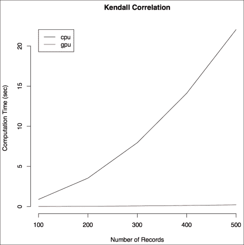
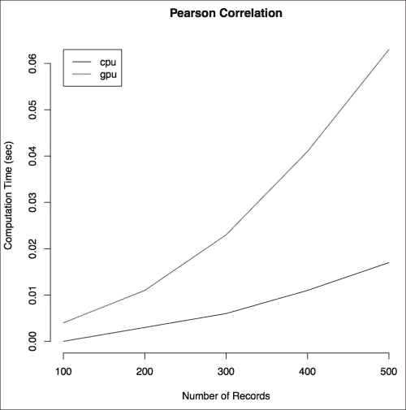

# 第五章：使用 GPU 使 R 运行更快

在本章中，我们将探讨另一种方法来加速 R 代码的执行，这种方法通常未被充分利用，尽管它是大多数计算机的一部分——**图形处理单元**（**GPU**），也称为显卡。当我们想到 GPU 时，我们常常想到它能够产生的惊人图形。实际上，GPU 由具有高度并行处理能力的科技驱动，这些科技类似于世界上顶级的超级计算机。在过去，使用 GPU 进行编程非常困难。然而，在过去的几年里，随着 CUDA 和 OpenCL 等 GPU 编程平台的推出，编程 GPU 对许多程序员来说变得容易多了。更好的是，R 社区为 R 用户开发了一些包，以便利用 GPU 的计算能力。

要运行本章中的示例，您需要一个具有 CUDA 功能的 NVIDIA GPU。

本章涵盖：

+   GPU 上的通用计算

+   R 和 GPU

+   使用 `gputools` 在 R 中进行快速统计建模

# GPU 上的通用计算

从历史上看，GPU 是设计和用于渲染高分辨率图形的，例如用于视频游戏。为了能够每秒渲染数百万个像素，GPU 利用高度并行的架构，专门用于渲染图形所需的计算类型。从高层次来看，GPU 的架构类似于 CPU 的架构——它有自己的多核处理器和内存。然而，由于 GPU 不是为通用计算设计的，与 CPU 相比，单个核心要简单得多，时钟速度较慢，对复杂指令的支持有限。此外，它们通常比 CPU 少有 RAM。为了实现实时渲染，大多数 GPU 计算都是以高度并行的方式进行的，拥有比 CPU 多得多的核心——现代 GPU 可能拥有超过 2,000 个核心。鉴于一个核心可以运行多个线程，在 GPU 上可以运行数万个并行线程。

在 20 世纪 90 年代，程序员开始意识到，某些图形渲染之外的计算可以从 GPU 的高度并行架构中受益。还记得 R 中 第三章 中向量操作的尴尬并行性吗，*通过简单调整使 R 运行更快*；想象一下，如果它们由数千个 GPU 核心同时完成，会有多大的加速潜力。这种认识催生了 GPU 上的通用计算（GPGPU）。

但编程 GPU 具有挑战性。使用由 DirectX 和 OpenGL 等标准提供的低级接口，程序员必须欺骗 GPU 以计算数字，就像它们在渲染图形一样。意识到这一挑战，人们开始努力开发适合 GPGPU 的适当编程语言和支持架构。这些努力的成果是两种称为 CUDA 和 OpenCL 的技术，分别由 NVIDIA 和 Apple 开发，现在由 Khronos 维护。虽然 CUDA 是专有的，并且仅在 NVIDIA GPU 上工作，但 OpenCL 是品牌无关的，甚至能够支持其他加速器，如**现场可编程门阵列**（**FPGAs**）。

# R 和 GPU

R 社区已经开发了一些包，供 R 程序员利用 GPU。R 的矢量化特性使得使用 GPU 成为一种自然的选择。这里列出了用于 GPU 编程的一些 R 包：

+   `gputools`: 这提供了围绕基于 GPU 的算法的 R 函数，用于常见操作，如线性模型和矩阵代数。它需要 CUDA，因此需要一个 NVIDIA GPU。

+   `gmatrix`: 这提供了`gmatrix`和`gvector`类，分别用于在 NVIDIA GPU 上表示矩阵和向量。它还提供了用于常见矩阵操作（如矩阵代数、随机数生成和排序）的函数。

+   `RCUDA`: 这为从 R 会话中加载和调用 CUDA 内核提供了一个低级接口。使用 RCUDA 需要很好地理解 CUDA 语言，但允许更多的灵活性和代码优化。更多关于它的信息可以在[`www.omegahat.org/RCUDA/`](http://www.omegahat.org/RCUDA/)找到。

+   `OpenCL`: 这与 RCUDA 类似，但与 OpenCL 接口。它适用于拥有非 NVIDIA GPU（如 ATI、Intel 或 AMD GPU）的用户。

其他 CRAN 包可用于 GPU 上的更多专用功能，例如线性回归。有关这些包的列表，请参阅由 Dirk Eddelbuettel 在 CRAN 网站上维护的*CRAN 任务视图：使用 R 进行高性能和并行计算*的 GPU 部分，网址为[`cran.r-project.org/web/views/HighPerformanceComputing.html`](http://cran.r-project.org/web/views/HighPerformanceComputing.html)。

在本章中，我们将仅关注`gputools`，并使用该包的一些示例来说明 GPU 如何加快 R 中的计算速度。

## 安装 gputools

安装`gputools`的步骤如下：

1.  确保您的计算机具有 CUDA 功能的 GPU 卡。有关 CUDA 功能 GPU 卡的列表，请参阅[`developer.nvidia.com/cuda-gpus`](https://developer.nvidia.com/cuda-gpus)。

1.  从[`developer.nvidia.com/cuda-downloads`](https://developer.nvidia.com/cuda-downloads)下载并安装 CUDA 工具包。

1.  根据指定的 `gputools` 安装说明设置一些环境变量 [`cran.r-project.org/web/packages/gputools/INSTALL`](http://cran.r-project.org/web/packages/gputools/INSTALL)。

1.  打开一个 R 会话并运行 `install.packages("gputools")`。

如果你没有具有 CUDA 功能的 NVIDIA GPU，**亚马逊网络服务**（**AWS**）提供名为 `g2.2xlarge` 的 GPU 实例，在撰写本文时，这些实例配备了 NVIDIA GRID K520 GPU，具有 1,536 个 CUDA 核心和 4 GB 的视频内存。你可以使用这些实例以及 NVIDIA 提供的预装了 CUDA 工具包和驱动程序的 **亚马逊机器镜像**（**AMIs**）。Windows 和 Linux AMIs 都可在 [`aws.amazon.com/marketplace/seller-profile/ref=sp_mpg_product_vendor?ie=UTF8&id=c568fe05-e33b-411c-b0ab-047218431da9`](https://aws.amazon.com/marketplace/seller-profile/ref=sp_mpg_product_vendor?ie=UTF8&id=c568fe05-e33b-411c-b0ab-047218431da9) 找到。对于本章，我们使用了 Linux AMI 版本 2014.03.2。

# 使用 gputools 在 R 中进行快速统计建模

`gputools` 提供了一种在 GPU 上执行统计函数的便捷方式，无需 CUDA 编程。所有繁重的工作，包括将数据从 RAM 复制到 GPU 内存以及设置要使用的核心数，都已封装在函数中（实际上，`gputools` 依赖于封装良好的 `CUBLAS` 库，该库为 GPU 提供线性代数函数）。例如，要在 CPU 上对 `mtcars` 数据集执行线性建模，我们使用 `lm()` 函数：`lm(mpg~cyl+disp+hp, data=mtcars)`。要在 GPU 上运行它，我们调用 `gputools` 中的 `gpuLm()` 函数：`gpuLm(mpg~cyl+disp+hp, data=mtcars)`。`gpuLm()` 的输出格式与 `lm()` 相同。

为了展示我们可以从 GPU 获得的加速效果，我们将对具有 100 个变量的随机数据集计算肯德尔相关系数。我们将使用从 100、200、… 到 500 个记录的不同观察数，以便观察与 CPU 版本相比的加速效果。代码如下：

```py
library(gputools)
A <- lapply(c(1:5), function(x) {
    matrix(rnorm((x*1e2) * 1e2), 1e2, (x*1e2))})
cpu_k_time <- sapply(A, function(x) {
    system.time(cor(x=x, method="kendall"))[[3]]})
gpu_k_time <- sapply(A, function(x) {
    system.time(gpuCor(x=x, method="kendall"))[[3]]})
K <- data.frame(cpu=cpu_k_time, gpu=gpu_k_time)
```

我们在 AWS 上的 NVIDIA GRID K520 GPU 上测试了此代码；你获得的效果取决于你的 GPU。计算时间在下面的图中进行了展示。我们看到，`cor()` 相关函数的 CPU 版本随着记录数的增加呈超线性增长。另一方面，GPU 版本随着记录数的增加，计算时间几乎没有增加，这从几乎平坦的红色线条中可以看出。



GPU 与 CPU 计算肯德尔相关系数的计算时间

接下来，我们将对`gputools`中提供的其他几个函数进行计时比较：线性模型（`gpuLm()`）、广义线性模型（`gpuGlm()`）、距离矩阵计算（`gpuDist()`）和矩阵乘法（`gpuMatMult()`）。这些测试所使用的数据集有 1,000 个观测值和 1,000 个变量，除了`gpuLm`，它使用的是包含 10,000 个观测值和 1,000 个变量的数据集。使用`microbenchmark()`函数来比较这些算法的 CPU 和 GPU 版本的执行时间：

```py
library(microbenchmark)
A <- matrix(rnorm(1e7), 1e4, 1e3)
A_df <- data.frame(A)
A_df$label <- rnorm(1e4)
microbenchmark(lm(label~., data=A_df),
               gpuLm(label~., data=A_df), 
               times=30L)
## Unit: seconds
##             expr       min        lq    median        uq
##    lm(formu,...) 18.153458 18.228136 18.264231 18.274046
## gpuLm(formu,...)  9.310136  9.424152  9.467559  9.507548
##      max
## 18.32938
## 10.25019

A <- matrix(rnorm(1e6), 1e3, 1e3)
A_df <- data.frame(A)
A_df$label <- rbinom(1e3, size=1, prob=0.5)
microbenchmark(glm(label~., data=A_df, family=binomial), 
               gpuGlm(label~., data=A_df, family=binomial),
               times=30L)
## Unit: seconds
##              expr      min       lq   median       uq      max
##    glm(formu,...) 23.64777 23.68571 23.73135 23.82055 24.07102    
## gpuGlm(formu,...) 15.14166 15.30302 15.42091 15.50876 15.71143    

microbenchmark(dist(A), gpuDist(A), times=30L)
## Unit: milliseconds
##       expr        min         lq   median        uq        max 
##    dist(A) 11113.4842 11141.2138 11167.81 11194.852 11287.2603    
## gpuDist(A)   191.1447   203.6862   222.79   229.408   239.9834    

B <- matrix(rnorm(1E6), 1E3, 1E3)
microbenchmark(A%*%B, gpuMatMult(A, B), times=30L)
## Unit: milliseconds
##           expr       min        lq    median        uq
##          A%*%B 921.68863 934.64234 945.74926 955.33485 
## gpuMatMult(A,B) 33.28274  33.59875  33.70138  37.35431 
##        max
## 1029.75887
##   38.29123
```

测试结果展示了在 R 中使用 GPU 计算的力量。然而，就像任何其他并行程序一样，并不是所有函数在 GPU 上执行时都会获得更快的性能。例如，当运行皮尔逊相关性的比较（通过将`method`参数从`kendall`改为`pearson`）时，如图所示，GPU 的性能比 CPU 慢。由于肯德尔相关性的额外排序操作，它已知比皮尔逊相关性计算量更大（我们的基准测试显示计算肯德尔相关性比计算皮尔逊相关性慢数百倍）。然而，似乎这种肯德尔相关性算法的实现非常适合 GPU 的高度并行架构，从而导致了我们在本章第一个例子中看到的性能提升。另一方面，计算皮尔逊相关性的算法在从 CPU 切换到 GPU 时表现不佳，这表明它不适合 GPU 的架构。没有研究底层 CUDA 代码和 GPU 架构的细节，很难确切指出两种算法性能差异的确切原因。在决定为特定任务使用 GPU 之前，最好是像我们在这里所做的那样，对 GPU 与 CPU 的相对性能进行基准测试：



在 GPU 与 CPU 中计算皮尔逊相关性的计算时间

通常，以下因素会影响 GPU 的性能：

+   GPU 最适合处理数据并行问题（参见第八章 Chapter 8，“通过并行计算提高性能”，以了解数据并行的定义）。它们不适合需要大量线程间同步的任务。

+   GPU 的性能取决于主内存（RAM）和 GPU 内存之间传输的数据量，因为 RAM 和 GPU 内存之间的连接带宽较低。良好的 GPU 编程应该尽量减少这种数据传输。

解决这些因素需要使用 RCUDA 或 OpenCL 提供的低级 GPU 接口进行编程。其他努力正在被做出以最小化程序员优化 CUDA 或 OpenCL 代码所需的工作量。例如，为了解决 RAM-GPU 内存瓶颈，AMD 发布了一款将 RAM 和 GPU 内存结合在一张卡上的 GPU。

# 摘要

在本章中，我们学习了如何通过利用 GPU 来加速 R 中的某些计算。鉴于今天的大多数计算机都配备了 GPU，这为提高 R 程序的性能提供了一个快速的机会。这对于与 GPU 接口的 R 包数量不断增长的情况尤其如此。其中一些，如`gputools`，甚至不需要了解 CUDA 或 OpenCL。GPU 并不保证所有任务都能提高性能。

在下一章中，我们将关注解决 R 程序中的 RAM 相关问题。
