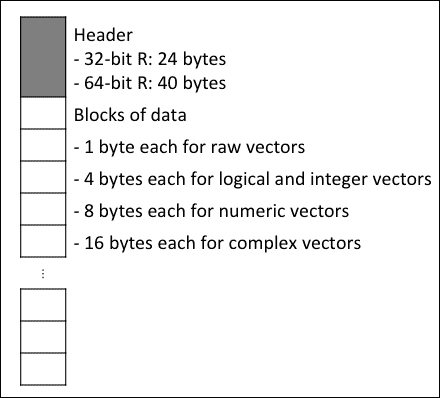
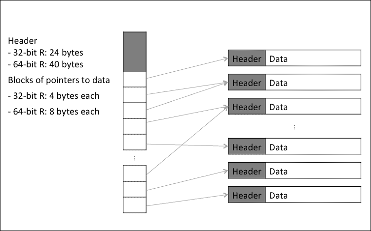

# 第七章. 使用有限 RAM 处理大数据集

在上一章中，我们学习了如何通过减少数据的复制和删除临时数据来优化 R 程序的内存消耗。有时，这仍然不够。我们可能有一些数据太大，甚至无法放入内存，更不用说对其进行任何计算了，或者即使数据可以放入内存，可供我们进行所需分析的空闲内存也不多。

在本章中，我们将学习克服内存限制并处理大数据集的高级技术。

本章涵盖：

+   使用内存高效的数据结构

+   使用内存映射文件和分块处理数据

# 使用内存高效的数据结构

当你处理大数据集时，首先要考虑的是是否可以使用更内存高效的数据结构来存储和处理相同的信息。但首先我们需要知道数据在 R 中是如何存储的。向量是 R 中几乎所有数据类型的基本构建块。R 提供了逻辑、整数、数值、复数、字符和原始类型的原子向量。许多其他数据结构也是从向量构建的。例如，列表在 R 的内部存储结构中本质上就是向量。它们与原子向量的不同之处在于它们存储指向其他 R 对象的指针，而不是原子值。这就是为什么列表可以包含不同类型的对象。

让我们来看看每种原子数据类型需要多少内存。为此，我们将创建每种类型的包含一百万个元素的向量，并使用`object.size()`（对于字符向量，我们将调用`rep.int(NA_character_, 1e6)`，这将创建一个真正包含`NA`值的空字符向量，正如我们很快将看到的，它比包含空字符串的字符向量占用更少的内存）来测量它们的内存消耗：

```py
object.size(logical(1e6))
## 4000040 bytes
object.size(integer(1e6))
## 4000040 bytes
object.size(numeric(1e6))
## 8000040 bytes
object.size(complex(1e6))
## 16000040 bytes
object.size(rep.int(NA_character_, 1e6))
## 8000040 bytes
object.size(raw(1e6))
## 1000040 bytes
object.size(vector("list", 1e6))
## 8000040 bytes
```

这些结果是从 R 的 64 位版本中获得的。请注意，所有这些向量都占用 1 百万字节以上的内存，额外还占用 40 字节。这 40 字节被向量头占用，R 使用这些头存储有关向量的信息，例如长度和数据类型。剩余的空间被向量中存储的数据占用。

通过将这些数字除以一百万，我们发现原始值每个占用 1 字节，逻辑和整数值占用 4 字节，数值占用 8 字节，复数值占用 16 字节。以下图显示了这些类型向量的结构和内存需求：



逻辑、整数、数值和复数向量的内部结构

字符向量和列表有一点不同，因为它们在其向量中不存储实际数据。相反，它们存储指向其他包含实际数据的向量的指针。在计算机的内存中，字符向量或列表的每个元素都是一个指针，在 32 位 R 中占用 4 字节，在 64 位 R 中占用 8 字节。这将在以下图中展示：



列表和字符向量的内部结构

让我们更仔细地检查字符向量，看看它们是如何存储的。为此，我们将生成三个不同的字符向量，每个向量都有 1,000,000 个由 10 个字符组成的字符串。第一个向量简单地包含 1,000,000 个 `"0123456789"` 字符串的副本，使用 `formatC()` 函数生成，以占用十个字符。第二个向量包含 1,000 个由 `formatC()` 生成的 1,000 个唯一字符串的副本，每个字符串占用 10 个字符。第三个向量包含 1,000,000 个具有 10 个字符的唯一字符串。因为这些向量包含相同数量的字符串，且长度相同，我们预计它们将占用相同数量的内存。让我们测试这个假设：

```py
object.size(rep.int("0123456789", 1e6))
## 8000096 bytes
object.size(rep.int(formatC(seq_len(1e3), width = 10), 1e3))
## 8056040 bytes
object.size(formatC(seq_len(1e6), width = 10))
## 64000040 bytes
```

结果表明，三个字符向量占用的内存量差异很大，这取决于字符串的实际内容。这是因为 R 为了节省内存，只在其 CHARSXP 缓存中存储每个唯一字符串的一个副本。我们创建的字符向量实际上存储的是指向这个缓存中字符串的指针，而不是字符串本身。

此外，这个缓存中的每个字符串都是一个完整的 R 向量，具有 24 个或 40 字节的头信息（在 32 位和 64 位 R 中分别），以及一个字符串。空字符被附加到字符串的末尾，总向量长度向上取整到最接近的 8 的倍数。例如，字符串 `0123456789` 将被存储为 `0123456789\0`（其中 `\0` 是空字符）加上五个额外的字节，总共 16 字节。在 64 位 R 中，加上 40 字节的头信息，这个 10 个字符的字符串将占用 56 字节的内存。

回到结果，包含 1,000,000 个 `0123456789` 复制品的第一个向量，其字符向量本身需要 8,000,040 字节，用于存储指针，另外还需要 56 字节来存储字符串本身。这使得总字节数达到 8,000,096 字节，这是 `object.size()` 报告的。

第二个向量包含 1,000 个唯一字符串，因此总共使用 *8,000,040 + 1,000 × 56 = 8,056,040* 字节的内存。

第三个向量包含 1,000,000 个唯一字符串，因此总共使用 *8,000,040 + 1,000,000 × 56 = 64,000,040* 字节的内存。

显然，字符向量的内存消耗取决于向量中包含的唯一字符串数量。

## 较小的数据类型

在理解了原子向量在 R 中的存储方式之后，我们现在来看看一些简单的策略来减少大数据集的内存占用，以便它们可以适应内存进行分析。

一种方法是在可能的情况下将数据强制转换为较小的数据类型。例如，如果一个数据集只包含整数值，将它们存储在整数向量而不是数值向量中可以减少大约一半的内存消耗：

```py
object.size(as.numeric(seq_len(1e6)))
## 8000040 bytes
object.size(as.integer(seq_len(1e6)))
## 4000040 bytes
```

这也适用于字符字符串。在一个字符向量中，如果有许多重复的字符串，将其转换为因子向量可以减少内存消耗，因为因子实际上是索引唯一字符串（因子的水平）的整数向量：

```py
strings <- rep.int(formatC(seq_len(1e4), width = 1000), 100)
factors <- factor(strings)
object.size(strings)
## 18480040 bytes
object.size(factors)
## 14560400 bytes
```

这些相同的技巧也可以应用于其他数据结构的组件，例如基于原子向量的矩阵、数据框和列表。

## 稀疏矩阵

有时数据可能非常稀疏，即包含很多零或空值。与在内存中存储完整的矩阵向量相比，使用*稀疏矩阵*可以显著减少表示数据所需的内存量。R 中的`Matrix`包提供了稀疏矩阵。

假设我们有一个 1,000×1,000 的数值矩阵（总共有 1 百万个元素），其中大约有 70%的零。我们可以使用`Matrix()`函数从这个数据创建密集或稀疏矩阵，具体取决于稀疏参数：

```py
library(Matrix)
n <- rnorm(1e6)
n[sample.int(1e6, 7e5)] <- 0
m.dense <- Matrix(n, 1e3, 1e3, sparse = FALSE)
m.sparse <- Matrix(n, 1e3, 1e3, sparse = TRUE)
object.size(n)
## 8000040 bytes
object.size(m.dense)
## 8001112 bytes
object.size(m.sparse)
## 3605424 bytes
```

稠密矩阵所需的内存量与原始数据的数值向量大致相同。稀疏矩阵通过减少 55%的数据大小来减少数据量。

稀疏矩阵对于二进制数据（`TRUE`/`FALSE`，`0`/`1`，`"yes"`/`"no"`，`"hot"`/`"cold"`等）也非常有用。只需将二进制数据转换为逻辑值，其中大多数类是`FALSE`（如果大多数类是`TRUE`，则反转数据）。然后我们可以创建只存储矩阵中`TRUE`值出现位置的稀疏矩阵。再次，让我们在一个 70%稀疏的 1 百万个逻辑值矩阵上测试这个方法：

```py
l <- sample(c(FALSE, TRUE), 1e6, TRUE, c(0.7, 0.3))
m2.dense <- Matrix(l, 1e3, 1e3, sparse = FALSE)
m2.sparse <- Matrix(l, 1e3, 1e3, sparse = TRUE)
object.size(l)
## 4000040 bytes
object.size(m2.dense)
## 4001112 bytes
object.size(m2.sparse)
## 2404384 bytes
```

稀疏逻辑矩阵比稀疏数值矩阵更加紧凑，其大小减少了 33%。

## 对称矩阵

对称矩阵，即等于其转置的矩阵，在许多统计方法中都有应用。例如，距离矩阵、相关矩阵和图邻接矩阵。由于我们可以通过取一半矩阵的镜像来生成矩阵的另一半，包括对角线，因此只保留矩阵的一半可以节省内存。`Matrix`包提供了`dspMatrix`类来高效地存储对称矩阵：

```py
library(Matrix)
data <- matrix(rnorm(1E5), 1E2, 1E3) 
A <- cor(data)
isSymmetric(A)
## [1] TRUE
B <- as(A, "dspMatrix")
object.size(A)
## 8000200 bytes
object.size(B)
## 4005320 bytes
```

除了稀疏和对称矩阵之外，`Matrix`软件包还提供了几种其他高效的矩阵类型数据结构，包括三角矩阵和对角矩阵。根据数据类型的不同，这些数据结构中的一些可能比前面示例中使用的通用稀疏或对称矩阵更节省内存。此外，该软件包使得基本的矩阵运算，如矩阵乘法（`%*%`），适用于密集和稀疏矩阵。因此，在大多数情况下，我们不需要手动将矩阵运算从密集版本转换为稀疏版本。有关更多详细信息，请参阅`Matrix`软件包的文档。

## 位向量

二进制数据可以用位向量以更有效的方式表示。与 R 中的逻辑值不同，逻辑值占用四个字节或 32 位，位向量只使用一个位来存储每个逻辑值。这将逻辑值的内存消耗减少了 32 倍。然而，位向量不能存储`NA`值，因此它们不适用于包含`NA`值的数据。

在 R 中，CRAN 上的`bit`软件包提供了位向量。让我们比较逻辑向量和等效位向量的大小：

```py
library(bit)
l <- sample(c(TRUE, FALSE), 1e6, TRUE)
b <- as.bit(l)
object.size(l)
## 4000040 bytes
object.size(b)
## 126344 bytes
```

如预期的那样，位向量的大小是 3.2%，即逻辑向量的 1/32。

位向量还允许进行更快的逻辑运算：

```py
library(microbenchmark)
l2 <- sample(c(TRUE, FALSE), 1e6, TRUE)
b2 <- as.bit(l2)
microbenchmark(!l, !b)
## Unit: microseconds
##  expr      min        lq   median        uq       max neval
##    !l 1201.993 1452.2925 1566.966 2951.0405 23045.003   100
##    !b   51.145   64.7185  107.065  113.2045   461.624   100
microbenchmark(l & l2, b & b2)
## Unit: microseconds
##    expr       min        lq     median        uq      max neval
##  l & l2 22808.696 23104.647 23309.7475 24473.137 38334.65   100
##  b & b2    60.948    64.615    78.5025   135.126 13732.20   100
microbenchmark(l == l2, b == b2)
## Unit: microseconds
##     expr      min        lq    median       uq      max neval
##  l == l2 1954.402 2208.3235 2227.8980 2320.104 16825.13   100
##  b == b2   60.263   63.2235   87.7245  121.448 14184.91   100
```

当处理大量逻辑或二进制数据时，位向量不仅节省内存，而且在进行操作时还能提供速度提升。

# 使用内存映射文件和分块处理数据

有些数据集非常大，即使应用了所有内存优化技术并使用了最有效的数据类型，它们仍然太大，无法装入或处理在内存中。除了获取额外的 RAM 之外，处理此类大型数据的一种方法是将它们以**内存映射文件**的形式存储在磁盘上，并一次将一小部分数据加载到内存中进行处理。

例如，假设我们有一个数据集，如果完全加载到内存中，将需要 100 GB 的 RAM，并且还需要额外的 100 GB 空闲内存来处理数据。如果处理数据的计算机只有 64 GB 的 RAM，我们可能需要将数据分成四个 25 GB 的数据块。然后 R 程序将一次加载一个数据块到内存中，并对每个数据块进行必要的计算。在所有数据块都处理完毕后，将最终将每个数据块的计算结果合并，以计算最终结果。这能否轻松完成取决于正在数据上运行的算法的性质。一些算法可以轻松地转换为对数据块进行计算，而其他算法可能需要付出相当大的努力才能做到这一点。

有两个 CRAN 软件包提供了内存映射文件，以便以这种方式处理大型数据集：`bigmemory`和`ff`。我们将依次查看这些软件包。

## 大内存包

`bigmemory` CRAN 包提供了一个类似于矩阵的数据结构，称为 `big.matrix`。存储在 `big.matrix` 对象中的数据可以是 `double` 类型（8 字节，默认），`integer` 类型（4 字节），`short` 类型（2 字节）或 `char` 类型（1 字节）。`big.matrix` 对象可以存在于 RAM 中或以内存映射文件的形式存在，并且可以像标准 R 矩阵一样进行操作。

### 注意

在撰写本文时，`bigmemory` 在 Windows 上不受支持，但包作者正在努力解决这个问题。

要创建一个 `big.matrix` 对象，我们可以调用 `big.matrix()` 来创建一个新对象，或者调用 `as.big.matrix()` 将矩阵强制转换为 `big.matrix`。在下一个示例中，我们将创建一个包含 10 亿行和 3 列的新 `big.matrix` 对象，位于 R 的临时文件夹中：

```py
library(bigmemory)
bm <- big.matrix(1e9, 3, backingfile = "bm",
                  backingpath = tempdir())
bm
## An object of class "big.matrix"
## Slot "address":
## <pointer: 0x7fac1950a4a0>
```

运行这个程序可能需要一段时间，但完成后，我们将有一个新的对象 `bm`，它存储指向新内存映射文件的指针。我们可以在临时目录中找到名为 `bm` 的新文件，大小为 22 GB：

```py
aloysius@localhost RtmpG0CQdS $ ls -lh
total 46875024
-rw-r--r--  1 aloysius  staff    22G Sep 18 08:02 bm
-rw-r--r--  1 aloysius  staff   452B Sep 18 08:02 bm.desc
```

这样大的数据集可能无法适应大多数计算机的主内存。还创建了一个名为 `bm.desc` 的文件，与数据文件一起使用。该文件用于在以后或由另一个 R 程序通过调用类似 `my.bm <- attach.big.matrix(file.path(tempdir(), "bm.desc"))` 的方式检索内存映射文件。

`big.matrix` 对象支持许多与标准 R 矩阵相同的操作：

```py
typeof(bm)
## [1] "double"
dim(bm)
## [1] 1e+09 3e+00
nrow(bm)
## [1] 1e+09
ncol(bm)
## [1] 3
length(bm)
## [1] 3e+09
bm[1:5, ]
##      [,1] [,2] [,3]
## [1,]    1    0    0
## [2,]    0    1    0
## [3,]    0    0    1
## [4,]    0    0    0
## [5,]    0    0    0
bm[1:3, ] <- diag(3)
bm[1:5, ]
##      [,1] [,2] [,3]
## [1,]    1    0    0
## [2,]    0    1    0
## [3,]    0    0    1
## [4,]    0    0    0
## [5,]    0    0    0
```

当使用子集操作符 `[` 时，`bigmemory` 将选定的数据部分作为矩阵加载到 RAM 中。随着 `big.matrix` 的不同部分被使用，`bigmemory` 会自动将相关数据部分加载到 RAM 中，并删除不再需要的部分。由于 `[` 选定的所有内容都会加载到内存中，因此必须注意确保选定的数据可以适应可用的内存。例如 `bm[, ]` 的调用可能会引发内存不足错误。

现在我们来看一个 R 程序如何与 `big.matrix` 一起工作，一次处理一个数据块。首先我们将随机数据填充到它里面，一次一个数据块。第一列将包含均值为 1000 的泊松分布的整数。第二列将包含由一和零表示的二进制数据。第三列将包含在 0 到 100000 之间均匀分布的实数。以下代码以 100 个 10 百万行的块将随机数填充到 `bm` 中：

```py
chunksize <- 1e7
start <- 1
while (start <= nrow(bm)) {
    end <- min(start + chunksize - 1, nrow(bm))
    chunksize <- end - start + 1
    bm[start:end, 1] <- rpois(chunksize, 1e3)
    bm[start:end, 2] <- sample(0:1, chunksize, TRUE,
                               c(0.7, 0.3))
    bm[start:end, 3] <- runif(chunksize, 0, 1e5)    
    start <- start + chunksize
}
```

分块计算的一个例子是计算每一列的标准差。调用 `sd(bm[1, ])` 可能不会工作，因为即使是一列数据也可能超过可用的内存。需要通过数据两次：一次计算每一列的平均值，另一次计算与平均值的平方偏差。

数据可以分成 1000 万行的块，就像之前一样。在第一次遍历中，计算列的平均值：

```py
col.sums <- numeric(3)
chunksize <- 1e7
start <- 1
while (start <= nrow(bm)) {
    end <- min(start + chunksize - 1, nrow(bm))
    col.sums <- col.sums + colSums(bm[start:end, ])
    start <- start + chunksize
}
col.means <- col.sums / nrow(bm)
```

代码遍历每个数据块，并使用 `colSums()` 函数计算每个数据块的列和。这被添加到全局列和 `col.sums` 中。一旦所有数据块都经过处理，通过将 `col.sums` 除以数据的行数来计算列均值。

在第二次遍历时，计算观测值与列均值的平方偏差：

```py
col.sq.dev <- numeric(3)
start <- 1
while (start <= nrow(bm)) {
    end <- min(start + chunksize - 1, nrow(bm))
    col.sq.dev <- col.sq.dev +
        rowSums((t(bm[start:end, ]) - col.means) ^ 2)
    start <- start + chunksize
}
col.var <- col.sq.dev / (nrow(bm) - 1)
col.sd <- sqrt(col.var)
```

每个数据块首先使用 `t()` 进行转置，以便从转置数据的每一列中减去 `col.means` 来计算与均值的偏差。然后对偏差进行平方，并在转置后的数据行上求和。

一旦所有数据块都经过处理，每个列的总平方偏差然后除以 *n-1* 来计算每个列的方差。最后，列方差的平方根给出列标准差。

`bigmemory` 的作者还编写了一个配套包 `biganalytics`，它为 `big.matrix` 对象提供了常用的统计函数。我们可以将前面练习的结果与 `biganalytics` 的 `colsd()` 函数进行比较：

```py
library(biganalytics)
col.sd
## [1] 3.162261e+01 4.582687e-01 2.886805e+04
big.col.sd <- colsd(bm)
all.equal(col.sd, big.col.sd)
## [1] TRUE
```

我们已经看到了如何使用 `big.matrix` 对象在数据块上执行计算。`bigmemory` 的作者还创建了其他 CRAN 包，这些包提供了在 `big.matrix` 对象上操作的有用函数。以下表格列出了这些函数：

| 包 | 提供的函数样本 |
| --- | --- |
| `biganalytics` | 统计：`colmean()`、`colmin()`、`min()`、`colmax()`、`max()`、`colrange()`、`range()`、`colvar()`、`colsd()`、`colsum()`、`sum()`、`colprod()`、`prod()` 和 `colna()`；应用：`apply()`；线性模型：`biglm.big.matrix()`、`bigglim.big.matrix()`；聚类：`bigkmeans()` |
| `bigtabulate` | 表和 `tapply`：`bigtabulate()`、`bigtable()`、`bigtsummary()`；分割：`bigsplit()` |
| `bigalgebra` | 算术运算 |

## The `ff` 包

虽然`big.matrix`对于可以强制转换为相同类型的数据很有用，但在处理异构数据类型时，有时需要更类似数据框的内存映射格式。`ff` CRAN 包提供了这种功能。

`ff` CRAN 包支持比 `bigmemory` 更多的数据类型。下表显示了可以在 `ff` 向量、数组和数据框中存储的不同数据类型，称为 `vmodes`：

| 数据类型或 vmode | 描述 |
| --- | --- |
| `Boolean` | 无`NA`的 1 位逻辑 |
| `Logical` | 2 位带`NA`的逻辑 |
| `Quad` | 无`NA`的 2 位无符号整数 |
| `Nibble` | 无`NA`的 4 位无符号整数 |
| `Byte` | 带`NA`的 8 位符号整数 |
| `Ubyte` | 无`NA`的 8 位无符号整数 |
| `Short` | 16 位带`NA`的符号整数 |
| `Ushort` | 无`NA`的 16 位无符号整数 |
| `Integer` | 带`NA`的 32 位符号整数 |
| `Single` | 32 位浮点数 |
| `Double` | 64 位浮点数 |
| `Complex` | 2 x 64 位浮点数 |
| `Raw` | 8 位无符号字符 |
| `Factor` | 因子（存储为 `integer`） |
| `Ordered` | 有序因子（存储为 `integer`） |
| `POSIXct` | POSIXct（存储为 `double`） |
| `Date` | 日期（存储为 `double`） |

可以通过将值向量传递给 `ff()` 函数来创建 `ff` 对象：

```py
i <- ff(1:1e6)
i
## ff (open) integer length=1000000 (1000000)
##       [1]       [2]       [3]       [4]       [5]       [6] 
##         1         2         3         4         5         6 
##       [7]       [8]            [999993]  [999994]  [999995] 
##         7         8         :    999993    999994    999995 
##  [999996]  [999997]  [999998]  [999999] [1000000] 
##   999996    999997    999998    999999   1000000 
filename(i)
## [1] "/private/var/folders/xw/xp2p4mjd3nb6n6h30w67jkdc0000gn/T/## RtmptxP4qw/ff449847497df9.ff"
```

由于没有指定文件名，`ff()` 自动在 R 的临时目录中创建一个新文件。文件名也可以通过 `filename` 参数指定，如下一个示例所示。

如果将标量传递给 `ff()` 并与新的 `ff` 对象的维度一起使用，标量值将用于初始化对象：

```py
j <- ff(FALSE, dim = c(50, 100),
        filename = file.path(tempdir(), "j.ff"))
j
## ff (open) logical length=5000 (5000) dim=c(50,100)
## dimorder=c(1,2)
##        [,1]  [,2]  [,3]  [,4]  [,5]  [,6]  [,7]  [,8]  [,100]
## [1,]  FALSE FALSE FALSE FALSE FALSE FALSE FALSE FALSE : FALSE
## [2,]  FALSE FALSE FALSE FALSE FALSE FALSE FALSE FALSE : FALSE
## [3,]  FALSE FALSE FALSE FALSE FALSE FALSE FALSE FALSE : FALSE
## [4,]  FALSE FALSE FALSE FALSE FALSE FALSE FALSE FALSE : FALSE
## [5,]  FALSE FALSE FALSE FALSE FALSE FALSE FALSE FALSE : FALSE
## :         :     :     :     :     :     :     :     : :     :
## [46,] FALSE FALSE FALSE FALSE FALSE FALSE FALSE FALSE : FALSE
## [47,] FALSE FALSE FALSE FALSE FALSE FALSE FALSE FALSE : FALSE
## [48,] FALSE FALSE FALSE FALSE FALSE FALSE FALSE FALSE : FALSE
## [49,] FALSE FALSE FALSE FALSE FALSE FALSE FALSE FALSE : FALSE
## [50,] FALSE FALSE FALSE FALSE FALSE FALSE FALSE FALSE : FALSE
```

`vmode` 参数设置 `ff` 对象的存储模式：

```py
q <- ff(sample(0:3, 1e6, TRUE), vmode = "quad")
q
## ff (open) quad length=1000000 (1000000)
##       [1]       [2]       [3]       [4]       [5]       [6] 
##         2         2         2         2         0         1 
##       [7]       [8]            [999993]  [999994]  [999995] 
##         1         0         :         1         0         1 
##  [999996]  [999997]  [999998]  [999999] [1000000] 
##         0         1         0         0         0
```

数据框可以使用 `ffdf()` 构建出来。在这里，我们使用前面代码中创建的整数和四舍五入 `ff` 向量创建一个新的 `ffdf` 对象：

```py
d <- ffdf(i, q)
d[1:5, ]
##   i q
## 1 1 2
## 2 2 2
## 3 3 2
## 4 4 2
## 5 5 0
vmode(d)
##         i         q 
## "integer"    "quad"
```

`ff` 对象提供了方便的 `chunk()` 函数，可以根据可用内存将数据分割成块。使用默认参数时，`chunk()` 建议一次性将整个数据框 `d` 载入一个块中：

```py
chunk(d)
## [[1]]
## range index (ri) from 1 to 1000000 maxindex 1000000
```

最大的块大小（以字节为单位）也可以使用 `BATCHBYTES` 参数设置。当它设置为 200 万字节时，`chunk()` 建议将数据分割成四个块：

```py
ch <- chunk(d, BATCHBYTES = 2e6)
ch
## [[1]]
## range index (ri) from 1 to 250000 maxindex 1000000 
##
## [[2]]
## range index (ri) from 250001 to 500000 maxindex 1000000 
##
## [[3]]
## range index (ri) from 500001 to 750000 maxindex 1000000 
##
## [[4]]
## range index (ri) from 750001 to 1000000 maxindex 1000000
```

通常，希望块的数量更少，因为每个块都会产生（通常是小的）I/O 开销，每次 R 会话需要从磁盘读取数据时都需要这些开销。

`chunk()` 返回的索引可以用于索引 `ffdf` 或 `ff` 对象的行。以下代码遍历每个数据块，选择具有 `d[idx, ]` 和 `q[idx]` 的块，并在该块上执行一些计算。

```py
total <- numeric(2)
quad.table <- integer(4)
names(quad.table) <- 0:3
for (idx in ch) {
    total <- total + colSums(d[idx, ])
    quad.table <- quad.table + table(q[idx])
}
total
##            i            q 
## 500000500000      1500191 
quad.table
##      0      1      2      3 
## 249939 249964 250064 250033
```

`ff` CRAN 包有一个配套包 `ffbase`，它提供了用于操作 `ff` 和 `ffdf` 对象的有用函数。以下是这些函数的示例：

+   **数学**：`abs()`，`sign()`，`sqrt()`，`ceiling()`，`floor()`，`log()`，`exp()`，`cos()`，`cosh()`，`sin()`，`sinh()`，`gamma()` 

+   **汇总**：`all()`，`any()`，`max()`，`min()`，`cumsum()`，`cummin()`

+   **唯一性**：`duplicated()`，`unique()`

+   **应用**：`ffdfdply()`

当我们完成对 `ff` 或 `ffdf` 对象的操作后，可以使用 `delete()` 删除文件，并使用 `rm()` 删除 R 变量：

```py
delete(d)
## [1] TRUE
delete(lm)
## [1] TRUE
rm(d)
rm(lm)
```

由于在删除数据框 `d` 时也会删除底层向量 `i` 和 `q`，尝试删除这些向量将导致错误。我们可以简单地删除 R 对象：

```py
delete(i)
## [1] FALSE
## Warning message:
## In file.remove(attr(physical, "filename")) :
##   cannot remove file '/private/var/folders/xw/## xp2p4mjd3nb6n6h30w67jkdc0000gn/T/RtmptxP4qw/ff449847497df9.ff', ## reason 'No such file or directory'
rm(i)
rm(q)
```

# 概述

在本章中，我们学习了 R 如何在内存中存储向量，以及如何估计不同类型数据所需的内存量。我们还学习了如何使用更高效的数据结构，如稀疏矩阵和位向量来存储某些类型的数据，以便它们可以在内存中完全加载和处理。

对于仍然太大的数据集，我们使用了`big.matrix`、`ff`和`ffdf`对象，通过内存映射文件将内存存储在磁盘上，并逐块处理数据。`bigmemory`和`ff`包及其配套包提供了一套丰富的功能，用于内存映射文件，这些功能在本书中无法完全涵盖。我们鼓励您查阅这些包的文档，以了解更多关于如何利用内存映射文件处理大型数据集的方法。

在下一章中，我们将超越在单个进程或线程中运行 R，学习如何并行运行 R 计算。
