# 第二章：使用描述性统计理解投票

本章展示了如何进行描述性统计分析，以获得我们处理的数据的一般概念，这通常是数据分析项目的第一步，也是数据分析师的基本能力。我们将学习如何清洗和转换数据，以有用的方式总结数据，找到特定的观察结果，创建各种类型的图表，以提供对数据的直观理解，使用相关性来理解数值变量之间的关系，使用主成分来找到最优变量组合，并将所有这些整合到可重用、可理解和易于修改的代码中。

由于这本书是关于使用 R 进行编程的，而不是使用 R 进行统计分析，因此我们的重点将放在编程方面，而不是统计方面。阅读时请记住这一点。

本章涵盖的一些重要主题如下：

+   清洗、转换和操作数据

+   以编程方式创建各种类型的图表

+   使用 R 中的各种工具进行定性分析

+   使用主成分分析构建新变量

+   开发模块化和灵活的代码，易于使用

# 本章所需软件包

在本章中，我们将使用以下 R 软件包。如果您还没有安装它们，可以查阅附录*，所需软件包*部分，了解如何安装。

| **软件包** | **用途** |
| --- | --- |
| `ggplot2` | 高质量图表 |
| `viridis` | 图表颜色调色板 |
| `corrplot` | 相关性图 |
| `ggbiplot` | 主成分图 |
| `progress` | 显示迭代的进度 |

# Brexit 投票示例

2016 年 6 月，英国举行了一次公投，以决定是否继续留在欧盟。72% 的注册选民参与了投票，其中 51.2% 的人投票离开欧盟。2017 年 2 月，BBC 新闻的自由信息专家马丁·罗森鲍姆发表了文章《地方投票数据为欧盟公投提供了新的见解》（[`www.bbc.co.uk/news/uk-politics-38762034`](http://www.bbc.com/news/uk-politics-38762034)）。他从 1,070 个选区（英国用于选举的最小行政区域）获得了数据，包括每个选区的离开和留下投票数。

马丁·罗森鲍姆通过利用 2011 年进行的最新英国人口普查，计算了选区中**Leave**投票比例与其一些社会、经济和人口特征之间的统计关联。他使用这些数据为大学课程授课，这就是我们将在本例中使用的数据，其中一些变量已被删除。数据以 CSV 文件（`data_brexit_referendum.csv`）的形式提供，可以在本书的配套代码库中找到（[`github.com/PacktPublishing/R-Programming-By-Example`](https://github.com/PacktPublishing/R-Programming-By-Example)）。表格显示了数据中包含的变量：

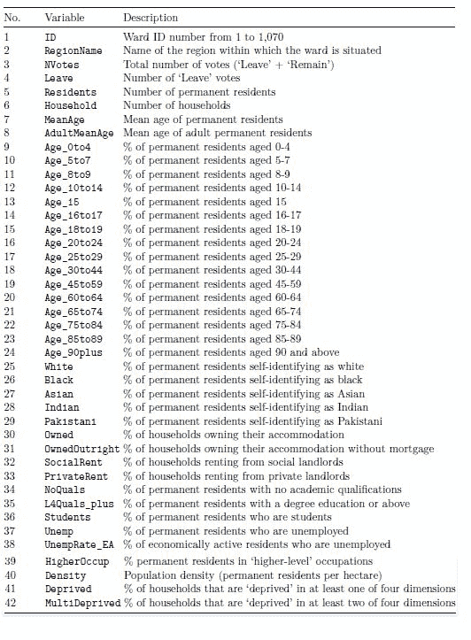

数据变量描述

# 清理和设置数据

设置本例的数据非常直接。我们将加载数据，正确标记缺失值，并为我们的分析创建一些新变量。在我们开始之前，请确保`data.csv`文件与你的代码在同一目录下，并且你的*工作目录*已正确设置。如果你不知道如何操作，设置工作目录相当简单，你只需调用`setwd()`函数，并传入你想要使用的目录即可。例如，`setwd(/home/user/examples/)`将会使用`/home/user/examples`目录来查找文件，并将文件保存到该目录。

如果你不知道如何操作，设置工作目录相当简单，你只需调用`setwd()`函数，并传入你想要使用的目录即可。例如，`setwd(/home/user/examples/)`将会使用/home/user/examples 目录来查找文件，并将文件保存到该目录。

我们可以通过使用`read.csv()`函数将`data.csv`文件的内容加载到数据框中（这是与 CSV 格式数据最直观的结构）。请注意，数据中的`Leave`变量有一些缺失值。这些值具有`-1`的值来标识它们。然而，在 R 中标识缺失值的正确方式是使用`NA`，这是我们用来替换`-1`值的。

```py
data <- read.csv("./data_brexit_referendum.csv") 
data[data$Leave == -1, "Leave"] <- NA 
```

要计算数据中缺失值的数量，我们可以使用`is.na()`函数来获取一个包含`TRUE`值以标识缺失值和`FALSE`值以标识非缺失值的逻辑（布尔）向量。这样一个向量的长度将与用作输入的向量的长度相等，在我们的例子中是`Leave`变量。然后，我们可以使用这个逻辑向量作为`sum()`函数的输入，同时利用 R 处理这样的`TRUE/FALSE`值的方式来获取缺失值的数量。`TRUE`被视为`1`，而`FALSE`被视为`0`。我们发现`Leave`变量中的缺失值数量为 267。

```py
sum(is.na(data$Leave))
#> [1] 267
```

如果我们想，我们可以使用一种机制来填充缺失值。一种常见且简单的方法是估计变量的平均值。在我们的案例中，在第三章，*使用线性模型预测投票*中，我们将使用线性回归来估计这些缺失值。然而，我们现在将保持简单，只将它们作为缺失值留下。

现在我们继续定义一个新变量，名为`Proportion`，它将包含支持离开欧盟的投票百分比。为此，我们将`Leave`变量（支持离开的投票数）除以`NVotes`变量（总投票数），对于每个选区。鉴于 R 的向量化特性，这很简单：

```py
data$Proportion <- data$Leave / data$NVotes
```

我们通过简单地赋值来在数据框中创建一个新变量。创建新变量和修改现有变量之间没有区别，这意味着我们在这样做时需要小心，以确保我们没有意外地覆盖了旧变量。

现在，创建一个新变量，该变量包含对每个选区是否大多数投票支持离开或留在欧盟的分类。如果一个选区的投票超过 50%支持离开，那么我们将标记该选区为投票支持离开，反之亦然。同样，R 使用`ifelse()`函数使这个过程变得非常简单。如果提到的条件（第一个参数）为真，则分配的值将是`"Leave"`（第二个参数）；否则，它将是`"Remain"`（第三个参数）。这是一个向量化操作，因此它将对数据框中的每个观测值执行：

```py
data$Vote <- ifelse(data$Proportion > 0.5, "Leave", "Remain")
```

有时，人们喜欢为这些类型的操作使用不同的语法；他们会使用*子集赋值方法*，这与我们使用的方法略有不同。我们不会深入探讨这些方法之间的差异，但请记住，在我们的情况下，后一种方法可能会产生错误：

```py
data[data$Proportion >  0.5, "Vote"] <- "Leave"
data[data$Proportion <= 0.5, "Vote"] <- "Remain"

#> Error in `<-.data.frame`(`*tmp*`, data$Proportion 0.5, "Vote", value = "Leave"): 
#>   missing values are not allowed in subscripted assignments of data frames
```

这是因为`Proportion`变量包含一些缺失值，这些缺失值是`Leave`变量最初有一些`NA`值的结果。由于我们无法为`Leave`中具有`NA`值的观测值计算`Proportion`值，当我们创建它时，相应的值也会被分配一个`NA`值。

如果我们坚持使用*子集赋值方法*，我们可以通过使用`which()`函数使其工作。它将忽略（返回`FALSE`）那些比较中包含`NA`的值。这样它就不会产生错误，我们将会得到与使用`ifelse()`函数相同的结果。当可能时，我们应该使用`ifelse()`函数，因为它更简单，更容易阅读，并且更高效（更多关于这一点在第九章[第九章，*实现高效的简单移动平均*)。

```py
data[which(data$Proportion >  0.5), "Vote"] <- "Leave"
data[which(data$Proportion <= 0.5), "Vote"] <- "Remain"
```

在未来，我们希望创建包含 `RegionName` 信息的图表，而长名称可能会使它们难以阅读。为了解决这个问题，我们可以在清理数据的过程中缩短这些名称。

```py
data$RegionName <- as.character(data$RegionName)
data[data$RegionName == "London", "RegionName"]                   <- "L"
data[data$RegionName == "North West", "RegionName"]               <- "NW"
data[data$RegionName == "North East", "RegionName"]               <- "NE"
data[data$RegionName == "South West", "RegionName"]               <- "SW"
data[data$RegionName == "South East", "RegionName"]               <- "SE"
data[data$RegionName == "East Midlands", "RegionName"]            <- "EM"
data[data$RegionName == "West Midlands", "RegionName"]            <- "WM"
data[data$RegionName == "East of England", "RegionName"]          <- "EE"
data[data$RegionName == "Yorkshire and The Humber", "RegionName"] <- "Y"
```

注意到上一个代码块中的第一行是将 `RegionName` 转换为字符类型的赋值。在我们这样做之前，变量的类型是因子（这是使用 `read.csv()` 读取数据的默认方式产生的），它阻止我们从变量中分配不同的值。在这种情况下，我们会得到一个错误，`Invalid factor level, NA generated`。为了避免这个问题，我们需要执行类型转换。

现在我们有了干净的数据，准备进行分析。我们创建了一个新的感兴趣变量（`Proportion`），这将是本章和下一章的焦点，因为在这个例子中，我们感兴趣的是找出其他变量之间的关系以及人们在公投中的投票情况。

# 将数据汇总到数据框中

为了获取数据的概要，我们可以执行 `summary(data)` 并查看每种类型变量的相关概要。概要针对每一列的数据类型进行了定制。正如您所看到的，数值变量，如 `ID` 和 `NVotes`，会得到分位数概要，而因子（分类）变量会为每个不同的类别提供计数，例如 `AreaType` 和 `RegionName`。如果有许多类别，概要将显示出现次数最多的类别，并将其余的类别归入一个（其他）组，正如我们在 `RegionName` 的底部所看到的。

```py
summary(data)
#>       ID        RegionName              NVotes          Leave
#> Min.   :  1    Length: 1070        Min.   : 1039    Min.   : 287
#> 1st Qu.: 268   Class : character   1st Qu.: 4252    1st Qu.: 1698
#> Median : 536   Mode  : character   Median : 5746    Median : 2874
#> Mean   : 536                       Mean   : 5703    Mean   : 2971
#> 3rd Qu.: 803                       3rd Qu.: 7020    3rd Qu.: 3936
#> Max.   : 1070                      Max.   : 15148   Max.   : 8316
(Truncated output)
```

从这里，我们可以看到伦敦是拥有更多选区的地区，其次是西北部和西米德兰兹。我们还可以看到，所有数据中投票最少的选区只有 1,039 票，投票最多的是 15,148 票，每个选区的平均投票数是 5,703。我们将在本章的后面部分更深入地探讨这类分析。现在，我们将专注于使这些汇总数据对进一步分析有用。如您所注意到的，我们无法使用 `summary()` 的结果进行计算。我们可以尝试将概要保存到变量中，找出变量类型，并以适当的方式遍历它。然而，如果我们这样做，我们会发现它是文本数据，这意味着我们不能直接用它进行计算：

```py
summary <- summary(data) 
class(summary) 
#> [1] "table"
summary[1]
#> [1] "Min.   : 1  "
class(summary[1])
#> [1] "character"
```

当然，肯定有办法将 `summary` 数据放入数据框中进行进一步分析。这是 R，所以你可以确信有！我们应该注意的第一件事是，由于非数值变量，我们无法直接将 `summary()` 函数的输出转换为数据框。这些非数值变量包含不同的摘要结构，该结构不是由最小值、第一四分位数、中位数、平均值、第三四分位数和最大值组成的。这意味着我们首先需要子集数据，以仅获取数值变量。毕竟，数据框是一个具有良好定义的行和列的矩形结构。如果我们试图混合类型（通过包括数值和非数值摘要），那么在数据框中这样做将会很困难。

要检查一列是否为数值，我们可以使用 `is.numeric()` 函数。例如，我们可以看到 `Proportion` 列是数值的，而 `RegionName` 则不是：

```py
is.numeric(data$Proportion) 
#> [1] TRUE
is.numeric(data$RegionName)
#> [1] FALSE
```

然后，我们可以通过使用 `sapply()` 函数将 `is.numeric()` 应用于每个列。这将给我们一个逻辑（布尔）向量，其中每个列都有一个 `TRUE` 或 `FALSE` 值，指示该列是否为数值。然后我们可以使用这个逻辑向量来子集我们的数据，并仅获取具有 `data[, numerical_variables]` 的数值列。正如你所见，`data_numerical` 对象中没有非数值列：

```py
numerical_variables <- sapply(data, is.numeric) 
numerical_variables 
#>            ID   RegionName         NVotes       Leave   Residents
#>          TRUE        FALSE           TRUE        TRUE        TRUE
#>    Households      MeanAge   AdultMeanAge   Aget_0to4   Age_5to7
#>          TRUE         TRUE           TRUE        TRUE        TRUE
(Truncated output)

data_numerical <- data[, numerical_variables] 
colnames(data_numerical)
#>  [1] "ID"           "Nvotes"       "Leave"          "Residents"
#>  [5] "Households"   "MeanAge"      "AdultMeanAge"   "Age_0to4"
#>  [9] "Age_5to7"     "Age_8to9"     "Age_10to14"     "Age_15"
#> [13] "Age_16to17    "Age_18to19"   "Age_20to24"     "Age_25to29"
(Truncated output)
```

由于获取 `ID` 变量的 `summary` 值没有太多意义，我们可以将其从逻辑向量中移除，实际上将其视为非数值变量。如果我们这样做，我们必须记住重新创建 `data_numeric` 对象，以确保它不包含 `ID` 变量：

```py
numerical_variables[["ID"]] <- FALSE 
data_numerical <- data[, numerical_variables]
```

要创建我们的数值变量摘要，我们首先将使用之前使用的 `summary()` 函数，通过 `lapply()` 函数将其应用于每个数值列。`lapply()` 函数返回一个命名列表，其中每个列表成员都有相应的列名：

```py
lapply(data[, numerical_variables], summary)
#> $NVotes
#>    Min. 1st Qu. Median  Mean 3rd Qu.  Max.
#>    1039    4252   5746  5703   7020  15148
#>
#> $Leave
#>    Min. 1st Qu. Median  Mean 3rd Qu.  Max.
#>     287    1698   2874  2971    3936  8316
#>
#> $Residents
#>    Min. 1st Qu. Median   Mean 3rd Qu.   Max.
#>    1932    8288  11876  11646   14144  34098
#>
(Truncated output)
```

现在，我们需要将这个列表的每个成员组合成一个数据框。为此，我们将使用 `cbind()` 和 `do.call()` 函数。`do.call()` 将依次将 `cbind()` 应用于由 `lapply()` 生成的列表的每个成员，并将它们全部返回。要了解这些向量化操作是如何工作的，请参阅第一章，*R 语言简介*：

```py
numerical_summary <- do.call(cbind, lapply(data_numerical, summary))
#> Warning in (function (..., deparse.level = 1) : number of rows of result is
#> not a multiple of vector length (arg 1)

numerical_summary
#>          NVotes Leave Residents Households MeanAge AdultMeanAge Age_0to4
#> Min.       1039   287      1932       779    27.80        29.20    2.200
#> 1st Qu.    4252  1698      8288      3466    35.60        44.10    5.400
#> Median     5746  2874     11876      4938    38.70        47.40    6.300
#> Mean       5703  2971     11646      4767    38.45        46.85    6.481
#> 3rd Qu.    7020  3936     14144      5832    41.40        49.90  7.50058
#> Max.      15148  8316     34098     15726    51.60        58.10   12.300
#> NA's       1039   267      1932       779    27.80        29.20    2.200
```

我们得到了我们的结果，但别急着走！我们得到了一个警告，看起来很可疑。这个“结果行数不是向量长度的倍数”信息是什么意思？啊哈！如果我们更详细地查看我们之前从 `lapply()` 函数得到的列表，我们可以看到在 `Leave`（和 `Proportion`）的情况下，我们得到了一个额外的 `NAs` 列，而其他任何列都没有。这意味着当我们尝试对这些列使用 `cbind()` 时，额外的 `NAs` 列将创建一个需要填充的额外空间。这是我们之前在 第一章，*R 语言入门* 中探讨过的问题。

正如我们所见，R 通过重复向量直到所有空间都被填满来处理这个问题。在我们的情况下，这意味着第一个元素，即对应最小值的元素，将重复用于每个没有 `NAs` 空间的列的 `NAs` 空间。你可以通过比较除了 `Leave` 或 `Proportion` 之外变量的 `Min` 和 `NAs` 列的数字来验证这一点（对于这两个变量，值实际上应该是不同的）。

为了解决这个问题，我们只需从结果数据框中移除额外的 `NA` 值的行，但这只会处理警告的症状，而不是根源。要处理根源，我们需要在应用 `cbind()` 之前为每个变量有相同数量的列。由于我们已经知道 `Leave` 变量有 267 个缺失值，这随后影响了 `Proportion` 变量，我们可以很容易地通过忽略这些信息来解决这个问题。为此，我们只需使用 *完整案例*，这意味着我们保留那些在任何变量中都没有 `NA` 值的观测值；或者，换句话说，我们删除包含至少一个 `NA` 的任何观测值。一旦我们这样做，我们就会得到我们的结果，并且不会得到任何警告：

```py
data <- data[complete.cases(data), ] 
data_numerical <- data[, numerical_variables] 
numerical_summary <- do.call(cbind, lapply(data_numerical, summary))
numerical_summary
#>         NVotes Leave Residents Households MeanAge AdultMeanAge Age_0to4
#> Min.      1039   287      1932        779   28.40        30.50    2.200
#> 1st Qu.   4242  1698      8405       3486   35.70        44.10    5.400
#> Median    5739  2874     11911       4935   38.60        47.40    6.300
#> Mean      5725  2971     11739       4793   38.43        46.83    6.479
#> 3rd Qu.   7030  3936     14200       5850   41.40        49.90    7.500
#> Max.     15148 8316      34098      15726   47.30        56.10   12.300
(Truncated output)
```

如果我们想将汇总值作为列，变量作为行，我们可以使用 `rbind()` 函数而不是 `cbind()`。我们最终使用的结构将取决于我们想用它做什么。然而，如果我们需要，我们可以很容易地在它们之间进行转换：

```py
do.call(rbind, lapply(data_numerical, summary))
#>                  Min.    1st Qu.    Median       Mean     3rd Qu.      Max.
#> NVotes     1039.0000  4241.5000  5.739e+03  5.725e+03  7.030e+03  1.515e+04
#> Leave       287.0000  1697.5000  2.874e+03  2.971e+03  3.936e+03  8.316e+03
#> Residents  1932.0000  8405.0000  1.191e+04  1.174e+04  1.420e+04  3.410e+04
#> Households  779.0000  3486.0000  4.935e+03  4.793e+03  5.850e+03  1.573e+04
#> MeanAge      28.4000    35.7000  3.860e+01  3.843e+01  4.140e+01  4.730e+01
```

现在我们有了这个 `numerical_summary` 对象，我们可以用它来进行计算，例如找出赞成离开（0.6681）比例最少和最多的区域之间的范围，这可能有助于解释我们在英国可能发现的区域类型之间的巨大差异。如果我们想知道哪些区域被用来得到这个结果，我们可以搜索赞成比例最少和最多的区域：

```py
numerical_summary["Max.", "Proportion"] - numerical_summary["Min.", "Proportion"] 
desired_variables <- c( 
    "ID", 
    "NoQuals", 
    "Proportion", 
    "AdultMeanAge", 
    "L4Quals_plus", 
    "RegionName" 
) 

>data[which.max(data$Proportion), desired_variables]
#>        ID NoQuals Proportion AdultMeanAge L4Quals_plus RegionName
#> 754   754    35.8     0.7897         48.7         13.7          L

data[which.min(data$Proportion), desired_variables]
#>      ID NoQuals Proportion AdultMeanAge L4Quals_plus RegionName
#> 732 732     2.8     0.1216         31.2         44.3         EE
```

如您所见，这项分析已经显示了一些有趣的结果。投票离开欧盟最多的英国区域特点是老年人（`MeanAge`）和低教育水平（`NoQuals`，`L4Quals_plus`）。另一方面，投票留在欧盟最多的英国区域特点是年轻人，教育水平很高。当然，这并不是全部情况，但它提示我们需要进一步了解正在发生的事情的方向。到目前为止，我们发现教育和年龄似乎是分析的相关变量。

# 通过图表和相关性获得直观感受

现在我们有一些干净的数据可以处理，我们将创建许多图表来建立对数据的直观理解。在本章中，我们将处理易于创建且用于探索目的的图表。在第四章“模拟销售数据和数据库操作”中，我们将探讨创建起来稍微复杂一些的、可用于发表的图表。

# 可视化变量分布

我们的第一张图表非常简单，显示了每个`RegionName`的投票比例。如图下所示，伦敦、西北部和西米德兰兹地区的观测值占数据中的约 55%。

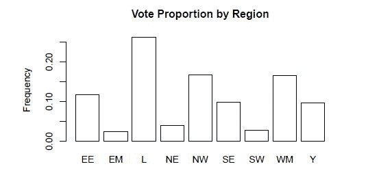

按区域投票比例

要创建图表，我们需要使用`table()`函数为`RegionName`中的每个区域的频率创建一个表格，然后将这个表格输入到`prop.table()`函数中，该函数计算相应的比例，这些比例随后被用作每个条形的高度。

我们使用`barplot()`函数来生成图表，并且可以指定一些选项，例如标题（`main`）、y 轴标签（`ylab`）和条形的颜色（`col`）。和往常一样，你可以通过`? barplot`来了解该函数的更多参数：

```py
table(data$RegionName) 
#> EE EM   L NE  NW SE SW  WM  Y
#> 94 20 210 32 134 79 23 133 78

prop.table(table(data$RegionName))
#>      EE      EM       L      NE      NW      SE      SW      WM       Y
#> 0.11706 0.02491 0.26152 0.03985 0.16687 0.09838 0.02864 0.16563 0.09714

barplot( 
    height = prop.table(table(data$RegionName)), 
    main = "Vote Proportion by Region", 
    ylab = "Frequency", 
    col = "white"
)
```

我们接下来的图表，如图下所示，更具吸引力。每个点代表一个区域观测值，它显示了每个区域的`Leave`投票比例，这些比例按照`RegionName`对应的垂直线排列，并按每个区域的白色人口比例着色。如图所示，我们还有另一个有趣的发现；似乎一个区域的居民人口越多元化（在较暗的点中可见），该区域投票支持留在欧盟的可能性就越大（`Proportion`值较低）。


按区域名称和白色人口百分比的比例

要创建图表，我们需要加载`ggplot2`和`viridis`包；第一个包将用于创建实际的图表，而第二个包将用于使用名为**Viridis**的科学色彩调色板（它来自 Nathaniel Smith 和 Stéfan van der Walt 进行的颜色感知研究，[`bids.github.io/colormap/`](http://bids.github.io/colormap/)）来着色点。`ggplot2`语法的细节将在第四章，*模拟销售数据和数据库操作*中解释，但就现在而言，你需要知道的是，该函数将数据框作为第一个参数接收，该数据框包含用于图表的数据，并将`aes`对象作为第二个参数接收，该对象通过`aes()`函数创建，它可以接收用于*x*轴、*y*轴和颜色的参数。之后，我们使用`geom_points()`函数添加一个*点层*，并使用`scale_color_viridis()`函数添加 Viridis 色彩调色板。注意我们在使用`ggplot2`时添加图表对象的方式。这是一个非常方便的功能，提供了很多功能和灵活性。最后，我们使用`print()`函数（在 R 中，一些用于绘图的函数会立即显示图表（例如，`barplot`），而其他函数返回一个图表对象（例如，`ggplot2`）并需要显式打印）来显示图表：

```py
library(ggplot2)
library(viridis)

plot <- ggplot(data, aes(x = RegionName, y = Proportion, color = White))
plot <- plot + geom_point() + scale_color_viridis()
print(plot)
```

下面的图表集显示了`NoQuals`、`L4Quals_plus`和`AdultMeanAge`变量的直方图。正如你所见，`NoQuals`变量似乎呈正态分布，但`L4Quals_plus`和`AdultMeanAge`变量似乎分别向左和向右偏斜。这告诉我们，样本中的大多数人教育水平不高，年龄超过 45 岁。

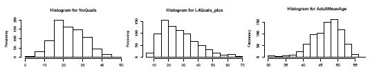

NoQuals、L4Quals_plus 和 AdultMeanAge 的直方图

创建这些图表很简单；你只需将用于直方图的变量传递给`hist()`函数，并且可以可选地指定图表的标题和*x*轴标签（我们将其留空，因为信息已经在图表的标题中了）。

对于这本书，我们以这种方式排列图表，使其间距和理解效率更高，但当你使用显示的代码创建图表时，你会逐个看到它们。有方法可以将各种图表组合在一起，但我们将它们放在第四章，*模拟销售数据和数据库操作*中讨论。

让我们看一下以下代码：

```py
hist(data$NoQuals, main = "Histogram for NoQuals", xlab = "")
hist(data$L4Quals_plus, main = "Histogram for L4Quals_plus", xlab = "")
hist(data$AdultMeanAge, main = "Histogram for AdultMeanAge", xlab ="")
```

现在我们对`NoQuals`、`L4Quals_plus`和`AdultMeanAge`变量的分布有了更多了解，我们将看到它们在下面显示的散点图中的联合分布。我们可以通过比较散点图中的*x*轴和*y*轴与直方图中的相应*x*轴，以及比较直方图中的频率（高度）与散点图中的点密度，来看到这些散点图如何类似于直方图。

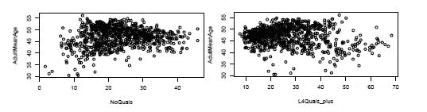

NoQuals 与 L4Quals_plus 对成人平均年龄的散点图

我们发现了一个轻微的关系，表明人们越老，他们的教育水平就越低。这可以有多种解释，但我们将其留作练习，以保持对编程的关注，而不是对统计学的关注。创建这些散点图也非常简单。只需将`x`和`y`变量发送到`plot()`函数，并可选地指定轴标签。

```py
plot(x = data$NoQuals, y = data$AdultMeanAge, ylab = "AdultMeanAge", xlab = "NoQuals")
plot(x = data$L4Quals_plus, y = data$AdultMeanAge, ylab = "AdultMeanAge", xlab = "L4Quals_plus")
```

# 使用矩阵散点图进行快速概述

如果我们想在单个图中可视化许多散点图以快速了解数据，会发生什么？在这种情况下，我们需要*矩阵散点图*。我们有各种包选项来创建此类矩阵散点图（例如`car`包）。然而，为了保持简单，我们将使用内置函数而不是外部包。

通过查看下面的图表，我们可以获得变量之间相互作用的整体视图。此类可视化的目的不是提供细节，而是提供一个一般性的概述。要阅读此图，我们需要查看矩阵中的任何有趣的散点图，并水平垂直移动，直到找到与其轴相关联的名称。

例如，如果你看`NoQuals`右侧的图，同时立即在`L4Quals_plus`上方，你所看到的是这两个变量之间的关系（`NoQuals`在*y*轴上，`L4Quals_plus`在*x*轴上），我们发现这是一种反向关系；一个区域中受过高等教育的人的百分比越高，受过低教育的人的百分比就越低。另一个明显的关联是，教育水平（`L4Quals_plus`）越高，职业（`HigherOccup`）就越高。

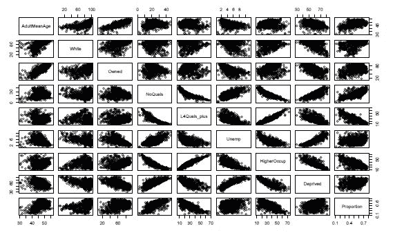

矩阵散点图

由于空间限制，我们无法显示所有变量关系，因为散点图会太小而无法理解。然而，我们鼓励读者将更多变量添加到矩阵中。有一些不明显的关系。找到它们留给读者作为练习：

```py
desired_variables <- c(
    "AdultMeanAge",
    "White",
    "Owned",
    "NoQuals",
    "L4Quals_plus",
    "Unemp",
    "HigherOccup",
    "Deprived",
    "Proportion"
)
pairs(data[, desired_variables])
```

# 通过详细的散点图获得更好的视角

现在我们已经知道了如何从散点图中获得整体视图，以获得变量之间关系的总体感觉，那么我们如何能够更详细地查看每个散点图呢？嗯，很高兴你提出了这个问题！为了实现这一点，我们将分两步进行。首先，我们将努力制作一个单一、详细的散点图，让我们感到满意。其次，我们将开发一个简单的算法，该算法将遍历所有变量组合，并为每个组合创建相应的图表：

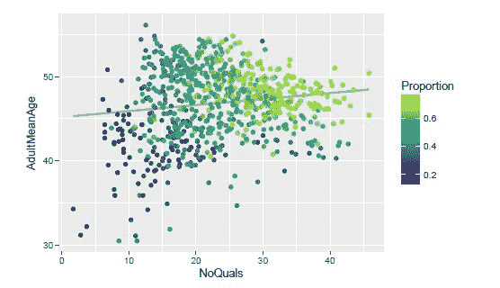

散点图：NoQuals 对 AdultMeanAge 对 Proportion 与回归线

上图所示的是我们的原型散点图。它在`x`和`y`轴上组合了变量，在我们的例子中是`NoQuals`和`AdultMeanAge`，根据相应的`Proportion`分配颜色，并在顶部放置一条对应线性回归的线，以获得轴上变量之间关系的总体感觉。将此图与之前一对散点图中的左侧散点图进行比较。它们是同一个图，但这个图更详细，传达了更多信息。这个图现在看起来已经足够好了。

```py
plot <- ggplot(data, aes(x = NoQuals, y = AdultMeanAge, color = Proportion))
plot <- plot + stat_smooth(method = "lm", col = "darkgrey", se = FALSE)
plot <- plot + scale_color_viridis()
plot <- plot + geom_point()
print(plot)
```

现在我们需要开发一个算法，该算法将接受所有变量组合并创建相应的图表。我们展示了完整的算法，并逐部分进行解释。正如你所看到的，我们开始定义`create_graphs_iteratively`函数，它接受两个参数：`data`和`plot_function`。该算法将获取数据的变量名称并将它们存储在`vars`变量中。然后它将从这些变量中移除`Proportion`，因为它们将被用来创建轴的组合，而`Proportion`将永远不会用于轴；它将仅用于颜色。

现在，如果我们想象所有变量组合在一个矩阵中，就像之前显示的矩阵散点图那样，那么我们需要遍历上三角形或下三角形以获得所有可能的组合（实际上，散点图的矩阵的上三角形和下三角形是对称的，因为它们传达相同的信息）。为了遍历这些三角形，我们可以使用一个*已知模式*，它使用两个 for 循环，每个循环对应一个轴，内循环只需要从外循环的位置开始（这就是形成三角形的原因）。`-1`和`+1`的存在是为了确保我们在每个循环中开始和结束在适当的位置，而不会因为数组边界错误而出现错误。

在内循环内部，我们将创建图表的名称，它是变量名称的组合，并使用`paste()`函数将它们连接起来，同时使用我们将作为参数发送的`plot_function`创建图表（关于这一点后面会详细介绍）。`png()`和`dev.off()`函数用于将图表保存到计算机的硬盘上。将`png()`函数视为 R 开始寻找图形的地方，将`dev.off()`视为停止保存过程的地方。您可以自由查看它们的文档或阅读更多关于 R 中的*设备*的信息。

```py
create_plots_iteratively <- function(data, plot_function) {
    vars <- colnames(data)
    vars <- vars(!which(vars == "Proportion"))
    for (i in 1:(length(vars) - 1)) {
        for (j in (i + 1):length(vars)) {
            save_to <- paste(vars[i], "_", vars[j], ".png", sep = "")
            plot_function(data, vars[i], vars[j], save_to)
        }
    }
}
```

我们几乎完成了；我们只需将我们用来将绘图原型转换为函数的代码包装起来，我们就可以一切就绪。正如你所见，我们提取了`x`、`y`和`color`参数作为变量，并将它们作为参数发送给函数（这被称为**参数化参数**），并且我们将`aes()`函数替换为`aes_string()`函数，后者能够接收带有字符串参数的变量。我们还添加了将`var_color`作为`FALSE`发送的选项，以避免使用带有颜色的图表版本。其他一切保持不变：

```py
prototype_scatter_plot <- function(data, var_x, var_y, var_color = "Proportion", save_to = "") {
    if (is.na(as.logical(var_color))) {
        plot <- ggplot(data, aes_string(x = var_x, y = var_y, color = var_color))
    } else {
        plot <- ggplot(data, aes_string(x = var_x, y = var_y))
    }
    plot <- plot + stat_smooth(method = "lm", col = "darkgrey", se = FALSE)
    plot <- plot + scale_color_viridis()
    plot <- plot + geom_point()
    if (not_empty(save_to)) png(save_to)
    print(plot)
    if (not_empty(save_to)) dev.off()
}
```

由于我们将在多个地方检查`save_to`字符串是否为空，因此我们给检查命名，并将其包装在`not_empty()`函数中。现在阅读我们的代码稍微容易一些。

```py
not_empty <- function(file) {
    return(file != "")
}
```

使用这个`prototype_scatter_plot()`函数，我们可以轻松地重新创建之前显示的正确散点图，以及任何其他变量组合。这似乎非常强大，不是吗？

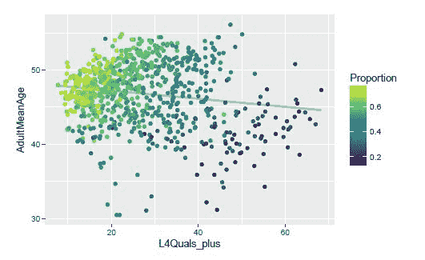

L4Quals_plus 与 AdultMeanAge 与 Proportion 的散点图，带有回归线

让我们看看以下代码：

```py
prototype_scatter_plot(data, "L4Quals_plus", "AdultMeanAge")
```

现在我们已经完成了艰苦的工作，我们可以非常容易地创建所有可能的组合。我们只需调用`create_plots_iteratively()`函数并传入我们的数据和`prototype_scatter_plot()`函数。将函数作为其他函数的参数使用称为**策略模式**。这个名字来源于我们可以轻松地更改我们的绘图策略，以适应任何其他我们想要的接收相同参数（`data`、`var_x`和`var_y`）以创建图表的策略，而无需更改我们的遍历变量组合的算法。这种灵活性非常强大：

```py
create_plots_iteratively(data, prototype_scatter_plot)
```

这将为我们创建所有图表并将它们保存到我们的硬盘上。很酷，不是吗？现在我们可以独立查看每一个，并使用它们做我们需要的任何事情，因为我们已经将它们作为 PNG 文件拥有了。

# 理解相关性中的交互作用

相关系数是衡量两个变量之间线性关系的一个度量。其值范围从`-1`（表示完美的反比关系）到`1`（表示完美的正比关系）。正如我们创建了散点图的矩阵，我们现在将创建相关性的矩阵，下面是得到的图形。大圆圈表示高绝对相关性。蓝色圆圈表示正相关，而红色圆圈表示负相关。

为了创建这个图，我们将使用`corrplot()`函数从`corrplot`包中，并传递由 R 中的`cor()`函数计算的相关性数据，以及可选的文本标签参数（如颜色`color`和大小`cex`）。

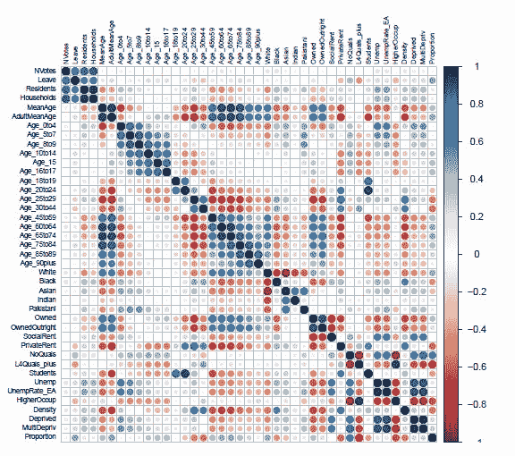

变量相关性

现在，让我们看一下以下代码：

```py
library(corrplot)
corrplot(corr = cor(data_numerical), tl.col = "black", tl.cex = 0.6)
```

如果我们查看`Proportion`变量与其他变量之间的关系，大蓝色圆圈中的变量与它呈正相关，这意味着该变量增加得越多，`Proportion`变量也增加的可能性就越大。例如，查看`AdultMeanAge`和`NoQuals`与`Proportion`之间的关系。如果我们发现`Proportion`与其他变量之间存在大红色圆圈，这意味着该变量增加得越多，`Proportion`减少的可能性就越大。例如，查看`Age_25to29`、`Age_30to44`和`L4Quals_plus`与`Proportion`之间的关系：

# 使用我们所学到的知识创建新的数据集

在本章中，我们所学到的知识是，年龄、教育和种族是理解人们在脱欧公投中投票方式的重要因素。受教育程度较高的年轻人与支持留在欧盟的投票相关。年长的白人与支持离开欧盟的投票相关。现在我们可以利用这些知识来创建一个更简洁的数据集，该数据集包含这些知识。首先，我们添加相关变量，然后移除非相关变量。

我们的新相关变量包括两组年龄（45 岁以下的成年人及以上 45 岁的成年人）、两组种族（白人和非白人）和两组教育水平（高教育水平和低教育水平）：

```py
data$Age_18to44 <- (
    data$Age_18to19 +
    data$Age_20to24 +
    data$Age_25to29 +
    data$Age_30to44
)
data$Age_45plus <- (
    data$Age_45to59 +
    data$Age_60to64 +
    data$Age_65to74 +
    data$Age_75to84 +
    data$Age_85to89 +
    data$Age_90plus
)
data$NonWhite <- (
    data$Black +
    data$Asian +
    data$Indian +
    data$Pakistani
)
data$HighEducationLevel <- data$L4Quals_plus
data$LowEducationLevel  <- data$NoQuals
```

现在，我们移除用于创建新变量的旧变量。为了做到这一点，而无需手动指定完整的列表，我们可以利用所有这些变量都包含单词`"Age"`的事实，我们创建了一个包含单词`"Age"`的变量逻辑向量，其中包含`TRUE`值（如果变量内部包含该单词，否则为`FALSE`），并确保我们保留新创建的`Age_18to44`和`Age_45plus`变量。我们手动移除其他种族和教育水平：

```py
column_names <- colnames(data)
new_variables <- !logical(length(column_names))
new_variables <- setNames(new_variables, column_names)
age_variables <- sapply(column_names, function(x) grepl("Age", x))
new_variables[age_variables]     <- FALSE
new_variables[["AdultMeanAge"]]  <- TRUE
new_variables[["Age_18to44"]]    <- TRUE
new_variables[["Age_45plus"]]    <- TRUE
new_variables[["Black"]]         <- FALSE
new_variables[["Asian"]]         <- FALSE
new_variables[["Indian"]]        <- FALSE
new_variables[["Pakistani"]]     <- FALSE
new_variables[["NoQuals"]]       <- FALSE
new_variables[["L4Quals_plus"]]  <- FALSE
new_variables[["OwnedOutright"]] <- FALSE
new_variables[["MultiDeprived"]] <- FALSE
```

我们通过选择新列来保存创建的`data_adjusted`对象，为新的数据结构创建新的数值变量，并将其保存为 CSV 文件：

```py
data_adjusted <- data[, new_variables]
numerical_variables_adjusted <- sapply(data_adjusted, is.numeric)
write.csv(data_adjusted, file = "data_brexit_referendum_adjusted.csv")
```

# 使用主成分构建新变量

**主成分分析**（**PCA**）是一种降维技术，在数据分析中当存在许多数值变量，其中一些可能相关联，并且我们希望减少理解数据所需的维度时，被广泛使用。

它可能有助于我们理解数据，因为思考超过三个维度可能会出现问题，并且可以加速计算密集型的算法，特别是当变量数量很多时。通过 PCA，我们可以将大部分信息提取到仅由一个或两个以非常特定方式构建的变量中，这样它们可以捕捉到最大的方差，同时由于构造上的原因，它们之间是不相关的。

第一主成分是原始变量的线性组合，它捕捉了数据集中最大的方差（信息）。没有其他成分的方差可以比第一主成分更高。然后，第二主成分与第一个主成分正交，并且以这种方式计算，以捕捉数据中剩余的最大方差。依此类推。所有变量都是彼此正交的线性组合，这是它们彼此之间不相关的关键。足够多的统计学讨论；让我们继续编程吧！

在 R 中进行 PCA 时，我们有各种函数可以完成这项任务。提及其中一些，我们有来自`stats`包（内置）的`prcomp()`和`princomp()`，来自`FactoMineR`包的`PCA()`，来自`ade4`包的`dudi.pca()`，以及来自`amap`包的`acp()`。在我们的案例中，我们将使用 R 内置的`prcomp()`函数。

为了执行我们的 PCA，我们将使用上一节调整后的数据。首先，我们移除与`比例`相关的数值变量。然后，我们将数值数据发送到`prcomp()`函数，以及一些归一化参数。`center = TRUE`将从每个变量中减去其均值，而`scale. = TRUE`将使每个变量的方差为单位方差，从而有效地归一化数据。在执行 PCA 时归一化数据非常重要，因为它是一种对尺度敏感的方法：

```py
numerical_variables_adjusted[["NVotes"]] <- FALSE
numerical_variables_adjusted[["Leave"]]  <- FALSE
data_numerical_adjusted <- data_adjusted[, numerical_variables_adjusted]
pca <- prcomp(data_numerical_adjusted, center = TRUE, scale. = TRUE)
pca
#> Standard deviations (1, .., p=21):
#> [1] 2.93919 2.42551 1.25860 1.13300 1.00800 0.94112 0.71392 0.57613
#> [9] 0.54047 0.44767 0.37701 0.30166 0.21211 0.17316 0.13759 0.11474
#> [17] 0.10843 0.09797 0.08275 0.07258 0.02717
#>
#> Rotation (n x k) = (21 x 21):
#>                     PC1       PC2      PC3       PC4      PC5
#> ID             0.008492 -0.007276  0.14499  0.174484 -0.82840
#> Residents      0.205721  0.004321  0.54743  0.303663  0.06659
#> Households     0.181071  0.008752  0.49902  0.470793  0.13119
#> AdultMeanAge  -0.275210  0.192311  0.14601 -0.011834  0.12951
#> White         -0.239842  0.112711 -0.25766  0.471189 -0.02500
#> Owned         -0.289544  0.085502  0.26954 -0.179515 -0.11673
(Truncated output)
```

当我们打印`pca`对象时，我们可以看到每个变量的标准差，但更重要的是，我们可以看到用于创建每个主成分的每个变量的权重。正如我们所见，当我们查看计算机上的完整输出时，在最重要的权重（绝对值最大的）中，我们有年龄和种族变量，以及其他一些变量，如房屋所有权。

如果您想获取新坐标系统中每个观测值的轴值，该坐标系统由主成分组成，您只需将数据中的每个观测值（每行）与`pca`对象中的旋转矩阵（`pca$rotation`）对应的权重相乘即可。例如，要知道数据中的第一个观测值相对于第二个主成分的位置，您可以使用以下方法：

```py
as.matrix(data_numerical_adjusted[1, ]) %*% pca$rotation[, 1]
```

通常情况下，您可以通过以下行将矩阵运算应用于您的数据中所有观测值相对于`pca`对象中所有主成分的坐标，这将执行矩阵乘法。请注意，您不需要亲自进行此操作，因为 R 在分析结果时会自动为您完成。

```py
as.matrix(data_numerical_adjusted) %*% pca$rotation
```

当我们查看`pca`的摘要时，我们可以看到每个主成分的标准差，以及它所捕获的方差比例和累积值。当决定在剩余分析中保留多少主成分时，这些信息很有用。在我们的案例中，我们发现仅用前两个主成分，我们就已经捕捉到了数据中大约 70%的信息，对于我们的情况可能已经足够了。

70%这个数字可以通过将我们要考虑的主成分的`Proportion of variance`值相加得到（按顺序，从`PC1`开始）。在这种情况下，如果我们把`PC1`和`PC2`的`Proportion of variance`相加，我们得到$0.411 + 0.280 = 0.691$，这几乎就是 70%。请注意，您可以直接查看`Cumulative proportion`来找到这个数字，而无需亲自进行求和，因为它会递增地累积`Proportion of variance`，从`PC1`开始。

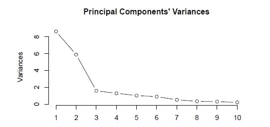

主成分的方差

请花一点时间思考一下这项技术的强大之处：仅用两个变量，我们就能捕捉到原始 40 个变量中包含的 70%信息：

```py
summary(pca)
#> Importance of components:
#>                          PC1   PC2    PC3    PC4    PC5    PC6    PC7
#> Standard deviation     2.939 2.426 1.2586 1.1330 1.0080 0.9411 0.7139
#> Proportion of Variance 0.411 0.280 0.0754 0.0611 0.0484 0.0422 0.0243
#> Cumulative Proportion  0.411 0.692 0.7670 0.8281 0.8765 0.9186 0.9429
#>                           PC8    PC9    PC10    PC11    PC12    PC13
#> Standard deviation     0.5761 0.5405 0.44767 0.37701 0.30166 0.21211
#> Proportion of Variance 0.0158 0.0139 0.00954 0.00677 0.00433 0.00214
#> Cumulative Proportion  0.9587 0.9726 0.98217 0.98894 0.99327 0.99541
#>                           PC14   PC15    PC16    PC17    PC18    PC19
#> Standard deviation     0.17316 0.1376 0.11474 0.10843 0.09797 0.08275
#> Proportion of Variance 0.00143 0.0009 0.00063 0.00056 0.00046 0.00033
#> Cumulative Proportion  0.99684 0.9977 0.99837 0.99893 0.99939 0.99971
(Truncated output)
```

在上面的图中，我们可以看到`summary(pca)`结果中的方差（以平方标准差的形式）。我们可以看到每个后续主成分如何捕捉到更少的总方差：

```py
plot(pca, type = "l", main = "Principal Components' Variances" )
```

最后，下面的图显示了 ward 观测值（点）在由我们的分析中两个主成分创建的平面上的散点图；它被称为**双变量图**。由于这两个主成分是原始变量的线性组合，因此在解释它们时我们需要一些指导。为了简化，箭头指向变量与主成分轴关联的方向。箭头离中心越远，对主成分的影响就越强。

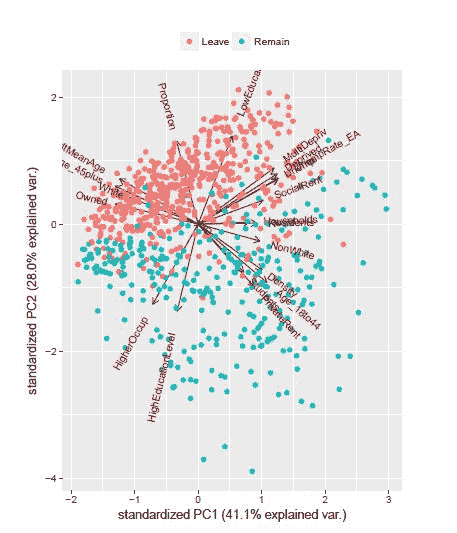

PCA 双变量图

通过这个双图，我们可以看到`比例`与投票离开欧盟的选区有很强的相关性，这是显而易见的，因为这是构造出来的。然而，我们还可以看到一些其他有趣的关系。例如，除了我们迄今为止发现的效果（年龄、教育和种族）之外，拥有自己的房子的人也与投票离开欧盟的更高倾向略有关联。另一方面，一个以前未知的关系是，一个选区的居民越密集（想想高度人口密集的城市），他们投票留在欧盟的可能性就越大：

```py
library(ggbiplot)
biplot <- ggbiplot(pca, groups = data$Vote)
biplot <- biplot + scale_color_discrete(name = "")
biplot <- biplot + theme(legend.position = "top", legend.direction = "horizontal")
print(biplot)
```

# 将所有内容整合成高质量的代码

现在我们已经了解了使用描述性统计来分析数据的基础知识，我们将通过将其分解成函数来改进代码的结构和灵活性。尽管这在高效程序员中是常识，但在数据分析师中却不是常见的做法。许多数据分析师会直接将我们开发的代码整体粘贴到一个文件中，每次他们想要进行数据分析时都运行它。我们不会向分析中添加新功能。我们唯一要做的就是将代码重新排序到函数中，以封装其内部工作原理并通过函数名传达意图（这大大减少了注释的需求）。

我们将专注于编写*高质量*的代码，这种代码易于阅读、重用、修改和修复（以防出现错误）。我们实际的做法是一个风格问题，不同的代码排列方式适合不同的上下文。我们将采用的方法是一种在各种情况下都对我很有帮助的方法，但它可能并不适合你。如果你觉得它不适合你的需求，请随意更改它。无论你更喜欢哪种风格，投资于培养不断生产高质量代码的习惯，将使你在长期内成为一个更高效的程序员，并且最终你会不想再以低效的方式进行编程。

# 编程前的规划

通常，人们在还没有一个关于他们想要完成什么的一般想法之前就开始编程。如果你是一个经验丰富的程序员，这可能是一个了解问题的好方法，因为你已经发展出了直觉，而且你很可能会扔掉前几次尝试。然而，如果你是一个新手程序员，我建议你在编写任何代码之前明确你的目标（将它们写下来可以帮助）。通过问自己某种做事方式将如何影响你的目标，这将帮助你做出更好的决定。因此，在我们设置任何东西之前，我们需要理解和明确我们的总体目标：

1.  快速理解分析的大致情况。

1.  通过执行单个文件自动重现我们的分析。

1.  保存分析产生的所有对象、文本和图像。

1.  测量执行完整分析所需的时间量。

1.  在进行迭代过程工作时，要知道完成百分比。

1.  能够轻松找到并更改分析的每一部分。

为了实现这些一般目标，我们需要开发模块化代码，具有良好管理的依赖关系，这些代码是灵活的（易于更改）并且对副作用友好（保存对象、文本和图像）。即使你的明确目标不需要这样做，你也应该养成这样编程的习惯，即使只是在进行数据分析时也是如此。

# 理解高质量代码的基本原理

模块化、灵活且依赖关系管理良好的代码被称为**高度内聚**和**松散耦合**。这些术语主要在面向对象环境中使用（更多内容请参阅第八章，《面向对象的加密货币跟踪系统》），但它们适用于任何系统。**高度内聚**意味着应该在一起的事物确实在一起。**松散耦合**意味着不应该在一起的事物确实没有在一起。以下图像展示了这些特征，其中每个圆圈都可以是一个函数或对象。这些都是依赖关系管理的基本原则。许多专注于这些主题的书籍已经出版，并且仍在出版。对于感兴趣的读者，Steve McConnell 的《代码大全》（Microsoft Press，2004）和 Robert Martin 的《代码整洁之道》（Prentice Hall，2009）是极好的参考。在这本书中，你将看到一些这些技术的应用。


高内聚和低耦合（左）与低内聚和高耦合（右）

高质量代码最重要的原则是：

1.  将事物分解成小而专注于单一职责的部分。

1.  具体依赖于抽象（而不是相反）。

1.  使事物具有高度内聚性和松散耦合性。

当我说“事物”时，指的是函数、方法、类和对象等。我们将在第八章中更多地讨论这些内容，《面向对象的加密货币跟踪系统》。

我们首先创建两个文件：`functions.R` 和 `main.R`。`functions.R` 文件包含高级函数（主要从 `main.R` 文件中调用）以及低级函数（在其他函数中使用）。通过阅读 `main.R` 文件，我们应该对分析的内容有一个清晰的认识（这是高级函数的目的），执行它应该能够为符合我们基本假设的任何数据重新创建我们的分析（对于这个例子，这些主要是数据结构）。

我们应该始终将相关代码保持在相同的抽象级别。这意味着我们不想在大图层面编程，然后用混合的细节来实现它，将代码分离到`main.R`和`functions.R`是朝这个方向迈出的第一步。此外，`main.R`文件中的任何代码都不应依赖于实现的细节。这使得代码模块化，从某种意义上说，如果我们想改变某个实现的方式，我们可以这样做，而无需更改高级代码。然而，我们实现事物的方式取决于我们想要分析最终要做什么，这意味着具体的实现应该依赖于抽象的实现，而抽象的实现又依赖于我们分析的目的（在`main.R`文件中以代码的形式表述）。

当我们将知识从一个代码集带到另一个代码集时，我们正在生成一个依赖关系，因为了解其他代码的代码依赖于它才能正常工作。我们尽可能地避免这些依赖关系，最重要的是，我们想要管理它们的方向。正如之前所述，抽象不应依赖于具体，或者换句话说，具体应依赖于抽象。由于分析（`main.R`）在抽象方面，它不应依赖于具体函数的实现细节。但是，我们的分析如何在没有了解实现它的函数的知识的情况下进行呢？嗯，它不能。这就是为什么我们需要一个中介，即抽象函数。这些函数的存在是为了向`main.R`提供稳定的知识，并保证所寻找的分析将被执行，并且通过管理这些知识来消除`main.R`对实现细节的依赖。这可能看起来是一种复杂的工作方式，也是一个难以理解的概念，但当你理解它时，你会发现它非常简单，你将能够创建可插入的代码，这将大大提高效率。你可能想看看之前提到的书籍，以更深入地了解这些概念。

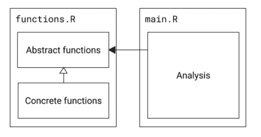

通用代码结构

之前的图表显示，我们的分析依赖于抽象函数（接口），以及实现这些接口的具体代码。这些抽象函数让我们逆转了具体函数和分析之间的依赖关系。我们将在第八章面向对象系统跟踪加密货币中更深入地探讨这些概念。

# 通过可视化大图进行编程

现在，我们将采用自顶向下的方法，这意味着我们将首先从抽象代码开始，然后逐渐过渡到实现细节。通常我发现这种方法在你对想要做什么有清晰的想法时更有效。在我们的情况下，我们将从处理`main.R`文件开始。

需要注意的第一点是，我们将使用 `proc.time()` 函数两次，一次在开始时，一次在结束时，我们将使用这两个值之间的差异来衡量整个代码执行所需的时间。

需要注意的第二点是，`empty_directories()` 函数确保指定的每个目录都存在，并删除它们包含的任何文件。我们在每次执行开始时使用它来清理目录，以确保我们拥有最新的文件，并且只有上一次运行中创建的文件。实际的代码如下所示，它简单地遍历传递给每个目录，使用 `unlink()` 函数递归地删除任何文件，并使用 `dir.create()` 函数确保目录存在。通过使用 `showWarnings = FALSE` 参数，它避免了由于目录已存在而显示任何警告，这在我们的情况下不是问题。

```py
empty_directories <- function(directories) {
    for (directory in directories) {
        unlink(directory, recursive = TRUE)
        dir.create(directory, showWarnings = FALSE)
    }
}
```

从 第一章，《R 语言入门》，我们使用 `print_section()` 和 `empty_directories()` 函数分别打印标题和删除目录内容（每次我们使用空目录运行函数时重新创建结果），并且我们将使用 `proc.time()` 显示的机制来测量执行时间。

现在前面两点已经解决，我们继续展示 `main.R` 文件的全部内容。

```py
start_time <- proc.time()

source("./functions.R")

empty_directories(c(
    "./results/original/",
    "./results/adjusted/",
    "./results/original/scatter_plots/"
))

data <- prepare_data("./data_brexit_referendum.csv", complete_cases = TRUE)

data_adjusted           <- adjust_data(data)
numerical_variables     <- get_numerical_variable_names(data)
numerical_variables_adj <- get_numerical_variable_names(data_adjusted)

print("Working on summaries...")

full_summary(data, save_to = "./results/original/summary_text.txt")
numerical_summary(
    data,
    numerical_variables = numerical_variables,
    save_to = "./results/original/summary_numerical.csv"
)

print("Working on histograms...")

plot_percentage(
    data,
    variable = "RegionName",
    save_to = "./results/original/vote_percentage_by_region.png"
)

print("Working on matrix scatter plots...")

matrix_scatter_plots(
    data_adjusted,
    numerical_variables = numerical_variables_adj,
    save_to = "./results/adjusted/matrix_scatter_plots.png"
)

print("Working on scatter plots...")

plot_scatter_plot(
    data,
    var_x = "RegionName",
    var_y = "Proportion",
    var_color = "White",
    regression = TRUE,
    save_to = "./results/original/regionname_vs_proportion_vs_white.png"
)
all_scatter_plots(
    data,
    numerical_variables = numerical_variables,
    save_to = "./results/original/scatter_plots/"
)

print("Working on correlations...")

correlations_plot(
    data,
    numerical_variables = numerical_variables,
    save_to = "./results/original/correlations.png"
)

print("Working on principal components...")

principal_components(
    data_adjusted,
    numerical_variables = numerical_variables_adj,
    save_to = "./results/adjusted/principal_components"
)

end_time <- proc.time()
time_taken <- end_time - start_time
print(paste("Time taken:", taken[1]))

print("Done.")
```

正如你所见，仅凭这个文件，你就能获得分析的大致轮廓，并且能够通过运行单个文件来重现你的分析，将结果保存到磁盘（注意 `save_to` 参数），并测量执行完整分析所需的时间。从我们的总体目标列表中，目标一至四通过此代码实现。实现目标五和六将通过在 `functions.R` 文件上工作来完成，该文件包含许多小函数。拥有这个 `main.R` 文件为我们提供了需要编程的地图，尽管现在它可能无法工作，因为其中使用的函数尚未存在，但当我们完成编程时，此文件将不需要任何更改并产生预期的结果。

由于空间限制，我们不会查看 `main.R` 文件中所有函数的实现，只看代表性的：`prepare_data()`、`plot_scatter_plot()` 和 `all_scatter_plots()`。其他函数使用类似的技术来封装相应的代码。你始终可以访问这本书的代码仓库 ([`github.com/PacktPublishing/R-Programming-By-Example`](https://github.com/PacktPublishing/R-Programming-By-Example)) 来查看其余的实现细节。阅读完这本书后，你应该能够确切地了解该仓库中每个文件中发生的事情。

我们从`prepare_data()`函数开始。这个函数是抽象的，并使用四个不同的具体函数来完成其工作，分别是`read.csv()`、`clean_data()`、`transform_data()`，以及在需要时使用`complete.cases()`。第一个函数，即`read.csv()`，接收要读取数据的 CSV 文件路径，并将数据加载到名为`data`的数据框对象中。第四个函数你在第一章，*R 语言简介*中已经见过，所以这里我们不再解释。第二个和第三个函数是我们自己创建的，我们将对它们进行解释。请注意，`main.R`并不了解数据是如何准备的，它只要求准备数据，并将任务委托给抽象函数`prepare_data()`。

```py
prepare_data <- function(path, complete_cases = TRUE) {
    data <- read.csv(path)
    data <- clean_data(data)
    data <- transform_data(data)
    if (complete_cases) {
        data <- data[complete.cases(data), ]
    }
    return(data)
}
```

`clean_data()`函数目前只是简单地封装了将`NA`的-1 重新编码的过程。如果我们的清理过程突然变得更加复杂（例如，需要更多清理的新数据源或意识到我们遗漏了某些内容，需要将其添加到清理过程中），我们将把这些更改添加到这个函数中，而无需修改代码的其他部分。这些都是将代码封装到函数中，以传达意图并隔离需要执行的小步骤的一些优点：

```py
clean_data <- function(data) {
    data[data$Leave == -1, "Leave"] <- NA
    return(data)
}
```

为了通过添加额外的`Proportion`和`Vote`变量以及重新标记区域名称来转换我们的数据，我们使用了以下函数：

```py
transform_data <- function(data) {
    data$Proportion <- data$Leave / data$NVotes
    data$Vote <- ifelse(data$Proportion > 0.5, "Leave", "Remain")
    data$RegionName <- as.character(data$RegionName)
    data[data$RegionName == "London", "RegionName"]                   <- "L"
    data[data$RegionName == "North West", "RegionName"]               <- "NW"
    data[data$RegionName == "North East", "RegionName"]               <- "NE"
    data[data$RegionName == "South West", "RegionName"]               <- "SW"
    data[data$RegionName == "South East", "RegionName"]               <- "SE"
    data[data$RegionName == "East Midlands", "RegionName"]            <- "EM"
    data[data$RegionName == "West Midlands", "RegionName"]            <- "WM"
    data[data$RegionName == "East of England", "RegionName"]          <- "EE"
    data[data$RegionName == "Yorkshire and The Humber", "RegionName"] <- "Y"
    return(data)
}
```

你之前已经看到过所有这些代码行。我们所做的只是将它们封装到函数中，以传达意图，并允许我们找到某些过程发生的位置，这样我们就可以在需要时轻松地找到并更改它们。

现在我们来看看`plot_scatter_plot()`函数。这个函数介于抽象和具体函数之间。我们将在`main.R`文件中直接使用它，但也会在`functions.R`文件中的其他函数中使用它。我们知道大多数时候我们会使用`Proportion`作为颜色变量，所以我们将其作为默认值添加，但允许用户通过检查参数是否被发送为`FALSE`来完全移除颜色，并且由于我们将使用这个相同的函数来创建类似于我们迄今为止创建的所有散点图的图形，我们将回归线设置为可选。

注意，在前面的图形中，*x*轴是一个连续变量，但在后面的图形中，它是一个分类的（*因子*）变量。这种灵活性非常强大，并且由于`ggplot2`能够适应这些变化，我们才能拥有它。正式上，这被称为**多态性**，我们将在第八章，*面向对象系统追踪加密货币*中对其进行解释。

最后，我们不再假设用户总是希望将生成的图表保存到磁盘上，因此我们将`save_to`参数设置为可选，为其提供一个空字符串。当合适的时候，我们使用`not_empty()`函数检查这个字符串是否为空，如果不为空，我们设置 PNG 保存机制。

```py
plot_scatter_plot <- function(data,
                             var_x,
                             var_y,
                             var_color = "Proportion",
                             regression = FALSE,
                             save_to = "") {
    if (var_color) {
        plot <- ggplot(data, aes_string(x = var_x, y = var_y, color = var_color))
    } else {
        plot <- ggplot(data, aes_string(x = var_x, y = var_y))
    }
    plot <- plot + scale_color_viridis()
    plot <- plot + geom_point()
    if (regression) {
        plot <- plot + stat_smooth(method = "lm", col = "grey", se = FALSE)
    }
    if (not_empty(save_to)) png(save_to)
    print(plot)
    if (not_empty(save_to)) dev.off()
}
```

现在我们来看一下`all_scatter_plots()`函数。这个函数是一个抽象函数，它隐藏了用户所不知道的函数名称，即用于迭代创建图表的函数，这个函数被方便地命名为`create_graphs_iteratively()`，以及之前看到的绘图函数`plot_scatter_plot()`。如果我们想改进迭代机制或绘图函数，我们可以在不要求使用我们代码的人做出任何更改的情况下做到这一点，因为这种知识被封装在这里。

封装那些经常变化或预期会变化的元素。

`create_graphs_iteratively()`函数与之前我们看到的一样，只是进度条代码有所不同。`progress`包提供了`progress_bar$new()`函数，在迭代过程执行时在终端创建进度条，这样我们可以看到完成过程的百分比，并知道剩余多少时间（有关更多信息，请参阅附录，*必需的包*）。

注意`plot_scatter_plot()`和`all_scatter_plots()`函数中`save_to`参数的变化。在前者中，它是一个文件名；在后者中，是一个目录名。这种差异虽小，但很重要。粗心大意的读者可能不会注意到这一点，这可能会导致混淆。`plot_scatter_plot()`函数生成单个图表，因此接收一个文件名。然而，`all_scatter_plots()`函数将通过使用`plot_scatter_plot()`生成大量的图表，因此它必须知道所有这些图表需要保存的位置，动态创建最终的图像名称，并将它们逐个发送到`plot_scatter_plot()`。最后，由于我们希望回归分析包含在这些图表中，我们只需发送`regression = TRUE`参数：

```py
all_scatter_plots <- function(data, numerical_variables, save_to = "") {
    create_graphs_iteratively(data, numerical_variables, plot_scatter_plot, save_to)
}

create_graphs_iteratively <- function(data,
                                      numerical_variables,
                                      plot_function,
                                      save_to = "") {

    numerical_variables[["Proportion"]] <- FALSE
    variables <- names(numerical_variables[numerical_variables == TRUE])

    n_variables <- (length(variables) - 1)
    progress_bar <- progress_bar$new(
        format = "Progress [:bar] :percent ETA: :eta",
        total = n_variables
    )
    for (i in 1:n_variables) {
        progress_bar$tick()
        for (j in (i + 1):length(variables)) {
            image_name <- paste(
                save_to,
                variables[i], "_",
                variables[j], ".png",
                sep = ""
            )
            plot_function(
                data,
                var_x = variables[i],
                var_y = variables[j],
                save_to = image_name,
                regression = TRUE
            )
        }
    }
}
```

我们尚未详细查看的其他函数，其技术方法与我们展示的方法类似，完整的实现可以在本书的代码仓库中找到（[`github.com/PacktPublishing/R-Programming-By-Example`](https://github.com/PacktPublishing/R-Programming-By-Example)）。

# 摘要

本章展示了如何进行定性分析，这在数据分析的第一步中非常有用。我们展示了描述性统计技术及其编程实现。凭借这些技能，我们能够执行简单而强大的分析，并将结果保存以供以后使用。具体来说，我们展示了如何进行基本数据清洗，如何编程创建图表，如何创建矩阵散点图和矩阵相关性，如何进行主成分分析，以及如何将这些工具结合起来理解手头的数据。最后，我们简要介绍了高质量代码的基础知识，并展示了如何将你的初始数据分析代码转换为模块化、灵活且易于工作的程序。

在第三章，“使用线性模型预测选票”，我们将展示如何使用定性工具扩展当前的分析。具体来说，我们将展示如何使用线性模型来理解变量对英国离开和留在欧盟的投票比例的定量影响，如何对没有投票数据的选区进行预测，以及如何使用我们拥有的数据来衡量这些预测的准确性。这些是任何数据分析师必备的技能，正如我们在本章中所做的那样，我们将看到如何通过编程实现这些技能。
