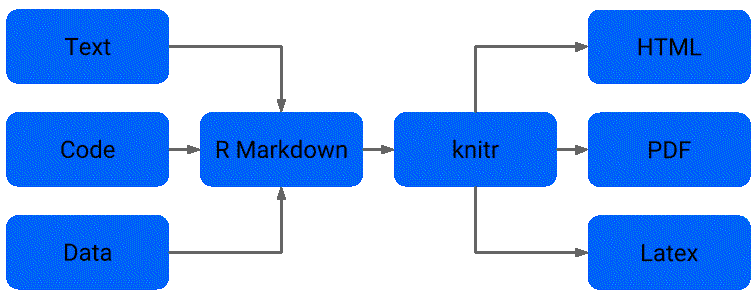
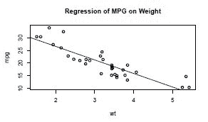
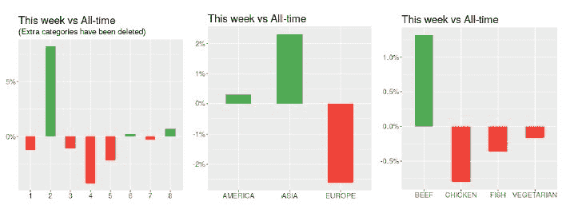
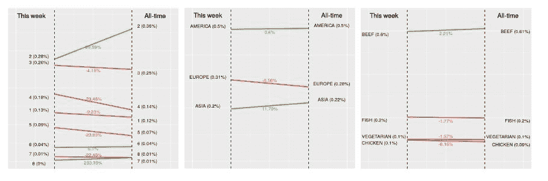

# 第七章：开发自动演示文稿

你是否发现自己反复进行同样的机械任务？令人惊讶的是，许多程序员、统计学家和科学家通常不花时间自动化许多活动，尤其是报告结果。这样做将使他们能够更深入地专注于他们的核心能力。此外，这不仅仅是个人的问题；大型组织仍然没有自动化许多流程，尤其是分析流程。还记得我们在第二章，*使用描述性统计理解投票*中执行的图形创建自动化，或者我们在第三章，*使用线性模型预测投票*中执行的回归自动化吗？在本章中，我们将向您展示如何自动化另一项活动——开发演示文稿。通过这种方式，我们并不是指自动化结果背后的解释，而是自动化展示流程*当前状态*的表格和图形的幻灯片创建。这是一个非常高的效益/成本区域，通常被忽视，很多时间都浪费在制作这样的演示文稿以供同行讨论上。

这是《食品工厂》示例的最后一章，在这里，我们将自动化许多组织中的许多人反复进行的活动——为每周更新开发演示文稿。我们将展示 R 中的内容自动化流程是什么样的，并构建一个可以自动使用最新数据更新的演示文稿。为此，我们将使用我们在本示例前几章中开发的结果。

本章涵盖的一些重要主题如下：

+   自动化的重要性和好处

+   设置和运行自动化流程

+   使用文献编程交流想法

+   使用 Markdown 编写静态内容

+   使用 R Markdown 开发动态内容

+   使用 knitr 制作演示文稿和网页

+   高效集成 R 资源

# 必需的软件包

本章只需要两个必需的软件包，你应该能够在你的系统中无问题地安装它们。更多信息请参阅附录*，必需的软件包*。

| **软件包** | 原因 |
| --- | --- |
| `ggrepel` | 避免在图形中重叠标签 |
| `rmarkdown` | 带有可执行 R 代码的 Markdown 文档 |

# 为什么要投资自动化？

自动化是一种投资。它通常涉及将不同的应用程序集成在一起，以便重复执行流程，希望无缝且轻松。流程自动化可以通过减少执行重复性任务所需的时间来提高生产力，同时减少缺陷，这也可以节省时间并增强价值创造过程。

此外，自动化系统不会感到无聊。很可能任何必须反复执行重复性任务的人都会感到无聊。这会减慢他们的表现并增加缺陷的风险。自动化流程不会感到无聊，无论运行多少次，因此性能不太可能减慢。

科学家可以通过科学方法利用自动化来缩短周期时间，这反过来又提高了学习率，通常是指数级的。在我看来，这是自动化最强大的后果之一：通过让我们（人类）从那些我们无法增加价值的活动中解脱出来，从而加速学习过程，并让我们专注于那些（到目前为止）无法自动化的活动，例如创造性地解决问题或开发创新解决方案。

最后，人们常常抱怨没有足够的时间。一种有效的方法是自动化流程，这就是自动化的最终好处——让你的时间更加充实。

# 文献编程作为一种内容创作方法

自动化要求我们将不同的部分组合在一起，使得流程对人类和机器都清晰可见。流程必须是可重复的，并且能够随着新想法的产生或需求的变化而发展。通过文献编程可以实现内容创作自动化，这源于唐纳德·克努特在 1992 年的《文献编程》一书（[`www-cs-faculty.stanford.edu/~knuth/lp.html`](http://www-cs-faculty.stanford.edu/~knuth/lp.html)）。基本思想是将文档视为文本和代码的结合。代码被分成块，周围的文本解释代码块的内容。文本根据需要调整，以保持代码背后的思想更新、清晰和准确。

在本章中，我们使用“展示”和“文档”这两个词可以互换使用，因为你可以使用我们将展示的工具创建它们。

文献编程不是自动化内容创作的必要条件，但它确实是一个很好的工具。文献编程的优点是易于阅读，就像手册或指令集一样。此外，它允许代码和自然语言结合在一起。结果可以在我们浏览文档时自动显示。文档本身是简单的文本，这使得它灵活且易于更改。一般来说，文献程序被“编织”成人类可读的文档，并被“纠缠”成机器可读的文档。为了使这一切工作，我们只需要一种文档语言和一种编程语言，在我们的例子中是英语和 R 语言。

文献编程似乎有潜力使许多目前用于生成内容的工具变得过时。然而，如果你需要生成具有非常精确格式或需要高度技术优化的文档，仍然有更好的工具可用。这并不是因为文献编程概念本身有任何固有的弱点，而是因为可用的工具在这些方面并不像专业工具那样高效。

当谈到文献编程时，R 在技术复杂性和简单展示之间找到了一个很好的平衡，这使得可以开发出广泛的内容自动化，这可以产生非常适合研究和数据分析的文档。如果你在某个时候发现你需要进行更改，你可以轻松地做到这一点，重新编译，你将在几秒钟内看到最新版本。这就是为什么我们将在本章中向您展示如何以这种方式开发自动化演示文稿非常方便。

# 文献编程作为可重复性的好处

在科学中，可重复性是验证和验证分析发现最重要的元素。我们运行的分析和模型、算法比以往任何时候都要复杂。即使对于复杂的人来说，对这些算法有基本理解也很困难，而且几乎不可能仅用文字来描述。现在理解某人做了什么需要直接查看数据和代码，而不仅仅是结果。

科学家们写了很多报告，描述数据分析的结果。使这些报告可重复是让同行审阅你的工作的关键，而且这是使用文献编程实现这一目标的非常好的方法。有了它，最终报告依赖于在创建时执行的代码，因此可重复性被嵌入到过程中。从数据和代码到最终报告有一个清晰且自动的路径。

由于提供了开发和通信效率，文献编程在数据分析中已经变得相当流行。在接下来的章节中，我们将展示如何使用 R、R Markdown 和 knitr 来实现它。

# 自动化流程的基本工具

流程是一个从文本、代码和原始数据开始，以我们想要展示或分发的最终文档或演示文稿结束的过程。幸运的是，在 R 中，许多艰苦的工作已经为你自动化了，所以你除了安装这些工具和设置编译文件之外，不需要做太多。



我们的设计流程应该足够通用，以便能够适应各种用例，而无需进行实质性的修改。如果是这样，我们就可以掌握一套工具，并可以在不同的项目中重复使用，而不是每次都学习一套新的工具集。在输入端，使用文本、代码和数据已经足够通用。在输出端，能够生成 HTML、PDF、LaTeX 甚至 Word 文档似乎也足够通用，因此我们可以继续前进。

Markdown 是一种低开销的标记语言（[`spec.commonmark.org/0.28/`](http://spec.commonmark.org/0.28/))。对于作者来说，它的主要好处是它允许我们专注于写作而不是格式化。它具有简单、最小化但直观的格式化元素，并且有许多程序可以将 Markdown 转换为 HTML 和 PDF 文件等。R Markdown 是 Markdown 的扩展，用于结合 R 代码（[`rmarkdown.rstudio.com/`](http://rmarkdown.rstudio.com/))。在 R Markdown 中编写的文档包含嵌套的 R 代码，这使得我们可以创建动态演示。它们不能使用标准的 Markdown 工具进行评估。相反，R 代码在调用传统的 Markdown 工具之前作为 R Markdown 处理的一部分进行评估。

R 中第一个文学编程系统之一是**Sweave**，它用于使用**LaTeX**（[`www.latex-project.org/`](https://www.latex-project.org/)）创建动态报告和可重复的研究。Sweave 允许在 LaTeX 文档中嵌入 R 代码，以生成包含文本、分析、图形、代码和计算结果的 PDF 文件。knitr（首字母小写）是一个 R 包，它为 Sweave 添加了许多新功能（[`yihui.name/knitr/`](https://yihui.name/knitr/))）。

R Markdown 可以使用 R 中的 knitr 包转换为标准 Markdown，该包将 R 结果插入到 Markdown 文档中。Markdown 随后可以使用 Pandoc（一个非常强大的文档转换器，[`pandoc.org/`](https://pandoc.org/))转换为 HTML。使用 R Markdown 创建可重复的报告已经迅速成为许多科学家的核心工具。

我们不会深入探讨 Sweave、LaTeX 或 Pandoc 如何在不同格式之间转换文件，因为您不需要直接操作它们。我们将专注于使用 R Markdown 和 knitr。然而，在我们继续之前，我们仍然需要确保我们已经在系统中安装了所有这些工具。Sweave 包含在任何 R 发行版中。R Markdown 和 knitr 可以在 R 中安装。Pandoc 和 LaTeX 应直接安装到您的计算机上。有关 Windows、macOS 和 Linux 的具体说明，请参阅附录，“所需软件包”。

最后，您应该注意，这些并不是制作自动化内容的唯一工具。随着 R 的文献编程成为热点话题，自然地，许多工具已经开发出来，并且仍在继续开发。尽管本章重点介绍 R Markdown 和 knitr，但还有其他工具，如**R Studio 的演示者**（**RPres**）和**Slidify**。我们没有在本书中展示这些工具，因为它们要么在应用上更加受限，要么在用法上更加复杂。我们相信，R Markdown-knitr 组合在功能性和易用性之间取得了非常好的平衡，这是我们首选的组合。然而，我们鼓励读者研究其他工具，找到最适合的工具。

# Markdown 的温和介绍

Markdown 有各种语法版本，这些版本由不同的系统和平台支持。我们在这里展示的是一种通用的版本，它在许多系统中都很有用，包括 R Markdown。

我们在以下示例中展示的是使用 Markdown 结构化内容的基本元素。实际的美观取决于应用于您的文件的风格。以下示例没有应用任何美学。我们将在本章后面向您展示如何调整它们以适应我们的演示。

# 文本

如果您想使用简单的文本，您可以像平时一样写。如果您想格式化文本，可以使用一对星号（`*`）或下划线（`_`）。以下表格显示了如何使用一对星号。下划线的作用相同。

如果我们使用以下输入：

```py
Text with *italic* text inside.
Text with **bold** text inside.
Text with **bold and *italic* text**.
```

我们会得到以下输出：

包含*斜体*文本的文本。

包含**粗体**文本的文本。

包含***粗体和斜体文本***的文本。

# 标题

如果您想，您可以有相当于部分（一级标题）、子部分（二级标题）、次子部分（三级标题）等等。组织结构使用数字符号标记，重复次数与您希望在文档中产生的深度相同。例如，`# 标题`会产生一个一级标题，而`### 标题`会创建一个三级标题。

如果我们使用以下输入：

```py
# Header Level 1

## Header Level 2

### Header Level 3

#### Header Level 4
```

我们会得到以下输出：

# 标题级别 1

# 标题级别 2

# 标题级别 3

# 标题级别 4

# 列表

列表可以是有序的、无序的，也可以标记为任务。这些涵盖了您可能需要的绝大多数情况，并且它们的使用非常简单。对于有序列表，您可以使用连字符（-）或星号（*），并且您可以嵌套它们以创建嵌套列表。对于有序列表，您可以使用数字和字母。最后，要创建任务列表，您只需在项目开头放置一对括号（[]）。如果括号中包含一个 X，则表示该任务已完成。如果括号之间有空格，则表示该项目仍在待办。

如果我们使用以下输入：

```py
1\. This is an ordered item
    - This is an unordered item
    - This is another unordered item
2\. This is another ordered item
    - [ ] This is a pending task
    - [X] This is a completed task
- [ ] This is another incomplete task
    1\. Which contains one ordered item
    - And one unordered item
```

输出

1.  这是一个有序列表项

    +   这是一个无序列表项

    +   这是另一个无序列表项

1.  这是一个另一个有序列表项

    +   [ ] 这是一个待办任务

    +   [X] 这是一个完成的任务

+   [ ] 这是另一个未完成的任务

1.  其中有一个有序列表项

    +   有一个无序列表项

# 表格

在使用 Markdown 时，表格是最繁琐的结构之一来创建。话虽如此，创建它们仍然不难。如果你对齐它们，一切看起来都很正常。然而，大多数时候，人们没有对齐它们，如果你不熟悉语法，它们看起来会有些奇怪。我们所说的非对齐表格是指项目后面没有填充空间，这样垂直线才能对齐。下面显示的表格是一个对齐表格。

如果我们使用以下输入：

```py
| First column | Second column | Third column |
|--------------|---------------|--------------|
| Item one     | Item two      | Item three   |
| Item four    | Item five     | Item six     |
| Item seven   | Item eight    | Item nine    |
```

我们得到以下输出：

| **第一列** | **第二列** | **第三列** |
| --- | --- | --- |
| 第一项 | 第二项 | 第三项 |
| 第四项 | 第五项 | 第六项 |
| 第七项 | 第八项 | 第九项 |

# 链接

要提供链接，你可以直接写出链接。如果你想给链接命名，以便只显示名称而不显示 URL，就像你在网页上看到的那样，你可以使用包含名称的括号后立即跟包含实际链接的括号，格式为"名称"。

如果我们使用以下输入：

```py
[The R Project for Statistical Computing](https://www.r-project.org/) 
[Packt Publishing](https://www.packtpub.com/)
```

我们得到以下输出：

[The R Project for Statistical Computing](https://www.r-project.org/)

[Packt Publishing](https://www.packtpub.com/)

# 图片

图片的结构与链接类似，但它们前面有一个感叹号（!）。图片的名称（括号内的内容）仅在实际图片未显示时（例如，文件未在指定的路径中找到）才会显示。URL 会被替换成你想显示的图片的路径。默认情况下，图片的大小将是尽可能大。假设图片位于与 Markdown 文件相同的目录下的名为 images 的目录中，以下示例是有效的。

如果我们使用以下输入：

```py
The R Project for Statistical Computing 

Packt Publishing
```

我们得到以下输出：


# 引用

引用非常有助于强调读者想要强调的点。它们也非常容易创建。你只需要在行首添加一个大于号（>）后跟一个空格。

如果我们使用以下输入：

```py
> Look deep into nature, and then you will understand everything better.
>
> —Albert Einstein
```

我们得到以下输出：

深入研究自然，然后你就会更好地理解一切。

- 阿尔伯特·爱因斯坦

# 代码

代码可以通过在它周围使用单反引号（`` ` ``）来嵌入到文本中，或者可以通过使用三重反引号（```py` ``` ```py`). Optionally, you may specify the programming language in the code block to activate syntax highlighting for that code.

If we use the following input:

```）在独立块中使用。

```pyr
add_two_numbers <- function(x, y) {
    return(x + y)
}
```

```py

We get the following output:

```

add_two_numbers <- function(x, y) {

    return(x + y)

}

```py

# Mathematics

Embedding mathematics in Markdown is similar to embedding code. However, instead of using backticks (“ ’), you use dollar signs ($). If you want to use mathematics blocks, you may use two (instead of three) dollar signs. Keep in mind that this is not a standard Markdown feature, and, even though R Markdown does support it, it may not be supported in other systems. If you're trying to create a web page using Markdown, to be able to use LaTeX-like code, you need to make sure that the system loads the `MathJax` library to the browser.

If we use the following input:

```

$$\Theta = \begin{pmatrix} \alpha & \beta \\ \gamma & \delta \end{pmatrix}$$

```py

We get the following output:


# Extending Markdown with R Markdown

As mentioned earlier, R Markdown extends Markdown. It offers many features to enhance it. There are various examples in R Markdown's documentation ([`rmarkdown.rstudio.com/gallery.html`](http://rmarkdown.rstudio.com/gallery.html)) where you may get a sense of what's possible. In this section, we will focus on code chunks, tables, graphs, local and global chunk options, and caching.

# Code chunks

*Code chunks* are simply standard Markdown code blocks, which have a special syntax that uses curly braces (`{}`) along the top line of the block to send metadata to knitr, about how the block should be treated. The metadata sent is in the form of parameters with the `*key = value*` format. We'll cover more on this in the *Chunk options* section.

When you use a block header like (```` ```py{r chunk-label} ````), knitr 知道这是一个 R 代码块，它将被`chunk-label`标签识别。代码块标签不是必需的，如果你没有指定一个，系统会自动为你创建一个，但它们在尝试记住代码块的目的和引用图像时很有用（关于这一点稍后还会详细介绍）。

最后，你应该注意，无论你在标准的 Markdown 代码块中编写什么代码，都不会以任何方式执行，所以它可能充满错误，但什么也不会发生。然而，当使用 R Markdown 代码块时，R 块中的代码实际上在编译文档时会被评估，如果它包含错误，文档或演示文稿将无法成功编译，直到你修复它们。

如果我们使用以下输入：

```py
```{r optional-label}

1 + 2

```py
```

我们得到以下输出：

```py
1 + 2
[1] 3
```

# 表格

在非正式报告中，你可能只需打印出矩阵或数据框，而不是创建正式的表格。如果你需要，有几种方法可以使用 R Markdown 制作表格，可能看起来更美观。我们展示了如何使用`knitr`包中的`kable`，因为它是最简单的一个。如果你需要更多控制，你可以查看`xtable`包，它给你完全的控制。你需要在代码块中确保使用`results = "asis"`。

如果我们使用以下输入：

```py
```{r r-markdown-label, results = "asis"}

加载 knitr 库

x <- rnorm(100)

y <- 2 * x + rnorm(100)

coeficients <- summary(lm(y ~ x))$coef

以两位小数显示系数(kable(coeficients, digits = 2))

```py
```

我们得到以下输出：

|  | **估计值** | **标准误差** | **t 值** | **Pr(> | t | )** |
| --- | --- | --- | --- | --- | --- | --- |
| (截距) | 0.02 | 0.10 | 0.21 | 0.83 |
| `x` | 2.09 | 0.09 | 22.98 | 0.00 |

# 图表

使用 R Markdown 创建图表与在 R 中创建图表一样简单。实际上，你不需要做任何额外的事情；knitr 足够智能，可以自动完成。如果你需要，可以使用下一节中显示的相应代码块选项指定图像的宽度和高度。

如果我们使用以下输入：

```py
```{r basic-r-graph}

添加数据集(mtcars)

绘制散点图(wt, mpg)

添加线性拟合线(abline(lm(mpg ~ wt)))

标题("MPG 对重量的回归")

```py
```

我们得到以下输出：



# 代码块选项

当处理代码块时，我们有很大的灵活性，这种灵活性可以通过我们可以调整的许多选项来体现。在这里，我们只提到最常见的几个。为了避免将代码作为输出包含，使用`echo = FALSE`。为了避免显示结果，使用`include = FALSE`。为了避免评估代码块，使用`eval = FALSE`。为了避免显示警告，使用`warning = FALSE`。要设置图形的宽度和高度，使用`fig.height = 10`和`fig.width = 10`，使用你想要的实际数字（默认单位是英寸）。所有这些都可以在代码块标题中使用，如下所示：

```py
```{r some-label, include = TRUE, eval = FALSE}

1 + 2

```py
```

# 全局代码块选项

你可以使用全局代码块选项而不是重复的局部代码块选项。无论何时你需要，你都可以通过指定不同的局部代码块选项来覆盖全局代码块选项。使用以下代码将使每个代码块都启用`echo = TRUE`和`eval = FALSE`选项，除非在特定块中指定了其他选项：

```py
```{r global-options}

knitr::opts_chunk$set(echo = TRUE, eval = FALSE)

```py
```

# 缓存

如我们之前提到的，如果您正在编写一个非常长的文档或涉及复杂计算的文档，knitr 就不那么有用。然而，通过使用缓存，您可以避免一些这些问题。基本问题是，如果您有一个很长的文档或涉及长时间计算的文档，那么每次您想要 *刷新* 您的文档时，您都需要重新编译它，这意味着您需要重新运行所有的计算。如果您的文档效率高或体积小，这可能不是问题。然而，每次都等待每个计算运行可能效率低下。块缓存是避免这些长时间计算的一种方法。通过设置 `cache = TRUE` 块选项，knitr 会运行一次块并将输出存储在您的当前工作目录中。当您 *重新编织* 文档时，knitr 将重新加载存储的输出。如果块中的代码有任何变化，knitr 会检测到并重新运行代码，存储更新的结果。

缓存有一些注意事项。特别是，默认情况下，不会检查块之间的依赖关系。如果一个缓存的块的结果依赖于已经被修改的先前块，那么这些更改不一定能传播到后续的缓存块。此外，具有显著副作用（如向文件写入输出或以任何方式与外部环境交互）的块可能无法缓存。只要您对这些方面小心谨慎，就不应该有任何问题。

# 使用 knitr 生成最终输出

一旦您完成了文档或准备好查看其下一个迭代版本，如果您使用 R Studio，您可以在其中编译，或者通过执行触发编译的代码。我们将展示后者，因为它更通用，可以供不一定是使用 R Studio 的人使用。您只需执行以下行，将文件名 `"document.Rmd"` 替换为您自己的，并选择适当的输出：

```py
library(rmarkdown)
outputs <- c("html_document", "pdf_document")
render("document.Rmd", outputs)
```

我们建议您创建一个名为 `compile.R` 的文件，其中包含这些行，并在每次您想要重新编译您的文档时执行它。以下输出是可用的：

| **字符串** | **输出** |
| --- | --- |
| `html_document` | HTML 文档 |
| `pdf_document` | PDF 文档 |
| `word_document` | Word 文档 |
| `10slides_presentation` | HTML 演示文稿，类型 1 |
| `slidy_presentation` | HTML 演示文稿，类型 2 |
| `beamer_presentation` | Beamer (LaTeX) PDF 演示文稿 |

到目前为止，您应该能够创建自己的演示文稿。在接下来的章节中，我们将开始构建为 The Food Factory 示例实际开发的演示文稿。

# 正常开发图表和分析

正如你在前面的章节中看到的，你可以直接使用我们的 R Markdown 文件进行演示（在我们的案例中是`presentation.Rmd`）。然而，如果你首先像通常使用 R 一样开发演示内容，利用你可能习惯的任何配置和工具，你会更加高效。当代码最终确定后，你只需将必要的部分翻译成 R Markdown 文件。尽管这看起来似乎反直觉，因为这样会多做一些工作，但实际上这样做会更快，因为你比使用 R Markdown 更习惯于使用 R，你将考虑产生模块化代码，这些代码可以插入到你的演示中。这允许你产生更高质量和可重用的代码。这正是我们将要做的。我们将从我们常用的`main.R`和`functions.R`文件开始，开发我们需要的内容。然后，在后面的章节中，我们将把代码迁移到我们的`presentation.Rmd`文件中。

由于我们想要展示我们在过去几章中开发的分析，我们不应该重写代码，因此我们将从第四章，*模拟销售数据和与数据库协同工作*中恢复一些内容，以及我们为**食品工厂**模拟的数据：

```py
source("../../chapter-05/functions.R")
all_time <- readRDS("../../chapter-04/results/sales.rds")
```

注意，使用我们使用的`source()`函数，将第五章，*通过可视化沟通销售*中的所有函数加载到内存中。这可能是你真正需要的，也可能不是，如果你不小心，你可能会在这样做时覆盖一个函数定义。在这种情况下，这不是一个问题，所以我们将保持原样。如果这是一个问题，我们总是可以将所需的函数移动到自己的文件中，然后只`source`那个文件。我们感兴趣的函数如下：

```py
filter_n_days_back <- function(data, n) {
    if (is.null(n)) {
        return(data)
    }
    n_days_back <- Sys.Date() - n
    return(data[data[, "DATE"] >= n_days_back, ])
}
```

假设自从你第一次模拟数据以来已经过去很长时间了。如果你执行一个像`filter_n_days_back(data, 7)`这样的函数调用，你不能保证有上周的数据，你很可能会因为`n_days_back <- Sys.Date() - n`包含从`今天`往回推 7 天的数据，而不是数据中最后记录的日期，而得到一个空的结果。这是一个问题。

如何处理这些情况可能会让你与同事进行长时间的辩论。一般来说，我们有两种选择：重写一个独立的函数，或者修复我们已有的代码。正确的答案将取决于你的具体情况和背景，两者都有其优点和缺点。一般来说，当你编写一个新函数时，你可以确信你的代码是正确的，你没有意外地破坏依赖于先前版本的别人的代码。缺点是，你将不得不维护更多的代码，而功能增长却不多，随着时间的推移，这可能会变得非常痛苦。还记得我们之前提到的 DRY 原则吗？**不要重复自己**（**DRY**）。如果你决定修复当前版本的代码，你可能会得到一个更健壮的代码库，你可以将其用于更多你最初没有预料到的情况，而无需增加太多（有时甚至减少）需要维护的代码。然而，也存在这样的可能性，即你破坏了依赖于先前功能的代码，当你意识到这一点时，修复起来可能会非常棘手。

在处理这些类型的情况时，有两个基本的原则可以帮你避免严重的头痛。我们在整本书中一直在使用其中一个：开发小型和模块化的代码。通过“小型”，我们指的是遵循第一章中提到的**单一职责原则**的代码，*R 语言简介*。当你这样做时，一些神奇的事情会发生；你开始将代码插入到其他代码中，你可以轻松地修改这些插件，并在需要时创建新的插件，而不会遇到太多麻烦。另一个基本的原则是给你的代码编写单元测试。简单来说，单元测试是设计用来测试其他代码是否按预期执行的代码片段。单元测试超出了本书的范围，但如果你还不了解，这绝对是一件事你应该去学习的。

回到这个特定示例的代码，我们选择修复我们已有的代码。为了确保我们不会意外地破坏依赖于这个函数的其他代码，我们遵循**开闭原则**，该原则指出对象应该是可扩展的，但不可修改的（[`www.cs.duke.edu/courses/fall07/cps108/papers/ocp.pdf`](https://www.cs.duke.edu/courses/fall07/cps108/papers/ocp.pdf)）。

基本上，我们将扩展接口而不对其进行修改，这样使用相同的先前输入时输出结果保持不变，但扩展版本将使我们能够获得我们想要的新输出。这听起来比实际情况要复杂得多。正如你所看到的，我们只是添加了一个具有默认值`NULL`的新可选参数。然后，我们不再使用当前日期来计算`n_days_back`，而是检查是否发送了任何值；如果发送了，我们就使用那个值作为起点；如果没有，我们就回到旧的行为：

```py
filter_n_days_back <- function(data, n, from_date = NULL) {
    if (is.null(n)) {
        return(data)
    }
    if (is.null(from_date)) {
        from_date <- Sys.Date()
    } else if (is.character(from_date)) {
        from_date <- as.Date(from_date)
    }
    n_days_back <- from_date - n
    return(data[data[, "DATE"] >= n_days_back, ])
}
```

现在我们有了这个函数的新版本，我们可以实际使用它来通过计算记录中的最大日期来获取数据中的上周，并使用该日期作为我们的`from_date`参数。此外，请注意，获取本周的数据以及上周的数据是多么容易。然而，为了使这可行，我们需要确保`max_date`对象是 R 中的`Date`对象，这样我们就可以从中减去 7 天，它实际上意味着 7 天。如果它是一个字符串而不是日期，我们会得到一个错误。

作为旁注，请注意，如果我们使用的是不断记录的数据，那么“本周”和“上周”将非常有意义，但因为我们使用的是可能很久以前模拟的数据，所以“本周”和“上周”将取决于我们实际使用的数据中的日期。这不是问题，因为我们使用的是数据中的“最大”日期，它将相应地调整每个情况：

```py
max_date <- max(all_time$DATE)
this_week <- filter_n_days_back(all_time, 7, max_date)
last_week <- filter_n_days_back(all_time, 7, max_date - 7)
```

现在我们已经拥有了所需的三个数据集（`all_time`、`last_week`和`this_week`），我们可以开始开发使用这些数据集创建我们所需图表的代码。首先，我们需要为每个感兴趣变量和每个数据集获取比例表。像往常一样，我们希望将功能不明确的代码封装到自己的函数中，以便我们可以给它命名并快速了解它的用途。在这种情况下，我们创建了`proportion_table()`函数，它应该是自解释的，并且我们按照说明应用它。请注意，我们乘以`100`，因为我们想在图表中显示`20%`而不是`0.2`：

```py
proportions_table <- function(data, variable) {
    return(prop.table(table(data[, variable])))
}

quantity_all <- proportions_table(all_time, "QUANTITY")
continent_all <- proportions_table(all_time, "CONTINENT")
protein_all <- proportions_table(all_time, "PROTEIN_SOURCE")

quantity_last <- proportions_table(last_week, "QUANTITY")
continent_last <- proportions_table(last_week, "CONTINENT")
protein_last <- proportions_table(last_week, "PROTEIN_SOURCE")

quantity_this <- proportions_table(this_week, "QUANTITY")
continent_this <- proportions_table(this_week, "CONTINENT")
protein_this <- proportions_table(this_week, "PROTEIN_SOURCE")
```

到目前为止，这些对象中的每一个都应该包含一个表格，显示感兴趣变量中每个类别的百分比。以`_all`结尾的包含所有记录数据的百分比。同样，以`_last`和`_this`结尾的包含上周和本周的百分比。小数点的数量将取决于实际数据和你的配置。在所有情况下，数字的总和应该是 100：

```py
quantity_all
#>     1     2     3     4    5    6    7    8    9
#> 13.22 27.78 26.09 18.29 9.19 3.77 1.29 0.30 0.07 
quantity_last
#>       1       2       3       4      5      6      7      8
#> 12.1387 33.5260 28.3234 12.7160 5.7803 5.7803 1.1560 0.5780

quantity_this
#>  1  2  3  4  5  6  7  8
#> 12 36 25 14  7  4  1  1
```

仔细的读者应该已经注意到`quantity_all`包含的类别比`quantity_last`和`quantity_this`多一个。这是因为在过去两周的数据中，有九个商品没有销售。这意味着当我们试图比较这些类别中每个类别的计数变化时，由于`quantity_all`中额外的类别，我们将会遇到问题。我们将通过只保留任何我们使用的表对中共享的类别来处理这个问题。`equal_length_data()`函数接收这些表中的两个作为`data_1`和`data_2`，然后，它计算它们之间的最小长度（`ml`），并使用它来获取`data_1`和`data_2`中到那个点为止的元素。由于此时它们都是表格，我们想要的是其值的数值数组，而不是表格对象，这就是为什么我们应用了`as.numeric()`。如果我们不这样做，`ggplot2`将会抱怨不知道如何处理类型为`table`的对象。通过将`as.numeric()`函数应用于表格，我们没有丢失类别名称，因为我们是在返回列表的`names`元素中单独取那些名称。最后，我们想知道是否删除了任何类别，我们可以通过检查任何数据表的长度的类别数是否少于`ml`数字所指示的数量来知道这一点。如果是这样，`deleted`将会是`TRUE`并且会被发送，否则将是`FALSE`：

```py
equal_length_data <- function(data_1, data_2) {
    ml <- min(length(data_1), length(data_2))
    return(list(
        names = names(data_1[1:ml]),
        data_1 = as.numeric(data_1[1:ml]),
        data_2 = as.numeric(data_2[1:ml]),
        deleted = ml != length(data_1) || ml != length(data_2))
    )
}
```

现在，我们能够访问具有相等长度的数据，相应的类别名称，以及一个布尔值，指示是否删除了任何类别。我们可以如下使用这个对象：

```py
parts <- equal_length_data(quantity_all, quantity_this)

parts$names
#> [1] "1" "2" "3" "4" "5" "6" "7" "8"

parts$data_1
#> [1] 0.1322 0.2778 0.2609 0.1829 0.0919 0.0377 0.0129 0.0030

parts$data_2
#> [1] 0.12 0.36 0.25 0.14 0.07 0.04 0.01 0.01

parts$deleted
#> [1] TRUE
```

现在，我们将专注于为我们的图表准备数据。由于我们将使用`ggplot2`包，我们知道我们需要创建一个数据框。这个数据框应该包含在`Category`中的类别名称，两个表匹配类别之间的绝对和百分比差异分别在`Difference`和`Percent`中，以及根据绝对差异是正还是负的`Sign`和`Color`，以及分别在`Before`和`After`中的`before`和`after`数据。请注意，`parts`的计算顺序对于绝对和百分比差异很重要，这反过来又影响颜色和符号。我们必须小心地将最新数据作为`data_2`发送，这样我们就能得到像“与上周相比，本周我们多了 X”这样的解释。否则，解释将会相反：

```py
prepare_data <- function(parts) {
    data <- data.frame("Category" = parts$names)
    data$Difference <- parts$data_2 - parts$data_1
    data$Percent <- (parts$data_2 - parts$data_1) / parts$data_1 * 100
    data$Sign <- ifelse(data$Difference >= 0, "Positive", "Negative")
    data$Color <- ifelse(data$Difference &gt;= 0, GREEN, RED)
    data$Before <- parts$data_1
    data$After <- parts$data_2
    return(data)
}
```

我们将使用十六进制表示法定义两种颜色，这样我们就可以通过名称来调用它们，而不是每次都复制十六进制字符串。稍后，如果我们想更改颜色，我们可以在一个地方更改它们，而不是在它们被使用的地方到处替换：

```py
RED <- "#F44336"
GREEN <- "#4CAF50"
```

如果你阅读了第五章，*通过可视化进行销售沟通*，`difference_bars()`函数应该很清晰。正如你所见，我们正在使用前面显示的函数来计算`parts`和`data`对象，然后我们使用`ggplot2`包来开发图表。请注意，如果`parts`中的`deleted`布尔值为`TRUE`，我们只添加一个包含指示某些类别已被删除的副标题：

```py
difference_bars <- function(data_1, data_2, before, after) {
    parts <- equal_length_data(data_1, data_2)
    data <- prepare_data(parts)
    p <- ggplot(data, aes(Category, Difference, fill = Sign))
    p <- p + geom_bar(stat = "identity", width = 0.5)
    p <- p + scale_fill_manual(values = 
    c("Positive" = GREEN, "Negative" = RED))
    p <- p + theme(legend.position = "none", 
    text = element_text(size = 14))
    p <- p + scale_y_continuous(labels = scales::percent)
    p <- p + labs(title = paste(before, "vs", after))
    p <- p + labs(x = "", y = "")
    if (parts$deleted) {
        p <- p + labs(subtitle = 
            "(Extra categories have been deleted)")
    }
    return(p)
}
```

现在，我们可以创建一些有用的图表，如下所示。请记住，*y*轴上的值并不表示百分比增长，而是百分比点的变化。这可以通过查看代码立即理解，但在查看图表时并不明显。实际上，我们可能需要在实际演示中包含一些解释：

```py
difference_bars(quantity_all, quantity_this, "This week", "All-time")
difference_bars(continent_all, continent_this, "This week", "All-time")
difference_bars(protein_all, protein_this, "This week", "All-time")
```

结果图表如下所示：



我们想要开发的第二种图表类型稍微复杂一些。我们将在*x*轴上的 1 和 2 处创建垂直线，放置文本标签以指示每个类别的百分比在`before`和`after`数据集中在哪里，以及中间的变化百分比。首先，我们创建与之前相同的`data`对象。接下来，我们创建我们将用于每个类别的标签。左侧的是`before_labels`，中间的是`percent_labels`，右侧的是`after_labels`。

`percent_y`包含 y 轴上`percent_labels`将被放置的值。*x*轴的值固定为 1.5，以便它在两条垂直线之间。为了计算`percent_y`值，我们想要得到每个类别的前后值之间的最小值，并加上它们之间差异的一半。这将确保该值位于连接这两个值的线的中点。

现在，我们准备开始使用`ggplot2`包。首先，我们像平常一样定义数据，并为每个类别添加一个连接*before*和*after*值的段落，从`$(1, Before)$`元组开始，到`$(2, After)$`元组结束，其中每个元组的形式为`$(x, y)$`。我们将使用`Sign`变量作为条形的*填充*颜色，并避免显示图例，因为我们自己将显示一些标签。我们将使用`*scale_color_manual()*`函数来指定根据绝对差异是正还是负而应使用的颜色。

接下来是垂直线，它们是通过`geom_vline()`函数创建的。如前所述，它们将放置在*x*轴上的 1 和 2 的位置。我们将使线条为虚线以改善美观，并使用比我们之前创建的段落线条更小的尺寸。

接下来，我们将使用`geom_text()`函数放置标签。我们开始为每个垂直线创建标签，这些线位于 0.7 和 2.3 *x*轴值，以及略微增加的*之前*和*之后*值的最大值。然后，我们使用`geom_text_repel()`函数在左侧、中心和右侧放置类别的标签。这个函数不包括在`ggplot2`包中，实际上它是它的一个扩展。它被设计用来*排斥*（因此得名）相互重叠的标签。为了做到这一点，函数将标签从点的位置移开，并绘制一条线来指示哪个标签属于每个点。你可以在它的网站上找到很好的例子（[`cran.r-project.org/web/packages/ggrepel/vignettes/ggrepel.html`](https://cran.r-project.org/web/packages/ggrepel/vignettes/ggrepel.html)）。在我们的情况下，我们使用`segment.color = NA`参数移除这条线，并指示调整的方向仅沿*y*轴。

实际上，很难有人第一次就能想出所有这些代码，我们的情况也不例外。我们从一个小的图表开始，通过迭代实验不断添加我们需要的元素。特别是，我们意识到一些标签相互重叠，这看起来并不好，所以我们决定使用`geom_text_repl()`包，这是我们之前不知道的，但很容易在网上找到，因为很多人都有同样的问题，幸运的是有人为这个问题开发了解决方案。

`x_adjustment`参数是类似实验的结果。我们意识到，不同图表的标签根据类别名称中的字符数不同，会重叠在垂直线上。为了解决这个问题，我们决定引入一个新的参数，它可以调整 x 轴上的位置，我们可以通过实验找到适合它的参数。所有这些都是在说，你应该利用 R 的快速实验周期，迭代地产生你想要的结果。

最后，我们从 x 轴和 y 轴上移除任何文本，并限制它们的值范围，因为它们对于读取图表和提供更清晰的视觉效果是不必要的。你可能需要一点实验来理解代码的每一部分到底在做什么，这是完全可以接受的，你绝对应该这样做：

```py
change_lines <- function(data_1, data_2, before, after, x_adjustment) {
    parts <- equal_length_data(data_1, data_2)
    data <- prepare_data(parts)
    percent_labels <- paste(round(data$Percent, 2), "%", sep = "")
    before_labels <- paste(
        data$Category, " (", round(data$Before, 2), "%)", sep = "")
    after_labels <- paste(
        data$Category, " (", round(data$After, 2), "%)", sep = "")
    percent_y <- (
        apply(data[, c("Before", "After")], 1, min) +
        abs(data$Before - data$After) / 2
    )

    p <- ggplot(data)
    p <- p + geom_segment(
        aes(x = 1, xend = 2, y = Before, yend = After, col = Sign), 
        show.legend = FALSE, 
        size = 1.5)

    p <- p + scale_color_manual(
        values = c("Positive" = GREEN, "Negative" = RED))

    p <- p + geom_vline(xintercept = 1, linetype = "dashed", size = 0.8)
    p <- p + geom_vline(xintercept = 2, linetype = "dashed", size = 0.8)
    p <- p + geom_text(
        label = before, 
        x = 0.7, 
        y = 1.1 * max(data$Before, data$After), 
        size = 7)

    p <- p + geom_text(
        label = after, 
        x = 2.3, 
        y = 1.1 * max(data$Before, data$After), 
        size = 7)

    p <- p + geom_text_repel(
        label = before_labels, 
        x = rep(1 - x_adjustment, nrow(data)), 
        y = data$Before, size = 5, direction = "y", 
        segment.color = NA)

    p <- p + geom_text_repel( label = after_labels, 
        x = rep(2 + x_adjustment, nrow(data)), 
        y = data$After, size = 5, 
        direction = "y", 
        segment.color = NA)

    p <- p + geom_text_repel(label = percent_labels, 
        x = rep(1.5, nrow(data)), 
        y = percent_y, col = data$Color, size = 5, 
        direction = "y", 
        segment.color = NA)

    p <- p + theme(
        axis.ticks = element_blank(),
        axis.text.x = element_blank(),
        axis.text.y = element_blank()
    )

    p <- p + ylim(0, (1.1 * max(data$Before, data$After)))
    p <- p + labs(x = "", y = "")
    p <- p + xlim(0.5, 2.5)
    return(p)
}
```



现在，我们可以使用以下代码展示一些非常有用且看起来很棒的图表：

```py
change_lines(quantity_last, quantity_this, "This week", "Last week", 0.2)
change_lines(continent_last, continent_this, "This week", "Last week", 0.3)
change_lines(protein_last, protein_this, "This week", "Last week", 0.5)
```

这些图表很容易解释，并且似乎不像我们之前提到的对于前一个图表的*x*轴百分比单位问题那样容易受到影响。你可以很容易地看出一个类别在各个时期中百分比是增加还是减少，以及增加了多少百分比。记住，在解释*all-time*的图表时，它们也包含了*本周*的数据。实际上，这对你特定的用例可能是正确也可能是错误的。

# 使用 R Markdown 构建我们的演示文稿

在本节中，我们将开发我们的演示文稿的 R Markdown 文件。我们创建一个名为 `presentation.R` 的空文件，并在其中放置以下标题。除非您想在标题中包含冒号，否则不需要引号。正如前一个章节所示，使用反引号（“ ”），我们可以执行 R 代码。在这种情况下，我们将当前日期自动放在首页。最后，我们选择了 `ioslides_presentation` 作为输出格式。您可以自由尝试之前显示的其他输出格式：

```py
---
title:  "The Food Factory"
author: "Weekly Update"
date:   "`r Sys.Date()`"
output: ioslides_presentation
---
```

以下代码设置了演示文稿中 *代码块* 的默认配置。我们通过 `echo = FALSE` 来避免在演示文稿中显示代码，并使每张图片都全宽，除非有其他说明使用 `out.width = '100%'`：

```py
```{r setup, include=FALSE}

knitr::opts_chunk$set(echo = FALSE, out.width = '100%')

```py
```

现在，我们需要将我们演示文稿所需的所有资源整合起来。具体来说，我们需要加载我们在过去三章中开发的函数。加载 `sales` 和 `client_messages` 数据，并应用我们在前几章中看到的相同转换来设置数据。请注意，在本章中，我们将销售数据引用为 `all_time` 而不是 `sales`，为了避免更改我们的代码，以便我们仍然可以轻松地引用我们的开发文件，我们只是简单地将 `sales` 对象复制到 `all_time` 对象中。如果您系统内存限制较严格，请在此过程中小心操作：

```py
```{r load-functions-and-data, include=FALSE}

source("../functions.R")

source("../../chapter-05/functions.R")

source ("../../chapter-06/functions.R")

sales           <- readRDS("../../chapter-04/results/sales.rds")

client_messages <- readRDS("../../chapter-04/results/client_messages.rds")

sales           <- add_profits(sales)

all_time  <- sales

max_date  <- max(all_time$DATE)

this_week <- filter_n_days_back(all_time, 7, max_date)

last_week <- filter_n_days_back(all_time, 7, max_date - 7)

quantity_all   <- proportions_table(all_time, "QUANTITY")

continent_all  <- proportions_table(all_time, "CONTINENT")

protein_all    <- proportions_table(all_time, "PROTEIN_SOURCE")

quantity_last  <- proportions_table(last_week, "QUANTITY")

continent_last <- proportions_table(last_week, "CONTINENT")

protein_last   <- proportions_table(last_week, "PROTEIN_SOURCE")

quantity_this  <- proportions_table(this_week, "QUANTITY")

continent_this <- proportions_table(this_week, "CONTINENT")

protein_this   <- proportions_table(this_week, "PROTEIN_SOURCE")

```py
```

现在我们已经设置了资源，我们可以着手编写将在演示文稿中展示分析的代码。我们首先使用本章先前开发的函数来展示使用条形图和折线图的变化。请注意，我们在每种情况下都指定了条形图和折线图的不同高度。另外请注意，我们使用 50%的宽度来绘制折线图。这是因为我们希望它们在幻灯片中垂直显示。50%的宽度和 10 的高度实现了这种分布。

在现实中，你可能希望为每一张幻灯片选择更好的标题，但在这个例子中我们将保持标题的明显性。请注意，以这种方式工作，我们避免在幻灯片中放置任何逻辑代码，通过简单地阅读函数标题，我们就能确切知道将要展示什么。这让你可以轻松地移动内容，而不会因为代码片段之间的依赖关系而破坏结构，因为我们已经将它们抽象成单独的文件。如果你在演示文稿文件中填充了 R 逻辑，当你需要更改它们时，你会发现非常混乱。最好将这些逻辑放在实际的`.R`文件中，就像我们在`functions.R`文件中所做的那样。更不用说，这样也更容易重用：

```py
## Changes in quantity (1/2)

```{r quantity-bars, fig.height = 2.5}

difference_bars_absolute(quantity_last, quantity_this, "This week", "Last week")

difference_bars_absolute(quantity_all, quantity_this, "This week", "All-time")

```py

## Changes in quantity (2/2)

```{r quantity-lines, out.width = '50%', fig.height = 10}

change_lines(quantity_last, quantity_this, "This week", "Last week", 0.2)

change_lines(quantity_all, quantity_this, "This week", "All-time", 0.2)

```py

## Changes in continent (1/2)

```{r continent-bars, fig.height = 2.5}

difference_bars_absolute(continent_last, continent_this, "This week", "Last week")

difference_bars_absolute(continent_all, continent_this, "This week", "All-time")

```py

## Changes in continent (2/2)

```{r continent-lines, out.width = '50%', fig.height = 10}

change_lines(continent_last, continent_this, "This week", "Last week", 0.3)

change_lines(continent_all, continent_this, "This week", "All-time", 0.3)

```py

## Changes in protein source (1/2)

```{r protein-source-bars, fig.height = 2.5}

difference_bars_absolute(protein_last, protein_this, "This week", "Last week")

difference_bars_absolute(protein_all, protein_this, "This week", "All-time")

```py

## Changes in protein source (2/2)

```{r protein-source-lines, out.width = '50%', fig.height = 10}

change_lines(protein_last, protein_this, "This week", "Last week", 0.5)

change_lines(protein_all, protein_this, "This week", "All-time", 0.5)

```py
```

现在，我们将向之前章节中开发的代码中添加函数调用。正如你所见，这个过程完全相同，因为我们已经在这个`load-functions-and-data`代码块中加载了这些资源。我们实际上只需要调用为我们生成图表的函数。如果你记不起这些函数的作用，我们建议回到它们对应的章节，回顾它们是如何创建的细节。

如您所见，最后一张幻灯片中的*代码块*调用了`graph_client_messages_interactive()`函数，该函数生成了可以在第五章“使用可视化进行销售沟通”中移动的交互式地图。以这种方式创建演示文稿的一个好处是，你实际上可以在演示文稿中玩弄地图！当然，这仅在你使用支持在浏览器中可视化的输出格式时才有效（例如，它不适用于 PDF 或 Word 文档），但如果你使用浏览器进行可视化，这可以是一个向演示文稿添加强大内容的绝佳方式：

```py
## Profit ratio vs continent

```{r sales-proft-ratio-by-continent-and-protein-source }

graph_bars(sales, "CONTINENT", "PROFIT_RATIO", "PROTEIN_SOURCE")

```py

## Cost vs price

```{r price-vs-cost}

graph_marginal_distributions(sales, "COST", "PRICE", "PROTEIN_SOURCE", "CONTINENT")

```py

## Price vs profit

```{r price-vs-profit-ratio}

graph_marginal_distributions(sales, "PRICE", "PROFIT_RATIO", "PROTEIN_SOURCE", "CONTINENT")

```py
## Historic pricing

```{r date-vs-frequency-profit-and-profit-ratio, fig.height = 1.8}

graph_last_n_days(sales, 30, color = "PROTEIN_SOURCE")

graph_last_n_days(sales, 30, "PROFIT", "PROTEIN_SOURCE")

graph_last_n_days(sales, 30, "PROFIT_RATIO", "PROTEIN_SOURCE")

```py

## Top 5 customers' preferences

```{r top-customers-preferences}

subset <- filter_data(sales, 30, 5, "CLIENT_ID")

graph_radar(subset, "CLIENT_ID")

```py

## Customer messages geolocations

```{r customers-dynamic-map}

graph_client_messages_interactive(client_messages, sales)

```py
```

最后，我们希望使用实际的实时 Twitter 数据来展示最新的推文。由于在本例中提到的 The Food Factory 公司是虚构的，我们无法真正获取其数据，但我们将仍然搜索 Twitter 中的*The Food Factory*短语，并展示我们得到的排名前 5 的结果。实际上，你可以检索提到你感兴趣特定账户的推文，并在查询过程中更加富有创意。为了本例的简单起见，我们将保持操作简单。

我们必须做的第一件事，如第六章“通过文本分析理解评论”中所示，是使用 Twitter 的 API 来识别自己，以便我们可以检索数据。如果你不记得如何操作，请查看该章节。由于我们想要执行这段代码，但又不想展示它或其输出，我们简单地应用了`include = FALSE`选项。请注意，我们保持幻灯片标题在认证代码的顶部，作为我们自己的一个标记，表明此代码属于此幻灯片的逻辑：

```py
## Latest messages from Twitter

```{r twitter-setup, include = FALSE}

consumer_key    <- "b9SGfRpz4b1rnHFtN2HtiQ9xl"

consumer_secret <- "YMifSUmCJ4dlgB8RVxKRNcTLQw7Y4IBwDwBRkdz2Va1vcQjOP0"

access_token    <- "171370802-RTl4RBpMDaSFdVf5q9xrSWQKxtae4Wi3y76Ka4Lz"

access_secret   <- "dHfbMtmpeA2QdOH5cYPXO5b4hF8Nj6LjxELfOMSwHoUB8"

setup_twitter_oauth(consumer_key, consumer_secret, access_token, access_secret)

```py
```

接下来，我们放入另一个实际生成我们想在幻灯片中展示的输出的 *代码块*。我们正在使用上一章中创建的 `get_twitter_data()` 从推特获取数据，并将其通过我们将要展示的 `format_tweets()` 函数传递：

```py
```{r twitter-live-data, size = "footnotesize", comment = ""}

format_tweets(get_twitter_data("The Food Factory", 5))

```py
```

这个 `format_tweets()` 函数是必要的，以便打印我们在幻灯片中想要展示的数据。如果你记得，我们从 `get_twitter_data()` 函数获取的数据包含每条推文周围的大量元数据，这在分析时非常有用，但在这个幻灯片中，我们更愿意只展示发推者的屏幕名、推文的日期和时间戳以及实际的推文内容。我们还需要截断推文的长度，以确保它在演示中看起来不错。即使这是一个小的函数，如果你之前没有见过这些函数，代码可能会有些复杂，所以我们将一步一步地进行。

`format_tweets()` 函数接收一个单一参数，即我们从 `get_twitter_data()` 函数获取的数据，我们知道该数据结构包含我们感兴趣的 `created`、`text` 和 `screenName` 变量。由于这是向量化的代码，我们不需要使用循环来独立打印每条推文。我们可以直接使用值数组。如果你不记得向量化代码是什么，你可以在第一章，“R 语言简介”中复习它：

```py
format_tweets <- function(data) {
    write(paste(
        data$screenName, " (", data$created, "): \n",
        iconv(enc2utf8(substr(data$text, 1, 65)), sub = ""),
        "(...) \n", sep = ""
    ), stdout())
}
```

你可能首先注意到我们没有使用 `print()` 函数。我们使用 `write()` 函数传递 `stdout()` 函数调用。这意味着我们将 *写入* 一个对象到标准输出。你可以把它想象成一个 *简单的* `print()` 函数调用，其中 R 不会为我们做任何处理，而只是显示我们告诉它的内容。这样做可以避免使用 `print` 函数时通常得到的编号行。记得之前代码输出开头的那 `[1], [2], ...` 吗？这个 `write(..., stdout())` 技巧避免了它们。你通常不希望这样，但在这个特定情况下，它对美观目的很有用。

接下来，我们使用 `paste()` 函数，就像我们之前做的那样，将我们想要打印的所有内容组合在一起。在这种情况下，我们以屏幕名称开始，然后是包含时间戳（位于 `data$created` 中）的括号，然后是一个表示 *换行* 的组合。当 `\n` 组合在 `write()` 函数中使用时，它会告诉 R 在该点实际引入一个新行，就像你按下了 *回车* 键（键盘上的 *Enter* 键）。接下来，我们将实际的推文（`data$text`）传递给 `substr()` 函数，以便我们可以获取第 1 到 65 个字符。这样做是为了美观，因为我们不希望很长的推文占用超过一行。该输出被发送到 `enc2utf8()` 函数，该函数将字符串的编码设置为 UTF-8，然后通过带有 `sub = ""` 参数的 `iconv()` 函数传递此输出，这将删除任何不可转换的字符。最后，我们添加一个 `"(...) \n"` 字符串来显示推文可能被截断，并添加另一个 *换行* 符号。

当使用 `iconv()` 函数时，它会逐个尝试转换字符，每当它无法转换一个字符时，就会用我们发送的 `sub` 字符串来替换它。我们需要这样做，因为我们可能从像中文或阿拉伯语这样的语言中获取字符，其输出将包含一个对不熟悉这些类型编码问题的人没有意义的 Unicode 表示。我们试图产生一个用户友好的展示。

如果你重新编译这个演示文稿，你从 Twitter 获取的消息将不同于这里显示的，因为它们将在那一刻被检索。

现在，你可以使用前面提到的方法中的任何一种来编译你的演示文稿，如果一切顺利，你应该会在你的目录中看到一个 `presentation.html` 文件。如果你在网页浏览器中打开该文件，你应该会看到类似于以下所示的幻灯片。你也可以直接打开这个书的存储库中的实时演示文稿。记住要尝试与交互式地图互动！

```py
Session info ------------------------------------------------------
setting value
version R version 3.4.2 (2017-09-28)
system x86_64, linux-gnu
ui X11
language (EN)
collate en_US.UTF-8
tz America/Mexico_City
date 2017-10-30

Packages --------------------------------------------------------
package * version date source
assertthat 0.2.0 2017-04-11 CRAN (R 3.3.2)
base * 3.4.2 2017-10-28 local
base64enc 0.1-3 2015-07-28 CRAN (R 3.3.2)
bindr 0.1 2016-11-13 CRAN (R 3.3.2)
[... truncated ...]
```

# 摘要

在本章中，我们讨论了自动化任务以及内容创建的好处。我们展示了如何集成内容创建的自动化管道，如何编写提供动态内容的 R Markdown 文档，以及如何使用这些文档制作看起来不错且高效的文档和演示文稿。我们展示了如何集成各种 R 资源来创建可以自动更新的内容。

如果你想要开发更技术性或篇幅较长的文档，`bookdown` 包可能是一个不错的选择。它的目的是通过 R Markdown 使创建长篇文档，如书籍，变得更加容易。实际上，这本书就是使用 `bookdown` 编写的，整个过程非常愉快。

在下一章中，我们将开始一个新的示例，专注于评估加密货币交易。我们将首先构建一个面向对象的系统，模拟交易平台并自动评估交易者的表现。之后，我们将向您展示如何通过并行化和委托来使我们的算法运行得更快，最后，在最后一章中，我们将向您展示如何从 R 中创建包含交互式仪表板的网页。
