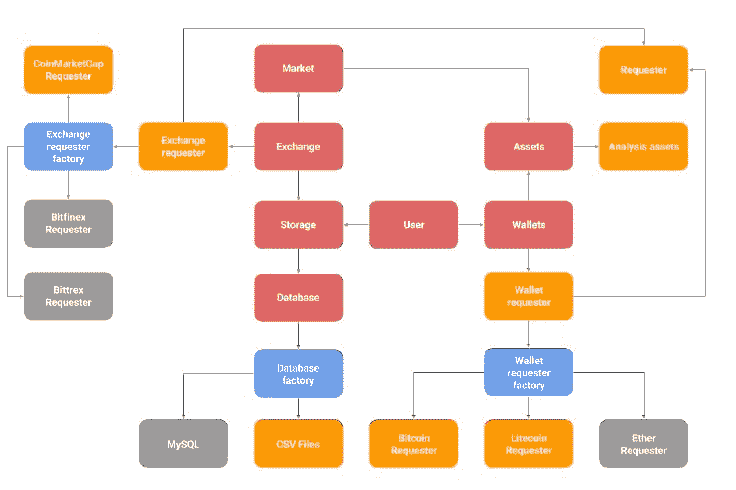

# 第八章：用于跟踪加密货币的面向对象系统

在本章节中，我们将介绍一种在本书中之前未曾明确使用过的编程方式。这种方式被称为面向对象编程，并且将在本书的第三个也是最后一个示例中贯穿使用。面向对象编程在程序员中非常流行，它主要用于允许以不危及系统演变的方式对复杂的抽象关系进行建模和实现。

在开发面向对象系统时，以及在一般编程中，我们应该追求简单性，但这并不自然。当处理复杂领域时，创建复杂的代码比创建简单的代码更容易。程序员必须积极努力地编写简单的代码，因为简单性主要取决于程序员，而不是语言。在本章节中，我们将通过介绍支持它的思想和概念，向您展示如何高效地处理面向对象代码，并且我们将在后面通过使用 R 中最常用的三个对象模型来展示如何实现它。

R 有多种对象模型，或者说面向对象系统，因此一开始可能会有些令人畏惧。本章节的目标不是让你成为面向对象编程或 R 的每个对象模型方面的专家，而是帮助你理解如何使用 R 的不同对象模型来实现面向对象程序的基本构建块。

本章节涵盖的一些重要主题包括：

+   基本面向对象编程概念

+   面向对象系统的设计和架构

+   通过泛型函数实现的 R 的参数多态性

+   可用于 R 的不同对象模型

+   混合 R 不同对象模型的功能

# 本章节所需包

本章节将利用`methods`和`R6`包来加载 S4 和 R6 对象模型的功能。你应该知道，交互式 R 会话默认加载`methods`，但非交互式会话则不会，因此在这种情况下你需要显式地加载它。`jsonlite`和`lubridate`包被引入以简化一些常见任务，例如从 JSON API 获取数据和转换日期。更多信息，请参阅附录，*所需包*。

| **包** | **原因** |
| --- | --- |
| `R6` | R6 对象模型 |
| `methods` | S4 对象模型 |
| `lubridate` | 简易转换日期 |
| `jsonlite` | 从 JSON API 检索数据 |

# 加密货币示例

**加密货币**是一种设计为交换媒介的数字货币。加密货币使用密码学来保护和验证交易，以及控制新单位的创建。简单来说，加密货币是公共和分布式数据库中的条目，只能通过算法共识来更改，并且它们消除了交易处理和货币发行的第三方信任需求。这个概念与文件共享的 P2P 网络非常相似，上面还有一个算法货币政策。如果您想了解更多关于加密货币的信息，您绝对应该看看 Andreas Antonopoulos 的视频。他可以使非常复杂的概念变得非常容易理解。您还可能想阅读他在 2016 年出版的《金钱互联网》一书中对会议的回忆，该书由**Merkle Bloom LLC**出版。

加密货币目前正在得到大力开发，以提供许多创新功能，这些功能将在未来几年产生颠覆性影响，但到目前为止，它们主要用于购买商品和投资。每一笔交易都包括转帐的币数，以及发送者和接收者的公钥，也称为钱包地址。在本章的示例中，我们将使用这些公钥来跟踪我们拥有的币数，并且我们还将使用 CoinMarketCap API ([`coinmarketcap.com/`](https://coinmarketcap.com/))来跟踪加密货币的价格。

由于这将是一个复杂的系统，我们将使用面向对象编程来模块化它，并逐步构建。在示例的最后，我们将拥有一个可以开启以开始跟踪我们的加密货币资产及其价格，并将实时数据保存到磁盘以供以后分析的系统。稍后，在第九章实现高效的简单移动平均中，我们将使用这些数据（以模拟形式），来开发各种**简单移动平均**（**SMA**）的实现，以展示如何改进 R 代码使其更快，以及更易于阅读。最后，在第十章通过仪表板添加交互性中，我们将看到如何创建一个现代网络应用程序来展示开发的 SMAs 以及收集到的数据。

# 面向对象编程简介

作为统计学家和数据科学家，我们努力构建能够产生有价值见解的系统。为了实现这一目标，我们通常使用两种工具——数学和计算机。这本书是为那些对数学方面感到舒适但认为他们的 R 编程技能需要提高的人编写的。

通常，当具有数学背景的人接触到编程时，他们是通过一种*函数式方法*来接触的，这意味着他们从具有输入和输出的算法的角度思考，这些算法作为函数实现。如果你来自数学背景并且不处理高级抽象，这种方式是直观的，并且这是我们到目前为止在整本书中一直在使用的方式。

本章将展示一种不同的编程方式，称为**面向对象编程**。面向对象编程和对象模型是许多领域的强大且统一的理念，并且可以在大多数流行的编程语言中找到，R 语言也不例外。根据我的经验，那些没有意识到面向对象编程经验的人通常一开始会感到困惑，并且不理解它的潜力。他们认为这更像是一种麻烦，而不是一种助力，并认为它在尝试编写代码时会阻碍他们。在本章中，我们将尝试以一种对那些习惯于函数式方法（不一定是函数式编程）的人来说可理解的方式提炼面向对象范式，并展示如何实现一个从加密货币市场和钱包中持续检索实时数据的小型面向对象系统。

在我们开始实现这样一个系统之前，我们需要介绍将在整个示例中使用的概念，包括即将到来的两个章节。在接下来的段落中，你将找到关于面向对象编程背后的概念的一般描述，以及旨在说服你这种编程方式对于某些问题来说可以非常强大的解释。为了获得更全面和正式的介绍，你应该阅读 Booch、Maksimchuck、Engle、Young、Conallen 和 Houston 合著的出色书籍，书名为《面向对象分析与设计：应用》，由 Addison-Wesley 出版社于 2007 年出版。

# 面向对象编程的目的

面向对象编程的主要目的是高效地管理复杂性。这是一种组织代码和数据的方式，使得你可以开发出界限清晰的抽象，并带有受控的依赖关系，以便以受控的方式演进复杂系统。这些抽象被称为**对象**，它们会根据消息提供行为。它们对其他对象提供的行为被记录在接口中，该接口通过此对象的公共方法实现。对象会从其他对象请求行为，当它们这样做时，它们被认为是依赖于它们的。所有这些对象之间发送的消息以及相关的行为使得面向对象系统变得有用。

在我们继续之前，让我们更详细地解释这些概念。对象是一种抽象形式的存在。例如，整数、汽车、狗、建筑、信用卡和加密货币，都可以是面向对象系统中的对象。对象是对某物的明确概念，我们知道不同种类的对象与它们相关的不同行为，其中一些行为需要一些数据，这些数据通常存储在对象内部。

例如，整数的概念并不与任何特定的数字相关联，就像汽车的概念并不与任何特定的型号或品牌相关联。对于那些熟悉统计学的人来说，可以将随机变量视为一个对象，而该随机变量的一个实现就是一个实例。

面向对象编程是一种将程序视为对象之间交互的方式，而不是通过算法步骤。你仍然可以将面向对象系统视为一个包含大量相互调用的函数的大算法，但对于足够大的系统来说，这不会是一个富有成效或令人愉快的进程。在处理面向对象系统时，你最好只是尝试理解系统的一部分，并清楚地定义它应该如何与其他部分通信。试图完全理解一个复杂的面向对象系统可能会相当具有挑战性。

# 面向对象语言背后的重要概念

在面向对象语言中实现对象模型有许多方法，而这些具体实现方式意味着语言具有不同的属性集。其中一些属性包括封装、多态、泛型（参数多态）、层次结构（继承和组合）、子类型以及一些其他属性。它们是强大、高级的概念，具有精确的定义，并规定了语言应该如何表现。现在不必过于担心它们；随着我们前进，我们将解释必要的概念。

一个有趣的练习是寻找那些被认为是面向对象的，但又不使用一个或多个这些属性的语言。例如，类概念是不必要的，就像在基于原型的语言如 JavaScript 中看到的那样。子类型也是不必要的，因为在动态类型语言如 R 或 Python 中它没有意义。我们可以继续列举，但你的想法已经很明确了——一个具有所有这些属性的语言是不存在的。此外，所有面向对象语言中唯一共有的属性是多态。这就是为什么人们常说多态是面向对象编程的本质。

任何专业的面向对象程序员都应该理解这些属性，并且应该有使用实现这些属性的语言的正式经验。然而，在接下来的段落中，我们将以 R 的不同对象模型为例，给出这些最常见属性的高层次解释——封装、多态（带和不带泛型）以及层次结构。

# 封装

封装是关于隐藏对象内部信息以防止其他对象访问。正如 C++语言的创造者 Bjarne Stroustrup 所说，*封装隐藏信息不是为了方便欺诈，而是为了防止错误*。通过给其他对象提供它们可以向对象发送的最小消息目录（公共方法），我们帮助他们犯更少的错误，避免参与与他们无关的任务。这反过来又帮助对象与其自身解耦，并在对象内部提供内聚性。

封装的一个常见理解方式就像你去餐厅时——你通过服务员传达你的需求，然后服务员将你要求的烹饪任务委托给餐厅的大厨。你无需进入餐厅的厨房告诉厨师如何烹饪你的餐点，如果厨师想要改变烹饪某道菜的方式，她可以这样做而不需要你知道。对于对象来说，它们也不应该进入另一个对象并告诉它如何完成其工作。这听起来很简单，但在实践中，很容易违反这个原则。当我们到达本章后面的*迪米特法则*部分时，我们会更多地讨论这一点。从技术上讲，将接口与实现分离的过程被称为**封装**。

# 多态

多态可能是面向对象编程语言中最强大的功能，仅次于它们对抽象的支持，并且它是将面向对象编程与传统使用抽象数据类型编程区分开来的关键。**多态**字面上意味着多种形式，这正是它在面向对象编程中使用的。同一个名字在不同的上下文中会有不同的含义，就像我们的自然语言一样。这允许实现更干净、更易于理解的抽象以及代码。

大体来说，多态可以通过两种不同的方式实现：从对象内部或从对象外部。当它从对象内部实现时，每个对象都必须提供一个定义，说明它将如何处理给定的消息。这是最常见的方法，你可以在 Java 或 Python 中找到它。R 在这方面非常特殊，它实现了外部方法，正式称为**泛型**或**参数多态**。这种编程方式可能会让只使用内部方法的人感到沮丧，但它可以非常灵活。外部方法允许你为尚未定义且可能永远不会定义的对象类型定义一个通用的方法或函数。Java 和 Python 也可以实现这种类型的多态，但这不是它们的本质，就像 R 也可以实现内部方法，但这也不是它的本质。

# 层次结构

层次结构可以通过两种方式形成——继承和组合。**继承**的想法是将新类作为旧类的特殊版本来形成。特殊化的类是子类，更一般的类是超类。这种关系通常被称为**is-a**类型的关联，因为*子类是超类的一种类型*。例如，狮子是一种动物，所以动物是超类，狮子是子类。另一种关系称为**has-a**关系。这意味着一个类包含另一个类的实例。例如，汽车有轮子。我们不会说轮子是汽车的一种类型，所以那里没有继承，但我们会说它们是汽车的一部分，这暗示了**组合**。

有时候并不清楚应该用继承还是组合来建模关系，在这些情况下，你应该决定使用组合来继续。一般来说，人们认为组合是设计系统的一种更灵活的方式，你应该只在必须建模类的特殊化时使用继承。请注意，当你用组合而不是继承来设计系统时，你的对象承担不同的角色，它们变得更加工具化。这是一件好事，因为你可以轻松地将它们相互连接，并在必要时替换它们，而且通常还会得到更多的小类。

现在你已经理解了面向对象编程背后的某些基本思想，你可能意识到结合这些思想所赋予你的力量。如果你有一个封装行为并且只公开提供其他人正确操作所需的系统，它可以动态地对抽象概念做出正确和具体的行为反应，并允许概念层次结构与其他概念层次结构交互，那么你可以放心，你可以管理相当多的复杂性。

在接下来的段落中，我们将解释一些更贴近实际的概念，这些概念是大多数面向对象系统的基础构建块，并且你需要理解这些概念才能理解我们将为示例开发的代码。

# 类和构造函数

对象必须以某种方式定义，以便我们可以从中生成特定的实例。提供这些定义最常见的方式是通过类。**类**是一段代码，它提供了对象的定义，包括它对其他对象消息的响应行为，以及提供该行为所需的内部数据。类的行为在其方法中实现。更多内容将在下一节中介绍。

类必须在某个时候创建，这就是构造函数发挥作用的地方。在大多数情况下，当你创建一个类的实例时，你希望它包含一些关于自己的数据。这些数据通过其构造函数在创建时分配给类。具体来说，**构造函数**是一个函数，其任务是使用一组特定的数据创建类的实例。正如你所知，这些数据应该保存在对象内部，其他对象不应直接与这些数据交互。相反，对象应提供公共方法，其他对象可以使用这些方法获取它们所需的数据或行为。

# 公共和私有方法

**方法**是包含在类中的函数，通常它们将是公共的或私有的。通常，方法可以访问类数据（这些数据应该封装起来，远离其他对象），以及它们的公共和私有方法。

**公共方法**对其他对象可见，应该尽可能稳定，因为其他对象可能会依赖它们。如果你更改它们，可能会意外地破坏另一个对象的功能。**私有方法**仅对实例本身可见，这意味着其他对象不能（或不应，如 R 的情况）直接调用这些方法。私有方法可以随时更改。

公共方法利用其他方法（无论是公共的还是私有的）来进一步委派行为。这种委派将问题分解成非常小的部分，这些部分易于理解，并且程序员保留根据需要修改私有方法的权利。其他对象不应依赖于它们。

注意，在技术上，R 中只存在公共方法。在 R 的一个对象模型中，你可以隐藏方法，在另一个对象模型中，你可以将它们放在不同的环境中，但这并不意味着它们不可访问，就像其他语言中的私有方法一样。由此，我们也没有涉及受保护方法的概念，这些方法是可见于类及其子类的。

即使在 R 中技术上没有私有方法，我们也会像有私有方法一样编程。没有某种类型的编译器或错误检查机制来告诉你，当你不应该访问私有方法时，这不是一个合理的借口。你应该始终生产高质量的代码，即使语言机制没有明确强制执行。

我们之前所说的意味着你应该尽可能使你的对象保持私有性，以保持它们的内聚性和解耦性，这些是自包含和独立的高级术语。换句话说，尽量减少你的对象中的方法数量。当然，内聚性和解耦性是比仅仅减少私有方法更普遍的概念，但这是一个好的开始。

# 接口、工厂和一般模式

**接口**是一个类的一部分，它是公开的，供其他对象使用。具体来说，它是一组关于类公共方法的定义。当然，一个对象拥有的公共方法越多，它对外的责任就越大，灵活性就越小。请注意，接口不提供任何关于实现的细节；它只是一个合同，定义了当调用方法时预期的输入和输出。

有时，你可能希望根据上下文灵活地更改给定任务的对象。你知道，只要你想要交换的对象的接口相同，一切应该都会好（当然，这假设程序员正确实现了这些接口）。如果你没有提前计划，切换这些对象可能是一项困难的任务。这就是工厂发挥作用的地方。工厂是一种在运行时根据上下文从一组预定义选项中选择要使用哪个对象的方法。

**工厂**基本上像`if`语句一样工作，根据某些条件选择用于任务的类。它们是一种今天多投入一点努力，以便将来在决定使用不同对象实现相同接口时节省大量努力的方法。它们应该用于你预计将来会使用不同类型的对象的情况。

工厂是面向对象编程中许多已知**模式**之一。这些模式是由在设计决策方面经验丰富的人开发的，因此他们知道哪些解决方案可以普遍适用于某些类型的问题。记录这些模式非常有用，并允许许多人通过在自己的环境中不必重新发明轮子来节省大量时间和精力。一些基本面向对象模式的优秀来源可以在 Addison-Wesley 1994 年出版的 Gamma、Vlissides、Johnson 和 Helmfamous 的著名作品《设计模式：可复用面向对象软件元素》中找到。我们鼓励读者研究这些模式，因为它们无疑会在某个时候派上用场。

# 介绍 R 中的三个对象模型——S3、S4 和 R6

现在你已经对面向对象的基本概念有了基本的了解，我们将深入探讨 R 自身的对象模型。在 R 中进行面向对象编程时，有两个主要的混淆来源。在我们开始编写代码之前，我们将解释这些混淆来源是什么。解释之后，我们将开发一个小示例来展示 R 的 S3、S4 和 R6 对象模型中的继承、组合、多态和封装。相同的示例将用于所有三个模型，以便读者可以精确地指出它们之间的差异。具体来说，我们将模拟一个从`Rectangle`继承并进一步与`Color`组合的`Square`模型。

# 产生混淆的第一个来源——各种对象模型

在 R 语言中使用面向对象编程的方式与其他语言（如 Python、Java、C++等）中看到的方式不同。在很大程度上，这些语言有一个所有人都使用的单一对象模型。在 R 语言的情况下，请注意，我们一直在编写对象模型，使用复数形式。这是因为 R 是一种非常特殊的语言，并且它有各种实现面向对象系统的方式。具体来说，截至本书编写时，R 有以下对象模型——S3、S4、引用类、R6 和基本类型。在接下来的章节中，我们将深入探讨 S3、S4 和 R6 模型。现在，我们将简要介绍引用类和基本类型。

**引用类**（**RC**）是 R 语言中不需要外部库的对象模型，并且与 Python、Java 或 C++中找到的知名对象模型最为相似。它实现了与这些语言相同的信息传递，这意味着方法属于类，而不是函数，并且对象是可变的，这意味着实例的数据可以就地更改，而不是产生带有修改后数据的副本。我们不会深入探讨这个对象模型，因为 R6 似乎是对这种模型更干净的实现。然而，R6 确实需要一个外部包，正如我们稍后将会看到的，这并不是问题，因此它更受欢迎。

基本类型本身并不是一个对象模型。它们是 R 语言背景下的 C 语言实现，用于在它们之上开发其他对象模型。只有 R 的核心开发团队可以向这个模型添加新的类，而且他们很少这样做（可能需要很多年才会这样做）。它们的用法非常高级，我们也不会深入探讨它们。

选择使用哪种对象模型是一个重要的决定，我们将在展示如何使用它们之后对此进行更多讨论。一般来说，这将是灵活性、形式性和代码整洁性之间的权衡。

# 第二个混淆源——泛型函数

与之前提到的流行面向对象语言（如 Java、C++等）相比，R 语言还有一个很大的不同点，那就是 R 实现了参数多态性，也称为泛型函数，这意味着方法属于函数，而不是类。**泛型函数**允许使用相同的名称为许多不同的函数命名，这些函数具有许多不同的参数集，并且来自许多不同的类。这意味着调用类方法的语法与其他语言中通常找到的链式语法（通常在类和要调用的方法之间使用一个"`.`"（点））不同，这被称为**消息传递**。

R 的方法调用看起来就像函数调用，R 必须知道哪些名称需要简单的函数调用，哪些名称需要方法调用。如果你阅读了前面的章节，你应该理解为什么这很重要。R 必须有一种机制来区分它应该做什么。这种机制被称为 **泛型函数**。通过使用泛型函数，我们将某些名称注册为 R 中的方法，并充当调度器。当我们调用已注册的泛型函数时，R 将检查传递给调用中的对象的属性链，并寻找与该对象类型匹配的方法调用函数；如果找到，它将调用它。

你可能已经注意到，`plot()` 和 `summary()` 函数可能会根据传递给它们的对象（例如，数据框或线性模型实例）返回不同的结果。这是因为那些是实现多态性的泛型函数。这种方式为用户提供简单的接口，可以使他们的任务变得更加简单。例如，如果你正在探索一个新的包，并在某个时刻得到了由该包派生出的某种结果，尝试调用 `plot(result)`，你可能会惊讶地得到一个有意义的图形。这在其他语言中并不常见。

在使用 R 的 S3 和 S4 模型进行面向对象编程时，请记住，你不应该直接调用方法，而应该声明相应的泛型函数并调用它们。这可能会在一开始有些令人困惑，但这是 R 的独特特性之一，随着时间的推移你会习惯它。

# S3 对象模型

如你所知，R 语言是从 S 语言派生出来的。S 的对象模型随着时间的推移而发展，其第三个版本引入了 **类属性**，这允许我们今天在 R 中找到的 S3 对象模型。它仍然是 R 中的对象模型，R 的大多数内置类都是 S3 类型。它是一个有效且非常灵活的对象模型，但它与来自其他面向对象语言的人所习惯的非常不同。

S3 是最不正式的对象模型，因此在某些关键方面存在不足。例如，S3 不提供正式的类定义，这意味着没有正式的继承或封装概念，而多态性是通过泛型实现的。很明显，在关键方面其功能有限，但程序员有很大的灵活性。然而，正如 Hadley Wickham 在《Chapman and Hall，2014 年出版的《高级 R》》中所说：

"S3 在其简约性中具有一定的优雅：你无法去掉任何部分，仍然有一个有用的面向对象系统。" 

# 类、构造函数和组合

对象的想法实际上只是将数据和相应的方法捆绑在一起。R 中的列表非常适合实现这一点，因为它们可以包含不同的数据类型，甚至函数，这些函数是一等对象，可以像任何其他对象一样分配或返回。实际上，我们可以通过将列表的类属性简单地设置为新的值来在 R 中创建新类的对象，这就是我们在 S3 中创建类的方式。

我们不是为 S3 类提供定义，而是提供构造函数。这些构造函数负责创建对象（对于`S3Color`是传递的参数字符串，对于`S3Rectangle`是列表）并将字符串分配给它们的类属性。然后返回这些对象，它们代表我们将要使用的类。在矩形的例子中，我们的构造函数接收长度、正交边以及其颜色的名称。颜色构造函数只接收颜色的名称：

```py
color_constructor <- function(color) {
    class(color) <- "S3Color"
    return(color)
}

rectangle_constructor <- function(a, b, color) {
    rectangle <- list(a = a, b = b, color = color_constructor(color))
    class(rectangle) <- "S3Rectangle"
    return(rectangle)
}
```

正如你所见，我们不是直接在矩形的列表中的`color`元素里分配作为参数传递给`rectangle_constructor()`函数的`color`字符串，而是使用`color_constructor()`函数提供一个`Color`类，而不仅仅是字符串。如果你打算为颜色抽象添加行为，就像我们将要做的那样，你应该这样做。

现在，我们可以通过调用`rectangle_constructor()`来创建一个`S3_rectangle`，并且我们可以打印它的类，结果显示为`S3Rectangle`，正如我们所预期的。此外，如果你打印`S3_rectangle`的结构，你会看到它包含了矩形定义的两个边，颜色类以及属性类名称：

```py
S3_rectangle <- rectangle_constructor(2, 3, "blue")
class(S3_rectangle)
#> [1] "S3Rectangle"

str(S3_rectangle)
#> List of 3
#> $ a : num 2
#> $ b : num 3
#> $ color:Class 'S3Color' chr "blue"
#> - attr(*, "class")= chr "S3Rectangle"
```

有时，你会看到我们给一个对象添加了一个前缀，这个前缀是我们使用的对象模型名称（在这种情况下是`S3`）。例如，`S3Color`和`S3Rectangle`。当你看到这种情况时，意味着特定的名称与另一个对象模型中的相应对象冲突，我们需要区分它们。如果你不这样做，你可能会遇到相当令人困惑且难以诊断的错误。

# 公共方法和多态

要为类定义一个方法，我们需要使用`UseMethod()`函数来定义函数的层次结构。它将告诉 R 寻找一个前缀与当前函数匹配且后缀在传递给对象的类名向量中的函数。方法名称有两部分，由一个"`.`"分隔，其中前缀是函数名，后缀是类的名称。正如你所见，S3 泛型函数是通过命名约定工作的，而不是通过为不同类显式注册方法。

我们首先为`S3Rectangle`类创建一个`S3area`方法，我们通过创建一个名为`S3area.S3Rectangle`的函数来实现这一点。`UseMethod()`函数将确保`S3area.S3Rectangle`函数接收一个`S4Rectangle`类的对象，因此在这个函数内部，我们可以使用类的内部结构。在这种情况下，我们将长度`a`和`b`相乘：

```py
S3area.S3Rectangle <- function(rectangle) {
    return(rectangle$a * rectangle$b)
}
```

注意，我们可以通过使用`$`运算符在`rectangle`对象内部访问这样的对象。这不仅仅限于在方法内部进行，所以实际上，任何对象都可以改变 S3 对象的内部结构，但仅仅因为你能够这样做，并不意味着你应该这样做。

现在，我们将把`S3area`方法称为一个普通的函数调用，我们将传递之前创建的矩形对象，我们应该看到面积被打印到控制台：

```py
S3area(S3_rectangle)
#> Error in S3area(S3_rectangle): could not find function "S3area"
```

发生了什么？错误？那么，R 是如何知道`S3area`函数调用实际上应该触发`S3area.S3Rectangle`方法调用的呢？为了实现这一点，我们需要在 R 中注册这个名称，我们通过调用定义函数来实现，该函数实际上通过自身使用`S3area`名称。这个`S3area`函数接收任何类型的对象，不一定是`S3Rectangle`，并使用`UseMethod()`函数来告诉它应该为该对象查找`"S3area"`方法调用。在这种情况下，我们知道它只会在`S3Rectangle`类中找到：

```py
S3area <- function(object) {
    UseMethod("S3area")
}
```

现在，我们可以像之前一样调用`S3area`方法，但这次我们将得到实际的面积。这就是你通常使用 S3 创建方法的方式：

```py
S3area(S3_rectangle)
#> [1] 6
```

现在，我们将创建`S3color`方法来返回矩形的颜色对象。由于颜色对象只是字符类型，如果我们只想获取字符，我们不需要做任何额外的事情来解析该对象：

```py
S3color.S3Rectangle <- function(rectangle) {
    return(rectangle$color)
}
S3color <- function(object) {
    UseMethod("S3color")
}
```

现在，我们将打印矩形。正如你所见，`print()`调用仅仅显示了对象的内部及其包含的对象：

```py
print(S3_rectangle)
#> $a
#> [1] 2
#>
#> $b
#> [1] 3
#>
#> $color
#> [1] "blue"
#> attr(,"class")
#> [1] "S3Color"
#>
#> attr(,"class")
#> [1] "S3Rectangle"
```

我们可能想要重载这个函数以提供不同的输出。为此，我们创建`print.S3Rectangle()`并简单地打印一个字符串，告诉我们矩形的颜色，它是一个矩形，每边的长度，然后是它的面积。注意，颜色和面积都是使用我们之前定义的方法检索的，即`S3Color()`和`S3area()`：

```py
print.S3Rectangle <- function(rectangle) {
    print(paste(
        S3color(rectangle), "rectangle:",
        rectangle$a, "x", rectangle$b, "==", S3area(rectangle)
    ))
}
```

现在，如果我们简单地调用`print()`函数，就像我们之前调用`S3area()`函数一样，会发生什么？我们应该得到一个错误，不是吗？让我们看看以下代码：

```py
print(S3_rectangle)
#> [1] "blue rectangle: 2 x 3 == 6"
```

嗯，正如你所见，我们并没有这样做。在这种情况下，我们实际上得到了我们希望得到的结果。原因是 R 中的`print()`函数是一个已经注册到`UseMethod()`函数的 S3 函数。这意味着我们的`print.S3Rectangle`定义不需要再次注册，我们可以直接使用它。这很酷，不是吗？这是使用参数多态的一个大优点。我们可以将函数注册为可能或可能不会在未来以意想不到的方式使用的方法调用，但它们仍然为用户提供了一致的接口。

# 封装和可变性

现在，我们将看到 S3 如何处理可变性和封装。为此，我们将打印矩形中的`a`值，修改它，然后再次打印。正如你所见，我们能够修改它，并且从那时起我们得到不同的结果，而且我们没有进行任何方法调用。这是一件非常危险的事情，你绝对应该在方法调用中封装这种行为：

```py
print(S3_rectangle$a)
#> [1] 2

S3_rectangle$a <- 1

print(S3_rectangle$a) #> [1] 1
```

即使你可以，也永远不要直接修改对象的内部结构。

修改对象的正确方式应该是通过某种类型的设置函数。将使用`set_color.S3Rectangle()`方法来修改矩形的颜色，通过接收一个`S3Rectangle`和一个`new_color`字符串，并将这个新字符串保存在矩形的`color`属性中。当你使用这种类型的方法时，你明确了自己的意图，这是一种更好的编程方式。当然，我们还需要像之前展示的那样，将方法调用注册到 R 中：

```py
set_color.S3Rectangle <- function(rectangle, new_color) {
    rectangle$color <- new_color
    return(rectangle)
}

set_color <- function(object, new_color) {
    UseMethod("set_color")
}
```

你注意到我们的错误了吗？可能没有，但如果注意到了那就太好了！我们故意这样做是为了向你展示在 R 中编程时伤害自己是多么容易。由于 R 没有类型检查，我们无意中分配了一个字符串，而我们应该分配一个`Color`。这意味着在调用`set_color()`方法后，我们的矩形中的`color`属性将不再被识别为`Color`类；它将被识别为一个字符串。如果你的代码依赖于这个对象是`Color`类型，它可能会以意想不到和令人困惑的方式失败，并且难以调试。在进行赋值时要小心。相反，我们应该使用`rectangle$color <- color_constructor(new_color)`来保持一致性。

虽然你可以改变一个对象的数据类型，但你永远不应该这样做。正如 Hadley Wickham 所说，*R 不会保护你不犯错误：你很容易自己伤害自己。只要你不把枪口对准自己的脚并扣动扳机，你就不会有问题*。

现在，我们将展示如何使用`set_color()`方法。我们将打印矩形的颜色，尝试将其更改为黑色，然后再次打印。正如你所见，更改并没有持久化在我们的对象中。这是因为 R 通过值传递对象，而不是通过引用。这仅仅意味着当我们修改矩形时，我们实际上是在修改矩形的副本，而不是我们传递给自己的矩形：

```py
print(S3color(S3_rectangle))
#> [1] "blue"
#> attr(,"class")
#> [1] "S3Color"

set_color(S3_rectangle, "black")
#> [1] "black rectangle: 1 x 3 == 3"

print(S3color(S3_rectangle))
#> [1] "blue"
#> attr(,"class")
#> [1] "S3Color"
```

你注意到在`set_color.S3Rectangle()`函数的末尾，我们返回了`rectangle`吗？在其他语言中可能不需要这样做，但在 R 中，我们这样做是为了返回修改后的对象。为了使对象中的更改持久化，我们需要将那个结果对象实际分配到我们自己的`S3_rectangle`中，当我们这样做时，我们就可以看到颜色更改已经持久化。

这个属性赋予了 S3 不可变性的特性。这在处理函数式编程时非常有用，但在进行面向对象编程时可能会有些麻烦。一些令人困惑的错误可能来自这个属性，让你习惯以这种方式工作。

# 继承

S3 类缺少在其他语言中通常找到的大量结构。继承是非正式实现的，封装也不是由语言强制执行的，正如我们之前所看到的。

要实现继承，我们将创建一个`square_constructor()`函数，该函数将接收边长`a`和颜色名称。然后，我们将使用`rectangle_construtor()`并将`a`作为两个长度（使其成为正方形）发送，同时也会发送颜色。然后，我们将添加`S3Square`类，最后返回创建的对象：

```py
square_constructor <- function(a, color) {
    square <- rectangle_constructor(a, a, color)
    class(square) <- c("S3Square", class(square))
    return(square)
}
```

现在，我们将创建一个正方形并打印其类。如你所见，它按顺序分配了`S3Square`和`S3Rectangle`类，当我们使用`print()`方法时，实际上是从`S3Rectangle`类获取打印功能，这是预期的，因为我们发出了继承的信号：

```py
S3_square <- square_constructor(4, "red")

class(S3_square)
#> [1] "S3Square" "S3Rectangle"

print(S3_square)
#> [1] "red rectangle: 4 x 4 == 16"
```

如果我们想要为正方形提供特定的打印功能，我们必须像现在这样覆盖`print()`方法，为`S3Square`类定义我们自己的方法。该函数与之前完全相同，但我们使用的是单词`"square"`而不是`"rectangle"`。

```py
print.S3Square <- function(square) {
    print(paste(
        S3color(square), "square:",
        square$a, "x", square$b, "==", S3area(square)
    ))
}
```

现在，当我们打印时，我们可以看到正在使用正确的方法，因为我们看到输出中出现了单词`"square"`。请注意，我们不需要使用`UseMethod()`函数重新注册`print()`方法，因为我们已经这样做了：

```py
print(S3_square)
#> [1] "red square: 4 x 4 == 16"
```

最后，请记住，如果类属性是一个包含多个元素的向量，则第一个元素被解释为对象的类，而后续元素被解释为对象继承的类。这使得继承成为对象的属性，而不是类的属性，并且顺序很重要。

如果我们在`square_constructor()`函数中写成`class(square) <- c(class(square), "S3Square")`，那么即使创建了`print.S3Square()`函数，我们仍然会看到`print()`方法调用`print.S3Rectangle()`函数。请注意这一点。

# S4 对象模型

一些程序员认为 S3 并没有提供与面向对象编程通常相关的安全性。在 S3 中，创建一个类非常容易，但如果不小心使用，也可能导致非常混乱且难以调试的代码。例如，你可能会轻易地拼错一个名称，而 R 不会抱怨。你也很容易将类更改为对象，R 也不会抱怨。

S4 类是在 S3 之后开发的，目的是增加安全性。S4 提供了保护，但也引入了大量的冗余来提供这种安全性。S4 对象模型实现了现代面向对象编程语言的大多数功能——正式的类定义、继承、多态（参数化）和封装。

# 类、构造函数和组合

使用 `setClass()` 函数创建 S4 类。至少，必须指定 `Class` 的名称及其属性，在 S4 中正式称为 **槽**。槽通过 `representation()` 函数指定，并且一个整洁的功能是你可以指定此类属性期望的类型。这有助于类型检查。

还有一些内置的功能我们在这里不会探讨。例如，你可以提供一个函数来验证对象的一致性（没有被以某种意外的方式操作）。你还可以指定默认值，在名为 `prototype` 的参数中。如果你想在 S3 中使用这些功能，你也可以自己实现它们，但它们不是内置功能。S4 被视为一个强大的对象模型，你应该通过浏览其文档来更深入地学习它。

所有与 S4 相关的代码都存储在 `methods` 包中。当你以交互方式运行 R 时，此包总是可用的，但在批处理模式下运行 R 时可能不可用。因此，在每次使用 S4 时包含一个显式的 `library(methods)` 调用是一个好主意。

如你所见，与 S3 类的概念区别在于，在这里，我们实际上为每个槽指定了对象的类型。其他的变化更多的是语法上的，而不是概念上的。请注意，你可以使用另一个 S4 类的名称作为其中一个槽的名称，就像我们在 `S4Rectangle` 的 `color` 例子中所做的那样。这就是你如何使用 S4 实现组合的方式：

```py
library(methods)

setClass(
    Class = "S4Color",
    representation = representation(
        color = "character"
    )
)

setClass(
    Class = "S4Rectangle",
    representation = representation(
        a = "numeric",
        b = "numeric",
        color = "S4Color"
     )
)
```

构造函数是通过调用 `new()` 函数自动为你构建的。正如你所见，你只需传递你正在实例化的类的名称以及应该分配给槽的值：

```py
S4_rectangle <- new(
    "S4Rectangle",
    a = 2,
    b = 3,
    color = new("S4Color", color = "blue")
)

class(S4_rectangle)
#> [1] "S4Rectangle"
#> attr(,"package")
#> [1] ".GlobalEnv"

str(S4_rectangle)
#> Formal class 'S4Rectangle' [package ".GlobalEnv"] with 3 slots
#> ..@ a : num 2
#> ..@ b : num 3
#> ..@ color:Formal class 'S4Color' [package ".GlobalEnv"] with 1 slot
#> .. .. ..@ color: chr "blue"
```

正如我们之前所做的那样，我们检索对象的类并打印它。当我们打印它时，我们可以看到一个包含一些 `@` 符号的结构。这些是用于访问槽的运算符（而不是 S3 中的 `$` 运算符）。你还可以看到 `Color` 类的 `color` 属性的嵌套槽：

由于这些名称在 R 中是保留关键字，因此一些槽名称是禁止使用的。禁止的名称包括 `class`、`comment`、`dim`、`dimnames`、`names`、`row.names` 和 `tsp`。

# 公共方法和多态性

由于 S4 也使用参数多态（方法属于函数，而不是类），并且我们之前已经解释过几次，所以我们现在将只指出与 S3 的不同之处。首先，我们不是使用 `UseMethod()` 函数在 R 中注册方法，而是使用 `setGeneric()` 函数，其中包含方法名称，以及一个调用 `standardGeneric()` 函数的函数。这将提供 S4 对象的调度机制。

要实际创建一个方法，我们不是像在 S3 中那样使用命名约定，而是将类名称和方法名称传递给 `setMethod()` 函数，以及用作方法的函数。其次，那里的顺序很重要。如果你在调用 `setGeneric()` 方法之前调用 `setMethod()` 函数，你的调度机制将不会工作。我们在 S3 中就是这样做的，但在这里，我们需要颠倒顺序。最后，请注意，我们使用 `@` 符号访问对象属性（槽位），正如我们之前提到的。

为了使示例完整，以便读者可以并排比较所有三个示例的代码，我们现在展示如何实现我们之前为 S3 情况所展示的相同代码：

```py
setGeneric("S4area", function(self) {
    standardGeneric("S4area")
})
#> [1] "S4area"

setMethod("S4area", "S4Rectangle", function(self) {
    return(self@a * self@b)
})
#> [1] "S4area"

S4area(S4_rectangle)
#> [1] 6

setGeneric("S4color", function(self) {
    standardGeneric("S4color")
})
#> [1] "S4color"

setMethod("S4color", "S4Rectangle", function(self) {
    return(self@color@color)
})
#> [1] "S4color"
```

如果你使用 `print()` 在 `S4_rectangle` 上，你会看到它被识别为某种类型，并且它会显示其槽位：

```py
print(S4_rectangle)
#> An object of class "S4Rectangle"
#> Slot "a":
#> [1] 2
#>
#> Slot "b":
#> [1] 3
#>
#> Slot "color":
#> An object of class "S4Color"
#> Slot "color":
#> [1] "blue"
```

如果我们想改变这个输出，我们可以像在 S3 的情况下那样用我们自己的方法覆盖它。然而，如果我们这样做，我们将定义 `print()` 函数以与 S4 对象一起工作，并且它将停止为来自其他对象模型的对象工作。我们鼓励你通过将下面的代码更改为使用 `print` 方法调用而不是 `S4print` 名称来亲自尝试。正如你所见，我们正在使用与之前相同的覆盖机制，所以我们将跳过其解释：

```py
setGeneric("S4print", function(self) {
    standardGeneric("S4print")
})
#> [1] "S4print"

setMethod("S4print", "S4Rectangle", function(self) {
    print(paste(
        S4color(self), "rectangle:",
        self@a, "x", self@b, "==", S4area(self)
    ))
})
#> [1] "S4print"
```

现在，我们可以使用 `S4print()` 方法来打印所需的输出，如下面的代码所示：

```py
S4print(S4_rectangle)
#> [1] "blue rectangle: 2 x 3 == 6"
```

# 封装和可变性

现在，我们将探讨 S4 中的封装和可变性概念。首先，请注意我们使用的是 `print()` 而不是 `S4print()` 方法，因为我们正在打印 `S4_rectangle` 的特定槽位。正如你所见，如果我们不小心，我们仍然可以直接分配值到对象的内部。再次强调，你不应该这样做。

还要注意，如果我们使用之前创建的 `S4color()` 方法来封装对 `color` 属性的访问，我们会得到一个错误，告诉我们找不到 `S4color<-` 函数。这提示我们可以创建这样的函数，我们可以：

```py
print(S4_rectangle@a)
#> [1] 2

S4_rectangle@a <- 1

print(S4_rectangle@a)
#> [1] 1 
print(S4color(S4_rectangle))
#> [1] "blue"

S4color(S4_rectangle) <- "black"
#> Error in S4color(S4_rectangle) <- "black": 
       could not find function "S4color<-"

print(S4color(S4_rectangle))
#> [1] "blue"
```

要创建一个封装对象属性访问的函数，我们可以使用 `setReplaceMethod()` 函数，就像我们之前使用 `setMethod()` 函数一样。请注意，我们传递给 `setGeneric()` 函数的方法的名称是 R 错误中提示给我们的名称，即槽位的名称后跟 R 中的正常赋值运算符 `<-`。另外请注意，变量名称和赋值运算符符号之间没有空格。

最后，请注意，我们在给 `color` 槽位赋新值时确保创建了一个 `S4Color` 类型的对象。如果你尝试像我们对 S3 类那样简单地赋一个字符串，你会得到一个错误，告诉你你正在尝试做一些你不应该做的事情。这在使用 S4 时是一个很大的优势，因为它可以防止你犯一些意外的错误：

```py
setGeneric("S4color<-", function(self, value) {
    standardGeneric("S4color<-")
})
#> [1] "S4color<-"

setReplaceMethod("S4color", "S4Rectangle", function(self, value) {
    self@color <- new("S4Color", color = value)
    return(self)
})
#> [1] "S4color<-"
```

一旦我们创建了这样的方法，我们就可以用它直接、封装地给颜色对象赋值，这比直接操作槽位要好得多。正如你所看到的，颜色变化被持久化了：

```py
print(S4color(S4_rectangle))
#> [1] "blue"

S4color(S4_rectangle) <- "black"

print(S4color(S4_rectangle))
#> [1] "black"
```

# 继承

创建子类很容易；我们只需像以前一样调用 `setClass()` 函数，并发送 `contains` 参数，其中包含它将继承的类的名称。S4 支持多重继承，但我们不会探讨这一点。感兴趣的读者可以查阅文档。

S4 类的一个有趣特性是，如果一个类扩展了 R 的基本类型，那么将会有一个名为 `.Data` 的槽位，其中包含基本对象类型的数据。在基本对象类型上工作的代码将直接在对象的 `.Data` 部分上工作，这使得我们的编程变得稍微容易一些：

```py
setClass("S4Square", contains = "S4Rectangle")
```

注意，当我们实例化 `S4Square` 类时，我们需要传递长度属性，并确保它们相同。正如我们所看到的，对象的类被正确地识别，我们之前定义的多态 `S4print()` 方法也正常工作：

```py
S4_square <- new ("S4Square", 
                  a = 4, b = 4, 
                  color = new("S4Color", color = "red"))

class(S4_square)
#> [1] "S4Square"
#> attr(,"package")
#> [1] ".GlobalEnv"

S4print(S4_square)
#> [1] "red rectangle: 4 x 4 == 16"
```

再次，为了完整性，我们用使用 `"square"` 词汇的 `S4print()` 方法覆盖了它，我们可以看到它按预期工作：

```py
setMethod("S4print", "S4Square", function(self) {
    print(paste(
        S4color(self), "square:",
        self@a, "x", self@b, "==", S4area(self)
    ))
})
#> [1] "S4print" 
S4print(S4_square)
#> [1] "red square: 4 x 4 == 16"
```

# R6 对象模型

S3 和 S4 实际上只是实现静态函数多态性的方法。R6 包提供了一种类似于 R 的引用类的类类型，但它更高效，并且不依赖于 S4 类和方法包，正如 RCs 所做的那样。

当引入 RCs 时，一些用户遵循 R 现有类系统 S3 和 S4 的命名，将新的类系统称为 R5。尽管现在实际上并不称为 R5，但这个包及其类的命名遵循这种模式。

尽管 R6 在三年多前就已经发布，但它并不广为人知。然而，它被广泛使用。例如，它在 Shiny（本书最后一章的重点）中使用，并在 dplyr 包中管理数据库连接。

# 类、构造函数和组合

R6 类是通过`R6Class()`函数创建的，我们传递类的名称和公共和私有对象的列表。这些对象可以是属性或方法。正如您所看到的，在 R6 中使用类定义生成更干净的代码，这些代码在一个单独的定义中组合，而不是像 S3 和 S4 中使用的逐步过程。这种方法更类似于您在其他流行语言中可以找到的方法。

您可以通过使用`initialize`方法来指定构造函数应该如何表现。当创建类的实例时，将调用此特定方法。

在以下定义中，我们与 S3 和 S4 示例中使用的名称之间有两个重要的区别。在这种情况下，我们调用打印方法为`own_print()`，将`color`属性称为`own_color`。前者的原因是 R 会在`color()`方法和`color`属性之间混淆。为了避免错误，我们可以更改其中一个的名称，为了保持我们的公共接口不变，我们决定在这种情况下更改私有属性。`own_print()`的原因将在后面解释：

```py
library(R6)
R6Rectangle <- R6Class(
    "R6Rectangle",
    public = list(
        initialize = function(a, b, color) {
            private$a <- a
            private$b <- b
            private$own_color <- color
        },
        area = function() {
            private$a * private$b
        },
        color = function() {
            private$own_color
        },
        set_color = function(new_color) {
            private$own_color <- new_color
        },
        own_print = function() {
            print(paste(
                self$color(), "rectangle:",
                private$a, "x", private$b, " == ", self$area()
            ))
        }
    ),
    private = list(
        a = NULL,
        b = NULL,
        own_color = NULL
    )
)
```

要创建类的实例，我们调用类对象中的`new()`方法。我们可以传递一些参数，如果这样做，它们将被类中定义的`initialize`函数使用。

如您所见，如果我们对`R6_rectangle`对象使用`print()`，我们会看到一个漂亮的输出，让我们知道哪些方法和属性是公共的，哪些是私有的，以及一些关于它们的额外信息，例如默认的`clone()`方法（用于创建 R6 对象的副本）被设置为浅拷贝而不是深拷贝。我们不会深入探讨这些概念的具体细节，但鼓励感兴趣的读者了解按引用传递与按值传递的机制。

如果我们在类中定义了一个`print()`方法，那么`print(R6_rectangle)`将默认使用该函数。请注意，这与直接通过执行类似`R6_rectangle$print()`的命令直接调用方法在语法上会有所不同，但 R 足够智能，知道如果您在类中定义了一个`print()`方法，那么您可能想在对象上使用`print()`函数时使用它。如果不是这种情况，那么您应该更改您自定义打印函数的名称，就像我们在`own_print()`方法名称的情况中所做的那样：

```py
R6_rectangle <- R6Rectangle$new(2, 3, "blue")

class(R6_rectangle)
#> [1] "R6Rectangle" "R6"

print(R6_rectangle)
#> <R6Rectangle>
#> Public:
#>     area: function ()
#>     clone: function (deep = FALSE)
#>     color: function ()
#>     initialize: function (a, b, color)
#>     own_print: function ()
#>     set_color: function (new_color)
#> Private:
#>     a: 2
#>     b: 3
#>     own_color: blue 
```

如您从输出中看到的，在 R6 类的情况下，我们有两个类而不是一个。我们定义了自己的类，还为我们添加了通用的`R6`类。

# 公共方法和多态

我们已经在之前的代码片段中定义了我们想要的方法，因此为了完整性，我们现在将仅展示如何调用这些方法。正如你所见，你只需使用 `$` 操作符来访问公共属性或公共方法，如果它是方法，你需要在末尾添加括号（围绕你想要发送的任何参数，就像你通常那样）：

```py
R6_rectangle$own_print()
#> [1] "blue rectangle: 2 x 3 == 6"

R6_rectangle$area()
#> [1] 6

R6_rectangle$color()
#> [1] "blue"
```

# 封装和可变性

由于我们在类定义中将 `a`、`b` 和 `own_color` 放入了 `private` 列表中，它们保持为私有，这就是 R6 中强制封装的方式。正如你所见，我们不允许直接将 `a` 属性赋值，正如我们预期的那样，因为它被放置在 `private` 列表中。这确保了我们不能直接从对象外部访问标记为私有的属性或方法，并防止我们在编码时做出错误的决定。这是 R6 模型的一个巨大优势。

R6 中的封装是通过环境实现的。

可变性是通过使用设置器（用于更改类属性的方法）实现的。请注意，在这种情况下，我们不需要像在 S3 中那样重新分配结果对象。状态实际上保存在对象的环境中，并且可以更改；因此，R6 具有可变性：

```py
R6_rectangle$a
#> NULL

R6_rectangle$own_print()
#> [1] "blue rectangle: 2 x 3 == 6"

R6_rectangle$a <- 1
#> Error in R6_rectangle$a <- 1: 
       cannot add bindings to a locked environment

R6_rectangle$own_print()
#> [1] "blue rectangle: 2 x 3 == 6"

R6_rectangle$set_color("black")

R6_rectangle$own_print()
#> [1] "black rectangle: 2 x 3 == 6"
```

# 继承

继承在处理 R6 对象模型时也更加熟悉。在这种情况下，你只需将 `inherit` 参数添加到 `R6Class()` 函数调用中，并且你可以通过使用 `super$initialize()` 来调用超类的 `initialize` 方法。在这种情况下，我们使用这种技术为用户提供一个更直观的构造函数接口：对于正方形的情况，只需提供一个长度值，而不是必须重复相同的值两次，如果不进行检查，这可能会导致反直觉的行为。我们还可以覆盖 `print()` 方法，就像我们通常添加另一个方法一样：

```py
R6Square <- R6Class(
    "R6Square",
    inherit = R6Rectangle,
    public = list(
        initialize = function(a, color) {
            super$initialize(a, a, color)
        },
        print = function() {
            print(paste(
                self$color(), "square:",
                private$a, "x", private$b, " == ", self$area()
            ))
        }
    )
)
```

正如你所见，在这种情况下，我们得到了一个包含当前类 `R6Square` 以及该对象继承的类 `R6Rectangle` 和 `R6` 的类列表。由于我们覆盖了 `print()` 方法，我们可以使用常见的 `print(object)` 语法，而不是 R6 提供的特定 `object$print()` 语法：

```py
R6_square <- R6Square$new(4, "red")

class(R6_square)
#> [1] "R6Square" "R6Rectangle" "R6"

print(R6_square)
#> [1] "red square: 4 x 4 == 16"
```

# 活跃绑定

活跃绑定看起来像字段，但每次访问它们时，它们都会调用一个函数。它们始终公开可见，类似于 Python 的属性。如果我们想将 `color()` 方法实现为活跃绑定，我们可以使用以下代码。正如你所见，你可以获取或设置 `color` 属性，而不需要使用显式的方法调用（注意缺少的括号）：

```py
R6Rectangle <- R6Class(
    "R6Rectangle",
    public = list(
        ...
    ),
    private = list(
        ...
    ),
    active = list(
        color = function(new_color) {
            if (missing(new_color)) {
                return(private$own_color)
            } else {
                private$own_color <- new_color
            }
        }
    )
)

R6_rectangle <- R6Rectangle$new(2, 3, "blue")

R6_rectangle$color
#> [1] "blue"

R6_rectangle$color <- "black"

R6_rectangle$color
#> [1] "black"
```

如你所见，当活跃绑定用作 *getter*（用于检索值）时，它调用方法而不传递任何值。当它作为 *setter*（用于更改属性）被访问时，它传递要分配的值来调用方法。如果函数不接受任何参数，则无法将活跃绑定用作设置器。

# 析构函数

有时候，在对象被垃圾回收时运行一个函数是有用的。如果你不熟悉垃圾回收，你可以将其视为当对象不再被环境中的其他对象引用时释放未使用内存的一种方式。

这个特性有用的一个例子是当你想要确保在对象被垃圾回收之前关闭文件或数据库连接。为此，你可以定义一个 `finalize()` 方法，当对象被垃圾回收时，它将不带任何参数被调用。为了测试这个功能，你可以在你的某些对象中简单地添加一个 *finalizer*，然后查看你何时在控制台看到 `"Finalizer called"` 消息：

```py
A <- R6Class("A", public = list(
    finalize = function() {
        print("Finalizer called.")
    }
))
```

当 R 退出时，finalizers 也会被调用。

# 我们加密货币系统背后的架构

现在已经介绍了使用 R 进行面向对象编程的基础，我们将把这些原则应用到本书剩余部分我们将要处理的示例中。我们将使用面向对象编程来构建一个跟踪加密货币的系统。如果你对加密货币不熟悉，可以阅读本章的开头部分以获得简要介绍。

在这个示例中，你所看到的设计和实现经过了多次迭代和数周的时间演变。实际上，它是我在 CVEST ([`www.cvest.tech/`](https://www.cvest.tech/)) 中最初使用的基本系统的一部分，为管理多种加密货币的用户提供一个单一的真实点（尽管它并没有在 R 中实现），所以请不要觉得你应该能够立即想出这样的设计（尽管许多人当然能够做到，但大多数时候，面向对象的系统以不可预测的方式演变）。正如 Grady Booch 所说：“一个运作复杂系统总是发现它是由一个运作的简单系统演变而来的。从头开始设计的复杂系统永远不会运作，也无法修补使其运作。你必须从头开始，从一个运作的简单系统开始。”

让我们开始吧。正如你可能知道的，加密货币可以存储在交易所账户和钱包中。由于将加密货币存储在交易所账户中是一个非常糟糕的想法（它是有风险的，用户可能会失去他们的资产，这种情况已经反复发生），我们将只关注加密货币存储在钱包中的情况。

基本上，我们试图做的是获取关于我们拥有多少加密货币以及它们在特定时间点价值多少的实时数据流。为了实现这个系统，我们首先需要做的是确定主要抽象，在我们的案例中是：用户、资产、钱包和交易所。为了简单起见，我们还将市场和数据库列入这个列表。

我们将使用“资产”这个词而不是“加密货币”，因为其中一些在技术上并不是货币，但你可以在不混淆的情况下自由互换这些术语。

对于我们的情况，假设我们一开始就决定，尽管我们将从单个源读取数据，但我们可能希望在获取数据时将数据写入多个数据库。其中一些数据库可能是本地的，而其他一些可能是远程的。然而，我们不想让系统的每一部分都知道正在使用多个数据库，因为它们实际上不需要这些信息来操作。因此，我们将引入另一个抽象，即存储，它将包含这些信息，并且对于需要读取或写入数据的其他对象来说，它将看起来像一个单一的数据库，并且将为他们处理细节。

我们将这个抽象包含在我们的主要抽象列表中，并且到目前为止这个列表是完整的：



加密货币跟踪架构

现在，我们需要定义这个主要抽象之间如何相互作用。我们知道一个用户可能拥有几个钱包，而这些钱包中包含资产。请注意，我们分离了资产和钱包的抽象，因为一些钱包可能包含多个资产（例如，以太坊钱包可能包含各种类型的代币）。由于我们预计这种情况，我们将确保我们可以通过分离这些概念来相应地处理它。

用户还希望能够存储他们自己的信息以及他们的资产信息。为此，他们将收到一个存储对象，并且他们将在这个对象上调用方法，其公共接口将定义良好。

存储抽象将包含一个用于读取的单个数据库，但可能包含多个用于写入的数据库，正如我们之前提到的。它将存储这些数据库对象并在必要时向它们发送消息，以代表使用它的对象完成读取和写入操作。

最后，正如钱包包含资产一样，交易所包含市场。区别在于资产标识一种单一的加密货币类型，而市场使用恰好两种加密货币来定义。这就是为什么我们可能有一个市场来交换 USD 兑换 BTC（写作 USD/BTC），这意味着人们可以使用美元来购买/出售比特币。其他市场可能是 BTC/LTC 或 LTC/USD（其中 LTC 代表**莱特币**）。

我们将从钱包中检索的数字是一个表示我们拥有特定资产多少的单一数字。我们将从市场中检索的数字是一个表示价格或一个资产被要求以换取另一个单位的价格的比率。一个 BTC/USD 比率为 8,000 意味着为了收到一个比特币，你预计要给出 8,000 美元（这是本段写作时的价格）。同样，一个 LTC/BTC 比率为 0.0086 意味着你预计要给出 0.0086 比特币以换取一个莱特币。

现在这些关系或多或少已经定义好了，我们需要引入更多的抽象来编写将使我们的系统成为现实的代码。例如，我们知道我们的钱包抽象将使用类似的机制从不同的区块链中检索数据。这可以封装在*钱包请求者*中。此外，这个钱包请求者将以不同的方式实现，并且必须在运行时根据我们正在处理的特定钱包来决定。我们不需要为每种类型的资产创建不同的钱包，并在每个钱包内部编程从区块链中检索数据的机制，我们将这个机制抽象出来，创建一个钱包请求者工厂，该工厂将为我们的钱包抽象提供所需的特定类型的钱包请求者。

类似地，我们的数据库抽象可以针对各种数据库实现，因此我们将接口与实现分离，并引入一个工厂，该工厂将选择我们最终将使用哪个具体的实现。在我们的案例中，我们将数据保存到 CSV 文件中，但我们可以同样容易地使用 MySQL 数据库，就像我们在第四章，“模拟销售数据和数据库操作”中学到的那样。

以类似的方式，我们的代码目前将从**CoinMarketCap**（[www.coinmarketcap.com](http://www.coinmarketcap.com)）检索数据，但以后可能会改变。CoinMarketCap 本身不是一个交易所；相反，它是一个价格数据的聚合器。然而，由于我们可能希望在将来与来自不同交易所的价格数据（如**Bittrex**或**Bitfinex**)一起工作，我们将提供这样的抽象，并且由于我们没有预见需要将 CoinMarketCap 与交易所区别对待，我们将将其包含在那个抽象中。

作为旁注，架构图并不是一个 UML 图。**UML**代表**统一建模语言**，这是一种常用于传达面向对象系统背后思想的工具。如果你计划进行严肃的面向对象编程，你绝对应该学习如何使用这个工具。此外，请注意，我们不会实现以灰色显示的对象，即 Bitfinex 请求者、Bittrex 请求者、MySQL 和 Ether 请求者。这些将留给用户作为练习。我们的系统将完全功能，即使没有它们。

到目前为止，我们似乎已经很好地了解了我们想要构建的抽象以及这些抽象之间将发生的交互，因此是时候开始编程了。当我们遍历系统的代码时，我们不会停下来解释我们之前覆盖的概念；我们只会解释可能不明显的功能。

最后，你应该知道，我们实现的每个抽象都将进入自己的文件。这是标准做法，有助于你快速找到需要实现或修改代码的位置。这些文件之间有一个清晰直观的层次结构。实际的代码组织结构如下（文件以 `.R` 扩展名结尾，目录以 `/` 符号结尾）：

```py
cryptocurrencies/
    assets/
        analysis-asset.R
        asset.R
        exchanges/
            exchange.R
            market.R
            requesters/
                coinmarketcap-requester.R
                exchange-requester-factory.R
                exchange-requester.R
        wallets/
            requesters/
                btc-requester.R
                ltc-requester.R
                wallet-requester-factory.R
                wallet-requester.R
            wallet.R
    batch/
        create-user-data.R
        update-assets.R
        update-markets.R
    settings.R
    storage/
        csv-files.R
        database-factory.R
        database.R
        storage.R
    users/
        admin.R
        user.R
    utilities/
        requester.R
        time-stamp.R
```

# 使用 S3 类从简单的时间戳开始

我们首先编写一个没有外部依赖的类，即 `TimeStamp`。我们将使用此类在单个字符串 `YYYY-MM-DD-HH-mm` 格式中表示日期和时间，其中 `MM` 表示月份，`mm` 表示分钟。正如你所见，使用这些字符串之一，你就有时间和日期的信息，并且它将与我们从时间序列中检索的数据一起存储，以便在 第九章，“实现高效的简单移动平均”中进行分析。

我们的 `TimeStamp` 类将使用 S3 实现。正如你所见，我们包括 `lubridate` 包来为我们处理日期转换的重活，并提供一个构造函数来检查传入的字符串是否是有效的时间戳：

```py
library(lubridate)
timestamp_constructor <- function(timestamp = now.TimeStamp()) {
    class(timestamp) <- "TimeStamp"
    if (valid(timestamp)) { return(timestamp) }
    stop("Invalid timestamp (format should be: 'YYYY-MM-DD-HH-mm')")
}
```

验证是通过 `valid.TimeStamp()` 函数完成的，该函数确保字符串中只有破折号（`-`）和数字，分隔这些数字的数字数量是五个（年、月、日、小时和分钟），并且该字符串可以被 `strptime()` 函数解析，该函数用于从字符串对象创建日期对象（如果不是 `NA`，则可以解析）：

```py
valid.TimeStamp <- function(timestamp) {
    if (gsub("-", "", gsub("[[:digit:]]", "", timestamp)) != "") {
        return(FALSE)
    }
    if (length(strsplit(timestamp, "-")[[1]]) != 5) {
        return(FALSE)
    }
    if (is.na(strptime(timestamp, "%Y-%m-%d-%H-%M"))) {
        return(FALSE)
    }
    return(TRUE)
}

valid <- function (object) {
    UseMethod("valid", object)
}
```

我们还提供了一个 `now.TimeStamp()` 函数，其职责是创建当前时间和日期的时间戳。它是通过调用 `Sys.time()` 函数并使用我们之前指定的格式解析结果对象来实现的：

```py
now.TimeStamp <- function() {
    timestamp <- format(Sys.time(), "%Y-%m-%d-%H-%M")
    class(timestamp) <- "TimeStamp"
    return(timestamp)
}
```

接下来，我们介绍一种将原生时间对象转换为我们的 `TimeStamp` 对象的方法。我们简单地使用之前使用的 `format()` 函数。我们还引入了一种机制，将我们的 `TimeStamp` 对象转换为原生时间对象：

```py
time_to_timestamp.TimeStamp <- function(time) {
    timestamp <- format(time, "%Y-%m-%d-%H-%M")
    class(timestamp) <- "TimeStamp"
    return(timestamp)
}

timestamp_to_time.TimeStamp <- function(timestamp) {
    return(strptime(timestamp, "%Y-%m-%d-%H-%M"))
}
```

当我们检索数据时，`subtract.TimeStamp()` 函数将非常重要，因为我们可能希望包含从给定 `TimeStamp` 中取出的先前时间点的所有资产。该函数接收两个参数：当前的 `TimeStamp` 和我们希望结果 `TimeStamp` 表示的时间间隔。根据选择的间隔，可以是 1 小时、1 天、1 周、1 个月或 1 年，分别表示为 `1h`、`1d`、`1w`、`1m` 和 `1y`，我们将调用 `lubridate` 包中的不同函数（`hours()`、`days()`、`weeks()`、`months()`、`years()`），这些函数接收在操作中应使用多少指定名称的单位。这些是在 R 中添加或减去时间的一种简单方法。

注意，如果传递了一个未知的间隔，我们将引发错误。有些人认为应该避免添加这些带有某种错误类型的 `else` 情况，因为这表明编程不安全，从意义上讲，你应该知道应该传递给函数的选项，你永远不应该真正结束在 `else` 分支中，他们更愿意通过使用单元测试而不是使用条件检查来确保他们的代码工作。然而，我们使用它来举例说明其用法，因为我们没有使用单元测试来证明代码的正确性。我也认为在这些情况下永远不能过于小心，我发现自己处于添加那个简单的 `else` 分支有助于我更容易地诊断错误的情况：

```py
subtract.TimeStamp <- function(timestamp, interval) {
    time <- timestamp_to_time.TimeStamp(timestamp)
    if (interval == "1h") {
        time <- time - hours(1)
    } else if (interval == "1d") {
        time <- time - days(1)
    } else if (interval == "1w") {
        time <- time - weeks(1)
    } else if (interval == "1m") {
        time <- time - months(1)
    } else if (interval == "1y") {
        time <- time - years(1)
    } else {
        stop("Unknown interval")
   }
   timestamp <- time_to_timestamp.TimeStamp(time)
   return(timestamp)
}

subtract <- function (object, interval) {
    UseMethod("subtract", object)
}
```

最后，我们添加了一个方便的 `one_year_ago.TimeStamp()` 函数，它将简单地生成一个当前的 `TimeStamp` 并从中减去一年。这是那些随着系统开发而演化的函数之一，因为我注意到我反复需要这个功能，所以我可以这样让我的生活变得稍微容易一些：

```py
one_year_ago.TimeStamp <- function() {
    return(subtract(now.TimeStamp(), "1y"))
}
```

现在，类已经准备好了。请随意使用它来确保它按预期工作。根据你在本章中迄今为止所看到的，你应该能够创建实例并使用我们创建的不同方法。你也应该尝试破坏它以找到其弱点，并可能改进实现的健壮性。

# 使用 S4 类实现加密货币资产

现在，我们将使用最少的依赖关系实现我们的下一个抽象，`Asset`。我们将使用 S4 来实现它，并且它只依赖于 `TimeStamp`。我们使用之前显示的标准方法定义其类，其属性包括 `email` 以标识资产属于哪个用户，一个 `timestamp` 以标识资产在某个时间点的情况，一个 `name` 以了解我们正在处理什么资产，一个 `symbol` 以在我们的系统中标识资产类型，一个 `total` 以记录用户拥有多少该资产，以及一个 `address` 以标识资产属于哪个钱包（用户可能对同一类型的资产有多个钱包）：

```py
setClass(
    Class = "Asset",
    representation = representation(
        email = "character",
        timestamp = "character",
        name = "character",
        symbol = "character",
        total = "numeric",
        address = "character"
     )
)
```

注意，我们决定在 `timestamp` 属性中使用 S3 类而不是 `TimeStamp`，我们简单地将其声明为 `character` 并自行管理类型之间的转换。这使我们能够保持对这个转换过程的控制，并避免在混合对象模型时出现意外的 R 语言行为。

接下来，我们提供了设置函数来更改 `email` 和 `timestamp` 属性，因为我们将在检索资产数据和将其保存到磁盘时需要它们。这是那些随着系统开发而演化的设计决策之一，我们没有预见我们会需要这些方法；它们是在稍后的时间点添加的：

```py
setGeneric("email<-", function(self, value) standardGeneric("email<-"))
setReplaceMethod("email", "Asset", function(self, value) {
    self@email <- value
    return(self)
})

setGeneric("timestamp<-", function(self, value) standardGeneric("timestamp<-"))
setReplaceMethod("timestamp", "Asset", function(self, value) {
    self@timestamp <- value
    return(self)
})
```

现在，我们实现一个 `dataS4` 方法，这将使我们能够从我们的 S4 对象中检索需要保存的数据。注意，我们使用了之前展示的相同技术来区分 `dataS4` 方法和 `dataS3` 方法，并避免任何与 R 相关的陷阱：

```py
setGeneric("dataS4", function(self) standardGeneric("dataS4"))
setMethod("dataS4", "Asset", function(self) {
    return(list(
        email = self@email,
        timestamp = self@timestamp,
        name = self@name,
        symbol = self@symbol,
        total = self@total,
        address = self@address
     ))
})
```

`AnalysisAsset` 的实现将留到下一章，在那里我们将介绍我们打算用这些数据进行的数据分析类型。

# 使用 R6 类实现我们的存储层

到目前为止，我们代码的复杂性并没有比颜色、矩形和正方形的示例复杂多少。到了这一点，代码将变得更加复杂，因为我们正在处理更复杂的抽象及其之间的交互，但我们已经准备好用我们目前所知道的知识来应对这个挑战。

# 使用数据库接口进行可用行为的通信

我们将首先在 `Database` 类中定义数据库的接口。这个类本身永远不会被实例化。它的目的是简单地提供一个接口定义，这个定义必须被特定的数据库实现所遵守，例如我们将开发的 `CSVFiles` 实现，以及 `Storage` 实现，以便与任何数据库进行通信。定义此类接口的优势是它为这些对象之间提供了一种共同的语言，并为程序员提供了一个参考，说明了应该做什么以及方法应该如何命名，以便它们能够与系统中的其他部分无缝工作。在 Python 中，它们会被称为抽象基类。R 没有对这些抽象类的正式用法，但我们可以以这种方式自行实现它们。

如您所见，我们的 R6 `Database` 接口指定了应该公开实现哪些方法，以及用于数据库的表名应该保持私有。我们添加这个 `table_names` 列属性，而不是直接在我们的类中硬编码表名，因为我们希望能够在设置文件中轻松地更改它们（关于这一点稍后讨论），并且我们希望能够轻松地为我们将要使用此代码的不同环境（主要是生产环境和开发环境）更改它们。

公共方法包括`table_names`的获取器和设置器，以及用于读取和写入数据的方法组，这些方法包含一个前缀，说明它们的使用目的。它们期望什么和返回什么应该是显而易见的。具体来说，`read_exchanges()`方法不接收任何参数，应返回一个`Exchange`对象列表（稍后定义）。`read_users()`返回一个`User`对象列表（也将稍后定义），并需要一个`Storage`实例，该实例将被分配给每个创建的用户，以便他们可以读取和写入数据。`read_wallets()`方法接收一个电子邮件字符串，并返回一个`Wallet`对象列表（也将稍后定义）。`read_all_wallets()`方法仅适用于系统的`admins`，并将返回系统中的所有钱包列表，而不仅仅是属于特定用户的钱包。

在写入方面，`write_user()`方法接收一个`User`对象并将其写入磁盘，如您通过`{}`符号所看到的，它不期望返回任何内容。类似地，其他写入方法接收一个类的实例并将其保存到磁盘。我们需要为每种类型的类提供一个写入方法，因为它们在保存时需要不同的处理：

```py
Database <- R6Class(
    "Database",
    public = list(
        set_table_names = function(table_names) {
            private$table_names <- table_names
        },
        get_table_names = function() {
            return(private$table_names)
        },
        read_exchanges = function() list(),
        read_users = function(storage) list(),
        read_wallets = function(email) list(),
        read_all_wallets = function() list(),
        read_analysis_assets = function(email) list(),
        write_user = function(user) {},
        write_wallet = function(wallet) {},
        write_assets = function(assets) {},
        write_markets = function(markets) {}
    ),
    private = list(table_names = list())
)
```

# 使用 CSV 文件实现类似数据库的存储系统

现在我们已经定义了`Database`接口，我们将实现一个类似数据库的系统，该系统使用 CSV 文件来存储信息，而不是实际的数据库。

首先，我们确保通过使用`source()`函数引入`CSVFiles`类的依赖项，以引入包含所需定义的文件。具体来说，我们引入了`Exchange`和`User`类（稍后定义），以及`Database`接口。我们还定义了`DIR`常量，它将包含包含我们系统数据的 CSV 文件的目录。

实际的`CSVFiles`类使用前面显示的标准 R6 方法定义。请注意，它继承自`Database`类，并为`Database`接口中的每个方法提供了覆盖，正如它应该做的那样。另外请注意，在构造函数中，即`initialize`函数内部，我们正在调用`initialize_csv_files()`函数，并传递在初始化期间接收到的`table_names`列表。关于这一点，稍后会有更多说明。

由于我们希望读者能够一次性查看完整的类定义，而不是逐部分查看，所以我们在这里包含了所有内容，并在接下来的段落中解释它。由于它包含了`Database`接口中所有方法的逻辑，所以它有点长，但从高层次来看，它不过是该接口的实现：

```py
source("../assets/exchanges/exchange.R", chdir = TRUE)
source("../users/user.R", chdir = TRUE)
source("./database.R")
DIR <- "./csv-files/"

CSVFiles <- R6Class(
    "CSVFiles",
    inherit = Database,
    public = list(
        initialize = function(table_names) {
            super$set_table_names(table_names)
            initialize_csv_files(table_names)
        },
        read_exchanges = function() {
            return(list(Exchange$new("CoinMarketCap")))
        },
        read_users = function(storage) {
            data <- private$read_csv("users")
            return(lapply(data$email, user_constructor, storage))
        },
        read_wallets = function(email) {
            data <- private$read_csv("wallets")
            wallets <- NULL
            if (nrow(data) >= 1) {
                for (i in 1:nrow(data)) {
                    if (data[i, "email"] == email) {
                        wallets <- c(wallets, list(Wallet$new(
                            data[i, "email"],                 
                            data[i, "symbol"],
                            data[i, "address"], 
                            data[i, "note"])
                        ))
                    }
                }
            } else { wallets <- list() }
            return(wallets)
        },
        read_all_wallets = function() {
            data <- private$read_csv("wallets")
            wallets <- NULL
            if (nrow(data) >= 1) {
                for (i in 1:nrow(data)) {
                    wallets <- c(wallets, list(Wallet$new(
                        data[i, "email"], 
                        data[i, "symbol"],
                        data[i, "address"], 
                        data[i, "note"])
                    ))
                }
            } else { wallets <- list() }
            return(wallets)
        },
        write_user = function(user) {
            data <- private$read_csv("users")
            new_row <- as.data.frame(dataS3(user))
            print(new_row)
            if (private$user_does_not_exist(user, data)) {
                data <- rbind(data, new_row)
            }
            private$write_csv("users", data)
        },
        write_wallets = function(wallets) {
            data <- private$read_csv("wallets")
            for (wallet in wallets) {
                new_row <- as.data.frame(wallet$data())
                print(new_row)
                if (private$wallet_does_not_exist(wallet, data)) {
                    data <- rbind(data, new_row)
                }
            }
            private$write_csv("wallets", data)
        },
        write_assets = function(assets) {
            data <- private$read_csv("assets")
            for (asset in assets) {
                new_row <- as.data.frame(dataS4(asset))
                print(new_row)
                data <- rbind(data, new_row)
            }
            private$write_csv("assets", data)
        },
        write_markets = function(markets) {
            data <- private$read_csv("markets")
            for (market in markets) {
                new_row <- as.data.frame(market$data())
                print(new_row)
                data <- rbind(data, new_row)
            }
            private$write_csv("markets", data)
        }
    ),
    private = list(
        read_csv = function(table_name) {
            return(read.csv (
                       private$file(table_name), 
                       stringsAsFactors = FALSE))
        },
        write_csv = function(table_name, data) {
            write.csv(data, 
                      file = private$file(table_name), 
                      row.names = FALSE)
        },
        file = function(table_name) {
            return(paste(
                DIR, super$get_table_names()[[table_name]], 
                ".csv", sep = ""))
        },
        user_does_not_exist = function(user, data) {
            if (dataS3(user)[["email"]] %in% data$email) {
                return(FALSE)
            }
            return(TRUE)
        },
        wallet_does_not_exist = function(wallet, data) {
            current_addresses <- data[
                data$email == wallet$get_email() &
                data$symbol == wallet$get_symbol(),
                "address"
            ]
            if (wallet$get_address() %in% current_addresses) {
                return(FALSE)
            }
            return(TRUE)
        }
    )
)
```

现在，我们将简要解释每个方法实现背后的机制。让我们从 `read_exchanges()` 开始。从理论上讲，这个方法应该在存储的数据中查找，获取系统中注册的交易所列表，为每个交易所创建一个实例，并将其发送回去。然而，在实践中，这并不必要，因为直接硬编码 CoinMarketCap 交易所就足够我们使用了。正如你所见，这就是该方法所做的一切：返回一个包含单个 `Exchange` 的列表，这就是 CoinMarketCap 的那个。

`read_users()` 方法使用下面定义的私有方法 `read_csv()` 从 `"user"` 文件中读取数据，并返回一个列表，该列表是通过 `lapply()` 函数构建的，该函数将数据中的每个电子邮件发送到 `user_constructor()`，同时接收一个作为参数的 `storage` 对象来创建 `User` 实例，然后作为方法调用的结果发送回去。如果你不记得 `lapply()` 函数是如何工作的，请查看 第一章，*R 语言入门*。

`read_wallets()` 方法稍微复杂一些。它接收一个 `email` 作为参数，读取 `"wallets"` 文件，并创建一个 `Wallet` 实例的列表。由于我们需要检查数据中的特定观察结果是否包含一个与请求相同的 `email`，我们可以简单地使用 `lapply()` 函数（如果我们创建一个包含此检查的单独函数，也可以进行检查，但我们决定不采取那条路线）。此外，请注意，如果数据框至少包含一行，函数将只尝试遍历数据框中的行。这个检查是在我们发现，在没有它的情况下，当我们处理空文件时，我们遇到了错误，因为即使没有行，for 循环实际上也在执行。如果发现 `email` 与请求的相同，则将一个新的 `Wallet` 实例追加到 `wallets` 列表中并返回它。如果没有要创建的钱包，则 `wallets` 对象被强制转换为空列表。`read_all_wallets()` 方法以相同的方式工作，但省略了 `email` 检查。

`write_user()` 方法接收一个 `User` 实例，读取 `"users"` 文件的 `data`，使用从 `User` 对象中调用 `dataS3` 方法提取的数据创建一个数据框，为了信息目的将其打印到控制台，并且如果它被发现当前数据中不存在，则将其添加进去。最后，数据被保存回 `"users"` 文件。实际的检查是通过前面提到的私有方法 `user_does_not_exist()` 执行的，该方法简单地检查 `User` 的电子邮件是否不包含在数据中的 `email` 列中，正如你在其定义中可以看到的那样。

`write_wallets()`方法接收一个`Wallet`实例列表，读取`"wallets"`文件，并为每个未在数据中找到已存在的`wallet`添加它。从概念上讲，它与`write_user()`方法类似，检查是通过私有的`wallet_does_not_exist()`方法进行的，该方法接收一个`Wallet`实例并使用其包含的`email`和`symbol`来获取已与这种组合关联的`addresses`。如果`Wallet`实例中的`address`被发现已存在于这样的子集中，则不会添加。

`write_assets()`和`write_markets()`方法类似，应该容易理解。不同之处在于它们目前不包含任何检查，并且分别保存 S4 和 R6 对象。你可以通过它们调用`dataS4()`方法和获取`Market`数据的语法来识别这一点，即`market$data()`。

用于读取和写入 CSV 文件的私有方法应该容易理解。只需记住，实际的文件名来自`file()`私有方法，该方法通过调用超类（`Database`）的`super$get_table_names()`获取器并检索与给定`table_name`关联的文件名来使用包含在超类中的`table_names`。`table_name`列表将在集中设置的文件中定义，但它只是一个包含每个表名（在`CSVFiles`的情况下是文件名）的字符串的列表，这些表名与需要存储的每种对象类型相关联。

现在，我们继续讨论`initialize_csv_files()`函数。这个函数接收`table_names`列表，并使用`dir.create()`函数确保`DIR`目录存在。`showWarnings = FALSE`参数是为了避免当目录已在磁盘上存在时产生警告。然后，对于`table_names`列表中的每个元素，它将创建相应的`filename`，并使用`file.exists()`函数检查它是否在磁盘上存在。如果不存在，它将创建一个对应类型的空数据框并将其保存到磁盘上：

```py
initialize_csv_files <- function(table_names) {
    dir.create(DIR, showWarnings = FALSE)
    for (table in table_names) {
        filename <- paste(DIR, table, ".csv", sep = "")
        if (!file.exists(filename)) {
            data <- empty_dataframe(table)
            write.csv(data, file = filename, row.names = FALSE)
         }
    }
}
```

使用`empty_dataframe()`函数选择不同类型的空数据框，该函数接收`table`参数中的特定表名并返回相应的空数据框。请注意，检查假设需要保存的不同对象的单词位于集中设置的文件中定义的表名内，并且两个不同的抽象的名称不会在单个表名中同时出现：

```py
empty_dataframe <- function(table) {
    if (grepl("assets", table)) {
        return(empty_assets())
    } else if (grepl("markets", table)) {
        return(empty_markets())
    } else if (grepl("users", table)) {
        return(empty_users())
    } else if (grepl("wallets", table)) {
        return(empty_wallets())
    } else {
        stop("Unknown table name")
    }
}
```

实际的空数据框是由`empty_assets()`、`empty_markets()`、`empty_users()`和`empty_wallets()`函数创建的。每个函数都包含了对这些文件中预期数据的规范。具体来说，资产数据中的每个观察值都应有一个电子邮件、时间戳、名称、符号、总数和地址。市场数据中的每个观察值应有一个时间戳、名称、符号、排名、BTC 价格和 USD 价格。排名是基于过去 24 小时内交易量的加密货币排序。用户数据只应包含电子邮件。最后，钱包数据应包含电子邮件、符号、地址和备注。备注是用户可能指定的备注，用于区分不同的钱包，特别是如果它们被用于同一种类型的加密货币。也许一个比特币钱包是用于长期存储，另一个是用于短期存储；那么这些信息可以在备注字段中指定。注意，您可以使用第四章中介绍的概念来识别这些数据方案之间的关系，*模拟销售数据和与数据库协同工作*。让我们看看以下代码：

```py
empty_assets <- function() {
    return(data.frame(
        email = character(),
        timestamp = character(),
        name = character(),
        symbol = character(),
        total = numeric(),
        address = character()
    ))
}

empty_markets <- function() {
    return(data.frame(
        timestamp = character(),
        name = character(),
        symbol = character(),
        rank = numeric(),
        price_btc = numeric(),
        price_usd = numeric()
    ))
}

empty_users <- function() {
    return(data.frame(
        email = character()
    ))
}

empty_wallets <- function() {
    return(data.frame(
        email = character(),
        symbol = character(),
        address = character(),
        note = character()
    ))
}
```

# 通过工厂轻松实现新的数据库集成

目前我们知道我们只会使用`CSVFiles 数据库`实现来演示这个例子，但我们可以轻松想象出新的数据库实现将如何发挥作用。例如，读者将创建 MySQL 数据库的实现，并希望它能够替代`CSVFiles`实现。不是吗？当你预期未来可能需要切换一个接口实现到另一个时，工厂是一个很好的工具，可以帮助你在未来方便地实现这种变化。

我们的`database_factory()`函数接收一个`db_setup`和`table_names`对象，这两个对象都将来自我们的集中设置文件。然后它根据数据库的环境选择适当的表名集，并在提供的`db_setup`中查找需要实例化的`Database`实现类型。由于目前我们只有一个，唯一可能的选择将是`CSVFiles`实现，如果我们传递任何其他字符串，那么应该抛出一个错误，正如它所做的那样。实际实例化的`Database`实现应该接收一个`table_names`对象并相应地配置自己：

```py
source("./csv-files.R")

database_factory <- function(db_setup, table_names) {
    table_names <- table_names[[db_setup[["environment"]]]]
    if (db_setup[["name"]] == "CSVFiles") {
        return(CSVFiles$new(table_names))
    } else {
        stop("Unknown database name")
    }
}
```

如您所见，工厂不过是一个`if`语句，它决定应该实例化并返回给调用对象的哪种实现。

# 使用存储层封装多个数据库

现在我们已经开发出了我们的`数据库`接口以及该接口的`CSVFiles`实现，我们准备开发下一层的抽象，即我们的`Storage`类。它将使用 R6 来实现。

如你所见，`Storage` 构造函数在 `initialize` 函数中实现，它接收一个 `settings` 对象，这将是我们一直在提到的完整集中式设置文件，并将使用 `storage/read`、`storage/write` 和 `storage/table_names` 部分通过之前解释的 `database_factory()` 函数创建各种数据库实例。在 `read_db` 属性的情况下，它将是一个用于读取数据的单个 `Database` 实现。在 `write_dbs` 属性的情况下，正如其名称所暗示的，我们将有一个 `Database` 实现的列表，其中每个其他对象请求保存的数据都将被存储。

通过这个 `Storage` 抽象，我们可以简单地将其发送给寻找类似数据库对象以保存和读取数据的对象，并且它会根据需要为我们复制数据，同时为这些对象提供数据。为了实现这一点，你可以要求在读取方法的情况下，它只需将任务委托给其 `read_db` 属性中包含的 `Database` 实现即可，而在写入方法的情况下，它对其 `write_dbs` 属性中的每个 `Database` 实现都做同样的事情。就这么简单：

```py
source("./database-factory.R")
Storage <- R6Class(
    "Storage",
    public = list(
        initialize = function(settings) {
            private$read_db <- database_factory(
                settings[["storage"]][["read"]],
                settings[["storage"]][["table_names"]]
            )
            private$write_dbs <- lapply(
                settings[["storage"]][["write"]],
                database_factory,
                settings[["storage"]][["table_names"]]
            )
        },
        read_exchanges = function() {
            return(private$read_db$read_exchanges())
        },
        read_users = function() {
            return(private$read_db$read_users(self))
        },
        read_wallets = function(email) {
            return(private$read_db$read_wallets(email))
        },
        read_all_wallets = function() {
            return(private$read_db$read_all_wallets())
        },
        read_analysis_assets = function(email) {
            return(private$read_db$read_analysis_assets(email))
        },
        write_user = function(user) {
            for (db in private$write_dbs) { db$write_user(user) }
        },
        write_wallets = function(wallets) {
            for (db in private$write_dbs) { db$write_wallets(wallets) }
        },
        write_assets = function(assets) {
            for (db in private$write_dbs) { db$write_assets(assets) }
        },
        write_markets = function(markets) {
            for (db in private$write_dbs) { db$write_markets(markets) }
        }
    ),
    private = list(read_db = NULL, write_dbs = list())
)
```

这就是我们的存储抽象的全部内容。到目前为止，我们已经实现了一个 `Database` 接口，一个 `CSVFiles` 接口实现，以及一个 `Storage` 层，它允许我们同时使用多个 `Database` 实现并为我们解耦读取和写入对象。我们可以选择为读取操作使用一种类型的数据库，为写入操作使用另一种类型的数据库，并有一种外部机制在 R 外部将它们同步起来。这可能在性能方面很有用，例如。

# 使用 R6 类检索市场和钱包的实时数据

本节将解释如何创建一个简单的请求者，这是一个请求外部信息（在这种情况下是通过互联网上的 API）的对象。我们还将开发我们的交易所和钱包基础设施。

# 创建一个非常简单的请求者以隔离 API 调用

现在，我们将关注我们如何实际检索实时数据。此功能也将使用 R6 类来实现，因为交互可能很复杂。首先，我们创建一个简单的 `Requester` 类，该类包含从互联网其他地方找到的 JSON API 获取数据的逻辑，并将用于获取钱包和市场的实时加密货币数据。我们不希望逻辑与外部 API 交互散布在我们的类中，因此我们将其集中在这里，以便在以后出现更专业化的需求时进行管理。

正如你所见，这个对象所做的一切就是提供一个公共的 `request()` 方法，它所做的一切就是使用 `jsonlite` 包中的 `formJSON()` 函数调用传递给它的 `URL`，并将获取的数据发送回用户。具体来说，当从外部 API 接收到的数据可以被强制转换为数据框格式时，它会将其作为数据框发送。

```py
library(jsonlite)

Requester <- R6Class(
    "Requester",
    public = list(
        request = function(URL) {
            return(fromJSON(URL))
        }
    )
)
```

# 开发我们的交易所基础设施

我们交易所内部有多个市场，这就是我们现在要定义的抽象。`Market` 有各种私有属性，正如我们在定义每个文件期望的数据时所见，这就是我们在构造函数中看到的数据。它还提供了一个 `data()` 方法，用于返回一个列表，其中包含应保存到数据库中的数据。最后，它提供了所需的设置器和获取器。请注意，价格设置器取决于请求的单位，可以是 `usd` 或 `btc`，以分别获取以美元或比特币计价的市场资产价格：

```py
Market <- R6Class(
    "Market",
    public = list(
        initialize = function(timestamp, name, symbol, rank,
                              price_btc, price_usd) {
            private$timestamp <- timestamp
            private$name <- name
            private$symbol <- symbol
            private$rank <- rank
            private$price_btc <- price_btc
            private$price_usd <- price_usd
        },
        data = function() {
            return(list(
                timestamp = private$timestamp,
                name = private$name,
                symbol = private$symbol,
                rank = private$rank,
                price_btc = private$price_btc,
                price_usd = private$price_usd
            ))
        },
        set_timestamp = function(timestamp) {
            private$timestamp <- timestamp
        },
        get_symbol = function() {
            return(private$symbol)
        },
        get_rank = function() {
            return(private$rank)
        },
        get_price = function(base) {
            if (base == 'btc') {
                return(private$price_btc)
            } else if (base == 'usd') {
                return(private$price_usd)
            }
        }
    ),
    private = list(
        timestamp = NULL,
        name = "",
        symbol = "",
        rank = NA,
        price_btc = NA,
        price_usd = NA
    )
)
```

现在我们已经有了 `Market` 定义，我们继续创建 `Exchange` 定义。这个类将接收一个交易所名称作为 `name`，并使用 `exchange_requester_factory()` 函数获取相应 `ExchangeRequester` 的实例。它还提供了一个 `update_markets()` 方法，该方法将用于通过私有的 `markets()` 方法检索市场数据，并使用传递给它的 `timestamp` 和 `storage` 对象将其存储到磁盘上。请注意，与通过私有 `markets()` 方法的参数传递 `timestamp` 不同，它被保存为类属性，并在私有的 `insert_metadata()` 方法中使用。这种技术提供了更干净的代码，因为 `timestamp` 不需要通过每个函数传递，并在需要时检索。

私有的 `markets()` 方法在 `ExchangeRequester` 实例中调用公共的 `markets()` 方法（该实例存储在私有的 `requester` 属性中，由工厂分配），并在将它们写入数据库之前，应用私有的 `insert_metadata()` 方法来更新这些对象的 `timestamp`，以匹配之前发送给公共 `update_markets()` 方法调用的那个：

```py
source("./requesters/exchange-requester-factory.R", chdir = TRUE)

Exchange <- R6Class(
    "Exchange",
    public = list(
        initialize = function(name) {
            private$requester <- exchange_requester_factory(name)
        },
        update_markets = function(timestamp, storage) {
            private$timestamp <- unclass(timestamp)
            storage$write_markets(private$markets())
        }
    ),
    private = list(
        requester = NULL,
        timestamp = NULL,
        markets = function() {
            return(lapply(private$requester$markets(), private$insert_metadata))
        },
        insert_metadata = function(market) {
            market$set_timestamp(private$timestamp)
            return(market)
        }
    )
)
```

现在，我们需要为我们的 `ExchangeRequester` 实现提供一个定义。正如在 `Database` 的情况下，这个 `ExchangeRequester` 将充当接口定义，将由 `CoinMarketCapRequester` 实现。我们看到 `ExchangeRequester` 指定所有交易所请求实例都应该提供一个公共的 `markets()` 方法，并且该方法应返回一个列表。从上下文来看，我们知道这个列表应包含 `Market` 实例。此外，每个 `ExchangeRequester` 实现默认将包含一个 `Requester` 对象，因为它在类实例化时创建并分配给 `requester` 私有属性。最后，每个实现还必须提供一个 `create_market()` 私有方法，并且可以使用我们之前定义的 `request()` 私有方法与 `Requester` 的 `request()` 方法进行通信：

```py
source("../../../utilities/requester.R")

KNOWN_ASSETS = list(
    "BTC" = "Bitcoin",
    "LTC" = "Litecoin"
)
ExchangeRequester <- R6Class(
    "ExchangeRequester",
    public = list(
        markets = function() list()
    ),
    private = list(
        requester = Requester$new(),
        create_market = function(resp) NULL,
        request = function(URL) {
            return(private$requester$request(URL))
        }
    )
)
```

现在我们继续为 `CoinMarketCapRequester` 提供一个实现。如您所见，它继承自 `ExchangeRequester`，并提供了所需的方法实现。具体来说，`markets()` 公共方法调用 `ExchangeRequester` 中的私有 `request()` 方法，后者又调用我们之前看到的 `Requester` 的 `request()` 方法，以从指定的私有 `URL` 获取数据。

如果您通过打开网页并导航到显示的 URL（[`api.coinmarketcap.com/v1/ticker`](https://api.coinmarketcap.com/v1/ticker)）来从 CoinMarketCap 的 API 请求数据，您将获得一系列市场数据。这些数据将以数据框的形式接收，存储在我们的 `CoinMarketCapRequester` 实例中，归功于 `Requester` 对象，并且将使用私有的 `clean()` 方法进行适当的转换，以便稍后使用 `apply()` 函数调用创建 `Market` 实例。请注意，由于您可能还记得我们的 `Exchange` 类，所有以这种方式创建的市场 `timestamp` 都被设置为 `NULL`，因为它在写入数据库之前被设置。没有必要将 `timestamp` 信息发送到 `CoinMarketCapRequester`，因为我们可以在将数据发送到数据库之前直接在 `Exchange` 层级上写入：

```py
source("./exchange-requester.R")
source("../market.R")

CoinMarketCapRequester <- R6Class(
    "CoinMarketCapRequester",
    inherit = ExchangeRequester,
    public = list(
        markets = function() {
            data <- private$clean(private$request(private$URL))
            return(apply(data, 1, private$create_market))
        }
    ),
    private = list(
        URL = "https://api.coinmarketcap.com/v1/ticker",
        create_market = function(row) {
            timestamp <- NULL
            return(Market$new(
                timestamp,
                row[["name"]],
                row[["symbol"]],
                row[["rank"]],
                row[["price_btc"]],
                row[["price_usd"]]
            ))
        },
        clean = function(data) {
            data$price_usd <- as.numeric(data$price_usd)
            data$price_btc <- as.numeric(data$price_btc)
            data$rank <- as.numeric(data$rank)
            return(data)
        }
    )
)
```

最后，这是我们的 `exchange_requester_factory()` 的代码。如您所见，它与我们在其他工厂中使用的想法基本相同，其目的是通过在其中添加 *else-if* 语句来轻松地让我们为我们的 `ExchangeRequeseter` 添加更多实现：

```py
source("./coinmarketcap-requester.R")

exchange_requester_factory <- function(name) {
    if (name == "CoinMarketCap") {
        return(CoinMarketCapRequester$new())
    } else {
        stop("Unknown exchange name")
    }   
}
```

# 开发我们的钱包基础设施

现在我们能够从交易所检索实时价格数据后，我们转向我们的 `Wallet` 定义。如您所见，它指定了我们期望用于处理所需数据的私有属性类型，以及公共的 `data()` 方法，用于创建需要在某个时候保存到数据库中的数据列表。

它还提供了 `email`、`symbol` 和 `address` 的获取器，以及公共的 `pudate_assets()` 方法，该方法将用于将资产获取并保存到数据库中，就像我们在 `Exchange` 的情况下所做的那样。事实上，遵循的技术是完全相同的，所以我们不会再次解释：

```py
source("./requesters/wallet-requester-factory.R", chdir = TRUE)

Wallet <- R6Class(
    "Wallet",
    public = list(
        initialize = function(email, symbol, address, note) {
            private$requester <- wallet_requester_factory(symbol, address)
            private$email <- email
            private$symbol <- symbol
            private$address <- address
            private$note <- note
        },
        data = function() {
            return(list(
                email = private$email,
                symbol = private$symbol,
                address = private$address,
                note = private$note
            ))
        },
        get_email = function() {
            return(as.character(private$email))
        },
        get_symbol = function() {
            return(as.character(private$symbol))
        },
        get_address = function() {
            return(as.character(private$address))
        },
        update_assets = function(timestamp, storage) {
            private$timestamp <- timestamp
            storage$write_assets(private$assets())
        }
    ),
    private = list(
        timestamp = NULL,
        requester = NULL,
        email = NULL,
        symbol = NULL,
        address = NULL,
        note = NULL,
        assets = function() {
            return (lapply (
                    private$requester$assets(), 
                    private$insert_metadata))
        },
        insert_metadata = function(asset) {
            timestamp(asset) <- unclass(private$timestamp)
            email(asset) <- private$email
            return(asset)
        }
    )
)
```

# 实现我们的钱包请求器

`WalletRequester` 在概念上将与 `ExchangeRequester` 相似。它将是一个接口，并将在我们 `BTCRequester` 和 `LTCRequester` 接口中实现。正如你所看到的，它需要一个名为 `assets()` 的公共方法来实现，并返回一个 `Asset` 实例的列表。它还需要实现一个私有的 `create_asset()` 方法，该方法应返回单个 `Asset` 实例，以及一个私有的 `url` 方法，它将构建 API 调用所需的 URL。它提供了一个 `request()` 私有方法，该方法将由实现用于从外部 API 获取数据：

```py
source("../../../utilities/requester.R")

WalletRequester <- R6Class(
    "WalletRequester",
    public = list(
        assets = function() list()
    ),
    private = list(
        requester = Requester$new(),
        create_asset = function() NULL,
        url = function(address) "",
        request = function(URL) {
            return(private$requester$request(URL))
        }
    )
)
```

以下展示了 `BTCRequester` 和 `LTCRequester` 的实现，以示完整性，但不会进行解释。如果你已经跟随了前面的内容，它们应该很容易理解：

```py
source("./wallet-requester.R")
source("../../asset.R")

BTCRequester <- R6Class(
    "BTCRequester",
    inherit = WalletRequester,
    public = list(
        initialize = function(address) {
            private$address <- address
        },
        assets = function() {
            total <- as.numeric(private$request(private$url()))
            if (total > 0) { return(list(private$create_asset(total))) }
            return(list())
        }
    ),
    private = list(
        address = "",
        url = function(address) {
            return(paste(
                "https://chainz.cryptoid.info/btc/api.dws",
                "?q=getbalance",
                "&a=",
                private$address,
                sep = ""
            ))
        },
        create_asset = function(total) {
            return(new(
                "Asset",
                email = "",
                timestamp = "",
                name = "Bitcoin",
                symbol = "BTC",
                total = total,
                address = private$address
            ))
        }
    )
)

source("./wallet-requester.R")
source("../../asset.R")

LTCRequester <- R6Class(
    "LTCRequester",
    inherit = WalletRequester,
    public = list(
        initialize = function(address) {
            private$address <- address
        },
        assets = function() {
            total <- as.numeric(private$request(private$url()))
            if (total > 0) { return(list(private$create_asset(total))) }
            return(list())
        }
    ),
    private = list(
        address = "",
        url = function(address) {
            return(paste(
                "https://chainz.cryptoid.info/ltc/api.dws",
                "?q=getbalance",
                "&a=",
                private$address,
                sep = ""
            ))
        },
        create_asset = function(total) {
            return(new(
                "Asset",
                email = "",
                timestamp = "",
                name = "Litecoin",
                symbol = "LTC",
                total = total,
                address = private$address
            ))
        }
    )
)

```

`wallet_requester_factory()` 与其他工厂的工作方式相同；唯一的区别是，在这种情况下，我们有两种可能的实现可以返回，这可以在 `if` 语句中看到。如果我们决定为另一种加密货币，如以太坊，添加一个 `WalletRequester`，我们只需简单地在这里添加相应的分支，它应该可以正常工作：

```py
source("./btc-requester.R")
source("./ltc-requester.R")

wallet_requester_factory <- function(symbol, address) {
    if (symbol == "BTC") {
        return(BTCRequester$new(address))
    } else if (symbol == "LTC") {
        return(LTCRequester$new(address))
    } else {
        stop("Unknown symbol")
    }
}
```

# 最后介绍使用 S3 类的用户

我们面向对象系统几乎已经完成。我们唯一缺少的是 `User` 定义。在这种情况下，我们将使用 S3 来定义 `User` 类。`user_constructor()` 函数接受一个 `email` 和一个在 `storage` 中的 `Storage` 实例来创建一个 `User` 实例。然而，在它这样做之前，它会使用下面定义的 `valid_email()` 函数检查电子邮件是否有效。在用户创建后，将调用 `get_wallets()` 方法来获取与用户关联的钱包，然后再将其发送回去。

`valid_email()` 函数简单地接收一个字符串，该字符串应是一个电子邮件地址，并检查其中是否至少包含一个 `@` 和一个 `.` 符号。当然，这不是一个健壮的机制来检查它是否是一个电子邮件地址，它只是用来说明如何实现检查机制：

```py
source("../assets/wallets/wallet.R", chdir = TRUE)

user_constructor <- function(email, storage) {
    if (!valid_email(email)) { stop("Invalid email") }
    user <- list(storage = storage, email = email, wallets = list())
    class(user) <- "User"
    user <- get_wallets(user)
    return(user)
}

valid_email <- function(string) {
    if (grepl("@", string) && grepl(".", string)) { return(TRUE) }
    return(FALSE)
}
```

`get_wallets.User()` 函数简单地请求对象中的 `storage` 属性以获取与其电子邮件地址关联的钱包，将它们分配给 `wallets` 列表属性，并将 `User` 对象返回：

```py
get_wallets.User <- function(user) {
    user$wallets <- user$storage$read_wallets(user$email)
    return(user)
}

get_wallets <- function(object) {
    UseMethod("get_wallets")
}
```

`new_wallet.User()` 函数接收一个 `User` 实例、一个 `symbol` 字符串、一个 `address` 字符串和一个 `note` 字符串，以创建一个新的 `Wallet` 实例并将其附加到传递给它的 `User` 实例的 `wallets` 列表属性中。然而，在它这样做之前，它会检查所有之前注册的用户钱包。如果它发现一个钱包已经注册，它将简单地忽略添加并返回相同的 `User` 实例。这是你可能在自己的系统中实现的一种检查类型：

```py
new_wallet.User <- function(user, symbol, address, note) {
    if (length(user$wallets) >= 1) {
        for (wallet in user$wallets) {
            if (wallet$get_symbol() == symbol &
                wallet$get_address() == address) {
                return(user)
            }
       }
   }
   wallet <- Wallet$new(user$email, symbol, address, note)
   user$wallets <- c(user$wallets, list(wallet))
   return(user)
}
new_wallet <- function(object, symbol, address, note) {
    UseMethod("new_wallet")
}
```

`update_assets.User()` 函数简单地遍历 `wallets` 列表属性中的每个 `Wallet` 实例，并使用传递给它的当前 `timestamps` 和包含在 `User` 实例内的 `Storage` 实例调用其公共 `update_assets()` 方法。正如我们之前所看到的，这会导致资产被更新并保存到数据库中，而 `Wallet` 对象则代表 `User` 实例处理这一过程：

```py
update_assets.User <- function(user, timestamp) {
    for (wallet in user$wallets) {
        wallet$update_assets(timestamp, user$storage)
    }
}
update_assets <- function(object, timestamp) {
    UseMethod("update_assets")
}
```

`save.User()` 函数简单地使用 `storage` 属性来保存 `User` 实例及其钱包数据。正如我们所见，如果钱包已经在保存的数据中存在，它们将不会被重复，而 `CSVFiles` 实现则代表 `User` 实例处理这一过程：

```py
save.User <- function(user) {
    user$storage$write_user(user)
    user$storage$write_wallets(user$wallets)
}

save <- function(object) {
    UseMethod("save")
}
```

最后，用户提供了一个 `dataS3.User()` 方法来返回一个包含用户电子邮件的列表，以便将其保存回数据库：

```py
dataS3.User <- function(user) {
    return(list(email = user$email))
}
dataS3 <- function(object) {
    UseMethod("dataS3")
}
```

正如本节所展示的，在投入一些工作之后，我们可以开发出既美观又直观的抽象，利用其他对象中实现的功能来提供强大的机制，例如通过简单的调用将数据保存到数据库中。

# 利用集中式设置文件

最后，我们展示了在整个示例中提到的著名的集中式设置文件。正如你所见，它只是一个包含我们系统应如何行为的参数的列表列表。像我们这里这样做，将这些选项集中在一个文件中通常非常方便。当我们想要从系统中获得不同的行为时，我们只需更改此文件，所有的事情都会为我们处理：

```py
SETTINGS <- list(
    "debug" = TRUE,
    "storage" = list(
        "read" = list(
            "name" = "CSVFiles",
            "environment" = "production"
        ),
        "write" = list(
            list(
                "name" = "CSVFiles",
                "environment" = "production"
            )
        ),
        "table_names" = list(
            "production" = list(
                "assets" = "production_assets",
                "markets" = "production_markets",
                "users" = "production_users",
                "wallets" = "production_wallets"
            ),
            "development" = list(
                "assets" = "development_assets",
                "markets" = "development_markets",
                "users" = "development_users",
                "wallets" = "development_wallets"
            )
        )
    ),
    "batch_data_collection" = list(
        "assets" = list(
            "minutes" = 60
       ),
       "markets" = list(
            "minutes" = 60
       )
    )
)
```

特别注意，有一个名为 `debug` 的布尔值，我们最终没有使用，但在某个时候调试我们的系统时可能会很有用。另外，请注意，我们的设置文件有两个主要部分，即 `storage` 部分和 `batch_data_collection` 部分。`storage` 部分是我们迄今为止使用的部分，它包含通过在 `name` 元素中提供应使用的实现名称来指定哪些数据库应被用于读取和写入数据，以及我们当前正在运行的 `environment`，这可以是 `production` 或 `development`。这两个元素都被工厂用于在系统开始运行之前适当地设置系统。另外，请注意，将要创建的 CSV 文件对应于在 `table_names` 元素中找到的字符串，并且将根据数据库指示运行的 `environment` 而有所不同。

# 将我们的初始用户数据保存到系统中

在我们开始使用我们的系统之前，我们需要向其中引入一些数据，这些数据将被用来为我们检索数据。具体来说，我们需要创建一些用户，向他们添加一些钱包，并将它们保存。为此，我们创建了一个名为 `create-user-data.R` 的文件，其中包含将为我们完成此任务的脚本。该脚本加载了 S4 和 R6 对象模型（S3 不需要显式加载），源文件包含我们直接需要的定义，即 `Storage`、`User` 和 `SETTINGS`，为我们创建了两个用户，并将它们保存：

```py
library(R6)
library(methods)

source("../storage/storage.R", chdir = TRUE)
source("../users/user.R")
source("../settings.R")

storage = Storage$new(SETTINGS)
user_1 <- user_constructor("1@somewhere.com", storage)

user_1 <- new_wallet(user_1, 
                     "BTC", 
                     "3D2oetdNuZUqQHPJmcMDDHYoqkyNVsFk9r", "")

user_1 <- new_wallet(user_1, 
                     "LTC", 
                     "LdP8Qox1VAhCzLJNqrr74YovaWYyNBUWvL", "")
save(user_1)

user_2 <- user_constructor("2@somewhere.com", storage)

user_2 <- new_wallet(user_2, 
                     "BTC", 
                     "16rCmCmbuWDhPjWTrpQGaU3EPdZF7MTdUk", "")

user_2 <- new_wallet(user_2, 
                     "LTC", 
                     "LbGi4Ujj2dhcMdiS9vaCpWxtayBujBQYZw", "")
save(user_2)
```

脚本执行后，您可以查看 `csv-files/` 目录，并找到相应的数据。在这种情况下，我们使用了拥有最多比特币和莱特币的钱包，这些钱包可以在网上找到（[`bitinfocharts.com/top-100-richest-bitcoin-addresses.html`](https://bitinfocharts.com/top-100-richest-bitcoin-addresses.html) 和 [`bitinfocharts.com/top-100-richest-litecoin-addresses.html`](https://bitinfocharts.com/top-100-richest-litecoin-addresses.html)）。您可以使用自己的钱包进行实验，或者任何您想要跟踪内容的钱包。当然，`email` 和 `note` 参数不需要是真实的；唯一必须真实的参数是资产符号，对于我们所实现的系统，这些符号只能是 `BTC` 或 `LTC`，以及此类符号的钱包地址。您可以像示例中那样留空 `note` 字段。

# 通过两个简单的函数激活我们的系统

在你将一些数据加载到系统中之后，你将能够执行 `update-markets.R` 和 `update-assets.R` 文件，其内容如下所示。第一个文件加载所需的定义，就像我们之前在创建用户数据时做的那样，并提供了 `update_markets_loop()` 函数，该函数接收一个参数，指定每次检索实时市场数据之间的分钟数。每 60 分钟是一个不错的选择，这也是我们在下面使用的。该函数简单地使用之前显示的 `SETTINGS` 规范创建一个 `Storage` 实例，获取现有的交易所（目前只有 `CoinMarketCap`），并在每个交易所上调用公共的 `update_markets()` 方法，并使用相应的参数：

```py
library(R6)
library(methods)

source("../storage/storage.R", chdir = TRUE)
source("../utilities/time-stamp.R")
source("../settings.R")

update_markets_loop <- function(minutes_interval) {
    storage = Storage$new(SETTINGS)
    exchanges <- storage$read_exchanges()
    repeat {
        timestamp = now.TimeStamp()
        for (exchange in exchanges) {
            exchange$update_markets(timestamp, storage)
        }
        Sys.sleep(minutes_interval * 60)
    }
}
update_markets_loop(60)
```

当你执行此文件时，你将在控制台看到一些数据，如下所示。注意，我们使用我们在第一章中提到的 `Rscript` 命令来启动脚本，*R 语言简介*：

```py
$ Rscript update-markets.R 
...
         timestamp    name symbol rank  price_btc   price_usd
1 2017-11-21-20-03 Bitcoin    BTC    1 1.00000000 8.12675e+03
         timestamp     name symbol rank  price_btc   price_usd
1 2017-11-21-20-03 Ethereum    ETH    2 0.04440240 3.61538e+02
         timestamp         name symbol rank  price_btc   price_usd
1 2017-11-21-20-03 Bitcoin Cash    BCH    3 0.14527100 1.18284e+03
         timestamp   name symbol rank  price_btc   price_usd
1 2017-11-21-20-03 Ripple    XRP    4 0.00002866 2.33352e-01
         timestamp name symbol rank  price_btc   price_usd
1 2017-11-21-20-03 Dash   DASH    5 0.06127300 4.98903e+02
         timestamp     name symbol rank  price_btc   price_usd
1 2017-11-21-20-03 Litecoin    LTC    6 0.00863902 7.03415e+01
         timestamp name symbol rank  price_btc   price_usd
1 2017-11-21-20-03 IOTA  MIOTA    7 0.00011163 9.08941e-01
         timestamp name symbol rank  price_btc   price_usd
1 2017-11-21-20-03  NEO    NEO    8 0.00427168 3.47813e+01
         timestamp   name symbol rank  price_btc   price_usd
1 2017-11-21-20-03 Monero    XMR    9 0.01752360 1.42683e+02
         timestamp name symbol rank  price_btc   price_usd
1 2017-11-21-20-03  NEM    XEM   10 0.00002513 2.04613e-01
...
```

`update_assets_loop()` 函数的工作方式类似，但它会在每次迭代中检索用户，这会动态地适应包括在函数等待下一次周期时可能发生的任何用户添加或删除，并为每个 `User` 实例调用 `update_assets()` 公共方法：

```py
library(R6)
library(methods)

source("../storage/storage.R", chdir = TRUE)
source("../utilities/time-stamp.R")
source("../settings.R")

update_assets_loop <- function(minutes_interval) {
    storage = Storage$new(SETTINGS)
    repeat {
        users <- storage$read_users()
        timestamp = now.TimeStamp()
        lapply(users, update_assets, timestamp)
        Sys.sleep(minutes_interval * 60)
    }
}
update_assets_loop(60)
```

下面展示了 `update-assets.R` 文件的一个输出示例：

```py
$ Rscript update-markets.R

...
            email        timestamp    name symbol    total
1 1@somewhere.com 2017-11-21-20-02 Bitcoin    BTC 76031.29
                             address
1 3D2oetdNuZUqQHPJmcMDDHYoqkyNVsFk9r
            email        timestamp     name symbol   total
1 1@somewhere.com 2017-11-21-20-02 Litecoin    LTC 1420001
                             address
1 LdP8Qox1VAhCzLJNqrr74YovaWYyNBUWvL
            email        timestamp    name symbol total
1 2@somewhere.com 2017-11-21-20-02 Bitcoin    BTC 14001
                             address
1 16rCmCmbuWDhPjWTrpQGaU3EPdZF7MTdUk
            email        timestamp     name symbol   total
1 2@somewhere.com 2017-11-21-20-02 Litecoin    LTC 1397089
                             address
1 LbGi4Ujj2dhcMdiS9vaCpWxtayBujBQYZw
...
```

当你执行这两个文件时，我们开发的整个面向对象系统将开始工作，定期检索实时数据并将其保存到相应的 CSV 文件中。你可以直接查看这些文件以查看正在保存的数据。记住，如果一个钱包不包含一个资产的正面数量，它将不会显示。

当你实现你的第一个面向对象系统时，几乎感觉就像魔法一样。如果你是第一次构建面向对象系统，我当然希望你能感受到这种感觉，我也希望这个例子对你来说既有趣又有用。

# 在使用面向对象系统时的一些建议

面向对象编程允许很大的灵活性，但如果使用不当，它也可能导致很多困惑，因为当有更简单的解决方案时，很容易开发出非常复杂的系统。

在将系统进化成更复杂的系统之前，你应该先启动一个小型的工作系统。同时，意识到大多数现实世界的设计都是过度约束的，你不可能取悦所有人，所以你必须决定你系统的优先级。

你的系统中的每一部分都应该专注于一件事情，并且做好这件事。当不确定时，制作更短的东西。创建更短的类和更短的方法。这样做将迫使你的对象专注于单一责任，这反过来又会改善你的设计，并使你更容易重用代码。

尽可能使你的对象尽可能私有。公共类不应有任何公共字段，也就是说，你应该在所有地方使用封装。最大化信息隐藏并最小化耦合。此外，记住名字很重要。在代码中避免使用晦涩的缩写，并保持一致性。相同的单词在系统中应该意味着相同的事情。

最后，尽量使你的代码尽可能不可变。这会产生易于理解的代码，可重用性更高，且线程安全，这在并行化时非常有用，正如我们将在下一章中看到的。然而，如果你实现了一个可变系统，尽量保持状态空间尽可能小。

作为一般建议，你的设计应该是易于理解且难以误用的，即使没有文档。你的代码应该是易于阅读和易于维护的，你投入使代码易于更改的努力应该与这种更改发生的可能性呈正相关。

# 摘要

在本章中，我们介绍了面向对象编程的基本原理，并展示了如何在 R 中使用三种不同的对象模型（S3、S4 和 R6）实现面向对象系统。我们探讨了对象模型的基本构建块，例如封装、多态性和层次结构。我们展示了如何使用 S3 和 S4 实现参数多态性，以及如何使用 R6 实现常规多态性，并且展示了如何使用诸如接口等概念，即使 R 中没有明确的支持。

我们实现了一个完整的面向对象系统来跟踪加密货币信息，在这个过程中，我们研究了各种模式和技巧，以及如何将三种不同的对象模型结合起来使用。

在 R 程序员中，关于使用哪种对象模型存在一些争议，这个决定取决于你希望代码有多灵活、正式或直观。一般来说，如果你更喜欢灵活性，使用 S3；如果你更喜欢正式性和健壮性，使用 S4；如果你希望代码对来自其他语言且不熟悉 S3 和 S4 的人来说易于理解和直观，那么使用 R6。然而，争议仍然存在。

S 语言创造者之一、R 的核心开发者约翰·钱伯斯在他的著作《数据分析软件》（Springer，2008 年）中推荐使用 S4 而不是 S3。谷歌的 *R 风格指南* ([`google.github.io/styleguide/Rguide.xml`](https://google.github.io/styleguide/Rguide.xml)) 表示，应尽可能避免使用 S4，而应使用 S3。

希望在阅读完本章之后，您对您下一个项目所偏好的系统以及原因有一个清晰的认识。在第九章《实现高效的简单移动平均》中，我们将继续扩展本章所创建的系统，以便在开始处理大量数据时，系统能有更好的性能表现。
