# 第十章：使用仪表板添加交互性

Shiny 允许您完全使用 R 编写强大的交互式网络应用程序。使用 R，您可以创建用户界面和服务器，Shiny 将您的 R 代码编译成显示在网页上所需的 HTML、CSS 和 JavaScript 代码。使 Shiny 应用程序特别强大的是，它可以在后端执行 R 代码，因此您的应用程序可以执行您在桌面上可以运行的任何 R 计算。您可能希望应用程序根据用户输入处理一些数据，并提供一些交互性，使数据分析更加直观。在本章中，我们将向您展示如何实现这一点。

Shiny 实现了推动许多当今最现代网络应用程序的 *函数式响应式编程* 范式。我们将解释它是什么以及它在 Shiny 中的工作方式。我们将展示如何处理来自应用程序用户的流式事件以及如何相应地做出反应。为此，我们将通过一个示例来演示，该示例接收用户输入并提供数据和图表。到本章结束时，您将意识到创建强大的网络应用程序是多么容易，这些应用程序可以将您的 R 技能提升到新的水平。

本章涵盖的一些重要主题如下：

+   Shiny 网络应用程序架构

+   函数式响应式编程范式

+   Shiny 中如何实现响应性

+   从用户交互中接收输入

+   向网络浏览器发送响应输出

+   向 Shiny 应用程序添加交互性

# 必需的包

我们已经使用过前两个包，即 `ggplot2` 和 `lubridate`。`shiny` 包用于直接从 R 构建网络应用程序，而 `shinythemes` 和 `ggthemr` 包用于将主题应用于我们的网络应用程序。有关更多信息，请参阅 附录，*必需的包*。本章所需的必需包如下表所示：

| **包** | **原因** |
| --- | --- |
| `ggplot2` | 高质量图表 |
| `lubridate` | 轻松转换日期 |
| `shiny` | 创建现代网络应用程序 |
| `ggthemr` | 将主题应用于 `ggplot2` 图表 |
| `shinythemes` | 将主题应用于 Shiny 应用程序 |

# 介绍 Shiny 应用程序架构和响应性

在其最简单形式中，Shiny 应用程序需要一个服务器和一个 **用户界面**（**UI**）。这些组件构成了所有 Shiny 应用程序背后的基本架构。`ui` 对象控制着应用程序的布局和外观，而 `server` 函数包含应用程序所需的逻辑。如果您了解网络应用程序的工作原理，您可以将其视为分别的 *前端* 和 *后端*。`shinyApp()` 函数从显式的 UI/server 对创建并启动一个 Shiny 应用程序。它将 R 代码编译成网络友好的语言 HTML、JavaScript 和 CSS。

下面是我们能想到的最简单的 Shiny 应用程序，它有一个空的服务器和带有基本信息的 UI。如果您在一个交互式的 R 会话中，您的网络浏览器应该会启动并显示该应用程序。如果它没有这样做，您可以自己导航到 URL，其形式为`http://127.0.0.1:6924/`，其中`127.0.0.1`是您自己计算机的 IP 地址，而`6924`是 Shiny 用于监听连接的端口。正如您在浏览器中看到的那样，它并不令人惊叹，但它是一个仅使用 R 创建的运行中的网络应用程序：

```py
library(shiny)
server <- function(input, output) { }
ui <- fluidPage("This is a Shiny application.")
shinyApp(ui, server)
```

使用固定的端口，而不是在每次`shinyApp()`调用时随机分配的端口，可以简化开发。要使用固定端口，将函数调用更改为`shinyApp(ui, server, options = list(port = 6924))`，并使用您偏好的端口。

注意，当应用程序处于活动状态时，您的 R 会话将会忙碌，因此您将无法运行任何 R 命令。R 正在监控应用程序并执行应用程序的反应。要恢复您的 R 会话，请按*Ctrl* + *C*，或者如果您正在使用 RStudio，请点击停止标志图标。

为了简单起见，我们将在单个文件中创建我们的 Shiny 应用程序。然而，对于更大的应用程序，您可能会将组件拆分为`ui.R`和`server.R`文件（这些是 Shiny 应用程序的标准文件）。

如本章所述，Shiny 提供了一个极好的范例，用于开发当今许多尖端系统所使用的网络应用程序。它被称为*函数式响应式编程*。这是一个不易掌握的概念，但它非常强大，我们将在本章中学习如何使用其基本原理。然而，在我们这样做之前，我将尝试提供一个简单的解释，说明它是什么以及如何在 Shiny 中工作。

# 函数式响应式编程是什么，为什么它有用？

让我们从响应式编程部分开始。**响应式编程**是与*异步数据流*进行编程。我们首先在一般层面上定义这些术语。

一个*流*是一系列按时间顺序排列的持续事件。在现实中，几乎所有东西都可以被视为一个流，但简单的例子是球弹跳，其中每次球击中地面都被视为一个*事件*。它可以反复多次发生，没有特定的模式，暂停一会儿，然后继续，然后再次停止。用户在网站上点击也是一个*流*，其中每次点击都是一个*事件*。正如您所想象的那样，我们周围到处都是*流*。

需要定义的另一个术语是*异步*，字面上意味着*没有同步*。通常，*同步*函数在函数调用行等待，直到被调用的函数执行完成，可能返回一个值。这是我们迄今为止编程的方式。然而，*异步*函数不一定会等待它们调用的函数完成。这意味着我们的函数需要*响应*它，无论何时它到达。

如果我们将这两个术语结合起来，我们可以理解，使用**异步数据流**进行编程是通过编写能够对发生的事件做出反应的代码来实现的，这些反应是持续和随机的。在本章的情况下，这些**事件**将是与我们的应用程序交互的用户操作（点击或按键），这意味着我们的 R 代码将直接对这些点击和按键做出反应。

如果这个概念仍然难以理解，可以将其想象成一个带有公式的电子表格。当你改变一个其他单元格依赖或监听的值（在我们的应用程序中相当于从用户那里接收一些输入），那么其他单元格会相应地做出反应，并展示新的计算值（这将是展示给用户的输出变化）。这真的很简单。对流的**监听**被称为**订阅**。我们定义的函数是**观察者**，而流是被**观察**的**可观察对象**。这正是**观察者设计模式**。看看 Gamma、Helm、Johnson 和 Vlissides 合著的书籍《设计模式：可重用面向对象软件元素》，由 Addison-Wesley 出版社，1994 年出版。

此外，你有一套强大的工具，允许你创建、过滤和组合这些**流**中的任何一个。这就是**函数式编程**魔法开始发挥作用的地方。函数式编程允许进行组合，这正是我们将要使用的，来**组合流**。一个**流**可以用作另一个流的输入。甚至多个**流**也可以作为多个其他流的输入。此外，你可以在代码的任何地方使用这些原始或转换后的流。这正是 Shiny 成为一个如此伟大工具的原因。

**函数式反应编程**提高了你代码的抽象级别，因此你可以专注于定义应用程序逻辑的事件之间的相互依赖性，而不是不断调整大量实现细节。**函数式反应**代码也可能更加简洁。

在高度交互的现代应用程序中，这种好处更为明显。如今的应用程序拥有大量的实时事件，这些事件能够提供高度交互的体验，而**函数式反应编程**是处理这种需求的绝佳工具。

# 在 Shiny 中如何处理功能反应性？

反应性是使你的 Shiny 应用程序响应的关键。看起来应用程序似乎在用户做出更改时立即更新自己。然而，实际上，Shiny 每隔几微秒就会以精心安排的方式重新运行你的 R 表达式，从而创造出响应性的错觉。你不需要了解反应性是如何发生的就可以使用它，但了解反应性会使你成为一个更好的 Shiny 程序员。

记得在我们之前章节中执行非常简单的 Shiny 应用程序时，R 控制台停止了交互吗？嗯，那是因为执行`shinyApp()`函数会让 R 忙碌，不断地监控和根据需要更新表达式，这就是为用户创建响应式体验的原因。

现在，想象一下你有一个复杂的应用程序，其中包含大量的交互性，那么每两微秒运行每一个表达式将会完全饱和你的处理器，并且你的用户将会有一个糟糕的用户体验。这就是为什么 Shiny 需要足够智能，只更新那些需要更新的表达式。每当用户提交一个动作（*事件*）时，处理此类事件的表达式会变得*无效*，实际上标记自己需要*更新*，并且这种行为会在所有依赖于它们的表达式之间传播。当过去了几微秒之后，R 会检查哪些表达式被标记为需要更新，并且只更新那些。

正如刚才描述的机制可以减少需要重新计算的表达式的数量，从数千个减少到零，如果没有用户动作，并且最多只有几个，因为用户在几微秒内完成很多事情是非常困难的，这反过来又会导致几个所需的更新，而不是每次都进行完整的应用程序更新。这种机制允许 R 处理复杂的 Shiny 应用程序，并且它是响应性的关键。它允许应用程序尽可能快地更新，使输入/输出协调几乎瞬间完成。

# Shiny 中响应性的构建块

Shiny 中响应性的构建块围绕三种类型的函数构建：输入、输出和渲染函数。输入函数大多数情况下以`Input`字符串结尾（不总是），我将它们称为`Input()`函数。输出函数总是以`Output`字符串结尾，我将它们称为`Output()`函数。最后，渲染函数以`render`字符串开头，我将类似地称它们为`render*()`函数。

`Input*()`函数在`ui`对象中使用，并生成*响应式值*，这些值是通过网络浏览器与交互接收到的，并通过`server`函数中的`input`参数传递。`render*()`函数在`server`函数中使用，并利用*响应式值*生成*可观察值*，这些值通过`server`函数的`output`参数返回到`ui`对象。最后，`*Output()`函数在`ui`对象中使用，以在网页浏览器中显示这些可观察值的内容。

*响应式值*通过`server()`函数中的`input`参数接收，该参数是一个列表，其元素通过作为唯一标识符的字符串与`ui`对象相关联。`server`函数中的`output`参数也是一个列表，但它用于接收将被发送到网页浏览器的可观察对象。

知道如何处理*响应式值*的函数被称为*响应式函数*。并非每个 R 函数都是响应式函数，它们需要 Shiny 提供的特殊构建机制，如果你尝试在一个*非响应式函数*中使用*响应式值*，你会得到一个错误（这是开始使用 Shiny 时的一个常见错误）。`render*()`函数用于创建响应式函数。另一种方法是使用本章后面将要解释的`reactive()`函数。

响应式函数通常用于生成其他响应式函数或`render*()`函数可能使用的可观察对象。然而，响应式函数也可以产生副作用（例如，写入数据库）。如果响应式函数有`return`值，它们将被*缓存*，这样如果相应的*响应式值*没有改变，就不需要重新执行该函数。

# 输入、输出和渲染函数

每个`*Input*()`函数都需要几个参数。第一个是一个字符串，包含小部件的名称，这只会被你使用。第二个是一个标签，它将在你的应用程序中显示给用户。每个`*Input*()`函数的其余参数根据其功能而变化。它们包括初始值、范围和增量等。你可以在小部件函数的帮助页面上找到所需的小部件的确切参数（例如，`? selectInput`）。以下表格显示了所有可用的`*Input*()`函数及其用途的说明：

| **输入**`*Input*()`**函数** | **用途** |
| --- | --- |
| `actionButton()` | 操作按钮 |
| `checkboxGroupInput()` | 复选框组 |
| `checkboxInput()` | 单个复选框 |
| `dateInput()` | 日期选择 |
| `dateRangeInput()` | 日期范围选择 |
| `fileInput()` | 文件上传 |
| `helpText()` | 输入表单的帮助文本 |
| `numericInput()` | 数字输入字段 |
| `radioButtons()` | 单选按钮中的选项集 |
| `selectInput()` | 下拉菜单中的选项集 |
| `sliderInput()` | 数字输入滑动条 |
| `submitButton()` | 提交按钮 |
| `textInput()` | 文本输入字段 |

每个 `*Output()` 函数需要一个单一参数，这是一个字符字符串，Shiny 将使用它从 `server` 函数中的 `output` 参数识别相应的 *observer*。用户将看不到这个名称，它只供您使用。以下表格显示了所有可用的 `*Output()` 函数列表，以及它们的使用说明。您可以通过它们对应的使用帮助页面了解更多信息（例如，`? tableOutput`）：

| **`*Output()` 函数** | **用途** |
| --- | --- |
| `dataTableOutput()` | 数据表 |
| `htmlOutput()` | 原始 HTML |
| `imageOutput()` | 图片 |
| `plotOutput()` | 图表 |
| `tableOutput()` | 表格 |
| `textOutput()` | 文本 |
| `uiOutput()` | 原始 HTML |
| `verbatimTextOutput()` | 纯文本 |

最后，每个 `render*()` 函数接受一个单一参数，一个由大括号 `{}` 包围的 R 表达式。这些表达式可以包含一行简单的文本，也可以包含多行代码和函数调用。以下表格显示了所有 `render*()` 函数列表，以及它们的使用说明。正如你所猜到的，你可以通过它们对应的使用帮助页面了解更多信息（例如，? `renderText`）： 

| **`render*()` 函数** | **用途** |
| --- | --- |
| `renderDataTable()` | 数据表 |
| `renderImage()` | 图片 |
| `renderPlot()` | 图 |
| `renderPrint()` | 任何打印输出 |
| `renderTable()` | 数据框、矩阵或其他类似表格的结构 |
| `renderText()` | 字符串 |
| `renderUI()` | Shiny 标签对象或 HTML |

Shiny 应用程序结合了 `*Input()`、`*Output()` 和 `render*()` 函数来生成强大的网络应用程序。最简单的应用程序将只由响应值和观察者组成，它们之间没有太多的逻辑。然而，我们也可以在它们之间放置尽可能多的表达式，这允许构建更复杂的应用程序。

在 Shiny 中处理响应性有许多方法。一个非常友好的介绍视频可以在 RStudio 的 *Learn Shiny* 视频教程中找到（[`shiny.rstudio.com/tutorial/`](https://shiny.rstudio.com/tutorial/)）。

# 设计我们的高级应用程序结构

理论就到这里，让我们动手构建自己的应用程序。我们将构建的应用程序将利用前一章的内容，所以如果你还没有阅读那一章，请务必阅读。我们将构建的仪表板将更有意义，如果你已经阅读了。这个仪表板将显示来自前一章数据模拟的价格数据点图表以及我们开发的 SMA 计算。此外，它将允许我们使用动态表格来探索价格数据。这里的“动态”意味着它会对用户输入做出响应。

# 设置两列分布

你为应用程序选择使用的布局取决于其目标。在这种情况下，两列布局就足够了。为了实现这一点，我们使用`fluidPage()`函数并将其分配给`ui`对象。此函数根据网页浏览器的尺寸调整内容：


在`fluidPage()`内部，我们使用`titlePanel()`函数为我们的应用程序提供标题，并使用`sidebarLayout()`函数创建两列布局。这个最后的函数需要在其中调用另外两个函数来创建每个列的对应内容。这两个函数分别称为`sidebarPanel()`和`mainPanel()`，它们接收我们想要在它们内部创建的内容作为参数。左侧的列将用于显示用户可用的选项，右侧的列将显示用户输入的结果内容，因此我们使用一些字符串作为占位符，精确描述了这一点：

```py
ui <- fluidPage(
    titlePanel("Cryptocurrency Markets"),
    sidebarLayout(
        sidebarPanel("Options"),
        mainPanel("Content")
    )
)
```

`fluidPage`简单地生成 HTML，并将其发送到网页浏览器。随着我们沿着本章的进展，你可以在 R 控制台中打印`ui`对象，以查看它创建的 HTML。

这段代码将创建一个非常基本的结构，就像下一张图片中所示的那样。随着我们的进展，我们将使应用程序越来越复杂，但我们需要从某个地方开始。

如你所见，在`ui`对象中嵌套函数调用将是一个常见模式来构建应用程序。这可能会很棘手，如果由于某种原因，你在某个地方遗漏了一个逗号（`,`），你可能会看到一个像下面这样的神秘信息。如果是这种情况，确保你的逗号放置正确是修复这个错误的好开始：

```py
Error in tag("div", list(...)) : argument is missing, with no default
Calls: fluidPage ... tabsetPanel -> tabPanel -> div ->  -> tag
```

# 介绍带有面板的分区

为了显示一个用于图表的分区和一个用于数据表的单独分区，我们将使用`tabsPanel()`函数与`tabPanel()`函数结合。`tabsPanel()`函数接收并排列一个或多个`tablePanel()`函数调用，其中每个调用接收一个标签的名称及其实际内容：

```py
ui <- fluidPage(
    titlePanel("Cryptocurrency Markets"),
    sidebarLayout(
        sidebarPanel("Options"),
        mainPanel(
            tabsetPanel(
                tabPanel("Simple Moving Averages", "Content 1"),
                tabPanel("Data Overview", "Content 2")
            )
        )
    )
)
```

由于我们创建了两个带有标题的标签页，分别是*简单移动平均*和*数据概览*，所以我们看到的就是这些标签页的名称。如果你现在自己运行这个应用程序，你可以点击它们，你会看到`Content 1`或`Content 2`字符串，具体取决于你点击的是哪一个：


注意，`tabsetPanel()`函数取代了我们之前在其位置上的`"Content"`字符串。这将成为一个常见模式。随着我们开始向应用程序中引入越来越多的元素，它们将替换之前的占位符。一旦你习惯了 Shiny，你可能完全避免创建占位符。

# 插入一个动态数据表

现在，我们将添加一个动态表格，其中包含我们在上一章中模拟的数据，因此首先，我们需要将那些数据带入应用程序，我们通过下面的行来实现。你应该将此数据加载行放在你的应用程序中的 `ui` 对象之上。这样，它只会在启动 Shiny 应用程序时运行一次，就像执行 R 脚本时通常会运行的任何代码一样：

```py
ORIGINAL_DATA <- 
read.csv("../chapter-09/data.csv", stringsAsFactors = FALSE)
```

在这一点上，我们需要引入 `DT` 包。它为 Shiny 应用程序提供了一个创建动态表格的简单方法。由于我们将通过其包名引用它，所以我们不需要使用 `library(DT)` 来加载它。通过包名引用它有助于我们区分原生 Shiny 函数和来自外部包的函数。

要实现这一点，我们需要修改我们之前未曾触及的 `server` 函数。我们需要在其中引入一些逻辑，以便能够将数据从 R 移动到网页界面。为此，我们将它分配给其 `output` 参数中的 `table` 元素，该元素将充当观察者。我们分配给它的元素名称可以是任何我们希望的有效列表元素，但使用描述观察者内容的名称是个好主意。请记住，这些名称必须是唯一的，因为 Shiny 将使用它们来识别在 `ui` 对象和 `server` 函数之间传递和接收的对象。观察者是通过 `DT` 包中的 `renderDataTable()` 函数创建的。这个函数就像任何其他的 `render*()` 函数一样工作，它接收一个参数，该参数是一个返回值的表达式，该值将是观察者的内容。

在这种情况下，使用 `DT` 包中的 `datatable()` 函数创建的数据表。为了创建这个数据表，我们只是传递之前加载的 `ORIGINAL_DATA` 对象。现在服务器端调整完成后，我们在 `ui` 对象中添加一个 `fluidRow()` 而不是 `"Content 2"`，以引入一个根据网页浏览器尺寸调整其长度的行，并在其中调用 `DT` 包中的 `dataTableOutput()` 函数。请注意，作为此函数唯一参数发送的字符串是我们在 `server` 函数中分配给 `output` 参数的元素名称。这是 Shiny 用于从 `server` 向 `ui` 传递数据的机制：

```py
ui <- fluidPage(
    titlePanel("Cryptocurrency Markets"),
    sidebarLayout(
        sidebarPanel("Options"),
        mainPanel(
            tabsetPanel(
                tabPanel("Simple Moving Averages", 
                          "Content 1"),
                tabPanel("Data Overview", 
                          fluidRow(DT::dataTableOutput("table"))                                    
                )
            )
        )
    )
)

server <- function(input, output) {
    output$table <- 
    DT::renderDataTable(DT::datatable({return(ORIGINAL_DATA)}))
}
```

现在我们代码已经准备好了，我们应该在“数据概览”标签页中看到一个表格出现。这个表格是动态的，这意味着你可以通过点击列标题来对列进行排序，以及更改显示的观测数，并搜索其内容。此外，请注意，自动为我们添加了分页机制和观测计数器。这些表格非常容易创建，但非常有用，我们将在本章后面看到如何进一步扩展它们的功能。

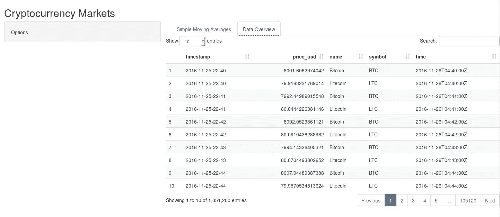

# 通过用户输入引入交互性

我们之前看到的与动态数据表交互的交互性是在网页浏览器本身内使用 JavaScript 实现的，它不需要通过`server`函数提供交互性，只需传递表格本身即可。然而，许多有趣的交互功能需要通过`server`来实现，这样我们就可以为它们提供定制的响应。在本节中，我们展示如何将各种类型的输入添加到我们的应用程序中。

# 设置静态用户输入

首先，我们将展示如何过滤数据中的时间戳，只显示用户定义范围内的观测值。为此，我们首先需要定义四个时间戳：最小值、初始左边界、初始右边界和最大值。这四个值将由我们的日期范围小部件用于定义用户允许的范围（最小值和最大值用于此目的），以及初始日期范围（初始左边界和右边界用于此），这些可能不同于允许范围的限制。

因此，我们需要提取这样的值，我们通过使用我们在第八章中创建的`TimeStamp`类来实现，该章节是*面向对象的加密货币跟踪系统*。请注意，我们使用`lubridate`包中的`days()`函数（你应在文件顶部添加`library(lubridate)`行），就像在提到的章节中做的那样。

由于我们只需要创建这些对象一次，因此它们应该位于用于加载`ORIGINAL_DATA`的代码下方，在`ui`对象定义之前：

```py
DATE_MIN <- 
timestamp_to_date_string.TimeStamp(min(ORIGINAL_DATA$timestamp))

DATE_MAX <- 
timestamp_to_date_string.TimeStamp(max(ORIGINAL_DATA$timestamp))

DATE_END <- 
timestamp_to_date_string.TimeStamp(time_to_timestamp.TimeStamp(
    timestamp_to_time.TimeStamp(min(ORIGINAL_DATA$timestamp)) + days(2)))
```

`TimeStamp`类中的`timestamp_to_date_string()`函数尚未创建，我们为此章节添加了它。它非常简单，如下面的代码所示。其目的是简单地获取`TimeStamp`的前 10 个字符，这对应于格式 YYYY-MM-DD：

```py
timestamp_to_date_string.TimeStamp <- function(timestamp) {
    return(substr(timestamp, 1, 10))
}
```

现在我们已经创建了这些对象，我们可以使用以下代码来扩展`ui`对象。我们所做的是将`"Options"`字符串替换为对`dateRangeInput()`函数的调用，该函数用于创建日期范围，正如其名称所暗示的。它接收作为参数的唯一标识符，该标识符将通过`input`参数在`server`中检索其*反应值*，用户看到的`label`，前面提到的`start`、`end`、`min`和`max`值，我们希望在网页浏览器输入框之间使用的`separator`，我们想要使用的日期`format`，以及一周中哪一天被认为是开始日（`0`代表星期日，`1`代表星期一，依此类推）：

```py
ui <- fluidPage(
    titlePanel("Cryptocurrency Markets"),
    sidebarLayout(
        sidebarPanel(
            dateRangeInput(
                "date_range",
                label = paste("Date range:"),
                start = DATE_MIN,
                end = DATE_END,
                min = DATE_MIN,
                max = DATE_MAX,
                separator = " to ",
                format = "yyyy-mm-dd",
                weekstart = 1
            )
        ),
        mainPanel(
            tabsetPanel(
                tabPanel("Simple Moving Averages", 
                         "Content 1"),
                tabPanel("Data Overview", 
                         fluidRow(DT::dataTableOutput("table"))
                )
            )
        )
    )
)
```

在服务器端，我们将在传递给 `datatable()` 函数的 *reactive expression* 中添加更多逻辑。我们不会简单地发送原始的 `ORIGINAL_DATA` 数据框，而是在发送之前对其进行过滤。为此，我们首先将其副本分配给 `data` 对象，并从 `ui` 对象中创建的小部件中提取两个日期值，使用它们在 `input` 参数中的引用。然后，我们检查这些值中的任何一个是否与它们的初始值不同。如果它们不同，我们将只使用那些在指定范围内观察到的 `data` 对象更新，这是通过标准的 dataframe 选择来完成的。最后，我们将这个过滤后的 `data` 发送到 `datatable()` 函数，并继续我们之前所做的工作。

这些对 `ui` 和 `server` 的更改的结果是，我们现在可以过滤在数据概览选项卡中显示的动态表中的日期，这是我们之前无法做到的。以下截图显示了正在运行的日期范围小部件。尝试更改其日期，看看动态表是如何更新的：

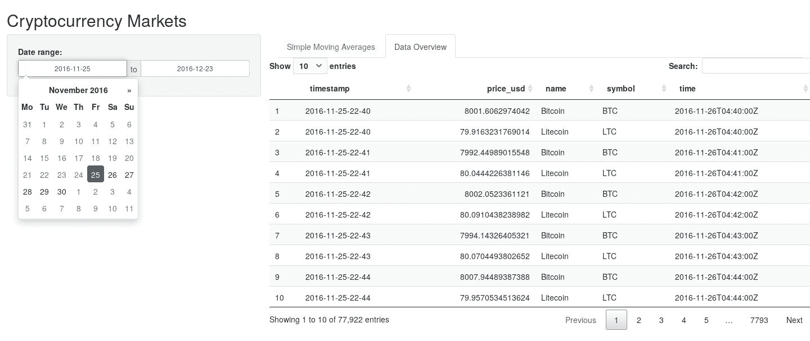

# 在下拉列表中设置动态选项

现在，我们将看到如何添加一个下拉输入，其条目会根据用户当前查看的选项卡进行调整。具体来说，我们将添加用户可以选择他们想要用于过滤数据的资产的可能性。如果您仔细观察，您可能会注意到动态数据表包含比特币和莱特币的观察结果，当我们只是查看表格时这可能没问题，但当我们尝试显示价格时间序列时，将会有多个资产的数据，这将成为一个问题。我们希望提供一个机制来选择其中之一，但我们还想保留在动态数据表中一起查看所有选项的能力，就像我们现在所做的那样。

我们首先创建一个包含当前数据中独特资产名称的对象。这比直接将它们的名称硬编码到代码中要好得多，因为当我们的数据发生变化时，它们将自动更新，而如果我们硬编码它们，则不会是这样。这一行应该位于之前的 *global* 对象下方，这些对象只需要创建一次：

```py
DATA_ASSETS <- unique(ORIGINAL_DATA$name)
```

由于在此情况下输入小部件具有动态逻辑，我们无法直接在`ui`对象内部创建它，我们需要在`server`函数中创建它，并将其传递给`ui`对象。这样做的方法是引入一个新的观察者到`output`参数中，命名为`select_asset`，它通过`renderUI()`函数创建，因为它将包含一个 Shiny `*Input()`函数。正如我们在上一节中对`data`所做的那样，我们将分配*默认*资产名称，只有在用户处于第二个标签页，即数据概览标签页的情况下（更多关于这个来源的信息见下文），它还会将`All`选项添加到下拉菜单中。否则，它将只保留资产名称，不包含`All`选项，这正是我们将在稍后创建的 SMA 图表所希望的：

```py
server <- function(input, output) {
    output$table <- DT::renderDataTable(DT::datatable({
        data  <- ORIGINAL_DATA
        start <- input$date_range[1]
        end   <- input$date_range[2]
        if (time_to_date_string.TimeStamp(start) != DATE_MIN |
            time_to_date_string.TimeStamp(end) != DATE_END) {
            data <- data[
                data$timestamp >= time_to_timestamp.TimeStamp(start) &
                data$timestamp <= time_to_timestamp.TimeStamp(end), ]
        }
        return(data)
    }))

    output$select_asset <- renderUI({
        assets <- DATA_ASSETS
        if (input$tab_selected == 2) {
            assets <- c("All", assets)
        }
        return(selectInput("asset", "Asset:", assets))
    })
}
```

为了实际上提供一个机制，让`server`理解用户当前查看的是哪个标签页，`ui`对象需要调整，以便`tabsetPanel()`函数接收一个带有包含当前标签页编号的对象名称的`id`参数，在这个例子中是`tab_selected`（这是在`server`函数中用来检查的名称）。此外，每个标签页内部都必须使用`value`参数分配一个值，正如所示。这样我们确保数据概览标签页与`2`值相关联。

还请注意，我们在`sidePanel()`函数中刚刚引入的`wellPanel()`函数调用内添加了`htmlOutput()`函数调用。`wellPanel()`函数在视觉上将面板分组，为用户提供更直观的界面，而`htmlOutput()`函数使用观察者的名称来确定在网页浏览器中显示什么，在这个例子中是`output`对象的`select_asset`元素：

```py
ui <- fluidPage(
    titlePanel("Cryptocurrency Markets"),
    sidebarLayout(
        sidebarPanel(
            wellPanel(
                dateRangeInput(
                    "date_range",
                    label = paste("Date range:"),
                    start = DATE_MIN,
                    end = DATE_END,
                    min = DATE_MIN,
                    max = DATE_MAX,
                    separator = " to ",
                    format = "yyyy-mm-dd",
                    weekstart = 1,
                    startview = "year"
                ),
                htmlOutput("select_asset")
            )
        ),
        mainPanel(
            tabsetPanel(
                id = "tab_selected",
                tabPanel(
                    "Simple Moving Averages",
                    value = 1,
                    "Content 1"
                ),
                tabPanel(
                    "Data Overview",
                    value = 2,
                    fluidRow(DT::dataTableOutput("table"))
                )
            )
        )
    )
)
```

完成这些更改后，我们可以看到，当用户处于简单移动平均（Simple Moving Average）标签页时，我们的应用程序显示了一个资产名称下拉菜单，其中包括`Bitcoin`和`Litecoin`选项，并且当他们在数据概览（Data Overview）标签页时，还包括了`All`选项，正如我们想要的，也如以下截图所示：

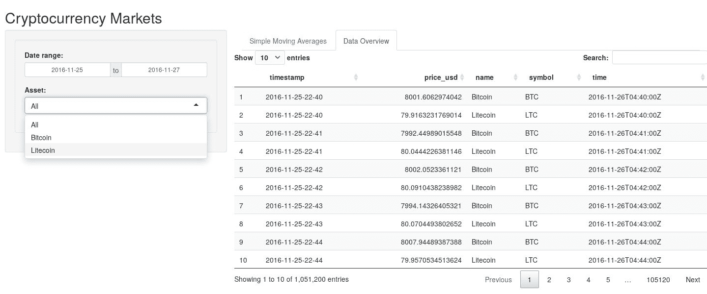

# 设置动态输入面板

我们将要引入的最后两个输入将用于稍后使用的 SMA 图表。第一个用于选择用户想要使用的 SMA 实现。选项包括我们在上一章中创建的`sma_efficient_1()`、`sma_efficient_2()`、`sma_delegated_fortran()`和`sma_delegated_cpp()`函数。第二个用于定义用于 SMA 计算的周期，并作为之前某个函数的输入。

由于代码可能会变得过于重复且占用太多空间，并且您很可能已经理解了在创建`ui`时使用的嵌套模式，我将避免重复完整的`ui`对象声明，而只是指出需要做出更改的地方。

在此情况下，我们想在 `wellPanel()` 函数结束后和 `sidebarPanel()` 函数结束前添加以下代码。以下代码将是 `sidebarPanel()` 的第二个参数，所以别忘了在 `wellPanel()` 函数完成后添加一个逗号（","），否则您将得到一个错误。

`conditionalPanel()` 函数检查一个使用字符串指定的 JavaScript 条件，以决定是否向用户显示面板。由于 `input` 对象通过一个方便命名为 `input` 的 JavaScript 对象发送到网页浏览器，我们可以使用它来获取我们想要的值，即用户是否正在查看第一个标签，“简单移动平均”。如果是的话，我们将显示面板：

JavaScript 使用点（"."）表示法来访问元素，而不是 R 中使用的 `money` (`$`) 表示法。

展示的面板是 `wellPanel()`，其中包含两个输入对象：`radioButtons()` 和 `sliderInput()`。第一个接收用户可用的选项列表，通过 `choices` 参数发送（每个元素的名称是显示给用户的，而每个元素的值在 R 中内部使用，在本例中是 SMA 实现名称），以及默认的 `selected` 选项。第二个接收数字滑块的 `min`、`max` 和默认 `value`。两者都接收唯一标识符和标签作为前两个参数，就像其他每个 `*Input()` 函数一样：

```py
conditionalPanel(
    condition = "input.tab_selected == 1",
    wellPanel(
        radioButtons(
            "sma_implementation",
            "Implementation:",
            choices = list(
                "C++" = "sma_delegated_cpp",
                "Fortran" = "sma_delegated_fortran",
                "Efficient 1" = "sma_efficient_1",
                "Efficient 2" = "sma_efficient_2"
            ),
            selected = "sma_delegated_cpp"
        ),
        sliderInput(
            "sma_period",
            "Period:",
            min = 5,
            max = 200,
            value = 30
        )
    )
)
```

我们将把实际的图形创建留到以后，所以不需要在 `server` 端做任何改变。到目前为止，从 `input$sma_implementation` 和 `input$sma_period` 出来的 `reactive values` 不会被使用。以下是一个截图，展示了这些输入是如何显示的。如果您导航到“简单移动平均”标签，它们应该会显示，但如果您导航到“数据概览”标签，它们应该被隐藏：

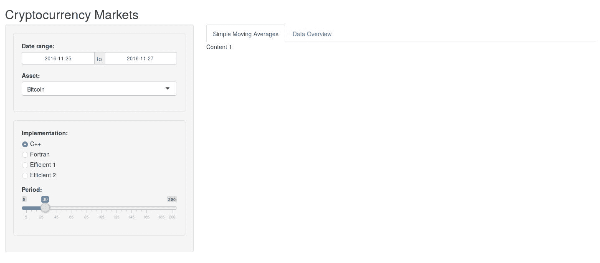

如您所见，允许用户与应用程序交互并不太难，这是通过在 `ui` 对象中使用 `*Input()` 函数来实现的，其 `reactive values` 可以在 `server` 函数中使用。

# 添加包含共享数据的摘要表

现在我们将在我们的动态数据表顶部添加一个摘要表。这个摘要表应该根据所选资产更新（注意复数形式，因为我们允许在此标签中包含“所有”情况）。花点时间想想您会如何自己实现这个功能？如果您试图复制我们之前展示的 `data` 对象的模式，您将得到一个正确但效率不高的解决方案。原因是过滤数据的逻辑会被重复，这是不必要的。

为了避免这个陷阱，我们接下来将展示如何使用`reactive()`函数在不同**反应函数**之间共享流，`reactive()`函数是一个用于为其他**反应函数**准备**反应值**的函数。在这种情况下，我们将之前创建的所有逻辑移动到作为参数发送给这个函数的表达式中，并将其分配给`data`对象，现在它本身就是一个**反应函数**。请注意，我们还添加了一些代码来检查当前资产选择是否不同于`All`，如果是，则使用该值来过滤数据，类似于我们使用日期过滤数据的方式。

一旦我们完成了这个操作，我们可以用对`data()`反应函数的简单调用替换`datatable()`函数内部的逻辑，这个反应函数将提供预期的数据框。现在我们已经提取了这部分逻辑，我们可以在使用`renderTable()`函数创建的`output$summary_table`观察者中重用`data()`调用。正如你所见，它传递了一个使用`data()`函数返回的数据框的统计数据创建的数据框。在这种情况下，我们可以保证在`output$table()`和`output$summary_table()`函数中使用的数据是相同的：

```py
server <- function(input, output) {

    data <- reactive({
        data  <- ORIGINAL_DATA
        start <- input$date_range[1]
        end   <- input$date_range[2]
        if (input$asset != "All") {
            data <- data[data$name == input$asset, ]
        }
        if (time_to_date_string.TimeStamp(start) != DATE_MIN |
            time_to_date_string.TimeStamp(end) != DATE_MAX) {
            data <- data[
                data$timestamp >= time_to_timestamp.TimeStamp(start) &
                data$timestamp <= time_to_timestamp.TimeStamp(end), ]
        }
        return(data)
    })

    output$table <- DT::renderDataTable(DT::datatable({return(data())}))

    output$select_asset <- renderUI({
        assets <- DATA_ASSETS
        if (input$tab_selected == 2) {
            assets <- c("All", assets)
        }
        return(selectInput("asset", "Asset:", assets))
    })

    output$summary_table <- renderTable(data.frame(
        Minimum = min(data()$price_usd),
        Median = mean(data()$price_usd),
        Mean = mean(data()$price_usd),
        Max = max(data()$price_usd)
    ))
}
```

如果你在使用随机数据（例如，随机数）且没有使用`reactive()`函数而是复制数据逻辑，请务必小心，因为你可能无法在这两个地方得到相同的数据。

我们还需要在`ui`对象中引入相应的函数调用，我们将它放在相应的`tabPanel()`中。为了将我们刚刚创建的数据框放入其中，我们使用带有相应`summary_table`字符串参数的`tableOutput()`函数。代码如下（注意，我省略了这段代码周围的`ui`代码）：

```py
tabPanel(
    "Data Overview",
    value = 2,
    fluidRow(tableOutput("summary_table")),
    fluidRow(DT::dataTableOutput("table"))
)
```

实施这些更改后，你应该会看到一个包含所提统计数据的摘要表，位于动态数据表顶部，并且当作为日期和资产选择的输入发送不同值时，它们应该会更新。

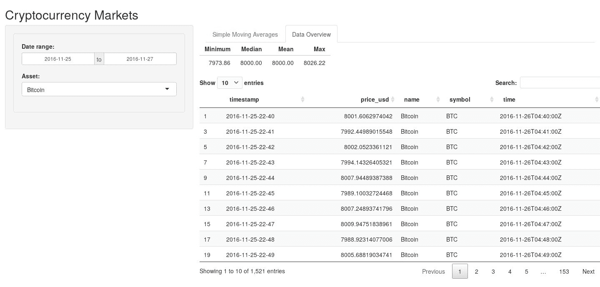

# 添加简单移动平均图表

现在我们将创建我们的第一个**简单移动平均**（**SMA**）图表。这个图表将通过`package`创建，并显示两条线。黑色线将是实际的价格数据，蓝色线将是 SMA。

在我们开始之前，由于使用日期的`ggplot2`图表比使用时间戳字符串创建得更好，我们在`ORIGINAL_DATA`数据框中添加了相应的日期的`time`列。这应该放在加载数据后立即进行：

```py
ORIGINAL_DATA$time <- timestamp_to_time.TimeStamp(ORIGINAL_DATA$timestamp)
```

接下来，我们展示如何实现我们的 `sma_graph()` 函数。如所见，它将接收两个参数，即 `data` 数据框和从前述 SMA 实现中出来的 `sma` 向量。该函数非常简单，它创建一个以 `time` 为 *x* 轴和 `price_usd` 为 *y* 轴的图，为这些数据添加点和线，然后添加一个来自 `sma` 向量的第二个蓝色线。`group = 1` 参数用于避免任何错误，告诉 `ggplot()` 函数该数据中只有一个组，而 `size = 1` 参数只是为了使线条更加突出。

注意，我们返回的是图对象。最后，你应该记住，使用 `geom_line()` 函数将插值引入到示例中，这可能会错误地表示我们为价格所拥有的离散数据，但它也有助于理解价格动态，这就是我们使用它的原因：

```py
sma_graph <- function(data, sma) {
    g <- ggplot(data, aes(time, price_usd))
    g <- g + geom_point()
    g <- g + geom_line(group = 1)
    g <- g + geom_line(aes_string(y = sma),
                       group = 1, color = "blue", size = 1)
    return(g)
}
```

现在，为了遵循良好的实践，我们将 SMA 计算放在一个自己的 `reactive()` 函数中（就在我们之前创建的 `data` *reactive function* 下方）。请注意，这是一个依赖于另一个 *reactive function* 的 *reactive function*，即 `data()` 函数。

以下代码（省略了 `server` 函数的其余部分）显示，这个 `sma` 定义使用了 `do.call()` 函数来执行我们从 `input$sma_implementation` 小部件接收到的作为 *reactive value* 的实现名称。`do.call()` 还接收一个列表作为第二个参数，这个列表包含将发送到我们想要调用的实际函数的参数。在这种情况下，它是 `input$sma_period`，`symbol`（在这种情况下将是一个单一值，因为我们限制了这个标签页的数据只有一个资产），以及通过调用 `data()` *reactive function* 的实际数据：

```py
sma <- reactive({
    return(do.call(
        input$sma_implementation,
        list(input$sma_period, data()[1, "symbol"], data())
    ))
})
```

在实现了这个 `sma()` *reactive function* 之后，我们可以按照以下方式实现观察者 `output$graph_top()`（再次省略了一些代码）：

```py
output$graph_top <- renderPlot({
    return(sma_graph(data(), sma()))
})
```

最后，我们需要更新我们的 `ui` 对象，用 `fluidRow()` 和 `ploutOutput()` 替换 `"Content 1"` 占位符。我们发送 `"graph_top"` 唯一标识符到我们感兴趣的观察者：

```py
fluidRow(plotOutput("graph_top"))
```

这很简单，不是吗？现在我们可以运行我们的应用程序，它应该显示数据的前两天，上面有一个蓝色 SMA(30) 如下截图所示：

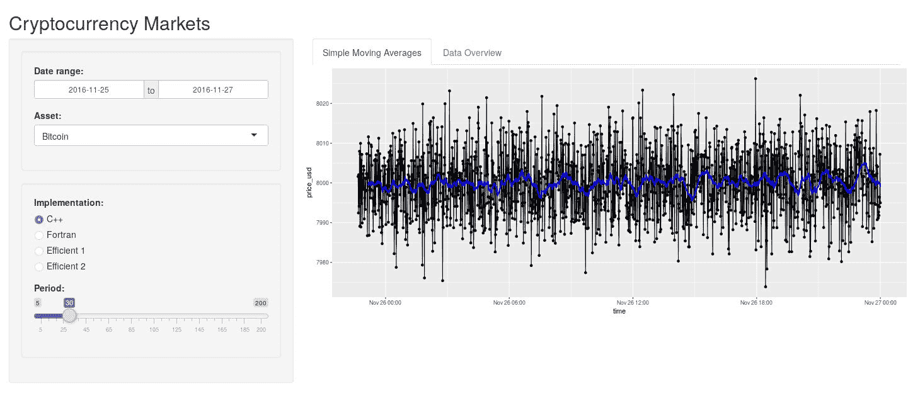

注意，你可以更改选项，并且图表将相应更新。例如，如果我们只选择了数据中的第一天，并决定在上面绘制 SMA(5)。

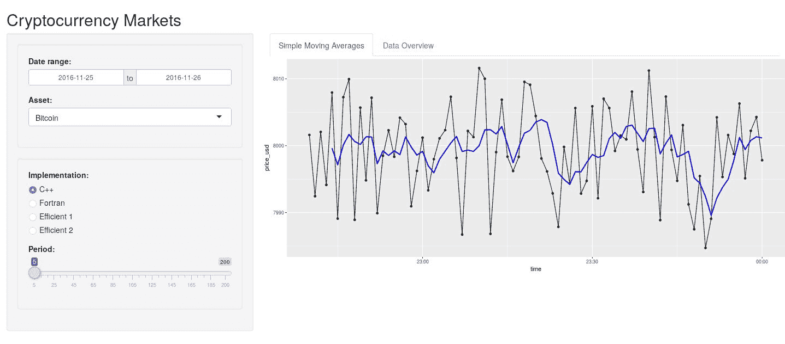

最后，如果你的电脑可以处理，你可能会决定显示完整的数据（这有很多观察值，所以请小心）。在这种情况下，SMA 将不可见，但它仍然会被绘制出来。结果如图所示：

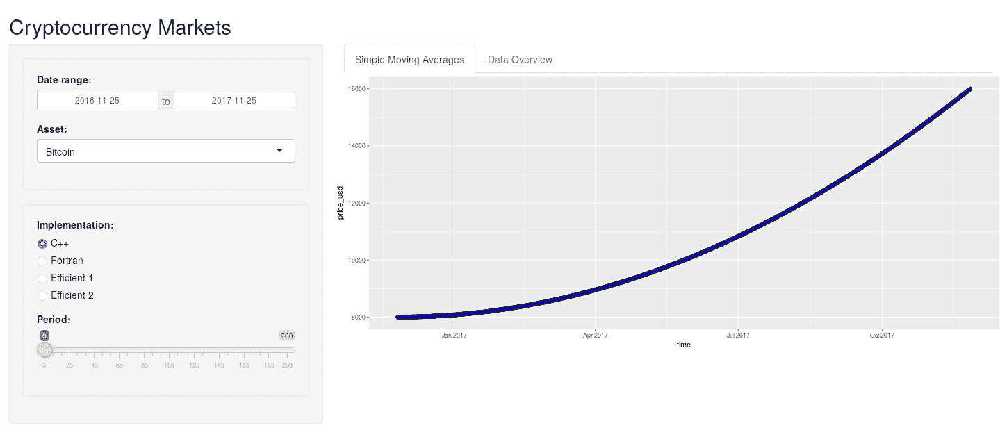

# 通过添加一个二级缩放图来增加交互性

最后，我们将通过实现另一个类似的图表来为我们的图形添加一些交互性，该图表将对之前创建的图表产生*放大*效果。想法是，我们可以选择图形中我们刚刚创建的区域，下面放置的图形将只显示我们选择的特定区域。这听起来很有趣，不是吗？

为了完成这个任务，我们需要修改之前章节末尾插入的`plotOutput()`，以包括一个带有对`brushOpts()`函数调用的`brush`参数，该函数接收我们创建的刷输入的唯一标识符。此参数用于创建一种特殊类型的输入，它从在网页浏览器中显示的图形中检索所选区域。我们还添加了另一个`fluidRow()`，其中包含另一个`plotOutput()`，位于其下方以包含将提供*放大*效果的图形。代码如下：

```py
tabPanel(
    "Simple Moving Averages",
    value = 1,
    fluidRow(plotOutput("graph_top", brush = brushOpts("graph_brush"))),
    fluidRow(plotOutput("graph_bottom"))
)
```

现在，`input$graph_brush`反应值将包含一个包含四个元素的列表`xmin`、`xmax`、`ymin`和`ymax`，这些坐标构成了顶部图形中选定的区域。我们的`ranges()`反应函数将使用它们将适当的值作为限制发送到底部图形。它的工作方式是检查`input$graph_brush`是否为`NULL`，如果不是，意味着已选择一个区域，那么它将返回一个包含两个元素的列表，`x`和`y`，其中每个元素都包含适当的坐标。如果`input$graph_brush`是`NULL`，那么返回列表的`x`和`y`元素将是`NULL`，这会向我们将要用于`sma_graph()`顶部的`coord_cartesian()`函数发出信号，以避免在轴上放置任何约束。实际函数如下所示，并且与其他使用`reactive()`创建的函数一样，它应该放在`server`函数内部。

还要注意，我们需要对*x*轴的值进行一些小的转换，因为它们作为整数返回，而不是`ggplot()`用于该轴的对象类型——日期。我们简单地使用`as.POSIXct()`函数将这样的整数转换为有效的日期，使用`oring = "1970-01-01"`，这是`ggplot()`默认使用的。如果我们不进行转换，我们将得到一个错误：

```py
ranges <- reactive({
    if (!is.null(input$graph_brush)) {
        return(list(
            x = c(as.POSIXct(input$graph_brush$xmin, 
                             origin = "1970-01-01"),
                  as.POSIXct(input$graph_brush$xmax, 
                             origin = "1970-01-01")),

            y = c(input$graph_brush$ymin, 
                  input$graph_brush$ymax)
        ))
    }
    return(list(x = NULL, y = NULL))
})
```

现在，我们能够创建`output$bottom_graph`观察者，就像我们创建之前的图表一样，但在这个情况下，我们将在`sma_graph()`返回的图形对象上添加`coord_cartesian()`函数来限制轴的值。请注意，我们使用`expand = FALSE`来强制使用`ranges()`反应函数提供的限制，这是我们之前代码中刚刚创建的：

```py
output$graph_bottom <- renderPlot({
    return(sma_graph(data(), sma()) +
           coord_cartesian(xlim = ranges()$x,
                           ylim = ranges()$y, expand = FALSE))
})
```

实施了这些更改后，我们应该会得到期望的效果。为了测试它，我们可以打开应用程序，查看两个重叠的相同图表，如下面的截图所示：

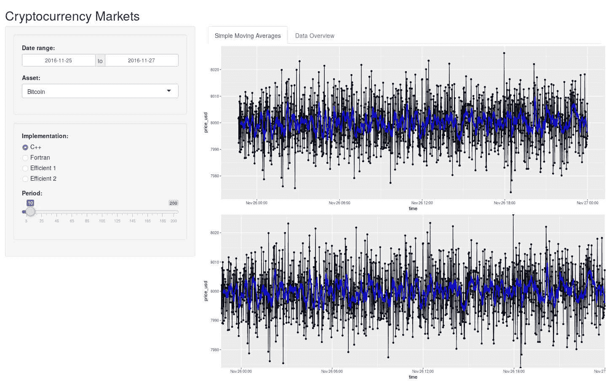

然而，如果我们选择顶部图表上的某个区域，那么底部图表应该更新，只显示该特定部分的图表。这很酷，不是吗？

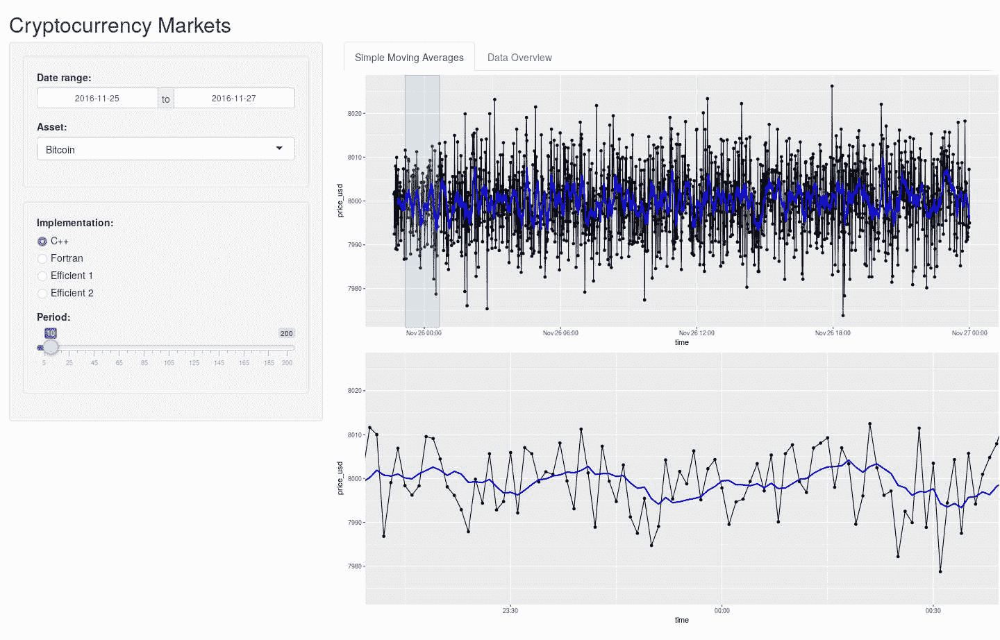

最后，您应该知道，引入交互式图形的另一种方法是使用众所周知的 JavaScript，如`Plot.ly`（我们在第五章[part0110.html#38STS0-f494c932c729429fb734ce52cafce730]，*通过可视化沟通销售*中使用过）。Shiny 创建的网站在后台使用 JavaScript，因此这种技术是一个自然的选择。然而，这是一个高级技术，其使用比我们在这里展示的要复杂得多，所以我们不会展示它，但您应该知道这是可能的，以防您想自己尝试。

# 使用主题美化我们的应用

到目前为止，我们一直在使用 Shiny 默认提供的主题，但现在我们的应用已经完成，我们希望用一些看起来像科技感的颜色来美化它。在这种情况下，我们可以使用`shinythemes`和`ggthemr`包，它们为我们提供了将主题应用于 Shiny 应用和`ggplot2`图表的简单方法。

我们要应用主题所做的全部事情就是告诉`ggplot2`框架应用由`ggthemr`包提供的*扁平暗色*主题，并且为了确保图表的*外部*部分也被美化，我们使用`type = outer`参数，如下所示。代码应该放在我们放置`ggplot2`代码的地方，以确保连贯性，对于本章来说是在`functions.R`文件中：

```py
library(ggthemr)
ggthemr('flat dark', type = 'outer')
```

要美化 Shiny 应用本身，我们通过`shinytheme()`函数将`theme`参数发送到`fluidPage()`函数，就在调用`titlePanel()`函数之前，如下所示：

```py
ui <- fluidPage(
    theme = shinytheme("superhero"),
    titlePanel("Cryptocurrency Markets"),
    ...
)
```

我们还将图表中的 SMA 线改为白色，这个操作您已经知道如何做了，并且通过这些改动，现在我们的应用看起来相当高科技。以下展示了简单移动平均（Simple Moving Average）标签页：

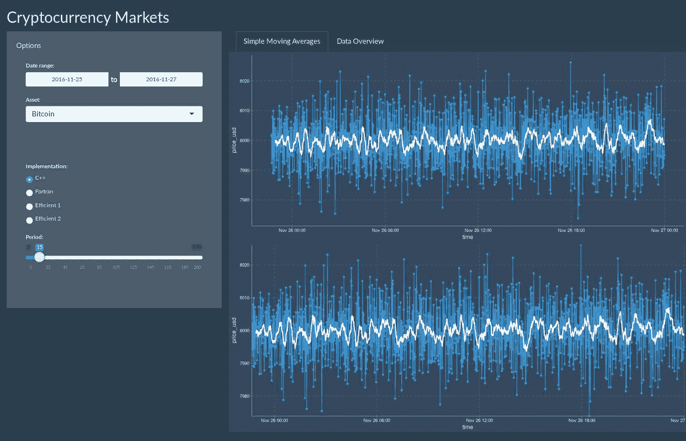

这里您可以看到数据概览标签页的截图：

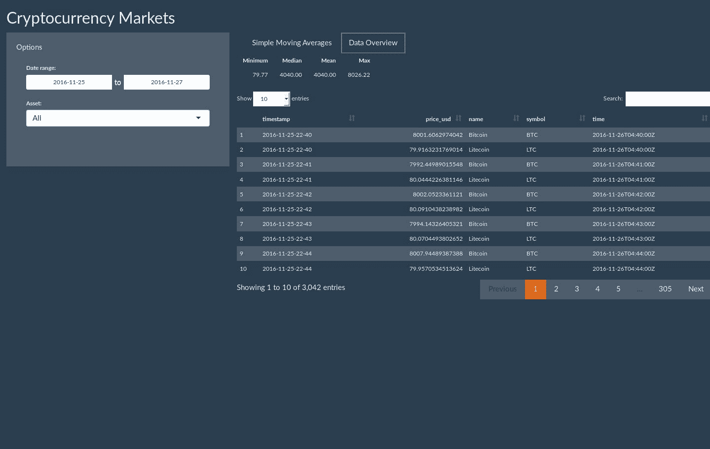

要查找其他主题，您可以查看`shinythemes`仓库（[`rstudio.github.io/shinythemes/`](http://rstudio.github.io/shinythemes/））和`ggthemr`仓库（[https://github.com/cttobin/ggthemr](https://github.com/cttobin/ggthemr)）。为了确保读者能够立即意识到完整的代码是什么样的，我在这里也放置了应用的完整代码以及用于图表的函数：

```py
library(shiny)
library(ggplot2)
library(lubridate)
library(shinythemes)

source("../chapter-08/cryptocurrencies/utilities/time-stamp.R")
source("../chapter-09/sma-delegated.R", chdir = TRUE)
source("../chapter-09/sma-efficient.R")
source("./functions.R")

ORIGINAL_DATA <- 
read.csv("../chapter-09/data.csv", stringsAsFactors = FALSE)

ORIGINAL_DATA$time <- 
timestamp_to_time.TimeStamp(ORIGINAL_DATA$timestamp)

DATA_ASSETS <- unique(ORIGINAL_DATA$name)

DATE_MIN <- 
timestamp_to_date_string.TimeStamp(min(ORIGINAL_DATA$timestamp))

DATE_MAX <- 
timestamp_to_date_string.TimeStamp(max(ORIGINAL_DATA$timestamp))

DATE_END <- 
timestamp_to_date_string.TimeStamp(time_to_timestamp.TimeStamp(
    timestamp_to_time.TimeStamp(min(ORIGINAL_DATA$timestamp)) + days(2)))

ui <- fluidPage(
    theme = shinytheme("superhero"),
    titlePanel("Cryptocurrency Markets"),
    sidebarLayout(
        sidebarPanel(
            "Options",
            wellPanel(
                dateRangeInput(
                    "date_range",
                    label = paste("Date range:"),
                    start = DATE_MIN,
                    end = DATE_END,
                    min = DATE_MIN,
                    max = DATE_MAX,
                    separator = " to ",
                    format = "yyyy-mm-dd",
                    weekstart = 1,
                    startview = "year"
                ),
                htmlOutput("select_asset")
            ),
            conditionalPanel(
                condition = "input.tab_selected == 1",
                wellPanel(
                    radioButtons(
                        "sma_implementation",
                        "Implementation:",
                        choices = list(
                            "C++" = "sma_delegated_cpp",
                            "Fortran" = "sma_delegated_fortran",
                            "Efficient 1" = "sma_efficient_1",
                            "Efficient 2" = "sma_efficient_2"
                        ),
                        selected = "sma_delegated_cpp"
                    ),
                    sliderInput(
                        "sma_period",
                        "Period:",
                        min = 5,
                        max = 200,
                        value = 30
                    )
                )
            )
        ),
        mainPanel(
            tabsetPanel(
                id = "tab_selected",
                tabPanel(
                    "Simple Moving Averages",
                    value = 1,
                    fluidRow(plotOutput("graph_top", 
                                         brush = brushOpts(
                                         "graph_brush"))),
                    fluidRow(plotOutput("graph_bottom"))
                ),
                tabPanel(
                    "Data Overview",
                    value = 2,
                    fluidRow(tableOutput("summary_table")),
                    fluidRow(DT::dataTableOutput("table"))
                )
            )
        )
    )
)

server <- function(input, output) {

    data <- reactive({
        data <- ORIGINAL_DATA
        start <- input$date_range[1]
        end <- input$date_range[2]
        if (input$asset != "All") {
            data <- data[data$name == input$asset, ]
        }
        if (time_to_date_string.TimeStamp(start) != DATE_MIN |
            time_to_date_string.TimeStamp(end) != DATE_MAX) {
            data <- data[
                data$timestamp >= time_to_timestamp.TimeStamp(start) &
                data$timestamp <= time_to_timestamp.TimeStamp(end), ]
        }
        return(data)
    })

    sma <- reactive({
        return(do.call(
            input$sma_implementation,
            list(input$sma_period, data()[1, "symbol"], data())
        ))
    })

    ranges <- reactive({
        if (!is.null(input$graph_brush)) {
            return(list(
                x = c(as.POSIXct(input$graph_brush$xmin, 
                                 origin = "1970-01-01"),
                      as.POSIXct(input$graph_brush$xmax, 
                                 origin = "1970-01-01")),
                y = c(input$graph_brush$ymin, 
                      input$graph_brush$ymax)
            ))
        }
        return(list(x = NULL, y = NULL))
    })

    output$table <- DT::renderDataTable(DT::datatable({
        return(data())
    }), style = "bootstrap")

    output$select_asset <- renderUI({
        assets <- DATA_ASSETS
        if (input$tab_selected == 2) {
            assets <- c("All", assets)
        }
        return(selectInput("asset", "Asset:", assets))
    })

    output$summary_table <- renderTable(data.frame(
        Minimum = min(data()$price_usd),
        Median = mean(data()$price_usd),
        Mean = mean(data()$price_usd),
        Max = max(data()$price_usd)
    ))

    output$graph_top <- renderPlot({
        return(sma_graph(data(), sma()))
    })

    output$graph_bottom <- renderPlot({
        return(sma_graph(data(), sma()) +
               coord_cartesian(xlim = ranges()$x,
                               ylim = ranges()$y, expand = FALSE))
    })
}

shinyApp(ui, server, options = list(port = 6924))
```

# 其他感兴趣的话题

当使用 Shiny 时，有一些常见的任务可以用来自定义您的 Web 应用。其中一些任务包括添加静态图片、HTML 和 CSS。在接下来的章节中，我们将简要介绍如何使用 Shiny 实现这些功能。最后，我们还将提到一些选项，您可以使用这些选项与他人共享您的应用，而无需设置自己的 Web 服务器，这样他们就可以通过互联网连接在他们的 Web 浏览器中使用它。

# 添加静态图片

图片可以增强你应用程序的外观，并帮助用户理解内容。Shiny 会查找`img()`函数来在你的应用程序中放置图片文件。要插入图片，只需使用`src`指定图片的位置。你还可以包含其他 HTML 友好参数，如高度和宽度（它们将以*像素值*传递）：

```py
img(src = "image.png", height = 250, width = 250)
```

`image.png`文件必须在与`app.R`脚本相同的目录中名为`www`的文件夹内。Shiny 会将这里放置的任何文件与用户的网络浏览器共享，这使得`www`成为放置图片、样式表和其他浏览器需要构建你的 Shiny 应用程序 Web 组件的绝佳位置。

# 在你的 Web 应用程序中添加 HTML

使用 HTML 标签很容易将 HTML 元素添加到你的 Shiny 应用程序中。你可以使用诸如`tags$h1()`或`tags$p()`之类的语法添加许多元素到你的页面中，分别用于一级标题和段落。在下面的代码片段中，你可以看到这些是如何被用来创建一个包含一个一级标题、随后是一个段落、一个二级标题，然后是另一个段落的页面的。

HTML 标签的完整列表可以在 Shiny HTML 标签术语表（[`shiny.rstudio.com/articles/tag-glossary.html`](https://shiny.rstudio.com/articles/tag-glossary.html)）中找到：

```py
ui <- fluidPage(
    tag$h1("This is a first level heading"),
    tag$p("This is a paragraph.)
    tag$h2("This is a second level heading"),
    tag$p("This is a another paragraph.)
)
```

然而，有时你可能需要对你想要使用的 HTML 有更多的控制。在这种情况下，你可以通过使用`HTML()`函数直接在你的应用程序中指定 HTML。在这种情况下，Shiny 不会为你执行任何转义，你将拥有完整的 HTML 功能，你只需传递如这里所示的原生 HTML 即可。请注意，这个原生 HTML 可以包含在其他标签中，就像这里一样，它被`div`HTML 标签包裹：

```py
tags$div(
    HTML("Raw HTML")
)
```

# 添加自定义 CSS 样式

Shiny 使用 Bootstrap 框架进行结构和样式设计。如果你是 CSS **层叠样式表**（**CSS**）的新手或者不熟悉 Bootstrap，在尝试应用自己的样式之前，阅读*入门指南*（[`getbootstrap.com/docs/3.3/getting-started/`](https://getbootstrap.com/docs/3.3/getting-started/))是个不错的选择。

要包含你自己的 CSS，你有几个选择，但我们只会展示如何使用`includeCSS()`函数以及如何直接将样式应用到 HTML 标签中。`includeCSS()`函数由 Shiny 提供，可以用来直接从上一节中提到的`www`目录包含 CSS 文件。其用法相当简单。

尽管通常这不是一个好主意，因为很难找到你的样式，而且保持一致性更难，但有时直接将样式应用到 HTML 标签中是有用的。如果你想这样做，你可以向特定标签发送一个`style`参数。

假设你有一个名为`style.css`的文件位于`www`目录中，它提供了你想要的所有样式，除了你想要应用到*一级标题*上的绿色颜色。然后，你可以使用以下代码，它包含了这两种技术：

```py
ui <- fluidPage(
    includeCSS("style.css"),
    h1(style = "color: blue;", "A blue heading"),
)
server <- function(input, output) { }
shinyApp(ui, server)
```

# 分享你新创建的应用程序

尽管 Shiny 应用程序最终以 HTML 文件的形式呈现，但你不能简单地将其复制到你的服务器上。它们需要一个 Shiny 服务器，就像我们在本章中一直在使用的那样。运行 Shiny 应用程序（就像其他任何应用程序一样）有两种方式：本地或远程。本地意味着你需要启动一个带有 Shiny 和所需依赖项的 R 安装程序，并像我们在本章中做的那样运行它。远程意味着你可以通过一个网站访问它，这在某些时候可能会非常酷和方便。

要本地运行，你需要将应用程序的文件放在将要执行它们的计算机上。有许多方法可以做到这一点，但最常见的一种是将它们上传到 Git 仓库，从那里下载，然后遵循你已知的步骤。此外，如果你的文件存储在 GitHub（[`www.github.com`](https://www.github.com)）上托管的 Git 仓库中，你可以使用带有存储库名称和拥有存储库的账户用户名的`runGitHub()`函数。在这种情况下，下载、解包和执行将由你完成。例如，要运行本章中开发的应用程序，你可以使用以下行：

```py
runGitHub("", "")
```

如果你想要提供对应用程序的远程访问，你有许多选择，但主要的有三个：ShinyApps、RStudio Connect 和 Shiny Server。**ShinyApps** ([`www.shinyapps.io`](https://www.shinyapps.io))为小型应用程序提供免费服务，访问量有限，并且可以通过付费版本进行扩展。**RStudio Connect** ([`www.rstudio.com/products/connect/`](https://www.rstudio.com/products/connect/))是一个 Shiny 应用程序和 R Markdown 报告的发布平台。使用它，你可以直接从 RStudio 发布。最后，**Shiny Server** ([`www.rstudio.com/products/shiny/shiny-server/`](https://www.rstudio.com/products/shiny/shiny-server/))是本章中使用的 Shiny 服务器的开源版本，额外的好处是你可以在你控制的 Linux 服务器上运行它（当然，这包括云服务提供商的服务器）。与开源版本相比，RStudio 还出售 Shiny Server Pro 的年度订阅，它提供了安全、管理和其他增强功能。

# 摘要

正如我们在本章中看到的那样，使用*函数式响应式编程*范式通过 Shiny 创建强大的 Web 应用程序并不一定困难。这只需要良好的概念理解和一点探索。

我们展示了如何为用户提供输入，使他们能够向后端发送*反应性值*，即向`服务器`发送，并使其能够适当地响应这些事件流。我们还展示了如何添加更复杂的交互，例如带有缩放效果的两个图表。

这是本书的最后一章，您看到了如何使用 Shiny 提供的许多工具来创建交互式应用程序。然而，我们只是触及了 Shiny 和 R 在一般情况下的可能性的一小部分。希望您能将本书中学到的知识应用到创建令人惊叹的应用程序中。感谢您走到这一步！祝您好运！
