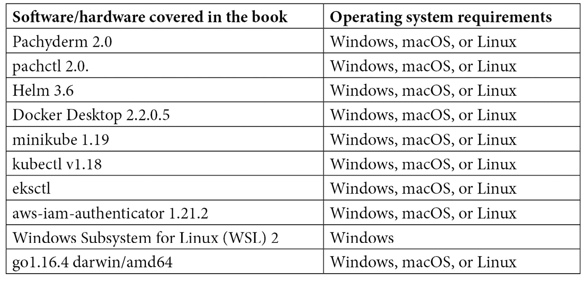

# 前言

Pachyderm 是一个分布式版本控制平台，用于构建端到端的数据科学工作流。自 2016 年创建以来，Pachyderm 已经成为大小组织的首选解决方案。Pachyderm 的核心功能是开源的，并且围绕它有一个活跃的工程师社区。本书带你走过 Pachyderm 使用的基础和高级示例，帮助你快速上手并将可靠的数据科学解决方案集成到你的基础设施中。

*使用 Pachyderm 实现可重复的数据科学* 提供了对 Pachyderm 的清晰概述，以及如何在云中安装和运行 Pachyderm 的说明，还介绍了如何使用 Pachyderm 的**软件即服务**（**SaaS**）版本——Pachyderm Hub。本书包含了在 Pachyderm 集群上运行的数据科学技术的实际示例。

# 这本书的适用人群

本书适用于希望为数据科学项目构建可扩展基础设施的初学者和有经验的数据科学家及机器学习工程师。具备基本的 Python 编程和 Kubernetes 知识将有所帮助，熟悉 GoLang 者优先。

# 本书涵盖内容

*第一章*，*数据可重复性问题*，讨论了现代科学和数据科学中可重复性的问题，以及它如何与 Pachyderm 的使命相一致。

*第二章*，*Pachyderm 基础*，介绍了 Pachyderm 的基本概念和原语。

*第三章*，*Pachyderm 管道规范*，提供了 Pachyderm 规范文件的详细概述，这是 Pachyderm 管道的主要配置文件。

*第四章*，*在本地安装 Pachyderm*，带你了解如何在本地计算机上安装 Pachyderm。

*第五章*，*在云平台上安装 Pachyderm*，介绍了如何在三个主要的云平台上安装 Pachyderm：**Amazon Elastic Kubernetes Service**（**EKS**）、**Google Kubernetes Engine**（**GKE**）和 Microsoft **Azure Kubernetes Service**（**AKS**）。

*第六章*，*创建您的第一个管道*，介绍了如何创建一个简单的处理图像的管道。

*第七章*，*Pachyderm 操作*，介绍了最常用的操作。

*第八章*，*创建端到端的机器学习工作流*，展示了如何在一个示例**自然语言处理**（**NLP**）管道上部署端到端的机器学习工作流。

*第九章*，*使用 Pachyderm 进行分布式超参数调优*，介绍了如何使用**命名实体识别**（**NER**）管道进行分布式超参数调优。

*第十章*，*巨兽语言客户端*，带你了解使用 Pachyderm Python 和 Golang 客户端的最常见示例。

*第十一章*，*使用 Pachyderm 笔记本*，讨论了 Pachyderm Hub，Pachyderm 的**软件即服务**（**SaaS**）平台，并且你将了解 Pachyderm 笔记本，这是一个为数据科学家设计的**集成开发环境**（**IDE**）。

# 为了最大限度地发挥本书的效果

你需要在电脑上安装最新版本的 Pachyderm。本书中的所有操作均在 macOS 的 Pachyderm 2.0 版本上进行测试。不过，这些操作也应该适用于未来版本的发布。如果你使用的是 Windows，所有操作必须在**Windows 子系统 Linux**（**WSL**）中执行。



你需要申请 Pachyderm 的企业版才能使用 Pachyderm 控制台。Pachyderm 为首次用户提供免费的试用许可。然而，大多数示例在没有企业许可的情况下也可以正常工作。为了测试*第十一章*，*使用 Pachyderm 笔记本*，你需要创建一个 Pachyderm Hub 账户。

**如果你正在使用本书的电子版，我们建议你自己输入代码，或访问本书 GitHub 仓库中的代码（下一节会提供链接）。这样做可以帮助你避免因复制粘贴代码而可能出现的错误。**

# 下载示例代码文件

你可以从 GitHub 下载本书的示例代码文件，链接：[`github.com/PacktPublishing/Reproducible-Data-Science-with-Pachyderm`](https://github.com/PacktPublishing/Reproducible-Data-Science-with-Pachyderm)。如果代码有更新，GitHub 仓库中的代码也会随之更新。

我们还提供了其他来自我们丰富书籍和视频目录的代码包，网址：[`github.com/PacktPublishing/`](https://github.com/PacktPublishing/)。快来看看吧！

# 下载彩色图像

我们还提供了一份 PDF 文件，包含本书中使用的截图和图表的彩色图像。你可以在此下载：`static.packt-cdn.com/downloads/9781801074483_ColorImages.pdf`。

# 使用的约定

本书中使用了一些文本约定。

`文本中的代码`：表示文本中的代码词、数据库表名、文件夹名、文件名、文件扩展名、路径名、虚拟网址、用户输入和 Twitter 用户名。示例如下：“将下载的`WebStorm-10*.dmg`磁盘映像文件挂载为系统中的另一个磁盘。”

代码块如下所示：

```py
image = displacy.render(textfile, style='dep', options={"compact": True, "distance": 70})
 f = open('/pfs/out/pos-tag-dependency.svg', "w")
 f.write(image)
 f.close()
```

任何命令行输入或输出均以以下形式呈现：

```py
$ minikube start
```

**粗体**：表示一个新术语、一个重要的词，或者你在屏幕上看到的词。例如，菜单或对话框中的文字通常以**粗体**显示。示例如下：“从**管理**面板中选择**系统信息**。”

提示或重要说明

如下所示。

# 联系我们

我们始终欢迎读者的反馈。

**一般反馈**：如果你对本书的任何方面有疑问，请发送电子邮件至 customercare@packtpub.com，并在邮件主题中注明书名。

**勘误**：虽然我们已尽力确保内容的准确性，但错误仍然可能发生。如果你在本书中发现错误，我们将不胜感激你能向我们报告。请访问 [www.packtpub.com/support/errata](http://www.packtpub.com/support/errata) 并填写表格。

**盗版**：如果你在互联网上发现任何形式的非法复制我们的作品，我们将非常感激你能提供该材料的位置地址或网站名称。请通过电子邮件联系我们，邮箱地址为 copyright@packt.com，并附上相关链接。

**如果你有兴趣成为作者**：如果你在某个领域有专业知识，并且有意撰写或参与编写书籍，请访问 [authors.packtpub.com](http://authors.packtpub.com)。

# 分享你的想法

一旦你读完了 *Reproducible Data Science with Pachyderm*，我们非常希望听到你的想法！请 [点击这里直接前往亚马逊评论页面](https://packt.link/r/1-801-07448-8) 分享你的反馈。

你的评价对我们和技术社区都非常重要，能帮助我们确保提供高质量的内容。
