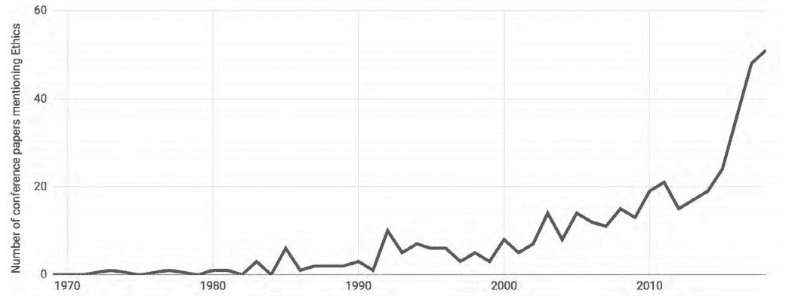
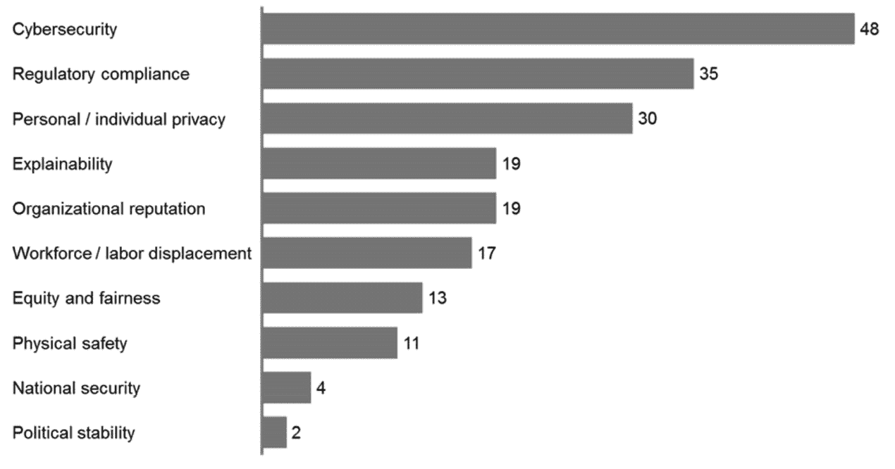

# 第一章：*第一章*：数据可复现性问题

如今，机器学习算法无处不在。它们已融入我们的日常生活中，我们使用它们时往往没有察觉。当我们匆忙赶去工作、规划假期或去看医生时，模型正在运行，甚至有时在为我们做出重要决策。如果我们不清楚模型在做什么以及它如何做出决策，我们如何能确保它的决策是公平公正的呢？Pachyderm 深刻关注数据科学实验的可复现性，并将数据血统、可复现性和版本控制作为核心。 但在继续之前，让我们先讨论一下为什么可复现性如此重要。

本章解释了可复现性、伦理**人工智能**（**AI**）和**机器学习操作**（**MLOps**）的概念，并概述了现有的数据科学平台以及它们与**Pachyderm**的比较。

在这一章中，我们将讨论以下主要话题：

+   为什么可复现性如此重要？

+   科学中的可复现性危机

+   解密 MLOps

+   数据科学平台的类型

+   解释伦理 AI

# 为什么可复现性如此重要？

首先，让我们定义一下 AI、ML 和数据科学。

**数据科学**是一个研究领域，涉及收集和准备大量数据，以提取知识并生成洞察。

**人工智能（AI）**是一个总括性的术语，指的是使机器能够模仿人类行为的技术。**机器学习（ML）**是 AI 的一个子集，基于这样的理念：算法可以通过过去的经验进行学习。

现在，让我们来定义一下**可复现性**。如果其他数据科学家能够在类似的数据集和问题上重复实验并得到类似的结果，那么这个数据科学实验就被认为是可复现的。虽然可复现性几十年来一直是科学研究的支柱，但它直到最近才成为数据科学领域的重要话题。

一个可复现的实验不仅更可能没有错误，而且还可以推动实验进一步发展，并允许其他人基于该实验进行构建，促进知识的转移并加速未来的发现。

数据科学已成为过去十年里最热门的话题之一，这一点毫不意外。许多大型科技公司开设了数十个高薪的数据科学家、数据工程师和数据分析师职位。因此，加入这个行业的需求正在迅速增加。根据**斯坦福大学人类中心人工智能研究院**（**HAI**）发布的《AI 指数 2019 年年报》，过去 20 年中，AI 论文数量增长了三倍。你可以在斯坦福大学 HAI 网站上阅读更多关于该报告的内容：[`hai.stanford.edu/blog/introducing-ai-index-2019-report`](https://hai.stanford.edu/blog/introducing-ai-index-2019-report)。

图 1.1 – AI 出版物趋势，来自 AI 指数 2019 年年度报告（第 5 页）

几乎每个平台和大学现在都提供数据科学或 AI 课程，这些课程从不缺少学生。成千上万来自各行各业的人，从软件开发者到 CEO，都在参加**机器学习**（**ML**）课程，以跟上迅速发展的行业。

AI 会议的数量也在稳步增长。即使在疫情期间，面对面活动变得不可能，AI 社区依然以虚拟形式继续举行会议。像**神经信息处理系统**（**NeurIPS**）和**国际机器学习会议**（**ICML**）等旗舰会议，通常吸引超过 10,000 名参会者，仍然在线举行，并有大量参与者。

根据一些预测，到 2025 年，AI 市场规模将超过 3500 亿美元。仅在 2020 年至 2021 年间，市场从 120 亿美元增长到 580 亿美元。硅谷的科技巨头们正在激烈争夺在这一领域的主导地位，而较小的公司也在崭露头角，争取市场份额。全球 AI 初创企业的数量稳步增长，每年都有数十亿资金注入其中。

以下图表展示了近年来 AI 相关初创企业的增长：

图 1.2 – 全球 AI 相关初创企业的总私人投资，来自 AI 指数 2019 年年度报告（第 88 页）

AI 初创企业的总私人投资在过去 10 年中增长了超过 30 倍。

同一来源的另一个有趣指标是 2015 至 2018 年间发布的 AI 专利数量：

](img/B17085_01_003.jpg)

图 1.3 – AI 专利总数（2015-2018 年），来自 AI 指数 2019 年年度报告（第 32 页）

美国在专利发布数量上领先于其他国家。

这些趋势促进了经济和产业的发展，但不可避免地影响了提交的 AI 论文、流程、实践和实验的质量。这就是为什么需要一个适当的过程来确保数据科学模型的验证。实验的重复性是数据科学模型质量控制的重要组成部分。

接下来，让我们了解什么是模型。

## 什么是模型？

让我们定义一下什么是**模型**。数据科学或人工智能模型是对一个过程的简化表示，并且可以预测可能的结果。无论是天气预测算法还是网站访问量计算器，模型都会提供最可能的结果，并帮助我们做出明智的决策。当数据科学家创建模型时，他们需要决定模型中必须包含哪些关键参数，因为他们不可能涵盖所有内容。因此，模型是一个简化的过程版本。而在这过程中，数据科学家或组织会根据成功的定义做出一些取舍。

以下图表展示了一个数据模型：

图 1.4 – 数据科学模型

每个模型都需要持续的数据流来进行改进并确保正确执行。以亚马逊 Go 商店为例，商店内通过多台摄像头分析顾客的行为。确保商店安全的模型会不断基于现实中的顾客行为进行训练。这些模型必须学习到顾客有时会拿起某个商品然后改变主意再放回去；有时顾客可能会把商品掉到地上，导致产品损坏，等等。亚马逊 Go 商店的模型之所以优秀，是因为它能访问大量的真实数据，并且随着时间的推移不断改进。然而，并非所有模型都能访问真实数据，这时候可以使用合成数据集。

**合成数据集**是由计算机人工生成的数据集。合成数据的问题在于，它的质量仅与生成它的算法相关。通常，这种数据无法准确反映现实世界。在某些情况下，比如当用户隐私问题阻止数据科学家使用真实数据时，使用合成数据集是合理的；而在其他情况下，它可能会导致负面结果。

IBM 的 Watson 是一个雄心勃勃的项目，承诺通过在几秒钟内根据提供的症状列表诊断患者，从而革新医疗保健。这项发明能够极大地加快诊断过程。在地球上一些无法获得医疗服务的地方，像这样的系统能够挽救许多生命。不幸的是，由于最初的承诺是取代医生，Watson 只不过是一个能够辅助诊断的推荐系统，仅此而已。原因之一是 Watson 使用了合成数据集进行训练，而非真实数据。

有些情况下，检测训练模型中的问题尤其困难。以华盛顿大学开发的一个图像识别算法为例，该算法用于识别图像中是否出现了哈士奇或狼。该模型看似运行得很好，预测的准确率接近 90%。然而，当科学家们深入研究算法和数据时，他们发现模型是基于背景进行预测的。大多数包含哈士奇的图像背景是草地，而大多数包含狼的图像背景则是雪地。

## 可重复性的主要原则

如何确保你公司中的数据科学流程遵循可重复性原则？以下是可重复性原则的主要内容：

+   **使用开放数据：**用于训练模型的数据不应是一个黑箱。它必须以未修改的状态对其他数据科学家开放。

+   **对大量样本进行训练：**关于实验和训练样本数量的信息必须可以供审查。

+   **严格记录过程：**数据修改、统计失败和实验表现的过程必须彻底记录，以便作者和其他数据科学家可以在未来复现该实验。

让我们考虑一些例子，其中可重复性、协作和开放数据原则并未融入实验过程中。

几年前，一组来自**杜克大学**的科学家因提出了一个雄心勃勃的预测肺癌发展趋势的研究而广受关注。该研究基于从患者身上收集的数据，预测了肺癌的进程，医学界对这一发现充满了期待。然而，来自休斯顿**MD 安德森癌症中心**的另一组科学家在尝试复现原始结果时发现了该研究中的严重错误。他们发现化疗预测模型中存在标签错误、基因与基因表达数据的不匹配等问题，这些问题使得基于模型计算得出的正确治疗建议的可能性大大降低。尽管这些缺陷最终被揭示出来，但研究人员花费了近三年的时间和超过 2000 个工作小时才揭开真相，而这些问题本可以通过最初就建立适当的研究实践来避免。

现在让我们通过一个聊天机器人例子来看一下**AI**是如何出错的。你可能还记得微软那个臭名昭著的聊天机器人*泰*（Tay）。泰是一个可以从与互联网用户的对话中学习的机器人。当泰上线时，最初的对话是友好的，但一夜之间他的语言发生了变化，开始发布有害、种族歧视和不当的回应。他从教他粗鲁语言的用户那里学习，而由于该机器人被设计成模仿人类行为，他做了他被创造的事情。你可能会问，为什么他一开始不是种族歧视的？答案是他是在清洁、精挑细选的数据上进行训练的，这些数据没有包含粗俗和侮辱性语言。但我们无法控制互联网和人们发布的内容，而且这个机器人没有被编程任何道德感。这个实验引发了许多关于 AI 伦理的问题，以及我们如何确保我们构建的 AI 不会有一天反过来伤害我们。

新一代聊天机器人基于最近发布的**GPT-3**库。这些聊天机器人通过神经网络进行训练，在训练过程中创建了无法打破的关联。尽管这些聊天机器人背后使用了比其前身看似更先进的技术，但它们仍然可能根据训练数据的不同而变得种族歧视和充满仇恨。如果一个机器人在性别歧视和仇恨的对话中进行训练，它会变得冒犯性，并且可能会做出不当回应。

正如你所看到的，数据科学、AI 和机器学习是帮助我们解决许多困难问题的强大技术，但与此同时，它们也可能危害用户，并产生毁灭性后果。数据科学界需要努力制定更好的方法，减少不良后果，通过建立适当的标准和流程来确保数据科学实验和 AI 软件的质量。

既然我们已经了解了可重复性为何如此重要，那么让我们看看它对科学界和数据科学带来了哪些后果。

# 科学中的可重复性危机

可重复性危机是一个存在了十多年之久的问题。由于数据科学与科学学科关系密切，回顾过去许多科学家提出的问题，并将其与数据科学领域今天面临的类似问题联系起来是非常重要的。

最重要的问题之一是**可重复性**——复制科学实验结果的能力一直是良好研究的基石。换句话说，如果一个实验可以被重复，那么它是有效的；如果不能，那么它可能只是一次性的事件，不代表真实现象。不幸的是，近年来，越来越多的社会学、医学、生物学及其他领域的研究论文无法经受住对更多样本进行重测的考验，即便这些论文已发表在知名且可信的科学杂志上，例如*Nature*。这种趋势可能导致公众对科学及其分支 AI 产生不信任。

如前所述，由于 AI 行业的流行和发展，AI 论文的数量增加了数倍。不幸的是，这些论文的质量并未随着数量的增加而提升。

*Nature*杂志最近对科学家进行了一项调查，询问他们是否认为科学界存在可重复性危机。大多数科学家认为，由于频繁发表结果的压力，假阳性结果确实存在。研究人员需要资助，赞助商需要看到结果以便进一步投资研究，这导致许多已发表的论文信誉度下降。最终，争夺资助和官僚主义常常被认为是实验室中缺乏可重复性过程的主要原因。

被质疑完整性的研究论文具有以下共同特点：

+   没有公开共享代码或数据供其他研究人员尝试复制结果。

+   尝试复制结果的科学家未能完全或部分地按照提供的说明进行实验。

即使是诺贝尔奖得主发布的论文，有时也会因无法复制结果而受到质疑。例如，2014 年，*Science*杂志撤回了诺贝尔奖得主、免疫学家布鲁斯·贝特勒（Bruce Beutler）发表的一篇论文。这篇论文讲述了人类基因组中病毒样生物体对病原体的反应。在撤回前，这篇论文已被引用超过 50 次。

当 COVID-19 成为 2020 年的主要话题时，发布了多篇相关论文。根据*Retraction Watch*，一个追踪撤回科研论文的在线博客，截至 2021 年 3 月，已有超过 86 篇论文被撤回。

2019 年，超过 1400 篇科学论文被多个出版商撤回。这个数字非常庞大，且稳步增长，而 2000 年初仅有 50 篇论文被撤回。这引起了人们对所谓科学可重复性危机的关注。虽然并非所有被撤回的论文都是因为这个原因，但很多时候确实是由于此原因。

## 数据钓鱼

**数据钓鱼**或数据开采是一种通过多次运行计算来达到统计学上显著的实验结果的方法，直到得到预期结果，然后只报告这些结果，忽略那些不便的结果。有时，科学家无意中进行数据开采，以获得他们认为最可能的结果并确认假设。也有可能发生更为险恶的情况——科学家可能故意篡改实验结果，以达成预定结论。

这种数据分析误用的一个例子是，如果你决定证明香蕉消费与 10 岁及以上儿童智商水平提高之间的相关性。这是一个完全虚构的例子，但假设你想要建立这种联系。你需要获取一个足够大的样本群体中，孩子们的智商水平和香蕉消费情况——假设是 5,000 名孩子。

然后，你可以进行一些测试，例如：*吃香蕉并锻炼的孩子是否比仅仅锻炼的孩子拥有更高的智商？看电视并吃香蕉的孩子是否比不看电视的孩子智商更高？* 在进行了足够多次测试后，你很可能会得到某种相关性。然而，这个结果并不显著，且使用数据开采技术被科学界认为是极不道德的。在数据科学领域，类似的问题也时有发生。

在没有进行全面调查的情况下，检测数据开采可能会很困难。可以考虑以下几个可能的因素：

+   这项研究是由一个声誉良好的机构或科学家小组进行的吗？

+   其他类似领域的研究有什么建议？

+   是否涉及财务利益？

+   该声明是否耸人听闻？

没有适当流程的情况下，数据开采和不可靠的研究者将继续被发表。最近，*自然*杂志对约 1,500 名来自不同领域的研究人员进行了调查，超过 50%的受访者表示他们曾尝试并未能成功复制过去研究的结果。更令人震惊的是，在许多情况下，他们未能复制自己实验的结果。

在所有受访者中，只有 24%的人能够成功发布他们的复制尝试，而大多数人从未接到要求复制他人研究的请求。

当然，提高实验的可重复性是一个高成本的问题，可能会使实验所需的时间翻倍，这对于许多研究实验室来说可能是无法承受的。但如果将其加入到原本计划中的研究时间，并且有合适的流程，它就不应该像在研究生命周期中途加入那么困难或严格。

更糟的是，在论文发布后撤回论文可能是一项繁琐的任务。有些出版商甚至会在论文被撤回时向研究人员收取大量费用。这种做法实在令人沮丧。

所有这些都会对全球研究产生负面影响，导致对科学的信任度下降。各组织必须采取措施改善其科学部门的流程，科学期刊必须提高发布研究的标准。

既然我们已经了解了数据捕捞，接下来让我们回顾更好的可重复性指南。

## 更好的科学研究可重复性指南

**开放科学中心**（**COS**），一个专注于支持和促进开放科学倡议、可重复性和科学研究诚信的非营利组织，发布了《期刊政策和实践中的透明性和开放性推广指南（TOP）》，或称为*TOP 指南*。这些指南强调了已发表研究论文中透明性的重要性。研究人员可以利用这些指南为公开共享研究成果的必要性提供依据，以避免关于其研究完整性的任何质疑。

TOP 指南的主要原则包括以下几点：

+   *正确引用和给予原作者信用*：所有属于其他作者的文本、代码和数据成果，必须在论文中明确列出，并根据需要给予适当的信用。

+   *数据、方法论和研究材料透明性*：论文的作者必须在一个公开可访问的位置共享已编写的代码、方法论和研究材料，并提供如何访问和使用它们的说明。

+   *设计和分析透明性*：作者应尽可能透明地展示其方法论，尽管这可能会根据行业不同而有所不同。至少，他们必须披露在研究过程中应用的标准。

+   *研究和分析计划的预注册*：即使研究未发表，预注册也能使其更容易被发现。

+   *获得结果的可重复性*：作者必须包括足够的细节，说明如何重复原始结果。

这些指标应用于所有这三种级别：

+   未实施—报告中未包含相关信息

+   1 级—按需提供

+   2 级—发布前可访问

+   3 级—发布前验证

3 级是透明度可以达到的最高水平。拥有这种透明度就能为提交的研究质量提供充分的证明。COS 通过**TOP 因子**来评定期刊在确保透明度方面的努力，最终评定所发布研究的质量。

除了数据和代码的可复现性外，研究过程中使用的环境和软件往往起着重要作用。新技术，如容器、虚拟环境和云环境，使得在研究中实现统一变得更加容易。当然，如果我们考虑到生物化学或其他需要更精确实验室条件的行业，达到统一性可能会更加复杂。

现在让我们了解一些有助于提高复现性的常见做法。

## 提高复现性的常见做法

得益于复现性倡导者的努力，以及近年来该问题在科学社区的广泛讨论，似乎有一些提高复现性的积极趋势正在出现。这些实践包括以下内容：

+   请求同事再现你的工作。

+   开发详尽的文档。

+   标准化研究方法。

+   在发表前预注册你的研究，以避免数据挑选。

有些科学小组将复现并通知研究人员论文中的错误作为他们的使命。他们的典型流程是尝试再现论文中的结果，并向研究人员或实验室发信请求更正或撤回。有些研究人员愿意合作并纠正论文中的错误，但在其他情况下，情况不明确且困难。某些小组已识别出他们分析的 25 篇论文中的以下问题：

+   缺乏有关应将反馈意见提交给谁的流程或联系人。科学期刊并未明确说明是否可以将反馈提交给主编，或者是否有某种反馈提交表格。

+   科学期刊编辑通常不愿意接受并处理提交的意见。在某些情况下，即便是来自知名机构的批评性反馈，也可能需要长达一年的时间才能在论文上发布警告。

+   一些出版商要求你支付费用，如果你想发表更正信函，并且会延迟撤回。

+   原始数据并不总是公开可用。在许多情况下，出版商没有围绕研究中使用的原始数据设立统一的流程或共享位置。如果你必须直接联系作者，你可能无法获得所请求的信息，而且这可能会显著延迟进程。此外，他们还可以简单地拒绝此类请求。

提交更正和研究论文撤回缺乏标准化，导致整体复现性危机和知识共享的困境。那些利用数据挖掘和其他手段操控结果的论文，将成为未来研究者的信息来源，进一步加剧整体的错误信息和混乱。研究人员、出版商和编辑应共同努力，建立统一的出版后审查指南，鼓励其他科学家参与测试并提供反馈。

我们已经了解了可重复性如何影响研究质量。现在，让我们回顾一下组织如何建立一个流程，以确保他们的数据科学实验遵循最佳行业实践，以确保高标准。

# 解密 MLOps

本节定义了**机器学习操作**（**MLOps**），并描述了为什么在数据科学部门内建立一个可靠的 MLOps 过程至关重要。

在许多组织中，数据科学部门是最近几年才成立的。*数据科学家*这一职业也相对较新。因此，许多部门必须找到一种方法将其融入现有的企业流程，并制定确保数据科学成果的可靠性和可扩展性的方法。

在许多情况下，构建合适的基础设施的责任落在数据科学家身上，而他们往往对最新的基础设施趋势不太熟悉。另一个问题是如何在不同的语言、平台和环境中使其正常运行。最终，数据科学家在构建基础设施上花费的时间远多于在模型本身上工作。这就是新兴学科的出现，它帮助弥合数据科学与基础设施之间的差距。

**MLOps** 是一个生命周期过程，它识别机器学习操作的各个阶段，确保数据科学过程的可靠性。MLOps 是一套定义机器学习开发过程的实践。尽管这一术语是最近才提出的，但大多数数据科学家一致认为，成功的 MLOps 过程应该遵循以下原则：

+   **协作：** 这一原则意味着开发机器学习模型的所有内容必须在数据科学家之间共享，以保留知识。

+   **可重复性：** 这一原则意味着不仅代码，数据集、元数据和参数也应该版本化，并且对于所有生产模型都应具有可重复性。

+   **连续性：** 这一原则意味着模型的生命周期是一个持续的过程，意味着生命周期阶段的重复和每次迭代时模型的改进。

+   **可测试性：** 这一原则意味着组织实施机器学习测试和监控实践，以确保模型的质量。

在我们深入了解 MLOps 过程阶段之前，让我们先来看一下更为成熟的软件开发实践。DevOps 是一种在许多企业级软件项目中使用的软件开发实践。一个典型的 DevOps 生命周期包括以下几个阶段，这些阶段会不断重复，以确保产品的改进：

+   **规划：** 在这一阶段，会制定软件的总体愿景，并设计更为详细的方案。

+   **开发：** 在这一阶段，编写代码并实现计划的功能。代码通过版本控制系统（如 Git）进行共享，从而确保软件开发人员之间的协作。

+   **测试：** 在这个阶段，开发的代码通过自动化或手动过程进行缺陷测试。

+   **部署：** 在这个阶段，代码被发布到生产服务器，用户有机会进行测试并提供反馈。

+   **监控：** 在这个阶段，DevOps 工程师专注于软件性能和故障原因，识别可能的改进领域。

+   **运维：** 这个阶段确保软件更新的自动发布。

以下图示展示了 DevOps 生命周期：

图 1.5 – DevOps 生命周期

所有这些阶段都会不断重复，从而实现部门之间的沟通和客户反馈循环。这一做法为企业带来了更快的开发周期、更好的产品和持续的创新等好处。部门之间密切关系促进了更好的团队合作，而这正是这一过程高效的关键因素之一。

数据科学家应当拥有一个同样具有可靠性的过程。企业数据科学面临的最大问题之一是，极少有机器学习模型能够投入生产。许多公司刚刚开始采用数据科学，而新设立的部门面临前所未有的挑战。团队通常缺乏对需要实施的工作流程的理解，而这些工作流程是确保企业级数据科学正常运作的关键。

另一个重要的挑战是，与传统的软件开发不同，数据科学家不仅操作代码，还需要操作数据和参数。数据来自现实世界，而代码则在办公室中精确开发。两者唯一的交集是在数据模型中结合时。

所有数据科学部门面临的挑战包括以下几点：

+   不一致或完全缺失的数据科学过程

+   无法跟踪数据变化并重现过去的结果

+   性能缓慢

在许多企业中，数据科学部门仍然较小，并且在创建可靠的工作流程方面面临困难。构建这样的过程需要一定的专业知识，例如理解传统的软件实践（如 DevOps），并与理解数据科学挑战相结合。这就是 MLOps 开始出现的地方，它将数据科学与最佳软件开发实践相结合。

如果我们尝试将类似的 DevOps 实践应用于数据科学，可能会看到以下情况：

+   **设计：** 在这一阶段，数据科学家负责获取数据并设计**数据管道**，也叫做**提取、转换、加载**（**ETL**）管道。数据管道是数据经过的一系列转化步骤，最终产生输出结果。

+   **开发：** 在这个阶段，数据科学家负责编写先前开发的数据管道的算法代码。

+   **训练**：在此阶段，模型使用选择的或自动生成的数据进行训练。在此阶段，可以使用超参数调优等技术。

+   **验证**：在此阶段，经过训练的数据会经过验证，以确保它能够与其余的数据管道兼容。

+   **部署**：在此阶段，经过训练和验证的模型会被部署到生产环境中。

+   **监控**：在此阶段，模型会持续监控其性能和可能存在的缺陷，并将反馈直接传递给数据科学家进行进一步改进。

与 DevOps 类似，MLOps 的各个阶段会不断重复。以下图表展示了 MLOps 的各个阶段：

图 1.6 – MLOps 生命周期

正如你所看到的，这两种实践非常相似，后者借鉴了前者的主要概念。将 MLOps 应用于实践为企业级数据科学带来了以下优势：

+   **更快的市场交付**：数据科学模型只有在成功部署到生产环境中时才具有价值。由于许多公司在其数据科学部门中实施正确流程时遇到困难，MLOps 解决方案确实能够带来改变。

+   **跨团队协作与沟通**：将软件开发实践应用于数据科学为开发人员、数据科学家和 IT 运维人员提供了一个共同的基础，促使他们能够一起合作并使用相同的语言。

+   **可重复性和知识转移**：保持代码、数据集和变更历史对于提高整体模型质量起着重要作用，并使数据科学家能够从彼此的示例中学习，从而促进创新和功能开发。

+   **自动化**：自动化数据管道有助于在多个发布版本中保持流程一致，并加速 **概念验证**（**POC**）模型向生产级管道的推广。

在本节中，我们了解了 MLOps 流程中的重要阶段。在下一节中，我们将学习更多关于数据科学平台的种类，这些平台可以帮助你在组织中实施 MLOps。

# 数据科学平台的种类

本节将带你了解当前开放源代码世界和市场上可用的数据科学平台，并帮助你理解它们之间的区别。

随着 AI 和机器学习领域的不断发展，越来越多的工程师在寻找解决数据科学问题的新方法，并为更好、更快速的 AI 采用构建基础设施。有些平台提供从数据仓库到生产环境的端到端能力，而其他平台则提供部分功能并与其他工具结合使用。通常，没有一种解决方案适用于所有用例，当然也不是每个预算都能承受。

然而，所有这些解决方案都完全或部分地促进了数据科学生命周期的以下阶段：

+   **数据工程**

+   **数据获取与转换**

+   **数据训练**

+   **模型部署**

+   **监控与改进**

以下图示展示了数据科学工具的类型：

](img/B17085_01_007.jpg)

图 1.7 – 数据科学工具的类型

让我们来看一看现有的可以帮助你构建大规模数据科学工作流的数据科学平台。

## 端到端平台

一个端到端的数据科学解决方案应该能够提供所有机器学习生命周期阶段所需的工具，如前一节所列。然而，在某些使用场景中，端到端工作流的定义可能会有所不同，可能主要集中在机器学习流程和项目上，排除了数据工程部分。由于定义可能仍在变化，随着领域的发展，端到端工具可能会继续提供不同的功能。

如果存在这样的平台，它应当带来以下好处：

+   一个统一的用户界面，消除了将多个界面拼接在一起的需求

+   为所有相关人员（包括数据科学家、数据工程师和 IT 运维人员）提供协作

+   将基础设施支持的便利性交由解决方案提供商，能够为团队提供额外的时间，专注于数据模型而非基础设施问题

然而，你可能会发现端到端平台的以下缺点与你组织的目标不一致：

+   **可移植性**：这样的平台可能是专有的，迁移到其他平台将会很困难。

+   **价格**：端到端平台可能是基于订阅的，许多数据科学部门可能负担不起。如果涉及到基于 GPU 的工作流，价格会进一步上涨。

+   **偏差**：当你使用提供内置流程的专有解决方案时，你的模型必然会从这些自动化工具中继承偏差。问题在于，偏差可能在自动化机器学习解决方案中难以识别和解决，这可能对你的业务产生负面影响。

既然我们已经了解了端到端数据科学平台的优缺点，让我们来看看目前市场上有哪些平台。由于人工智能领域发展迅速，每年都会有新平台出现。我们将研究其中排名前五的平台。

大型科技巨头，如**微软**、**谷歌**和**亚马逊**，都提供自动化机器学习功能，许多用户可能会觉得这些功能非常有用。谷歌的 AI 平台提供**Kubeflow**流水线来帮助管理机器学习工作流。亚马逊提供辅助超参数调优和标注的工具。微软提供支持**GPU**工作流的**Azure 机器学习服务**，其功能类似于亚马逊的服务。

然而，正如之前所提到的，所有这些**可解释人工智能（XAI）**功能都容易受到偏见的影响，需要数据科学团队构建额外的工具来验证模型的性能和可靠性。对于许多组织来说，自动化机器学习并不是正确的答案。另一个问题是供应商锁定，因为你将不得不将所有数据保存在底层的云存储中。

**Databricks**解决方案提供了更灵活的方式，因为它可以部署在任何云平台上。Databricks 基于 Apache Spark，这是人工智能和机器学习工作流中最受欢迎的工具之一，并通过名为**MLflow**的平台提供端到端的机器学习管道管理。MLflow 使数据科学家能够跟踪从模型开发到部署再到生产的管道进展。许多用户喜欢其内建的笔记本界面。一个缺点是缺乏数据可视化工具，未来可能会添加该功能。

**Algorithmia**是另一种专有解决方案，可以部署在任何云平台上，提供端到端的机器学习工作流，涵盖模型训练、部署、版本管理和其他内建功能。它支持批量处理并且可以与 GitHub Actions 集成。虽然 Algorithmia 是一个很棒的工具，但它内建了一些传统的软件开发工具，可能会让某些工程团队觉得冗余。

## 可插拔解决方案

尽管端到端平台听起来像是数据科学部门的理想解决方案，但实际上并非总是如此。大公司通常有一些端到端平台无法满足的需求。这些需求可能包括以下内容：

+   **数据安全**：一些公司可能对将数据存储在云端有隐私限制。这些限制也适用于自动化机器学习功能的使用。

+   **管道输出**：通常，管道的最终产物是一个库，这个库被打包并用于组织内其他项目中。

+   **现有基础设施约束**：一些现有的基础设施组件可能会阻碍端到端平台的集成。某些基础设施部分可能已经存在并满足用户需求。

可插拔解决方案为数据基础设施团队提供了构建自定义解决方案的灵活性，但这也带来了支持该解决方案的需求。然而，大多数大公司最终都会这样做。

可插拔解决方案可以分为以下几类：

+   数据摄取工具

+   数据转换工具

+   数据服务工具

+   数据可视化与监控工具

让我们考虑一些这些工具，它们可以组合在一起构建数据科学解决方案。

## 数据摄取工具

数据摄取是从公司所有来源收集数据的过程，例如数据库、社交媒体和其他平台，将其集中到一个位置，供机器学习管道和其他人工智能过程进一步使用。

最流行的开源数据摄取工具之一是**Apache NiFi**，它可以将数据摄取到**Apache Kafka**，这是一个开源流媒体平台。从那里，数据管道可以消耗这些数据进行处理。

在商业云托管平台中，我们可以提到 Wavefront，它不仅支持数据的摄取，还支持数据处理。Wavefront 因其可扩展性和支持高查询负载的能力而著名。

## 数据转换工具

数据转换是将代码应用于你拥有的数据的过程。这包括将数据作为数据管道的一部分进行训练和测试。该工具应能够从一个集中的位置消耗数据。像**TensorFlow**和**Keras**这样的工具为这类操作提供了扩展功能。

**Pachyderm**也是一个数据转换和管道工具，尽管它的主要价值在于大型数据集的版本控制。与其他转换工具不同，Pachyderm 让数据科学家有自由定义自己管道的空间，并支持任何语言和库。

如果你参加过数据科学课程，那么很可能你已经使用过**MATLAB**或**Octave**来进行模型训练。这些工具为你提供了一个很好的起点来探索机器学习。然而，当涉及到需要持续训练、协作、版本控制和模型产品化的生产级数据科学时，这些工具可能并不是最佳选择。MATLAB 和 Octave 主要用于学术目的的数值计算。MATLAB 等平台的另一个问题是，它们通常使用专有语言，而像 Pachyderm 这样的工具支持任何语言，包括数据科学社区中最流行的语言。

## 模型服务工具

在你训练好模型并且获得令人满意的结果后，你需要考虑将该模型投入生产，通常可以通过 REST API 的形式或将其数据表导入到数据库中来实现这一目标。根据你在模型中使用的语言，提供**REST API**可能和使用 Flask 等 Web 框架一样简单。

然而，还有一些更高级的工具可以为数据科学家提供端到端的机器学习过程控制。一个这样的开源工具是**Seldon**。Seldon 将 REST API 端点转化为生产级微服务，在这里你可以轻松地将每个模型版本从开发环境推广到生产环境。

另一个提供类似功能的工具是**KFServing**。这两种解决方案都使用 Kubernetes 的**自定义资源定义**（**CRD**）来定义模型服务的部署类。

在大公司中，通常不同的团队负责模型训练和模型服务，因此，决策可能会根据团队对某一解决方案的熟悉度和偏好做出。

## 数据监控工具

在模型部署到生产环境后，数据科学家需要继续获取关于模型性能、潜在偏差和其他指标的反馈。例如，如果您拥有一个电商网站，并且推荐系统根据用户的历史选择推荐当前订单的购买商品，您需要确保该系统仍然紧跟最新的时尚潮流。您可能不了解潮流趋势，但反馈循环应能在模型性能下降时发出信号。

企业往往未能为机器学习工作流实施有效的监控解决方案，这可能对您的业务产生潜在的毁灭性后果。**Seldon Alibi** 是其中一种提供模型检查功能的工具，使数据科学家能够监控在生产环境中运行的模型，并识别需要改进的地方。Seldon Alibi 提供了异常值检测，帮助发现异常；漂移检测，帮助监控输入数据与输出数据之间的相关性变化；以及对抗性检测，揭示原始数据输入中的恶意变化。

**Fiddler** 是另一个流行的工具，用于监控生产模型的完整性、偏差、性能和异常值。

## 汇总全部内容

如您所见，创建一个生产级数据科学解决方案有多种方法，并且可能没有“一刀切”的解决方案。虽然端到端的解决方案提供了使用单一供应商的便利，但它们也有多重缺点，并且相比可插拔工具，通常配备的领域功能较弱。另一方面，可插拔工具需要您的组织具备一定的专业知识和文化，这将使得不同部门（如 DevOps 工程师）能够与数据科学家合作，共同构建最佳的解决方案和工作流。

下一节将带我们了解困扰现代人工智能应用的伦理问题，这些问题如何影响您的业务，以及您可以采取的应对措施。

# 解释伦理 AI

本节描述了人工智能中的伦理问题以及组织在构建人工智能应用时需要注意的事项。

随着 AI 和机器学习技术变得越来越普及和被接受，我们很容易忽视数据及决策过程的来源。当 AI 算法根据你最近的搜索建议购买哪一双鞋时，这可能并不是什么大事。但假设 AI 算法被用来决定你是否符合某个工作岗位的要求，你是否有犯罪倾向，或者你是否符合房贷批准标准。那么，了解这个算法是如何创建的、使用了哪些数据进行训练、数据集中包含了什么，更重要的是，数据集中没有包含什么，将变得至关重要。至少，我们需要质疑是否存在一个适当的过程来验证用于生成模型的数据。这不仅是正确的做法，而且还可以帮助你的组织避免不必要的法律后果。

虽然 AI 应用带来了一定的优势并提升了我们的生活质量，但它们有时也会犯错，这些错误有时会对人们的生活产生不利甚至毁灭性的影响。这些趋势促使领先的 AI 公司和大型科技公司出现了伦理 AI 团队和伦理 AI 倡导者。

伦理 AI 在过去几年中已成为数据科学社区中越来越多讨论的话题。根据《人工智能指数报告 2019》，伦理已成为 AI 会议中 AI 论文数量的一个持续增长的关键词。

图 1.8 – 自 1970 年以来提及伦理的 AI 会议论文数量，摘自《AI Index 2019 年度报告》（第 44 页）

让我们考虑一下最广受批评的 AI 技术之一——面部识别。面部识别应用可以识别图像或视频中的一个人。近年来，这项技术已经广泛应用，现在被用于家庭安全、身份验证和其他领域。在 2018 至 2019 年，全球超过 1000 篇新闻文章提到了面部识别和数据隐私。亚马逊开发的一种名为**Rekognition**的基于云的面部识别技术，被一些州的警察部门使用。执法部门使用该软件在数据库中搜寻嫌疑人，在视频监控分析中，包括警察佩戴的身体摄像头画面。独立研究显示，当从 120 名国会议员中识别时，软件将其中 28 人识别为潜在罪犯。所有这些人都有较深的肤色。该工具在识别有色人种女性时尤其表现不佳。

这个以及其他面部识别技术的问题在于，它是基于一个不具包容性的数据库进行训练的，该数据库主要包含白人男性的照片。此类结果很难预测，但这正是伦理 AI 正在努力解决的问题。在公共场所实施这样的监控系统会对成千上万的人产生负面影响。AI 的进步使得面部识别技术能够在几乎不需要人工干预的情况下进行身份识别。这就引发了完全控制和隐私的问题。虽然这样的系统可以帮助识别罪犯、预防犯罪并使我们的社会更安全，但它需要经过彻底审计，以防止潜在的错误和滥用。能力越大，责任越大。

另一个有趣的例子是使用**自然语言处理**（**NLP**）应用。NLP 是一种机器学习技术，使得机器能够自动解读和翻译一种人类语言所写的文本为另一种语言。近年来，NLP 应用取得了重大进展。像 Google Translate 这样的工具解决了 20 年前仍无法解决的问题。NLP 将句子分解为若干部分，并尝试在这些部分之间建立联系，以提供有意义的解释。NLP 应用不仅仅处理翻译，还能总结长篇研究论文中的内容或将文本转换为语音。

但这些应用也可能会犯错。一个例子是在土耳其语到英语的翻译中发现的。在土耳其语中，只有一个人称代词 *o*，可以表示 *她/她的* 或 *他/他的*。人们发现 Google Translate 存在基于性别的歧视，降低了女性的角色，这种歧视通常来源于常见的刻板印象。例如，它会将 *She is a secretary* 翻译为 *她是秘书*，而 *He is a doctor* 翻译为 *他是医生*，尽管在土耳其语中，这两句话都可以描述男性或女性。

从这些例子中可以看出，**偏见**是 AI 应用中的最大问题之一。偏见数据集是指没有包含足够样本的研究现象数据集，从而导致无法输出客观结果。例如在面部识别的例子中，数据集没有足够的有色人种代表，无法做出正确的预测。

虽然许多公司已经意识到数据集中的偏见可能带来的负面影响和风险，但很少有公司采取措施来减轻这些潜在的负面后果。根据《人工智能指数报告 2019》，只有 13% 的受访组织正在努力改善所使用数据集的公平性和公正性：

图 1.9 – 采取措施减轻 AI 风险的组织类型，来自《AI Index 2019 年度报告》（第 102 页）

另一个偏见的方面是财务不平等。众所周知，来自经济条件不利的背景的人们比那些来自更有利条件背景的人们更难获得信贷交易。信用报告已知存在错误，导致借款利率更高。

其业务是创建客户画像或个性化的公司更进一步，从公共记录、信用卡交易、抽奖活动及其他来源收集用户行为的详细信息。这些报告可以出售给营销人员甚至执法机构。个人会根据其性别、年龄、婚姻状况、财富、健康状况和其他因素进行分类。有时这些报告会包含关于犯罪记录等过时信息。曾经有一个案例，一位老太太因为被逮捕而无法进入养老院。然而，尽管她被逮捕，但那是她的伴侣家庭暴力的案件，她从未被起诉过。她能够纠正她的警方记录，但无法更正由画像公司创建的报告。纠正这些公司报告中的错误极为困难，它们可能会影响人们的生活数十年。

有时候，人们因为误认的档案被标记。想象一下，你申请工作被拒绝，因为你过去曾因盗窃或入室盗窃而受到起诉。这可能会让人震惊，可能一点也不合理，但是像这样的情况在一些常见姓名的人中并非没有。要纠正这样的错误，你需要一个愿意花时间为你纠正这些错误的人的干预。但你经常遇到这样的人吗？

现在机器学习被用于客户画像，许多数据隐私倡导者对这些算法中使用的方法提出了质疑。因为这些算法从过去的经验中学习，根据它们的说法，你过去做过的任何事情未来可能会重复。根据这些算法，罪犯将会再犯，穷人将会更穷。在他们的现实中没有错误的余地。这意味着有前科的人很可能会再次被逮捕，这为法律执行提供了歧视的基础。相反的情况也成立：那些来自良好社区的无犯罪记录者不太可能犯罪。这听起来并不公平。

关于累犯模型的问题在于大多数模型都是专有的黑盒子。黑盒模型是一种端到端模型，由算法直接根据提供的数据创建，即使数据科学家也无法解释它如何做出决策。由于人工智能算法的学习方式与人类类似，随着时间的推移，它们学习与我们相同的偏见。

图 1.10 - 黑盒模型

让我们继续下一节！

## 可信的人工智能

几年前，道德人工智能只是一些独立倡导者和学者的工作领域，而如今越来越多的大型科技公司已建立道德人工智能部门，以保护公司免受声誉和法律风险。

建立可信赖的人工智能模型标准是一项雄心勃勃的任务，且没有“通用法则”。然而，以下原则适用于大多数情况：

+   创建一个道德人工智能委员会，负责讨论与人工智能相关的风险，并与公司整体战略保持一致。

+   提高对非透明机器学习算法及其可能对社会和组织带来的潜在风险的认识。

+   创建识别、沟通和评估偏见模型及隐私问题的流程。例如，在医疗领域，保护患者个人信息至关重要。围绕产品管理部门的道德风险创建责任制。

+   建立一个通知用户其数据使用方式的流程，并用通俗易懂的语言解释偏见风险及其他概念。用户越早意识到使用你的应用程序可能带来的影响，未来的法律风险就会越小。

+   在公司内部建立一种文化，表彰促进道德项目和倡议的努力，以激励员工为这些努力做出贡献。鼓励来自不同部门的员工，包括工程、数据科学、产品管理等，参与这些工作。

根据《2019 年人工智能指数报告》，人工智能伦理的主要挑战包括公平性、可解释性和透明性。

下图展示了道德人工智能领域中存在的更完整的挑战清单：

图 1.11 - 道德人工智能挑战，摘自《人工智能指数 2019 年年报》（第 149 页）

以下是非透明机器学习算法可能引发的一些问题：

+   经济和金融机会的不均衡传播，包括信贷歧视以及基于预定购买习惯的不平等折扣和促销机会。

+   信息和社交圈的访问，例如基于社会经济群体推荐新闻，或建议加入特定群体或社交圈的算法。

+   就业歧视，包括根据候选人的种族、宗教或性别筛选候选人的算法。

+   不平等使用警力和处罚，包括基于社会地位和种族预测个人未来犯罪可能性的算法。

+   住房歧视，包括拒绝为有色人种、LGBT 群体和其他少数群体提供平等的租赁和按揭机会。

AI 给我们的社会带来了前所未有的好处，类似于工业革命带来的影响。但是，尽管有这些好处，我们也应该意识到这些好处所带来的社会变革。如果未来的交通方式是自动驾驶汽车，这意味着作为职业的驾驶工作将在可预见的未来消失。许多其他行业将受到影响并消失。这并不意味着进步不应该发生，但它需要以受控的方式进行。

软件的完美程度与其创造者一样，新的 AI 驱动产品中的缺陷是不可避免的。但如果这些新应用是关于人类生命和命运决策过程中的第一道关卡，就必须确保我们尽量减少潜在的有害后果。因此，深入理解我们的模型至关重要。部分原因就在于可复制性，这是最小化 AI 负面后果的关键因素之一。

# 总结

在本章中，我们讨论了许多重要概念，帮助我们明确了为什么可复制性很重要，以及为什么它应该成为成功的数据科学流程的一部分。

我们已经了解到，数据科学模型用于分析历史数据作为输入，目标是计算出最可能和最成功的结果。我们还确认了复制性，即能够重现科学实验结果的能力，是良好研究的基本原则之一，并且它是确保团队减少模型偏差的最佳方法之一。偏差可能会从训练数据集中由于数据的不准确呈现而渗入计算中。这种偏差通常反映了历史和社会现实以及社会中被接受的规范。减少训练数据中偏差的另一种方法是拥有一个多元化的团队，团队成员包括各种性别、种族和背景的代表。

我们了解到，数据挖掘（也叫钓鱼）是一种不道德的技术，一些数据科学家通过挑选实验结果中的某些结果来证明预先定义的假设，只选择能够证明预期结果的结果，忽略任何不符合的趋势。

我们还了解了 MLOps 方法论，它是机器学习应用程序的生命周期，原理上类似于 DevOps 软件生命周期技术。MLOps 包括以下主要阶段：规划、开发、训练、验证、部署和监控。所有这些阶段都被持续重复，从规划到开发、测试、生产再到后期生产阶段，形成一个确保实验管理无缝衔接的反馈循环。

我们还回顾了一些道德 AI 的最重要方面，道德 AI 是数据科学的一个分支，专注于人工智能、机器人学和数据科学的伦理问题。如果在组织中未能实施道德 AI 流程，可能会导致不良的法律后果，尤其是当部署的生产模型被发现具有歧视性时。

在下一章，我们将学习 Pachyderm 版本控制系统的主要概念，它能帮助你解决本章中提到的许多问题。

# 进一步阅读

+   Raymond Perrault, Yoav Shoham, Erik Brynjolfsson, Jack Clark, John Etchemendy, Barbara Grosz, Terah Lyons, James Manyika, Saurabh Mishra 和 Juan Carlos Niebles，*AI Index 2019 年年报*，AI Index 指导委员会，Stanford 大学人类中心人工智能研究所，斯坦福，加利福尼亚州，2019 年 12 月：[`hai.stanford.edu/sites/default/files/ai_index_2019_report.pdf`](https://hai.stanford.edu/sites/default/files/ai_index_2019_report.pdf)

*图 1.1，1.2，1.3，1.8，1.9* 和 *1.11* 来自 *AI Index 2019 年年报*。

+   Liu, D., & Salganik, M. (2019 年 3 月 15 日)。计算可重复性中的成功与挑战：来自脆弱家庭挑战的经验教训。[`doi.org/10.1177/2378023119849803`](https://doi.org/10.1177/2378023119849803)

+   *透明度与开放性推广（TOP）指南 v1.0.1*：[`osf.io/ud578/`](https://osf.io/ud578/)

+   *可重复性：一场错误的悲剧*：[`www.nature.com/news/reproducibility-a-tragedy-of-errors-1.19264`](https://www.nature.com/news/reproducibility-a-tragedy-of-errors-1.19264)

+   *神经信息处理系统（NeurIPS）会议*：[`nips.cc`](https://nips.cc)

+   *国际机器学习会议（ICML）*：[`icml.cc`](https://icml.cc)
