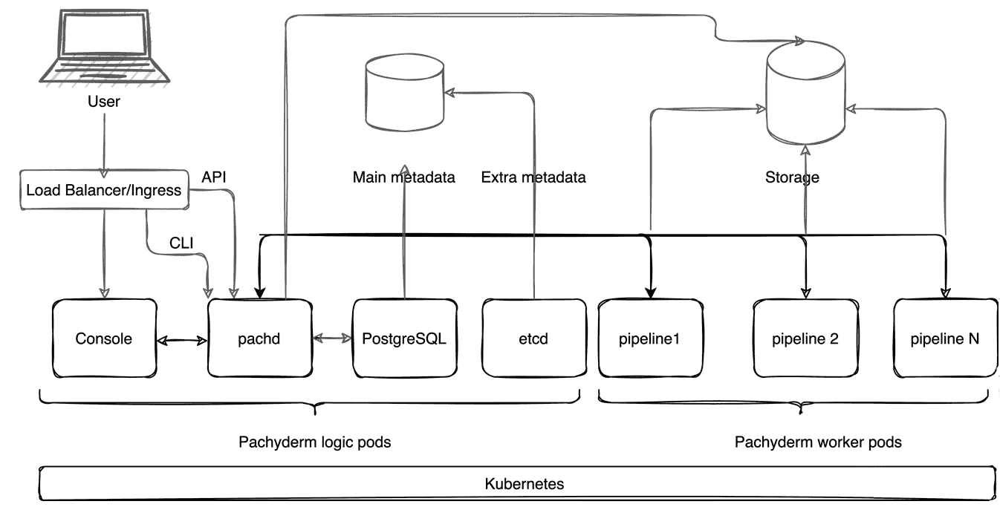
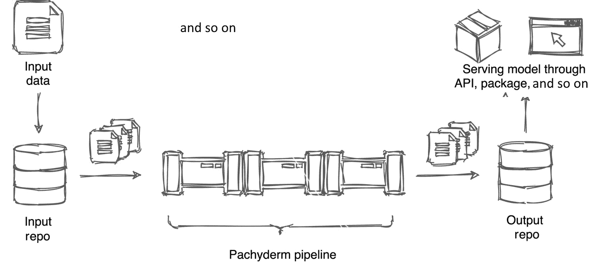
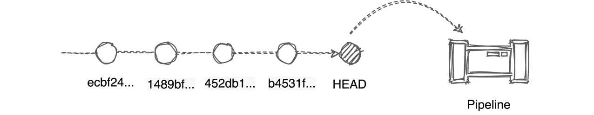
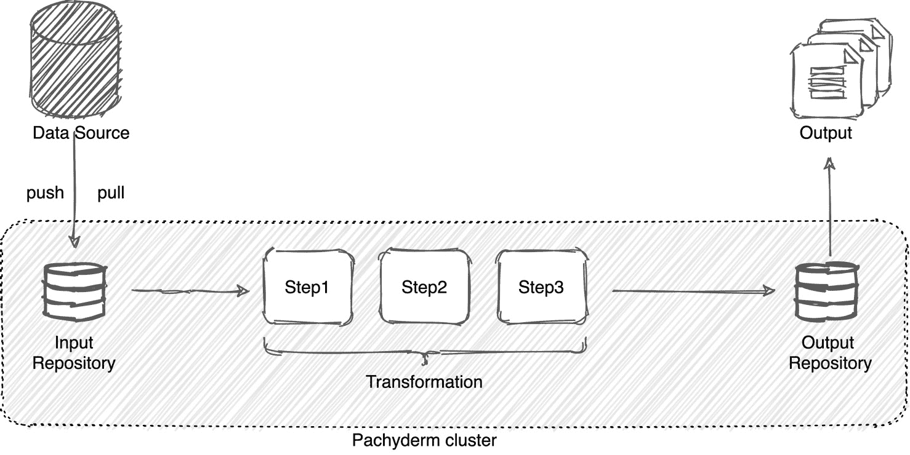
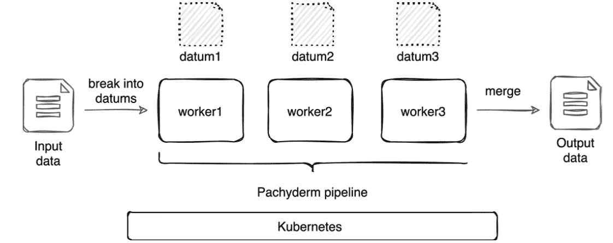

# 第二章：*第二章*：Pachyderm 基础

**Pachyderm**是一个数据科学平台，使数据科学家能够创建端到端的机器学习工作流，涵盖机器学习生命周期中最重要的阶段，从数据摄取到生产部署。

如果你熟悉**Git**，一个用于代码的版本控制和生命周期管理系统，你会发现 Git 和 Pachyderm 的最重要概念之间有许多相似之处。像 Git 及其托管版本**GitHub**这样的版本控制系统，已成为全球成千上万开发者的行业标准。Git 使你能够保存代码更改的历史，并在需要时回溯。数据科学家需要一个平台，能够跟踪实验的版本，必要时重现结果，并调查和纠正可能在数据科学生命周期的某一阶段出现的偏差。Pachyderm 提供了类似于 Git 的好处，使数据科学家能够重现实验并轻松管理数据科学工作流的完整生命周期。

本章旨在描述 Pachyderm 架构的基础知识及其主要概念。我们将涵盖以下主题：

+   回顾 Pachyderm 架构

+   学习版本控制原语

+   发现管道元素

# 回顾 Pachyderm 架构

本节将带你了解分布式 Pachyderm 架构以及 Pachyderm 解决方案的内部原理。但在深入探讨 Pachyderm 基础设施的细节之前，让我们先回答你们在阅读简介后可能会有的问题——*为什么我不能使用 Git 或任何其他版本控制系统？* 我们将以 Git 为例来回答这个问题，因为它是最流行和广泛使用的软件版本控制系统，但所有的论点都适用于任何其他类似的源代码版本控制系统。在回顾 Pachyderm 如何与 Git 不同及相似之后，我们将回顾 Pachyderm 的内部原理、Kubernetes 和容器运行时。

## 为什么我不能使用 Git 来管理我的数据管道？

*那么，如果 Pachyderm* *与 Git 类似，为什么我不能将所有内容都存储在 Git 中，而* *是要使用我需要学习和支持的多个工具呢？*，你可能会问。

虽然 Git 是软件工程师常用的开源技术，但它并不专门解决数据科学中的可重现性问题。这主要是因为 Git 被设计用来跟踪文件版本，而不是建立数据、代码和参数之间的联系——这些是每个数据模型的核心部分。

虽然你可以将代码文件保存在 Git 中，但由于以下原因，将训练数据保存在 Git 中是不可能的：

+   文件格式支持：Git 非常适合源代码管理，例如文本文件、脚本等，但它不支持非二进制文件的版本控制，如图片或视频文件。Git 会检测到二进制文件的变化，但不会像文本文件那样提供详细的变更信息。此外，Git 会替换整个二进制文件，这使得在更新时你的仓库体积剧增。

+   文件大小支持：通常，图片和视频文件非常大，而 Git 对每个文件有 100MB 的大小限制。为了获得最佳性能，Git 建议将仓库大小保持在 1GB 以下，而这对于某些机器学习和深度学习项目可能并不足够。

+   克隆一个大型 Git 仓库以及每个文件的所有历史记录可能会成为问题，并且需要较长的时间。

在计划机器学习项目的工具时，请考虑这些限制。

除了标准的 Git 仓库，Git 还提供了大型文件存储功能，称为**Git 大型文件存储**（**LFS**）。然而，这个选项可能也无法提供所需的功能。Git LFS 在机器学习项目中有以下缺点：

+   Git LFS 需要一个服务器。你需要设置并维护自己的 Git LFS 服务器，或者将其存储在第三方在线平台上。托管自己的服务器存在问题，需要额外的支持，并且你的首选云服务提供商可能不被支持。

+   在线 Git LFS 服务器有一个有限的免费版。对于使用高分辨率图片或视频的项目，这通常意味着很快就会达到限制，需要升级到付费版。

+   Git LFS 设计初衷是面向营销部门的用途，似乎是一个不错的解决方案，适合营销部门存储资产。其他人则更倾向于在非机器学习项目中使用标准 Git。

现在你已经知道为什么源代码版本控制系统并不是处理数据的最佳解决方案，让我们来回顾一下 Pachyderm 架构。

## Pachyderm 架构图

下图展示了 Pachyderm 架构：



图 2.1 – Pachyderm 架构

让我们逐一回顾一下这个图中的所有组件。

## Kubernetes

Kubernetes，一个开源分布式工作流调度系统，是 Pachyderm 的核心。如果你不熟悉 Kubernetes，下面是一个简要概述。

**Kubernetes** 是基础设施演进的最新阶段，最早起源于传统硬件部署，在那里数据中心操作员将所有应用程序部署在一台物理服务器上。这些应用程序会争夺资源，导致某些应用程序性能差。这种方式扩展性差，且管理困难。后来，我们看到了**虚拟机**技术的兴起，它使得物理服务器的管理变得更容易，并允许我们在一台物理服务器上运行多个应用程序，且具备更好的可扩展性。许多数据中心至今仍在运行大量虚拟机。**容器**，Kubernetes 所基于的技术，通过允许容器共享操作系统组件并去除相同软件部分的冗余副本，使得基础设施变得更加精简。容器可以轻松地从一个云平台迁移到另一个平台，提供更好的资源分配，并且整体上更易于管理和支持。

Kubernetes 的功能是管理容器及其集合，称为**Pods**。如今，Kubernetes 已成为开源世界中主导的容器技术。大科技公司可能有自己的调度程序类型——例如，谷歌有一个叫做 **Borg** 的项目，但大多数其他公司都在使用某一版本的 Kubernetes。

亚马逊、微软和谷歌等公司提供了分别被称为**AWS 弹性 Kubernetes 服务**（**EKS**）、**微软 Azure Kubernetes 服务**（**AKS**）和**谷歌 Kubernetes 引擎**（**GKE**）的托管 Kubernetes 版本。

一些公司，如 DigitalOcean，提供一个 Kubernetes 安装和管理系统，可以将 Kubernetes 部署到您选择的云平台上。

现在我们知道了 Kubernetes 的基本概念，接下来让我们回顾一下 Pachyderm 如何利用 Kubernetes 提供可扩展、可重复的数据科学解决方案。

## Helm

部署 Pachyderm 的工具是 `values.yaml`，您可以使用它与 Pachyderm Helm Chart 一起进行本地 Pachyderm 安装，详情请见 [`github.com/pachyderm/pachyderm/blob/master/doc/docs/master/reference/helm_values.md`](https://github.com/pachyderm/pachyderm/blob/master/doc/docs/master/reference/helm_values.md)。

在 `values.yaml` 文件中，您可以定义所有希望与 Pachyderm 集群一起部署的内容。例如，您可以选择部署名为 Console 的 Pachyderm 用户界面，也可以不部署；您可以在云服务提供商中配置存储桶；您可以指定要安装的 Pachyderm 版本，等等。

Helm Charts 存储在 Artifact Hub，网址为 [`artifacthub.io/`](https://artifacthub.io/)。你可以在 [`artifacthub.io/packages/helm/pachyderm/pachyderm`](https://artifacthub.io/packages/helm/pachyderm/pachyderm) 找到 Pachyderm。我们将在 *第五章* 中更详细地讨论 Pachyderm Helm Chart，*在云平台上安装 Pachyderm*。

## Pachyderm 内部结构

当你在本地或所选云平台上部署 Pachyderm 时，底层的 Kubernetes 调度器会部署以下组件：

+   `Pachyderm Console`（`UI`）：Pachyderm 浏览器内的 **用户界面**（**UI**），提供基本的 Pachyderm 功能。

+   `Pachd`：Pachyderm 守护进程容器，负责管理所有主要的 Pachyderm 逻辑操作。

+   `postgress`：Pachyderm 需要一个 **PostgreSQL** 实例来存储元数据。PostgreSQL 是一个广泛应用于许多开源和商业解决方案的关系型数据库。虽然在测试时，Pachyderm 构建中自带了一个 PostgreSQL 实例，但对于生产部署和工作负载，强烈建议使用单独的基于云的实例。

+   `etcd`：在旧版本的 Pachyderm 中，`etcd` 是存储节点信息和管理元数据的键值存储。在 Pachyderm 2.0.0 及更高版本中，`etcd` 只存储一小部分元数据，其余的元数据存储在 PostgreSQL 中。

这些组件中的每一个都作为 Kubernetes **Pod** 部署——Kubernetes 的最小部署单元，可以包含一个或多个容器。与其他应用程序不同，在 Pachyderm 中，每个 Pod 只有一个容器。

除了在安装过程中部署的这些容器外，每个 **Pachyderm 管道**（一个训练模型的计算组件）都作为单独的 Kubernetes Pod 部署。这些 Pod 被称为 **工作节点**（workers）。你可以在 Pachyderm 集群中部署无限数量的管道，并为每个 Pod 分配自定义数量的资源。Pod 彼此完全隔离。

## 其他组件

*图 2.1* 包含以下我们尚未列出的组件：

+   **负载均衡器或入口控制器**：Kubernetes 的网络组件，负责将 HTTP/HTTPS 路由从集群暴露到外部世界。默认情况下，Kubernetes 提供**ClusterIP** 服务，使集群内部的服务可以相互通信，但无法从外部世界访问集群服务。在生产环境中，如云平台上，你需要部署入口控制器或负载均衡器才能通过互联网访问你的 Pachyderm 集群。在本地测试部署中，Pachyderm 使用端口转发。**NodePort** 是另一种配置外部访问的方式，但不推荐用于生产环境，因此在当前描述中已被省略。Pachyderm 提供了一种通过 Helm Chart 安装的 Traefik 入口选项。

+   `pachctl` 是 Pachyderm 的**命令行界面**（**CLI**），使用户能够执行与 Pachyderm 管道相关的高级操作，并根据需要配置基础设施。

+   **API**：Pachyderm 支持通过多种语言客户端进行编程访问，包括 Python、Go 等。许多用户会发现，使用支持的客户端之一或甚至构建自己的客户端非常有用。

+   **元数据存储**：etcd 收集管理元数据，这些元数据必须存储在本地磁盘或 Kubernetes 的**持久化卷**（**PV**）中，可以存储在云平台或任何其他平台上。

+   **对象存储**：用于存储**Pachyderm 文件系统**（**PFS**）和与管道相关的文件。Pachyderm 支持 S3 对象存储，如 MinIO、Google S3、Azure Blob 存储和 Amazon S3。

在*图 2.1*中，用户通过负载均衡器或入口控制器访问 Pachyderm 集群，可以使用 Pachyderm 仪表板、`pachctl`，或通过 API 使用语言客户端进行访问。用户的请求被发送到 `pachd`，`pachd` 处理请求并相应地更新管道和 `etcd` 的状态。管道运行后，将结果输出到配置的存储位置，其他第三方应用程序可以从该位置访问该结果。

## 容器运行时

容器运行时是执行容器内代码的软件。有许多开源容器运行时，如 Docker、container、CRI-O 等。Pachyderm 支持最流行的容器运行时——Docker。Pachyderm 仅支持一种容器运行时，并不意味着功能有限。大多数用户会发现，Docker 容器已足够满足他们的所有需求。

要运行容器，你需要有一个**容器镜像**以及一个存储它的地方。容器镜像是一个包含程序不可变代码的文件，可以由容器运行时执行。容器镜像存储在**容器注册表**中，这些是存储或托管容器镜像的库或仓库。部分容器注册表是公开的，另一些则是私有的。所有 Pachyderm 组件都打包为容器镜像，并存储在**Docker Hub**中，这是一种公共容器注册表，任何人都可以免费下载这些镜像。

所有的 Pachyderm 管道都需要打包成 Docker 容器并存储在容器注册表中。你的组织可能要求你将包存储在私有容器注册表中，以保护管道的知识产权。但如果你是在做开源或学生项目，你可以免费将容器镜像存储在 Docker Hub 中。

现在我们已经回顾了 Pachyderm 架构，让我们来看看 Pachyderm 版本控制的基本原理，这对于理解 Pachyderm 的工作原理至关重要。

# 学习版本控制原语

正如我们在前面的章节中看到的，Pachyderm 与名为 Git 的代码版本控制软件有相似之处。如果你曾参与过开源项目的开发，你可能通过使用托管的 Git 版本（如 GitHub、GitLab 或 Gerrit）而熟悉 Git。

像使用 Git 一样，你将数据存储在**仓库**中，通过**提交**上传数据，并且可以在仓库中拥有多个**分支**。Pachyderm 存储了你的提交历史，并允许你追溯数据的变化或**历史**，直至其最初的状态。

Pachyderm 版本控制原语使你能够回溯到过去，并使用管道对先前版本的更改进行处理。这在跟踪偏差和错误（这些可能会悄然进入你的管道更改中）时非常有用。

让我们更详细地了解这些概念。

## 仓库

Pachyderm 的**仓库**是一个文件系统，你在其中存储数据并保存数据的不同版本。Pachyderm 区分了**输入仓库**和**输出仓库**。

输入仓库是你创建的文件系统，用于上传数据以供进一步处理，可以通过 CLI、UI 或通过 API 自动上传。

输出仓库是 Pachyderm 自动创建的文件系统，其名称与管道相同。这里是 Pachyderm 输出计算结果的地方，也是可以从这里导出结果以供作为模型使用的地方。

与 Git 仓库的一个重要区别是，Pachyderm 仓库历史被存储在一个集中位置，这消除了合并冲突的风险。因此，Pachyderm 没有类似`.git`历史文件的东西。

以下图示展示了内部和外部仓库在管道中的工作方式：



图 2.2 – Pachyderm 输入和输出仓库

上述图示展示了一个仅包含一个管道的简单用例。然而，您的工作流可能会更加复杂，多个管道可能会交织在一起共同工作，以实现所需的结果。

## 分支

**分支**是 Pachyderm 中的一个开发线，用于跟踪仓库中的一组变更。默认情况下，仓库没有分支。我们在本书中使用的**主分支**只是一个示例，用于说明如何在 Pachyderm 中命名您的主分支，并不强制要求。通常，在向仓库上传初始数据时，您会在仓库上创建一个分支。您可以创建多个分支来组织您的工作，但通常不会像在 Git 中那样广泛使用它们。通常，只用一个分支就足够完成所有工作了。您也可以为不同的实验创建一个单独的分支。所有分支对所有用户可见，因此您不能像在 Git 中那样拥有一个本地分支，在其中进行实验，再与主分支合并。

要创建分支，请运行以下命令：

```py
pachctl create branch <repo>@<branch>
```

必须在创建分支之前先存在仓库。

要确认分支是否已创建，请运行以下命令：

```py
pachctl list branch <repo>
```

本节的最后部分将讨论提交概念。

## 提交

**提交**是您数据的一个不可更改的变更集。例如，当从流媒体平台（如**Kafka**）接收新数据时，它会作为一个新提交写入到 Pachyderm 仓库，并附带一个唯一的哈希标识符。

下图展示了 Pachyderm 中分支提交概念的示意图：



图 2.3 – 显示 Pachyderm 提交的示意图

数据变更会存储在仓库历史记录中。每当向仓库提交新提交时，分支的`HEAD`提交会移动。一旦新数据提交，管道会根据这些最新的更改运行代码，除非明确配置了不同的行为。

现在我们已经了解了最重要的 Pachyderm 版本控制原语，接下来让我们更详细地了解 Pachyderm 管道。

# 探索管道元素

本节将引导您了解 Pachyderm 管道的主要概念。**Pachyderm 管道系统**（**PPS**）是 Pachyderm 功能的核心。

Pachyderm **管道**是数据在输出最终结果之前经过的一系列计算任务。例如，它可以是一系列图像处理任务，如为每个图像加标签或应用滤镜。也可以是两个数据集的比较或查找相似性任务。

一个管道执行以下三个步骤：

1.  从指定位置下载数据。

1.  应用您代码中指定的转换步骤。

1.  将结果输出到指定位置。

下图展示了 Pachyderm 管道的工作原理：



图 2.4 – Pachyderm 管道

每个 Pachyderm 管道都有输入和输出仓库。输入仓库是一个文件系统，数据从外部源传入 Pachyderm。它位于管道 Pod 内的 `/pfs` 目录下。数据可以通过管道拉取，也可以由数据源系统推送到输入仓库。数据经过转换处理后，会被放入输出 Pachyderm 仓库，该仓库位于 `/pfs/out` 目录下。之后，输出仓库中的结果可以被第三方应用或其他管道进一步使用。

每次新数据到达输入仓库时，Pachyderm 会启动一个管道**任务**。该任务处理新到的数据并将结果放入输出仓库。

## 管道类型

机器学习管道持续执行数据科学家对新数据编写的任务。例如，您可能希望比较或合并两种类型的文件，或对它们应用特定的参数。为了简化这些任务，Pachyderm 提供了预定义的管道，可以自动完成这些工作。

Pachyderm 提供以下类型的管道：

+   标准管道

+   Cron 管道

+   Spout 管道

+   服务管道

要创建管道，您需要编写一个**管道规范**。管道规范是一个文件，采用**YAML 不是标记语言**（**YAML**）或**JavaScript 对象表示法**（**JSON**）格式，描述管道需要执行的任务。我们将在下一章详细讨论管道规范。

### 标准管道

**标准管道**，简称管道，是在 Pachyderm 集群中调度工作的最直接方式。此类管道在新数据进入 Pachyderm 输入仓库时触发。管道启动或恢复一个 Kubernetes Pod 来运行您的代码，并针对新到的数据生成输出结果，结果将存放在输出仓库中。输出仓库会自动创建，并与管道同名。

最简单的标准管道必须包含以下组件：

+   `name`：管道的描述性名称。为管道命名时，最好选择一个能反映其完成任务的名称。例如，如果您的代码分析社交媒体上用户的情感，您可能希望将其命名为 `sentiment-analysis` 或类似名称。

+   `transform`：管道的转换部分包含有关管道需要拉取和使用的 Docker 镜像以及在管道容器中运行的代码的信息。例如，如果您正在进行情感分析，您可能会使用**自然语言处理**（**NLP**）工具，如**自然语言工具包**（**NLTK**）或**斯坦福 CoreNLP**。因此，您可以使用已有的 Docker 镜像，或者构建自己的定制镜像。

+   `input`：一个输入存储库，管道从中获取数据进行处理。您需要通过 CLI、UI 或 API 将数据上传到输入存储库。

下面的文本是执行情感分析的管道规范示例。该管道称为`sentiment-analyzer`，使用名为`ntlk-image`的 Docker 镜像，从名为`feed`的输入存储库下载数据，然后运行存储在名为`transform_code.py`的文件中的代码：

```py
# sentiment-analyzer.yml
---
pipeline:
  name: sentiment-analyzer
transform:
  image: nltk-image
  cmd:
  - python3
  - "/transform_code.py"
input:
  pfs:
    repo: feed
    glob: "/"
```

`glob`参数定义如何将数据分解为可在多个 Pachyderm 工作节点上处理的可处理块，以提高性能。我们将在下一节详细讨论此参数。

重要提示

您可以像上面的示例中那样将转换代码放在文件中，也可以直接在`cmd`字段中指定。有关更多信息，请参阅*第三章*，*Pachyderm 管道规范*。

### Cron 管道

**Cron**管道或 cron 是定期运行特定任务的管道。如果您熟悉 UNIX 软件实用程序 cron，则 Cron 管道使用类似的逻辑——它按照指定的时间表定期运行，并每次执行相同的任务。与标准管道不同，标准管道在输入存储库中有新数据到达时运行，Cron 管道则按照时间表运行。您可能希望使用此管道定期抓取网站或表。

Cron 管道规范看起来与标准管道非常相似，除了输入部分。您需要在管道的输入部分指定时间间隔。

下面的文本是以 YAML 格式呈现的 Cron 管道示例，每天午夜定时抓取名为`my-website`的网站：

```py
# scrape-my-website.yml
---
pipeline:
  name: scrape-my-website
transform:
  image: web-scraper
  cmd:
  - python3
  - "/scraper.py"
input:
  cron:
    repo: mywebsite
    spec: "@daily"
```

所有有关网站 URL 的信息将放入您的`scraper.py`文件中。

### 喷口管道

**s****pout**管道或 spout 顾名思义，旨在从外部源（例如发布/订阅消息系统）流式传输数据。在您的基础设施中，您可能有多个消息队列系统。通过 Pachyderm 喷口，您可以将所有这些系统的输入整合到 Pachyderm 喷口管道中。喷口代码不受任何事件触发；相反，它连续运行，监听新消息的到来。

与标准管道或 Cron 管道不同，喷口没有输入存储库，而是在指定地址上侦听。端口和主机可以在管道规范的`env`变量中或容器内部指定。

常见情况下，一个喷口与 Pachyderm **服务**管道一起使用，用于暴露管道的结果，因为喷口输出存储库中的数据无法通过标准的 Pachyderm 命令访问。

下面的文本是以 YAML 格式呈现的喷口管道示例，连接到 Amazon `myscript.py`，用于处理消息：

```py
---
pipeline:
  name: spout-pipeline
spout: {}
transform:
  cmd:
  - python3
  - myscript.py
  image: 'myimage'
  env:
    HOST: sqs-host
    TOPIC: mytopic
    PORT: '1111'
```

`spout`部分为空，但这是你可以将喷口与服务管道结合，向外界暴露管道结果的地方。

### 服务管道

**服务**管道，或称服务，是一种可以将输出仓库暴露给外部世界的管道。与其他管道不同，它不会对数据进行任何修改。此管道的唯一功能是通过 API 为你的管道结果提供服务，例如以仪表板的形式。服务管道通常与喷口管道结合使用，有时被称为**喷口服务**。然而，它可以使用来自任何其他管道输出仓库的结果作为其输入仓库来暴露这些结果。

该管道的管道规范缺少转换部分。以下文本是一个服务管道的 YAML 格式示例：

```py
---
pipeline:
  name: expose-service
input:
  pfs:
    glob: "/"
    repo: final-results
service:
  external_port: 31111
  internal_port: 8888
```

接下来，我们将看看 Pachyderm 如何处理数据项。

## 数据项

管道规范中的`glob`参数。Pachyderm 会独立处理每个数据项。如果你有多个工作节点运行管道，Pachyderm 可以将数据项调度到不同的工作节点上进行更快速的处理，最终所有数据项将在输出仓库中合并。

数据项

这是 Pachyderm 团队使用的术语。是的，通常复数形式是 data，但**数据项**在 Pachyderm 的文档中是这样出现的！

将数据拆分成多个数据项带来以下优势：

+   通过将管道扩展到多个 Pachyderm 工作节点来提高性能

+   使你能够仅处理特定的文件和文件夹

例如，假设你有一个具有以下文件夹结构的仓库：

```py
data
├── folder1
│   ├── file1
│   ├── file2
│   └── file3
├── folder2
│   ├── file1
│   └── subfolder1
│       └── file1
└── folder3
    ├── subfolder1
    │   ├── file1
    │   └── file2
    └── subfolder2
        ├── file1
        └── file2 
```

对于此文件夹结构，你可以设置以下几种类型的 glob 模式：

+   `/`：将所有文件和文件夹作为单一的数据项进行处理。这个单一的数据项包括`/`目录中的所有文件和文件夹。

+   `/*`：将每个文件夹作为单独的数据项进行处理。结果的数据项数为三个，包括以下内容：

    ```py
    /folder1
    /folder2
    /folder3
    ```

+   `/*/*`：将`/*/*`级别上的每个文件系统对象作为单独的数据项进行处理。结果的数据项数为七个，包括以下内容：

    ```py
    /folder1/file1
    /folder1/file2
    /folder1/file3
    /folder2/file1
    /folder2/subfolder1
    /folder3/subfolder1
    /folder3/subfolder2
    ```

+   `/*/*/*`：将第三级的每个文件系统对象作为单独的数据项进行处理。结果的数据项数为五个，包括以下内容：

    ```py
    /folder2/subfolder1/file1
    /folder3/subfolder1/file1
    /folder3/subfolder1/file2
    /folder3/subfolder2/file1
    /folder3/subfolder2/file2
    ```

+   `/**`：将每个文件、文件夹和子文件夹作为单独的数据项进行处理。结果是 15，包括以下代码提取中的所有文件和文件夹：

    ```py
    /folder1/
    /folder1/file1
    /folder1/file2
    /folder1/file3 
    /folder2/
    /folder2/file1/
    /folder2/subfolder1/
    ...
    ```

+   `/<filesystem>/*`：仅处理与命名模式匹配的文件和文件夹。例如，如果你只想处理`folder1`中的数据，你将设置 glob 模式为`/folder1/*`。类似地，你可以仅将目录名的前几个字母作为 glob 模式。

这些是最常用的 glob 模式。Pachyderm 的 `ohmyglob` 库提供了扩展的 glob 模式。更多信息请参见 [`github.com/pachyderm/ohmyglob`](https://github.com/pachyderm/ohmyglob)。

### 通过数据项扩展管道

将数据分成多个数据项的最大优势之一是可以将工作扩展到多个管道工作节点，从而显著提高管道的性能和处理时间。默认情况下，Pachyderm 为每个管道部署一个工作节点，但你可以根据需要通过在管道规范中指定 `parallelism_spec` 参数来增加节点数量。

以下图示展示了数据项如何在多个工作节点之间扩展：



图 2.5 – 扩展管道

在前面的图示中，输入数据被拆分到三个工作节点上，它们同时开始处理。在所有数据项处理完成后，它们会合并为最终的输出结果。需要强调的是，数据项仅存在于 Pachyderm 管道内部，不能以任何方式访问、挂载或修改。

### Pachyderm 输入

在 Pachyderm 中，你可能会创建多个仓库来存储训练数据、测试数据和参数。Pachyderm 提供了一种自动化的方法，通过使用 **输入** 将不同仓库中的文件结合在一起，在管道中一起处理。如果你以前使用过 SQL，可能会发现这些输入类似于 SQL 操作符。然而，有一个主要的区别将 SQL 操作符与 Pachyderm 输入区分开来。在 SQL 中，你可以在每个表中创建匹配的行对，而 Pachyderm 输入仅在文件级别上工作。这意味着你只能根据文件的名称而不是文件的内容，将 Pachyderm 仓库中的文件或目录结合在一起。

重要提示

本节提供了如何创建各种 Pachyderm 输入的示例。这些示例仅供参考，你可能会在安装和配置 Pachyderm 后在未来的工作中使用其中的一些。我们将在 *第三章*的 *本地安装 Pachyderm* 和 *在云平台上部署 Pachyderm* 部分中介绍安装和配置。

#### 交叉输入

`cross` 输入，或称交叉输入，是一种将一个仓库中的每个文件与另一个仓库中的文件进行结合的输入。匹配文件的集合由全局模式决定，在管道运行时，所有数据都对管道代码可见。

你的管道文件中的输入部分（YAML 格式）可能如下所示：

```py
…
input:
  cross:
  - pfs:
      glob: "/*"
      repo: data
  - pfs:
      glob: "/"
      repo: parameters
…
```

例如，你有两个 Pachyderm 仓库，`data` 和 `parameters`，其结构和文件如下：

```py
data
├── image1.png
├── image2.png
├── image3.png
└── image4.png
parameters
├── param1.csv
└── param2.csv
```

如果你创建一个管道，该管道通过设置全局模式 `/*` 来创建这些仓库的笛卡尔积，你将总共得到八个数据项——`data` 仓库中的每个文件将与 `parameters` 仓库中的每个文件结合。这些文件将按以下方式处理：

```py
data@4e5897...:/image1.png, parameters@d1a0da...:/param1.csv
data@4e5897...:/image2.png, parameters@d1a0da...:/param1.csv      
data@4e5897...:/image3.png, parameters@d1a0da...:/param1.csv      
data@4e5897...:/image4.png, parameters@d1a0da...:/param1.csv       
data@4e5897...:/image1.png, parameters@d1a0da...:/param2.csv       
data@4e5897...:/image2.png, parameters@d1a0da...:/param2.csv      
data@4e5897...:/image3.png, parameters@d1a0da...:/param2.csv      
data@4e5897...:/image4.png, parameters@d1a0da...:/param2.csv      
```

在前面的输出中，每对文件和每一行代表一个数据项。

#### 联合输入

一个联合输入（或称为 union）是一个允许你将一个仓库中的数据项与另一个仓库中的数据项合并的输入。数据项的总数是所有仓库中数据项的总和。如果我们采用与*交叉输入*部分描述相同的仓库结构，并且不是生成交叉积，而是使用 `union` 输入将它们相加，我们将得到五个数据项的总数。

您的管道文件中的 `input` 部分在 YAML 格式中可能如下所示：

```py
…
input:
  union:
  - pfs:
      glob: "/*"
      repo: data
  - pfs:
      glob: "/"
      repo: parameters
…
```

以下输出演示了设置了 `/*` 通配符模式的两个仓库的管道数据项列表：

```py
data@4e58978ca1304f16a0a5dfe3715363b4:/image1.png      
data@4e58978ca1304f16a0a5dfe3715363b4:/image2.png
data@4e58978ca1304f16a0a5dfe3715363b4:/image3.png 
data@4e58978ca1304f16a0a5dfe3715363b4:/image4.png
model@1de402b7be004a289f6d7185b2329b21:/
```

您的代码会单独处理每个文件，并且每次运行时只会识别一个文件，忽略其他所有文件。

#### 连接输入

您的 Pachyderm 管道中的 `join_on` 参数。

Pachyderm 区分 **内部连接** 和 **外部连接**。它们之间的区别在于，内部连接匹配文件对，跳过不符合指定模式的文件。外部连接与内部连接的行为相同，但还包括那些不符合模式的文件在管道运行中。如果这听起来有些混淆，下面的示例应该可以帮助澄清管道的工作方式。

假设您有两个仓库，`data` 和 `parameters`，并且 `parameters` 仓库具有以下结构：

```py
NAME                 TYPE SIZE
/param-0101-2021.txt file 4B
/param-0102-2021.txt file 4B
/param-0103-2021.txt file 4B
/param-0104-2021.txt file 4B
/param-0105-2021.txt file 4B
```

`data` 仓库具有以下结构：

```py
NAME                TYPE SIZE
/data-0101-2021.txt file 2B
/data-0102-2021.txt file 2B
/data-0103-2021.txt file 2B
/data-0104-2021.txt file 2B
/data-0105-2021.txt file 2B
/data-0106-2021.txt file 2B
/data-0107-2021.txt file 2B
```

在您的管道中，您可能希望按日期匹配文件。为此，您需要指定捕获组 `$1` 和通配符模式 `/`。以下是一个在 YAML 格式中匹配这些文件路径的管道规范示例：

```py
---
 pipeline:
   name: describe
 input:
   join:
   - pfs:
       glob: "/data-(*).txt"
       repo: data
       join_on: "$1"
   - pfs:
       glob: "/param-(*).txt"
       repo: parameters
       join_on: "$1"
 transform:
   image: mydockerhub/describe
   cmd:
   - python3
   - "/describe.py"
```

这个捕获组结合 `/` 通配符模式匹配了五对文件：

```py
data@2c95b1...:/data-0101-2021.txt, parameters@b7acec...:/param-0101-2021.txt 
data@2c95b1...:/data-0102-2021.txt, parameters@b7acec...:/param-0102-2021.txt
data@2c95b1...:/data-0103-2021.txt, parameters@b7acec...:/param-0103-2021.txt
data@2c95b1...:/data-0104-2021.txt, parameters@b7acec...:/param-0104-2021.txt 
data@2c95b1...:/data-0105-2021.txt, parameters@b7acec...:/param-0105-2021.txt
```

`/data-0106-2021.txt` 和 `/data-0107-2021.txt` 没有匹配的配对，因此 Pachyderm 会在此运行中跳过它们。但是，如果您希望将这些文件包含在管道运行中，可以在 `data` 仓库输入中指定 `outer_join: true`，以在没有配对的情况下将这些文件包括在管道运行中。以下抽象展示了如何添加此参数：

```py
…
input:
   join:
   - pfs:
       glob: "/data-(*).txt"
       repo: data
       join_on: "$1"
       outer_join: true
…
```

然后，您的管道中的数据项列表将如下所示：

```py
data@2c95b1...:/data-0101-2021.txt, parameters@b7acec...:/param-0101-2021.txt 
data@2c95b1...:/data-0102-2021.txt, parameters@b7acec...:/param-0102-2021.txt
data@2c95b1...:/data-0103-2021.txt, parameters@b7acec...:/param-0103-2021.txt
data@2c95b1...:/data-0104-2021.txt, parameters@b7acec...:/param-0104-2021.txt 
data@2c95b1...:/data-0105-2021.txt, parameters@b7acec...:/param-0105-2021.txt
data@2c95b1...:/data-0106-2021.txt
data@2c95b1...:/data-0107-2021.txt
```

`data-0106-2021.txt` 和 `data-0107-2021` 在管道运行中被包含，但没有配对。

#### 组输入

一个 `group_by` 管道参数。如果我们采用与内部连接输入示例中相同的管道，并将 `join` 替换为 `group`，将 `join_on` 替换为 `group_by`，我们将得到与内部连接输入相同的结果。

与连接输入的主要区别包括以下几点：

+   一个组输入会生成一个包含符合命名模式的文件的大数据项，而连接则会交叉匹配两个符合模式的文件，通常会生成更多的数据项。

+   组输入使您能够在单一仓库中匹配文件对，而连接则需要至少两个仓库。

+   组输入在时间序列场景中尤其有用，尤其是在您需要根据时间戳对文件进行分组时。

因此，你可以创建一个带有替换组的 `cron` 流水线，该替换组匹配特定的时间戳。

例如，假设你有一个数据仓库，其结构如下：

```py
/data-0101-2020.txt file 2B
/data-0101-2021.txt file 2B
/data-0102-2020.txt file 2B
/data-0102-2021.txt file 2B
/data-0103-2020.txt file 2B
/data-0103-2021.txt file 2B
/data-0104-2021.txt file 2B
/data-0105-2021.txt file 2B
/data-0106-2021.txt file 2B
/data-0107-2021.txt file 2B
```

你可以使用 YAML 格式创建如下的流水线：

```py
---
 pipeline:
   name: test-group
 transform:
   cmd:
   - python3
   - "/test.py"
 input:
   group:
   - pfs:
       repo: data
       glob: "/data-(*)-(*).txt"
       group_by: "$1"
```

你的流水线中列出了两个替换组。第一个替换组匹配文本文件名称中的月日。例如，在文件 `/data-0104-2021.txt` 中，它是 `0104`。第二个替换组匹配时间戳中的年份。在同一个文件中，它是 `2021`。

如果你在流水线中指定了第一个匹配组，最终的数据列表将包含三对数据，总共七个数据项：

```py
data@...:/data-0101-2020.txt, data@..:/data-0101-2021.txt
data@...:/data-0102-2020.txt, data@...:/data-0102-2021.txt
data@...:/data-0103-2020.txt, data@...:/data-0103-2021.txt
data@...:/data-0104-2021.txt
data@...:/data-0105-2021.txt                                                         
data@...:/data-0106-2021.txt                                                            
data@...:/data-0107-2021.txt
```

在前面的输出中，匹配的日期和月份的文件，如 `0101`，被分组为一个数据项。如果你将 `group_by` 参数更改为使用第二个替换组，即按年份分组，则数据列表将包含两个数据项，将文件按年份分组：

```py
-  data@ecbf241489bf452dbb4531f59d0948ea:/data-0101-2020.txt, data@ecbf241489bf452dbb4531f59d0948ea:/data-0102-2020.txt, data@ecbf241489bf452dbb4531f59d0948ea:/data-0103-2020.txt                                                                                                                                                                                                                                             
-  data@ecbf241489bf452dbb4531f59d0948ea:/data-0101-2021.txt, data@ecbf241489bf452dbb4531f59d0948ea:/data-0102-2021.txt, data@ecbf241489bf452dbb4531f59d0948ea:/data-0103-2021.txt, data@ecbf241489bf452dbb4531f59d0948ea:/data-0104-2021.txt, data@ecbf241489bf452dbb4531f59d0948ea:/data-0105-2021.txt, data@ecbf241489bf452dbb4531f59d0948ea:/data-0106-2021.txt, data@ecbf241489bf452dbb4531f59d0948ea:/data-0107-2021.txt
```

在本节中，我们了解了最重要的 Pachyderm 流水线原语及其相互之间的区别。

# 摘要

在这一章中，我们了解了最重要的 Pachyderm 版本控制原语，包括仓库、分支和提交。我们回顾了这些与 Git 版本控制系统相似，但也存在一些非常重要的区别。

我们已经了解了 Pachyderm 流水线和输入的类型，以及如何通过使用通配符模式和数据项来扩展和优化流水线。

在下一章中，我们将更详细地回顾 Pachyderm 流水线规范，并学习如何使用各种流水线设置以最有效的方式运行流水线。

# 进一步阅读

+   Git 文档: [`git-scm.com/`](https://git-scm.com/)

+   Kubernetes 文档: [`kubernetes.io/docs/home`](https://kubernetes.io/docs/home)

+   Helm 文档: [`helm.sh/docs/`](https://helm.sh/docs/)
