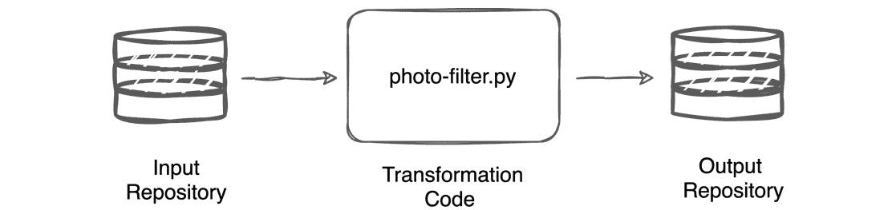
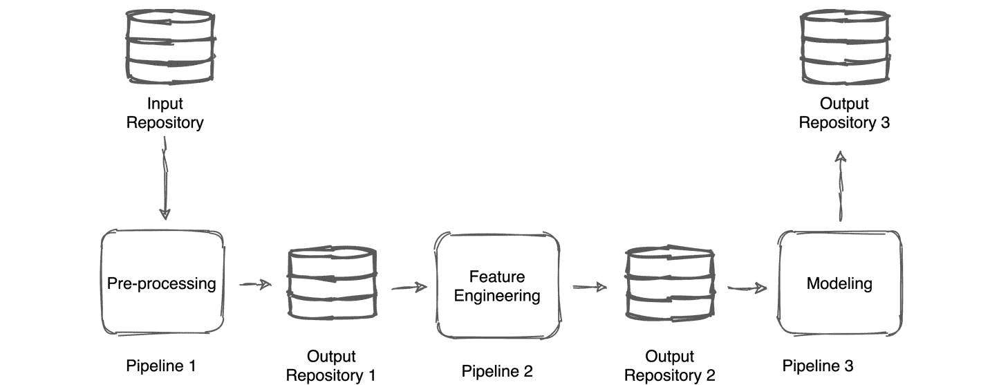

# 第三章：*第三章*：象皮管道规范

**机器学习**（**ML**）管道是一个自动化工作流，它使你能够对不同的数据和参数组合持续执行相同的代码。管道确保每个周期都是自动化的，并且按照相同的步骤顺序执行。在许多其他技术中，像在 Pachyderm 中，机器学习管道是通过一个叫做管道规范（pipeline spec）的配置文件定义的。

**Pachyderm 管道规范**是 Pachyderm 中最重要的配置，因为它定义了你的管道执行的任务、执行频率、工作如何分配给 Pachyderm 工作节点，以及结果输出的地点。

本章旨在作为管道规范参考，并将带你了解你可以为管道指定的所有参数。为此，我们将讨论以下主题：

+   管道规范概述

+   理解输入

+   探索信息参数

+   探索转换

+   优化你的管道

+   探索服务参数

+   探索输出参数

# 管道规范概述

通常，当你进行机器学习实验时，涉及多个顺序步骤。在最简单的场景下，你的管道从输入仓库获取输入，应用你的转换代码，并将结果输出到输出仓库。例如，你可能有一组图片，要应用单色滤镜，然后将结果输出到一个与管道同名的输出仓库。这个工作流仅执行一个操作，可以称为**单步管道**，或者单步工作流。这样管道的图示可能如下所示：



图 3.1 – 单步工作流

这个简单管道的规范，采用 YAML 格式，看起来会像这样：

```py
---
pipeline:
  name: apply-photo-filter
transform:
  cmd:
  - python3
  - "/photo-filter.py"
  image: myregistry/filter
input:
  pfs:
    repo: photos
    glob: "/"
```

这是你可以创建的最简单的管道规范。它必须包含以下参数：

+   `name`：为你的管道指定一个描述性的名称。通常，管道的名称描述了机器学习工作流中的某个步骤。例如，如果这个管道对你的图片应用滤镜，你可以称它为 `apply-photo-filter`。或者，如果它进行模型验证，你可以称它为 `cross-validation`。

+   `transform`：此参数包括你的转换代码，可以作为对文件的引用或直接内联指定。我们将在下一节详细讨论这个参数。

+   `input`：该参数指的是一个现有的输入仓库，文件位于该仓库中以供流水线使用。`input` 是你流水线工作节点下的一个文件系统，位于 `pfs/` 目录下。例如，如果你的仓库名为 `photos`，它会存储在工作节点的 `pfs/photos` 下。输出仓库由流水线自动创建，并存储在 `pfs/out` 下。所有输出仓库的名称与流水线名称相同。例如，如果你的流水线名为 `apply-photo-filter`，那么输出仓库会存储为 `apply-photo-filter`，位置在 `pfs/out/`。

这是一个非常简单的流水线示例。在更现实的应用场景中，通常会有多个流水线步骤。在典型的机器学习流水线中，你需要执行数据预处理、训练、交叉验证等步骤。当多个流水线串联在一起时，这被称为 **多步骤工作流**。例如，如果你正在创建一个自然语言处理（NLP）流水线，可能会有如下结构：



图 3.2 – 多步骤工作流

在前面的示意图中，每个流水线都有一个流水线规范，定义了名称、输入仓库、转换代码以及其他参数。

所有流水线规范必须以 **YAML Ain't Markup Language**（**YAML**）或 **JavaScript Object Notation**（**JSON**）格式编写。这些格式便于人类阅读和编写，并广泛应用于各类行业中的配置文件中。它比 **可扩展标记语言**（**XML**）或其他类似格式更容易编写。

现在我们已经回顾了最基本的流水线规范，并查看了一个更现实的示例，让我们来回顾一下你可以指定的其他参数。

# 理解输入

我们在*第二章*《Pachyderm 基础》一章中详细描述了输入，并提供了示例。因此，在本节中，我们只会提到输入定义了流水线的类型。你可以指定以下几种类型的 Pachyderm 输入：

+   **PFS** 是一个通用参数，用于定义所有多输入流水线中的标准流水线和输入。

+   **Cross** 是一种输入，它创建两个输入仓库中数据项的笛卡尔积。生成的输出将包含来自输入仓库的所有数据项的所有可能组合。

+   **Union** 是一种输入，它将一个仓库中的数据项添加到另一个仓库的数据项中。

+   **Join** 是一种输入，它将具有特定命名模式的数据项匹配起来。

+   **Spout** 是一种输入，它从第三方来源获取数据，并将数据添加到 Pachyderm 文件系统中以供进一步处理。

+   **Group** 是一种输入，它根据配置的命名模式将来自多个仓库的数据项组合在一起。

+   **Cron** 是一种根据指定时间间隔运行的流水线。

+   **Git** 是一种输入，可以让你从 Git 仓库中导入数据。

对于除 Cron 和 Git 外的所有输入，你可以定义一个 `pfs` 参数来定义输入。

## pfs

`pfs` 参数，代表 `pfs` 输入。你需要为所有管道定义一个或多个 `pfs` 输入，除了 Cron 和 Git。

以下是 `pfs` 输入的子参数：

+   `name`：管道的名称。

+   `repo`：一个 Pachyderm 输入库，数据存储在此处。

+   `branch`：Pachyderm 输入库中的一个分支，数据存储在此分支中。通常，这将是 `master` 分支。

+   `glob`：一个定义如何将数据分块进行处理的参数。你可以在 *第二章*，*Pachyderm 基础知识* 中的 *Datums* 部分阅读更多关于 `glob` 参数的内容。

+   `lazy`：一个启用较慢、较不激进数据下载的参数。`lazy` 参数在你需要查看数据的一个子集时非常有用。

+   `s3`：这个参数定义是否在管道中包含 S3 网关 sidecar。当你通过 S3 网关与第三方应用集成时，它确保管道的来源信息被保留。

你可以在 *第二章*，*Pachyderm 基础知识* 中阅读更多关于管道和输入类型的信息，并查看示例管道。接下来的部分描述了可以为管道定义的信息性参数。

# 探索信息性参数

管道信息性参数定义了管道的基本信息。在所有这些参数中，只有 `name` 参数是任何管道规范中必需的。其他所有参数都是可选的，可以省略。让我们更详细地了解这些参数。

## name

`name` 参数是管道的描述性名称。通常，你会根据管道执行的变换类型来命名管道。例如，如果你的管道执行图像分类，你可能想将其命名为 `image-classification`。管道名称必须由字母数字字符、短横线和下划线组成，并且不能超过 63 个符号。

以下是 `name` 参数的 YAML 格式示例：

```py
---
pipeline:
  name: image-classification
```

以下是 `name` 参数的 JSON 格式示例：

```py
{
  "pipeline": {
    "name": "image-classification"
  },
```

接下来，我们来看看 `description` 参数。

## description

`description` 参数提供关于管道的附加信息。虽然它是一个可选参数，但最好为你的管道添加一个简短的描述。例如，如果你的管道执行图像分类，你可以添加以下描述：*一个使用 scikit-learn 进行图像分类的管道*。

以下是 `description` 参数的 YAML 格式示例：

```py
description: A pipeline that performs image classification by using scikit-learn.
```

以下是 `description` 参数的 JSON 格式示例：

```py
"description": "A pipeline that performs image classification by using scikit-learn.",
```

接下来，我们了解一下 `metadata`。

## metadata

`metadata` 参数使您能够指定 Kubernetes 标签或注释。标签通常用于将 Kubernetes 对象分组到某种类别中，帮助简化这些对象的管理。标签可以查询以显示相同类型的对象。

注释则可以用来指定 Kubernetes 中未定义的任何随机键值对，这些键值对可以供外部应用程序使用。您可以使用注释来定义服务的类型，例如 `pach_patch` 或 `pach_spec`。在每个流水线规范中，可以指定多个标签和注释。

这是一个如何在 YAML 格式中指定注释的示例：

```py
metadata:
  annotations:
    annotation: data
```

以下示例展示了如何在 JSON 格式中指定注释：

```py
"metadata": {
    "annotations": {
        "annotation": "data"
    }
  },
```

以下示例展示了如何在 YAML 格式中指定标签：

```py
metadata:
  labels:
    label: object
```

最后，以下示例展示了如何在 JSON 格式中指定标签：

```py
"metadata": {
     "labels": {
        "label": "object"
    }
  },
```

现在我们已经了解了信息性参数，让我们看看 Pachyderm 流水线中的 `transformation` 部分。

# 探索转换

`transformation` 部分是您定义流水线转换代码的地方。它是流水线功能的核心。除非是两个流水线之间的连接器，或者是将结果导出到 Pachyderm 外部的流水线，大多数流水线都必须具有 `transformation` 部分。

`transformation` 部分最重要的参数——也是最常用的——是 `image` 和 `cmd` 或 `stdin`、`env` 和 `secrets`。

让我们更详细地看看这些参数。

## image

`image` 参数定义了一个 Docker 镜像，您的流水线将在其中运行。一个 Docker 镜像包含了流水线容器中环境的相关信息。例如，如果您运行 Python 代码，您需要在流水线镜像中包含某个版本的 Python。您可以使用许多公开可用的容器来构建您的流水线。

您还可以在该容器中包含您的脚本。除非您的代码只是一个可以通过 `stdin` 参数内联指定的 Bash 脚本，否则您可能需要构建自己的 Docker 镜像，将代码包含在镜像中，并将其存储在公共或私有容器注册表中。Docker 镜像是通过 `Dockerfile` 构建的，`Dockerfile` 描述了容器环境以及您可以在容器中运行的内容。您可以在 [`docs.docker.com/`](https://docs.docker.com/) 阅读更多关于 Docker 镜像的信息。

重要提示

不要使用 Docker 的 `CMD` 指令；请改用 `RUN`。`CMD` 指令会失败。

以下代码展示了如何在 YAML 格式中指定 Docker `image`：

```py
metadata:
  labels:
    label: object
```

以下代码展示了如何在 JSON 格式中指定 Docker `image`：

```py
"transform": {
    "image": "my-image",
```

然而，仅仅指定 Docker 镜像是不够的。您必须定义要运行的内容，可以通过 `cmd` 或 `stdin` 参数来实现。

### cmd

`cmd`参数定义了管道将对数据运行的代码。你可以在`cmd`行中做很多灵活的配置。通常，你会指定要运行的命令类型，例如`python`，或者设置它运行命令行 shell，例如`sh`或`bash`，然后在`stdin`参数中指定你想要运行的命令列表。

这两种方法没有区别或优先之分。唯一的区别是，如果你在`cmd`参数中指定了文件，你需要构建一个 Docker 镜像并将该文件包含在镜像中。

例如，如果你有一个 Python 3 文件，包含你希望在数据上运行的代码，你可以在 YAML 格式中像这样指定它：

```py
cmd:
  - python3
  - "/test.py"
```

另外，你可以在 JSON 格式中指定标签：

```py
"transform": {
    "cmd": [ "python3", "/test.py" ],
```

然而，如果你想在`stdin`参数中内联指定命令，只需按照`cmd`参数中指定的格式，如此，在 YAML 格式中：

```py
cmd:
  - python3
```

你也可以使用 JSON 格式来实现相同的功能：

```py
"transform": {
    "cmd": [ "python3" ],
```

请参阅*stdin*部分，了解如何指定内联代码的示例。

然而，你的`cmd`字段可能会更复杂。例如，你可以在`cmd`参数中指定一个脚本。

以下文本是你可以在 YAML 格式的`cmd`字段中使用的语法示例：

```py
transform:
  image: my-image
  cmd:
  - tree
  - "/pfs"
  - "&&"
  - python
  - my-script.py
  - "--outdir"
  - "/pfs/out"
  - "--input"
  - "/pfs/data "
```

以下文本是你可以在 JSON 格式的`cmd`字段中使用的语法示例：

```py
"transform": {
    "image": "my-image",
    "cmd": ["tree", 
        "/pfs", 
        "&&", 
        "python",
        "my-script.py", 
        "--outdir", "/pfs/out",
              "--input", "/pfs/data "] 
  },
```

接下来，让我们回顾一下`stdin`参数。

## stdin

`stdin`参数类似于 UNIX 标准输入（`stdin`），它使 Pachyderm 环境与管道工作者之间能够进行通信。这意味着你可以在`stdin`字段中按`cmd`命令指定的格式插入代码。你也可以像`cmd`参数一样指定代码文件的路径。

这种方法不需要你构建 Docker 镜像，允许你通过管道规范完全配置管道。如果你对 Docker 镜像构建过程不熟悉，这种方法可能更具吸引力。然而，对于更复杂的管道，你可能希望将脚本保存为文件，构建 Docker 镜像，并在管道中使用它们。

以下代码展示了你可以在 YAML 格式的`stdin`字段中使用的语法：

```py
transform:
  cmd:
  - bash
  stdin:
  - for f in /pfs/data/*
  - do
  - filename=$(basename "$f")
  - cp /pfs/data/* pfs/out/mypipeline/*
  - done
```

以下是你可以在 JSON 格式的`stdin`字段中使用的语法示例：

```py
"transform": {
    "cmd": ["bash"],
    "stdin": [
        "for f in /pfs/data/*",
        "do",
        "filename=$(basename \"$f\")",
        "cp /pfs/data/* pfs/out/mypipeline/*",
        "done"]
  },
```

由于前面的示例没有引用任何文件，你不需要为它们构建特定的 Docker 镜像并将文件包含在内。

然而，如果你引用了任何文件或任何比 Bash 稍微复杂的环境先决条件，你可能需要一个 Docker 镜像。例如，如果你有一个包含代码的`my-script.py`文件，你需要构建一个 Docker 镜像，包含该脚本，并且你必须在管道规范中引用它。

## err_cmd

`err_cmd`参数使您能够定义 Pachyderm 如何处理失败的数据项，并最终允许您将失败的数据项视为非关键错误，从而允许包含失败数据项的作业成功，并仅使用健康数据项触发下一个作业。`err_cmd`不会将任何数据写入输出仓库。`err_cmd`字段通常与`err_stdin`字段结合使用，您可以在其中指定实际的错误代码，尽管您也可以引用包含错误代码的文件。如果您希望即使作业包含失败的数据项，您的管道仍然成功，您只需设置`"err_cmd": true`。

以下是您可以在`err_cmd`字段中使用的语法，格式为 YAML：

```py
transform:
  ...
  err_cmd:
  - bash
  - "/my-error-code.sh"
```

以下是您可以在`err_cmd`字段中使用的语法，格式为 JSON：

```py
"transform": {
    ...
    "err_cmd": [ "bash", "/my-error-code.sh"],
```

在下一节中，我们将查看如何将`err_cmd`与`err_stdin`结合使用的示例。

## err_stdin

`err_stdin`参数与`err_cmd`参数结合使用，用于指定针对失败数据项运行的错误代码。类似于`stdin`参数，您可以指定内联代码来处理失败的数据项。例如，您可能希望检查数据项是否位于特定目录中，如果是，则将该数据项标记为失败。通常，您可以编写一个简单的 Bash 脚本，使用`if… then`条件来处理此问题。

以下代码显示了您可以在`err_stdin`与`err_cmd`字段中结合使用的语法，格式为 YAML：

```py
transform:    
    ...
    err_cmd:
    - bash
    err_stdin:
    - if
    - "[-a /pfs/repo1]"
    - then
    - exit 0
    - fi
    - exit 1
```

以下代码显示了您可以在`err_stdin`与`err_cmd`字段中结合使用的语法，格式为 JSON：

```py
"transform": {
    ...
    "err_cmd": [
      "bash"
    ],
    "err_stdin": [
      "if",
      "[-a /pfs/repo1]",
      "then",
      "exit 0",
      "fi",
      "exit 1"
    ]
```

接下来，让我们了解`env`参数。

## env

`env`参数使您能够指定 Pachyderm 环境变量和您需要与其他第三方工具通信的任意变量。这些参数可以包括目录和文件路径、主机名和端口、密钥访问、各种标识符等。

也可以包含 Pachyderm 变量。例如，您可以使用`LOG_LEVEL`环境变量来指定`pachd`的日志消息详细程度。另一个例子是，您还可以在`env`字段中指定 AWS 区域和桶。

以下代码显示了您可以在`env`字段中使用的语法，格式为 YAML：

```py
transform:    
    ...
    env:
        AWS_REGION: us-west-2
        S3_BUCKET: s3://my-bucket/
```

以下代码显示了您可以在`env`字段中使用的语法，格式为 JSON：

```py
"transform": {
    ...
    "env": {
             "AWS_REGION": "us-west-2",
             "S3_BUCKET": "s3://my-bucket/"
         }
  },
```

有关 Pachyderm 变量的完整列表，请参阅 Pachyderm 文档：[`docs.pachyderm.com/latest/deploy-manage/deploy/environment-variables/`](https://docs.pachyderm.com/latest/deploy-manage/deploy/environment-variables/)。

## secrets

`secrets`字段使您能够指定 Kubernetes 密钥，这些密钥包含敏感信息，如密码或 SSH 公钥。您需要通过使用`env_var`和`key`参数或`mount_point`参数来定义一个密钥。

以下代码显示了您可以在`name`和`mount_path`字段中使用的语法，以设置`secrets`文件的路径，格式为 YAML：

```py
transform:    
    ...
    secrets:
        name: my-ssh-key
        mount_path: "/path/to/file"
```

以下代码展示了如何以 JSON 格式指定这些参数：

```py
transform:    
    ...
    "secrets": {
        "name": "my-ssh-key",
        "mount_path": "/path/to/file"
    }
```

以下代码展示了你可以在`env_var`和`key`参数中使用的语法，用于以 YAML 格式设置秘密：

```py
transform:    
    ...
    secrets:
        name: my-ssh-key
        env_var: MY_KEY
        key: "mykey"
```

以下是如何以 JSON 格式执行相同操作：

```py
"transform": {
    ...
    "secrets": {
        "name": "my-ssh-key",
        "env_var": "MY_KEY",
        "key": "my_key"
    }
```

接下来，我们来了解一下`image_pull_secrets`。

## image_pull_secrets

`image_pull_secrets`参数使你能够配置 Pachyderm 管道，从私人 Docker 注册表拉取镜像。要指定此参数，你需要创建一个带有 Docker 配置的 Kubernetes 秘密，具体描述请参见 Kubernetes 文档：https://kubernetes.io/docs/concepts/containers/images/#creating-a-secret-with-a-docker-config，然后在管道规范中的`image_pull_secrets`参数下指定该秘密。你需要使用 Docker 镜像的完整路径，以确保管道能够正确拉取镜像。

以下代码展示了你可以在`image_pull_secrets`参数中使用的语法，用于启用管道从私人 Docker 注册表拉取镜像的 YAML 格式：

```py
transform:    
    ...
    image: my-private-docker-registry.com/my-project/my-image:latest
    image_pull_secrets:
      - my-secret
```

这是如何以 JSON 格式编写相同内容：

```py
"transform": {
    ...
    "image": "my-private-docker-registry.com/my-project/my-image",        
    "image_pull_secrets": ["my-secret"]
```

接下来，我们将审查的参数是`accept_return_code`。

## accept_return_code

`accept_return_code`参数使你能够指定一个整数数组，定义管道仍然被视为成功的错误代码。你可以在希望即使某部分失败，代码仍然成功的情况下使用此功能。这个参数类似于`err_cmd`功能。

以下代码展示了你可以在`accept_return_code`参数中使用的语法，用于以 YAML 格式指定错误代码：

```py
transform:    
    ...
    accept_return_code:
    - 256
```

以下是以 JSON 格式的相同示例：

```py
"transform": {
    ...
    "accept_return_code": [256]
```

接下来，我们将查看的参数是`debug`。

## debug

`debug`参数使你能够设置管道日志输出的详细程度。默认启用基本日志记录，但如果你希望包含更多详细的消息，可以将此参数设置为`true`。默认情况下，此参数为`false`。

以下是如何在 YAML 格式中启用管道的调试日志记录：

```py
transform:    
    ...
    debug: true
```

这是如何以 JSON 格式启用管道的调试日志记录：

```py
"transform": {
    ...
    "debug": true
```

接下来，我们来了解如何使用`user`参数。

## user

`user`参数使你能够定义一个用户和一个组，用来运行容器的代码。这个参数类似于 Docker 的`USER`指令，你也可以通过`Dockerfile`来定义它。默认情况下，Pachyderm 首先检查`Dockerfile`中的内容，并为管道规范中的`user`参数设置该值。如果在`Dockerfile`和管道规范中都没有指定，默认使用的参数值是`root`。只有在使用`--no-expose-docker-socket`参数部署 Pachyderm 时，必须在管道规范中显式指定用户。

你可以在[`docs.docker.com/engine/reference/builder/#user`](https://docs.docker.com/engine/reference/builder/#user)上阅读更多关于 Docker `USER`参数的信息。

以下是如何在 YAML 格式中指定 `user` 的方式：

```py
transform:    
    ...
    user: test-user
```

以下是如何在 JSON 格式中指定 `user` 的方式：

```py
"transform": {
    ...
    "user": "test-user"
```

现在，让我们了解 `working_dir` 参数。

## working_dir

`working_dir` 参数使您能够为管道容器指定工作目录。此参数类似于 Docker 的 `WORKDIR` 指令，您也可以通过 `Dockerfile` 定义它。默认情况下，Pachyderm 会首先检查 `Dockerfile` 中的内容，并将其值设置为管道规范中的 `working_dir` 参数。如果 `Dockerfile` 和管道规范中都没有指定，则使用默认参数，即根目录（`/`）或 Docker 镜像从基础镜像继承的目录。只有在使用 `--no-expose-docker-socket` 参数部署 Pachyderm 时，您才需要在管道规范中明确指定工作目录。

您可以在 [`docs.docker.com/engine/reference/builder/#workdir`](https://docs.docker.com/engine/reference/builder/#workdir) 阅读更多关于 Docker `Workdir` 参数的信息。

以下是如何在 YAML 格式中指定 `workdir` 的方式：

```py
transform:    
    ...
    working_dir: /usr/src/test
```

在 JSON 格式中，相同的参数如下所示：

```py
"transform": {
    ...
    "working_dir": "/usr/src/test"
```

接下来，我们将了解 `dockerfile` 参数。

## dockerfile

`dockerfile` 参数使您能够指定 `Dockerfile` 的路径，用于您的管道。当您使用 Pachyderm 的 `pachctl update-pipeline –build -f <pipeline-spec>` 来为管道构建新的 Docker 镜像时，这非常有用。默认情况下，Pachyderm 会在与管道规范相同的目录中查找 `Dockerfile`。但通过 `dockerfile` 参数，您可以设置任何路径。

以下是如何在 YAML 格式中指定 Dockerfile 路径的方式：

```py
transform:    
    ...
    dockerfile: /path/to/dockerfile
```

您也可以像这样在 JSON 格式中执行相同操作：

```py
"transform": {
    ...
    "dockerfile": "/path/to/dockerfile "
```

在本节中，我们了解了可以为转换代码指定的所有参数。在下一节中，我们将回顾如何控制管道工作者的性能，并分配资源限制来优化管道。

# 优化您的管道

本节将带您了解可能帮助您优化管道以提高性能的管道规范参数。由于 Pachyderm 运行在 Kubernetes 上，它是一个高度可扩展的系统，可以帮助您明智地使用底层硬件资源。

Pachyderm 的最大优势之一是您可以为每个管道单独指定资源，以及定义每次运行时管道将生成多少个工作者，以及它们在空闲等待新工作时的行为。

如果您只是测试 Pachyderm，以了解它是否适合您的用例，那么优化参数可能不那么重要。但如果您正在实施一个包含多个管道且大量数据被注入到 Pachyderm 中的企业级数据科学平台，了解如何优化管道将变得至关重要。

在继续之前，您必须理解 Pachyderm 数据项的概念。数据项在管道可扩展性中起着重要作用。如果您还没有阅读*第二章*，《Pachyderm 基础》一章，建议在继续之前先阅读它。

## parallelism_spec

`parallelism_spec`定义了为您的管道启动的工作节点数量。您可以指定`coefficient`或`constant`策略。默认情况下，Pachyderm 会为每个管道部署一个工作节点，使用`constant`策略，值为`1`。

`coefficient`策略意味着 Pachyderm 将根据指定的系数创建多个工作节点。例如，如果您在 Kubernetes 集群中有 50 个节点，并将`coefficient`策略设置为`1`，Pachyderm 将使用该集群的所有 50 个节点。如果您使用`coefficient`策略，您的管道需要访问 Kubernetes 的管理节点。如果您在托管版本的 Kubernetes 上运行 Pachyderm，例如在 AWS 或 GKE 平台上，您可能无法访问这些节点，管道将不断重启。在这种情况下，您将必须使用`constant`策略。

`constant`策略使您能够为管道指定确切数量的工作节点，如 3、25 或 100。这些工作节点将在该管道中无限期运行。然而，如果您希望在空闲时动态调整集群规模，您可以设置`standby:true`参数，以便集群根据工作负载动态调整大小。

以下代码展示了您可以在`parallelism_spec`参数中使用的语法，用于指定`coefficient`策略的 YAML 格式：

```py
parallelism_spec:
  coefficient: '1'
```

以下代码展示了您可以在`parallelism_spec`参数中使用的语法，用于指定`coefficient`策略的 JSON 格式：

```py
"parallelism_spec": {
    "coefficient": "1"
  },
```

这是您可以在 YAML 格式中定义`parallelism_spec`参数以指定`constant`策略的方式：

```py
parallelism_spec: until_success
```

以下代码展示了如何在`parallelism_spec`参数中使用`constant`策略的 JSON 格式：

```py
"parallelism_spec": "until_success"
```

接下来，让我们学习如何使用`reprocess_spec`。

## reprocess_spec

`reprocess_spec`使您能够强制管道重新处理所有数据项。默认情况下，Pachyderm 会跳过重新处理成功的数据项，但如果您的管道与外部应用程序或系统进行交互，您可能希望重新处理所有数据项。这种行为可以保护管道免受连接和其他错误的影响。

以下是您可以在`reprocess_spec`中使用的 YAML 格式语法：

```py
reprocess_spec:
  constant: '1'
```

以下是您可以在`reprocess_spec`中使用的 JSON 格式语法：

```py
"parallelism_spec": {
    "constant": "1"
}
```

接下来，我们将学习如何使用`cache_size`。

## cache_size

`cache_size` 参数使您能够定义用户和存储容器的缓存内存大小。Pachyderm 会在处理数据之前预先下载数据，增加 `cache_size` 可以帮助提高下载速度。默认值为 64M，您可以根据需要增加该值来缓存您的数据。这个参数是微调参数，只有在通过 `glob` 和 `parallelism_spec` 优化了管道之后才应该使用。

以下是您可以在 `cache_size` 参数中使用的语法示例，用于以 YAML 格式增加缓存大小：

```py
cache_size: 1G 
```

在 JSON 格式中，相同的参数将如下所示：

```py
"cache_size": "1G",
```

现在，让我们回顾一下 `max_queue_size` 参数。

## max_queue_size

`max_queue_size` 参数定义了管道可以同时下载多少数据项。您可以使用 `max_queue_size` 使管道在处理其他数据项时预先下载下一个数据项。默认情况下，Pachyderm 将 `max_queue_size` 设置为 `1`，意味着一次只能下载一个数据项。这是一个微调参数，如果下载时间显著长于处理时间，调整此参数可以提高数据项下载到工作节点的速度。然而，只有在正确配置了 `glob` 和 `parallelism_spec` 后，您才应该调整此参数。

以下代码展示了如何使用 `max_queue_size` 参数以 YAML 格式增加缓存大小：

```py
max_queue_size: 5 
```

在 JSON 格式中，相同的键值对如下所示：

```py
"max_queue_size": "5",
```

接下来，我们将学习 `chunk_spec`。

## chunk_spec

`chunk_spec` 参数定义了每个工作节点处理的数据项数量。默认情况下，此参数设置为 `1`。数据块可以通过 `number`（数据项数量）或 `size_bytes`（字节大小）来设置。例如，如果您将 `chunk_spec` 中的 `number` 设置为 `3`，则每个工作节点一次会处理三个数据项。

使用 `size_bytes`，如果数据项的运行时间与其大小成正比，您可以使数据项大小均匀。如果不是这种情况，请改用 `number` 参数。

以下代码展示了如何在 `chunk_spec` 参数中设置 `number`，以使工作节点一次处理指定数量的数据项，并以 YAML 格式呈现：

```py
chunk_spec:
  number: '10'
```

这是您可以在 `chunk_spec` 参数中设置 `number`，使得工作节点一次处理指定数量数据项的 JSON 格式：

```py
"chunk_spec": {
    "number": "10"
  },
```

以下代码展示了如何在 `chunk_spec` 参数中设置 `size_bytes`（数据项的字节数），使得工作节点一次处理指定数量的数据项，并以 YAML 格式呈现：

```py
chunk_spec:
  size_bytes: '1210'
```

如果您更喜欢使用 JSON 格式，设置 `chunk_spec` 参数中的 `size_bytes`，使工作节点一次处理指定数量的数据项，将是如下所示：

```py
"chunk_spec": {
    "size_bytes": "1210"
  },
```

接下来，我们将学习如何设置资源限制。

## resource_limits

`resource_limits` 参数使你能够限制 GPU 资源的 `type` 数量。管道工作者不能使用超过你指定的资源限制。`resource_request` 参数类似，但如果有足够的资源，工作者可以使用超过请求的资源。你可以在 Kubernetes 文档中阅读更多关于 `resource_limits` 和 `resource_requests` 的内容，链接：[`kubernetes.io/docs/concepts/configuration/manage-resources-containers/#requests-and-limits`](https://kubernetes.io/docs/concepts/configuration/manage-resources-containers/#requests-and-limits)。

以下代码展示了如何在 YAML 格式中设置 `resource_limits` 参数以限制 Pachyderm 工作者资源：

```py
resource_limits:
  cpu: 1
  gpu:
    type: nvidia.com/gpu
    number: 1
    memory: 16G
```

以下代码展示了如何在 JSON 格式中设置 `resource_limits` 参数以限制 Pachyderm 工作者资源：

```py
"resource_limits": {
    "cpu": 1,
    "gpu": {
        "type": "nvidia.com/gpu",
        "number": 1,
    "memory": "16G"
    }
  },
```

如果你需要设置特定的云资源类型，例如 Google Kubernetes Engine 中的 TPU，你可以通过配置 `pod_patch` 来实现。有关更多信息，请参见接下来的 *pod_patch* 部分。

## resource_requests

`resource_requests` 参数指定管道工作者请求处理一个工作单元所需的资源数量。与 `resource_limits` 参数不同，如果有更多资源可用，工作者可以使用这些资源。该参数的语法与 `resource_limits` 相同。

## sidecar_resource_limits

该参数类似于 `resource_limits`，并定义了管道 sidecar 容器的资源。有关一些示例语法，请参见 *resource_limits* 部分。

## scheduling_spec

`scheduling_spec` 参数使你能够根据指定的 `node_selector` 或 `priority_class` 来指定运行管道代码的 Pods。`node_selector` 允许你指定一组具有相同标签的节点，称为 `nodeSelector`，而 `priority_class` 允许你将管道调度到匹配 Kubernetes `PriorityClass` 的节点组上。`scheduling_spec` 参数通常用于根据资源调度管道到特定的工作节点。有关这些属性的更多信息，请参见 [`kubernetes.io/docs/concepts/scheduling-eviction/assign-pod-node/#nodeselector`](https://kubernetes.io/docs/concepts/scheduling-eviction/assign-pod-node/#nodeselector) 和 [`kubernetes.io/docs/concepts/configuration/pod-priority-preemption/#priorityclass`](https://kubernetes.io/docs/concepts/configuration/pod-priority-preemption/#priorityclass)。

以下代码展示了如何在 YAML 格式中定义 `nodeSelector`：

```py
scheduling_spec:
  node_selector:
    kubernetes.io/my-hostname: my-node
```

以下代码展示了如何在 JSON 格式中定义 `nodeSelector`：

```py
"scheduling_spec": {
      "node_selector": {"kubernetes.io/my-hostname": "my-node"
      }
    }, 
```

要在 YAML 格式中定义 `PriorityClass` 参数，请使用以下代码：

```py
scheduling_spec:
  priority_class: high-priority
    kubernetes.io/my-hostname: my-node
```

或者，如果你更喜欢使用 JSON 格式，请按以下方式设置 `PriorityClass`：

```py
"scheduling_spec": {
      "priority_class": "high-priority"
      }
```

接下来，我们将学习如何为一个作业设置超时。

## job_timeout

`job_timeout` 参数使你能够为 Pachyderm 作业运行设置超时。这意味着如果作业在指定时间内未完成，它将失败。默认情况下，该参数是禁用的，你可以将其设置为你希望的时间值。

以下代码展示了如何在 YAML 格式中定义 `job_timeout` 参数：

```py
job_timeout: 10m
```

这是相同示例的 JSON 格式：

```py
"job_timeout": "10m"
```

接下来，我们将了解 `datum_timeout`。

## datum_timeout

`datum_timeout` 超时与 `job_timeout` 类似，唯一的区别是超时设置在数据粒度级别。语法相同。

## datum_tries

`datum_tries` 参数定义了 Pachyderm 在数据失败时重试管道的次数。默认情况下，该参数设置为 `3`。如果你只希望管道运行一次，不再尝试处理失败的数据，请将此值设置为 `1`。

以下代码展示了如何在 YAML 格式中定义 `job_tries` 参数：

```py
datum_tries: 1
```

如果你更倾向于使用 JSON 格式编写，可以使用以下代码：

```py
"datum_tries": "1"
```

在本节中，我们学习了如何通过微调管道规范来实现最佳性能。下一节，你将学习如何配置一些辅助管道操作的服务参数。

# 探索服务参数

现在，让我们来看一下服务参数。服务参数包括那些让你收集数据统计信息以及修补管道 Kubernetes 配置的参数。

## enable_stats

`enable_stats` 参数顾名思义，用于启用管道统计日志记录。默认情况下，该参数是禁用的。为了调试，建议将此参数设置为`true`。启用统计数据收集后，统计信息将保存在 `stats` 文件夹中，且无法禁用统计数据收集。

以下代码展示了如何在 YAML 格式中定义 `enable_stats` 参数：

```py
enable_stats: true
```

以下代码展示了如何在 JSON 格式中定义 `enable_stats` 参数：

```py
"enable_stats": true,
```

接下来，我们将了解`pod_patch`。

## pod_patch

`pod_patch` 参数使你能够重写管道 Pods 中的任何字段。这对许多场景有用，一个例子是将卷挂载到你的管道中。为了创建 `pod_patch`，你通常需要使用 JSON patch 构建器，将其转换为一行格式，并添加到管道规范中。

以下代码展示了如何在 YAML 格式中定义 `pod_patch` 参数：

```py
pod_patch: '[{"op": "add","path": "spec/initContainers/0/resources/limits/my-volume"}]'
```

以下是相同内容的 JSON 格式：

```py
"pod_patch": "[{\"op\": \"add\",\"path\": \"spec/initContainers/0/resources/limits/my-volume\"}]"
```

这就是你需要了解的所有服务参数。接下来的章节，我们将介绍一些使你能够配置输出分支并将管道结果写入外部存储的参数。

# 探索输出参数

输出参数使你能够配置处理后的数据在结果落入输出库后发生的事情。你可以设置它将数据放置在外部 S3 存储库中或配置出口。

### s3_out

`s3_out`参数使您的 Pachyderm 管道能够将输出写入 S3 存储库，而不是标准的`pfs/out`。此参数需要一个布尔值。要访问输出存储库，您需要使用 S3 协议地址，如`s3://<output-repo>`。输出存储库仍将与您的管道名称同名。

以下代码展示了如何在 YAML 格式中定义`s3_out`参数：

```py
s3_out: true
```

这里是如何在 JSON 格式中做同样的操作：

```py
"s3_out": true
```

现在，让我们了解一下`egress`。

### egress

`egress`参数使您能够指定输出数据的外部位置。Pachyderm 支持 Amazon S3（`s3://`协议）、Google Cloud Storage（`gs://`协议）和 Azure Blob Storage（`wasb://`协议）。

以下代码展示了如何在 YAML 格式中定义`egress`参数：

```py
egress:
  URL: gs://mystorage/mydir
```

这里是相同的示例，但使用的是 JSON 格式：

```py
"egress": {
        "URL": "gs://mystorage/mydir"
  },
```

接下来，让我们了解如何在 Pachyderm 中配置输出分支。

### output_branch

`output_branch`参数使您能够将结果写入输出存储库中的一个不同于默认`master`分支的分支。如果您希望创建一个实验或开发输出，而不希望下游管道拾取它，您可能需要这样做。

以下代码展示了如何在 YAML 格式中定义`output_branch`参数：

```py
output_branch: test
```

以下代码展示了如何在 JSON 格式中定义`output_branch`参数：

```py
"output_branch": "test",
```

本章概述了 Pachyderm 管道规范的内容。

# 总结

在本章中，我们了解了您可以在 Pachyderm 管道中指定的所有参数、如何优化管道以及如何配置转换部分。管道规范是您管道中最重要的配置属性，因为您将使用它来创建您的管道。如您所见，管道规范在性能优化方面提供了很大的灵活性。虽然一开始可能很难为您的数据类型找到合适的参数，但 Pachyderm 提供了许多微调选项，帮助您为您的机器学习工作流实现最佳性能。

在下一章中，您将学习如何在本地计算机上安装 Pachyderm。

# 深入阅读

要了解更多关于本章中所涵盖的主题，请查看以下资源：

+   *Pachyderm 环境变量*：[`docs.pachyderm.com/latest/deploy-manage/deploy/environment-variables/`](https://docs.pachyderm.com/latest/deploy-manage/deploy/environment-variables/)

+   *Kubernetes 概念*：[`kubernetes.io/docs/concepts/`](https://kubernetes.io/docs/concepts/)

+   *Pachyderm 管道规范*：[`docs.pachyderm.com/latest/reference/pipeline_spec/`](https://docs.pachyderm.com/latest/reference/pipeline_spec/)
