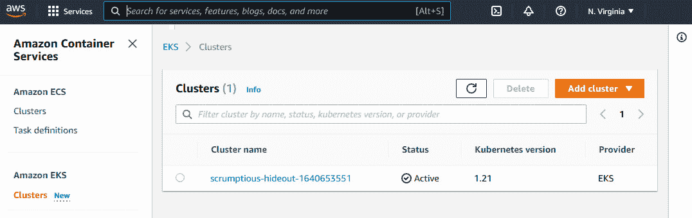
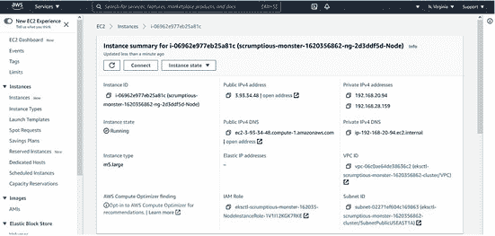
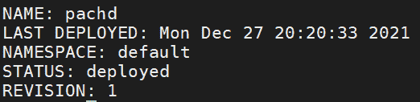
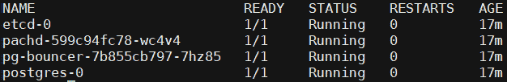
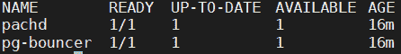

# 第五章：*第五章*：在云平台上安装 Pachyderm

在上一章中，你已经学习了在本地安装 Pachyderm 的过程，以便快速开始并在你的计算机上测试 Pachyderm。

生产环境用例需要额外的计算资源和可扩展性，可以通过云平台和流行云提供商提供的托管 Kubernetes 平台服务高效实现。Pachyderm 可以在 Kubernetes 集群上运行，无论是手动部署在云实例上，还是作为托管的 Kubernetes 服务部署。我们将讨论在云提供商上配置最流行和易于配置的方法。

本章将带你完成 Pachyderm 的云端安装，并解释运行 Pachyderm 集群所需的软件要求。本章将介绍在以下最流行的云平台上的安装：Amazon **Elastic Kubernetes Service** (**EKS**)，**Google Kubernetes Engine** (**GKE**)，以及 Microsoft **Azure Kubernetes Service** (**AKS**)。

在本章中，我们将涵盖以下主要主题：

+   安装所需工具

+   在 Amazon EKS 上部署 Pachyderm

+   在 GKE 上部署 Pachyderm

+   在 Microsoft AKS 上部署 Pachyderm

+   访问 Pachyderm 控制台

# 技术要求

如果你使用 macOS，请验证你使用的是最新版本的 macOS。如果你使用 Linux，必须是 CentOS、Fedora 或 Ubuntu 的 64 位版本。如果你使用 Windows，请从 **Windows 子系统 Linux** (**WSL**) 运行本节中描述的所有命令。你应该已经在前面的章节中安装了以下工具：

+   Homebrew（仅限 macOS）

+   Kubernetes `kubectl`

+   Helm

+   Pachyderm CLI – `pachctl`

+   WSL（仅限 Windows）

我们需要安装以下工具：

+   `aws`

+   **Amazon 身份和访问管理** (**AWS IAM**) Kubernetes 身份验证器

+   EKS 命令行工具 – `eksctl`

+   Google Cloud SDK – `gcloud`

+   Azure CLI – `az`

+   JSON 处理器 – `jq`

我们将在本章中详细讨论这些工具的安装和配置。如果你已经知道如何操作，可以现在就开始设置它们。

# 安装所需工具

在本节中，我们将讨论安装我们在部署 Kubernetes 集群和在云平台上安装 Pachyderm 前需要的系统工具。

## 安装 AWS 命令行界面以管理 AWS

AWS 命令行界面 `aws-cli` 是执行 AWS 账户命令所必需的。有关更多信息，你可以参考 AWS 命令行界面的官方文档：[`docs.aws.amazon.com/cli/latest/userguide/`](https://docs.aws.amazon.com/cli/latest/userguide/)。让我们在你的计算机上安装 `aws-cli`：

1.  执行以下命令，在你的计算机上安装 `aws-cli` 版本 2：

如果你正在使用 macOS：

```py
$ curl "https://awscli.amazonaws.com/AWSCLIV2.pkg" -o "AWSCLIV2.pkg"
$ sudo installer -pkg AWSCLIV2.pkg -target
```

如果你使用的是 Linux（x86）或 Windows 上的 WSL：

```py
$ curl "https://awscli.amazonaws.com/awscli-exe-linux-x86_64.zip" -o "awscliv2.zip"
$ unzip awscliv2.zip
$ sudo ./aws/install
```

1.  执行以下命令验证 AWS CLI 安装是否成功：

    ```py
    $ aws --version
    ```

上述命令的输出应如下所示：

```py
aws-cli/2.4.7 Python/3.8.8 Linux/5.11.0-41-generic exe/x86_64.ubuntu.20 prompt/off
```

1.  执行以下命令配置 AWS CLI，并输入您的`~/.aws/credentials`，以便稍后运行命令时使用：

    ```py
    $ aws configure
    ```

上述命令的输出应如下所示：

```py
AWS Access Key ID [None]: YOURACCESSKEYHERE
AWS Secret Access Key [None]: YOURSECRETACCESSKEYHERE
Default region name [None]: us-east-1
Default output format [None]: json
```

1.  如果要使用与凭证文件中配置的不同帐户，可以设置环境变量，直到当前 shell 会话结束时该变量将生效。根据需要，临时使用以下变量设置用户配置：

    ```py
    $ export AWS_ACCESS_KEY_ID=YOURACCESSKEY2HERE
    $ export AWS_SECRET_ACCESS_KEY=YOURSECRETACCESS2KEYHERE 
    $ export AWS_DEFAULT_REGION=us-west-2
    ```

现在您已经在计算机上安装了 AWS 命令行接口，接下来让我们安装 Kubernetes 的 AWS IAM 认证器。

## 安装 Kubernetes 的 AWS IAM 认证器

Amazon EKS 利用 AWS IAM 为通过 EKS 创建的 Kubernetes 集群提供访问权限。为了让 `kubectl` 命令与 Amazon EKS IAM 角色一起工作，需要安装 Amazon IAM 认证器。让我们在您的计算机上安装 IAM 认证器：

1.  执行以下命令安装`aws-iam-authenticator`：

如果您使用的是 macOS：

```py
$ brew install aws-iam-authenticator
```

如果您使用的是 Linux（x86）或 Windows 上的 WSL：

```py
$ curl -o aws-iam-authenticator https://amazon-eks.s3.us-west-2.amazonaws.com/1.19.6/2021-01-05/bin/linux/amd64/aws-iam-authenticator
$ chmod +x ./aws-iam-authenticator
$ mkdir -p $HOME/bin && cp ./aws-iam-authenticator $HOME/bin/aws-iam-authenticator && export PATH=$PATH:$HOME/bin
$ echo 'export PATH=$PATH:$HOME/bin' >> ~/.bashrc
```

1.  验证其版本并确保已安装`aws-iam-authenticator`：

    ```py
    $ aws-iam-authenticator version
    ```

上述命令的输出应如下所示。为了能够执行以下步骤，`aws-iam-authenticator`版本应为`0.5.0`或更高：

```py
{"Version":"v0.5.0","Commit":"1cfe2a90f68381eacd7b6dcfa2 bf689e76eb8b4b"}
```

现在，您已经在计算机上安装了`aws-iam-authenticator`。

## 安装 eksctl 以管理 Amazon EKS

Amazon EKS 是 Amazon EC2 上的托管 Kubernetes 服务。要通过终端管理 Amazon EKS 并执行命令，需要使用 Amazon EKS 的官方 CLI——`eksctl`。有关更多信息，您可以参考 AWS `eksctl` 官方文档，网址为[`docs.aws.amazon.com/eks/latest/userguide/getting-started-eksctl.html`](https://docs.aws.amazon.com/eks/latest/userguide/getting-started-eksctl.html)。让我们在您的计算机上安装`eksctl`：

1.  执行以下命令以在您的计算机上安装`eksctl`：

如果您使用的是 macOS：

```py
$ brew tap weaveworks/tap
$ brew install weaveworks/tap/eksctl
```

如果您使用的是 Linux（x86）或 Windows 上的 WSL：

```py
$ curl --silent --location "https://github.com/weaveworks/eksctl/releases/latest/download/eksctl_$(uname -s)_amd64.tar.gz" | tar xz -C /tmp
$ sudo mv /tmp/eksctl /usr/local/bin
```

1.  验证其版本并确保已安装`eksctl`：

    ```py
    $ eksctl version
    ```

上述命令的输出应如下所示：

```py
0.77.0
```

为了执行以下步骤，`eksctl`版本应为`0.77.0`或更高版本。现在您已经在计算机上安装了`eksctl`，以便管理 Amazon EKS。

## 安装 Google Cloud SDK 以管理 Google Cloud

Google Cloud SDK（`gcloud`）是执行 Google Cloud 帐户命令所需的工具。以下说明假设您已经拥有一个启用了计费的有效 GCP 帐户。如果您还没有帐户，请访问[`console.cloud.google.com`](https://console.cloud.google.com)并创建一个帐户。让我们在您的计算机上安装`gcloud`：

1.  执行以下命令以在您的计算机上安装`gcloud`：

如果您使用的是 macOS：

```py
$ brew tap weaveworks/tap
$ brew install weaveworks/tap/eksctl
```

如果你正在使用 Linux（x86）或 Windows 上的 WSL：

```py
$ curl https://sdk.cloud.google.com | bash
```

1.  执行以下命令重新启动你的 shell：

    ```py
    $ exec -l $SHELL
    ```

1.  验证其版本并确保 `gcloud` 已安装：

    ```py
    $ gcloud version
    ```

前面的命令输出应如下所示。为了能够执行以下操作，Google Cloud SDK 版本应为 `339.0.0` 或更高版本：

```py
Google Cloud SDK 367.0.0
bq 2.0.72
core 2021.12.10
gsutil 5.5
```

1.  执行以下命令初始化 SDK，并按照指示操作：

    ```py
    $ gcloud init
    ```

1.  执行以下命令为未来的部署设置默认区域。在我们的示例中，计算区域设置为 `us-central1-a`：

    ```py
    $ gcloud config set compute/zone us-central1-a
    ```

现在，你已经在计算机上安装了 `gcloud` 来管理 GKE。

## 安装 Azure CLI 以管理 Microsoft Azure

Azure CLI（`az`）是执行 Microsoft Azure 账户中命令所必需的。以下说明假设你已有一个启用计费的有效 Azure 账户。如果你还没有账户，请访问 [`portal.azure.com`](https://portal.azure.com) 创建一个账户。让我们在你的计算机上安装 Azure CLI：

1.  执行以下命令在你的计算机上安装 `gcloud`：

如果你正在使用 macOS：

```py
$ brew update && brew install azure-cli
$ brew install jq
```

如果你正在使用 Linux（x86）或 Windows 上的 WSL：

```py
$ curl -sL https://aka.ms/InstallAzureCLIDeb | sudo bash
$ sudo apt-get install jq
```

1.  验证其版本并确保已安装 Azure CLI：

    ```py
    $ az version
    ```

前面的命令输出应如下所示。为了能够执行以下步骤，Azure CLI 版本应为`2.0.1`或更高版本：

```py
{
  "azure-cli": "2.31.0",
  "azure-cli-core": "2.31.0",
  "azure-cli-telemetry": "1.0.6",
  "extensions": {}
}
```

1.  执行以下命令初始化 Azure CLI，并按照指示操作：

    ```py
    $ az login
    ```

1.  执行以下命令创建一个具有唯一名称的资源组，并为未来的部署设置默认区域。在我们的示例中，计算区域设置为 `centralus`：

    ```py
    $ az group create --name="pachyderm-group" --location=centralus
    ```

现在，你已经在计算机上安装了 Azure CLI 来管理 AKS。

# 在 Amazon EKS 上部署 Pachyderm

Kubernetes 是一个开源的容器编排平台，本身是一个庞大的主题。在本节中，我们从数据科学家的角度探讨容器化，仅专注于在市场上最常见的托管平台上运行我们的工作负载 Pachyderm。AWS 云平台上有多种方法和工具可以配置和管理生产级 Kubernetes 集群的生命周期，如 `kOps`、`kubespray`、`k3s`、Terraform 等。欲了解更多配置细节，请参考 Kubernetes 官方文档 [`kubernetes.io/docs/setup/production-environment/`](https://kubernetes.io/docs/setup/production-environment/)。让我们学习在 AWS 托管的 Kubernetes 服务 Amazon EKS 上启动和运行 Pachyderm 所需服务的最简单方法。

## 准备 Amazon EKS 集群以运行 Pachyderm

按照以下步骤使用`eksctl`来配置一个 Amazon EKS 集群。`eksctl`最初作为一个第三方开源工具开发，现在是通过 CLI 部署和管理 EKS 集群的官方工具。您需要安装 AWS CLI 和 AWS IAM Kubernetes 认证工具，并配置它们的凭证。如果您已经有一个集群，可以跳过这些步骤，直接跳到 *在 Amazon EKS 上部署 Pachyderm* 部分。此外，您可以参考 Amazon EKS 的官方文档：[`eksctl.io/introduction/`](https://eksctl.io/introduction/)：

1.  执行以下命令，使用默认参数简单地部署 EKS 集群。此命令将生成一个包含两个`m5.large`工作节点的集群，使用官方 AWS EKS **亚马逊机器镜像**（**AMI**）：

    ```py
    $ eksctl create cluster
    ```

上述命令的输出应返回类似于以下内容的输出：

```py
...
kubectl command should work with "/home/norton/.kube/config", try 'kubectl get nodes'
[✔]  EKS cluster "exciting-badger-1620255089" in "us-east-1" region is ready
```

重要提示

要自定义 EKS 集群配置，可以将附加参数传递给`eksctl`，如下所示：

`eksctl create cluster --name <name> --version <version> \`

`--nodegroup-name <name> --node-type <vm-flavor> \`

`--nodes <number-of-nodes> --nodes-min <min-number-nodes> \`

`--nodes-max <max-number-nodes> --node-ami auto`

1.  执行以下命令验证集群部署：

    ```py
    $ kubectl cluster-info && kubectl get nodes
    ```

上述命令的输出应如下所示：

```py
Kubernetes control plane is running at https://ABCD.gr7.us-east-1.eks.amazonaws.com
CoreDNS is running at https://ABCD.gr7.us-east-1.eks.amazonaws.com/api/v1/namespaces/kube-system/services/kube-dns:dns/proxy
To further debug and diagnose cluster problems, use 'kubectl cluster-info dump'.
NAME                             STATUS   ROLES    AGE    VERSION
ip-192-168-17-133.ec2.internal   Ready    <none>   21m    v1.21.5-eks-bc4871b 
ip-192-168-63-179.ec2.internal   Ready    <none>   21m    v1.21.5-eks-bc4871b
```

现在，您的 Amazon EKS 集群已配置好，并准备好部署 Pachyderm。

## 创建 S3 对象存储桶

Pachyderm 使用符合 S3 标准的对象存储来存储数据。按照以下步骤创建一个 S3 对象存储桶：

1.  生成将用于创建 S3 存储桶的变量，并将其传递给`pachctl`，以便稍后存储 Pachyderm 数据。确保使用唯一的存储桶名称。在我们的示例中，我们将使用 `s3.pachyderm` 作为存储桶名称，容量为 200 GB，并位于与 EKS 集群相同的区域`us-east-1`：

    ```py
    $ export S3_BUCKET_NAME=s3.pachyderm
    $ export EBS_STORAGE_SIZE=200
    $ export AWS_REGION=us-east-1
    ```

1.  为了让 Pachyderm 存储管道数据，需要一个专用的 S3 存储桶。执行以下命令，根据您的变量定义创建一个 S3 存储桶：

    ```py
    $ aws s3api create-bucket --bucket ${S3_BUCKET_NAME} \
    --region ${AWS_REGION}
    ```

1.  执行以下命令确认存储桶已创建：

    ```py
    $ aws s3api list-buckets --query 'Buckets[].Name'
    ```

上述命令的输出应如下所示：

```py
[
    "s3.pachyderm",
]
```

现在我们已经创建了一个 S3 存储桶，可以准备在 Amazon EKS 上部署 Pachyderm。

# 部署集群

当你开始学习 Pachyderm 时，建议在一个小型本地集群中进行实验。我们在*第四章*中已介绍了 Pachyderm 的本地部署，*本地安装 Pachyderm*。在本章中，我们将重点介绍使用 IAM 角色在 Amazon EKS 集群上进行可扩展的生产级部署。

按照以下步骤在您的 Amazon EKS 集群上安装 Pachyderm：

1.  分配给 EKS 集群的 AWS IAM 角色需要有权访问你在*创建 S3 对象存储桶*部分中创建的 S3 存储桶。如以下截图所示，登录到你的 AWS 管理控制台并进入 EKS 仪表板：



图 5.1 – 亚马逊 EKS 集群仪表板

1.  点击集群。定位到集群中的 EC2 实例。找到 IAM 角色在**实例**描述页面。点击**IAM 角色**：



图 5.2 – 分配给 EC2 实例的 IAM 角色

1.  用你的存储桶名称替换下面的`<s3-bucket>`占位符。点击**添加内联策略**，创建一个类似如下代码的内联策略：

    ```py
    {
        "Statement": [
            {
                "Effect": "Allow",
                "Action": [
                    "s3:PutObject",
                    "s3:GetObject",
                    "s3:ListBucket",
                    "s3:DeleteObject"
                ],
                "Resource": [
                    "arn:aws:s3:::<s3-bucket>",
                    "arn:aws:s3:::*/*"
                ]
            }
        ]
    }
    ```

1.  切换到**信任关系**标签页，并点击**编辑信任关系**按钮。确认信任关系类似于下述内容，否则，进行更改并点击**更新信任策略**按钮来更新：

    ```py
    {
      "Version": "2012-10-17",
      "Statement": [
        {
          "Effect": "Allow",
          "Principal": {
            "Service": "ec2.amazonaws.com"
          },
          "Action": "sts:AssumeRole"
        }
      ]
    }
    ```

1.  现在，执行以下命令将 Pachyderm Helm Chart 仓库添加到你的本地仓库：

    ```py
    $ helm repo add pach https://helm.pachyderm.com  
    ```

1.  执行以下命令从 Chart 仓库获取最新的 Chart 信息：

    ```py
    $ helm repo update
    ```

1.  为了快速部署，替换下方的 Amazon S3 存储桶名称、访问密钥 ID 和密钥，执行命令在没有控制台的情况下将 Pachyderm 的最新版本部署到你的集群：

    ```py
    $ helm install pachd pach/pachyderm \ 
    --set deployTarget=AMAZON \
    --set pachd.storage.amazon.bucket="AWS_S3_BUCKET" \
    --set pachd.storage.amazon.id="AWS_ACCESS_KEY" \
    --set pachd.storage.amazon.secret="AWS_SECRET" \
    --set pachd.storage.amazon.region="us-east-1"
    --set pachd.externalService.enabled=true
    ```

如果你有企业密钥并希望通过 Pachyderm 控制台用户界面部署它，执行以下命令：

```py
$ helm install pachd pach/pachyderm \ 
--set deployTarget=AMAZON \
--set pachd.storage.amazon.bucket="AWS_S3_BUCKET" \
--set pachd.storage.amazon.id="AWS_ACCESS_KEY" \
--set pachd.storage.amazon.secret="AWS_SECRET" \
--set pachd.storage.amazon.region="us-east-1" \
--set pachd.enterpriseLicenseKey=$(cat license.txt) \
--set console.enabled=true
```

一旦控制台成功部署，按照*访问 Pachyderm 控制台*部分的说明访问控制台。

命令返回以下输出：



图 5.3 – Pachyderm Helm Chart 在 Kubernetes 上部署

可选：自定义安装参数

你还可以下载并自定义 Helm Chart 仓库中的`values.yaml`文件，[`github.com/pachyderm/pachyderm/tree/master/etc/helm/pachyderm`](https://github.com/pachyderm/pachyderm/tree/master/etc/helm/pachyderm)，进一步优化运行 Pachyderm 所需的组件。

执行以下命令创建`values.yaml`文件的本地副本：

`$ wget https://raw.githubusercontent.com/pachyderm/pachyderm/master/etc/helm/pachyderm/values.yaml`

一旦自定义完成，你可以使用相同的 YAML 文件，通过执行以下命令来安装你的 Helm Chart：

`$ helm install pachyderm -f values.yaml pach/pachyderm`

1.  Kubernetes 部署是一个控制器，根据你在 `manifest` 文件中定义的要求，推出一个 Pod 的副本集。副本集是一组相同服务的实例。执行以下命令验证在安装过程中创建的部署状态：

    ```py
    $ kubectl get deployments
    ```

上述命令的输出应如下所示：



](img/B17085_05_004.jpg)

图 5.4 – Pachyderm 部署对象列表

1.  执行以下命令以验证安装是否成功，并查看作为部署一部分创建的 Pods：

    ```py
    $ kubectl get pods
    ```

上述命令的输出应如下所示：



](img/B17085_05_005.jpg)

图 5.5 – Pachyderm Pods 列表

1.  执行以下命令以验证作为部署一部分创建的持久卷：

    ```py
    $ kubectl get pv
    ```

上述命令的输出应如下所示：

```py
NAME                                       CAPACITY   ACCESS MODES   RECLAIM POLICY   STATUS   CLAIM                         STORAGECLASS         REASON   AGE
pvc-cab1f435-02fb-42df-85d9-d49f6151b281   200Gi      RWO             Delete           Bound    default/etcd-storage-etcd-0   etcd-storage-class            81m
```

重要提示

当使用`--dynamic-etcd-nodes`标志部署 Pachyderm 时，它会创建一个`etcd`部署来管理管理元数据。`etcd` Pods 使用默认的 AWS StorageClass，`gp2`来配置块存储。如果在部署过程中需要使用不同的 StorageClass，则需要向集群部署 Amazon EBS CSI 驱动程序，并在 Helm Chart 部署过程中将`etcd.storageclass`参数更新为`gp3`。

1.  执行以下命令以验证 Pachyderm 的成功安装：

    ```py
    $ pachctl version
    ```

上述命令的输出应如下所示：

```py
COMPONENT           VERSION
pachctl             2.0.0
pachd               2.0.0
```

现在我们已经在 AWS EKS 集群上安装了 Pachyderm，准备好创建我们的第一个管道了。

## 在 Amazon EKS 上删除 Pachyderm 部署

如果你需要删除 Pachyderm 部署或重新开始，可以清除你的环境并按照*准备 EKS 集群以运行 Pachyderm*的说明从头开始。让我们执行以下步骤来删除现有的 Pachyderm 部署：

1.  如果你使用了不同的名称来命名你的 Helm 实例，请执行以下命令以查找通过 Helm Chart 部署的 Pachyderm 实例名称：

    ```py
    $ helm ls | grep pachyderm
    ```

上述命令的输出应如下所示：

```py
pachd    default         1               2021-12-27 20:20:33.168535538 -0800 PST deployed        pachyderm-2.0.0    2.0.0
```

1.  使用你的 Pachyderm 实例名称执行以下命令，以从集群中移除 Pachyderm 组件：

    ```py
    $ helm uninstall pachd
    ```

1.  执行以下命令以获取已部署的 EKS 集群列表，并识别你的集群名称：

    ```py
    $ eksctl get cluster
    ```

上述命令的输出应如下所示：

```py
2021-05-05 21:53:56 [ℹ]  eksctl version 0.47.0
2021-05-05 21:53:56 [ℹ]  using region us-east-1
NAME                            REGION          EKSCTL CREATED
exciting-badger-1620255089      us-east-1       True
```

1.  如果你想完全移除集群，请从前面的输出中复制集群名称，并在替换名称后执行以下命令以删除 Amazon EKS 集群。请注意，集群上的所有其他工作负载也会被销毁：

    ```py
    $ eksctl delete cluster --name <name>  
    ```

上述命令的输出应类似于以下内容：

```py
...
2021-05-05 22:00:54 [ℹ]  will delete stack "eksctl-exciting-badger-1620255089-cluster"
2021-05-05 22:00:54 [✔]  all cluster resources were deleted
```

现在你已经完全从 AWS 账户中移除了 Pachyderm 和 EKS 集群。

# 在 GKE 上部署 Pachyderm

如果你使用 Google Cloud，可以通过`kOps`、`kubespray`、Terraform 等方式部署托管的 Kubernetes 服务。有关其他配置详情，你可以参考 Kubernetes 的官方文档：[`kubernetes.io/docs/setup/production-environment/`](https://kubernetes.io/docs/setup/production-environment/)。让我们学习如何在 Google Cloud 的托管 Kubernetes 服务 GKE 上以最简单的方式启动 Pachyderm 所需的服务。

## 准备 GKE 集群以运行 Pachyderm

按照以下步骤使用 Google Cloud SDK 配置 GKE 集群。你需要安装 Google Cloud SDK 并配置其凭据。如果你已经有了集群，可以跳过这些说明并跳到 *部署集群部分*。另外，你可以参考 Google Cloud SDK 官方文档 [`cloud.google.com/sdk/docs/install`](https://cloud.google.com/sdk/docs/install)：

1.  执行以下命令以使用默认参数部署 GKE 集群。此命令将在默认计算区域内使用**容器优化操作系统**（**COS**）和 Docker 生成一个包含三节点的集群，推荐使用 `n2-standard-4` 实例类型：

    ```py
    $ gcloud container clusters create pachyderm-cluster \
    --scopes compute-rw,storage-rw,service-management,service-control,logging-write,monitoring \
    --machine-type n2-standard-4
    ```

前面的命令输出应类似于以下内容：

```py
...
kubeconfig entry generated for pachyderm-cluster.
NAME               LOCATION       MASTER_VERSION    MASTER_IP      MACHINE_TYPE   NODE_VERSION      NUM_NODES  STATUS
pachyderm-cluster  us-central1-a  1.18.16-gke.2100  35.238.200.52  n2-standard-4  1.18.16-gke.2100  1          RUNNING
```

重要提示

若要简单地自定义 GKE 集群参数，可以使用 GCP 控制台和 Kubernetes Engine 创建向导。在向导中配置参数后，单击向导中的命令行按钮，将配置转换为 CLI 命令并使用 `gcloud` 命令。

1.  执行以下命令以验证集群的部署：

    ```py
    $ kubectl cluster-info && kubectl get nodes
    ```

前面的命令输出应如下所示：

```py
Kubernetes control plane is running at https://<IP_ADDRESS>
GLBCDefaultBackend is running at https://<IP_ADDRESS>/api/v1/namespaces/kube-system/services/default-http-backend:http/proxy
KubeDNS is running at https://<IP_ADDRESS>/api/v1/namespaces/kube-system/services/kube-dns:dns/proxy
Metrics-server is running at https://<IP_ADDRESS>/api/v1/namespaces/kube-system/services/https:metrics-server:/proxy
To further debug and diagnose cluster problems, use 'kubectl cluster-info dump'.
NAME                                               STATUS    ROLES    AGE     VERSION
gke-pachyderm-cluster-default-pool-26cf3a77-1vr1   Ready    <none>   12      v1.18.16-gke.2100
gke-pachyderm-cluster-default-pool-26cf3a77-5sgs   Ready    <none>   12m     v1.18.16-gke.2100
gke-pachyderm-cluster-default-pool-26cf3a77-lkr4   Ready    <none>   12m     v1.18.16-gke.2100
```

现在，你的 GKE 集群已配置完毕，准备部署 Pachyderm。

## 创建 Google Cloud 对象存储桶

Pachyderm 使用对象存储来存储数据。按照以下步骤创建 Google Cloud 对象存储桶：

1.  生成用于创建 `pachctl` 的变量，这些变量将在稍后存储你的 Pachyderm 数据。确保使用唯一的存储桶名称。在我们的示例中，我们将使用 `pachyderm-bucket` 作为存储桶名称，容量为 200 GB，并位于与 GKE 集群相同的区域 `us-central1`：

    ```py
    $ export GCS_BUCKET_NAME=pachyderm-bucket
    $ export GKE_STORAGE_SIZE=200
    ```

1.  为了让 Pachyderm 存储管道数据，必须创建一个专用的 GCS 存储桶。执行以下命令以使用你的变量定义的参数创建一个 GCS 存储桶：

    ```py
    $ gsutil mb gs://${GCS_BUCKET_NAME}
    ```

1.  执行以下命令以确认存储桶已创建：

    ```py
    $ gsutil ls
    ```

前面的命令输出应如下所示：

```py
gs://pachyderm-bucket/
```

现在，你已经创建了一个 GCS 存储桶来存储 Pachyderm 数据。我们已经准备好在 GKE 上部署 Pachyderm。

# 部署集群

当你开始学习 Pachyderm 时，建议在小型本地集群中运行实验。我们之前已经在 *第四章*中介绍了 Pachyderm 的本地部署，*在本地安装 Pachyderm*。在本章中，我们将重点介绍使用 GKE 集群上的 IAM 角色部署可扩展的生产级 Pachyderm。

按照以下步骤在 GKE 集群上安装 Pachyderm：

1.  如果你尚未创建服务账户，执行以下命令来创建一个服务账户：

    ```py
    $ gcloud iam service-accounts create my-service-account --display-name=my-account
    ```

1.  将以下 `pachyderm-book` 替换为你的项目名称，并为你的服务账户添加一个绑定的存储管理员角色：

    ```py
    $ gcloud projects add-iam-policy-binding \
    pachyderm-book –role roles/owner --member \
    serviceAccount:my-service-account@pachyderm-book.iam.gserviceaccount.com    
    ```

1.  现在，执行以下命令将 Pachyderm Helm Chart 仓库添加到本地仓库：

    ```py
    $ helm repo add pach https://helm.pachyderm.com  
    ```

1.  执行以下命令从 Chart 仓库获取最新的 Chart 信息：

    ```py
    $ helm repo update
    ```

1.  对于快速部署，替换 Google Cloud 存储桶名称和 Google Cloud 凭据，并执行以下命令，在不使用控制台的情况下，将 Pachyderm 的最新版本部署到你的集群中：

    ```py
    $ helm install pachd pach/pachyderm \ 
    --set deployTarget=GOOGLE \
    --set pachd.storage.google.bucket="GOOGLE_BUCKET" \
    --set pachd.storage.google.cred="GOOGLE_CRED" \
    --set pachd.externalService.enabled=true
    ```

如果你有企业密钥并希望通过 Pachyderm 的控制台用户界面部署，请执行以下命令：

```py
$ helm install pachd pach/pachyderm \ 
--set deployTarget=GOOGLE \
--set pachd.storage.google.bucket="GOOGLE_BUCKET" \
--set pachd.storage.google.cred="GOOGLE_CRED" \
--set pachd.enterpriseLicenseKey=$(cat license.txt) \
--set console.enabled=true
```

一旦控制台成功部署，按照*访问 Pachyderm 控制台*部分的说明访问控制台。

1.  Kubernetes 部署是一个控制器，它根据清单文件中定义的要求推出 Pods 的副本集。执行以下命令验证安装过程中创建的部署状态：

    ```py
    $ kubectl get deployments
    ```

上述命令的输出应如下所示：

```py
NAME    READY   UP-TO-DATE   AVAILABLE   AGE
dash    1/1     1            1           44s
pachd   1/1     1            1           45s 
```

1.  执行以下命令验证安装是否成功，并查看作为部署的一部分创建的 Pods：

    ```py
    $ kubectl get Pods
    ```

上述命令的输出应如下所示：

```py
NAME                    READY  STATUS   RESTARTS  AGE
dash-cf6f47d7d-xpvvp    2/2    Running  0         104s
etcd-0                  1/1    Running  0         104s
pachd-6c99f6fb7-dnjhn   1/1    Running  0         104s
```

1.  执行以下命令验证作为部署一部分创建的持久卷：

    ```py
    $ kubectl get pv
    ```

上述命令的输出应如下所示：

```py
NAME                                       CAPACITY   ACCESS MODES   RECLAIM POLICY   STATUS   CLAIM                         STORAGECLASS         REASON   AGE
pvc-c4eac147-8571-4ccb-8cd0-7c1cb68a627d 200Gi      RWO            Delete           Bound    default/etcd-storage-etcd-0   etcd-storage-class            3m4s
```

1.  执行以下命令验证 Pachyderm 是否成功安装：

    ```py
    $ pachctl version
    ```

上述命令的输出应如下所示：

```py
COMPONENT           VERSION
pachctl             2.0.0
pachd               2.0.0
```

现在我们已经在你的 GKE 集群上安装了 Pachyderm，你可以开始创建你的第一个流水线。

## 在 GKE 上删除 Pachyderm 部署

如果你需要删除现有的部署并重新开始，可以通过使用*准备 GKE 集群运行 Pachyderm*的说明清除你的环境并重新开始。接下来让我们执行以下步骤来删除现有的 Pachyderm 部署：

1.  如果你使用了不同的 Helm 实例名称，执行以下命令查找通过 Helm Chart 部署的 Pachyderm 实例名称：

    ```py
    $ helm ls | grep pachyderm
    ```

上述命令的输出应如下所示：

```py
pachd    default         1               2021-12-27 20:20:33.168535538 -0800 PST deployed        pachyderm-2.0.0    2.0.0
```

1.  使用你的 Pachyderm 实例名称执行以下命令，从集群中删除 Pachyderm 组件：

    ```py
    $ helm uninstall pachd
    ```

1.  执行以下命令以检索已部署的 GKE 集群列表，并识别你的集群名称：

    ```py
    $ gcloud container clusters list
    ```

上述命令的输出应如下所示：

```py
NAME               LOCATION       MASTER_VERSION    MASTER_IP      MACHINE_TYPE   NODE_VERSION      NUM_NODES  STATUS
pachyderm-cluster  us-central1-a  1.18.16-gke.2100  35.238.200.52  n2-standard-2  1.18.16-gke.2100  3          RUNNING
```

1.  如果你希望完全删除集群，请从之前的输出中复制集群名称，并在替换名称后执行以下命令来删除 GKE 集群。请注意，集群上的所有其他工作负载也会被销毁：

    ```py
    $ gcloud container clusters delete <name> 
    ```

上述命令的输出应类似于以下内容：

```py
...
Deleting cluster pachyderm-cluster...done.
Deleted [https://container.googleapis.com/v1/projects/pachydermbook/zones/us-central1-a/clusters/pachyderm-cluster]. 
```

现在你已经完全从 GCP 账户中移除了 Pachyderm 和你的 Kubernetes 集群。

# 在 Microsoft AKS 上部署 Pachyderm

如果你使用的是 Microsoft Azure，可以通过自动化和命令行工具在 Azure 平台上部署托管的 Kubernetes 服务，借助 `kOps`、`kubespray`、Terraform 等工具。有关更多配置细节，请参考 Kubernetes 的官方文档 [`kubernetes.io/docs/setup/production-environment/`](https://kubernetes.io/docs/setup/production-environment/)。让我们了解在 AKS 上启动 Pachyderm 所需服务的最简单方法。

## 准备一个 AKS 集群以运行 Pachyderm

按照以下步骤使用 Azure CLI 配置 AKS 集群。你需要安装 Azure CLI 并配置其凭据。如果你已有集群，可以跳过这些说明，直接跳到 *在 Microsoft AKS 上部署 Pachyderm* 部分。此外，你还可以参考 Azure CLI 的官方文档 [`docs.microsoft.com/en-us/cli/azure/`](https://docs.microsoft.com/en-us/cli/azure/)：

1.  在之前指定的 `resource-group` 中执行以下命令，以使用默认参数部署 AKS 集群。此命令将在默认计算区中生成一个三节点集群，实例类型为推荐的 `Standard_DS4_v2`：

    ```py
    $ az aks create --resource-group pachyderm-group --name pachyderm-cluster --generate-ssh-keys --node-vm-size Standard_DS4_v2
    ```

前面的命令输出应与以下内容类似：

```py
...
   "privateFqdn": null,
  "provisioningState": "Succeeded",
  "resourceGroup": "pachyderm-group",
  "servicePrincipalProfile": {
    "clientId": "msi",
    "secret": null
  },...
```

重要提示

如果你不记得资源组名称，可以使用 `az group list` 命令列出之前创建的资源组。

1.  执行以下命令以连接到你的集群：

    ```py
    $ az aks get-credentials --resource-group pachyderm-group --name pachyderm-cluster
    ```

1.  执行以下命令以验证集群部署：

    ```py
    $ kubectl get nodes
    ```

前面的命令输出应如下所示：

```py
NAME                                STATUS   ROLES   AGE     VERSION
aks-nodepool1-34139531-vmss000000   Ready    agent   5m57s   v1.19.9
aks-nodepool1-34139531-vmss000001   Ready    agent   5m58s   v1.19.9
aks-nodepool1-34139531-vmss000002   Ready    agent   5m58s   v1.19.9
```

现在你的 AKS 集群已配置完毕，可以部署 Pachyderm 了。

## 创建 Azure 存储容器

Pachyderm 使用 blob 存储来存储数据，使用块存储来存储元数据。建议使用 SSD 而非标准的基于 HDD 的较慢存储选项。

按照以下步骤创建一个 Premium LRS 块 blob 存储容器：

1.  生成将用于创建 Azure 块 blob 存储的变量，并传递给 `pachctl` 以便稍后存储 Pachyderm 数据。确保使用唯一的存储帐户和容器名称。在我们的示例中，我们将使用 `pachydermstorageaccount` 作为 `STORAGE_ACCOUNT`，`pachydermblobcontainer` 作为 `CONTAINER_NAME`，并将其定位在 `centralus` 区域：

    ```py
    $ export RESOURCE_GROUP=pachyderm-group
    $ export STORAGE_ACCOUNT=pachydermstorageaccount
    $ export CONTAINER_NAME=pachydermblobcontainer
    $ export AZURE_STORAGE_SIZE=200
    ```

1.  执行以下命令，将存储帐户与由变量定义的参数传递给 Azure 存储：

    ```py
    $ az storage account create \
    --resource-group="${RESOURCE_GROUP}" \
      --location="centralus" \
      --sku=Premium_LRS \
      --name="${STORAGE_ACCOUNT}" \
      --kind=BlockBlobStorage
    ```

1.  执行以下命令确认存储桶已创建：

    ```py
    $ az storage account list
    ```

前面的命令输出应如下所示：

```py
...
    "web": "https://pachydermstorageaccount.z19.web.core.windows.net/"
  },
  "primaryLocation": "centralus",
  "privateEndpointConnections": [],
  "provisioningState": "Succeeded",
  "resourceGroup": "pachyderm-group",
...
```

1.  部署 Pachyderm 时需要一个存储帐户密钥。执行以下命令以将存储密钥存储在变量中：

    ```py
    $ STORAGE_KEY="$(az storage account keys list \
                  --account-name="${STORAGE_ACCOUNT}" \
                  --resource-group="${RESOURCE_GROUP}" \
    --output=json \
                  | jq '.[0].value' -r
                )"
    ```

1.  执行以下命令，在你的存储帐户中创建一个数据存储容器：

    ```py
    $ az storage container create --name ${CONTAINER_NAME} \
              --account-name ${STORAGE_ACCOUNT} \
              --account-key "${STORAGE_KEY}"
    ```

前面的命令输出应如下所示：

```py
{
  "created": true
}
```

现在，你在 Azure 存储帐户中已创建了一个 Azure 数据存储容器，用于存储 Pachyderm 数据。

# 部署集群

当您开始学习 Pachyderm 时，建议在一个小型本地集群中进行实验。我们之前在 *第四章* 中介绍了 Pachyderm 的本地部署，*本地安装 Pachyderm*。在本章中，我们将重点介绍在 AKS 集群上进行可扩展的生产级部署。

按照以下步骤在您的 AKS 集群上安装 Pachyderm：

1.  如果尚未连接到 Kubernetes 集群，请执行以下命令连接到您的集群：

    ```py
    $ az aks get-credentials --resource-group pachyderm-group --name pachyderm-cluster
    ```

1.  若要快速部署，替换 Azure 存储容器名称、Azure 存储帐户名称和 AKS 帐户密钥，然后执行以下命令，在您的集群上部署最新版本的 Pachyderm，而不使用控制台：

    ```py
    $ helm install pachd pach/pachyderm \ 
    --set deployTarget=MICROSOFT \
    --set pachd.storage.microsoft.container="CONTAINER_NAME" \
    --set pachd.storage.microsoft.id="AZURE_ID" \
    --set pachd.storage.microsoft.secret="AZURE_SECRET" \
    --set pachd.externalService.enabled=true
    ```

如果您有企业密钥，并且希望通过 Pachyderm 的控制台用户界面进行部署，请执行以下命令：

```py
$ helm install pachd pach/pachyderm \ 
--set deployTarget=MICROSOFT \
--set pachd.storage.microsoft.container="CONTAINER_NAME" \
--set pachd.storage.microsoft.id="AZURE_ID" \
--set pachd.storage.microsoft.secret="AZURE_SECRET" \
--set pachd.enterpriseLicenseKey=$(cat license.txt) \
--set console.enabled=true
```

一旦控制台成功部署，按照 *访问 Pachyderm 控制台* 部分的指示访问控制台。

1.  Kubernetes 部署是一个控制器，它基于清单文件中定义的要求，推出一个 Pod 的副本集。执行以下命令以验证安装过程中创建的部署状态：

    ```py
    $ kubectl get deployments
    ```

前面命令的输出应如下所示：

```py
NAME    READY   UP-TO-DATE   AVAILABLE   AGE
dash    1/1     1            1           39s
pachd   1/1     1            1           39s 
```

1.  执行以下命令以验证成功安装并查看作为部署的一部分创建的 Pods：

    ```py
    $ kubectl get pods
    ```

前面命令的输出应如下所示：

```py
NAME                    READY   STATUS    RESTARTS   AGE
dash-866fd997-z79jj     2/2     Running   0          54s
etcd-0                  1/1     Running   0          54s
pachd-8588c44f56-skmkl  1/1     Running   0          54 s
```

1.  执行以下命令以验证作为部署的一部分创建的持久卷：

    ```py
    $ kubectl get pv
    ```

前面命令的输出应如下所示：

```py
NAME                                       CAPACITY   ACCESS MODES   RECLAIM POLICY   STATUS   CLAIM                         STORAGECLASS   REASON   AGE
pvc-9985a602-789d-40f3-9249-7445a9c15bc3   200Gi      RWO            Delete           Bound    default/etcd-storage-etcd-0   default                 89s
```

重要说明

当使用 `--dynamic-etcd-nodes` 标志部署 Pachyderm 时，它会创建一个 `etcd` 部署来管理管理元数据。在 Azure 中，`etcd` Pods 使用 `default` StorageClass 提供的块存储。这种存储类使用 `azure-disk` 提供程序和 `StandardSSD_LRS` 卷。如果在部署过程中想使用不同的 StorageClass，您可以自定义 `values.yaml` 文件，并在部署之前更新 `etcd.storageClass` 参数。

1.  执行以下命令以验证 Pachyderm 是否已成功安装：

    ```py
    $ pachctl version
    ```

前面命令的输出应如下所示：

```py
COMPONENT           VERSION
pachctl             2.0.0
pachd               2.0.0
```

现在，您已在 AKS 集群上安装了 Pachyderm，准备创建您的第一个管道。

## 在 AKS 上删除 Pachyderm 部署

如果需要删除部署或重新开始，您可以使用 *准备 AKS 集群以运行 Pachyderm* 指令来清除环境并重新开始。

让我们执行以下步骤以删除现有的 Pachyderm 部署：

1.  如果您为 Helm 实例使用了不同的名称，请执行以下命令查找使用 Helm Chart 部署的 Pachyderm 实例名称：

    ```py
    $ helm ls | grep pachyderm
    ```

前面命令的输出应如下所示：

```py
pachd    default         1               2021-12-27 20:20:33.168535538 -0800 PST deployed        pachyderm-2.0.0    2.0.0
```

1.  使用您的 Pachyderm 实例名称执行以下命令，以从集群中删除 Pachyderm 组件：

    ```py
    $ helm uninstall pachd
    ```

1.  执行以下命令以检索已部署的所有 AKS 集群列表，并识别您的集群名称：

    ```py
    $ az aks list
    ```

上述命令的输出应如下所示：

```py
...
    "location": "centralus",
    "maxAgentPools": 100,
    "name": "pachyderm-cluster",
    "networkProfile": {
…
```

1.  如果您想完全删除集群，请从上述输出中复制您的集群名称，并在替换名称后执行以下命令以删除 AKS 集群。请注意，此集群上的所有其他工作负载也将被销毁：

    ```py
    $ az aks delete --name <name> --resource-group pachyderm-group
    ```

上述命令的输出应与以下内容类似：

```py
...
Deleting cluster pachyderm-cluster...done.
Deleted [https://container.googleapis.com/v1/projects/pachydermbook/zones/us-central1-a/clusters/pachyderm-cluster]. 
```

现在，您已从 AKS 帐户中完全删除了 Pachyderm 和您的 Kubernetes 集群。

# 访问 Pachyderm 控制台

Pachyderm 企业版提供了一个图形用户界面，您可以在其中查看管道和代码库。使用端口转发访问 Pachyderm 控制台已在*第四章*，*在本地安装 Pachyderm*中进行了介绍。

此外，对于云部署，您可以部署 Kubernetes Ingress 来安全访问 Pachyderm 控制台。有关更多信息，请参阅官方 Pachyderm 文档。

# 概述

在本章中，我们了解了在主要云提供商的托管 Kubernetes 服务上运行 Pachyderm 所需的软件先决条件，包括 AWS、Google Cloud 和 Microsoft Azure。

我们获取了有关云提供商命令行工具的基本知识，并学习了如何在本地机器上安装和操作这些工具，以提供生产级别的 Kubernetes 集群。

我们创建了一个对象存储桶，并使用最常见的配置选项部署了高可用性多节点托管 Kubernetes 集群。最后，我们部署了一个 Pachyderm 实例。

在下一章中，我们将详细了解如何创建您的第一个管道。您将学习一个简单的数据科学示例和管道创建工作流程。

# 进一步阅读

您可以参考本章涵盖的主题的以下链接获取更多信息：

+   *使用 AWS CLI 官方文档*: [`docs.aws.amazon.com/cli/latest/userguide/cli-chap-using.html`](https://docs.aws.amazon.com/cli/latest/userguide/cli-chap-using.html)

+   *开始使用 Google Cloud SDK 官方文档*: [`cloud.google.com/sdk/docs/quickstart`](https://cloud.google.com/sdk/docs/quickstart)

+   *使用 Azure CLI 官方文档*: [`docs.microsoft.com/en-us/cli/azure/`](https://docs.microsoft.com/en-us/cli/azure/)

+   *eksctl 文档*: [`eksctl.io/introduction/`](https://eksctl.io/introduction/)

+   *eksctl 高级集群部署示例*: [`github.com/weaveworks/eksctl/tree/main/examples`](https://github.com/weaveworks/eksctl/tree/main/examples)

+   *kOps 文档*: [`kubernetes.io/docs/setup/production-environment/tools/kops/`](https://kubernetes.io/docs/setup/production-environment/tools/kops/)

+   *Kubespray 文档*: [`kubernetes.io/docs/setup/production-environment/tools/kubespray/`](https://kubernetes.io/docs/setup/production-environment/tools/kubespray/)

+   *Kubernetes 生产环境最佳实践*: [`www.packtpub.com/product/kubernetes-in-production-best-practices/9781800202450`](https://www.packtpub.com/product/kubernetes-in-production-best-practices/9781800202450)

+   *掌握 Kubernetes – 第三版*: [`www.packtpub.com/product/mastering-kubernetes-third-edition/9781839211256`](https://www.packtpub.com/product/mastering-kubernetes-third-edition/9781839211256)
