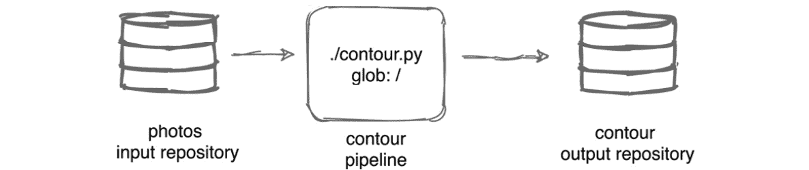
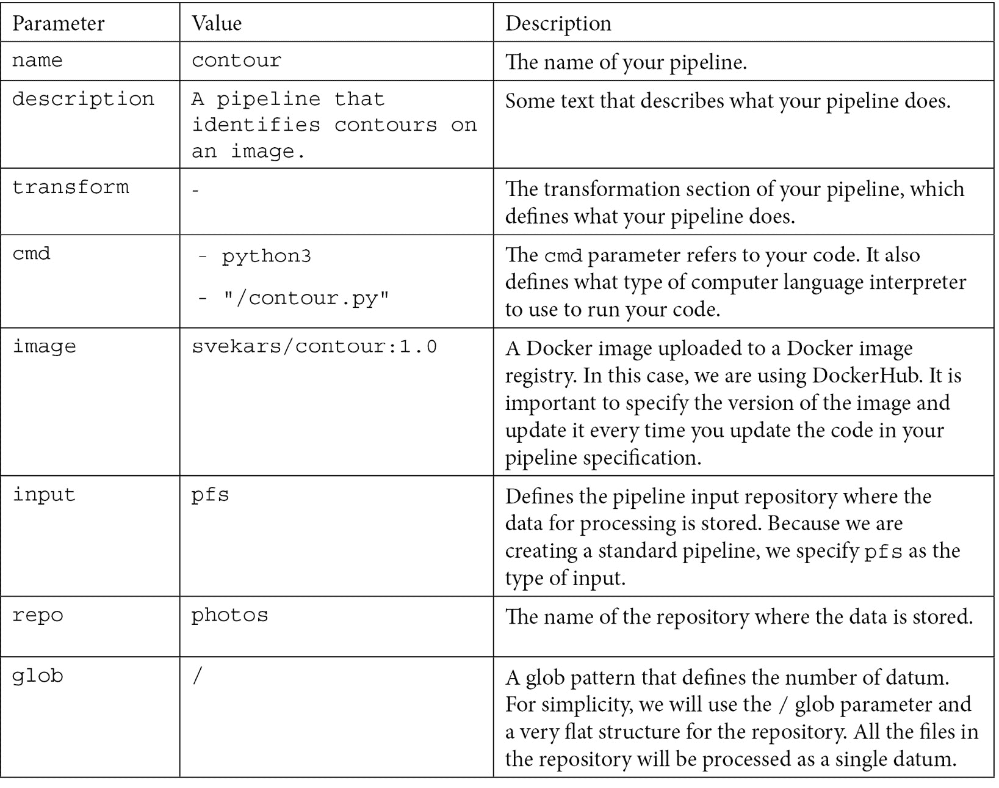
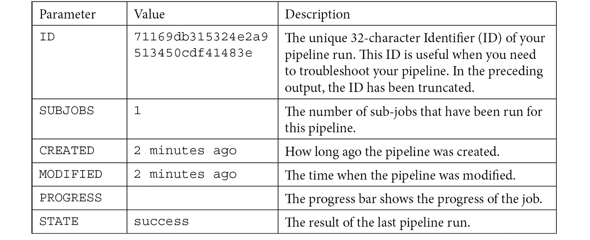
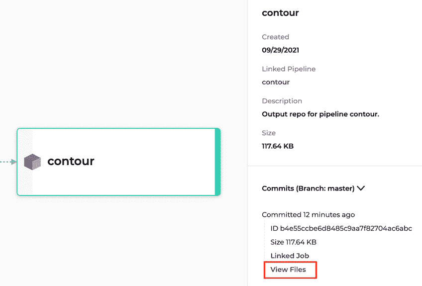
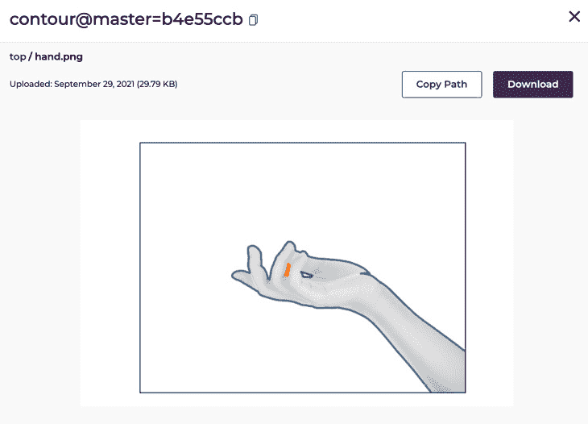
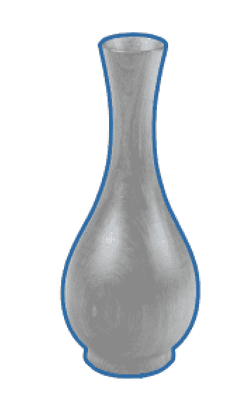
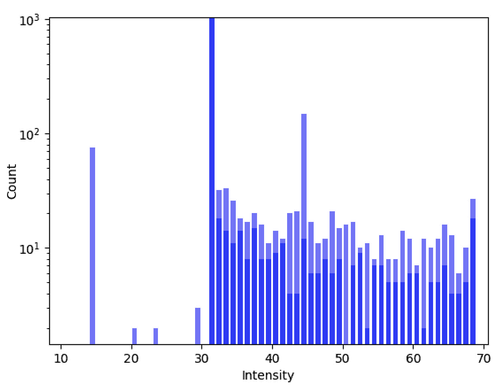
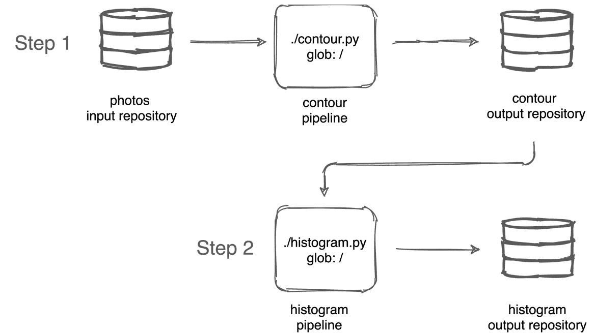
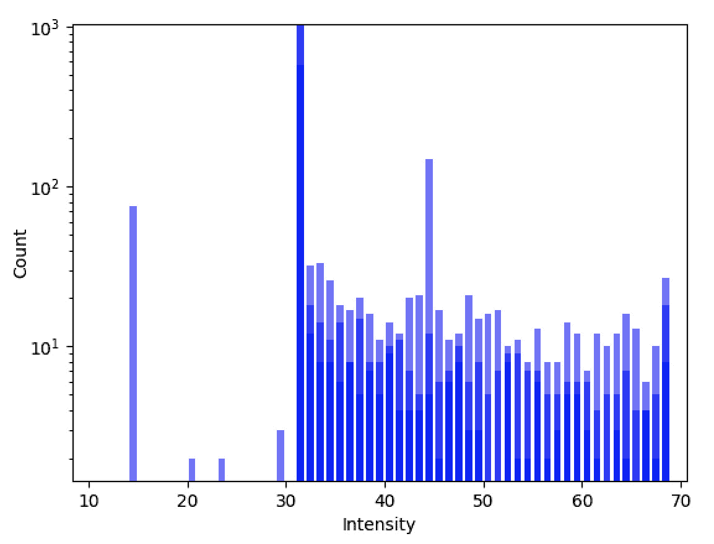

# 第六章：*第六章*：创建你的第一个管道

在*第三章*中，我们学习了 Pachyderm 管道规范以及你可以在其中配置的参数。管道规范是管道中最关键的配置部分，与代码一起使用。在本章中，我们将学习如何创建一个执行图像处理的 Pachyderm 管道。我们将详细介绍这一过程的所有步骤，包括创建 Pachyderm 仓库、创建管道、查看计算结果，并在原有管道中添加一个额外步骤。

本章将涵盖以下主题：

+   管道概述

+   创建仓库

+   创建管道规范

+   查看管道结果

+   添加另一个管道步骤

# 技术要求

本章要求你具备以下组件，并确保它们已安装和配置。

对于本地 macOS 安装，你需要以下内容：

+   macOS Mojave、Catalina、Big Sur 或更高版本

+   Docker Desktop for Mac 10.14

+   `minikube` v1.19.0 或更高版本

+   `pachctl` 2.0.x 或更高版本

+   Pachyderm 2.0.x 或更高版本

对于本地 Windows 安装，你需要以下内容：

+   Windows Pro 64 位 v10 或更高版本

+   **Windows Subsystem for Linux**（**WSL**）2 或更高版本

+   Microsoft Powershell v6.2.1 或更高版本

+   Hyper-V

+   `minikube` v1.19.0 或更高版本

+   `kubectl` v1.18 或更高版本

+   `pachctl` 2.0.x 或更高版本

+   Pachyderm 2.0.x 或更高版本

对于**Amazon Elastic Kubernetes Service**（**Amazon EKS**）安装，你需要以下内容：

+   `kubectl` v.18 或更高版本

+   `eksctl`

+   `aws-iam-authenticator`

+   `pachctl` 2.0.x 或更高版本

+   Pachyderm 2.0.x 或更高版本

对于 Microsoft Azure 云安装，你需要以下内容：

+   `kubectl` v.18 或更高版本

+   Azure CLI

+   `pachctl` 2.0.x 或更高版本

+   Pachyderm 2.0.x 或更高版本

+   `jq` 1.5 或更高版本

对于**Google Kubernetes Engine**（**GKE**）云安装，你需要以下内容：

+   Google Cloud SDK v124.0.0 或更高版本

+   `kubectl` v.18 或更高版本

+   `pachctl` 2.0.x 或更高版本

+   Pachyderm 2.0.x 或更高版本

你不需要任何特殊硬件来运行本章中的管道。如果你在本地运行 Pachyderm 集群，任何现代笔记本电脑都应支持本章中的所有操作。如果你在云平台上运行 Pachyderm，你需要一个**持久卷**（**PV**）。更多细节请参见*第五章*，*在云平台上安装 Pachyderm*。

本章中描述的所有脚本和数据可以在[`github.com/PacktPublishing/Reproducible-Data-Science-with-Pachyderm/tree/main/Chapter06-Creating-Your-First-Pipeline`](https://github.com/PacktPublishing/Reproducible-Data-Science-with-Pachyderm/tree/main/Chapter06-Creating-Your-First-Pipeline)获取。

现在我们已经回顾了本章的技术要求，接下来让我们更深入地了解我们的管道。

# 管道概述

在*第四章*《*本地安装 Pachyderm*》和*第五章*《*在云平台上安装 Pachyderm*》中，我们学习了如何在本地或云平台上部署 Pachyderm。到现在为止，你应该已经在自己的电脑或云平台上运行了某个版本的 Pachyderm。现在，让我们创建我们的第一个管道。

Pachyderm 管道是一种技术，它处理来自 Pachyderm 输入仓库或多个输入仓库的数据，并将其上传到 Pachyderm 输出仓库。每次新的数据上传到输入仓库时，管道会自动处理这些数据。每次新的数据进入仓库时，它会被记录为一个提交哈希，可以稍后访问、重新运行或分析。因此，管道是 Pachyderm 生态系统中的一个重要组件，确保数据科学工作负载的可复现性。

为了帮助你快速入门，我们准备了一个简单的图像处理示例，它将在图像上绘制轮廓。轮廓是表示物体形状的外框。这是一项常用于图像处理管道的有用技术。

图像处理是一项广泛使用的技术，它可以增强图像质量、将图像转换为另一张图像、提取图像的各种信息等。通过机器学习，你可以建立管道来确定图像中的物体、生成图像的直方图等。

有许多开源库可用于高级图像处理，其中最著名的是**OpenCV**和**scikit-image**。这两个库广泛应用于机器学习专家的各种图像处理任务。

在这个示例中，我们将使用 scikit-image。scikit-image 或`skimage`是一个开源图像处理库，允许你运行各种图像处理算法来分析和转换图像。scikit-image 是专门为 Python 编程语言设计的。

在这个示例中，我们将使用 scikit-image 和其他几个开源组件，包括以下内容：

+   **NumPy**：一个开源的 Python 库，帮助你处理数组。当你需要分析或分割图像时，图像必须先转换为数组才能进行处理。

+   **Matplotlib**：一个扩展 NumPy 的库，帮助你绘制图像并创建数据可视化。

我们将创建一个管道，使用来自`photos`仓库的数据，运行一个`contour.py`脚本来处理`photos`仓库中的图像，并将结果上传到`contour`输出仓库。

以下图表解释了我们的管道：



图 6.1 – 轮廓管道

以下代码解释了`contour.py`脚本：

```py
import numpy as np
import matplotlib.pyplot as plt
import os
from skimage.io import imread, imsave
from skimage import measure
import logging
logging.basicConfig(level=logging.INFO)
def create_contours(photo):
     image = imread(photo, as_gray=True)
     t = os.path.split(photo)[1]
     c = measure.find_contours(image, 0.9)
     fig, ax = plt.subplots()
     ax.imshow(image, vmin=-1, vmax=1, cmap='gray')
     for contour in c:
         ax.plot(contour[:, 1], contour[:, 0], linewidth=2)
     ax.axis('image')
     ax.set_xticks([])
     ax.set_yticks([])
     plt.savefig(os.path.join("/pfs/out", os.path.splitext(t)[0]+'.png'))
for dirpath, dirnames, filenames in os.walk("/pfs/photos"):
     for f in filenames:
         create_contours(os.path.join(dirpath, f))
```

上面的脚本包含一个名为`create_contours`的函数。该函数执行以下操作：

1.  首先，它从`pfs/photos`仓库中读取图像文件，并将其转换为灰度图像。这是因为需要将彩色图像（RGB）转换为二维的 NumPy 数组。

1.  然后，它使用`measure.find_contours` API 方法，这个方法来自`skimage.measure.find_contours`模块，用于在值为 0.9 的位置找到我们将图像转换成的二维数组的轮廓。这个值代表了明暗之间的位置。通常，最好使用一个中间值，但在这个例子中，0.9 得到了最佳结果。

1.  然后，它定义了子图以可视化我们的图像，并将其保存在`pfs/out`目录中，实际上，这将是`pfs/out/contour`输出仓库。

1.  脚本的最后一部分告诉程序将`create_contours`函数应用于`pfs/photos`仓库中的所有文件。

这个脚本内置在一个 Docker 镜像中，我们将使用它来运行我们的管道。这个 Docker 镜像托管在 Docker Hub 上。

我们将使用来自 freepik.com 的以下图像进行处理。第一张图像是棕色花瓶的图像：


图 6.2 – 棕色花瓶

第二张图像是手的图像：


图 6.3 – 手

最后，第三张图像是风景的图像：


图 6.4 – 风景

如你所见，这些是一些简单的图像，找出轮廓应该很容易。你可以尝试将这个管道应用于更复杂的图像，看看你能得到什么结果。一般来说，图像中元素之间的对比度越大，算法能找到的轮廓就越精确。

现在我们已经理解了正在处理的示例，让我们继续创建一个仓库吧。

# 创建一个仓库

创建管道的第一步是创建一个 Pachyderm 仓库并将一些数据放入其中。正如你可能还记得的，*第二章*《Pachyderm 基础》，Pachyderm 仓库是 Pachyderm 集群中的一个位置，用于存储数据。我们将创建一个输入仓库，管道将在第一次运行时自动创建一个输出仓库。

要创建一个输入仓库，请执行以下步骤：

1.  登录到你的终端。

1.  验证 Pachyderm 是否已启动并运行：

    ```py
    % pachctl version
    ```

你应该看到类似以下的输出：

```py
COMPONENT           VERSION
pachctl             2.0.0
pachd               2.0.0
```

`pachd`组件必须列出一个版本。

1.  创建一个名为`photos`的 Pachyderm 输入仓库：

    ```py
    % pachctl create repo photos
    ```

不会返回任何输出。

1.  验证`photos`仓库是否已经创建：

    ```py
    % pachctl list repo
    ```

你应该看到以下输出：

```py
NAME   CREATED        SIZE (MASTER) ACCESS LEVEL
photos 11 seconds ago ≤ 0B          [repoOwner]
```

在这里，你可以看到`photos`仓库已经创建，并且是空的。尽管主分支的大小被计算在内，但此时该仓库中没有分支。Pachyderm 会在你放入文件时自动创建指定的分支。

1.  将一些图片放入`photos`仓库中。我们需要将文件放入`photos`仓库的根目录中。为此，您需要使用`-r`（递归）标志，并指定包含文件的计算机目录路径。例如，如果您将文件下载到计算机上的数据文件夹中，则需要运行以下命令：

    ```py
    % pachctl put file -r photos@master:/ -f data
    ```

以下是一些示例输出：

```py
data/brown_vase.png 25.82 KB / 25.82 KB [=====] 0s 0.00 b/s
data/hand.png 33.21 KB / 33.21 KB [======] 0s 0.00 b/s
data/landscape.png 54.01 KB / 54.01 KB [=========] 0s
```

Pachyderm 会自动创建指定的分支。在此示例中，Pachyderm 会创建`master`分支。您可以随意命名分支，但为了简便起见，我们称之为`master`。本节中的所有命令都假设使用`master`分支。

1.  验证文件是否已添加到仓库：

    ```py
    % pachctl list file photos@master
    ```

以下是一些示例输出：

```py
NAME           TYPE SIZE
/brown_vase.png file 25.21KiB
/hand.png       file 32.43KiB
/landscape.png  file 52.74KiB 
```

1.  另外，您可以通过对每个图像运行`pachctl put file`命令，将每个文件逐一放入。例如，要放置`landscape.jpg`文件，请将计算机上的目录更改为`data`并使用以下命令：

    ```py
    % pachctl put file photos@master -f landscape.jpg
    ```

以下是一些示例输出：

```py
data/landscape.jpg 54.01KB / 54.01 KB [=] 0s 0.00 b/s/ 
```

对所有图像文件重复此命令。

重要提示

确保输出中的`TYPE`参数显示为`file`而不是`dir`。Pachyderm 不区分目录和文件，您需要使用`-f`将文件放入目录或仓库根目录。如果您的任何文件列出为`dir`，则需要通过运行`pachctl delete file photos@master:<path>`删除它们并重新开始。如果您将文件放在目录中，管道将无法按预期工作。

现在我们已经创建了一个仓库，让我们创建我们的管道规范。

# 创建管道规范

在*创建仓库*部分中，我们创建了一个名为`photos`的仓库并放入了一些测试文件。此示例的管道规范必须引用以下元素：

+   一个包含待处理数据的输入仓库

+   需要在您的数据上运行的计算机程序或脚本

+   指定数据粒度的通配符模式

+   包含您的代码的具有内建依赖项的 Docker 镜像

我们已经为您创建了一个管道规范，您可以用它来创建管道。以下是管道规范文件中的内容，格式为**YAML Ain't Markup Language**（**YAML**）：

```py
---
 pipeline:
   name: contour
 description: A pipeline that identifies contours on an image.
 transform:
   cmd:
   - python3
   - "/contour.py"
   image: svekars/contour-histogram:1.0
input:
   pfs:
     repo: photos
     glob: "/"
```

让我们更详细地查看管道规范。以下是管道中的参数：



图 6.5 – Contour 管道参数

此管道规范不包括任何优化或额外参数。它是一个最小管道，将执行我们示例所需的计算。

要创建管道，请执行以下步骤：

1.  登录到您的终端。

1.  通过运行以下命令创建`contour`管道：

    ```py
    % pachctl create pipeline -f contour.yaml
    ```

不会返回任何输出。

1.  验证管道是否已创建：

    ```py
    % pachctl list pipeline
    ```

以下是系统输出：

```py
NAME    VERSION INPUT    CREATED       STATE / LAST JOB   DESC
contour 1       photos:/* 5 seconds ago running / - A pipeline that identifies contours on an image.
```

一旦你创建管道，它将把状态设置为 `running` 并尝试处理输入仓库中的数据。你可能还会看到 `LAST JOB` 的状态为 starting 或 running。

重要提示

在前述输出中的另一个重要内容是管道版本。我们的管道版本是 `1`。如果你更改了管道 YAML 文件中的内容并进行了更新，版本号会更新为下一个数字。

1.  查看已经为你的管道启动的作业：

    ```py
    pachctl list job
    ```

以下是系统输出：

```py
ID       SUBJOBS PROGRESS CREATED       MODIFIED
71169d…  1                      2 minutes ago 2 minutes ago
```

`pachctl list job` 命令的输出给出了以下信息：



图 6.6 – 管道输出解释

现在我们的管道已成功运行，让我们在输出仓库中查看结果。

# 查看管道结果

一旦你的管道运行完毕，你可以在输出仓库中查看结果。我们将同时查看命令行和 Pachyderm 仪表板中的输出结果，以便进行查看。

如果你使用的是本地的 Pachyderm 部署并且使用了 minikube，你需要启用端口转发才能访问 Pachyderm 用户界面。

要在终端中查看管道结果，请执行以下步骤：

1.  登录到你的终端。

1.  验证名为 `contour` 的输出仓库是否已创建：

    ```py
    % pachctl list repo
    ```

以下是系统输出：

```py
% pachctl list repo
NAME    CREATED            SIZE (MASTER) ACCESS LEVEL
contour About a minute ago ≤ 117.6KiB    [repoOwner]  Output repo for pipeline contour.
photos  5 minutes ago      ≤ 110.4KiB    [repoOwner] B
```

如你所见，`contour` 仓库已经创建，并且其中包含 117.6 KiB 的数据。如果你是在本地运行 Pachyderm，你还可以通过运行以下命令来预览这些文件的内容。

1.  如果你使用的是 macOS，请运行以下命令列出输出仓库中的文件：

    ```py
    % pachctl list file contour@master
    ```

以下是系统输出：

```py
NAME             TYPE SIZE
/brown_vase.png file 23.78KiB
/hand.png       file 29.79KiB
/landscape.png  file 64.08Kib 
```

1.  现在，将 `open` 命令与 `pachctl get file` 命令连接，打开 Mac 上默认的预览应用程序中显示的一张图片。例如，要预览 `hand.png`，请运行以下命令：

    ```py
    % pachctl get file contour@master:hand.png | open -f -a Preview.app
    ```

你应该会看到以下输出：


图 6.7 – 手动处理

现在，让我们在用户界面中查看处理后的结果。如果你是在云服务提供商上运行 Pachyderm，只需在浏览器中输入 Pachyderm 仪表板运行的 IP 地址。如果你是在 Pachyderm Hub 上运行 Pachyderm，请按照 Pachyderm Hub 中的指示访问控制台。如果你是在本地的 minikube 中运行 Pachyderm，请继续执行剩下的步骤以启用端口转发。

重要提示

除非你在 Pachyderm Hub 中运行实验，否则 Pachyderm 控制台仅在你已部署的情况下可用。你需要拥有试用版或企业版许可证，才能在本地或云中部署 Pachyderm 控制台。

1.  打开一个独立的终端窗口。

1.  通过运行以下命令为本地 Pachyderm 部署启用端口转发：

    ```py
    % pachctl port-forward
    ```

你应该会看到以下输出：

```py
Forwarding the pachd (Pachyderm daemon) port...
listening on port 30650
Forwarding the pachd (Pachyderm daemon) port...
listening on port 30650
Forwarding the OIDC callback port...
listening on port 30657
Forwarding the s3gateway port...
listening on port 30600
Forwarding the identity service port...
listening on port 30658
Forwarding the dash service port...
...
```

如果你使用的是默认设置，Pachyderm 仪表板应在 http://localhost:30080 加载。

1.  将仪表板的 IP 地址粘贴到网页浏览器中。

1.  如果系统提示您登录，请按照屏幕上的指示进行操作。登录后，您应该会看到以下界面：


图 6.8 – Pachyderm 直接无环图（DAG）

这是一个为输入和输出仓库以及管道创建的**直接无环图**（**DAG**）。

1.  点击轮廓输出仓库（屏幕上的最后一个），然后点击**查看文件**：



图 6.9 – 输出仓库信息

文件列表将会显示出来。

1.  点击`hand.png`：



图 6.10 – 输出文件

您可以通过 UI 预览所有结果文件。同样，这些文件可以由另一个管道消费，或者通过 S3 网关提供给 Pachyderm 之外的服务，或者输出仓库可以被挂载并在本地磁盘上访问。接下来，我们来看看其他图像应该是什么样子。

您应该看到景观图像已发生变化，如下所示：


图 6.11 – 处理后的景观图像

`brown_vase.png`图像应该如下所示：



图 6.12 – 处理后的花瓶图像

在本节中，我们学习了如何查看管道的结果。现在，让我们添加另一个管道步骤。

# 添加另一个管道步骤

Pachyderm 管道可以连接成多步骤工作流。对于每个步骤，您需要有单独的管道规范和一个 Docker 镜像（如果使用了的话）。在本节中，我们将为我们的图像处理工作流添加另一个步骤。我们将使用`skimage.exposure.histogram`模块为我们在`contour`输出仓库中的所有图像创建直方图。

### 示例概述

直方图是数据的可视化表示，提供了有关图像的信息，如像素的数量、强度以及其他信息。由于我们将图像表示为数值数据，因此可以为我们在工作流第一步——轮廓管道中处理的每个图像创建一个直方图。在工作流的这一步中，我们将为每个已存入`contour`输出仓库的图像创建直方图，并将它们以 PNG 格式保存到`histogram`输出仓库中。

这是为`hand.png`图像生成的直方图示例：



图 6.13 – 灰度图像直方图

**y 轴**表示像素的数量，而**x 轴**表示像素的强度。

这是包含轮廓和直方图管道的新两步工作流图：



图 6.14 – 轮廓和直方图工作流

`histogram`管道将从`contour`仓库中获取文件，为它们创建直方图，并将它们输出到`histogram`仓库。

### 直方图创建脚本概述

在此管道步骤中，我们将使用`histogram.yaml`，它将为我们创建一个管道。该管道将运行`histogram.py`脚本。

让我们回顾一下 `histogram.py` 脚本，它从 `contour` 仓库中的文件创建直方图：

```py
from skimage import io
import matplotlib.pyplot as plt
import numpy as np
import os
def create_histogram(photo):
    image = io.imread(photo)
    t = os.path.split(photo)[1]
    plt.hist(image.ravel(), bins=np.arange(10, 70),  color='blue', alpha=0.5, rwidth=0.7)
    plt.yscale('log')
    plt.margins(x=0.03, y=-0.05)
    plt.xlabel('Intensity')
    plt.ylabel('Count')
    plt.savefig(os.path.join("/pfs/out", os.path.splitext(t)[0]+'.png'))
for dirpath, dirnames, filenames in os.walk("/pfs/contour"):
    for f in filenames:
        create_histogram(os.path.join(dirpath, f))
```

该脚本导入了以下库：

+   `skimage.io`：`io` 模块来自 scikit-image 库，它使我们能够在 Python 文件中进行读写操作。我们需要这个模块从 `contour` 仓库中读取文件。

+   `matploit.pyplot`：这个 Matplotlib 接口使我们能够绘制图像。我们使用它来创建直方图，为图表的 x 轴和 y 轴添加标签等等。

+   `numpy`：我们需要 NumPy 将图像表示为数组，并保持所需范围内的柱状图数量。

+   `os`：Python 标准库中的 `os` 模块使我们能够进行文件的读写操作。我们需要这个模块从 Pachyderm 的 `contour` 仓库中读取图像，并将图像保存到正确的输出仓库中。

让我们更仔细地看一下脚本的功能。`create_histogram` 函数从 `contour` 仓库中读取图像文件。然后，使用 `matploit.pyplot.hist` (`plt.hist`) 函数，脚本使用以下参数创建一个直方图：

+   `numpy.ravel` 函数将图像从二维数组转换为一维数组，这对于绘制直方图是必要的。

+   `bins` 参数定义了直方图中垂直条形的形状和分布。为了在图表中均匀分布它们，我们使用 `np.arange` 函数定义了一个范围。

+   `color='blue'` 参数定义了直方图柱状图的颜色。

+   `alpha=0.5` 参数定义了透明度的级别。

+   `rwidth=0.7` 参数定义了每个柱状图的宽度。

+   `plt.yscale('log')` 参数定义了 y 轴的对数尺度。我们需要这个参数来缩小 y 轴的尺度，以便更好地进行数据可视化。

+   `plt.margins(x=0.03, y=-0.05)` 参数定义了直方图与图表起始位置之间的空白区域。

+   `plt.xlabel('Intensity')` 和 `plt.ylabel('Count')` 参数定义了 x 轴和 y 轴的标签。

+   `plt.savefig` 函数定义了直方图的保存位置。在我们的例子中，我们将把它保存在 `pfs/out` 目录下，Pachyderm 会自动在 `pfs/out/histogram` 路径下创建一个直方图仓库。

    重要说明

    在你的脚本中，你不需要添加仓库的路径，只需添加 `pfs/out` 目录的路径。

### 流水线规范概述。

`histogram.yaml` 流水线规范创建了直方图流水线。

下面是我们的流水线规范的样子：

```py
---
 pipeline:
   name: histogram
 description: A pipeline that creates histograms for images stored in the contour repository.
 transform:
   cmd:
   - python3
   - "/histogram.py"
   image: svekars/contour-histogram:1.0
 input:
   pfs:
     repo: contour
     glob: "/"
```

这个流水线的功能如下：

1.  将存储在 `contour` 仓库中的文件上传为一个单独的数据项。

1.  从 Docker Hub 拉取存储的 Docker 镜像 `svekars/histogram:1.0`。

1.  对从 `contour` 仓库下载的所有文件运行 `histogram.py` 脚本。

1.  将转换结果上传到 `histogram` 输出仓库。

现在我们已经审查了流水线的内容，让我们继续创建它。

### 创建流水线。

下一步是创建直方图流水线，该流水线将为`photos`仓库中的每个图像创建一个直方图。

让我们通过使用`histogram.yaml`文件创建工作流的第二个步骤：

1.  登录到终端。

1.  验证 Pachyderm 是否已启动并运行：

    ```py
    % pachctl version
    ```

以下是系统输出：

```py
COMPONENT           VERSION
pachctl             2.0.0
pachd               2.0.0
```

如果`pachd`没有响应，您可能需要在本地安装中运行`minikube stop`和`minikube start`，以便能够继续使用它。如果您在云环境中，您需要检查您的连接。如果您在 Pachyderm Hub 中运行 Pachyderm，请检查您是否已经从控制台进行身份验证，并按照屏幕上的说明操作。

1.  创建`histogram`流水线：

    ```py
    % pachctl create pipeline -f histogram.yaml
    ```

不会返回系统输出。

1.  验证流水线是否已创建：

    ```py
    % pachctl list pipeline
    ```

以下是系统输出：

```py
NAME      VERSION INPUT     CREATED        STATE / LAST JOB  DESCRIPTION
contour   1       photos:/* 12 minutes ago running / success A pipeline that identifies contours on an image.
histogram 1       contour:/ 12 seconds ago running / success A pipeline that creates histograms for images stored in the contour repository.
```

根据前面的输出，直方图流水线已创建，并且当前正在运行代码。

1.  获取仓库列表：

    ```py
    % pachctl list repo
    ```

以下是系统输出：

```py
NAME      CREATED            SIZE (MASTER) DESCRIPTION
histogram 23 seconds ago ≤ 27.48KiB    [repoOwner]  Output repo for pipeline histogram.
contour   24 minutes ago ≤ 117.6KiB    [repoOwner]  Output repo for pipeline contour.
photos    29 minutes ago ≤ 110.4KiB    [repoOwner]   
```

`histogram`输出仓库已创建，并包含 27.48 KiB 的数据。这些是我们的直方图文件。

1.  列出`histogram`仓库中的文件：

    ```py
    % pachctl list file histogram@master
    ```

以下是系统输出：

```py
NAME           TYPE     SIZE
/hand.png      file 9.361KiB
/landscape.png file 9.588KiB
/brown_vase.png  file 8.526KiB
```

到此，我们的直方图可视化已经被添加到仓库中。

1.  查看直方图文件。例如，如果您在 Mac 上查看`landscape.png`直方图文件，请运行以下命令：

    ```py
    pachctl get file histogram@master:landscape.png | open -f -a Preview.app
    ```

这是结果直方图：



图 6.15 – 风景图像的直方图

您可以通过类似的方式或通过前面提到的 Pachyderm 控制面板预览其他文件。

1.  进入控制台，查看新添加的流水线的 DAG：


图 6.16 – 更新后的 DAG

如您所见，您现在有一个名为`histogram`的新流水线，并且在 DAG 中新增了一个同名的输出仓库。

现在我们已经创建了第一个流水线，让我们清理环境，以便有一个干净的集群来处理下章中的任务。

## 清理

一旦实验完成，您可能想清理集群，以便开始下一个实验时有一个全新的安装。要清理环境，请执行以下步骤：

1.  删除所有流水线和仓库：

    ```py
    pachctl delete pipeline –all && pachctl delete repo --all
    ```

1.  验证集群中是否存在仓库和流水线：

    ```py
    pachctl list repo && pachctl list pipeline
    ```

您应该看到以下输出：

```py
NAME CREATED SIZE (MASTER) DESCRIPTION
NAME VERSION INPUT CREATED STATE / LAST JOB DESCRIPTION
```

至此，您已成功清理了集群。

# 总结

在本章中，您成功创建了第一个 Pachyderm 仓库、流水线，甚至通过添加另一个流水线步骤进行了扩展。我们使用了 scikit-image、Matplotlib 和 NumPy 来创建存储在 Pachyderm 仓库中的图像的轮廓，并为这些图像创建了直方图。这是理解 Pachyderm 如何工作的第一步。在 Pachyderm 中，您将经常使用流水线。正如您已经注意到的，您可以在流水线中放入任何代码。尽管本书中的大多数示例将使用 Python，您可以使用任何您选择的编程语言。

在下一章中，我们将深入学习 Pachyderm 的功能，如何将数据导入 Pachyderm 并将其导出到外部系统，如何修改管道代码，如何调整各种参数以及其他重要的 Pachyderm 操作。

# 进一步阅读

有关本章涵盖的主题的更多信息，请查看以下资源：

+   Docker Hub 文档: [`docs.docker.com/docker-hub/`](https://docs.docker.com/docker-hub/)

+   Matplotlib 文档: [`matplotlib.org/`](https://matplotlib.org/)

+   NumPy 文档: [`numpy.org/doc/stable/`](https://numpy.org/doc/stable/)

+   Scikit-image 文档: [`scikit-image.org`](https://scikit-image.org)

+   风景图片: [`www.freepik.com/free-vector/beautiful-gradient-spring-landscape_6969720.htm`](https://www.freepik.com/free-vector/beautiful-gradient-spring-landscape_6969720.htm)

+   棕色花瓶图片: [`www.freepik.com/free-photo/narrow-neck-vase_921733.htm`](https://www.freepik.com/free-photo/narrow-neck-vase_921733.htm)

+   手部图片: [`www.freepik.com/free-photo/hand-holding-something-with-white-background_978615.htm`](https://www.freepik.com/free-photo/hand-holding-something-with-white-background_978615.htm)
