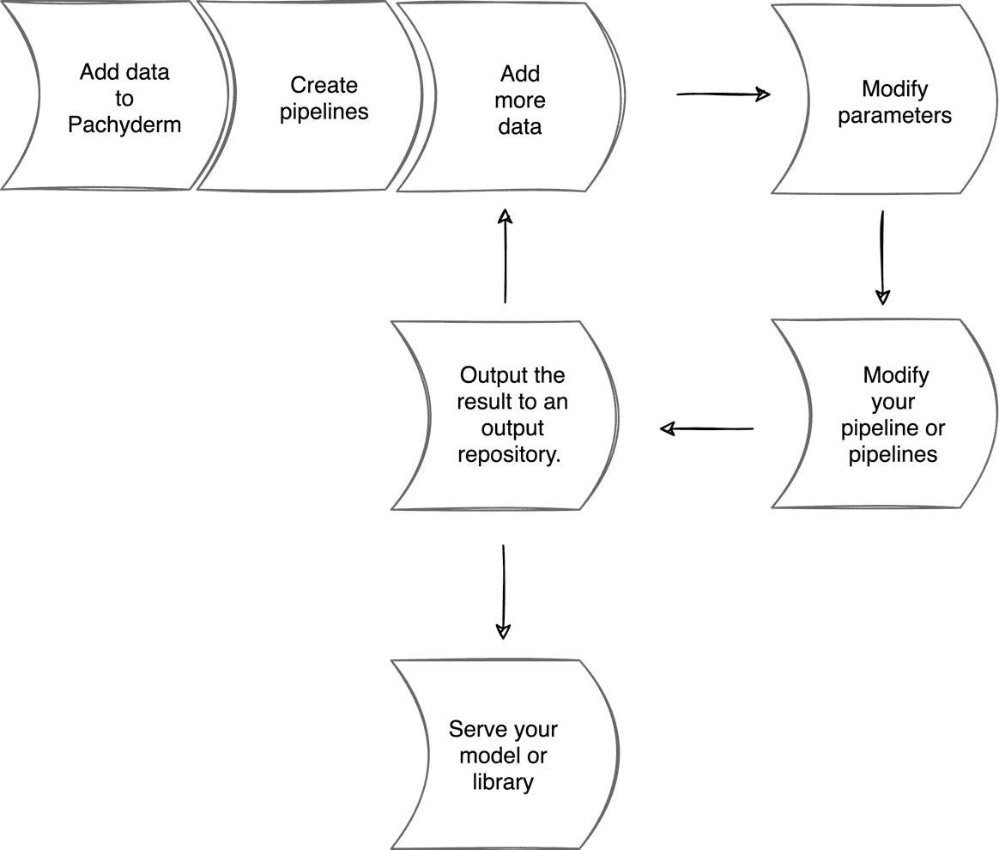
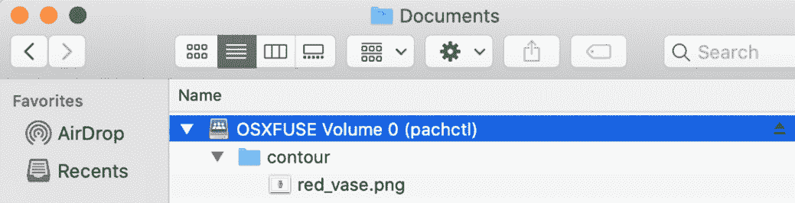
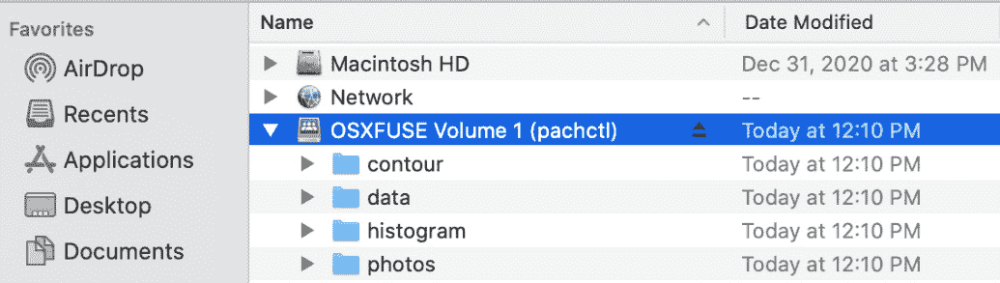
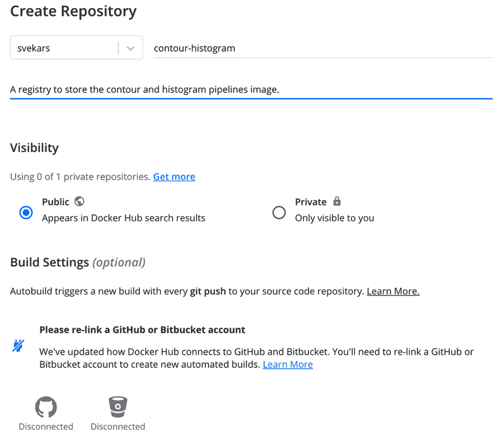
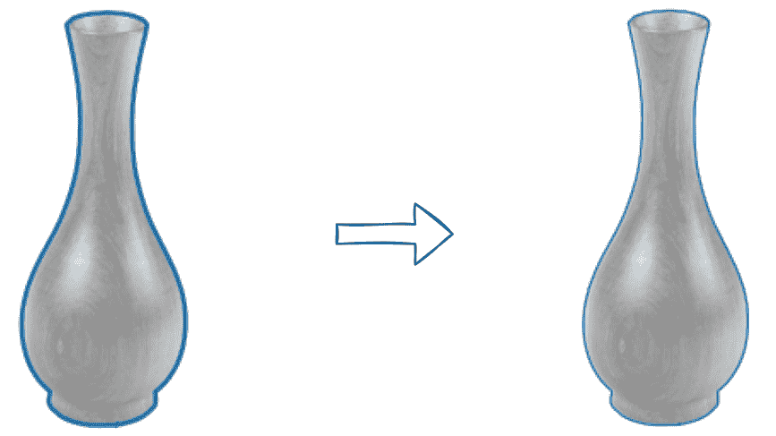

# 第七章：*第七章*：Pachyderm 操作

在 *第六章*，*创建第一个管道* 中，我们创建了第一个管道，并学习了如何创建 Pachyderm 仓库、将数据放入仓库、创建并运行管道，以及查看管道的结果。我们现在知道如何创建标准的 Pachyderm 管道规范，并将脚本包含在其中，以便它们可以在输入仓库中的数据上运行。

在本章中，我们将回顾所有不同的将数据放入 Pachyderm 内部并导出到外部系统的方法。我们将学习如何更新在管道内部运行的代码，以及更新管道规范的过程。我们将学习如何构建一个 Docker 容器并在上传到注册表之前进行本地测试。

我们还将探讨一些最常见的故障排除步骤，这些步骤是在管道失败时应执行的。

本章将涵盖以下主题：

+   回顾标准的 Pachyderm 工作流程

+   执行数据操作

+   执行管道操作

+   执行维护操作

# 技术要求

您应该已经安装了以下组件。

对于本地 macOS 安装，您需要以下组件：

+   macOS Mojave、Catalina、Big Sur 或更高版本

+   Docker Desktop for Mac 10.14

+   `minikube` v1.9.0 或更高版本

+   `pachctl` 2.0.x 或更高版本

+   Pachyderm 2.0.x 或更高版本

对于本地 Windows 安装，您需要以下组件：

+   Windows Pro 64 位 v10 或更高版本

+   **Windows Subsystem for Linux** (**WSL**) 2 或更高版本

+   Microsoft PowerShell v6.2.1 或更高版本

+   Hyper-V

+   `minikube` v1.9.0 或更高版本

+   `kubectl` v1.18 或更高版本

+   `pachctl` 2.0.x 或更高版本

+   Pachyderm 2.0.x 或更高版本

对于 **Amazon Elastic Kubernetes Service** (**Amazon EKS**) 安装，您需要以下组件：

+   `kubectl` v.18 或更高版本

+   `eksctl`

+   `aws-iam-authenticator`

+   `pachctl` 2.0.x 或更高版本

+   Pachyderm 2.0.x 或更高版本

对于 Microsoft **Azure Kubernetes Service** (**AKS**) 云安装，您需要以下组件：

+   `kubectl` v.18 或更高版本

+   Azure CLI

+   `pachctl` 2.0.x 或更高版本

+   Pachyderm 2.0.x 或更高版本

+   `jq` 1.5 或更高版本

对于 **Google Kubernetes Engine** (**GKE**) 云安装，您需要以下组件：

+   Google Cloud SDK v124.0.0 或更高版本

+   `kubectl` v.18 或更高版本

+   `pachctl` 2.0.x 或更高版本

+   Pachyderm 2.0.x 或更高版本

除此之外，您还需要以下组件：

+   Docker Hub 账户，用于上传镜像

## 下载源文件

本章的所有源文件都位于此仓库：[`github.com/PacktPublishing/Reproducible-Data-Science-with-Pachyderm/tree/main/Chapter07-Pachyderm-Operations`](https://github.com/PacktPublishing/Reproducible-Data-Science-with-Pachyderm/tree/main/Chapter07-Pachyderm-Operations)。

# 回顾标准的 Pachyderm 工作流程

正如您在创建管道时可能已经注意到的那样，在使用 Pachyderm 时，您需要遵循特定的工作流。根据您的自动化工具、团队流程和所使用的软件，它可能会有所不同，但通常可以总结为以下常见步骤：

1.  将您的数据添加到 Pachyderm。

1.  创建管道或管道集。

1.  添加更多数据。

1.  修改参数。

1.  修改您的管道或管道集。

1.  将结果输出到输出仓库。

1.  根据需要或持续地重复*步骤 3-6*。

1.  提供您的模型或打包您的库并使其可用。

以下图示演示了这一过程：



图 7.1 – Pachyderm 工作流

根据您将代码存储在 Docker 镜像中、管道本身中，还是使用包含 Python 代码的构建管道，您每次更改代码时都需要重新构建 Docker 镜像。对于仅使用 Python 管道的轻量级工作流，它使用基础 Docker 镜像和一个特殊的构建管道。您可以在 Pachyderm 官方文档中阅读有关此方法的信息：[`docs.pachyderm.com`](https://docs.pachyderm.com)。对于其他语言，您可能需要定期构建 Docker 镜像。

现在我们知道了典型的工作流，让我们深入了解数据操作，学习所有将数据上传到 Pachyderm 的方法。

# 执行数据操作。

正如您可能已经注意到的，要开始使用 Pachyderm，您需要将数据放入其中。然后，数据会通过多个转换步骤进行处理。之后，您可以将数据和模型导出到外部源，以库、二进制文件、包、表格、仪表盘或任何其他格式进行进一步使用。在本节中，我们将回顾将数据上传和下载到 Pachyderm 以及从 Pachyderm 下载数据的方式，并介绍在此过程中可以应用的所有原生 Pachyderm 修改。

让我们从将数据上传到 Pachyderm 开始。

## 将数据上传到 Pachyderm。

您可以将将数据导入到 Pachyderm 的数据源分为以下几类：

+   从本地文件系统上传

+   从 URL 上传。

+   远程对象或块存储

+   一个流媒体或消息平台。

在本节中，您很可能主要使用本地文件系统将数据上传到 Pachyderm 仓库。这可以通过一个简单的 Pachyderm 命令完成：

1.  要从本地文件系统上传数据，您可以使用以下命令：

    ```py
    pachctl put file -f <filename> repo@branch
    ```

仓库必须存在。

1.  同样，要上传存储在远程位置的数据，您可以使用相同的命令，并指定正确的 URL：

    ```py
    pachctl put file -f https://mylink repo@branch
    ```

1.  对存储在对象存储中的文件同样适用。例如，如果您使用 Google Cloud Platform 上的对象存储，您可以使用以下命令：

    ```py
    pachctl put file -f gs://my-bucket repo@branch
    ```

之前的命令将文件放置在仓库的根目录中，但您也可以通过指定路径，将它们放入任何子目录中，如下所示：

```py
pachctl put file -f gs://my-bucket repo@branch:/path
```

1.  要上传整个目录，请使用 `-r` 标志：

    ```py
    pachctl put file -f directory -r repo@branch:/
    ```

运行`pachctl put file --help`查看更多示例。

1.  如果您希望从消息队列自动上传数据到 Pachyderm，您需要创建一种特殊类型的管道，称为**吐水口**（spout）。吐水口的主要功能是将来自消息平台的数据流连接到 Pachyderm，并将其放入指定的 Pachyderm 仓库。您还可以指定一些代码，根据首选模式将数据分类到不同的文件夹中。以下是一个吐水口管道的示例：

    ```py
    ---
    pipeline:
      name: my-spout
    spout: {}
    transform:
      cmd:
      - python
      - myspout.py
      image: registry/image:1.0
      env:
        HOST: my-messaging-queue
        TOPIC: mytopic
        PORT: '5672'
    ```

现在我们知道如何将数据放入 Pachyderm，让我们来看看 Pachyderm 中的数据来源和数据血统。

## 关于数据血统

如果您的系统依赖于数据，您需要确保用于决策过程的数据是准确且可信的。未能提供可追溯的数据足迹，可能会导致对组织的不利后果。随着越来越多基于数据的系统应用于我们生活的各个方面，基于错误数据做出的错误决策可能会对人们的生活造成毁灭性影响。

这就是为什么能够回溯到数据的源头并追踪数据的来源，是任何数据管理系统中的一个关键部分。能够追踪数据在多个转化步骤中发生的变化，直到其源头，这就是数据血统或数据来源。

通常，数据血统以**有向无环图**（**DAG**）的形式进行可视化。以下是 Pachyderm UI 中 DAG 表示的示例：


图 7.2 – Pachyderm DAG

每个容器代表一个输入或输出的仓库，或者一个管道。前面的示例非常简单。在有更多步骤的工作流中，DAG 可能看起来更为复杂。

为什么数据血统如此重要？以下是几个需要考虑的重要点：

+   随着隐私和公平等话题在各个层面被广泛讨论，为治理提供审计追踪正变得越来越必要。

+   随着数据科学的广泛产品化，实现一个能够回滚并修正数据和算法错误的系统变得至关重要。

+   数据的可信度是可以通过数据血统验证的另一个方面。

在*第一章*《可重复性问题》中，我们讨论了许多缺乏合适数据管理系统可能对人们生活产生毁灭性影响的例子，并且对企业造成损害。

现在我们已经讨论了数据血统的重要性，让我们来看一下如何在 Pachyderm 中探索数据血统。

## 探索数据血统

**数据来源**或**数据血统**是 Pachyderm 最重要的特性之一，它确保您的更改被保存并且可以追溯到管道的起点。

为了演示这个功能，我们将使用在*第六章*中使用的相同管道，*创建你的第一个管道*。如果你还没有下载这些文件，可以访问[`github.com/PacktPublishing/Reproducible-Data-Science-with-Pachyderm/tree/main/Chapter06-Creating-Your-First-Pipeline`](https://github.com/PacktPublishing/Reproducible-Data-Science-with-Pachyderm/tree/main/Chapter06-Creating-Your-First-Pipeline)并从那里下载：

1.  创建 Pachyderm 的`photos`仓库，将`brown_vase.png`文件放入其中，并通过运行以下命令创建轮廓和直方图管道：

    ```py
    pachctl create repo photos
    pachctl put file -f brown_vase.png photos@master
    pachctl create pipeline -f contour.yaml
    pachctl create pipeline -f histogram.yaml
    ```

你应该看到以下输出：

```py
brown_vase.png 25.82KB / 25.82 KB [================] 0s 0.00 b/s
```

1.  以下命令展示了如何查看你的数据和管道的谱系。首先，我们需要获取一个提交号，以便查看所需的数据变化：

    ```py
    pachctl list commit contour@master
    ```

输出应该类似于以下内容：

```py
REPO  BRANCH COMMIT  FINISHED SIZE ORIGIN DESCRIPTION
contour master 3d42... 22 seconds ago 23.78KiB AUTO
```

在这个示例中，我们只有一个输出提交，哈希值为`3d42e6385854478fbd2c9212c3afdab2`。

1.  然后，我们可以运行`inspect commit`命令来获取溯源信息：

    ```py
    pachctl inspect commit contour@3d42e6385854478fbd2c9212c3afdab2
    ```

前面的命令返回以下输出：

```py
{
  "commit": {
    "branch": {
      "repo": {
        "name": "contour",
        "type": "user"
      },
      "name": "master"
    },
    "id": "3d42e6385854478fbd2c9212c3afdab2"
  },
  "origin": {
    "kind": "AUTO"
  },
  "child_commits": [
    {
      "branch": {
        "repo": {
          "name": "contour",
          "type": "user"
        },
        "name": "master"
      },
      "id": "dfff764bd1dd41b9bf3613af86d6e45c"
    }
  ],
  "started": "2021-08-18T17:03:32.180913500Z",
  "finishing": "2021-08-18T17:03:39.172264700Z",
  "finished": "2021-08-18T17:03:39.225964100Z",
  "direct_provenance": [
    {
      "repo": {
        "name": "contour",
        "type": "spec"
      },
      "name": "master"
    },
    {
      "repo": {
        "name": "photos",
        "type": "user"
      },
      "name": "master"
    }
  ],
  "size_bytes_upper_bound": "24353",
  "details": {
    "size_bytes": "24353"
  }
}
```

该输出显示了提交是在`photos`仓库中创建的。它的类型为`AUTO`，因为它是在数据上传到`photos`仓库时自动生成的。你还可以看到它创建了一个子提交，哈希值为`dfff764bd1dd41b9bf3613af86d6e45c`，你可以对其运行相同的命令。该子提交将具有`ALIAS`类型，因为它与`photos`仓库中的原始提交相关联。随着新数据的到来，这个列表会逐渐增加。

1.  前面的命令告诉我们`contour`仓库中提交的前驱是什么。我们还可以使用`wait commit`命令结合提交 ID 来跟踪提交何时进入输出仓库。例如，如果我们想查看`3e16201310374944b48ed73f83be2be7`提交在下游管道中带来的变化，可以运行以下命令：

    ```py
    pachctl wait commitset photos@438428d0c3a145aa905c86c9fb1789ea
    ```

**溯源**是 Pachyderm 的一个强大功能。当你需要寻找审计轨迹以查明是什么导致管道产生偏差时，它特别有用。

现在我们已经学习了如何在 Pachyderm 中探索数据溯源，接下来我们来看看如何将 Pachyderm 仓库挂载到本地文件系统。

## 将 Pachyderm 仓库挂载到本地文件系统

你可以通过使用**用户空间文件系统**（**FUSE**）接口将 Pachyderm 系统挂载到本地计算机，从而像访问本地文件一样访问你的 Pachyderm 仓库。FUSE 支持所有主流平台，如 Microsoft Windows、Linux 和 macOS。默认情况下，你可以以只读方式挂载 Pachyderm 仓库，但也可以启用写入权限。你需要明白，修改这些挂载中的文件会导致溯源信息破坏，因此通常不应使用这种方式。可以使用这个功能来执行以下操作：

+   查看管道运行的结果。

+   允许第三方应用程序访问 Pachyderm 输出仓库，以便进行进一步处理。

要将 Pachyderm 仓库挂载到本地计算机文件系统，请完成以下步骤：

1.  在你的机器上安装 FUSE。如果你使用的是 macOS，请运行以下命令：

    ```py
    brew install osxfuse
    ```

如果你使用的是 Linux，请运行以下命令：

```py
sudo apt-get install -y fuse
```

在 Windows 上，运行以下命令：

```py
choco install winfsp
```

1.  使用`pachctl mount`命令挂载 Pachyderm 仓库。例如，要挂载`contour`仓库，请运行以下命令：

    ```py
    pachctl mount ~/Documents/contour --repos contour@master 
    ```

此命令将在你的终端中持续运行，直到你用*Ctrl* + *C*中断它。

1.  要访问你的文件，打开文件浏览器。例如，如果你使用的是 macOS，请使用 Finder。你应该能看到像下面这样的`~/Documents/contour`文件夹已挂载：



图 7.3 – 挂载的 Pachyderm 仓库

在这里，你可以根据需要查看文件。

1.  要挂载具有写权限的仓库，请使用相同的命令并加上`--write`标志：

    ```py
    pachctl mount ~/Documents/contour --repos contour@master --write
    ```

请谨慎使用此功能，因为修改输出仓库中的文件会破坏来源信息。

1.  要挂载多个仓库，请使用`--repos`标志指定每个仓库的列表：

    ```py
    pachctl mount ~/Documents/pachyderm-repos --repos contour@master --repos data@master --repos histogram@master --repos photos@master
    ```

以下截图显示了`data`、`contour`、`histogram`和`photos`仓库在你的机器上是如何挂载的：



图 7.4 – 挂载的 Pachyderm 仓库

在本节中，我们学习了如何执行最常见的 Pachyderm 数据操作，包括将数据上传到 Pachyderm、探索来源信息、将 Pachyderm 仓库挂载到本地计算机，以及在将数据上传到 Pachyderm 时进行数据拆分。接下来，我们将探讨在使用 Pachyderm 时需要执行的最常见管道操作。

# 执行管道操作

除了创建和删除管道外，你还可能需要使用新的代码更改更新管道。如果对管道规范本身进行了更改，例如增加 Pachyderm 工作节点的数量、输入仓库、通配符模式或类似的更改，你只需要在 YAML 或 JSON 文件中进行更改，并更新管道规范的版本。但是，如果更改发生在你的代码中，并且代码在 Docker 镜像中，你需要重建 Docker 镜像。让我们逐一讨论这些使用场景。

## 更新你的管道规范

管道规范使你能够控制各种 Pachyderm 参数，例如控制管道从哪个仓库获取数据、启动多少个工作节点以及为管道分配多少资源。你还可以通过`stdin`字段在管道中指定你的代码。这样的管道可以使用一个基本的 Docker 镜像，你不需要更新它。如果是这种情况，并且你需要在管道规范或`stdin`字段中的代码中进行更改，以下是你需要做的步骤：

1.  在包含管道规范的 YAML 或 JSON 文件中进行必要的更改。例如，如果你想将`contour.yaml`管道中的 glob 模式从`glob: "/"`更改为`glob: "/*"`，只需直接在 YAML 文件中进行这些更改并保存。

1.  然后，你需要通过指定这个 YAML 文件来更新已运行管道的版本：

    ```py
    pachctl update pipeline -f contour.yaml
    ```

1.  验证管道版本是否已更新：

    ```py
    pachctl list pipeline
    ```

如果之前的管道版本是`1`，它应该变成`2`：

```py
  NAME      VERSION INPUT     CREATED       STATE / LAST JOB  DESCRIPTION
contour   2       photos:/* 6 seconds ago running / success A pipeline that identifies contours on an image.
```

新的管道不会处理已经处理过的数据，除非你通过使用`--reprocess`标志明确指定。

1.  要在已处理的数据上运行更新后的管道，请使用以下命令：

    ```py
    pachctl update pipeline -f contour.yaml --reprocess 
    ```

1.  在输出中，你应该看到版本已再次更新：

    ```py
    NAME      VERSION INPUT     CREATED        STATE / LAST JOB  DESCRIPTION
    contour   3       photos:/* 15 seconds ago running / success A pipeline that identifies contours on an image.
    ```

1.  默认情况下，如果你运行`pachctl list pipeline`，Pachyderm 只会显示最新管道的信息。如果你使用`--history`标志运行此命令，你可以看到所有的历史版本：

    ```py
    pachctl list pipeline contour --history 3
    ```

输出应该如下所示：

```py
NAME    VERSION INPUT    CREATED        STATE / LAST JOB  DESCRIPTION
contour 3       photos:/ 25 seconds ago running / success A pipeline that identifies contours on an image.
contour 3       photos:/ 25 seconds ago running / success A pipeline that identifies contours on an image.
contour 3       photos:/ 25 seconds ago running / success A pipeline that identifies contours on an image.
```

你可以看到，版本 3 的管道已经运行了三次。

1.  现在，让我们检查第三个版本的管道是否在`contour`仓库中输出了提交：

    ```py
    pachctl list commit contour@master
    ```

这个命令应该返回类似的输出：

```py
REPO    BRANCH COMMIT  FINISHED  SIZE  ORIGIN   PROGRESS DESCRIPTION
contour master 38eb403e62844f45939c6307bb0177c7 46 seconds ago 23.78KiB AUTO
```

现在我们知道了如何在没有代码更改的情况下更新管道，让我们看看当你的代码在 Docker 镜像中时，需要更新代码的工作流。

## 更新你的代码

如果你的代码被指定在一个嵌入到 Docker 镜像中的文件中，每次修改代码时，你需要重新构建这个 Docker 镜像，上传到 Docker 注册表，并给镜像指定一个新的版本，然后在你的管道规范中更新镜像版本，最后运行`pachctl update pipeline`命令。

让我们修改在*第六章*中创建的轮廓管道中的`contour.py`文件，*创建你的第一个管道*。你需要在 Docker 注册表中有一个账户来完成此部分。如果你没有账户，可以在 Docker Hub 上创建一个免费账户。本书中提到的所有镜像都存储在 Docker Hub 中，我们将以 Docker Hub 为例。如果你使用其他 Docker 镜像注册表，请按照该注册表的文档进行登录并上传镜像。

我们还需要这个管道的 Dockerfile 来构建新的镜像：

1.  如果你还没有这样做，请从[`github.com/PacktPublishing/Reproducible-Data-Science-with-Pachyderm/tree/main/Chapter06-Creating-Your-First-Pipeline`](https://github.com/PacktPublishing/Reproducible-Data-Science-with-Pachyderm/tree/main/Chapter06-Creating-Your-First-Pipeline)下载 Dockerfile。

1.  通过在[`hub.docker.com/`](https://hub.docker.com/)注册来配置你的 Docker Hub 账户。

1.  登录到 Docker Hub 后，点击**创建仓库**。

1.  为你的仓库命名并写一个简短的描述。在本示例中，我们将使用公共注册表，但 Pachyderm 也支持私有注册表：



图 7.5 – 创建 Docker Hub 注册表

1.  点击**创建**。

1.  打开您机器上的终端并运行以下命令：

    ```py
    docker login
    ```

1.  提供您的 Docker Hub 凭据以登录到 Docker Hub。您应该会看到如下输出：

    ```py
    Login Succeeded
    ```

1.  打开`contour.py`文件进行编辑。

1.  让我们在代码中做一个非常小的改动——在*第 18 行*，将`linewidth`改为`1`。修改后应该是这样：

    ```py
    ax.plot(contour[:, 1], contour[:, 0], linewidth=1)
    ```

1.  保存您的更改并退出。

1.  为了使这些更改在我们的 Pachyderm 管道中生效，我们需要构建一个新的 Docker 镜像。为了使下一个命令生效，您需要确保当前目录中有 Dockerfile。运行以下命令：

    ```py
    docker build . -t <your-registry>/contour-histogram:1.1
    ```

将`<your-registry>`替换为您通过前面的步骤创建的 Docker Hub 仓库名称。您应该会看到类似以下的输出：

```py
Sending build context to Docker daemon 2.325GB
Step 1/10 : FROM ubuntu:18.04
 ---> 3339fde08fc3
…
Step 9/10 : ADD contour.py /contour.py
 ---> 4fb17a5f1f0b
Step 10/10 : ADD histogram.py /histogram.py
 ---> e64f4cb9ecb1
Successfully built e64f4cb9ecb1
```

第一次构建 Docker 镜像时可能会需要一些时间。请注意，在前面输出的`第 9 步`中，Docker 会添加您更新后的`contour.py`脚本。

1.  下一步是将您的镜像上传到 Docker 注册表。您也可以先将 Docker 镜像本地挂载并测试，然后再上传。要将 Docker 镜像本地挂载，运行以下命令：

    ```py
    docker save <your-registry>/contour-history:1.1 | (\
      eval $(minikube docker-env)
      docker load
    )
    ```

这个命令需要一些时间才能运行，但当您需要测试某些内容而不需要不断将新镜像推送到 Docker Hub 时，它非常方便。我们建议您将镜像本地挂载，运行管道，准备好后再上传到 Docker Hub。

或者，如果是直接上传到 Docker Hub，请运行以下命令：

```py
docker push <your-registry>/contour-history:1.1
```

1.  在加载完您的镜像后，您需要使用管道的新版本更新管道规范。每次构建新镜像时，给镜像分配一个新版本号，以便跟踪您的更改。要更新管道规范中的镜像版本，打开`contour.yaml`文件，并更改以下第`9`行：

    ```py
    9  image: <your-registry>/contour-histogram:1.1
    ```

1.  现在，您可以使用新的代码运行更新后的管道。让我们运行`update`命令并带上`--reprocess`标志，以查看我们的更改如何影响结果：

    ```py
    pachctl update pipeline -f contour.yaml --reprocess
    ```

在下图中，您可以看到两个版本之间的比较。左边是第一版，轮廓明显比右边的新版本要粗：



图 7.6 – 比较管道版本的结果

我们已经学习了如何更新 Pachyderm 管道。这种方法适用于任何语言或框架。Pachyderm 也提供了内建的`Docker build`和`Docker push`命令可以使用。不过，我们建议您遵循前面描述的过程，因为它似乎更为大多数工程师熟悉，也更为透明。

# 运行维护操作

像所有系统或工具一样，Pachyderm 可能需要定期维护、升级和故障排除。在接下来的部分中，我们将讨论管道维护的最重要方面。

## 故障排除您的管道

在本节中，您将学习如何排查管道错误。

您的管道可能因以下原因失败：

+   **代码错误**：这种类型的错误发生在代码中出现问题时，比如某个资源不可用或指定了错误的值。修复这种错误涉及到排查代码。您可以尝试在本地修复后再在 Pachyderm 中进行测试。

+   **管道规范错误**：这种类型的错误发生在管道规范中出现问题时；例如，管道无法拉取 Docker 镜像。这通常发生在指定了错误的镜像版本或存在网络问题时。

+   **资源相关错误**：这种类型的错误发生在您的集群内存耗尽或存在类似资源限制的问题时。

Pachyderm 提供了通过 `pachctl logs` 命令进行管道故障排查的内置功能，您也可以使用 Kubernetes 原生工具来排查管道问题。由于每个 Pachyderm 管道都是一个 Kubernetes Pod，您可以使用 Kubernetes 的日志记录和调试工具来进行故障排查。

若要检测和排查 Pachyderm 管道错误，请完成以下步骤：

1.  当管道失败时，您应该在管道状态中看到它：

    ```py
    pachctl list pipeline
    ```

这是一个失败管道的示例输出：

```py
NAME    VERSION INPUT    CREATED        STATE / LAST JOB    DESCRIPTION
contour 1       photos:/ 28 seconds ago crashing / starting A pipeline that identifies contours on an image.
```

1.  要排查此管道问题，我们需要查看管道或作业的日志。要查看管道的日志，请运行以下命令：

    ```py
    pachctl logs --pipeline=contour
    ```

以下是一个示例响应：

```py
container "user" in pod "pipeline-contour-v1-fmkxj" is waiting to start: image can't be pulled
```

在前面的示例中，失败的原因很明显——管道未能拉取 Docker 镜像。这可能是由于管道规范中指定的镜像版本错误或网络问题导致的。验证管道规范是否正确通常能够解决问题。

1.  以下文本是管道中另一个常见代码错误的示例：

    ```py
    Traceback (most recent call last):
      File "/pos-tag.py", line 13, in <module>
        with open('/pfs/out/pos-tag/pos-table.txt', 'w') as f:
    FileNotFoundError: [Errno 2] No such file or directory: '/pfs/out/contour/pos-table.txt'
    ```

在前面的示例中，管道未能找到指定的文件。这很可能是因为在 `pos-tag.py` 文件中指定的文件路径不正确。

1.  在某些情况下，由于管道在启动作业之前崩溃，您可能无法查看作业日志。然而，在大多数情况下，您应该能够查看作业的日志。要查看作业日志，首先获取作业的哈希值：

    ```py
    pachctl list job
    ```

这是一个示例输出：

```py
ID                               SUBJOBS PROGRESS CREATED       MODIFIED
5865a26e1795481d96ecf867075c4f35 1       2 minutes ago 2 minutes ago
```

当您遇到管道错误时，如前述输出所示，进度条为黄色而不是绿色。这个指示符告诉您代码中可能存在问题。

1.  使用作业哈希值查看作业日志中关于失败的更多信息：

    ```py
    pachctl logs --job=contour@5865a26e1795481d96ecf867075c4f35
    ```

输出应提供更多关于失败的信息。

1.  最后，您可以使用 `kubectl` 分析管道中的可能错误。通过运行以下命令获取您的管道 Pod 名称：

    ```py
    kubectl get pod
    ```

您应该看到类似于以下的响应：

```py
NAME          READY   STATUS        RESTARTS   AGE
etcd-0         1/1     Running      0           6h10m
pachd-85d69d846-drgrk    1/1  Running 0         6h10m
pg-bouncer-84df8bdc58-7kzzg 1/1 Running 0       6h10m
pipeline-contour-v1-7dgwl 1/2  ImagePullBackOff 0    6m54s
postgres-0     1/1     Running      0           6h10m
```

您需要获取管道 Pod 的日志。

1.  通过运行以下命令获取 Pod 日志：

    ```py
    kubectl describe pod pipeline-contour-v1-7dgw
    ```

    重要说明

    Pod 日志中的**事件**部分通常会提供关于任何问题的信息。有关 Kubernetes 调试和故障排除的更多信息，请参见 Kubernetes 文档：[`kubernetes.io/docs/tasks/debug-application-cluster/`](https://kubernetes.io/docs/tasks/debug-application-cluster/)。

这是你将看到的示例输出：

```py
...
Events:
...
Normal BackOff 3m7s (x20 over 8m6s)  kubelet, minikube Back-off pulling image "svekars/contour-histogram:1.2"
```

在这一部分，我们讨论了基本的故障排除操作。最佳策略是尽可能收集更多日志，分类问题，然后有针对性地进行排查。如果问题出在用户代码中，你可能想先在本地测试代码，再在 Pachyderm 中运行。最近 Pachyderm 引入的一个限制是免费套餐下，你能运行的管道数量有限。除非升级到付费版本，否则你将无法运行超过 16 个管道和 8 个工作者。

接下来，我们将讨论如何将集群从一个版本升级到另一个版本。

## 升级你的 Pachyderm 集群

Pachyderm 定期发布次要版本升级。升级不同次要版本和补丁版本（例如从 1.13.0 到 1.13.1，或从 1.12.4 到 1.13.0）相对直接，但在主要版本之间升级（例如从 1.13.0 到 2.0）可能会更具破坏性。让我们来回顾一下每种使用场景的过程。主要版本的升级不常发生。通常，Pachyderm 每隔几年发布一次主要版本。这类升级通常涉及破坏性更改，可能会有特定的说明。请参考 Pachyderm 文档，了解执行主要版本升级的步骤。

### 升级补丁和次要版本

在升级 Pachyderm 集群时，你需要确保备份你的数据和管道，升级`pachctl`的版本，然后重新部署你的集群。如果你在`minikube`环境中进行本地升级，可能不需要使用备份，但为了安全起见，还是建议创建一个备份。如果你在同一个命名空间中重新部署，所有数据应该仍然可用。如果你使用的是云环境，那么你需要在一个新的命名空间中重新部署。

要从一个补丁版本或次要版本升级到另一个版本，请完成以下步骤：

1.  停止集群中当前正在运行的所有管道：

    ```py
    pachctl stop pipeline <pipeline>
    ```

1.  停止`contour`管道：

    ```py
    pachctl stop pipeline contour
    ```

1.  验证管道是否已挂起：

    ```py
    pachctl list pipeline
    ```

你应该看到以下输出：

```py
NAME      VERSION INPUT     CREATED      STATE / LAST JOB  DESCRIPTION
contour   1       photos:/* 3 hours ago paused / success  A pipeline that identifies contours on an image.
```

如果你有其他管道在运行，也请将它们停止。

1.  如果你有任何自动化服务将数据上传到 Pachyderm，也需要确保所有外部数据加载操作已暂停。

1.  为以防万一，将你的`pachd`、`etcd`和`console`服务清单保存到单独的 YAML 文件中：

    ```py
    kubectl get svc/pachd -o yaml > pachd_backup.yaml
    kubectl get svc/etcd -o yaml > etcd_backup.yaml
    kubectl get svc/dash -o yaml > dash_backup.yaml
    ```

如果你的升级失败，你应该能够通过这些清单手动恢复。

1.  备份你的集群：

    ```py
    pachctl extract --no-auth --no-enterprise > my-pachyderm-backup
    ```

在上述示例中，我们指定了 `--no-auth` 和 `--no-enterprise` 标志。如果你使用的是 Pachyderm 企业版或已启用身份验证，请不要使用这些标志运行此命令。

1.  验证 `values.yaml` 文件是否已更新值。特别是，验证以下自动生成的值是否正确：

    ```py
    global:
          postgresql.postgresqlPassword
    pachd:
          clusterDeploymentID
          rootToken
          enterpriseSecret
          oauthClientSecret
    ```

1.  升级你的 `pachctl` 版本，如以下示例所示：

    ```py
    brew upgrade pachyderm/tap/pachctl@2.0
    ```

使用系统中的包管理器进行升级。

1.  验证 Pachyderm 版本是否已升级：

    ```py
    pachctl version --client-only
    ```

你应该在输出中看到升级后的版本。在这种情况下，版本为 `2.0.0`：

```py
pachctl             2.0.0
```

1.  使用 `helm upgrade` 命令重新部署你的集群：

    ```py
    helm upgrade pachd -f <pachyderm_deployment>_my_values.yaml pachyderm/pachyderm
    ```

1.  运行`kubectl get pod`，直到你看到类似下面的 Pachyderm Pod 正在运行：

    ```py
    NAME                      READY   STATUS  RESTARTS AGE
    console-5db94c4565-pzjft     1/1    Running   0     1m
    etcd-0                       1/1    Running   0     1m
    pachd-84984bf656-g4w8s       1/1    Running   0     1m
    pg-bouncer-7f47f5c567-zwg8d  1/1    Running   0     1m
    postgres-0                   1/1    Running   0     1m 
    ```

1.  检查 `pachd` 是否在运行：

    ```py
    pachctl version
    ```

此命令应该返回类似如下的输出：

```py
COMPONENT           VERSION
pachctl             2.0.0
pachd               2.0.0
```

1.  如果你在云环境中，使用以下命令从你创建的备份中恢复配置：

    ```py
    pachctl restore < my-pachyderm-backup
    ```

1.  检查你的管道和仓库是否已就绪：

    ```py
    pachctl list pipeline && pachctl list repo
    ```

系统响应应该类似于此：

```py
NAME    CREATED        SIZE (MASTER) DESCRIPTION
contour 49 seconds ago 23.78KiB      Output repo for ...
photos  49 seconds ago 25.21KiB
NAME    VERSION INPUT CREATED  STATE / LAST JOB DESCRIPTION
contour 1       photos:/* 6 minutes ago paused / success A pipeline that identifies contours on an image.
```

我们已经成功恢复了我们在新部署的集群中的仓库和管道。

## 清理

在你完成实验后，你可能想要清理你的集群，以便在下一个实验中重新开始。要清理环境，请运行以下命令：

1.  删除所有管道和仓库：

    ```py
    pachctl delete pipeline –all && pachctl delete repo --all
    ```

1.  验证集群中是否没有仓库和管道：

    ```py
    pachctl list repo && pachctl list pipeline
    ```

你应该看到以下输出：

```py
NAME CREATED SIZE (MASTER) DESCRIPTION
NAME VERSION INPUT CREATED STATE / LAST JOB DESCRIPTION
```

你已经成功清理了你的集群。

# 总结

在这一章中，我们学习了一些在 Pachyderm 集群生命周期中需要执行的最重要的操作。我们学习了多种将数据加载到 Pachyderm 的方式，包括如何使用消息系统进行数据加载。我们还学习了如何更新管道、构建 Docker 镜像，并将它们本地挂载或上传到 Docker 镜像仓库。最后，我们了解了一些基本的故障排除技巧以及如何在补丁和小版本之间进行升级。

在下一章中，我们将实现一个端到端的机器学习工作流，并深入了解如何部署更复杂的多步骤 Pachyderm 管道。

# 进一步阅读

+   Docker Hub 快速入门: [`docs.docker.com/docker-hub/`](https://docs.docker.com/docker-hub/)

+   Kubernetes 监控、日志记录和调试：[`kubernetes.io/docs/tasks/debug-application-cluster/`](https://kubernetes.io/docs/tasks/debug-application-cluster/)

+   Pachyderm 构建管道: [`docs.pachyderm.com/latest/how-tos/developer-workflow/build-pipelines/`](https://docs.pachyderm.com/latest/how-tos/developer-workflow/build-pipelines/)

+   Dua, D. 和 Graff, C.（2019）。 *UCI 机器学习库*（[`archive.ics.uci.edu/ml`](http://archive.ics.uci.edu/ml)）。加利福尼亚州尔湾：加利福尼亚大学信息与计算机科学学院。
