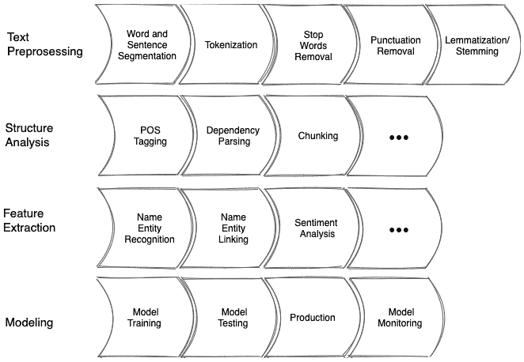
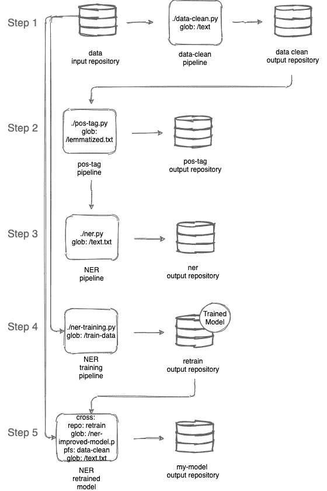
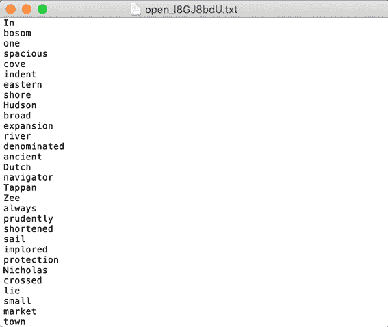
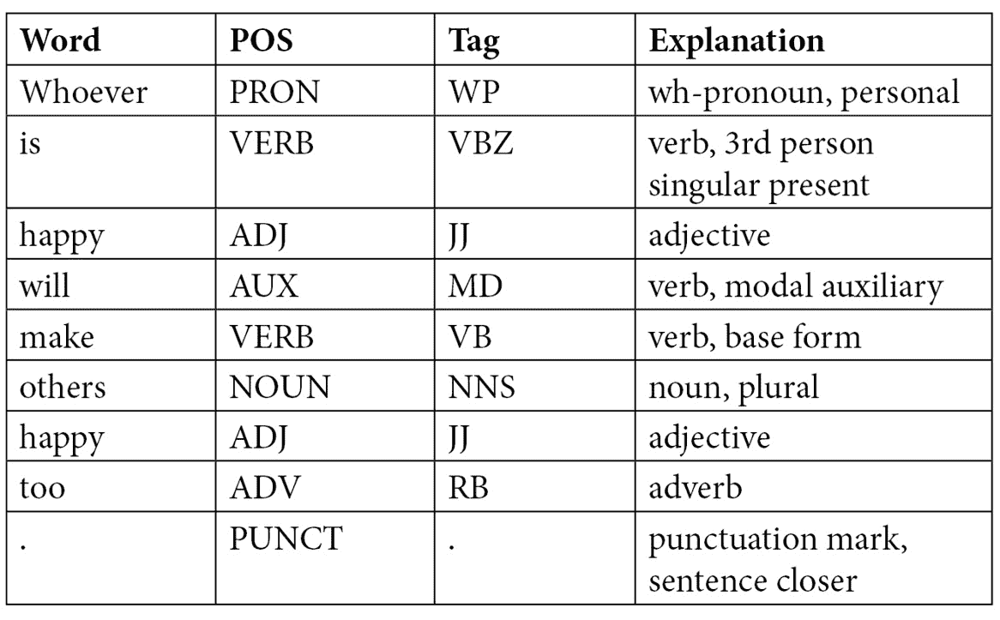
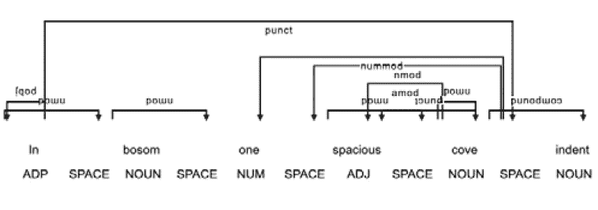
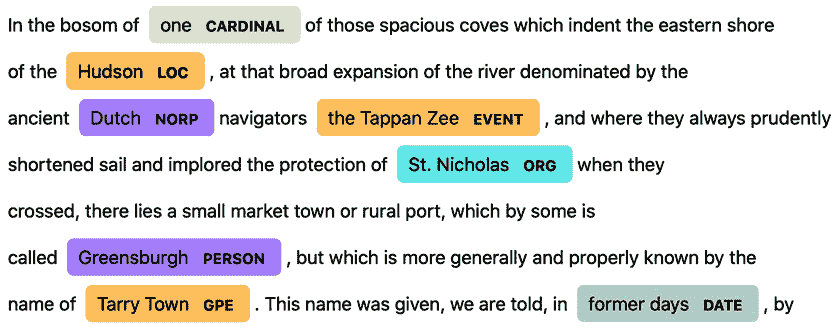

# 第八章：*第八章*：创建一个端到端的机器学习工作流

在之前的章节中，我们学习了 Pachyderm 基础知识，以及如何在本地和云平台上安装 Pachyderm。我们已经部署了第一个管道，学习了如何更新管道，并执行了一些基本的 Pachyderm 操作，如拆分。我希望到现在为止，你已经相信 Pachyderm 是一个功能极其强大的工具，能够提供很多灵活性和处理机器学习管道的能力。为了让这一点更加明显，我们将部署一个比之前更复杂的示例，远超之前的任何部署。希望这一章能特别有趣，能让你更加深入理解数据基础设施的特性。

本章将部署一个多步骤的 **自然语言处理** (**NLP**) 工作流，演示如何大规模使用 Pachyderm。

本章包括以下主题：

+   NLP 示例概述

+   创建仓库和管道

+   创建一个命名实体识别 (NER) 管道

+   重新训练一个命名实体识别 (NER) 模型

# 技术要求

本章要求您安装并配置以下组件。

对于本地 macOS 安装，您需要以下组件：

+   macOS Mojave, Catalina, Big Sur 或更高版本

+   Docker Desktop for Mac 10.14

+   `minikube` v1.9.0 或更高版本

+   `pachctl` 2.0.0 或更高版本

+   Pachyderm 2.0.0 或更高版本

对于本地 Windows 安装，您需要以下组件：

+   Windows Pro 64 位 v10 或更高版本

+   **Windows Subsystem for Linux** (**WSL**) 2 或更高版本

+   Microsoft PowerShell v6.2.1 或更高版本

+   Hyper-V

+   `minikube` v1.9.0 或更高版本

+   `pachctl` 2.0.0 或更高版本

+   Pachyderm 2.0.0 或更高版本

对于 **Amazon 弹性 Kubernetes 服务** (**Amazon EKS**) 安装，您需要以下组件：

+   `kubectl` v.18 或更高版本

+   `eksctl`

+   `aws-iam-authenticator`

+   `pachctl` 2.0.0 或更高版本

+   Pachyderm 2.0.0 或更高版本

对于 Microsoft Azure 云安装，您需要以下组件：

+   `kubectl` v.18 或更高版本

+   Azure CLI

+   `pachctl` 2.0.0 或更高版本

+   Pachyderm 2.0.0 或更高版本

+   `jq` 1.5 或更高版本

对于 **Google Kubernetes Engine** (**GKE**) 云安装，您需要以下组件：

+   Google Cloud SDK v124.0.0 或更高版本

+   `kubectl` v.18 或更高版本

+   `pachctl` 2.0.0 或更高版本

+   Pachyderm 2.0.0 或更高版本

云端或本地虚拟机的最低硬件要求如下：

+   **CPU 数量**：4

+   **内存**：8,192 MB

+   **磁盘**：20 GB

现在我们已经了解了完成本章任务所需的技术要求，我们可以部署一个具有足够资源的 Pachyderm 实例来运行本章描述的示例。

## 调整虚拟机参数

要运行本节描述的示例，您必须确保运行 Pachyderm 的虚拟机有足够的内存和 CPU，以满足管道的需求。无论是云环境还是本地环境，均适用此要求。

如果您在云平台上运行 Pachyderm，请确保已在符合本章*技术要求*部分中列出的最低硬件要求的虚拟机规格上部署了 Kubernetes。然后，按照*第五章*《在云平台上安装 Pachyderm》的描述重新部署您的 Pachyderm 集群。

如果您在本地计算机上通过`minikube`运行 Pachyderm，请确保`minikube`虚拟机足够大。如果您按照*第四章*《本地安装 Pachyderm》的描述部署了`minikube`虚拟机，您需要删除它，并部署一个具有更大 CPU 和内存的新`minikube`虚拟机。

为此，请完成以下步骤：

1.  卸载旧的 Pachyderm 集群：

    ```py
    helm uninstall pachd
    ```

系统响应如下：

```py
release "pachd" uninstalled
```

1.  删除现有的`minikube`虚拟机：

    ```py
    minikube delete
    ```

您应该看到以下系统响应：

```py
Deleting "minikube" in docker ...
Deleting container "minikube" ...
…
```

1.  删除旧机器后，启动一个新的虚拟机，并使用以下参数：

    ```py
    minikube start --cpus 4 --memory 8192
    ```

此命令返回以下响应：

```py
…
Starting control plane node minikube in cluster minikube
Creating docker container (CPUs=4, Memory=8192MB) ...
…
Done! kubectl is now configured to use "minikube" cluster and "default" namespace by default
```

1.  现在，按照*第四章*《本地安装 Pachyderm》的描述，重新部署您的 Pachyderm 集群。为了简单起见，以下是您需要运行的命令：

    ```py
    helm install --set deployTarget=LOCAL pachd ./pachyderm
    ```

您应该看到以下系统响应：

```py
NAME: pachd
LAST DEPLOYED: Thu Aug 19 13:03:36 2021
NAMESPACE: default
STATUS: deployed
REVISION: 1
...
```

1.  运行以下命令连接到`pachd`：

    ```py
    pachctl config import-kube local --overwrite
    pachctl config set active-context local
    ```

现在我们已经部署了足够资源的 Pachyderm 来运行本章中的示例，让我们回顾一下我们将要创建的 NLP 管道。

# NLP 示例概述

在本节中，我们将回顾端到端的机器学习工作流，帮助我们理解如何在 Pachyderm 中调度它。

为了演示此功能，我们将创建一个 NLP 管道，对*《沉睡谷的传说》*这本由*华盛顿·欧文*所写的短篇小说书进行各种文本优化。

但首先，让我们回顾一下什么是 NLP 以及 NLP 涉及的典型阶段。

## 自然语言处理简介

NLP 是一种机器学习技术，使您能够分析自然文本，即语音或书面文本。这一人工智能分支已经存在多年，但随着计算机和互联网技术的进步，它找到了新的应用方式。

那么，如何在您的商业或学术研究中使用自然语言处理（NLP）呢？有很多方法，但最常见的包括以下几种：

+   **语音识别**：使计算机能够理解人类语音的技术。

+   **聊天机器人**：能够回答问题并从提供的答案中学习的软件。旧版聊天机器人基于标准软件工程技术定义的规则，因此它们无法进化，只能产生平庸的回答。新型聊天机器人则更加先进。

+   **机器翻译**：自动化将文本和语音从一种语言翻译成另一种语言的技术。最常见的例子当然是谷歌翻译。

+   **文本提取、总结和分类**：在信息过载的世界中，这是一项非常需要的技术。NLP 使你能够创建提供文本洞察的管道，比如研究论文的摘要或页面上使用的关键词信息。

+   **情感分析**：一种帮助根据信息的正面或负面情感来分类的著名技术。这项技术最著名的应用是 Gmail 邮箱分类器，它将你的电子邮件分为三类：**主邮件**、**促销邮件**和**社交邮件**。

这些是 NLP 的主要示例。然而，这个列表并不完整。NLP 还被应用于生物信息学中分析基因数据，在金融领域用于理解市场事件和趋势，在医疗保健中用于理解患者信息，以及在许多其他领域。

现在我们知道了 NLP 适用的领域，让我们回顾一下构建 NLP 管道所涉及的主要阶段。

## 学习 NLP 阶段

正如我们在上一节讨论的那样，NLP 用于解决各种与文本和语音相关的任务。像机器学习的其他领域一样，当你需要解决一个 NLP 问题时，你需要构建一个管道。NLP 管道有几种定义，但通常情况下，NLP 管道的阶段包括以下内容：

+   **文本预处理或** **清理**：这一阶段包括诸如单词和句子分割、标记化、去除停用词和标点符号、将单词转换为小写字母、词形还原或词干提取等操作。

+   **结构分析**：这一阶段深入分析文本的主题。它包括如**词性**（**POS**）标注、依赖解析和词块切分等操作。

+   **特征提取**：这一阶段主要是回答关于数据的特定问题，并找出文本实体之间的关系。它可能包括如**命名实体识别**（**NER**）和**命名实体消歧**（**NED**）或**链接**和情感分析等任务。

+   **建模**：这一阶段是你在训练数据上训练模型并进行测试，以便将其进一步投入生产环境。

根据你的使用案例，管道可能包含所有或部分这些阶段，而且这些阶段的顺序也可能不同。

以下图示展示了一个示例的自然语言处理管道：



图 8.1 – 自然语言处理管道

现在我们知道了 NLP 管道的阶段，让我们更仔细地看看我们将要实现的示例。

## 回顾 NLP 示例

在我们的示例中，我们将使用*华盛顿·欧文*的《睡谷传奇》文本，最终我们将创建并训练一个 NER 管道，帮助我们回答书中主要人物是谁的问题。为了创建这个多步骤的工作流，我们需要创建以下管道：

+   **数据清洗管道**：该管道将从提供的 URL 下载文本，并清除所有 HTML 标签、标题及其他无关内容。然后，它将对文本进行分词、去除停用词和标点符号，接着进行词干提取和词形还原。

+   **POS 标注管道**：该管道将基于单词在句子中的位置和上下文，为从前一个管道清洗过的文本添加词性标注。

+   **NER 管道**：该管道将使用一个预训练模型处理我们的文本，并尝试为结果标注正确的实体。

+   **NER 训练管道**：该管道将基于提供的训练数据训练一个新的 NER 模型，以纠正第一个 NER 管道的结果。

+   **改进版 NER 管道**：该管道将使用新的 NER 模型处理我们的文本，并将故事中的人物列表输出到一个文本文件。

这是我们完整 NLP 管道工作流的示意图：



图 8.2 – Pachyderm NLP 管道

现在我们已经回顾了管道步骤，让我们一步步创建所有需要的仓库和管道。

# 创建仓库和管道

在本节中，我们将创建在前一节中回顾过的所有管道。六步工作流程将清理数据，应用词性标注（POS），执行命名实体识别（NER），根据提供的数据训练一个新的自定义模型，运行改进的管道，并将结果输出到最终的代码库。

第一步是创建数据清洗管道，它将从文本中剥离我们在进一步处理时不需要的元素。

重要提示

你需要从[`github.com/PacktPublishing/Reproducible-Data-Science-with-Pachyderm/tree/main/Chapter08-End-to-End-Machine-Learning-Workflow`](https://github.com/PacktPublishing/Reproducible-Data-Science-with-Pachyderm/tree/main/Chapter08-End-to-End-Machine-Learning-Workflow)下载所有示例文件。Docker 镜像存储在[`hub.docker.com/repository/docker/svekars/nlp-example`](https://hub.docker.com/repository/docker/svekars/nlp-example)。

## 创建数据清洗管道

数据清洗通常是在执行其他任务之前进行的。对于这个管道，我们创建了一个 Python 脚本，使用**自然语言工具包**（**NLTK**）平台来执行数据清洗任务。NLTK 是一个开源的库集合，能够完成各种 NLP 相关任务，包括分词、词干提取、去除停用词和词形还原。

这是我们将用于该管道的管道规范：

```py
---
 pipeline:
   name: data-clean
 description: A pipeline that tokenizes the text.
 input:
   pfs:
     glob: "/data.txt"
     repo: data
 transform:
   cmd:
   - python3
   - "/data-clean.py"
   image: svekars/nlp-example:1.0
```

这个管道执行以下操作：

+   从`data` 仓库中的`data.txt`文件获取提供的 URL

+   使用` svekars/nlp-example:1.0`镜像

+   运行`data-clean.py`脚本，该脚本已添加到`svekars/nlp-example:1.0`镜像中

你可能注意到，在管道规格中使用的 glob 模式只处理一个文件——`data.txt`。这个文件包含了指向位于*Project Gutenberg: Free eBooks*网站的*《睡谷传奇》*文本的 URL。要访问该网站，请前往[`gutenberg.org`](https://gutenberg.org)。

现在我们已经回顾了管道，让我们更仔细地看看我们的脚本做了什么。以下是我们将在`data-clean.py`脚本中导入的组件列表：

```py
from bs4 import BeautifulSoup
from urllib.request import urlopen
import nltk
from nltk.corpus import stopwords
from nltk.tokenize import word_tokenize
from nltk.stem.porter import PorterStemmer
nltk.download('wordnet')
from nltk.stem import WordNetLemmatizer
```

我们需要`BeautifulSoup`来解析包含我们文本的 HTML 文件。我们使用`urlopen`来打开`data.txt`文件中的 URL。我们需要 NLTK 以及`stopwords`、`word_tokenize`、`PorterStemmer`、`WordNet`和`WordNetLemmatizer`来执行各种 NLP 操作。

代码的第一部分打开我们已放置在数据仓库中的`data.txt`文件，读取文件并使用`BeautifulSoup` HTML 解析器解析文本。在`paragraphs`行中，我们去除除了`<p>` HTML 标签以外的所有 HTML 元素：

```py
with open('/pfs/data/data.txt', "r", encoding='utf-8') as f:
    data=f.read().replace('\n', '')
url = urlopen(data).read()
soup = BeautifulSoup(url, 'html.parser')
content = soup.get_text(strip=True)
paragraphs = soup.find_all('p')
```

脚本的第二部分将下载的文本保存到输出仓库中的文本文件。我们将需要下游管道：

```py
f = open('pfs/out/text.txt', 'w', encoding='utf-8')
 for i in paragraphs:
     all_text = i.get_text()
      f.writelines(all_text)
f.close()
```

在代码的下一部分中，我们使用`word_tokenize` NLTK 方法将文本拆分为单独的标记，并将其保存到输出仓库中的`tokens.txt`文件中：

```py
tokens = []
for i in paragraphs:
    tokens += word_tokenize(i.text)
    with open('/pfs/out/tokens.txt', 'w', encoding='utf-8') as filehandle:
        for item in tokens:
            filehandle.write('%s\n' % item)
```

代码的下一部分将之前标记化的文本去除停用词，并将结果保存到输出仓库中的`no_stopwords.txt`文件中。**停用词**是指包括冠词、代词等常用词，这些词对文本的价值较小，可以忽略，以节省处理时间：

```py
stopwords = stopwords.words("english")
no_stopwords = []
for word in tokens:
     if not word in stopwords:
         no_stopwords.append(word)
         appendFile = open('/pfs/out/no_stopwords.txt', 'a', encoding='utf-8')
         appendFile.write(word)
         appendFile.write("\n")
         appendFile.close()
```

代码的下一部分移除已经进行过分词并去除停用词的文本中的标点符号。代码将结果保存到一个名为`no_punctuation.txt`的单独文件中：

```py
no_punctuation = []
for word in no_stopwords:
      if word.isalpha():
          no_punctuation.append(word)
          appendFile = open('/pfs/out/no_punctuation.txt', 'a', encoding='utf-8')
          appendFile.write(word)
          appendFile.write("\n")
          appendFile.close()
```

接下来是词干提取。`grouping`和`grouped`会被简化为`group`。有时，这种技术可能被认为过于激进，可以使用词形还原来代替。词干化后的输出会保存到`stemmed.txt`：

```py
port_stem = PorterStemmer()
stemmed = []
for word in no_punctuation:
    stemmed_word = port_stem.stem(word)
    stemmed.append(stemmed_word)
    appendFile = open('/pfs/out/stemmed.txt', 'a', encoding='utf-8')
    appendFile.write(stemmed_word)
    appendFile.write("\n")
    appendFile.close()
```

脚本的最后一部分是词形还原，它使用 NLTK 的 WordNet Lemmatizer 数据库对已经标记化且去除了停用词和标点符号的文本进行词形还原。最后一段代码将结果保存到`lematized.txt`文件中。我们将在下一个管道中使用该文件：

```py
lemmatizer = WordNetLemmatizer()
lemmatized = []
for word in no_punctuation:
    l_text = lemmatizer.lemmatize(word)
    lemmatized.append(l_text)
    appendFile = open('/pfs/out/lematized.txt', 'a', encoding='utf-8')
    appendFile.write(l_text)
    appendFile.write("\n")
    appendFile.close()
```

现在我们知道了管道的功能，让我们来创建它。

要创建`data-clean.py`管道，请完成以下步骤：

1.  打开终端并验证 Pachyderm 是否正常运行：

    ```py
    pachctl version
    ```

系统输出如下：

```py
COMPONENT           VERSION
pachctl             2.0.0
pachd               2.0.0
```

1.  创建数据仓库：

    ```py
    pachctl create repo data
    ```

1.  验证数据仓库是否已创建：

    ```py
    pachctl list repo
    ```

系统输出如下：

```py
NAME CREATED   SIZE (MASTER) DESCRIPTION
data 10 seconds ago ≤ 0B
```

1.  从你存放`data.txt`文件的目录，将其放入数据仓库：

    ```py
    pachctl put file -f data.txt data@master
    ```

系统输出如下：

```py
data.txt 49.00b / 49.00 b [==============] 0s 0.00 b/s
```

该文件只有一行——一个指向古腾堡网站上《沉睡山庄的传说》文本的链接：[`www.gutenberg.org/files/41/41-h/41-h.htm`](https://www.gutenberg.org/files/41/41-h/41-h.htm)。

1.  检查文件是否已放入具有`file`类型的仓库：

    ```py
    pachctl list file data@master
    ```

系统输出如下：

```py
NAME      TYPE SIZE
/data.txt file 49B
```

1.  创建`data-clean`流水线：

    ```py
    pachctl create pipeline -f data-clean.yaml
    ```

不会返回任何输出。

1.  检查流水线是否已创建并且开始运行：

    ```py
    pachctl list pipeline
    ```

系统输出如下：

```py
NAME       VERSION INPUT          CREATED       STATE / LAST JOB DESCRIPTION
data-clean 1       data:/data.txt 4 seconds ago running / -      A pipeline that tokenizes the text.
```

1.  大约一分钟后，流水线应完成运行并将结果上传到输出仓库。请检查仓库：

    ```py
    pachctl list repo
    ```

你应该能看到以下输出：

```py
NAME       CREATED        SIZE (MASTER) DESCRIPTION
data-clean 15 seconds ago ≤ 315.8KiB    Output repo for pipeline data-clean.
data       1 minute ago ≤ 49B
```

如你所见，Pachyderm 自动创建了一个名为`data-clean`的输出仓库，并将 315.8 KiB 的数据上传到该仓库的主分支。

1.  让我们列出仓库中的文件：

    ```py
    pachctl list file data-clean@master
    ```

系统输出如下：

```py
NAME                TYPE SIZE
/lemmatized.txt     file 42.25KiB
/no_punctuation.txt file 42.99KiB
/no_stopwords.txt   file 47.88KiB
/stemmed.txt        file 38.01KiB
/text.txt           file 75.18KiB
/tokens.txt         file 69.54KiB
```

1.  你可以看到，流水线已经将六个文件上传到输出仓库。我们故意将它们保存在不同的文件中，这样你可以看到它们之间的差异。你可以查看每个文件的内容并进行比较。例如，在 macOS 上打开`lemmatized.txt`文件，可以运行以下命令：

    ```py
    pachctl get file data-clean@master:/lemmatized.txt | open -f  -a  TextEdit.app
    ```

你应该能看到以下输出：



图 8.3 – 词形还原的单词

在本节中，我们已经创建了一个清理文本的流水线。接下来的章节，我们将创建下一个流水线，应用 POS 标签到我们的词形还原文本。

## 创建 POS 标注流水线

POS 标注是一种 NLP 技术，它为每个单词标记相关的词性。这个过程在许多 NLP 问题中都非常有用，比如文本歧义消解和文本转语音。

对于这项任务，我们使用了**spaCy**，这是一款免费的库，能够执行 POS 标注、命名实体识别（NER）等任务。例如，假设你有如下句子：

*任何快乐的人都会让别人也感到快乐。*

下面是使用 spaCy 进行 POS 标注的示例：



图 8.4 – POS 标注示例

我们将使用 spaCy 从`data-clean`流水线中找到我们词形还原文本的 POS 标签。

下面是我们 POS 标注流水线规范的样子：

```py
---
pipeline:
   name: pos-tag
 description: A pipeline that performs POS tagging.
 input:
   pfs:
     glob: "/lemmatized.txt"
     repo: data-clean
 transform:
   cmd:
   - python3
   - "/pos-tag.py"
   image: svekars/nlp-example:1.0
```

该流水线执行以下操作：

+   从`data-clean`仓库获取`lemmatized.txt`文件

+   使用`svekars/nlp-example:1.0` Docker 镜像

+   运行`pos-tag.py`脚本处理我们的词形还原文本

+   输出一张表格，其中包含在`pos_table.txt`文件中找到的所有 POS 标签，另有一份包含每种 POS 标签总数的文件`pos_number.txt`，并创建一个依赖关系图，保存为`pos-tag-dependency.svg`文件

现在我们已经回顾了流水线的工作内容，接下来让我们看看`pos-tag.py`脚本。

该脚本导入了以下组件和库：

```py
import spacy
import en_core_web_sm
from spacy import displacy
import IPython
from pathlib import Path
import spacy.attrs
from contextlib import redirect_stdout
```

我们需要`spacy`及其模块来执行词性标注、统计它们并可视化结果。我们导入`en_core_web_sm`预训练的 spaCy 模型来完成标注任务。我们需要 IPython 作为 spaCy 的依赖。最后，我们使用`pathlib`和`redirect_stdout`来保存结果。

代码的第一部分导入了一个名为`en_core_web_sm`的预训练 spaCy 模型。词性标注要求你使用预训练模型或自定义模型。`en_core_web_sm`模型在词性标注方面表现良好。因此，我们将直接使用它。然后，脚本打开我们的`lematized.txt`文件，对文件中的所有单词进行词性标注，并将结果输出到`pos-table.txt`文件：

```py
sp = spacy.load('en_core_web_sm')
textfile = sp(open('pfs/data-clean/lematized.txt', "r", encoding='utf-8').read())
with open('/pfs/out/pos-table.txt', 'w') as f:
     with redirect_stdout(f):
         for word in textfile:
             print(f'{word.text:{12}} {word.pos_:{10}} {word.tag_:{8}} {spacy.explain(word.tag_)}')
```

代码的下一部分统计处理过的文本中每个标签的数量，并将结果输出到`pos-number.txt`文件：

```py
with open('/pfs/out/pos-number.txt', 'w') as file:
     with redirect_stdout(file):
         count_tags = textfile.count_by(spacy.attrs.IDS['POS'])
         for i, count in count_tags.items():
             tags = textfile.vocab[i].text
             print(tags, count)
```

最后，脚本的最后部分生成一个依赖图，并将其保存为 SVG 图像`pos-tag-dependency.svg`：

```py
 image = displacy.render(textfile, style='dep', options={"compact": True, "distance": 70})
 f = open('/pfs/out/pos-tag-dependency.svg', "w")
 f.write(image)
 f.close()
```

现在，让我们创建我们的管道。

要创建一个词性标注管道，请执行以下操作：

1.  打开你的终端并验证 Pachyderm 是否已启动并运行：

    ```py
    pachctl version
    ```

你应该看到以下输出：

```py
COMPONENT           VERSION
pachctl             2.0.0
pachd               2.0.0
```

1.  创建词性标注管道：

    ```py
    pachctl create pipeline -f pos-tag.yaml
    ```

没有返回系统输出。

1.  检查管道是否已创建并正在运行：

    ```py
    pachctl list pipeline
    ```

这是此命令返回的输出：

```py
NAME       VERSION INPUT   CREATED       STATE / LAST JOB  DESCRIPTION
pos-tag    1       data-clean:/lemmatized.txt 2 seconds ago running / -       A pipeline that performs POS tagging.
data-clean 1       data:/data.txt             1 minute ago running / success A pipeline that tokenizes the text.
```

1.  当管道运行完成后，检查输出仓库：

    ```py
    pachctl list repo
    ```

这个命令返回以下输出：

```py
NAME       CREATED           SIZE (MASTER) DESCRIPTION
pos-tag    22 seconds ago  ≤ 10.82MiB    Output repo for pipeline pos-tag.
data-clean 2 minutes ago  ≤ 315.8KiB    Output repo for pipeline data-clean.
data       3 minutes ago ≤ 49B
```

Pachyderm 创建了一个名为`pos-tag`的输出仓库，并将 10.82 MiB 文件上传到该仓库的主分支。

1.  现在，让我们查看上传到输出仓库的文件：

    ```py
    pachctl list file pos-tag@master 
    ```

这个命令返回以下系统输出：

```py
NAME                    TYPE SIZE
/pos-number.txt         file 132B
/pos-table.txt          file 564.1KiB
/pos-tag-dependency.svg file 10.27MiB
```

1.  让我们看看我们文本中每个标签的数量：

    ```py
    pachctl get file pos-tag@master:/pos-number.txt 
    ```

你应该看到以下输出：

```py
ADP 154
SPACE 6291
NOUN 3110
NUM 67
ADJ 789
PROPN 346
VERB 1053
ADV 374
DET 98
AUX 69
PRON 130
PART 9
SCONJ 59
CCONJ 15
INTJ 7
X 11 
```

1.  最后，让我们看看依赖图。如果你使用的是 macOS，请运行以下命令：

    ```py
    pachctl get file pos-tag@master:/pos-tag-dependency.svg > pos-tag-dependency.svg | open -f pos-tag-dependency.svg -a "Google Chrome"
    ```

Google Chrome 打开文件：



图 8.5 – 词性依赖图

重要提示

你可能需要在浏览器中向下滚动才能看到图表。由于我们对整本书进行了词性标注，这个图表非常长。你需要横向滚动才能查看完整内容。

在本节中，我们使用 Pachyderm 和 spaCy 配置了一个词性标注管道，并通过依赖图进行了可视化。接下来，我们将配置一个命名实体识别（NER）管道，帮助我们找到故事中的主要人物。

# 创建命名实体识别（NER）管道

命名实体识别（NER）是一种信息提取技术，它能够识别文本中的实体，并将它们归类为特定类别，如人物、地点和组织。例如，假设我们有以下短语：

*Snap Inc.宣布 2021 年第一季度财务结果*

如果你对这个短语使用 spaCy 的`en_core_web_lg`模型，你将得到以下结果：

```py
Snap Inc. - 0 - 9 - ORG - Companies, agencies, institutions, etc.
First Quarter 2021 - 20 - 38 - DATE - Absolute or relative dates or periods
```

名字识别可以在多种任务中派上用场。在本节中，我们将使用它来提取《沉睡谷传说》中的主要人物。

这是我们 NER 管道规范的样子：

```py
---
 pipeline:
   name: ner
 description: A NER pipeline
 input:
   pfs:
     glob: "/text.txt"
     repo: data-clean
 transform:
   cmd:
   - python3
   - "/ner.py"
    image: svekars/nlp-example:1.0
```

这个管道执行以下操作：

+   从`data-clean`仓库获取*The Legend of Sleepy Hollow*的原始文本

+   使用`svekars/nlp-example:1.0` Docker 镜像

+   运行`ner.py`脚本

+   将结果输出到`ner`仓库

现在，让我们看看`ner.py`脚本的功能。以下是脚本导入的组件列表：

```py
import spacy
from spacy import displacy
from contextlib import redirect_stdout
```

我们需要`spacy`来执行 NER 任务，`displacy`模块用于可视化结果。`redirect_stdout`是一种将打印输出重定向到文件的便捷方法。

其余的代码导入了 spaCy 的预训练模型`en_core_web_lg`。这个模型似乎在 NER 任务上的表现优于我们在 POS 标注管道中使用的模型。接着，脚本从`data-clean`仓库中的`text.txt`文件中获取原始文本，并执行 NER 任务：

```py
sp = spacy.load("en_core_web_lg")
def display_entities(text):
     with open ('/pfs/out/ner-list.txt', 'w') as f:
         with redirect_stdout(f):
             if text.ents:
                 for i in text.ents:
                     print(i.text+' - '+str(i.start_char)+' - '+str(i.end_char)+' - '+i.label_+' - '+str(spacy.explain(i.label_)))
 text = sp(open('/pfs/data-clean/text.txt', "r", encoding='utf-8').read())
 display_entities(text)
```

最后，脚本使用`displacy`可视化结果并将其保存为 HTML 格式：

```py
 with open ('/pfs/out/ner-labels.html', 'w') as f:
      with redirect_stdout(f):
          for i in text.ents:
              html=displacy.render(text, style="ent", page=True)
              print(html)
```

现在我们知道了脚本的功能，接下来我们来创建管道。

要创建 NER 管道，完成以下步骤：

1.  打开终端，验证 Pachyderm 是否已启动并正在运行：

    ```py
    pachctl version
    ```

此命令返回以下输出：

```py
COMPONENT           VERSION
pachctl             2.0.0
pachd               2.0.0
```

1.  创建 POS 标注管道：

    ```py
    pachctl create pipeline -f ner.yaml
    ```

没有返回系统输出。

1.  检查管道是否创建并已开始运行：

    ```py
    pachctl list pipeline
    ```

你应该会看到以下输出：

```py
NAME       VERSION INPUT                     CREATED           STATE / LAST JOB  DESCRIPTION
ner        1       data-clean:/text.txt      5 seconds ago     running / running A NER pipeline
pos-tag    1       data-clean:/lematized.txt 1 minutes ago running / success A pipeline that performs POS tagging.
data-clean 1       data:/data.txt            2 minutes ago       running / success A pipeline that tokenizes the text.
```

1.  当管道运行完毕后，检查输出仓库：

    ```py
    pachctl list repo
    ```

该命令返回以下系统输出：

```py
NAME       CREATED        SIZE (MASTER) DESCRIPTION
ner        36 seconds ago ≤ 43.49MiB    Output repo for pipeline ner.
pos-tag    2 minutes ago  ≤ 10.82MiB    Output repo for pipeline pos-tag.
data-clean 3 minutes ago ≤ 315.8KiB    Output repo for pipeline data-clean.
data       4 minutes ago ≤ 49B
```

Pachyderm 创建了一个名为`ner`的输出仓库，并上传了 43.49 MiB 的数据到主分支。

1.  让我们看看上传到输出仓库的文件：

    ```py
    pachctl list file ner@master 
    ```

返回以下输出：

```py
NAME             TYPE SIZE
/ner-labels.html file 43.47MiB
/ner-list.txt    file 19.36KiB
```

该仓库有两个文件。一个是文件中找到的所有实体的列表，另一个是所有实体的可视化结果。

1.  将`ner-list.txt`文件的前 10 行打印到终端：

    ```py
    pachctl get file ner@master:/ner-list.txt | awk 'FNR <= 10'
    ```

此命令返回以下输出：

```py
one - 36 - 39 - CARDINAL - Numerals that do not fall under another type
Hudson - 108 - 114 - LOC - Non-GPE locations, mountain ranges, bodies of water
Dutch - 186 - 191 - NORP - Nationalities or religious or political groups
the Tappan Zee - 203 - 217 - EVENT - Named hurricanes, battles, wars, sports events, etc.
St. Nicholas - 303 - 315 - ORG - Companies, agencies, institutions, etc.
Greensburgh - 417 - 428 - PERSON - People, including fictional
Tarry Town - 498 - 508 - GPE - Countries, cities, states
former days - 547 - 558 - DATE - Absolute or relative dates or periods
about two miles - 891 - 906 - QUANTITY - Measurements, as of weight or distance
first - 1330 - 1335 - ORDINAL - "first", "second", etc. NUM 67
```

如你所见，NER 模型已经识别了文本中的许多实体。让我们打开 HTML 文件，查看所有实体。

1.  打开 HTML 文件：

    ```py
    pachctl get file ner@master:/ner-labels.html > ner-labels.html | open -f ner-labels.html -a "Google Chrome"
    ```

文件将在 Google Chrome 中打开：



图 8.6 – NER 标签

你可以看到，spaCy 模型已经正确地识别了文本中的许多实体。然而，如果你开始浏览，你会注意到它遗漏了一些实体。例如，在某些情况下，它没有将*Headless Horseman*标记为**PERSON**。这是预训练模型的一个已知准确性问题。在下一节中，我们将通过重新训练模型来修正这个问题，以便使用这些实体。

# 重新训练 NER 模型

NER（命名实体识别）管道结果的不准确性是一个常见问题。解决这个问题的唯一方法是重训练现有模型，或者从头开始完全训练一个新的模型。从头训练一个模型是一个既困难又耗时的操作。在我们的案例中，我们不一定需要训练一个完全新的模型，而是可以重训练现有模型，以理解缺失的上下文。为了完成这个任务，我们将把训练数据放入 `data-clean` 仓库，创建一个训练管道在该数据上进行训练，将模型保存到输出仓库中，然后再次运行重训练后的模型对原始文本进行处理。

在 Pachyderm 的术语中，这意味着我们将创建两个管道：

+   第一个管道，名为 `retrain`，将训练我们的模型并将新模型输出到 `train` 输出仓库。

+   第二个管道，名为 `my-model`，将使用新模型分析我们的文本，并将结果上传到 `my-model` 仓库。

现在，让我们创建重训练管道。

## 创建重训练管道

对于这个管道，我们将创建以下管道规范：

```py
---
 pipeline:
   name: retrain
 description: A pipeline that retrains the NER model.
 input:
   pfs:
     glob: "/training-data.json"
     repo: data
 transform:
   cmd:
   - python3
   - "/ner-improved.py"
   image: svekars/nlp-example:1.0
```

这个管道采用包含我们训练数据的 `training-data.json` 文件，并运行 `ner-improved.py` 脚本以改进现有模型。结果将保存到 `retrain` 仓库中。对于这个示例，我们不需要太多的训练实例，但在实际使用中，你可能需要成百上千的示例来提高模型的准确性。

以下是 `ner-improved.py` 脚本导入的组件列表：

```py
import spacy
import random
from spacy.util import minibatch
from spacy.training import Example
from contextlib import redirect_stdout
import simplejson as json
```

我们需要 `spacy` 库中的 `minibatch` 和 `Example.from_dict` 方法来训练模型。我们使用 `random` 来打乱文件顺序，以便更好地训练。需要 `simplejson` Python 解码器来读取 JSON 格式的训练数据文件，并且需要 `redirect_stdout` 来保存输出结果。

脚本的下一部分加载 spaCy 模型，读取训练数据文件，并打开 spaCy NER 管道：

```py
nlp=spacy.load("en_core_web_lg")
ner=nlp.get_pipe("ner")
data = open("/pfs/data/training-data.json")
data = json.loads(data.read())
```

这部分代码使用了一个优化器，它执行梯度下降计算。然后，脚本指定只需训练 NER 管道，忽略其他管道。接下来的 `for` 循环执行实际的训练，更新模型，并打印损失值。我们将训练模型 30 次：

```py
 optimizer = nlp.create_optimizer()
 other_pipes = [p for p in nlp.pipe_names if p != "ner"]
 with nlp.disable_pipes(*other_pipes):
     for i in range(30):
         random.shuffle(data)
         losses = {}
         for text, annotations in data:
             doc = nlp.make_doc(text)
             example = Example.from_dict(doc, annotations)
             nlp.update([example], drop=0.1, sgd=optimizer, losses=losses)
         print(losses)
```

脚本的最后一部分测试重训练管道在测试文本上的效果，并将结果输出到 `ner-improved.txt` 文件。重训练后的模型将使用 `pickle.dump` 保存在 `output` 仓库中的 `ner-improved-model.p` 文件目录中：

```py
test_text = 'Headless Horseman came to see Ichabod Crane.'
doc = nlp(test_text)
with open ('/pfs/out/ner-improved.txt', 'w') as f:
    with redirect_stdout(f):
        for i in doc.ents:
            print(i.label_, " -- ", i.text)
pickle.dump(nlp, open('/pfs/out/ner-improved-model.p', 'wb'))
```

现在，让我们创建管道：

1.  打开终端并验证 Pachyderm 是否正在运行：

    ```py
    pachctl version
    ```

系统输出如下：

```py
  COMPONENT           VERSION
pachctl             2.0.0
pachd               2.0.0
```

1.  将 `training-data.json` 放入数据仓库：

    ```py
    pachctl put file -f training-data.json data@master
    ```

1.  创建重训练管道：

    ```py
    pachctl create pipeline -f retrain.yaml
    ```

没有系统输出返回。

1.  检查管道是否已创建，并且正在启动或运行：

    ```py
    pachctl list pipeline
    ```

系统输出如下：

```py
NAME       VERSION INPUT                     CREATED        STATE / LAST JOB  DESCRIPTION
retrain    1       data:/training-data.json   About a minute ago running / success A pipeline that retrains the NER model.
ner        1       data-clean:/text.txt       2 minutes ago      running / success A NER pipeline
pos-tag    1       data-clean:/lemmatized.txt 3 minutes ago      running / success A pipeline that performs POS tagging.
data-clean 1       data:/data.txt             5 minutes ago      running / success A pipeline that tokenizes the text.
```

1.  一段时间后，检查输出仓库：

    ```py
    pachctl list repo
    ```

系统输出如下：

```py
NAME       CREATED        SIZE (MASTER) DESCRIPTION
retrain    About a minute ago ≤ 821.8MiB    Output repo for pipeline retrain.
ner        2 minutes ago      ≤ 43.49MiB    Output repo for pipeline ner.
pos-tag    3 minutes ago      ≤ 10.82MiB    Output repo for pipeline pos-tag.
data-clean 5 minutes ago      ≤ 315.8KiB    Output repo for pipeline data-clean.
data       6 minutes ago      ≤ 205B
```

如你所见，Pachyderm 将 816.7 MiB 上传到 `retrain` 仓库。这是我们重新训练的模型，占用了这么多空间。

1.  列出 `retrain` 仓库中的文件：

    ```py
    pachctl list file retrain@master 
    ```

系统输出如下：

```py
NAME                TYPE SIZE
/ner-improved-model.p file 821.8MiB
/ner-improved.txt   file 56B
```

1.  查看 `ner-improved.txt` 文件，它应该包含重新训练的模型对测试文本运行的结果：

    ```py
    pachctl get file retrain@master:/ner-improved.txt
    ```

系统输出如下：

```py
PERSON  --  Headless Horseman
PERSON  --  Ichabod Crane 
```

很棒！*Headless Horseman* 和 *Ichabod Crane* 被定义为 **PERSON**。

现在我们已经重新训练了模型，接下来让我们部署最终的流水线，它将提供改进后的 NER，并将故事中的所有人物输出到一个文件中。

## 部署重新训练的流水线

我们的重新训练流水线需要是一个跨流水线，以便将我们新的重新训练模型与文本结合起来：

```py
---
  pipeline:
    name: my-model
  description: A retrained NER pipeline
  input:
    cross:
    - pfs:
        repo: data-clean
        glob: "/text.txt"
    - pfs:
        repo: retrain
        glob: "/ner-improved-model.p"
  transform:
    cmd:
    - python3
    - "/ner-my-model.py"
    image: svekars/nlp-example:1.0
```

这个流水线将使用与原始 NER 流水线相同的 `text.txt` 文件，并将我们重新训练的模型与该文本的交叉产品生成。它将结果输出到 `my-model` 仓库中。生成的文件将包含一个改进了 NER 标记的 HTML 文件和一个包含 *The Legend of Sleepy Hollow* 中人物列表的文本文件。

`ner-my-model.py` 与原始的 `ner.py` 脚本非常相似，主要有以下区别：

它通过使用 `pickle.load` 而不是原始的 spaCy 模型来加载我们的改进模型：

```py
nlp = pickle.load(open('/pfs/retrain/ner-improved-model.p', 'rb')))
```

它统计每个 `/pfs/out/person-label-count.txt` 文件中实例的总数：

```py
with open ('/pfs/out/person-label-count.txt', 'w') as f:
     with redirect_stdout(f):
         person_label=[]
         for i in text.ents:
             if i.label_ =='PERSON':
                 person_label.append(i.text)
         count = Counter(person_label)
         for key, counter in count.most_common():
```

它将 HTML 可视化保存到 `ner-improved-labels.html` 文件中。它将所有实体保存到 `ner-improved-list.txt` 文件中，该文件位于 `my-model` 仓库。

让我们创建最终的流水线：

1.  打开终端并确认 Pachyderm 正在运行：

    ```py
    pachctl version
    ```

系统输出如下：

```py
  COMPONENT           VERSION
pachctl             2.0.0
pachd               2.0.0
```

1.  创建 `my-model` 流水线：

    ```py
    pachctl create pipeline -f my-model.yaml
    ```

这个命令不会返回任何输出。

1.  检查流水线是否已创建并正在启动或运行：

    ```py
    pachctl list pipeline
    ```

系统输出如下：

```py
NAME       VERSION INPUT                                                  CREATED        STATE / LAST JOB   DESCRIPTION
my-model   1       (data-clean:/text.txt ⨯ retrain:/ner-improved-model.p) 6 seconds ago  running / running A retrained NER pipeline
retrain    1       data:/training-data.json                               9 minutes ago  running / success A pipeline that retrains the NER model.
ner        1       data-clean:/text.txt                                   10 minutes ago running / success A NER pipeline
pos-tag    1       data-clean:/lemmatized.txt                             11 minutes ago running / success A pipeline that performs POS tagging.
data-clean 1       data:/data.txt                                         13 minutes ago running / success A pipeline that tokenizes the text.
```

请注意，`my-model` 流水线正在启动。它不同于我们为此示例创建的所有其他流水线。因为我们将模型保存在 `retrain` 仓库中，并且需要将其与数据仓库中的文本结合，所以标准流水线无法完成这个任务。为了实现这一目标，我们创建了一个跨流水线，将两个输入结合起来。

1.  让我们检查输出仓库：

    ```py
    pachctl list repo
    ```

系统输出如下：

```py
NAME       CREATED        SIZE (MASTER) DESCRIPTION
my-model   About a minute ago ≤ 31.44MiB    Output repo for pipeline my-model.
retrain    10 minutes ago     ≤ 821.8MiB    Output repo for pipeline retrain.
ner        11 minutes ago     ≤ 43.49MiB    Output repo for pipeline ner.
pos-tag    12 minutes ago     ≤ 10.82MiB    Output repo for pipeline pos-tag.
data-clean 14 minutes ago     ≤ 315.8KiB    Output repo for pipeline data-clean.
data       15 minutes ago     ≤ 205B
```

Pachyderm 将 26.15 MiB 上传到 `my-model` 仓库。这是我们计算的结果。

1.  列出 `my-model` 仓库中的文件：

    ```py
    pachctl list file my-model@master 
    ```

系统输出如下：

```py
NAME                      TYPE SIZE
/ner-improved-labels.html file 26.14MiB
/ner-improved-list.txt    file 13.43KiB
/person-label-count.txt   file 654B 
```

1.  查看 `person-label-count.txt` 文件，它应该提供每个独特 **PERSON** 实例的总计数：

    ```py
    pachctl get file my-model@master:/person-label-count.txt | awk 'FNR <= 15'
    ```

系统输出如下：

```py
Ichabod: 35
Brom Bones: 9
Ichabod Crane: 8
Van Tassel: 5
Hans Van: 5
Galloping Hessian: 4
André: 4
Headless Horseman: 3
Brom: 3
Hans Van Ripper: 3
Brouwer: 3
Tarry Town: 2
Cotton Mather: 2
Mather: 2
Baltus Van: 2
```

如你所见，输出结果仍然不完全准确，因为我们看到 *Ichabod* 和 *Ichabod Crane* 分别出现。如果我们提供更多的训练数据，就能改善这些结果。不过，你已经能看到这个列表中最常出现的人物，并且可以理解 *Ichabod Crane* 很可能是这个故事的主要人物。

1.  打开 HTML 文件以查看高亮版本的结果：

    ```py
    pachctl get file my-model@master:/ner-improved-labels.html > ner-improved-labels.html | open -f ner-labels.html -a "Google Chrome"
    ```

这结束了我们关于 spaCy NER 模型的实验。你可以添加更多的训练数据，看看在更多训练样本的情况下，准确度会如何提高。

现在，让我们清理我们的集群。

## 清理中

完成实验后，你可能想要清理集群，以便以全新安装开始下一个实验。要清理环境，请执行以下操作：

1.  删除所有的管道和仓库：

    ```py
    pachctl delete pipeline –all && pachctl delete repo --all
    ```

1.  验证你的集群中没有仓库和管道：

    ```py
    pachctl list repo && pachctl list pipeline
    ```

你应该看到以下输出：

```py
NAME CREATED SIZE (MASTER) DESCRIPTION
NAME VERSION INPUT CREATED STATE / LAST JOB DESCRIPTION
```

你已成功清理了你的集群。

# 总结

在本章中，我们学习了如何使用 NER 管道示例构建一个复杂的机器学习工作流。我们学习了如何使用 NLTK 库清理数据，如何进行词性标注（POS tagging），以及如何在 Pachyderm 中重新训练 spaCy 模型并输出结果以供预览。你可以做更多的操作，通过添加更多训练数据和调整模型训练参数，进一步提升 NER 的准确度。

在下一章中，我们将学习如何在 Pachyderm 中进行超参数调优，以预测房价为例。

# 进一步阅读

+   NLTK 文档：[`www.nltk.org/`](https://www.nltk.org/)

+   spaCy 文档：[`spacy.io/api/doc`](https://spacy.io/api/doc)

+   *睡谷的传说* 在古腾堡项目网站上的链接：[`www.gutenberg.org/files/41/41-h/41-h.htm`](https://www.gutenberg.org/files/41/41-h/41-h.htm)
