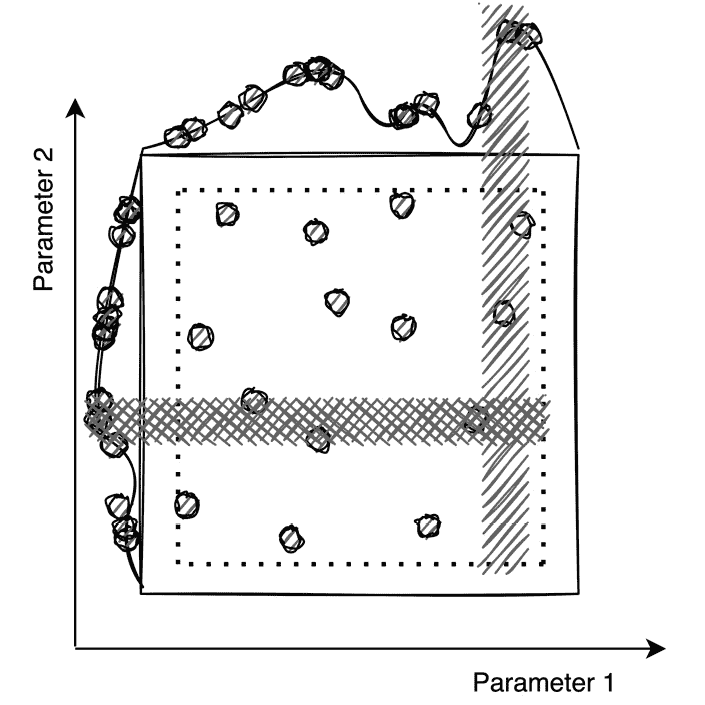

# 第九章：*第九章*：使用 Pachyderm 进行分布式超参数调优

在*第八章*中，*创建端到端机器学习工作流*，我们基于**命名实体识别**（**NER**）管道示例实现了一个**端到端**（**E2E**）**机器学习**（**ML**）工作流。这是一个多步骤的管道，包含许多计算阶段，包括数据清理、**词性**（**POS**）标注、模型训练，以及将新模型应用于不同数据。我们的目标是找出故事中的主要角色，这一点我们成功地实现了。

在本章中，我们将探讨可以实施的各种策略，以选择适用于机器学习问题的最佳参数。这个技术叫做**超参数调优**或优化。在本章的第二部分，我们将基于房价预测示例实现一个超参数调优管道。

本章包括以下主题：

+   审查超参数调优技术和策略

+   创建一个超参数调优管道在 Pachyderm 中

# 技术要求

本章要求您安装并配置特定组件。

对于本地 macOS 安装，您应具备以下条件：

+   macOS Mojave、Catalina、Big Sur 或更高版本

+   Docker Desktop for Mac 10.14

+   `minikube` v1.9.0 或更高版本

+   `pachctl` 2.0.0 或更高版本

+   Pachyderm 2.0.0 或更高版本

对于本地 Windows 安装，您应具备以下条件：

+   Windows Pro 64 位 v10 或更高版本

+   **Windows 子系统 for Linux**（**WSL**）2 或更高版本

+   Microsoft PowerShell v6.2.1 或更高版本

+   Hyper-V

+   `minikube` v1.9.0 或更高版本

+   `kubectl` v1.18 或更高版本

+   `pachctl` 2.0.0 或更高版本

+   Pachyderm 2.0.0 或更高版本

对于**Amazon 弹性 Kubernetes 服务**（**Amazon EKS**）安装，您应具备以下条件：

+   `kubectl` v.18 或更高版本

+   `eksctl`

+   `aws-iam-authenticator`

+   `pachctl` 2.0.0 或更高版本

+   Pachyderm 2.0.0 或更高版本

对于 Microsoft Azure 云安装，您应该具备以下条件：

+   `kubectl` v.18 或更高版本

+   **Azure 命令行接口**（**Azure CLI**）

+   `pachctl` 2.0.0 或更高版本

+   Pachyderm 2.0.0 或更高版本

+   `jq` 1.5 或更高版本

对于**Google Kubernetes 引擎**（**GKE**）云安装，您应具备以下条件：

+   Google Cloud **软件开发工具包**（**SDK**）v124.0.0 或更高版本

+   `kubectl` v.18 或更高版本

+   `pachctl` 2.0.0 或更高版本

+   Pachyderm 2.0.0 或更高版本

要运行本章中的管道，您不需要任何特殊硬件。如果您是在本地运行 Pachyderm 集群，任何现代笔记本电脑都应该支持本节中的所有操作。如果您在云平台上运行 Pachyderm，您将需要有一个**持久卷**（**PV**）。有关更多细节，请参见*第五章*，*在云平台上安装 Pachyderm*。

本章中描述的所有脚本和数据都可以在[`github.com/PacktPublishing/Reproducible-Data-Science-with-Pachyderm/tree/main/Chapter09-Distributed-Hyperparameter-Tuning-with-Pachyderm`](https://github.com/PacktPublishing/Reproducible-Data-Science-with-Pachyderm/tree/main/Chapter09-Distributed-Hyperparameter-Tuning-with-Pachyderm)找到。

现在我们已经回顾了本章的技术要求，让我们更详细地了解一下我们的工作流。

# 回顾超参数调优技术和策略

**超参数调优**（**hyperparameter tuning**）或**超参数优化**（**hyperparameter optimization**）是一种机器学习专业人员用来确定最佳参数以解决特定机器学习问题的技术。在不同的问题中，你需要调节不同类型的参数，比如神经网络中的权重，随机森林算法中的树的数量，或者模型的学习率。最终，选择最佳参数有助于你确定最适合解决问题的方法。数据科学家需要理解他们所使用算法中的可调参数，以便正确地优化它们。

有许多机器学习算法可以帮助解决超参数优化问题。让我们回顾一下最常见的几种。

## 网格搜索

**网格搜索**是最简单的算法，有时被称为*暴力搜索*方法用于超参数优化。该方法计算超参数的最佳值。

在网格搜索中，你通常会定义诸如学习率、丢弃率或批次大小等超参数。然后，定义一个可能的值范围。接下来，算法运行并搜索所有可能的配置。

网格搜索的一个缺点是它计算开销大，通常只用于较小的超参数集。

尽管如此，网格搜索（Grid search）仍然是一种流行的超参数调优算法，也是最容易理解的。

以下图表展示了网格搜索：


图 9.1 – 网格搜索

现在，让我们来看看另一种超参数优化技术——**随机搜索**。

## 随机搜索

**随机搜索**与网格搜索相似，但不同之处在于，它不是检查所有可能的组合，而是随机选择它们，这通常能带来更好的性能并减少计算时间和资源。在许多情况下，随机搜索比网格搜索方法更快地找到最佳组合。

该图展示了随机搜索：



图 9.2 – 随机搜索

现在我们知道了随机搜索（Random search）和网格搜索（Grid search）方法，接下来我们将了解一种稍微复杂一点的超参数调优方法——贝叶斯优化。

## 贝叶斯优化

贝叶斯优化是一种超参数调整技术，用于找到一个函数的最小值。贝叶斯优化与网格搜索/随机搜索的主要区别在于它会跟踪之前的迭代和评估结果，因此使用概率（*P*）来预测最佳组合。

使用贝叶斯优化训练的模型在数据更多的情况下能提供更好的结果。由于它考虑了过去的结果，像这样的模型可以通过较少的迭代找到最佳结果。基于之前的迭代，贝叶斯优化构建了一个更接近现实的后验模型。

该图示范了贝叶斯优化的概念：


图 9.3 – 贝叶斯优化

我们已经了解了三种主要的超参数优化技术。虽然还有更多方法，但这三种似乎是最受欢迎和广泛使用的。现在，让我们来看看可以用于确定模型表现的模型评估指标。由于我们将在本章后面讨论的问题是回归问题，我们将只考虑回归评估指标。

## 回归评估指标

仅选择正确的算法只是成功的一半。我们需要使用一个评估指标来确定模型的表现。评估指标可以应用于各种参数，以确定最佳参数。它们还可以应用于多个算法，以便进行比较并为进一步分析提供依据。

由于房价预测示例是回归问题，我们将只考虑回归评估指标。最常见的评估指标包括以下几种：

+   **R 平方**（**R2**）

+   **均方误差**（**MSE**）

+   **平均绝对误差**（**MAE**）

这些指标是已知的统计方法，用于评估性能。

### R2

R2 是一个用于统计学中的评估指标，用于确定因变量的方差或数据与回归线的接近程度。该参数以百分比形式衡量。如果你得到 100%的 R2 值，意味着数据完美地拟合回归模型。然而，其他值也是可以接受的，包括 75%、50%等等。

有许多方法可以用公式表示 R2，但最简单的表示方式如下：


如果你不太熟悉数学，不必太担心，因为在我们的代码中，我们使用`scikit-learn`模块来计算 R2。

现在你对 R2 有了大致了解，让我们学习另一种评估指标——MSE。

### MSE

MSE 是一种评估指标，用于估算预测值与观察值之间的差异。MSE 受到离群值的影响很大，离群值指的是超出标准范围的值。因此，在评估模型之前，你必须去除离群值。

MSE 值越低，结果越接近真实值。

例如，如果你有一个根据服务年限预测薪资的模型，模型的 MSE 可能是 200，这意味着预测值比实际值**美元（USD）**高出 200 美元。根据样本大小、整体规模和期望的精度，这个数字可能具有不同的重要性。

以下公式用于计算 MSE：


以下值用于该公式：

+   *n*：样本大小

+   *observed*：实际值

+   *predicted*：模型预测的值

与 R2 一样，不必过于担心公式，因为我们将使用 `scikit-learn` 的 MSE 模块来计算 MSE。

现在，让我们了解 MAE。

### MAE

MAE 是另一种常用于回归模型的评估指标。它计算模型中的总误差平均值，或者实际值与预测值之间的绝对差异。如果我们要用最简单的公式表示 MAE，它的形式如下：


这个指标仅供参考。我们在计算中不会使用它。但是，如果你愿意，也可以尝试使用 `scikit-learn` 的 MAE 模块来计算。

除了这些指标外，还有许多其他指标可以帮助你评估模型，包括**根均方误差**（**RMSE**）和**调整后的 R2**。然而，我们之前提到的这些是最常用的，也是最容易理解的。

现在我们已经了解了方法论、评估指标以及我们将用来配置 Pachyderm 中超参数调优的算法，让我们回顾实际的示例、模型、代码和管道规范。在下一节结束时，我们将拥有一个在 Pachyderm 中工作的超参数调优示例。

# 在 Pachyderm 中创建超参数调优管道

在本节中，我们将探讨超参数调优管道，并将在 Pachyderm 中创建所有必要的属性，以运行我们的示例。

## 示例概述

房价预测挑战是超参数调优优化的经典机器学习示例之一。它听起来可能并不复杂，甚至可以根据你的经验进行简单预测。很可能，你对自己所住的地区相当了解，可以根据房屋的平方英尺数、房间数量、相邻土地面积等参数估算房价。

这些信息可以以**二维**（**2D**）数组或表格的形式表示，包含上述参数。以下是此类表格的示例：


图 9.4 – 示例房屋数据

基于这些信息，你可以仅通过观察这些数字来预测一栋具有相似特征的房子的价格，而无需使用任何机器学习模型。

但想象一下，你所拥有的所有数据只是一个**逗号分隔值**（**CSV**）文件，里面包含成千上万行和 60 多个列。你对这个区域一无所知，而且你从未住在那里。想象一下，你希望根据不断变化的数据，持续预测房价。此时，创建一个高效的机器学习模型就显得非常有用。

在我们的示例中，我们将使用一个免费的数据集，`train.csv`版本的数据集，因为我们将对其进行修改以清理数据。

`train.csv`数据集包括*81*列和*1,461*行。你可以查看`data_description.txt`文件来回顾列的描述。列中包含了影响房价的各种参数。每一行代表一个房屋销售实例，并带有一个具体的销售价格。

这是数据集中的一个摘录：


](img/B17085_09_005.jpg)

图 9.5 – 房屋数据集摘录

我们将尝试创建一个模型，利用我们的训练数据对其进行训练，预测房价，并通过使用我们在前一节中讨论的 R2 和 MSE 评估指标来评估模型的性能。

以下图表展示了我们的模型：


图 9.6 – 超参数调优管道

现在我们已经对管道有了一个基本的了解，让我们更详细地回顾一下管道工作流的每个步骤。

## 创建探索性分析管道

我们的第一个管道探索了数据，并为我们提供了有关所用数据集的一些基本信息。以下是探索性分析管道的规范：

```py
---
 pipeline:
   name: data-explore
 description: A pipeline that performs exploratory analysis.
 input:
   pfs:
     glob: "/*"
     repo: data
 transform:
   cmd:
   - python3
   - "/data-explore.py"
   image: svekars/hyperparameter-example:1.0
```

该管道从位于`/*`下的数据仓库中获取所有数据，并运行`data-explore.py`脚本。该管道使用`hyperparameter-example:1.0` Docker 镜像。

让我们回顾一下`data-explore.py`脚本的作用。该脚本导入了以下组件：

```py
import pandas as pd
import numpy as np
import matplotlib.pyplot as plt
import seaborn as sns
```

我们将使用`pandas`来操作 CSV 表格，并将其表示为`DataFrame`结构。`pandas`是一个开源的 Python 库，广泛应用于数据科学家进行数据操作，尤其是二维表格数据。

我们将使用之前章节中介绍过的`matplotlib`，结合`seaborn`库来可视化我们的计算结果。`seaborn`基于`matplotlib`，但提供了更复杂且视觉上更吸引人的图表。

`data-explore.py`脚本的第一部分从`data`仓库中读取`housing-train.csv`文件，并通过使用`pandas.DataFrame.corr()`方法计算数据集中所有列之间的相关性矩阵。代码接着创建了一个相关性矩阵的热图，并将其保存在管道输出仓库中。相关代码如下所示：

```py
plt.subplots(figsize=(20,15))
 data = pd.read_csv("/pfs/data/housing-train.csv", delimiter=',')
 dataset = data.corr().round(2)
 plt.subplots(figsize=(20,15))
 my_plot = sns.heatmap(dataset, annot=True,cmap='YlGnBu', linecolor='white')
 fig = my_plot.get_figure()
 fig.savefig('/pfs/out/heatmap.png', dpi=400)
```

代码的第二部分保存列中数据对象的类型。通常，分析和处理数值数据与类别数据采用不同的方法，因此获取这些信息可能很重要。代码将这些信息保存到`data-types.csv`文件中，如下所示：

```py
data_types = data.dtypes.to_frame('dtypes').reset_index()
data_types.to_csv('/pfs/out/data-types.csv', index=False)
```

脚本的第三部分检查缺失数据的列，创建一个包含缺失数据列百分比的表格，并将其保存为`no-data.csv`，如下代码片段所示：

```py
cols_no_data = data.isnull().sum() / data.shape[0] * 100.00
no_data = pd.DataFrame({'Column': data.columns, 'Percentage Missing': cols_no_data})
no_data.sort_values(by=['Percentage Missing'], inplace=True, ascending=False)
header = ["Column", "Percentage Missing"]
no_data.to_csv('/pfs/out/no-data.csv', columns = header, index=False)
```

我们来创建这个管道，步骤如下：

1.  通过执行以下命令，验证 Pachyderm 是否正常运行：

    ```py
    pachctl version
    ```

该命令返回以下输出（你的`pachctl`和`pachd`版本可能不同）：

```py
COMPONENT           VERSION
pachctl             2.0.0
pachd               2.0.0
```

1.  通过运行以下命令创建数据仓库：

    ```py
    pachctl create repo data
    ```

该命令不会返回任何输出。

1.  通过运行以下命令，将`housing-train.csv`文件移至`data`仓库的主分支：

    ```py
    pachctl put file data@master -f housing-train.csv
    ```

系统响应应如下所示：

```py
housing-train.csv 460.68KB / 460.68 KB [=========] 0s 0.00 b/s
```

1.  通过运行以下命令，验证文件是否已以`file`类型添加到仓库：

    ```py
    pachctl list file data@master
    ```

系统响应应如下所示：

```py
NAME               TYPE SIZE
/housing-train.csv file 449.9KiB
```

1.  通过使用`data-explore.yaml`文件创建`data-explore`管道，步骤如下：

    ```py
    pachctl create pipeline -f data-explore.yaml 
    ```

该命令不会返回任何响应。

1.  通过运行以下命令，验证管道是否已创建：

    ```py
    pachctl list pipeline 
    ```

这是你应该看到的系统响应：

```py
NAME      VERSION INPUT   CREATED  STATE / LAST JOB   DESC
data-explore 1    data:/* 34 seconds ago running / running A pipeline that performs exploratory data analysis.
```

等待管道运行完毕，并显示最后一个作业的`success`状态。

1.  列出仓库，命令如下：

    ```py
    pachctl list repo
    ```

你应该看到`data-explore`管道已上传`3.361MiB`的数据到`data-explore`仓库，输出如下所示：

```py
NAME         CREATED        SIZE (MASTER) DESCRIPTION
data-explore 46 seconds ago 3.361MiB      Output repo for pipeline data-explore.
data         26 minutes ago 449.9KiB 
```

1.  通过运行以下命令，我们来探索仓库中的数据：

    ```py
    pachctl list file data-explore@master
    ```

你应该能看到以下三个文件：

```py
NAME            TYPE SIZE
/data-types.csv file 1.37KiB
/heatmap.png    file 3.359MiB
/no-data.csv    file 1.447KiB
```

1.  我们来打开`/data-types.csv`文件，如下所示：

    ```py
    pachctl get file data-explore@master:/data-types.csv 
    ```

文件包含每一列的数据类型，如下代码片段所示：

```py
index,dtypes
Id,int64
MSSubClass,int64
MSZoning,object
LotFrontage,float64
...
```

1.  通过运行以下命令，我们来查看`no-data.csv`文件中的内容：

    ```py
    pachctl get file data-explore@master:/no-data.csv
    ```

另外，你也可以在你的电脑上用应用程序打开该文件。例如，在 macOS 中，你可以在`Numbers`应用中打开它，如下所示：

```py
pachctl get file data-explore@master:/no-data.csv | open -f -a "Numbers"
```

该文件包含有关列和这些列中缺失数据百分比的信息。这对于数据清理非常有用。一些列的缺失数据超过了 80%。这些列可以被删除，以避免干扰我们的计算。我们将在下一个管道中进行处理。以下是缺失数据大部分的列列表：


图 9.7 – 缺失数据的列

1.  现在，通过运行以下命令，我们来查看热图：

    ```py
    pachctl get file data-explore@master:/heatmap.png | open -f -a "Preview.app"
    ```

你应该看到以下热图，它展示了数据集中所有列之间的相关性：


图 9.8 – 所有参数的热图

这个热图参数太多，难以阅读。但即便在这个热图上，我们也能看到有些参数对销售价格的影响大于其他参数。例如，看起来`OverallQuality`参数对价格的影响最大，还有`GrLivArea`参数（即*大居住区*）。我们将在下一个管道步骤中尝试将数据集缩小到这些参数。

我们已经探索了数据集并对数据有了基本了解。现在，让我们回顾一下下一个管道，它将根据我们的发现清理数据。

## 创建数据清理管道

我们的下一步是创建一个清理数据的管道。这个管道将根据上一部分的发现清理数据。以下是管道的规范：

```py
---
 pipeline:
   name: data-clean
 description: A pipeline that removes empty cells from the CSV.
 input:
   pfs:
     glob: "/"
     repo: data
 transform:
   cmd:
   - python3
   - "/data-clean.py"
   image: svekars/hyperparameter-example:1.0
```

这是一个标准的 Pachyderm 管道，它从`data`仓库中获取数据，并对这些数据运行`data-clean.py`脚本。在这种情况下，数据是我们的`housing-train.csv`数据集。

让我们来看一下`data-clean.py`脚本。该脚本导入了以下组件：

```py
import pandas as pd
import matplotlib.pyplot as plt
import seaborn as sns
from pandas import Series
```

这些组件与`data-explore`管道中的组件相似。唯一新增的组件是`pandas.Series`，我们需要它来将数据保存到 CSV 文件中。

我们脚本的第一部分读取来自`housing-train.csv`数据集的数据，作为`DataFrame`。然后，我们删除那些有超过 40%缺失数据的列，并将被删除的列保存到`col_drop.csv`文件中，如下所示：

```py
data = pd.read_csv("/pfs/data/housing-train.csv", delimiter=',')
col_drop = set(data.count()[data.count()<0.60*max(data.count())].index.tolist())
pd.Series(list(col_drop)).to_csv('/pfs/out/col_drop.csv', index=False)
```

接下来，我们创建一个新的相关矩阵，仅包括对`SalePrice`列影响系数为 0.5 或更大的参数。我们绘制一个新的热图，并将其保存在`heatmap2.png`文件中，如下所示：

```py
data = data.drop((col_drop), axis=1)
corr = data.corr()
r_var = corr.SalePrice[(corr.SalePrice > 0.5)]
r_col = list(r_var.index.values)
new_corr = data[r_col].corr()
plt.subplots(figsize=(20,15))
my_plot2 = sns.heatmap(new_corr, annot=True,cmap='YlGnBu', linecolor='white')
fig = my_plot2.get_figure()
fig.savefig('/pfs/out/heatmap2.png', dpi=400)
```

最后，我们移除不属于新相关矩阵的列，并将它们保存在一个名为`cleaned-data.csv`的新数据集里，放在管道输出仓库中，如下所示：

```py
new_data = data.loc[:, data.columns.intersection(r_col)]
new_data.to_csv('/pfs/out/cleaned-data.csv', index=True)
```

现在，让我们创建这个数据清理管道，如下所示：

1.  通过执行以下命令验证 Pachyderm 是否正在运行：

    ```py
    pachctl version
    ```

这里是输出：

```py
COMPONENT           VERSION
pachctl             2.0.0
pachd               2.0.0
```

你使用的 Pachyderm 版本可能不同。

1.  创建一个`data-clean`管道，如下所示：

    ```py
    pachctl create pipeline -f data-clean.yaml 
    ```

没有系统响应返回。

1.  通过运行以下命令，验证 Pachyderm 是否成功创建了管道：

    ```py
    pachctl list pipeline 
    ```

这是你应该看到的系统响应：

```py
NAME         VERSION INPUT   CREATED       STATE / LAST JOB  DESCRIPTION
data-clean   1       data:/ 6 seconds ago running / running A pipeline that removes empty cells from the CSV.
data-explore 1       data:/* 4 minutes ago running / success A pipeline that performs exploratory analysis.
```

你需要等待管道的状态变为`success`。

1.  当管道成功运行完毕后，通过运行以下命令列出仓库：

    ```py
    pachctl list repo
    ```

你应该能看到`data-clean`管道添加了`780.4KiB`的数据，如下所示的输出所示：

```py
NAME         CREATED        SIZE (MASTER) DESCRIPTION
data-clean   42 seconds ago ≤ 780.4KiB    Output repo for pipeline data-clean.
data-explore 3 minutes ago  ≤ 3.361MiB    Output repo for pipeline data-explore.
data         12 minutes ago ≤ 449.9KiB 
```

1.  让我们通过运行以下命令查看仓库中的数据：

    ```py
    pachctl list file data-clean@master
    ```

输出应该如下所示：

```py
NAME            TYPE SIZE
/cleaned-data.csv file 67.14KiB
/col_drop.csv     file 45B
/heatmap2.png     file 713.2KiB
```

1.  让我们通过运行以下命令查看被删除的列：

    ```py
    pachctl get file data-clean@master:/col_drop.csv
    ```

该文件包括每列的数据类型，正如我们在这里看到的：

```py
0
PoolQC
Alley
FireplaceQu
MiscFeature
Fence
```

这些是那些有超过 40%空列的列。

1.  我们还去除了新相关矩阵中映射的所有列，这些列的相关系数小于 0.5。运行以下命令查看我们的新相关矩阵：

    ```py
    pachctl get file data-clean@master:/heatmap2.png | open -f -a "Preview.app"
    ```

这是新的热图：


图 9.9 – 精细化热图

这个热图更有意义了。我们可以清晰地看到在确定房屋销售价格时最显著的参数。我们的数据集已被大幅度减少，仅剩 11 列，并已保存到新的`cleaned-data.csv`文件中。现在，这个策略可能并不适用于所有的用例——你可能决定保留更多的参数，以确保并检查是否在更多参数下模型表现更好。但就这个示例而言，这应该足够了。

现在我们已经清理了数据，还需要确保去除任何异常值或超出标准范围的参数。我们将在下一部分进行这个操作。

## 创建一个去除异常值的管道

我们的下一个管道将评估数据集中的异常值，并将其去除，以确保模型的表现不受影响。我们将再次使用标准的 Pachyderm 管道规范来实现这一目标。以下是管道规范：

```py
---
 pipeline:
   name: remove-outliers
 description: A pipeline that removes outliers from the dataset.
 input:
   pfs:
     glob: "/"
     repo: data-clean
 transform:
   cmd:
   - python3
   - "/outliers.py"
   image: svekars/hyperparameter-example:1.0
```

该管道规范从`data-clean`代码库获取清理后的数据，并将`outliers.py` Python 脚本应用于这些数据。管道使用与前两个相同的 Docker 镜像。

`outliers.py`脚本导入了与我们前面管道步骤中的脚本相同的组件列表，包括`seaborn`、`matplotlib`和`pandas`。

脚本从`cleaned-data.csv`文件读取数据。然后，它创建一个直方图，显示数据集中的异常值，并将该直方图保存为`histogram.png`文件。接着，我们只保留中间范围内 50%的数据，并去除其余部分。我们创建另一个直方图，显示这些新数据。我们从数据集中删除数据并将其保存为一个名为`removed-outliers-data.csv`的新 CSV 文件。代码如下所示：

```py
data = pd.read_csv("/pfs/data-clean/cleaned-data.csv", delimiter=',', encoding='utf-8')
my_plot=sns.boxplot(x=data['SalePrice'])
fig = my_plot.get_figure()
fig.savefig('/pfs/out/histogram.png', dpi=400)
q1 = data['SalePrice'].quantile(0.25)
q3 = data['SalePrice'].quantile(0.75)
iqr = q3-q1
lw = q1 - 1.5*iqr
uw = q3 + 1.5*iqr
dataset = data[(data['SalePrice']>lw)&(data['SalePrice']<uw)]
plt.figure(figsize=(20,10))
my_plot2 = sns.histplot(data=dataset, x="SalePrice", color="orange", element="poly")
fig = my_plot2.get_figure()
fig.savefig('/pfs/out/histogram-outliers.png', dpi=400)
dataset.to_csv('/pfs/out/removed-outliers-data.csv', index=True)
```

现在，让我们创建这个管道，步骤如下：

1.  通过执行以下命令验证 Pachyderm 是否正常运行：

    ```py
    pachctl version
    ```

你应该得到类似以下的输出：

```py
COMPONENT           VERSION
pachctl             2.0.0
pachd               2.0.0
```

你的版本可能会有所不同。

1.  创建一个`data-clean`管道，步骤如下：

    ```py
    pachctl create pipeline -f remove-outliers.yaml 
    ```

这个命令没有返回任何输出。

1.  通过运行以下命令检查管道是否已创建：

    ```py
    pachctl list pipeline 
    ```

这是你应该看到的系统响应：

```py
NAME            VERSION INPUT         CREATED       STATE / LAST JOB   DESCRIPTION
remove-outliers 1       data-clean:/ 5 seconds ago running / starting A pipeline that removes outliers from the dataset.
data-clean      1       data:/       4 minutes ago running / success  A pipeline that removes empty cells from the CSV.
data-explore    1       data:/*       8 minutes ago running / success  A pipeline that performs exploratory analysis.
```

`remove-outliers`管道正在启动。你可以多次运行`pachctl list pipeline`命令，直到管道成功。

1.  通过运行以下命令列出代码库：

    ```py
    pachctl list repo
    ```

`remove-outliers`代码库应该上传了`413.7KiB`的数据，以下输出显示了这一点：

```py
NAME            CREATED            SIZE (MASTER) DESCRIPTION
remove-outliers About a minute ago 413.7KiB      Output repo for pipeline remove-outliers.
data-clean      49 minutes ago     780.4KiB      Output repo for pipeline data-clean.
data-explore    53 minutes ago     3.361MiB      Output repo for pipeline data-explore.
data            About an hour ago  449.9KiB
```

1.  通过运行以下命令列出代码库中的文件：

    ```py
    pachctl list file remove-outliers@master
    ```

输出应如下所示：

```py
NAME                       TYPE SIZE
/histogram-outliers.png    file 290.8KiB
/histogram.png             file 52.8KiB
/removed-outliers-data.csv file 70.04KiB
```

1.  让我们先通过运行以下命令打开 `histogram.png` 文件：

    ```py
    pachctl get file remove-outliers@master:/histogram.png | open -f -a "Preview.app"
    ```

这是您应该看到的内容：


图 9.10 – 数据集中的异常值

这个箱线图显示，大多数房屋的售价在 50,000 美元到 350,000 美元之间，其中大部分集中在 110,000 美元到 220,000 美元之间。还有少数房屋的售价远远超出了这个范围，可能被视为一个单独的类别。我们的流水线会移除位于主箱体之外的异常值。

1.  现在，让我们看看去除异常值后的直方图。我们可以通过运行以下命令来实现：

    ```py
    pachctl get file remove-outliers@master:/histogram-outliers.png | open -f -a "Preview.app"
    ```

这是新的直方图：


图 9.11 – 去除异常值后的直方图

我们已经从数据集中移除了一些行，现在我们有了 1,400 行数据，而不是之前的 1,481 行。

现在我们已经完成了数据清洗，接下来可以训练我们的模型了。

## 创建训练流水线

我们的下一个流水线将对数据集中的训练部分进行模型训练。以下是流水线的规范：

```py
---
 pipeline:
   name: train
 description: A pipeline that trains the model with a selected estimator.
 input:
   pfs:
     glob: "/"
     repo: remove-outliers
 transform:
   cmd:
   - python3
   - "/train.py"
   image: svekars/hyperparameter-example:1.0
```

如您所见，这是另一个标准的 Pachyderm 流水线。它从 `remove-outliers` 仓库中获取数据，并应用 `train.py` 脚本。它使用与本节其他流水线相同的 Docker 镜像。

以下是 `train.py` 脚本导入的组件列表：

```py
from sklearn.model_selection import train_test_split
from sklearn import metrics
import pandas as pd
from sklearn.metrics import r2_score, mean_squared_error, make_scorer
from sklearn.linear_model import Ridge
import numpy as np
import matplotlib.pyplot as plt
import seaborn as sns
from contextlib import redirect_stdout
```

我们从 `sklearn` 库中导入 `train_test_split`、`metrics`、`r2_score`、`mean_squared_error` 和 `make_scorer` 模块，以将数据拆分为训练数据和测试数据，并计算模型的 R2 和 MSE 指标。我们从 `sklearn.linear_model` 导入 `Ridge` 回归模型，使用 Ridge 回归来训练我们的模型。Ridge 回归是线性回归的一种变体，是您可以用于这种回归问题的算法之一。我们导入 `seaborn` 和 `matplotlib` 来可视化结果，导入 `pandas` 和 `numpy` 来处理数据。`redirect_stdout` 用于将输出重定向到文件。

我们脚本的第一部分从 `remove-outliers` 仓库读取 `removed-outliers-data.csv` 文件，并将其作为 `DataFrame` 处理。然后，我们使用 `train_test_split` 将数据集分为训练集和测试集。训练集用于训练数据，测试集用于在交叉验证阶段测试模型的性能。以下是代码示例：

```py
data = pd.read_csv("/pfs/remove-outliers/removed-outliers-data.csv", delimiter=',')
X=data.drop('SalePrice', axis=1)
y=data['SalePrice']
train_X, test_X, train_y, test_y = train_test_split(X,y,test_size=0.4, random_state=0)
```

接下来，我们定义了我们的估算器，它是 Ridge 回归。`alpha` 是我们将调优的参数，以提高性能。我们最初将 `alpha` 设置为 `1`，进行预测，并将我们的 R2 和 MSE 分数保存在 `r_squared_mse.txt` 文件中，以下是代码示例：

```py
estimator = Ridge(alpha=1).fit(train_X, train_y)
prediction = estimator.predict(test_X)
with open('/pfs/out/r_squared_mse.txt', 'w', encoding='utf-8') as f:
     with redirect_stdout(f):
         print('R-squared:', metrics.r2_score(test_y, prediction))
         print('MSE:', np.sqrt(metrics.mean_squared_error(test_y, prediction)))
```

最后，我们将绘制数据并将其保存在 `prediction.png` 文件中，如下所示：

```py
plt.figure(figsize=(20,10))
myplot1 = sns.distplot(test_y, hist=True, kde=False)
myplot2 = sns.distplot(prediction, hist=True, kde=False)
plt.legend(labels=['Real Price', 'Predicted Price'])
plt.xlim(0,)
fig1 = myplot1.get_figure()
fig1.savefig('/pfs/out/prediction.png', dpi=400)
```

让我们按照以下步骤创建这个流水线：

1.  通过执行以下命令检查 Pachyderm 集群是否正在运行：

    ```py
    pachctl version
    ```

这是输出结果：

```py
COMPONENT           VERSION
pachctl             2.0.0
pachd               2.0.0
```

1.  通过运行以下命令创建一个`train`管道：

    ```py
    pachctl create pipeline -f train.yaml 
    ```

不返回任何输出。

1.  通过运行以下命令列出所有管道：

    ```py
    pachctl list pipeline 
    ```

你应该看到以下输出：

```py
NAME            VERSION INPUT         CREATED       STATE / LAST JOB   DESCRIPTION
train           1       remove-outliers:/ 34 seconds ago running / success A pipeline that trains the model with a selected estimator.
remove-outliers 1       data-clean:/ 5 seconds ago running / starting A pipeline that removes outliers from the dataset.
data-clean      1       data:/       4 minutes ago running / success  A pipeline that removes empty cells from the CSV.
data-explore    1       data:/*       8 minutes ago running / success  A pipeline that performs exploratory analysis.
```

输出应列出`train`管道。等待管道运行完毕。

1.  让我们查看一下仓库。我们可以通过运行以下命令来实现：

    ```py
    pachctl list repo
    ```

你应该看到一个名为`train`的新仓库，并且数据量为`186.3KiB`，如以下输出所示：

```py
NAME            CREATED            SIZE (MASTER) DESCRIPTION
train           2 minutes ago 186.3KiB      Output repo for pipeline train.
remove-outliers About a minute ago 413.7KiB      Output repo for pipeline remove-outliers.
data-clean      49 minutes ago     780.4KiB      Output repo for pipeline data-clean.
data-explore    53 minutes ago     3.361MiB      Output repo for pipeline data-explore.
data            About an hour ago  449.9KiB
```

1.  现在，让我们查看上传到仓库中的文件。我们可以通过运行以下命令来完成：

    ```py
    pachctl list file train@master
    ```

输出应该像这样：

```py
NAME               TYPE SIZE
/prediction.png    file 186.2KiB
/r_squared_mse.txt file 54B
```

应该有两个文件。

1.  打开`r_squared_mse.txt`文件以检查 MSE 和 R2 分数。你可以通过运行以下命令来完成：

    ```py
    pachctl get file train@master:/r_squared_mse.txt
    ```

输出应该像这样：

```py
R-squared: 0.7803812645495943
MSE: 29521.138357806965
```

我们的 R2 值相当高，这意味着计算应该相当精确。

1.  现在，让我们通过运行以下命令打开`prediction.png`文件：

    ```py
    pachctl get file train@master:/prediction.png | open -f -a "Preview.app"
    ```

你应该看到如下内容：


图 9.12 – 预测价格与实际价格

如你所见，预测价格与实际价格非常接近，只有少数几个小的例外。

在我们最后一个管道步骤中，我们将尝试找到最佳的`alpha`值，并使用网格搜索对我们的参数进行交叉验证。

## 创建一个评估管道

我们的评估管道规范如下：

```py
---
 pipeline:
   name: evaluate
 description: A pipeline that evaluates the performance of the model.
 input:
   pfs:
     glob: "/"
     repo: remove-outliers
 transform:
   cmd:
   - python3
   - "/grid-search.py"
   image: svekars/hyperparameter-example:1.0
```

既然你已经见过这些内容，你可能猜到它是一个标准的 Pachyderm 管道，它从`remove-outliers`仓库获取数据，并将`grid-search.py`文件应用于这些数据。这个管道使用与所有其他管道相同的 Docker 镜像。

`grid-search.py`文件导入了我们在前面章节中已经熟悉的组件。此外，它还导入了`sklearn.model_selection`库中的`GridSearchCV`和`joblib`，后者用于将模型保存为`pickle`文件。

脚本的第一部分执行与`train.py`相同的数据处理——它打开数据文件并将其分割成两个数据集。

接下来，我们设置`estimator`属性为`Ridge`回归，并指定`scoring`值和`alpha`参数，如下所示：

```py
estimator = Ridge(alpha=10)
scoring={'R_squared':'r2','MSE':'neg_mean_squared_error'}
params = {'alpha':[1,0.1,0.01,0.001,0.0001,0,10,100,1000]}
```

脚本的下一部分使用`GridSearchCV`来训练并确定最佳的`alpha`参数，并将最佳分数和最佳`alpha`参数保存在`best_score.txt`文件中。模型也保存在`my_model.pkl`文件中。代码如下所示：

```py
with open('/pfs/out/best_score.txt', 'w', encoding='utf-8') as f:
      with redirect_stdout(f):
          for i, v in scoring.items():
             grid = GridSearchCV(estimator, params, cv=10, scoring= "r2")
             grid.fit(train_X, train_y)
             print(i)
             print('Best params:', grid.best_params_)
             if grid.best_score_ > 0:
                 print('Best score:', grid.best_score_)
             else:
                 print('Best score:', np.sqrt(abs(grid.best_score_)))
             print()
 joblib.dump(estimator, '/pfs/out/my_model.pkl', compress =1)
```

最后，我们绘制我们的性能图并将其保存为`performance-plot.png`。

按照以下步骤创建此管道：

1.  通过执行以下命令验证 Pachyderm 是否正在运行：

    ```py
    pachctl version
    ```

你应该看到以下输出。请注意，你的`pachctl`和`pachd`版本可能有所不同：

```py
COMPONENT           VERSION
pachctl             2.0.0
pachd               2.0.0
```

1.  通过运行以下命令创建一个`evaluate`管道：

    ```py
    pachctl create pipeline -f evaluate.yaml 
    ```

此命令不会返回任何输出。

1.  通过运行以下命令查看活动管道：

    ```py
    pachctl list pipeline 
    ```

你应该看到以下输出：

```py
NAME            VERSION INPUT         CREATED       STATE / LAST JOB   DESCRIPTION
evaluate        1       remove-outliers:/ 5 seconds ago  running / running A pipeline that evaluates the performance of the model.
train           1       remove-outliers:/ 34 seconds ago running / success A pipeline that trains the model with a selected estimator.
remove-outliers 1       data-clean:/* 5 seconds ago running / starting A pipeline that removes outliers from the dataset.
data-clean      1       data:/*       4 minutes ago running / success  A pipeline that removes empty cells from the CSV.
data-explore    1       data:/*       8 minutes ago running / success  A pipeline that performs exploratory analysis.
```

您应该看到`evaluate`管道正在运行或已完成，并显示`成功`状态。

1.  查看通过运行以下命令创建的`evaluate`管道所生成的仓库：

    ```py
    pachctl list repo
    ```

您应该看到一个名为`train`的新仓库，里面有`121KiB`的数据，具体如下所示：

```py
NAME            CREATED            SIZE (MASTER) DESCRIPTION
evaluate        2 minutes ago  121KiB        Output repo for pipeline evaluate.
train           2 minutes ago 186.3KiB      Output repo for pipeline train.
remove-outliers About a minute ago 413.7KiB      Output repo for pipeline remove-outliers.
data-clean      49 minutes ago     780.4KiB      Output repo for pipeline data-clean.
data-explore    53 minutes ago     3.361MiB      Output repo for pipeline data-explore.
data            About an hour ago  449.9KiB
```

1.  通过运行以下命令列出`evaluate`仓库中的文件：

    ```py
    pachctl list file evaluate@master
    ```

输出应如下所示：

```py
NAME               TYPE SIZE
/best_score.txt       file 132B
/my_model.pkl         file 187B
/performance-plot.png file 120.7KiB
```

这些文件是我们的模型、最佳的 MSE 和 R2 得分、最佳的`alpha`参数，以及展示训练数据与测试数据对比的图表。

1.  让我们通过运行以下命令来查看我们的最佳得分：

    ```py
    pachctl get file evaluate@master:/best_score.txt
    ```

输出应如下所示：

```py
R_squared
Best params: {'alpha': 10}
Best score: 0.7040913319322766
MSE
Best params: {'alpha': 10}
Best score: 0.7040913319322766
```

Alpha 10 是我们最佳的`alpha`参数。它应该用于预测房价。

1.  `performance-plot.png`文件应该展示我们的训练数据与测试数据的对比。我们可以通过运行以下命令查看：

    ```py
    pachctl get file evaluate@master:/performance-plot.png | open -f -a "Preview.app"
    ```

这是它输出的图表：


图 9.13 – 性能图

如您所见，`alpha=10`很可能是在我们提供的范围内最佳的参数。此管道结束了我们的示例。生成的模型可以用于使用训练过的`alpha`超参数预测房价。

这就结束了我们的示例。现在，让我们清理集群。

## 清理

完成实验后，您可能希望清理集群，以便在下一个实验时从全新安装开始。要清理环境，请按以下步骤操作：

1.  通过运行以下命令删除所有管道和仓库：

    ```py
    pachctl delete pipeline –all && pachctl delete repo --all
    ```

1.  通过运行以下命令验证集群中是否存在仓库和管道：

    ```py
    pachctl list repo && pachctl list pipeline
    ```

您应该看到以下输出：

```py
NAME CREATED SIZE (MASTER) DESCRIPTION
NAME VERSION INPUT CREATED STATE / LAST JOB DESCRIPTION
```

您已经成功清理了集群。

# 总结

在本章中，我们学习了如何实现一个机器学习管道，用于对房价预测示例进行超参数调优。我们创建了该管道的五个步骤，每个步骤都会将相关的文件和信息输出到 Pachyderm 的输出仓库中。在第一个管道中，我们进行了探索性分析，收集了关于数据集的总体理解，并构建了一个热图，帮助我们勾画出数据集中各种参数之间的相关性。在第二个管道中，我们清理了缺失信息的列，并移除了对房屋销售价格影响较小的参数。在第三个管道中，我们去除了异常值——那些超出标准范围的值。我们的第四个管道将数据集分为两部分——一部分用于测试，另一部分用于训练。最后，第五个管道对`alpha`参数进行了超参数调优，并找到了最适合我们用例的 alpha 值。最后一个管道将我们的模型输出为一个`.pkl`文件，并创建了一个图表，展示了我们的模型在训练数据和测试数据上的表现。

在下一章，我们将学习 Pachyderm 语言客户端。虽然你可以在 Pachyderm 中使用纯 Python、R 或 Scala，你还可以利用我们提供的语言客户端，甚至自己构建一个，进一步发挥 Pachyderm 的优势。

# 进一步阅读

+   Kaggle 房价数据集: [`www.kaggle.com/lespin/house-prices-dataset`](https://www.kaggle.com/lespin/house-prices-dataset)

+   `seaborn`: [`seaborn.pydata.org/`](https://seaborn.pydata.org/)
