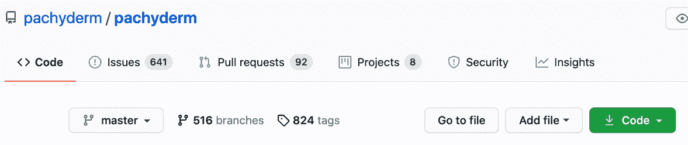

# 第十章：*第十章*: Pachyderm 语言客户端

在前面的章节中，我们已经学习了如何通过`pachctl`来使用 Pachyderm。我们简要地介绍了 Pachyderm 的**用户界面**（**UI**）—或称为仪表板—虽然我们没有广泛使用它。Pachyderm CLI 允许您执行所有 Pachyderm 管理操作，并且通常提供比 Pachyderm UI 更多的功能。

然而，许多用户可能决定通过使用 Pachyderm `pachctl`或仪表板进一步扩展 Pachyderm 的功能。许多 Pachyderm 用户开发脚本，并通过这些脚本直接调用 Pachyderm API。到目前为止，Pachyderm 提供了两个官方的 Pachyderm 编程语言客户端，**Golang**（**Go**）和 Python，以便高级用户进一步扩展 Pachyderm 的功能。

此外，如果您熟悉`pps.proto`文件，可以通过 C、C++和 Java 等语言访问 Pachyderm。

在本章中，您将学习如何使用 Python 和 Go Pachyderm 客户端。您将学习如何通过这两种客户端运行基本操作，包括如何创建仓库和管道。

本章旨在展示如何使用官方 Pachyderm 语言客户端。

我们将涵盖以下主题：

+   使用 Pachyderm Go 客户端

+   克隆 Pachyderm 源代码库

+   使用 Pachyderm Python 客户端

# 技术要求

您应该已经安装了接下来列出的组件。

对于本地 macOS 安装，您需要以下组件：

+   macOS Mojave、Catalina、Big Sur 或更高版本

+   Docker Desktop for Mac 10.14

+   `minikube` v1.9.0 或更高版本

+   `pachctl` 2.0.0 或更高版本

+   Pachyderm 2.0.0 或更高版本

对于本地 Windows 安装，您需要以下组件：

+   Windows Pro 64 位 v10 或更高版本

+   **Windows 子系统 Linux**（**WSL**）2 或更高版本

+   Microsoft PowerShell v6.2.1 或更高版本

+   Hyper-V

+   `minikube` v1.9.0 或更高版本

+   `kubectl` v1.18 或更高版本

+   `pachctl` 2.0.0 或更高版本

+   Pachyderm 2.0.0 或更高版本

对于**Amazon 弹性 Kubernetes 服务**（**Amazon EKS**）的安装，您需要以下组件：

+   `kubectl` v1.18 或更高版本

+   `eksctl`

+   `aws-iam-authenticator`

+   `pachctl` 2.0.0 或更高版本

+   Pachyderm 2.0.0 或更高版本

对于 Microsoft **Azure Kubernetes Service**（**AKS**）云端安装，您需要以下组件：

+   `kubectl` v1.18 或更高版本

+   Azure CLI

+   `pachctl` 2.0.0 或更高版本

+   Pachyderm 2.0.0 或更高版本

+   `jq` 1.5 或更高版本

对于**Google Kubernetes Engine**（**GKE**）云端安装，您需要以下组件：

+   Google Cloud **软件开发工具包**（**SDK**）v124.0.0 或更高版本

+   `kubectl` v1.18 或更高版本

+   `pachctl` 2.0.0 或更高版本

+   Pachyderm 2.0.0 或更高版本

## 下载源文件

本章的所有脚本可以在[`github.com/PacktPublishing/Reproducible-Data-Science-with-Pachyderm/tree/main/Chapter10-Pachyderm-Language-Clients`](https://github.com/PacktPublishing/Reproducible-Data-Science-with-Pachyderm/tree/main/Chapter10-Pachyderm-Language-Clients)获取。

我们将使用我们在*第六章*中的图像处理示例，*创建你的第一个 Pipeline*。如果你还没有这些文件，可以从这里下载该示例的文件：[`github.com/PacktPublishing/Reproducible-Data-Science-with-Pachyderm/tree/main/Chapter06-Creating-Your-First-Pipeline`](https://github.com/PacktPublishing/Reproducible-Data-Science-with-Pachyderm/tree/main/Chapter06-Creating-Your-First-Pipeline)。

# 使用 Pachyderm Go 客户端

Pachyderm Go 客户端使你能够通过 Go API 与 Pachyderm 进行通信。Go 是一种由 Google 开发的流行编程语言，近年来在开发者社区中变得广泛流行。在本章中，我们将学习如何启用 Pachyderm Go 客户端，并如何使用 Go 客户端执行基本的 Pachyderm 操作。

你可以参考的主要源文件位于 Pachyderm 源代码库的[`github.com/pachyderm/pachyderm/tree/master/src/client`](https://github.com/pachyderm/pachyderm/tree/master/src/client)目录下。这些文件包含了你可以用来与 Pachyderm 对象和原语进行通信的所有方法——具体来说，包括以下文件：

+   [`github.com/pachyderm/pachyderm/blob/master/src/client/client.go`](https://github.com/pachyderm/pachyderm/blob/master/src/client/client.go)

+   [`github.com/pachyderm/pachyderm/blob/master/src/client/pfs.go`](https://github.com/pachyderm/pachyderm/blob/master/src/client/pfs.go)

+   [`github.com/pachyderm/pachyderm/blob/master/src/client/pps.go`](https://github.com/pachyderm/pachyderm/blob/master/src/client/pps.go)

这些文件包括了大部分重要的 Pachyderm 方法，以及我们在接下来的章节中将使用的方法。

## 在你的计算机上安装 Go

为了开始使用，我们需要验证环境中是否有有效的 Go 安装。Go 支持所有主要操作系统，包括 Microsoft Windows、Linux 和 macOS。通过运行以下命令，检查你的计算机上是否安装了 Go：

```py
go version
```

你应该能看到类似下面的输出：

```py
go version go1.16.4 darwin/amd64
```

如果你的计算机上没有安装 Go，请按照以下步骤进行安装：

1.  访问[`golang.org/doc/install`](https://golang.org/doc/install)并下载适用于你操作系统的 Go 版本。

1.  打开下载的包并按照提示在系统中安装 Go。安装完成后，你应该能看到如下屏幕：

![图 10.1 – Go 安装]

](img/B17085_10_001.jpg)

图 10.1 – Go 安装

1.  根据你操作系统的说明，验证 Go 是否已按[`golang.org/doc/install`](https://golang.org/doc/install)中的描述安装。

1.  重启你的终端，并再次运行`go version`来验证你的安装。你应该能看到类似下面的输出：

    ```py
    go version go1.16.4 darwin/amd64
    ```

现在我们已经安装了 Go，接下来配置`$GOPATH`。

## 配置$GOPATH

如果你以前从未使用过 Go，你需要确保你的`$GOPATH`目录已正确设置；否则，本节中描述的任何脚本都无法正常工作。安装 Go 时，它可能已经被配置好了。不过，你可能还是想要配置以下内容：

1.  验证你在`~/.bash_profile`、`~/.profile`或`~/.zsh_profile`文件中有以下内容：

    ```py
    export GOPATH="$HOME/go"
    PATH="$GOPATH/bin:$PATH"
    ```

1.  如果你的 shell 配置文件中没有这个配置，请添加它，然后像这样执行你的 shell 配置文件：

    ```py
    source ~/.<shell-profile>
    ```

1.  通过运行以下命令检查你的`$GOPATH`目录：

    ```py
    go env
    ```

此命令将打印出你的 Go 环境配置。如果你使用的是 macOS，`$GOPATH`目录应该是`` `GOPATH="/Users/<username>/go"`. ``

1.  如果你还没有这个目录，请在你的`$GOPATH`目录下创建一个`src`目录，如下所示：

    ```py
    mkdir $GOPATH/src
    ```

1.  在`$GOPATH/src`下创建一个`github.com`目录，如下所示：

    ```py
    mkdir $GOPATH/src/github.com
    ```

你需要将 Pachyderm 仓库克隆到这个目录中，具体步骤将在下一章节中描述。

1.  更新到最新版本的`grpc`，如下所示：

    ```py
    go get google.golang.org/grpc
    ```

配置好`$GOPATH`后，你需要克隆 Pachyderm 源代码仓库。

## 克隆 Pachyderm 源代码仓库

在使用 Pachyderm 语言客户端之前，你需要将 Pachyderm 源代码仓库克隆到你的机器上，以便使用 API。你将通过客户端方法与现有的 Pachyderm 集群进行交互。Pachyderm 仓库存储在 GitHub 上，地址为[`github.com/pachyderm/pachyderm`](https://github.com/pachyderm/pachyderm)。此外，你还需要确保切换到与 `pachd` 和 `pachctl` 版本相匹配的分支和标签。在本节中，我们将学习如何克隆 Pachyderm 仓库，以及如何切换到所需的分支和标签。

为了能够运行本节脚本中使用的 Go 模块，你需要在计算机上的`$GOPATH`目录下克隆 Pachyderm 仓库。在 Mac 上，Go 安装在`/Users/<username>/go`目录下，你可以在`/Users/<username>/go/src/github.com/`路径下克隆 Pachyderm 仓库。

克隆 Pachyderm 仓库，请完成以下步骤：

1.  访问[`github.com/pachyderm/pachyderm`](https://github.com/pachyderm/pachyderm)。

1.  点击**代码**标签，如下图所示：



图 10.2 – Pachyderm 源代码仓库

1.  在下拉菜单中，选择使用**HTTPS**或**SSH**进行克隆，并点击**克隆**图标。

    重要说明

    如果你决定使用**安全外壳**（**SSH**）进行克隆，并且这是你第一次从 GitHub 克隆，可能需要配置一个 SSH 密钥对。有关更多信息，请参见[`docs.github.com/en/github/authenticating-to-github/connecting-to-github-with-ssh`](https://docs.github.com/en/github/authenticating-to-github/connecting-to-github-with-ssh)。

1.  打开终端，使用您在*步骤 3*中复制的**超文本传输协议安全** (**HTTPS**) 或 SSH 地址运行 `git clone` 命令，如下所示：

    ```py
    git clone git@github.com:pachyderm/pachyderm.git
    ```

您应该看到类似于以下的输出：

```py
Cloning into 'pachyderm'...
remote: Enumerating objects: 226153, done.
remote: Counting objects: 100% (171/171), done.
...
```

Pachyderm 源代码将被克隆到 `pachyderm` 目录。

1.  通过运行以下命令进入 `pachyderm` 目录：

    ```py
    cd pachyderm
    ```

1.  通过运行以下命令检查您所在的分支：

    ```py
    git branch
    ```

1.  通过运行以下命令获取标签列表：

    ```py
    git fetch –tags
    ```

1.  通过运行以下命令验证您正在使用的 `pachctl` 和 `pachd` 版本：

    ```py
    pachctl version
    ```

1.  您的输出可能如下所示：

    ```py
    COMPONENT           VERSION
    pachctl             2.0.1
    pachd               2.0.1
    ```

1.  查看与您使用的 `pachctl` 和 `pachd` 版本相对应的标签。在这个例子中，我们需要查看 `2.0.1` 标签：

    ```py
    git checkout tags/v2.0.1
    ```

1.  通过运行以下命令检查您是否切换到了正确的版本：

    ```py
    git branch
    ```

您应该看到以下输出：

```py
* (HEAD detached at v2.0.1)
  master
```

我们现在有了有效的 Pachyderm 源代码，我们将用它来访问我们的 Pachyderm 集群。接下来，让我们使用 Go 客户端连接到 Pachyderm。

## 使用 Go 客户端连接到 Pachyderm

您必须有一个正在运行的 Pachyderm 集群才能使用 Go API 客户端。如果您已经按照前面的步骤操作，您可能已经在您选择的云平台或本地运行了一个集群。如果没有，请返回到 *第四章*，*本地安装 Pachyderm*，或者 *第五章*，*在云平台上安装 Pachyderm*，并部署一个集群。

我们将使用 `access.go` 脚本来访问 Pachyderm。让我们看看这个脚本，了解它是如何工作的。脚本的第一部分导入了所需的组件，如我们在这里看到的：

```py
package main
 import (
     "fmt"
     "log"
     "github.com/gogo/protobuf/types"
     "github.com/pachyderm/pachyderm/v2/src/client"
)
```

脚本的第二部分定义了一个 `main` 函数。您必须在 Go 中使用 `main` 函数，否则它将无法工作。`main` 函数定义了 `localhost` 或 `127.0.0.1`。`30650` 是 `pachd` 端口：

```py
 func main() {
      c, err := client.NewFromURI("grpc://localhost:30650")
      if err != nil {
          log.Fatal(err)
      }
```

脚本的第三部分，如下所示，获取您的集群版本：

```py
     version, err := c.VersionAPIClient.GetVersion(c.Ctx(), &types.Empty{})
     if err != nil {
         panic(err)
     }
     fmt.Println(version)
}
```

要连接到 Pachyderm 集群，您需要知道集群的 IP 地址。如果在本地机器上运行这些示例，`grpc://localhost:30650` 应该有效。

现在，让我们运行脚本。请按照以下步骤操作：

1.  除非您已经部署了一个负载均衡器，以便访问您的集群，否则在通过 API 访问集群时，您还需要确保始终运行 Pachyderm 的端口转发。要启动 Pachyderm 端口转发，请在另一个终端窗口中运行以下命令：

    ```py
    pachctl port-forward
    ```

1.  运行 `access.go` 脚本，如下所示：

    ```py
    go run access.go
    ```

这是一个您应该获得的示例响应：

```py
major:2 micro:1
```

我们已经通过 Go API 成功访问了我们的集群。我们的集群正在运行版本 2.0.1\。您的版本可能不同。

现在，让我们使用 Go API 创建一个 Pachyderm 仓库。

## 使用 Go 客户端创建仓库

现在我们知道如何连接到 Pachyderm，让我们使用 `create-repo.go` 脚本中的代码来创建一个仓库。

下面是脚本导入的内容：

```py
package main
 import (
     "fmt"
     "log"
     "github.com/pachyderm/pachyderm/v2/src/client"
     "github.com/pachyderm/pachyderm/v2/src/pfs"
)
```

脚本的下一部分定义了一个`main`函数，执行以下操作：

1.  连接到 Pachyderm 集群。

1.  创建了一个名为`photos`的仓库。

1.  列出了该集群上的所有仓库。

它的样子如下：

```py
func main() {
     c, err := client.NewOnUserMachine("user")
     if err != nil {
         log.Fatal(err)
     }
     if _, err := c.PfsAPIClient.CreateRepo(
         c.Ctx(),
         &pfs.CreateRepoRequest{
             Repo:        client.NewRepo("photos"),
             Description: "A repository that stores images.",
             Update:      true,
         },
     ); err != nil {
         panic(err)
     }
     repos, err := c.ListRepo()
     if err != nil {
         log.Fatal(err)
     }
     fmt.Println(repos)
 }
```

你必须运行端口转发，并确保将脚本中列出的 IP 地址替换为你的集群 IP 地址。如果你在`minikube`中运行集群，你可能不需要更改任何内容。

1.  运行`create-repo.go`脚本，具体如下：

    ```py
    go run create-repo.go
    ```

该命令返回以下输出：

```py
[repo:<name:"photos" type:"user" > created:<seconds:1637264349 nanos:440180000 > description:"A repository that stores images." auth_info:<permissions:REPO_READ permissions:REPO_INSPECT_COMMIT permissions:REPO_LIST_COMMIT permissions:REPO_LIST_BRANCH permissions:REPO_LIST_FILE permissions:REPO_INSPECT_FILE permissions:REPO_ADD_PIPELINE_READER permissions:REPO_REMOVE_PIPELINE_READER permissions:PIPELINE_LIST_JOB permissions:REPO_WRITE permissions:REPO_DELETE_COMMIT permissions:REPO_CREATE_BRANCH permissions:REPO_DELETE_BRANCH permissions:REPO_ADD_PIPELINE_WRITER permissions:REPO_MODIFY_BINDINGS permissions:REPO_DELETE roles:"repoOwner" > ]
```

现在我们已经创建了一个仓库，接下来让我们往里面添加一些数据。

## 使用 Go 客户端将数据放入 Pachyderm 仓库

在前一部分中，我们创建了一个名为`photos`的 Pachyderm 仓库。接下来，我们将把我们在*第六章*中使用的文件，*创建你的第一个管道*，添加到这个仓库。我们将使用`put-files.go`脚本添加这些文件。下面是脚本导入的内容：

```py
package main
 import (
     "fmt"
     "log"
     "os"
     "github.com/pachyderm/pachyderm/v2/src/client"
)
```

脚本的下一部分连接到 Pachyderm 集群，并将`landscape.png`、`red_vase.png`和`hand.png`文件添加到`photos`仓库的`master`分支中。

这是连接到仓库的部分。确保你将 IP 地址替换为集群的地址：

```py
func main() {
     c, err := client.NewOnUserMachine("user")
     if err != nil {
         log.Fatal(err)
     }
```

这一部分添加了文件：

```py
     myCommit := client.NewCommit("photos","master", "")
     f1, err := os.Open("landscape.png")
     if err != nil {
         panic(err)
     }
     if err := c.PutFile(myCommit, "landscape.png", f1); err != nil {
         panic(err)}
     f2, err := os.Open("brown_vase.png")
     if err != nil {
         panic(err)
     }
     if err := c.PutFile(myCommit, "brown_vase.png", f2); err != nil {
         panic(err)
     }
     f3, err := os.Open("hand.png")
     if err != nil {
         panic(err)
     }
     if err := c.PutFile(myCommit, "hand.png", f3); err != nil {
         panic(err)
     }
```

最后一部分，如下所示，列出了`photos`仓库`master`分支中的文件：

```py
    files, err := c.ListFileAll(myCommit, "/")
    if err != nil {
        panic(err)
    }
    fmt.Println(files)
}
```

让我们通过以下命令运行这个脚本：

```py
go run put-files.go
```

这个脚本返回了以下输出：

```py
[file:<commit:<branch:<repo:<name:"photos" type:"user" > name:"master" > id:"2c15226b838f48cabd2ae13b43c26517" > path:"/brown_vase.png" datum:"default" > file_type:FILE committed:<seconds:1637299733 nanos:503150000 > size_bytes:93481 hash:"\2061\023\026\376O&\323\313\212\215\226Ra\346\245=Er\r_@E\023\360\352\240\275}\204\235\346"  file:<commit:<branch:<repo:<name:"photos" type:"user" > name:"master" > id:"2c15226b838f48cabd2ae13b43c26517" > path:"/hand.png" datum:"default" > file_type:FILE committed:<seconds:1637299733 nanos:503150000 > size_bytes:856063 hash:"\014X\224\032\0251\260(\263\267\234\345{\016\353a\0310\3579\354\323\372\013\357yFg\274\256\000}"  file:<commit:<branch:<repo:<name:"photos" type:"user" > name:"master" > id:"2c15226b838f48cabd2ae13b43c26517" > path:"/landscape.png" datum:"default" > file_type:FILE committed:<seconds:1637299733 nanos:503150000 > size_bytes:54009 hash:"\320:\265\036\3363z&\264\324]\364unfv\243\300\001[\206\347\344b\257\274\366\220JnR\004" ]
```

太好了！我们已经有一个包含数据的仓库了。现在，让我们学习如何创建管道。

## 使用 Go 客户端创建管道

最后，我们可以从*第六章*，*创建你的第一个管道*，为我们的示例创建管道。

下面是`create-pipeline.go`脚本导入的内容：

```py
package main
 import (
     "fmt"
     "log"

     "github.com/pachyderm/pachyderm/v2/src/client"
     "github.com/pachyderm/pachyderm/v2/src/pps""
 )
```

脚本的第二部分通过使用`pachd`的 IP 地址连接到 Pachyderm 集群，具体如下：

```py
func main() {
     c, err := client.NewFromAddress("127.0.0.1:30650")
     if err != nil {
         log.Fatal(err)
     }
```

脚本的下一部分创建了一个`contour`管道。你可以看到脚本使用了`svekars/contour-histogram:1.0`镜像，并通过`/`全局模式从`photos`仓库中获取数据。这里需要注意的一点是，你需要为所有管道指定`parallelism_spec`：

```py
if err := c.CreatePipeline(
         "contour",
         "svekars/contour-histogram:1.0 ",
         []string{"python3", "/contour.py"},
         []string{},
         &pps.ParallelismSpec{
             Constant: 1,
         },
         client.NewPFSInput("photos", "/"),
         "",
         false,
     ); err != nil {
         panic(err)
     }
```

接下来，脚本创建了一个`histogram`管道，具体如下：

```py
if err := c.CreatePipeline(
         "histogram",
         "svekars/contour-histogram:1.0",
         []string{"python3", "/histogram.py"},
         []string{},
         &pps.ParallelismSpec{
             Constant: 1,
         },
         client.NewPFSInput("contour", "/"),
         "",
         false,
     ); err != nil {
         panic(err)
     }
```

最后，脚本列出了所有已创建的管道，具体如下：

```py
     pipelines, err := c.ListPipeline(true)
     if err != nil {
         panic(err)
     }
     fmt.Println(pipelines)
 }
```

运行以下命令：

```py
go run create-pipeline.go
```

这是一个示例响应：

```py
[pipeline:<name:"histogram" > version:1 spec_commit:<branch:<repo:<name:"histogram" type:"spec" > name:"master" > id:"44945b0d0e2944e3b1015617e224e3e3" > state:PIPELINE_STARTING job_counts:<key:1 value:1 > last_job_state:JOB_CREATED parallelism:1 type:PIPELINE_TYPE_TRANSFORM details:<transform:<image:"svekars/contour-histogram:1.0" cmd:"python3" cmd:"/histogram.py" > parallelism_spec:<constant:1 > created_at:<seconds:1637300756 nanos:806783300 > output_branch:"master" input:<pfs:<name:"contour" repo:"contour" repo_type:"user" branch:"master" glob:"/" > > salt:"0715a02027ba4489a79bd8a400f349ad" datum_tries:3 reprocess_spec:"until_success" >  
pipeline:<name:"contour" > version:1 spec_commit:<branch:<repo:<name:"contour" type:"spec" > name:"master" > id:"f3f8bf226e5a4dda8a9f27da10b7fd87" > state:PIPELINE_STARTING job_counts:<key:1 value:1 > last_job_state:JOB_CREATED parallelism:1 type:PIPELINE_TYPE_TRANSFORM details:<transform:<image:"svekars/contour-histogram:1.0 " cmd:"python3" cmd:"/contour.py" > parallelism_spec:<constant:1 > created_at:<seconds:1637300756 nanos:592992600 > output_branch:"master" input:<pfs:<name:"photos" repo:"photos" repo_type:"user" branch:"master" glob:"/" > > salt:"98c0a867ea56439eb1f2466fbf1aa838" datum_tries:3 reprocess_spec:"until_success" > ]
```

你可以看到脚本已经创建了我们预期的两个管道。我们已经将整个示例上传到这一章的 GitHub 仓库中的`contour-go-example.go`文件里。现在你已经学会了如何做，你可以只运行这个脚本，通过一个命令创建一个完整的轮廓管道示例。接下来，我们将学习如何清理我们的集群。

## 使用 Go 客户端清理集群

`cleanup.go` 脚本会清理集群并删除所有管道、数据和仓库。只有在你不再希望保留数据时，才运行它。

这个脚本只需要从 Pachyderm 仓库中导入客户端。为此，需要以下代码：

```py
package main
 import (
     "fmt"
     "log"
     "github.com/pachyderm/pachyderm/v2/src/client"
 )
```

脚本的下一部分删除所有的仓库和管道。我们将所有管道和仓库的 `force` 标志设置为 `true`，以便 Pachyderm 不会因为下游管道的依赖关系而中断删除。代码如下所示：

```py
     if err := c.DeleteRepo("contour", true); err != nil {
         panic(err)
     }
     if err := c.DeleteRepo("photos", true); err != nil {
          panic(err)
     }
     if err := c.DeleteRepo("histogram", true); err != nil {
           panic(err)
     }
     if err := c.DeletePipeline("contour", true); err != nil {
           panic(err)
     }
     if err := c.DeletePipeline("histogram", true); err != nil {
           panic(err)
     }
```

脚本的最后部分返回空列表，因为我们删除了所有的管道和仓库，如以下代码片段所示：

```py
pipelines, err := c.ListPipeline(true)
     if err != nil {
         panic(err)
     }
     fmt.Println(pipelines)
     repos, err := c.ListRepo()
     if err != nil {
         log.Fatal(err)
     }
     fmt.Println(repos)
 }
```

运行以下命令：

```py
go run cleanup.go
```

这个命令会返回以下输出：

```py
[]
[]
```

在这一部分中，我们学习了如何使用 Go 客户端创建 Pachyderm 管道和仓库。接下来，让我们学习如何使用 Pachyderm Python 客户端来实现这一点。

# 使用 Pachyderm Python 客户端

Python 可能是软件工程和数据科学社区中最受欢迎的编程语言之一。Pachyderm 通过 `python-pachyderm` 包提供了一个官方支持的 Python 客户端。你可以在 GitHub 上找到 Python Pachyderm 的源代码仓库，网址为 [`github.com/pachyderm/python-pachyderm`](https://github.com/pachyderm/python-pachyderm)，也可以在 **Python 包索引** (**PyPI**) 上找到，网址为 [`pypi.org/project/python-pachyderm/`](https://pypi.org/project/python-pachyderm/)。

作为 Python 客户端参考的主要文件位于 Pachyderm 源代码仓库的 [`github.com/pachyderm/python-pachyderm/tree/master/src/python_pachyderm/mixin`](https://github.com/pachyderm/python-pachyderm/tree/master/src/python_pachyderm/mixin) 目录下，最重要的文件如下：

+   [`github.com/pachyderm/python-pachyderm/blob/master/src/python_pachyderm/client.py`](https://github.com/pachyderm/python-pachyderm/blob/master/src/python_pachyderm/client.py)

+   [`github.com/pachyderm/python-pachyderm/blob/master/src/python_pachyderm/mixin/pfs.py`](https://github.com/pachyderm/python-pachyderm/blob/master/src/python_pachyderm/mixin/pfs.py)

+   [`github.com/pachyderm/python-pachyderm/blob/master/src/python_pachyderm/mixin/pps.py`](https://github.com/pachyderm/python-pachyderm/blob/master/src/python_pachyderm/mixin/pps.py)

在继续之前，你的机器上必须配置以下组件：

+   Pachyderm 仓库的一个副本（参见 *克隆 Pachyderm 源代码仓库* 部分）。使用 Python Pachyderm，你可以将仓库克隆到机器上的任何目录。它不必在 `$GOPATH` 中。

+   机器上安装了 Python 3.6 或更高版本。

+   访问一个活动的 Pachyderm 集群。如果是本地安装，你需要在通过 API 与仓库交互时保持 Pachyderm 的端口转发始终运行。如果是云安装，你需要启用负载均衡器以允许访问集群，或者你也可能能够使用 Pachyderm 的端口转发。

我们已经回顾了本节的先决条件。现在，让我们安装 `python-pachyderm` 客户端。

## 安装 Pachyderm Python 客户端

在开始使用 Pachyderm Python 客户端之前，你需要在你的机器上安装它。

要安装 Python Pachyderm 客户端，请完成以下步骤：

1.  打开一个终端窗口。

1.  如果你使用的是 macOS 或 Linux，请运行以下命令：

    ```py
    pip install python-pachyderm
    ```

你应该看到以下输出：

```py
Collecting python-pachyderm
  Downloading python-pachyderm-6.2.0.tar.gz (409 kB)
  ...
Successfully installed grpcio-1.38.0 protobuf-3.17.0 python-pachyderm-6.2.0
```

你安装的 `python-pachyderm` 包的版本可能不同。

现在我们已经安装了 `python-pachyderm`，让我们通过使用 `python-pachyderm` 连接到 Pachyderm。

## 使用 Python 客户端连接到你的 Pachyderm 集群

为了开始，我们使用 `access.py` 脚本连接到你的集群。确保端口转发在你的机器上正在运行。这里是脚本：

```py
import python_pachyderm
client = python_pachyderm.Client()
print(client.get_remote_version())
```

这个脚本通过使用 `python_pachyderm.Client()` 调用连接到运行在 [`localhost:30650`](https://localhost:30650) 上的 `pachd`，并打印出你正在运行的 Pachyderm 版本。

让我们运行这个脚本，看看它返回什么输出。

使用以下命令运行 `access.py` 脚本：

```py
python access.py
```

你应该看到类似于以下的输出：

```py
major: 2
micro: 1
```

这个输出意味着我们正在使用版本 2.0.1。你的输出可能不同。

现在我们知道如何访问集群了，接下来让我们创建一个 Pachyderm 仓库。

## 使用 Python 客户端创建一个 Pachyderm 仓库

我们将使用 `create-repo.py` 脚本创建一个名为 `photos` 的 Pachyderm 仓库。

这是脚本的代码：

```py
import python_pachyderm
client = python_pachyderm.Client()
client.create_repo("photos")
print(list(client.list_repo()))
```

使用以下命令运行 `create-repo.py` 脚本：

```py
python create-repo.py
```

这是一个示例输出：

```py
repo {
  name: "photos"
  type: "user"
}
created {
  seconds: 1637207890
  nanos: 80987000
}
auth_info {
  permissions: REPO_READ
  permissions: REPO_INSPECT_COMMIT
...
```

现在我们已经创建了一个仓库，让我们把一些数据放入其中。

## 使用 Python 客户端将数据放入 Pachyderm 仓库

我们将把在 [*第六章* 中使用的相同文件，即 *创建你的第一个管道*，放入我们刚刚创建的 `photos` 仓库中。以下是我们将使用的脚本：

```py
import python_pachyderm
client = python_pachyderm.Client()
with client.commit('photos', 'master') as i:
     client.put_file_url(i, 'landscape.png', 'https://i.imgur.com/zKo9Mdl.jpg')
     client.put_file_url(i, 'hand.png', 'https://i.imgur.com/HtZ8FyG.png')
     client.put_file_url(i, 'red_vase.png', 'https://i.imgur.com/d45jop9.jpg') print(list(client.list_file(("photos","master"), "/")))
```

该脚本使用 `client.commit` 方法开始提交到 `photos` 仓库的主分支，`client.put_file_bytes` 向仓库添加三个文件。请注意，`client.list_file` 需要是 `list` 类型，而不是 `string`，以便命令能够正确运行。

让我们运行这个脚本。

使用以下命令运行 `put-files.py` 脚本：

```py
python put-files.py
```

这是你应该得到的系统响应：

```py
[file {
  commit {
    branch {
      repo {
        name: "photos"
        type: "user"
      }
      name: "master"
    }
    id: "e29c6f5c49244ce193fe5f86c9df0297"
  }
  path: "/hand.png"
  datum: "default"
}
file_type: FILE
committed {
  seconds: 1637208291
  nanos: 161527000
}
size_bytes: 856063
hash: "\014X\224\032\0251\260(\263\267\234\345{\016\353a\0310\3579\354\323\372\013\357yFg\274\256\000}"  
...
]
```

上面的输出被截断了。你应该会看到我们添加到仓库的每个文件的相同输出。

现在我们已经添加了文件，让我们为这个示例创建管道。

## 使用 Pachyderm Python 客户端创建管道

现在我们已经上传了仓库和文件，让我们使用`create-pipeline.py`脚本根据我们在*第六章*中介绍的示例，创建两个管道，*创建你的第一个管道*。

`python-pachyderm`提供了两种方法来创建管道，具体如下：

+   `create_pipeline`：此方法适用于所有语言，等同于`pachctl create pipeline`方法。

+   `create_python_pipeline`：此管道旨在与 Python 代码一起运行，并提供稍微不同的**用户体验**（**UX**）。你可以在 Pachyderm 文档中了解更多关于此方法的信息，访问[`docs.pachyderm.com`](https://docs.pachyderm.com)。

我们将使用标准的`create_pipeline`方法来创建这个管道。

脚本的第一部分创建一个`contour`管道，代码如下：

```py
import python_pachyderm
from python_pachyderm.service import pps_proto
client = python_pachyderm.Client()
 client.create_pipeline(
     pipeline_name="contour",
     transform=pps_proto.Transform(
         cmd=["python3", "contour.py"],
         image="svekars/contour-histogram:1.0",
     ),
     input=pps_proto.Input(
         pfs=pps_proto.PFSInput(glob="/", repo="photos")
     ),
 )
```

脚本的第二部分创建一个`histogram`管道，代码如下：

```py
client.create_pipeline(
     pipeline_name="histogram",
     transform=pps_proto.Transform(
         cmd=["python3", "histogram.py"],
         image="svekars/contour-histogram:1.0",
     ),
     input=pps_proto.Input(
         pfs=pps_proto.PFSInput(glob="/", repo="contour")
     ),
 )
```

脚本的最后一部分返回一个列表，显示已创建的管道，如以下代码片段所示：

```py
 Print(list(client.list_pipeline()))
```

让我们运行这个脚本。

使用以下命令运行`create-pipeline.py`脚本：

```py
python create-pipeline.py
```

这是输出的一部分：

```py
[pipeline {
  name: "histogram"
}
version: 1
spec_commit {
  branch {
    repo {
      name: "histogram"
      type: "spec"
    }
    name: "master"
  }
  id: "94286ef36318425c8177bd4e0f959c57"
}
state: PIPELINE_STARTING
job_counts {
  key: 1
  value: 1
}...
```

在本节中，我们已经学习了如何使用`python-pachyderm`客户端创建管道。接下来，让我们清理我们的集群。

## 使用 Python 客户端清理集群

我们已经成功地重建了我们的轮廓（contour）和直方图（histogram）管道示例。整个示例作为一个文件`contour-histogram-example.py`，可以在 GitHub 代码库中找到。你可以通过[`github.com/PacktPublishing/Reproducible-Data-Science-with-Pachyderm/tree/main/Chapter10-Pachyderm-Language-Clients`](https://github.com/PacktPublishing/Reproducible-Data-Science-with-Pachyderm/tree/main/Chapter10-Pachyderm-Language-Clients)下载并根据需要多次重建。

在本节中，我们将清理集群，以便为*第十一章*《使用 Pachyderm 笔记本》提供一个干净的安装环境。我们将使用`cleanup.py`脚本来实现这一点，代码如下：

```py
import python_pachyderm
client.delete_repo("photos", force=True)
client.delete_pipeline(pipeline_name="contour", force=True, keep_repo=False)
client.delete_pipeline(pipeline_name="histogram", force=True, keep_repo=False)
print(list(client.list_repo()))
print(list(client.list_pipeline()))
```

该脚本使用了`delete_all_pipelines`方法，它会删除集群中的所有管道。你还可以使用`delete_all`来删除集群中的所有对象和原始数据。

让我们运行这个脚本。

使用以下命令运行`cleanup.py`脚本：

```py
python cleanup.py
```

该命令应该返回以下输出：

```py
[]
[]
```

就这样！我们已经成功地清理了我们的集群。

# 总结

在本章中，我们学习了如何使用两个官方支持的 Pachyderm 语言客户端——Pachyderm Go 客户端和 Python 客户端。我们学习了如何克隆 Pachyderm 代码库并切换到正确的分支和标签。我们学习了如何连接、创建仓库、将文件放入仓库并创建管道，以及完成后删除所有对象。你可以使用这两个语言客户端做更多事情，但本章中的示例为你提供了如何使用它们的一般思路。

在下一章节，我们将学习如何将 Pachyderm 与流行的数据科学 `python-pachyderm` 客户端集成到 JupyterHub 中。

# 进一步阅读

+   使用 Traefik 设置 Ingress 以访问 Pachyderm UI：[`docs.pachyderm.com/latest/deploy-manage/deploy/ingress/pach-ui-ingress/#traefik-ingress-controller-on-pachyderm-uis-cluster-in-one-diagram`](https://docs.pachyderm.com/latest/deploy-manage/deploy/ingress/pach-ui-ingress/#traefik-ingress-controller-on-pachyderm-uis-cluster-in-one-diagram)

+   *使用 SSH 连接 GitHub*：[`docs.github.com/en/github/authenticating-to-github/connecting-to-github-with-ssh`](https://docs.github.com/en/github/authenticating-to-github/connecting-to-github-with-ssh)

+   Go 文档：[`golang.org/doc/`](https://golang.org/doc/)

+   Python 3 文档：[`docs.python.org/3/`](https://docs.python.org/3/)

+   Python Pachyderm 客户端文档：[`python-pachyderm.readthedocs.io/en/stable/`](https://python-pachyderm.readthedocs.io/en/stable/)
