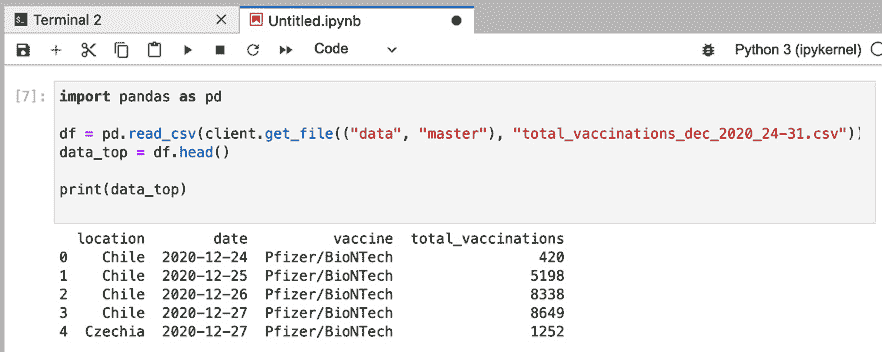

# 第十一章：*第十一章*：使用 Pachyderm Notebooks

在 *第十章*《*Pachyderm 语言客户端*》中，我们学习了如何使用 Pachyderm 语言客户端，包括 Pachyderm Go 客户端和 Pachyderm Python 客户端。后者可能在数据科学家中更受欢迎，因为 Python 是许多数据科学家使用的语言。而且如果你使用 Python 编写代码，你可能对开源工具 **JupyterLab** 很熟悉。

JupyterLab 是一个开源平台，提供 **交互式开发环境**（**IDE**），你不仅可以编写代码，还可以执行代码。这个优点使得 JupyterLab 成为数据科学实验的理想工具。然而，尽管 JupyterLab 为其笔记本提供了基本的版本控制系统，但它的版本控制系统并不具备 Pachyderm 所提供的数据来源级别。Pachyderm Hub，作为 Pachyderm 的 SaaS 版本，提供了一种将 Pachyderm 集群与 Pachyderm Notebooks 集成的方式，后者是 JupyterLab 的内置版本，并与 Pachyderm 配合使用。

本章旨在演示如何在 Pachyderm Hub 中配置 Pachyderm 集群，并使用 Pachyderm Notebooks。在本章结束时，我们将学习如何在 Pachyderm Notebooks 中运行基本的 Pachyderm 操作，并创建一个情感分析管道。

本章内容包括以下主题：

+   在 Pachyderm Hub 中启用 Pachyderm Notebooks

+   在 Pachyderm Notebooks 中运行基本的 Pachyderm 操作

+   在 Pachyderm Notebooks 中创建并运行一个示例管道

# 技术要求

你应该已经安装了以下组件：

+   `pachctl` 2.0.0 或更高版本

+   访问 Pachyderm Hub

+   一个 GitHub 或 Gmail 账户

## 下载源文件

本节中使用的所有代码示例都存储在为本书创建的 GitHub 仓库中，链接为 [`github.com/PacktPublishing/Reproducible-Data-Science-with-Pachyderm/tree/main/Chapter11-Using-Pachyderm-Notebooks`](https://github.com/PacktPublishing/Reproducible-Data-Science-with-Pachyderm/tree/main/Chapter11-Using-Pachyderm-Notebooks)。

本节中使用的 `Dockerfile` 存储在 [`hub.docker.com/repository/docker/svekars/pachyderm-ide`](https://hub.docker.com/repository/docker/svekars/pachyderm-ide)。

# 在 Pachyderm Hub 中启用 Pachyderm Notebooks

在你能使用 Pachyderm Notebooks 之前，你需要在 Pachyderm Hub 创建一个账户和一个 Pachyderm 工作区。Pachyderm Hub 为所有用户提供试用期，供其测试功能。

试用期结束后，你需要升级到 Pachyderm Pro 版本才能继续使用 Pachyderm Notebooks。

## 创建一个工作区

在 Pachyderm Hub 中，你的工作是以 **工作区**（workspaces）形式组织的。一个工作区是一个容器，其中可以运行多个 Pachyderm 集群。你的组织可能决定将每个工作区分配给一组工程师。

在创建工作区之前，你需要一个 Pachyderm Hub 帐户，所以我们来创建一个。Pachyderm Hub 支持使用 Gmail 和 GitHub 进行身份验证。你必须拥有其中之一才能在 Pachyderm Hub 创建帐户。

创建 Pachyderm Hub 帐户，请完成以下步骤：

1.  访问[`www.pachyderm.com/try-pachyderm-hub#`](https://www.pachyderm.com/try-pachyderm-hub#)，并填写提供的表单以申请 Pachyderm Hub 的免费试用。你的帐户激活可能需要一些时间，你将收到包含指示的电子邮件。

1.  使用你在注册表单中提供的 Gmail 或 GitHub 帐户登录 Pachyderm Hub 帐户。

1.  填写**开始使用**表单并点击**开始使用**。

1.  点击**创建工作区**，填写弹出表单，内容如下面的截图所示，然后点击**创建**：


图 11.1 – 创建一个新工作区

创建工作区时，你将自动部署一个 Pachyderm 集群。如果你正在使用 Pachyderm 的试用版，你将部署一个单节点集群，这应该足够进行测试。

现在你已经创建了第一个工作区，接下来你需要使用`pachctl`连接到你的集群。

## 使用 pachctl 连接到你的 Pachyderm Hub 工作区

如果这不是你在本书中阅读的第一章，你应该已经在计算机上安装了`pachctl`。否则，请按照*第四章*中的说明，*在本地安装 Pachyderm*。

要连接到 Pachyderm Hub 工作区，请执行以下步骤：

1.  在 Pachyderm Hub UI 中，找到你的工作区，然后点击 CLI 链接。

1.  按照界面中的指示，切换你的 Pachyderm 上下文，并启用计算机与 Pachyderm Hub 上工作区之间的通信。

1.  在身份验证后，运行以下命令：

    ```py
    pachctl version
    ```

你应当得到以下响应：

```py
COMPONENT           VERSION
pachctl             2.0.1
pachd               2.0.1
```

1.  通过运行以下命令检查是否已切换到正确的上下文：

    ```py
    pachctl config get active-context
    ```

该命令应返回你在 Pachyderm Hub 工作区的名称。

现在你可以通过计算机终端中的`pachctl`与部署在 Pachyderm Hub 上的集群进行通信。

现在我们已经配置好了集群，接下来让我们连接到 Pachyderm 笔记本。

## 连接到 Pachyderm 笔记本

**Pachyderm 笔记本**是一个**IDE**，为数据科学家提供便捷访问常用的 Python 库。你可以在单元格中运行和测试代码，而 Pachyderm 会为你的管道提供支持。

要连接到 Pachyderm 笔记本，请完成以下步骤：

1.  在 Pachyderm Hub UI 中，进入你的工作区，点击**笔记本**：


图 11.2 – 访问 Pachyderm 笔记本

1.  当提示时，点击**使用 OAuth 2.0 登录**，然后使用具有 Pachyderm Hub 访问权限的帐户登录。

1.  在**服务器选项**页面，选择**默认**服务器：


图 11.3 – 服务器选项

1.  点击 **开始** 然后点击 **启动服务器**。

你应该看到以下屏幕：


图 11.4 – Pachyderm 笔记本首页

现在我们可以访问 Pachyderm 笔记本了，我们可以直接从 Pachyderm 笔记本 UI 创建 Pachyderm 管道，实验 Python 代码和 `python-pachyderm`，运行 `pachctl` 命令，甚至创建 `Markdown` 文件来记录我们的实验。我们将在下一部分详细了解此功能。

# 在 Pachyderm 笔记本中运行基本的 Pachyderm 操作

Pachyderm 笔记本的主要优势是它提供了统一的体验。你不仅可以在其中运行实验，还可以通过集成终端使用 `pachctl` 和 `python-pachyderm` 访问你的 Pachyderm 集群。你通过 JupyterLab UI 创建的所有管道将在你的 Pachyderm 集群中反映出来，无论它是在本地运行还是在云平台上。

现在，让我们看看如何使用 Pachyderm 笔记本访问我们的 Pachyderm 集群。

## 使用集成终端

你可以在 Pachyderm 笔记本中运行集成终端，并使用它执行 `pachctl` 或任何其他 `UNIX` 命令。

要使用集成终端，请完成以下步骤：

1.  在 Pachyderm 笔记本首页，点击 **终端**。

1.  点击 **终端** 图标以启动一个新的终端窗口：


图 11.5 – 在 Pachyderm 笔记本中启动终端

1.  获取 Pachyderm 的版本：

    ```py
    pachctl version
    ```

尝试运行你在前几章中学习的其他 Pachyderm 命令，看看它是如何工作的。

重要提示

`pachctl` 和 `pachd` 的版本与从你计算机终端直接运行的版本不同，因为 Pachyderm 笔记本有一个预安装的 `pachctl` 版本，而这个版本有时可能与集群的版本不匹配。这个差异不应影响你使用 Pachyderm 的工作。

现在我们知道如何使用终端了，让我们尝试创建一个 Pachyderm 笔记本。

## 使用 Pachyderm 笔记本

笔记本是一个交互式文档，用户可以在其中编写 Python 代码，运行它并可视化结果。这些功能使得笔记本成为许多数据科学家在工作中使用的优秀实验工具。实验完成后，你可能希望将笔记本导出为 Python 脚本或库。

Pachyderm 笔记本支持以下类型的笔记本：

+   Python 笔记本

+   Julia 笔记本

+   R 笔记本

这三种语言似乎是数据科学家中最受欢迎的。你可以创建 Julia 和 R 笔记本，专门实验你想在管道中使用的代码。通过 Python 笔记本，你不仅可以测试代码，还可以使用 `python-pachyderm` 客户端与 Pachyderm 集群进行交互。

重要提示

本节中描述的代码可以在 [`github.com/PacktPublishing/Reproducible-Data-Science-with-Pachyderm/blob/main/Chapter11-Using-Pachyderm-Notebooks/example.ipynb`](https://github.com/PacktPublishing/Reproducible-Data-Science-with-Pachyderm/blob/main/Chapter11-Using-Pachyderm-Notebooks/example.ipynb) 文件中找到。

让我们创建一个 Python 笔记本并运行几个命令：

1.  在 Pachyderm 笔记本主页屏幕上，点击 Python 3 笔记本图标以创建一个新的笔记本。

1.  我们可以在这个笔记本中使用常规 Python 和 `python-pachyderm`。例如，要获取当前 Pachyderm 集群的版本并列出所有仓库，可以将以下内容粘贴到笔记本的单元格中：

    ```py
    import python_pachyderm
    client = python_pachyderm.Client()
    print(client.get_remote_version())
    print(list(client.list_repo()))
    ```

1.  点击运行图标以运行脚本并获得结果：


图 11.6 – 在笔记本中运行 python-pachyderm

1.  通过将以下代码粘贴到下一个单元格并运行，创建一个仓库：

    ```py
    client.create_repo("data")
    print(list(client.list_repo()))
    ```

这是你应该看到的输出：


图 11.7 – 列出仓库

请注意，你不需要在第二个及后续单元格中导入 `python_pachyderm` 并定义客户端，因为你已经在第一个单元格中定义过了。

1.  让我们向数据仓库中添加一些文件：

    ```py
    with client.commit('data', 'master') as i:
        client.put_file_url(i, 'total_vaccinations_dec_2020_24-31.csv', 'https://raw.githubusercontent.com/PacktPublishing/Reproducible-Data-Science-with-Pachyderm/main/Chapter11-Using-Pachyderm-Notebooks/total_vaccinations_dec_2020_24-31.csv')
    print(list(client.list_file(("data", "master"), "")))
    ```

这是你应该看到的输出：


图 11.8 – 上传文件输出

这个数据集包含了从 2020 年 12 月 24 日到 12 月 31 日的 COVID-19 疫苗接种统计数据。

1.  你可以通过运行以下代码打印文件内容：

    ```py
    import pandas as pd
    pd.read_csv(client.get_file(("data", "master"), "total_vaccinations_dec_2020_24-31.csv"))
    ```

你应该看到以下输出：


图 11.9 – 总疫苗接种数

这个 CSV 文件包含以下列：**位置**、**日期**、**疫苗**（生产商）和 **总疫苗接种数**。

1.  让我们还打印文件的前五行，以查看列名：

    ```py
    import pandas as pd
    df = pd.read_csv(client.get_file(("data", "master"), "total_vaccinations_dec_2020_24-31.csv"))
    data_top = df.head() 
    print(data_top)
    ```

你应该看到以下输出：



图 11.10 – 前五行

1.  最后，让我们创建一个简单的管道，它将告诉我们在观察期内，某一天哪一个国家进行了最多的疫苗接种：

    ```py
     from python_pachyderm.service import pps_proto
    client.create_pipeline(
         pipeline_name="find-vaccinations",
         transform=pps_proto.Transform(
             cmd=["python3"],
             stdin=[
                 "import pandas as pd",
                 "df = pd.read_csv('/pfs/data/total_vaccinations_dec_2020_24-31.csv')",
                 "max_vac = df['total_vaccinations'].idxmax()",
                 "row = df.iloc[[max_vac]]",
                 "row.to_csv('/pfs/out/max_vaccinations.csv', header=None, index=None, sep=' ', mode='a')",
             ],
             image="amancevice/pandas",
         ),
         input=pps_proto.Input(
             pfs=pps_proto.PFSInput(glob="/", repo="data")
         ),
    )
    print(list(client.list_pipeline()))
    ```

你应该看到以下输出：


图 11.11 – 创建管道输出

1.  让我们通过执行以下代码来获取管道的结果：

    ```py
    client.get_file(("find-vaccinations", "master"), "/max_vaccinations.csv").read() 
    ```

你应该看到以下输出：


图 11.12 – 管道的结果

我们的管道已经确定，在 12 月 24 日至 12 月 31 日期间，**德国**在 **12 月 31 日**进行了最多的疫苗接种。接种的数量是 **206443**，生产商是 **Pfizer/BioNTech**。

1.  要清理你的集群，请运行以下命令：

    ```py
    client.delete_repo("data", force=True)
    client.delete_pipeline("find-vaccinations")
    print(list(client.list_repo()))
    print(list(client.list_pipeline()))
    ```

你应该看到以下输出：


图 11.13 – 集群清理

在本节中，我们学习了如何在 Pachyderm Python Notebooks 中执行基本的 Pachyderm 操作。接下来，我们将创建另一个示例流水线。

# 在 Pachyderm Notebooks 中创建并运行一个示例流水线

在上一节中，我们学习了如何使用 Pachyderm Notebooks，创建仓库，存放数据，甚至创建了一个简单的流水线。在本节中，我们将创建一个对 Twitter 数据集进行情感分析的流水线。

重要提示

本节中描述的代码可以在[`github.com/PacktPublishing/Reproducible-Data-Science-with-Pachyderm/blob/main/Chapter11-Using-Pachyderm-Notebooks/sentiment-pipeline.ipynb`](https://github.com/PacktPublishing/Reproducible-Data-Science-with-Pachyderm/blob/main/Chapter11-Using-Pachyderm-Notebooks/sentiment-pipeline.ipynb)文件中找到。

我们将使用 Kaggle 上的修改版国际妇女节推文数据集，数据集链接为[`www.kaggle.com/michau96/international-womens-day-tweets`](https://www.kaggle.com/michau96/international-womens-day-tweets)。我们的修改版仅包含两列——推文编号**#**和**文本**。该数据集包含**51,480**行数据。

以下是数据集前几行的提取：

```py
    #                        text
0  3  "She believed she could, so she did." #interna...
1  4  Knocking it out of the park again is\r\n@marya...
2  5  Happy International Women's Day! Today we are ...
3  6  Happy #InternationalWomensDay You're all power...
4  7  Listen to an experimental podcast recorded by ...
```

下面是工作流程的图示：


图 11.14 – 情感分析流水线

在下一节中，我们将学习构建该流水线所使用的方法论。

## 流水线方法论

我们将使用`TextBlob`，一个用于文本处理的开源 Python 库，对数据集中的推文进行情感分析。

**情感分析**是一种帮助理解特定对话中涉及个体整体情绪的技术，讨论特定的产品和服务，或评估一部电影。情感分析在各种类型的商业和行业中被营销人员和社会学家广泛使用，用于快速评估客户情绪。在本例中，我们将查看有关国际妇女节的一些推文中表达的情感。

`TextBlob`提供了两种情感分析指标——极性和主观性。句子中的每个单词都被分配一个分数，然后将该分数的平均值分配给整个句子。在本例中，我们将只确定推文的极性。极性根据预定义的单词强度来定义句子的积极性或消极性。

极性值范围从-1 到 1，其中-1 表示负面情感，0 表示中性，1 表示正面。如果我们将其显示在一个刻度上，它会是这样的：


图 11.15 – 极性

如果我们将这些单词放入表格中并分配极性分数，可能会得到如下结果：


图 11.16 – 极性分数

让我们快速运行一个简单句子的`TextBlob`示例，看看它是如何工作的。使用`sentiment-test.py`文件中的代码尝试这个示例：

```py
from textblob import TextBlob
text = '''Here is the most simple example of a sentence. The rest of the text is autogenerated. This gives the program some time to perform its computations and then tries to find the shortest possible   possible sentence. Finally, let's look at the output that is used for the rest of the process.'''
blob = TextBlob(text)
blob.tags
blob.noun_phrases
for i in blob.sentences:
    print(i.sentiment.polarity)
```

要运行这个脚本，完成以下步骤：

1.  你需要在 Pachyderm 笔记本终端中安装`TextBlob`：

    ```py
    pip install textblob && python -m textblob.download_corpora
    ```

这是你应该看到的输出：

![图 11.17 – 安装 TextBlob]

](img/B17085_11_017.jpg)

图 11.17 – 安装 TextBlob

1.  在本地终端或 Jupyter Notebook 中运行`sentiment-test.py`：

![图 11.18 – sentiment-test.py 脚本的输出]

](img/B17085_11_018.jpg)

图 11.18 – sentiment-test.py 脚本的输出

如输出所示，`TextBlob`会为每个句子分配一个评分。

现在我们已经回顾了示例的方法论，让我们创建我们的管道。

## 创建管道

我们的第一个管道将使用 NLTK 来清理`data.csv`文件中的 Twitter 数据。我们将使用`python-pachyderm`创建一个标准的 Pachyderm 管道。该管道将从数据存储库中获取文件，运行`data-clean.py`脚本，并将清理后的文本输出到`data-clean`输出存储库。该管道将使用`svetkar/pachyderm-ide:1.0` Docker 镜像来运行代码。

`data-clean.py`的第一部分导入了我们在*第八章*中熟悉的组件，*创建端到端机器学习工作流*。这些组件包括 NLTK 和`pandas`，我们将用它们来预处理数据。我们还将导入`re`来指定正则表达式：

```py
import nltk
import pandas as pd
from nltk.corpus import stopwords
from nltk.tokenize import word_tokenize
nltk.download('wordnet')
nltk.download('punkt')
import re
```

脚本的第二部分使用 NLTK 的`word_tokenize`方法、`stopwords`和`lambda`函数，以及`re.split`来移除 URL，进行数据清理。最后，脚本将清理后的文本保存到`cleaned-data.csv`文件中，存放在输出存储库：

```py
stopwords = stopwords.words("english")
data = pd.read_csv("/pfs/data/data.csv", delimiter=",")
tokens = data['text'].apply(word_tokenize)
remove_stopwords = tokens.apply(lambda x: [w for w in x if w not in stopwords and w.isalpha()])
remove_urls = remove_stopwords.apply(lambda x: re.split('https:\/\/.*', str(x))[0])
remove_urls.to_csv('/pfs/out/cleaned-data.csv', index=True)
```

我们的第二个管道将使用`TextBlob` Python 库对清理后的数据执行情感分析。`sentiment.py`脚本导入了以下组件：

```py
from textblob import TextBlob
import pandas as pd
import seaborn as sns
import matplotlib.pyplot as plt
from contextlib import redirect_stdout
```

我们将使用`pandas`来操作数据框。我们将使用`matplotlib`和`seaborn`来可视化结果，并使用`redirect_stdout`将结果保存到文件中。

接下来，我们的脚本执行情感分析并创建两个新列——`polarity_score`和`sentiment`。结果表格保存为一个名为`polarity.csv`的新 CSV 文件：

```py
data = pd.read_csv('/pfs/data-clean/cleaned-data.csv', delimiter=',')
data = data[['text']]
data["polarity_score"] = data["text"].apply(lambda data: TextBlob(data).sentiment.polarity)
data['sentiment'] = data['polarity_score'].apply(lambda x: 'Positive' if x >= 0.1 else ('Negative' if x <= -0.1 else 'Neutral'))
print(data.head(10))
data.to_csv('/pfs/out/polarity.csv', index=True)
```

然后，脚本将情感类别的推文保存到其自己的变量中，计算每个类别的总数，并将总数保存到`number_of_tweets.txt`文件：

```py
positive = [ data for index, t in enumerate(data['text']) if data['polarity_score'][index] > 0]
neutral = [ data for index, tweet in enumerate(data['text']) if data['polarity_score'][index] == 0]
negative = [ data for index, t in enumerate(data['text']) if data['polarity_score'][index] < 0]
with open('/pfs/out/number_of_tweets.txt', 'w') as file:
      with redirect_stdout(file):
          print("Number of Positive tweets:", len(positive))
          print("Number of Neutral tweets:", len(neutral))
          print("Number of Negative tweets:", len(negative))
```

脚本的最后部分绘制了一个饼图，显示每个类别推文的百分比，并将其保存到`plot.png`文件中：

```py
colors = ['#9b5de5','#f15bb5','#fee440']
figure = pd.DataFrame({'percentage': [len(positive), len(negative), len(neutral)]},
                       index=['Positive', 'Negative', 'Neutral'])
plot = figure.plot.pie(y='percentage', figsize=(5, 5), autopct='%1.1f%%', colors=colors)
circle = plt.Circle((0,0),0.70,fc='white')
fig = plt.gcf()
fig.gca().add_artist(circle)
plot.axis('equal')
plt.tight_layout()
plot.figure.savefig("/pfs/out/plot.png")
```

让我们创建这些管道：

1.  创建一个新的 Pachyderm Python 笔记本。

1.  创建一个 Pachyderm `data`存储库：

    ```py
    import python_pachyderm
    client = python_pachyderm.Client()
    client.create_repo("data")
    print(list(client.list_repo()))
    ```

你应该看到以下输出：

![图 11.19 – 创建的存储库的输出]

](img/B17085_11_019.jpg)

图 11.19 – 创建的存储库的输出

1.  将`data.csv`文件放入这个存储库：

    ```py
    with client.commit('data', 'master') as i:
         client.put_file_url(i, 'data.csv', 'https://raw.githubusercontent.com/PacktPublishing/Reproducible-Data-Science-with-Pachyderm/main/Chapter11-Using-Pachyderm-Notebooks/data.csv')
    print(list(client.list_file(("data", "master"), ""))) 
    ```

该脚本返回以下输出：


图 11.20 – 放置文件输出

1.  列出数据库中的文件：

    ```py
    list(client.list_file(("data", "master"), ""))
    ```

你应该看到以下响应：


图 11.21 – 列表文件输出

1.  创建 `data-clean` 管道：

    ```py
    from python_pachyderm.service import pps_proto
    client.create_pipeline(
         pipeline_name="data-clean",
         transform=pps_proto.Transform(
             cmd=["python3", "data-clean.py"],
             image="svekars/pachyderm-ide:1.0",
         ),
         input=pps_proto.Input(
             pfs=pps_proto.PFSInput(glob="/", repo="data")
         ),
    )
    client.create_pipeline(
         pipeline_name="sentiment",
         transform=pps_proto.Transform(
             cmd=["python3", "sentiment.py"],
             image="svekars/pachyderm-ide:1.0",
         ),
         input=pps_proto.Input(
             pfs=pps_proto.PFSInput(glob="/", repo="data-clean")
         ),
    )
    print(list(client.list_pipeline()))
    ```

你应该看到以下输出：


图 11.22 – 创建管道输出

输出被截断，仅显示 `data-clean` 管道的内容。你应该也能看到 `sentiment` 管道的类似输出。

1.  让我们查看 `data-clean` 库中包含我们清洗数据的文件的前几行：

    ```py
    import pandas as pd
    pd.read_csv(client.get_file(("data-clean", "master"), "cleaned-data.csv"), nrows=10)
    ```

该脚本返回以下输出：


图 11.23 – 清洗后的数据

你可以看到文本已被分解为标记。

1.  让我们获取情感库中的文件列表：

    ```py
    list(client.list_file(("sentiment","master"), ""))
    ```

你应该看到一长串输出。文件将位于 `path:` 下，类似于以下响应：


图 11.24 – 情感库中的文件列表

应该有三个文件，如下所示：

+   `number_of_tweets.txt`：一个文本文件，包含每个类别的推文总数

+   `plot.png`：一个饼图，显示每个类别中推文的百分比

+   `polarity.csv`：一个新的 CSV 表格，包含 `polarity_score` 和 `sentiment` 列

1.  现在，让我们来看一下 `polarity.csv` 表格的前几行：

    ```py
    pd.read_csv(client.get_file(("sentiment","master"), "polarity.csv"), nrows=10)
    ```

该脚本返回以下输出：


图 11.25 – 极性和情感结果

你可以看到原始表格中新增的两列，提供了一个范围为 [-1;1] 的极性分数和一个情感类别。

1.  让我们来看一下每个情感类别的总数：

    ```py
    client.get_file(("sentiment", "master"),"number_of_tweets.txt").read() 
    ```

你应该看到以下输出：


图 11.26 – 每个类别的推文总数

1.  最后，让我们来看一下带有情感类别百分比的饼图：

    ```py
    from IPython.display import display
    from PIL import Image
    display(Image.open(client.get_file(("sentiment", "master"), "/plot.png")))
    ```

该脚本返回以下输出：


图 11.27 – 正面、负面和中性情感的百分比

根据这张图，我们可以看出大多数推文包含正面情感，负面推文的百分比可以认为微不足道。

这就是我们情感分析示例的全部内容。

# 总结

在本章中，我们学习了如何在 Pachyderm Hub 中创建 Pachyderm 笔记本，这是 Pachyderm 的一个强大功能，能够让数据科学家利用集成环境与 Pachyderm 数据血统功能和管道的优势。数据科学家花费数小时进行探索性数据分析，并且是在笔记本中完成的。将 Pachyderm 与笔记本结合，能够将数据科学家和数据工程师汇聚在同一平台，让他们讲同样的语言，使用相同的工具。

除了上述内容外，我们还创建了一个管道，用于对 Twitter 数据进行基本的情感分析，并且完全在 Pachyderm 笔记本中运行。我们扩展了对 Python Pachyderm 的知识，并了解了它如何与其他工具和库结合使用。

# 进一步阅读

+   JupyterLab 文档： [`jupyterlab.readthedocs.io/en/stable/`](https://jupyterlab.readthedocs.io/en/stable/)

+   `TextBlob` 文档：[`textblob.readthedocs.io/en/dev/`](https://textblob.readthedocs.io/en/dev/)

+   `python-pachyderm` 文档：[`python-pachyderm.readthedocs.io/en/stable/`](https://python-pachyderm.readthedocs.io/en/stable/)
